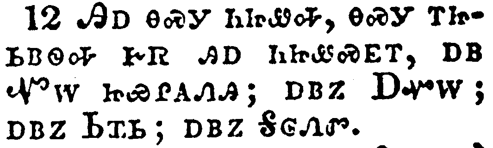
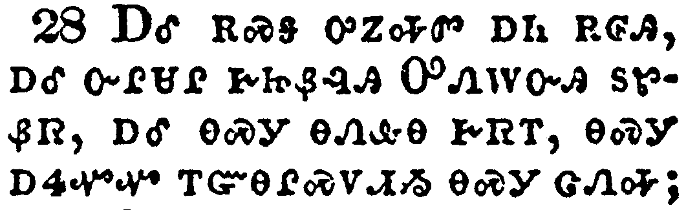

+++
draft=false
date = 2014-12-18T21:11:07Z
title = "1 Corinthians - Chapter 1 - Cherokee New Testament"
weight = 1418955067

[taxonomies]

authors = ["Timothy Legg"]
categories = []
tags = []

[extra]
+++

<table>
<tbody>
<tr class="odd">
<td></td>
</tr>
<tr class="even">
<td>Paul, called to be an apostle of Jesus Christ through the will of God, and Sosthenes our brother,</td>
</tr>
<tr class="odd">
<td>ᏉᎳ, ᎠᏆᏑᏰᏛ ᎠᎩᏅᏏᏛ ᏥᏌ ᎦᎶᏁᏛ, ᎾᏍᎩᏯ ᎤᏁᎳᏅᎯ ᎤᏓᏅᏖᎸᎢ, ᎠᎴ ᏐᏍᏗᏂ ᎢᎩᏅᏟ,</td>
</tr>
<tr class="even">
<td>Quo-la, a-qua-su-ye-dv a-gi-nv-si-dv Tsi-sa Ga-lo-ne-dv, na-s-gi-ya U-ne-la-nv-hi u-da-nv-te-lv-i, a-le So-s-di-ni i-gi-nv-tli,</td>
</tr>
</tbody>
</table>

<table>
<tbody>
<tr class="odd">
<td></td>
</tr>
<tr class="even">
<td>Unto the church of God which is at Corinth, to them that are sanctified in Christ Jesus, called to be saints, with all that in every place call upon the name of Jesus Christ our Lord, both theirs and ours:</td>
</tr>
<tr class="odd">
<td>ᏫᏨᏲᏪᎳᏏ ᏗᏣᏁᎶᏗ ᎢᏣᏓᏡᎬ ᎤᏁᎳᏅᎯ ᎤᏤᎵᎦ, ᎾᏍᎩ ᎪᎵᏂᏗᏱ ᏥᏣᏓᏡᎦ, ᎾᏍᎩ ᎢᏥᏍᎦᎾ ᏂᎨᏒᎾ ᎢᏰᏨᏁᎸᎯ ᏥᏌ ᎦᎶᏁᏛ ᎢᏳᏩᏂᏌᏛ, ᎡᏥᏯᏅᏛ ᎢᏣᏓᏅᏘ, ᎠᎴ ᎾᏂᎥ ᏂᎦᎥ ᏕᎨᏌᏗᏒ ᏥᏌ ᎦᎶᏁᏛ ᎢᎦᏤᎵ ᎤᎬᏫᏳᎯ ᏚᏙᎥ ᎠᏂᏁᎢᏍᏗᏍᎩ, ᎾᏍᎩ ᎢᏧᎳᏉ ᎾᏍᎩ ᎤᎾᏤᎵᎦ ᎠᎴ ᎠᏴ ᎢᎦᏤᎵᎦ;</td>
</tr>
<tr class="even">
<td>Wi-tsv-yo-we-la-si di-tsa-ne-lo-di i-tsa-da-tlu-gv U-ne-la-nv-hi u-tse-li-ga, na-s-gi Go-li-ni-di-yi tsi-tsa-da-tlu-ga, na-s-gi i-tsi-s-ga-na ni-ge-sv-na i-ye-tsv-ne-lv-hi Tsi-sa Ga-lo-ne-dv i-yu-wa-ni-sa-dv, e-tsi-ya-nv-dv i-tsa-da-nv-ti, a-le na-ni-v ni-ga-v de-ge-sa-di-sv Tsi-sa Ga-lo-ne-dv i-ga-tse-li U-gv-wi-yu-hi du-do-v a-ni-ne-i-s-di-s-gi, na-s-gi i-tsu-la-quo na-s-gi u-na-tse-li-ga a-le a-yv i-ga-tse-li-ga;</td>
</tr>
</tbody>
</table>

<table>
<tbody>
<tr class="odd">
<td></td>
</tr>
<tr class="even">
<td>Grace be unto you, and peace, from God our Father, and from the Lord Jesus Christ.</td>
</tr>
<tr class="odd">
<td>ᎢᏣᏤᎵ ᎨᏎᏍᏗ ᎬᏩᎦᏘᏯ ᎤᏓᏙᎵᏍᏗ ᎨᏒ ᎠᎴ ᏅᏩᏙᎯᏯᏛ ᎢᏣᎵᏍᎪᎸᏔᏁᎸᎯ ᎤᏁᎳᏅᎯ ᎢᎩᏙᏓ, ᎠᎴ ᎤᎬᏫᏳᎯ ᏥᏌ ᎦᎶᏁᏛ.</td>
</tr>
<tr class="even">
<td>I-tsa-tse-li ge-se-s-di gv-wa-ga-ti-ya u-da-do-li-s-di ge-sv a-le nv-wa-do-hi-ya-dv i-tsa-li-s-go-lv-ta-ne-lv-hi U-ne-la-nv-hi I-gi-do-da, a-le U-gv-wi-yu-hi Tsi-sa Ga-lo-ne-dv.</td>
</tr>
</tbody>
</table>

<table>
<tbody>
<tr class="odd">
<td></td>
</tr>
<tr class="even">
<td>I thank my God always on your behalf, for the grace of God which is given you by Jesus Christ;</td>
</tr>
<tr class="odd">
<td>ᏂᎪᎯᎸ ᏥᏯᎵᎡᎵᏤᎰ ᎤᏁᎳᏅᎯ ᎠᏆᏤᎵᎦ, ᏂᎯ ᎨᏒ ᎢᏳᏍᏗ, ᏅᏗᎦᎵᏍᏙᏗᏍᎪ ᎬᏩᎦᏘᏯ ᎤᏓᏙᎵᏍᏗ ᎨᏒ ᎤᏁᎳᏅᎯ, ᎾᏍᎩ ᏥᏌ ᎦᎶᏁᏛ ᎢᏳᏩᏂᏌᏛ ᎡᏥᏁᎸᎯ ᏥᎩ.</td>
</tr>
<tr class="even">
<td>Ni-go-hi-lv tsi-ya-li-e-li-tse-ho U-ne-la-nv-hi a-qua-tse-li-ga, ni-hi ge-sv i-yu-s-di, nv-di-ga-li-s-do-di-s-go gv-wa-ga-ti-ya u-da-do-li-s-di ge-sv U-ne-la-nv-hi, na-s-gi Tsi-sa Ga-lo-ne-dv i-yu-wa-ni-sa-dv e-tsi-ne-lv-hi tsi-gi.</td>
</tr>
</tbody>
</table>

<table>
<tbody>
<tr class="odd">
<td></td>
</tr>
<tr class="even">
<td>That in every thing ye are enriched by him, in all utterance, and in all knowledge;</td>
</tr>
<tr class="odd">
<td>ᎾᏍᎩ ᎢᏤᏅᎢᏍᏔᏅᎯ ᏥᎩ ᏂᎦᎥ ᏄᏓᎴᏒᎢ^ᏂᎦᎥ ᏗᏕᏲᏗ ᎨᏒ ᎠᎴ ᏂᎦᎥ ᎠᏕᏙᎥᎯᏍᏗ ᎨᏒᎢ;</td>
</tr>
<tr class="even">
<td>Na-s-gi i-tse-nv-i-s-ta-nv-hi tsi-gi ni-ga-v nu-da-le-sv-i^ni-ga-v di-de-yo-di ge-sv a-le ni-ga-v a-de-do-v-hi-s-di ge-sv-i;</td>
</tr>
</tbody>
</table>

<table>
<tbody>
<tr class="odd">
<td></td>
</tr>
<tr class="even">
<td>Even as the testimony of Christ was confirmed in you:</td>
</tr>
<tr class="odd">
<td>ᎾᏍᎩᏯ ᎦᎶᏁᏛ ᎠᏥᏃᎮᎸ ᎦᎪᎯᏳᏗ ᏁᏨᏁᎸᎢ;</td>
</tr>
<tr class="even">
<td>Na-s-gi-ya Ga-lo-ne-dv a-tsi-no-he-lv ga-go-hi-yu-di ne-tsv-ne-lv-i;</td>
</tr>
</tbody>
</table>

<table>
<tbody>
<tr class="odd">
<td></td>
</tr>
<tr class="even">
<td>So that ye come behind in no gift; waiting for the coming of our Lord Jesus Christ:</td>
</tr>
<tr class="odd">
<td>ᎾᏍᎩ ᎡᏍᎦ ᏂᏦᎭᏍᎬᎾ ᎨᏒ ᏑᏓᎴᎩ ᎤᏅ ᎬᏩᎦᏘᏯ ᎤᏓᎵᏍᎪᎸᏓᏁᏗ ᎨᏒᎢ; ᎢᏥᎦᏖᏃᎲ ᎤᎷᎯᏍᏗ ᎨᏒ ᎢᎦᏤᎵ ᎤᎬᏫᏳᎯ ᏥᏌ ᎦᎶᏁᏛ;</td>
</tr>
<tr class="even">
<td>Na-s-gi e-s-ga ni-tso-ha-s-gv-na ge-sv su-da-le-gi u-nv gv-wa-ga-ti-ya u-da-li-s-go-lv-da-ne-di ge-sv-i; i-tsi-ga-te-no-hv u-lu-hi-s-di ge-sv i-ga-tse-li U-gv-wi-yu-hi Tsi-sa Ga-lo-ne-dv;</td>
</tr>
</tbody>
</table>

<table>
<tbody>
<tr class="odd">
<td></td>
</tr>
<tr class="even">
<td>Who shall also confirm you unto the end, that ye may be blameless in the day of our Lord Jesus Christ.</td>
</tr>
<tr class="odd">
<td>ᎾᏍᎩ ᎾᏍᏉ ᏨᏓᏣᎵᏂᎪᎯᏍᏔᏂ ᎤᎵᏍᏆᏗᏍᏗ ᎨᏒ ᎬᏗᏍᎩ, ᎾᏍᎩ ᎦᏰᏧᎢᏍᏙᏗ ᏂᎨᏒᎾ ᎢᏳᎵᏍᏙᏗᏱ ᎾᎯᏳ ᎢᎦ ᎨᏎᏍᏗ ᎤᎬᏫᏳᎯ ᏥᏌ ᎦᎶᏁᏛ ᎤᏤᎵᎦ.</td>
</tr>
<tr class="even">
<td>Na-s-gi na-s-quo tsv-da-tsa-li-ni-go-hi-s-ta-ni u-li-s-qua-di-s-di ge-sv gv-di-s-gi, na-s-gi ga-ye-tsu-i-s-do-di ni-ge-sv-na i-yu-li-s-do-di-yi na-hi-yu i-ga ge-se-s-di U-gv-wi-yu-hi Tsi-sa Ga-lo-ne-dv u-tse-li-ga.</td>
</tr>
</tbody>
</table>

<table>
<tbody>
<tr class="odd">
<td></td>
</tr>
<tr class="even">
<td>God is faithful, by whom ye were called unto the fellowship of his Son Jesus Christ our Lord.</td>
</tr>
<tr class="odd">
<td>ᎤᏁᎳᏅᎯ ᏄᏓᎵᏓᏍᏛᎾ, ᎾᏍᎩ ᎢᏥᏯᏅᏛ ᏥᎩ ᎢᏣᎵᎪᏗᏱ ᎾᏍᎩ ᎤᏪᏥ ᏥᏌ ᎦᎶᏁᏛ ᎢᎦᏤᎵ ᎤᎬᏫᏳᎯ.</td>
</tr>
<tr class="even">
<td>U-ne-la-nv-hi nu-da-li-da-s-dv-na, na-s-gi i-tsi-ya-nv-dv tsi-gi i-tsa-li-go-di-yi na-s-gi U-we-tsi Tsi-sa Ga-lo-ne-dv i-ga-tse-li U-gv-wi-yu-hi.</td>
</tr>
</tbody>
</table>

<table>
<tbody>
<tr class="odd">
<td></td>
</tr>
<tr class="even">
<td>Now I beseech you, brethren, by the name of our Lord Jesus Christ, that ye all speak the same thing, and that there be no divisions among you; but that ye be perfectly joined together in the same mind and in the same judgment.</td>
</tr>
<tr class="odd">
<td>ᎾᏍᎩᏃ ᎢᏓᎵᏅᏟ ᎢᏨᏔᏲᏎᎭ ᏚᏙᎥ ᎬᏗᎭ ᎤᎬᏫᏳᎯ ᎢᎦᏤᎵᎦ ᏥᏌ ᎦᎶᏁᏛ, ᎾᏍᎩ ᎤᏠᏱᎭ ᎢᏥᏁᎢᏍᏗᏱ, ᎠᎴ ᏗᏣᎦᎴᏅᏗᏍᎩ ᏂᏤᎲᎾ ᎢᏳᎵᏍᏙᏗᏱ; ᎤᎧᎵᏨᎯᏉᏍᎩᏂ ᏗᏣᏚᏙᏙᏗᏱ ᎤᏠᏱᏉ ᎢᏣᏓᏅᏖᎵᏙᎲᎢ, ᎠᎴ ᎤᏠᏱᏉ ᏕᏧᎪᏗᏍᎬᎢ.</td>
</tr>
<tr class="even">
<td>Na-s-gi-no i-da-li-nv-tli i-tsv-ta-yo-se-ha du-do-v gv-di-ha U-gv-wi-yu-hi i-ga-tse-li-ga Tsi-sa Ga-lo-ne-dv, na-s-gi u-tlo-yi-ha i-tsi-ne-i-s-di-yi, a-le di-tsa-ga-le-nv-di-s-gi ni-tse-hv-na i-yu-li-s-do-di-yi; u-ka-li-tsv-hi-quo-s-gi-ni di-tsa-du-do-do-di-yi u-tlo-yi-quo i-tsa-da-nv-te-li-do-hv-i, a-le u-tlo-yi-quo de-tsu-go-di-s-gv-i.</td>
</tr>
</tbody>
</table>

<table>
<tbody>
<tr class="odd">
<td></td>
</tr>
<tr class="even">
<td>For it hath been declared unto me of you, my brethren, by them which are of the house of Chloe, that there are contentions among you.</td>
</tr>
<tr class="odd">
<td>ᎥᎩᏃᏁᎸᎯᏰᏃ ᎢᎩ ᎢᏓᎵᏅᏟ ᏂᎯ ᎡᏥᏃᎮᏍᎬᎢ, ᎾᏍᎩ ᏠᎢ ᏚᏓᏘᎾᎥ ᎨᏥᏃᎮᏍᎬᎢ, ᎾᏍᎩ ᏗᏥᏲᏍᏗ ᎨᏒ ᎢᏤᎲᎢ.</td>
</tr>
<tr class="even">
<td>V-gi-no-ne-lv-hi-ye-no i-gi i-da-li-nv-tli ni-hi e-tsi-no-he-s-gv-i, na-s-gi Tlo-i du-da-ti-na-v ge-tsi-no-he-s-gv-i, na-s-gi di-tsi-yo-s-di ge-sv i-tse-hv-i.</td>
</tr>
</tbody>
</table>

<table>
<tbody>
<tr class="odd">
<td></td>
</tr>
<tr class="even">
<td>Now this I say, that every one of you saith, I am of Paul; and I of Apollos; and I of Cephas; and I of Christ.</td>
</tr>
<tr class="odd">
<td>ᎯᎠ ᎾᏍᎩ ᏂᏥᏪᎭ, ᎾᏍᎩ ᎢᏥᏏᏴᏫᎭ ᎨᏒ ᎯᎠ ᏂᏥᏪᏍᎬᎢ, ᎠᏴ ᏉᎳ ᏥᏯᎵᎪᏁᎯ; ᎠᏴᏃ ᎠᏉᎳ; ᎠᏴᏃ ᏏᏆᏏ; ᎠᏴᏃ ᎦᎶᏁᏛ.</td>
</tr>
<tr class="even">
<td>Hi-a na-s-gi ni-tsi-we-ha, na-s-gi i-tsi-si-yv-wi-ha ge-sv hi-a ni-tsi-we-s-gv-i, a-yv Quo-la tsi-ya-li-go-ne-hi; a-yv-no A-quo-la; a-yv-no Si-qua-si; a-yv-no Ga-lo-ne-dv.</td>
</tr>
</tbody>
</table>

<table>
<tbody>
<tr class="odd">
<td></td>
</tr>
<tr class="even">
<td>Is Christ divided? was Paul crucified for you? or were ye baptized in the name of Paul?</td>
</tr>
<tr class="odd">
<td>ᎢᎸᏍᎩᏍᎪ ᎢᏯᏥᏛᎯ ᎦᎶᏁᏛ? ᏉᎳᏍᎪ ᏓᏓᎿᎭᏩᏍᏛ ᎠᎦᏛᏁ ᎢᏥᏍᏕᎸᏗᏱ? ᎠᎴᏍᎪ ᏉᎳ ᏚᏙᎥ ᏕᏣᏬᏍᏔᏁᎢ?</td>
</tr>
<tr class="even">
<td>I-lv-s-gi-s-go i-ya-tsi-dv-hi Ga-lo-ne-dv? Quo-la-s-go da-da-hna-wa-s-dv a-ga-dv-ne i-tsi-s-de-lv-di-yi? a-le-s-go Quo-la du-do-v de-tsa-wo-s-ta-ne-i?</td>
</tr>
</tbody>
</table>

<table>
<tbody>
<tr class="odd">
<td></td>
</tr>
<tr class="even">
<td>I thank God that I baptized none of you, but Crispus and Gaius;</td>
</tr>
<tr class="odd">
<td>ᎤᏁᎳᏅᎯ ᏥᏯᎵᎡᎵᏤᎭ ᏂᎦᎵᏍᏙᏗᎭ ᎾᏍᎩ ᎢᏤᎲ ᎩᎶ ᏂᏥᏯᏬᎥᎾ ᎨᏒ ᏟᏍᏆ ᎠᎴ ᎦᏯ ᎤᏅᏒ;</td>
</tr>
<tr class="even">
<td>U-ne-la-nv-hi tsi-ya-li-e-li-tse-ha ni-ga-li-s-do-di-ha na-s-gi i-tse-hv gi-lo ni-tsi-ya-wo-v-na ge-sv Tli-s-qua a-le Ga-ya u-nv-sv;</td>
</tr>
</tbody>
</table>

<table>
<tbody>
<tr class="odd">
<td></td>
</tr>
<tr class="even">
<td>Lest any should say that I had baptized in mine own name.</td>
</tr>
<tr class="odd">
<td>ᎩᎶᏰᏃ ᎤᏩᏒᏉ ᏚᏙᎥ ᏓᏓᏬᏍᏗᎭ, ᏱᎬᏉᏎᎭ.</td>
</tr>
<tr class="even">
<td>Gi-lo-ye-no u-wa-sv-quo du-do-v da-da-wo-s-di-ha, yi-gv-quo-se-ha.</td>
</tr>
</tbody>
</table>

<table>
<tbody>
<tr class="odd">
<td></td>
</tr>
<tr class="even">
<td>And I baptized also the household of Stephanas: besides, I know not whether I baptized any other.</td>
</tr>
<tr class="odd">
<td>ᎠᎴ ᎾᏍᏉ ᏍᏗᏇᎾ ᏚᏓᏘᎾᎥ ᏕᎦᏥᏯᏬᎥᎩ; ᏅᏩᏓᎴᏃ ᎥᏝ ᏱᏆᏅᏔ ᏥᏯᏬᎥᎢ.</td>
</tr>
<tr class="even">
<td>A-le na-s-quo S-di-que-na du-da-ti-na-v de-ga-tsi-ya-wo-v-gi; nv-wa-da-le-no v-tla yi-qua-nv-ta tsi-ya-wo-v-i.</td>
</tr>
</tbody>
</table>

<table>
<tbody>
<tr class="odd">
<td></td>
</tr>
<tr class="even">
<td>For Christ sent me not to baptize, but to preach the gospel: not with wisdom of words, lest the cross of Christ should be made of none effect.</td>
</tr>
<tr class="odd">
<td>ᎦᎶᏁᏛᏰᏃ ᎥᏝ ᏱᎩᏅᏎ ᏗᏆᏓᏬᏍᏗᏱ, ᎠᏆᎵᏥᏙᏗᏱᏍᎩᏂ ᎣᏍᏛ ᎧᏃᎮᏛ; ᎥᏝ ᎠᎵᏏᎾᎯᏍᏗ ᎨᏒ ᎦᏬᏂᎯᏍᏗᏱ ᎠᏋᏙᏗᏱ, ᎦᎶᏁᏛᏰᏃ ᎤᏤᎵ ᏧᏓᎿᎭᏩᏛ ᎠᏎᏉᏉ ᏱᏅᎦᎵᏍᏓ.</td>
</tr>
<tr class="even">
<td>Ga-lo-ne-dv-ye-no v-tla yi-gi-nv-se di-qua-da-wo-s-di-yi, a-qua-li-tsi-do-di-yi-s-gi-ni o-s-dv ka-no-he-dv; v-tla a-li-si-na-hi-s-di ge-sv ga-wo-ni-hi-s-di-yi a-quv-do-di-yi, Ga-lo-ne-dv-ye-no u-tse-li tsu-da-hna-wa-dv a-se-quo-quo yi-nv-ga-li-s-da.</td>
</tr>
</tbody>
</table>

<table>
<tbody>
<tr class="odd">
<td></td>
</tr>
<tr class="even">
<td>For the preaching of the cross is to them that perish foolishness; but unto us which are saved it is the power of God.</td>
</tr>
<tr class="odd">
<td>ᏓᏓᎿᎭᏩᏍᏛᏰᏃ ᎧᏃᎮᏗ ᎨᏒ ᎠᎵᏍᎦᏁᏛ ᎤᏂᏰᎸᎭ ᎾᏍᎩ Ꮎ ᏧᏂᏲᎱᎯᏍᏗ ᏥᎩ; ᎠᏴᏍᎩᏂ ᎡᎩᏍᏕᎸᏗ ᏥᎩ ᎤᏁᎳᏅᎯ ᎤᎵᏂᎬᎬ ᎢᎩᏰᎸᎯ.</td>
</tr>
<tr class="even">
<td>Da-da-hna-wa-s-dv-ye-no ka-no-he-di ge-sv a-li-s-ga-ne-dv u-ni-ye-lv-ha na-s-gi na tsu-ni-yo-hu-hi-s-di tsi-gi; a-yv-s-gi-ni e-gi-s-de-lv-di tsi-gi U-ne-la-nv-hi u-li-ni-gv-gv i-gi-ye-lv-hi.</td>
</tr>
</tbody>
</table>

<table>
<tbody>
<tr class="odd">
<td></td>
</tr>
<tr class="even">
<td>For it is written, I will destroy the wisdom of the wise, and will bring to nothing the understanding of the prudent.</td>
</tr>
<tr class="odd">
<td>ᎯᎠᏰᏃ ᏂᎬᏅ ᎢᎦᏪᎳ, ᏓᏥᏛᏔᏂ ᎠᏂᏏᎾᏒ ᎠᏂᏏᎾᏌᏂ, ᎠᎴ ᎠᏎᏉ ᏅᏓᎦᏥᏴᏁᎵ ᎠᏁᏯᏔᎯ ᎠᏁᏯᏔᎲᎢ.</td>
</tr>
<tr class="even">
<td>Hi-a-ye-no ni-gv-nv i-ga-we-la, da-tsi-dv-ta-ni a-ni-si-na-sv a-ni-si-na-sa-ni, a-le a-se-quo nv-da-ga-tsi-yv-ne-li a-ne-ya-ta-hi a-ne-ya-ta-hv-i.</td>
</tr>
</tbody>
</table>

<table>
<tbody>
<tr class="odd">
<td></td>
</tr>
<tr class="even">
<td>Where is the wise? where is the scribe? where is the disputer of this world? hath not God made foolish the wisdom of this world?</td>
</tr>
<tr class="odd">
<td>ᎭᏢ ᎠᏏᎾᏌᏂ? ᎭᏢ ᏗᎪᏪᎵᏍᎩ? ᎭᏢ ᎦᏬᏂᏍᎬ ᎠᏗᏒᎯᎯ ᎠᏂ ᎡᎶᎯ ᎡᎯ? ᏝᏍᎪ ᎤᏁᎳᏅᎯ ᎠᎵᏍᎦᏁᏛᏉ ᏱᏄᏩᏁᎸ ᎠᏏᎾᏌᏅ ᎡᎶᎯ?</td>
</tr>
<tr class="even">
<td>Ha-tlv a-si-na-sa-ni? ha-tlv di-go-we-li-s-gi? ha-tlv ga-wo-ni-s-gv a-di-sv-hi-hi a-ni e-lo-hi e-hi? tla-s-go U-ne-la-nv-hi a-li-s-ga-ne-dv-quo yi-nu-wa-ne-lv a-si-na-sa-nv e-lo-hi?</td>
</tr>
</tbody>
</table>

<table>
<tbody>
<tr class="odd">
<td></td>
</tr>
<tr class="even">
<td>For after that in the wisdom of God the world by wisdom knew not God, it pleased God by the foolishness of preaching to save them that believe.</td>
</tr>
<tr class="odd">
<td>ᎤᏁᎳᏅᎯᏰᏃ ᎠᏏᎾᏌᏂᏳ ᎨᏒ ᏥᏄᏩᏂᏌᏁ ᎡᎶᎯ ᎠᏂᏏᎾᏌᏅ ᎠᏅᏗᏍᎬ ᎤᏁᎳᏅᎯ ᏂᎬᏩᎦᏔᎲᎾ ᏥᎨᏎᎢ, ᎤᏁᎳᏅᎯ ᎣᏏ ᎤᏰᎸᏁ ᎠᎵᏍᎦᏁᏛ ᎠᎵᏥᏙᏗ ᎨᏒ ᎤᏮᏙᏗᏱ ᏧᏍᏕᎸᏗᏱ ᎠᏃᎯᏳᎲᏍᎩ.</td>
</tr>
<tr class="even">
<td>U-ne-la-nv-hi-ye-no a-si-na-sa-ni-yu ge-sv tsi-nu-wa-ni-sa-ne e-lo-hi a-ni-si-na-sa-nv a-nv-di-s-gv U-ne-la-nv-hi ni-gv-wa-ga-ta-hv-na tsi-ge-se-i, U-ne-la-nv-hi o-si u-ye-lv-ne a-li-s-ga-ne-dv a-li-tsi-do-di ge-sv u-wv-do-di-yi tsu-s-de-lv-di-yi a-no-hi-yu-hv-s-gi.</td>
</tr>
</tbody>
</table>

<table>
<tbody>
<tr class="odd">
<td></td>
</tr>
<tr class="even">
<td>For the Jews require a sign, and the Greeks seek after wisdom:</td>
</tr>
<tr class="odd">
<td>ᎠᏂᏧᏏᏰᏃ ᎤᏰᎸᏛ ᎠᏂᏔᏲᎯᎭ, ᎠᏂᎪᎢᏃ ᎠᏏᎾᏌᏂᏳ ᎨᏒ ᎤᏂᏲᎭ;</td>
</tr>
<tr class="even">
<td>A-ni-tsu-si-ye-no u-ye-lv-dv a-ni-ta-yo-hi-ha, A-ni-go-i-no a-si-na-sa-ni-yu ge-sv u-ni-yo-ha;</td>
</tr>
</tbody>
</table>

<table>
<tbody>
<tr class="odd">
<td></td>
</tr>
<tr class="even">
<td>But we preach Christ crucified, unto the Jews a stumblingblock, and unto the Greeks foolishness;</td>
</tr>
<tr class="odd">
<td>ᎠᏴᏍᎩᏂ ᎦᎶᏁᏛ ᏓᏓᎿᎭᏩᏍᏛ ᎠᎦᏛᏅᎯ ᎣᏣᎵᏥᏙᎲᏍᎦ, ᎾᏍᎩ ᎠᏂᏧᏏ ᏧᏃᏕᏍᏗᏍᎩ, ᎠᏂᎪᎢᏃ ᎠᎵᏍᎦᏁᏛ ᎤᏂᏰᎸᎯ;</td>
</tr>
<tr class="even">
<td>A-yv-s-gi-ni Ga-lo-ne-dv da-da-hna-wa-s-dv a-ga-dv-nv-hi o-tsa-li-tsi-do-hv-s-ga, na-s-gi A-ni-tsu-si tsu-no-de-s-di-s-gi, A-ni-go-i-no a-li-s-ga-ne-dv u-ni-ye-lv-hi;</td>
</tr>
</tbody>
</table>

<table>
<tbody>
<tr class="odd">
<td></td>
</tr>
<tr class="even">
<td>But unto them which are called, both Jews and Greeks, Christ the power of God, and the wisdom of God.</td>
</tr>
<tr class="odd">
<td>Ꮎ-ᏍᎩᏂ ᎨᏥᏯᏅᏛ ᏥᎩ, ᎢᏧᎳᏉ ᎠᏂᏧᏏ ᎠᎴ ᎠᏂᎪᎢ, ᎦᎶᏁᏛ ᎤᏁᎳᏅᎯ ᎤᎵᏂᎩᏗᏳ ᎨᏒ ᎠᎴ ᎠᏏᎾᏌᏂᏳ ᎨᏒ ᎤᏂᏰᎸᎯ.</td>
</tr>
<tr class="even">
<td>Na--s-gi-ni ge-tsi-ya-nv-dv tsi-gi, i-tsu-la-quo A-ni-tsu-si a-le A-ni-go-i, Ga-lo-ne-dv U-ne-la-nv-hi u-li-ni-gi-di-yu ge-sv a-le a-si-na-sa-ni-yu ge-sv u-ni-ye-lv-hi.</td>
</tr>
</tbody>
</table>

<table>
<tbody>
<tr class="odd">
<td></td>
</tr>
<tr class="even">
<td>Because the foolishness of God is wiser than men; and the weakness of God is stronger than men.</td>
</tr>
<tr class="odd">
<td>ᎠᎵᏍᎦᏁᏛᏰᏃ ᎤᏁᎳᏅᎯ ᎤᏤᎵ ᎤᏟ ᎾᏏᎾᎯ ᎡᏍᎦᏉ ᏴᏫ; ᎠᎴ ᎠᏩᎾᎦᎳ ᎨᏒ ᎤᏁᎳᏅᎯ ᎤᏤᎵ ᎤᏟ ᏄᎵᏂᎬᎦ ᎡᏍᎦᏉ ᏴᏫ.</td>
</tr>
<tr class="even">
<td>A-li-s-ga-ne-dv-ye-no U-ne-la-nv-hi u-tse-li u-tli na-si-na-hi e-s-ga-quo yv-wi; a-le a-wa-na-ga-la ge-sv U-ne-la-nv-hi u-tse-li u-tli nu-li-ni-gv-ga e-s-ga-quo yv-wi.</td>
</tr>
</tbody>
</table>

<table>
<tbody>
<tr class="odd">
<td></td>
</tr>
<tr class="even">
<td>For ye see your calling, brethren, how that not many wise men after the flesh, not many mighty, not many noble, are called:</td>
</tr>
<tr class="odd">
<td>ᎢᏥᎪᏩᏗᎭᏰᏃ, ᎢᏓᎵᏅᏟ, ᏄᏍᏛ ᎡᏥᏯᏅᎲᎢ, ᎾᏍᎩ ᎥᏝ ᏳᏂᏣᏔ ᎠᏂᏏᎾᏌᏂ ᎤᏇᏓᎵ ᎤᎬᏩᎵ ᎨᏒᎢ, ᎥᏝ ᎠᎴ ᏳᏂᏣᏔ ᏧᎾᎵᏂᎩᏛ, ᎥᏝ ᎠᎴ ᏳᏂᏣᏔ ᎨᏥᎸᏉᏗ;</td>
</tr>
<tr class="even">
<td>I-tsi-go-wa-di-ha-ye-no, i-da-li-nv-tli, nu-s-dv e-tsi-ya-nv-hv-i, na-s-gi v-tla yu-ni-tsa-ta a-ni-si-na-sa-ni u-que-da-li u-gv-wa-li ge-sv-i, v-tla a-le yu-ni-tsa-ta tsu-na-li-ni-gi-dv, v-tla a-le yu-ni-tsa-ta ge-tsi-lv-quo-di;</td>
</tr>
</tbody>
</table>

<table>
<tbody>
<tr class="odd">
<td></td>
</tr>
<tr class="even">
<td>But God hath chosen the foolish things of the world to confound the wise; and God hath chosen the weak things of the world to confound the things which are mighty;</td>
</tr>
<tr class="odd">
<td>ᎤᏁᎳᏅᎯᏍᎩᏂ ᏚᏑᏰᏒ ᎤᎾᎵᏍᎦᏂᏍᏛ ᎨᏥᏰᎸᎯ ᎠᏁ ᎡᎶᎯ, ᎾᏍᎩ ᏧᏕᎰᎯᏍᏙᏗᏱ ᎠᏂᎦᏔᎾᎢ; ᎠᎴ ᎤᏁᎳᏅᎯ ᏚᏑᏰᏒ ᎠᏂᏩᎾᎦᎳ ᎨᏥᏰᎸᎯ ᎠᏂ ᎡᎶᎯ, ᎾᏍᎩ ᏧᏕᎰᎯᏍᏙᏗᏱ ᏧᎾᎵᏂᎩᏛ;</td>
</tr>
<tr class="even">
<td>U-ne-la-nv-hi-s-gi-ni du-su-ye-sv u-na-li-s-ga-ni-s-dv ge-tsi-ye-lv-hi a-ne e-lo-hi, na-s-gi tsu-de-ho-hi-s-do-di-yi a-ni-ga-ta-na-i; a-le U-ne-la-nv-hi du-su-ye-sv a-ni-wa-na-ga-la ge-tsi-ye-lv-hi a-ni e-lo-hi, na-s-gi tsu-de-ho-hi-s-do-di-yi tsu-na-li-ni-gi-dv;</td>
</tr>
</tbody>
</table>

<table>
<tbody>
<tr class="odd">
<td></td>
</tr>
<tr class="even">
<td>And base things of the world, and things which are despised, hath God chosen, yea, and things which are not, to bring to nought things that are:</td>
</tr>
<tr class="odd">
<td>ᎠᎴ ᎡᏍᎦ ᎤᏃᎭᏛ ᎠᏂ ᎡᎶᎯ, ᎠᎴ ᏅᎵᏌᎵ ᎨᏥᏰᎸᎯ ᎤᏁᎳᏅᎯ ᏚᏑᏰᏒ, ᎠᎴ ᎾᏍᎩ ᎾᏁᎲᎾ ᎨᏒᎢ, ᎾᏍᎩ ᎠᏎᏉᏉ ᎢᏳᎾᎵᏍᏙᏗᏱ ᎾᏍᎩ ᏣᏁᎭ;</td>
</tr>
<tr class="even">
<td>A-le e-s-ga u-no-ha-dv a-ni e-lo-hi, a-le nv-li-sa-li ge-tsi-ye-lv-hi U-ne-la-nv-hi du-su-ye-sv, a-le na-s-gi na-ne-hv-na ge-sv-i, na-s-gi a-se-quo-quo i-yu-na-li-s-do-di-yi na-s-gi tsa-ne-ha;</td>
</tr>
</tbody>
</table>

<table>
<tbody>
<tr class="odd">
<td></td>
</tr>
<tr class="even">
<td>That no flesh should glory in his presence.</td>
</tr>
<tr class="odd">
<td>ᎾᏍᎩ ᎩᎶ ᎤᏇᏓᎵ ᎨᏒ ᎤᏢᏈᏍᏗᏱ ᏂᎨᏒᎾ ᎾᏍᎩ ᎠᎦᏔᎲᎢ.</td>
</tr>
<tr class="even">
<td>Na-s-gi gi-lo u-que-da-li ge-sv u-tlv-qui-s-di-yi ni-ge-sv-na na-s-gi a-ga-ta-hv-i.</td>
</tr>
</tbody>
</table>

<table>
<tbody>
<tr class="odd">
<td></td>
</tr>
<tr class="even">
<td>But of him are ye in Christ Jesus, who of God is made unto us wisdom, and righteousness, and sanctification, and redemption:</td>
</tr>
<tr class="odd">
<td>ᏂᎯᏍᎩᏂ ᎾᏍᎩ ᎢᏥᎾᏄᎪᏫᏒᎯ ᎢᎩ, ᏥᏌ ᎦᎶᏁᏛ ᎢᏳᏩᏂᏌᏛ, ᎾᏍᎩ ᎠᎦᏙᎥᎯᏍᏗ ᎨᏒ ᎠᎴ ᏚᏳᎪᏛ ᎨᏒ ᎠᎴ ᎾᏍᎦᏅᎾ ᎢᎬᏁᏗ ᎨᏒ, ᎠᎴ ᎠᎫᏴᏙᏗ ᎨᏒ, ᎠᏴ ᎢᎬᏁᎸᎯ ᏥᎩ ᎤᏁᎳᏅᎯ;</td>
</tr>
<tr class="even">
<td>Ni-hi-s-gi-ni na-s-gi i-tsi-na-nu-go-wi-sv-hi i-gi, Tsi-sa Ga-lo-ne-dv i-yu-wa-ni-sa-dv, na-s-gi a-ga-do-v-hi-s-di ge-sv a-le du-yu-go-dv ge-sv a-le na-s-ga-nv-na i-gv-ne-di ge-sv, a-le a-gu-yv-do-di ge-sv, a-yv i-gv-ne-lv-hi tsi-gi U-ne-la-nv-hi;</td>
</tr>
</tbody>
</table>

<table>
<tbody>
<tr class="odd">
<td></td>
</tr>
<tr class="even">
<td>That, according as it is written, He that glorieth, let him glory in the Lord.</td>
</tr>
<tr class="odd">
<td>ᎾᏍᎩᏯ ᎯᎠ ᏥᏂᎬᏅ ᏥᎪᏪᎳ, ᎩᎶ ᎠᏢᏈᏍᎨᏍᏗ ᏱᎰᏩ ᎠᏢᏆᏍᏙᏗᏍᎨᏍᏗ.</td>
</tr>
<tr class="even">
<td>Na-s-gi-ya hi-a tsi-ni-gv-nv tsi-go-we-la, Gi-lo a-tlv-qui-s-ge-s-di Yi-ho-wa a-tlv-qua-s-do-di-s-ge-s-di.</td>
</tr>
</tbody>
</table>

