+++
draft=false
date = 2014-12-18T21:11:07Z
title = "1 Corinthians - Chapter 6 - Cherokee New Testament"
weight = 1418955067

[taxonomies]

authors = ["Timothy Legg"]
categories = []
tags = []

[extra]
+++

<table>
<tbody>
<tr class="odd">
<td><a href="070601.png">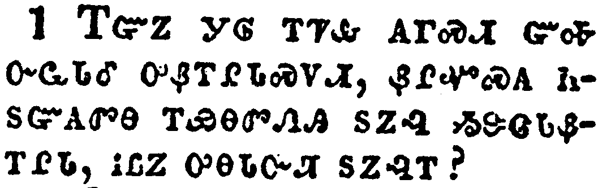</a></td>
</tr>
<tr class="even">
<td>Dare any of you, having a matter against another, go to law before the unjust, and not before the saints?</td>
</tr>
<tr class="odd">
<td>ᎢᏳᏃ ᎩᎶ ᎢᏤᎲ ᎪᎱᏍᏗ ᏳᎭ ᏅᏩᏓᎴ ᎤᏰᎢᎵᏓᏍᏙᏗ, ᏰᎵᏉᏍᎪ ᏂᏚᏳᎪᏛᎾ ᎢᏯᎾᏛᏁᎯ ᏚᏃᎸ ᏱᏕᏣᏓᏰᎢᎵᏓ, ᎥᏝᏃ ᎤᎾᏓᏅᏘ ᏚᏃᎸᎢ?</td>
</tr>
<tr class="even">
<td>I-yu-no gi-lo i-tse-hv go-hu-s-di yu-ha nv-wa-da-le u-ye-i-li-da-s-do-di, ye-li-quo-s-go ni-du-yu-go-dv-na i-ya-na-dv-ne-hi du-no-lv yi-de-tsa-da-ye-i-li-da, v-tla-no u-na-da-nv-ti du-no-lv-i?</td>
</tr>
</tbody>
</table>

<table>
<tbody>
<tr class="odd">
<td><a href="070602.png">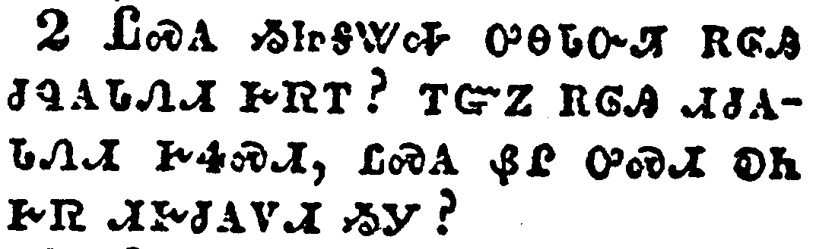</a></td>
</tr>
<tr class="even">
<td>Do ye not know that the saints shall judge the world? and if the world shall be judged by you, are ye unworthy to judge the smallest matters?</td>
</tr>
<tr class="odd">
<td>ᏝᏍᎪ ᏱᏥᎦᏔᎭ ᎤᎾᏓᏅᏘ ᎡᎶᎯ ᏧᏄᎪᏓᏁᏗ ᎨᏒᎢ? ᎢᏳᏃ ᎡᎶᎯ ᏗᏧᎪᏓᏁᏗ ᎨᏎᏍᏗ, ᏝᏍᎪ ᏰᎵ ᎤᏍᏗ ᎧᏂ ᎨᏒ ᏗᎨᏧᎪᏙᏗ ᏱᎩ?</td>
</tr>
<tr class="even">
<td>Tla-s-go yi-tsi-ga-ta-ha u-na-da-nv-ti e-lo-hi tsu-nu-go-da-ne-di ge-sv-i? i-yu-no e-lo-hi di-tsu-go-da-ne-di ge-se-s-di, tla-s-go ye-li u-s-di ka-ni ge-sv di-ge-tsu-go-do-di yi-gi?</td>
</tr>
</tbody>
</table>

<table>
<tbody>
<tr class="odd">
<td><a href="070603.png">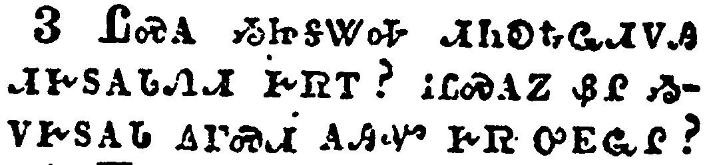</a></td>
</tr>
<tr class="even">
<td>Know ye not that we shall judge angels? how much more things that pertain to this life?</td>
</tr>
<tr class="odd">
<td>ᏝᏍᎪ ᏱᏥᎦᏔᎭ ᏗᏂᎧᎿᎭᏩᏗᏙᎯ ᏗᎨᏚᎪᏓᏁᏗ ᎨᏒᎢ? ᎥᏝᏍᎪᏃ ᏰᎵ ᏱᏙᎨᏚᎪᏓ ᎪᎱᏍᏗ ᎪᎯᏉ ᎨᏒ ᎤᎬᏩᎵ?</td>
</tr>
<tr class="even">
<td>Tla-s-go yi-tsi-ga-ta-ha di-ni-ka-hna-wa-di-do-hi di-ge-du-go-da-ne-di ge-sv-i? v-tla-s-go-no ye-li yi-do-ge-du-go-da go-hu-s-di go-hi-quo ge-sv u-gv-wa-li?</td>
</tr>
</tbody>
</table>

<table>
<tbody>
<tr class="odd">
<td><a href="070604.png">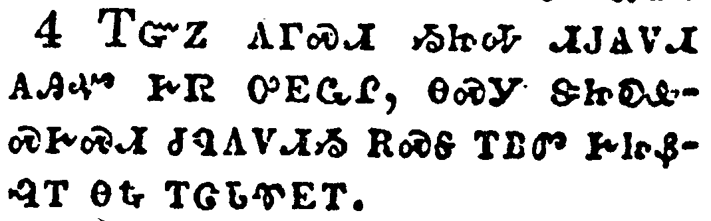</a></td>
</tr>
<tr class="even">
<td>If then ye have judgments of things pertaining to this life, set them to judge who are least esteemed in the church.</td>
</tr>
<tr class="odd">
<td>ᎢᏳᏃ ᎪᎱᏍᏗ ᏱᏥᎭ ᏗᎫᎪᏙᏗ ᎪᎯᏉ ᎨᏒ ᎤᎬᏩᎵ, ᎾᏍᎩ ᏕᏥᎧᎲᏍᎨᏍᏗ ᏧᏄᎪᏙᏗᏱ ᎡᏍᎦ ᎢᏴᏛ ᎨᏥᏰᎸᎢ ᎾᎿᎭᎢᏣᏓᏡᎬᎢ.</td>
</tr>
<tr class="even">
<td>I-yu-no go-hu-s-di yi-tsi-ha di-gu-go-do-di go-hi-quo ge-sv u-gv-wa-li, na-s-gi de-tsi-ka-hv-s-ge-s-di tsu-nu-go-do-di-yi e-s-ga i-yv-dv ge-tsi-ye-lv-i na-hna i-tsa-da-tlu-gv-i.</td>
</tr>
</tbody>
</table>

<table>
<tbody>
<tr class="odd">
<td><a href="070605.png">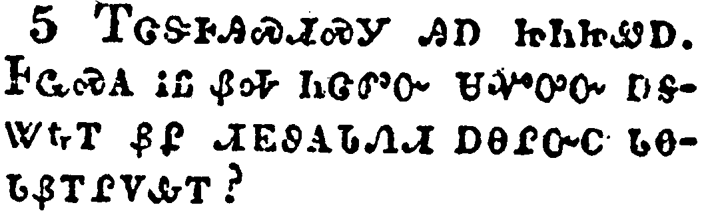</a></td>
</tr>
<tr class="even">
<td>I speak to your shame. Is it so, that there is not a wise man among you? no, not one that shall be able to judge between his brethren?</td>
</tr>
<tr class="odd">
<td>ᎢᏣᏕᎰᎯᏍᏗᏍᎩ ᎯᎠ ᏥᏂᏥᏪᎠ. ᎰᏩᏍᎪ ᎥᏝ ᏰᎭ ᏂᏣᏛᏅ ᏌᏉᎤᏅ ᎠᎦᏔᎿᎭᎢ ᏰᎵ ᏗᎬᏭᎪᏓᏁᏗ ᎠᏁᎵᏅᏟ ᏓᎾᏓᏰᎢᎵᏙᎲᎢ?</td>
</tr>
<tr class="even">
<td>I-tsa-de-ho-hi-s-di-s-gi hi-a tsi-ni-tsi-we-a. Ho-wa-s-go v-tla ye-ha ni-tsa-dv-nv sa-quo-u-nv a-ga-ta-hna-i ye-li di-gv-wu-go-da-ne-di a-ne-li-nv-tli da-na-da-ye-i-li-do-hv-i?</td>
</tr>
</tbody>
</table>

<table>
<tbody>
<tr class="odd">
<td></td>
</tr>
<tr class="even">
<td>But brother goeth to law with brother, and that before the unbelievers.</td>
</tr>
<tr class="odd">
<td>ᎠᎾᎵᏅᏟᏍᎩᏂ ᏓᎾᏓᏰᎢᎵᏙᎭ ᎤᏅᏒ, ᎠᎴ ᎾᏍᎩ ᏚᏃᎸ ᏄᏃᎯᏳᏒᎾ.</td>
</tr>
<tr class="even">
<td>A-na-li-nv-tli-s-gi-ni da-na-da-ye-i-li-do-ha u-nv-sv, a-le na-s-gi du-no-lv nu-no-hi-yu-sv-na.</td>
</tr>
</tbody>
</table>

<table>
<tbody>
<tr class="odd">
<td><a href="070607.png">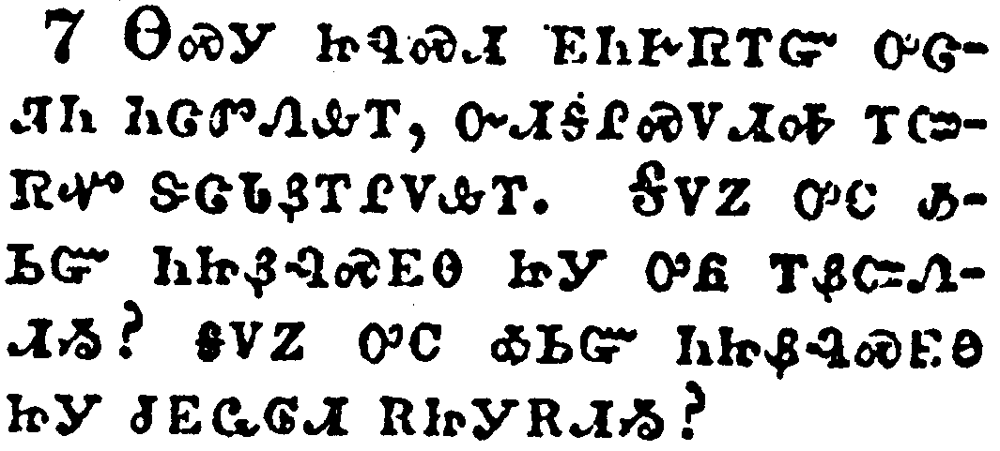</a></td>
</tr>
<tr class="even">
<td>Now therefore there is utterly a fault among you, because ye go to law one with another. Why do ye not rather take wrong? why do ye not rather suffer yourselves to be defrauded?</td>
</tr>
<tr class="odd">
<td>ᎾᏍᎩ ᏥᏄᏍᏗ ᎬᏂᎨᏒᎢᏳ ᎤᏣᏘᏂ ᏂᏣᏛᏁᎲᎢ, ᏅᏗᎦᎵᏍᏙᏗᎭ ᎢᏨᏒᏉ ᏕᏣᏓᏰᎢᎵᏙᎲᎢ. ᎦᏙᏃ ᎤᏟ ᎣᏏᏳ ᏂᏥᏰᎸᏍᎬᎾ ᏥᎩ ᎤᏲ ᎢᏰᏨᏁᏗᏱ? ᎦᏙᏃ ᎤᏟ ᎣᏏᏳ ᏂᏥᏰᎸᏍᎬᎾ ᏥᎩ ᏧᎬᏩᎶᏗ ᎡᏥᎩᎡᏗᏱ?</td>
</tr>
<tr class="even">
<td>Na-s-gi tsi-nu-s-di gv-ni-ge-sv-i-yu u-tsa-ti-ni ni-tsa-dv-ne-hv-i, nv-di-ga-li-s-do-di-ha i-tsv-sv-quo de-tsa-da-ye-i-li-do-hv-i. Ga-do-no u-tli o-si-yu ni-tsi-ye-lv-s-gv-na tsi-gi u-yo i-ye-tsv-ne-di-yi? ga-do-no u-tli o-si-yu ni-tsi-ye-lv-s-gv-na tsi-gi tsu-gv-wa-lo-di e-tsi-gi-e-di-yi?</td>
</tr>
</tbody>
</table>

<table>
<tbody>
<tr class="odd">
<td><a href="070608.png">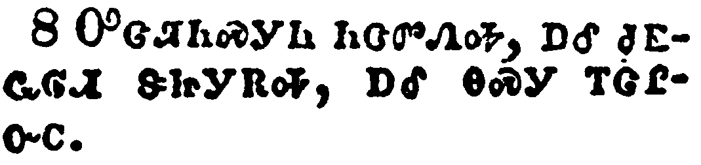</a></td>
</tr>
<tr class="even">
<td>Nay, ye do wrong, and defraud, and that your brethren.</td>
</tr>
<tr class="odd">
<td>ᎤᏣᏘᏂᏍᎩᏂ ᏂᏣᏛᏁᎭ, ᎠᎴ ᏧᎬᏩᎶᏗ ᏕᏥᎩᎡᎭ, ᎠᎴ ᎾᏍᎩ ᎢᏣᎵᏅᏟ.</td>
</tr>
<tr class="even">
<td>U-tsa-ti-ni-s-gi-ni ni-tsa-dv-ne-ha, a-le tsu-gv-wa-lo-di de-tsi-gi-e-ha, a-le na-s-gi i-tsa-li-nv-tli.</td>
</tr>
</tbody>
</table>

<table>
<tbody>
<tr class="odd">
<td><a href="070609.png">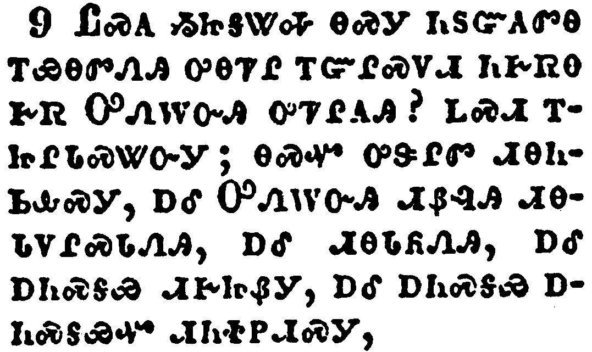</a></td>
</tr>
<tr class="even">
<td>Know ye not that the unrighteous shall not inherit the kingdom of God? Be not deceived: neither fornicators, nor idolaters, nor adulterers, nor effeminate, nor abusers of themselves with mankind,</td>
</tr>
<tr class="odd">
<td>ᏝᏍᎪ ᏱᏥᎦᏔᎭ ᎾᏍᎩ ᏂᏚᏳᎪᏛᎾ ᎢᏯᎾᏛᏁᎯ ᎤᎾᏤᎵ ᎢᏳᎵᏍᏙᏗ ᏂᎨᏒᎾ ᎨᏒ ᎤᏁᎳᏅᎯ ᎤᏤᎵᎪᎯ? ᏞᏍᏗ ᎢᏥᎵᏓᏍᏔᏅᎩ; ᎾᏍᏉ ᎤᏕᎵᏛ ᏗᎾᏂᏏᎲᏍᎩ, ᎠᎴ ᎤᏁᎳᏅᎯ ᏗᏰᎸᎯ ᏗᎾᏓᏙᎵᏍᏓᏁᎯ, ᎠᎴ ᏗᎾᏓᏲᏁᎯ, ᎠᎴ ᎠᏂᏍᎦᏯ ᏗᎨᏥᏰᎩ, ᎠᎴ ᎠᏂᏍᎦᏯ ᎠᏂᏍᎦᏯᏉ ᏗᏂᏐᏢᏗᏍᎩ,</td>
</tr>
<tr class="even">
<td>Tla-s-go yi-tsi-ga-ta-ha na-s-gi ni-du-yu-go-dv-na i-ya-na-dv-ne-hi u-na-tse-li i-yu-li-s-do-di ni-ge-sv-na ge-sv U-ne-la-nv-hi u-tse-li-go-hi? tle-s-di i-tsi-li-da-s-ta-nv-gi; na-s-quo u-de-li-dv di-na-ni-si-hv-s-gi, a-le U-ne-la-nv-hi di-ye-lv-hi di-na-da-do-li-s-da-ne-hi, a-le di-na-da-yo-ne-hi, a-le a-ni-s-ga-ya di-ge-tsi-ye-gi, a-le a-ni-s-ga-ya a-ni-s-ga-ya-quo di-ni-so-tlv-di-s-gi,</td>
</tr>
</tbody>
</table>

<table>
<tbody>
<tr class="odd">
<td><a href="070610.png">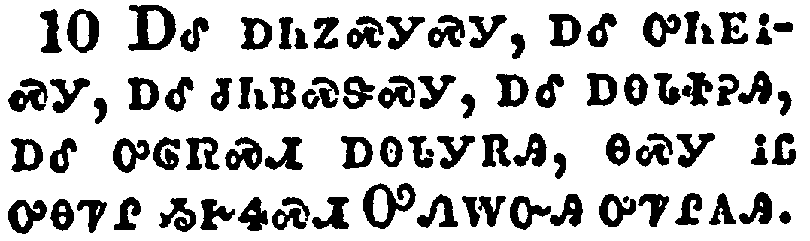</a></td>
</tr>
<tr class="even">
<td>Nor thieves, nor covetous, nor drunkards, nor revilers, nor extortioners, shall inherit the kingdom of God.</td>
</tr>
<tr class="odd">
<td>ᎠᎴ ᎠᏂᏃᏍᎩᏍᎩ, ᎠᎴ ᎤᏂᎬᎥᏍᎩ, ᎠᎴ ᏧᏂᏴᏍᏕᏍᎩ, ᎠᎴ ᎠᎾᏓᏐᎮᎯ, ᎠᎴ ᎤᎶᏒᏍᏗ ᎠᎾᏓᎩᎡᎯ, ᎾᏍᎩ ᎥᏝ ᎤᎾᏤᎵ ᏱᎨᏎᏍᏗ ᎤᏁᎳᏅᎯ ᎤᏤᎵᎪᎯ.</td>
</tr>
<tr class="even">
<td>A-le a-ni-no-s-gi-s-gi, a-le u-ni-gv-v-s-gi, a-le tsu-ni-yv-s-de-s-gi, a-le a-na-da-so-he-hi, a-le u-lo-sv-s-di a-na-da-gi-e-hi, na-s-gi v-tla u-na-tse-li yi-ge-se-s-di U-ne-la-nv-hi u-tse-li-go-hi.</td>
</tr>
</tbody>
</table>

<table>
<tbody>
<tr class="odd">
<td><a href="070611.png">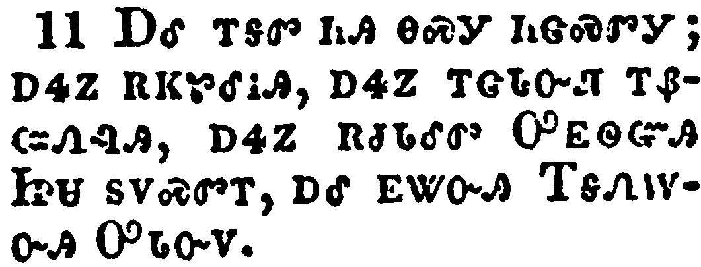</a></td>
</tr>
<tr class="even">
<td>And such were some of you: but ye are washed, but ye are sanctified, but ye are justified in the name of the Lord Jesus, and by the Spirit of our God.</td>
</tr>
<tr class="odd">
<td>ᎠᎴ ᎢᎦᏛ ᏂᎯ ᎾᏍᎩ ᏂᏣᏍᏛᎩ; ᎠᏎᏃ ᎡᏦᏑᎴᎥᎯ, ᎠᏎᏃ ᎢᏣᏓᏅᏘ ᎢᏰᏨᏁᎸᎯ, ᎠᏎᏃ ᎡᏧᏓᎴᏛ ᎤᎬᏫᏳᎯ ᏥᏌ ᏚᏙᏍᏛᎢ, ᎠᎴ ᎬᏔᏅᎯ ᎢᎦᏁᎳᏅᎯ ᎤᏓᏅᏙ.</td>
</tr>
<tr class="even">
<td>A-le i-ga-dv ni-hi na-s-gi ni-tsa-s-dv-gi; a-se-no e-tso-su-le-v-hi, a-se-no i-tsa-da-nv-ti i-ye-tsv-ne-lv-hi, a-se-no e-tsu-da-le-dv U-gv-wi-yu-hi Tsi-sa du-do-s-dv-i, a-le gv-ta-nv-hi I-ga-ne-la-nv-hi U-da-nv-do.</td>
</tr>
</tbody>
</table>

<table>
<tbody>
<tr class="odd">
<td><a href="070612.png">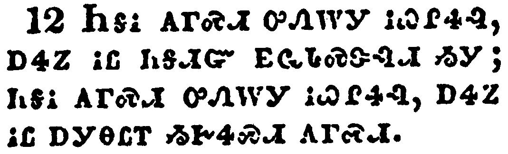</a></td>
</tr>
<tr class="even">
<td>All things are lawful unto me, but all things are not expedient: all things are lawful for me, but I will not be brought under the power of any.</td>
</tr>
<tr class="odd">
<td>ᏂᎦᎥ ᎪᎱᏍᏗ ᎤᏁᎳᎩ ᎥᏇᎵᏎᎸ, ᎠᏎᏃ ᎥᏝ ᏂᎦᏗᏳ ᎬᏩᏓᏍᏕᎸᏗ ᏱᎩ; ᏂᎦᎥ ᎪᎱᏍᏗ ᎤᏁᎳᎩ ᎥᏇᎵᏎᎸ, ᎠᏎᏃ ᎥᏝ ᎠᎩᎾᏝᎢ ᏱᎨᏎᏍᏗ ᎪᎱᏍᏗ.</td>
</tr>
<tr class="even">
<td>Ni-ga-v go-hu-s-di u-ne-la-gi v-que-li-se-lv, a-se-no v-tla ni-ga-di-yu gv-wa-da-s-de-lv-di yi-gi; ni-ga-v go-hu-s-di u-ne-la-gi v-que-li-se-lv, a-se-no v-tla a-gi-na-tla-i yi-ge-se-s-di go-hu-s-di.</td>
</tr>
</tbody>
</table>

<table>
<tbody>
<tr class="odd">
<td></td>
</tr>
<tr class="even">
<td>Meats for the belly, and the belly for meats: but God shall destroy both it and them. Now the body is not for fornication, but for the Lord; and the Lord for the body.</td>
</tr>
<tr class="odd">
<td>ᎠᎵᏍᏓᏴᏗ ᎤᏍᏉᎵᏱ ᎤᎬᏩᎵ ᎪᏢᏅᎯ, ᎠᎴ ᎤᏍᏉᎵᏱ ᎠᎵᏍᏓᏴᏗ ᎤᎬᏩᎵ ᎪᏢᏅᎯ; ᎠᏎᏃ ᎤᏁᎳᏅᎯ ᏙᏛᏛᏔᏂ ᎢᏧᎳ ᎤᏍᏉᎵᎩ ᎠᎴ ᎠᎵᏍᏓᏴᏗ. ᎠᏰᎸᏃ ᎥᏝ ᎤᏕᎵᏛ ᏗᏂᏏᏗ ᎨᏒ ᎤᎬᏩᎵ ᎪᏢᏅᎯ ᏱᎩ, ᎤᎬᏫᏳᎯᏍᎩᏂ ᎤᎬᏩᎵ ᎪᏢᏅᎯ; ᎠᎴ ᎤᎬᏫᏳᎯ ᎠᏰᎵ ᎤᎬᏩᎵ ᎠᎵᏍᎪᎸᏔᏅᎯ.</td>
</tr>
<tr class="even">
<td>A-li-s-da-yv-di u-s-quo-li-yi u-gv-wa-li go-tlv-nv-hi, a-le u-s-quo-li-yi a-li-s-da-yv-di u-gv-wa-li go-tlv-nv-hi; a-se-no U-ne-la-nv-hi do-dv-dv-ta-ni i-tsu-la u-s-quo-li-gi a-le a-li-s-da-yv-di. A-ye-lv-no v-tla u-de-li-dv di-ni-si-di ge-sv u-gv-wa-li go-tlv-nv-hi yi-gi, U-gv-wi-yu-hi-s-gi-ni u-gv-wa-li go-tlv-nv-hi; a-le U-gv-wi-yu-hi a-ye-li u-gv-wa-li a-li-s-go-lv-ta-nv-hi.</td>
</tr>
</tbody>
</table>

<table>
<tbody>
<tr class="odd">
<td><a href="070614.png">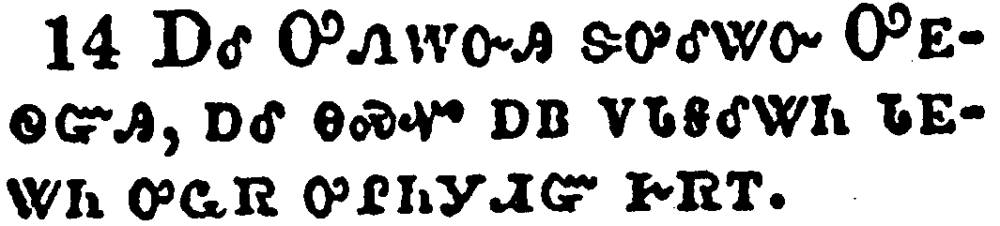</a></td>
</tr>
<tr class="even">
<td>And God hath both raised up the Lord, and will also raise up us by his own power.</td>
</tr>
<tr class="odd">
<td>ᎠᎴ ᎤᏁᎳᏅᎯ ᏕᎤᎴᏔᏅ ᎤᎬᏫᏳᎯ, ᎠᎴ ᎾᏍᏉ ᎠᏴ ᏙᏓᎦᎴᏔᏂ ᏓᎬᏔᏂ ᎤᏩᏒ ᎤᎵᏂᎩᏗᏳ ᎨᏒᎢ.</td>
</tr>
<tr class="even">
<td>A-le U-ne-la-nv-hi de-u-le-ta-nv U-gv-wi-yu-hi, a-le na-s-quo a-yv do-da-ga-le-ta-ni da-gv-ta-ni u-wa-sv u-li-ni-gi-di-yu ge-sv-i.</td>
</tr>
</tbody>
</table>

<table>
<tbody>
<tr class="odd">
<td><a href="070615.png">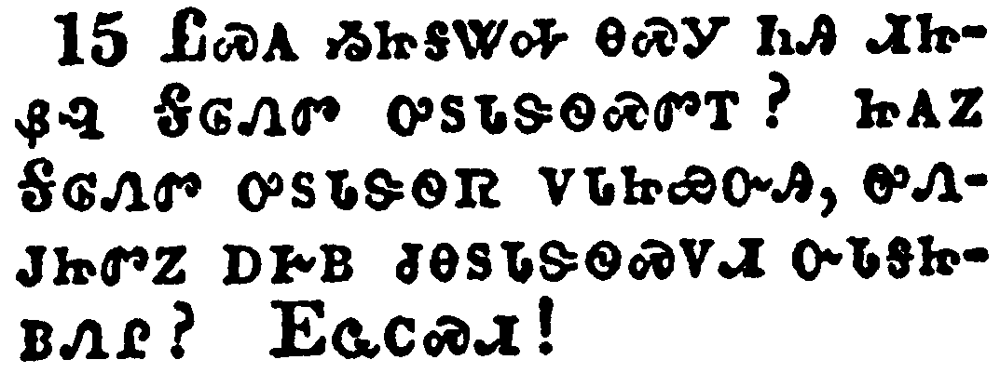</a></td>
</tr>
<tr class="even">
<td>Know ye not that your bodies are the members of Christ? shall I then take the members of Christ, and make them the members of an harlot? God forbid.</td>
</tr>
<tr class="odd">
<td>ᏝᏍᎪ ᏱᏥᎦᏔᎭ ᎾᏍᎩ ᏂᎯ ᏗᏥᏰᎸ ᎦᎶᏁᏛ ᎤᏚᏓᏕᏫᏍᏛᎢ? ᏥᎪᏃ ᎦᎶᏁᏛ ᎤᏚᏓᏕᏫᏒ ᏙᏓᏥᏯᏅᎯ, ᎤᏁᎫᏥᏛᏃ ᎠᎨᏴ ᏧᎾᏚᏓᏕᏫᏍᏙᏗ ᏅᏓᎦᏥᏴᏁᎵ? ᎬᏩᏟᏍᏗ!</td>
</tr>
<tr class="even">
<td>Tla-s-go yi-tsi-ga-ta-ha na-s-gi ni-hi di-tsi-ye-lv Ga-lo-ne-dv u-du-da-de-wi-s-dv-i? tsi-go-no Ga-lo-ne-dv u-du-da-de-wi-sv do-da-tsi-ya-nv-hi, u-ne-gu-tsi-dv-no a-ge-yv tsu-na-du-da-de-wi-s-do-di nv-da-ga-tsi-yv-ne-li? Gv-wa-tli-s-di!</td>
</tr>
</tbody>
</table>

<table>
<tbody>
<tr class="odd">
<td><a href="070616.png">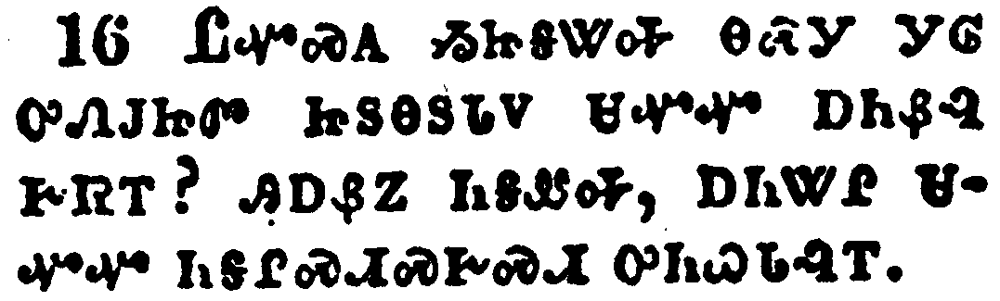</a></td>
</tr>
<tr class="even">
<td>What? know ye not that he which is joined to an harlot is one body? for two, saith he, shall be one flesh.</td>
</tr>
<tr class="odd">
<td>ᏝᏉᏍᎪ ᏱᏥᎦᏔᎭ ᎾᏍᎩ ᎩᎶ ᎤᏁᎫᏥᏛ ᏥᏚᎾᏚᏓᏙ ᏌᏉᏉ ᎠᏂᏰᎸ ᎨᏒᎢ? ᎯᎠᏰᏃ ᏂᎦᏪᎭ, ᎠᏂᏔᎵ ᏌᏉᏉ ᏂᎦᎵᏍᏗᏍᎨᏍᏗ ᎤᏂᏇᏓᎸᎢ.</td>
</tr>
<tr class="even">
<td>Tla-quo-s-go yi-tsi-ga-ta-ha na-s-gi gi-lo u-ne-gu-tsi-dv tsi-du-na-du-da-do sa-quo-quo a-ni-ye-lv ge-sv-i? hi-a-ye-no ni-ga-we-ha, a-ni-ta-li sa-quo-quo ni-ga-li-s-di-s-ge-s-di u-ni-que-da-lv-i.</td>
</tr>
</tbody>
</table>

<table>
<tbody>
<tr class="odd">
<td><a href="070617.png">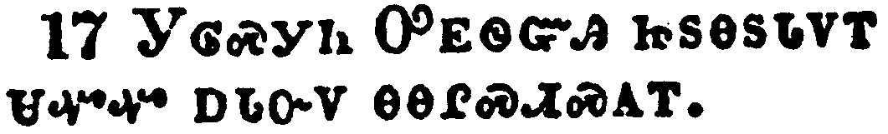</a></td>
</tr>
<tr class="even">
<td>But he that is joined unto the Lord is one spirit.</td>
</tr>
<tr class="odd">
<td>ᎩᎶᏍᎩᏂ ᎤᎬᏫᏳᎯ ᏥᏚᎾᏚᏓᏙᎢ ᏌᏉᏉ ᎠᏓᏅᏙ ᎾᎾᎵᏍᏗᏍᎪᎢ.</td>
</tr>
<tr class="even">
<td>Gi-lo-s-gi-ni U-gv-wi-yu-hi tsi-du-na-du-da-do-i sa-quo-quo a-da-nv-do na-na-li-s-di-s-go-i.</td>
</tr>
</tbody>
</table>

<table>
<tbody>
<tr class="odd">
<td><a href="070618.png">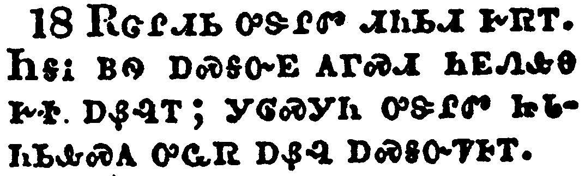</a></td>
</tr>
<tr class="even">
<td>Flee fornication. Every sin that a man doeth is without the body; but he that commiteth fornication sinneth against his own body.</td>
</tr>
<tr class="odd">
<td>ᎡᏣᎵᏗᏏ ᎤᏕᎵᏛ ᏗᏂᏏᏗ ᎨᏒᎢ. ᏂᎦᎥ ᏴᏫ ᎠᏍᎦᏅᎬ ᎪᎱᏍᏗ ᏂᎬᏁᎲᎾ ᎨᏐ ᎠᏰᎸᎢ; ᎩᎶᏍᎩᏂ ᎤᏕᎵᏛ ᏥᏓᏂᏏᎲᏍᎪ ᎤᏩᏒ ᎠᏰᎸ ᎠᏍᎦᏅᏤᎰᎢ.</td>
</tr>
<tr class="even">
<td>E-tsa-li-di-si u-de-li-dv di-ni-si-di ge-sv-i. Ni-ga-v yv-wi a-s-ga-nv-gv go-hu-s-di ni-gv-ne-hv-na ge-so a-ye-lv-i; gi-lo-s-gi-ni u-de-li-dv tsi-da-ni-si-hv-s-go u-wa-sv a-ye-lv a-s-ga-nv-tse-ho-i.</td>
</tr>
</tbody>
</table>

<table>
<tbody>
<tr class="odd">
<td><a href="070619.png">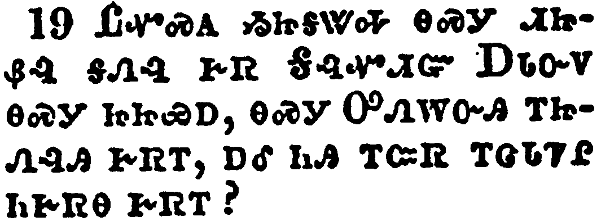</a></td>
</tr>
<tr class="even">
<td>What? know ye not that your body is the temple of the Holy Ghost which is in you, which ye have of God, and ye are not your own?</td>
</tr>
<tr class="odd">
<td>ᏝᏉᏍᎪ ᏱᏥᎦᏔᎭ ᎾᏍᎩ ᏗᏥᏰᎸ ᎦᏁᎸ ᎨᏒ ᎦᎸᏉᏗᏳ ᎠᏓᏅᏙ ᎾᏍᎩ ᏥᏥᏯᎠ, ᎾᏍᎩ ᎤᏁᎳᏅᎯ ᎢᏥᏁᎸᎯ ᎨᏒᎢ, ᎠᎴ ᏂᎯ ᎢᏨᏒ ᎢᏣᏓᏤᎵ ᏂᎨᏒᎾ ᎨᏒᎢ?</td>
</tr>
<tr class="even">
<td>Tla-quo-s-go yi-tsi-ga-ta-ha na-s-gi di-tsi-ye-lv ga-ne-lv ge-sv Ga-lv-quo-di-yu A-da-nv-do na-s-gi tsi-tsi-ya-a, na-s-gi U-ne-la-nv-hi i-tsi-ne-lv-hi ge-sv-i, a-le ni-hi i-tsv-sv i-tsa-da-tse-li ni-ge-sv-na ge-sv-i?</td>
</tr>
</tbody>
</table>

<table>
<tbody>
<tr class="odd">
<td></td>
</tr>
<tr class="even">
<td>For ye are bought with a price: therefore glorify God in your body, and in your spirit, which are God's.</td>
</tr>
<tr class="odd">
<td>ᏧᎬᏩᎶᏗᏰᏃ ᎡᏥᏩᎯᏍᏔᏅᎯ; ᎾᏍᎩ ᎢᏳᏍᏗ ᎡᏥᎸᏉᏗᏍᎨᏍᏗ ᎤᏁᎳᏅᎯ ᎢᏥᏰᎸ ᎢᏨᏗᏍᎨᏍᏗ, ᎠᎴ ᏗᏣᏓᏅᏙ ᏕᏨᏗᏍᎨᏍᏗ, ᎾᏍᎩ ᎤᏁᎳᏅᎯ ᏧᏤᎵ ᏥᎩ.</td>
</tr>
<tr class="even">
<td>Tsu-gv-wa-lo-di-ye-no e-tsi-wa-hi-s-ta-nv-hi; na-s-gi i-yu-s-di e-tsi-lv-quo-di-s-ge-s-di U-ne-la-nv-hi i-tsi-ye-lv i-tsv-di-s-ge-s-di, a-le di-tsa-da-nv-do de-tsv-di-s-ge-s-di, na-s-gi U-ne-la-nv-hi tsu-tse-li tsi-gi.</td>
</tr>
</tbody>
</table>

