+++
draft=false
date = 2014-12-18T21:11:07Z
title = "1 Corinthians - Chapter 7 - Cherokee New Testament"
weight = 1418955067

[taxonomies]

authors = ["Timothy Legg"]
categories = []
tags = []

[extra]
+++

<table>
<tbody>
<tr class="odd">
<td><a href="070701.png">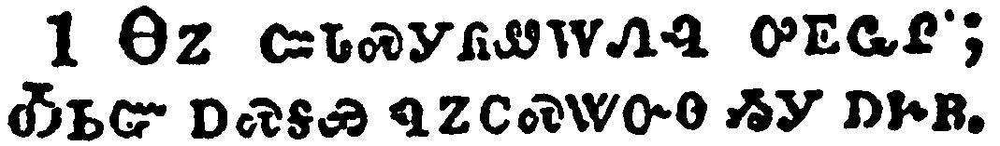</a></td>
</tr>
<tr class="even">
<td>Now concerning the things whereof ye wrote unto me: It is good for a man not to touch a woman.</td>
</tr>
<tr class="odd">
<td>ᎾᏃ ᏨᏓᏍᎩᏲᏪᎳᏁᎸ ᎤᎬᏩᎵ; ᎣᏏᏳ ᎠᏍᎦᏯ ᏄᏃᏟᏍᏔᏅᎾ ᏱᎩ ᎠᎨᏴ.</td>
</tr>
<tr class="even">
<td>Na-no tsv-da-s-gi-yo-we-la-ne-lv u-gv-wa-li; O-si-yu a-s-ga-ya nu-no-tli-s-ta-nv-na yi-gi a-ge-yv.</td>
</tr>
</tbody>
</table>

<table>
<tbody>
<tr class="odd">
<td><a href="070702.png">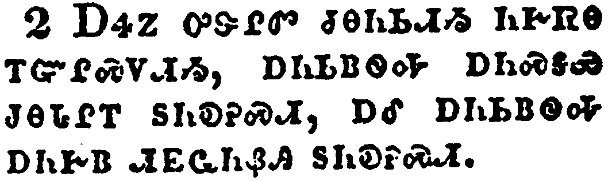</a></td>
</tr>
<tr class="even">
<td>Nevertheless, to avoid fornication, let every man have his own wife, and let every woman have her own husband.</td>
</tr>
<tr class="odd">
<td>ᎠᏎᏃ ᎤᏕᎸᏛ ᏧᎾᏂᏏᏗᏱ ᏂᎨᏒᎾ ᎢᏳᎵᏍᏙᏗᏱ, ᎠᏂᏏᏴᏫᎭ ᎠᏂᏍᎦᏯ ᏧᎾᏓᎵᎢ ᏚᏂᎧᎮᏍᏗ, ᎠᎴ ᎠᏂᏏᏴᏫᎭ ᎠᏂᎨᏴ ᏗᎬᏩᏂᏰᎯ ᏚᏂᎧᎮᏍᏗ.</td>
</tr>
<tr class="even">
<td>A-se-no u-de-lv-dv tsu-na-ni-si-di-yi ni-ge-sv-na i-yu-li-s-do-di-yi, a-ni-si-yv-wi-ha a-ni-s-ga-ya tsu-na-da-li-i du-ni-ka-he-s-di, a-le a-ni-si-yv-wi-ha a-ni-ge-yv di-gv-wa-ni-ye-hi du-ni-ka-he-s-di.</td>
</tr>
</tbody>
</table>

<table>
<tbody>
<tr class="odd">
<td><a href="070703.png">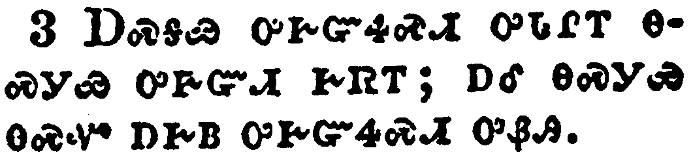</a></td>
</tr>
<tr class="even">
<td>Let the husband render unto the wife due benevolence: and likewise also the wife unto the husband.</td>
</tr>
<tr class="odd">
<td>ᎠᏍᎦᏯ ᎤᎨᏳᏎᏍᏗ ᎤᏓᎵᎢ ᎾᏍᎩᏯ ᎤᎨᏳᏗ ᎨᏒᎢ; ᎠᎴ ᎾᏍᎩᏯ ᎾᏍᏉ ᎠᎨᏴ ᎤᎨᏳᏎᏍᏗ ᎤᏰᎯ.</td>
</tr>
<tr class="even">
<td>A-s-ga-ya u-ge-yu-se-s-di u-da-li-i na-s-gi-ya u-ge-yu-di ge-sv-i; a-le na-s-gi-ya na-s-quo a-ge-yv u-ge-yu-se-s-di u-ye-hi.</td>
</tr>
</tbody>
</table>

<table>
<tbody>
<tr class="odd">
<td><a href="070704.png">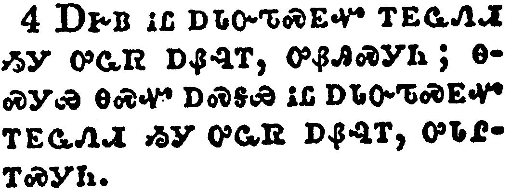</a></td>
</tr>
<tr class="even">
<td>The wife hath not power of her own body, but the husband: and likewise also the husband hath not power of his own body, but the wife.</td>
</tr>
<tr class="odd">
<td>ᎠᎨᏴ ᎥᏝ ᎠᏓᏅᏖᏍᎬᏉ ᎢᎬᏩᏁᏗ ᏱᎩ ᎤᏩᏒ ᎠᏰᎸᎢ, ᎤᏰᎯᏍᎩᏂ; ᎾᏍᎩᏯ ᎾᏍᏉ ᎠᏍᎦᏯ ᎥᏝ ᎠᏓᏅᏖᏍᎬᏉ ᎢᎬᏩᏁᏗ ᏱᎩ ᎤᏩᏒ ᎠᏰᎸᎢ, ᎤᏓᎵᎢᏍᎩᏂ.</td>
</tr>
<tr class="even">
<td>A-ge-yv v-tla a-da-nv-te-s-gv-quo i-gv-wa-ne-di yi-gi u-wa-sv a-ye-lv-i, u-ye-hi-s-gi-ni; na-s-gi-ya na-s-quo a-s-ga-ya v-tla a-da-nv-te-s-gv-quo i-gv-wa-ne-di yi-gi u-wa-sv a-ye-lv-i, u-da-li-i-s-gi-ni.</td>
</tr>
</tbody>
</table>

<table>
<tbody>
<tr class="odd">
<td><a href="070705.png">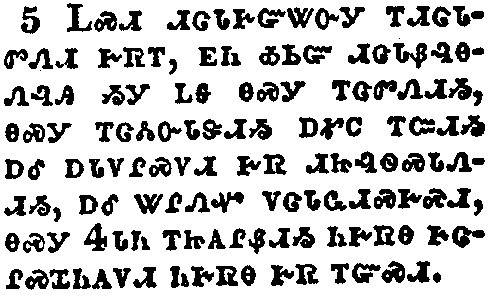</a></td>
</tr>
<tr class="even">
<td>Defraud ye not one the other, except it be with consent for a time, that ye may give yourselves to fasting and prayer; and come together again, that Satan tempt you not for your incontinency.</td>
</tr>
<tr class="odd">
<td>ᏞᏍᏗ ᏗᏣᏓᎨᏳᏔᏅᎩ ᎢᏗᏣᏣᏓᏛᏁᏗ ᎨᏒᎢ, ᎬᏂ ᎣᏏᏳ ᏗᏣᏓᏰᎸᎾᏁᎸᎯ ᏱᎩ ᏞᎦ ᎾᏍᎩ ᎢᏣᏛᏁᏗᏱ, ᎾᏍᎩ ᎢᏣᏜᏓᏅᏓᏕᏗᏱ ᎠᎹᏟ ᎢᏨᏗᏱ ᎠᎴ ᎠᏓᏙᎵᏍᏙᏗ ᎨᏒ ᏗᏥᎸᏫᏍᏓᏁᏗᏱ, ᎠᎴ ᏔᎵᏁᏉ ᏙᏣᏓᏩᏗᏍᎨᏍᏗ, ᎾᏍᎩ ᏎᏓᏂ ᎢᏥᎪᎵᏰᏗᏱ ᏂᎨᏒᎾ ᎨᏣᎵᏍᏆᏂᎪᏙᏗ ᏂᎨᏒᎾ ᎨᏒ ᎢᏳᏍᏗ.</td>
</tr>
<tr class="even">
<td>Tle-s-di di-tsa-da-ge-yu-ta-nv-gi i-di-tsa-tsa-da-dv-ne-di ge-sv-i, gv-ni o-si-yu di-tsa-da-ye-lv-na-ne-lv-hi yi-gi tle-ga na-s-gi i-tsa-dv-ne-di-yi, na-s-gi i-tsa-dla-nv-da-de-di-yi a-ma-tli i-tsv-di-yi a-le a-da-do-li-s-do-di ge-sv di-tsi-lv-wi-s-da-ne-di-yi, a-le ta-li-ne-quo do-tsa-da-wa-di-s-ge-s-di, na-s-gi Se-da-ni i-tsi-go-li-ye-di-yi ni-ge-sv-na ge-tsa-li-s-qua-ni-go-do-di ni-ge-sv-na ge-sv i-yu-s-di.</td>
</tr>
</tbody>
</table>

<table>
<tbody>
<tr class="odd">
<td><a href="070706.png">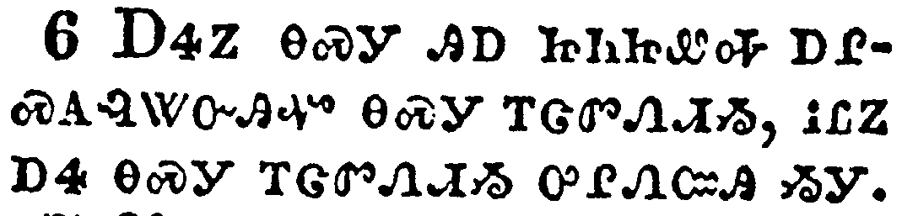</a></td>
</tr>
<tr class="even">
<td>But I speak this by permission, and not of commandment.</td>
</tr>
<tr class="odd">
<td>ᎠᏎᏃ ᎾᏍᎩ ᎯᎠ ᏥᏂᏥᏪᎭ ᎠᎵᏍᎪᎸᏔᏅᎯᏉ ᎾᏍᎩ ᎢᏣᏛᏁᏗᏱ, ᎥᏝᏃ ᎠᏎ ᎾᏍᎩ ᎢᏣᏛᏁᏗᏱ ᎤᎵᏁᏨᎯ ᏱᎩ.</td>
</tr>
<tr class="even">
<td>A-se-no na-s-gi hi-a tsi-ni-tsi-we-ha a-li-s-go-lv-ta-nv-hi-quo na-s-gi i-tsa-dv-ne-di-yi, v-tla-no a-se na-s-gi i-tsa-dv-ne-di-yi u-li-ne-tsv-hi yi-gi.</td>
</tr>
</tbody>
</table>

<table>
<tbody>
<tr class="odd">
<td><a href="070707.png">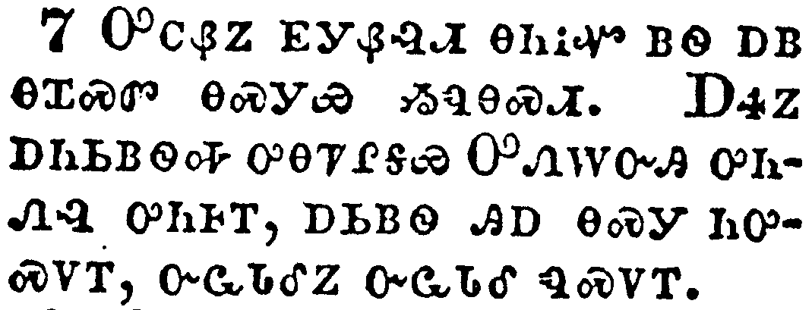</a></td>
</tr>
<tr class="even">
<td>For I would that all men were even as I myself. But every man hath his proper gift of God, one after this manner, and another after that.</td>
</tr>
<tr class="odd">
<td>ᎤᏟᏰᏃ ᎬᎩᏰᎸᏗ ᎾᏂᎥᏉ ᏴᏫ ᎠᏴ ᎾᏆᏍᏛ ᎾᏍᎩᏯ ᏱᏄᎾᏍᏗ. ᎠᏎᏃ ᎠᏂᏏᏴᏫᎭ ᎤᎾᏤᎵᎦᏯ ᎤᏁᎳᏅᎯ ᎤᏂᏁᎸ ᎤᏂᎰᎢ, ᎠᏏᏴᏫ ᎯᎠ ᎾᏍᎩ ᏂᎤᏍᏙᎢ, ᏅᏩᏓᎴᏃ ᏅᏩᏓᎴ ᏄᏍᏙᎢ.</td>
</tr>
<tr class="even">
<td>U-tli-ye-no gv-gi-ye-lv-di na-ni-v-quo yv-wi a-yv na-qua-s-dv na-s-gi-ya yi-nu-na-s-di. A-se-no a-ni-si-yv-wi-ha u-na-tse-li-ga-ya U-ne-la-nv-hi u-ni-ne-lv u-ni-ho-i, a-si-yv-wi hi-a na-s-gi ni-u-s-do-i, nv-wa-da-le-no nv-wa-da-le nu-s-do-i.</td>
</tr>
</tbody>
</table>

<table>
<tbody>
<tr class="odd">
<td><a href="070708.png">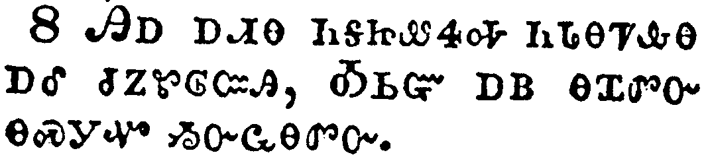</a></td>
</tr>
<tr class="even">
<td>I say therefore to the unmarried and widows, It is good for them if they abide even as I.</td>
</tr>
<tr class="odd">
<td>ᎯᎠ ᎠᏗᎾ ᏂᎦᏥᏪᏎᎭ ᏂᏓᎾᏤᎲᎾ ᎠᎴ ᏧᏃᏑᎶᏨᎯ, ᎣᏏᏳ ᎠᏴ ᎾᏆᏛᏅ ᎾᏍᎩᏉ ᏱᏅᏩᎾᏛᏅ.</td>
</tr>
<tr class="even">
<td>Hi-a a-di-na ni-ga-tsi-we-se-ha ni-da-na-tse-hv-na a-le tsu-no-su-lo-tsv-hi, O-si-yu a-yv na-qua-dv-nv na-s-gi-quo yi-nv-wa-na-dv-nv.</td>
</tr>
</tbody>
</table>

<table>
<tbody>
<tr class="odd">
<td><a href="070709.png">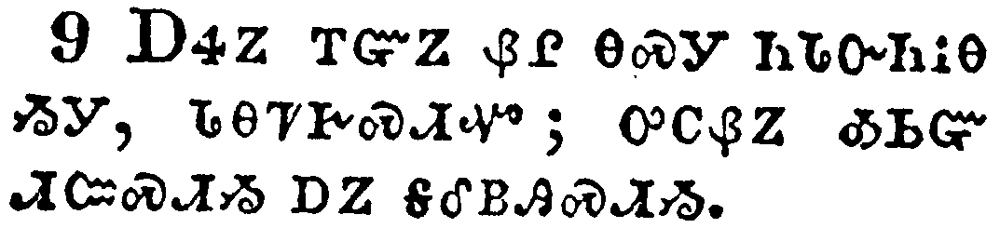</a></td>
</tr>
<tr class="even">
<td>But if they cannot contain, let them marry: for it is better to marry than to burn.</td>
</tr>
<tr class="odd">
<td>ᎠᏎᏃ ᎢᏳᏃ ᏰᎵ ᎾᏍᎩ ᏂᏓᏅᏂᎥᎾ ᏱᎩ, ᏓᎾᏤᎨᏍᏗᏉ; ᎤᏟᏰᏃ ᎣᏏᏳ ᏗᏨᏍᏗᏱ ᎠᏃ ᎦᎴᏴᎯᏍᏗᏱ.</td>
</tr>
<tr class="even">
<td>A-se-no i-yu-no ye-li na-s-gi ni-da-nv-ni-v-na yi-gi, da-na-tse-ge-s-di-quo; u-tli-ye-no o-si-yu di-tsv-s-di-yi a-no ga-le-yv-hi-s-di-yi.</td>
</tr>
</tbody>
</table>

<table>
<tbody>
<tr class="odd">
<td><a href="070710.png">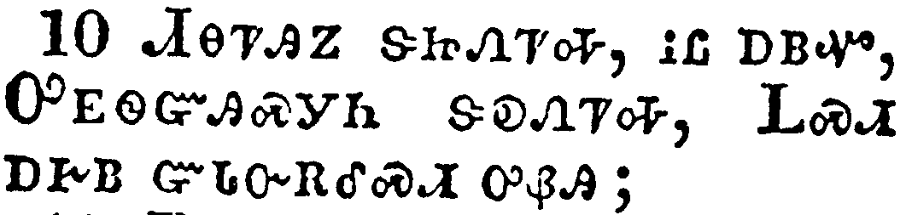</a></td>
</tr>
<tr class="even">
<td>And unto the married I command, yet not I, but the Lord, Let not the wife depart from her husband:</td>
</tr>
<tr class="odd">
<td>ᏗᎾᏤᎯᏃ ᏕᏥᏁᏤᎭ, ᎥᏝ ᎠᏴᏉ, ᎤᎬᏫᏳᎯᏍᎩᏂ ᏕᎧᏁᏤᎭ, ᏞᏍᏗ ᎠᎨᏴ ᏳᏓᏅᎡᎴᏍᏗ ᎤᏰᎯ;</td>
</tr>
<tr class="even">
<td>Di-na-tse-hi-no de-tsi-ne-tse-ha, v-tla a-yv-quo, U-gv-wi-yu-hi-s-gi-ni de-ka-ne-tse-ha, Tle-s-di a-ge-yv yu-da-nv-e-le-s-di u-ye-hi;</td>
</tr>
</tbody>
</table>

<table>
<tbody>
<tr class="odd">
<td><a href="070711.png">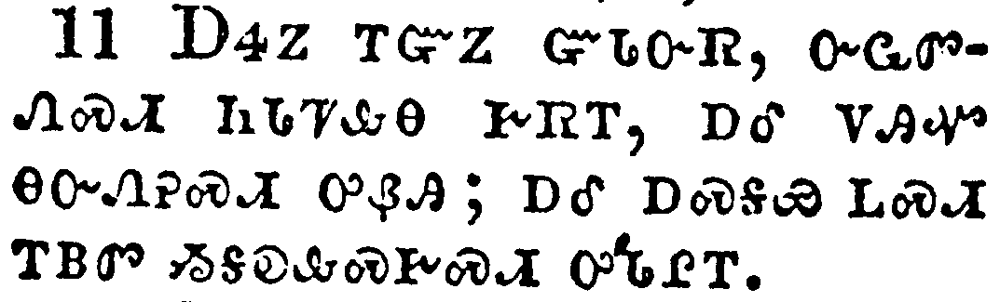</a></td>
</tr>
<tr class="even">
<td>But and if she depart, let her remain unmarried, or be reconciled to her husband: and let not the husband put away his wife.</td>
</tr>
<tr class="odd">
<td>ᎠᏎᏃ ᎢᏳᏃ ᏳᏓᏅᏒ, ᏅᏩᏛᏁᏍᏗ ᏂᏓᏤᎲᎾ ᎨᏒᎢ, ᎠᎴ ᏙᎯᏉ ᎾᏅᏁᎮᏍᏗ ᎤᏰᎯ; ᎠᎴ ᎠᏍᎦᏯ ᏞᏍᏗ ᎢᏴᏛ ᏱᎦᎧᎲᏍᎨᏍᏗ ᎤᏓᎵᎢ.</td>
</tr>
<tr class="even">
<td>A-se-no i-yu-no yu-da-nv-sv, nv-wa-dv-ne-s-di ni-da-tse-hv-na ge-sv-i, a-le do-hi-quo na-nv-ne-he-s-di u-ye-hi; a-le a-s-ga-ya tle-s-di i-yv-dv yi-ga-ka-hv-s-ge-s-di u-da-li-i.</td>
</tr>
</tbody>
</table>

<table>
<tbody>
<tr class="odd">
<td><a href="070712.png">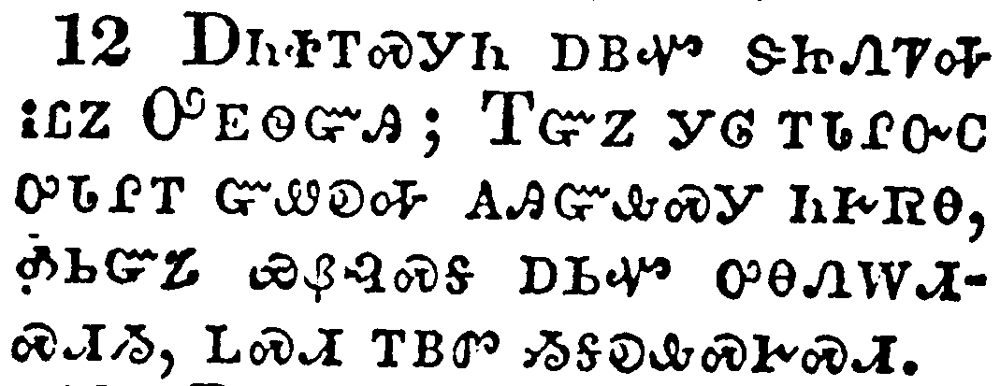</a></td>
</tr>
<tr class="even">
<td>But to the rest speak I, not the Lord: If any brother hath a wife that believeth not, and she be pleased to dwell with him, let him not put her away.</td>
</tr>
<tr class="odd">
<td>ᎠᏂᏐᎢᏍᎩᏂ ᎠᏴᏉ ᏕᏥᏁᏤᎭ ᎥᏝᏃ ᎤᎬᏫᏳᎯ; ᎢᏳᏃ ᎩᎶ ᎢᏓᎵᏅᏟ ᎤᏓᎵᎢ ᏳᏪᎧᎭ ᎪᎯᏳᎲᏍᎩ ᏂᎨᏒᎾ, ᎣᏏᏳᏃ ᏯᏰᎸᏍᎦ ᎠᏏᏉ ᎤᎾᏁᎳᏗᏍᏗᏱ, ᏞᏍᏗ ᎢᏴᏛ ᏱᎦᎧᎲᏍᎨᏍᏗ.</td>
</tr>
<tr class="even">
<td>A-ni-so-i-s-gi-ni a-yv-quo de-tsi-ne-tse-ha v-tla-no U-gv-wi-yu-hi; I-yu-no gi-lo i-da-li-nv-tli u-da-li-i yu-we-ka-ha go-hi-yu-hv-s-gi ni-ge-sv-na, o-si-yu-no ya-ye-lv-s-ga a-si-quo u-na-ne-la-di-s-di-yi, tle-s-di i-yv-dv yi-ga-ka-hv-s-ge-s-di.</td>
</tr>
</tbody>
</table>

<table>
<tbody>
<tr class="odd">
<td><a href="070713.png">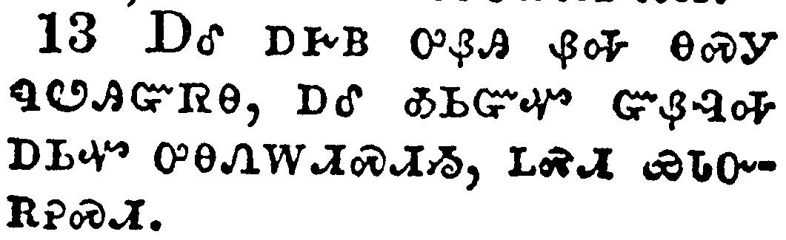</a></td>
</tr>
<tr class="even">
<td>And the woman which hath an husband that believeth not, and if he be pleased to dwell with her, let her not leave him.</td>
</tr>
<tr class="odd">
<td>ᎠᎴ ᎠᎨᏴ ᎤᏰᎯ ᏰᎭ ᎾᏍᎩ ᏄᏬᎯᏳᏒᎾ, ᎠᎴ ᎣᏏᏳᏉ ᏳᏰᎸᎭ ᎠᏏᏉ ᎤᎾᏁᎳᏗᏍᏗᏱ, ᏞᏍᏗ ᏯᏓᏅᎡᎮᏍᏗ.</td>
</tr>
<tr class="even">
<td>A-le a-ge-yv u-ye-hi ye-ha na-s-gi nu-wo-hi-yu-sv-na, a-le o-si-yu-quo yu-ye-lv-ha a-si-quo u-na-ne-la-di-s-di-yi, tle-s-di ya-da-nv-e-he-s-di.</td>
</tr>
</tbody>
</table>

<table>
<tbody>
<tr class="odd">
<td><a href="070714.png">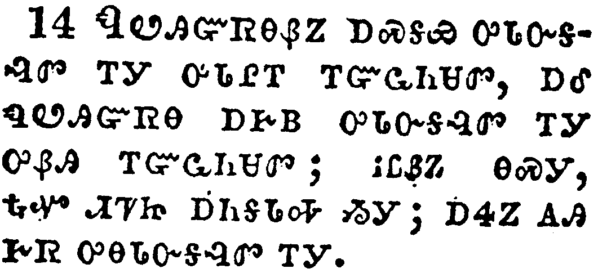</a></td>
</tr>
<tr class="even">
<td>For the unbelieving husband is sanctified by the wife, and the unbelieving wife is sanctified by the husband: else were your children unclean; but now are they holy.</td>
</tr>
<tr class="odd">
<td>ᏄᏬᎯᏳᏒᎾᏰᏃ ᎠᏍᎦᏯ ᎤᏓᏅᎦᎸᏛ ᎢᎩ ᎤᏓᎵᎢ ᎢᏳᏩᏂᏌᏛ, ᎠᎴ ᏄᏬᎯᏳᏒᎾ ᎠᎨᏴ ᎤᏓᏅᎦᎸᏛ ᎢᎩ ᎤᏰᎯ ᎢᏳᏩᏂᏌᏛ; ᎥᏝᏰᏃ ᎾᏍᎩ, ᎿᎭᏉ ᏗᏤᏥ ᎠᏂᎦᏓᎭ ᏱᎩ; ᎠᏎᏃ ᎪᎯ ᎨᏒ ᎤᎾᏓᏅᎦᎸᏛ ᎢᎩ.</td>
</tr>
<tr class="even">
<td>Nu-wo-hi-yu-sv-na-ye-no a-s-ga-ya u-da-nv-ga-lv-dv i-gi u-da-li-i i-yu-wa-ni-sa-dv, a-le nu-wo-hi-yu-sv-na a-ge-yv u-da-nv-ga-lv-dv i-gi u-ye-hi i-yu-wa-ni-sa-dv; v-tla-ye-no na-s-gi, hna-quo di-tse-tsi a-ni-ga-da-ha yi-gi; a-se-no go-hi ge-sv u-na-da-nv-ga-lv-dv i-gi.</td>
</tr>
</tbody>
</table>

<table>
<tbody>
<tr class="odd">
<td><a href="070715.png">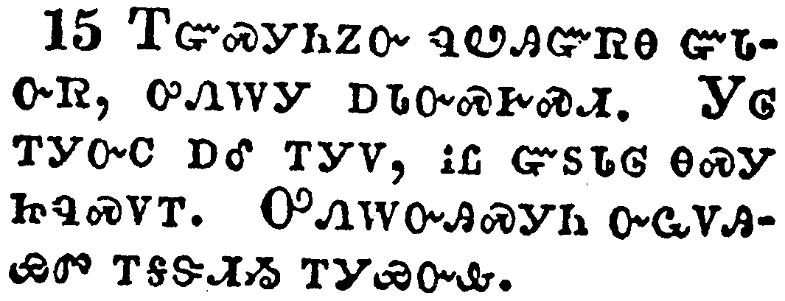</a></td>
</tr>
<tr class="even">
<td>But if the unbelieving depart, let him depart. A brother or a sister is not under bondage in such cases: but God hath called us to peace.</td>
</tr>
<tr class="odd">
<td>ᎢᏳᏍᎩᏂᏃᏅ ᏄᏬᎯᏳᏒᎾ ᏳᏓᏅᏒ, ᎤᏁᎳᎩ ᎠᏓᏅᏍᎨᏍᏗ. ᎩᎶ ᎢᎩᏅᏟ ᎠᎴ ᎢᎩᏙ, ᎥᏝ ᏳᏚᏓᎶ ᎾᏍᎩ ᏥᏄᏍᏙᎢ. ᎤᏁᎳᏅᎯᏍᎩᏂ ᏅᏩᏙᎯᏯᏛ ᎢᎦᏕᏗᏱ ᎢᎩᏯᏅᎲ.</td>
</tr>
<tr class="even">
<td>I-yu-s-gi-ni-no-nv nu-wo-hi-yu-sv-na yu-da-nv-sv, u-ne-la-gi a-da-nv-s-ge-s-di. Gi-lo i-gi-nv-tli a-le i-gi-do, v-tla yu-du-da-lo na-s-gi tsi-nu-s-do-i. U-ne-la-nv-hi-s-gi-ni nv-wa-do-hi-ya-dv i-ga-de-di-yi i-gi-ya-nv-hv.</td>
</tr>
</tbody>
</table>

<table>
<tbody>
<tr class="odd">
<td><a href="070716.png">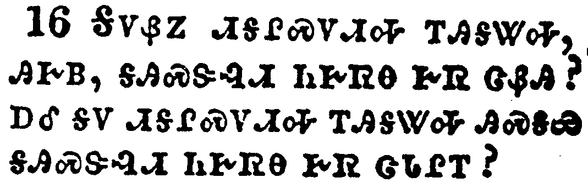</a></td>
</tr>
<tr class="even">
<td>For what knowest thou, O wife, whether thou shalt save thy husband? or how knowest thou, O man, whether thou shalt save thy wife?</td>
</tr>
<tr class="odd">
<td>ᎦᏙᏰᏃ ᏗᎦᎵᏍᏙᏗᎭ ᎢᎯᎦᏔᎭ, ᎯᎨᏴ, ᎦᎯᏍᏕᎸᏗ ᏂᎨᏒᎾ ᎨᏒ ᏣᏰᎯ? ᎠᎴ ᎦᏙ ᏗᎦᎵᏍᏙᏗᎭ ᎢᎯᎦᏔᎭ ᎯᏍᎦᏯ ᎦᎯᏍᏕᎸᏗ ᏂᎨᏒᎾ ᎨᏒ ᏣᏓᎵᎢ?</td>
</tr>
<tr class="even">
<td>Ga-do-ye-no di-ga-li-s-do-di-ha i-hi-ga-ta-ha, hi-ge-yv, ga-hi-s-de-lv-di ni-ge-sv-na ge-sv tsa-ye-hi? a-le ga-do di-ga-li-s-do-di-ha i-hi-ga-ta-ha hi-s-ga-ya ga-hi-s-de-lv-di ni-ge-sv-na ge-sv tsa-da-li-i?</td>
</tr>
</tbody>
</table>

<table>
<tbody>
<tr class="odd">
<td><a href="070717.png">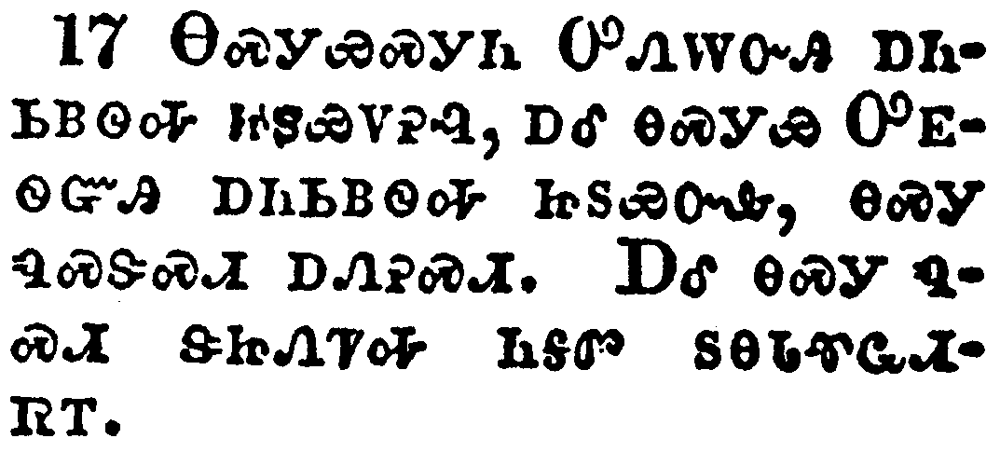</a></td>
</tr>
<tr class="even">
<td>But as God hath distributed to every man, as the Lord hath called every one, so let him walk. And so ordain I in all churches.</td>
</tr>
<tr class="odd">
<td>ᎾᏍᎩᏯᏍᎩᏂ ᎤᏁᎳᏅᎯ ᎠᏂᏏᏴᏫᎭ ᏥᎦᏯᏙᎮᎸ, ᎠᎴ ᎾᏍᎩᏯ ᎤᎬᏫᏳᎯ ᎠᏂᏏᏴᏫᎭ ᏥᏚᏯᏅᎲ, ᎾᏍᎩ ᏄᏍᏕᏍᏗ ᎠᏁᎮᏍᏗ. ᎠᎴ ᎾᏍᎩ ᏄᏍᏗ ᏕᏥᏁᏤᎭ ᏂᎦᏛ ᏚᎾᏓᏡᏩᏗᏒᎢ.</td>
</tr>
<tr class="even">
<td>Na-s-gi-ya-s-gi-ni U-ne-la-nv-hi a-ni-si-yv-wi-ha tsi-ga-ya-do-he-lv, a-le na-s-gi-ya U-gv-wi-yu-hi a-ni-si-yv-wi-ha tsi-du-ya-nv-hv, na-s-gi nu-s-de-s-di a-ne-he-s-di. A-le na-s-gi nu-s-di de-tsi-ne-tse-ha ni-ga-dv du-na-da-tlu-wa-di-sv-i.</td>
</tr>
</tbody>
</table>

<table>
<tbody>
<tr class="odd">
<td><a href="070718.png">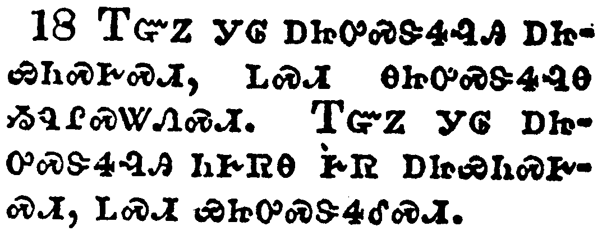</a></td>
</tr>
<tr class="even">
<td>Is any man called being circumcised? let him not become uncircumcised. Is any called in uncircumcision? let him not be circumcised.</td>
</tr>
<tr class="odd">
<td>ᎢᏳᏃ ᎩᎶ ᎠᏥᎤᏍᏕᏎᎸᎯ ᎠᏥᏯᏂᏍᎨᏍᏗ, ᏞᏍᏗ ᎾᏥᎤᏍᏕᏎᎸᎾ ᏱᏄᎵᏍᏔᏁᏍᏗ. ᎢᏳᏃ ᎩᎶ ᎠᏥᎤᏍᏕᏎᎸᎯ ᏂᎨᏒᎾ ᎨᏒ ᎠᏥᏯᏂᏍᎨᏍᏗ, ᏞᏍᏗ ᏯᏥᎤᏍᏕᏎᎴᏍᏗ.</td>
</tr>
<tr class="even">
<td>I-yu-no gi-lo a-tsi-u-s-de-se-lv-hi a-tsi-ya-ni-s-ge-s-di, tle-s-di na-tsi-u-s-de-se-lv-na yi-nu-li-s-ta-ne-s-di. I-yu-no gi-lo a-tsi-u-s-de-se-lv-hi ni-ge-sv-na ge-sv a-tsi-ya-ni-s-ge-s-di, tle-s-di ya-tsi-u-s-de-se-le-s-di.</td>
</tr>
</tbody>
</table>

<table>
<tbody>
<tr class="odd">
<td><a href="070719.png">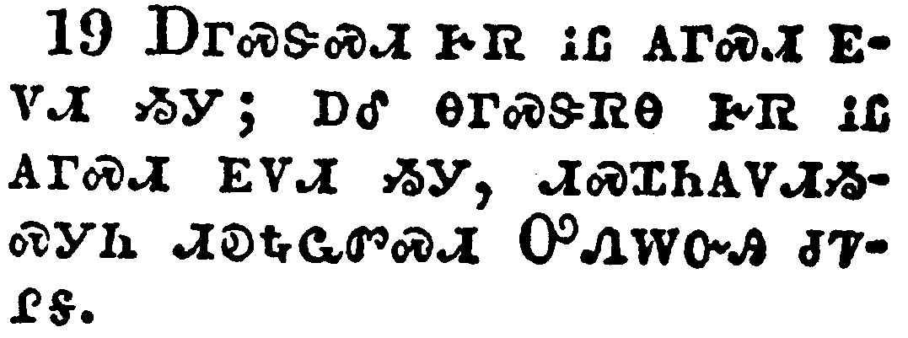</a></td>
</tr>
<tr class="even">
<td>Circumcision is nothing, and uncircumcision is nothing, but the keeping of the commandments of God.</td>
</tr>
<tr class="odd">
<td>ᎠᎱᏍᏕᏍᏗ ᎨᏒ ᎥᏝ ᎪᎱᏍᏗ ᎬᏙᏗ ᏱᎩ; ᎠᎴ ᎾᎱᏍᏕᏒᎾ ᎨᏒ ᎥᏝ ᎪᎱᏍᏗ ᎬᏙᏗ ᏱᎩ, ᏗᏍᏆᏂᎪᏙᏗᏱᏍᎩᏂ ᏗᎧᎿᎭᏩᏛᏍᏗ ᎤᏁᎳᏅᎯ ᏧᏤᎵᎦ.</td>
</tr>
<tr class="even">
<td>A-hu-s-de-s-di ge-sv v-tla go-hu-s-di gv-do-di yi-gi; a-le na-hu-s-de-sv-na ge-sv v-tla go-hu-s-di gv-do-di yi-gi, di-s-qua-ni-go-do-di-yi-s-gi-ni di-ka-hna-wa-dv-s-di U-ne-la-nv-hi tsu-tse-li-ga.</td>
</tr>
</tbody>
</table>

<table>
<tbody>
<tr class="odd">
<td></td>
</tr>
<tr class="even">
<td>Let every man abide in the same calling wherein he was called.</td>
</tr>
<tr class="odd">
<td>ᎾᏂᎥᎩᎶ ᏄᏛᏅᏉ ᎠᏥᏯᏅᎲ ᎾᎿᎭᏉ ᏅᏩᏛᏁᏍᏗ.</td>
</tr>
<tr class="even">
<td>Na-ni-v-gi-lo nu-dv-nv-quo a-tsi-ya-nv-hv na-hna-quo nv-wa-dv-ne-s-di.</td>
</tr>
</tbody>
</table>

<table>
<tbody>
<tr class="odd">
<td><a href="070721.png">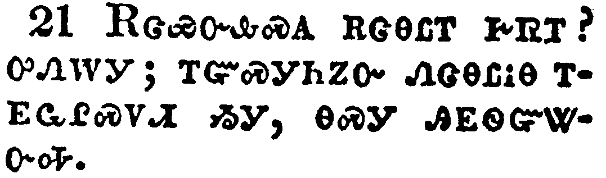</a></td>
</tr>
<tr class="even">
<td>Art thou called being a servant? care not for it: but if thou mayest be made free, use it rather.</td>
</tr>
<tr class="odd">
<td>ᎡᏣᏯᏅᎲᏍᎪ ᎡᏣᎾᏝᎢ ᎨᏒᎢ? ᎤᏁᎳᎩ; ᎢᏳᏍᎩᏂᏃᏅ ᏁᏣᎾᏝᎥᎾ ᎢᎬᏩᎵᏍᏙᏗ ᏱᎩ, ᎾᏍᎩ ᎯᎬᏫᏳᏔᏅᎭ.</td>
</tr>
<tr class="even">
<td>E-tsa-ya-nv-hv-s-go e-tsa-na-tla-i ge-sv-i? u-ne-la-gi; i-yu-s-gi-ni-no-nv ne-tsa-na-tla-v-na i-gv-wa-li-s-do-di yi-gi, na-s-gi hi-gv-wi-yu-ta-nv-ha.</td>
</tr>
</tbody>
</table>

<table>
<tbody>
<tr class="odd">
<td><a href="070722.png">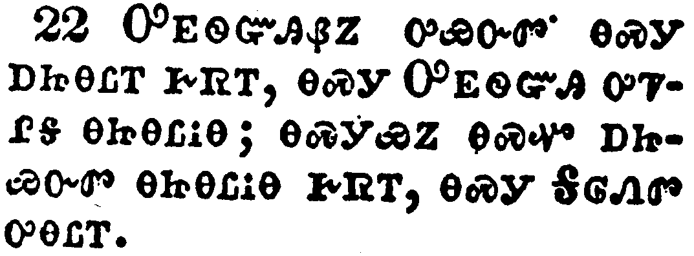</a></td>
</tr>
<tr class="even">
<td>For he that is called in the Lord, being a servant, is the Lord's freeman: likewise also he that is called, being free, is Christ's servant.</td>
</tr>
<tr class="odd">
<td>ᎤᎬᏫᏳᎯᏰᏃ ᎤᏯᏅᏛ ᎾᏍᎩ ᎠᏥᎾᏝᎢ ᎨᏒᎢ, ᎾᏍᎩ ᎤᎬᏫᏳᎯ ᎤᏤᎵᎦ ᎾᏥᎾᏝᎥᎾ; ᎾᏍᎩᏯᏃ ᎾᏍᏉ ᎠᏥᏯᏅᏛ ᎾᏥᎾᏝᎥᎾ ᎨᏒᎢ, ᎾᏍᎩ ᎦᎶᏁᏛ ᎤᎾᏝᎢ.</td>
</tr>
<tr class="even">
<td>U-gv-wi-yu-hi-ye-no u-ya-nv-dv na-s-gi a-tsi-na-tla-i ge-sv-i, na-s-gi U-gv-wi-yu-hi u-tse-li-ga na-tsi-na-tla-v-na; na-s-gi-ya-no na-s-quo a-tsi-ya-nv-dv na-tsi-na-tla-v-na ge-sv-i, na-s-gi Ga-lo-ne-dv u-na-tla-i.</td>
</tr>
</tbody>
</table>

<table>
<tbody>
<tr class="odd">
<td></td>
</tr>
<tr class="even">
<td>Ye are bought with a price; be not ye the servants of men.</td>
</tr>
<tr class="odd">
<td>ᏧᎬᏩᎶᏗ ᎡᏥᏩᎯᏍᏔᏅᎯ; ᏞᏍᏗ ᏴᏫᏉ ᏗᎨᏥᎾᏝᎢ ᏱᎨᏎᏍᏗ.</td>
</tr>
<tr class="even">
<td>Tsu-gv-wa-lo-di e-tsi-wa-hi-s-ta-nv-hi; tle-s-di yv-wi-quo di-ge-tsi-na-tla-i yi-ge-se-s-di.</td>
</tr>
</tbody>
</table>

<table>
<tbody>
<tr class="odd">
<td><a href="070724.png">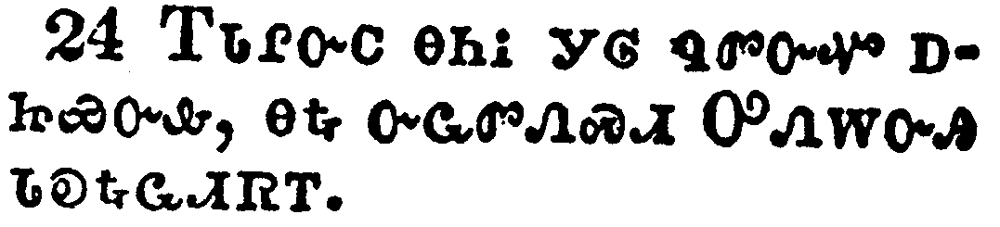</a></td>
</tr>
<tr class="even">
<td>Brethren, let every man, wherein he is called, therein abide with God.</td>
</tr>
<tr class="odd">
<td>ᎢᏓᎵᏅᏟ ᎾᏂᎥ ᎩᎶ ᏄᏛᏅᏉ ᎠᏥᏯᏅᎲ, ᎾᎿᎭᏅᏩᏛᏁᏍᏗ ᎤᏁᎳᏅᎯ ᏓᎧᎿᎭᏩᏗᏒᎢ.</td>
</tr>
<tr class="even">
<td>I-da-li-nv-tli na-ni-v gi-lo nu-dv-nv-quo a-tsi-ya-nv-hv, na-hna nv-wa-dv-ne-s-di U-ne-la-nv-hi da-ka-hna-wa-di-sv-i.</td>
</tr>
</tbody>
</table>

<table>
<tbody>
<tr class="odd">
<td><a href="070725.png">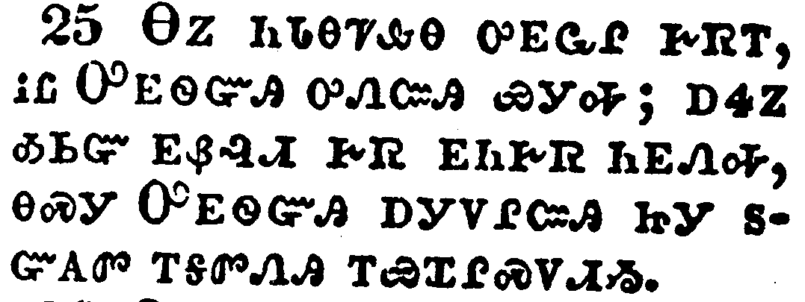</a></td>
</tr>
<tr class="even">
<td>Now concerning virgins I have no commandment of the Lord: yet I give my judgment, as one that hath obtained mercy of the Lord to be faithful.</td>
</tr>
<tr class="odd">
<td>ᎾᏃ ᏂᏓᎾᏤᎲᎾ ᎤᎬᏩᎵ ᎨᏒᎢ, ᎥᏝ ᎤᎬᏫᏳᎯ ᎤᏁᏨᎯ ᏯᎩᎭ; ᎠᏎᏃ ᎣᏏᏳ ᎬᏰᎸᏗ ᎨᏒ ᎬᏂᎨᏒ ᏂᎬᏁᎭ, ᎾᏍᎩ ᎤᎬᏫᏳᎯ ᎠᎩᏙᎵᏨᎯ ᏥᎩ ᏚᏳᎪᏛ ᎢᎦᏛᏁᎯ ᎢᏯᏆᎵᏍᏙᏗᏱ.</td>
</tr>
<tr class="even">
<td>Na-no ni-da-na-tse-hv-na u-gv-wa-li ge-sv-i, v-tla U-gv-wi-yu-hi u-ne-tsv-hi ya-gi-ha; a-se-no o-si-yu gv-ye-lv-di ge-sv gv-ni-ge-sv ni-gv-ne-ha, na-s-gi U-gv-wi-yu-hi a-gi-do-li-tsv-hi tsi-gi du-yu-go-dv i-ga-dv-ne-hi i-ya-qua-li-s-do-di-yi.</td>
</tr>
</tbody>
</table>

<table>
<tbody>
<tr class="odd">
<td><a href="070726.png">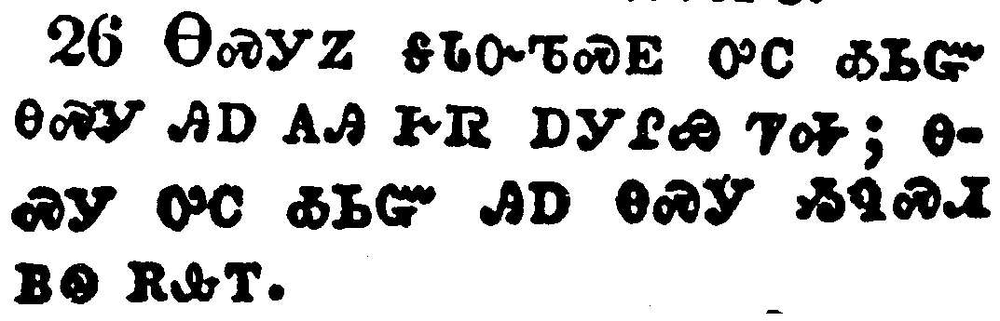</a></td>
</tr>
<tr class="even">
<td>I suppose therefore that this is good for the present distress, I say, that it is good for a man so to be.</td>
</tr>
<tr class="odd">
<td>ᎾᏍᎩᏃ ᎦᏓᏅᏖᏍᎬ ᎤᏟ ᎣᏏᏳ ᎾᏍᎩ ᎯᎠ ᎪᎯ ᎨᏒ ᎠᎩᎵᏯ ᏤᎭ; ᎾᏍᎩ ᎤᏟ ᎣᏏᏳ ᎯᎠ ᎾᏍᎩ ᏱᏄᏍᏗ ᏴᏫ ᎡᎲᎢ.</td>
</tr>
<tr class="even">
<td>Na-s-gi-no ga-da-nv-te-s-gv u-tli o-si-yu na-s-gi hi-a go-hi ge-sv a-gi-li-ya tse-ha; na-s-gi u-tli o-si-yu hi-a na-s-gi yi-nu-s-di yv-wi e-hv-i.</td>
</tr>
</tbody>
</table>

<table>
<tbody>
<tr class="odd">
<td><a href="070727.png">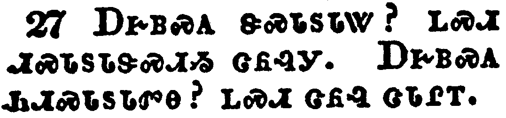</a></td>
</tr>
<tr class="even">
<td>Art thou bound unto a wife? seek not to be loosed. Art thou loosed from a wife? seek not a wife.</td>
</tr>
<tr class="odd">
<td>ᎠᎨᏴᏍᎪ ᏕᏍᏓᏚᏓᏔ? ᏞᏍᏗ ᏗᏍᏓᏚᏓᏕᏍᏗᏱ ᏣᏲᎸᎩ. ᎠᎨᏴᏍᎪ ᏂᏗᏍᏓᏚᏓᏛᎾ? ᏞᏍᏗ ᏣᏲᎸ ᏣᏓᎵᎢ.</td>
</tr>
<tr class="even">
<td>A-ge-yv-s-go de-s-da-du-da-ta? tle-s-di di-s-da-du-da-de-s-di-yi tsa-yo-lv-gi. A-ge-yv-s-go ni-di-s-da-du-da-dv-na? tle-s-di tsa-yo-lv tsa-da-li-i.</td>
</tr>
</tbody>
</table>

<table>
<tbody>
<tr class="odd">
<td><a href="070728.png">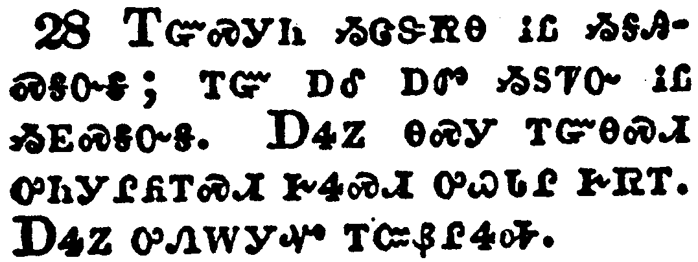</a></td>
</tr>
<tr class="even">
<td>But and if thou marry, thou hast not sinned; and if a virgin marry, she hath not sinned. Nevertheless such shall have trouble in the flesh: but I spare you.</td>
</tr>
<tr class="odd">
<td>ᎢᏳᏍᎩᏂ ᏱᏣᏕᏒᎾ ᎥᏝ ᏱᎦᎯᏍᎦᏅᎦ; ᎢᏳ ᎠᎴ ᎠᏛ ᏱᏚᏤᏅ ᎥᏝ ᏱᎬᏍᎦᏅᎦ. ᎠᏎᏃ ᎾᏍᎩ ᎢᏳᎾᏍᏗ ᎤᏂᎩᎵᏲᎢᏍᏗ ᎨᏎᏍᏗ ᎤᏇᏓᎵ ᎨᏒᎢ. ᎠᏎᏃ ᎤᏁᎳᎩᏉ ᎢᏨᏰᎵᏎᎭ.</td>
</tr>
<tr class="even">
<td>I-yu-s-gi-ni yi-tsa-de-sv-na v-tla yi-ga-hi-s-ga-nv-ga; i-yu a-le a-dv yi-du-tse-nv v-tla yi-gv-s-ga-nv-ga. A-se-no na-s-gi i-yu-na-s-di u-ni-gi-li-yo-i-s-di ge-se-s-di u-que-da-li ge-sv-i. A-se-no u-ne-la-gi-quo i-tsv-ye-li-se-ha.</td>
</tr>
</tbody>
</table>

<table>
<tbody>
<tr class="odd">
<td><a href="070729.png">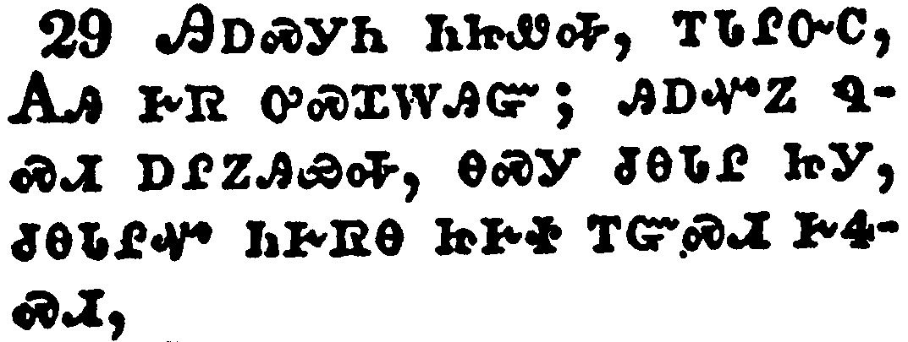</a></td>
</tr>
<tr class="even">
<td>But this I say, brethren, the time is short: it remaineth, that both they that have wives be as though they had none;</td>
</tr>
<tr class="odd">
<td>ᎯᎠᏍᎩᏂ ᏂᏥᏪᎭ, ᎢᏓᎵᏅᏟ, ᎪᎯ ᎨᏒ ᎤᏍᏆᎳᎯᏳ; ᎯᎠᏉᏃ ᏄᏍᏗ ᎠᎵᏃᎯᏯᎭ, ᎾᏍᎩ ᏧᎾᏓᎵ ᏥᎩ, ᏧᎾᏓᎵᏉ ᏂᎨᏒᎾ ᏥᎨᏐ ᎢᏳᏍᏗ ᎨᏎᏍᏗ,</td>
</tr>
<tr class="even">
<td>Hi-a-s-gi-ni ni-tsi-we-ha, i-da-li-nv-tli, Go-hi ge-sv u-s-qua-la-hi-yu; hi-a-quo-no nu-s-di a-li-no-hi-ya-ha, na-s-gi tsu-na-da-li tsi-gi, tsu-na-da-li-quo ni-ge-sv-na tsi-ge-so i-yu-s-di ge-se-s-di,</td>
</tr>
</tbody>
</table>

<table>
<tbody>
<tr class="odd">
<td><a href="070730.png">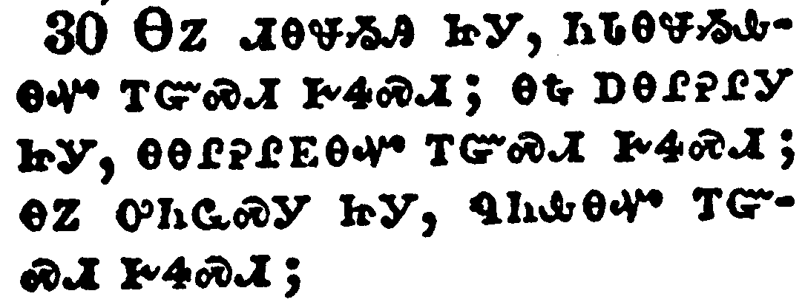</a></td>
</tr>
<tr class="even">
<td>And they that weep, as though they wept not; and they that rejoice, as though they rejoiced not; and they that buy, as though they possessed not;</td>
</tr>
<tr class="odd">
<td>ᎾᏃ ᏗᎾᏠᏱᎯ ᏥᎩ, ᏂᏓᎾᏠᏱᎲᎾᏉ ᎢᏳᏍᏗ ᎨᏎᏍᏗ; ᎾᎿᎭᎠᎾᎵᎮᎵᎩ ᏥᎩ, ᎾᎾᎵᎮᎵᎬᎾᏉ ᎢᏳᏍᏗ ᎨᏎᏍᏗ; ᎾᏃ ᎤᏂᏩᏍᎩ ᏥᎩ, ᏄᏂᎲᎾᏉ ᎢᏳᏍᏗ ᎨᏎᏍᏗ;</td>
</tr>
<tr class="even">
<td>Na-no di-na-tlo-yi-hi tsi-gi, ni-da-na-tlo-yi-hv-na-quo i-yu-s-di ge-se-s-di; na-hna a-na-li-he-li-gi tsi-gi, na-na-li-he-li-gv-na-quo i-yu-s-di ge-se-s-di; na-no u-ni-wa-s-gi tsi-gi, nu-ni-hv-na-quo i-yu-s-di ge-se-s-di;</td>
</tr>
</tbody>
</table>

<table>
<tbody>
<tr class="odd">
<td><a href="070731.png">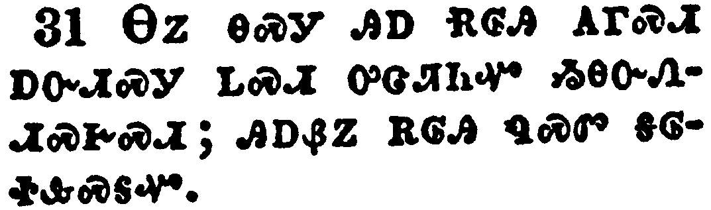</a></td>
</tr>
<tr class="even">
<td>And they that use this world, as not abusing it: for the fashion of this world passeth away.</td>
</tr>
<tr class="odd">
<td>ᎾᏃ ᎾᏍᎩ ᎯᎠ ᎡᎶᎯ ᎪᎱᏍᏗ ᎠᏅᏗᏍᎩ ᏞᏍᏗ ᎤᏣᏘᏂᏉ ᏱᎾᏅᏁᏗᏍᎨᏍᏗ; ᎯᎠᏰᏃ ᎡᎶᎯ ᏄᏍᏛ ᎦᎶᏐᎲᏍᎦᏉ.</td>
</tr>
<tr class="even">
<td>Na-no na-s-gi hi-a e-lo-hi go-hu-s-di a-nv-di-s-gi tle-s-di u-tsa-ti-ni-quo yi-na-nv-ne-di-s-ge-s-di; hi-a-ye-no e-lo-hi nu-s-dv ga-lo-so-hv-s-ga-quo.</td>
</tr>
</tbody>
</table>

<table>
<tbody>
<tr class="odd">
<td><a href="070732.png">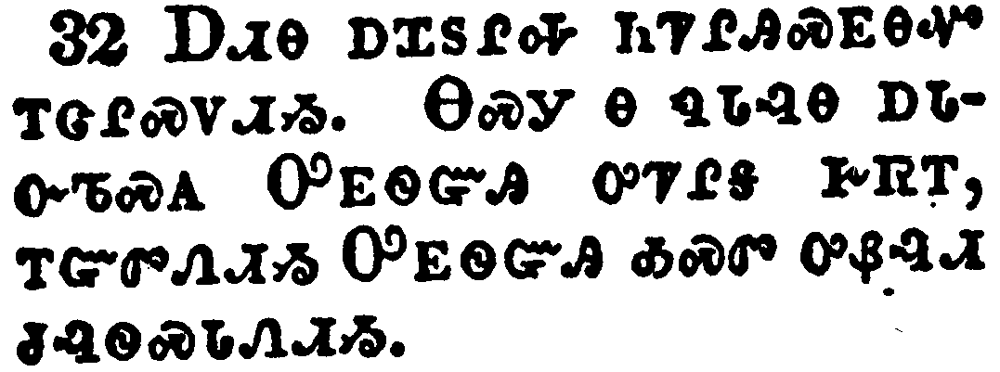</a></td>
</tr>
<tr class="even">
<td>But I would have you without carefulness. He that is unmarried careth for the things that belong to the Lord, how he may please the Lord:</td>
</tr>
<tr class="odd">
<td>ᎠᏗᎾ ᎠᏆᏚᎵᎭ ᏂᏤᎵᎯᏍᎬᎾᏉ ᎢᏣᎵᏍᏙᏗᏱ. ᎾᏍᎩ Ꮎ ᏄᏓᎸᎾ ᎠᏓᏅᏖᏍᎪ ᎤᎬᏫᏳᎯ ᎤᏤᎵᎦ ᎨᏒᎢ, ᎢᏳᏛᏁᏗᏱ ᎤᎬᏫᏳᎯ ᎣᏍᏛ ᎤᏰᎸᏗ ᏧᎸᏫᏍᏓᏁᏗᏱ.</td>
</tr>
<tr class="even">
<td>A-di-na a-qua-du-li-ha ni-tse-li-hi-s-gv-na-quo i-tsa-li-s-do-di-yi. Na-s-gi na nu-da-lv-na a-da-nv-te-s-go U-gv-wi-yu-hi u-tse-li-ga ge-sv-i, i-yu-dv-ne-di-yi U-gv-wi-yu-hi o-s-dv u-ye-lv-di tsu-lv-wi-s-da-ne-di-yi.</td>
</tr>
</tbody>
</table>

<table>
<tbody>
<tr class="odd">
<td><a href="070733.png">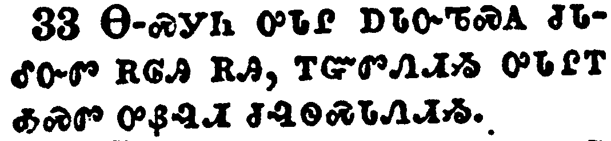</a></td>
</tr>
<tr class="even">
<td>But he that is married careth for the things that are of the world, how he may please his wife.</td>
</tr>
<tr class="odd">
<td>Ꮎ-ᏍᎩᏂ ᎤᏓᎵ ᎠᏓᏅᏖᏍᎪ ᏧᏓᎴᏅᏛ ᎡᎶᎯ ᎡᎯ, ᎢᏳᏛᏁᏗᏱ ᎤᏓᎵᎢ ᎣᏍᏛ ᎤᏰᎸᏗ ᏧᎸᏫᏍᏓᏁᏗᏱ.</td>
</tr>
<tr class="even">
<td>Na--s-gi-ni u-da-li a-da-nv-te-s-go tsu-da-le-nv-dv e-lo-hi e-hi, i-yu-dv-ne-di-yi u-da-li-i o-s-dv u-ye-lv-di tsu-lv-wi-s-da-ne-di-yi.</td>
</tr>
</tbody>
</table>

<table>
<tbody>
<tr class="odd">
<td><a href="070734.png">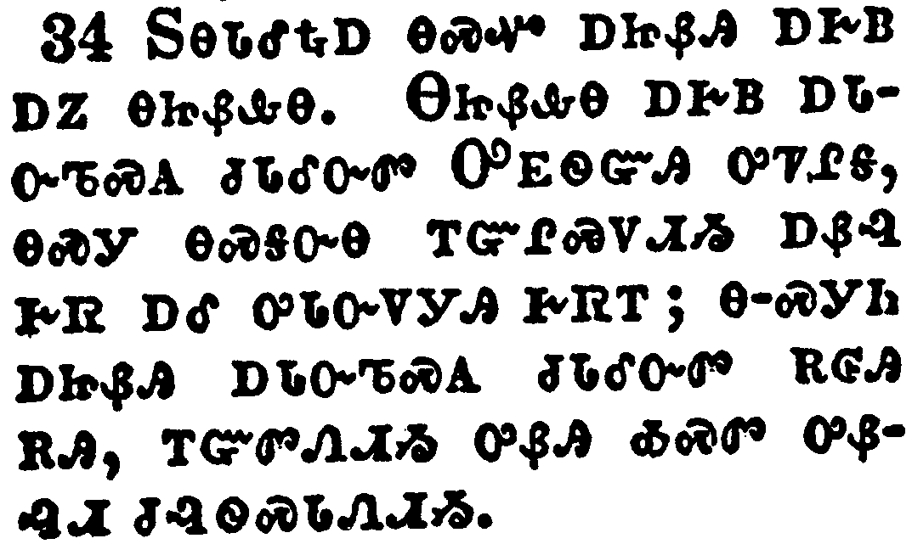</a></td>
</tr>
<tr class="even">
<td>There is difference also between a wife and a virgin. The unmarried woman careth for the things of the Lord, that she may be holy both in body and in spirit: but she that is married careth for the things of the world, how she may please her husband.</td>
</tr>
<tr class="odd">
<td>ᏚᎾᏓᎴᎿᎭᎠ ᎾᏍᏉ ᎠᏥᏰᎯ ᎠᎨᏴ ᎠᏃ ᎾᏥᏰᎲᎾ. ᎾᏥᏰᎲᎾ ᎠᎨᏴ ᎠᏓᏅᏖᏍᎪ ᏧᏓᎴᏅᏛ ᎤᎬᏫᏳᎯ ᎤᏤᎵᎦ, ᎾᏍᎩ ᎾᏍᎦᏅᎾ ᎢᏳᎵᏍᏙᏗᏱ ᎠᏰᎵ ᎨᏒ ᎠᎴ ᎤᏓᏅᏙᎩᎯ ᎨᏒᎢ; Ꮎ-ᏍᎩᏂ ᎠᏥᏰᎯ ᎠᏓᏅᏖᏍᎪ ᏧᏓᎴᏅᏛ ᎡᎶᎯ ᎡᎯ, ᎢᏳᏛᏁᏗᏱ ᎤᏰᎯ ᎣᏍᏛ ᎤᏰᎸᏗ ᏧᎸᏫᏍᏓᏁᏗᏱ.</td>
</tr>
<tr class="even">
<td>Du-na-da-le-hna-a na-s-quo a-tsi-ye-hi a-ge-yv a-no na-tsi-ye-hv-na. Na-tsi-ye-hv-na a-ge-yv a-da-nv-te-s-go tsu-da-le-nv-dv U-gv-wi-yu-hi u-tse-li-ga, na-s-gi na-s-ga-nv-na i-yu-li-s-do-di-yi a-ye-li ge-sv a-le u-da-nv-do-gi-hi ge-sv-i; na--s-gi-ni a-tsi-ye-hi a-da-nv-te-s-go tsu-da-le-nv-dv e-lo-hi e-hi, i-yu-dv-ne-di-yi u-ye-hi o-s-dv u-ye-lv-di tsu-lv-wi-s-da-ne-di-yi.</td>
</tr>
</tbody>
</table>

<table>
<tbody>
<tr class="odd">
<td><a href="070735.png">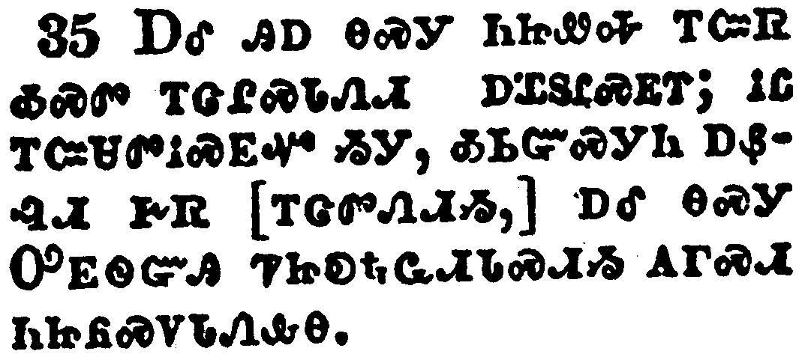</a></td>
</tr>
<tr class="even">
<td>And this I speak for your own profit; not that I may cast a snare upon you, but for that which is comely, and that ye may attend upon the Lord without distraction.</td>
</tr>
<tr class="odd">
<td>ᎠᎴ ᎯᎠ ᎾᏍᎩ ᏂᏥᏪᎭ ᎢᏨᏒ ᎣᏍᏛ ᎢᏣᎵᏍᏓᏁᏗ ᎠᏆᏑᎵᏍᎬᎢ; ᎥᏝ ᎢᏨᏌᏛᎥᏍᎬᏉ ᏱᎩ, ᎣᏏᏳᏍᎩᏂ ᎠᏰᎸᏗ ᎨᏒ [ᎢᏣᏛᏁᏗᏱ, ] ᎠᎴ ᎾᏍᎩ ᎤᎬᏫᏳᎯ ᏤᏥᎧᎿᎭᏩᏗᏓᏍᏗᏱ ᎪᎱᏍᏗ ᏂᏥᏲᏍᏙᏓᏁᎲᎾ.</td>
</tr>
<tr class="even">
<td>A-le hi-a na-s-gi ni-tsi-we-ha i-tsv-sv o-s-dv i-tsa-li-s-da-ne-di a-qua-su-li-s-gv-i; v-tla i-tsv-sa-dv-v-s-gv-quo yi-gi, o-si-yu-s-gi-ni a-ye-lv-di ge-sv [i-tsa-dv-ne-di-yi, ] a-le na-s-gi U-gv-wi-yu-hi tse-tsi-ka-hna-wa-di-da-s-di-yi go-hu-s-di ni-tsi-yo-s-do-da-ne-hv-na.</td>
</tr>
</tbody>
</table>

<table>
<tbody>
<tr class="odd">
<td><a href="070736.png">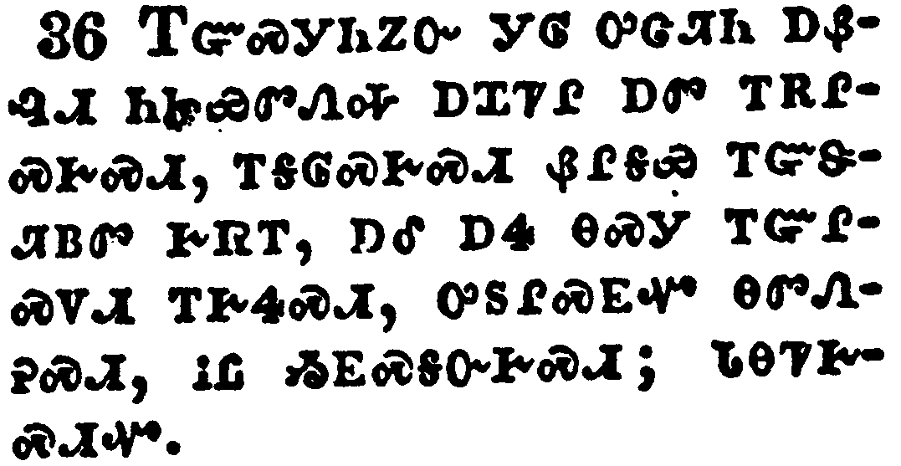</a></td>
</tr>
<tr class="even">
<td>But if any man think that he behaveth himself uncomely toward his virgin, if she pass the flower of her age, and need so require, let him do what he will, he sinneth not: let them marry.</td>
</tr>
<tr class="odd">
<td>ᎢᏳᏍᎩᏂᏃᏅ ᎩᎶ ᎤᏣᏘᏂ ᎠᏰᎸᏗ ᏂᏥᏯᏛᏁᎭ ᎠᏆᏤᎵ ᎠᏛ ᎢᎡᎵᏍᎨᏍᏗ, ᎢᎦᎶᏍᎨᏍᏗ ᏰᎵᎦᏯ ᎢᏳᏕᏘᏴᏛ ᎨᏒᎢ, ᎠᎴ ᎠᏎ ᎾᏍᎩ ᎢᏳᎵᏍᏙᏗ ᎢᎨᏎᏍᏗ, ᎤᏚᎵᏍᎬᏉ ᎾᏛᏁᎮᏍᏗ, ᎥᏝ ᏱᎬᏍᎦᏅᎨᏍᏗ; ᏓᎾᏤᎨᏍᏗᏉ.</td>
</tr>
<tr class="even">
<td>I-yu-s-gi-ni-no-nv gi-lo u-tsa-ti-ni a-ye-lv-di ni-tsi-ya-dv-ne-ha a-qua-tse-li a-dv i-e-li-s-ge-s-di, i-ga-lo-s-ge-s-di ye-li-ga-ya i-yu-de-ti-yv-dv ge-sv-i, a-le a-se na-s-gi i-yu-li-s-do-di i-ge-se-s-di, u-du-li-s-gv-quo na-dv-ne-he-s-di, v-tla yi-gv-s-ga-nv-ge-s-di; da-na-tse-ge-s-di-quo.</td>
</tr>
</tbody>
</table>

<table>
<tbody>
<tr class="odd">
<td><a href="070737.png">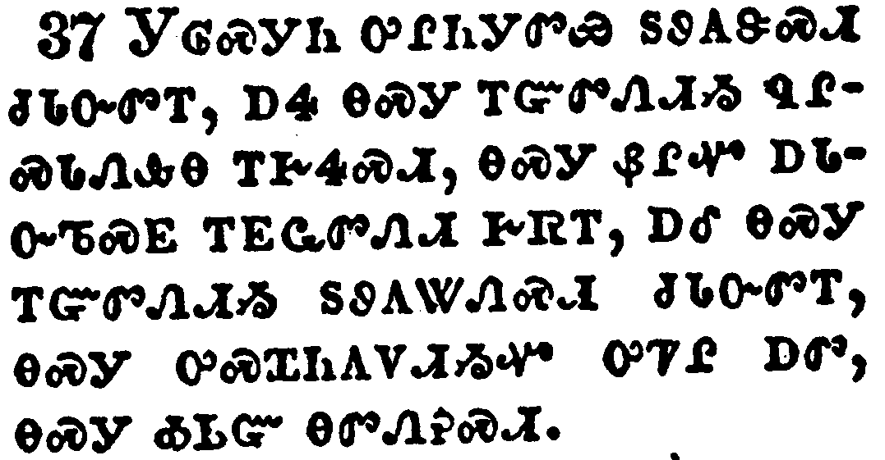</a></td>
</tr>
<tr class="even">
<td>Nevertheless he that standeth stedfast in his heart, having no necessity, but hath power over his own will, and hath so decreed in his heart that he will keep his virgin, doeth well.</td>
</tr>
<tr class="odd">
<td>ᎩᎶᏍᎩᏂ ᎤᎵᏂᎩᏛᏯ ᏚᏭᎪᏕᏍᏗ ᏧᏓᏅᏛᎢ, ᎠᏎ ᎾᏍᎩ ᎢᏳᏛᏁᏗᏱ ᏄᎵᏍᏓᏁᎲᎾ ᎢᎨᏎᏍᏗ, ᎾᏍᎩ ᏰᎵᏉ ᎠᏓᏅᏖᏍᎬ ᎢᎬᏩᏛᏁᏗ ᎨᏒᎢ, ᎠᎴ ᎾᏍᎩ ᎢᏳᏛᏁᏗᏱ ᏚᏭᎪᏔᏁᏍᏗ ᏧᏓᏅᏛᎢ, ᎾᏍᎩ ᎤᏍᏆᏂᎪᏙᏗᏱᏉ ᎤᏤᎵ ᎠᏛ, ᎾᏍᎩ ᎣᏏᏳ ᎾᏛᏁᎮᏍᏗ.</td>
</tr>
<tr class="even">
<td>Gi-lo-s-gi-ni u-li-ni-gi-dv-ya du-wu-go-de-s-di tsu-da-nv-dv-i, a-se na-s-gi i-yu-dv-ne-di-yi nu-li-s-da-ne-hv-na i-ge-se-s-di, na-s-gi ye-li-quo a-da-nv-te-s-gv i-gv-wa-dv-ne-di ge-sv-i, a-le na-s-gi i-yu-dv-ne-di-yi du-wu-go-ta-ne-s-di tsu-da-nv-dv-i, na-s-gi u-s-qua-ni-go-do-di-yi-quo u-tse-li a-dv, na-s-gi o-si-yu na-dv-ne-he-s-di.</td>
</tr>
</tbody>
</table>

<table>
<tbody>
<tr class="odd">
<td><a href="070738.png">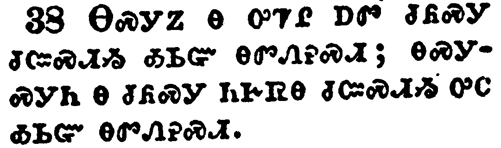</a></td>
</tr>
<tr class="even">
<td>So then he that giveth her in marriage doeth well; but he that giveth her not in marriage doeth better.</td>
</tr>
<tr class="odd">
<td>ᎾᏍᎩᏃ Ꮎ ᎤᏤᎵ ᎠᏛ ᏧᏲᏍᎩ ᏧᏨᏍᏗᏱ ᎣᏏᏳ ᎾᏛᏁᎮᏍᏗ; ᎾᏍᎩᏍᎩᏂ Ꮎ ᏧᏲᏍᎩ ᏂᎨᏒᎾ ᏧᏨᏍᏗᏱ ᎤᏟ ᎣᏏᏳ ᎾᏛᏁᎮᏍᏗ.</td>
</tr>
<tr class="even">
<td>Na-s-gi-no na u-tse-li a-dv tsu-yo-s-gi tsu-tsv-s-di-yi o-si-yu na-dv-ne-he-s-di; na-s-gi-s-gi-ni na tsu-yo-s-gi ni-ge-sv-na tsu-tsv-s-di-yi u-tli o-si-yu na-dv-ne-he-s-di.</td>
</tr>
</tbody>
</table>

<table>
<tbody>
<tr class="odd">
<td><a href="070739.png">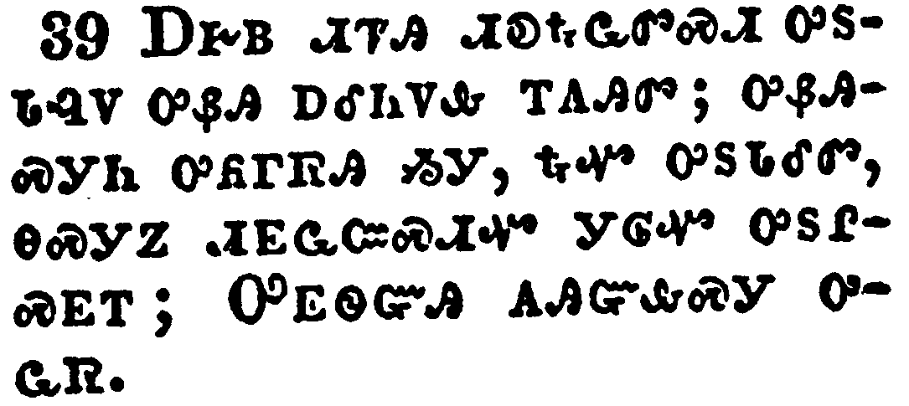</a></td>
</tr>
<tr class="even">
<td>The wife is bound by the law as long as her husband liveth; but if her husband be dead, she is at liberty to be married to whom she will; only in the Lord.</td>
</tr>
<tr class="odd">
<td>ᎠᎨᏴ ᏗᏤᎯ ᏗᎧᎿᎭᏩᏛᏍᏗ ᎤᏚᏓᎸᏙ ᎤᏰᎯ ᎠᎴᏂᏙᎲ ᎢᎪᎯᏛ; ᎤᏰᎯᏍᎩᏂ ᎤᏲᎱᏒᎯ ᏱᎩ, ᎿᎭᏉ ᎤᏚᏓᎴᏛ, ᎾᏍᎩᏃ ᏗᎬᏩᏨᏍᏗᏉ ᎩᎶᏉ ᎤᏚᎵᏍᎬᎢ; ᎤᎬᏫᏳᎯ ᎪᎩᏳᎲᏍᎩ ᎤᏩᏒ.</td>
</tr>
<tr class="even">
<td>A-ge-yv di-tse-hi di-ka-hna-wa-dv-s-di u-du-da-lv-do u-ye-hi a-le-ni-do-hv i-go-hi-dv; u-ye-hi-s-gi-ni u-yo-hu-sv-hi yi-gi, hna-quo u-du-da-le-dv, na-s-gi-no di-gv-wa-tsv-s-di-quo gi-lo-quo u-du-li-s-gv-i; U-gv-wi-yu-hi go-gi-yu-hv-s-gi u-wa-sv.</td>
</tr>
</tbody>
</table>

<table>
<tbody>
<tr class="odd">
<td><a href="070740.png">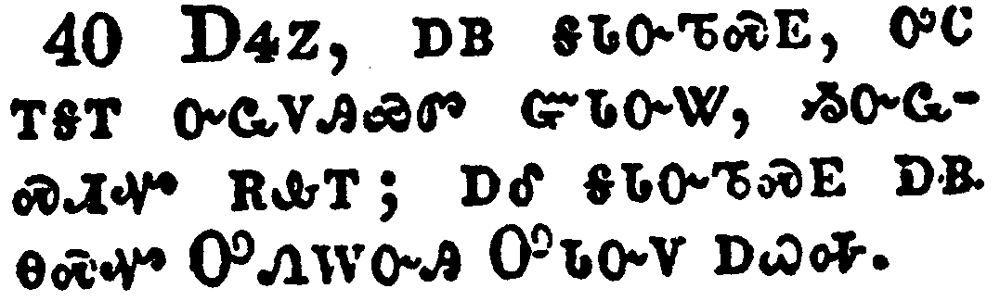</a></td>
</tr>
<tr class="even">
<td>But she is happier if she so abide, after my judgment: and I think also that I have the Spirit of God.</td>
</tr>
<tr class="odd">
<td>ᎠᏎᏃ, ᎠᏴ ᎦᏓᏅᏖᏍᎬ, ᎤᏟ ᎢᎦᎢ ᏅᏩᏙᎯᏯᏛ ᏳᏓᏅᏔ, ᏱᏅᏩᏍᏗᏉ ᎡᎲᎢ; ᎠᎴ ᎦᏓᏅᏖᏍᎬ ᎠᏴ ᎾᏍᏉ ᎤᏁᎳᏅᎯ ᎤᏓᏅᏙ ᎠᏇᎭ.</td>
</tr>
<tr class="even">
<td>A-se-no, a-yv ga-da-nv-te-s-gv, u-tli i-ga-i nv-wa-do-hi-ya-dv yu-da-nv-ta, yi-nv-wa-s-di-quo e-hv-i; a-le ga-da-nv-te-s-gv a-yv na-s-quo U-ne-la-nv-hi U-da-nv-do a-que-ha.</td>
</tr>
</tbody>
</table>

