+++
draft=false
date = 2014-12-18T21:11:07Z
title = "1 Corinthians - Chapter 10 - Cherokee New Testament"
weight = 1418955067

[taxonomies]

authors = ["Timothy Legg"]
categories = []
tags = []

[extra]
+++

<table>
<tbody>
<tr class="odd">
<td><a href="071001.png">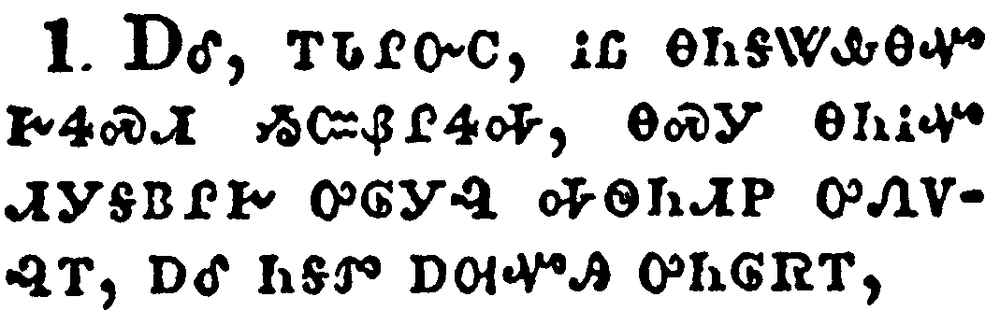</a></td>
</tr>
<tr class="even">
<td>Moreover, brethren, I would not that ye should be ignorant, how that all our fathers were under the cloud, and all passed through the sea;</td>
</tr>
<tr class="odd">
<td>ᎠᎴ, ᎢᏓᎵᏅᏟ, ᎥᏝ ᎾᏂᎦᏔᎲᎾᏉ ᎨᏎᏍᏗ ᏱᏨᏰᎵᏎᎭ, ᎾᏍᎩ ᎾᏂᎥᏉ ᏗᎩᎦᏴᎵᎨ ᎤᎶᎩᎸ ᎭᏫᏂᏗᏢ ᎤᏁᏙᎸᎢ, ᎠᎴ ᏂᎦᏛ ᎠᎺᏉᎯ ᎤᏂᎶᏒᎢ,</td>
</tr>
<tr class="even">
<td>A-le, i-da-li-nv-tli, v-tla na-ni-ga-ta-hv-na-quo ge-se-s-di yi-tsv-ye-li-se-ha, na-s-gi na-ni-v-quo di-gi-ga-yv-li-ge u-lo-gi-lv ha-wi-ni-di-tlv u-ne-do-lv-i, a-le ni-ga-dv a-me-quo-hi u-ni-lo-sv-i,</td>
</tr>
</tbody>
</table>

<table>
<tbody>
<tr class="odd">
<td><a href="071002.png">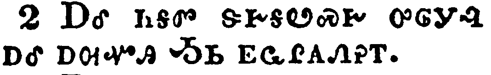</a></td>
</tr>
<tr class="even">
<td>And were all baptized unto Moses in the cloud and in the sea;</td>
</tr>
<tr class="odd">
<td>ᎠᎴ ᏂᎦᏛ ᏕᎨᎦᏬᏍᎨ ᎤᏣᎩᎸ ᎠᎴ ᎠᎺᏉᎯ ᎼᏏ ᎬᏩᎵᎪᏁᎮᎢ.</td>
</tr>
<tr class="even">
<td>A-le ni-ga-dv de-ge-ga-wo-s-ge u-tsa-gi-lv a-le a-me-quo-hi Mo-si gv-wa-li-go-ne-he-i.</td>
</tr>
</tbody>
</table>

<table>
<tbody>
<tr class="odd">
<td><a href="071003.png">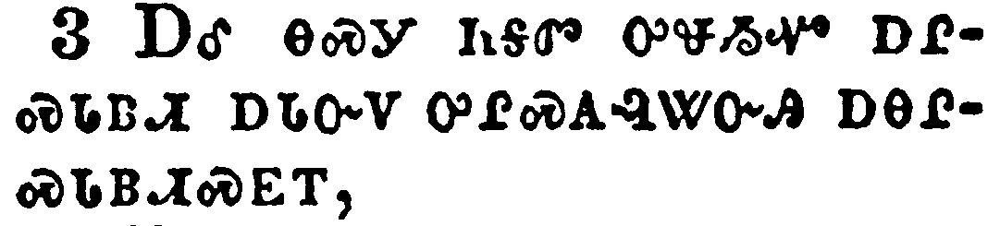</a></td>
</tr>
<tr class="even">
<td>And did all eat the same spiritual meat;</td>
</tr>
<tr class="odd">
<td>ᎠᎴ ᎾᏍᎩ ᏂᎦᏛ ᎤᏠᏱᏉ ᎠᎵᏍᏓᏴᏗ ᎠᏓᏅᏙ ᎤᎵᏍᎪᎸᏔᏅᎯ ᎠᎾᎵᏍᏓᏴᏗᏍᎬᎢ,</td>
</tr>
<tr class="even">
<td>A-le na-s-gi ni-ga-dv u-tlo-yi-quo a-li-s-da-yv-di a-da-nv-do u-li-s-go-lv-ta-nv-hi a-na-li-s-da-yv-di-s-gv-i,</td>
</tr>
</tbody>
</table>

<table>
<tbody>
<tr class="odd">
<td><a href="071004.png">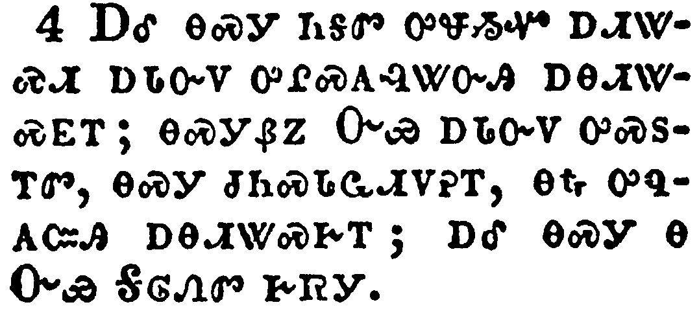</a></td>
</tr>
<tr class="even">
<td>And did all drink the same spiritual drink: for they drank of that spiritual Rock that followed them: and that Rock was Christ.</td>
</tr>
<tr class="odd">
<td>ᎠᎴ ᎾᏍᎩ ᏂᎦᏛ ᎤᏠᏱᏉ ᎠᏗᏔᏍᏗ ᎠᏓᏅᏙ ᎤᎵᏍᎪᎸᏔᏅᎯ ᎠᎾᏗᏔᏍᎬᎢ; ᎾᏍᎩᏰᏃ ᏅᏯ ᎠᏓᏅᏙ ᎤᏍᏚᎢᏛ, ᎾᏍᎩ ᏧᏂᏍᏓᏩᏗᏙᎮᎢ, ᎾᎿᎭᎤᏄᎪᏨᎯ ᎠᎾᏗᏔᏍᎨᎢ; ᎠᎴ ᎾᏍᎩ Ꮎ ᏅᏯ ᎦᎶᏁᏛ ᎨᏒᎩ.</td>
</tr>
<tr class="even">
<td>A-le na-s-gi ni-ga-dv u-tlo-yi-quo a-di-ta-s-di a-da-nv-do u-li-s-go-lv-ta-nv-hi a-na-di-ta-s-gv-i; na-s-gi-ye-no Nv-ya a-da-nv-do u-s-du-i-dv, na-s-gi tsu-ni-s-da-wa-di-do-he-i, na-hna u-nu-go-tsv-hi a-na-di-ta-s-ge-i; a-le na-s-gi na Nv-ya Ga-lo-ne-dv ge-sv-gi.</td>
</tr>
</tbody>
</table>

<table>
<tbody>
<tr class="odd">
<td><a href="071005.png">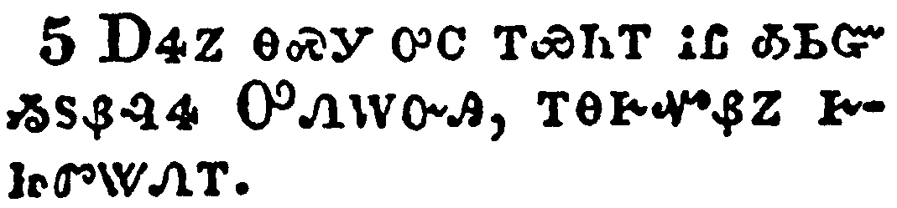</a></td>
</tr>
<tr class="even">
<td>But with many of them God was not well pleased: for they were overthrown in the wilderness.</td>
</tr>
<tr class="odd">
<td>ᎠᏎᏃ ᎾᏍᎩ ᎤᏟ ᎢᏯᏂᎢ ᎥᏝ ᎣᏏᏳ ᏱᏚᏰᎸᏎ ᎤᏁᎳᏅᎯ, ᎢᎾᎨᏉᏰᏃ ᎨᏥᏛᏔᏁᎢ.</td>
</tr>
<tr class="even">
<td>A-se-no na-s-gi u-tli i-ya-ni-i v-tla o-si-yu yi-du-ye-lv-se U-ne-la-nv-hi, i-na-ge-quo-ye-no ge-tsi-dv-ta-ne-i.</td>
</tr>
</tbody>
</table>

<table>
<tbody>
<tr class="odd">
<td><a href="071006.png">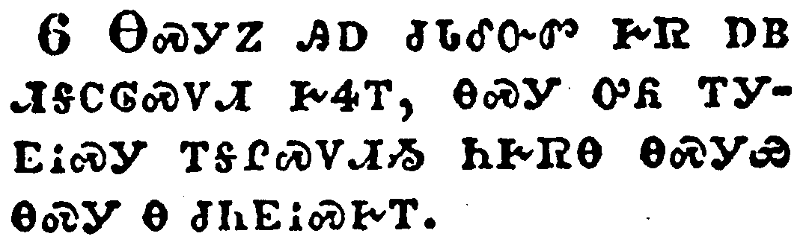</a></td>
</tr>
<tr class="even">
<td>Now these things were our examples, to the intent we should not lust after evil things, as they also lusted.</td>
</tr>
<tr class="odd">
<td>ᎾᏍᎩᏃ ᎯᎠ ᏧᏓᎴᏅᏛ ᎨᏒ ᎠᏴ ᏗᎦᏟᎶᏍᏙᏗ ᎨᏒᎢ, ᎾᏍᎩ ᎤᏲ ᎢᎩᎬᎥᏍᎩ ᎢᎦᎵᏍᏙᏗᏱ ᏂᎨᏒᎾ ᎾᏍᎩᏯ ᎾᏍᎩ Ꮎ ᏧᏂᎬᎥᏍᎨᎢ.</td>
</tr>
<tr class="even">
<td>Na-s-gi-no hi-a tsu-da-le-nv-dv ge-sv a-yv di-ga-tli-lo-s-do-di ge-sv-i, na-s-gi u-yo i-gi-gv-v-s-gi i-ga-li-s-do-di-yi ni-ge-sv-na na-s-gi-ya na-s-gi na tsu-ni-gv-v-s-ge-i.</td>
</tr>
</tbody>
</table>

<table>
<tbody>
<tr class="odd">
<td><a href="071007.png">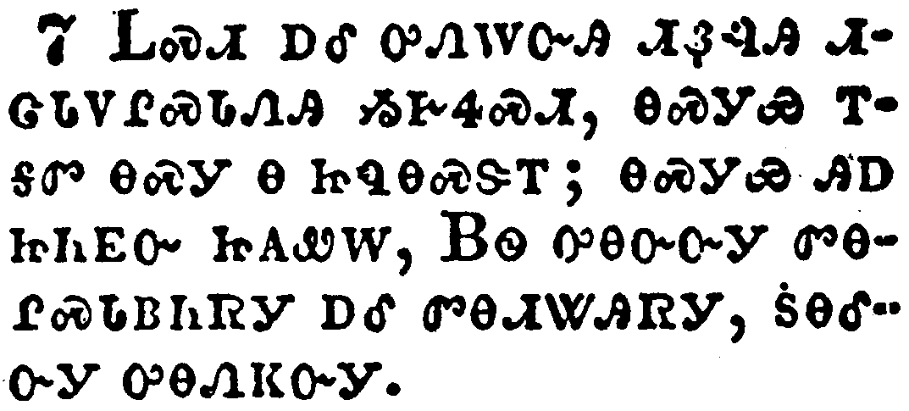</a></td>
</tr>
<tr class="even">
<td>Neither be ye idolaters, as were some of them; as it is written, The people sat down to eat and drink, and rose up to play.</td>
</tr>
<tr class="odd">
<td>ᏞᏍᏗ ᎠᎴ ᎤᏁᎳᏅᎯ ᏗᏰᎸᎯ ᏗᏣᏓᏙᎵᏍᏓᏁᎯ ᏱᎨᏎᏍᏗ, ᎾᏍᎩᏯ ᎢᎦᏛ ᎾᏍᎩ Ꮎ ᏥᏄᎾᏍᏕᎢ; ᎾᏍᎩᏯ ᎯᎠ ᏥᏂᎬᏅ ᏥᎪᏪᎳ, ᏴᏫ ᎤᎾᏅᏅᎩ ᏛᎾᎵᏍᏓᏴᏂᏒᎩ ᎠᎴ ᏛᎾᏗᏔᎯᏒᎩ, ᏚᎾᎴᏅᎩ ᎤᎾᏁᏦᏅᎩ.</td>
</tr>
<tr class="even">
<td>Tle-s-di a-le u-ne-la-nv-hi di-ye-lv-hi di-tsa-da-do-li-s-da-ne-hi yi-ge-se-s-di, na-s-gi-ya i-ga-dv na-s-gi na tsi-nu-na-s-de-i; na-s-gi-ya hi-a tsi-ni-gv-nv tsi-go-we-la, Yv-wi u-na-nv-nv-gi dv-na-li-s-da-yv-ni-sv-gi a-le dv-na-di-ta-hi-sv-gi, du-na-le-nv-gi u-na-ne-tso-nv-gi.</td>
</tr>
</tbody>
</table>

<table>
<tbody>
<tr class="odd">
<td><a href="071008.png">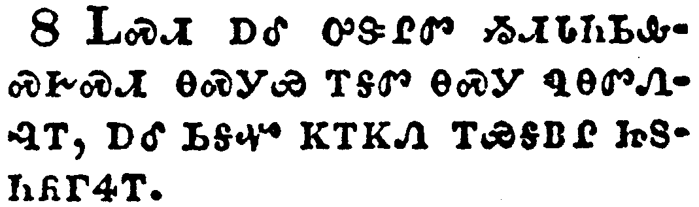</a></td>
</tr>
<tr class="even">
<td>Neither let us commit fornication, as some of them committed, and fell in one day three and twenty thousand.</td>
</tr>
<tr class="odd">
<td>ᏞᏍᏗ ᎠᎴ ᎤᏕᎵᏛ ᏱᏗᏓᏂᏏᎲᏍᎨᏍᏗ ᎾᏍᎩᏯ ᎢᎦᏛ ᎾᏍᎩ ᏄᎾᏛᏁᎸᎢ, ᎠᎴ ᏏᎦᏉ ᏦᎢᏦᏁ ᎢᏯᎦᏴᎵ ᏥᏚᏂᏲᎱᏎᎢ.</td>
</tr>
<tr class="even">
<td>Tle-s-di a-le u-de-li-dv yi-di-da-ni-si-hv-s-ge-s-di na-s-gi-ya i-ga-dv na-s-gi nu-na-dv-ne-lv-i, a-le si-ga-quo tso-i-tso-ne i-ya-ga-yv-li tsi-du-ni-yo-hu-se-i.</td>
</tr>
</tbody>
</table>

<table>
<tbody>
<tr class="odd">
<td><a href="071009.png">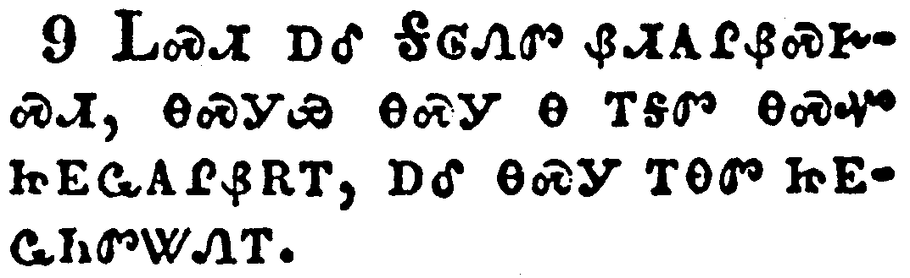</a></td>
</tr>
<tr class="even">
<td>Neither let us tempt Christ, as some of them also tempted, and were destroyed of serpents.</td>
</tr>
<tr class="odd">
<td>ᏞᏍᏗ ᎠᎴ ᎦᎶᏁᏛ ᏰᏗᎪᎵᏰᏍᎨᏍᏗ, ᎾᏍᎩᏯ ᎾᏍᎩ Ꮎ ᎢᎦᏛ ᎾᏍᏉ ᏥᎬᏩᎪᎵᏰᎡᎢ, ᎠᎴ ᎾᏍᎩ ᎢᎾᏛ ᏥᎬᏩᏂᏛᏔᏁᎢ.</td>
</tr>
<tr class="even">
<td>Tle-s-di a-le Ga-lo-ne-dv ye-di-go-li-ye-s-ge-s-di, na-s-gi-ya na-s-gi na i-ga-dv na-s-quo tsi-gv-wa-go-li-ye-e-i, a-le na-s-gi i-na-dv tsi-gv-wa-ni-dv-ta-ne-i.</td>
</tr>
</tbody>
</table>

<table>
<tbody>
<tr class="odd">
<td><a href="071010.png">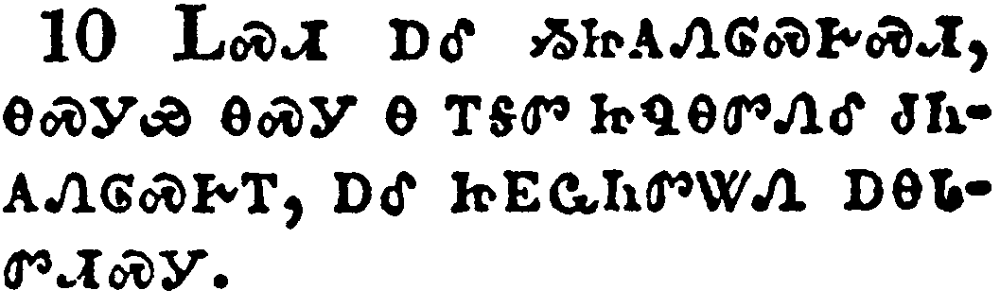</a></td>
</tr>
<tr class="even">
<td>Neither murmur ye, as some of them also murmured, and were destroyed of the destroyer.</td>
</tr>
<tr class="odd">
<td>ᏞᏍᏗ ᎠᎴ ᏱᏥᎪᏁᎶᏍᎨᏍᏗ, ᎾᏍᎩᏯ ᎾᏍᎩ Ꮎ ᎢᎦᏛ ᏥᏄᎾᏛᏁᎴ ᏧᏂᎪᏁᎶᏍᎨᎢ, ᎠᎴ ᏥᎬᏩᏂᏛᏔᏁ ᎠᎾᏓᏛᏗᏍᎩ.</td>
</tr>
<tr class="even">
<td>Tle-s-di a-le yi-tsi-go-ne-lo-s-ge-s-di, na-s-gi-ya na-s-gi na i-ga-dv tsi-nu-na-dv-ne-le tsu-ni-go-ne-lo-s-ge-i, a-le tsi-gv-wa-ni-dv-ta-ne a-na-da-dv-di-s-gi.</td>
</tr>
</tbody>
</table>

<table>
<tbody>
<tr class="odd">
<td><a href="071011.png">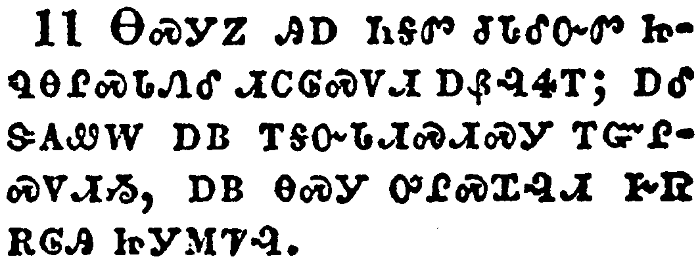</a></td>
</tr>
<tr class="even">
<td>Now all these things happened unto them for ensamples: and they are written for our admonition, upon whom the ends of the world are come.</td>
</tr>
<tr class="odd">
<td>ᎾᏍᎩᏃ ᎯᎠ ᏂᎦᏛ ᏧᏓᎴᏅᏛ ᏥᏄᎾᎵᏍᏓᏁᎴ ᏗᏟᎶᏍᏙᏗ ᎠᏰᎸᏎᎢ; ᎠᎴ ᏕᎪᏪᎳ ᎠᏴ ᎢᎦᏅᏓᏗᏍᏗᏍᎩ ᎢᏳᎵᏍᏙᏗᏱ, ᎠᏴ ᎾᏍᎩ ᎤᎵᏍᏆᎸᏗ ᎨᏒ ᎡᎶᎯ ᏥᎩᎷᏤᎸ.</td>
</tr>
<tr class="even">
<td>Na-s-gi-no hi-a ni-ga-dv tsu-da-le-nv-dv tsi-nu-na-li-s-da-ne-le di-tli-lo-s-do-di a-ye-lv-se-i; a-le de-go-we-la a-yv i-ga-nv-da-di-s-di-s-gi i-yu-li-s-do-di-yi, a-yv na-s-gi u-li-s-qua-lv-di ge-sv e-lo-hi tsi-gi-lu-tse-lv.</td>
</tr>
</tbody>
</table>

<table>
<tbody>
<tr class="odd">
<td><a href="071012.png">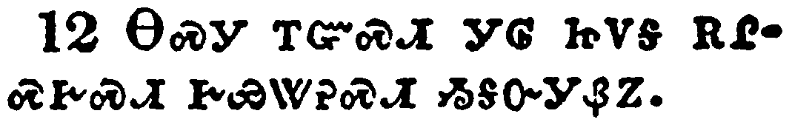</a></td>
</tr>
<tr class="even">
<td>Wherefore let him that thinketh he standeth take heed lest he fall.</td>
</tr>
<tr class="odd">
<td>ᎾᏍᎩ ᎢᏳᏍᏗ ᎩᎶ ᏥᏙᎦ ᎡᎵᏍᎨᏍᏗ ᎨᏯᏔᎮᏍᏗ ᏱᎦᏅᎩᏰᏃ.</td>
</tr>
<tr class="even">
<td>Na-s-gi i-yu-s-di gi-lo tsi-do-ga e-li-s-ge-s-di ge-ya-ta-he-s-di yi-ga-nv-gi-ye-no.</td>
</tr>
</tbody>
</table>

<table>
<tbody>
<tr class="odd">
<td><a href="071013.png">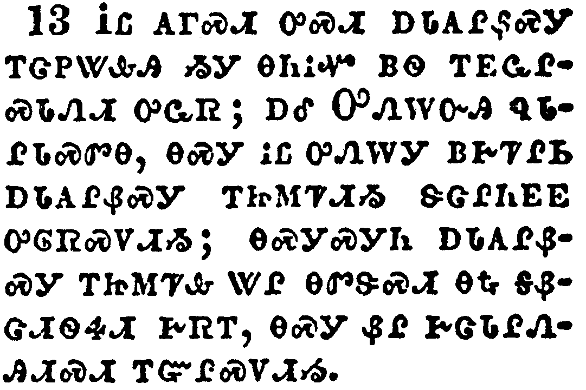</a></td>
</tr>
<tr class="even">
<td>There hath no temptation taken you but such as is common to man: but God is faithful, who will not suffer you to be tempted above that ye are able; but will with the temptation also make a way to escape, that ye may be able to bear it.</td>
</tr>
<tr class="odd">
<td>ᎥᏝ ᎪᎱᏍᏗ ᎤᏍᏗ ᎠᏓᎪᎵᏰᏍᎩ ᎢᏣᏢᏔᎲᎯ ᏱᎩ ᎾᏂᎥᏉ ᏴᏫ ᎢᎬᏩᎵᏍᏓᏁᏗ ᎤᏩᏒ; ᎠᎴ ᎤᏁᎳᏅᎯ ᏄᏓᎵᏓᏍᏛᎾ, ᎾᏍᎩ ᎥᏝ ᎤᏁᎳᎩ ᏴᎨᏤᎵᏏ ᎠᏓᎪᎵᏰᏍᎩ ᎢᏥᎷᏤᏗᏱ ᏕᏣᎵᏂᎬᎬ ᎤᎶᏒᏍᏙᏗᏱ; ᎾᏍᎩᏍᎩᏂ ᎠᏓᎪᎵᏰᏍᎩ ᎢᏥᎷᏤᎲ ᏔᎵ ᎾᏛᏕᏍᏗ ᎾᎿᎭᎦᏰᏣᏗᏫᏎᏗ ᎨᏒᎢ, ᎾᏍᎩ ᏰᎵ ᎨᏣᏓᎵᏁᎯᏗᏍᏗ ᎢᏳᎵᏍᏙᏗᏱ.</td>
</tr>
<tr class="even">
<td>V-tla go-hu-s-di u-s-di a-da-go-li-ye-s-gi i-tsa-tlv-ta-hv-hi yi-gi na-ni-v-quo yv-wi i-gv-wa-li-s-da-ne-di u-wa-sv; a-le U-ne-la-nv-hi nu-da-li-da-s-dv-na, na-s-gi v-tla u-ne-la-gi yv-ge-tse-li-si a-da-go-li-ye-s-gi i-tsi-lu-tse-di-yi de-tsa-li-ni-gv-gv u-lo-sv-s-do-di-yi; na-s-gi-s-gi-ni a-da-go-li-ye-s-gi i-tsi-lu-tse-hv ta-li na-dv-de-s-di na-hna ga-ye-tsa-di-wi-se-di ge-sv-i, na-s-gi ye-li ge-tsa-da-li-ne-hi-di-s-di i-yu-li-s-do-di-yi.</td>
</tr>
</tbody>
</table>

<table>
<tbody>
<tr class="odd">
<td></td>
</tr>
<tr class="even">
<td>Wherefore, my dearly beloved, flee from idolatry.</td>
</tr>
<tr class="odd">
<td>ᎾᏍᎩ ᎢᏳᏍᏗ, ᏂᎯ ᎢᏨᎨᏳᎢ, ᎢᏣᎵᏘ ᎢᏣᏓᏅᏏ ᎤᏁᎳᏅᎯ ᏗᏰᎸᎯ ᏗᏓᏙᎵᏍᏓᏁᏗ ᎨᏒᎢ.</td>
</tr>
<tr class="even">
<td>Na-s-gi i-yu-s-di, ni-hi i-tsv-ge-yu-i, i-tsa-li-ti i-tsa-da-nv-si U-ne-la-nv-hi di-ye-lv-hi di-da-do-li-s-da-ne-di ge-sv-i.</td>
</tr>
</tbody>
</table>

<table>
<tbody>
<tr class="odd">
<td><a href="071015.png">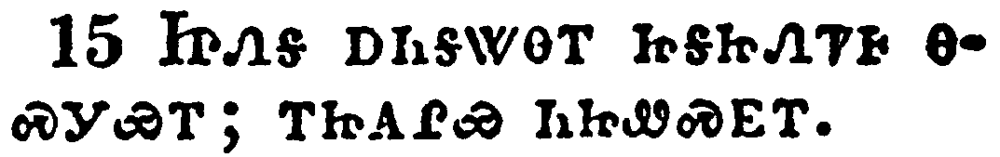</a></td>
</tr>
<tr class="even">
<td>I speak as to wise men; judge ye what I say.</td>
</tr>
<tr class="odd">
<td>ᏥᏁᎦ ᎠᏂᎦᏔᎾᎢ ᏥᎦᏥᏁᏤᎰ ᎾᏍᎩᏯᎢ; ᎢᏥᎪᎵᏯ ᏂᏥᏪᏍᎬᎢ.</td>
</tr>
<tr class="even">
<td>Tsi-ne-ga a-ni-ga-ta-na-i tsi-ga-tsi-ne-tse-ho na-s-gi-ya-i; i-tsi-go-li-ya ni-tsi-we-s-gv-i.</td>
</tr>
</tbody>
</table>

<table>
<tbody>
<tr class="odd">
<td><a href="071016.png">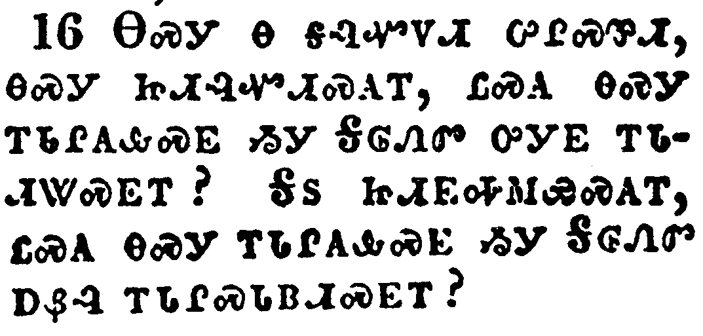</a></td>
</tr>
<tr class="even">
<td>The cup of blessing which we bless, is it not the communion of the blood of Christ? The bread which we break, is it not the communion of the body of Christ?</td>
</tr>
<tr class="odd">
<td>ᎾᏍᎩ Ꮎ ᎦᎸᏉᏙᏗ ᎤᎵᏍᏈᏗ, ᎾᏍᎩ ᏥᏗᎸᏉᏗᏍᎪᎢ, ᏝᏍᎪ ᎾᏍᎩ ᎢᏓᎵᎪᎲᏍᎬ ᏱᎩ ᎦᎶᏁᏛ ᎤᎩᎬ ᎢᏓᏗᏔᏍᎬᎢ? ᎦᏚ ᏥᏗᎬᎭᎷᏯᏍᎪᎢ, ᏝᏍᎪ ᎾᏍᎩ ᎢᏓᎵᎪᎲᏍᎬ ᏱᎩ ᎦᎶᏁᏛ ᎠᏰᎸ ᎢᏓᎵᏍᏓᏴᏗᏍᎬᎢ?</td>
</tr>
<tr class="even">
<td>Na-s-gi na ga-lv-quo-do-di u-li-s-qui-di, na-s-gi tsi-di-lv-quo-di-s-go-i, tla-s-go na-s-gi i-da-li-go-hv-s-gv yi-gi Ga-lo-ne-dv u-gi-gv i-da-di-ta-s-gv-i? Ga-du tsi-di-gv-ha-lu-ya-s-go-i, tla-s-go na-s-gi i-da-li-go-hv-s-gv yi-gi Ga-lo-ne-dv a-ye-lv i-da-li-s-da-yv-di-s-gv-i?</td>
</tr>
</tbody>
</table>

<table>
<tbody>
<tr class="odd">
<td><a href="071017.png">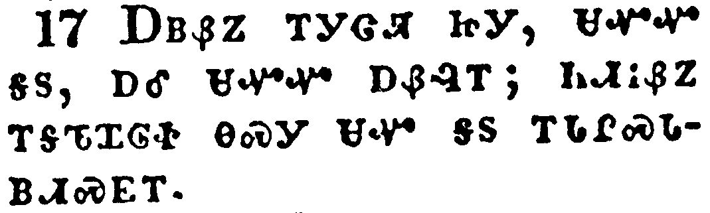</a></td>
</tr>
<tr class="even">
<td>For we being many are one bread, and one body: for we are all partakers of that one bread.</td>
</tr>
<tr class="odd">
<td>ᎠᏴᏰᏃ ᎢᎩᏣᏘ ᏥᎩ, ᏌᏉᏉ ᎦᏚ, ᎠᎴ ᏌᏉᏉ ᎠᏰᎸᎢ; ᏂᏗᎥᏰᏃ ᎢᎦᏖᏆᎶᏐ ᎾᏍᎩ ᏌᏉ ᎦᏚ ᎢᏓᎵᏍᏓᏴᏗᏍᎬᎢ.</td>
</tr>
<tr class="even">
<td>A-yv-ye-no i-gi-tsa-ti tsi-gi, sa-quo-quo ga-du, a-le sa-quo-quo a-ye-lv-i; ni-di-v-ye-no i-ga-te-qua-lo-so na-s-gi sa-quo ga-du i-da-li-s-da-yv-di-s-gv-i.</td>
</tr>
</tbody>
</table>

<table>
<tbody>
<tr class="odd">
<td><a href="071018.png">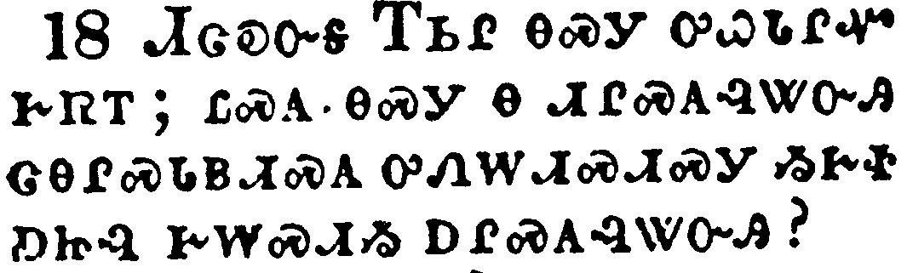</a></td>
</tr>
<tr class="even">
<td>Behold Israel after the flesh: are not they which eat of the sacrifices partakers of the alter?</td>
</tr>
<tr class="odd">
<td>ᏗᏣᎧᏅᎦ ᎢᏏᎵ ᎾᏍᎩ ᎤᏇᏓᎵᏉ ᎨᏒᎢ; ᏝᏍᎪ ᎾᏍᎩ Ꮎ ᏗᎵᏍᎪᎸᏔᏅᎯ ᏣᎾᎵᏍᏓᏴᏗᏍᎪ ᎤᏁᎳᏗᏍᏗᏍᎩ ᏱᎨᏐ ᎠᏥᎸ ᎨᎳᏍᏗᏱ ᎠᎵᏍᎪᎸᏔᏅᎯ?</td>
</tr>
<tr class="even">
<td>Di-tsa-ka-nv-ga I-si-li na-s-gi u-que-da-li-quo ge-sv-i; tla-s-go na-s-gi na di-li-s-go-lv-ta-nv-hi tsa-na-li-s-da-yv-di-s-go u-ne-la-di-s-di-s-gi yi-ge-so a-tsi-lv ge-la-s-di-yi a-li-s-go-lv-ta-nv-hi?</td>
</tr>
</tbody>
</table>

<table>
<tbody>
<tr class="odd">
<td><a href="071019.png">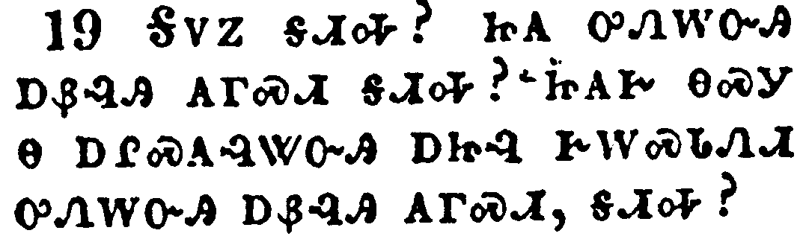</a></td>
</tr>
<tr class="even">
<td>What say I then? that the idol is any thing, or that which is offered in sacrifice to idols is any thing?</td>
</tr>
<tr class="odd">
<td>ᎦᏙᏃ ᎦᏗᎭ? ᏥᎪ ᎤᏁᎳᏅᎯ ᎠᏰᎸᎯ ᎪᎱᏍᏗ ᎦᏗᎭ? ᏥᎪᎨ ᎾᏍᎩ Ꮎ ᎠᎵᏍᎪᎸᏔᏅᎯ ᎠᏥᎸ ᎨᎳᏍᏓᏁᏗ ᎤᏁᎳᏅᎯ ᎠᏰᎸᎯ ᎪᎱᏍᏗ, ᎦᏗᎭ?</td>
</tr>
<tr class="even">
<td>Ga-do-no ga-di-ha? tsi-go u-ne-la-nv-hi a-ye-lv-hi go-hu-s-di ga-di-ha? tsi-go-ge na-s-gi na a-li-s-go-lv-ta-nv-hi a-tsi-lv ge-la-s-da-ne-di u-ne-la-nv-hi a-ye-lv-hi go-hu-s-di, ga-di-ha?</td>
</tr>
</tbody>
</table>

<table>
<tbody>
<tr class="odd">
<td><a href="071020.png">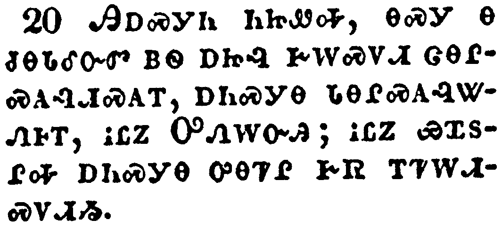</a></td>
</tr>
<tr class="even">
<td>But I say, that the things which the Gentiles sacrifice, they sacrifice to devils, and not to God: and I would not that ye should have fellowship with devils.</td>
</tr>
<tr class="odd">
<td>ᎯᎠᏍᎩᏂ ᏂᏥᏪᎭ, ᎾᏍᎩ Ꮎ ᏧᎾᏓᎴᏅᏛ ᏴᏫ ᎠᏥᎸ ᎨᎳᏍᏙᏗ ᏣᎾᎵᏍᎪᎸᏗᏍᎪᎢ, ᎠᏂᏍᎩᎾ ᏓᎾᎵᏍᎪᎸᏔᏁᎰᎢ, ᎥᏝᏃ ᎤᏁᎳᏅᎯ; ᎥᏝᏃ ᏯᏆᏚᎵᎭ ᎠᏂᏍᎩᎾ ᎤᎾᏤᎵ ᎨᏒ ᎢᏤᎳᏗᏍᏙᏗᏱ.</td>
</tr>
<tr class="even">
<td>Hi-a-s-gi-ni ni-tsi-we-ha, na-s-gi na tsu-na-da-le-nv-dv yv-wi a-tsi-lv ge-la-s-do-di tsa-na-li-s-go-lv-di-s-go-i, a-ni-s-gi-na da-na-li-s-go-lv-ta-ne-ho-i, v-tla-no U-ne-la-nv-hi; v-tla-no ya-qua-du-li-ha a-ni-s-gi-na u-na-tse-li ge-sv i-tse-la-di-s-do-di-yi.</td>
</tr>
</tbody>
</table>

<table>
<tbody>
<tr class="odd">
<td><a href="071021.png">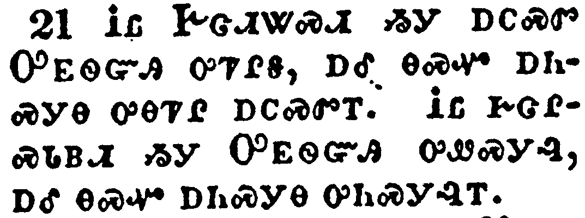</a></td>
</tr>
<tr class="even">
<td>Ye cannot drink the cup of the Lord, and the cup of devils: ye cannot be partakers of the Lord's table, and of the table of devils.</td>
</tr>
<tr class="odd">
<td>ᎥᏝ ᎨᏣᏗᏔᏍᏗ ᏱᎩ ᎠᏟᏍᏛ ᎤᎬᏫᏳᎯ ᎤᏤᎵᎦ, ᎠᎴ ᎾᏍᏉ ᎠᏂᏍᎩᎾ ᎤᎾᏤᎵ ᎠᏟᏍᏛᎢ. ᎥᏝ ᎨᏣᎵᏍᏓᏴᏗ ᏱᎩ ᎤᎬᏫᏳᎯ ᎤᏪᏍᎩᎸ, ᎠᎴ ᎾᏍᏉ ᎠᏂᏍᎩᎾ ᎤᏂᏍᎩᎸᎢ.</td>
</tr>
<tr class="even">
<td>V-tla Ge-tsa-di-ta-s-di yi-gi a-tli-s-dv U-gv-wi-yu-hi u-tse-li-ga, a-le na-s-quo a-ni-s-gi-na u-na-tse-li a-tli-s-dv-i. V-tla ge-tsa-li-s-da-yv-di yi-gi U-gv-wi-yu-hi u-we-s-gi-lv, a-le na-s-quo a-ni-s-gi-na u-ni-s-gi-lv-i.</td>
</tr>
</tbody>
</table>

<table>
<tbody>
<tr class="odd">
<td><a href="071022.png">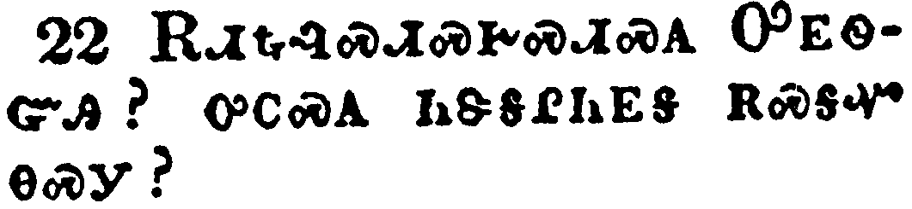</a></td>
</tr>
<tr class="even">
<td>Do we provoke the Lord to jealousy? are we stronger than he?</td>
</tr>
<tr class="odd">
<td>ᎡᏗᎿᎭᎸᏍᏗᏍᎨᏍᏗᏍᎪ ᎤᎬᏫᏳᎯ? ᎤᏟᏍᎪ ᏂᏕᎦᎵᏂᎬᎦ ᎡᏍᎦᏉ ᎾᏍᎩ?</td>
</tr>
<tr class="even">
<td>E-di-hna-lv-s-di-s-ge-s-di-s-go U-gv-wi-yu-hi? u-tli-s-go ni-de-ga-li-ni-gv-ga e-s-ga-quo na-s-gi?</td>
</tr>
</tbody>
</table>

<table>
<tbody>
<tr class="odd">
<td><a href="071023.png">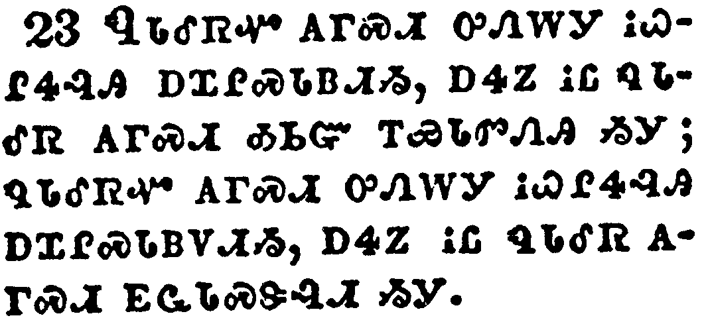</a></td>
</tr>
<tr class="even">
<td>All things are lawful for me, but all things are not expedient: all things are lawful for me, but all things edify not.</td>
</tr>
<tr class="odd">
<td>ᏄᏓᎴᏒᏉ ᎪᎱᏍᏗ ᎤᏁᎳᎩ ᎥᏇᎵᏎᎸᎯ ᎠᏆᎵᏍᏓᏴᏗᏱ, ᎠᏎᏃ ᎥᏝ ᏄᏓᎴᏒ ᎪᎱᏍᏗ ᎣᏏᏳ ᎢᏯᏓᏛᏁᎯ ᏱᎩ; ᏄᏓᎴᏒᏉ ᎪᎱᏍᏗ ᎤᏁᎳᎩ ᎥᏇᎵᏎᎸᎯ ᎠᏆᎵᏍᏓᏴᏙᏗᏱ, ᎠᏎᏃ ᎥᏝ ᏄᏓᎴᏒ ᎪᎱᏍᏗ ᎬᏩᏓᏍᏕᎸᏗ ᏱᎩ.</td>
</tr>
<tr class="even">
<td>Nu-da-le-sv-quo go-hu-s-di u-ne-la-gi v-que-li-se-lv-hi a-qua-li-s-da-yv-di-yi, a-se-no v-tla nu-da-le-sv go-hu-s-di o-si-yu i-ya-da-dv-ne-hi yi-gi; nu-da-le-sv-quo go-hu-s-di u-ne-la-gi v-que-li-se-lv-hi a-qua-li-s-da-yv-do-di-yi, a-se-no v-tla nu-da-le-sv go-hu-s-di gv-wa-da-s-de-lv-di yi-gi.</td>
</tr>
</tbody>
</table>

<table>
<tbody>
<tr class="odd">
<td><a href="071024.png">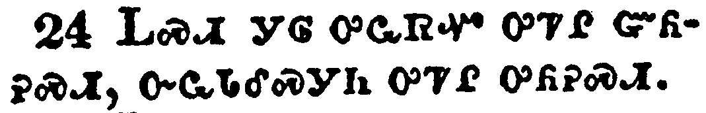</a></td>
</tr>
<tr class="even">
<td>Let no man seek his own, but every man another's wealth.</td>
</tr>
<tr class="odd">
<td>ᏞᏍᏗ ᎩᎶ ᎤᏩᏒᏉ ᎤᏤᎵ ᏳᏲᎮᏍᏗ, ᏅᏩᏓᎴᏍᎩᏂ ᎤᏤᎵ ᎤᏲᎮᏍᏗ.</td>
</tr>
<tr class="even">
<td>Tle-s-di gi-lo u-wa-sv-quo u-tse-li yu-yo-he-s-di, nv-wa-da-le-s-gi-ni u-tse-li u-yo-he-s-di.</td>
</tr>
</tbody>
</table>

<table>
<tbody>
<tr class="odd">
<td><a href="071025.png">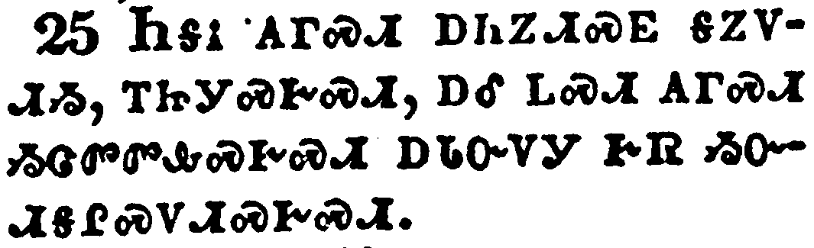</a></td>
</tr>
<tr class="even">
<td>Whatsoever is sold in the shambles, that eat, asking no question for conscience sake:</td>
</tr>
<tr class="odd">
<td>ᏂᎦᎥ ᎪᎱᏍᏗ ᎠᏂᏃᏗᏍᎬ ᎦᏃᏙᏗᏱ, ᎢᏥᎩᏍᎨᏍᏗ, ᎠᎴ ᏝᏍᏗ ᎪᎱᏍᏗ ᏱᏣᏛᏛᎲᏍᎨᏍᏗ ᎠᏓᏅᏙᎩ ᎨᏒ ᏱᏅᏗᎦᎵᏍᏙᏗᏍᎨᏍᏗ.</td>
</tr>
<tr class="even">
<td>Ni-ga-v go-hu-s-di a-ni-no-di-s-gv ga-no-do-di-yi, i-tsi-gi-s-ge-s-di, a-le tla-s-di go-hu-s-di yi-tsa-dv-dv-hv-s-ge-s-di a-da-nv-do-gi ge-sv yi-nv-di-ga-li-s-do-di-s-ge-s-di.</td>
</tr>
</tbody>
</table>

<table>
<tbody>
<tr class="odd">
<td><a href="071026.png">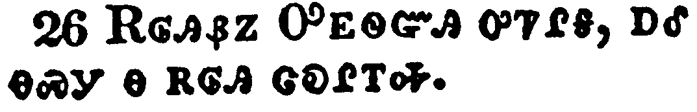</a></td>
</tr>
<tr class="even">
<td>For the earth is the Lord's, and the fulness thereof.</td>
</tr>
<tr class="odd">
<td>ᎡᎶᎯᏰᏃ ᎤᎬᏫᏳᎯ ᎤᏤᎵᎦ, ᎠᎴ ᎾᏍᎩ Ꮎ ᎡᎶᎯ ᏣᎧᎵᎢᎭ.</td>
</tr>
<tr class="even">
<td>E-lo-hi-ye-no U-gv-wi-yu-hi u-tse-li-ga, a-le na-s-gi na e-lo-hi tsa-ka-li-i-ha.</td>
</tr>
</tbody>
</table>

<table>
<tbody>
<tr class="odd">
<td><a href="071027.png">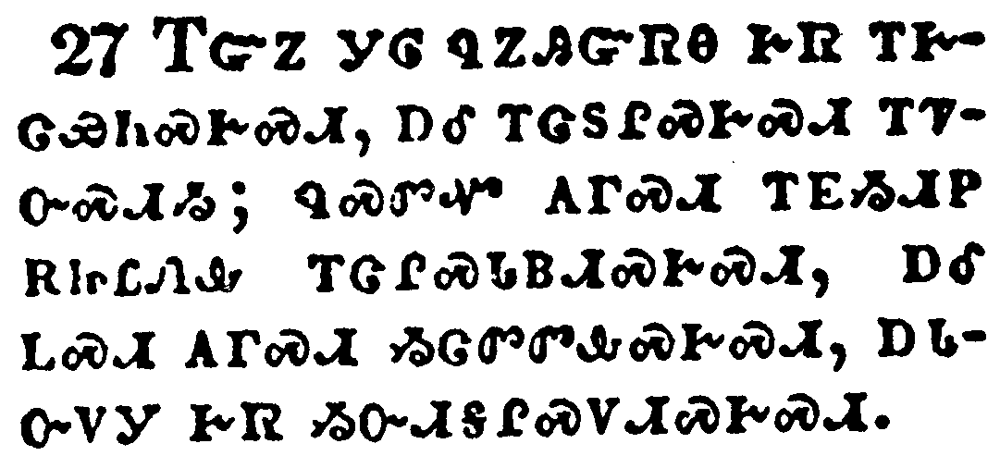</a></td>
</tr>
<tr class="even">
<td>If any of them that believe not bid you to a feast, and ye be disposed to go; whatsoever is set before you, eat, asking no question for conscience sake.</td>
</tr>
<tr class="odd">
<td>ᎢᏳᏃ ᎩᎶ ᏄᏃᎯᏳᏒᎾ ᎨᏒ ᎢᎨᏣᏯᏂᏍᎨᏍᏗ, ᎠᎴ ᎢᏣᏚᎵᏍᎨᏍᏗ ᎢᏤᏅᏍᏗᏱ; ᏄᏍᏛᏉ ᎪᎱᏍᏗ ᎢᎬᏱᏗᏢ ᎡᏥᏝᏁᎲ ᎢᏣᎵᏍᏓᏴᏗᏍᎨᏍᏗ, ᎠᎴ ᏞᏍᏗ ᎪᎱᏍᏗ ᏱᏣᏛᏛᎲᏍᎨᏍᏗ, ᎠᏓᏅᏙᎩ ᎨᏒ ᏱᏅᏗᎦᎵᏍᏙᏗᏍᎨᏍᏗ.</td>
</tr>
<tr class="even">
<td>I-yu-no gi-lo nu-no-hi-yu-sv-na ge-sv i-ge-tsa-ya-ni-s-ge-s-di, a-le i-tsa-du-li-s-ge-s-di i-tse-nv-s-di-yi; nu-s-dv-quo go-hu-s-di i-gv-yi-di-tlv e-tsi-tla-ne-hv i-tsa-li-s-da-yv-di-s-ge-s-di, a-le tle-s-di go-hu-s-di yi-tsa-dv-dv-hv-s-ge-s-di, a-da-nv-do-gi ge-sv yi-nv-di-ga-li-s-do-di-s-ge-s-di.</td>
</tr>
</tbody>
</table>

<table>
<tbody>
<tr class="odd">
<td><a href="071028.png">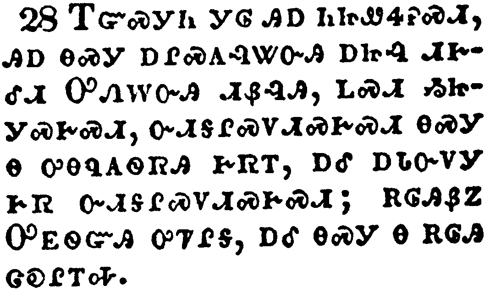</a></td>
</tr>
<tr class="even">
<td>But if any man say unto you, This is offered in sacrifice unto idols, eat not for his sake that shewed it, and for conscience sake: for the earth is the Lord's, and the fulness thereof:</td>
</tr>
<tr class="odd">
<td>ᎢᏳᏍᎩᏂ ᎩᎶ ᎯᎠ ᏂᏥᏪᏎᎮᏍᏗ, ᎯᎠ ᎾᏍᎩ ᎠᎵᏍᎪᎸᏔᏅᎯ ᎠᏥᎸ ᏗᎨᎴᏗ ᎤᏁᎳᏅᎯ ᏗᏰᎸᎯ, ᏞᏍᏗ ᏱᏥᎩᏍᎨᏍᏗ, ᏅᏗᎦᎵᏍᏙᏗᏍᎨᏍᏗ ᎾᏍᎩ Ꮎ ᎤᎾᏄᎪᏫᏒᎯ ᎨᏒᎢ, ᎠᎴ ᎠᏓᏅᏙᎩ ᎨᏒ ᏅᏗᎦᎵᏍᏙᏗᏍᎨᏍᏗ; ᎡᎶᎯᏰᏃ ᎤᎬᏫᏳᎯ ᎤᏤᎵᎦ, ᎠᎴ ᎾᏍᎩ Ꮎ ᎡᎶᎯ ᏣᎧᎵᎢᎭ.</td>
</tr>
<tr class="even">
<td>I-yu-s-gi-ni gi-lo hi-a ni-tsi-we-se-he-s-di, hi-a na-s-gi a-li-s-go-lv-ta-nv-hi a-tsi-lv di-ge-le-di U-ne-la-nv-hi di-ye-lv-hi, tle-s-di yi-tsi-gi-s-ge-s-di, nv-di-ga-li-s-do-di-s-ge-s-di na-s-gi na u-na-nu-go-wi-sv-hi ge-sv-i, a-le a-da-nv-do-gi ge-sv nv-di-ga-li-s-do-di-s-ge-s-di; e-lo-hi-ye-no U-gv-wi-yu-hi u-tse-li-ga, a-le na-s-gi na e-lo-hi tsa-ka-li-i-ha.</td>
</tr>
</tbody>
</table>

<table>
<tbody>
<tr class="odd">
<td><a href="071029.png">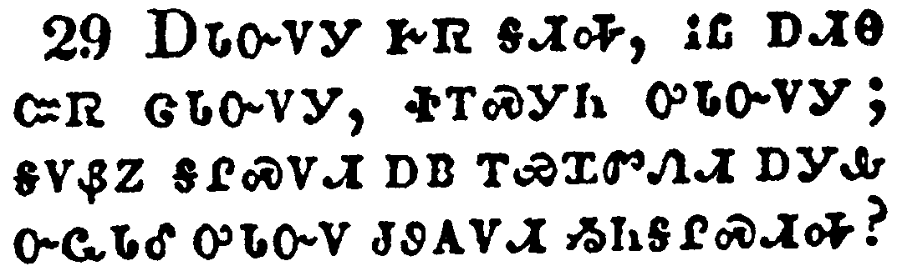</a></td>
</tr>
<tr class="even">
<td>Conscience, I say, not thine own, but of the other: for why is my liberty judged of another man's conscience?</td>
</tr>
<tr class="odd">
<td>ᎠᏓᏅᏙᎩ ᎨᏒ ᎦᏗᎭ, ᎥᏝ ᎠᏗᎾ ᏨᏒ ᏣᏓᏅᏙᎩ, ᏐᎢᏍᎩᏂ ᎤᏓᏅᏙᎩ; ᎦᏙᏰᏃ ᎦᎵᏍᏙᏗ ᎠᏴ ᎢᏯᏆᏛᏁᏗ ᎠᎩᎲ ᏅᏩᏓᎴ ᎤᏓᏅᏙ ᏧᏭᎪᏙᏗ ᏱᏂᎦᎵᏍᏗᎭ?</td>
</tr>
<tr class="even">
<td>A-da-nv-do-gi ge-sv ga-di-ha, v-tla a-di-na tsv-sv tsa-da-nv-do-gi, so-i-s-gi-ni u-da-nv-do-gi; ga-do-ye-no ga-li-s-do-di a-yv i-ya-qua-dv-ne-di a-gi-hv nv-wa-da-le u-da-nv-do tsu-wu-go-do-di yi-ni-ga-li-s-di-ha?</td>
</tr>
</tbody>
</table>

<table>
<tbody>
<tr class="odd">
<td><a href="071030.png">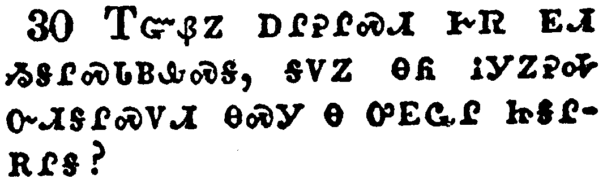</a></td>
</tr>
<tr class="even">
<td>For if I by grace be a partaker, why am I evil spoken of for that for which I give thanks?</td>
</tr>
<tr class="odd">
<td>ᎢᏳᏰᏃ ᎠᎵᎮᎵᏍᏗ ᎨᏒ ᎬᏗ ᏱᎦᎵᏍᏓᏴᎲᏍᎦ, ᎦᏙᏃ ᎾᏲ ᎥᎩᏃᎮᎭ ᏅᏗᎦᎵᏍᏙᏗ ᎾᏍᎩ Ꮎ ᎤᎬᏩᎵ ᏥᎦᎵᎡᎵᎦ?</td>
</tr>
<tr class="even">
<td>I-yu-ye-no a-li-he-li-s-di ge-sv gv-di yi-ga-li-s-da-yv-hv-s-ga, ga-do-no na-yo v-gi-no-he-ha nv-di-ga-li-s-do-di na-s-gi na u-gv-wa-li tsi-ga-li-e-li-ga?</td>
</tr>
</tbody>
</table>

<table>
<tbody>
<tr class="odd">
<td><a href="071031.png">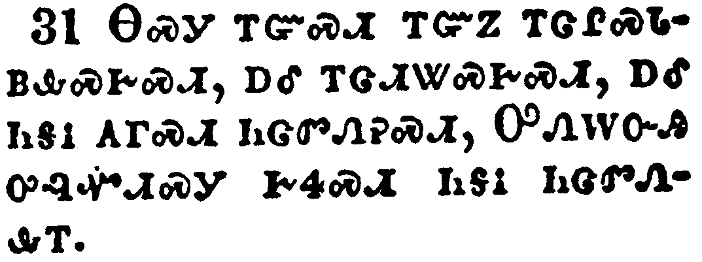</a></td>
</tr>
<tr class="even">
<td>Whether therefore ye eat, or drink, or whatsoever ye do, do all to the glory of God.</td>
</tr>
<tr class="odd">
<td>ᎾᏍᎩ ᎢᏳᏍᏗ ᎢᏳᏃ ᎢᏣᎵᏍᏓᏴᎲᏍᎨᏍᏗ, ᎠᎴ ᎢᏣᏗᏔᏍᎨᏍᏗ, ᎠᎴ ᏂᎦᎥ ᎪᎱᏍᏗ ᏂᏣᏛᏁᎮᏍᏗ, ᎤᏁᎳᏅᎯ ᎤᎸᏉᏗᏍᎩ ᎨᏎᏍᏗ ᏂᎦᎥ ᏂᏣᏛᏁᎲᎢ.</td>
</tr>
<tr class="even">
<td>Na-s-gi i-yu-s-di i-yu-no i-tsa-li-s-da-yv-hv-s-ge-s-di, a-le i-tsa-di-ta-s-ge-s-di, a-le ni-ga-v go-hu-s-di ni-tsa-dv-ne-he-s-di, U-ne-la-nv-hi u-lv-quo-di-s-gi ge-se-s-di ni-ga-v ni-tsa-dv-ne-hv-i.</td>
</tr>
</tbody>
</table>

<table>
<tbody>
<tr class="odd">
<td><a href="071032.png">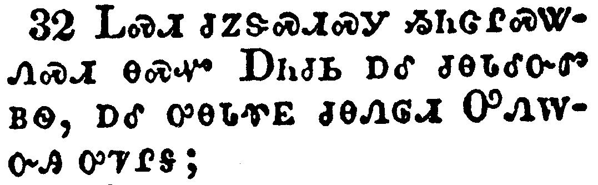</a></td>
</tr>
<tr class="even">
<td>Give none offence, neither to the Jews, nor to the Gentiles, nor to the church of God:</td>
</tr>
<tr class="odd">
<td>ᏞᏍᏗ ᏧᏃᏕᏍᏗᏍᎩ ᏱᏂᏣᎵᏍᏔᏁᏍᏗ ᎾᏍᏉ ᎠᏂᏧᏏ ᎠᎴ ᏧᎾᏓᎴᏛ ᏴᏫ, ᎠᎴ ᎤᎾᏓᏡᎬ ᏧᎾᏁᎶᏗ ᎤᏁᎳᎥᎯ ᎤᏤᎵᎦ;</td>
</tr>
<tr class="even">
<td>Tle-s-di tsu-no-de-s-di-s-gi yi-ni-tsa-li-s-ta-ne-s-di na-s-quo A-ni-tsu-si a-le tsu-na-da-le-dv yv-wi, a-le u-na-da-tlu-gv tsu-na-ne-lo-di U-ne-la-v-hi u-tse-li-ga;</td>
</tr>
</tbody>
</table>

<table>
<tbody>
<tr class="odd">
<td><a href="071033.png">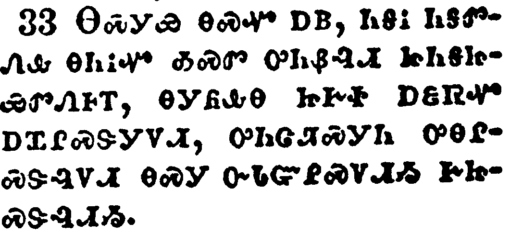</a></td>
</tr>
<tr class="even">
<td>Even as I please all men in all things, not seeking mine own profit, but the profit of many, that they may be saved.</td>
</tr>
<tr class="odd">
<td>ᎾᏍᎩᏯ ᎾᏍᏉ ᎠᏴ, ᏂᎦᎥ ᏂᎦᏛᏁᎲ ᎾᏂᎥᏉ ᎣᏍᏛ ᎤᏂᏰᎸᏗ ᏥᏂᎦᏥᏯᏛᏁᎰᎢ, ᎾᎩᏲᎲᎾ ᏥᎨᏐ ᎠᏋᏒᏉ ᎠᏆᎵᏍᏕᎩᏙᏗ, ᎤᏂᏣᏘᏍᎩᏂ ᎤᎾᎵᏍᏕᎸᏙᏗ ᎾᏍᎩ ᏅᏓᏳᎵᏍᏙᏗᏱ ᎨᏥᏍᏕᎸᏗᏱ.</td>
</tr>
<tr class="even">
<td>Na-s-gi-ya na-s-quo a-yv, ni-ga-v ni-ga-dv-ne-hv na-ni-v-quo o-s-dv u-ni-ye-lv-di tsi-ni-ga-tsi-ya-dv-ne-ho-i, na-gi-yo-hv-na tsi-ge-so a-quv-sv-quo a-qua-li-s-de-gi-do-di, u-ni-tsa-ti-s-gi-ni u-na-li-s-de-lv-do-di na-s-gi nv-da-yu-li-s-do-di-yi ge-tsi-s-de-lv-di-yi.</td>
</tr>
</tbody>
</table>

