+++
draft=false
date = 2014-12-18T21:11:07Z
title = "1 Corinthians - Chapter 15 - Cherokee New Testament"
weight = 1418955067

[taxonomies]

authors = ["Timothy Legg"]
categories = []
tags = []

[extra]
+++

<table>
<tbody>
<tr class="odd">
<td><a href="071501.png">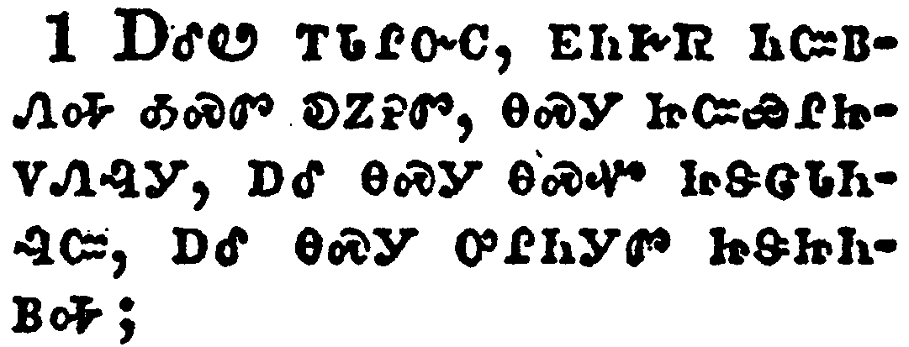</a></td>
</tr>
<tr class="even">
<td>Moreover, brethren, I declare unto you the gospel which I preached unto you, which also ye have received, and wherein ye stand;</td>
</tr>
<tr class="odd">
<td>ᎠᎴᏬ ᎢᏓᎵᏅᏟ, ᎬᏂᎨᏒ ᏂᏨᏴᏁᎭ ᎣᏍᏛ ᎧᏃᎮᏛ, ᎾᏍᎩ ᏥᏨᏯᎵᏥᏙᏁᎸᎩ, ᎠᎴ ᎾᏍᎩ ᎾᏍᏉ ᏥᏕᏣᏓᏂᎸᏨ, ᎠᎴ ᎾᏍᎩ ᎤᎵᏂᎩᏛ ᏥᏕᏥᏂᏴᎭ;</td>
</tr>
<tr class="even">
<td>A-le-wo i-da-li-nv-tli, gv-ni-ge-sv ni-tsv-yv-ne-ha o-s-dv ka-no-he-dv, na-s-gi tsi-tsv-ya-li-tsi-do-ne-lv-gi, a-le na-s-gi na-s-quo tsi-de-tsa-da-ni-lv-tsv, a-le na-s-gi u-li-ni-gi-dv tsi-de-tsi-ni-yv-ha;</td>
</tr>
</tbody>
</table>

<table>
<tbody>
<tr class="odd">
<td><a href="071502.png">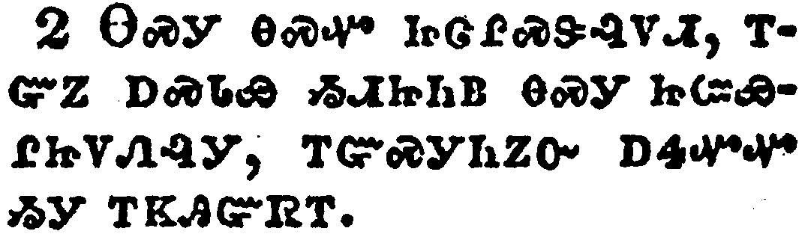</a></td>
</tr>
<tr class="even">
<td>By which also ye are saved, if ye keep in memory what I preached unto you, unless ye have believed in vain.</td>
</tr>
<tr class="odd">
<td>ᎾᏍᎩ ᎾᏍᏉ ᏥᏣᎵᏍᏕᎸᏙᏗ, ᎢᏳᏃ ᎠᏍᏓᏯ ᏱᏗᏥᏂᏴ ᎾᏍᎩ ᏥᏨᏯᎵᏥᏙᏁᎸᎩ, ᎢᏳᏍᎩᏂᏃᏅ ᎠᏎᏉᏉ ᏱᎩ ᎢᏦᎯᏳᏒᎢ.</td>
</tr>
<tr class="even">
<td>Na-s-gi na-s-quo tsi-tsa-li-s-de-lv-do-di, i-yu-no a-s-da-ya yi-di-tsi-ni-yv na-s-gi tsi-tsv-ya-li-tsi-do-ne-lv-gi, i-yu-s-gi-ni-no-nv a-se-quo-quo yi-gi i-tso-hi-yu-sv-i.</td>
</tr>
</tbody>
</table>

<table>
<tbody>
<tr class="odd">
<td><a href="071503.png">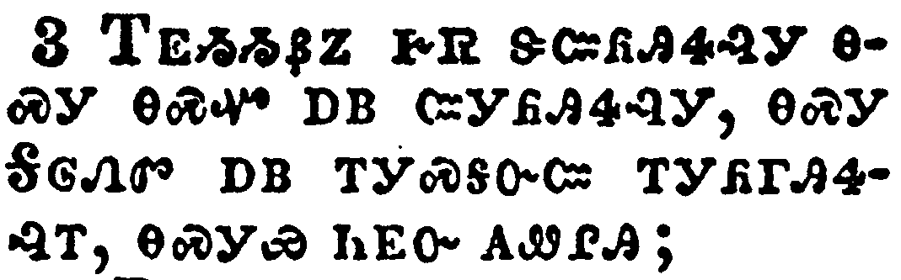</a></td>
</tr>
<tr class="even">
<td>For I delivered unto you first of all that which I also received, how that Christ died for our sins according to the scriptures;</td>
</tr>
<tr class="odd">
<td>ᎢᎬᏱᏱᏰᏃ ᎨᏒ ᏕᏣᏲᎯᏎᎸᎩ ᎾᏍᎩ ᎾᏍᏉ ᎠᏴ ᏨᎩᏲᎯᏎᎸᎩ, ᎾᏍᎩ ᎦᎶᏁᏛ ᎠᏴ ᎢᎩᏍᎦᏅᏨ ᎢᎩᏲᎱᎯᏎᎸᎢ, ᎾᏍᎩᏯ ᏂᎬᏅ ᎪᏪᎵᎯ;</td>
</tr>
<tr class="even">
<td>I-gv-yi-yi-ye-no ge-sv de-tsa-yo-hi-se-lv-gi na-s-gi na-s-quo a-yv tsv-gi-yo-hi-se-lv-gi, na-s-gi Ga-lo-ne-dv a-yv i-gi-s-ga-nv-tsv i-gi-yo-hu-hi-se-lv-i, na-s-gi-ya ni-gv-nv go-we-li-hi;</td>
</tr>
</tbody>
</table>

<table>
<tbody>
<tr class="odd">
<td><a href="071504.png">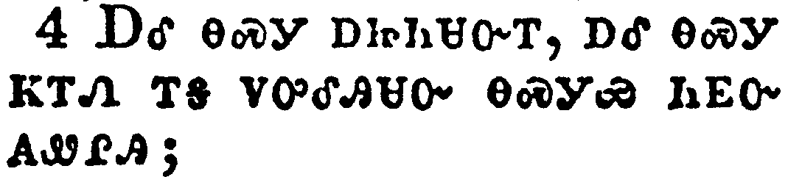</a></td>
</tr>
<tr class="even">
<td>And that he was buried, and that he rose again the third day according to the scriptures:</td>
</tr>
<tr class="odd">
<td>ᎠᎴ ᎾᏍᎩ ᎠᏥᏂᏌᏅᎢ, ᎠᎴ ᎾᏍᎩ ᏦᎢᏁ ᎢᎦ ᏙᎤᎴᎯᏌᏅ ᎾᏍᎩᏯ ᏂᎬᏅᎪᏪᎵᎯ;</td>
</tr>
<tr class="even">
<td>A-le na-s-gi a-tsi-ni-sa-nv-i, a-le na-s-gi tso-i-ne i-ga do-u-le-hi-sa-nv na-s-gi-ya ni-gv-nv-go-we-li-hi;</td>
</tr>
</tbody>
</table>

<table>
<tbody>
<tr class="odd">
<td><a href="071505.png">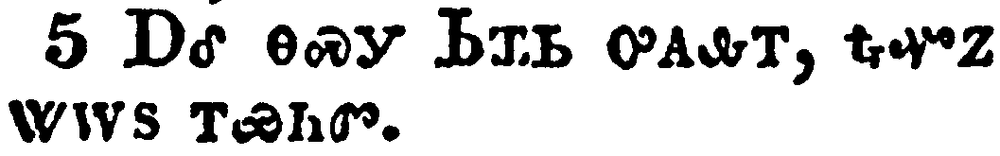</a></td>
</tr>
<tr class="even">
<td>And that he was seen of Cephas, then of the twelve:</td>
</tr>
<tr class="odd">
<td>ᎠᎴ ᎾᏍᎩ ᏏᏆᏏ ᎤᎪᎲᎢ, ᎿᎭᏉᏃ ᏔᎳᏚ ᎢᏯᏂᏛ.</td>
</tr>
<tr class="even">
<td>A-le na-s-gi Si-qua-si u-go-hv-i, hna-quo-no ta-la-du i-ya-ni-dv.</td>
</tr>
</tbody>
</table>

<table>
<tbody>
<tr class="odd">
<td><a href="071506.png">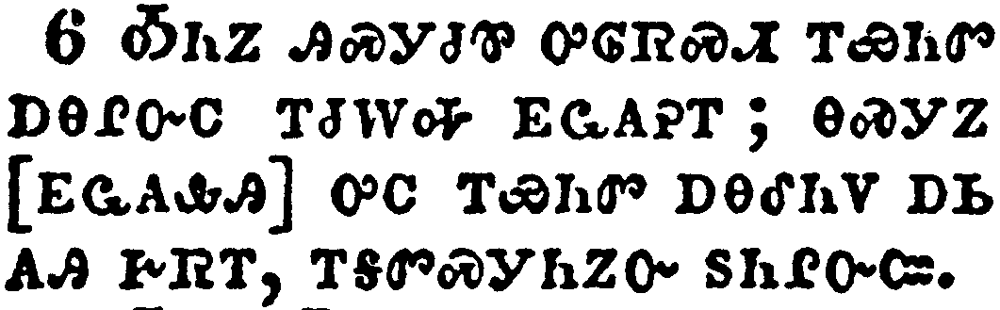</a></td>
</tr>
<tr class="even">
<td>After that, he was seen of above five hundred brethren at once; of whom the greater part remain unto this present, but some are fallen asleep.</td>
</tr>
<tr class="odd">
<td>ᎣᏂᏃ ᎯᏍᎩᏧᏈ ᎤᎶᏒᏍᏗ ᎢᏯᏂᏛ ᎠᎾᎵᏅᏟ ᎢᏧᎳᎭ ᎬᏩᎪᎮᎢ; ᎾᏍᎩᏃ [ᎬᏩᎪᎲᎯ] ᎤᏟ ᎢᏯᏂᏛ ᎠᎾᎴᏂᏙ ᎠᏏ ᎪᎯ ᎨᏒᎢ, ᎢᎦᏛᏍᎩᏂᏃᏅ ᏚᏂᎵᏅᏨ.</td>
</tr>
<tr class="even">
<td>O-ni-no hi-s-gi-tsu-qui u-lo-sv-s-di i-ya-ni-dv a-na-li-nv-tli i-tsu-la-ha gv-wa-go-he-i; na-s-gi-no [gv-wa-go-hv-hi] u-tli i-ya-ni-dv a-na-le-ni-do a-si go-hi ge-sv-i, i-ga-dv-s-gi-ni-no-nv du-ni-li-nv-tsv.</td>
</tr>
</tbody>
</table>

<table>
<tbody>
<tr class="odd">
<td><a href="071507.png">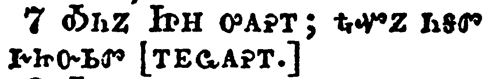</a></td>
</tr>
<tr class="even">
<td>After that, he was seen of James; then of all the apostles.</td>
</tr>
<tr class="odd">
<td>ᎣᏂᏃ ᏥᎻ ᎤᎪᎮᎢ; ᎿᎭᏉᏃ ᏂᎦᏛ ᎨᏥᏅᏏᏛ [ᎢᎬᏩᎪᎮᎢ.]</td>
</tr>
<tr class="even">
<td>O-ni-no Tsi-mi u-go-he-i; hna-quo-no ni-ga-dv ge-tsi-nv-si-dv [i-gv-wa-go-he-i.]</td>
</tr>
</tbody>
</table>

<table>
<tbody>
<tr class="odd">
<td><a href="071508.png">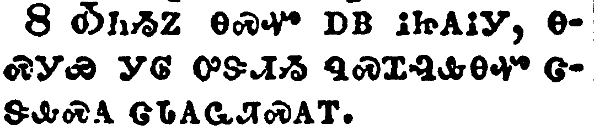</a></td>
</tr>
<tr class="even">
<td>And last of all he was seen of me also, as of one born out of due time.</td>
</tr>
<tr class="odd">
<td>ᎣᏂᏱᏃ ᎾᏍᏉ ᎠᏴ ᎥᏥᎪᎥᎩ, ᎾᏍᎩᏯ ᎩᎶ ᎤᏕᏗᏱ ᏄᏍᏆᎸᎲᎾᏉ ᏣᏕᎲᏍᎪ ᏣᏓᎪᏩᏘᏍᎪᎢ.</td>
</tr>
<tr class="even">
<td>O-ni-yi-no na-s-quo a-yv v-tsi-go-v-gi, na-s-gi-ya gi-lo u-de-di-yi nu-s-qua-lv-hv-na-quo tsa-de-hv-s-go tsa-da-go-wa-ti-s-go-i.</td>
</tr>
</tbody>
</table>

<table>
<tbody>
<tr class="odd">
<td><a href="071509.png">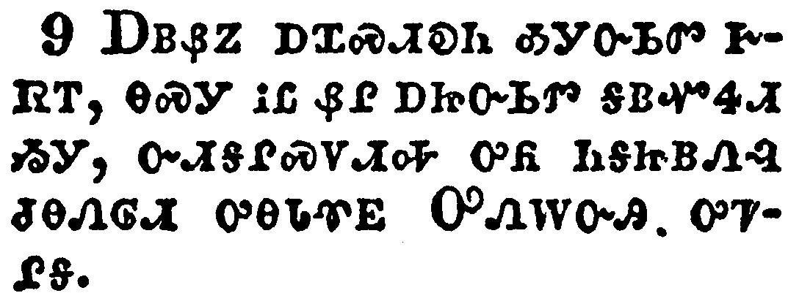</a></td>
</tr>
<tr class="even">
<td>For I am the least of the apostles, that am not meet to be called an apostle, because I persecuted the church of God.</td>
</tr>
<tr class="odd">
<td>ᎠᏴᏰᏃ ᎠᏆᏍᏗᎧᏂ ᎣᎩᏅᏏᏛ ᎨᏒᎢ, ᎾᏍᎩ ᎥᏝ ᏰᎵ ᎠᏥᏅᏏᏛ ᎦᏴᏉᏎᏗ ᏱᎩ, ᏅᏗᎦᎵᏍᏙᏗᎭ ᎤᏲ ᏂᎦᏥᏴᏁᎸ ᏧᎾᏁᎶᏗ ᎤᎾᏓᏡᎬ ᎤᏁᎳᏅᎯ ᎤᏤᎵᎦ.</td>
</tr>
<tr class="even">
<td>A-yv-ye-no a-qua-s-di-ka-ni o-gi-nv-si-dv ge-sv-i, na-s-gi v-tla ye-li a-tsi-nv-si-dv ga-yv-quo-se-di yi-gi, nv-di-ga-li-s-do-di-ha u-yo ni-ga-tsi-yv-ne-lv tsu-na-ne-lo-di u-na-da-tlu-gv U-ne-la-nv-hi u-tse-li-ga.</td>
</tr>
</tbody>
</table>

<table>
<tbody>
<tr class="odd">
<td><a href="071510.png">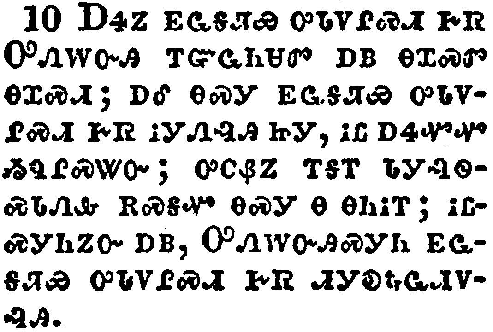</a></td>
</tr>
<tr class="even">
<td>But by the grace of God I am what I am: and his grace which was bestowed upon me was not in vain; but I laboured more abundantly than they all: yet not I, but the grace of God which was with me.</td>
</tr>
<tr class="odd">
<td>ᎠᏎᏃ ᎬᏩᎦᏘᏯ ᎤᏓᏙᎵᏍᏗ ᎨᏒ ᎤᏁᎳᏅᎯ ᎢᏳᏩᏂᏌᏛ ᎠᏴ ᎾᏆᏍᏛ ᎾᏆᏍᏗ; ᎠᎴ ᎾᏍᎩ ᎬᏩᎦᏘᏯ ᎤᏓᏙᎵᏍᏗ ᎨᏒ ᎥᎩᏁᎸᎯ ᏥᎩ, ᎥᏝ ᎠᏎᏉᏉ ᏱᏄᎵᏍᏔᏅ; ᎤᏟᏰᏃ ᎢᎦᎢ ᏓᎩᎸᏫᏍᏓᏁᎲ ᎡᏍᎦᏉ ᎾᏍᎩ Ꮎ ᎾᏂᎥᎢ; ᎥᏝᏍᎩᏂᏃᏅ ᎠᏴ, ᎤᏁᎳᏅᎯᏍᎩᏂ ᎬᏩᎦᏘᏯ ᎤᏓᏙᎵᏍᏗ ᎨᏒ ᏗᎩᎧᎿᎭᏩᏗᏙᎸᎯ.</td>
</tr>
<tr class="even">
<td>A-se-no gv-wa-ga-ti-ya u-da-do-li-s-di ge-sv U-ne-la-nv-hi i-yu-wa-ni-sa-dv a-yv na-qua-s-dv na-qua-s-di; a-le na-s-gi gv-wa-ga-ti-ya u-da-do-li-s-di ge-sv v-gi-ne-lv-hi tsi-gi, v-tla a-se-quo-quo yi-nu-li-s-ta-nv; u-tli-ye-no i-ga-i da-gi-lv-wi-s-da-ne-hv e-s-ga-quo na-s-gi na na-ni-v-i; v-tla-s-gi-ni-no-nv a-yv, U-ne-la-nv-hi-s-gi-ni gv-wa-ga-ti-ya u-da-do-li-s-di ge-sv di-gi-ka-hna-wa-di-do-lv-hi.</td>
</tr>
</tbody>
</table>

<table>
<tbody>
<tr class="odd">
<td><a href="071511.png">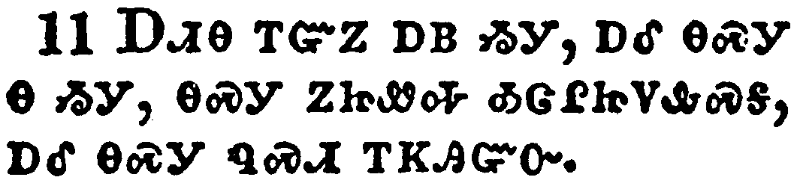</a></td>
</tr>
<tr class="even">
<td>Therefore whether it were I or they, so we preach, and so ye believed.</td>
</tr>
<tr class="odd">
<td>ᎠᏗᎾ ᎢᏳᏃ ᎠᏴ ᏱᎩ, ᎠᎴ ᎾᏍᎩ Ꮎ ᏱᎩ, ᎾᏍᎩ ᏃᏥᏪᎭ ᎣᏣᎵᏥᏙᎲᏍᎦ, ᎠᎴ ᎾᏍᎩ ᏄᏍᏗ ᎢᏦᎯᏳᏅ.</td>
</tr>
<tr class="even">
<td>A-di-na i-yu-no a-yv yi-gi, a-le na-s-gi na yi-gi, na-s-gi no-tsi-we-ha o-tsa-li-tsi-do-hv-s-ga, a-le na-s-gi nu-s-di i-tso-hi-yu-nv.</td>
</tr>
</tbody>
</table>

<table>
<tbody>
<tr class="odd">
<td><a href="071512.png">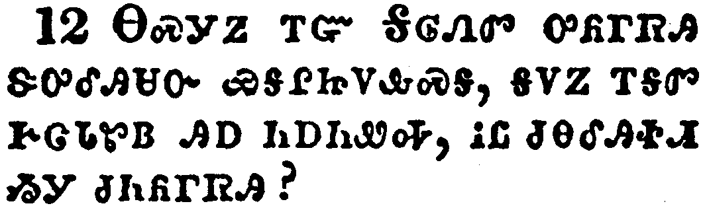</a></td>
</tr>
<tr class="even">
<td>Now if Christ be preached that he rose from the dead, how say some among you that there is no resurrection of the dead?</td>
</tr>
<tr class="odd">
<td>ᎾᏍᎩᏃ ᎢᏳ ᎦᎶᏁᏛ ᎤᏲᎱᏒᎯ ᏕᎤᎴᎯᏌᏅ ᏯᎦᎵᏥᏙᎲᏍᎦ, ᎦᏙᏃ ᎢᎦᏛ ᎨᏣᏓᏑᏴ ᎯᎠ ᏂᎠᏂᏪᎭ, ᎥᏝ ᏧᎾᎴᎯᏐᏗ ᏱᎩ ᏧᏂᏲᎱᏒᎯ?</td>
</tr>
<tr class="even">
<td>Na-s-gi-no i-yu Ga-lo-ne-dv u-yo-hu-sv-hi de-u-le-hi-sa-nv ya-ga-li-tsi-do-hv-s-ga, ga-do-no i-ga-dv ge-tsa-da-su-yv hi-a ni-a-ni-we-ha, v-tla tsu-na-le-hi-so-di yi-gi tsu-ni-yo-hu-sv-hi?</td>
</tr>
</tbody>
</table>

<table>
<tbody>
<tr class="odd">
<td><a href="071513.png">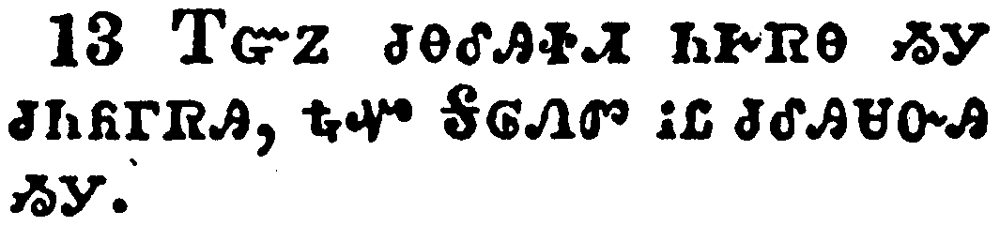</a></td>
</tr>
<tr class="even">
<td>But if there be no resurrection of the dead, then is Christ not risen:</td>
</tr>
<tr class="odd">
<td>ᎢᏳᏃ ᏧᎾᎴᎯᏐᏗ ᏂᎨᏒᎾ ᏱᎩ ᏧᏂᏲᎱᏒᎯ, ᎿᎭᏉ ᎦᎶᏁᏛ ᎥᏝ ᏧᎴᎯᏌᏅᎯ ᏱᎩ.</td>
</tr>
<tr class="even">
<td>I-yu-no tsu-na-le-hi-so-di ni-ge-sv-na yi-gi tsu-ni-yo-hu-sv-hi, hna-quo Ga-lo-ne-dv v-tla tsu-le-hi-sa-nv-hi yi-gi.</td>
</tr>
</tbody>
</table>

<table>
<tbody>
<tr class="odd">
<td><a href="071514.png">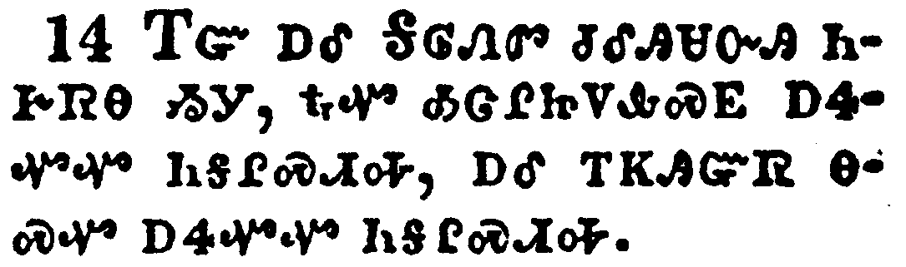</a></td>
</tr>
<tr class="even">
<td>And if Christ be not risen, then is our preaching vain, and your faith is also vain.</td>
</tr>
<tr class="odd">
<td>ᎢᏳ ᎠᎴ ᎦᎶᏁᏛ ᏧᎴᎯᏌᏅᎯ ᏂᎨᏒᎾ ᏱᎩ, ᎿᎭᏉ ᎣᏣᎵᏥᏙᎲᏍᎬ ᎠᏎᏉᏉ ᏂᎦᎵᏍᏗᎭ, ᎠᎴ ᎢᏦᎯᏳᏒ ᎾᏍᏉ ᎠᏎᏉᏉ ᏂᎦᎵᏍᏗᎭ.</td>
</tr>
<tr class="even">
<td>I-yu a-le Ga-lo-ne-dv tsu-le-hi-sa-nv-hi ni-ge-sv-na yi-gi, hna-quo o-tsa-li-tsi-do-hv-s-gv a-se-quo-quo ni-ga-li-s-di-ha, a-le i-tso-hi-yu-sv na-s-quo a-se-quo-quo ni-ga-li-s-di-ha.</td>
</tr>
</tbody>
</table>

<table>
<tbody>
<tr class="odd">
<td><a href="071515.png">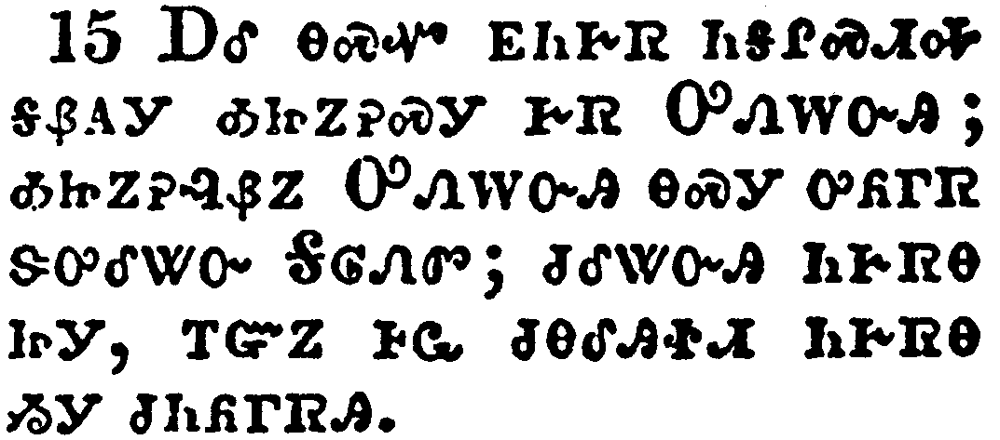</a></td>
</tr>
<tr class="even">
<td>Yea, and we are found false witnesses of God; because we have testified of God that he raised up Christ: whom he raised not up, if so be that the dead rise not.</td>
</tr>
<tr class="odd">
<td>ᎠᎴ ᎾᏍᏉ ᎬᏂᎨᏒ ᏂᎦᎵᏍᏗᎭ ᎦᏰᎪᎩ ᎣᏥᏃᎮᏍᎩ ᎨᏒ ᎤᏁᎳᏅᎯ; ᎣᏥᏃᎮᎸᏰᏃ ᎤᏁᎳᏅᎯ ᎾᏍᎩ ᎤᏲᎱᏒ ᏕᎤᎴᏔᏅ ᎦᎶᏁᏛ; ᏧᎴᎳᏅᎯ ᏂᎨᏒᎾ ᏥᎩ, ᎢᏳᏃ ᎰᏩ ᏧᎾᎴᎯᏐᏗ ᏂᎨᏒᎾ ᏱᎩ ᏧᏂᏲᎱᏒᎯ.</td>
</tr>
<tr class="even">
<td>a-le na-s-quo gv-ni-ge-sv ni-ga-li-s-di-ha ga-ye-go-gi o-tsi-no-he-s-gi ge-sv U-ne-la-nv-hi; o-tsi-no-he-lv-ye-no U-ne-la-nv-hi na-s-gi u-yo-hu-sv de-u-le-ta-nv Ga-lo-ne-dv; tsu-le-la-nv-hi ni-ge-sv-na tsi-gi, i-yu-no ho-wa tsu-na-le-hi-so-di ni-ge-sv-na yi-gi tsu-ni-yo-hu-sv-hi.</td>
</tr>
</tbody>
</table>

<table>
<tbody>
<tr class="odd">
<td><a href="071516.png">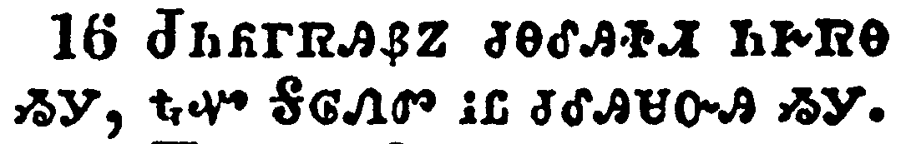</a></td>
</tr>
<tr class="even">
<td>For if the dead rise not, then is not Christ raised:</td>
</tr>
<tr class="odd">
<td>ᏧᏂᏲᎱᏒᎯᏰᏃ ᏧᎾᎴᎯᏐᏗ ᏂᎨᏒᎾ ᏱᎩ, ᎿᎭᏉ ᎦᎶᏁᏛ ᎥᏝ ᏧᎴᎯᏌᏅᎯ ᏱᎩ.</td>
</tr>
<tr class="even">
<td>Tsu-ni-yo-hu-sv-hi-ye-no tsu-na-le-hi-so-di ni-ge-sv-na yi-gi, hna-quo Ga-lo-ne-dv v-tla tsu-le-hi-sa-nv-hi yi-gi.</td>
</tr>
</tbody>
</table>

<table>
<tbody>
<tr class="odd">
<td><a href="071517.png">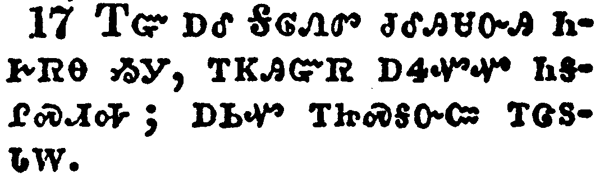</a></td>
</tr>
<tr class="even">
<td>And if Christ be not raised, your faith is vain; ye are yet in your sins.</td>
</tr>
<tr class="odd">
<td>ᎢᏳ ᎠᎴ ᎦᎶᏁᏛ ᏧᎴᎯᏌᏅᎯ ᏂᎬᏒᎾ ᏱᎩ, ᎢᏦᎯᏳᏒ ᎠᏎᏉᏉ ᏂᎦᎵᏍᏗᎭ; ᎠᏏᏉ ᎢᏥᏍᎦᏅᏨ ᎢᏣᏚᏓᎳ.</td>
</tr>
<tr class="even">
<td>I-yu a-le Ga-lo-ne-dv tsu-le-hi-sa-nv-hi ni-gv-sv-na yi-gi, i-tso-hi-yu-sv a-se-quo-quo ni-ga-li-s-di-ha; a-si-quo i-tsi-s-ga-nv-tsv i-tsa-du-da-la.</td>
</tr>
</tbody>
</table>

<table>
<tbody>
<tr class="odd">
<td></td>
</tr>
<tr class="even">
<td>Then they also which are fallen asleep in Christ are perished.</td>
</tr>
<tr class="odd">
<td>ᎠᎴ ᎾᏍᏉ Ꮎ ᎦᎶᏁᏛ ᎤᏃᎯᏳᎯ ᎤᏂᎵᏅᏨᎯ ᏥᎩ ᎬᏩᏂᏲᏥᏙᎸᏉ.</td>
</tr>
<tr class="even">
<td>A-le na-s-quo na Ga-lo-ne-dv u-no-hi-yu-hi u-ni-li-nv-tsv-hi tsi-gi gv-wa-ni-yo-tsi-do-lv-quo.</td>
</tr>
</tbody>
</table>

<table>
<tbody>
<tr class="odd">
<td><a href="071519.png">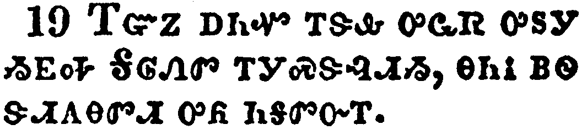</a></td>
</tr>
<tr class="even">
<td>If in this life only we have hope in Christ, we are of all men most miserable.</td>
</tr>
<tr class="odd">
<td>ᎢᏳᏃ ᎠᏂᏉ ᎢᏕᎲ ᎤᏩᏒ ᎤᏚᎩ ᏱᎬᎭ ᎦᎶᏁᏛ ᎢᎩᏍᏕᎸᏗᏱ, ᎾᏂᎥ ᏴᏫ ᏕᏗᎪᎾᏛᏗ ᎤᏲ ᏂᎦᏛᏅᎢ.</td>
</tr>
<tr class="even">
<td>I-yu-no a-ni-quo i-de-hv u-wa-sv u-du-gi yi-gv-ha Ga-lo-ne-dv i-gi-s-de-lv-di-yi, na-ni-v yv-wi de-di-go-na-dv-di u-yo ni-ga-dv-nv-i.</td>
</tr>
</tbody>
</table>

<table>
<tbody>
<tr class="odd">
<td><a href="071520.png">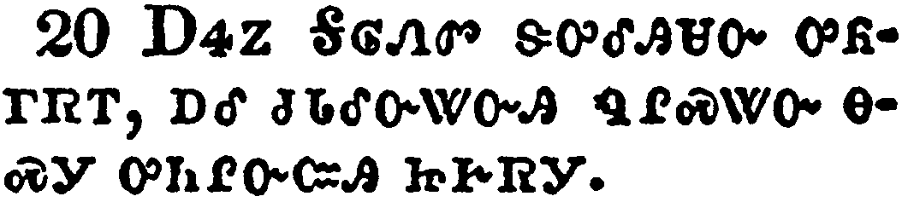</a></td>
</tr>
<tr class="even">
<td>But now is Christ risen from the dead, and become the firstfruits of them that slept.</td>
</tr>
<tr class="odd">
<td>ᎠᏎᏃ ᎦᎶᏁᏛ ᏕᎤᎴᎯᏌᏅ ᎤᏲᎱᏒᎢ, ᎠᎴ ᏧᏓᎴᏅᏔᏅᎯ ᏄᎵᏍᏔᏅ ᎾᏍᎩ ᎤᏂᎵᏅᏨᎯ ᏥᎨᏒᎩ.</td>
</tr>
<tr class="even">
<td>A-se-no Ga-lo-ne-dv de-u-le-hi-sa-nv u-yo-hu-sv-i, a-le tsu-da-le-nv-ta-nv-hi nu-li-s-ta-nv na-s-gi u-ni-li-nv-tsv-hi tsi-ge-sv-gi.</td>
</tr>
</tbody>
</table>

<table>
<tbody>
<tr class="odd">
<td><a href="071521.png">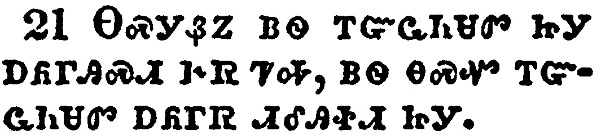</a></td>
</tr>
<tr class="even">
<td>For since by man came death, by man came also the resurrection of the dead.</td>
</tr>
<tr class="odd">
<td>ᎾᏍᎩᏰᏃ ᏴᏫ ᎢᏳᏩᏂᏌᏛ ᏥᎩ ᎠᎰᎱᎯᏍᏗ ᎨᏒ ᏤᎭ, ᏴᏫ ᎾᏍᏉ ᎢᏳᏩᏂᏌᏛ ᎠᏲᎱᏒ ᏗᎴᎯᏐᏗ ᏥᎩ.</td>
</tr>
<tr class="even">
<td>Na-s-gi-ye-no yv-wi i-yu-wa-ni-sa-dv tsi-gi a-ho-hu-hi-s-di ge-sv tse-ha, yv-wi na-s-quo i-yu-wa-ni-sa-dv a-yo-hu-sv di-le-hi-so-di tsi-gi.</td>
</tr>
</tbody>
</table>

<table>
<tbody>
<tr class="odd">
<td><a href="071522.png">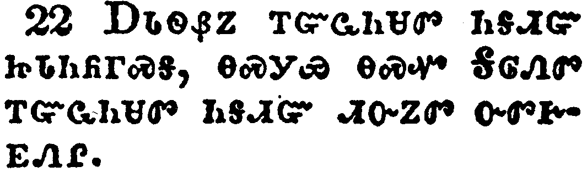</a></td>
</tr>
<tr class="even">
<td>For as in Adam all die, even so in Christ shall all be made alive.</td>
</tr>
<tr class="odd">
<td>ᎠᏓᏫᏰᏃ ᎢᏳᏩᏂᏌᏛ ᏂᎦᏗᏳ ᏥᏓᏂᏲᎱᏍᎦ, ᎾᏍᎩᏯ ᎾᏍᏉ ᎦᎶᏁᏛ ᎢᏳᏩᏂᏌᏛ ᏂᎦᏗᏳ ᏗᏅᏃᏛ ᏅᏛᎨᎬᏁᎵ.</td>
</tr>
<tr class="even">
<td>A-da-wi-ye-no i-yu-wa-ni-sa-dv ni-ga-di-yu tsi-da-ni-yo-hu-s-ga, na-s-gi-ya na-s-quo Ga-lo-ne-dv i-yu-wa-ni-sa-dv ni-ga-di-yu di-nv-no-dv nv-dv-ge-gv-ne-li.</td>
</tr>
</tbody>
</table>

<table>
<tbody>
<tr class="odd">
<td><a href="071523.png">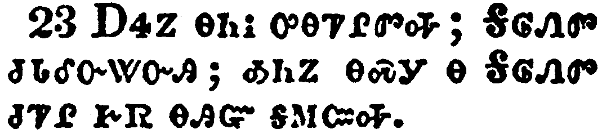</a></td>
</tr>
<tr class="even">
<td>But every man in his own order: Christ the firstfruits; afterward they that are Christ's at his coming.</td>
</tr>
<tr class="odd">
<td>ᎠᏎᏃ ᎾᏂᎥ ᎤᎾᏤᎵᏛᎭ; ᎦᎶᏁᏛ ᏧᏓᎴᏅᏔᏅᎯ; ᎣᏂᏃ ᎾᏍᎩ Ꮎ ᎦᎶᏁᏛ ᏧᏤᎵ ᎨᏒ ᎾᎯᏳ ᎦᎷᏨᎭ.</td>
</tr>
<tr class="even">
<td>A-se-no na-ni-v u-na-tse-li-dv-ha; Ga-lo-ne-dv tsu-da-le-nv-ta-nv-hi; o-ni-no na-s-gi na Ga-lo-ne-dv tsu-tse-li ge-sv na-hi-yu ga-lu-tsv-ha.</td>
</tr>
</tbody>
</table>

<table>
<tbody>
<tr class="odd">
<td><a href="071524.png">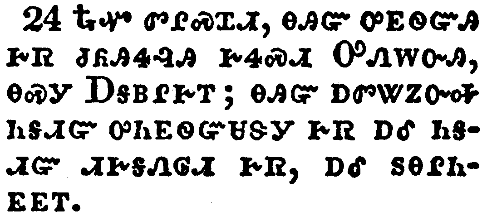</a></td>
</tr>
<tr class="even">
<td>Then cometh the end, when he shall have delivered up the kingdom to God, even the Father; when he shall have put down all rule and all authority and power.</td>
</tr>
<tr class="odd">
<td>ᎿᎭᏉ ᏛᎵᏍᏆᏗ, ᎾᎯᏳ ᎤᎬᏫᏳᎯ ᎨᏒ ᏧᏲᎯᏎᎸᎯ ᎨᏎᏍᏗ ᎤᏁᎳᏅᎯ, ᎾᏍᎩ ᎠᎦᏴᎵᎨᎢ; ᎾᎯᏳ ᎠᏛᏔᏃᏅᎭ ᏂᎦᏗᏳ ᎤᏂᎬᏫᏳᏌᏕᎩ ᎨᏒ ᎠᎴ ᏂᎦᏗᏳ ᏗᎨᎦᏁᎶᏗ ᎨᏒ, ᎠᎴ ᏚᎾᎵᏂᎬᎬᎢ.</td>
</tr>
<tr class="even">
<td>Hna-quo dv-li-s-qua-di, na-hi-yu u-gv-wi-yu-hi ge-sv tsu-yo-hi-se-lv-hi ge-se-s-di U-ne-la-nv-hi, na-s-gi A-ga-yv-li-ge-i; na-hi-yu a-dv-ta-no-nv-ha ni-ga-di-yu u-ni-gv-wi-yu-sa-de-gi ge-sv a-le ni-ga-di-yu di-ge-ga-ne-lo-di ge-sv, a-le du-na-li-ni-gv-gv-i.</td>
</tr>
</tbody>
</table>

<table>
<tbody>
<tr class="odd">
<td><a href="071525.png">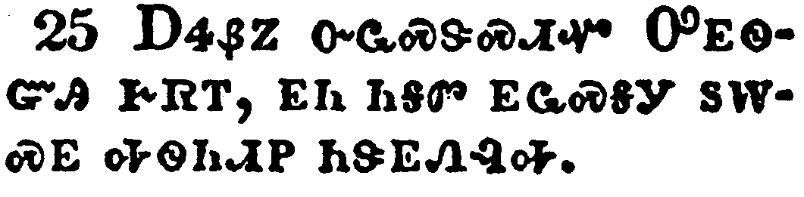</a></td>
</tr>
<tr class="even">
<td>For he must reign, till he hath put all enemies under his feet.</td>
</tr>
<tr class="odd">
<td>ᎠᏎᏰᏃ ᏅᏩᏍᏕᏍᏗᏉ ᎤᎬᏫᏳᎯ ᎨᏒᎢ, ᎬᏂ ᏂᎦᏛ ᎬᏩᏍᎦᎩ ᏚᎳᏍᎬ ᎭᏫᏂᏗᏢ ᏂᏕᎬᏁᎸᎭ.</td>
</tr>
<tr class="even">
<td>A-se-ye-no nv-wa-s-de-s-di-quo U-gv-wi-yu-hi ge-sv-i, gv-ni ni-ga-dv gv-wa-s-ga-gi du-la-s-gv ha-wi-ni-di-tlv ni-de-gv-ne-lv-ha.</td>
</tr>
</tbody>
</table>

<table>
<tbody>
<tr class="odd">
<td><a href="071526.png">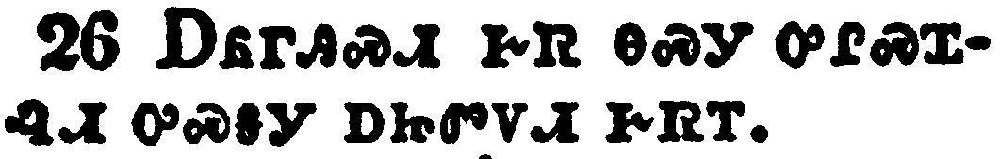</a></td>
</tr>
<tr class="even">
<td>The last enemy that shall be destroyed is death.</td>
</tr>
<tr class="odd">
<td>ᎠᏲᎱᎯᏍᏗ ᎨᏒ ᎾᏍᎩ ᎤᎵᏍᏆᎸᏗ ᎤᏍᎦᎩ ᎠᏥᏛᏙᏗ ᎨᏒᎢ.</td>
</tr>
<tr class="even">
<td>A-yo-hu-hi-s-di ge-sv na-s-gi u-li-s-qua-lv-di u-s-ga-gi a-tsi-dv-do-di ge-sv-i.</td>
</tr>
</tbody>
</table>

<table>
<tbody>
<tr class="odd">
<td><a href="071527.png">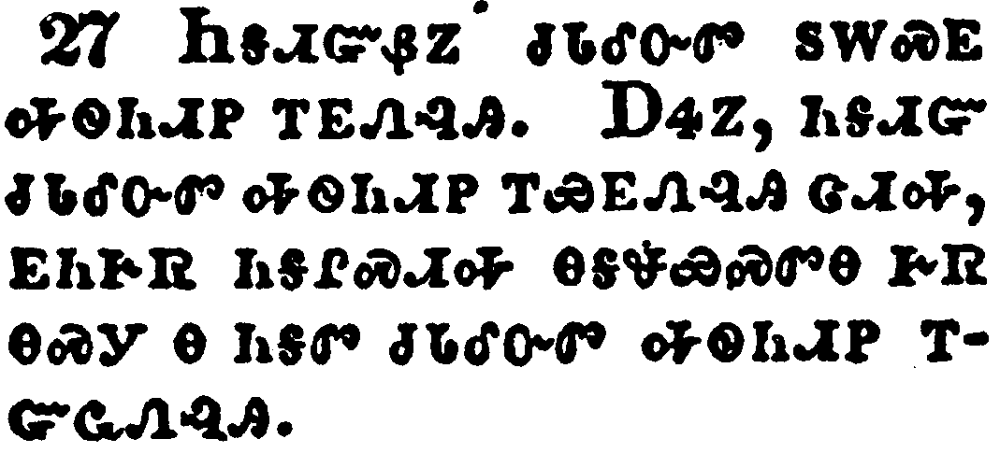</a></td>
</tr>
<tr class="even">
<td>For he hath put all things under his feet. But when he saith, all things are put under him, it is manifest that he is excepted, which did put all things under him.</td>
</tr>
<tr class="odd">
<td>ᏂᎦᏗᏳᏰᏃ ᏧᏓᎴᏅᏛ ᏚᎳᏍᎬ ᎭᏫᏂᏗᏢ ᎢᎬᏁᎸᎯ. ᎠᏎᏃ, ᏂᎦᏗᏳ ᏧᏓᎴᏅᏛ ᎭᏫᏂᏗᏢ ᎢᏯᎬᏁᎸᎯ ᏣᏗᎭ, ᎬᏂᎨᏒ ᏂᎦᎵᏍᏗᎭ ᎾᎦᏠᏯᏍᏛᎾ ᎨᏒ ᎾᏍᎩ Ꮎ ᏂᎦᏛ ᏧᏓᎴᏅᏛ ᎭᏫᏂᏗᏢ ᎢᏳᏩᏁᎸᎯ.</td>
</tr>
<tr class="even">
<td>Ni-ga-di-yu-ye-no tsu-da-le-nv-dv du-la-s-gv ha-wi-ni-di-tlv i-gv-ne-lv-hi. A-se-no, ni-ga-di-yu tsu-da-le-nv-dv ha-wi-ni-di-tlv i-ya-gv-ne-lv-hi tsa-di-ha, gv-ni-ge-sv ni-ga-li-s-di-ha na-ga-tlo-ya-s-dv-na ge-sv na-s-gi na ni-ga-dv tsu-da-le-nv-dv ha-wi-ni-di-tlv i-yu-wa-ne-lv-hi.</td>
</tr>
</tbody>
</table>

<table>
<tbody>
<tr class="odd">
<td><a href="071528.png">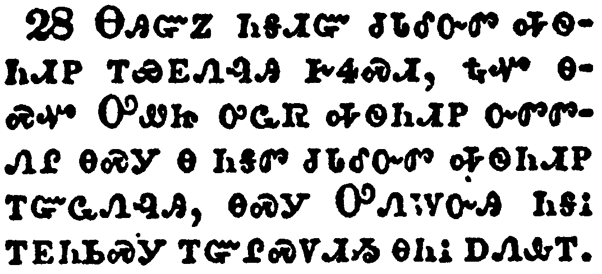</a></td>
</tr>
<tr class="even">
<td>And when all things shall be subdued unto him, then shall the Son also himself be subject unto him that put all things under him, that God may be all in all.</td>
</tr>
<tr class="odd">
<td>ᎾᎯᏳᏃ ᏂᎦᏗᏳ ᏧᏓᎴᏅᏛ ᎭᏫᏂᏗᏢ ᎢᏯᎬᏁᎸᎯ ᎨᏎᏍᏗ, ᎿᎭᏉ ᎾᏍᏉ ᎤᏪᏥ ᎤᏩᏒ ᎭᏫᏂᏗᏢ ᏅᏛᏛᏁᎵ ᎾᏍᎩ Ꮎ ᏂᎦᏛ ᏧᏓᎴᏅᏛ ᎭᏫᏂᏗᏢ ᎢᏳᏩᏁᎸᎯ, ᎾᏍᎩ ᎤᏁᎳᏅᎯ ᏂᎦᎥ ᎢᎬᏂᏏᏍᎩ ᎢᏳᎵᏍᏙᏗᏱ ᎾᏂᎥ ᎠᏁᎲᎢ.</td>
</tr>
<tr class="even">
<td>Na-hi-yu-no ni-ga-di-yu tsu-da-le-nv-dv ha-wi-ni-di-tlv i-ya-gv-ne-lv-hi ge-se-s-di, hna-quo na-s-quo U-we-tsi u-wa-sv ha-wi-ni-di-tlv nv-dv-dv-ne-li na-s-gi na ni-ga-dv tsu-da-le-nv-dv ha-wi-ni-di-tlv i-yu-wa-ne-lv-hi, na-s-gi U-ne-la-nv-hi ni-ga-v i-gv-ni-si-s-gi i-yu-li-s-do-di-yi na-ni-v a-ne-hv-i.</td>
</tr>
</tbody>
</table>

<table>
<tbody>
<tr class="odd">
<td><a href="071529.png">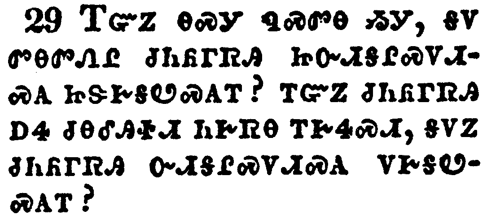</a></td>
</tr>
<tr class="even">
<td>Else what shall they do which are baptized for the dead, if the dead rise not at all? why are they then baptized for the dead?</td>
</tr>
<tr class="odd">
<td>ᎢᏳᏃ ᎾᏍᎩ ᏄᏍᏛᎾ ᏱᎩ, ᎦᏙ ᏛᎾᏛᏁᎵ ᏧᏂᏲᎱᏒᎯ ᏥᏅᏗᎦᎵᏍᏙᏗᏍᎪ ᏥᏕᎨᎦᏬᏍᎪᎢ? ᎢᏳᏃ ᏧᏂᏲᎱᏒᎯ ᎠᏎ ᏧᎾᎴᎯᏐᏗ ᏂᎨᏒᎾ ᎢᎨᏎᏍᏗ, ᎦᏙᏃ ᏧᏂᏲᎱᏒᎯ ᏅᏗᎦᎵᏍᏙᏗᏍᎪ ᏙᎨᎦᏬᏍᎪᎢ?</td>
</tr>
<tr class="even">
<td>I-yu-no na-s-gi nu-s-dv-na yi-gi, ga-do dv-na-dv-ne-li tsu-ni-yo-hu-sv-hi tsi-nv-di-ga-li-s-do-di-s-go tsi-de-ge-ga-wo-s-go-i? i-yu-no tsu-ni-yo-hu-sv-hi a-se tsu-na-le-hi-so-di ni-ge-sv-na i-ge-se-s-di, ga-do-no tsu-ni-yo-hu-sv-hi nv-di-ga-li-s-do-di-s-go do-ge-ga-wo-s-go-i?</td>
</tr>
</tbody>
</table>

<table>
<tbody>
<tr class="odd">
<td></td>
</tr>
<tr class="even">
<td>And why stand we in jeopardy every hour?</td>
</tr>
<tr class="odd">
<td>ᎠᎴ ᎦᏙᏃ ᎤᎾᏰᎯᏍᏗ ᏂᎦᏛᎿᎭᏕᎦ ᏂᎪᎯᎸᎢ?</td>
</tr>
<tr class="even">
<td>A-le ga-do-no u-na-ye-hi-s-di ni-ga-dv-hna-de-ga ni-go-hi-lv-i?</td>
</tr>
</tbody>
</table>

<table>
<tbody>
<tr class="odd">
<td><a href="071531.png">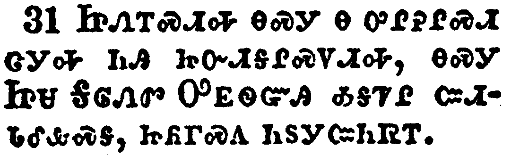</a></td>
</tr>
<tr class="even">
<td>I protest by your rejoicing which I have in Christ Jesus our Lord, I die daily.</td>
</tr>
<tr class="odd">
<td>ᏥᏁᎢᏍᏗᎭ ᎾᏍᎩ Ꮎ ᎤᎵᎮᎵᏍᏗ ᏣᎩᎭ ᏂᎯ ᏥᏅᏗᎦᎵᏍᏙᏗᎭ, ᎾᏍᎩ ᏥᏌ ᎦᎶᏁᏛ ᎤᎬᏫᏳᎯ ᎣᎦᏤᎵ ᏨᏗᏓᎴᎲᏍᎦ, ᏥᏲᎱᏍᎪ ᏂᏚᎩᏨᏂᏒᎢ.</td>
</tr>
<tr class="even">
<td>Tsi-ne-i-s-di-ha na-s-gi na u-li-he-li-s-di tsa-gi-ha ni-hi tsi-nv-di-ga-li-s-do-di-ha, na-s-gi Tsi-sa Ga-lo-ne-dv U-gv-wi-yu-hi o-ga-tse-li tsv-di-da-le-hv-s-ga, tsi-yo-hu-s-go ni-du-gi-tsv-ni-sv-i.</td>
</tr>
</tbody>
</table>

<table>
<tbody>
<tr class="odd">
<td><a href="071532.png">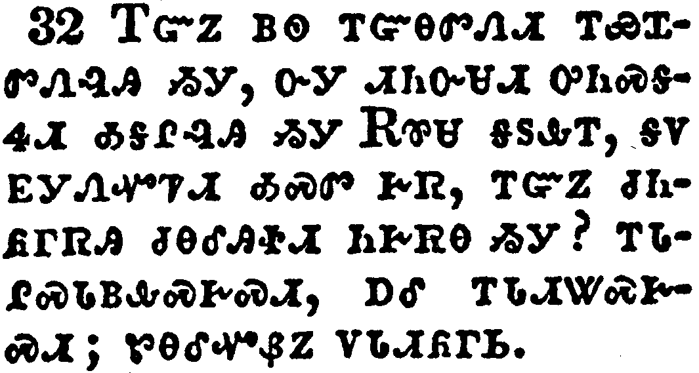</a></td>
</tr>
<tr class="even">
<td>If after the manner of men I have fought with beasts at Ephesus, what advantageth it me, if the dead rise not? let us eat and drink; for to morrow we die.</td>
</tr>
<tr class="odd">
<td>ᎢᏳᏃ ᏴᏫ ᎢᏳᎾᏛᏁᏗ ᎢᏯᏆᏛᏁᎸᎯ ᏱᎩ, ᏅᎩ ᏗᏂᏅᏌᏗ ᎤᏂᏍᎦᏎᏗ ᎣᎦᎵᎸᎯ ᏱᎩ ᎡᏈᏌ ᎦᏚᎲᎢ, ᎦᏙ ᎬᎩᏁᏉᏤᏗ ᎣᏍᏛ ᎨᏒ, ᎢᏳᏃ ᏧᏂᏲᎱᏒᎯ ᏧᎾᎴᎯᏐᏗ ᏂᎨᏒᎾ ᏱᎩ? ᎢᏓᎵᏍᏓᏴᎲᏍᎨᏍᏗ, ᎠᎴ ᎢᏓᏗᏔᏍᎨᏍᏗ; ᏑᎾᎴᏉᏰᏃ ᏙᏓᏗᏲᎱᏏ.</td>
</tr>
<tr class="even">
<td>I-yu-no yv-wi i-yu-na-dv-ne-di i-ya-qua-dv-ne-lv-hi yi-gi, nv-gi di-ni-nv-sa-di u-ni-s-ga-se-di o-ga-li-lv-hi yi-gi E-qui-sa ga-du-hv-i, ga-do gv-gi-ne-quo-tse-di o-s-dv ge-sv, i-yu-no tsu-ni-yo-hu-sv-hi tsu-na-le-hi-so-di ni-ge-sv-na yi-gi? i-da-li-s-da-yv-hv-s-ge-s-di, a-le i-da-di-ta-s-ge-s-di; su-na-le-quo-ye-no do-da-di-yo-hu-si.</td>
</tr>
</tbody>
</table>

<table>
<tbody>
<tr class="odd">
<td><a href="071533.png">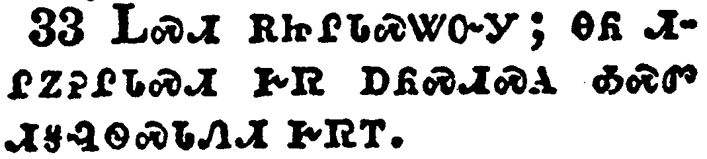</a></td>
</tr>
<tr class="even">
<td>Be not deceived: evil communications corrupt good manners.</td>
</tr>
<tr class="odd">
<td>ᏞᏍᏗ ᎡᏥᎵᏓᏍᏔᏅᎩ; ᎾᏲ ᏗᎵᏃᎮᎵᏓᏍᏗ ᎨᏒ ᎠᏲᏍᏗᏍᎪ ᎣᏍᏛ ᏗᎦᎸᏫᏍᏓᏁᏗ ᎨᏒᎢ.</td>
</tr>
<tr class="even">
<td>Tle-s-di e-tsi-li-da-s-ta-nv-gi; na-yo di-li-no-he-li-da-s-di ge-sv a-yo-s-di-s-go o-s-dv di-ga-lv-wi-s-da-ne-di ge-sv-i.</td>
</tr>
</tbody>
</table>

<table>
<tbody>
<tr class="odd">
<td><a href="071534.png">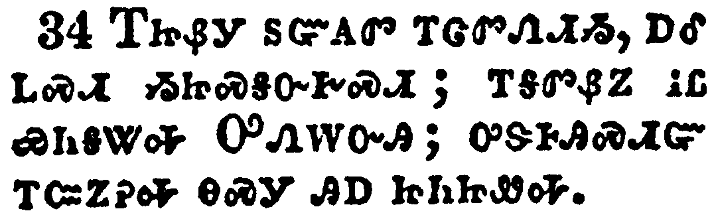</a></td>
</tr>
<tr class="even">
<td>Awake to righteousness, and sin not; for some have not the knowledge of God: I speak this to your shame.</td>
</tr>
<tr class="odd">
<td>ᎢᏥᏰᎩ ᏚᏳᎪᏛ ᎢᏣᏛᏁᏗᏱ, ᎠᎴ ᏞᏍᏗ ᏱᏥᏍᎦᏅᎨᏍᏗ; ᎢᎦᏛᏰᏃ ᎥᏝ ᏯᏂᎦᏔᎭ ᎤᏁᎳᏅᎯ; ᎤᏕᎰᎯᏍᏗᏳ ᎢᏨᏃᎮᎭ ᎾᏍᎩ ᎯᎠ ᏥᏂᏥᏪᎭ.</td>
</tr>
<tr class="even">
<td>I-tsi-ye-gi du-yu-go-dv i-tsa-dv-ne-di-yi, a-le tle-s-di yi-tsi-s-ga-nv-ge-s-di; i-ga-dv-ye-no v-tla ya-ni-ga-ta-ha U-ne-la-nv-hi; u-de-ho-hi-s-di-yu i-tsv-no-he-ha na-s-gi hi-a tsi-ni-tsi-we-ha.</td>
</tr>
</tbody>
</table>

<table>
<tbody>
<tr class="odd">
<td><a href="071535.png">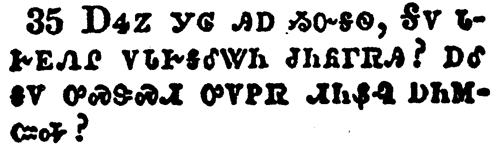</a></td>
</tr>
<tr class="even">
<td>But some man will say, How are the dead raised up? and with what body do they come?</td>
</tr>
<tr class="odd">
<td>ᎠᏎᏃ ᎩᎶ ᎯᎠ ᏱᏅᎦᏫ, ᎦᏙ ᏓᎨᎬᏁᎵ ᏙᏓᎨᎦᎴᏔᏂ ᏧᏂᏲᎱᏒᎯ? ᎠᎴ ᎦᏙ ᎤᏍᏕᏍᏗ ᎤᏙᏢᏒ ᏗᏂᏰᎸ ᎠᏂᎷᏨᎭ?</td>
</tr>
<tr class="even">
<td>A-se-no gi-lo hi-a yi-nv-ga-wi, Ga-do da-ge-gv-ne-li do-da-ge-ga-le-ta-ni tsu-ni-yo-hu-sv-hi? a-le ga-do u-s-de-s-di u-do-tlv-sv di-ni-ye-lv a-ni-lu-tsv-ha?</td>
</tr>
</tbody>
</table>

<table>
<tbody>
<tr class="odd">
<td><a href="071536.png">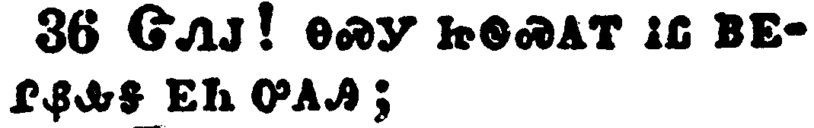</a></td>
</tr>
<tr class="even">
<td>Thou fool, that which thou sowest is not quickened, except it die:</td>
</tr>
<tr class="odd">
<td>ᏣᏁᎫ! ᎾᏍᎩ ᏥᏫᏍᎪᎢ ᎥᏝ ᏴᎬᎵᏰᎲᎦ ᎬᏂ ᎤᎪᎯ;</td>
</tr>
<tr class="even">
<td>Tsa-ne-gu! na-s-gi tsi-wi-s-go-i v-tla yv-gv-li-ye-hv-ga gv-ni u-go-hi;</td>
</tr>
</tbody>
</table>

<table>
<tbody>
<tr class="odd">
<td><a href="071537.png">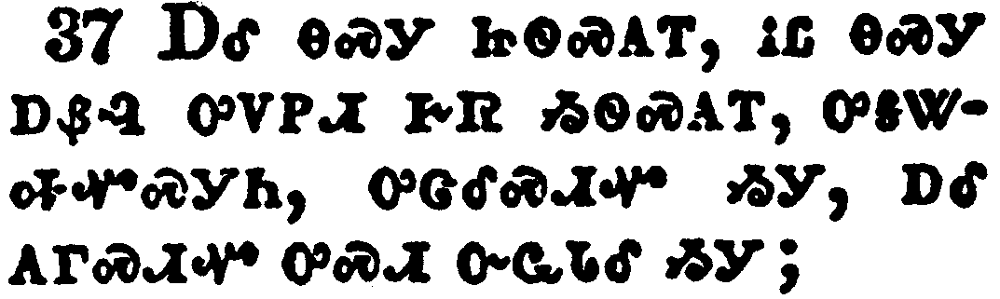</a></td>
</tr>
<tr class="even">
<td>And that which thou sowest, thou sowest not that body that shall be, but bare grain, it may chance of wheat, or of some other grain:</td>
</tr>
<tr class="odd">
<td>ᎠᎴ ᎾᏍᎩ ᏥᏫᏍᎪᎢ, ᎥᏝ ᎾᏍᎩ ᎠᏰᎸ ᎤᏙᏢᏗ ᎨᏒ ᏱᏫᏍᎪᎢ, ᎤᎦᏔᎭᏉᏍᎩᏂ, ᎤᏣᎴᏍᏗᏉ ᏱᎩ, ᎠᎴ ᎪᎱᏍᏗᏉ ᎤᏍᏗ ᏅᏩᏓᎴ ᏱᎩ;</td>
</tr>
<tr class="even">
<td>A-le na-s-gi tsi-wi-s-go-i, v-tla na-s-gi a-ye-lv u-do-tlv-di ge-sv yi-wi-s-go-i, u-ga-ta-ha-quo-s-gi-ni, u-tsa-le-s-di-quo yi-gi, a-le go-hu-s-di-quo u-s-di nv-wa-da-le yi-gi;</td>
</tr>
</tbody>
</table>

<table>
<tbody>
<tr class="odd">
<td><a href="071538.png">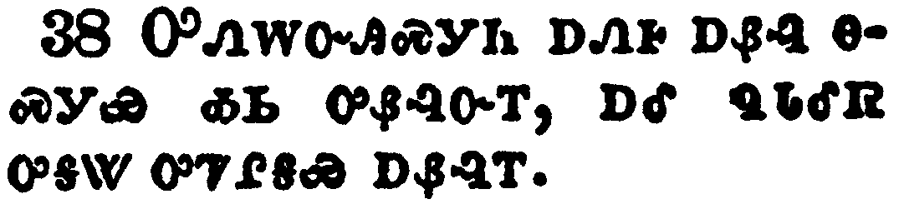</a></td>
</tr>
<tr class="even">
<td>But God giveth it a body as it hath pleased him, and to every seed his own body.</td>
</tr>
<tr class="odd">
<td>ᎤᏁᎳᏅᎯᏍᎩᏂ ᎠᏁᎰ ᎠᏰᎸ ᎾᏍᎩᏯ ᎣᏏ ᎤᏰᎸᏅᎢ, ᎠᎴ ᏄᏓᎴᏒ ᎤᎦᏔ ᎤᏤᎵᎦᏯ ᎠᏰᎸᎢ.</td>
</tr>
<tr class="even">
<td>U-ne-la-nv-hi-s-gi-ni a-ne-ho a-ye-lv na-s-gi-ya o-si u-ye-lv-nv-i, a-le nu-da-le-sv u-ga-ta u-tse-li-ga-ya a-ye-lv-i.</td>
</tr>
</tbody>
</table>

<table>
<tbody>
<tr class="odd">
<td><a href="071539.png">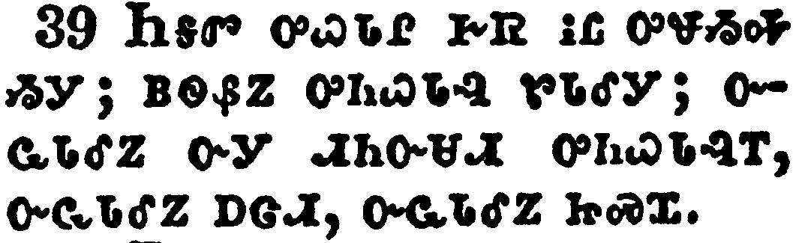</a></td>
</tr>
<tr class="even">
<td>All flesh is not the same flesh: but there is one kind of flesh of men, another flesh of beasts, another of fishes, and another of birds.</td>
</tr>
<tr class="odd">
<td>ᏂᎦᏛ ᎤᏇᏓᎵ ᎨᏒ ᎥᏝ ᎤᏠᏱᎭ ᏱᎩ; ᏴᏫᏰᏃ ᎤᏂᏇᏓᎸ ᏑᏓᎴᎩ; ᏅᏩᏓᎴᏃ ᏅᎩ ᏗᏂᏅᏌᏗ ᎤᏂᏇᏓᎸᎢ, ᏅᏩᏓᎴᏃ ᎠᏣᏗ, ᏅᏩᏓᎴᏃ ᏥᏍᏆ.</td>
</tr>
<tr class="even">
<td>Ni-ga-dv u-que-da-li ge-sv v-tla u-tlo-yi-ha yi-gi; yv-wi-ye-no u-ni-que-da-lv su-da-le-gi; nv-wa-da-le-no nv-gi di-ni-nv-sa-di u-ni-que-da-lv-i, nv-wa-da-le-no a-tsa-di, nv-wa-da-le-no tsi-s-qua.</td>
</tr>
</tbody>
</table>

<table>
<tbody>
<tr class="odd">
<td><a href="071540.png">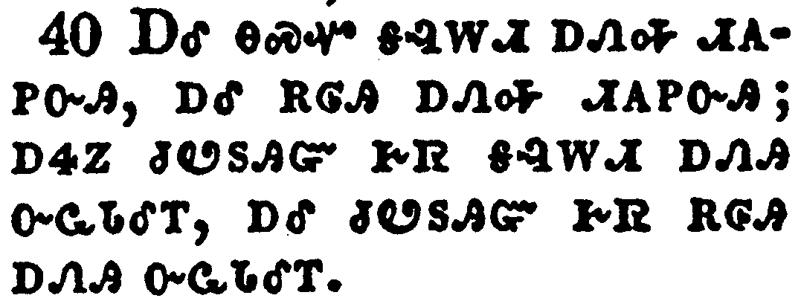</a></td>
</tr>
<tr class="even">
<td>There are also celestial bodies, and bodies terrestrial: but the glory of the celestial is one, and the glory of the terrestrial is another.</td>
</tr>
<tr class="odd">
<td>ᎠᎴ ᎾᏍᏉ ᎦᎸᎳᏗ ᎠᏁᎭ ᏗᎪᏢᏅᎯ, ᎠᎴ ᎡᎶᎯ ᎠᏁᎭ ᏗᎪᏢᏅᎯ; ᎠᏎᏃ ᏧᏬᏚᎯᏳ ᎨᏒ ᎦᎸᎳᏗ ᎠᏁᎯ ᏅᏩᏓᎴᎢ, ᎠᎴ ᏧᏬᏚᎯᏳ ᎨᏒ ᎡᎶᎯ ᎠᏁᎯ ᏅᏩᏓᎴᎢ.</td>
</tr>
<tr class="even">
<td>A-le na-s-quo ga-lv-la-di a-ne-ha di-go-tlv-nv-hi, a-le e-lo-hi a-ne-ha di-go-tlv-nv-hi; a-se-no tsu-wo-du-hi-yu ge-sv ga-lv-la-di a-ne-hi nv-wa-da-le-i, a-le tsu-wo-du-hi-yu ge-sv e-lo-hi a-ne-hi nv-wa-da-le-i.</td>
</tr>
</tbody>
</table>

<table>
<tbody>
<tr class="odd">
<td><a href="071541.png">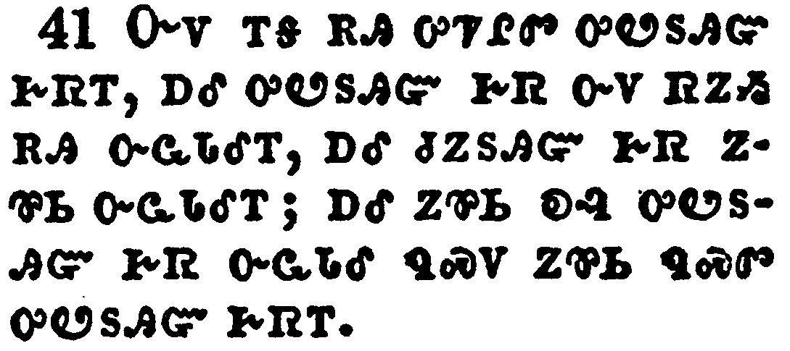</a></td>
</tr>
<tr class="even">
<td>There is one glory of the sun, and another glory of the moon, and another glory of the stars: for one star differeth from another star in glory.</td>
</tr>
<tr class="odd">
<td>ᏅᏙ ᎢᎦ ᎡᎯ ᎤᏤᎵᏛ ᎤᏬᏚᎯᏳ ᎨᏒᎢ, ᎠᎴ ᎤᏬᏚᎯᏳ ᎨᏒ ᏅᏙ ᏒᏃᏱ ᎡᎯ ᏅᏩᏓᎴᎢ, ᎠᎴ ᏧᏃᏚᎯᏳ ᎨᏒ ᏃᏈᏏ ᏅᏩᏓᎴᎢ; ᎠᎴ ᏃᏈᏏ ᎧᎸ ᎤᏬᏚᎯᏳ ᎨᏒ ᏅᏩᏓᎴ ᏄᏍᏙ ᏃᏈᏏ ᏄᏍᏛ ᎤᏬᏚᎯᏳ ᎨᏒᎢ.</td>
</tr>
<tr class="even">
<td>Nv-do i-ga e-hi u-tse-li-dv u-wo-du-hi-yu ge-sv-i, a-le u-wo-du-hi-yu ge-sv nv-do sv-no-yi e-hi nv-wa-da-le-i, a-le tsu-no-du-hi-yu ge-sv no-qui-si nv-wa-da-le-i; a-le no-qui-si ka-lv u-wo-du-hi-yu ge-sv nv-wa-da-le nu-s-do no-qui-si nu-s-dv u-wo-du-hi-yu ge-sv-i.</td>
</tr>
</tbody>
</table>

<table>
<tbody>
<tr class="odd">
<td><a href="071542.png">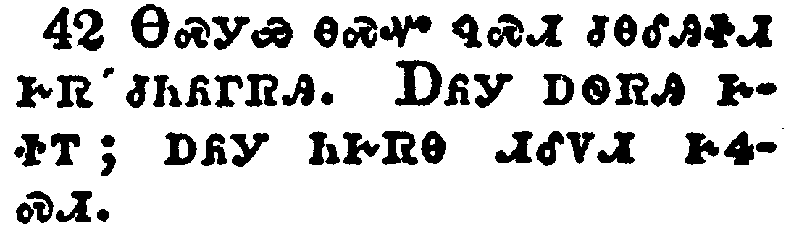</a></td>
</tr>
<tr class="even">
<td>So also is the resurrection of the dead. It is sown in corruption; it is raised in incorruption:</td>
</tr>
<tr class="odd">
<td>ᎾᏍᎩᏯ ᎾᏍᏉ ᏄᏍᏗ ᏧᎾᎴᎯᏐᏗ ᎨᏒ ᏧᏂᏲᎱᏒᎯ. ᎠᏲᎩ ᎠᏫᏒᎯ ᎨᏐᎢ; ᎠᏲᎩ ᏂᎨᏒᎾ ᏗᎴᏙᏗ ᎨᏎᏍᏗ.</td>
</tr>
<tr class="even">
<td>Na-s-gi-ya na-s-quo nu-s-di tsu-na-le-hi-so-di ge-sv tsu-ni-yo-hu-sv-hi. A-yo-gi a-wi-sv-hi ge-so-i; a-yo-gi ni-ge-sv-na di-le-do-di ge-se-s-di.</td>
</tr>
</tbody>
</table>

<table>
<tbody>
<tr class="odd">
<td><a href="071543.png">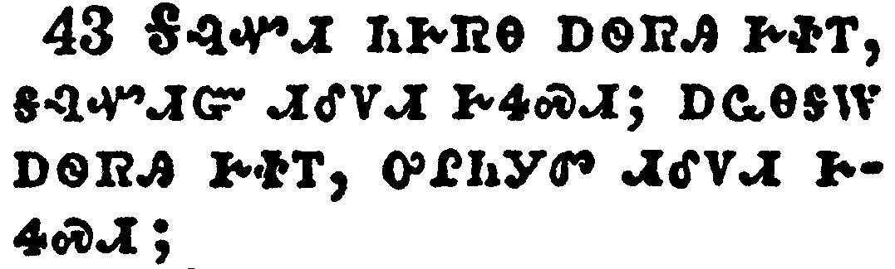</a></td>
</tr>
<tr class="even">
<td>It is sown in dishonour; it is raised in glory: it is sown in weakness; it is raised in power:</td>
</tr>
<tr class="odd">
<td>ᎦᎸᏉᏗ ᏂᎨᏒᎾ ᎠᏫᏒᎯ ᎨᏐᎢ, ᎦᎸᏉᏗᏳ ᏗᎴᏙᏗ ᎨᏎᏍᏗ; ᎠᏩᎾᎦᎳ ᎠᏫᏒᎯ ᎨᏐᎢ, ᎤᎵᏂᎩᏛ ᏗᎴᏙᏗ ᎨᏎᏍᏗ;</td>
</tr>
<tr class="even">
<td>Ga-lv-quo-di ni-ge-sv-na a-wi-sv-hi ge-so-i, ga-lv-quo-di-yu di-le-do-di ge-se-s-di; a-wa-na-ga-la a-wi-sv-hi ge-so-i, u-li-ni-gi-dv di-le-do-di ge-se-s-di;</td>
</tr>
</tbody>
</table>

<table>
<tbody>
<tr class="odd">
<td><a href="071544.png">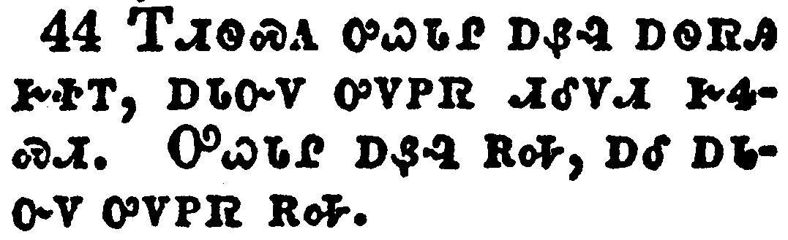</a></td>
</tr>
<tr class="even">
<td>It is sown a natural body; it is raised a spiritual body. There is a natural body, and there is a spiritual body.</td>
</tr>
<tr class="odd">
<td>ᎢᏗᏫᏍᎪ ᎤᏇᏓᎵ ᎠᏰᎸ ᎠᏫᏒᎯ ᎨᏐᎢ, ᎠᏓᏅᏙ ᎤᏙᏢᏒ ᏗᎴᏙᏗ ᎨᏎᏍᏗ. ᎤᏇᏓᎵ ᎠᏰᎸ ᎡᎭ, ᎠᎴ ᎠᏓᏅᏙ ᎤᏙᏢᏒ ᎡᎭ.</td>
</tr>
<tr class="even">
<td>I-di-wi-s-go u-que-da-li a-ye-lv a-wi-sv-hi ge-so-i, a-da-nv-do u-do-tlv-sv di-le-do-di ge-se-s-di. U-que-da-li a-ye-lv e-ha, a-le a-da-nv-do u-do-tlv-sv e-ha.</td>
</tr>
</tbody>
</table>

<table>
<tbody>
<tr class="odd">
<td><a href="071545.png">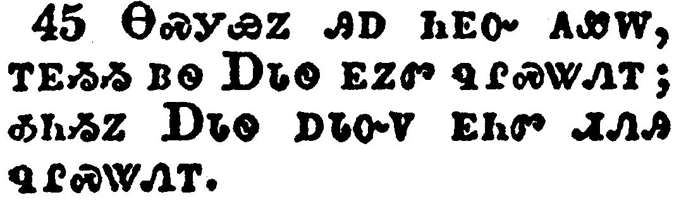</a></td>
</tr>
<tr class="even">
<td>And so it is written, The first man Adam was made a living soul; the last Adam was made a quickening spirit.</td>
</tr>
<tr class="odd">
<td>ᎾᏍᎩᏯᏃ ᎯᎠ ᏂᎬᏅ ᎦᏪᎳ, ᎢᎬᏱᏱ ᏴᏫ ᎠᏓᏫ ᎬᏃᏛ ᏄᎵᏍᏔᏁᎢ; ᎣᏂᏱᏃ ᎠᏓᏫ ᎠᏓᏅᏙ ᎬᏂᏛ ᏗᏁᎯ ᏄᎵᏍᏔᏁᎢ.</td>
</tr>
<tr class="even">
<td>Na-s-gi-ya-no hi-a ni-gv-nv ga-we-la, i-gv-yi-yi yv-wi A-da-wi gv-no-dv nu-li-s-ta-ne-i; o-ni-yi-no A-da-wi a-da-nv-do gv-ni-dv di-ne-hi nu-li-s-ta-ne-i.</td>
</tr>
</tbody>
</table>

<table>
<tbody>
<tr class="odd">
<td><a href="071546.png">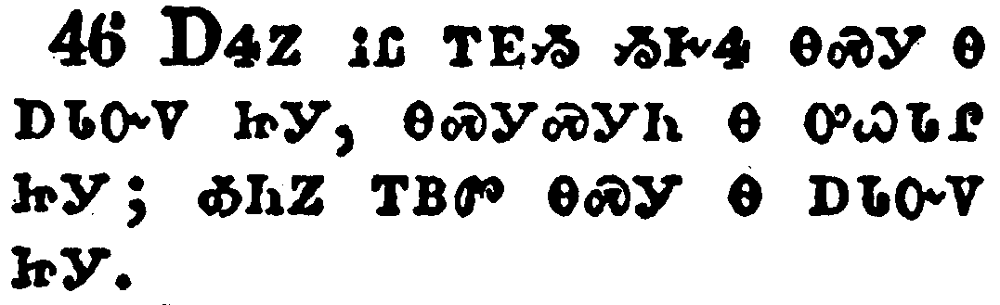</a></td>
</tr>
<tr class="even">
<td>Howbeit that was not first which is spiritual, but that which is natural; and afterward that which is spiritual.</td>
</tr>
<tr class="odd">
<td>ᎠᏎᏃ ᎥᏝ ᎢᎬᏱ ᏱᎨᏎ ᎾᏍᎩ Ꮎ ᎠᏓᏅᏙ ᏥᎩ, ᎾᏍᎩᏍᎩᏂ Ꮎ ᎠᏇᏓᎵ ᏥᎩ; ᎣᏂᏃ ᎢᏴᏛ ᎾᏍᎩ Ꮎ ᎠᏓᏅᏙ ᏥᎩ.</td>
</tr>
<tr class="even">
<td>A-se-no v-tla i-gv-yi yi-ge-se na-s-gi na a-da-nv-do tsi-gi, na-s-gi-s-gi-ni na a-que-da-li tsi-gi; o-ni-no i-yv-dv na-s-gi na a-da-nv-do tsi-gi.</td>
</tr>
</tbody>
</table>

<table>
<tbody>
<tr class="odd">
<td><a href="071547.png">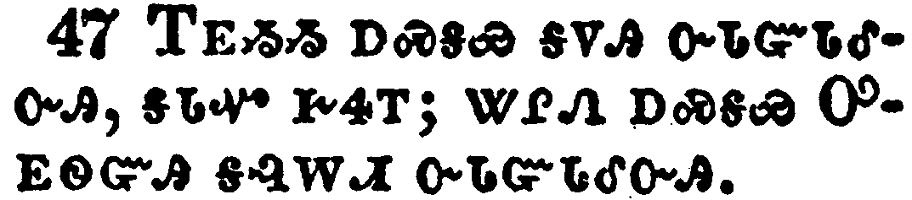</a></td>
</tr>
<tr class="even">
<td>The first man is of the earth, earthy: the second man is the Lord from heaven.</td>
</tr>
<tr class="odd">
<td>ᎢᎬᏱᏱ ᎠᏍᎦᏯ ᎦᏙᎯ ᏅᏓᏳᏓᎴᏅᎯ, ᎦᏓᏉ ᎨᏎᎢ; ᏔᎵᏁ ᎠᏍᎦᏯ ᎤᎬᏫᏳᎯ ᎦᎸᎳᏗ ᏅᏓᏳᏓᎴᏅᎯ.</td>
</tr>
<tr class="even">
<td>I-gv-yi-yi a-s-ga-ya ga-do-hi nv-da-yu-da-le-nv-hi, ga-da-quo ge-se-i; ta-li-ne a-s-ga-ya U-gv-wi-yu-hi ga-lv-la-di nv-da-yu-da-le-nv-hi.</td>
</tr>
</tbody>
</table>

<table>
<tbody>
<tr class="odd">
<td><a href="071548.png">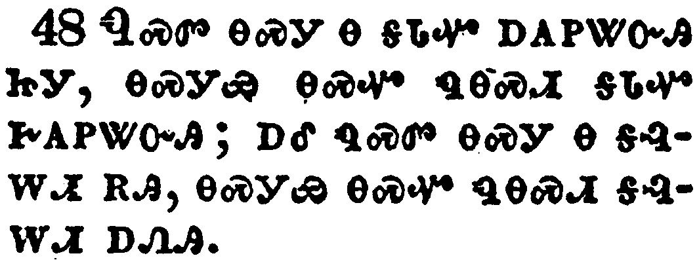</a></td>
</tr>
<tr class="even">
<td>As is the earthy, such are they also that are earthy: and as is the heavenly, such are they also that are heavenly.</td>
</tr>
<tr class="odd">
<td>ᏄᏍᏛ ᎾᏍᎩ Ꮎ ᎦᏓᏉ ᎠᎪᏢᏔᏅᎯ ᏥᎩ, ᎾᏍᎩᏯ ᎾᏍᏉ ᏄᎾᏍᏗ ᎦᏓᏉ ᎨᎪᏢᏔᏅᎯ; ᎠᎴ ᏄᏍᏛ ᎾᏍᎩ Ꮎ ᎦᎸᎳᏗ ᎡᎯ, ᎾᏍᎩᏯ ᎾᏍᏉ ᏄᎾᏍᏗ ᎦᎸᎳᏗ ᎠᏁᎯ.</td>
</tr>
<tr class="even">
<td>Nu-s-dv na-s-gi na ga-da-quo a-go-tlv-ta-nv-hi tsi-gi, na-s-gi-ya na-s-quo nu-na-s-di ga-da-quo ge-go-tlv-ta-nv-hi; a-le nu-s-dv na-s-gi na ga-lv-la-di e-hi, na-s-gi-ya na-s-quo nu-na-s-di ga-lv-la-di a-ne-hi.</td>
</tr>
</tbody>
</table>

<table>
<tbody>
<tr class="odd">
<td><a href="071549.png">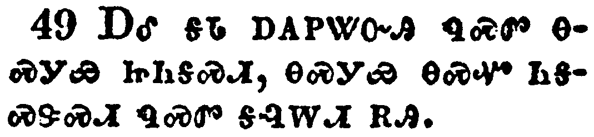</a></td>
</tr>
<tr class="even">
<td>And as we have borne the image of the earthy, we shall also bear the image of the heavenly.</td>
</tr>
<tr class="odd">
<td>ᎠᎴ ᎦᏓ ᎠᎪᏢᏔᏅᎯ ᏄᏍᏛ ᎾᏍᎩᏯ ᏥᏂᎦᏍᏗ, ᎾᏍᎩᏯ ᎾᏍᏉ ᏂᎦᏍᏕᏍᏗ ᏄᏍᏛ ᎦᎸᎳᏗ ᎡᎯ.</td>
</tr>
<tr class="even">
<td>A-le ga-da a-go-tlv-ta-nv-hi nu-s-dv na-s-gi-ya tsi-ni-ga-s-di, na-s-gi-ya na-s-quo ni-ga-s-de-s-di nu-s-dv ga-lv-la-di e-hi.</td>
</tr>
</tbody>
</table>

<table>
<tbody>
<tr class="odd">
<td><a href="071550.png">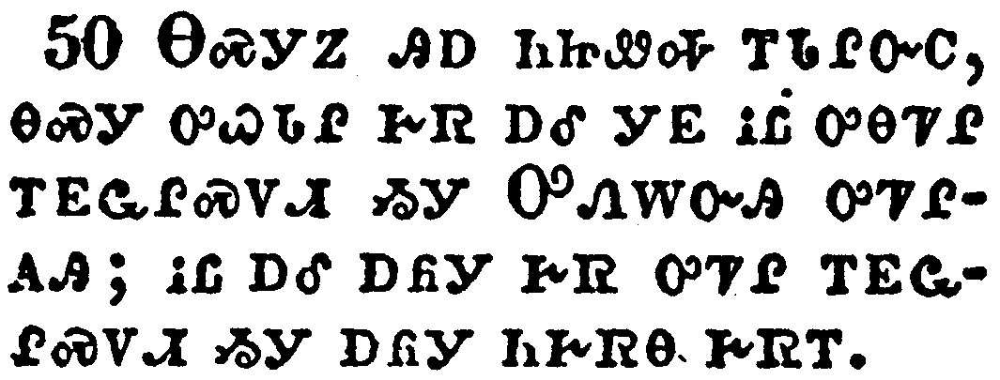</a></td>
</tr>
<tr class="even">
<td>Now this I say, brethren, that flesh and blood cannot inherit the kingdom of God; neither doth corruption inherit incorruption.</td>
</tr>
<tr class="odd">
<td>ᎾᏍᎩᏃ ᎯᎠ ᏂᏥᏪᎭ ᎢᏓᎵᏅᏟ, ᎾᏍᎩ ᎤᏇᏓᎵ ᎨᏒ ᎠᎴ ᎩᎬ ᎥᏝ ᎤᎾᏤᎵ ᎢᎬᏩᎵᏍᏙᏗ ᏱᎩ ᎤᏁᎳᏅᎯ ᎤᏤᎵᎪᎯ; ᎥᏝ ᎠᎴ ᎠᏲᎩ ᎨᏒ ᎤᏤᎵ ᎢᎬᏩᎵᏍᏙᏗ ᏱᎩ ᎠᏲᎯ ᏂᎨᏒᎾ ᎨᏒᎢ.</td>
</tr>
<tr class="even">
<td>Na-s-gi-no hi-a ni-tsi-we-ha i-da-li-nv-tli, na-s-gi u-que-da-li ge-sv a-le gi-gv v-tla u-na-tse-li i-gv-wa-li-s-do-di yi-gi U-ne-la-nv-hi u-tse-li-go-hi; v-tla a-le a-yo-gi ge-sv u-tse-li i-gv-wa-li-s-do-di yi-gi a-yo-hi ni-ge-sv-na ge-sv-i.</td>
</tr>
</tbody>
</table>

<table>
<tbody>
<tr class="odd">
<td><a href="071551.png">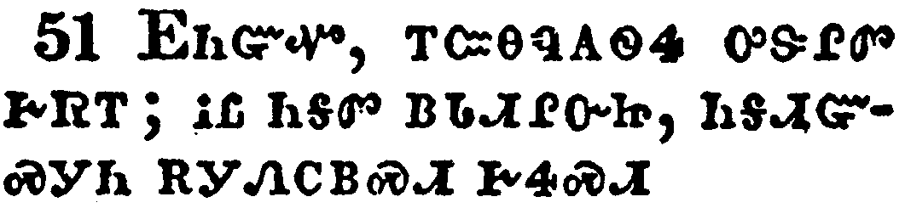</a></td>
</tr>
<tr class="even">
<td>Behold, I shew you a mystery; We shall not all sleep, but we shall all be changed,</td>
</tr>
<tr class="odd">
<td>ᎬᏂᏳᏉ, ᎢᏨᎾᏄᎪᏫᏎ ᎤᏕᎵᏛ ᎨᏒᎢ; ᎥᏝ ᏂᎦᏛ ᏴᏓᏗᎵᏅᏥ, ᏂᎦᏗᏳᏍᎩᏂ ᎡᎩᏁᏟᏴᏍᏗ ᎨᏎᏍᏗ</td>
</tr>
<tr class="even">
<td>Gv-ni-yu-quo, i-tsv-na-nu-go-wi-se u-de-li-dv ge-sv-i; v-tla ni-ga-dv yv-da-di-li-nv-tsi, ni-ga-di-yu-s-gi-ni e-gi-ne-tli-yv-s-di ge-se-s-di</td>
</tr>
</tbody>
</table>

<table>
<tbody>
<tr class="odd">
<td><a href="071552.png">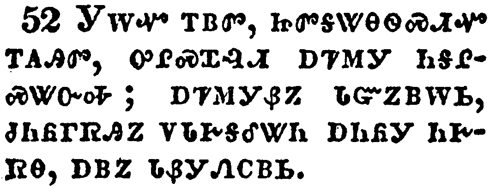</a></td>
</tr>
<tr class="even">
<td>In a moment, in the twinkling of an eye, at the last trump: for the trumpet shall sound, and the dead shall be raised incorruptible, and we shall be changed.</td>
</tr>
<tr class="odd">
<td>ᎩᎳᏉ ᎢᏴᏛ, ᏥᏛᎦᏔᎾᏫᏍᏗᏉ ᎢᎪᎯᏛ, ᎤᎵᏍᏆᎸᏗ ᎠᏤᎷᎩ ᏂᎦᎵᏍᏔᏅᎭ; ᎠᏤᎷᎩᏰᏃ ᏓᏳᏃᏴᎳᏏ, ᏧᏂᏲᎱᏒᎯᏃ ᏙᏓᎨᎦᎴᏔᏂ ᎠᏂᏲᎩ ᏁᎨᏒᎾ, ᎠᏴᏃ ᏓᏰᎩᏁᏟᏴᏏ.</td>
</tr>
<tr class="even">
<td>Gi-la-quo i-yv-dv, tsi-dv-ga-ta-na-wi-s-di-quo i-go-hi-dv, u-li-s-qua-lv-di a-tse-lu-gi ni-ga-li-s-ta-nv-ha; a-tse-lu-gi-ye-no da-yu-no-yv-la-si, tsu-ni-yo-hu-sv-hi-no do-da-ge-ga-le-ta-ni a-ni-yo-gi ne-ge-sv-na, a-yv-no da-ye-gi-ne-tli-yv-si.</td>
</tr>
</tbody>
</table>

<table>
<tbody>
<tr class="odd">
<td><a href="071553.png">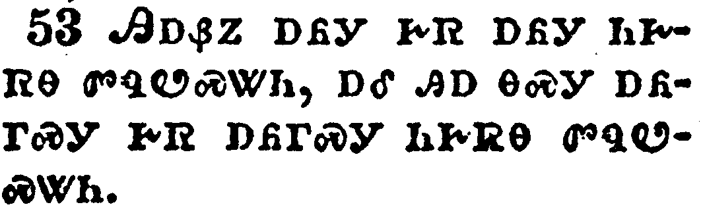</a></td>
</tr>
<tr class="even">
<td>For this corruptible must put on incorruption, and this mortal must put on immortality.</td>
</tr>
<tr class="odd">
<td>ᎯᎠᏰᏃ ᎠᏲᎩ ᎨᏒ ᎠᏲᎩ ᏂᎨᏒᎾ ᏛᏄᏬᏍᏔᏂ, ᎠᎴ ᎯᎠ ᎾᏍᎩ ᎠᏲᎱᏍᎩ ᎨᏒ ᎠᏲᎱᏍᎩ ᏂᎨᏒᎾ ᏛᏄᏬᏍᏔᏂ.</td>
</tr>
<tr class="even">
<td>Hi-a-ye-no a-yo-gi ge-sv a-yo-gi ni-ge-sv-na dv-nu-wo-s-ta-ni, a-le hi-a na-s-gi a-yo-hu-s-gi ge-sv a-yo-hu-s-gi ni-ge-sv-na dv-nu-wo-s-ta-ni.</td>
</tr>
</tbody>
</table>

<table>
<tbody>
<tr class="odd">
<td><a href="071554.png">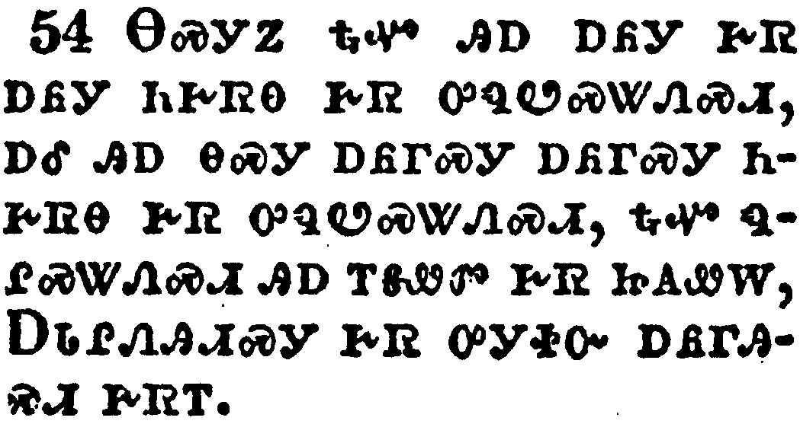</a></td>
</tr>
<tr class="even">
<td>So when this corruptible shall have put on incorruption, and this mortal shall have put on immortality, then shall be brought to pass the saying that is written, Death is swallowed up in victory.</td>
</tr>
<tr class="odd">
<td>ᎾᏍᎩᏃ ᎿᎭᏉ ᎯᎠ ᎠᏲᎩ ᎨᏒ ᎠᏲᎩ ᏂᎨᏒᎾ ᎨᏒ ᎤᏄᏬᏍᏔᏁᏍᏗ, ᎠᎴ ᎯᎠ ᎾᏍᎩ ᎠᏲᎱᏍᎩ ᎠᏲᎱᏍᎩ ᏂᎨᏒᎾ ᎨᏒ ᎤᏄᏬᏍᏔᏁᏍᏗ, ᎿᎭᏉ ᏄᎵᏍᏔᏁᏍᏗ ᎯᎠ ᎢᎦᏪᏛ ᎨᏒ ᏥᎪᏪᎳ, ᎠᏓᎵᏁᎯᏗᏍᎩ ᎨᏒ ᎤᎩᏐᏅ ᎠᏲᎱᎯᏍᏗ ᎨᏒᎢ.</td>
</tr>
<tr class="even">
<td>Na-s-gi-no hna-quo hi-a a-yo-gi ge-sv a-yo-gi ni-ge-sv-na ge-sv u-nu-wo-s-ta-ne-s-di, a-le hi-a na-s-gi a-yo-hu-s-gi a-yo-hu-s-gi ni-ge-sv-na ge-sv u-nu-wo-s-ta-ne-s-di, hna-quo nu-li-s-ta-ne-s-di hi-a i-ga-we-dv ge-sv tsi-go-we-la, A-da-li-ne-hi-di-s-gi ge-sv u-gi-so-nv a-yo-hu-hi-s-di ge-sv-i.</td>
</tr>
</tbody>
</table>

<table>
<tbody>
<tr class="odd">
<td><a href="071555.png">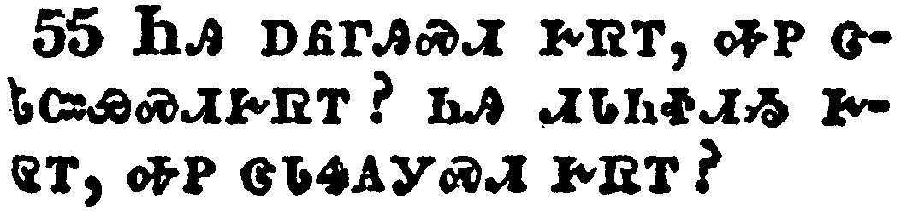</a></td>
</tr>
<tr class="even">
<td>O death, where is thy sting? O grave, where is thy victory?</td>
</tr>
<tr class="odd">
<td>ᏂᎯ ᎠᏲᎱᎯᏍᏗ ᎨᏒᎢ, ᎭᏢ ᏣᏓᏨᏯᏍᏗᎨᏒᎢ? ᏂᎯ ᏗᏓᏂᏐᏗᏱ ᎨᏒᎢ, ᎭᏢ ᏣᏓᏎᎪᎩᏍᏗ ᎨᏒᎢ?</td>
</tr>
<tr class="even">
<td>Ni-hi a-yo-hu-hi-s-di ge-sv-i, ha-tlv tsa-da-tsv-ya-s-di-ge-sv-i? ni-hi di-da-ni-so-di-yi ge-sv-i, ha-tlv tsa-da-se-go-gi-s-di ge-sv-i?</td>
</tr>
</tbody>
</table>

<table>
<tbody>
<tr class="odd">
<td><a href="071556.png">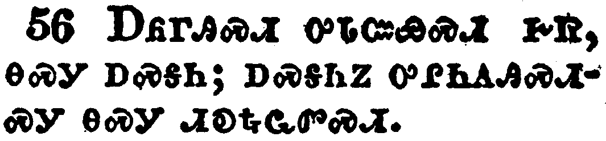</a></td>
</tr>
<tr class="even">
<td>The sting of death is sin; and the strength of sin is the law.</td>
</tr>
<tr class="odd">
<td>ᎠᏲᎱᏍᏗ ᎤᏓᏨᏯᏍᏗ ᎨᏒ, ᎾᏍᎩ ᎠᏍᎦᏂ; ᎠᏍᎦᏂᏃ ᎤᎵᏂᎪᎯᏍᏗᏍᎩ ᎾᏍᎩ ᏗᎧᎿᎭᏩᏛᏍᏗ.</td>
</tr>
<tr class="even">
<td>A-yo-hu-s-di u-da-tsv-ya-s-di ge-sv, na-s-gi a-s-ga-ni; a-s-ga-ni-no u-li-ni-go-hi-s-di-s-gi na-s-gi di-ka-hna-wa-dv-s-di.</td>
</tr>
</tbody>
</table>

<table>
<tbody>
<tr class="odd">
<td><a href="071557.png">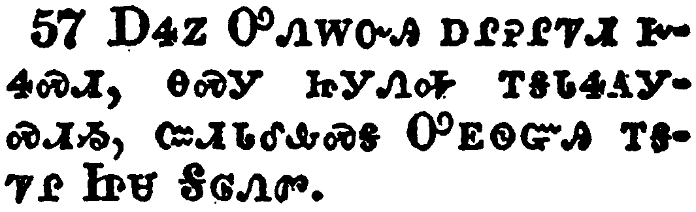</a></td>
</tr>
<tr class="even">
<td>But thanks be to God, which giveth us the victory through our Lord Jesus Christ.</td>
</tr>
<tr class="odd">
<td>ᎠᏎᏃ ᎤᏁᎳᏅᎯ ᎠᎵᎮᎵᏤᏗ ᎨᏎᏍᏗ, ᎾᏍᎩ ᏥᎩᏁᎭ ᎢᎦᏓᏎᎪᎩᏍᏗᏱ, ᏨᏗᏓᎴᎲᏍᎦ ᎤᎬᏫᏳᎯ ᎢᎦᏤᎵ ᏥᏌ ᎦᎶᏁᏛ.</td>
</tr>
<tr class="even">
<td>A-se-no U-ne-la-nv-hi a-li-he-li-tse-di ge-se-s-di, na-s-gi tsi-gi-ne-ha i-ga-da-se-go-gi-s-di-yi, tsv-di-da-le-hv-s-ga U-gv-wi-yu-hi i-ga-tse-li Tsi-sa Ga-lo-ne-dv.</td>
</tr>
</tbody>
</table>

<table>
<tbody>
<tr class="odd">
<td><a href="071558.png">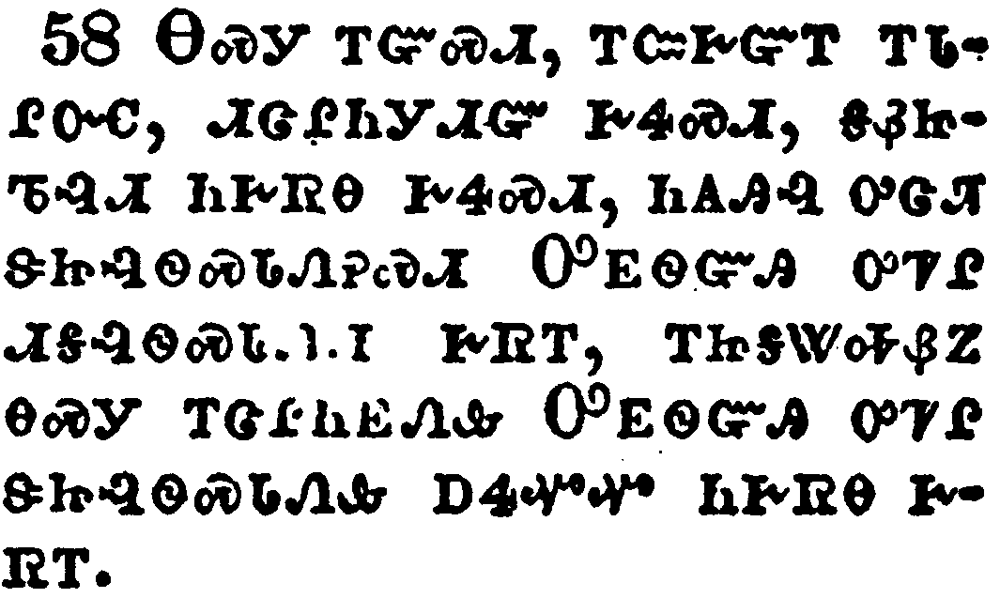</a></td>
</tr>
<tr class="even">
<td>Therefore, my beloved brethren, be ye stedfast, unmoveable, always abounding in the work of the Lord, forasmuch as ye know that your labour is not in vain in the Lord.</td>
</tr>
<tr class="odd">
<td>ᎾᏍᎩ ᎢᏳᏍᏗ, ᎢᏨᎨᏳᎢ ᎢᏓᎵᏅᏟ, ᏗᏣᎵᏂᎩᏗᏳ ᎨᏎᏍᏗ, ᎦᏰᏥᏖᎸᏗ ᏂᎨᏒᎾ ᎨᏎᏍᏗ, ᏂᎪᎯᎸ ᎤᏣᏘ ᏕᏥᎸᏫᏍᏓᏁᎮᏍᏗ ᎤᎬᏫᏳᎯ ᎤᏤᎵ ᏗᎦᎸᏫᏍᏓᏁᏗ ᎨᏒᎢ, ᎢᏥᎦᏔᎭᏰᏃ ᎾᏍᎩ ᎢᏣᎵᏂᎬᏁᎲ ᎤᎬᏫᏳᎯ ᎤᏤᎵ ᏕᏥᎸᏫᏍᏓᏁᎲ ᎠᏎᏉᏉ ᏂᎨᏒᎾ ᎨᏒᎢ.</td>
</tr>
<tr class="even">
<td>Na-s-gi i-yu-s-di, i-tsv-ge-yu-i i-da-li-nv-tli, di-tsa-li-ni-gi-di-yu ge-se-s-di, ga-ye-tsi-te-lv-di ni-ge-sv-na ge-se-s-di, ni-go-hi-lv u-tsa-ti de-tsi-lv-wi-s-da-ne-he-s-di U-gv-wi-yu-hi u-tse-li di-ga-lv-wi-s-da-ne-di ge-sv-i, i-tsi-ga-ta-ha-ye-no na-s-gi i-tsa-li-ni-gv-ne-hv U-gv-wi-yu-hi u-tse-li de-tsi-lv-wi-s-da-ne-hv a-se-quo-quo ni-ge-sv-na ge-sv-i.</td>
</tr>
</tbody>
</table>

