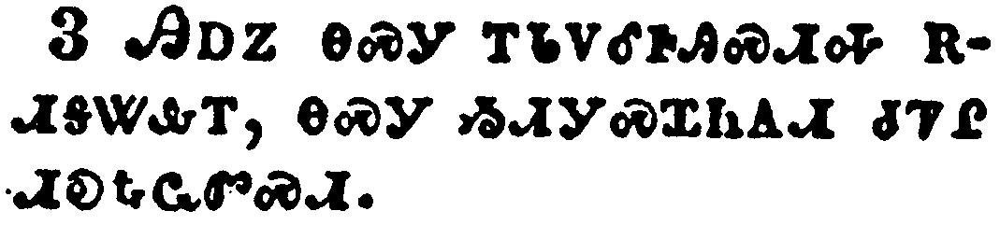
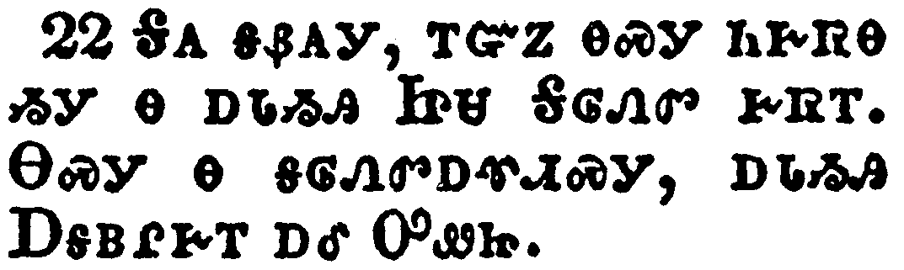
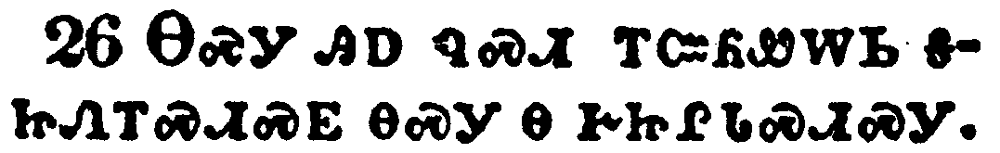

+++
draft=false
date = 2014-12-18T21:11:07Z
title = "1 John - Chapter 2 - Cherokee New Testament"
weight = 1418955067

[taxonomies]

authors = ["Timothy Legg"]
categories = []
tags = []

[extra]
+++

<table>
<tbody>
<tr class="odd">
<td></td>
</tr>
<tr class="even">
<td>My little children, these things write I unto you, that ye sin not. And if any man sin, we have an advocate with the Father, Jesus Christ the righteous:</td>
</tr>
<tr class="odd">
<td>ᏗᏥᏲᎵ ᏗᏇᏥ, ᎯᎠ ᎾᏍᎩ ᎢᏨᏲᏪᎳᏁᎭ, ᎢᏥᏍᎦᏅᎢᏍᏗᏱ ᏂᎨᏒᎾ. ᎢᏳᏃ ᎩᎶ ᏯᏍᎦᏅᎦ, ᎢᎨᎭ ᏗᎪᎯᏍᏓᏁᎯ ᎠᎦᏴᎵᎨ ᎡᎲᎢ, ᏥᏌ ᎦᎶᏁᏛ ᎾᏍᎦᏅᎾ.</td>
</tr>
<tr class="even">
<td>Di-tsi-yo-li di-que-tsi, hi-a na-s-gi i-tsv-yo-we-la-ne-ha, i-tsi-s-ga-nv-i-s-di-yi ni-ge-sv-na. I-yu-no gi-lo ya-s-ga-nv-ga, i-ge-ha di-go-hi-s-da-ne-hi A-ga-yv-li-ge e-hv-i, Tsi-sa Ga-lo-ne-dv na-s-ga-nv-na.</td>
</tr>
</tbody>
</table>

<table>
<tbody>
<tr class="odd">
<td></td>
</tr>
<tr class="even">
<td>And he is the propitiation for our sins: and not for ours only, but also for the sins of the whole world.</td>
</tr>
<tr class="odd">
<td>ᎠᎴ ᎾᏍᎩ ᎠᎵᏍᎪᎸᏔᏅᎯ ᎠᎫᏴᏙᏗ ᎠᏴ ᎢᎩᏍᎦᏅᏨᎢ, ᎠᎴ ᎥᏝ ᎠᏴᏉ ᎢᎬᏒ ᎢᎩᏍᎦᏅᏨᎢ, ᎾᏍᏉᏍᎩᏂ ᎡᎶᎯ ᏂᎬᎾᏛᎢ.</td>
</tr>
<tr class="even">
<td>A-le na-s-gi a-li-s-go-lv-ta-nv-hi a-gu-yv-do-di a-yv i-gi-s-ga-nv-tsv-i, a-le v-tla a-yv-quo i-gv-sv i-gi-s-ga-nv-tsv-i, na-s-quo-s-gi-ni e-lo-hi ni-gv-na-dv-i.</td>
</tr>
</tbody>
</table>

<table>
<tbody>
<tr class="odd">
<td></td>
</tr>
<tr class="even">
<td>And hereby we do know that we know him, if we keep his commandments.</td>
</tr>
<tr class="odd">
<td>ᎯᎠᏃ ᎾᏍᎩ ᎢᏓᏙᎴᎰᎯᏍᏗᎭ ᎡᏗᎦᏔᎲᎢ, ᎾᏍᎩ ᏱᏗᎩᏍᏆᏂᎪᏗ ᏧᏤᎵ ᏗᎧᎿᎭᏩᏛᏍᏗ.</td>
</tr>
<tr class="even">
<td>Hi-a-no na-s-gi i-da-do-le-ho-hi-s-di-ha e-di-ga-ta-hv-i, na-s-gi yi-di-gi-s-qua-ni-go-di tsu-tse-li di-ka-hna-wa-dv-s-di.</td>
</tr>
</tbody>
</table>

<table>
<tbody>
<tr class="odd">
<td></td>
</tr>
<tr class="even">
<td>He that saith, I know him, and keepeth not his commandments, is a liar, and the truth is not in him.</td>
</tr>
<tr class="odd">
<td>ᎩᎶ ᏥᎦᏔᎭ ᎠᏗᏍᎩ, ᎠᏎᏃ ᏂᏚᏍᏆᏂᎪᏛᎾ ᏱᎩ ᏧᏤᎵ ᏗᎧᎿᎭᏩᏛᏍᏗ, ᎾᏍᎩ ᎦᏰᎪᎩ ᎠᎴ ᎤᏙᎯᏳᎯ ᎨᏒ ᏄᏪᎲᎾ.</td>
</tr>
<tr class="even">
<td>Gi-lo tsi-ga-ta-ha a-di-s-gi, a-se-no ni-du-s-qua-ni-go-dv-na yi-gi tsu-tse-li di-ka-hna-wa-dv-s-di, na-s-gi ga-ye-go-gi a-le u-do-hi-yu-hi ge-sv nu-we-hv-na.</td>
</tr>
</tbody>
</table>

<table>
<tbody>
<tr class="odd">
<td></td>
</tr>
<tr class="even">
<td>But whoso keepeth his word, in him verily is the love of God perfected: hereby know we that we are in him.</td>
</tr>
<tr class="odd">
<td>ᎩᎶᏍᎩᏂ ᏳᏍᏆᏂᎪᏗ ᎾᏍᎩ ᎤᏁᏨᎯ, ᎾᏍᎩ ᎤᏙᎯᏳᎯᏯ ᎤᏁᎳᏅᎯ ᎠᎨᏳᏗ ᎨᏒ ᎤᎧᎵᏨᎯ ᎨᏐᎢ: ᎾᏍᎩ ᎯᎠ ᎢᏓᏙᎴᎰᎯᏍᏗᎭ ᎡᏗᏯᎥᎢ.</td>
</tr>
<tr class="even">
<td>Gi-lo-s-gi-ni yu-s-qua-ni-go-di na-s-gi u-ne-tsv-hi, na-s-gi u-do-hi-yu-hi-ya U-ne-la-nv-hi a-ge-yu-di ge-sv u-ka-li-tsv-hi ge-so-i: na-s-gi hi-a i-da-do-le-ho-hi-s-di-ha e-di-ya-v-i.</td>
</tr>
</tbody>
</table>

<table>
<tbody>
<tr class="odd">
<td></td>
</tr>
<tr class="even">
<td>He that saith he abideth in him ought himself also so to walk, even as he walked.</td>
</tr>
<tr class="odd">
<td>ᎩᎶ [ᏥᏌ] ᏥᏯᎠ ᏯᏗᎭ, [ᏥᏌ] ᎤᏪᏙᎸ ᎾᏍᎩᏯ ᎾᏍᏉ ᏰᏙᎭ.</td>
</tr>
<tr class="even">
<td>Gi-lo [Tsi-sa] tsi-ya-a ya-di-ha, [Tsi-sa] u-we-do-lv na-s-gi-ya na-s-quo ye-do-ha.</td>
</tr>
</tbody>
</table>

<table>
<tbody>
<tr class="odd">
<td></td>
</tr>
<tr class="even">
<td>Brethren, I write no new commandment unto you, but an old commandment which ye had from the beginning. The old commandment is the word which ye have heard from the beginning.</td>
</tr>
<tr class="odd">
<td>ᎢᏓᏓᏅᏟ, ᎥᏝ ᎢᏤ ᏗᎧᎿᎭᏩᏛᏍᏗ ᏱᏨᏲᏪᎳᏁᎭ, ᎤᏪᏘᏉᏍᎩᏂ ᏗᎧᎿᎭᏩᏛᏍᏗ ᎾᏍᎩ ᏥᏥᎲᎩ ᏗᏓᎴᏂᏍᎬᎢ; ᎤᏪᏘ ᏗᎧᎿᎭᏩᏛᏍᏗ ᎾᏍᎩᏉ ᎧᏃᎮᏛ ᏗᏓᎴᏂᏍᎬ ᏅᏓᎬᏩᏓᎴᏅᏛ ᏥᏁᏣᏛᎩᏍᎪᎢ.</td>
</tr>
<tr class="even">
<td>I-da-da-nv-tli, v-tla i-tse di-ka-hna-wa-dv-s-di yi-tsv-yo-we-la-ne-ha, u-we-ti-quo-s-gi-ni di-ka-hna-wa-dv-s-di na-s-gi tsi-tsi-hv-gi di-da-le-ni-s-gv-i; u-we-ti di-ka-hna-wa-dv-s-di na-s-gi-quo ka-no-he-dv di-da-le-ni-s-gv nv-da-gv-wa-da-le-nv-dv tsi-ne-tsa-dv-gi-s-go-i.</td>
</tr>
</tbody>
</table>

<table>
<tbody>
<tr class="odd">
<td></td>
</tr>
<tr class="even">
<td>Again, a new commandment I write unto you, which thing is true in him and in you: because the darkness is past, and the true light now shineth.</td>
</tr>
<tr class="odd">
<td>ᎠᎴᏬ, ᎢᏤ ᏗᎧᎿᎭᏩᏛᏍᏗ ᎢᏨᏲᏪᎳᏁᎭ, ᎾᏍᎩ ᎤᏙᎯᏳᎭ [ᎦᎶᏁᏛ] ᎨᏒᎢ ᎠᎴ ᏂᎯ ᎨᏒᎢ; ᎤᎵᏏᎬᏰᏃ ᎤᎶᏐᏅ, ᎿᎭᏉᏃ ᏚᏳᎪᏛ ᎢᎦᎦᏘ ᏚᎸᏌᏛ.</td>
</tr>
<tr class="even">
<td>A-le-wo, i-tse di-ka-hna-wa-dv-s-di i-tsv-yo-we-la-ne-ha, na-s-gi u-do-hi-yu-ha [Ga-lo-ne-dv] ge-sv-i a-le ni-hi ge-sv-i; u-li-si-gv-ye-no u-lo-so-nv, hna-quo-no du-yu-go-dv i-ga-ga-ti du-lv-sa-dv.</td>
</tr>
</tbody>
</table>

<table>
<tbody>
<tr class="odd">
<td></td>
</tr>
<tr class="even">
<td>He that saith he is in the light, and hateth his brother, is in darkness even until now.</td>
</tr>
<tr class="odd">
<td>ᎩᎶ ᎢᎦᎦᏛ ᎨᎠ ᏯᏗᎭ, ᏗᎾᏓᏅᏟᏃ ᏯᏍᎦᎦ, ᎤᎵᏏᎬᏉ ᎡᎭ ᎩᎳᎯᏳ.</td>
</tr>
<tr class="even">
<td>Gi-lo i-ga-ga-dv ge-a ya-di-ha, di-na-da-nv-tli-no ya-s-ga-ga, u-li-si-gv-quo e-ha gi-la-hi-yu.</td>
</tr>
</tbody>
</table>

<table>
<tbody>
<tr class="odd">
<td></td>
</tr>
<tr class="even">
<td>He that loveth his brother abideth in the light, and there is none occasion of stumbling in him.</td>
</tr>
<tr class="odd">
<td>ᎩᎶ ᏗᎾᏓᏅᏟ ᏳᎨᏳᎭ ᎢᎦᎦᏛ ᎡᎭ, ᎥᏝ ᎠᎴ ᎪᎱᏍᏗ ᎠᏓᏙᏕᏍᏗᏍᎩ ᏳᏪᎭ.</td>
</tr>
<tr class="even">
<td>Gi-lo di-na-da-nv-tli yu-ge-yu-ha i-ga-ga-dv e-ha, v-tla a-le go-hu-s-di a-da-do-de-s-di-s-gi yu-we-ha.</td>
</tr>
</tbody>
</table>

<table>
<tbody>
<tr class="odd">
<td></td>
</tr>
<tr class="even">
<td>But he that hateth his brother is in darkness, and walketh in darkness, and knoweth not whither he goeth, because that darkness hath blinded his eyes.</td>
</tr>
<tr class="odd">
<td>ᏗᎾᏓᏅᏟᏍᎩᏂ ᎠᏍᎦᎩ ᎤᎵᏏᎬᏉ ᎡᎭ, ᎠᎴ ᎤᎵᏏᎬᏉ ᎡᏙᎭ, ᎥᏝ ᎠᎴ ᏯᎦᏔᎭ ᏩᎦᏛᎢ, ᎤᎵᏏᎬᏰᏃ ᏚᎨᏩᏛ.</td>
</tr>
<tr class="even">
<td>Di-na-da-nv-tli-s-gi-ni a-s-ga-gi u-li-si-gv-quo e-ha, a-le u-li-si-gv-quo e-do-ha, v-tla a-le ya-ga-ta-ha wa-ga-dv-i, u-li-si-gv-ye-no du-ge-wa-dv.</td>
</tr>
</tbody>
</table>

<table>
<tbody>
<tr class="odd">
<td></td>
</tr>
<tr class="even">
<td>I write unto you, little children, because your sins are forgiven you for his name's sake.</td>
</tr>
<tr class="odd">
<td>ᎢᏨᏲᏪᎳᏁᎭ ᏗᏥᏲᎵ ᎢᏥᏍᎦᏅᏨᏰᏃ ᎡᏥᏙᎵᏨ ᏅᏧᎵᏍᏙᏔᏅ ᏥᏌ ᏕᎤᏙᎥᎢ.</td>
</tr>
<tr class="even">
<td>I-tsv-yo-we-la-ne-ha di-tsi-yo-li i-tsi-s-ga-nv-tsv-ye-no e-tsi-do-li-tsv nv-tsu-li-s-do-ta-nv Tsi-sa de-u-do-v-i.</td>
</tr>
</tbody>
</table>

<table>
<tbody>
<tr class="odd">
<td></td>
</tr>
<tr class="even">
<td>I write unto you, fathers, because ye have known him that is from the beginning. I write unto you, young men, because ye have overcome the wicked one. I write unto you, little children, because ye have known the Father.</td>
</tr>
<tr class="odd">
<td>ᎢᏨᏲᏪᎳᏁᎭ ᎢᏥᎦᏴᎵᎨᎢ, ᎡᏥᎦᏙᎥᏒᏰᏃ ᏗᏓᎴᏂᏍᎬ ᏅᏓᎬᏩᏓᎴᏅᏛ ᏤᎭ. ᎢᏨᏲᏪᎳᏁᎭ ᎢᏥᏫᏅ, ᎡᏥᏎᎪᎩᏒᏰᏃ ᎤᏁᎫᏥᏛ. ᎢᏨᏲᏪᎳᏁᎭ ᏗᏥᏲᎵ, ᎡᏥᎦᏙᎥᏒᏰᏃ ᎠᎦᏴᎵᎨᎢ.</td>
</tr>
<tr class="even">
<td>I-tsv-yo-we-la-ne-ha i-tsi-ga-yv-li-ge-i, e-tsi-ga-do-v-sv-ye-no di-da-le-ni-s-gv nv-da-gv-wa-da-le-nv-dv tse-ha. I-tsv-yo-we-la-ne-ha i-tsi-wi-nv, e-tsi-se-go-gi-sv-ye-no u-ne-gu-tsi-dv. I-tsv-yo-we-la-ne-ha di-tsi-yo-li, e-tsi-ga-do-v-sv-ye-no A-ga-yv-li-ge-i.</td>
</tr>
</tbody>
</table>

<table>
<tbody>
<tr class="odd">
<td></td>
</tr>
<tr class="even">
<td>I have written unto you, fathers, because ye have known him that is from the beginning. I have written unto you, young men, because ye are strong, and the word of God abideth in you, and ye have overcome the wicked one.</td>
</tr>
<tr class="odd">
<td>ᎢᏨᏲᏪᎳᏏ ᎢᏥᎦᏴᎵᎨᎢ, ᎡᏥᎦᏙᎥᏒᏰᏃ ᏗᏓᎴᏂᏍᎬ ᏅᏓᎬᏩᏓᎴᏅᏛ ᏤᎭ. ᎢᏨᏲᏪᎳᏏ ᎢᏥᏫᏅ, ᏗᏣᎵᏂᎩᏗᏳᏰᏃ, ᎠᎴ ᎧᏃᎮᏛ ᎤᏁᎳᏅᎯ ᎤᏤᎵᎦ ᎢᏥᏯᎠ, ᎠᎴ ᎡᏥᏎᎪᎩᏒ ᎤᏁᏧᏥᏛ.</td>
</tr>
<tr class="even">
<td>I-tsv-yo-we-la-si i-tsi-ga-yv-li-ge-i, e-tsi-ga-do-v-sv-ye-no di-da-le-ni-s-gv nv-da-gv-wa-da-le-nv-dv tse-ha. I-tsv-yo-we-la-si i-tsi-wi-nv, di-tsa-li-ni-gi-di-yu-ye-no, a-le ka-no-he-dv U-ne-la-nv-hi u-tse-li-ga i-tsi-ya-a, a-le e-tsi-se-go-gi-sv u-ne-tsu-tsi-dv.</td>
</tr>
</tbody>
</table>

<table>
<tbody>
<tr class="odd">
<td></td>
</tr>
<tr class="even">
<td>Love not the world, neither the things that are in the world. If any man love the world, the love of the Father is not in him.</td>
</tr>
<tr class="odd">
<td>ᏞᏍᏗ ᏱᏥᎨᏳᏎᏍᏗ ᎡᎶᎯ, ᎠᎴ ᎪᎱᏍᏗ ᎡᎶᎯ ᎡᎯ. ᎢᏳᏃ ᎩᎶ ᎡᎶᎯ ᏳᎨᏳᎭ, ᎥᏝ ᏱᎬᏩᎨᏳᎭ ᎠᎦᏴᎵᎨᎢ.</td>
</tr>
<tr class="even">
<td>Tle-s-di yi-tsi-ge-yu-se-s-di e-lo-hi, a-le go-hu-s-di e-lo-hi e-hi. I-yu-no gi-lo e-lo-hi yu-ge-yu-ha, v-tla yi-gv-wa-ge-yu-ha A-ga-yv-li-ge-i.</td>
</tr>
</tbody>
</table>

<table>
<tbody>
<tr class="odd">
<td></td>
</tr>
<tr class="even">
<td>For all that is in the world, the lust of the flesh, and the lust of the eyes, and the pride of life, is not of the Father, but is of the world.</td>
</tr>
<tr class="odd">
<td>ᏥᏄᏓᎴᏰᏃ ᎡᎶᎯ ᏤᎭ, ᎠᏰᎸ ᎤᏚᎸᏗ ᏥᎩ, ᎠᎴ ᏨᎦᏙᎵ ᎤᏙᎸᏗ ᏥᎩ, ᎠᎴ ᎠᏢᏉᏗ ᎠᎴᏂᏓᏍᏗᏱ, ᎾᏍᎩ ᎥᏝ ᎠᎦᏴᎵᎨᏍᏛᏱ ᏅᏓᏳᏓᎴᏅᎯ ᏱᎩ, ᎡᎶᎯᏉᏍᎩᏂ ᎤᏓᎴᏅᎯ.</td>
</tr>
<tr class="even">
<td>Tsi-nu-da-le-ye-no e-lo-hi tse-ha, a-ye-lv u-du-lv-di tsi-gi, a-le tsv-ga-do-li u-do-lv-di tsi-gi, a-le a-tlv-quo-di a-le-ni-da-s-di-yi, na-s-gi v-tla A-ga-yv-li-ge-s-dv-yi nv-da-yu-da-le-nv-hi yi-gi, e-lo-hi-quo-s-gi-ni u-da-le-nv-hi.</td>
</tr>
</tbody>
</table>

<table>
<tbody>
<tr class="odd">
<td></td>
</tr>
<tr class="even">
<td>And the world passeth away, and the lust thereof: but he that doeth the will of God abideth for ever.</td>
</tr>
<tr class="odd">
<td>ᎠᎴ ᎡᎶᎯ ᎦᎶᏐᎲᏍᎦ, ᎠᎴ ᎾᏍᎩ ᎾᎿᎭᎠᏚᎸᏗ ᎨᏒᎢ, ᎾᏍᎩᏍᎩᏂ Ꮎ ᎤᏁᎳᏅᎯ ᎠᏓᏅᏖᏍᎬ ᏧᎸᏫᏍᏓᏁᎯ ᏂᎪᎯᎸ ᎡᎭ.</td>
</tr>
<tr class="even">
<td>A-le e-lo-hi ga-lo-so-hv-s-ga, a-le na-s-gi na-hna a-du-lv-di ge-sv-i, na-s-gi-s-gi-ni na U-ne-la-nv-hi a-da-nv-te-s-gv tsu-lv-wi-s-da-ne-hi ni-go-hi-lv e-ha.</td>
</tr>
</tbody>
</table>

<table>
<tbody>
<tr class="odd">
<td></td>
</tr>
<tr class="even">
<td>Little children, it is the last time: and as ye have heard that antichrist shall come, even now are there many antichrists; whereby we know that it is the last time.</td>
</tr>
<tr class="odd">
<td>ᏗᏥᏲᎵ, ᎿᎭᏉ ᎤᎵᏍᏆᎸᏗ, ᎢᏣᏛᎦᏅᎯᏃ ᏥᎩ ᎤᎷᎯᏍᏗᏱ ᎦᎶᏁᏛ-ᎠᏡᏗᏍᎩ, ᎠᎴ ᎪᎯ ᎨᏒ ᎤᏂᏣᏔ ᎦᎶᏁᏛ-ᎠᎾᏡᏗᏍᎩ; ᎾᏍᎩ ᎢᏳᏍᏗ ᎢᏗᎦᏔᎭ ᎤᎵᏍᏆᎸᏗ ᎨᏒᎢ.</td>
</tr>
<tr class="even">
<td>di-tsi-yo-li, hna-quo u-li-s-qua-lv-di, i-tsa-dv-ga-nv-hi-no tsi-gi u-lu-hi-s-di-yi ga-lo-ne-dv--a-tlu-di-s-gi, a-le go-hi ge-sv u-ni-tsa-ta ga-lo-ne-dv--a-na-tlu-di-s-gi; na-s-gi i-yu-s-di i-di-ga-ta-ha u-li-s-qua-lv-di ge-sv-i.</td>
</tr>
</tbody>
</table>

<table>
<tbody>
<tr class="odd">
<td></td>
</tr>
<tr class="even">
<td>They went out from us, but they were not of us; for if they had been of us, they would no doubt have continued with us: but they went out, that they might be made manifest that they were not all of us.</td>
</tr>
<tr class="odd">
<td>ᎨᎦᏙᏣᎳᎡᎸᎩ, ᎠᏎᏃ ᎥᏝ ᎾᎿᎭᎠᏁᎳ ᏱᎨᏎᎢ, ᎢᏳᏰᏃ ᎾᎿᎭᎠᏁᏔ ᏱᎨᏎᎢ, ᎠᏎ ᏱᏂᎬᏩᎾᏛᏁᎢ, ᎠᏎᏃ [ᎤᎾᏙᏣᎴᏒᎩ] ᎬᏂᎨᏒ ᎢᏳᎾᎵᏍᏙᏗᏱ ᎾᎿᎭᏂᎦᏛ ᎠᏁᎳ ᏂᎨᏒᎾ ᎨᏒᎢ.</td>
</tr>
<tr class="even">
<td>Ge-ga-do-tsa-la-e-lv-gi, a-se-no v-tla na-hna a-ne-la yi-ge-se-i, i-yu-ye-no na-hna a-ne-ta yi-ge-se-i, a-se yi-ni-gv-wa-na-dv-ne-i, a-se-no [u-na-do-tsa-le-sv-gi] gv-ni-ge-sv i-yu-na-li-s-do-di-yi na-hna ni-ga-dv a-ne-la ni-ge-sv-na ge-sv-i.</td>
</tr>
</tbody>
</table>

<table>
<tbody>
<tr class="odd">
<td></td>
</tr>
<tr class="even">
<td>But ye have an unction from the Holy One, and ye know all things.</td>
</tr>
<tr class="odd">
<td>ᏂᎯᏍᎩᏂ ᎾᏍᎦᏅᎾ ᎢᏥᎶᏁᎥ, ᎠᎴ ᎢᏥᎦᏔᎯᏳ ᏂᎦᎥᎢ.</td>
</tr>
<tr class="even">
<td>Ni-hi-s-gi-ni na-s-ga-nv-na i-tsi-lo-ne-v, a-le i-tsi-ga-ta-hi-yu ni-ga-v-i.</td>
</tr>
</tbody>
</table>

<table>
<tbody>
<tr class="odd">
<td></td>
</tr>
<tr class="even">
<td>I have not written unto you because ye know not the truth, but because ye know it, and that no lie is of the truth.</td>
</tr>
<tr class="odd">
<td>ᎯᎠ ᏥᏨᏲᏪᎳᏏ ᎥᏝ ᏱᏅᏓᎦᎵᏍᏙᏓ ᏂᏥᎦᏔᎲᎾ ᎨᏒ ᏚᏳᎪᏛᎢ, ᎢᏥᎦᏔᎯᏳᏍᎩᏂ ᎨᏒᎢ, ᎠᎴ ᎢᏥᎦᏔᎯᏳ ᎨᏒ ᏂᎦᎥ ᎦᏰᎪᎩ ᎧᏃᎮᏛ ᏚᏳᎪᏛ ᏅᏓᏳᏓᎴᏅᎯ ᏂᎨᏒᎾ ᎨᏒᎢ.</td>
</tr>
<tr class="even">
<td>Hi-a tsi-tsv-yo-we-la-si v-tla yi-nv-da-ga-li-s-do-da ni-tsi-ga-ta-hv-na ge-sv du-yu-go-dv-i, i-tsi-ga-ta-hi-yu-s-gi-ni ge-sv-i, a-le i-tsi-ga-ta-hi-yu ge-sv ni-ga-v ga-ye-go-gi ka-no-he-dv du-yu-go-dv nv-da-yu-da-le-nv-hi ni-ge-sv-na ge-sv-i.</td>
</tr>
</tbody>
</table>

<table>
<tbody>
<tr class="odd">
<td></td>
</tr>
<tr class="even">
<td>Who is a liar but he that denieth that Jesus is the Christ? He is antichrist, that denieth the Father and the Son.</td>
</tr>
<tr class="odd">
<td>ᎦᎪ ᎦᏰᎪᎩ, ᎢᏳᏃ ᎾᏍᎩ ᏂᎨᏒᎾ ᏱᎩ Ꮎ ᎠᏓᏱᎯ ᏥᏌ ᎦᎶᏁᏛ ᎨᏒᎢ. ᎾᏍᎩ Ꮎ ᎦᎶᏁᏛᎠᏡᏗᏍᎩ, ᎠᏓᏱᎯ ᎠᎦᏴᎵᎨᎢ ᎠᎴ ᎤᏪᏥ.</td>
</tr>
<tr class="even">
<td>Ga-go ga-ye-go-gi, i-yu-no na-s-gi ni-ge-sv-na yi-gi na a-da-yi-hi Tsi-sa Ga-lo-ne-dv ge-sv-i. Na-s-gi na ga-lo-ne-dv-a-tlu-di-s-gi, a-da-yi-hi A-ga-yv-li-ge-i a-le U-we-tsi.</td>
</tr>
</tbody>
</table>

<table>
<tbody>
<tr class="odd">
<td></td>
</tr>
<tr class="even">
<td>Whosoever denieth the Son, the same hath not the Father: (but) he that acknowledgeth the Son hath the Father also.</td>
</tr>
<tr class="odd">
<td>ᎩᎶ [ᎤᏁᎳᏅᎯ] ᎤᏪᏥ ᎠᏓᏱᎯ, ᎾᏍᎩ ᎥᏝ ᏳᏪᎭ ᎠᎦᏴᎵᎨᎢ; [ᎾᏍᎩᏍᎩᏂ Ꮎ ᎪᎯᏳᎲᏍᎩ ᎤᏪᏥ ᎾᏍᎩ ᎤᏪᎭ ᎾᏍᏉ ᎠᎦᏴᎵᎨᎢ.]</td>
</tr>
<tr class="even">
<td>Gi-lo [U-ne-la-nv-hi] U-we-tsi a-da-yi-hi, na-s-gi v-tla yu-we-ha A-ga-yv-li-ge-i; [na-s-gi-s-gi-ni na go-hi-yu-hv-s-gi u-we-tsi na-s-gi u-we-ha na-s-quo A-ga-yv-li-ge-i.]</td>
</tr>
</tbody>
</table>

<table>
<tbody>
<tr class="odd">
<td></td>
</tr>
<tr class="even">
<td>Let that therefore abide in you, which ye have heard from the beginning. If that which ye have heard from the beginning shall remain in you, ye also shall continue in the Son, and in the Father.</td>
</tr>
<tr class="odd">
<td>ᎾᏍᎩ ᎢᏳᏍᏗ ᏗᏓᎴᏂᏍᎬ ᏅᏓᎬᏩᏓᎴᏅᏛ ᏥᏣᏛᎩᎭ ᎾᏍᎩ ᏂᎯ ᎢᏥᏯᎡᏍᏗ. ᎢᏳᏃ ᎾᏍᎩ ᏗᏓᎴᏂᏍᎬ ᏅᏓᎬᏩᏓᎴᏅᏛ ᏥᏣᏛᎩᎭ ᎢᏥᏯᎡᏍᏗ, ᏂᎯ ᎾᏍᏉ ᎡᏥᏯᎡᏍᏗ ᎤᏪᏥ ᎠᎴ ᎠᎦᏴᎵᎨᎢ.</td>
</tr>
<tr class="even">
<td>Na-s-gi i-yu-s-di di-da-le-ni-s-gv nv-da-gv-wa-da-le-nv-dv tsi-tsa-dv-gi-ha na-s-gi ni-hi i-tsi-ya-e-s-di. I-yu-no na-s-gi di-da-le-ni-s-gv nv-da-gv-wa-da-le-nv-dv tsi-tsa-dv-gi-ha i-tsi-ya-e-s-di, ni-hi na-s-quo e-tsi-ya-e-s-di U-we-tsi a-le A-ga-yv-li-ge-i.</td>
</tr>
</tbody>
</table>

<table>
<tbody>
<tr class="odd">
<td></td>
</tr>
<tr class="even">
<td>And this is the promise that he hath promised us, even eternal life.</td>
</tr>
<tr class="odd">
<td>ᎠᎴ ᎯᎠ ᎾᏍᎩ ᎢᎩᏚᎢᏍᏓᏁᎸᎯ ᏥᎩ, ᎾᏍᎩ ᎠᎵᏍᏆᏗᏍᎩ ᏂᎨᏒᎾ ᎬᏂᏛ.</td>
</tr>
<tr class="even">
<td>A-le hi-a na-s-gi i-gi-du-i-s-da-ne-lv-hi tsi-gi, na-s-gi a-li-s-qua-di-s-gi ni-ge-sv-na gv-ni-dv.</td>
</tr>
</tbody>
</table>

<table>
<tbody>
<tr class="odd">
<td></td>
</tr>
<tr class="even">
<td>These things have I written unto you concerning them that seduce you.</td>
</tr>
<tr class="odd">
<td>ᎾᏍᎩ ᎯᎠ ᏄᏍᏗ ᎢᏨᏲᏪᎳᏏ ᎦᏥᏁᎢᏍᏗᏍᎬ ᎾᏍᎩ Ꮎ ᎨᏥᎵᏓᏍᏗᏍᎩ.</td>
</tr>
<tr class="even">
<td>Na-s-gi hi-a nu-s-di i-tsv-yo-we-la-si ga-tsi-ne-i-s-di-s-gv na-s-gi na ge-tsi-li-da-s-di-s-gi.</td>
</tr>
</tbody>
</table>

<table>
<tbody>
<tr class="odd">
<td></td>
</tr>
<tr class="even">
<td>But the anointing which ye have received of him abideth in you, and ye need not that any man teach you: but as the same anointing teacheth you of all things, and is truth, and is no lie, and even as it hath taught you, ye shall abide in him.</td>
</tr>
<tr class="odd">
<td>ᎾᏍᎩᏍᎩᏂ ᏥᏌ ᎢᏥᎶᏁᏔᏅᎯ ᎨᏒ ᏥᏥᏯᎠ, ᎠᎴ ᎤᏚᎸᏗ ᏂᏣᎵᏍᏓᏁᎲᎾ ᏥᎩ ᎩᎶ ᎢᏤᏲᏗᏱ, ᎾᏍᎩᏰᏃ ᏥᏌ ᎢᏥᎶᏁᏔᏅᎯ ᏥᏤᏲᎲᏍᎦ ᏂᎦᎥᎢ, ᎠᎴ ᎤᏙᎯᏳᏒ ᏥᎩ, ᎠᎴ ᎦᏰᎪᎩ ᏂᎨᏒᎾ ᏥᎩ, ᎾᏍᎩᏯ ᏄᏍᏛ ᎢᏤᏲᎲᏍᎬ ᎡᏥᏯᎡᏍᏗ.</td>
</tr>
<tr class="even">
<td>Na-s-gi-s-gi-ni Tsi-sa i-tsi-lo-ne-ta-nv-hi ge-sv tsi-tsi-ya-a, a-le u-du-lv-di ni-tsa-li-s-da-ne-hv-na tsi-gi gi-lo i-tse-yo-di-yi, na-s-gi-ye-no Tsi-sa i-tsi-lo-ne-ta-nv-hi tsi-tse-yo-hv-s-ga ni-ga-v-i, a-le u-do-hi-yu-sv tsi-gi, a-le ga-ye-go-gi ni-ge-sv-na tsi-gi, na-s-gi-ya nu-s-dv i-tse-yo-hv-s-gv e-tsi-ya-e-s-di.</td>
</tr>
</tbody>
</table>

<table>
<tbody>
<tr class="odd">
<td></td>
</tr>
<tr class="even">
<td>And now, little children, abide in him; that, when he shall appear, we may have confidence, and not be ashamed before him at his coming.</td>
</tr>
<tr class="odd">
<td>Ꭷ, ᏗᏥᏲᎵ, ᏥᏌ ᎡᏥᏯᎡᏍᏗ, ᎾᏍᎩᏃ ᎾᎯᏳ ᎦᎾᏄᎪᏥᎸᎭ ᏂᏗᎾᏰᏍᎬᎾ ᎨᏎᏍᏗ ᎠᎴ ᏂᏓᏕᎰᏍᎬᎾ ᎨᏎᏍᏗ ᎠᎦᏔᎲᎢ ᎾᎯᏳ ᎦᎷᏥᎸᎭ.</td>
</tr>
<tr class="even">
<td>Ka, di-tsi-yo-li, Tsi-sa e-tsi-ya-e-s-di, na-s-gi-no na-hi-yu ga-na-nu-go-tsi-lv-ha ni-di-na-ye-s-gv-na ge-se-s-di a-le ni-da-de-ho-s-gv-na ge-se-s-di a-ga-ta-hv-i na-hi-yu ga-lu-tsi-lv-ha.</td>
</tr>
</tbody>
</table>

<table>
<tbody>
<tr class="odd">
<td></td>
</tr>
<tr class="even">
<td>If ye know that he is righteous, ye know that every one that doeth righteousness is born of him.</td>
</tr>
<tr class="odd">
<td>ᎢᏳᏃ ᏱᏥᎦᏔᎭ ᎾᏍᎦᏅᎾ ᎨᏒ ᏥᏌ, ᎢᏥᎦᏔᎭ [ᎾᏍᏉ] ᎾᏂᎥ ᏚᏳᎪᏛ ᏧᏂᎸᏫᏍᏓᏁᎯ ᎾᏍᎩ ᏧᎾᏄᎪᏫᏒᎯ ᎨᏒᎢ.</td>
</tr>
<tr class="even">
<td>I-yu-no yi-tsi-ga-ta-ha na-s-ga-nv-na ge-sv Tsi-sa, i-tsi-ga-ta-ha [na-s-quo] na-ni-v du-yu-go-dv tsu-ni-lv-wi-s-da-ne-hi na-s-gi tsu-na-nu-go-wi-sv-hi ge-sv-i.</td>
</tr>
</tbody>
</table>

