+++
draft=false
date = 2014-12-18T21:11:07Z
title = "1 Peter - Chapter 2 - Cherokee New Testament"
weight = 1418955067

[taxonomies]

authors = ["Timothy Legg"]
categories = []
tags = []

[extra]
+++

<table>
<tbody>
<tr class="odd">
<td><a href="210201.png">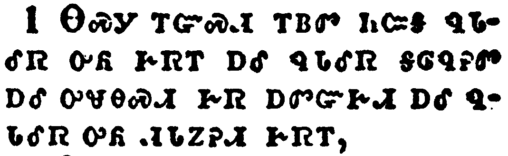</a></td>
</tr>
<tr class="even">
<td>Wherefore laying aside all malice, and all guile, and hypocrisies, and envies, and all evil speakings,</td>
</tr>
<tr class="odd">
<td>ᎾᏍᎩ ᎢᏳᏍᏗ ᎢᏴᏛ ᏂᏨᎦ ᏄᏓᎴᏒ ᎤᏲ ᎨᏒᎢ ᎠᎴ ᏄᏓᎴᏒ ᎦᎶᏄᎮᏛ ᎠᎴ ᎤᏠᎾᏍᏗ ᎨᏒ ᎠᏛᏳᎨᏗ ᎠᎴ ᏄᏓᎴᏒ ᎤᏲ ᏗᏓᏃᎮᏗ ᎨᏒᎢ,</td>
</tr>
<tr class="even">
<td>Na-s-gi i-yu-s-di i-yv-dv ni-tsv-ga nu-da-le-sv u-yo ge-sv-i a-le nu-da-le-sv ga-lo-nu-he-dv a-le u-tlo-na-s-di ge-sv a-dv-yu-ge-di a-le nu-da-le-sv u-yo di-da-no-he-di ge-sv-i,</td>
</tr>
</tbody>
</table>

<table>
<tbody>
<tr class="odd">
<td><a href="210202.png">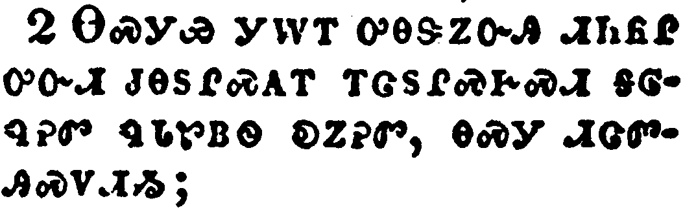</a></td>
</tr>
<tr class="even">
<td>As newborn babes, desire the sincere milk of the word, that ye may grow thereby:</td>
</tr>
<tr class="odd">
<td>ᎾᏍᎩᏯ ᎩᎳᎢ ᎤᎾᏕᏃᏅᎯ ᏗᏂᏲᎵ ᎤᏅᏗ ᏧᎾᏚᎵᏍᎪᎢ ᎢᏣᏚᎵᏍᎨᏍᏗ ᎦᎶᏄᎮᏛ ᏄᏓᏑᏴᏫ ᎧᏃᎮᏛ, ᎾᏍᎩ ᏗᏣᏛᎯᏍᏙᏗᏱ;</td>
</tr>
<tr class="even">
<td>Na-s-gi-ya gi-la-i u-na-de-no-nv-hi di-ni-yo-li u-nv-di tsu-na-du-li-s-go-i i-tsa-du-li-s-ge-s-di ga-lo-nu-he-dv nu-da-su-yv-wi ka-no-he-dv, na-s-gi di-tsa-dv-hi-s-do-di-yi;</td>
</tr>
</tbody>
</table>

<table>
<tbody>
<tr class="odd">
<td></td>
</tr>
<tr class="even">
<td>If so be ye have tasted that the Lord is gracious.</td>
</tr>
<tr class="odd">
<td>ᎢᏳᏃ ᎢᏣᏙᎴᎰᏎᏍᏗ ᎤᎬᏫᏳᎯ ᎤᏓᏅᏘᏳ ᎨᏒᎢ.</td>
</tr>
<tr class="even">
<td>I-yu-no i-tsa-do-le-ho-se-s-di U-gv-wi-yu-hi u-da-nv-ti-yu ge-sv-i.</td>
</tr>
</tbody>
</table>

<table>
<tbody>
<tr class="odd">
<td><a href="210204.png">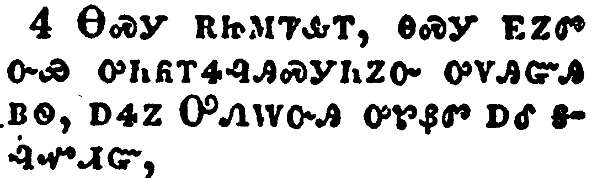</a></td>
</tr>
<tr class="even">
<td>To whom coming, as unto a living stone, disallowed indeed of men, but chosen of God, and precious,</td>
</tr>
<tr class="odd">
<td>ᎾᏍᎩ ᎡᏥᎷᏤᎲᎢ, ᎾᏍᎩ ᎬᏃᏛ ᏅᏯ ᎤᏂᏲᎢᏎᎸᎯᏍᎩᏂᏃᏅ ᎤᏙᎯᏳᎯ ᏴᏫ, ᎠᏎᏃ ᎤᏁᎳᏅᎯ ᎤᏑᏰᏛ ᎠᎴ ᎦᎸᏉᏗᏳ,</td>
</tr>
<tr class="even">
<td>Na-s-gi e-tsi-lu-tse-hv-i, na-s-gi gv-no-dv nv-ya u-ni-yo-i-se-lv-hi-s-gi-ni-no-nv u-do-hi-yu-hi yv-wi, a-se-no U-ne-la-nv-hi u-su-ye-dv a-le ga-lv-quo-di-yu,</td>
</tr>
</tbody>
</table>

<table>
<tbody>
<tr class="odd">
<td><a href="210205.png">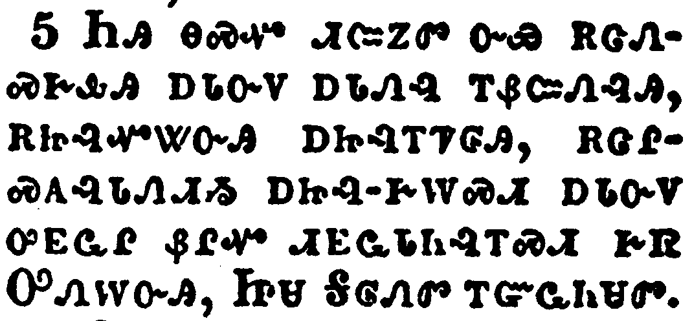</a></td>
</tr>
<tr class="even">
<td>Ye also, as lively stones, are built up a spiritual house, an holy priesthood, to offer up spiritual sacrifices, acceptable to God by Jesus Christ.</td>
</tr>
<tr class="odd">
<td>ᏂᎯ ᎾᏍᏉ ᏗᏨᏃᏛ ᏅᏯ ᎡᏣᏁᏍᎨᎲᎯ ᎠᏓᏅᏙ ᎠᏓᏁᎸ ᎢᏰᏨᏁᎸᎯ, ᎡᏥᎸᏉᏔᏅᎯ ᎠᏥᎸᎢᏤᎶᎯ, ᎡᏣᎵᏍᎪᎸᏓᏁᏗᏱ ᎠᏥᎸ-ᎨᎳᏍᏗ ᎠᏓᏅᏙ ᎤᎬᏩᎵ ᏰᎵᏉ ᏗᎬᎠᏓᏂᎸᎢᏍᏗ ᎨᏒ ᎤᏁᎳᏅᎯ, ᏥᏌ ᎦᎶᏁᏛ ᎢᏳᏩᏂᏌᏛ.</td>
</tr>
<tr class="even">
<td>Ni-hi na-s-quo di-tsv-no-dv nv-ya e-tsa-ne-s-ge-hv-hi a-da-nv-do a-da-ne-lv i-ye-tsv-ne-lv-hi, e-tsi-lv-quo-ta-nv-hi a-tsi-lv-i-tse-lo-hi, e-tsa-li-s-go-lv-da-ne-di-yi a-tsi-lv--ge-la-s-di a-da-nv-do u-gv-wa-li ye-li-quo di-gv-a-da-ni-lv-i-s-di ge-sv U-ne-la-nv-hi, Tsi-sa Ga-lo-ne-dv i-yu-wa-ni-sa-dv.</td>
</tr>
</tbody>
</table>

<table>
<tbody>
<tr class="odd">
<td><a href="210206.png">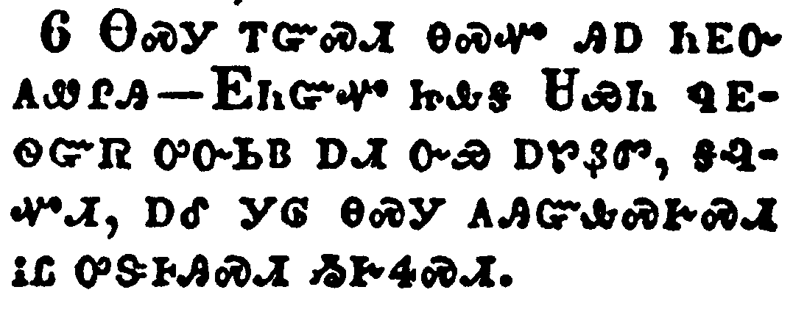</a></td>
</tr>
<tr class="even">
<td>Wherefore also it is contained in the scripture, Behold, I lay in Sion a chief corner stone, elect, precious: and he that believeth on him shall not be confounded.</td>
</tr>
<tr class="odd">
<td>ᎾᏍᎩ ᎢᏳᏍᏗ ᎾᏍᏉ ᎯᎠ ᏂᎬᏅ ᎪᏪᎵᎯ-ᎬᏂᏳᏉ ᏥᎲᎦ ᏌᏯᏂ ᏄᎬᏫᏳᏒ ᎤᏅᏏᏴ ᎠᏗ ᏅᏯ ᎠᏑᏰᏛ, ᎦᎸᏉᏗ, ᎠᎴ ᎩᎶ ᎾᏍᎩ ᎪᎯᏳᎲᏍᎨᏍᏗ ᎥᏝ ᎤᏕᎰᎯᏍᏗ ᏱᎨᏎᏍᏗ.</td>
</tr>
<tr class="even">
<td>Na-s-gi i-yu-s-di na-s-quo hi-a ni-gv-nv go-we-li-hi---Gv-ni-yu-quo tsi-hv-ga Sa-ya-ni nu-gv-wi-yu-sv u-nv-si-yv a-di nv-ya a-su-ye-dv, ga-lv-quo-di, a-le gi-lo na-s-gi go-hi-yu-hv-s-ge-s-di v-tla u-de-ho-hi-s-di yi-ge-se-s-di.</td>
</tr>
</tbody>
</table>

<table>
<tbody>
<tr class="odd">
<td><a href="210207.png">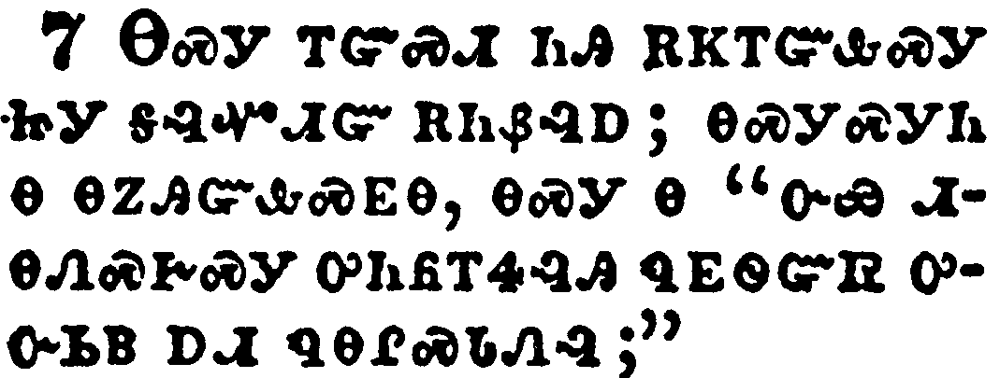</a></td>
</tr>
<tr class="even">
<td>Unto you therefore which believe he is precious: but unto them which be disobedient, the stone which the builders disallowed, the same is made the head of the corner,</td>
</tr>
<tr class="odd">
<td>ᎾᏍᎩ ᎢᏳᏍᏗ ᏂᎯ ᎡᏦᎢᏳᎲᏍᎩ ᏥᎩ ᎦᎸᏉᏗᏳ ᎡᏂᏰᎸᎠ; ᎾᏍᎩᏍᎩᏂ Ꮎ ᎾᏃᎯᏳᎲᏍᎬᎾ, ᎾᏍᎩ Ꮎ "ᏅᏯ ᏗᎾᏁᏍᎨᏍᎩ ᎤᏂᏲᎢᏎᎸᎯ ᏄᎬᏫᏳᏒ ᎤᏅᏏᏴ ᎠᏗ ᏄᎾᎵᏍᏓᏁᎸ;"</td>
</tr>
<tr class="even">
<td>Na-s-gi i-yu-s-di ni-hi e-tso-i-yu-hv-s-gi tsi-gi ga-lv-quo-di-yu e-ni-ye-lv-a; na-s-gi-s-gi-ni na na-no-hi-yu-hv-s-gv-na, na-s-gi na "nv-ya di-na-ne-s-ge-s-gi u-ni-yo-i-se-lv-hi nu-gv-wi-yu-sv u-nv-si-yv a-di nu-na-li-s-da-ne-lv;"</td>
</tr>
</tbody>
</table>

<table>
<tbody>
<tr class="odd">
<td></td>
</tr>
<tr class="even">
<td>And a stone of stumbling, and a rock of offence, even to them which stumble at the word, being disobedient: whereunto also they were appointed.</td>
</tr>
<tr class="odd">
<td>ᎠᎴ "ᏅᏯ ᎠᏓᎿᎭᏍᏆᎶᏍᏗᏍᎩ ᎠᎴ ᏅᏯ ᏗᏓᏙᏕᏍᏗᏍᎩ," ᎾᏍᎩ Ꮎ ᎧᏃᎮᏛ ᏥᏚᏂᎾᏍᏆᎶᏍᏗᎭ, ᎾᏃᎯᏳᎲᏍᎬᎾ ᎨᏒ ᎢᏳᏍᏗ, ᎾᏍᎩ ᎢᏳᎾᎵᏍᏓᏁᏗᏱ ᎾᏍᏉ ᏥᏕᎨᏥᎧᏁᎢ.</td>
</tr>
<tr class="even">
<td>A-le "nv-ya a-da-hna-s-qua-lo-s-di-s-gi a-le nv-ya di-da-do-de-s-di-s-gi," na-s-gi na ka-no-he-dv tsi-du-ni-na-s-qua-lo-s-di-ha, na-no-hi-yu-hv-s-gv-na ge-sv i-yu-s-di, na-s-gi i-yu-na-li-s-da-ne-di-yi na-s-quo tsi-de-ge-tsi-ka-ne-i.</td>
</tr>
</tbody>
</table>

<table>
<tbody>
<tr class="odd">
<td><a href="210209.png">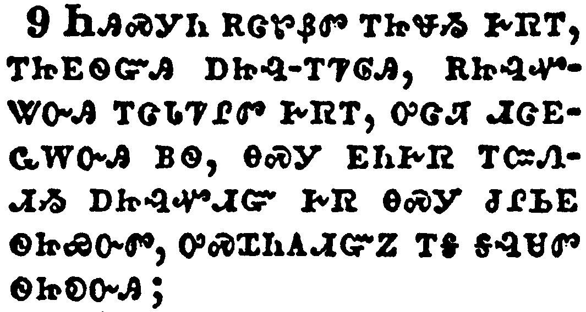</a></td>
</tr>
<tr class="even">
<td>But ye are a chosen generation, a royal priesthood, an holy nation, a peculiar people; that ye should shew forth the praises of him who hath called you out of darkness into his marvellous light:</td>
</tr>
<tr class="odd">
<td>ᏂᎯᏍᎩᏂ ᎡᏣᏑᏰᏛ ᎢᏥᏠᏱ ᎨᏒᎢ, ᎢᏥᎬᏫᏳᎯ ᎠᏥᎸ-ᎢᏤᎶᎯ, ᎡᏥᎸᏉᏔᏅᎯ ᎢᏣᏓᏤᎵᏛ ᎨᏒᎢ, ᎤᏣᏘ ᏗᏣᎬᏩᎳᏅᎯ ᏴᏫ, ᎾᏍᎩ ᎬᏂᎨᏒ ᎢᏨᏁᏗᏱ ᎠᏥᎸᏉᏗᏳ ᎨᏒ ᎾᏍᎩ ᏧᎵᏏᎬᏫᏥᏯᏅᏛ, ᎤᏍᏆᏂᎪᏗᏳᏃ ᎢᎦ ᎦᎸᏌᏛ ᏫᏥᎧᏅᎯ;</td>
</tr>
<tr class="even">
<td>Ni-hi-s-gi-ni e-tsa-su-ye-dv i-tsi-tlo-yi ge-sv-i, i-tsi-gv-wi-yu-hi a-tsi-lv--i-tse-lo-hi, e-tsi-lv-quo-ta-nv-hi i-tsa-da-tse-li-dv ge-sv-i, u-tsa-ti di-tsa-gv-wa-la-nv-hi yv-wi, na-s-gi gv-ni-ge-sv i-tsv-ne-di-yi a-tsi-lv-quo-di-yu ge-sv na-s-gi tsu-li-si-gv-wi-tsi-ya-nv-dv, u-s-qua-ni-go-di-yu-no i-ga ga-lv-sa-dv wi-tsi-ka-nv-hi;</td>
</tr>
</tbody>
</table>

<table>
<tbody>
<tr class="odd">
<td><a href="210210.png">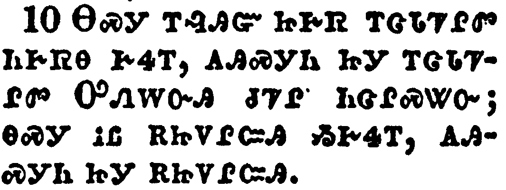</a></td>
</tr>
<tr class="even">
<td>Which in time past were not a people, but are now the people of God: which had not obtained mercy, but now have obtained mercy.</td>
</tr>
<tr class="odd">
<td>ᎾᏍᎩ ᎢᎸᎯᏳ ᏥᎨᏒ ᎢᏣᏓᏤᎵᏛ ᏂᎨᏒᎾ ᎨᏎᎢ, ᎪᎯᏍᎩᏂ ᏥᎩ ᎢᏣᏓᏤᎵᏛ ᎤᏁᎳᏅᎯ ᏧᏤᎵ ᏂᏣᎵᏍᏔᏅ; ᎾᏍᎩ ᎥᏝ ᎡᏥᏙᎵᏨᎯ ᏱᎨᏎᎢ, ᎪᎯᏍᎩᏂ ᏥᎩ ᎡᏥᏙᎵᏨᎯ.</td>
</tr>
<tr class="even">
<td>Na-s-gi i-lv-hi-yu tsi-ge-sv i-tsa-da-tse-li-dv ni-ge-sv-na ge-se-i, go-hi-s-gi-ni tsi-gi i-tsa-da-tse-li-dv U-ne-la-nv-hi tsu-tse-li ni-tsa-li-s-ta-nv; na-s-gi v-tla e-tsi-do-li-tsv-hi yi-ge-se-i, go-hi-s-gi-ni tsi-gi e-tsi-do-li-tsv-hi.</td>
</tr>
</tbody>
</table>

<table>
<tbody>
<tr class="odd">
<td><a href="210211.png">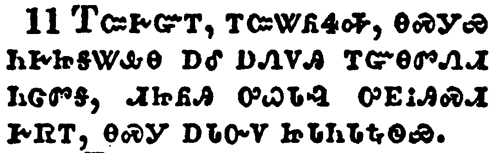</a></td>
</tr>
<tr class="even">
<td>Dearly beloved, I beseech you as strangers and pilgrims, abstain from fleshly lusts, which war against the soul;</td>
</tr>
<tr class="odd">
<td>ᎢᏨᎨᏳᎢ, ᎢᏨᏔᏲᏎᎭ, ᎾᏍᎩᏯ ᏂᎨᏥᎦᏔᎲᎾ ᎠᎴ ᎠᏁᏙᎯ ᎢᏳᎾᏛᏁᏗ ᏂᏣᏛᎦ, ᏗᏥᏲᎯ ᎤᏇᏓᎸ ᎤᎬᎥᎯᏍᏗ ᎨᏒᎢ, ᎾᏍᎩ ᎠᏓᏅᏙ ᏥᏓᏁᏓᎿᎭᏫᏯ.</td>
</tr>
<tr class="even">
<td>I-tsv-ge-yu-i, i-tsv-ta-yo-se-ha, na-s-gi-ya ni-ge-tsi-ga-ta-hv-na a-le a-ne-do-hi i-yu-na-dv-ne-di ni-tsa-dv-ga, di-tsi-yo-hi u-que-da-lv u-gv-v-hi-s-di ge-sv-i, na-s-gi a-da-nv-do tsi-da-ne-da-hna-wi-ya.</td>
</tr>
</tbody>
</table>

<table>
<tbody>
<tr class="odd">
<td><a href="210212.png">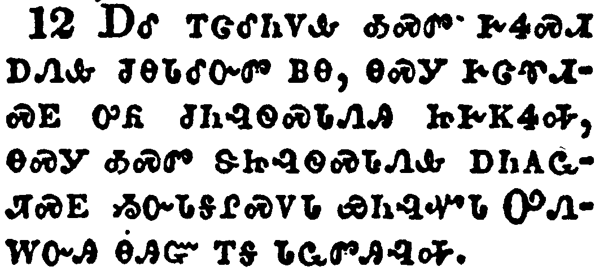</a></td>
</tr>
<tr class="even">
<td>Having your conversation honest among the Gentiles: that, whereas they speak against you as evildoers, they may by your good works, which they shall behold, glorify God in the day of visitation.</td>
</tr>
<tr class="odd">
<td>ᎠᎴ ᎢᏣᎴᏂᏙᎲ ᎣᏍᏛ ᎨᏎᏍᏗ ᎠᏁᎲ ᏧᎾᏓᎴᏅᏛ ᏴᎾ, ᎾᏍᎩ ᎨᏣᏡᏗᏍᎬ ᎤᏲ ᏧᏂᎸᏫᏍᏓᏁᎯ ᏥᎨᏦᏎᎭ, ᎾᏍᎩ ᎣᏍᏛ ᏕᏥᎸᏫᏍᏓᏁᎲ ᎠᏂᎪᏩᏘᏍᎬ ᏱᏅᏓᎦᎵᏍᏙᏓ ᏯᏂᎸᏉᏓ ᎤᏁᎳᏅᎯ ᎾᎯᏳ ᎢᎦ ᏓᏩᏛᎯᎸᎭ.</td>
</tr>
<tr class="even">
<td>A-le i-tsa-le-ni-do-hv o-s-dv ge-se-s-di a-ne-hv tsu-na-da-le-nv-dv yv-na, na-s-gi ge-tsa-tlu-di-s-gv u-yo tsu-ni-lv-wi-s-da-ne-hi tsi-ge-tso-se-ha, na-s-gi o-s-dv de-tsi-lv-wi-s-da-ne-hv a-ni-go-wa-ti-s-gv yi-nv-da-ga-li-s-do-da ya-ni-lv-quo-da U-ne-la-nv-hi na-hi-yu i-ga da-wa-dv-hi-lv-ha.</td>
</tr>
</tbody>
</table>

<table>
<tbody>
<tr class="odd">
<td><a href="210213.png">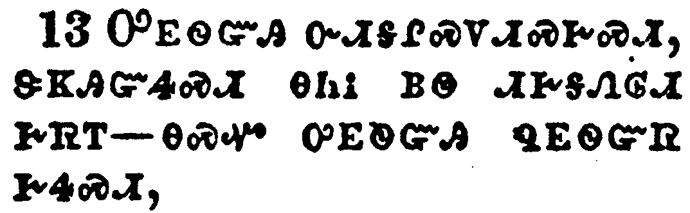</a></td>
</tr>
<tr class="even">
<td>Submit yourselves to every ordinance of man for the Lord's sake: whether it be to the king, as supreme;</td>
</tr>
<tr class="odd">
<td>ᎤᎬᏫᏳᎯ ᏅᏗᎦᎵᏍᏙᏗᏍᎨᏍᏗ, ᏕᏦᎯᏳᏎᏍᏗ ᎾᏂᎥ ᏴᏫ ᏗᎨᎦᏁᎶᏗ ᎨᏒᎢ^ᎾᏍᏉ ᎤᎬᏫᏳᎯ ᏄᎬᏫᏳᏒ ᎨᏎᏍᏗ,</td>
</tr>
<tr class="even">
<td>U-gv-wi-yu-hi nv-di-ga-li-s-do-di-s-ge-s-di, de-tso-hi-yu-se-s-di na-ni-v yv-wi di-ge-ga-ne-lo-di ge-sv-i^na-s-quo u-gv-wi-yu-hi nu-gv-wi-yu-sv ge-se-s-di,</td>
</tr>
</tbody>
</table>

<table>
<tbody>
<tr class="odd">
<td><a href="210214.png">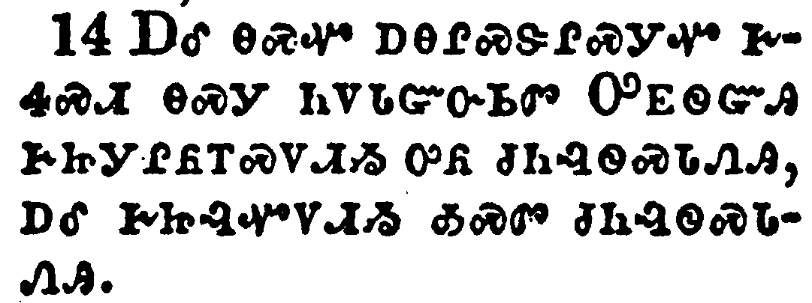</a></td>
</tr>
<tr class="even">
<td>Or unto governors, as unto them that are sent by him for the punishment of evildoers, and for the praise of them that do well.</td>
</tr>
<tr class="odd">
<td>ᎠᎴ ᎾᏍᏉ ᎠᎾᎵᏍᏕᎵᏍᎩᏉ ᎨᏎᏍᏗ ᎾᏍᎩ ᏂᏙᏓᏳᏅᏏᏛ ᎤᎬᏫᏳᎯ ᎨᏥᎩᎵᏲᎢᏍᏙᏗᏱ ᎤᏲ ᏧᏂᎸᏫᏍᏓᏁᎯ, ᎠᎴ ᎨᏥᎸᏉᏙᏗᏱ ᎣᏍᏛ ᏧᏂᎸᏫᏍᏓᏁᎯ.</td>
</tr>
<tr class="even">
<td>A-le na-s-quo a-na-li-s-de-li-s-gi-quo ge-se-s-di na-s-gi ni-do-da-yu-nv-si-dv U-gv-wi-yu-hi ge-tsi-gi-li-yo-i-s-do-di-yi u-yo tsu-ni-lv-wi-s-da-ne-hi, a-le ge-tsi-lv-quo-do-di-yi o-s-dv tsu-ni-lv-wi-s-da-ne-hi.</td>
</tr>
</tbody>
</table>

<table>
<tbody>
<tr class="odd">
<td><a href="210215.png">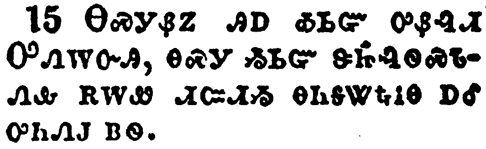</a></td>
</tr>
<tr class="even">
<td>For so is the will of God, that with well doing ye may put to silence the ignorance of foolish men:</td>
</tr>
<tr class="odd">
<td>ᎾᏍᎩᏰᏃ ᎯᎠ ᎣᏏᏳ ᎤᏰᎸᏗ ᎤᏁᎳᏅᎯ, ᎾᏍᎩ ᎣᏏᏳ ᏕᏥᎸᏫᏍᏓᏁᎲ ᎡᎳᏪ ᏗᏨᏗᏱ ᎾᏂᎦᏔᎿᎭᎥᎾ ᎠᎴ ᎤᏂᏁᎫ ᏴᏫ.</td>
</tr>
<tr class="even">
<td>Na-s-gi-ye-no hi-a o-si-yu u-ye-lv-di U-ne-la-nv-hi, na-s-gi o-si-yu de-tsi-lv-wi-s-da-ne-hv e-la-we di-tsv-di-yi na-ni-ga-ta-hna-v-na a-le u-ni-ne-gu yv-wi.</td>
</tr>
</tbody>
</table>

<table>
<tbody>
<tr class="odd">
<td></td>
</tr>
<tr class="even">
<td>As free, and not using your liberty for a cloke of maliciousness, but as the servants of God.</td>
</tr>
<tr class="odd">
<td>ᎾᏍᎩᏯ ᏂᏗᎨᏥᎾᏝᎥᎾ ᎢᏳᎾᏛᏁᏗ ᏂᏣᏛᏁᎮᏍᏗ, ᎥᏝᏍᏗ ᎠᏗᎾ ᏂᏕᏥᎾᏝᎥᎾ ᎨᏒ ᏱᏨᏗᏍᎨᏍᏗ ᏱᏧᏢᎥᏍᎨᏍᏗ ᎤᏲ ᏗᎦᎸᏫᏍᏓᏁᏗ ᎨᏒᎢ, ᎤᏁᎳᏅᎯᏍᎩᏂ ᏧᏅᏏᏓᏍᏗ ᎢᏳᎾᏛᏁᏗ ᏂᏣᏛᏁᎮᏍᏗ.</td>
</tr>
<tr class="even">
<td>Na-s-gi-ya ni-di-ge-tsi-na-tla-v-na i-yu-na-dv-ne-di ni-tsa-dv-ne-he-s-di, v-tla-s-di a-di-na ni-de-tsi-na-tla-v-na ge-sv yi-tsv-di-s-ge-s-di yi-tsu-tlv-v-s-ge-s-di u-yo di-ga-lv-wi-s-da-ne-di ge-sv-i, U-ne-la-nv-hi-s-gi-ni tsu-nv-si-da-s-di i-yu-na-dv-ne-di ni-tsa-dv-ne-he-s-di.</td>
</tr>
</tbody>
</table>

<table>
<tbody>
<tr class="odd">
<td><a href="210217.png">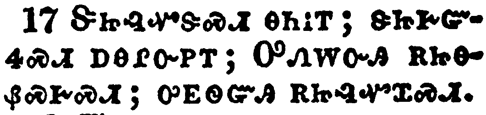</a></td>
</tr>
<tr class="even">
<td>Honour all men. Love the brotherhood. Fear God. Honour the king.</td>
</tr>
<tr class="odd">
<td>ᏕᏥᎸᏉᏕᏍᏗ ᎾᏂᎥᎢ; ᏕᏥᎨᏳᏎᏍᏗ ᎠᎾᎵᏅᏢᎢ; ᎤᏁᎳᏅᎯ ᎡᏥᎾᏰᏍᎨᏍᏗ; ᎤᎬᏫᏳᎯ ᎡᏥᎸᏉᏆᏍᏗ.</td>
</tr>
<tr class="even">
<td>De-tsi-lv-quo-de-s-di na-ni-v-i; de-tsi-ge-yu-se-s-di a-na-li-nv-tlv-i; U-ne-la-nv-hi e-tsi-na-ye-s-ge-s-di; u-gv-wi-yu-hi e-tsi-lv-quo-qua-s-di.</td>
</tr>
</tbody>
</table>

<table>
<tbody>
<tr class="odd">
<td><a href="210218.png">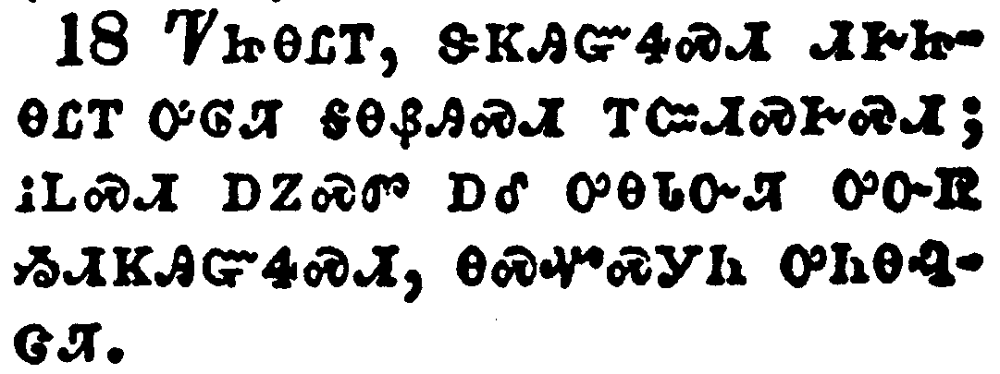</a></td>
</tr>
<tr class="even">
<td>Servants, be subject to your masters with all fear; not only to the good and gentle, but also to the froward.</td>
</tr>
<tr class="odd">
<td>ᏤᏥᎾᏝᎢ, ᏕᏦᎯᏳᏎᏍᏗ ᏗᎨᏥᎾᏝᎢ ᎤᎶᏘ ᎦᎾᏰᎯᏍᏗ ᎢᏨᏗᏍᎨᏍᏗ; ᎥᏞᏍᏗ ᎠᏃᏍᏛ ᎠᎴ ᎤᎾᏓᏅᏘ ᎤᏅᏒ ᏱᏗᏦᎯᏳᏎᏍᏗ, ᎾᏍᏉᏍᎩᏂ ᎤᏂᎾᎸᏣᏘ.</td>
</tr>
<tr class="even">
<td>Tse-tsi-na-tla-i, de-tso-hi-yu-se-s-di di-ge-tsi-na-tla-i u-lo-ti ga-na-ye-hi-s-di i-tsv-di-s-ge-s-di; v-tle-s-di a-no-s-dv a-le u-na-da-nv-ti u-nv-sv yi-di-tso-hi-yu-se-s-di, na-s-quo-s-gi-ni u-ni-na-lv-tsa-ti.</td>
</tr>
</tbody>
</table>

<table>
<tbody>
<tr class="odd">
<td><a href="210219.png">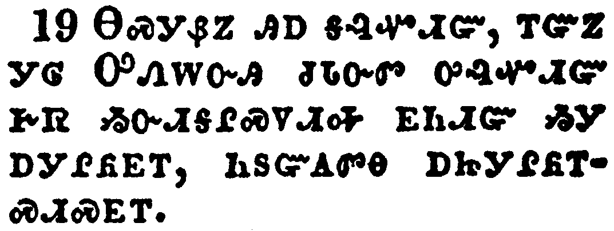</a></td>
</tr>
<tr class="even">
<td>For this is thankworthy, if a man for conscience toward God endure grief, suffering wrongfully.</td>
</tr>
<tr class="odd">
<td>ᎾᏍᎩᏰᏃ ᎯᎠ ᎦᎸᏉᏗᏳ, ᎢᏳᏃ ᎩᎶ ᎤᏁᎳᏅᎯ ᏧᏓᏅᏛ ᎤᎸᏉᏗᏳ ᎨᏒ ᏱᏅᏗᎦᎵᏍᏙᏗᎭ ᎬᏂᏗᏳ ᏱᎩ ᎠᎩᎵᏲᎬᎢ, ᏂᏚᏳᎪᏛᎾ ᎠᏥᎩᎵᏲᎢᏍᏗᏍᎬᎢ.</td>
</tr>
<tr class="even">
<td>Na-s-gi-ye-no hi-a ga-lv-quo-di-yu, i-yu-no gi-lo U-ne-la-nv-hi tsu-da-nv-dv u-lv-quo-di-yu ge-sv yi-nv-di-ga-li-s-do-di-ha gv-ni-di-yu yi-gi a-gi-li-yo-gv-i, ni-du-yu-go-dv-na a-tsi-gi-li-yo-i-s-di-s-gv-i.</td>
</tr>
</tbody>
</table>

<table>
<tbody>
<tr class="odd">
<td><a href="210220.png">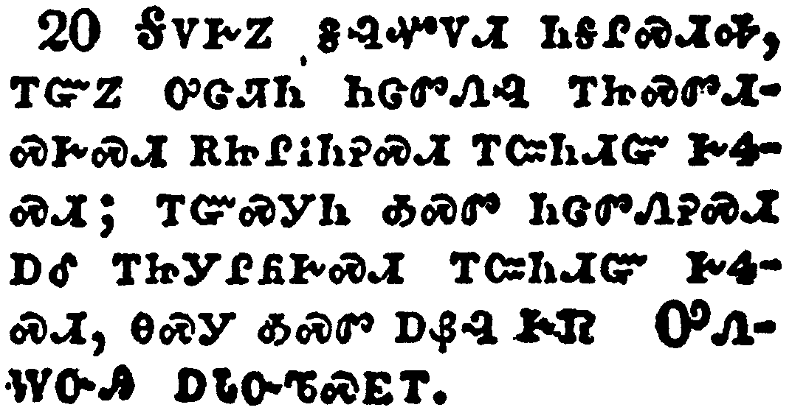</a></td>
</tr>
<tr class="even">
<td>For what glory is it, if, when ye be buffeted for your faults, ye shall take it patiently? but if, when ye do well, and suffer for it, ye take it patiently, this is acceptable with God.</td>
</tr>
<tr class="odd">
<td>ᎦᏙᎨᏃ ᎦᎸᏉᏙᏗ ᏂᎦᎵᏍᏗᎭ, ᎢᏳᏃ ᎤᏣᏘᏂ ᏂᏣᏛᏁᎸ ᎢᏥᏍᏛᏗᏍᎨᏍᏗ ᎡᏥᎵᎥᏂᎮᏍᏗ ᎢᏨᏂᏗᏳ ᎨᏎᏍᏗ; ᎢᏳᏍᎩᏂ ᎣᏍᏛ ᏂᏣᏛᏁᎮᏍᏗ ᎠᎴ ᎢᏥᎩᎵᏲᎨᏍᏗ ᎢᏨᏂᏗᏳ ᎨᏎᏍᏗ, ᎾᏍᎩ ᎣᏍᏛ ᎠᏰᎵ ᎨᏒ ᎤᏁᎳᏅᎯ ᎠᏓᏅᏖᏍᎬᎢ.</td>
</tr>
<tr class="even">
<td>Ga-do-ge-no ga-lv-quo-do-di ni-ga-li-s-di-ha, i-yu-no u-tsa-ti-ni ni-tsa-dv-ne-lv i-tsi-s-dv-di-s-ge-s-di e-tsi-li-v-ni-he-s-di i-tsv-ni-di-yu ge-se-s-di; i-yu-s-gi-ni o-s-dv ni-tsa-dv-ne-he-s-di a-le i-tsi-gi-li-yo-ge-s-di i-tsv-ni-di-yu ge-se-s-di, na-s-gi o-s-dv a-ye-li ge-sv U-ne-la-nv-hi a-da-nv-te-s-gv-i.</td>
</tr>
</tbody>
</table>

<table>
<tbody>
<tr class="odd">
<td><a href="210221.png">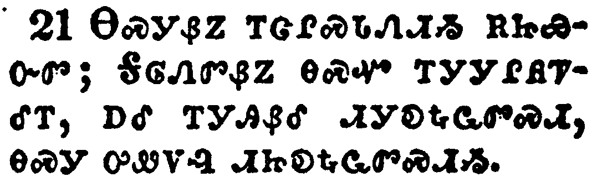</a></td>
</tr>
<tr class="even">
<td>For even hereunto were ye called: because Christ also suffered for us, leaving us an example, that ye should follow his steps:</td>
</tr>
<tr class="odd">
<td>ᎾᏍᎩᏰᏃ ᎢᏣᎵᏍᏓᏁᏗᏱ ᎡᏥᏯᏅᏛ; ᎦᎶᏁᏛᏰᏃ ᎾᏍᏉ ᎢᎩᎩᎵᏲᏤᎴᎢ, ᎠᎴ ᎢᎩᎯᏰᎴ ᏗᎩᎧᎿᎭᏩᏛᏍᏗ, ᎾᏍᎩ ᎤᏪᏙᎸ ᏗᏥᎧᎿᎭᏩᏛᏍᏗᏱ.</td>
</tr>
<tr class="even">
<td>Na-s-gi-ye-no i-tsa-li-s-da-ne-di-yi e-tsi-ya-nv-dv; Ga-lo-ne-dv-ye-no na-s-quo i-gi-gi-li-yo-tse-le-i, a-le i-gi-hi-ye-le di-gi-ka-hna-wa-dv-s-di, na-s-gi u-we-do-lv di-tsi-ka-hna-wa-dv-s-di-yi.</td>
</tr>
</tbody>
</table>

<table>
<tbody>
<tr class="odd">
<td><a href="210222.png">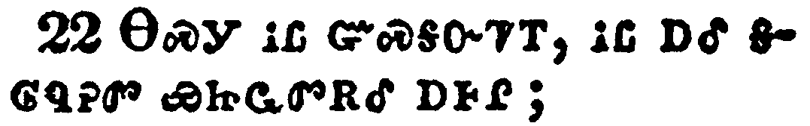</a></td>
</tr>
<tr class="even">
<td>Who did no sin, neither was guile found in his mouth:</td>
</tr>
<tr class="odd">
<td>ᎾᏍᎩ ᎥᏝ ᏳᏍᎦᏅᏤᎢ, ᎥᏝ ᎠᎴ ᎦᎶᏄᎮᏛ ᏯᏥᏩᏛᎡᎴ ᎠᎰᎵ;</td>
</tr>
<tr class="even">
<td>Na-s-gi v-tla yu-s-ga-nv-tse-i, v-tla a-le ga-lo-nu-he-dv ya-tsi-wa-dv-e-le a-ho-li;</td>
</tr>
</tbody>
</table>

<table>
<tbody>
<tr class="odd">
<td><a href="210223.png">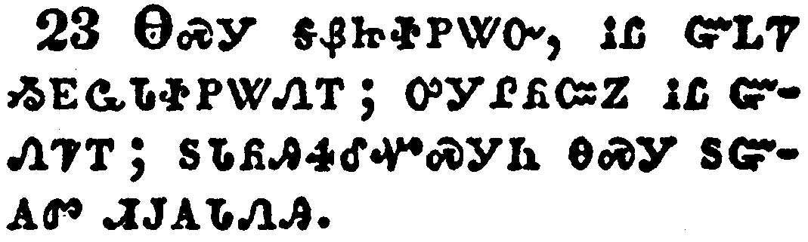</a></td>
</tr>
<tr class="even">
<td>Who, when he was reviled, reviled not again; when he suffered, he threatened not; but committed himself to him that judgeth righteously:</td>
</tr>
<tr class="odd">
<td>ᎾᏍᎩ ᎦᏰᏥᏐᏢᏔᏅ, ᎥᏝ ᏳᏞᏤ ᏱᎬᏩᏓᏐᏢᏔᏁᎢ; ᎤᎩᎵᏲᏨᏃ ᎥᏝ ᏳᏁᏤᎢ; ᏚᏓᏲᎯᏎᎴᏉᏍᎩᏂ ᎾᏍᎩ ᏚᏳᎪᏛ ᏗᎫᎪᏓᏁᎯ.</td>
</tr>
<tr class="even">
<td>Na-s-gi ga-ye-tsi-so-tlv-ta-nv, v-tla yu-tle-tse yi-gv-wa-da-so-tlv-ta-ne-i; u-gi-li-yo-tsv-no v-tla yu-ne-tse-i; du-da-yo-hi-se-le-quo-s-gi-ni na-s-gi du-yu-go-dv di-gu-go-da-ne-hi.</td>
</tr>
</tbody>
</table>

<table>
<tbody>
<tr class="odd">
<td><a href="210224.png">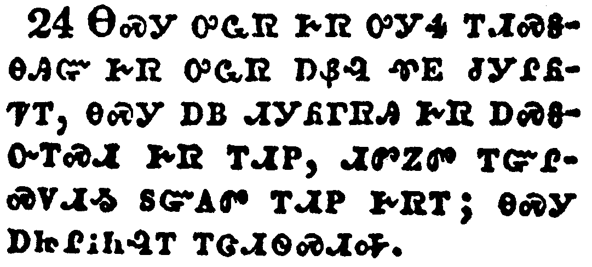</a></td>
</tr>
<tr class="even">
<td>Who his own self bare our sins in his own body on the tree, that we, being dead to sins, should live unto righteousness: by whose stripes ye were healed.</td>
</tr>
<tr class="odd">
<td>ᎾᏍᎩ ᎤᏩᏒ ᎨᏒ ᎤᎩᏎ ᎢᏗᏍᎦᎾᎯᏳ ᎨᏒ ᎤᏩᏒ ᎠᏰᎸ ᏡᎬ ᏧᎩᎵᏲᏤᎢ, ᎾᏍᎩ ᎠᏴ ᏗᎩᏲᎱᏒᎯ ᎨᏒ ᎠᏍᎦᏅᎢᏍᏗ ᎨᏒ ᎢᏗᏢ, ᏗᏛᏃᏛ ᎢᏳᎵᏍᏙᏗᏱ ᏚᏳᎪᏛ ᎢᏗᏢ ᎨᏒᎢ; ᎾᏍᎩ ᎠᏥᎵᎥᏂᎸᎢ ᎢᏣᏗᏫᏍᏗᎭ.</td>
</tr>
<tr class="even">
<td>Na-s-gi u-wa-sv ge-sv u-gi-se i-di-s-ga-na-hi-yu ge-sv u-wa-sv a-ye-lv tlu-gv tsu-gi-li-yo-tse-i, na-s-gi a-yv di-gi-yo-hu-sv-hi ge-sv a-s-ga-nv-i-s-di ge-sv i-di-tlv, di-dv-no-dv i-yu-li-s-do-di-yi du-yu-go-dv i-di-tlv ge-sv-i; na-s-gi a-tsi-li-v-ni-lv-i i-tsa-di-wi-s-di-ha.</td>
</tr>
</tbody>
</table>

<table>
<tbody>
<tr class="odd">
<td><a href="210225.png">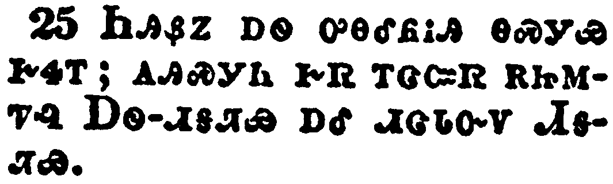</a></td>
</tr>
<tr class="even">
<td>For ye were as sheep going astray; but are now returned unto the Shepherd and Bishop of your souls.</td>
</tr>
<tr class="odd">
<td>ᏂᎯᏰᏃ ᎠᏫ ᎤᎾᎴᏲᎥᎯ ᎾᏍᎩᏯ ᎨᏎᎢ; ᎪᎯᏍᎩᏂ ᎨᏒ ᎢᏣᏨᏒ ᎡᏥᎷᏤᎸ ᎠᏫ-ᏗᎦᏘᏯ ᎠᎴ ᏗᏣᏓᏅᏙ ᏗᎦᏘᏯ.</td>
</tr>
<tr class="even">
<td>Ni-hi-ye-no a-wi u-na-le-yo-v-hi na-s-gi-ya ge-se-i; go-hi-s-gi-ni ge-sv i-tsa-tsv-sv e-tsi-lu-tse-lv A-wi--di-ga-ti-ya a-le di-tsa-da-nv-do Di-ga-ti-ya.</td>
</tr>
</tbody>
</table>

