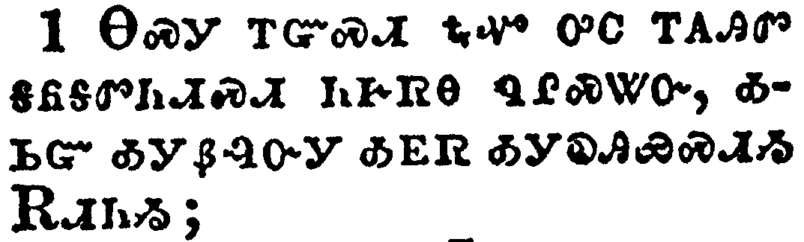
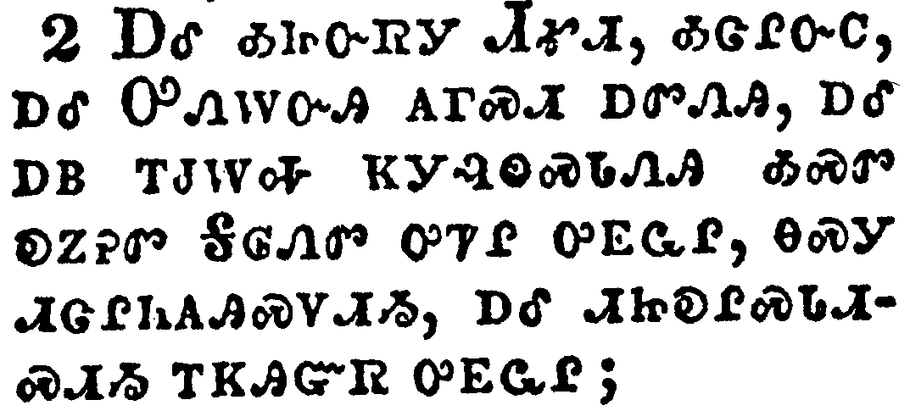
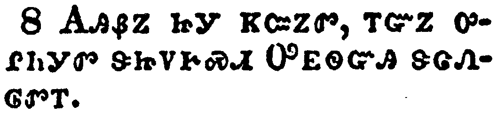
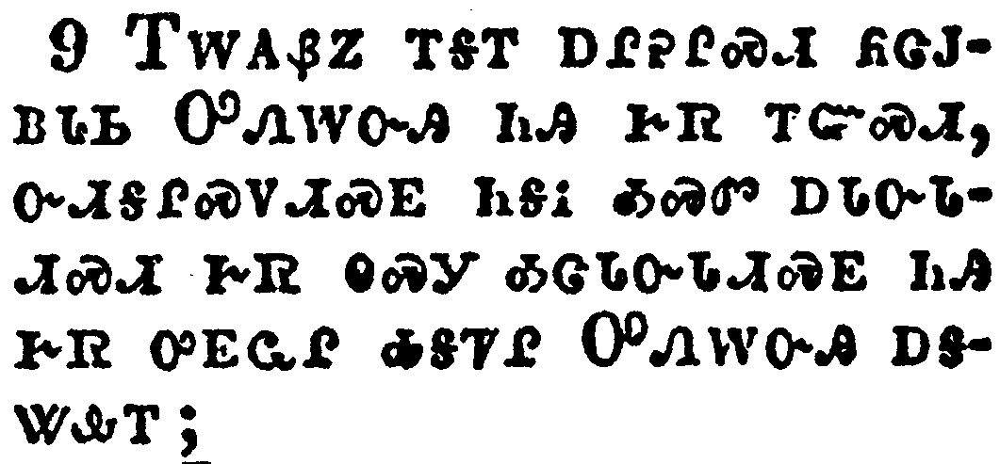
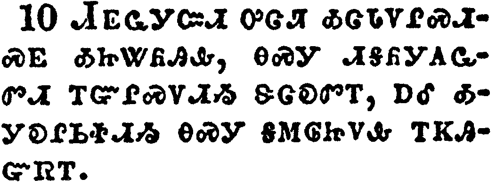
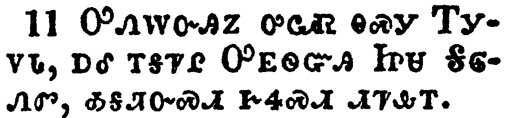

+++
draft=false
date = 2014-12-18T21:11:07Z
title = "1 Thessalonians - Chapter 3 - Cherokee New Testament"
weight = 1418955067

[taxonomies]

authors = ["Timothy Legg"]
categories = []
tags = []

[extra]
+++

<table>
<tbody>
<tr class="odd">
<td></td>
</tr>
<tr class="even">
<td>Wherefore when we could no longer forbear, we thought it good to be left at Athens alone;</td>
</tr>
<tr class="odd">
<td>ᎾᏍᎩ ᎢᏳᏍᏗ ᎿᎭᏉ ᎤᏟ ᎢᎪᎯᏛ ᎦᏲᎦᏛᏂᏗᏍᏗ ᏂᎨᏒᎾ ᏄᎵᏍᏔᏅ, ᎣᏏᏳ ᎣᎩᏰᎸᏅᎩ ᎣᎬᏒ ᎣᎩᎧᎯᏯᏍᏗᏱ ᎡᏗᏂᏱ;</td>
</tr>
<tr class="even">
<td>Na-s-gi i-yu-s-di hna-quo u-tli i-go-hi-dv ga-yo-ga-dv-ni-di-s-di ni-ge-sv-na nu-li-s-ta-nv, o-si-yu o-gi-ye-lv-nv-gi o-gv-sv o-gi-ka-hi-ya-s-di-yi E-di-ni-yi;</td>
</tr>
</tbody>
</table>

<table>
<tbody>
<tr class="odd">
<td></td>
</tr>
<tr class="even">
<td>And sent Timotheus, our brother, and minister of God, and our fellowlabourer in the gospel of Christ, to establish you, and to comfort you concerning your faith:</td>
</tr>
<tr class="odd">
<td>ᎠᎴ ᎣᏥᏅᏒᎩ ᏗᎹᏗ, ᎣᏣᎵᏅᏟ, ᎠᎴ ᎤᏁᎳᏅᎯ ᎪᎱᏍᏗ ᎠᏛᏁᎯ, ᎠᎴ ᎠᏴ ᎢᏧᎳᎭ ᏦᎩᎸᏫᏍᏓᏁᎯ ᎣᏍᏛ ᎧᏃᎮᏛ ᎦᎶᏁᏛ ᎤᏤᎵ ᎤᎬᏩᎵ, ᎾᏍᎩ ᏗᏣᎵᏂᎪᎯᏍᏙᏗᏱ, ᎠᎴ ᏗᏥᎧᎵᏍᏓᏗᏍᏗᏱ ᎢᏦᎯᏳᏒ ᎤᎬᏩᎵ;</td>
</tr>
<tr class="even">
<td>A-le o-tsi-nv-sv-gi Di-ma-di, o-tsa-li-nv-tli, a-le U-ne-la-nv-hi go-hu-s-di a-dv-ne-hi, a-le a-yv i-tsu-la-ha tso-gi-lv-wi-s-da-ne-hi o-s-dv ka-no-he-dv Ga-lo-ne-dv u-tse-li u-gv-wa-li, na-s-gi di-tsa-li-ni-go-hi-s-do-di-yi, a-le di-tsi-ka-li-s-da-di-s-di-yi i-tso-hi-yu-sv u-gv-wa-li;</td>
</tr>
</tbody>
</table>

<table>
<tbody>
<tr class="odd">
<td></td>
</tr>
<tr class="even">
<td>That no man should be moved by these afflictions: for yourselves know that we are appointed thereunto.</td>
</tr>
<tr class="odd">
<td>ᎾᏍᎩ ᎩᎶ ᎠᏥᏖᎸᏗᏱ ᏂᎨᏒᎾ ᎯᎠ ᎾᏍᎩ ᎠᎩᎵᏲᎢᏍᏗ ᎨᏒ ᎢᏳᏩᏂᏌᏛ; ᎢᏨᏒᏰᏃ ᎢᏥᎦᏔᎭ ᎾᏍᎩ ᎢᎦᎵᏍᏓᏁᏗᏱ ᎡᎩᏁᏤᎸᎯ ᎨᏒᎢ.</td>
</tr>
<tr class="even">
<td>Na-s-gi gi-lo a-tsi-te-lv-di-yi ni-ge-sv-na hi-a na-s-gi a-gi-li-yo-i-s-di ge-sv i-yu-wa-ni-sa-dv; i-tsv-sv-ye-no i-tsi-ga-ta-ha na-s-gi i-ga-li-s-da-ne-di-yi e-gi-ne-tse-lv-hi ge-sv-i.</td>
</tr>
</tbody>
</table>

<table>
<tbody>
<tr class="odd">
<td></td>
</tr>
<tr class="even">
<td>For verily, when we were with you, we told you before that we should suffer tribulation; even as it came to pass, and ye know.</td>
</tr>
<tr class="odd">
<td>ᎤᏙᎯᏳᎯᏰᏃ ᏥᏨᏰᎳᏗᏙᎲᎩ, ᏂᏨᏃᏁᎶ ᎢᎩᎩᎵᏲᎢᏍᏗ ᎨᏒᎢ; ᎾᏍᎩᏯ ᏥᏄᎵᏍᏔᏅ, ᎠᎴ ᎾᏍᎩ ᏥᏥᎦᏔᎭ.</td>
</tr>
<tr class="even">
<td>U-do-hi-yu-hi-ye-no tsi-tsv-ye-la-di-do-hv-gi, ni-tsv-no-ne-lo i-gi-gi-li-yo-i-s-di ge-sv-i; na-s-gi-ya tsi-nu-li-s-ta-nv, a-le na-s-gi tsi-tsi-ga-ta-ha.</td>
</tr>
</tbody>
</table>

<table>
<tbody>
<tr class="odd">
<td></td>
</tr>
<tr class="even">
<td>For this cause, when I could no longer forbear, I sent to know your faith, lest by some means the tempter have tempted you, and our labour be in vain.</td>
</tr>
<tr class="odd">
<td>ᎾᏍᎩ ᏅᏓᏳᎵᏍᏙᏔᏅᎩ, ᎿᎭᏉ ᎤᏟ ᎢᎪᎯᏛ ᎬᏆᏛᏂᏗᏍᏗ ᏂᎨᏒᎾ ᏄᎵᏍᏔᏅ, ᎠᏆᏓᏅᏒᎩ ᎠᏆᏙᎴᎰᎯᏍᏗᏱ ᏄᏍᏛ ᎢᏦᎯᏳᏒᎢ, ᎪᎱᏍᏗ ᏴᏗᎤᎵᏍᏙᏔᏅ ᎠᏓᎪᎵᏰᏍᎩ ᏳᏂᎪᎵᏰᎥ, ᏙᎩᎸᏫᏍᏓᏁᎸᏃ ᎠᏎᏉ ᏱᏄᎵᏍᏔᏂᏙᎸ, ᎠᏇᎵᏒᎩ.</td>
</tr>
<tr class="even">
<td>Na-s-gi nv-da-yu-li-s-do-ta-nv-gi, hna-quo u-tli i-go-hi-dv gv-qua-dv-ni-di-s-di ni-ge-sv-na nu-li-s-ta-nv, a-qua-da-nv-sv-gi a-qua-do-le-ho-hi-s-di-yi nu-s-dv i-tso-hi-yu-sv-i, go-hu-s-di yv-di-u-li-s-do-ta-nv a-da-go-li-ye-s-gi yu-ni-go-li-ye-v, do-gi-lv-wi-s-da-ne-lv-no a-se-quo yi-nu-li-s-ta-ni-do-lv, a-que-li-sv-gi.</td>
</tr>
</tbody>
</table>

<table>
<tbody>
<tr class="odd">
<td></td>
</tr>
<tr class="even">
<td>But now when Timotheus came from you unto us, and brought us good tidings of your faith and charity, and that ye have good remembrance of us always, desiring greatly to see us, as we also to see you:</td>
</tr>
<tr class="odd">
<td>ᎠᏎᏃ ᎿᎭᏉ ᏗᎹᏗ ᎣᎩᎷᏤᎸᎯ ᏥᎩ, ᏗᏤᎲ ᏅᏓᏳᎶᏒᎯ, ᎠᎴ ᎣᏍᏛ ᎠᏰᎸᏗ ᎣᎩᏃᎮᎮᎸᎯ ᏥᎩ, ᎢᏦᎯᏳᏒ ᎠᎴ ᎠᏓᎨᏳᏗ ᎨᏒ ᎢᏤᎲ ᎤᎬᏩᎵ, ᎠᎴ ᏂᎪᎯᎸ ᎣᏏᏳ ᏍᎩᏯᏅᏛᎢ, ᎤᏣᏘ ᎢᏣᏚᎵᏍᎬ ᏍᎩᎪᏩᏛᏗᏱ, ᎾᏍᎩᏯ ᎾᏍᏉ ᎠᏴ ᎣᎦᏚᎵᏍᎬ ᎢᏨᎪᏩᏛᏗᏱ;</td>
</tr>
<tr class="even">
<td>A-se-no hna-quo Di-ma-di o-gi-lu-tse-lv-hi tsi-gi, di-tse-hv nv-da-yu-lo-sv-hi, a-le o-s-dv a-ye-lv-di o-gi-no-he-he-lv-hi tsi-gi, i-tso-hi-yu-sv a-le a-da-ge-yu-di ge-sv i-tse-hv u-gv-wa-li, a-le ni-go-hi-lv o-si-yu s-gi-ya-nv-dv-i, u-tsa-ti i-tsa-du-li-s-gv s-gi-go-wa-dv-di-yi, na-s-gi-ya na-s-quo a-yv o-ga-du-li-s-gv i-tsv-go-wa-dv-di-yi;</td>
</tr>
</tbody>
</table>

<table>
<tbody>
<tr class="odd">
<td></td>
</tr>
<tr class="even">
<td>Therefore, brethren, we were comforted over you in all our affliction and distress by your faith:</td>
</tr>
<tr class="odd">
<td>ᎾᏍᎩ ᎢᏳᏍᏗ, ᎢᏓᎵᏅᏟ, ᎢᏨᏯᏓᏅᏖᎸ ᎤᎧᎵᏍᏗ ᎣᎦᏓᏅᏓᏛᎩ ᏂᎦᎥ ᎣᏥᎩᎵᏲᎬ ᎠᎴ ᎤᏪᎵᎯᏍᏗ ᎣᎦᏓᏅᏔᏩᏕᎬᎢ, ᏂᎯ ᎢᏦᎯᏳᏒ ᏅᏓᏳᎵᏍᏙᏔᏅᎩ.</td>
</tr>
<tr class="even">
<td>Na-s-gi i-yu-s-di, i-da-li-nv-tli, i-tsv-ya-da-nv-te-lv u-ka-li-s-di o-ga-da-nv-da-dv-gi ni-ga-v o-tsi-gi-li-yo-gv a-le u-we-li-hi-s-di o-ga-da-nv-ta-wa-de-gv-i, ni-hi i-tso-hi-yu-sv nv-da-yu-li-s-do-ta-nv-gi.</td>
</tr>
</tbody>
</table>

<table>
<tbody>
<tr class="odd">
<td></td>
</tr>
<tr class="even">
<td>For now we live, if ye stand fast in the Lord.</td>
</tr>
<tr class="odd">
<td>ᎪᎯᏰᏃ ᏥᎩ ᏦᏨᏃᏛ, ᎢᏳᏃ ᎤᎵᏂᎩᏛ ᏕᏥᏙᎨᏍᏗ ᎤᎬᏫᏳᎯ ᏕᏣᏁᎶᏛᎢ.</td>
</tr>
<tr class="even">
<td>Go-hi-ye-no tsi-gi tso-tsv-no-dv, i-yu-no u-li-ni-gi-dv de-tsi-do-ge-s-di U-gv-wi-yu-hi de-tsa-ne-lo-dv-i.</td>
</tr>
</tbody>
</table>

<table>
<tbody>
<tr class="odd">
<td></td>
</tr>
<tr class="even">
<td>For what thanks can we render to God again for you, for all the joy wherewith we joy for your sakes before our God;</td>
</tr>
<tr class="odd">
<td>ᎢᎳᎪᏰᏃ ᎢᎦᎢ ᎠᎵᎮᎵᏍᏗ ᏲᏣᎫᏴᏓᏏ ᎤᏁᎳᏅᎯ ᏂᎯ ᎨᏒ ᎢᏳᏍᏗ, ᏅᏗᎦᎵᏍᏙᏗᏍᎬ ᏂᎦᎥ ᎣᏍᏛ ᎠᏓᏅᏓᏗᏍᏗ ᎨᏒ ᎾᏍᎩ ᎣᏣᏓᏅᏓᏗᏍᎬ ᏂᎯ ᎨᏒ ᎤᎬᏩᎵ ᎣᎦᏤᎵ ᎤᏁᎳᏅᎯ ᎠᎦᏔᎲᎢ;</td>
</tr>
<tr class="even">
<td>I-la-go-ye-no i-ga-i a-li-he-li-s-di yo-tsa-gu-yv-da-si U-ne-la-nv-hi ni-hi ge-sv i-yu-s-di, nv-di-ga-li-s-do-di-s-gv ni-ga-v o-s-dv a-da-nv-da-di-s-di ge-sv na-s-gi o-tsa-da-nv-da-di-s-gv ni-hi ge-sv u-gv-wa-li o-ga-tse-li U-ne-la-nv-hi a-ga-ta-hv-i;</td>
</tr>
</tbody>
</table>

<table>
<tbody>
<tr class="odd">
<td></td>
</tr>
<tr class="even">
<td>Night and day praying exceedingly that we might see your face, and might perfect that which is lacking in your faith?</td>
</tr>
<tr class="odd">
<td>ᏗᎬᏩᎩᏨᏗ ᎤᏣᏘ ᎣᏣᏓᏙᎵᏍᏗᏍᎬ ᎣᏥᏔᏲᎯᎲ, ᎾᏍᎩ ᏗᎦᏲᎩᎪᏩᏛᏗ ᎢᏳᎵᏍᏙᏗᏱ ᏕᏣᎧᏛᎢ, ᎠᎴ ᎣᎩᎧᎵᏏᏐᏗᏱ ᎾᏍᎩ ᎦᎷᎶᏥᏙᎲ ᎢᏦᎯᏳᏒᎢ.</td>
</tr>
<tr class="even">
<td>Di-gv-wa-gi-tsv-di u-tsa-ti o-tsa-da-do-li-s-di-s-gv o-tsi-ta-yo-hi-hv, na-s-gi di-ga-yo-gi-go-wa-dv-di i-yu-li-s-do-di-yi de-tsa-ka-dv-i, a-le o-gi-ka-li-si-so-di-yi na-s-gi ga-lu-lo-tsi-do-hv i-tso-hi-yu-sv-i.</td>
</tr>
</tbody>
</table>

<table>
<tbody>
<tr class="odd">
<td></td>
</tr>
<tr class="even">
<td>Now God himself and our Father, and our Lord Jesus Christ, direct our way unto you.</td>
</tr>
<tr class="odd">
<td>ᎤᎾᎳᏅᎯᏃ ᎤᏩᏒ ᎾᏍᎩ ᎢᎩᏙᏓ, ᎠᎴ ᎢᎦᏤᎵ ᎤᎬᏫᏳᎯ ᏥᏌ ᎦᎶᏁᏛ, ᎣᎦᏘᏅᏍᏗ ᎨᏎᏍᏗ ᏗᏤᎲᎢ.</td>
</tr>
<tr class="even">
<td>U-na-la-nv-hi-no u-wa-sv na-s-gi I-gi-do-da, a-le i-ga-tse-li U-gv-wi-yu-hi Tsi-sa Ga-lo-ne-dv, o-ga-ti-nv-s-di ge-se-s-di di-tse-hv-i.</td>
</tr>
</tbody>
</table>

<table>
<tbody>
<tr class="odd">
<td></td>
</tr>
<tr class="even">
<td>And the Lord make you to increase and abound in love one toward another, and toward all men, even as we do toward you:</td>
</tr>
<tr class="odd">
<td>ᎠᎴ ᎤᎬᏫᏳᎯ ᎢᏳᏩᏂᏐᏗ ᎨᏎᏍᏗ ᎢᏥᏁᏉᏤᏗᏱ ᎠᎴ ᎤᏣᏘ ᎢᏳᎵᏍᏙᏗᏱ ᏕᏣᏓᎨᏳᏒᎢ, ᎠᎴ ᎾᏂᎥ ᏕᏥᎨᏳᏒᎢ, ᎾᏍᎩᏯ ᎠᏴ ᏂᎯ ᎢᏨᎨᏳᏒᎢ;</td>
</tr>
<tr class="even">
<td>A-le U-gv-wi-yu-hi i-yu-wa-ni-so-di ge-se-s-di i-tsi-ne-quo-tse-di-yi a-le u-tsa-ti i-yu-li-s-do-di-yi de-tsa-da-ge-yu-sv-i, a-le na-ni-v de-tsi-ge-yu-sv-i, na-s-gi-ya a-yv ni-hi i-tsv-ge-yu-sv-i;</td>
</tr>
</tbody>
</table>

<table>
<tbody>
<tr class="odd">
<td></td>
</tr>
<tr class="even">
<td>To the end he may stablish your hearts unblameable in holiness before God, even our Father, at the coming of our Lord Jesus Christ with all his saints.</td>
</tr>
<tr class="odd">
<td>ᎾᏍᎩ ᏧᎵᏂᎪᎯᏍᏙᏗᏱ ᏗᏥᎾᏫ, ᎾᏍᎩ ᎦᏰᏧᎢᏍᏙᏗ ᏂᎨᏒᎾ ᎢᏳᎵᏍᏙᏗᏱ ᏚᏳᎪᏛ ᏂᏣᏛᏁᎸ ᎤᏁᎳᏅᎯ ᎠᎦᏔᎲᎢ, ᎾᏍᎩ ᎢᎩᏙᏓ, ᎾᎯᏳ ᎦᎷᏨᎭ ᎢᎦᏤᎵ ᎤᎬᏫᏳᎯ ᏥᏌ ᎦᎶᏁᏛ ᎠᏁᎮᏍᏗ ᏂᎦᏗᏳ ᎤᎾᏓᏅᏘ ᏧᏤᎵᎦ.</td>
</tr>
<tr class="even">
<td>Na-s-gi tsu-li-ni-go-hi-s-do-di-yi di-tsi-na-wi, na-s-gi ga-ye-tsu-i-s-do-di ni-ge-sv-na i-yu-li-s-do-di-yi du-yu-go-dv ni-tsa-dv-ne-lv U-ne-la-nv-hi a-ga-ta-hv-i, na-s-gi I-gi-do-da, na-hi-yu ga-lu-tsv-ha i-ga-tse-li U-gv-wi-yu-hi Tsi-sa Ga-lo-ne-dv a-ne-he-s-di ni-ga-di-yu u-na-da-nv-ti tsu-tse-li-ga.</td>
</tr>
</tbody>
</table>

