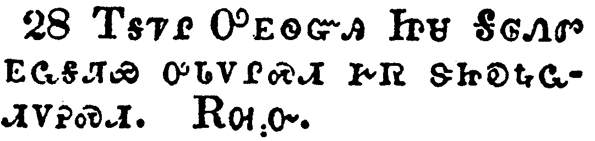

+++
draft=false
date = 2014-12-18T21:11:07Z
title = "1 Thessalonians - Chapter 5 - Cherokee New Testament"
weight = 1418955067

[taxonomies]

authors = ["Timothy Legg"]
categories = []
tags = []

[extra]
+++

<table>
<tbody>
<tr class="odd">
<td></td>
</tr>
<tr class="even">
<td>But of the times and the seasons, brethren, ye have no need that I write unto you.</td>
</tr>
<tr class="odd">
<td>ᎾᎯᏳᏍᎩᏂ ᎨᏒᎢ ᎠᎴ ᎾᎯᏳ ᏕᎨᏌᏗᏒᎢ, ᎢᏓᎵᏅᏟ, ᎥᏝ ᎤᏚᎸᏗ ᏱᏂᏣᎵᏍᏓᏁᎭ ᎢᏨᏲᏪᎳᏁᏗᏱ.</td>
</tr>
<tr class="even">
<td>Na-hi-yu-s-gi-ni ge-sv-i a-le na-hi-yu de-ge-sa-di-sv-i, i-da-li-nv-tli, v-tla u-du-lv-di yi-ni-tsa-li-s-da-ne-ha i-tsv-yo-we-la-ne-di-yi.</td>
</tr>
</tbody>
</table>

<table>
<tbody>
<tr class="odd">
<td></td>
</tr>
<tr class="even">
<td>For yourselves know perfectly that the day of the Lord so cometh as a thief in the night.</td>
</tr>
<tr class="odd">
<td>ᎢᏨᏒᏰᏃ ᎣᏏᏳ ᎢᏥᎦᏔ ᎾᏍᎩ ᎤᎬᏫᏳᎯ ᎤᏤᎵ ᎢᎦ ᎤᎵᏰᎢᎶᎯᏍᏗ ᎨᏒ ᎾᏍᎩᏯ ᎦᏃᏍᎩᏍᎩ ᏒᏃᏱ ᏥᎦᎷᎪᎢ.</td>
</tr>
<tr class="even">
<td>I-tsv-sv-ye-no o-si-yu i-tsi-ga-ta na-s-gi U-gv-wi-yu-hi u-tse-li i-ga u-li-ye-i-lo-hi-s-di ge-sv na-s-gi-ya ga-no-s-gi-s-gi sv-no-yi tsi-ga-lu-go-i.</td>
</tr>
</tbody>
</table>

<table>
<tbody>
<tr class="odd">
<td></td>
</tr>
<tr class="even">
<td>For when they shall say, Peace and safety; then sudden destruction cometh upon them, as travail upon a woman with child; and they shall not escape.</td>
</tr>
<tr class="odd">
<td>ᎾᎯᏳᏰᏃ ᏅᏩᏙᎯᏯᏛ ᎠᎴ ᏄᎾᏰᎯᏍᏛᎾ ᎠᎾᏗᏍᎨᏍᏗ, ᎿᎭᏉ ᏄᏰᎶᎢᏍᏔᏅᏛ ᎠᏓᏛᏗᏍᎩ ᎤᏂᎷᏤᏗ ᎨᏎᏍᏗ, ᎾᏍᎩᏯ ᎠᎩᎵᏯ ᏧᎷᏤᎰ ᎠᎨᏴ ᎦᏁᎵᏛ; ᎠᎴ ᎥᏝ ᎤᎾᏗᏫᏎᏗ ᏱᎨᏎᏍᏗ.</td>
</tr>
<tr class="even">
<td>Na-hi-yu-ye-no nv-wa-do-hi-ya-dv a-le nu-na-ye-hi-s-dv-na a-na-di-s-ge-s-di, hna-quo nu-ye-lo-i-s-ta-nv-dv a-da-dv-di-s-gi u-ni-lu-tse-di ge-se-s-di, na-s-gi-ya a-gi-li-ya tsu-lu-tse-ho a-ge-yv ga-ne-li-dv; a-le v-tla u-na-di-wi-se-di yi-ge-se-s-di.</td>
</tr>
</tbody>
</table>

<table>
<tbody>
<tr class="odd">
<td></td>
</tr>
<tr class="even">
<td>But ye, brethren, are not in darkness, that that day should overtake you as a thief.</td>
</tr>
<tr class="odd">
<td>ᏂᎯᏍᎩᏂ, ᎢᏓᎵᏅᏟ, ᎥᏝ ᎤᎵᏏᎬ ᏱᏤᎭ, ᎾᏍᎩ Ꮎ ᎾᎯᏳ ᎢᎦ ᎨᏣᏢᏔᏍᏗ ᎢᏳᎵᏍᏙᏗᏱ ᎾᏍᎩᏯ ᎦᏃᏍᎩᏍᎩ ᏧᏢᏔᏍᎪᎢ.</td>
</tr>
<tr class="even">
<td>Ni-hi-s-gi-ni, i-da-li-nv-tli, v-tla u-li-si-gv yi-tse-ha, na-s-gi na na-hi-yu i-ga ge-tsa-tlv-ta-s-di i-yu-li-s-do-di-yi na-s-gi-ya ga-no-s-gi-s-gi tsu-tlv-ta-s-go-i.</td>
</tr>
</tbody>
</table>

<table>
<tbody>
<tr class="odd">
<td></td>
</tr>
<tr class="even">
<td>Ye are all the children of light, and the children of the day: we are not of the night, nor of darkness.</td>
</tr>
<tr class="odd">
<td>ᏂᏥᎥᎢ ᎢᎦ-ᎦᏘ ᏧᏪᏥ, ᎠᎴ ᎢᎦ ᏧᏪᏥ; ᎥᏝ ᏒᏃᏱ ᎠᎴ ᎤᎵᏏᎬ ᎢᏕᎯ ᏱᎩ.</td>
</tr>
<tr class="even">
<td>Ni-tsi-v-i i-ga--ga-ti tsu-we-tsi, a-le i-ga tsu-we-tsi; v-tla sv-no-yi a-le u-li-si-gv i-de-hi yi-gi.</td>
</tr>
</tbody>
</table>

<table>
<tbody>
<tr class="odd">
<td></td>
</tr>
<tr class="even">
<td>Therefore let us not sleep, as do others; but let us watch and be sober.</td>
</tr>
<tr class="odd">
<td>ᎾᏍᎩ ᎢᏳᏍᏗ ᏞᏍᏗ ᏱᏗᎵᎮᏍᏗ, ᎾᏍᎩᏯ ᎠᏂᏐᎢ ᎾᎾᏛᏁᎲᎢ; ᎢᏗᏯᏫᏍᎨᏍᏗᏍᎩᏂ ᎠᎴ ᏂᏗᎩᏴᏍᏕᏍᎬᎾ ᎨᏎᏍᏗ.</td>
</tr>
<tr class="even">
<td>Na-s-gi i-yu-s-di tle-s-di yi-di-li-he-s-di, na-s-gi-ya a-ni-so-i na-na-dv-ne-hv-i; i-di-ya-wi-s-ge-s-di-s-gi-ni a-le ni-di-gi-yv-s-de-s-gv-na ge-se-s-di.</td>
</tr>
</tbody>
</table>

<table>
<tbody>
<tr class="odd">
<td></td>
</tr>
<tr class="even">
<td>For they that sleep sleep in the night; and they that be drunken are drunken in the night.</td>
</tr>
<tr class="odd">
<td>ᎠᏂᎵᎯᏰᏃ, ᏒᏃᏱ ᏓᏂᎵᎰᎢ; ᎠᎴ ᎾᏍᎩ Ꮎ ᏧᏂᏴᏍᏕᏍᎩ, ᏒᏃᏱ ᏚᏂᏴᏍᏕᏍᎪᎢ.</td>
</tr>
<tr class="even">
<td>A-ni-li-hi-ye-no, sv-no-yi da-ni-li-ho-i; a-le na-s-gi na tsu-ni-yv-s-de-s-gi, sv-no-yi du-ni-yv-s-de-s-go-i.</td>
</tr>
</tbody>
</table>

<table>
<tbody>
<tr class="odd">
<td></td>
</tr>
<tr class="even">
<td>But let us, who are of the day, be sober, putting on the breastplate of faith and love; and for an helmet, the hope of salvation.</td>
</tr>
<tr class="odd">
<td>ᎠᏴᏍᎩᏂ ᎢᎦ ᎢᏕᎯ ᏥᎩ ᏂᏗᎩᏴᏍᏕᏍᎬᎾ ᎨᏎᏍᏗ, ᎠᏓᏁᏣᏍᏚᎶ ᎪᎯᏳᏗ ᎨᏒ ᎠᎴ ᎠᏓᎨᏳᏗ ᎨᏒ ᎢᏓᏓᏁᏥᏍᏚᎶᏗᏍᎨᏍᏗ, ᎡᎩᏍᏕᎸᏗᏱᏃ ᎨᏒ ᎤᏚᎩ ᎢᎬᏒ ᎢᎦᎵᏍᏚᎶᏕᏍᏗ.</td>
</tr>
<tr class="even">
<td>A-yv-s-gi-ni i-ga i-de-hi tsi-gi ni-di-gi-yv-s-de-s-gv-na ge-se-s-di, a-da-ne-tsa-s-du-lo go-hi-yu-di ge-sv a-le a-da-ge-yu-di ge-sv i-da-da-ne-tsi-s-du-lo-di-s-ge-s-di, e-gi-s-de-lv-di-yi-no ge-sv u-du-gi i-gv-sv i-ga-li-s-du-lo-de-s-di.</td>
</tr>
</tbody>
</table>

<table>
<tbody>
<tr class="odd">
<td></td>
</tr>
<tr class="even">
<td>For God hath not appointed us to wrath, but to obtain salvation by our Lord Jesus Christ,</td>
</tr>
<tr class="odd">
<td>ᎤᏁᎳᏅᎯᏰᏃ ᎥᏝ ᏱᎦᏑᏰᏒ ᎤᏔᎳᏬᎯᏍᏗ ᎨᏒ ᎢᎩᎷᏤᏗᏱ; ᎠᎵᏍᏕᎸᏙᏗᏍᎩᏂ ᎢᎩᏩᏛᏗᏱ ᎢᎦᏤᎵ ᎤᎬᏫᏳᎯ ᏥᏌ ᎦᎶᏁᏛ ᎢᏳᏩᏂᏌᏛ;</td>
</tr>
<tr class="even">
<td>U-ne-la-nv-hi-ye-no v-tla yi-ga-su-ye-sv u-ta-la-wo-hi-s-di ge-sv i-gi-lu-tse-di-yi; a-li-s-de-lv-do-di-s-gi-ni i-gi-wa-dv-di-yi i-ga-tse-li U-gv-wi-yu-hi Tsi-sa Ga-lo-ne-dv i-yu-wa-ni-sa-dv;</td>
</tr>
</tbody>
</table>

<table>
<tbody>
<tr class="odd">
<td></td>
</tr>
<tr class="even">
<td>Who died for us, that, whether we wake or sleep, we should live together with him.</td>
</tr>
<tr class="odd">
<td>ᎾᏍᎩ ᏥᎩᏲᎱᎯᏎᎴᎢ, ᎾᏍᎩ ᎾᏍᏉ ᏱᏗᎵᎭ ᎠᎴ ᏂᏗᎵᎲᎾ ᏱᎩ, ᎾᏍᎩ ᎢᏧᎳᎭ ᏫᎦᏕᏗᏱ ᎢᏳᎵᏍᏙᏗᏱ.</td>
</tr>
<tr class="even">
<td>Na-s-gi tsi-gi-yo-hu-hi-se-le-i, na-s-gi na-s-quo yi-di-li-ha a-le ni-di-li-hv-na yi-gi, na-s-gi i-tsu-la-ha wi-ga-de-di-yi i-yu-li-s-do-di-yi.</td>
</tr>
</tbody>
</table>

<table>
<tbody>
<tr class="odd">
<td></td>
</tr>
<tr class="even">
<td>Wherefore comfort yourselves together, and edify one another, even as also ye do.</td>
</tr>
<tr class="odd">
<td>ᎾᏍᎩ ᎢᏳᏍᏗ, ᏕᏣᏓᎦᎵᏍᏓᏗᏍᎨᏍᏗ, ᎠᎴ ᏕᏣᏓᎵᏂᎪᎯᏍᏗᏍᎨᏍᏗ, ᎾᏍᎩᏯ ᏥᏂᏣᏛᏁᎭ.</td>
</tr>
<tr class="even">
<td>Na-s-gi i-yu-s-di, de-tsa-da-ga-li-s-da-di-s-ge-s-di, a-le de-tsa-da-li-ni-go-hi-s-di-s-ge-s-di, na-s-gi-ya tsi-ni-tsa-dv-ne-ha.</td>
</tr>
</tbody>
</table>

<table>
<tbody>
<tr class="odd">
<td></td>
</tr>
<tr class="even">
<td>And we beseech you, brethren, to know them which labour among you, and are over you in the Lord, and admonish you;</td>
</tr>
<tr class="odd">
<td>ᎠᎴ ᎢᏨᏔᏲᏎᎭ, ᎢᏓᎵᏅᏟ, ᎾᏍᎩ ᏗᏥᎦᏔᎯ ᎢᏳᎵᏍᏙᏗᏱ ᎾᏍᎩ Ꮎ ᏧᏂᎸᏫᏍᏓᏁᎯ ᎢᏤᎲᎢ, ᎠᎴ ᏗᎨᏣᏁᎶᏗ ᏥᎩ ᎤᎬᏫᏳᎯ ᏕᏣᏁᎶᏛᎢ, ᎠᎴ ᏥᎨᏣᏅᏓᏗᏍᏗᎭ;</td>
</tr>
<tr class="even">
<td>A-le i-tsv-ta-yo-se-ha, i-da-li-nv-tli, na-s-gi di-tsi-ga-ta-hi i-yu-li-s-do-di-yi na-s-gi na tsu-ni-lv-wi-s-da-ne-hi i-tse-hv-i, a-le di-ge-tsa-ne-lo-di tsi-gi U-gv-wi-yu-hi de-tsa-ne-lo-dv-i, a-le tsi-ge-tsa-nv-da-di-s-di-ha;</td>
</tr>
</tbody>
</table>

<table>
<tbody>
<tr class="odd">
<td></td>
</tr>
<tr class="even">
<td>And to esteem them very highly in love for their work's sake. And be at peace among yourselves.</td>
</tr>
<tr class="odd">
<td>ᎠᎴ ᎤᏣᏘ ᏗᏥᎸᏉᏗᏳ ᎢᏳᎵᏍᏙᏗᏱ ᎠᏓᎨᏳᏗ ᎬᏗ ᏅᏗᎦᎵᏍᏙᏗᏍᎨᏍᏗ ᏚᏂᎸᏫᏍᏓᏁᎲᎢ. ᎠᎴ ᏙᎯᏱ ᏂᏨᏁᏍᏗ ᎢᏨᏒ ᎢᏤᎲᎢ.</td>
</tr>
<tr class="even">
<td>A-le u-tsa-ti di-tsi-lv-quo-di-yu i-yu-li-s-do-di-yi a-da-ge-yu-di gv-di nv-di-ga-li-s-do-di-s-ge-s-di du-ni-lv-wi-s-da-ne-hv-i. A-le do-hi-yi ni-tsv-ne-s-di i-tsv-sv i-tse-hv-i.</td>
</tr>
</tbody>
</table>

<table>
<tbody>
<tr class="odd">
<td></td>
</tr>
<tr class="even">
<td>Now we exhort you, brethren, warn them that are unruly, comfort the feebleminded, support the weak, be patient toward all men.</td>
</tr>
<tr class="odd">
<td>ᎠᎴ ᎢᏨᏔᏲᏎᎭ, ᎢᏓᎵᏅᏟ, ᏕᏤᏯᏔᎲᏍᎨᏍᏗ ᎾᏍᎩ Ꮎ ᏄᎾᏁᎸᎾ, ᏕᏥᎦᎵᏍᏓᏗᏍᎨᏍᏗ ᏗᏩᎾᎦᎳ ᏧᎾᏓᏅᏘ, ᏕᏥᏂᏴᏎᏍᏗ ᏗᏂᏩᎾᎦᎳᎢ, ᏗᏨᏂᏗᏳ ᎨᏎᏍᏗ ᎾᏂᎥ [ᎤᏣᏘᏂ ᏂᎨᏣᏛᏁᎲᎢ.]</td>
</tr>
<tr class="even">
<td>A-le i-tsv-ta-yo-se-ha, i-da-li-nv-tli, de-tse-ya-ta-hv-s-ge-s-di na-s-gi na nu-na-ne-lv-na, de-tsi-ga-li-s-da-di-s-ge-s-di di-wa-na-ga-la tsu-na-da-nv-ti, de-tsi-ni-yv-se-s-di di-ni-wa-na-ga-la-i, di-tsv-ni-di-yu ge-se-s-di na-ni-v [u-tsa-ti-ni ni-ge-tsa-dv-ne-hv-i.]</td>
</tr>
</tbody>
</table>

<table>
<tbody>
<tr class="odd">
<td></td>
</tr>
<tr class="even">
<td>See that none render evil for evil unto any man; but ever follow that which is good, both among yourselves, and to all men.</td>
</tr>
<tr class="odd">
<td>ᏞᏍᏗ ᎩᎶ ᎤᏲ ᎾᎬᏁᎸ ᏳᏞᎨᏍᏗ ᎤᏲ ᏱᎾᏓᏛᏁᎮᏍᏗ; ᎢᏥᏍᏓᏩᏕᎨᏍᏗᏍᎩᏂ ᏂᎪᎯᎸ ᎾᏍᎩ ᎣᏍᏛ ᎨᏒᎢ, ᎾᏍᏉ ᎢᏨᏒ ᎪᎱᏍᏗ ᏕᏣᏓᏛᏗᏍᎬ, ᎠᎴ ᎾᏂᎥᏉ.</td>
</tr>
<tr class="even">
<td>Tle-s-di gi-lo u-yo na-gv-ne-lv yu-tle-ge-s-di u-yo yi-na-da-dv-ne-he-s-di; i-tsi-s-da-wa-de-ge-s-di-s-gi-ni ni-go-hi-lv na-s-gi o-s-dv ge-sv-i, na-s-quo i-tsv-sv go-hu-s-di de-tsa-da-dv-di-s-gv, a-le na-ni-v-quo.</td>
</tr>
</tbody>
</table>

<table>
<tbody>
<tr class="odd">
<td></td>
</tr>
<tr class="even">
<td>Rejoice evermore.</td>
</tr>
<tr class="odd">
<td>ᎢᏣᎵᎮᎵᎨᏍᏗ ᏂᎪᎯᎸᎢ;</td>
</tr>
<tr class="even">
<td>I-tsa-li-he-li-ge-s-di ni-go-hi-lv-i;</td>
</tr>
</tbody>
</table>

<table>
<tbody>
<tr class="odd">
<td></td>
</tr>
<tr class="even">
<td>Pray without ceasing.</td>
</tr>
<tr class="odd">
<td>ᏂᏥᏲᎯᏍᏗᏍᎬᎾ ᎢᏣᏓᏙᎵᏍᏗᏍᎨᏍᏗ;</td>
</tr>
<tr class="even">
<td>Ni-tsi-yo-hi-s-di-s-gv-na i-tsa-da-do-li-s-di-s-ge-s-di;</td>
</tr>
</tbody>
</table>

<table>
<tbody>
<tr class="odd">
<td></td>
</tr>
<tr class="even">
<td>In every thing give thanks: for this is the will of God in Christ Jesus concerning you.</td>
</tr>
<tr class="odd">
<td>ᏂᎦᎥᏉ ᏂᏣᎵᏍᏓᏁᎵᏕᎬ ᎡᏣᎵᎡᎵᏤᎮᏍᏗ [ᎤᏁᎳᏅᎯ;] ᎯᎠᏰᏃ ᎾᏍᎩ ᎤᏁᎳᏅᎯ ᎢᏣᏓᏅᏖᎮᎲ ᏥᏌ ᎦᎶᏁᏛ ᏕᏣᏁᎶᏛ ᎢᏳᏍᏗ.</td>
</tr>
<tr class="even">
<td>Ni-ga-v-quo ni-tsa-li-s-da-ne-li-de-gv e-tsa-li-e-li-tse-he-s-di [U-ne-la-nv-hi;] hi-a-ye-no na-s-gi U-ne-la-nv-hi i-tsa-da-nv-te-he-hv Tsi-sa Ga-lo-ne-dv de-tsa-ne-lo-dv i-yu-s-di.</td>
</tr>
</tbody>
</table>

<table>
<tbody>
<tr class="odd">
<td></td>
</tr>
<tr class="even">
<td>Quench not the Spirit.</td>
</tr>
<tr class="odd">
<td>ᎠᏓᏅᏙ ᎠᏓᏪᎵᎩᏍᎬ ᏞᏍᏗ ᏴᏝᏗᏍᎨᏍᏗ.</td>
</tr>
<tr class="even">
<td>A-da-nv-do a-da-we-li-gi-s-gv tle-s-di yv-tla-di-s-ge-s-di.</td>
</tr>
</tbody>
</table>

<table>
<tbody>
<tr class="odd">
<td></td>
</tr>
<tr class="even">
<td>Despise not prophesyings.</td>
</tr>
<tr class="odd">
<td>ᏞᏍᏗ ᎠᏎᏉ ᏱᏥᏰᎸᏍᎨᏍᏗ ᎠᏙᎴᎰᎯᏍᏗ ᎨᏒᎢ.</td>
</tr>
<tr class="even">
<td>Tle-s-di a-se-quo yi-tsi-ye-lv-s-ge-s-di a-do-le-ho-hi-s-di ge-sv-i.</td>
</tr>
</tbody>
</table>

<table>
<tbody>
<tr class="odd">
<td></td>
</tr>
<tr class="even">
<td>Prove all things; hold fast that which is good.</td>
</tr>
<tr class="odd">
<td>ᏄᏓᎴᏒ ᎪᎱᏍᏗ ᎢᏥᎪᎵᏰᏍᎨᏍᏗ; ᎠᏍᏓᏯ ᏕᏥᏂᏴᏎᏍᏗ ᎾᏍᎩ Ꮎ ᎣᏍᏛ ᎨᏒᎢ.</td>
</tr>
<tr class="even">
<td>Nu-da-le-sv go-hu-s-di i-tsi-go-li-ye-s-ge-s-di; a-s-da-ya de-tsi-ni-yv-se-s-di na-s-gi na o-s-dv ge-sv-i.</td>
</tr>
</tbody>
</table>

<table>
<tbody>
<tr class="odd">
<td></td>
</tr>
<tr class="even">
<td>Abstain from all appearance of evil.</td>
</tr>
<tr class="odd">
<td>ᎢᏣᏓᏅᎡᎮᏍᏗ ᏂᎦᎥ ᏄᏓᎴᏒ ᎤᏲᎢ.</td>
</tr>
<tr class="even">
<td>I-tsa-da-nv-e-he-s-di ni-ga-v nu-da-le-sv u-yo-i.</td>
</tr>
</tbody>
</table>

<table>
<tbody>
<tr class="odd">
<td></td>
</tr>
<tr class="even">
<td>And the very God of peace sanctify you wholly; and I pray God your whole spirit and soul and body be preserved blameless unto the coming of our Lord Jesus Christ.</td>
</tr>
<tr class="odd">
<td>ᎤᏁᎳᏅᎯᏃ ᎤᏩᏒ ᏅᏩᏙᎯᏯᏛ ᎠᏓᏁᎯ ᏂᎦᎷᎶᎬᎾ ᎢᏥᏅᎦᎸᏗ ᎨᏎᏍᏗ; ᎠᎴ ᏂᎬ ᎢᏣᏓᏅᏖᏗᏱ ᎠᎴ ᏗᏣᏓᏅᏙ ᎠᎴ ᏗᏥᏰᎸᎢ ᏤᏥᏍᏆᏂᎪᏓᏁᏗ ᎨᏎᏍᏗ, ᏂᏚᏚᎯᏍᏛᎾ ᎢᏣᎵᏍᏙᏗᏱ ᎢᎦᏤᎵ ᎤᎬᏫᏳᎯ ᏥᏌ ᎦᎶᏁᏛ ᎦᎷᏨ ᎢᏳᎢ.</td>
</tr>
<tr class="even">
<td>U-ne-la-nv-hi-no u-wa-sv nv-wa-do-hi-ya-dv a-da-ne-hi ni-ga-lu-lo-gv-na i-tsi-nv-ga-lv-di ge-se-s-di; a-le ni-gv i-tsa-da-nv-te-di-yi a-le di-tsa-da-nv-do a-le di-tsi-ye-lv-i tse-tsi-s-qua-ni-go-da-ne-di ge-se-s-di, ni-du-du-hi-s-dv-na i-tsa-li-s-do-di-yi i-ga-tse-li U-gv-wi-yu-hi Tsi-sa Ga-lo-ne-dv ga-lu-tsv i-yu-i.</td>
</tr>
</tbody>
</table>

<table>
<tbody>
<tr class="odd">
<td></td>
</tr>
<tr class="even">
<td>Faithful is he that calleth you, who also will do it.</td>
</tr>
<tr class="odd">
<td>ᏄᏓᎵᏓᏍᏛᎾ ᎾᏍᎩ Ꮎ ᎢᏣᏯᏅᏛ, ᎾᏍᏉ ᎾᏍᎩ ᎠᏎ ᏥᏅᏛᏛᏁᎵ.</td>
</tr>
<tr class="even">
<td>Nu-da-li-da-s-dv-na na-s-gi na i-tsa-ya-nv-dv, na-s-quo na-s-gi a-se tsi-nv-dv-dv-ne-li.</td>
</tr>
</tbody>
</table>

<table>
<tbody>
<tr class="odd">
<td></td>
</tr>
<tr class="even">
<td>Brethren, pray for us.</td>
</tr>
<tr class="odd">
<td>ᎢᏓᎵᏅᏟ ᏍᎩᏯᏅᏓᏗᏍᎨᏍᏗ ᎢᏣᏓᏙᎵᏍᏗᏍᎬᎢ.</td>
</tr>
<tr class="even">
<td>I-da-li-nv-tli s-gi-ya-nv-da-di-s-ge-s-di i-tsa-da-do-li-s-di-s-gv-i.</td>
</tr>
</tbody>
</table>

<table>
<tbody>
<tr class="odd">
<td></td>
</tr>
<tr class="even">
<td>Greet all the brethren with an holy kiss.</td>
</tr>
<tr class="odd">
<td>ᏂᎦᏛ ᎠᎾᎵᏅᏟ ᎦᎸᏉᏗᏳ ᏗᏓᏙᏪᏙᎥᏍᏗ ᏕᏥᏲᎵᏍᏗᏍᎨᏍᏗ.</td>
</tr>
<tr class="even">
<td>Ni-ga-dv a-na-li-nv-tli ga-lv-quo-di-yu di-da-do-we-do-v-s-di de-tsi-yo-li-s-di-s-ge-s-di.</td>
</tr>
</tbody>
</table>

<table>
<tbody>
<tr class="odd">
<td></td>
</tr>
<tr class="even">
<td>I charge you by the Lord that this epistle be read unto all the holy brethren.</td>
</tr>
<tr class="odd">
<td>ᎢᏨᏁᏤᎭ ᎤᎬᏫᏳᎯ ᎢᏨᏁᎢᏍᏓᏁᎭ, ᎯᎠ ᎾᏍᎩ ᎪᏪᎵ ᎨᏥᎪᎵᏰᏗᏱ ᎾᏂᎥ ᎤᎾᏓᏅᏘ ᎠᎾᎵᏅᏟ.</td>
</tr>
<tr class="even">
<td>I-tsv-ne-tse-ha U-gv-wi-yu-hi i-tsv-ne-i-s-da-ne-ha, hi-a na-s-gi go-we-li ge-tsi-go-li-ye-di-yi na-ni-v u-na-da-nv-ti a-na-li-nv-tli.</td>
</tr>
</tbody>
</table>

<table>
<tbody>
<tr class="odd">
<td></td>
</tr>
<tr class="even">
<td>The grace of our Lord Jesus Christ be with you. Amen.</td>
</tr>
<tr class="odd">
<td>ᎢᎦᏤᎵ ᎤᎬᏫᏳᎯ ᏥᏌ ᎦᎶᏁᏛ ᎬᏩᎦᏘᏯ ᎤᏓᏙᎵᏍᏗ ᎨᏒ ᏕᏥᎧᎿᎭᏩᏗᏙᎮᏍᏗ. ᎡᎺᏅ.</td>
</tr>
<tr class="even">
<td>I-ga-tse-li U-gv-wi-yu-hi Tsi-sa Ga-lo-ne-dv gv-wa-ga-ti-ya u-da-do-li-s-di ge-sv de-tsi-ka-hna-wa-di-do-he-s-di. E-me-nv.</td>
</tr>
</tbody>
</table>

