+++
draft=false
date = 2014-12-18T21:11:07Z
title = "1 Timothy - Chapter 4 - Cherokee New Testament"
weight = 1418955067

[taxonomies]

authors = ["Timothy Legg"]
categories = []
tags = []

[extra]
+++

<table>
<tbody>
<tr class="odd">
<td><a href="150401.png">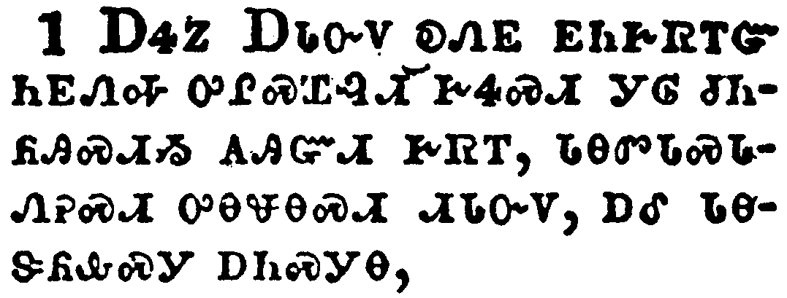</a></td>
</tr>
<tr class="even">
<td>Now the Spirit speaketh expressly, that in the latter times some shall depart from the faith, giving heed to seducing spirits, and doctrines of devils;</td>
</tr>
<tr class="odd">
<td>ᎠᏎᏃ ᎠᏓᏅᏙ ᎧᏁᎬ ᎬᏂᎨᏒᎢᏳ ᏂᎬᏁᎭ ᎤᎵᏍᏆᎸᏗ ᎨᏎᏍᏗ ᎩᎶ ᏧᏂᏲᎯᏍᏗᏱ ᎪᎯᏳᏗ ᎨᏒᎢ, ᏓᎾᏛᏓᏍᏓᏁᎮᏍᏗ ᎤᎾᏠᎾᏍᏗ ᏗᏓᏅᏙ, ᎠᎴ ᏓᎾᏕᏲᎲᏍᎩ ᎠᏂᏍᎩᎾ,</td>
</tr>
<tr class="even">
<td>A-se-no A-da-nv-do ka-ne-gv gv-ni-ge-sv-i-yu ni-gv-ne-ha u-li-s-qua-lv-di ge-se-s-di gi-lo tsu-ni-yo-hi-s-di-yi go-hi-yu-di ge-sv-i, da-na-dv-da-s-da-ne-he-s-di u-na-tlo-na-s-di di-da-nv-do, a-le da-na-de-yo-hv-s-gi a-ni-s-gi-na,</td>
</tr>
</tbody>
</table>

<table>
<tbody>
<tr class="odd">
<td><a href="150402.png">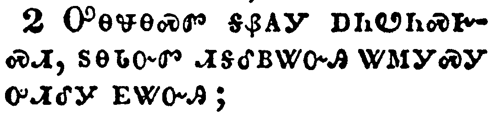</a></td>
</tr>
<tr class="even">
<td>Speaking lies in hypocrisy; having their conscience seared with a hot iron;</td>
</tr>
<tr class="odd">
<td>ᎤᎾᏠᎾᏍᏛ ᎦᏰᎪᎩ ᎠᏂᏬᏂᏍᎨᏍᏗ, ᏚᎾᏓᏅᏛ ᏗᎦᎴᏴᏔᏅᎯ ᏔᎷᎩᏍᎩ ᎤᏗᎴᎩ ᎬᏔᏅᎯ;</td>
</tr>
<tr class="even">
<td>U-na-tlo-na-s-dv ga-ye-go-gi a-ni-wo-ni-s-ge-s-di, du-na-da-nv-dv di-ga-le-yv-ta-nv-hi ta-lu-gi-s-gi u-di-le-gi gv-ta-nv-hi;</td>
</tr>
</tbody>
</table>

<table>
<tbody>
<tr class="odd">
<td><a href="150403.png">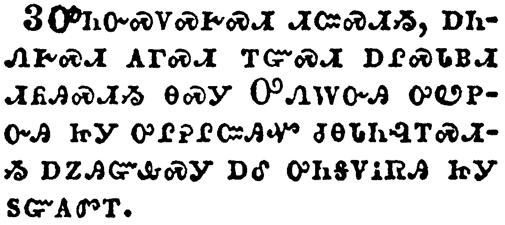</a></td>
</tr>
<tr class="even">
<td>Forbidding to marry, and commanding to abstain from meats, which God hath created to be received with thanksgiving of them which believe and know the truth.</td>
</tr>
<tr class="odd">
<td>ᎤᏂᏅᏍᏙᏍᎨᏍᏗ ᏗᏨᏍᏗᏱ, ᎠᏂᏁᎨᏍᏗ ᎪᎱᏍᏗ ᎢᏳᏍᏗ ᎠᎵᏍᏓᏴᏗ ᏗᏲᎯᏍᏗᏱ ᎾᏍᎩ ᎤᏁᎳᏅᎯ ᎤᏬᏢᏅᎯ ᏥᎩ ᎤᎵᎮᎵᏨᎯᏉ ᏧᎾᏓᏂᎸᎢᏍᏗᏱ ᎠᏃᎯᏳᎲᏍᎩ ᎠᎴ ᎤᏂᎦᏙᎥᏒᎯ ᏥᎩ ᏚᏳᎪᏛᎢ.</td>
</tr>
<tr class="even">
<td>U-ni-nv-s-do-s-ge-s-di di-tsv-s-di-yi, a-ni-ne-ge-s-di go-hu-s-di i-yu-s-di a-li-s-da-yv-di di-yo-hi-s-di-yi na-s-gi U-ne-la-nv-hi u-wo-tlv-nv-hi tsi-gi u-li-he-li-tsv-hi-quo tsu-na-da-ni-lv-i-s-di-yi a-no-hi-yu-hv-s-gi a-le u-ni-ga-do-v-sv-hi tsi-gi du-yu-go-dv-i.</td>
</tr>
</tbody>
</table>

<table>
<tbody>
<tr class="odd">
<td><a href="150404.png">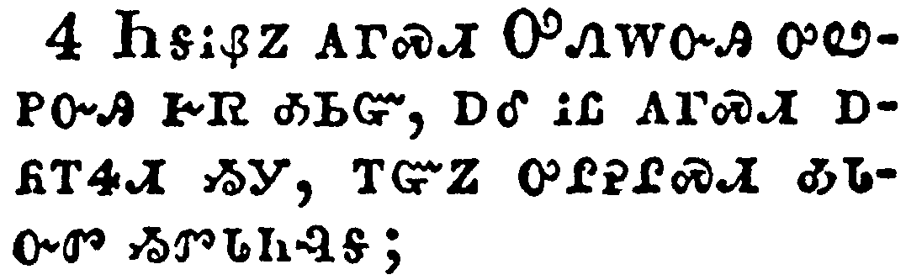</a></td>
</tr>
<tr class="even">
<td>For every creature of God is good, and nothing to be refused, if it be received with thanksgiving:</td>
</tr>
<tr class="odd">
<td>ᏂᎦᎥᏰᏃ ᎪᎱᏍᏗ ᎤᏁᎳᏅᎯ ᎤᏪᏢᏅᎯ ᎨᏒ ᎣᏏᏳ, ᎠᎴ ᎥᏝ ᎪᎱᏍᏗ ᎠᏲᎢᏎᏗ ᏱᎩ, ᎢᏳᏃ ᎤᎵᎮᎵᏍᏗ ᎣᏓᏅᏛ ᏱᏛᏓᏂᎸᎦ;</td>
</tr>
<tr class="even">
<td>Ni-ga-v-ye-no go-hu-s-di U-ne-la-nv-hi u-we-tlv-nv-hi ge-sv o-si-yu, a-le v-tla go-hu-s-di a-yo-i-se-di yi-gi, i-yu-no u-li-he-li-s-di o-da-nv-dv yi-dv-da-ni-lv-ga;</td>
</tr>
</tbody>
</table>

<table>
<tbody>
<tr class="odd">
<td><a href="150405.png">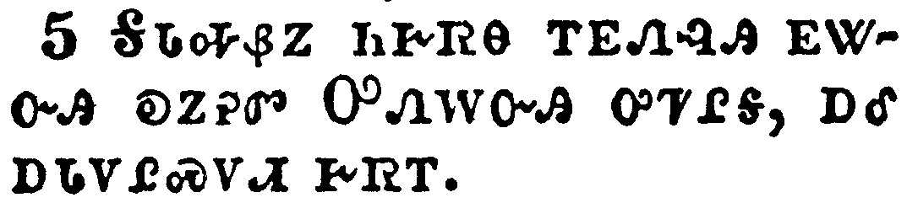</a></td>
</tr>
<tr class="even">
<td>For it is sanctified by the word of God and prayer.</td>
</tr>
<tr class="odd">
<td>ᎦᏓᎭᏰᏃ ᏂᎨᏒᎾ ᎢᎬᏁᎸᎯ ᎬᏔᏅᎯ ᎧᏃᎮᏛ ᎤᏁᎳᏅᎯ ᎤᏤᎵᎦ, ᎠᎴ ᎠᏓᏙᎵᏍᏙᏗ ᎨᏒᎢ.</td>
</tr>
<tr class="even">
<td>Ga-da-ha-ye-no ni-ge-sv-na i-gv-ne-lv-hi gv-ta-nv-hi ka-no-he-dv U-ne-la-nv-hi u-tse-li-ga, a-le a-da-do-li-s-do-di ge-sv-i.</td>
</tr>
</tbody>
</table>

<table>
<tbody>
<tr class="odd">
<td><a href="150406.png">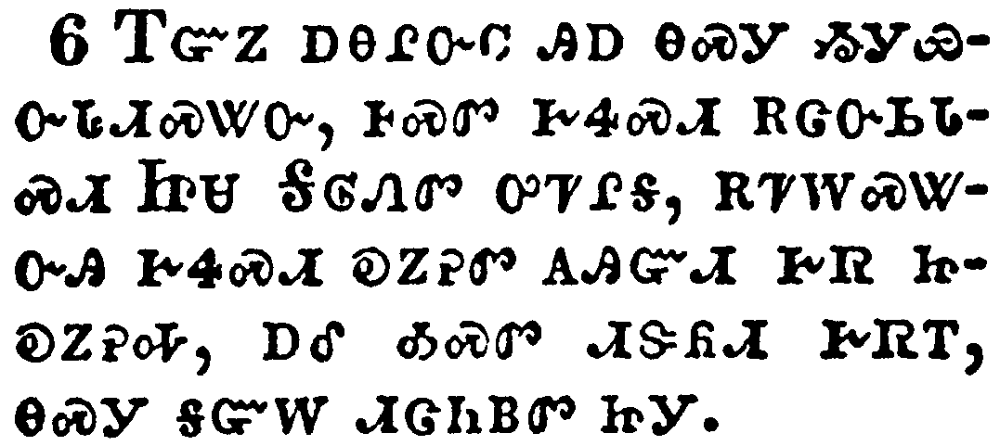</a></td>
</tr>
<tr class="even">
<td>If thou put the brethren in remembrance of these things, thou shalt be a good minister of Jesus Christ, nourished up in the words of faith and of good doctrine, whereunto thou hast attained.</td>
</tr>
<tr class="odd">
<td>ᎢᏳᏃ ᎠᎾᎵᏅᏟ ᎯᎠ ᎾᏍᎩ ᏱᎩᏯᏅᏓᏗᏍᏔᏅ, ᎰᏍᏛ ᎨᏎᏍᏗ ᎡᏣᏅᏏᏓᏍᏗ ᏥᏌ ᎦᎶᏁᏛ ᎤᏤᎵᎦ, ᎡᏤᎳᏍᏔᏅᎯ ᎨᏎᏍᏗ ᎧᏃᎮᏛ ᎪᎯᏳᏗ ᎨᏒ ᏥᎧᏃᎮᎭ, ᎠᎴ ᎣᏍᏛ ᏗᏕᏲᏗ ᎨᏒᎢ, ᎾᏍᎩ ᎦᏳᎳ ᏗᏣᏂᏴᏛ ᏥᎩ.</td>
</tr>
<tr class="even">
<td>I-yu-no a-na-li-nv-tli hi-a na-s-gi yi-gi-ya-nv-da-di-s-ta-nv, ho-s-dv ge-se-s-di e-tsa-nv-si-da-s-di Tsi-sa Ga-lo-ne-dv u-tse-li-ga, e-tse-la-s-ta-nv-hi ge-se-s-di ka-no-he-dv go-hi-yu-di ge-sv tsi-ka-no-he-ha, a-le o-s-dv di-de-yo-di ge-sv-i, na-s-gi ga-yu-la di-tsa-ni-yv-dv tsi-gi.</td>
</tr>
</tbody>
</table>

<table>
<tbody>
<tr class="odd">
<td><a href="150407.png">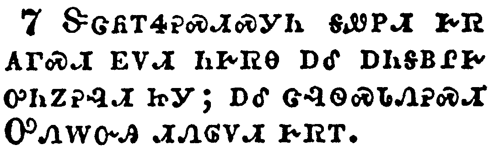</a></td>
</tr>
<tr class="even">
<td>But refuse profane and old wives' fables, and exercise thyself rather unto godliness.</td>
</tr>
<tr class="odd">
<td>ᏕᏣᏲᎢᏎᎮᏍᏗᏍᎩᏂ ᎦᏪᏢᏗ ᎨᏒ ᎪᎱᏍᏗ ᎬᏙᏗ ᏂᎨᏒᎾ ᎠᎴ ᎠᏂᎦᏴᎵᎨ ᎤᏂᏃᎮᎸᏗ ᏥᎩ; ᎠᎴ ᏣᎸᏫᏍᏓᏁᎮᏍᏗ ᎤᏁᎳᏅᎯ ᏗᏁᎶᏙᏗ ᎨᏒᎢ.</td>
</tr>
<tr class="even">
<td>De-tsa-yo-i-se-he-s-di-s-gi-ni ga-we-tlv-di ge-sv go-hu-s-di gv-do-di ni-ge-sv-na a-le a-ni-ga-yv-li-ge u-ni-no-he-lv-di tsi-gi; a-le tsa-lv-wi-s-da-ne-he-s-di U-ne-la-nv-hi di-ne-lo-do-di ge-sv-i.</td>
</tr>
</tbody>
</table>

<table>
<tbody>
<tr class="odd">
<td><a href="150408.png">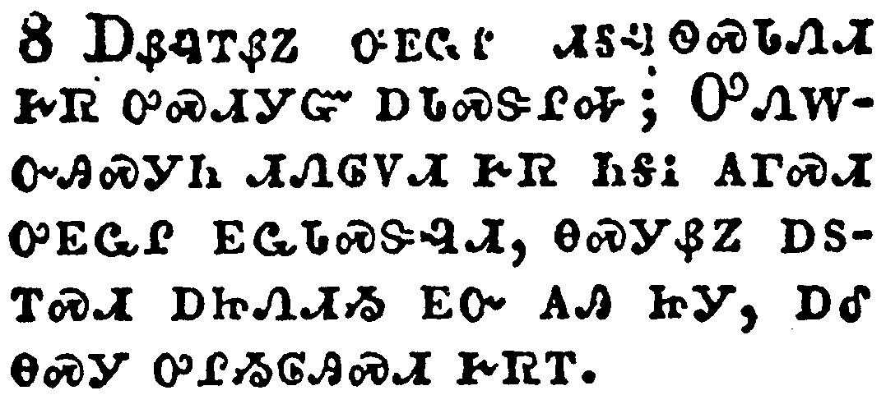</a></td>
</tr>
<tr class="even">
<td>For bodily exercise profiteth little: but godliness is profitable unto all things, having promise of the life that now is, and of that which is to come.</td>
</tr>
<tr class="odd">
<td>ᎠᏰᎸᎢᏰᏃ ᎤᎬᏩᎵ ᏗᎦᎸᏫᏍᏓᏁᏗ ᎨᏒ ᎤᏍᏗᎩᏳ ᎠᏓᏍᏕᎵᎭ; ᎤᏁᎳᏅᎯᏍᎩᏂ ᏗᏁᎶᏙᏗ ᎨᏒ ᏂᎦᎥ ᎪᎱᏍᏗ ᎤᎬᏩᎵ ᎬᏩᏓᏍᏕᎸᏗ, ᎾᏍᎩᏰᏃ ᎠᏚᎢᏍᏗ ᎠᏥᏁᏗᏱ ᎬᏅ ᎪᎯ ᏥᎩ, ᎠᎴ ᎾᏍᎩ ᎤᎵᏱᎶᎯᏍᏗ ᎨᏒᎢ.</td>
</tr>
<tr class="even">
<td>A-ye-lv-i-ye-no u-gv-wa-li di-ga-lv-wi-s-da-ne-di ge-sv u-s-di-gi-yu a-da-s-de-li-ha; U-ne-la-nv-hi-s-gi-ni di-ne-lo-do-di ge-sv ni-ga-v go-hu-s-di u-gv-wa-li gv-wa-da-s-de-lv-di, na-s-gi-ye-no a-du-i-s-di a-tsi-ne-di-yi gv-nv go-hi tsi-gi, a-le na-s-gi u-li-yi-lo-hi-s-di ge-sv-i.</td>
</tr>
</tbody>
</table>

<table>
<tbody>
<tr class="odd">
<td></td>
</tr>
<tr class="even">
<td>This is a faithful saying and worthy of all acceptation.</td>
</tr>
<tr class="odd">
<td>ᎤᏙᎯᏳᎯᏯ ᎢᎦᏪᏛ, ᎠᎴ ᏩᏍᏛ ᏧᏓᏂᎸᎢᏍᏗᏳ;</td>
</tr>
<tr class="even">
<td>U-do-hi-yu-hi-ya i-ga-we-dv, a-le wa-s-dv tsu-da-ni-lv-i-s-di-yu;</td>
</tr>
</tbody>
</table>

<table>
<tbody>
<tr class="odd">
<td><a href="150410.png">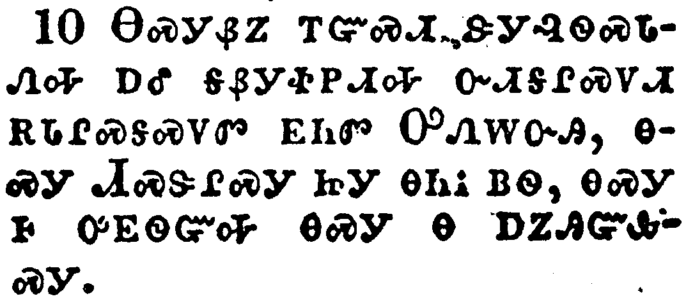</a></td>
</tr>
<tr class="even">
<td>For therefore we both labour and suffer reproach, because we trust in the living God, who is the Saviour of all men, specially of those that believe.</td>
</tr>
<tr class="odd">
<td>ᎾᏍᎩᏰᏃ ᎢᏳᏍᏗ ᏕᎩᎸᏫᏍᏓᏁᎭ ᎠᎴ ᎦᏰᎩᏐᏢᏗᎭ ᏅᏗᎦᎵᏍᏙᏗ ᎡᏓᎵᏍᎦᏍᏙᏛ ᎬᏂᏛ ᎤᏁᎳᏅᎯ, ᎾᏍᎩ ᏗᏍᏕᎵᏍᎩ ᏥᎩ ᎾᏂᎥ ᏴᏫ, ᎾᏍᎩ Ꮀ ᎤᎬᏫᏳᎭ ᎾᏍᎩ Ꮎ ᎠᏃᎯᏳᎲᏍᎩ.</td>
</tr>
<tr class="even">
<td>Na-s-gi-ye-no i-yu-s-di de-gi-lv-wi-s-da-ne-ha a-le ga-ye-gi-so-tlv-di-ha nv-di-ga-li-s-do-di e-da-li-s-ga-s-do-dv gv-ni-dv U-ne-la-nv-hi, na-s-gi Di-s-de-li-s-gi tsi-gi na-ni-v yv-wi, na-s-gi ho u-gv-wi-yu-ha na-s-gi na a-no-hi-yu-hv-s-gi.</td>
</tr>
</tbody>
</table>

<table>
<tbody>
<tr class="odd">
<td><a href="150411.png">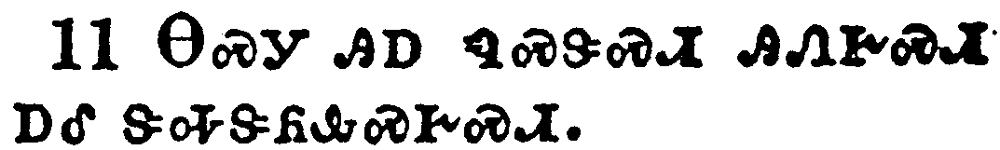</a></td>
</tr>
<tr class="even">
<td>These things command and teach.</td>
</tr>
<tr class="odd">
<td>ᎾᏍᎩ ᎯᎠ ᏄᏍᏕᏍᏗ ᎯᏁᎨᏍᏗ ᎠᎴ ᏕᎭᏕᏲᎲᏍᎨᏍᏗ.</td>
</tr>
<tr class="even">
<td>Na-s-gi hi-a nu-s-de-s-di hi-ne-ge-s-di a-le de-ha-de-yo-hv-s-ge-s-di.</td>
</tr>
</tbody>
</table>

<table>
<tbody>
<tr class="odd">
<td><a href="150412.png">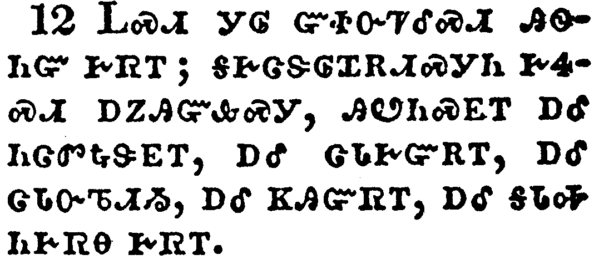</a></td>
</tr>
<tr class="even">
<td>Let no man despise thy youth; but be thou an example of the believers, in word, in conversation, in charity, in spirit, in faith, in purity.</td>
</tr>
<tr class="odd">
<td>ᏞᏍᏗ ᎩᎶ ᏳᏐᏅᏤᎴᏏᏗ ᎯᏫᏂᏳ ᎨᏒᎢ; ᎦᎨᏣᏕᎶᏆᎡᏗᏍᎩᏂ ᎨᏎᏍᏗ ᎠᏃᎯᏳᎲᏍᎩ, ᎯᏬᏂᏍᎬᎢ ᎠᎴ ᏂᏣᏛᎿᎭᏕᎬᎢ, ᎠᎴ ᏣᏓᎨᏳᎡᎢ, ᎠᎴ ᏣᏓᏅᏖᏗᏱ, ᎠᎴ ᏦᎯᏳᏒᎢ, ᎠᎴ ᎦᏓᎭ ᏂᎨᏒᎾ ᎨᏒᎢ.</td>
</tr>
<tr class="even">
<td>Tle-s-di gi-lo yu-so-nv-tse-le-si-di hi-wi-ni-yu ge-sv-i; ga-ge-tsa-de-lo-qua-e-di-s-gi-ni ge-se-s-di a-no-hi-yu-hv-s-gi, hi-wo-ni-s-gv-i a-le ni-tsa-dv-hna-de-gv-i, a-le tsa-da-ge-yu-e-i, a-le tsa-da-nv-te-di-yi, a-le tso-hi-yu-sv-i, a-le ga-da-ha ni-ge-sv-na ge-sv-i.</td>
</tr>
</tbody>
</table>

<table>
<tbody>
<tr class="odd">
<td><a href="150413.png">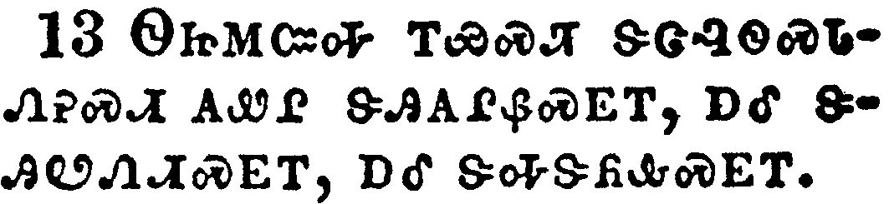</a></td>
</tr>
<tr class="even">
<td>Till I come, give attendance to reading, to exhortation, to doctrine.</td>
</tr>
<tr class="odd">
<td>ᏫᏥᎷᏨᎭ ᎢᏯᏍᏘ ᏕᏣᎸᏫᏍᏓᏁᎮᏍᏗ ᎪᏪᎵ ᏕᎯᎪᎵᏰᏍᎬᎢ, ᎠᎴ ᏕᎯᏬᏁᏗᏍᎬᎢ, ᎠᎴ ᏕᎭᏕᏲᎲᏍᎬᎢ.</td>
</tr>
<tr class="even">
<td>Wi-tsi-lu-tsv-ha i-ya-s-ti de-tsa-lv-wi-s-da-ne-he-s-di go-we-li de-hi-go-li-ye-s-gv-i, a-le de-hi-wo-ne-di-s-gv-i, a-le de-ha-de-yo-hv-s-gv-i.</td>
</tr>
</tbody>
</table>

<table>
<tbody>
<tr class="odd">
<td><a href="150414.png">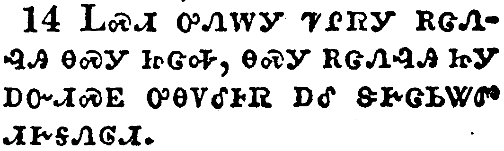</a></td>
</tr>
<tr class="even">
<td>Neglect not the gift that is in thee, which was given thee by prophecy, with the laying on of the hands of the presbytery.</td>
</tr>
<tr class="odd">
<td>ᏞᏍᏗ ᎤᏁᎳᎩ ᏤᎵᏒᎩ ᎡᏣᏁᎸᎯ ᎾᏍᎩ ᏥᏣᎭ, ᎾᏍᎩ ᎡᏣᏁᎸᎯ ᏥᎩ ᎠᏅᏗᏍᎬ ᎤᎾᏙᎴᎰᏒ ᎠᎴ ᏕᎨᏣᏏᏔᏛ ᏗᎨᎦᏁᎶᏗ.</td>
</tr>
<tr class="even">
<td>Tle-s-di u-ne-la-gi tse-li-sv-gi e-tsa-ne-lv-hi na-s-gi tsi-tsa-ha, na-s-gi e-tsa-ne-lv-hi tsi-gi a-nv-di-s-gv u-na-do-le-ho-sv a-le de-ge-tsa-si-ta-dv di-ge-ga-ne-lo-di.</td>
</tr>
</tbody>
</table>

<table>
<tbody>
<tr class="odd">
<td><a href="150415.png">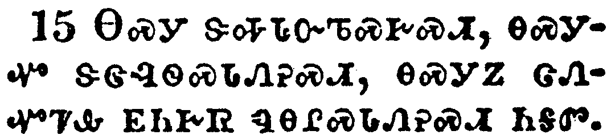</a></td>
</tr>
<tr class="even">
<td>Meditate upon these things; give thyself wholly to them; that thy profiting may appear to all.</td>
</tr>
<tr class="odd">
<td>ᎾᏍᎩ ᏕᎭᏓᏅᏖᏍᎨᏍᏗ, ᎾᏍᎩᏉ ᏕᏣᎸᏫᏍᏓᏁᎮᏍᏗ, ᎾᏍᎩᏃ ᏣᏁᏉᏤᎲ ᎬᏂᎨᏒ ᏄᎾᎵᏍᏓᏁᎮᏍᏗ ᏂᎦᏛ.</td>
</tr>
<tr class="even">
<td>Na-s-gi de-ha-da-nv-te-s-ge-s-di, na-s-gi-quo de-tsa-lv-wi-s-da-ne-he-s-di, na-s-gi-no tsa-ne-quo-tse-hv gv-ni-ge-sv nu-na-li-s-da-ne-he-s-di ni-ga-dv.</td>
</tr>
</tbody>
</table>

<table>
<tbody>
<tr class="odd">
<td><a href="150416.png">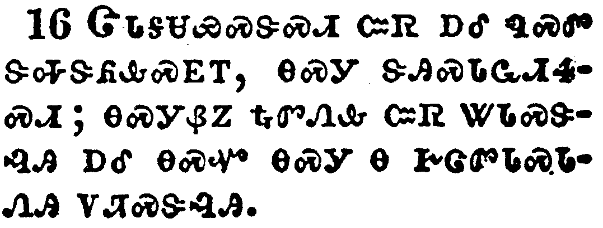</a></td>
</tr>
<tr class="even">
<td>Take heed unto thyself, and unto the doctrine; continue in them: for in doing this thou shalt both save thyself, and them that hear thee.</td>
</tr>
<tr class="odd">
<td>ᏣᏓᎦᏌᏯᏍᏕᏍᏗ ᏨᏒ ᎠᎴ ᏄᏍᏛ ᏕᎭᏕᏲᎲᏍᎩᎢ, ᎾᏍᎩ ᏕᎯᏍᏓᏩᏗᏎᏍᏗ; ᎾᏍᎩᏰᏃ ᎿᎭᏛᏁᎲ ᏨᏒ ᏔᏓᏍᏕᎸᎯ ᎠᎴ ᎾᏍᏉ ᎾᏍᎩ Ꮎ ᎨᏣᏛᏓᏍᏓᏁᎯ ᏙᏘᏍᏕᎸᎯ.</td>
</tr>
<tr class="even">
<td>Tsa-da-ga-sa-ya-s-de-s-di tsv-sv a-le nu-s-dv de-ha-de-yo-hv-s-gi-i, na-s-gi de-hi-s-da-wa-di-se-s-di; na-s-gi-ye-no hna-dv-ne-hv tsv-sv ta-da-s-de-lv-hi a-le na-s-quo na-s-gi na ge-tsa-dv-da-s-da-ne-hi do-ti-s-de-lv-hi.</td>
</tr>
</tbody>
</table>

