+++
draft=false
date = 2014-12-18T21:11:07Z
title = "1 Timothy - Chapter 5 - Cherokee New Testament"
weight = 1418955067

[taxonomies]

authors = ["Timothy Legg"]
categories = []
tags = []

[extra]
+++

<table>
<tbody>
<tr class="odd">
<td><a href="150501.png">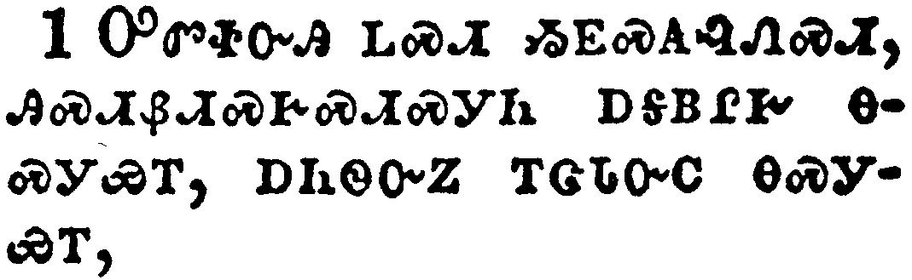</a></td>
</tr>
<tr class="even">
<td>Rebuke not an elder, but intreat him as a father; and the younger men as brethren;</td>
</tr>
<tr class="odd">
<td>ᎤᏛᏐᏅᎯ ᏞᏍᏗ ᏱᎬᏍᎪᎸᏁᏍᏗ, ᎯᏍᏗᏰᏗᏍᎨᏍᏗᏍᎩᏂ ᎠᎦᏴᎵᎨ ᎾᏍᎩᏯᎢ, ᎠᏂᏫᏅᏃ ᎢᏣᏓᏅᏟ ᎾᏍᎩᏯᎢ,</td>
</tr>
<tr class="even">
<td>U-dv-so-nv-hi tle-s-di yi-gv-s-go-lv-ne-s-di, hi-s-di-ye-di-s-ge-s-di-s-gi-ni a-ga-yv-li-ge na-s-gi-ya-i, a-ni-wi-nv-no i-tsa-da-nv-tli na-s-gi-ya-i,</td>
</tr>
</tbody>
</table>

<table>
<tbody>
<tr class="odd">
<td><a href="150502.png">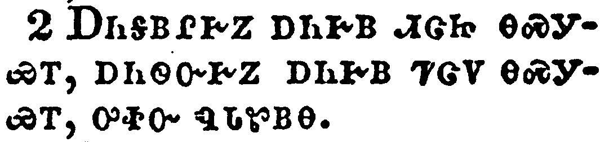</a></td>
</tr>
<tr class="even">
<td>The elder women as mothers; the younger as sisters, with all purity.</td>
</tr>
<tr class="odd">
<td>ᎠᎾᎦᏴᎵᎨᏃ ᎠᏂᎨᏴ ᏗᏣᏥ ᎾᏍᎩᏯᎢ, ᎠᏂᏫᏅᎨᏃ ᎠᏂᎨᏴ ᏤᏣᏙ ᎾᏍᎩᏯᎢ, ᎤᏐᏅ ᏄᏓᏑᏴᎾ.</td>
</tr>
<tr class="even">
<td>A-na-ga-yv-li-ge-no a-ni-ge-yv di-tsa-tsi na-s-gi-ya-i, a-ni-wi-nv-ge-no a-ni-ge-yv tse-tsa-do na-s-gi-ya-i, u-so-nv nu-da-su-yv-na.</td>
</tr>
</tbody>
</table>

<table>
<tbody>
<tr class="odd">
<td></td>
</tr>
<tr class="even">
<td>Honour widows that are widows indeed.</td>
</tr>
<tr class="odd">
<td>ᏕᎯᎸᏉᏕᏍᏗ ᏧᏃᏑᎶᏨᎯ, ᎢᏳᏃ ᎤᏙᎯᏳᏒ ᏧᏃᏑᎶᏨᎯ ᏱᎩ.</td>
</tr>
<tr class="even">
<td>De-hi-lv-quo-de-s-di tsu-no-su-lo-tsv-hi, i-yu-no u-do-hi-yu-sv tsu-no-su-lo-tsv-hi yi-gi.</td>
</tr>
</tbody>
</table>

<table>
<tbody>
<tr class="odd">
<td></td>
</tr>
<tr class="even">
<td>But if any widow have children or nephews, let them learn first to shew piety at home, and to requite their parents: for that is good and acceptable before God.</td>
</tr>
<tr class="odd">
<td>ᎢᏳᏍᎩᏂ ᎩᎶ ᎤᏬᏑᎶᏨᎯ ᏧᏪᏥ ᎠᎴ ᏧᎵᏏ ᏯᏁᎭ, ᎾᏍᎩ ᎠᎾᏕᎶᏆᏍᎨᏍᏗ ᏧᏂᎸᏉᏙᏗᏱ ᏙᏧᏁᏅᏒ ᎠᏁᎯ, ᎠᎴ ᏧᎾᎫᏴᎡᏗᏱ ᏧᏂᎦᏴᎵᎨᎢ; ᎾᏍᎩᏰᏃ ᎣᏏᏳ, ᎠᎴ ᏧᏓᏂᎸᎢᏍᏗᏳ ᎤᏁᎳᏅᎯ ᎠᎦᏔᎲᎢ.</td>
</tr>
<tr class="even">
<td>I-yu-s-gi-ni gi-lo u-wo-su-lo-tsv-hi tsu-we-tsi a-le tsu-li-si ya-ne-ha, na-s-gi a-na-de-lo-qua-s-ge-s-di tsu-ni-lv-quo-do-di-yi do-tsu-ne-nv-sv a-ne-hi, a-le tsu-na-gu-yv-e-di-yi tsu-ni-ga-yv-li-ge-i; na-s-gi-ye-no o-si-yu, a-le tsu-da-ni-lv-i-s-di-yu U-ne-la-nv-hi a-ga-ta-hv-i.</td>
</tr>
</tbody>
</table>

<table>
<tbody>
<tr class="odd">
<td><a href="150505.png">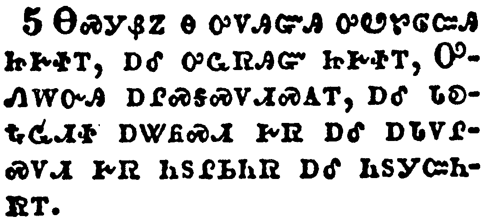</a></td>
</tr>
<tr class="even">
<td>Now she that is a widow indeed, and desolate, trusteth in God, and continueth in supplications and prayers night and day.</td>
</tr>
<tr class="odd">
<td>ᎾᏍᎩᏰᏃ Ꮎ ᎤᏙᎯᏳᎯ ᎤᏬᏑᎶᏨᎯ ᏥᎨᏐᎢ, ᎠᎴ ᎤᏩᏒᎯᏳ ᏥᎨᏐᎢ, ᎤᏁᎳᏅᎯ ᎠᎵᏍᎦᏍᏙᏗᏍᎪᎢ, ᎠᎴ ᏓᎧᎿᎭᏩᏗᏐ ᎠᏔᏲᏍᏗ ᎨᏒ ᎠᎴ ᎠᏓᏙᎵᏍᏙᏗ ᎨᏒ ᏂᏚᎵᏏᏂᏒ ᎠᎴ ᏂᏚᎩᏨᏂᏒᎢ.</td>
</tr>
<tr class="even">
<td>Na-s-gi-ye-no na u-do-hi-yu-hi u-wo-su-lo-tsv-hi tsi-ge-so-i, a-le u-wa-sv-hi-yu tsi-ge-so-i, U-ne-la-nv-hi a-li-s-ga-s-do-di-s-go-i, a-le da-ka-hna-wa-di-so a-ta-yo-s-di ge-sv a-le a-da-do-li-s-do-di ge-sv ni-du-li-si-ni-sv a-le ni-du-gi-tsv-ni-sv-i.</td>
</tr>
</tbody>
</table>

<table>
<tbody>
<tr class="odd">
<td><a href="150506.png">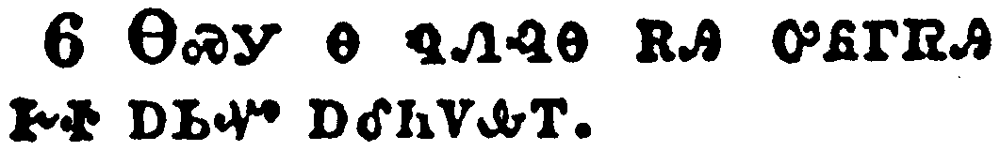</a></td>
</tr>
<tr class="even">
<td>But she that liveth in pleasure is dead while she liveth.</td>
</tr>
<tr class="odd">
<td>ᎾᏍᎩ Ꮎ ᏄᏁᎸᎾ ᎡᎯ ᎤᏲᎱᏒᎯ ᎨᏐ ᎠᏏᏉ ᎠᎴᏂᏙᎲᎢ.</td>
</tr>
<tr class="even">
<td>Na-s-gi na nu-ne-lv-na e-hi u-yo-hu-sv-hi ge-so a-si-quo a-le-ni-do-hv-i.</td>
</tr>
</tbody>
</table>

<table>
<tbody>
<tr class="odd">
<td><a href="150507.png">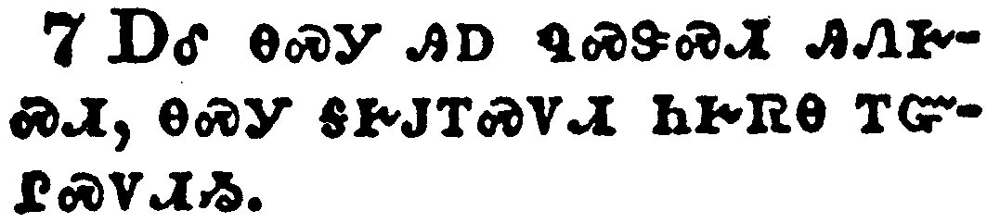</a></td>
</tr>
<tr class="even">
<td>And these things give in charge, that they may be blameless.</td>
</tr>
<tr class="odd">
<td>ᎠᎴ ᎾᏍᎩ ᎯᎠ ᏄᏍᏕᏍᏗ ᎯᏁᎨᏍᏗ, ᎾᏍᎩ ᎦᎨᎫᎢᏍᏙᏗ ᏂᎨᏒᎾ ᎢᏳᎵᏍᏙᏗᏱ.</td>
</tr>
<tr class="even">
<td>A-le na-s-gi hi-a nu-s-de-s-di hi-ne-ge-s-di, na-s-gi ga-ge-gu-i-s-do-di ni-ge-sv-na i-yu-li-s-do-di-yi.</td>
</tr>
</tbody>
</table>

<table>
<tbody>
<tr class="odd">
<td><a href="150508.png">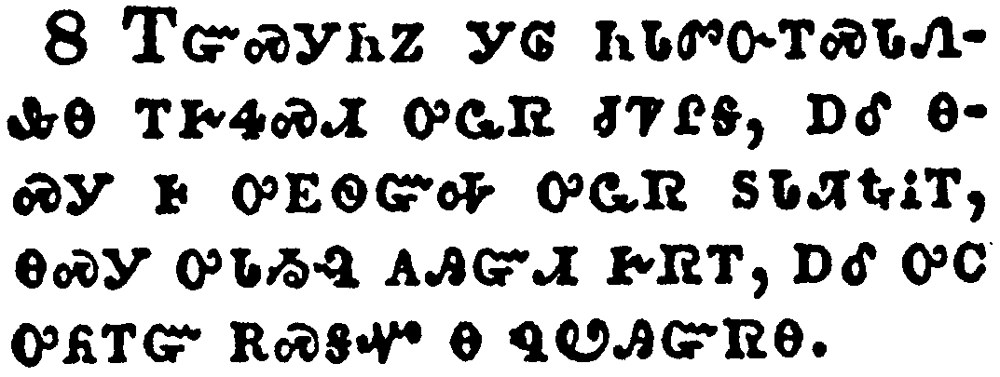</a></td>
</tr>
<tr class="even">
<td>But if any provide not for his own, and specially for those of his own house, he hath denied the faith, and is worse than an infidel.</td>
</tr>
<tr class="odd">
<td>ᎢᏳᏍᎩᏂᏃ ᎩᎶ ᏂᏓᏛᏅᎢᏍᏓᏁᎲᎾ ᎢᎨᏎᏍᏗ ᎤᏩᏒ ᏧᏤᎵᎦ, ᎠᎴ ᎾᏍᎩ Ꮀ ᎤᎬᏫᏳᎭ ᎤᏩᏒ ᏚᏓᏘᎿᎭᎥᎢ, ᎾᏍᎩ ᎤᏓᏱᎸ ᎪᎯᏳᏗ ᎨᏒᎢ, ᎠᎴ ᎤᏟ ᎤᏲᎢᏳ ᎡᏍᎦᏉ Ꮎ ᏄᏬᎯᏳᏒᎾ.</td>
</tr>
<tr class="even">
<td>I-yu-s-gi-ni-no gi-lo ni-da-dv-nv-i-s-da-ne-hv-na i-ge-se-s-di u-wa-sv tsu-tse-li-ga, a-le na-s-gi ho u-gv-wi-yu-ha u-wa-sv du-da-ti-hna-v-i, na-s-gi u-da-yi-lv go-hi-yu-di ge-sv-i, a-le u-tli u-yo-i-yu e-s-ga-quo na nu-wo-hi-yu-sv-na.</td>
</tr>
</tbody>
</table>

<table>
<tbody>
<tr class="odd">
<td><a href="150509.png">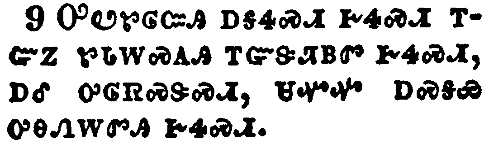</a></td>
</tr>
<tr class="even">
<td>Let not a widow be taken into the number under threescore years old, having been the wife of one man,</td>
</tr>
<tr class="odd">
<td>ᎤᏬᏑᎶᏨᎯ ᎠᎦᏎᏍᏗ ᎨᏎᏍᏗ ᎢᏳᏃ ᏑᏓᎳᏍᎪᎯ ᎢᏳᏕᏘᏴᏛ ᎨᏎᏍᏗ, ᎠᎴ ᎤᎶᏒᏍᏕᏍᏗ, ᏌᏉᏉ ᎠᏍᎦᏯ ᎤᎾᏁᎳᏛᎯ ᎨᏎᏍᏗ.</td>
</tr>
<tr class="even">
<td>U-wo-su-lo-tsv-hi a-ga-se-s-di ge-se-s-di i-yu-no su-da-la-s-go-hi i-yu-de-ti-yv-dv ge-se-s-di, a-le u-lo-sv-s-de-s-di, sa-quo-quo a-s-ga-ya u-na-ne-la-dv-hi ge-se-s-di.</td>
</tr>
</tbody>
</table>

<table>
<tbody>
<tr class="odd">
<td><a href="150510.png">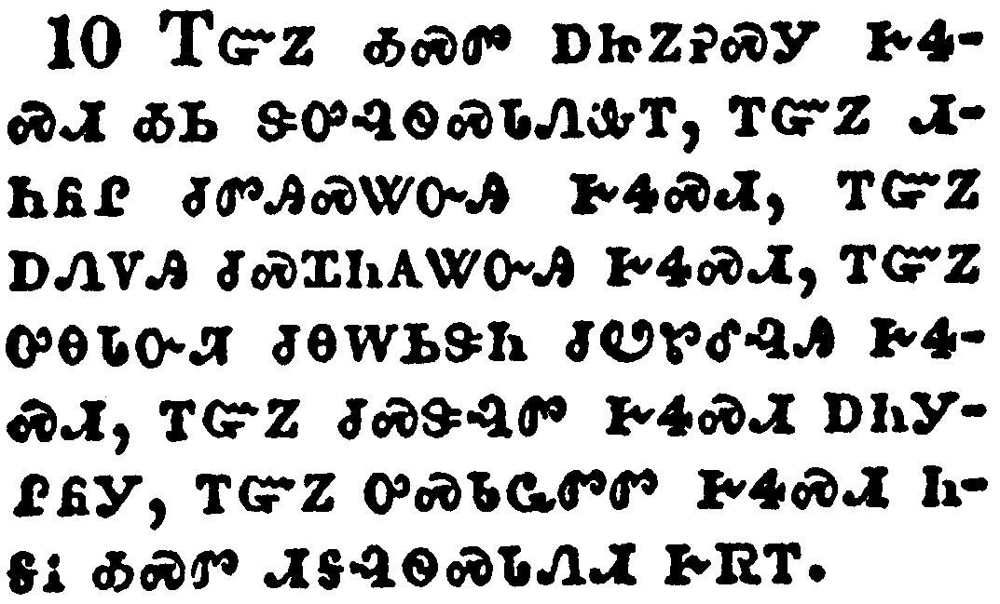</a></td>
</tr>
<tr class="even">
<td>Well reported of for good works; if she have brought up children, if she have lodged strangers, if she have washed the saints' feet, if she have relieved the afflicted, if she have diligently followed every good work.</td>
</tr>
<tr class="odd">
<td>ᎢᏳᏃ ᎣᏍᏛ ᎠᏥᏃᎮᏍᎩ ᎨᏎᏍᏗ ᎣᏏ ᏕᎤᎸᏫᏍᏓᏁᎲᎢ, ᎢᏳᏃ ᏗᏂᏲᎵ ᏧᏛᎯᏍᏔᏅᎯ ᎨᏎᏍᏗ, ᎢᏳᏃ ᎠᏁᏙᎯ ᏧᏍᏆᏂᎪᏔᏅᎯ ᎨᏎᏍᏗ, ᎢᏳᏃ ᎤᎾᏓᏅᏘ ᏧᎾᎳᏏᏕᏂ ᏧᏬᏑᎴᎸᎯ ᎨᏎᏍᏗ, ᎢᏳᏃ ᏧᏍᏕᎸᏛ ᎨᏎᏍᏗ ᎠᏂᎩᎵᏲᎩ, ᎢᏳᏃ ᎤᏍᏓᏩᏛᏛ ᎨᏎᏍᏗ ᏂᎦᎥ ᎣᏍᏛ ᏗᎦᎸᏫᏍᏓᏁᏗ ᎨᏒᎢ.</td>
</tr>
<tr class="even">
<td>I-yu-no o-s-dv a-tsi-no-he-s-gi ge-se-s-di o-si de-u-lv-wi-s-da-ne-hv-i, i-yu-no di-ni-yo-li tsu-dv-hi-s-ta-nv-hi ge-se-s-di, i-yu-no a-ne-do-hi tsu-s-qua-ni-go-ta-nv-hi ge-se-s-di, i-yu-no u-na-da-nv-ti tsu-na-la-si-de-ni tsu-wo-su-le-lv-hi ge-se-s-di, i-yu-no tsu-s-de-lv-dv ge-se-s-di a-ni-gi-li-yo-gi, i-yu-no u-s-da-wa-dv-dv ge-se-s-di ni-ga-v o-s-dv di-ga-lv-wi-s-da-ne-di ge-sv-i.</td>
</tr>
</tbody>
</table>

<table>
<tbody>
<tr class="odd">
<td><a href="150511.png">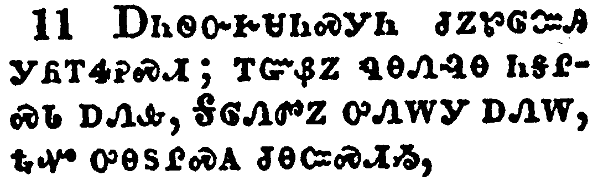</a></td>
</tr>
<tr class="even">
<td>But the younger widows refuse: for when they have begun to wax wanton against Christ, they will marry;</td>
</tr>
<tr class="odd">
<td>ᎠᏂᏫᏅᎨᏌᏂᏍᎩᏂ ᏧᏃᏑᎶᏨᎯ ᎩᏲᎢᏎᎮᏍᏗ; ᎢᏳᏰᏃ ᏄᎾᏁᎸᎾ ᏂᎦᎵᏍᏓ ᎠᏁᎲ, ᎦᎶᏁᏛᏃ ᎤᏁᎳᎩ ᎠᏁᎳ, ᎿᎭᏉ ᎤᎾᏚᎵᏍᎪ ᏧᎾᏨᏍᏗᏱ,</td>
</tr>
<tr class="even">
<td>A-ni-wi-nv-ge-sa-ni-s-gi-ni tsu-no-su-lo-tsv-hi gi-yo-i-se-he-s-di; i-yu-ye-no nu-na-ne-lv-na ni-ga-li-s-da a-ne-hv, Ga-lo-ne-dv-no u-ne-la-gi a-ne-la, hna-quo u-na-du-li-s-go tsu-na-tsv-s-di-yi,</td>
</tr>
</tbody>
</table>

<table>
<tbody>
<tr class="odd">
<td><a href="150512.png">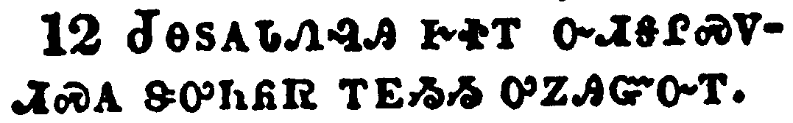</a></td>
</tr>
<tr class="even">
<td>Having damnation, because they have cast off their first faith.</td>
</tr>
<tr class="odd">
<td>ᏧᎾᏚᎪᏓᏁᎸᎯ ᎨᏐᎢ ᏅᏗᎦᎵᏍᏙᏗᏍᎪ ᏕᎤᏂᏲᏒ ᎢᎬᏱᏱ ᎤᏃᎯᏳᏅᎢ.</td>
</tr>
<tr class="even">
<td>Tsu-na-du-go-da-ne-lv-hi ge-so-i nv-di-ga-li-s-do-di-s-go de-u-ni-yo-sv i-gv-yi-yi u-no-hi-yu-nv-i.</td>
</tr>
</tbody>
</table>

<table>
<tbody>
<tr class="odd">
<td><a href="150513.png">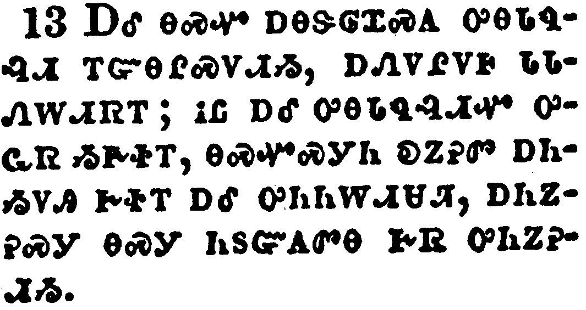</a></td>
</tr>
<tr class="even">
<td>And withal they learn to be idle, wandering about from house to house; and not only idle, but tattlers also and busybodies, speaking things which they ought not.</td>
</tr>
<tr class="odd">
<td>ᎠᎴ ᎾᏍᏉ ᎠᎾᏕᎶᏆᏍᎪ ᎤᎾᏓᏄᎸᏗ ᎢᏳᎾᎵᏍᏙᏗᏱ, ᎠᏁᏙᎵᏙᎰ ᏓᏓᏁᎳᏗᏒᎢ; ᎥᏝ ᎠᎴ ᎤᎾᏓᏄᎸᏗᏉ ᎤᏩᏒ ᏱᎨᏐᎢ, ᎾᏍᏉᏍᎩᏂ ᎧᏃᎮᏛ ᎠᏂᏱᏙᎯ ᎨᏐᎢ ᎠᎴ ᎤᏂᏂᎳᏗᏌᏘ, ᎠᏂᏃᎮᏍᎩ ᎾᏍᎩ ᏂᏚᏳᎪᏛᎾ ᎨᏒ ᎤᏂᏃᎮᏗᏱ.</td>
</tr>
<tr class="even">
<td>A-le na-s-quo a-na-de-lo-qua-s-go u-na-da-nu-lv-di i-yu-na-li-s-do-di-yi, a-ne-do-li-do-ho da-da-ne-la-di-sv-i; v-tla a-le u-na-da-nu-lv-di-quo u-wa-sv yi-ge-so-i, na-s-quo-s-gi-ni ka-no-he-dv a-ni-yi-do-hi ge-so-i a-le u-ni-ni-la-di-sa-ti, a-ni-no-he-s-gi na-s-gi ni-du-yu-go-dv-na ge-sv u-ni-no-he-di-yi.</td>
</tr>
</tbody>
</table>

<table>
<tbody>
<tr class="odd">
<td><a href="150514.png">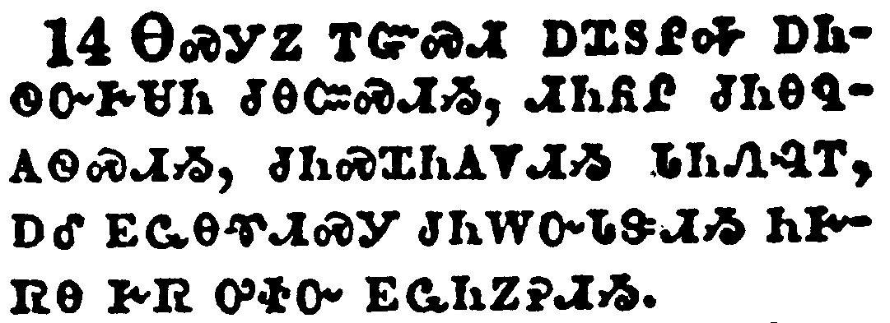</a></td>
</tr>
<tr class="even">
<td>I will therefore that the younger women marry, bear children, guide the house, give none occasion to the adversary to speak reproachfully.</td>
</tr>
<tr class="odd">
<td>ᎾᏍᎩᏃ ᎢᏳᏍᏗ ᎠᏆᏚᎵᎭ ᎠᏂᏫᏅᎨᏌᏂ ᏧᎾᏨᏍᏗᏱ, ᏗᏂᏲᎵ ᏧᏂᎾᏄᎪᏫᏍᏗᏱ, ᏧᏂᏍᏆᏂᎪᏙᏗᏱ ᏓᏂᏁᎸᎢ, ᎠᎴ ᎬᏩᎾᏡᏗᏍᎩ ᏧᏂᎳᏅᏓᏕᏗᏱ ᏂᎨᏒᎾ ᎨᏒ ᎤᏐᏅ ᎬᏩᏂᏃᎮᏗᏱ.</td>
</tr>
<tr class="even">
<td>Na-s-gi-no i-yu-s-di a-qua-du-li-ha a-ni-wi-nv-ge-sa-ni tsu-na-tsv-s-di-yi, di-ni-yo-li tsu-ni-na-nu-go-wi-s-di-yi, tsu-ni-s-qua-ni-go-do-di-yi da-ni-ne-lv-i, a-le gv-wa-na-tlu-di-s-gi tsu-ni-la-nv-da-de-di-yi ni-ge-sv-na ge-sv u-so-nv gv-wa-ni-no-he-di-yi.</td>
</tr>
</tbody>
</table>

<table>
<tbody>
<tr class="odd">
<td><a href="150515.png">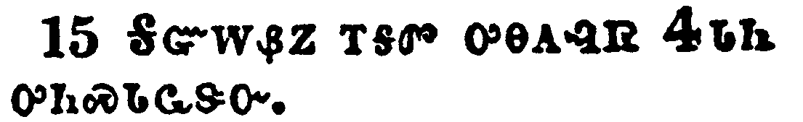</a></td>
</tr>
<tr class="even">
<td>For some are already turned aside after Satan.</td>
</tr>
<tr class="odd">
<td>ᎦᏳᎳᏰᏃ ᎢᎦᏛ ᎤᎾᎪᎸᏒ ᏎᏓᏂ ᎤᎾᏍᏓᏩᏕᏅ.</td>
</tr>
<tr class="even">
<td>Ga-yu-la-ye-no i-ga-dv u-na-go-lv-sv Se-da-ni u-na-s-da-wa-de-nv.</td>
</tr>
</tbody>
</table>

<table>
<tbody>
<tr class="odd">
<td><a href="150516.png">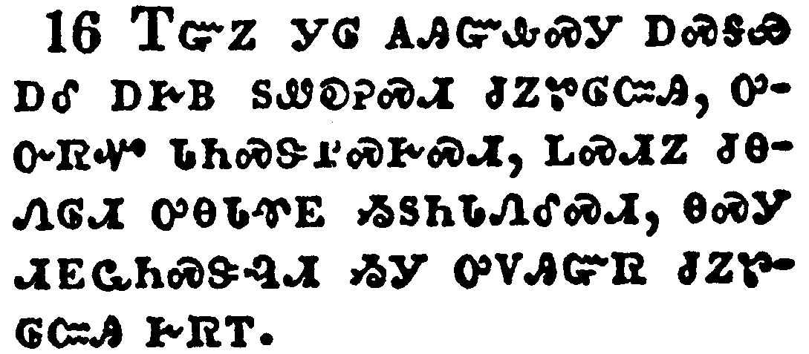</a></td>
</tr>
<tr class="even">
<td>If any man or woman that believeth have widows, let them relieve them, and let not the church be charged; that it may relieve them that are widows indeed.</td>
</tr>
<tr class="odd">
<td>ᎢᏳᏃ ᎩᎶ ᎪᎯᏳᎲᏍᎩ ᎠᏍᎦᏯ ᎠᎴ ᎠᎨᏴ ᏚᏪᎧᎮᏍᏗ ᏧᏃᏑᎶᏨᎯ, ᎤᏅᏒᏉ ᏗᏂᏍᏕᎵᏍᎨᏍᏗ, ᏞᏍᏗᏃ ᏧᎾᏁᎶᏗ ᎤᎾᏓᏡᎬ ᏱᏚᏂᏓᏁᎴᏍᏗ, ᎾᏍᎩ ᏗᎬᏩᏂᏍᏕᎸᏗ ᏱᎩ ᎤᏙᎯᏳᏒ ᏧᏃᏑᎶᏨᎯ ᎨᏒᎢ.</td>
</tr>
<tr class="even">
<td>I-yu-no gi-lo go-hi-yu-hv-s-gi a-s-ga-ya a-le a-ge-yv du-we-ka-he-s-di tsu-no-su-lo-tsv-hi, u-nv-sv-quo di-ni-s-de-li-s-ge-s-di, tle-s-di-no tsu-na-ne-lo-di u-na-da-tlu-gv yi-du-ni-da-ne-le-s-di, na-s-gi di-gv-wa-ni-s-de-lv-di yi-gi u-do-hi-yu-sv tsu-no-su-lo-tsv-hi ge-sv-i.</td>
</tr>
</tbody>
</table>

<table>
<tbody>
<tr class="odd">
<td><a href="150517.png">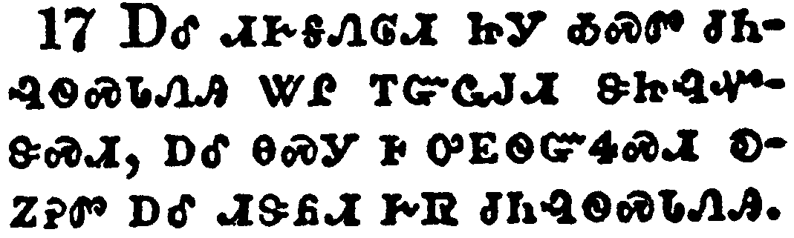</a></td>
</tr>
<tr class="even">
<td>Let the elders that rule well be counted worthy of double honour, especially they who labour in the word and doctrine.</td>
</tr>
<tr class="odd">
<td>ᎠᎴ ᏗᎨᎦᏁᎶᏗ ᏥᎩ ᎣᏍᏛ ᏧᏂᎸᏫᏍᏓᏁᎯ ᏔᎵ ᎢᏳᏩᎫᏗ ᏕᏥᎸᏉᏕᏍᏗ, ᎠᎴ ᎾᏍᎩ Ꮀ ᎤᎬᏫᏳᏎᏍᏗ ᎧᏃᎮᏛ ᎠᎴ ᏗᏕᏲᏗ ᎨᏒ ᏧᏂᎸᏫᏍᏓᏁᎯ.</td>
</tr>
<tr class="even">
<td>A-le di-ge-ga-ne-lo-di tsi-gi o-s-dv tsu-ni-lv-wi-s-da-ne-hi ta-li i-yu-wa-gu-di de-tsi-lv-quo-de-s-di, a-le na-s-gi ho u-gv-wi-yu-se-s-di ka-no-he-dv a-le di-de-yo-di ge-sv tsu-ni-lv-wi-s-da-ne-hi.</td>
</tr>
</tbody>
</table>

<table>
<tbody>
<tr class="odd">
<td><a href="150518.png">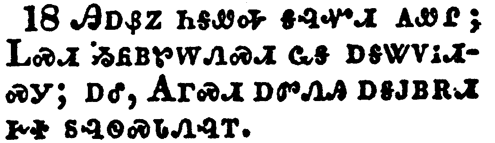</a></td>
</tr>
<tr class="even">
<td>For the scripture saith, Thou shalt not muzzle the ox that treadeth out the corn. And, The labourer is worthy of his reward.</td>
</tr>
<tr class="odd">
<td>ᎯᎠᏰᏃ ᏂᎦᏛᎭ ᎦᎸᏉᏗ ᎪᏪᎵ; ᏞᏍᏗ ᏱᏲᏴᏑᎳᏁᏍᏗ ᏩᎦ ᎠᎦᏔᏙᎥᏗᏍᎩ; ᎠᎴ, ᎪᎱᏍᏗ ᎠᏛᏁᎯ ᎠᎦᎫᏴᎡᏗ ᎨᏐ ᏚᎸᏫᏍᏓᏁᎸᎢ.</td>
</tr>
<tr class="even">
<td>Hi-a-ye-no ni-ga-dv-ha ga-lv-quo-di go-we-li; Tle-s-di yi-yo-yv-su-la-ne-s-di wa-ga a-ga-ta-do-v-di-s-gi; a-le, Go-hu-s-di a-dv-ne-hi a-ga-gu-yv-e-di ge-so du-lv-wi-s-da-ne-lv-i.</td>
</tr>
</tbody>
</table>

<table>
<tbody>
<tr class="odd">
<td><a href="150519.png">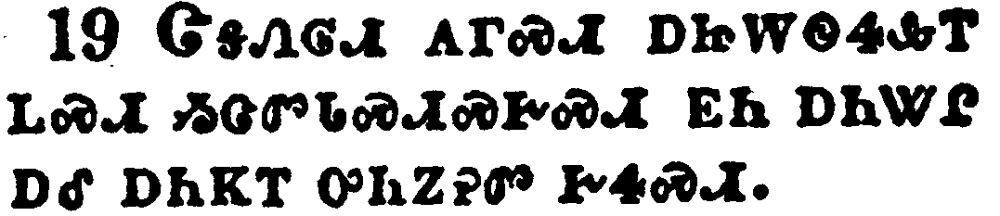</a></td>
</tr>
<tr class="even">
<td>Against an elder receive not an accusation, but before two or three witnesses.</td>
</tr>
<tr class="odd">
<td>ᏣᎦᏁᎶᏗ ᎪᎱᏍᏗ ᎠᏥᎳᏫᏎᎲᎢ ᏞᏍᏗ ᏱᏣᏛᏓᏍᏗᏍᎨᏍᏗ ᎬᏂ ᎠᏂᏔᎵ ᎠᎴ ᎠᏂᏦᎢ ᎤᏂᏃᎮᏛ ᎨᏎᏍᏗ.</td>
</tr>
<tr class="even">
<td>Tsa-ga-ne-lo-di go-hu-s-di a-tsi-la-wi-se-hv-i tle-s-di yi-tsa-dv-da-s-di-s-ge-s-di gv-ni a-ni-ta-li a-le a-ni-tso-i u-ni-no-he-dv ge-se-s-di.</td>
</tr>
</tbody>
</table>

<table>
<tbody>
<tr class="odd">
<td><a href="150520.png">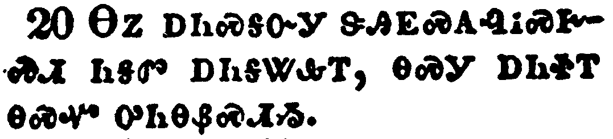</a></td>
</tr>
<tr class="even">
<td>Them that sin rebuke before all, that others also may fear.</td>
</tr>
<tr class="odd">
<td>ᎾᏃ ᎠᏂᏍᎦᏅᎩ ᏕᎯᎬᏍᎪᎸᎥᏍᎨᏍᏗ ᏂᎦᏛ ᎠᏂᎦᏔᎲᎢ, ᎾᏍᎩ ᎠᏂᏐᎢ ᎾᏍᏉ ᎤᏂᎾᏰᏍᏗᏱ.</td>
</tr>
<tr class="even">
<td>Na-no a-ni-s-ga-nv-gi de-hi-gv-s-go-lv-v-s-ge-s-di ni-ga-dv a-ni-ga-ta-hv-i, na-s-gi a-ni-so-i na-s-quo u-ni-na-ye-s-di-yi.</td>
</tr>
</tbody>
</table>

<table>
<tbody>
<tr class="odd">
<td><a href="150521.png">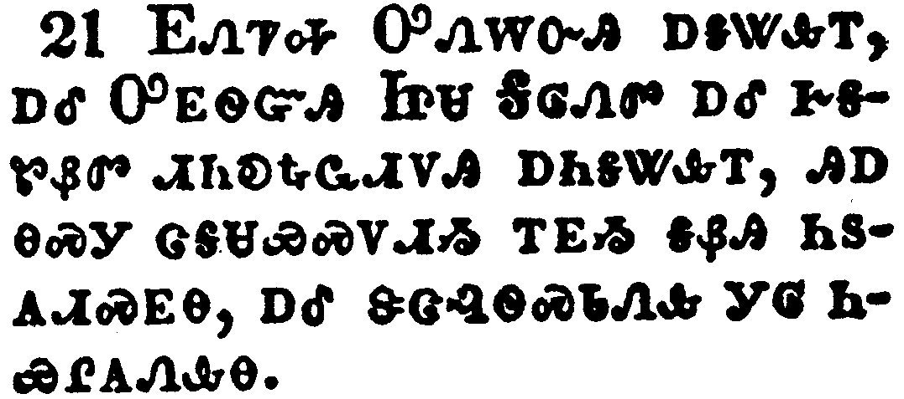</a></td>
</tr>
<tr class="even">
<td>I charge thee before God, and the Lord Jesus Christ, and the elect angels, that thou observe these things without preferring one before another, doing nothing by partiality.</td>
</tr>
<tr class="odd">
<td>ᎬᏁᏤᎭ ᎤᏁᎳᏅᎯ ᎠᎦᏔᎲᎢ, ᎠᎴ ᎤᎬᏫᏳᎯ ᏥᏌ ᎦᎶᏁᏛ ᎠᎴ ᎨᎦᏑᏰᏛ ᏗᏂᎧᎿᎭᏩᏗᏙᎯ ᎠᏂᎦᏔᎲᎢ, ᎯᎠ ᎾᏍᎩ ᏣᎦᏌᏯᏍᏙᏗᏱ ᎢᎬᏱ ᎦᏰᎯ ᏂᏚᎪᏗᏍᎬᎾ, ᎠᎴ ᏕᏣᎸᏫᏍᏓᏁᎲ ᎩᎶ ᏂᏯᎵᎪᏁᎲᎾ.</td>
</tr>
<tr class="even">
<td>Gv-ne-tse-ha U-ne-la-nv-hi a-ga-ta-hv-i, a-le U-gv-wi-yu-hi Tsi-sa Ga-lo-ne-dv a-le ge-ga-su-ye-dv di-ni-ka-hna-wa-di-do-hi a-ni-ga-ta-hv-i, hi-a na-s-gi tsa-ga-sa-ya-s-do-di-yi i-gv-yi ga-ye-hi ni-du-go-di-s-gv-na, a-le de-tsa-lv-wi-s-da-ne-hv gi-lo ni-ya-li-go-ne-hv-na.</td>
</tr>
</tbody>
</table>

<table>
<tbody>
<tr class="odd">
<td><a href="150522.png">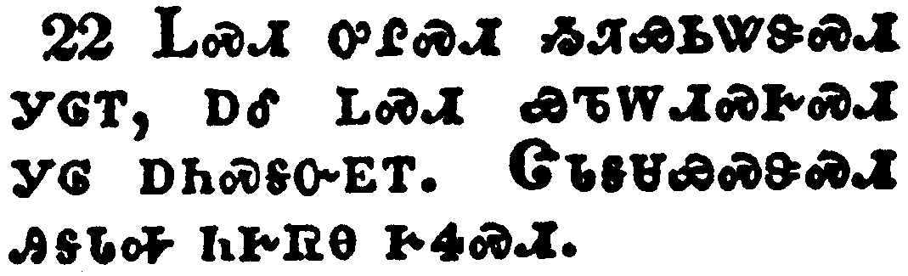</a></td>
</tr>
<tr class="even">
<td>Lay hands suddenly on no man, neither be partaker of other men's sins: keep thyself pure.</td>
</tr>
<tr class="odd">
<td>ᏞᏍᏗ ᎤᎵᏍᏗ ᏱᏘᏯᏏᏔᏕᏍᏗ ᎩᎶᎢ, ᎠᎴ ᏞᏍᏗ ᏯᏖᎳᏗᏍᎨᏍᏗ ᎩᎶ ᎠᏂᏍᎦᏅᎬᎢ. ᏣᏓᎦᏌᏯᏍᏕᏍᏗ ᎯᎦᏓᎭ ᏂᎨᏒᎾ ᎨᏎᏍᏗ.</td>
</tr>
<tr class="even">
<td>Tle-s-di u-li-s-di yi-ti-ya-si-ta-de-s-di gi-lo-i, a-le tle-s-di ya-te-la-di-s-ge-s-di gi-lo a-ni-s-ga-nv-gv-i. Tsa-da-ga-sa-ya-s-de-s-di hi-ga-da-ha ni-ge-sv-na ge-se-s-di.</td>
</tr>
</tbody>
</table>

<table>
<tbody>
<tr class="odd">
<td><a href="150523.png">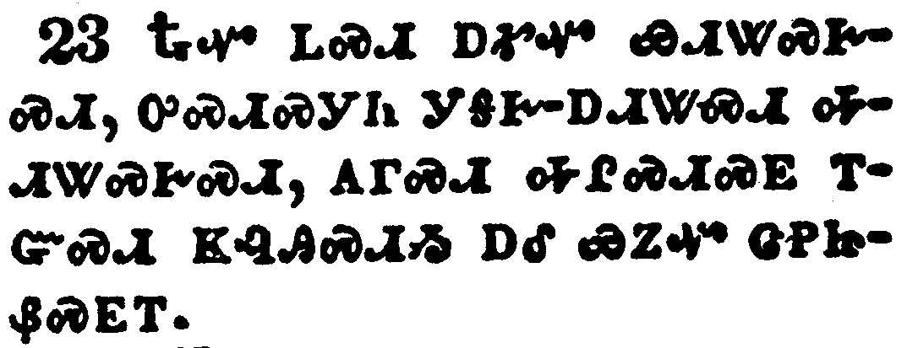</a></td>
</tr>
<tr class="even">
<td>Drink no longer water, but use a little wine for thy stomach's sake and thine often infirmities.</td>
</tr>
<tr class="odd">
<td>ᎿᎭᏉ ᏞᏍᏗ ᎠᎹᏉ ᏯᏗᏔᏍᎨᏍᏗ, ᎤᏍᏗᏍᎩᏂ ᎩᎦᎨ-ᎠᏗᏔᏍᏗ ᎭᏗᏔᏍᎨᏍᏗ, ᎪᎱᏍᏗ ᎭᎵᏍᏗᏍᎬ ᎢᏳᏍᏗ ᏦᎸᎯᏍᏗᏱ ᎠᎴ ᏯᏃᏉ ᏣᏢᏥᏰᏍᎬᎢ.</td>
</tr>
<tr class="even">
<td>Hna-quo tle-s-di a-ma-quo ya-di-ta-s-ge-s-di, u-s-di-s-gi-ni gi-ga-ge--a-di-ta-s-di ha-di-ta-s-ge-s-di, go-hu-s-di ha-li-s-di-s-gv i-yu-s-di tso-lv-hi-s-di-yi a-le ya-no-quo tsa-tlv-tsi-ye-s-gv-i.</td>
</tr>
</tbody>
</table>

<table>
<tbody>
<tr class="odd">
<td><a href="150524.png">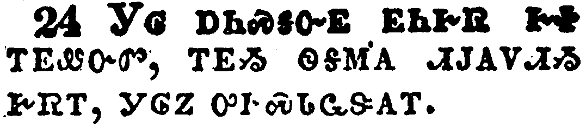</a></td>
</tr>
<tr class="even">
<td>Some men's sins are open beforehand, going before to judgment; and some men they follow after.</td>
</tr>
<tr class="odd">
<td>ᎩᎶ ᎠᏂᏍᎦᏅᎬ ᎬᏂᎨᏒ ᎨᏐ ᎢᎬᏪᏅᏛ, ᎢᎬᏱ ᏫᎦᎷᎪ ᏗᎫᎪᏙᏗᏱ ᎨᏒᎢ, ᎩᎶᏃ ᎤᎨᏍᏓᏩᏕᎪᎢ.</td>
</tr>
<tr class="even">
<td>Gi-lo a-ni-s-ga-nv-gv gv-ni-ge-sv ge-so i-gv-we-nv-dv, i-gv-yi wi-ga-lu-go di-gu-go-do-di-yi ge-sv-i, gi-lo-no u-ge-s-da-wa-de-go-i.</td>
</tr>
</tbody>
</table>

<table>
<tbody>
<tr class="odd">
<td><a href="150525.png">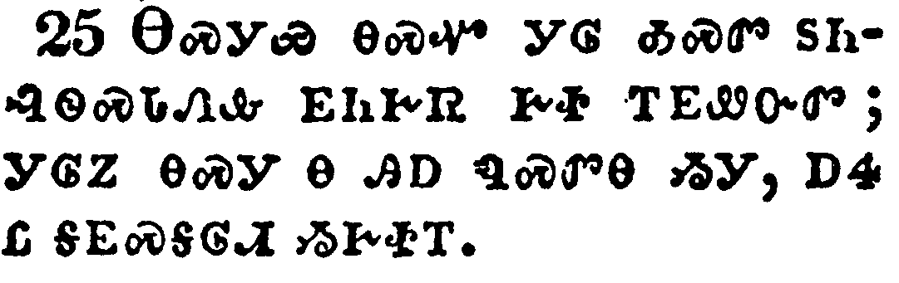</a></td>
</tr>
<tr class="even">
<td>Likewise also the good works of some are manifest beforehand; and they that are otherwise cannot be hid.</td>
</tr>
<tr class="odd">
<td>ᎾᏍᎩᏯ ᎾᏍᏉ ᎩᎶ ᎣᏍᏛ ᏚᏂᎸᏫᏍᏓᏁᎲ ᎬᏂᎨᏒ ᎨᏐ ᎢᎬᏪᏅᏛ; ᎩᎶᏃ ᎾᏍᎩ Ꮎ ᎯᎠ ᏄᏍᏛᎾ ᏱᎩ, ᎠᏎ Ꮭ ᎦᎬᏍᎦᎶᏗ ᏱᎨᏐᎢ.</td>
</tr>
<tr class="even">
<td>Na-s-gi-ya na-s-quo gi-lo o-s-dv du-ni-lv-wi-s-da-ne-hv gv-ni-ge-sv ge-so i-gv-we-nv-dv; gi-lo-no na-s-gi na hi-a nu-s-dv-na yi-gi, a-se tla ga-gv-s-ga-lo-di yi-ge-so-i.</td>
</tr>
</tbody>
</table>

