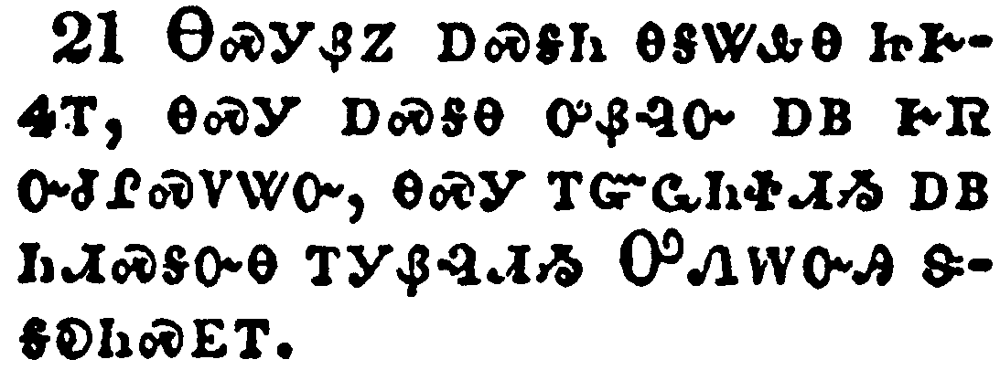

+++
draft=false
date = 2014-12-18T21:11:07Z
title = "2 Corinthians - Chapter 5 - Cherokee New Testament"
weight = 1418955067

[taxonomies]

authors = ["Timothy Legg"]
categories = []
tags = []

[extra]
+++

<table>
<tbody>
<tr class="odd">
<td></td>
</tr>
<tr class="even">
<td>For we know that if our earthly house of this tabernacle were dissolved, we have a building of God, an house not made with hands, eternal in the heavens.</td>
</tr>
<tr class="odd">
<td>ᎣᏥᎦᏔᎭᏰᏃ ᎾᏍᎩ ᎢᏳᏃ ᎡᎶᎯ ᎡᎯ ᎣᏥᏁᎸ ᎣᎩᎵᏦᏛ ᏳᏲᏨ, ᎣᎩᎭ ᎠᏓᏁᎸ ᎤᏁᎳᏅᎯ ᏅᏓᏳᏓᎴᏅᎯ, ᎠᏓᏁᎸ ᏧᏬᏱ ᏗᎬᏔᏅᎯ ᏂᎨᏒᎾ ᎠᏁᏍᎨᎲᎯ, ᎠᏲᎩ ᏂᎨᏒᎾ ᎦᎸᎶᎢ ᏗᏓᏁᎸ.</td>
</tr>
<tr class="even">
<td>O-tsi-ga-ta-ha-ye-no na-s-gi i-yu-no e-lo-hi e-hi o-tsi-ne-lv o-gi-li-tso-dv yu-yo-tsv, o-gi-ha a-da-ne-lv U-ne-la-nv-hi nv-da-yu-da-le-nv-hi, a-da-ne-lv tsu-wo-yi di-gv-ta-nv-hi ni-ge-sv-na a-ne-s-ge-hv-hi, a-yo-gi ni-ge-sv-na ga-lv-lo-i di-da-ne-lv.</td>
</tr>
</tbody>
</table>

<table>
<tbody>
<tr class="odd">
<td></td>
</tr>
<tr class="even">
<td>For in this we groan, earnestly desiring to be clothed upon with our house which is from heaven:</td>
</tr>
<tr class="odd">
<td>ᎠᏂᏰᏃ ᎣᏥᏯᎥ ᎣᎩᎵᏰᏗᎭ, ᎤᏣᏘ ᎣᎦᏚᎵᎭ ᎣᎦᏄᏬᏍᏙᏗᏱ ᎣᏥᏁᎸ ᎾᏍᎩ Ꮎ ᎦᎸᎶ ᏅᏓᏳᏓᎴᏅᎯ;</td>
</tr>
<tr class="even">
<td>A-ni-ye-no o-tsi-ya-v o-gi-li-ye-di-ha, u-tsa-ti o-ga-du-li-ha o-ga-nu-wo-s-do-di-yi o-tsi-ne-lv na-s-gi na ga-lv-lo nv-da-yu-da-le-nv-hi;</td>
</tr>
</tbody>
</table>

<table>
<tbody>
<tr class="odd">
<td></td>
</tr>
<tr class="even">
<td>If so be that being clothed we shall not be found naked.</td>
</tr>
<tr class="odd">
<td>ᎢᏳᏃ ᎰᏩ ᏱᏙᎦᏄᏩᎥ, ᎥᏝ ᏦᎩᏰᎸᎭ ᏱᎦᎨᏎᏍᏗ.</td>
</tr>
<tr class="even">
<td>I-yu-no ho-wa yi-do-ga-nu-wa-v, v-tla tso-gi-ye-lv-ha yi-ga-ge-se-s-di.</td>
</tr>
</tbody>
</table>

<table>
<tbody>
<tr class="odd">
<td></td>
</tr>
<tr class="even">
<td>For we that are in this tabernacle do groan, being burdened: not for that we would be unclothed, but clothed upon, that mortality might be swallowed up of life.</td>
</tr>
<tr class="odd">
<td>ᎠᏴᏰᏃ ᎯᎠ ᎠᏂ ᎦᎵᏦᏛ ᏦᏥᏯᎠ ᎣᎩᎵᏰᏗᎭ, ᏂᎦᎵᏍᏙᏗᎭ ᎦᎨᏛ ᏃᎦᏛᎿᎭᏕᎬᎢ; ᎥᏝ ᏦᎩᏄᏪᏍᏗᏱ ᎣᎦᏚᎵᏍᎬ ᏱᏅᏗᎦᎵᏍᏙᏗᎭ; ᏦᎩᏄᏬᏍᏗᏱᏍᎩᏂ; ᎾᏍᎩ ᎠᏲᎱᏍᎩ ᎨᏒ ᎠᏥᎩᏍᏗᏱ ᎬᏂᏛ ᎤᎩᏐᎲᏍᏗᏱ.</td>
</tr>
<tr class="even">
<td>A-yv-ye-no hi-a a-ni ga-li-tso-dv tso-tsi-ya-a o-gi-li-ye-di-ha, ni-ga-li-s-do-di-ha ga-ge-dv no-ga-dv-hna-de-gv-i; v-tla tso-gi-nu-we-s-di-yi o-ga-du-li-s-gv yi-nv-di-ga-li-s-do-di-ha; tso-gi-nu-wo-s-di-yi-s-gi-ni; na-s-gi a-yo-hu-s-gi ge-sv a-tsi-gi-s-di-yi gv-ni-dv u-gi-so-hv-s-di-yi.</td>
</tr>
</tbody>
</table>

<table>
<tbody>
<tr class="odd">
<td></td>
</tr>
<tr class="even">
<td>Now he that hath wrought us for the selfsame thing is God, who also hath given unto us the earnest of the Spirit.</td>
</tr>
<tr class="odd">
<td>ᎾᏍᎩᏃ Ꮎ ᎢᎪᏢᏅᎯ ᎯᎠ ᎾᏍᎩ ᎤᎬᏩᎵ ᎨᏒ ᎾᏍᎩ ᎤᏁᎳᏅᎯ, ᎾᏍᎩ ᎾᏍᏉ ᏦᎩᏁᎸ ᎠᏓᏅᏙ ᎠᎦᏗᏗᏍᏙᏗ ᎨᏒᎢ.</td>
</tr>
<tr class="even">
<td>Na-s-gi-no na i-go-tlv-nv-hi hi-a na-s-gi u-gv-wa-li ge-sv na-s-gi U-ne-la-nv-hi, na-s-gi na-s-quo tso-gi-ne-lv A-da-nv-do a-ga-di-di-s-do-di ge-sv-i.</td>
</tr>
</tbody>
</table>

<table>
<tbody>
<tr class="odd">
<td></td>
</tr>
<tr class="even">
<td>Therefore we are always confident, knowing that, whilst we are at home in the body, we are absent from the Lord:</td>
</tr>
<tr class="odd">
<td>ᎾᏍᎩ ᎢᏳᏍᏗ ᏂᎪᎯᎸ ᎤᎦᎵᏍᏗ ᎣᎦᏓᏅᏔᏩᏕᎪᎢ, ᎠᎴ ᎣᏥᎦᏔᎭ ᎾᏍᎩ ᏂᎪᎯᎸ ᎣᏥᏁᎸ ᎠᏂ ᏦᏥᏰᎸᎢ, ᎤᎬᏫᏳᎯ ᎡᎲ ᎣᎩᎪᏁᎸᎢ;</td>
</tr>
<tr class="even">
<td>Na-s-gi i-yu-s-di ni-go-hi-lv u-ga-li-s-di o-ga-da-nv-ta-wa-de-go-i, a-le o-tsi-ga-ta-ha na-s-gi ni-go-hi-lv o-tsi-ne-lv a-ni tso-tsi-ye-lv-i, U-gv-wi-yu-hi e-hv o-gi-go-ne-lv-i;</td>
</tr>
</tbody>
</table>

<table>
<tbody>
<tr class="odd">
<td></td>
</tr>
<tr class="even">
<td>(For we walk by faith, not by sight:)</td>
</tr>
<tr class="odd">
<td>ᎪᎯᏳᏗᏰᏃ ᎨᏒ ᎣᏨᏗᎭ ᎣᏤᏙᎲᎢ, ᎥᏝᏃ ᎠᎪᏩᏛᏗ ᎨᏒᎢ.</td>
</tr>
<tr class="even">
<td>Go-hi-yu-di-ye-no ge-sv o-tsv-di-ha o-tse-do-hv-i, v-tla-no a-go-wa-dv-di ge-sv-i.</td>
</tr>
</tbody>
</table>

<table>
<tbody>
<tr class="odd">
<td></td>
</tr>
<tr class="even">
<td>We are confident, I say, and willing rather to be absent from the body, and to be present with the Lord.</td>
</tr>
<tr class="odd">
<td>ᎠᎴ ᎤᎦᎵᏍᏗ ᎣᎦᏓᏅᏔᏩᏕᎪᎢ, ᎠᎴ ᎤᏟ ᎦᏲᎩᏰᎸᏗ ᎠᏰᎸ ᎣᎩᎪᏁᎶᎢᏍᏗᏱ, ᎠᎴ ᎤᎬᏫᏳᎯ ᎡᎲ ᏬᎦᏁᎳᏗᏍᏗᏱ.</td>
</tr>
<tr class="even">
<td>A-le u-ga-li-s-di o-ga-da-nv-ta-wa-de-go-i, a-le u-tli ga-yo-gi-ye-lv-di a-ye-lv o-gi-go-ne-lo-i-s-di-yi, a-le U-gv-wi-yu-hi e-hv wo-ga-ne-la-di-s-di-yi.</td>
</tr>
</tbody>
</table>

<table>
<tbody>
<tr class="odd">
<td></td>
</tr>
<tr class="even">
<td>Wherefore we labour, that, whether present or absent, we may be accepted of him.</td>
</tr>
<tr class="odd">
<td>ᎾᏍᎩ ᎢᏳᏍᏗ ᎣᏣᎵᏂᎬᏁᎭ, ᎾᏍᏉ ᎾᎿᎭᏱᏬᏥᏁᎳ, ᎠᎴ ᏲᎩᎪᏁᎳ, ᏦᎦᏓᏂᎸᎢᏍᏗᏱ ᎢᏳᎵᏍᏙᏗᏱ.</td>
</tr>
<tr class="even">
<td>Na-s-gi i-yu-s-di o-tsa-li-ni-gv-ne-ha, na-s-quo na-hna yi-wo-tsi-ne-la, a-le yo-gi-go-ne-la, tso-ga-da-ni-lv-i-s-di-yi i-yu-li-s-do-di-yi.</td>
</tr>
</tbody>
</table>

<table>
<tbody>
<tr class="odd">
<td></td>
</tr>
<tr class="even">
<td>For we must all appear before the judgment seat of Christ; that every one may receive the things done in his body, according to that he hath done, whether it be good or bad.</td>
</tr>
<tr class="odd">
<td>ᎠᏴᏰᏃ ᏂᏗᎥ ᎢᎬᏱᏗᏢ ᏫᎩᎾᏄᎪᎢᏍᏗ ᎨᏎᏍᏗ ᎦᎶᏁᏛ ᏧᏭᎪᏙᏗᏱ ᎦᏍᎩᎸᎢ; ᎾᏍᎩ ᏂᏗᎥ ᎢᏗᏏᏴᏫᎭ ᎡᎩᏁᏗᏱ ᏄᏍᏛ ᏕᎩᎸᏫᏍᏓᏁᎸ ᏗᏗᏰᎸ ᎬᏗ, ᎾᏍᎩᏯ ᏂᎦᏛᏁᎵᏙᎸᎢ, ᎣᏏᏳ ᏱᎾᎩ, ᎠᎴ ᎤᏲ ᏱᎾᎩ.</td>
</tr>
<tr class="even">
<td>A-yv-ye-no ni-di-v i-gv-yi-di-tlv wi-gi-na-nu-go-i-s-di ge-se-s-di Ga-lo-ne-dv tsu-wu-go-do-di-yi ga-s-gi-lv-i; na-s-gi ni-di-v i-di-si-yv-wi-ha e-gi-ne-di-yi nu-s-dv de-gi-lv-wi-s-da-ne-lv di-di-ye-lv gv-di, na-s-gi-ya ni-ga-dv-ne-li-do-lv-i, o-si-yu yi-na-gi, a-le u-yo yi-na-gi.</td>
</tr>
</tbody>
</table>

<table>
<tbody>
<tr class="odd">
<td></td>
</tr>
<tr class="even">
<td>Knowing therefore the terror of the Lord, we persuade men; but we are made manifest unto God; and I trust also are made manifest in your consciences.</td>
</tr>
<tr class="odd">
<td>ᎾᏍᎩᏃ ᏦᏥᎦᏔᎭ ᎦᎾᏰᎢᏍᏗ ᎨᏒ ᎤᎬᏫᏳᎯ, ᏙᏥᏍᏗᏰᏗ ᏴᏫ; ᎠᎴ ᎬᏂᎨᏒ ᏃᏣᎵᏍᏗᎭ ᎤᏁᎳᏅᎯ ᎠᎦᏔᎲᎢ; ᎠᎴ ᎤᏚᎩ ᎠᏋᎭ ᎬᏂᎨᏒ ᎢᏯᏆᎵᏍᏙᏗᏱ ᎾᏍᏉ ᏂᎯ ᏕᏣᏓᏅᏛᎢ.</td>
</tr>
<tr class="even">
<td>Na-s-gi-no tso-tsi-ga-ta-ha ga-na-ye-i-s-di ge-sv U-gv-wi-yu-hi, do-tsi-s-di-ye-di yv-wi; a-le gv-ni-ge-sv no-tsa-li-s-di-ha U-ne-la-nv-hi a-ga-ta-hv-i; a-le u-du-gi a-quv-ha gv-ni-ge-sv i-ya-qua-li-s-do-di-yi na-s-quo ni-hi de-tsa-da-nv-dv-i.</td>
</tr>
</tbody>
</table>

<table>
<tbody>
<tr class="odd">
<td></td>
</tr>
<tr class="even">
<td>For we commend not ourselves again unto you, but give you occasion to glory on our behalf, that ye may have somewhat to answer them which glory in appearance, and not in heart.</td>
</tr>
<tr class="odd">
<td>ᎥᏝᏰᏃ ᏂᎯ ᏍᎩᎸᏉᏗᏳ ᎢᏳᎵᏍᏙᏗᏱ ᏲᏥᏂᎳᏗᎭ; ᎢᏨᏁᎭᏍᎩᏂ ᏍᎩᎸᏉᏙᏗᏱ, ᎾᏍᎩ ᎪᎱᏍᏗ ᏳᏂᎭ ᏧᎾᏬᎯᎵᏴᏍᏓᏁᏗ, ᎢᏨᏰᎵᏎᎭ, ᎾᏍᎩ ᎦᏚᏉ ᎡᎯ ᎠᎾᏢᏉᏙᏗᏍᎩ ᏥᎩ, ᏙᏧᎾᏓᏅᏛᏃ ᎠᎾᏢᏉᏙᏗᏍᎩ ᏂᎨᏒᎾ.</td>
</tr>
<tr class="even">
<td>V-tla-ye-no ni-hi s-gi-lv-quo-di-yu i-yu-li-s-do-di-yi yo-tsi-ni-la-di-ha; i-tsv-ne-ha-s-gi-ni s-gi-lv-quo-do-di-yi, na-s-gi go-hu-s-di yu-ni-ha tsu-na-wo-hi-li-yv-s-da-ne-di, i-tsv-ye-li-se-ha, na-s-gi ga-du-quo e-hi a-na-tlv-quo-do-di-s-gi tsi-gi, do-tsu-na-da-nv-dv-no a-na-tlv-quo-do-di-s-gi ni-ge-sv-na.</td>
</tr>
</tbody>
</table>

<table>
<tbody>
<tr class="odd">
<td></td>
</tr>
<tr class="even">
<td>For whether we be beside ourselves, it is to God: or whether we be sober, it is for your cause.</td>
</tr>
<tr class="odd">
<td>ᎢᏳᏰᏃ ᏱᏙᎩᎸᏃᏗᎭ, ᎤᏁᎳᏅᎯᏉ ᏅᏗᎦᎵᏍᏙᏗᎭ; ᎢᏳ ᎠᎴ ᏙᎯ ᏱᏙᎦᏓᏅᏔ, ᏂᎯᏉ ᏅᏗᎦᎵᏍᏙᏗᎭ.</td>
</tr>
<tr class="even">
<td>I-yu-ye-no yi-do-gi-lv-no-di-ha, U-ne-la-nv-hi-quo nv-di-ga-li-s-do-di-ha; i-yu a-le do-hi yi-do-ga-da-nv-ta, ni-hi-quo nv-di-ga-li-s-do-di-ha.</td>
</tr>
</tbody>
</table>

<table>
<tbody>
<tr class="odd">
<td></td>
</tr>
<tr class="even">
<td>For the love of Christ constraineth us; because we thus judge, that if one died for all, then were all dead:</td>
</tr>
<tr class="odd">
<td>ᎦᎶᏁᏛᏰᏃ ᎤᏓᎨᏳᏗ ᎨᏒ ᏙᎦᏘᏁᎦ; ᎯᎠᏰᏃ ᏄᏍᏗ ᏙᏧᎪᏗᎭ, ᎾᏍᎩ, ᎢᏳᏃ ᎠᏏᏴᏫ ᎾᏂᎥ ᏱᏚᏲᎱᎯᏎᎸ, ᎿᎭᏉ ᎾᏍᎩ ᎾᏂᎥ ᏚᏂᏲᎱᏒᎩ;</td>
</tr>
<tr class="even">
<td>Ga-lo-ne-dv-ye-no u-da-ge-yu-di ge-sv do-ga-ti-ne-ga; hi-a-ye-no nu-s-di do-tsu-go-di-ha, na-s-gi, i-yu-no a-si-yv-wi na-ni-v yi-du-yo-hu-hi-se-lv, hna-quo na-s-gi na-ni-v du-ni-yo-hu-sv-gi;</td>
</tr>
</tbody>
</table>

<table>
<tbody>
<tr class="odd">
<td></td>
</tr>
<tr class="even">
<td>And that he died for all, that they which live should not henceforth live unto themselves, but unto him which died for them, and rose again.</td>
</tr>
<tr class="odd">
<td>ᎾᏍᎩᏃ ᎾᏂᎥ ᏚᏲᎱᎯᏎᎴᎢ, ᎾᏍᎩ Ꮎ ᏗᏅᏃᏛ ᏥᎩ ᎪᎯ ᎨᏒ ᎢᏳᏓᎴᏅᏛ ᎤᏅᏒᏉ ᎤᎾᏤᎵ ᎤᎬᏩᎵ ᎤᎾᎴᏂᏓᏍᏗᏱ ᏂᎨᏒᎾ, ᎾᏍᎩᏍᎩᏂ Ꮎ ᎤᏤᎵ ᎤᎬᏩᎵ ᏧᏲᎱᎯᏎᎸᎯ ᎠᎴ ᏧᎴᎯᏌᏅᎯ ᏥᎩ.</td>
</tr>
<tr class="even">
<td>Na-s-gi-no na-ni-v du-yo-hu-hi-se-le-i, na-s-gi na di-nv-no-dv tsi-gi go-hi ge-sv i-yu-da-le-nv-dv u-nv-sv-quo u-na-tse-li u-gv-wa-li u-na-le-ni-da-s-di-yi ni-ge-sv-na, na-s-gi-s-gi-ni na u-tse-li u-gv-wa-li tsu-yo-hu-hi-se-lv-hi a-le tsu-le-hi-sa-nv-hi tsi-gi.</td>
</tr>
</tbody>
</table>

<table>
<tbody>
<tr class="odd">
<td></td>
</tr>
<tr class="even">
<td>Wherefore henceforth know we no man after the flesh: yea, though we have known Christ after the flesh, yet now henceforth know we him no more.</td>
</tr>
<tr class="odd">
<td>ᎾᏍᎩ ᎢᏳᏏᏗ ᎪᎯ ᎨᏒ ᎢᏳᏓᎴᏅᏛ ᎥᏝ ᎩᎶ ᏲᏥᎦᏔᎭ ᎾᏍᎩᏯ ᎤᏇᏓᎵ ᎠᎦᏔᎲᎢ. ᎠᎴ ᎾᏍᏉ ᎢᏳ ᎦᎶᏁᏛ ᎣᏥᎦᏙᎥᏒᎯ ᏱᎩ ᎤᏇᏓᎵ ᎠᎦᏔᎲ ᎾᏍᎩᏯᎢ, ᎠᏎᏃ ᎪᎯ ᎨᏒ ᎢᏳᏓᎴᏅᏛ ᎥᏝ ᎿᎭᏉ ᏲᏥᎦᏔᎭ.</td>
</tr>
<tr class="even">
<td>Na-s-gi i-yu-si-di go-hi ge-sv i-yu-da-le-nv-dv v-tla gi-lo yo-tsi-ga-ta-ha na-s-gi-ya u-que-da-li a-ga-ta-hv-i. A-le na-s-quo i-yu Ga-lo-ne-dv o-tsi-ga-do-v-sv-hi yi-gi u-que-da-li a-ga-ta-hv na-s-gi-ya-i, a-se-no go-hi ge-sv i-yu-da-le-nv-dv v-tla hna-quo yo-tsi-ga-ta-ha.</td>
</tr>
</tbody>
</table>

<table>
<tbody>
<tr class="odd">
<td></td>
</tr>
<tr class="even">
<td>Therefore if any man be in Christ, he is a new creature: old things are passed away; behold, all things are become new.</td>
</tr>
<tr class="odd">
<td>ᎾᏍᎩ ᎢᏳᏏᏗ, ᎢᏳᏃ ᎩᎶ ᎦᎶᏁᏛᏱ ᎠᏯᎡᏍᏗ ᎾᏍᎩ ᎢᏤ ᎾᎬᏁᎸ; ᏧᏓᎴᏅᏛ ᎤᏪᏘ ᎨᏒ ᎤᎶᏐᏅ; ᎬᏂᏳᏉ, ᏂᎦᏗᏳ ᏧᏓᎴᏅᏛ ᎢᏤ ᏄᎵᏍᏔᏅ.</td>
</tr>
<tr class="even">
<td>Na-s-gi i-yu-si-di, i-yu-no gi-lo Ga-lo-ne-dv-yi a-ya-e-s-di na-s-gi i-tse na-gv-ne-lv; tsu-da-le-nv-dv u-we-ti ge-sv u-lo-so-nv; gv-ni-yu-quo, ni-ga-di-yu tsu-da-le-nv-dv i-tse nu-li-s-ta-nv.</td>
</tr>
</tbody>
</table>

<table>
<tbody>
<tr class="odd">
<td></td>
</tr>
<tr class="even">
<td>And all things are of God, who hath reconciled us to himself by Jesus Christ, and hath given to us the ministry of reconciliation;</td>
</tr>
<tr class="odd">
<td>ᎠᎴ ᏂᎦᏗᏳ ᏧᏓᎴᏅᏛ ᎤᏁᎳᏅᎯ ᎢᏳᏩᏂᏌᏛ, ᎾᏍᎩ ᏙᎯ ᏥᏄᏩᏁᎸ ᎡᏗᏍᎦᎩ ᎨᏒ ᏥᏌ ᎦᎶᏁᏛ ᎠᎬᏗᏍᎬᎢ, ᎠᎴ ᎠᏴ ᎣᎦᏒᎦᎶᏔᏅ ᏙᎯ ᎢᎬᏁᎯ ᏗᎦᎸᏫᏍᏓᏁᏗ;</td>
</tr>
<tr class="even">
<td>A-le ni-ga-di-yu tsu-da-le-nv-dv U-ne-la-nv-hi i-yu-wa-ni-sa-dv, na-s-gi do-hi tsi-nu-wa-ne-lv e-di-s-ga-gi ge-sv Tsi-sa Ga-lo-ne-dv a-gv-di-s-gv-i, a-le a-yv o-ga-sv-ga-lo-ta-nv do-hi i-gv-ne-hi di-ga-lv-wi-s-da-ne-di;</td>
</tr>
</tbody>
</table>

<table>
<tbody>
<tr class="odd">
<td></td>
</tr>
<tr class="even">
<td>To wit, that God was in Christ, reconciling the world unto himself, not imputing their trespasses unto them; and hath committed unto us the word of reconciliation.</td>
</tr>
<tr class="odd">
<td>ᎯᎠ ᎾᏍᎩ ᎤᏁᎳᏅᎯ ᏙᎯ ᏂᎬᏁᎲᎩ ᎡᎶᎯ ᎬᏩᏍᎦᎩ ᎨᏒ ᎦᎶᏁᏛ ᎬᏗᏍᎬᎩ, ᎤᏂᏍᎦᏅᏨ ᎤᏂᏍᎦᏅᏨᎯ ᏂᏓᏰᎸᎾᏁᎲᎾ; ᎠᎴ ᎠᏴ ᎣᎦᏒᎶᏔᏅ ᎧᏃᎮᏛ ᏙᎯ ᎢᎬᏁᎯ.</td>
</tr>
<tr class="even">
<td>Hi-a na-s-gi U-ne-la-nv-hi do-hi ni-gv-ne-hv-gi e-lo-hi gv-wa-s-ga-gi ge-sv Ga-lo-ne-dv gv-di-s-gv-gi, u-ni-s-ga-nv-tsv u-ni-s-ga-nv-tsv-hi ni-da-ye-lv-na-ne-hv-na; a-le a-yv o-ga-sv-lo-ta-nv ka-no-he-dv do-hi i-gv-ne-hi.</td>
</tr>
</tbody>
</table>

<table>
<tbody>
<tr class="odd">
<td></td>
</tr>
<tr class="even">
<td>Now then we are ambassadors for Christ, as though God did beseech you by us: we pray you in Christ's stead, be ye reconciled to God.</td>
</tr>
<tr class="odd">
<td>ᎾᏍᎩᏃ ᎠᏴ ᎣᎩᏅᏏᏛ ᎦᎶᏁᏛ ᎣᏣᏓᏁᏟᏴᏍᏔᏁᎸᎯ; ᎾᏍᎩᏯᏉ ᎤᏁᎳᏅᎯ ᏥᏥᏍᏗᏰᏗᏍᎪ ᎠᏴ ᏦᎬᏗᏍᎪᎢ, ᎦᎶᏁᏛ ᎣᏣᏓᏁᏟᏴᏍᏓᏁᎭ, ᎢᏨᏔᏲᏎᎭ ᎤᏁᎳᏅᎯ ᏙᎯ ᎢᏨᏁᏗᏱ.</td>
</tr>
<tr class="even">
<td>Na-s-gi-no a-yv o-gi-nv-si-dv Ga-lo-ne-dv o-tsa-da-ne-tli-yv-s-ta-ne-lv-hi; na-s-gi-ya-quo U-ne-la-nv-hi tsi-tsi-s-di-ye-di-s-go a-yv tso-gv-di-s-go-i, Ga-lo-ne-dv o-tsa-da-ne-tli-yv-s-da-ne-ha, i-tsv-ta-yo-se-ha U-ne-la-nv-hi do-hi i-tsv-ne-di-yi.</td>
</tr>
</tbody>
</table>

<table>
<tbody>
<tr class="odd">
<td></td>
</tr>
<tr class="even">
<td>For he hath made him to be sin for us, who knew no sin; that we might be made the righteousness of God in him.</td>
</tr>
<tr class="odd">
<td>ᎾᏍᎩᏰᏃ ᎠᏍᎦᏂ ᎾᎦᏔᎲᎾ ᏥᎨᏎᎢ, ᎾᏍᎩ ᎠᏍᎦᎾ ᎤᏰᎸᏅ ᎠᏴ ᎨᏒ ᏅᏧᎵᏍᏙᏔᏅ, ᎾᏍᎩ ᎢᏳᏩᏂᏐᏗᏱ ᎠᏴ ᏂᏗᏍᎦᏅᎾ ᎢᎩᏰᎸᏗᏱ ᎤᏁᎳᏅᎯ ᏕᎦᎧᏂᏍᎬᎢ.</td>
</tr>
<tr class="even">
<td>Na-s-gi-ye-no a-s-ga-ni na-ga-ta-hv-na tsi-ge-se-i, na-s-gi a-s-ga-na u-ye-lv-nv a-yv ge-sv nv-tsu-li-s-do-ta-nv, na-s-gi i-yu-wa-ni-so-di-yi a-yv ni-di-s-ga-nv-na i-gi-ye-lv-di-yi U-ne-la-nv-hi de-ga-ka-ni-s-gv-i.</td>
</tr>
</tbody>
</table>

