+++
draft=false
date = 2014-12-18T21:11:07Z
title = "2 Corinthians - Chapter 6 - Cherokee New Testament"
weight = 1418955067

[taxonomies]

authors = ["Timothy Legg"]
categories = []
tags = []

[extra]
+++

<table>
<tbody>
<tr class="odd">
<td><a href="080601.png">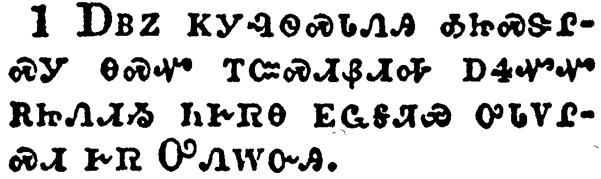</a></td>
</tr>
<tr class="even">
<td>We then, as workers together with him, beseech you also that ye receive not the grace of God in vain.</td>
</tr>
<tr class="odd">
<td>ᎠᏴᏃ ᏦᎩᎸᏫᏍᏓᏁᎯ ᎣᏥᏍᏕᎵᏍᎩ ᎾᏍᏉ ᎢᏨᏍᏗᏰᏗᎭ ᎠᏎᏉᏉ ᎡᏥᏁᏗᏱ ᏂᎨᏒᎾ ᎬᏩᎦᏘᏯ ᎤᏓᏙᎵᏍᏗ ᎨᏒ ᎤᏁᎳᏅᎯ.</td>
</tr>
<tr class="even">
<td>A-yv-no tso-gi-lv-wi-s-da-ne-hi o-tsi-s-de-li-s-gi na-s-quo i-tsv-s-di-ye-di-ha a-se-quo-quo e-tsi-ne-di-yi ni-ge-sv-na gv-wa-ga-ti-ya u-da-do-li-s-di ge-sv U-ne-la-nv-hi.</td>
</tr>
</tbody>
</table>

<table>
<tbody>
<tr class="odd">
<td><a href="080602.png">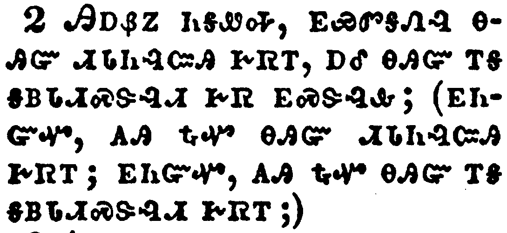</a></td>
</tr>
<tr class="even">
<td>(For he saith, I have heard thee in a time accepted, and in the day of salvation have I succoured thee: behold, now is the accepted time; behold, now is the day of salvation.)</td>
</tr>
<tr class="odd">
<td>ᎯᎠᏰᏃ ᏂᎦᏪᎭ, ᎬᏩᏛᎦᏁᎸ ᎾᎯᏳ ᏗᏓᏂᎸᏨᎯ ᎨᏒᎢ, ᎠᎴ ᎾᎯᏳ ᎢᎦ ᎦᏴᏓᏗᏍᏕᎸᏗ ᎨᏒ ᎬᏍᏕᎸᎲ; (ᎬᏂᏳᏉ, ᎪᎯ ᎿᎭᏉ ᎾᎯᏳ ᏗᏓᏂᎸᏨᎯ ᎨᏒᎢ; ᎬᏂᏳᏉ, ᎪᎯ ᎿᎭᏉ ᎾᎯᏳ ᎢᎦ ᎦᏴᏓᏗᏍᏕᎸᏗ ᎨᏒᎢ;)</td>
</tr>
<tr class="even">
<td>Hi-a-ye-no ni-ga-we-ha, gv-wa-dv-ga-ne-lv na-hi-yu di-da-ni-lv-tsv-hi ge-sv-i, a-le na-hi-yu i-ga ga-yv-da-di-s-de-lv-di ge-sv gv-s-de-lv-hv; (gv-ni-yu-quo, go-hi hna-quo na-hi-yu di-da-ni-lv-tsv-hi ge-sv-i; gv-ni-yu-quo, go-hi hna-quo na-hi-yu i-ga ga-yv-da-di-s-de-lv-di ge-sv-i;)</td>
</tr>
</tbody>
</table>

<table>
<tbody>
<tr class="odd">
<td><a href="080603.png">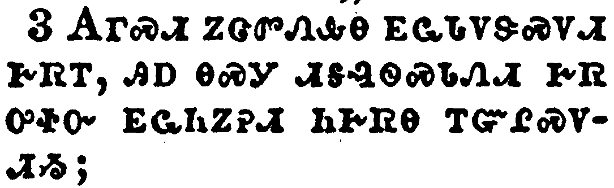</a></td>
</tr>
<tr class="even">
<td>Giving no offence in any thing, that the ministry be not blamed:</td>
</tr>
<tr class="odd">
<td>ᎪᎱᏍᏗ ᏃᏣᏛᏁᎲᎾ ᎬᏩᏓᏙᏕᏍᏙᏗ ᎨᏒᎢ, ᎯᎠ ᎾᏍᎩ ᏗᎦᎸᏫᏍᏓᏁᏗ ᎨᏒ ᎤᏐᏅ ᎬᏩᏂᏃᎮᏗ ᏂᎨᏒᎾ ᎢᏳᎵᏍᏙᏗᏱ;</td>
</tr>
<tr class="even">
<td>Go-hu-s-di no-tsa-dv-ne-hv-na gv-wa-da-do-de-s-do-di ge-sv-i, hi-a na-s-gi di-ga-lv-wi-s-da-ne-di ge-sv u-so-nv gv-wa-ni-no-he-di ni-ge-sv-na i-yu-li-s-do-di-yi;</td>
</tr>
</tbody>
</table>

<table>
<tbody>
<tr class="odd">
<td><a href="080604.png">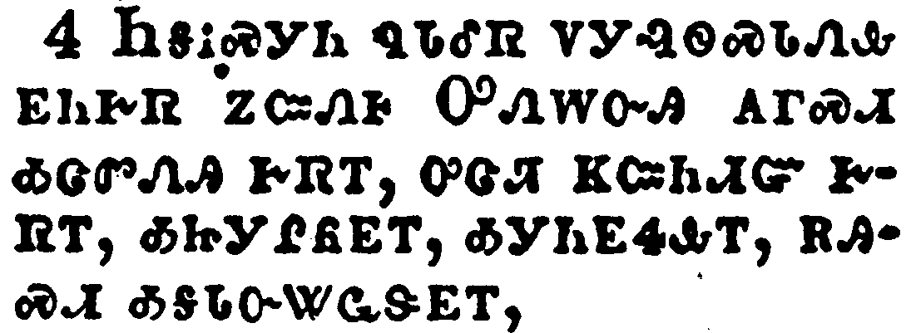</a></td>
</tr>
<tr class="even">
<td>But in all things approving ourselves as the ministers of God, in much patience, in afflictions, in necessities, in distresses,</td>
</tr>
<tr class="odd">
<td>ᏂᎦᎥᏍᎩᏂ ᏄᏓᎴᏒ ᏙᎩᎸᏫᏍᏓᏁᎲ ᎬᏂᎨᏒ ᏃᏨᏁᎰ ᎤᏁᎳᏅᎯ ᎪᎱᏍᏗ ᎣᏣᏛᏁᎯ ᎨᏒᎢ, ᎤᏣᏘ ᏦᏨᏂᏗᏳ ᎨᏒᎢ, ᎣᏥᎩᎵᏲᎬᎢ, ᎣᎩᏂᎬᏎᎲᎢ, ᎡᎯᏍᏗ ᎣᎦᏓᏅᏔᏩᏕᎬᎢ,</td>
</tr>
<tr class="even">
<td>Ni-ga-v-s-gi-ni nu-da-le-sv do-gi-lv-wi-s-da-ne-hv gv-ni-ge-sv no-tsv-ne-ho U-ne-la-nv-hi go-hu-s-di o-tsa-dv-ne-hi ge-sv-i, u-tsa-ti tso-tsv-ni-di-yu ge-sv-i, o-tsi-gi-li-yo-gv-i, o-gi-ni-gv-se-hv-i, e-hi-s-di o-ga-da-nv-ta-wa-de-gv-i,</td>
</tr>
</tbody>
</table>

<table>
<tbody>
<tr class="odd">
<td><a href="080605.png">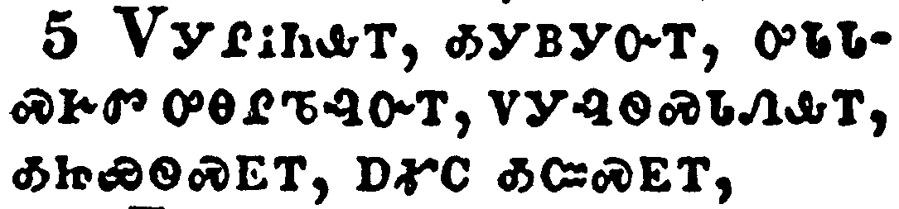</a></td>
</tr>
<tr class="even">
<td>In stripes, in imprisonments, in tumults, in labours, in watchings, in fastings;</td>
</tr>
<tr class="odd">
<td>ᏙᎩᎵᏂᎲᎢ, ᎣᎩᏴᎩᏅᎢ, ᎤᏓᏓᏍᎨᏛ ᎤᎾᎵᏖᎸᏅᎢ, ᏙᎩᎸᏫᏍᏓᏁᎲᎢ, ᎣᏥᏯᏫᏍᎬᎢ, ᎠᎹᏟ ᎣᏨᏍᎬᎢ,</td>
</tr>
<tr class="even">
<td>Do-gi-li-ni-hv-i, o-gi-yv-gi-nv-i, u-da-da-s-ge-dv u-na-li-te-lv-nv-i, do-gi-lv-wi-s-da-ne-hv-i, o-tsi-ya-wi-s-gv-i, a-ma-tli o-tsv-s-gv-i,</td>
</tr>
</tbody>
</table>

<table>
<tbody>
<tr class="odd">
<td><a href="080606.png">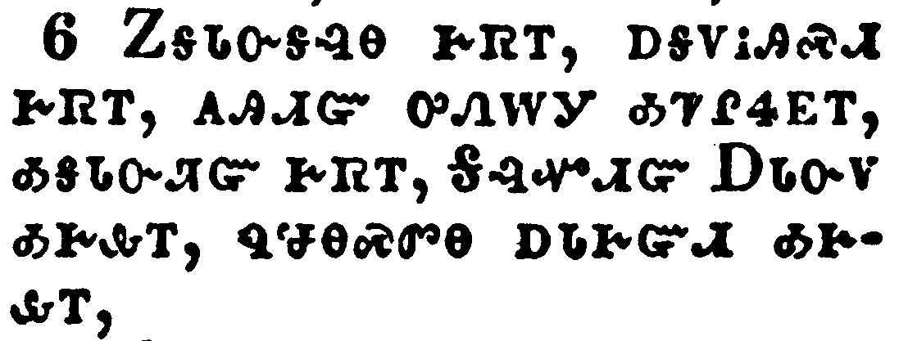</a></td>
</tr>
<tr class="even">
<td>By pureness, by knowledge, by longsuffering, by kindness, by the Holy Ghost, by love unfeigned,</td>
</tr>
<tr class="odd">
<td>ᏃᎦᏓᏅᎦᎸᎾ ᎨᏒᎢ, ᎠᎦᏙᎥᎯᏍᏗ ᎨᏒᎢ, ᎪᎯᏙᏳ ᎤᏁᎳᎩ ᎣᏤᎵᏎᎬᎢ, ᎣᎦᏓᏅᏘᏳ ᎨᏒᎢ, ᎦᎸᏉᏗᏳ ᎠᏓᏅᏙ ᎣᎨᎲᎢ, ᏄᏠᎾᏍᏛᎾ ᎠᏓᎨᏳᏗ ᎣᎨᎲᎢ.</td>
</tr>
<tr class="even">
<td>No-ga-da-nv-ga-lv-na ge-sv-i, a-ga-do-v-hi-s-di ge-sv-i, go-hi-do-yu u-ne-la-gi o-tse-li-se-gv-i, o-ga-da-nv-ti-yu ge-sv-i, Ga-lv-quo-di-yu A-da-nv-do o-ge-hv-i, nu-tlo-na-s-dv-na a-da-ge-yu-di o-ge-hv-i.</td>
</tr>
</tbody>
</table>

<table>
<tbody>
<tr class="odd">
<td><a href="080607.png">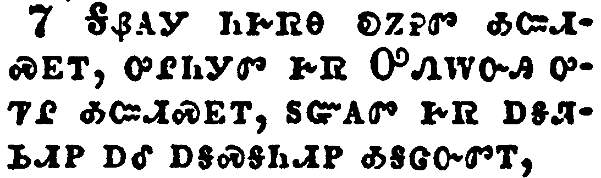</a></td>
</tr>
<tr class="even">
<td>By the word of truth, by the power of God, by the armour of righteousness on the right hand and on the left,</td>
</tr>
<tr class="odd">
<td>ᎦᏰᎪᎩ ᏂᎨᏒᎾ ᎧᏃᎮᏛ ᎣᏨᏗᏍᎬᎢ, ᎤᎵᏂᎩᏛ ᎨᏒ ᎤᏁᎳᏅᎯ ᎤᏤᎵ ᎣᏨᏗᏍᎬᎢ, ᏚᏳᎪᏛ ᎨᏒ ᎠᎦᏘᏏᏗᏢ ᎠᎴ ᎠᎦᏍᎦᏂᏗᏢ ᎣᎦᏣᏅᏛᎢ,</td>
</tr>
<tr class="even">
<td>Ga-ye-go-gi ni-ge-sv-na ka-no-he-dv o-tsv-di-s-gv-i, u-li-ni-gi-dv ge-sv U-ne-la-nv-hi u-tse-li o-tsv-di-s-gv-i, du-yu-go-dv ge-sv a-ga-ti-si-di-tlv a-le a-ga-s-ga-ni-di-tlv o-ga-tsa-nv-dv-i,</td>
</tr>
</tbody>
</table>

<table>
<tbody>
<tr class="odd">
<td><a href="080608.png">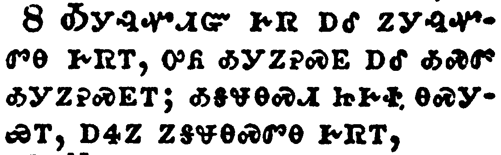</a></td>
</tr>
<tr class="even">
<td>By honour and dishonour, by evil report and good report: as deceivers, and yet true;</td>
</tr>
<tr class="odd">
<td>ᎣᎩᎸᏉᏗᏳ ᎨᏒ ᎠᎴ ᏃᎩᎸᏉᏛᎾ ᎨᏒᎢ, ᎤᏲ ᎣᎩᏃᎮᏍᎬ ᎠᎴ ᎣᏍᏛ ᎣᎩᏃᎮᏍᎬᎢ; ᎣᎦᏠᎾᏍᏗ ᏥᎨᏐ ᎾᏍᎩᏯᎢ, ᎠᏎᏃ ᏃᎦᏠᎾᏍᏛᎾ ᎨᏒᎢ,</td>
</tr>
<tr class="even">
<td>O-gi-lv-quo-di-yu ge-sv a-le no-gi-lv-quo-dv-na ge-sv-i, u-yo o-gi-no-he-s-gv a-le o-s-dv o-gi-no-he-s-gv-i; o-ga-tlo-na-s-di tsi-ge-so na-s-gi-ya-i, a-se-no no-ga-tlo-na-s-dv-na ge-sv-i,</td>
</tr>
</tbody>
</table>

<table>
<tbody>
<tr class="odd">
<td><a href="080609.png">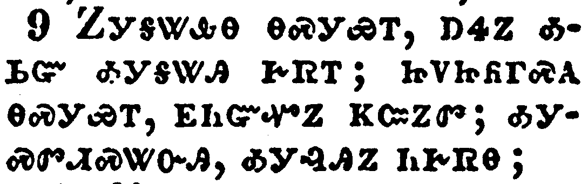</a></td>
</tr>
<tr class="even">
<td>As unknown, and yet well known; as dying, and, behold, we live; as chastened, and not killed;</td>
</tr>
<tr class="odd">
<td>ᏃᎩᎦᏔᎲᎾ ᎾᏍᎩᏯᎢ, ᎠᏎᏃ ᎣᏏᏳ ᎣᎩᎦᏔᎯ ᎨᏒᎢ; ᏥᏙᏥᏲᎱᏍᎪ ᎾᏍᎩᏯᎢ, ᎬᏂᏳᏉᏃ ᏦᏨᏃᏛ; ᎣᎩᏍᏛᏗᏍᏔᏅᎯ, ᎣᎩᎸᎯᏃ ᏂᎨᏒᎾ;</td>
</tr>
<tr class="even">
<td>No-gi-ga-ta-hv-na na-s-gi-ya-i, a-se-no o-si-yu o-gi-ga-ta-hi ge-sv-i; tsi-do-tsi-yo-hu-s-go na-s-gi-ya-i, gv-ni-yu-quo-no tso-tsv-no-dv; o-gi-s-dv-di-s-ta-nv-hi, o-gi-lv-hi-no ni-ge-sv-na;</td>
</tr>
</tbody>
</table>

<table>
<tbody>
<tr class="odd">
<td><a href="080610.png">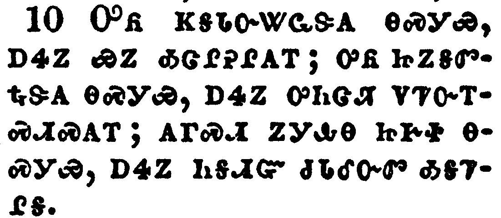</a></td>
</tr>
<tr class="even">
<td>As sorrowful, yet alway rejoicing; as poor, yet making many rich; as having nothing, and yet possessing all things.</td>
</tr>
<tr class="odd">
<td>ᎤᏲ ᏦᎦᏓᏅᏔᏩᏕᎪ ᎾᏍᎩᏯ, ᎠᏎᏃ ᏯᏃ ᎣᏣᎵᎮᎵᎪᎢ; ᎤᏲ ᏥᏃᎦᏛᎿᎭᏕᎪ ᎾᏍᎩᏯ, ᎠᏎᏃ ᎤᏂᏣᏘ ᏙᏤᏅᎢᏍᏗᏍᎪᎢ; ᎪᎱᏍᏗ ᏃᎩᎲᎾ ᏥᎨᏐ ᎾᏍᎩᏯ, ᎠᏎᏃ ᏂᎦᏗᏳ ᏧᏓᎴᏅᏛ ᎣᎦᏤᎵᎦ.</td>
</tr>
<tr class="even">
<td>U-yo tso-ga-da-nv-ta-wa-de-go na-s-gi-ya, a-se-no ya-no o-tsa-li-he-li-go-i; u-yo tsi-no-ga-dv-hna-de-go na-s-gi-ya, a-se-no u-ni-tsa-ti do-tse-nv-i-s-di-s-go-i; go-hu-s-di no-gi-hv-na tsi-ge-so na-s-gi-ya, a-se-no ni-ga-di-yu tsu-da-le-nv-dv o-ga-tse-li-ga.</td>
</tr>
</tbody>
</table>

<table>
<tbody>
<tr class="odd">
<td><a href="080611.png">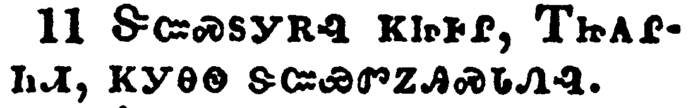</a></td>
</tr>
<tr class="even">
<td>O ye Corinthians, our mouth is open unto you, our heart is enlarged.</td>
</tr>
<tr class="odd">
<td>ᏕᏨᏍᏚᎩᎡᎸ ᏦᏥᎰᎵ, ᎢᏥᎪᎵᏂᏗ, ᏦᎩᎾᏫ ᏕᏨᏯᏛᏃᎯᏍᏓᏁᎸ.</td>
</tr>
<tr class="even">
<td>De-tsv-s-du-gi-e-lv tso-tsi-ho-li, I-tsi-go-li-ni-di, tso-gi-na-wi de-tsv-ya-dv-no-hi-s-da-ne-lv.</td>
</tr>
</tbody>
</table>

<table>
<tbody>
<tr class="odd">
<td><a href="080612.png">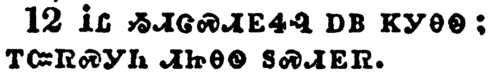</a></td>
</tr>
<tr class="even">
<td>Ye are not straitened in us, but ye are straitened in your own bowels.</td>
</tr>
<tr class="odd">
<td>ᎥᏝ ᏱᏗᏣᏍᏗᎬᏎᎸ ᎠᏴ ᏦᎩᎾᏫ; ᎢᏨᏒᏍᎩᏂ ᏗᏥᎾᏫ ᏚᏍᏗᎬᏒ.</td>
</tr>
<tr class="even">
<td>V-tla yi-di-tsa-s-di-gv-se-lv a-yv tso-gi-na-wi; i-tsv-sv-s-gi-ni di-tsi-na-wi du-s-di-gv-sv.</td>
</tr>
</tbody>
</table>

<table>
<tbody>
<tr class="odd">
<td><a href="080613.png">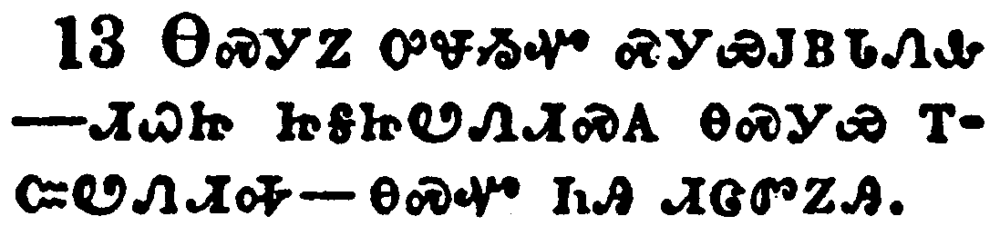</a></td>
</tr>
<tr class="even">
<td>Now for a recompence in the same, (I speak as unto my children,) be ye also enlarged.</td>
</tr>
<tr class="odd">
<td>ᎾᏍᎩᏃ ᎤᏠᏱᏉ ᏍᎩᏯᎫᏴᏓᏁᎲ ^ᏗᏇᏥ ᏥᎦᏥᏬᏁᏗᏍᎪ ᎾᏍᎩᏯ ᎢᏨᏬᏁᏗᎭ^ᎾᏍᏉ ᏂᎯ ᏗᏣᏛᏃᎯ.</td>
</tr>
<tr class="even">
<td>Na-s-gi-no u-tlo-yi-quo s-gi-ya-gu-yv-da-ne-hv ^di-que-tsi tsi-ga-tsi-wo-ne-di-s-go na-s-gi-ya i-tsv-wo-ne-di-ha^na-s-quo ni-hi di-tsa-dv-no-hi.</td>
</tr>
</tbody>
</table>

<table>
<tbody>
<tr class="odd">
<td><a href="080614.png">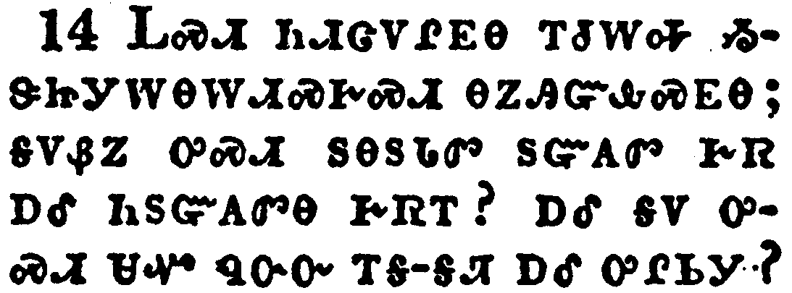</a></td>
</tr>
<tr class="even">
<td>Be ye not unequally yoked together with unbelievers: for what fellowship hath righteousness with unrighteousness? and what communion hath light with darkness?</td>
</tr>
<tr class="odd">
<td>ᏞᏍᏗ ᏂᏗᏣᏙᎵᎬᎾ ᎢᏧᎳᎭ ᏱᏕᏥᎩᎳᎾᎳᏗᏍᎨᏍᏗ ᎾᏃᎯᏳᎲᏍᎬᎾ; ᎦᏙᏰᏃ ᎤᏍᏗ ᏚᎾᏚᏓᏛ ᏚᏳᎪᏛ ᎨᏒ ᎠᎴ ᏂᏚᏳᎪᏛᎾ ᎨᏒᎢ? ᎠᎴ ᎦᏙ ᎤᏍᏗ ᏌᏉ ᏄᏅᏅ ᎢᎦ-ᎦᏘ ᎠᎴ ᎤᎵᏏᎩ?</td>
</tr>
<tr class="even">
<td>Tle-s-di ni-di-tsa-do-li-gv-na i-tsu-la-ha yi-de-tsi-gi-la-na-la-di-s-ge-s-di na-no-hi-yu-hv-s-gv-na; ga-do-ye-no u-s-di du-na-du-da-dv du-yu-go-dv ge-sv a-le ni-du-yu-go-dv-na ge-sv-i? a-le ga-do u-s-di sa-quo nu-nv-nv i-ga--ga-ti a-le u-li-si-gi?</td>
</tr>
</tbody>
</table>

<table>
<tbody>
<tr class="odd">
<td><a href="080615.png">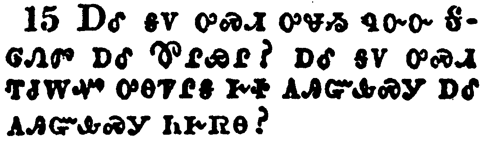</a></td>
</tr>
<tr class="even">
<td>And what concord hath Christ with Belial? or what part hath he that believeth with an infidel?</td>
</tr>
<tr class="odd">
<td>ᎠᎴ ᎦᏙ ᎤᏍᏗ ᎤᏠᏱ ᏄᏅᏅ ᎦᎶᏁᏛ ᎠᎴ ᏈᎵᏯᎵ? ᎠᎴ ᎦᏙ ᎤᏍᏗ ᎢᏧᎳᏉ ᎤᎾᏤᎵᎦ ᎨᏐ ᎪᎯᏳᎲᏍᎩ ᎠᎴ ᎪᎯᏳᎲᏍᎩ ᏂᎨᏒᎾ?</td>
</tr>
<tr class="even">
<td>A-le ga-do u-s-di u-tlo-yi nu-nv-nv Ga-lo-ne-dv a-le Qui-li-ya-li? a-le ga-do u-s-di i-tsu-la-quo u-na-tse-li-ga ge-so go-hi-yu-hv-s-gi a-le go-hi-yu-hv-s-gi ni-ge-sv-na?</td>
</tr>
</tbody>
</table>

<table>
<tbody>
<tr class="odd">
<td><a href="080616.png">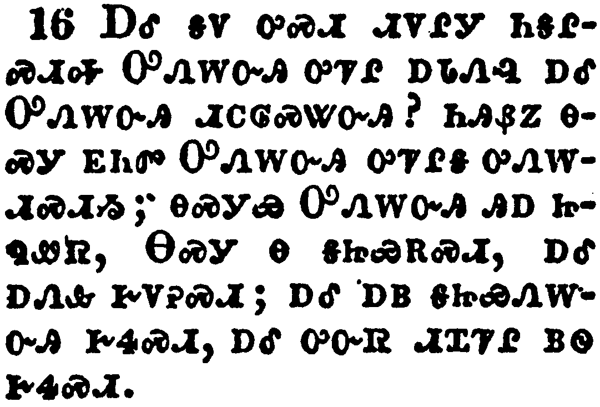</a></td>
</tr>
<tr class="even">
<td>And what agreement hath the temple of God with idols? for ye are the temple of the living God; as God hath said, I will dwell in them, and walk in them; and I will be their God, and they shall be my people.</td>
</tr>
<tr class="odd">
<td>ᎠᎴ ᎦᏙ ᎤᏍᏗ ᏗᏙᎵᎩ ᏂᎦᎵᏍᏗᎭ ᎤᏁᎳᏅᎯ ᎤᏤᎵ ᎠᏓᏁᎸ ᎠᎴ ᎤᏁᎳᏅᎯ ᏗᏟᎶᏍᏔᏅᎯ? ᏂᎯᏰᏃ ᎾᏍᎩ ᎬᏂᏛ ᎤᏁᎳᏅᎯ ᎤᏤᎵᎦ ᎤᏁᎳᏗᏍᏗᏱ; ᎾᏍᎩᏯ ᎤᏁᎳᏅᎯ ᎯᎠ ᏥᏄᏪᏒ, ᎾᏍᎩ Ꮎ ᎦᏥᏯᎡᏍᏗ, ᎠᎴ ᎠᏁᎲ ᎨᏙᎮᏍᏗ; ᎠᎴ ᎠᏴ ᎦᏥᏯᏁᎳᏅᎯ ᎨᏎᏍᏗ, ᎠᎴ ᎤᏅᏒ ᏗᏆᏤᎵ ᏴᏫ ᎨᏎᏍᏗ.</td>
</tr>
<tr class="even">
<td>A-le ga-do u-s-di di-do-li-gi ni-ga-li-s-di-ha U-ne-la-nv-hi u-tse-li a-da-ne-lv a-le U-ne-la-nv-hi di-tli-lo-s-ta-nv-hi? ni-hi-ye-no na-s-gi gv-ni-dv U-ne-la-nv-hi u-tse-li-ga u-ne-la-di-s-di-yi; na-s-gi-ya U-ne-la-nv-hi hi-a tsi-nu-we-sv, Na-s-gi na ga-tsi-ya-e-s-di, a-le a-ne-hv ge-do-he-s-di; a-le a-yv ga-tsi-ya-ne-la-nv-hi ge-se-s-di, a-le u-nv-sv di-qua-tse-li yv-wi ge-se-s-di.</td>
</tr>
</tbody>
</table>

<table>
<tbody>
<tr class="odd">
<td><a href="080617.png">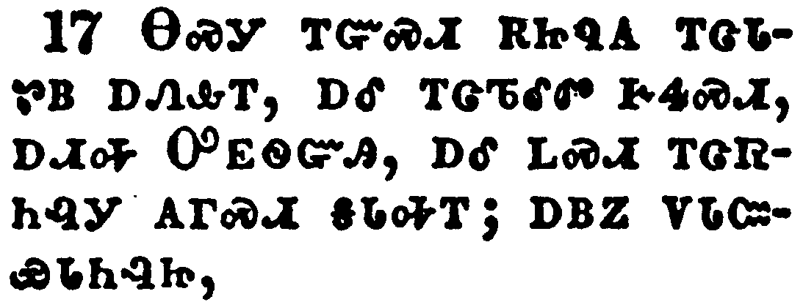</a></td>
</tr>
<tr class="even">
<td>Wherefore come out from among them, and be ye separate, saith the Lord, and touch not the unclean thing; and I will receive you,</td>
</tr>
<tr class="odd">
<td>ᎾᏍᎩ ᎢᏳᏍᏗ ᎡᏥᏄᎪ ᎢᏣᏓᏑᏴ ᎠᏁᎲᎢ, ᎠᎴ ᎢᏣᏖᎴᏛ ᎨᏎᏍᏗ, ᎠᏗᎭ ᎤᎬᏫᏳᎯ, ᎠᎴ ᏞᏍᏗ ᎢᏣᏒᏂᎸᎩ ᎪᎱᏍᏗ ᎦᏓᎭᎢ; ᎠᏴᏃ ᏙᏓᏨᏯᏓᏂᎸᏥ,</td>
</tr>
<tr class="even">
<td>Na-s-gi i-yu-s-di e-tsi-nu-go i-tsa-da-su-yv a-ne-hv-i, a-le i-tsa-te-le-dv ge-se-s-di, a-di-ha U-gv-wi-yu-hi, a-le tle-s-di i-tsa-sv-ni-lv-gi go-hu-s-di ga-da-ha-i; a-yv-no do-da-tsv-ya-da-ni-lv-tsi,</td>
</tr>
</tbody>
</table>

<table>
<tbody>
<tr class="odd">
<td><a href="080618.png">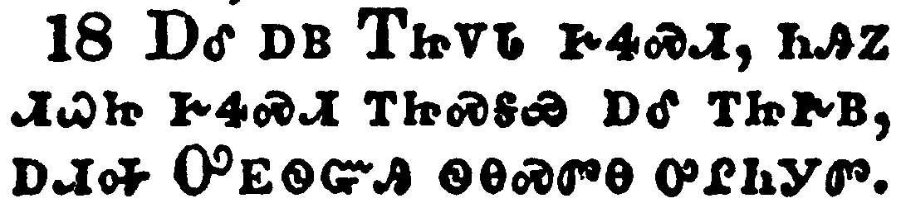</a></td>
</tr>
<tr class="even">
<td>And will be a Father unto you, and ye shall be my sons and daughters, saith the Lord Almighty.</td>
</tr>
<tr class="odd">
<td>ᎠᎴ ᎠᏴ ᎢᏥᏙᏓ ᎨᏎᏍᏗ, ᏂᎯᏃ ᏗᏇᏥ ᎨᏎᏍᏗ ᎢᏥᏍᎦᏯ ᎠᎴ ᎢᏥᎨᏴ, ᎠᏗᎭ ᎤᎬᏫᏳᎯ ᏫᎾᏍᏛᎾ ᎤᎵᏂᎩᏛ.</td>
</tr>
<tr class="even">
<td>A-le a-yv I-tsi-do-da ge-se-s-di, ni-hi-no di-que-tsi ge-se-s-di i-tsi-s-ga-ya a-le i-tsi-ge-yv, a-di-ha U-gv-wi-yu-hi wi-na-s-dv-na u-li-ni-gi-dv.</td>
</tr>
</tbody>
</table>

