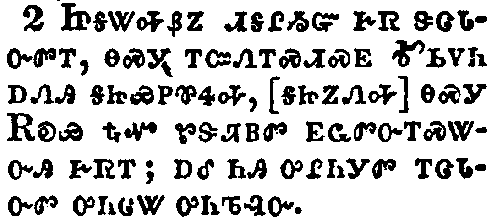
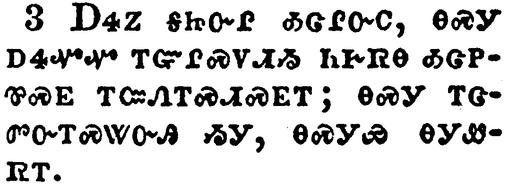
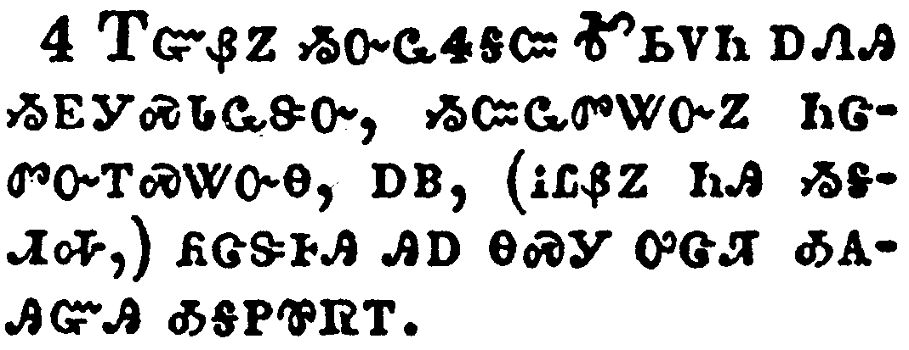
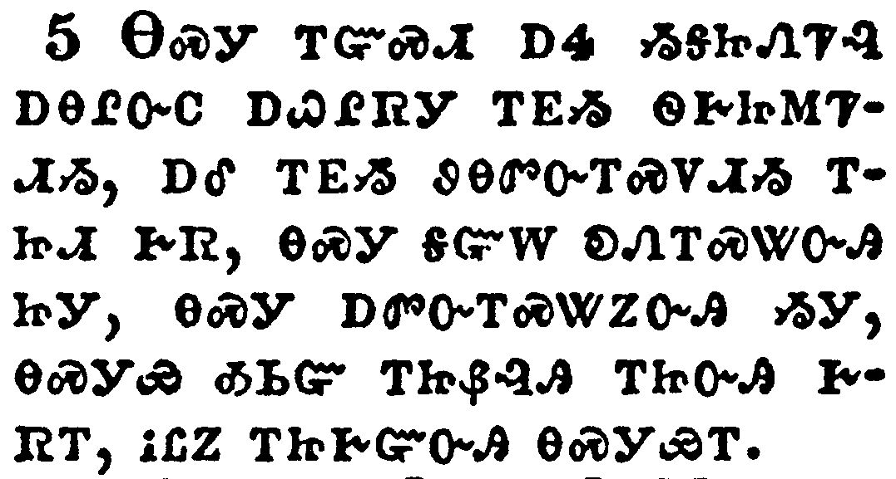
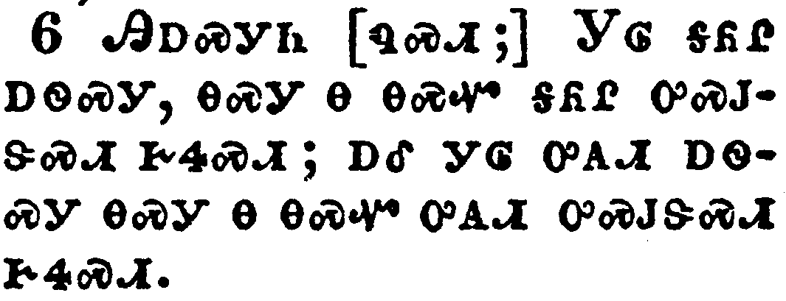
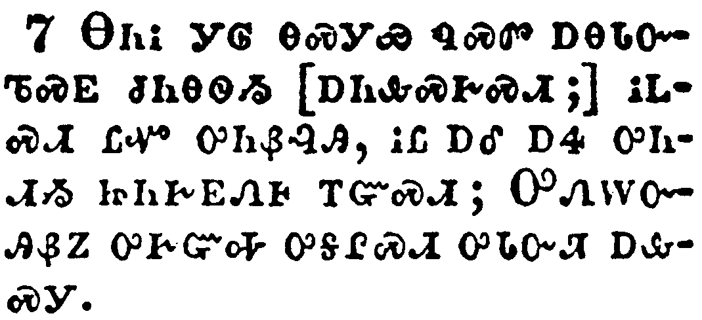
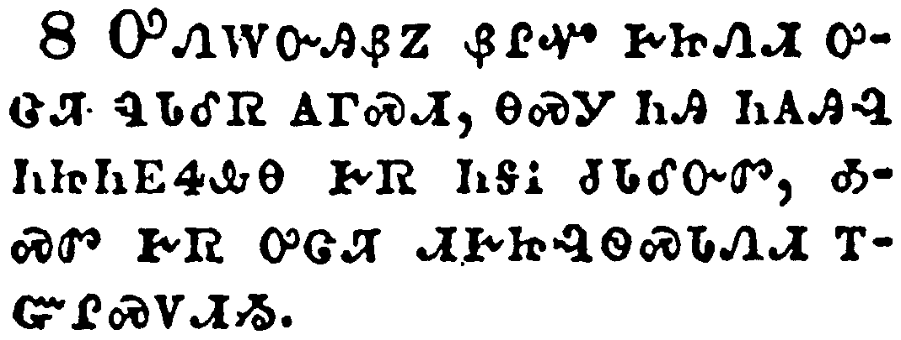
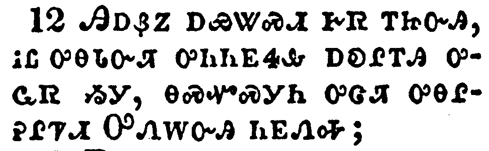
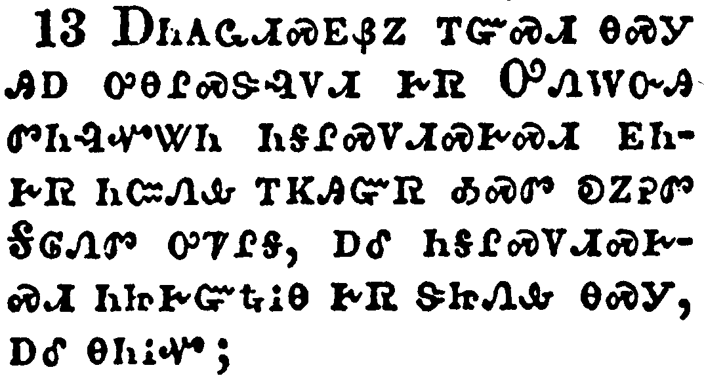
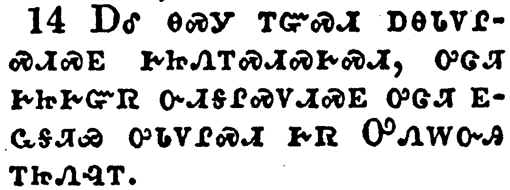

+++
draft=false
date = 2014-12-18T21:11:07Z
title = "2 Corinthians - Chapter 9 - Cherokee New Testament"
weight = 1418955067

[taxonomies]

authors = ["Timothy Legg"]
categories = []
tags = []

[extra]
+++

<table>
<tbody>
<tr class="odd">
<td></td>
</tr>
<tr class="even">
<td>For as touching the ministering to the saints, it is superfluous for me to write to you:</td>
</tr>
<tr class="odd">
<td>ᎾᏃ ᎤᎾᏓᏅᏘ ᏗᏍᏕᎸᏗᏱ ᎤᎬᏩᎵ, ᎠᏎᏉᏉ ᏱᏨᏲᏪᎳᏁᎭ.</td>
</tr>
<tr class="even">
<td>Na-no u-na-da-nv-ti di-s-de-lv-di-yi u-gv-wa-li, a-se-quo-quo yi-tsv-yo-we-la-ne-ha.</td>
</tr>
</tbody>
</table>

<table>
<tbody>
<tr class="odd">
<td></td>
</tr>
<tr class="even">
<td>For I know the forwardness of your mind, for which I boast of you to them of Macedonia, that Achaia was ready a year ago; and your zeal hath provoked very many.</td>
</tr>
<tr class="odd">
<td>ᏥᎦᏔᎭᏰᏃ ᏗᎦᎵᏱᏳ ᎨᏒ ᏕᏣᏓᏅᏛᎢ, ᎾᏍᎩ ᎢᏨᏁᎢᏍᏗᏍᎬ ᎹᏏᏙᏂ ᎠᏁᎯ ᎦᏥᏯᏢᏈᏎᎭ, [ᎦᏥᏃᏁᎭ] ᎾᏍᎩ ᎡᎧᏯ ᎿᎭᏉ ᏑᏕᏘᏴᏛ ᎬᏩᏛᏅᎢᏍᏔᏅᎯ ᎨᏒᎢ; ᎠᎴ ᏂᎯ ᎤᎵᏂᎩᏛ ᎢᏣᏓᏅᏛ ᎤᏂᏣᏔ ᎤᏂᏖᎸᏅ.</td>
</tr>
<tr class="even">
<td>Tsi-ga-ta-ha-ye-no di-ga-li-yi-yu ge-sv de-tsa-da-nv-dv-i, na-s-gi i-tsv-ne-i-s-di-s-gv Ma-si-do-ni a-ne-hi ga-tsi-ya-tlv-qui-se-ha, [ga-tsi-no-ne-ha] na-s-gi E-ka-ya hna-quo su-de-ti-yv-dv gv-wa-dv-nv-i-s-ta-nv-hi ge-sv-i; a-le ni-hi u-li-ni-gi-dv i-tsa-da-nv-dv u-ni-tsa-ta u-ni-te-lv-nv.</td>
</tr>
</tbody>
</table>

<table>
<tbody>
<tr class="odd">
<td></td>
</tr>
<tr class="even">
<td>Yet have I sent the brethren, lest our boasting of you should be in vain in this behalf; that, as I said, ye may be ready:</td>
</tr>
<tr class="odd">
<td>ᎠᏎᏃ ᎦᏥᏅᎵ ᎣᏣᎵᏅᏟ, ᎾᏍᎩ ᎠᏎᏉᏉ ᎢᏳᎵᏍᏙᏗᏱ ᏂᎨᏒᎾ ᎣᏣᏢᏈᏍᎬ ᎢᏨᏁᎢᏍᏗᏍᎬᎢ; ᎾᏍᎩ ᎢᏣᏛᏅᎢᏍᏔᏅᎯ ᏱᎩ, ᎾᏍᎩᏯ ᎾᎩᏪᏒᎢ.</td>
</tr>
<tr class="even">
<td>A-se-no ga-tsi-nv-li o-tsa-li-nv-tli, na-s-gi a-se-quo-quo i-yu-li-s-do-di-yi ni-ge-sv-na o-tsa-tlv-qui-s-gv i-tsv-ne-i-s-di-s-gv-i; na-s-gi i-tsa-dv-nv-i-s-ta-nv-hi yi-gi, na-s-gi-ya na-gi-we-sv-i.</td>
</tr>
</tbody>
</table>

<table>
<tbody>
<tr class="odd">
<td></td>
</tr>
<tr class="even">
<td>Lest haply if they of Macedonia come with me, and find you unprepared, we (that we say not, ye) should be ashamed in this same confident boasting.</td>
</tr>
<tr class="odd">
<td>ᎢᏳᏰᏃ ᏱᏅᏩᏎᎦᏨ ᎹᏏᏙᏂ ᎠᏁᎯ ᏱᎬᎩᏍᏓᏩᏕᏅ, ᏱᏨᏩᏛᏔᏅᏃ ᏂᏣᏛᏅᎢᏍᏔᏅᎾ, ᎠᏴ, (ᎥᏝᏰᏃ ᏂᎯ ᏱᎦᏗᎭ,) ᏲᏣᏕᎰᎯ ᎯᎠ ᎾᏍᎩ ᎤᏣᏘ ᎣᎪᎯᏳᎯ ᎣᎦᏢᏈᏒᎢ.</td>
</tr>
<tr class="even">
<td>I-yu-ye-no yi-nv-wa-se-ga-tsv Ma-si-do-ni a-ne-hi yi-gv-gi-s-da-wa-de-nv, yi-tsv-wa-dv-ta-nv-no ni-tsa-dv-nv-i-s-ta-nv-na, a-yv, (v-tla-ye-no ni-hi yi-ga-di-ha,) yo-tsa-de-ho-hi hi-a na-s-gi u-tsa-ti o-go-hi-yu-hi o-ga-tlv-qui-sv-i.</td>
</tr>
</tbody>
</table>

<table>
<tbody>
<tr class="odd">
<td></td>
</tr>
<tr class="even">
<td>Therefore I thought it necessary to exhort the brethren, that they would go before unto you, and make up beforehand your bounty, whereof ye had notice before, that the same might be ready, as a matter of bounty, and not as of covetousness.</td>
</tr>
<tr class="odd">
<td>ᎾᏍᎩ ᎢᏳᏍᏗ ᎠᏎ ᏱᎦᏥᏁᏤᎸ ᎠᎾᎵᏅᏟ ᎠᏇᎵᏒᎩ ᎢᎬᏱ ᏫᎨᏥᎷᏤᏗᏱ, ᎠᎴ ᎢᎬᏱ ᏭᎾᏛᏅᎢᏍᏙᏗᏱ ᎢᏥᏗ ᎨᏒ, ᎾᏍᎩ ᎦᏳᎳ ᎧᏁᎢᏍᏔᏅᎯ ᏥᎩ, ᎾᏍᎩ ᎠᏛᏅᎢᏍᏔᏃᏅᎯ ᏱᎩ, ᎾᏍᎩᏯ ᎣᏏᏳ ᎢᏥᏰᎸᎯ ᎢᏥᏅᎯ ᎨᏒᎢ, ᎥᏝᏃ ᎢᏥᎨᏳᏅᎯ ᎾᏍᎩᏯᎢ.</td>
</tr>
<tr class="even">
<td>Na-s-gi i-yu-s-di a-se yi-ga-tsi-ne-tse-lv a-na-li-nv-tli a-que-li-sv-gi i-gv-yi wi-ge-tsi-lu-tse-di-yi, a-le i-gv-yi wu-na-dv-nv-i-s-do-di-yi i-tsi-di ge-sv, na-s-gi ga-yu-la ka-ne-i-s-ta-nv-hi tsi-gi, na-s-gi a-dv-nv-i-s-ta-no-nv-hi yi-gi, na-s-gi-ya o-si-yu i-tsi-ye-lv-hi i-tsi-nv-hi ge-sv-i, v-tla-no i-tsi-ge-yu-nv-hi na-s-gi-ya-i.</td>
</tr>
</tbody>
</table>

<table>
<tbody>
<tr class="odd">
<td></td>
</tr>
<tr class="even">
<td>But this I say, He which soweth sparingly shall reap also sparingly; and he which soweth bountifully shall reap also bountifully.</td>
</tr>
<tr class="odd">
<td>ᎯᎠᏍᎩᏂ [ᏄᏍᏗ;] ᎩᎶ ᎦᏲᎵ ᎠᏫᏍᎩ, ᎾᏍᎩ Ꮎ ᎾᏍᏉ ᎦᏲᎵ ᎤᏍᎫᏕᏍᏗ ᎨᏎᏍᏗ; ᎠᎴ ᎩᎶ ᎤᎪᏗ ᎠᏫᏍᎩ ᎾᏍᎩ Ꮎ ᎾᏍᏉ ᎤᎪᏗ ᎤᏍᎫᏕᏍᏗ ᎨᏎᏍᏗ.</td>
</tr>
<tr class="even">
<td>Hi-a-s-gi-ni [nu-s-di;] Gi-lo ga-yo-li a-wi-s-gi, na-s-gi na na-s-quo ga-yo-li u-s-gu-de-s-di ge-se-s-di; a-le gi-lo u-go-di a-wi-s-gi na-s-gi na na-s-quo u-go-di u-s-gu-de-s-di ge-se-s-di.</td>
</tr>
</tbody>
</table>

<table>
<tbody>
<tr class="odd">
<td></td>
</tr>
<tr class="even">
<td>Every man according as he purposeth in his heart, so let him give; not grudgingly, or of necessity: for God loveth a cheerful giver.</td>
</tr>
<tr class="odd">
<td>ᎾᏂᎥ ᎩᎶ ᎾᏍᎩᏯ ᏄᏍᏛ ᎠᎾᏓᏅᏖᏍᎬ ᏧᏂᎾᏫᏱ [ᎠᏂᎲᏍᎨᏍᏗ;] ᎥᏝᏍᏗ ᏝᏉ ᎤᏂᏰᎸᎯ, ᎥᏝ ᎠᎴ ᎠᏎ ᎤᏂᏗᏱ ᏥᏂᎨᎬᏁᎰ ᎢᏳᏍᏗ; ᎤᏁᎳᏅᎯᏰᏃ ᎤᎨᏳᎭ ᎤᎦᎵᏍᏗ ᎤᏓᏁᏘ ᎠᎲᏍᎩ.</td>
</tr>
<tr class="even">
<td>Na-ni-v gi-lo na-s-gi-ya nu-s-dv a-na-da-nv-te-s-gv tsu-ni-na-wi-yi [a-ni-hv-s-ge-s-di;] v-tla-s-di tla-quo u-ni-ye-lv-hi, v-tla a-le a-se u-ni-di-yi tsi-ni-ge-gv-ne-ho i-yu-s-di; U-ne-la-nv-hi-ye-no u-ge-yu-ha u-ga-li-s-di u-da-ne-ti a-hv-s-gi.</td>
</tr>
</tbody>
</table>

<table>
<tbody>
<tr class="odd">
<td></td>
</tr>
<tr class="even">
<td>And God is able to make all grace abound toward you; that ye, always having all sufficiency in all things, may abound to every good work:</td>
</tr>
<tr class="odd">
<td>ᎤᏁᎳᏅᎯᏰᏃ ᏰᎵᏉ ᎨᏥᏁᏗ ᎤᏣᏘ ᏄᏓᎴᏒ ᎪᎱᏍᏗ, ᎾᏍᎩ ᏂᎯ ᏂᎪᎯᎸ ᏂᏥᏂᎬᏎᎲᎾ ᎨᏒ ᏂᎦᎥ ᏧᏓᎴᏅᏛ, ᎣᏍᏛ ᎨᏒ ᎤᏣᏘ ᏗᎨᏥᎸᏫᏍᏓᏁᏗ ᎢᏳᎵᏍᏙᏗᏱ.</td>
</tr>
<tr class="even">
<td>U-ne-la-nv-hi-ye-no ye-li-quo ge-tsi-ne-di u-tsa-ti nu-da-le-sv go-hu-s-di, na-s-gi ni-hi ni-go-hi-lv ni-tsi-ni-gv-se-hv-na ge-sv ni-ga-v tsu-da-le-nv-dv, o-s-dv ge-sv u-tsa-ti di-ge-tsi-lv-wi-s-da-ne-di i-yu-li-s-do-di-yi.</td>
</tr>
</tbody>
</table>

<table>
<tbody>
<tr class="odd">
<td></td>
</tr>
<tr class="even">
<td>(As it is written, He hath dispersed abroad; he hath given to the poor: his righteousness remaineth for ever.</td>
</tr>
<tr class="odd">
<td>ᎾᏍᎩᏯ ᎯᎠ ᏥᏂᎬᏅ ᏥᎪᏪᎳ, ᏚᏗᎦᎴᏯᏍᏔᏅ; ᎤᏲ ᎢᏳᎾᏛᎿᎭᏕᎩ ᏚᏁᎸ; ᎤᏓᏅᏘᏳ ᎨᏒ ᏅᏩᏍᏗᏉ ᏂᎪᎯᎸᎢ.</td>
</tr>
<tr class="even">
<td>Na-s-gi-ya hi-a tsi-ni-gv-nv tsi-go-we-la, Du-di-ga-le-ya-s-ta-nv; u-yo i-yu-na-dv-hna-de-gi du-ne-lv; u-da-nv-ti-yu ge-sv nv-wa-s-di-quo ni-go-hi-lv-i.</td>
</tr>
</tbody>
</table>

<table>
<tbody>
<tr class="odd">
<td></td>
</tr>
<tr class="even">
<td>Now he that ministereth seed to the sower both minister bread for your food, and multiply your seed sown, and increase the fruits of your righteousness;)</td>
</tr>
<tr class="odd">
<td>ᎾᏍᎩᏃ Ꮎ ᎤᎦᏔ ᎠᏫᏍᎩ ᎤᏁᎯ ᏥᎩ, ᎠᎴ ᎦᏚ ᎠᎵᏍᏓᏴᏙᏗ ᎠᏓᏁᎯ ᏥᎩ, ᎢᏥᏁᏗ ᎨᏎᏍᏗ ᎠᎴ ᎤᎪᏓᏗᏍᏗ ᎨᏎᏍᏗ ᎢᏥᏫᏍᏗ ᎨᏒᎢ, ᎠᎴ ᎤᏁᏉᏍᏗ ᎨᏎᏍᏗ ᎢᏣᏓᏅᏘᏳ ᎨᏒ ᎤᎦᏔᏔᏅᎯ;</td>
</tr>
<tr class="even">
<td>Na-s-gi-no na u-ga-ta a-wi-s-gi u-ne-hi tsi-gi, a-le ga-du a-li-s-da-yv-do-di a-da-ne-hi tsi-gi, i-tsi-ne-di ge-se-s-di a-le u-go-da-di-s-di ge-se-s-di i-tsi-wi-s-di ge-sv-i, a-le u-ne-quo-s-di ge-se-s-di i-tsa-da-nv-ti-yu ge-sv u-ga-ta-ta-nv-hi;</td>
</tr>
</tbody>
</table>

<table>
<tbody>
<tr class="odd">
<td></td>
</tr>
<tr class="even">
<td>Being enriched in every thing to all bountifulness, which causeth through us thanksgiving to God.</td>
</tr>
<tr class="odd">
<td>ᏄᏓᎴᏒ ᎪᎱᏍᏗ ᎢᏤᏅᎢᏍᏔᏅᎯ ᎨᏒ, ᎾᏍᎩ ᎤᏣᏘ ᎨᏣᏓᏁᏗ ᎨᏒᎢ, ᎾᏍᎩ ᎢᏳᎬᏂᏐᏗᏱ ᎠᎦᎵᎮᎵᏤᏗᏱ ᎤᏁᎳᏅᎯ.</td>
</tr>
<tr class="even">
<td>Nu-da-le-sv go-hu-s-di i-tse-nv-i-s-ta-nv-hi ge-sv, na-s-gi u-tsa-ti ge-tsa-da-ne-di ge-sv-i, na-s-gi i-yu-gv-ni-so-di-yi a-ga-li-he-li-tse-di-yi U-ne-la-nv-hi.</td>
</tr>
</tbody>
</table>

<table>
<tbody>
<tr class="odd">
<td></td>
</tr>
<tr class="even">
<td>For the administration of this service not only supplieth the want of the saints, but is abundant also by many thanksgivings unto God;</td>
</tr>
<tr class="odd">
<td>ᎯᎠᏰᏃ ᎠᏯᏔᏍᏗ ᎨᏒ ᎢᏥᏅᎯ, ᎥᏝ ᎤᎾᏓᏅᏘ ᎤᏂᏂᎬᏎᎲ ᎠᎧᎵᎢᎯ ᎤᏩᏒ ᏱᎩ, ᎾᏍᏉᏍᎩᏂ ᎤᏣᏘ ᎤᎾᎵᎮᎵᏤᏗ ᎤᏁᎳᏅᎯ ᏂᎬᏁᎭ;</td>
</tr>
<tr class="even">
<td>Hi-a-ye-no a-ya-ta-s-di ge-sv i-tsi-nv-hi, v-tla u-na-da-nv-ti u-ni-ni-gv-se-hv a-ka-li-i-hi u-wa-sv yi-gi, na-s-quo-s-gi-ni u-tsa-ti u-na-li-he-li-tse-di U-ne-la-nv-hi ni-gv-ne-ha;</td>
</tr>
</tbody>
</table>

<table>
<tbody>
<tr class="odd">
<td></td>
</tr>
<tr class="even">
<td>Whiles by the experiment of this ministration they glorify God for your professed subjection unto the gospel of Christ, and for your liberal distribution unto them, and unto all men;</td>
</tr>
<tr class="odd">
<td>ᎠᏂᎪᏩᏗᏍᎬᏰᏃ ᎢᏳᏍᏗ ᎾᏍᎩ ᎯᎠ ᎤᎾᎵᏍᏕᎸᏙᏗ ᎨᏒ ᎤᏁᎳᏅᎯ ᏛᏂᎸᏉᏔᏂ ᏂᎦᎵᏍᏙᏗᏍᎨᏍᏗ ᎬᏂᎨᏒ ᏂᏨᏁᎲ ᎢᏦᎯᏳᏒ ᎣᏍᏛ ᎧᏃᎮᏛ ᎦᎶᏁᏛ ᎤᏤᎵᎦ, ᎠᎴ ᏂᎦᎵᏍᏙᏗᏍᎨᏍᏗ ᏂᏥᎨᏳᎿᎭᎥᎾ ᎨᏒ ᏕᏥᏁᎲ ᎾᏍᎩ, ᎠᎴ ᎾᏂᎥᏉ;</td>
</tr>
<tr class="even">
<td>A-ni-go-wa-di-s-gv-ye-no i-yu-s-di na-s-gi hi-a u-na-li-s-de-lv-do-di ge-sv U-ne-la-nv-hi dv-ni-lv-quo-ta-ni ni-ga-li-s-do-di-s-ge-s-di gv-ni-ge-sv ni-tsv-ne-hv i-tso-hi-yu-sv o-s-dv ka-no-he-dv Ga-lo-ne-dv u-tse-li-ga, a-le ni-ga-li-s-do-di-s-ge-s-di ni-tsi-ge-yu-hna-v-na ge-sv de-tsi-ne-hv na-s-gi, a-le na-ni-v-quo;</td>
</tr>
</tbody>
</table>

<table>
<tbody>
<tr class="odd">
<td></td>
</tr>
<tr class="even">
<td>And by their prayer for you, which long after you for the exceeding grace of God in you.</td>
</tr>
<tr class="odd">
<td>ᎠᎴ ᎾᏍᎩ ᎢᏳᏍᏗ ᎠᎾᏓᏙᎵᏍᏗᏍᎬ ᎨᏥᏁᎢᏍᏗᏍᎨᏍᏗ, ᎤᏣᏘ ᎨᏥᎨᏳᏒ ᏅᏗᎦᎵᏍᏙᏗᏍᎬ ᎤᏣᏘ ᎬᏩᎦᏘᏯ ᎤᏓᏙᎵᏍᏗ ᎨᏒ ᎤᏁᎳᏅᎯ ᎢᏥᏁᎸᎢ.</td>
</tr>
<tr class="even">
<td>A-le na-s-gi i-yu-s-di a-na-da-do-li-s-di-s-gv ge-tsi-ne-i-s-di-s-ge-s-di, u-tsa-ti ge-tsi-ge-yu-sv nv-di-ga-li-s-do-di-s-gv u-tsa-ti gv-wa-ga-ti-ya u-da-do-li-s-di ge-sv U-ne-la-nv-hi i-tsi-ne-lv-i.</td>
</tr>
</tbody>
</table>

<table>
<tbody>
<tr class="odd">
<td></td>
</tr>
<tr class="even">
<td>Thanks be unto God for his unspeakable gift.</td>
</tr>
<tr class="odd">
<td>ᎤᏁᎳᏅᎯ ᎠᎵᎮᎵᏤᏗ ᎨᏎᏍᏗ ᏂᎦᎵᏍᏙᏗᎭ ᎾᏍᎩ ᎤᏓᏁᏗ ᎨᏒ ᎦᏃᎮᎰᎲᏍᏗ ᏂᎨᏒᎾ ᏥᎩ.</td>
</tr>
<tr class="even">
<td>U-ne-la-nv-hi a-li-he-li-tse-di ge-se-s-di ni-ga-li-s-do-di-ha na-s-gi u-da-ne-di ge-sv ga-no-he-ho-hv-s-di ni-ge-sv-na tsi-gi.</td>
</tr>
</tbody>
</table>

