+++
draft=false
date = 2014-12-18T21:11:07Z
title = "2 Corinthians - Chapter 11 - Cherokee New Testament"
weight = 1418955067

[taxonomies]

authors = ["Timothy Legg"]
categories = []
tags = []

[extra]
+++

<table>
<tbody>
<tr class="odd">
<td><a href="081101.png">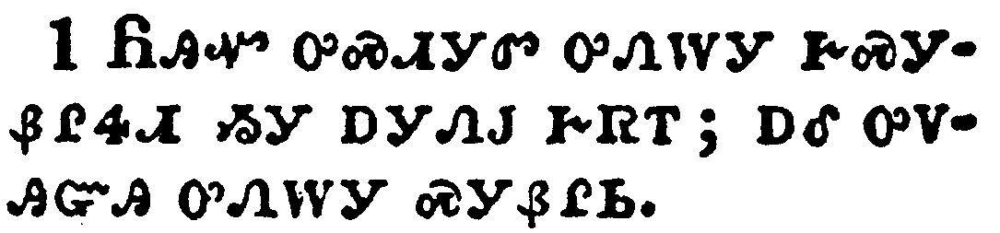</a></td>
</tr>
<tr class="even">
<td>Would to God ye could bear with me a little in my folly: and indeed bear with me.</td>
</tr>
<tr class="odd">
<td>ᏲᎯᏉ ᎤᏍᏗᎩᏛ ᎤᏁᎳᎩ ᎨᏍᎩᏰᎵᏎᏗ ᏱᎩ ᎠᎩᏁᎫ ᎨᏒᎢ; ᎠᎴ ᎤᏙᎯᏳᎯ ᎤᏁᎳᎩ ᏍᎩᏰᎵᏏ.</td>
</tr>
<tr class="even">
<td>Yo-hi-quo u-s-di-gi-dv u-ne-la-gi ge-s-gi-ye-li-se-di yi-gi a-gi-ne-gu ge-sv-i; a-le u-do-hi-yu-hi u-ne-la-gi s-gi-ye-li-si.</td>
</tr>
</tbody>
</table>

<table>
<tbody>
<tr class="odd">
<td><a href="081102.png">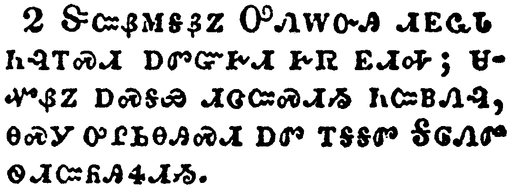</a></td>
</tr>
<tr class="even">
<td>For I am jealous over you with godly jealousy: for I have espoused you to one husband, that I may present you as a chaste virgin to Christ.</td>
</tr>
<tr class="odd">
<td>ᏕᏨᏰᎷᎦᏰᏃ ᎤᏁᎳᏅᎯ ᏗᎬᏩᏓ ᏂᎸᎢᏍᏗ ᎠᏛᏳᎨᏗ ᎨᏒ ᎬᏗᎭ; ᏌᏉᏰᏃ ᎠᏍᎦᏯ ᏗᏣᏨᏍᏗᏱ ᏂᏨᏴᏁᎸ, ᎾᏍᎩ ᎤᎵᏏᎾᎯᏍᏗ ᎠᏛ ᎢᎦᎦᏛ ᎦᎶᏁᏛ ᏫᏗᏨᏲᎯᏎᏗᏱ.</td>
</tr>
<tr class="even">
<td>De-tsv-ye-lu-ga-ye-no U-ne-la-nv-hi di-gv-wa-da ni-lv-i-s-di a-dv-yu-ge-di ge-sv gv-di-ha; sa-quo-ye-no a-s-ga-ya di-tsa-tsv-s-di-yi ni-tsv-yv-ne-lv, na-s-gi u-li-si-na-hi-s-di a-dv i-ga-ga-dv Ga-lo-ne-dv wi-di-tsv-yo-hi-se-di-yi.</td>
</tr>
</tbody>
</table>

<table>
<tbody>
<tr class="odd">
<td><a href="081103.png">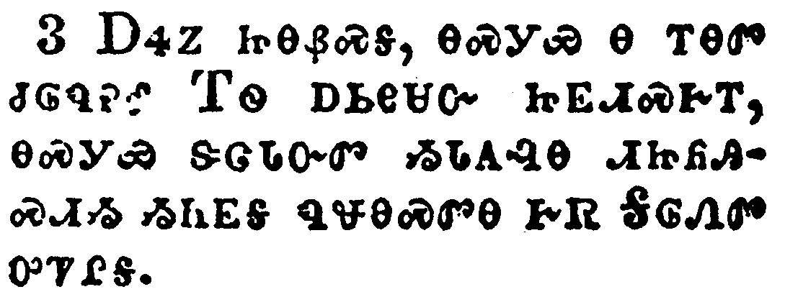</a></td>
</tr>
<tr class="even">
<td>But I fear, lest by any means, as the serpent beguiled Eve through his subtilty, so your minds should be corrupted from the simplicity that is in Christ.</td>
</tr>
<tr class="odd">
<td>ᎠᏎᏃ ᏥᎾᏰᏍᎦ, ᎾᏍᎩᏯ Ꮎ ᎢᎾᏛ ᏧᎶᏄᎮᎴ ᎢᏫ ᎠᏏᎾᏌᏅ ᏥᎬᏗᏍᎨᎢ, ᎾᏍᎩᏯ ᏕᏣᏓᏅᏛ ᏱᏓᎪᎸᎾ ᏗᏥᏲᎯᏍᏗᏱ ᏱᏂᎬᎦ ᏄᏠᎾᏍᏛᎾ ᎨᏒ ᎦᎶᏁᏛ ᎤᏤᎵᎦ.</td>
</tr>
<tr class="even">
<td>A-se-no tsi-na-ye-s-ga, na-s-gi-ya na i-na-dv tsu-lo-nu-he-le I-wi a-si-na-sa-nv tsi-gv-di-s-ge-i, na-s-gi-ya de-tsa-da-nv-dv yi-da-go-lv-na di-tsi-yo-hi-s-di-yi yi-ni-gv-ga nu-tlo-na-s-dv-na ge-sv Ga-lo-ne-dv u-tse-li-ga.</td>
</tr>
</tbody>
</table>

<table>
<tbody>
<tr class="odd">
<td><a href="081104.png">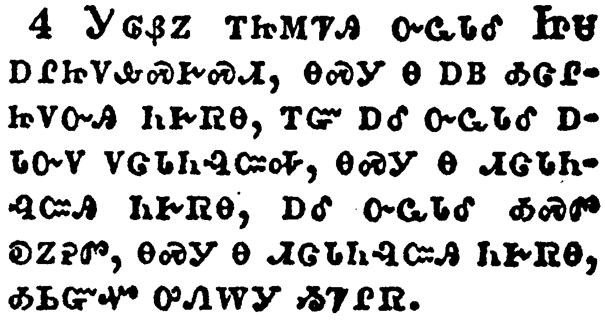</a></td>
</tr>
<tr class="even">
<td>For if he that cometh preacheth another Jesus, whom we have not preached, or if ye receive another spirit, which ye have not received, or another gospel, which ye have not accepted, ye might well bear with him.</td>
</tr>
<tr class="odd">
<td>ᎩᎶᏰᏃ ᎢᏥᎷᏤᎯ ᏅᏩᏓᎴ ᏥᏌ ᎠᎵᏥᏙᎲᏍᎨᏍᏗ, ᎾᏍᎩ Ꮎ ᎠᏴ ᎣᏣᎵᏥᏙᏅᎯ ᏂᎨᏒᎾ, ᎢᏳ ᎠᎴ ᏅᏩᏓᎴ ᎠᏓᏅᏙ ᏙᏣᏓᏂᎸᏨᎭ, ᎾᏍᎩ Ꮎ ᏗᏣᏓᏂᎸᏨᎯ ᏂᎨᏒᎾ, ᎠᎴ ᏅᏩᏓᎴ ᎣᏍᏛ ᎧᏃᎮᏛ, ᎾᏍᎩ Ꮎ ᏗᏣᏓᏂᎸᏨᎯ ᏂᎨᏒᎾ, ᎣᏏᏳᏉ ᎤᏁᎳᎩ ᏱᏤᎵᏒ.</td>
</tr>
<tr class="even">
<td>Gi-lo-ye-no i-tsi-lu-tse-hi nv-wa-da-le Tsi-sa a-li-tsi-do-hv-s-ge-s-di, na-s-gi na a-yv o-tsa-li-tsi-do-nv-hi ni-ge-sv-na, i-yu a-le nv-wa-da-le a-da-nv-do do-tsa-da-ni-lv-tsv-ha, na-s-gi na di-tsa-da-ni-lv-tsv-hi ni-ge-sv-na, a-le nv-wa-da-le o-s-dv ka-no-he-dv, na-s-gi na di-tsa-da-ni-lv-tsv-hi ni-ge-sv-na, o-si-yu-quo u-ne-la-gi yi-tse-li-sv.</td>
</tr>
</tbody>
</table>

<table>
<tbody>
<tr class="odd">
<td><a href="081105.png">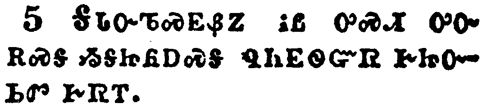</a></td>
</tr>
<tr class="even">
<td>For I suppose I was not a whit behind the very chiefest apostles.</td>
</tr>
<tr class="odd">
<td>ᎦᏓᏅᏖᏍᎬᏰᏃ ᎥᏝ ᎤᏍᏗ ᎤᏅ ᎡᏍᎦ ᏱᎦᏥᏲᎠᏍᎦ ᏄᏂᎬᏫᏳᏒ ᎨᏥᏅᏏᏛ ᎨᏒᎢ.</td>
</tr>
<tr class="even">
<td>Ga-da-nv-te-s-gv-ye-no v-tla u-s-di u-nv e-s-ga yi-ga-tsi-yo-a-s-ga nu-ni-gv-wi-yu-sv ge-tsi-nv-si-dv ge-sv-i.</td>
</tr>
</tbody>
</table>

<table>
<tbody>
<tr class="odd">
<td><a href="081106.png">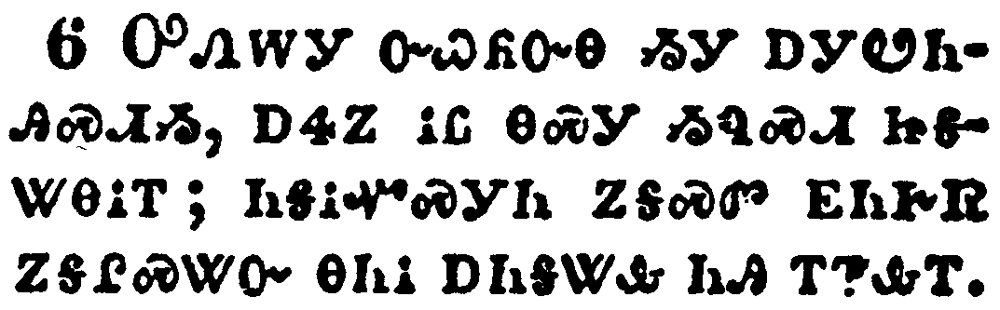</a></td>
</tr>
<tr class="even">
<td>But though I be rude in speech, yet not in knowledge; but we have been throughly made manifest among you in all things.</td>
</tr>
<tr class="odd">
<td>ᎤᏁᎳᎩ ᏅᏇᏲᏅᎾ ᏱᎩ ᎠᎩᏬᏂᎯᏍᏗᏱ, ᎠᏎᏃ ᎥᏝ ᎾᏍᎩ ᏱᏄᏍᏗ ᏥᎦᏔᎾᎥᎢ; ᏂᎦᎥᏉᏍᎩᏂ ᏃᎦᏍᏛ ᎬᏂᎨᏒ ᏃᎦᎵᏍᏔᏅ ᎾᏂᎥ ᎠᏂᎦᏔᎲ ᏂᎯ ᎢᏤᎲᎢ.</td>
</tr>
<tr class="even">
<td>U-ne-la-gi nv-que-yo-nv-na yi-gi a-gi-wo-ni-hi-s-di-yi, a-se-no v-tla na-s-gi yi-nu-s-di tsi-ga-ta-na-v-i; ni-ga-v-quo-s-gi-ni no-ga-s-dv gv-ni-ge-sv no-ga-li-s-ta-nv na-ni-v a-ni-ga-ta-hv ni-hi i-tse-hv-i.</td>
</tr>
</tbody>
</table>

<table>
<tbody>
<tr class="odd">
<td><a href="081107.png">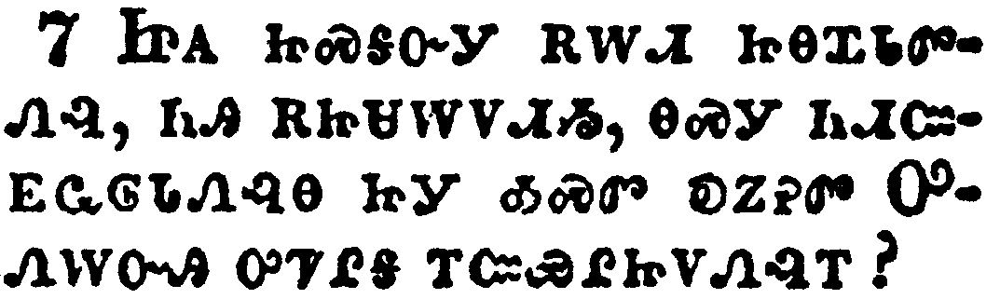</a></td>
</tr>
<tr class="even">
<td>Have I committed an offence in abasing myself that ye might be exalted, because I have preached to you the gospel of God freely?</td>
</tr>
<tr class="odd">
<td>ᏥᎪ ᏥᏍᎦᏅᎩ ᎡᎳᏗ ᏥᎾᏆᏓᏛᏁᎸ, ᏂᎯ ᎡᏥᏌᎳᏙᏗᏱ, ᎾᏍᎩ ᏂᏗᏨᎬᏩᎶᏓᏁᎸᎾ ᏥᎩ ᎣᏍᏛ ᎧᏃᎮᏛ ᎤᏁᎳᏅᎯ ᎤᏤᎵᎦ ᎢᏨᏯᎵᏥᏙᏁᎸᎢ?</td>
</tr>
<tr class="even">
<td>Tsi-go tsi-s-ga-nv-gi e-la-di tsi-na-qua-da-dv-ne-lv, ni-hi e-tsi-sa-la-do-di-yi, na-s-gi ni-di-tsv-gv-wa-lo-da-ne-lv-na tsi-gi o-s-dv ka-no-he-dv U-ne-la-nv-hi u-tse-li-ga i-tsv-ya-li-tsi-do-ne-lv-i?</td>
</tr>
</tbody>
</table>

<table>
<tbody>
<tr class="odd">
<td><a href="081108.png">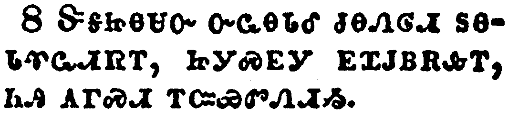</a></td>
</tr>
<tr class="even">
<td>I robbed other churches, taking wages of them, to do you service.</td>
</tr>
<tr class="odd">
<td>ᏕᎦᏥᎾᏌᏅ ᏅᏩᎾᏓᎴ ᏧᎾᏁᎶᏗ ᏚᎾᏓᏡᏩᏗᏒᎢ, ᏥᎩᏍᎬᎩ ᎬᏆᎫᏴᎡᎲᎢ, ᏂᎯ ᎪᎱᏍᏗ ᎢᏨᏯᏛᏁᏗᏱ.</td>
</tr>
<tr class="even">
<td>De-ga-tsi-na-sa-nv nv-wa-na-da-le tsu-na-ne-lo-di du-na-da-tlu-wa-di-sv-i, tsi-gi-s-gv-gi gv-qua-gu-yv-e-hv-i, ni-hi go-hu-s-di i-tsv-ya-dv-ne-di-yi.</td>
</tr>
</tbody>
</table>

<table>
<tbody>
<tr class="odd">
<td><a href="081109.png">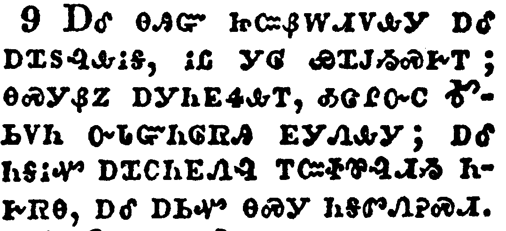</a></td>
</tr>
<tr class="even">
<td>And when I was present with you, and wanted, I was chargeable to no man: for that which was lacking to me the brethren which came from Macedonia supplied: and in all things I have kept myself from being burdensome unto you, and so will I keep myself.</td>
</tr>
<tr class="odd">
<td>ᎠᎴ ᎾᎯᏳ ᏥᏨᏰᎳᏗᏙᎲᎩ ᎠᎴ ᎠᏆᏚᎸᎲᎥᎦ, ᎥᏝ ᎩᎶ ᏯᏆᎫᏱᏍᎨᎢ; ᎾᏍᎩᏰᏃ ᎠᎩᏂᎬᏎᎲᎢ, ᎣᏣᎵᏅᏟ ᎹᏏᏙᏂ ᏅᏓᏳᏂᎶᏒᎯ ᎬᎩᏁᎲᎩ; ᎠᎴ ᏂᎦᎥᏉ ᎠᏆᏟᏂᎬᏁᎸ ᎢᏨᏐᏈᎸᏗᏱ ᏂᎨᏒᎾ, ᎠᎴ ᎠᏏᏉ ᎾᏍᎩ ᏂᎦᏛᏁᎮᏍᏗ.</td>
</tr>
<tr class="even">
<td>A-le na-hi-yu tsi-tsv-ye-la-di-do-hv-gi a-le a-qua-du-lv-hv-v-ga, v-tla gi-lo ya-qua-gu-yi-s-ge-i; na-s-gi-ye-no a-gi-ni-gv-se-hv-i, o-tsa-li-nv-tli Ma-si-do-ni nv-da-yu-ni-lo-sv-hi gv-gi-ne-hv-gi; a-le ni-ga-v-quo a-qua-tli-ni-gv-ne-lv i-tsv-so-qui-lv-di-yi ni-ge-sv-na, a-le a-si-quo na-s-gi ni-ga-dv-ne-he-s-di.</td>
</tr>
</tbody>
</table>

<table>
<tbody>
<tr class="odd">
<td><a href="081110.png">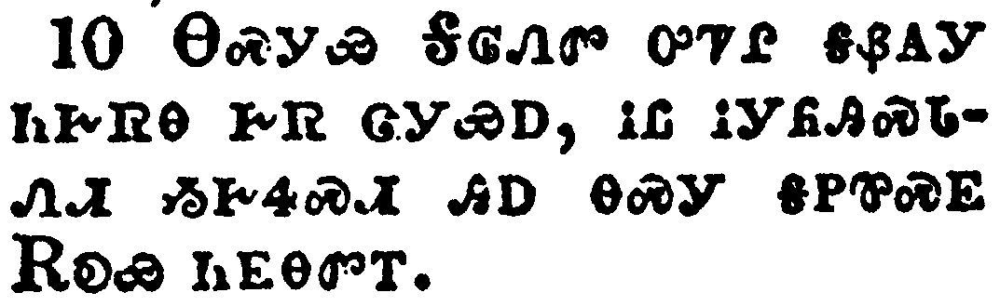</a></td>
</tr>
<tr class="even">
<td>As the truth of Christ is in me, no man shall stop me of this boasting in the regions of Achaia.</td>
</tr>
<tr class="odd">
<td>ᎾᏍᎩᏯ ᎦᎶᏁᏛ ᎤᏤᎵ ᎦᏰᎪᎩ ᏂᎨᏒᎾ ᎨᏒ ᏣᎩᏯᎠ, ᎥᏝ ᎥᎩᏲᎯᏍᏓᏁᏗ ᏱᎨᏎᏍᏗ ᎯᎠ ᎾᏍᎩ ᎦᏢᏈᏍᎬ ᎡᎧᏯ ᏂᎬᎾᏛᎢ.</td>
</tr>
<tr class="even">
<td>Na-s-gi-ya Ga-lo-ne-dv u-tse-li ga-ye-go-gi ni-ge-sv-na ge-sv tsa-gi-ya-a, v-tla v-gi-yo-hi-s-da-ne-di yi-ge-se-s-di hi-a na-s-gi ga-tlv-qui-s-gv E-ka-ya ni-gv-na-dv-i.</td>
</tr>
</tbody>
</table>

<table>
<tbody>
<tr class="odd">
<td><a href="081111.png">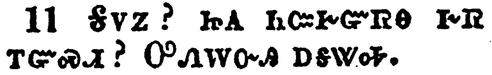</a></td>
</tr>
<tr class="even">
<td>Wherefore? because I love you not? God knoweth.</td>
</tr>
<tr class="odd">
<td>ᎦᏙᏃ? ᏥᎪ ᏂᏨᎨᏳᏒᎾ ᎨᏒ ᎢᏳᏍᏗ? ᎤᏁᎳᏅᎯ ᎠᎦᏔᎭ.</td>
</tr>
<tr class="even">
<td>Ga-do-no? tsi-go ni-tsv-ge-yu-sv-na ge-sv i-yu-s-di? U-ne-la-nv-hi a-ga-ta-ha.</td>
</tr>
</tbody>
</table>

<table>
<tbody>
<tr class="odd">
<td><a href="081112.png">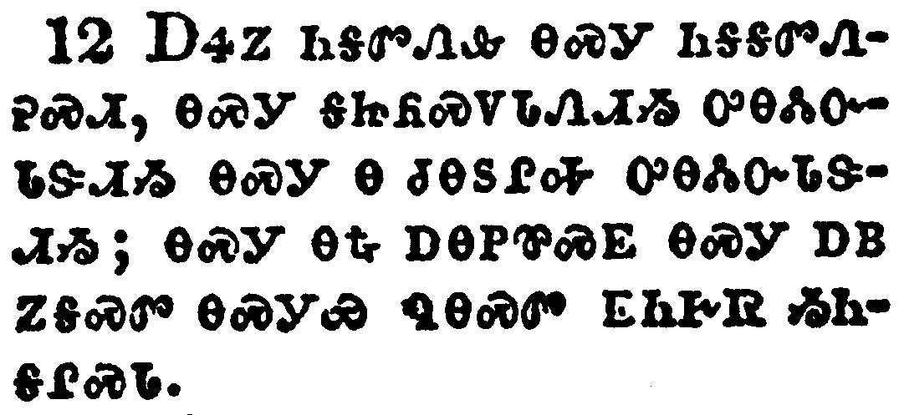</a></td>
</tr>
<tr class="even">
<td>But what I do, that I will do, that I may cut off occasion from them which desire occasion; that wherein they glory, they may be found even as we.</td>
</tr>
<tr class="odd">
<td>ᎠᏎᏃ ᏂᎦᏛᏁᎲ ᎾᏍᎩ ᏂᎦᎦᏛᏁᎮᏍᏗ, ᎾᏍᎩ ᎦᏥᏲᏍᏙᏓᏁᏗᏱ ᎤᎾᏜᏓᏅᏓᏕᏗᏱ ᎾᏍᎩ Ꮎ ᏧᎾᏚᎵᎭ ᎤᎾᏜᏓᏅᏓᏕᏗᏱ; ᎾᏍᎩ ᎾᎿᎭᎠᎾᏢᏈᏍᎬ ᎾᏍᎩ ᎠᏴ ᏃᎦᏍᏛ ᎾᏍᎩᏯ ᏄᎾᏍᏛ ᎬᏂᎨᏒ ᏱᏂᎦᎵᏍᏓ.</td>
</tr>
<tr class="even">
<td>A-se-no ni-ga-dv-ne-hv na-s-gi ni-ga-ga-dv-ne-he-s-di, na-s-gi ga-tsi-yo-s-do-da-ne-di-yi u-na-dla-nv-da-de-di-yi na-s-gi na tsu-na-du-li-ha u-na-dla-nv-da-de-di-yi; na-s-gi na-hna a-na-tlv-qui-s-gv na-s-gi a-yv no-ga-s-dv na-s-gi-ya nu-na-s-dv gv-ni-ge-sv yi-ni-ga-li-s-da.</td>
</tr>
</tbody>
</table>

<table>
<tbody>
<tr class="odd">
<td><a href="081113.png">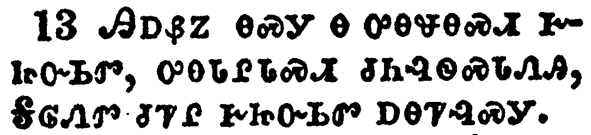</a></td>
</tr>
<tr class="even">
<td>For such are false apostles, deceitful workers, transforming themselves into the apostles of Christ.</td>
</tr>
<tr class="odd">
<td>ᎯᎠᏰᏃ ᎾᏍᎩ Ꮎ ᎤᎾᏠᎾᏍᎩ ᎨᏥᏅᏏᏛ, ᎤᎾᏓᎵᏓᏍᏗ ᏧᏂᎸᏫᏍᏓᏁᎯ, ᎦᎶᏁᏛ ᏧᏤᎵ ᎨᏥᏅᏏᏛ ᎠᎾᏤᎸᏍᎩ.</td>
</tr>
<tr class="even">
<td>Hi-a-ye-no na-s-gi na u-na-tlo-na-s-gi ge-tsi-nv-si-dv, u-na-da-li-da-s-di tsu-ni-lv-wi-s-da-ne-hi, Ga-lo-ne-dv tsu-tse-li ge-tsi-nv-si-dv a-na-tse-lv-s-gi.</td>
</tr>
</tbody>
</table>

<table>
<tbody>
<tr class="odd">
<td><a href="081114.png">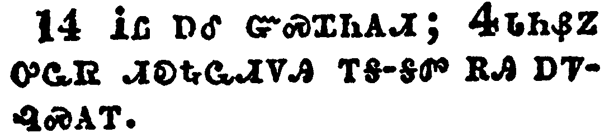</a></td>
</tr>
<tr class="even">
<td>And no marvel; for Satan himself is transformed into an angel of light.</td>
</tr>
<tr class="odd">
<td>ᎥᏝ ᎠᎴ ᏳᏍᏆᏂᎪᏗ; ᏎᏓᏂᏰᏃ ᎤᏩᏒ ᏗᎧᎿᎭᏩᏗᏙᎯ ᎢᎦ-ᎦᏛ ᎡᎯ ᎠᏤᎸᏍᎪᎢ.</td>
</tr>
<tr class="even">
<td>V-tla a-le yu-s-qua-ni-go-di; Se-da-ni-ye-no u-wa-sv di-ka-hna-wa-di-do-hi i-ga--ga-dv e-hi a-tse-lv-s-go-i.</td>
</tr>
</tbody>
</table>

<table>
<tbody>
<tr class="odd">
<td><a href="081115.png">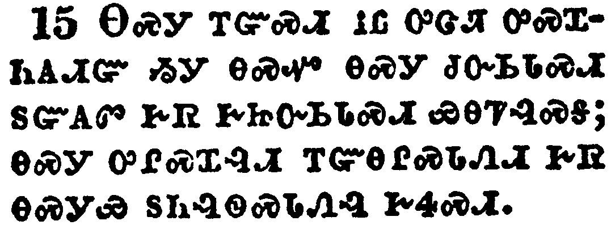</a></td>
</tr>
<tr class="even">
<td>Therefore it is no great thing if his ministers also be transformed as the ministers of righteousness; whose end shall be according to their works.</td>
</tr>
<tr class="odd">
<td>ᎾᏍᎩ ᎢᏳᏍᏗ ᎥᏝ ᎤᏣᏘ ᎤᏍᏆᏂᎪᏗᏳ ᏱᎩ ᎾᏍᏉ ᎾᏍᎩ ᏧᏅᏏᏓᏍᏗ ᏚᏳᎪᏛ ᎨᏒ ᎨᏥᏅᏏᏓᏍᏗ ᏯᎾᏤᎸᏍᎦ; ᎾᏍᎩ ᎤᎵᏍᏆᎸᏗ ᎢᏳᎾᎵᏍᏓᏁᏗ ᎨᏒ ᎾᏍᎩᏯ ᏚᏂᎸᏫᏍᏓᏁᎸ ᎨᏎᏍᏗ.</td>
</tr>
<tr class="even">
<td>Na-s-gi i-yu-s-di v-tla u-tsa-ti u-s-qua-ni-go-di-yu yi-gi na-s-quo na-s-gi tsu-nv-si-da-s-di du-yu-go-dv ge-sv ge-tsi-nv-si-da-s-di ya-na-tse-lv-s-ga; na-s-gi u-li-s-qua-lv-di i-yu-na-li-s-da-ne-di ge-sv na-s-gi-ya du-ni-lv-wi-s-da-ne-lv ge-se-s-di.</td>
</tr>
</tbody>
</table>

<table>
<tbody>
<tr class="odd">
<td><a href="081116.png">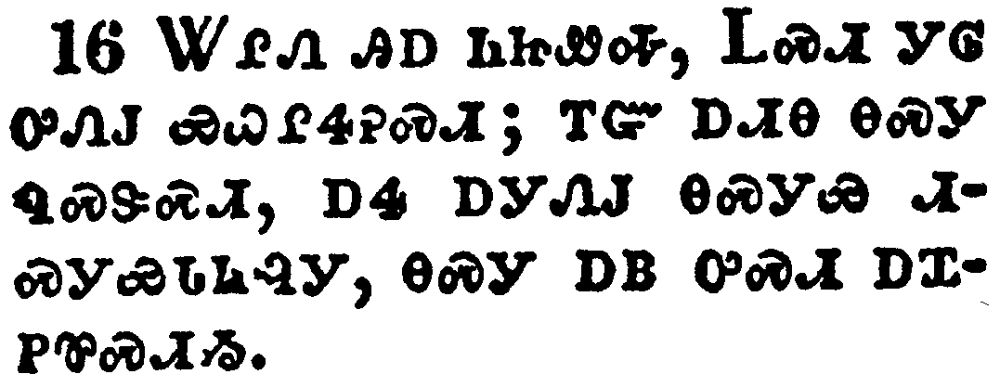</a></td>
</tr>
<tr class="even">
<td>I say again, Let no man think me a fool; if otherwise, yet as a fool receive me, that I may boast myself a little.</td>
</tr>
<tr class="odd">
<td>ᏔᎵᏁ ᎯᎠ ᏂᏥᏪᎭ, ᏞᏍᏗ ᎩᎶ ᎤᏁᎫ ᏯᏇᎵᏎᎮᏍᏗ; ᎢᏳ ᎠᏗᎾ ᎾᏍᎩ ᏄᏍᏕᏍᏗ, ᎠᏎ ᎠᎩᏁᎫ ᎾᏍᎩᏯ ᏗᏍᎩᏯᏓᏂᎸᎩ, ᎾᏍᎩ ᎠᏴ ᎤᏍᏗ ᎠᏆᏢᏈᏍᏗᏱ.</td>
</tr>
<tr class="even">
<td>Ta-li-ne hi-a ni-tsi-we-ha, Tle-s-di gi-lo u-ne-gu ya-que-li-se-he-s-di; i-yu a-di-na na-s-gi nu-s-de-s-di, a-se a-gi-ne-gu na-s-gi-ya di-s-gi-ya-da-ni-lv-gi, na-s-gi a-yv u-s-di a-qua-tlv-qui-s-di-yi.</td>
</tr>
</tbody>
</table>

<table>
<tbody>
<tr class="odd">
<td><a href="081117.png">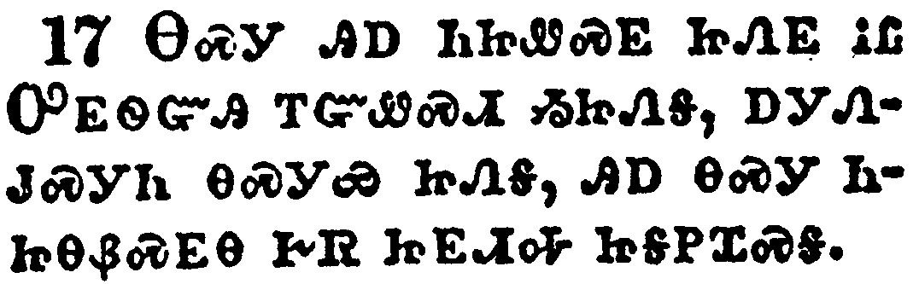</a></td>
</tr>
<tr class="even">
<td>That which I speak, I speak it not after the Lord, but as it were foolishly, in this confidence of boasting.</td>
</tr>
<tr class="odd">
<td>ᎾᏍᎩ ᎯᎠ ᏂᏥᏪᏍᎬ ᏥᏁᎬ ᎥᏝ ᎤᎬᏫᏳᎯ ᎢᏳᏪᏍᏗ ᏱᏥᏁᎦ, ᎠᎩᏁᎫᏍᎩᏂ ᎾᏍᎩᏯ ᏥᏁᎦ, ᎯᎠ ᎾᏍᎩ ᏂᏥᎾᏰᏍᎬᎾ ᎨᏒ ᏥᎬᏗᎭ ᏥᎦᏢᏆᏍᎦ.</td>
</tr>
<tr class="even">
<td>Na-s-gi hi-a ni-tsi-we-s-gv tsi-ne-gv v-tla U-gv-wi-yu-hi i-yu-we-s-di yi-tsi-ne-ga, a-gi-ne-gu-s-gi-ni na-s-gi-ya tsi-ne-ga, hi-a na-s-gi ni-tsi-na-ye-s-gv-na ge-sv tsi-gv-di-ha tsi-ga-tlv-qua-s-ga.</td>
</tr>
</tbody>
</table>

<table>
<tbody>
<tr class="odd">
<td><a href="081118.png">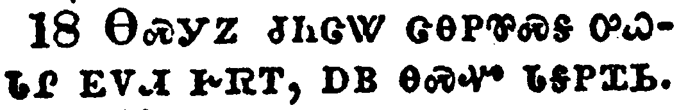</a></td>
</tr>
<tr class="even">
<td>Seeing that many glory after the flesh, I will glory also.</td>
</tr>
<tr class="odd">
<td>ᎾᏍᎩᏃ ᏧᏂᏣᏔ ᏣᎾᏢᏈᏍᎦ ᎤᏇᏓᎵ ᎬᏙᏗ ᎨᏒᎢ, ᎠᏴ ᎾᏍᏉ ᏓᎦᏢᏆᏏ.</td>
</tr>
<tr class="even">
<td>Na-s-gi-no tsu-ni-tsa-ta tsa-na-tlv-qui-s-ga u-que-da-li gv-do-di ge-sv-i, a-yv na-s-quo da-ga-tlv-qua-si.</td>
</tr>
</tbody>
</table>

<table>
<tbody>
<tr class="odd">
<td><a href="081119.png">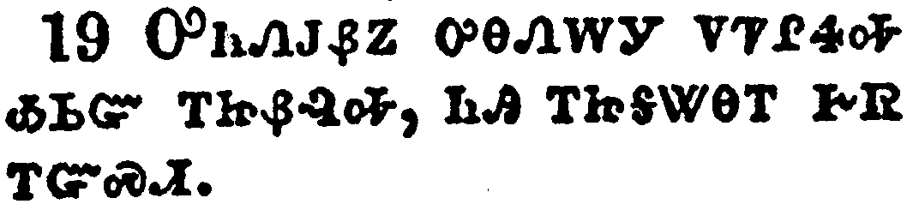</a></td>
</tr>
<tr class="even">
<td>For ye suffer fools gladly, seeing ye yourselves are wise.</td>
</tr>
<tr class="odd">
<td>ᎤᏂᏁᎫᏰᏃ ᎤᎾᏁᎳᎩ ᏙᏤᎵᏎᎭ ᎣᏏᏳ ᎢᏥᏰᎸᎭ, ᏂᎯ ᎢᏥᎦᏔᎾᎢ ᎨᏒ ᎢᏳᏍᏗ.</td>
</tr>
<tr class="even">
<td>U-ni-ne-gu-ye-no u-na-ne-la-gi do-tse-li-se-ha o-si-yu i-tsi-ye-lv-ha, ni-hi i-tsi-ga-ta-na-i ge-sv i-yu-s-di.</td>
</tr>
</tbody>
</table>

<table>
<tbody>
<tr class="odd">
<td><a href="081120.png">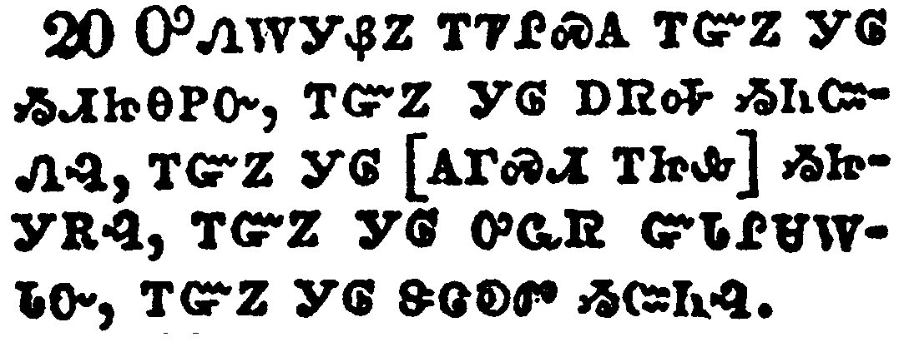</a></td>
</tr>
<tr class="even">
<td>For ye suffer, if a man bring you into bondage, if a man devour you, if a man take of you, if a man exalt himself, if a man smite you on the face.</td>
</tr>
<tr class="odd">
<td>ᎤᏁᎳᎩᏰᏃ ᎢᏤᎵᏍᎪ ᎢᏳᏃ ᎩᎶ ᏱᏗᏥᎾᏢᏅ, ᎢᏳᏃ ᎩᎶ ᎠᏒᎭ ᏱᏂᏨᏁᎸ, ᎢᏳᏃ ᎩᎶ [ᎪᎱᏍᏗ ᎢᏥᎲ] ᏱᏥᎩᎡᎸ, ᎢᏳᏃ ᎩᎶ ᎤᏩᏒ ᏳᏓᎵᏌᎳᏓᏅ, ᎢᏳᏃ ᎩᎶ ᏕᏣᎧᏛ ᏱᏨᏂᎸ.</td>
</tr>
<tr class="even">
<td>U-ne-la-gi-ye-no i-tse-li-s-go i-yu-no gi-lo yi-di-tsi-na-tlv-nv, i-yu-no gi-lo a-sv-ha yi-ni-tsv-ne-lv, i-yu-no gi-lo [go-hu-s-di i-tsi-hv] yi-tsi-gi-e-lv, i-yu-no gi-lo u-wa-sv yu-da-li-sa-la-da-nv, i-yu-no gi-lo de-tsa-ka-dv yi-tsv-ni-lv.</td>
</tr>
</tbody>
</table>

<table>
<tbody>
<tr class="odd">
<td><a href="081121.png">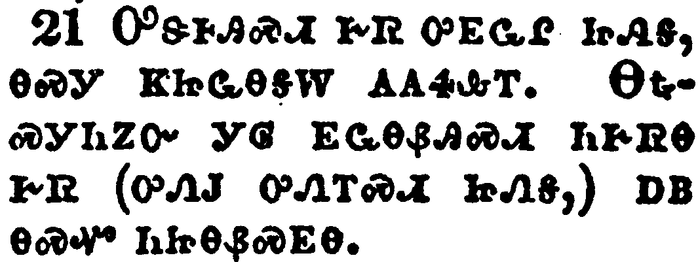</a></td>
</tr>
<tr class="even">
<td>I speak as concerning reproach, as though we had been weak. Howbeit whereinsoever any is bold, (I speak foolishly,) I am bold also.</td>
</tr>
<tr class="odd">
<td>ᎤᏕᎰᎯᏍᏗ ᎨᏒ ᎤᎬᏩᎵ ᏥᏁᎦ, ᎾᏍᎩ ᏦᏥᏩᎾᎦᎳ ᎪᎪᏎᎲᎢ. ᎾᎿᎭᏍᎩᏂᏃᏅ ᎩᎶ ᎬᏩᎾᏰᎯᏍᏗ ᏂᎨᏒᎾ ᎨᏒ (ᎤᏁᎫ ᎤᏁᎢᏍᏗ ᏥᏁᎦ,) ᎠᏴ ᎾᏍᏉ ᏂᏥᎾᏰᏍᎬᎾ.</td>
</tr>
<tr class="even">
<td>U-de-ho-hi-s-di ge-sv u-gv-wa-li tsi-ne-ga, na-s-gi tso-tsi-wa-na-ga-la go-go-se-hv-i. Na-hna-s-gi-ni-no-nv gi-lo gv-wa-na-ye-hi-s-di ni-ge-sv-na ge-sv (u-ne-gu u-ne-i-s-di tsi-ne-ga,) a-yv na-s-quo ni-tsi-na-ye-s-gv-na.</td>
</tr>
</tbody>
</table>

<table>
<tbody>
<tr class="odd">
<td></td>
</tr>
<tr class="even">
<td>Are they Hebrews? so am I. Are they Israelites? so am I. Are they the seed of Abraham? so am I.</td>
</tr>
<tr class="odd">
<td>ᏥᎪ ᎢᎾᏈᎷ ᎾᏍᎩ? ᎠᏴ ᎾᏍᏉ. ᏥᎪ ᎠᏂᎢᏏᎵ? ᎠᏴ ᎾᏍᏉ. ᎡᏆᎭᎻᏍᎪ ᏧᏁᏢᏔᏅᏛ ᎾᏍᎩ? ᎠᏴ ᎾᏍᏉ.</td>
</tr>
<tr class="even">
<td>Tsi-go I-na-qui-lu na-s-gi? a-yv na-s-quo. Tsi-go A-ni-i-si-li? a-yv na-s-quo. E-qua-ha-mi-s-go tsu-ne-tlv-ta-nv-dv na-s-gi? a-yv na-s-quo.</td>
</tr>
</tbody>
</table>

<table>
<tbody>
<tr class="odd">
<td></td>
</tr>
<tr class="even">
<td>Are they ministers of Christ? (I speak as a fool) I am more; in labours more abundant, in stripes above measure, in prisons more frequent, in deaths oft.</td>
</tr>
<tr class="odd">
<td>ᏥᎪ ᎦᎶᏁᏛ ᏧᏅᏏᏓᏍᏗ ᎾᏍᎩ? (ᎤᏁᎫ ᎤᏁᎢᏍᏗ ᏥᏁᎦ,) ᎠᏴ ᎤᏟᎢ; ᏓᎩᎸᏫᏍᏓᏁᎲ ᎤᏟ ᎢᎦᎢ; ᎥᎩᎵᎥᏂᎸ ᎤᏟᎯᏳ ᎢᎦᎢ; ᏗᎦᏍᏚᏗᏱ ᎥᎩᏴᏔᏅᎢ ᎤᏟ ᎢᎦᎢ; ᎠᎩᏲᎱᏏᏕᎾ ᎨᏒ ᏯᏃᏉ;</td>
</tr>
<tr class="even">
<td>Tsi-go Ga-lo-ne-dv tsu-nv-si-da-s-di na-s-gi? (u-ne-gu u-ne-i-s-di tsi-ne-ga,) a-yv u-tli-i; da-gi-lv-wi-s-da-ne-hv u-tli i-ga-i; v-gi-li-v-ni-lv u-tli-hi-yu i-ga-i; di-ga-s-du-di-yi v-gi-yv-ta-nv-i u-tli i-ga-i; a-gi-yo-hu-si-de-na ge-sv ya-no-quo;</td>
</tr>
</tbody>
</table>

<table>
<tbody>
<tr class="odd">
<td><a href="081124.png">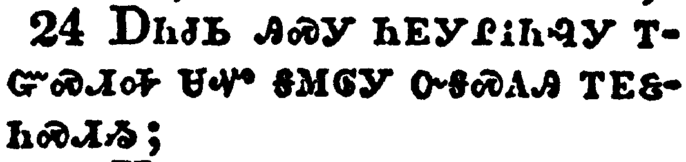</a></td>
</tr>
<tr class="even">
<td>Of the Jews five times received I forty stripes save one.</td>
</tr>
<tr class="odd">
<td>ᎠᏂᏧᏏ ᎯᏍᎩ ᏂᎬᎩᎵᎥᏂᎸᎩ ᎢᏳᏍᏗᎭ ᏌᏉ ᎦᎷᎶᎩ ᏅᎦᏍᎪᎯ ᎢᎬᏋᏂᏍᏗᏱ;</td>
</tr>
<tr class="even">
<td>A-ni-tsu-si hi-s-gi ni-gv-gi-li-v-ni-lv-gi i-yu-s-di-ha sa-quo ga-lu-lo-gi nv-ga-s-go-hi i-gv-quv-ni-s-di-yi;</td>
</tr>
</tbody>
</table>

<table>
<tbody>
<tr class="odd">
<td><a href="081125.png">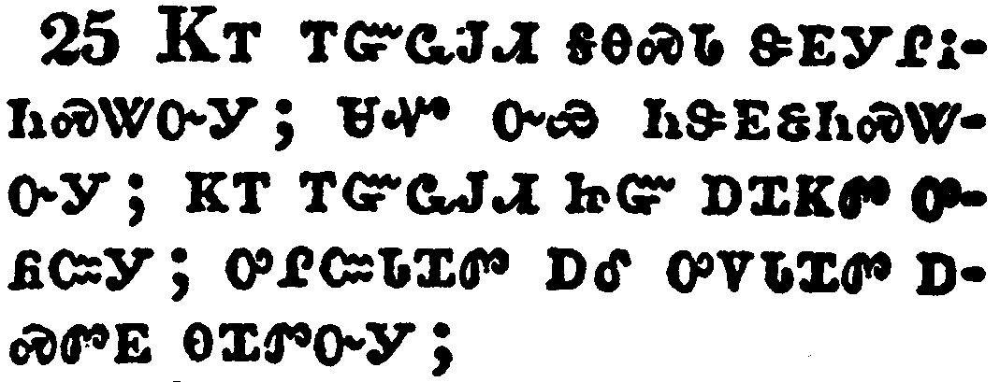</a></td>
</tr>
<tr class="even">
<td>Thrice was I beaten with rods, once was I stoned, thrice I suffered shipwreck, a night and a day I have been in the deep;</td>
</tr>
<tr class="odd">
<td>ᏦᎢ ᎢᏳᏩᎫᏗ ᎦᎾᏍᏓ ᏕᎬᎩᎵᎥᏂᏍᏔᏅᎩ; ᏌᏉ ᏅᏯ ᏂᏕᎬᏋᏂᏍᏔᏅᎩ; ᏦᎢ ᎢᏳᏩᎫᏗ ᏥᏳ ᎠᏆᏦᏛ ᎤᏲᏨᎩ; ᎤᎵᏨᏓᏆᏛ ᎠᎴ ᎤᏙᏓᏆᏛ ᎠᏍᏛᎬ ᎾᏆᏛᏅᎩ;</td>
</tr>
<tr class="even">
<td>Tso-i i-yu-wa-gu-di ga-na-s-da de-gv-gi-li-v-ni-s-ta-nv-gi; sa-quo nv-ya ni-de-gv-quv-ni-s-ta-nv-gi; tso-i i-yu-wa-gu-di tsi-yu a-qua-tso-dv u-yo-tsv-gi; u-li-tsv-da-qua-dv a-le u-do-da-qua-dv a-s-dv-gv na-qua-dv-nv-gi;</td>
</tr>
</tbody>
</table>

<table>
<tbody>
<tr class="odd">
<td><a href="081126.png">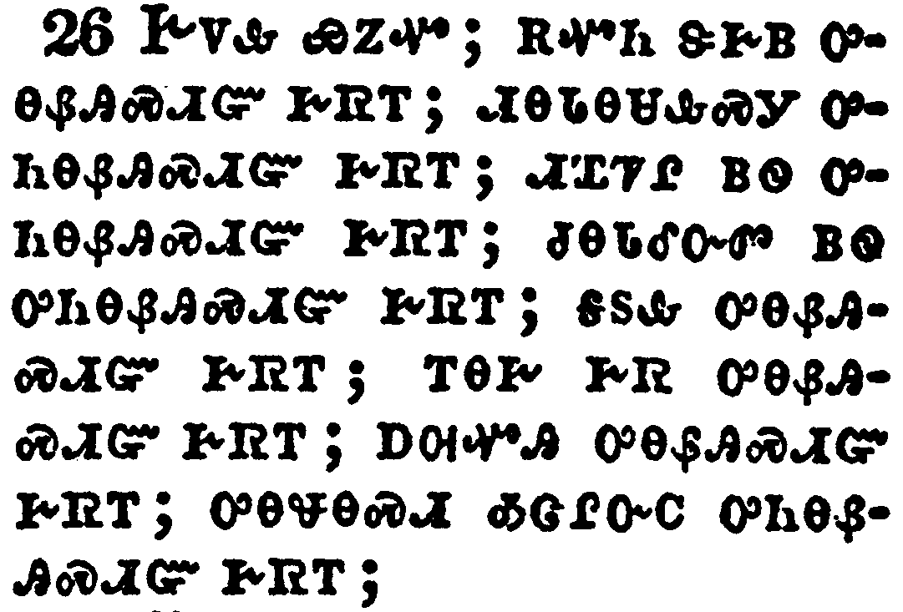</a></td>
</tr>
<tr class="even">
<td>In journeyings often, in perils of waters, in perils of robbers, in perils by mine own countrymen, in perils by the heathen, in perils in the city, in perils in the wilderness, in perils in the sea, in perils among false brethren;</td>
</tr>
<tr class="odd">
<td>ᎨᏙᎲ ᏯᏃᏉ; ᎡᏉᏂ ᏕᎨᏴ ᎤᎾᏰᎯᏍᏗᏳ ᎨᏒᎢ; ᏗᎾᏓᎾᏌᎲᏍᎩ ᎤᏂᎾᏰᎯᏍᏗᏳ ᎨᏒᎢ; ᏗᏆᏤᎵ ᏴᏫ ᎤᏂᎾᏰᎯᏍᏗᏳ ᎨᏒᎢ; ᏧᎾᏓᎴᏅᏛ ᏴᏫ ᎤᏂᎾᏰᎯᏍᏗᏳ ᎨᏒᎢ; ᎦᏚᎲ ᎤᎾᏰᎯᏍᏗᏳ ᎨᏒᎢ; ᎢᎾᎨ ᎨᏒ ᎤᎾᏰᎯᏍᏗᏳ ᎨᏒᎢ; ᎠᎺᏉᎯ ᎤᎾᏰᎯᏍᏗᏳ ᎨᏒᎢ; ᎤᎾᏠᎾᏍᏗ ᎣᏣᎵᏅᏟ ᎤᏂᎾᏰᎯᏍᏗᏳ ᎨᏒᎢ;</td>
</tr>
<tr class="even">
<td>Ge-do-hv ya-no-quo; e-quo-ni de-ge-yv u-na-ye-hi-s-di-yu ge-sv-i; di-na-da-na-sa-hv-s-gi u-ni-na-ye-hi-s-di-yu ge-sv-i; di-qua-tse-li yv-wi u-ni-na-ye-hi-s-di-yu ge-sv-i; tsu-na-da-le-nv-dv yv-wi u-ni-na-ye-hi-s-di-yu ge-sv-i; ga-du-hv u-na-ye-hi-s-di-yu ge-sv-i; i-na-ge ge-sv u-na-ye-hi-s-di-yu ge-sv-i; a-me-quo-hi u-na-ye-hi-s-di-yu ge-sv-i; u-na-tlo-na-s-di o-tsa-li-nv-tli u-ni-na-ye-hi-s-di-yu ge-sv-i;</td>
</tr>
</tbody>
</table>

<table>
<tbody>
<tr class="odd">
<td><a href="081127.png">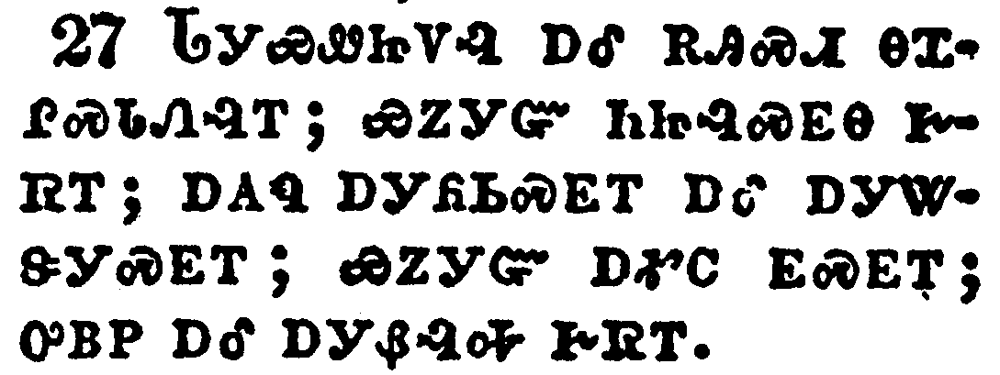</a></td>
</tr>
<tr class="even">
<td>In weariness and painfulness, in watchings often, in hunger and thirst, in fastings often, in cold and nakedness.</td>
</tr>
<tr class="odd">
<td>ᏓᎩᏯᏪᏥᏙᎸ ᎠᎴ ᎡᎯᏍᏗ ᎾᏆᎵᏍᏓᏁᎸᎢ; ᏯᏃᎩᏳ ᏂᏥᎸᏍᎬᎾ ᎨᏒᎢ; ᎠᎪᏄ ᎠᎩᏲᏏᏍᎬᎢ ᎠᎴ ᎠᎩᏔᏕᎩᏍᎬᎢ; ᏯᏃᎩᏳ ᎠᎹᏟ ᎬᏍᎬᎢ; ᎤᏴᏢ ᎠᎴ ᎠᎩᏰᎸᎭ ᎨᏒᎢ.</td>
</tr>
<tr class="even">
<td>Da-gi-ya-we-tsi-do-lv a-le e-hi-s-di na-qua-li-s-da-ne-lv-i; ya-no-gi-yu ni-tsi-lv-s-gv-na ge-sv-i; a-go-nu a-gi-yo-si-s-gv-i a-le a-gi-ta-de-gi-s-gv-i; ya-no-gi-yu a-ma-tli gv-s-gv-i; u-yv-tlv a-le a-gi-ye-lv-ha ge-sv-i.</td>
</tr>
</tbody>
</table>

<table>
<tbody>
<tr class="odd">
<td><a href="081128.png">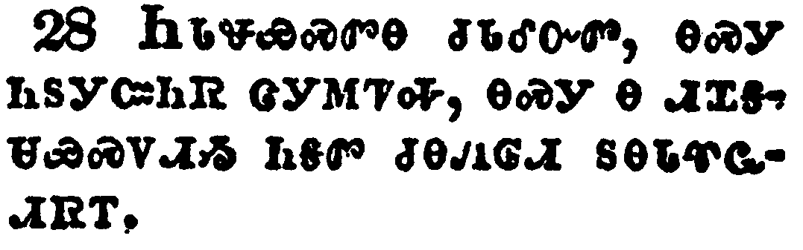</a></td>
</tr>
<tr class="even">
<td>Beside those things that are without, that which cometh upon me daily, the care of all the churches.</td>
</tr>
<tr class="odd">
<td>ᏂᏓᏠᏯᏍᏛᎾ ᏧᏓᎴᏅᏛ, ᎾᏍᎩ ᏂᏚᎩᏨᏂᏒ ᏣᎩᎷᏤᎭ, ᎾᏍᎩ Ꮎ ᏗᏆᎦᏌᏯᏍᏙᏗᏱ ᏂᎦᏛ ᏧᎾᏁᎶᏗ ᏚᎾᏓᏡᏩᏗᏒᎢ.</td>
</tr>
<tr class="even">
<td>Ni-da-tlo-ya-s-dv-na tsu-da-le-nv-dv, na-s-gi ni-du-gi-tsv-ni-sv tsa-gi-lu-tse-ha, na-s-gi na di-qua-ga-sa-ya-s-do-di-yi ni-ga-dv tsu-na-ne-lo-di du-na-da-tlu-wa-di-sv-i.</td>
</tr>
</tbody>
</table>

<table>
<tbody>
<tr class="odd">
<td><a href="081129.png">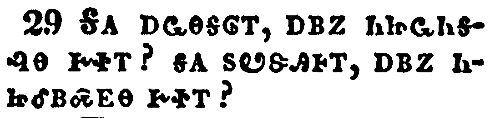</a></td>
</tr>
<tr class="even">
<td>Who is weak, and I am not weak? who is offended, and I burn not?</td>
</tr>
<tr class="odd">
<td>ᎦᎪ ᎠᏩᎾᎦᎶᎢ, ᎠᏴᏃ ᏂᏥᏩᏂᎦᎸᎾ ᎨᏐᎢ? ᎦᎪ ᏚᏬᏕᎯᎰᎢ, ᎠᏴᏃ ᏂᏥᎴᏴᏍᎬᎾ ᎨᏐᎢ?</td>
</tr>
<tr class="even">
<td>Ga-go a-wa-na-ga-lo-i, a-yv-no ni-tsi-wa-ni-ga-lv-na ge-so-i? ga-go du-wo-de-hi-ho-i, a-yv-no ni-tsi-le-yv-s-gv-na ge-so-i?</td>
</tr>
</tbody>
</table>

<table>
<tbody>
<tr class="odd">
<td><a href="081130.png">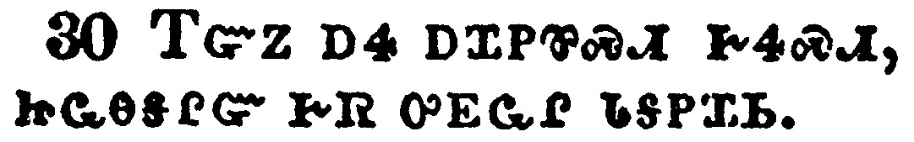</a></td>
</tr>
<tr class="even">
<td>If I must needs glory, I will glory of the things which concern mine infirmities.</td>
</tr>
<tr class="odd">
<td>ᎢᏳᏃ ᎠᏎ ᎠᏆᏢᏈᏍᏗ ᎨᏎᏍᏗ, ᏥᏩᎾᎦᎵᏳ ᎨᏒ ᎤᎬᏩᎵ ᏓᎦᏢᏆᏏ.</td>
</tr>
<tr class="even">
<td>I-yu-no a-se a-qua-tlv-qui-s-di ge-se-s-di, tsi-wa-na-ga-li-yu ge-sv u-gv-wa-li da-ga-tlv-qua-si.</td>
</tr>
</tbody>
</table>

<table>
<tbody>
<tr class="odd">
<td><a href="081131.png">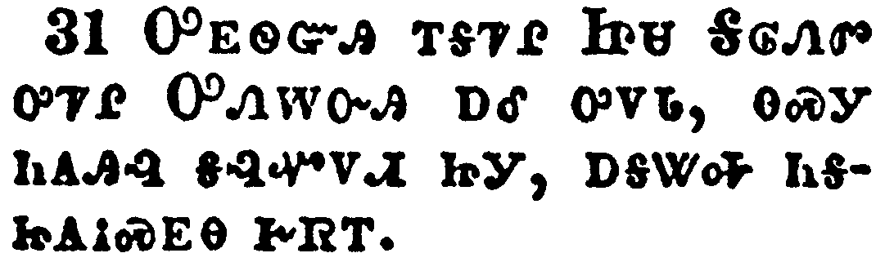</a></td>
</tr>
<tr class="even">
<td>The God and Father of our Lord Jesus Christ, which is blessed for evermore, knoweth that I lie not.</td>
</tr>
<tr class="odd">
<td>ᎤᎬᏫᏳᎯ ᎢᎦᏤᎵ ᏥᏌ ᎦᎶᏁᏛ ᎤᏤᎵ ᎤᏁᎳᏅᎯ ᎠᎴ ᎤᏙᏓ, ᎾᏍᎩ ᏂᎪᎯᎸ ᎦᎸᏉᏙᏗ ᏥᎩ, ᎠᎦᏔᎭ ᏂᎦᏥᎪᎥᏍᎬᎾ ᎨᏒᎢ.</td>
</tr>
<tr class="even">
<td>U-gv-wi-yu-hi i-ga-tse-li Tsi-sa Ga-lo-ne-dv u-tse-li U-ne-la-nv-hi a-le u-do-da, na-s-gi ni-go-hi-lv ga-lv-quo-do-di tsi-gi, a-ga-ta-ha ni-ga-tsi-go-v-s-gv-na ge-sv-i.</td>
</tr>
</tbody>
</table>

<table>
<tbody>
<tr class="odd">
<td><a href="081132.png">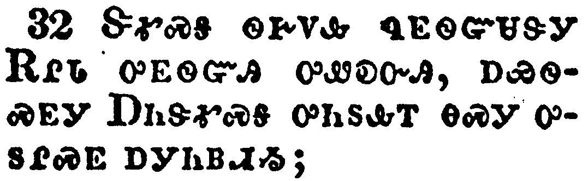</a></td>
</tr>
<tr class="even">
<td>In Damascus the governor under Aretas the king kept the city of the Damascenes with a garrison, desirous to apprehend me:</td>
</tr>
<tr class="odd">
<td>ᏕᎹᏍᎦ ᏫᎨᏙᎲ ᏄᎬᏫᏳᏎᏕᎩ ᎡᎵᏓ ᎤᎬᏫᏳᎯ ᎤᏪᎧᏅᎯ, ᎠᏯᏫᏍᎬᎩ ᎠᏂᏕᎹᏍᎦ ᎤᏂᏚᎲᎢ ᎾᏍᎩ ᎤᏚᎵᏍᎬ ᎠᎩᏂᏴᏗᏱ;</td>
</tr>
<tr class="even">
<td>De-ma-s-ga wi-ge-do-hv nu-gv-wi-yu-se-de-gi E-li-da u-gv-wi-yu-hi u-we-ka-nv-hi, a-ya-wi-s-gv-gi A-ni-de-ma-s-ga u-ni-du-hv-i na-s-gi u-du-li-s-gv a-gi-ni-yv-di-yi;</td>
</tr>
</tbody>
</table>

<table>
<tbody>
<tr class="odd">
<td><a href="081133.png">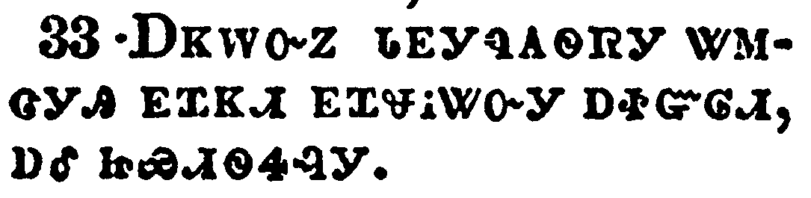</a></td>
</tr>
<tr class="even">
<td>And through a window in a basket was I let down by the wall, and escaped his hands.</td>
</tr>
<tr class="odd">
<td>ᎠᏦᎳᏅᏃ ᏓᎬᎩᏄᎪᏫᏒᎩ ᏔᎷᏣᎩᎯ ᎬᏆᏦᏗ ᎬᏆᏠᎥᏔᏅᎩ ᎠᏐᏳᎶᏗ, ᎠᎴ ᏥᏯᏗᏫᏎᎸᎩ.</td>
</tr>
<tr class="even">
<td>A-tso-la-nv-no da-gv-gi-nu-go-wi-sv-gi ta-lu-tsa-gi-hi gv-qua-tso-di gv-qua-tlo-v-ta-nv-gi a-so-yu-lo-di, a-le tsi-ya-di-wi-se-lv-gi.</td>
</tr>
</tbody>
</table>

