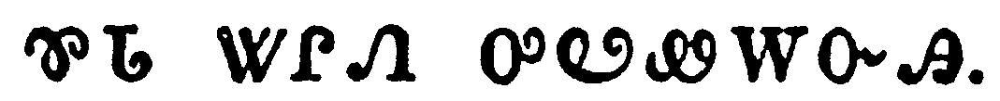
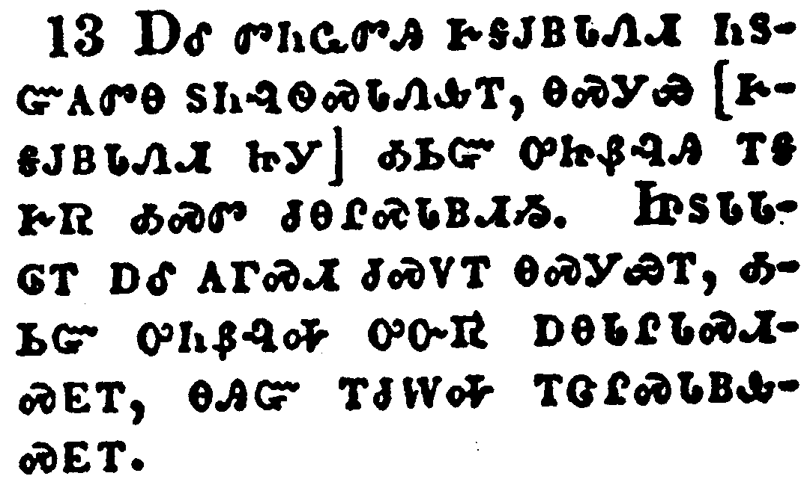

+++
draft=false
date = 2014-12-18T21:11:07Z
title = "2 Peter - Chapter 2 - Cherokee New Testament"
weight = 1418955067

[taxonomies]

authors = ["Timothy Legg"]
categories = []
tags = []

[extra]
+++

<table>
<tbody>
<tr class="odd">
<td></td>
</tr>
<tr class="even">
<td>But there were false prophets also among the people, even as there shall be false teachers among you, who privily shall bring in damnable heresies, even denying the Lord that bought them, and bring upon themselves swift destruction.</td>
</tr>
<tr class="odd">
<td>ᎠᏎᏃ ᎤᎾᏠᎾᏍᏗ ᎠᎾᏙᎴᎰᏍᎩ ᎢᎬᏩᎾᏓᏑᏰ ᏴᏫ, ᎾᏍᎩᏯ ᎤᎾᏠᎾᏍᏗ ᏗᎾᏕᏲᎲᏍᎩ ᎨᏣᏓᏑᏴᏗ ᏥᎩ, ᎾᏍᎩ ᎤᏕᎵᏛ ᎤᏂᏴᏔᏂᎯᏍᏗ ᎨᏎᏍᏗ ᎤᎾᏓᏤᎵᏛ ᎨᏒ ᎠᏓᏛᏗᏍᎩ, ᎾᏍᎩ ᎠᎾᏓᏱᎮᏍᏗ ᎤᎬᏫᏳᎯ ᎤᎾᎫᏴᏛ, ᎠᎴ ᎤᏅᏒ ᎢᏳᏅᏂᏌᏛ ᎤᏂᎷᏤᏗ ᎨᏎᏍᏗ ᏞᎩᏳ ᎤᏂᏛᏗᏍᎩ.</td>
</tr>
<tr class="even">
<td>A-se-no u-na-tlo-na-s-di a-na-do-le-ho-s-gi i-gv-wa-na-da-su-ye yv-wi, na-s-gi-ya u-na-tlo-na-s-di di-na-de-yo-hv-s-gi ge-tsa-da-su-yv-di tsi-gi, na-s-gi u-de-li-dv u-ni-yv-ta-ni-hi-s-di ge-se-s-di u-na-da-tse-li-dv ge-sv a-da-dv-di-s-gi, na-s-gi a-na-da-yi-he-s-di U-gv-wi-yu-hi u-na-gu-yv-dv, a-le u-nv-sv i-yu-nv-ni-sa-dv u-ni-lu-tse-di ge-se-s-di tle-gi-yu u-ni-dv-di-s-gi.</td>
</tr>
</tbody>
</table>

<table>
<tbody>
<tr class="odd">
<td></td>
</tr>
<tr class="even">
<td>And many shall follow their pernicious ways; by reason of whom the way of truth shall be evil spoken of.</td>
</tr>
<tr class="odd">
<td>ᎠᎴ ᎤᏂᏣᏖᏍᏗ ᏛᏂᏍᏓᏩᏕᏏ ᎾᏍᎩ ᎤᎾᏤᎵ ᎠᏓᏛᏗᏍᎩ; ᎾᏍᎩ ᏅᏛᏅᏂᏌᏂ ᏚᏳᎪᏛ ᏅᏃᎯ ᎤᏂᏐᏢᎢᏍᏙᏗ ᎨᏎᏍᏗ.</td>
</tr>
<tr class="even">
<td>A-le u-ni-tsa-te-s-di dv-ni-s-da-wa-de-si na-s-gi u-na-tse-li a-da-dv-di-s-gi; na-s-gi nv-dv-nv-ni-sa-ni du-yu-go-dv nv-no-hi u-ni-so-tlv-i-s-do-di ge-se-s-di.</td>
</tr>
</tbody>
</table>

<table>
<tbody>
<tr class="odd">
<td></td>
</tr>
<tr class="even">
<td>And through covetousness shall they with feigned words make merchandise of you: whose judgment now of a long time lingereth not, and their damnation slumbereth not.</td>
</tr>
<tr class="odd">
<td>ᎠᎴ ᏧᎬᏩᎶᏗ ᎤᏂᎬᎥᏍᎬ ᎢᏳᏍᏗ, ᎠᎴ ᎦᎶᏄᎮᏛ ᎠᏅᏗᏍᎬ ᎠᏂᏬᏂᏍᎬ ᎦᏃᏙᏗ ᏓᎨᏥᏰᎸᏥ; ᎾᏍᎩ ᏧᎾᏚᎪᏓᏁᏗ ᎨᏒ ᎡᏘ ᏅᏓᎬᏩᏓᎴᏅᏛ ᎥᏝ ᏯᎵᎾᎯᏍᏗᎭ, ᎠᎴ ᎤᏂᏛᏗᏍᎩ ᎥᏝ ᏱᎦᎸᏍᎦ.</td>
</tr>
<tr class="even">
<td>A-le tsu-gv-wa-lo-di u-ni-gv-v-s-gv i-yu-s-di, a-le ga-lo-nu-he-dv a-nv-di-s-gv a-ni-wo-ni-s-gv ga-no-do-di da-ge-tsi-ye-lv-tsi; na-s-gi tsu-na-du-go-da-ne-di ge-sv e-ti nv-da-gv-wa-da-le-nv-dv v-tla ya-li-na-hi-s-di-ha, a-le u-ni-dv-di-s-gi v-tla yi-ga-lv-s-ga.</td>
</tr>
</tbody>
</table>

<table>
<tbody>
<tr class="odd">
<td></td>
</tr>
<tr class="even">
<td>For if God spared not the angels that sinned, but cast them down to hell, and delivered them into chains of darkness, to be reserved unto judgment;</td>
</tr>
<tr class="odd">
<td>ᎤᏁᎳᏅᎯᏰᏃ ᏂᏚᎨᏳᏅᎾ ᏥᎨᏎ ᏗᏂᎧᎾᏩᏗᏙᎯ ᎤᏂᏍᎦᏅᏨᎯ, ᏨᏍᎩᏃᏉᏍᎩᏂ ᏥᏫᏚᏓᎢᏅᏎᎢ, ᎠᎴ ᏥᏚᏲᏎ ᏧᏓᏕᏒᏛ ᏗᎨᎦᎸᏍᏙᏗᏱ ᎤᎵᏏᎬ ᎨᏥᏍᏆᏂᎪᏙᏗᏱ ᏗᎨᎫᎪᏓᏁᏗ ᎨᏒ ᎢᏳᎢ,</td>
</tr>
<tr class="even">
<td>U-ne-la-nv-hi-ye-no ni-du-ge-yu-nv-na tsi-ge-se di-ni-ka-na-wa-di-do-hi u-ni-s-ga-nv-tsv-hi, tsv-s-gi-no-quo-s-gi-ni tsi-wi-du-da-i-nv-se-i, a-le tsi-du-yo-se tsu-da-de-sv-dv di-ge-ga-lv-s-do-di-yi u-li-si-gv ge-tsi-s-qua-ni-go-do-di-yi di-ge-gu-go-da-ne-di ge-sv i-yu-i,</td>
</tr>
</tbody>
</table>

<table>
<tbody>
<tr class="odd">
<td></td>
</tr>
<tr class="even">
<td>And spared not the old world, but saved Noah the eighth person, a preacher of righteousness, bringing in the flood upon the world of the ungodly;</td>
</tr>
<tr class="odd">
<td>ᎠᎴ ᏄᎨᏳᏅᎾ ᏥᎨᏎ ᎡᏘ ᎡᎶᎯ ᏥᎨᏎᎢ, ᏃᏯᏍᎩᏂ ᏧᏁᎳ ᏧᏛᏕᎢ ᎨᏒ ᎾᏍᎩ ᎠᎵᏥᏙᎲᏍᎩ ᏚᏳᎪᏛ ᏗᎧᎾᏩᏗᏙᎯ ᏥᎨᏎᎢ, ᎠᎴ ᏥᏚᏃᎱᎪᏔᏁ ᎡᎶᎯ ᎠᏂᏍᎦᎾ ᎠᏁᎲᎢ,</td>
</tr>
<tr class="even">
<td>A-le nu-ge-yu-nv-na tsi-ge-se e-ti e-lo-hi tsi-ge-se-i, No-ya-s-gi-ni tsu-ne-la tsu-dv-de-i ge-sv na-s-gi a-li-tsi-do-hv-s-gi du-yu-go-dv di-ka-na-wa-di-do-hi tsi-ge-se-i, a-le tsi-du-no-hu-go-ta-ne e-lo-hi a-ni-s-ga-na a-ne-hv-i,</td>
</tr>
</tbody>
</table>

<table>
<tbody>
<tr class="odd">
<td></td>
</tr>
<tr class="even">
<td>And turning the cities of Sodom and Gomorrha into ashes condemned them with an overthrow, making them an ensample unto those that after should live ungodly;</td>
</tr>
<tr class="odd">
<td>ᏐᏓᎻᏃ ᎠᎴ ᎪᎹᎵ ᏕᎦᏚᎲ ᎪᏍᏚ ᏥᏂᏚᏩᏁᎴᎢ, ᎠᎴ ᏥᏚᏭᎪᏓᏁᎴ ᏧᎷᏆᏗᏅᏗᏱ, ᎠᎴ ᎾᏍᎩ ᎤᏁᏯᏔᎲᏍᎩ ᏥᏂᏚᏩᏁᎴ ᎣᏂ ᎤᎾᏕᏗ ᎤᏁᎳᏅᎯ ᏂᏚᎾᏁᎶᏛᎾ ᎨᏒᎢ,</td>
</tr>
<tr class="even">
<td>So-da-mi-no a-le Go-ma-li de-ga-du-hv go-s-du tsi-ni-du-wa-ne-le-i, a-le tsi-du-wu-go-da-ne-le tsu-lu-qua-di-nv-di-yi, a-le na-s-gi u-ne-ya-ta-hv-s-gi tsi-ni-du-wa-ne-le o-ni u-na-de-di u-ne-la-nv-hi ni-du-na-ne-lo-dv-na ge-sv-i,</td>
</tr>
</tbody>
</table>

<table>
<tbody>
<tr class="odd">
<td></td>
</tr>
<tr class="even">
<td>And delivered just Lot, vexed with the filthy conversation of the wicked:</td>
</tr>
<tr class="odd">
<td>ᎠᎴ ᎶᏗ ᎤᏓᏅᏘ ᏧᏭᏓᎴᏎᎢ, ᎤᏕᏯᏔᏁᎸ ᏄᎾᎵᏏᎾᎯᏍᏛᎾ ᎠᏁᎲ ᎠᏂᏍᏚᎾᎢ.</td>
</tr>
<tr class="even">
<td>A-le Lo-di u-da-nv-ti tsu-wu-da-le-se-i, u-de-ya-ta-ne-lv nu-na-li-si-na-hi-s-dv-na a-ne-hv a-ni-s-du-na-i.</td>
</tr>
</tbody>
</table>

<table>
<tbody>
<tr class="odd">
<td></td>
</tr>
<tr class="even">
<td>(For that righteous man dwelling among them, in seeing and hearing, vexed his righteous soul from day to day with their unlawful deeds;)</td>
</tr>
<tr class="odd">
<td>(ᎾᏍᎩᏰᏃ ᎤᏓᏅᏘ ᎠᏍᎦᏯ ᎠᏁᎲ ᏤᎮᎢ, ᎠᎪᏩᏘᏍᎬ ᎠᎴ ᎠᏛᎩᏍᎬ [ᏄᏍᏛ ᏚᏂᎸᏫᏍᏓᏁᎲᎢ] ᎤᏓᏅᏘ ᎤᏓᏅᏙ ᏂᏚᎩᏨᏂᏒ ᎤᏕᏯᏙᏗ ᎤᏓᏅᏖ ᏅᏗᎦᎵᏍᏙᏗᏍᎨ ᏂᏚᏳᎪᏛᎾ ᏚᏂᎸᏫᏍᏓᏁᎲᎢ,)</td>
</tr>
<tr class="even">
<td>(Na-s-gi-ye-no u-da-nv-ti a-s-ga-ya a-ne-hv tse-he-i, a-go-wa-ti-s-gv a-le a-dv-gi-s-gv [nu-s-dv du-ni-lv-wi-s-da-ne-hv-i] u-da-nv-ti u-da-nv-do ni-du-gi-tsv-ni-sv u-de-ya-do-di u-da-nv-te nv-di-ga-li-s-do-di-s-ge ni-du-yu-go-dv-na du-ni-lv-wi-s-da-ne-hv-i,)</td>
</tr>
</tbody>
</table>

<table>
<tbody>
<tr class="odd">
<td></td>
</tr>
<tr class="even">
<td>The Lord knoweth how to deliver the godly out of temptations, and to reserve the unjust unto the day of judgment to be punished:</td>
</tr>
<tr class="odd">
<td>ᎤᎬᏫᏳᎯ ᎠᎦᏔᎭ ᎢᏳᏛᏁᏗᏱ ᏧᏭᏓᎴᏍᏗᏱ ᎤᎾᏓᏅᏘ ᎤᏂᎪᎵᏰᏍᎩ ᎤᏂᏰᎢᎵᏙᎲᎢ, ᎤᏂᏲᏃ ᏧᏍᏆᏂᎪᏙᏗᏱ ᎨᏥᎩᎵᏲᎢᏍᏙᏗᏱ ᏗᎫᎪᏙᏗᏱ ᎢᎦ ᎨᏎᏍᏗ:</td>
</tr>
<tr class="even">
<td>U-gv-wi-yu-hi a-ga-ta-ha i-yu-dv-ne-di-yi tsu-wu-da-le-s-di-yi u-na-da-nv-ti u-ni-go-li-ye-s-gi u-ni-ye-i-li-do-hv-i, u-ni-yo-no tsu-s-qua-ni-go-do-di-yi ge-tsi-gi-li-yo-i-s-do-di-yi di-gu-go-do-di-yi i-ga ge-se-s-di:</td>
</tr>
</tbody>
</table>

<table>
<tbody>
<tr class="odd">
<td></td>
</tr>
<tr class="even">
<td>But chiefly them that walk after the flesh in the lust of uncleanness, and despise government. Presumptuous are they, selfwilled, they are not afraid to speak evil of dignities.</td>
</tr>
<tr class="odd">
<td>ᎠᎴ ᎾᏍᎩ Ꮀ ᎤᎬᏫᏳᎭ [ᎨᏂᎩᎵᏲᎢᏍᏙᏗ ᎨᏎᏍᏗ] ᎤᏇᏓᎵ ᎠᏂᏍᏓᏩᏕᎩ ᎤᏂᎬᎥᏍᎬ ᎦᏓᎭ ᎨᏒᎢ, ᎠᎴ ᏗᏂᏍᎦᎩ ᏄᏂᎬᏫᏳᏌᏕᎩ. ᎤᏂᏍᎦᎢᏍᏗ, ᎤᏅᏒ ᎠᎾᏓᏅᏖᏍᎬ ᎤᏂᎸᏉᏗ; ᎥᏝ ᏯᏂᏍᎦᎢᎭ ᏗᎬᏩᏂᏐᏢᏙᏗᏱ ᎨᏥᎸᏉᏗ.</td>
</tr>
<tr class="even">
<td>A-le na-s-gi ho u-gv-wi-yu-ha [ge-ni-gi-li-yo-i-s-do-di ge-se-s-di] u-que-da-li a-ni-s-da-wa-de-gi u-ni-gv-v-s-gv ga-da-ha ge-sv-i, a-le di-ni-s-ga-gi nu-ni-gv-wi-yu-sa-de-gi. U-ni-s-ga-i-s-di, u-nv-sv a-na-da-nv-te-s-gv u-ni-lv-quo-di; v-tla ya-ni-s-ga-i-ha di-gv-wa-ni-so-tlv-do-di-yi ge-tsi-lv-quo-di.</td>
</tr>
</tbody>
</table>

<table>
<tbody>
<tr class="odd">
<td></td>
</tr>
<tr class="even">
<td>Whereas angels, which are greater in power and might, bring not railing accusation against them before the Lord.</td>
</tr>
<tr class="odd">
<td>ᏗᏂᎧᎿᎭᏩᏗᏙᎯᏍᎩᏂ ᎤᏟ ᎢᏧᎾᎵᏂᎩᏛ ᏥᎩ ᎥᏝ ᎪᎱᏍᏗ ᎤᏐᏅ ᏱᏓᏂᎳᏫᏎᎰ ᎤᎬᏫᏳᎯ ᎠᎦᏔᎲᎢ.</td>
</tr>
<tr class="even">
<td>Di-ni-ka-hna-wa-di-do-hi-s-gi-ni u-tli i-tsu-na-li-ni-gi-dv tsi-gi v-tla go-hu-s-di u-so-nv yi-da-ni-la-wi-se-ho U-gv-wi-yu-hi a-ga-ta-hv-i.</td>
</tr>
</tbody>
</table>

<table>
<tbody>
<tr class="odd">
<td></td>
</tr>
<tr class="even">
<td>But these, as natural brute beasts, made to be taken and destroyed, speak evil of the things that they understand not; and shall utterly perish in their own corruption;</td>
</tr>
<tr class="odd">
<td>ᎯᎠᏍᎩᏂ ᎾᏍᎩᏯ ᎪᎱᏍᏗᏉ ᏤᎿᎭᎠ ᎨᎪᏢᏅᎯ ᎨᎨᎢᏍᏗᏱ ᎠᎴ ᎨᏥᏛᏙᏗᏱ, ᎾᏍᎩ ᎠᏂᏐᏢᎢᏍᏗᎪ ᏧᏓᎴᏅᏛ ᎾᏃᎵᎬᎾ ᎨᏒᎢ, ᎠᎴ ᏛᎾᎵᏛᏔᏂ ᎤᏅᏒ ᎤᏂᏲᎢᏳ ᎨᏒᎢ.</td>
</tr>
<tr class="even">
<td>Hi-a-s-gi-ni na-s-gi-ya go-hu-s-di-quo tse-hna-a ge-go-tlv-nv-hi ge-ge-i-s-di-yi a-le ge-tsi-dv-do-di-yi, na-s-gi a-ni-so-tlv-i-s-di-go tsu-da-le-nv-dv na-no-li-gv-na ge-sv-i, a-le dv-na-li-dv-ta-ni u-nv-sv u-ni-yo-i-yu ge-sv-i.</td>
</tr>
</tbody>
</table>

<table>
<tbody>
<tr class="odd">
<td></td>
</tr>
<tr class="even">
<td>And shall receive the reward of unrighteousness, as they that count it pleasure to riot in the day time. Spots they are and blemishes, sporting themselves with their own deceivings while they feast with you;</td>
</tr>
<tr class="odd">
<td>ᎠᎴ ᏛᏂᏩᏛᎯ ᎨᎦᎫᏴᏓᏁᏗ ᏂᏚᏳᎪᏛᎾ ᏚᏂᎸᏫᏍᏓᏁᎲᎢ, ᎾᏍᎩᏯ [ᎨᎦᎫᏴᏓᏁᏗ ᏥᎩ] ᎣᏏᏳ ᎤᏥᏰᎸᎯ ᎢᎦ ᎨᏒ ᎣᏍᏛ ᏧᎾᎵᏍᏓᏴᏗᏱ. ᏥᏚᏓᏓᎶᎢ ᎠᎴ ᎪᎱᏍᏗ ᏧᏍᏙᎢ ᎾᏍᎩᏯᎢ, ᎣᏏᏳ ᎤᏂᏰᎸᎭ ᎤᏅᏒ ᎠᎾᏓᎵᏓᏍᏗᏍᎬᎢ, ᎾᎯᏳ ᎢᏧᎳᎭ ᎢᏣᎵᏍᏓᏴᎲᏍᎬᎢ.</td>
</tr>
<tr class="even">
<td>A-le dv-ni-wa-dv-hi ge-ga-gu-yv-da-ne-di ni-du-yu-go-dv-na du-ni-lv-wi-s-da-ne-hv-i, na-s-gi-ya [ge-ga-gu-yv-da-ne-di tsi-gi] o-si-yu u-tsi-ye-lv-hi i-ga ge-sv o-s-dv tsu-na-li-s-da-yv-di-yi. Tsi-du-da-da-lo-i a-le go-hu-s-di tsu-s-do-i na-s-gi-ya-i, o-si-yu u-ni-ye-lv-ha u-nv-sv a-na-da-li-da-s-di-s-gv-i, na-hi-yu i-tsu-la-ha i-tsa-li-s-da-yv-hv-s-gv-i.</td>
</tr>
</tbody>
</table>

<table>
<tbody>
<tr class="odd">
<td></td>
</tr>
<tr class="even">
<td>Having eyes full of adultery, and that cannot cease from sin; beguiling unstable souls: an heart they have exercised with covetous practices; cursed children:</td>
</tr>
<tr class="odd">
<td>ᏗᏂᎦᏙᎵ ᏧᎧᎵᏨᎯ ᎠᏓᏲᏁᏗ ᎨᏒᎢ, ᎠᎴ ᏗᎬᏩᏂᏲᎯᏍᏗ ᏂᎨᏒᎾ ᎠᏍᎦᏂ ᎨᏒᎢ: ᏗᏂᎶᏄᎮᏍᎩ ᏂᏚᎾᎵᏂᎬᎬᎾ ᎦᎾᏓᏅᏛᎢ; ᏧᏂᎾᏫ ᏧᎩᏌᏛ ᎠᎬᎥᎯᏍᏗ ᏗᎦᎸᏫᏍᏓᏁᏗ ᎨᏒᎢ; ᎠᎩᎵᏲᎢᏍᏗ ᎨᏒ ᏧᏪᏥ,</td>
</tr>
<tr class="even">
<td>Di-ni-ga-do-li tsu-ka-li-tsv-hi a-da-yo-ne-di ge-sv-i, a-le di-gv-wa-ni-yo-hi-s-di ni-ge-sv-na a-s-ga-ni ge-sv-i: di-ni-lo-nu-he-s-gi ni-du-na-li-ni-gv-gv-na ga-na-da-nv-dv-i; tsu-ni-na-wi tsu-gi-sa-dv a-gv-v-hi-s-di di-ga-lv-wi-s-da-ne-di ge-sv-i; a-gi-li-yo-i-s-di ge-sv tsu-we-tsi,</td>
</tr>
</tbody>
</table>

<table>
<tbody>
<tr class="odd">
<td></td>
</tr>
<tr class="even">
<td>Which have forsaken the right way, and are gone astray, following the way of Balaam the son of Bosor, who loved the wages of unrighteousness;</td>
</tr>
<tr class="odd">
<td>ᎤᏅᏕᏨ ᏚᏳᎪᏛ ᎦᏅᏅᎢ, ᎠᎴ ᎤᎾᎴᏲᎥ, ᎤᏂᏍᏓᏩᏕᏅ ᎤᎶᏒ ᏇᎳᎻ ᏉᏌ ᎤᏪᏥ, ᎣᏏᏳ ᏧᏰᎸᏎ ᏂᏚᏳᎪᏛᎾ ᏗᎦᎸᏫᏍᏓᏁᏗ ᎨᏒ ᎠᎫᏴᏗ,</td>
</tr>
<tr class="even">
<td>U-nv-de-tsv du-yu-go-dv ga-nv-nv-i, a-le u-na-le-yo-v, u-ni-s-da-wa-de-nv u-lo-sv Que-la-mi Quo-sa u-we-tsi, o-si-yu tsu-ye-lv-se ni-du-yu-go-dv-na di-ga-lv-wi-s-da-ne-di ge-sv a-gu-yv-di,</td>
</tr>
</tbody>
</table>

<table>
<tbody>
<tr class="odd">
<td></td>
</tr>
<tr class="even">
<td>But was rebuked for his iniquity: the dumb ass speaking with man's voice forbad the madness of the prophet.</td>
</tr>
<tr class="odd">
<td>ᎠᏎᏃ ᎠᏥᎬᏍᎪᎸᏁ ᎤᏍᎦᏅᏨᎢ: ᎤᏩᎨᏫ ᏗᎦᎵᎠᏅᎯᏛ ᏴᏫ ᎤᏁᎢᏍᏗ ᎤᏩᏔᏁ ᎤᏁᏤᎢ, ᎤᏍᎦᏤ ᏄᏓᏅᏛᎾ ᎨᏒ ᎠᏙᎴᎰᏍᎩ.</td>
</tr>
<tr class="even">
<td>A-se-no a-tsi-gv-s-go-lv-ne u-s-ga-nv-tsv-i: u-wa-ge-wi di-ga-li-a-nv-hi-dv yv-wi u-ne-i-s-di u-wa-ta-ne u-ne-tse-i, u-s-ga-tse nu-da-nv-dv-na ge-sv a-do-le-ho-s-gi.</td>
</tr>
</tbody>
</table>

<table>
<tbody>
<tr class="odd">
<td></td>
</tr>
<tr class="even">
<td>These are wells without water, clouds that are carried with a tempest; to whom the mist of darkness is reserved for ever.</td>
</tr>
<tr class="odd">
<td>ᎯᎠ ᎾᏍᎩ ᏓᏔᎴᏒ ᎠᎹ-ᏗᏢᏗᏱ ᎠᎹ ᏂᏗᎦᏁᎲᎾ, [ᎠᎴ] ᎤᎶᎩᎸ ᎤᏃᎴ ᏧᏃᎸᏔᏂᏙᎰᎢ, ᎾᏍᎩ Ꮎ ᎬᎾᎨ ᎤᎵᏏᎬ ᏥᎨᎦᏛᏅᎢᏍᏓᏁᎸ ᎤᎵᏍᏆᏗᏍᏗ ᏂᎨᏒᎾ.</td>
</tr>
<tr class="even">
<td>Hi-a na-s-gi da-ta-le-sv a-ma--di-tlv-di-yi a-ma ni-di-ga-ne-hv-na, [a-le] u-lo-gi-lv u-no-le tsu-no-lv-ta-ni-do-ho-i, na-s-gi na gv-na-ge u-li-si-gv tsi-ge-ga-dv-nv-i-s-da-ne-lv u-li-s-qua-di-s-di ni-ge-sv-na.</td>
</tr>
</tbody>
</table>

<table>
<tbody>
<tr class="odd">
<td></td>
</tr>
<tr class="even">
<td>For when they speak great swelling words of vanity, they allure through the lusts of the flesh, through much wantonness, those that were clean escaped from them who live in error.</td>
</tr>
<tr class="odd">
<td>ᎠᏂᏁᎩᏰᏃ ᎤᏣᏘ ᎠᏢᏆᏍᏗ ᎪᎱᏍᏗ ᎬᏙᏗ ᏂᎨᏒᎾ ᎠᏂᏬᏂᏍᎬᎢ, ᏓᏂᎶᏄᎮᏍᎪ ᎠᏅᏗᏍᎪ ᎤᏇᏓᎵ ᎠᏚᎸᏗ ᎨᏒᎢ, [ᎠᎴ] ᏃᎵᏏᎾᎯᏍᏛᎾ ᏂᏓᏍᏗ ᎨᏒᎢ, ᎾᏍᎩ ᎤᏙᏗᏳᎯ ᏧᎾᏗᏫᏎᎸᎯ ᎾᏍᎩ Ꮎ ᎠᏏ ᎤᏓᎵᏓᏍᏗ ᎨᏒ ᎠᎾᎴᏂᏙᎯ ᏥᎩ.</td>
</tr>
<tr class="even">
<td>A-ni-ne-gi-ye-no u-tsa-ti a-tlv-qua-s-di go-hu-s-di gv-do-di ni-ge-sv-na a-ni-wo-ni-s-gv-i, da-ni-lo-nu-he-s-go a-nv-di-s-go u-que-da-li a-du-lv-di ge-sv-i, [a-le] no-li-si-na-hi-s-dv-na ni-da-s-di ge-sv-i, na-s-gi u-do-di-yu-hi tsu-na-di-wi-se-lv-hi na-s-gi na a-si u-da-li-da-s-di ge-sv a-na-le-ni-do-hi tsi-gi.</td>
</tr>
</tbody>
</table>

<table>
<tbody>
<tr class="odd">
<td></td>
</tr>
<tr class="even">
<td>While they promise them liberty, they themselves are the servants of corruption: for of whom a man is overcome, of the same is he brought in bondage.</td>
</tr>
<tr class="odd">
<td>ᏓᏂᏚᎢᏍᏓᏁᎰ ᏗᎨᏥᎾᏝᎢ ᏂᎨᏒᎾ ᎢᏳᎵᏍᏙᏗᏱ, ᎤᏅᏒᏃ ᎤᏲ ᎨᏒ ᏗᎬᏩᏂᎾᏝᎢ ᎨᏐᎢ: ᎩᎶᏰᏃ ᎠᏥᏎᎪᎩ ᎾᏍᎩ Ꮎ ᎤᏎᎪᎩᏛ ᎤᎾᏝᎢ ᏂᎦᎵᏍᏗᏍᎪᎢ.</td>
</tr>
<tr class="even">
<td>Da-ni-du-i-s-da-ne-ho di-ge-tsi-na-tla-i ni-ge-sv-na i-yu-li-s-do-di-yi, u-nv-sv-no u-yo ge-sv di-gv-wa-ni-na-tla-i ge-so-i: gi-lo-ye-no a-tsi-se-go-gi na-s-gi na u-se-go-gi-dv u-na-tla-i ni-ga-li-s-di-s-go-i.</td>
</tr>
</tbody>
</table>

<table>
<tbody>
<tr class="odd">
<td></td>
</tr>
<tr class="even">
<td>For if after they have escaped the pollutions of the world through the knowledge of the Lord and Saviour Jesus Christ, they are again entangled therein, and overcome, the latter end is worse with them than the beginning.</td>
</tr>
<tr class="odd">
<td>ᎢᏳᏰᏃ ᎤᎾᏗᏫᏎᎸᎯ ᏱᎩ ᎦᏓᎭ ᎨᏒ ᎡᎶᎯ ᎡᎯ, ᎠᏅᏗᏍᎬ ᎠᎦᏙᎥᎯᏍᏗ ᎨᏒ ᎤᎬᏫᏳᎯ ᎠᎴ ᎢᎩᏍᏕᎵᏍᎩ ᏥᏌ ᎦᎶᏁᏛ, ᏔᎵᏁᏃ ᏱᎤᏁᏒ ᎾᎿᎭᏂ ᎠᎴ ᏱᎨᏥᏎᎪᎩᏒ, ᎤᎵᏍᏆᎸᏗ ᏄᎾᎵᏍᏓᏁᎸ ᎤᏟ ᎤᏲᎢᏳ ᎡᏍᎦᏉ ᎢᎬᏱᏱ.</td>
</tr>
<tr class="even">
<td>I-yu-ye-no u-na-di-wi-se-lv-hi yi-gi ga-da-ha ge-sv e-lo-hi e-hi, a-nv-di-s-gv a-ga-do-v-hi-s-di ge-sv U-gv-wi-yu-hi a-le I-gi-s-de-li-s-gi Tsi-sa Ga-lo-ne-dv, ta-li-ne-no yi-u-ne-sv na-hna-ni a-le yi-ge-tsi-se-go-gi-sv, u-li-s-qua-lv-di nu-na-li-s-da-ne-lv u-tli u-yo-i-yu e-s-ga-quo i-gv-yi-yi.</td>
</tr>
</tbody>
</table>

<table>
<tbody>
<tr class="odd">
<td></td>
</tr>
<tr class="even">
<td>For it had been better for them not to have known the way of righteousness, than, after they have known it, to turn from the holy commandment delivered unto them.</td>
</tr>
<tr class="odd">
<td>ᎤᏟᏰᏃ ᎣᏏᏳ ᎢᏳᎾᎵᏍᏓᏁᏗ ᏱᎨᏎᎢ ᏄᏂᎦᏙᎥᏒᎾ ᏱᎨᏎ ᏚᏳᎪᏛ ᎦᏅᏅᎢ, ᎠᏃ ᎤᏂᎦᏙᎥᏒᎯ ᎨᏒ ᏯᎾᎦᏔᎲ ᏱᏚᏂᏲᏍᎦ ᎦᎸᏉᏗᏳ ᏗᎧᎿᎭᏩᏛᏍᏗ ᎾᏍᎩ ᏗᎨᏥᏲᎯᏎᎸᎯ.</td>
</tr>
<tr class="even">
<td>U-tli-ye-no o-si-yu i-yu-na-li-s-da-ne-di yi-ge-se-i nu-ni-ga-do-v-sv-na yi-ge-se du-yu-go-dv ga-nv-nv-i, a-no u-ni-ga-do-v-sv-hi ge-sv ya-na-ga-ta-hv yi-du-ni-yo-s-ga ga-lv-quo-di-yu di-ka-hna-wa-dv-s-di na-s-gi di-ge-tsi-yo-hi-se-lv-hi.</td>
</tr>
</tbody>
</table>

<table>
<tbody>
<tr class="odd">
<td></td>
</tr>
<tr class="even">
<td>But it is happened unto them according to the true proverb, The dog is turned to his own vomit again; and the sow that was washed to her wallowing in the mire.</td>
</tr>
<tr class="odd">
<td>ᎠᏎᏃ ᎾᏍᎩᏯ ᏄᎾᎵᏍᏓᏁᎸ ᎯᎠ ᎤᏙᎯᏳᎯ ᎢᎦᏪᏛ ᏥᎩ, ᎩᎵ ᎤᏩᏒ ᏚᎵᎦᏍᏔᏅ ᏔᎵᏁ ᏮᎠᎦᏔᎲᏍᏓ; ᏏᏉᏃ ᎠᎪᏑᎴᎥᎯ ᎤᏓᏬᏍᏗᏱ ᏝᏬᏚᎯ ᏮᎠᎦᏔᎲᏍᏓ.</td>
</tr>
<tr class="even">
<td>A-se-no na-s-gi-ya nu-na-li-s-da-ne-lv hi-a u-do-hi-yu-hi i-ga-we-dv tsi-gi, gi-li u-wa-sv du-li-ga-s-ta-nv ta-li-ne wv-a-ga-ta-hv-s-da; si-quo-no a-go-su-le-v-hi u-da-wo-s-di-yi tla-wo-du-hi wv-a-ga-ta-hv-s-da.</td>
</tr>
</tbody>
</table>

