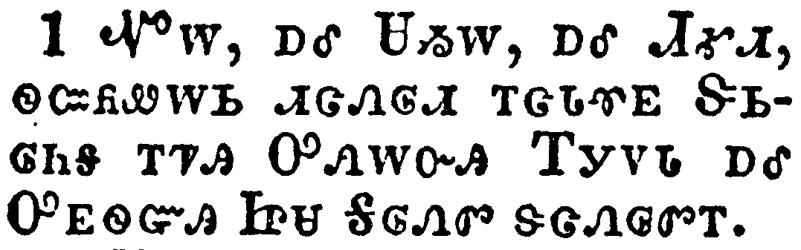
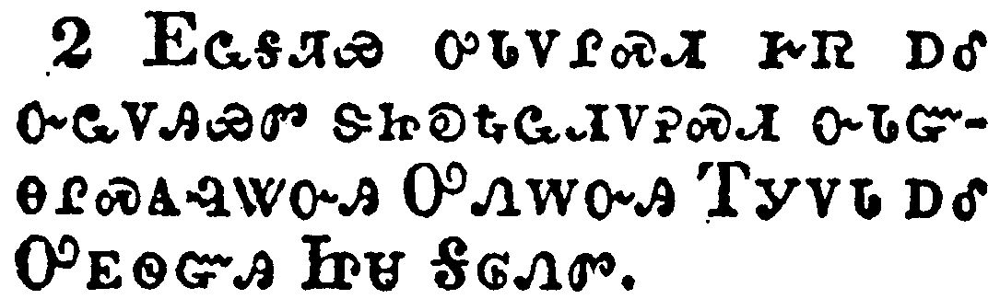
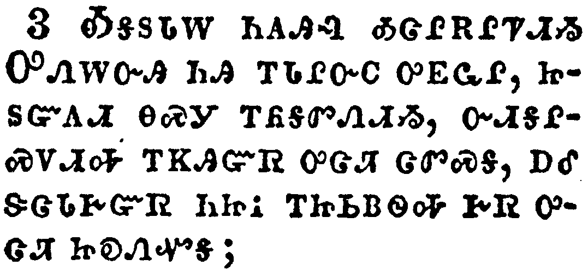
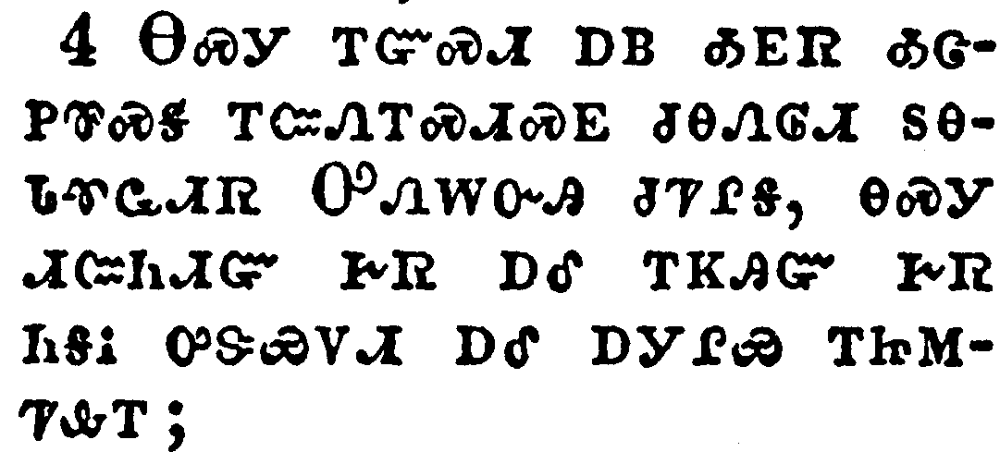
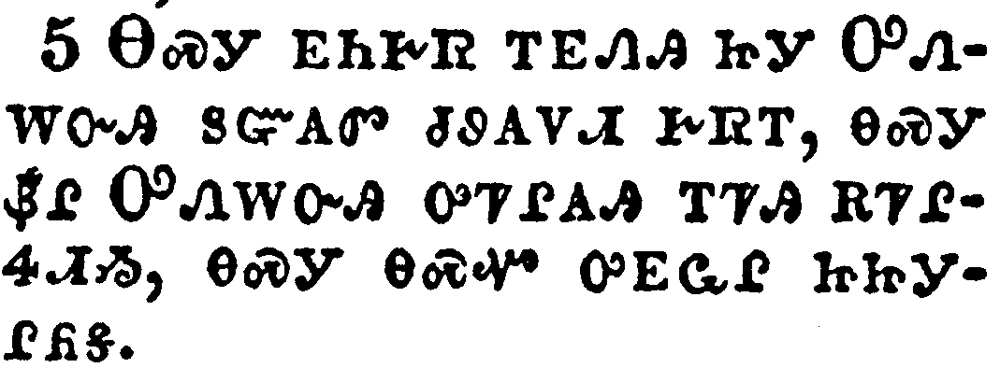
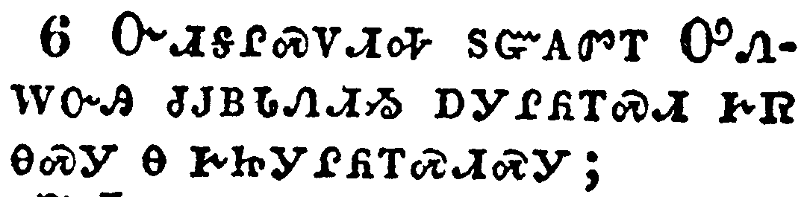
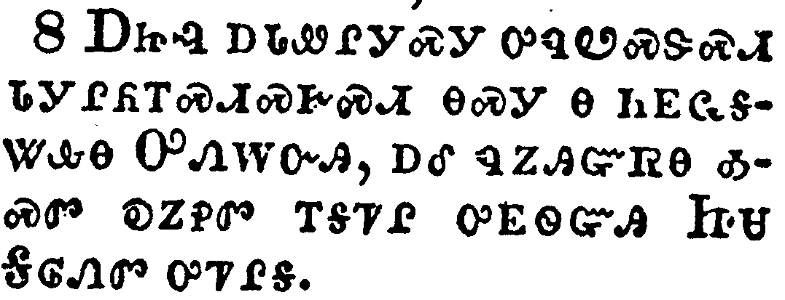
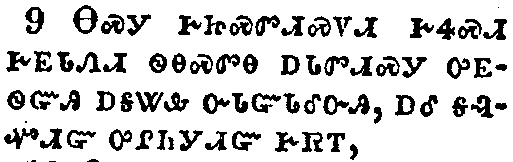
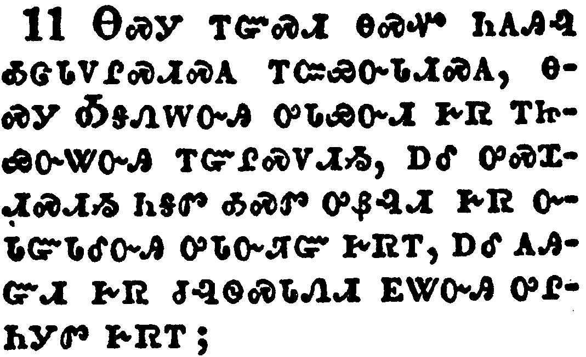
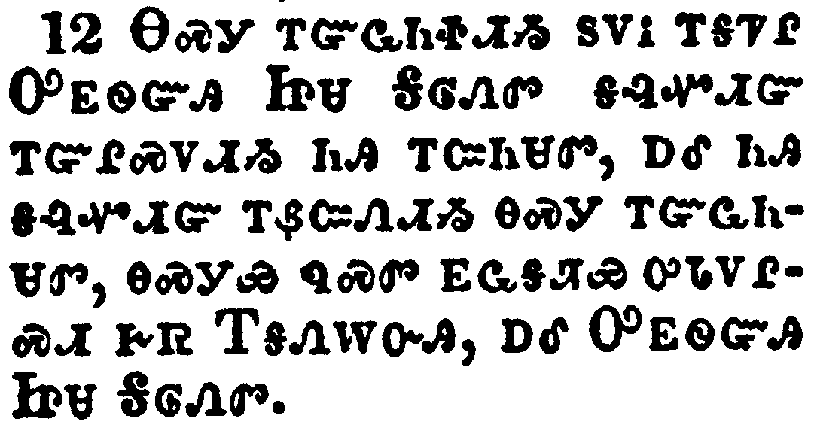

+++
draft=false
date = 2014-12-18T21:11:07Z
title = "2 Thessalonians - Chapter 1 - Cherokee New Testament"
weight = 1418955067

[taxonomies]

authors = ["Timothy Legg"]
categories = []
tags = []

[extra]
+++

<table>
<tbody>
<tr class="odd">
<td></td>
</tr>
<tr class="even">
<td>Paul, and Silvanus, and Timotheus, unto the church of the Thessalonians in God our Father and the Lord Jesus Christ:</td>
</tr>
<tr class="odd">
<td>ᏉᎳ, ᎠᎴ ᏌᏱᎳ, ᎠᎴ ᏗᎹᏗ, ᏫᏨᏲᏪᎳᏏ ᏗᏣᏁᎶᏗ ᎢᏣᏓᏡᎬ ᏕᏏᎶᏂᎦ ᎢᏤᎯ ᎤᏁᎳᏅᎯ ᎢᎩᏙᏓ ᎠᎴ ᎤᎬᏫᏳᎯ ᏥᏌ ᎦᎶᏁᏛ ᏕᏣᏁᎶᏛᎢ.</td>
</tr>
<tr class="even">
<td>Quo-la, a-le Sa-yi-la, a-le Di-ma-di, wi-tsv-yo-we-la-si di-tsa-ne-lo-di i-tsa-da-tlu-gv De-si-lo-ni-ga i-tse-hi U-ne-la-nv-hi I-gi-do-da a-le U-gv-wi-yu-hi Tsi-sa Ga-lo-ne-dv de-tsa-ne-lo-dv-i.</td>
</tr>
</tbody>
</table>

<table>
<tbody>
<tr class="odd">
<td></td>
</tr>
<tr class="even">
<td>Grace unto you, and peace, from God our Father and the Lord Jesus Christ.</td>
</tr>
<tr class="odd">
<td>ᎬᏩᎦᏘᏯ ᎤᏓᏙᎵᏍᏗ ᎨᏒ ᎠᎴ ᏅᏩᏙᎯᏯᏛ ᏕᏥᎧᎿᎭᏩᏗᏙᎮᏍᏗ ᏅᏓᏳᎾᎵᏍᎪᎸᏔᏅᎯ ᎤᏁᎳᏅᎯ ᎢᎩᏙᏓ ᎠᎴ ᎤᎬᏫᏳᎯ ᏥᏌ ᎦᎶᏁᏛ.</td>
</tr>
<tr class="even">
<td>Gv-wa-ga-ti-ya u-da-do-li-s-di ge-sv a-le nv-wa-do-hi-ya-dv de-tsi-ka-hna-wa-di-do-he-s-di nv-da-yu-na-li-s-go-lv-ta-nv-hi U-ne-la-nv-hi I-gi-do-da a-le U-gv-wi-yu-hi Tsi-sa Ga-lo-ne-dv.</td>
</tr>
</tbody>
</table>

<table>
<tbody>
<tr class="odd">
<td></td>
</tr>
<tr class="even">
<td>We are bound to thank God always for you, brethren, as it is meet, because that your faith groweth exceedingly, and the charity of every one of you all toward each other aboundeth;</td>
</tr>
<tr class="odd">
<td>ᎣᎦᏚᏓᎳ ᏂᎪᎯᎸ ᎣᏣᎵᎡᎵᏤᏗᏱ ᎤᏁᎳᏅᎯ ᏂᎯ ᎢᏓᎵᏅᏟ ᎤᎬᏩᎵ, ᏥᏚᏳᎪᏗ ᎾᏍᎩ ᎢᏲᎦᏛᏁᏗᏱ, ᏅᏗᎦᎵᏍᏙᏗᎭ ᎢᏦᎯᏳᏒ ᎤᏣᏘ ᏣᏛᏍᎦ, ᎠᎴ ᏕᏣᏓᎨᏳᏒ ᏂᏥᎥ ᎢᏥᏏᏴᏫᎭ ᎨᏒ ᎤᏣᏘ ᏥᎧᏁᏉᎦ;</td>
</tr>
<tr class="even">
<td>O-ga-du-da-la ni-go-hi-lv o-tsa-li-e-li-tse-di-yi U-ne-la-nv-hi ni-hi i-da-li-nv-tli u-gv-wa-li, tsi-du-yu-go-di na-s-gi i-yo-ga-dv-ne-di-yi, nv-di-ga-li-s-do-di-ha i-tso-hi-yu-sv u-tsa-ti tsa-dv-s-ga, a-le de-tsa-da-ge-yu-sv ni-tsi-v i-tsi-si-yv-wi-ha ge-sv u-tsa-ti tsi-ka-ne-quo-ga;</td>
</tr>
</tbody>
</table>

<table>
<tbody>
<tr class="odd">
<td></td>
</tr>
<tr class="even">
<td>So that we ourselves glory in you in the churches of God for your patience and faith in all your persecutions and tribulations that ye endure:</td>
</tr>
<tr class="odd">
<td>ᎾᏍᎩ ᎢᏳᏍᏗ ᎠᏴ ᎣᎬᏒ ᎣᏣᏢᏈᏍᎦ ᎢᏨᏁᎢᏍᏗᏍᎬ ᏧᎾᏁᎶᏗ ᏚᎾᏓᏡᏩᏗᏒ ᎤᏁᎳᏅᎯ ᏧᏤᎵᎦ, ᎾᏍᎩ ᏗᏨᏂᏗᏳ ᎨᏒ ᎠᎴ ᎢᏦᎯᏳ ᎨᏒ ᏂᎦᎥ ᎤᏕᏯᏙᏗ ᎠᎴ ᎠᎩᎵᏯ ᎢᏥᎷᏤᎲᎢ;</td>
</tr>
<tr class="even">
<td>Na-s-gi i-yu-s-di a-yv o-gv-sv o-tsa-tlv-qui-s-ga i-tsv-ne-i-s-di-s-gv tsu-na-ne-lo-di du-na-da-tlu-wa-di-sv U-ne-la-nv-hi tsu-tse-li-ga, na-s-gi di-tsv-ni-di-yu ge-sv a-le i-tso-hi-yu ge-sv ni-ga-v u-de-ya-do-di a-le a-gi-li-ya i-tsi-lu-tse-hv-i;</td>
</tr>
</tbody>
</table>

<table>
<tbody>
<tr class="odd">
<td></td>
</tr>
<tr class="even">
<td>Which is a manifest token of the righteous judgment of God, that ye may be counted worthy of the kingdom of God, for which ye also suffer:</td>
</tr>
<tr class="odd">
<td>ᎾᏍᎩ ᎬᏂᎨᏒ ᎢᎬᏁᎯ ᏥᎩ ᎤᏁᎳᏅᎯ ᏚᏳᎪᏛ ᏧᏭᎪᏛᏗ ᏧᏭᎪᏙᏗ ᎨᏒᎢ, ᎾᏍᎩ ᏰᎵ ᎤᏁᎳᏅᎯ ᎤᏤᎵᎪᎯ ᎢᏤᎯ ᎡᏤᎵᏎᏗᏱ, ᎾᏍᎩ ᎾᏍᏉ ᎤᎬᏩᎵ ᏥᏥᎩᎵᏲᎦ.</td>
</tr>
<tr class="even">
<td>Na-s-gi gv-ni-ge-sv i-gv-ne-hi tsi-gi U-ne-la-nv-hi du-yu-go-dv tsu-wu-go-dv-di tsu-wu-go-do-di ge-sv-i, na-s-gi ye-li U-ne-la-nv-hi u-tse-li-go-hi i-tse-hi e-tse-li-se-di-yi, na-s-gi na-s-quo u-gv-wa-li tsi-tsi-gi-li-yo-ga.</td>
</tr>
</tbody>
</table>

<table>
<tbody>
<tr class="odd">
<td></td>
</tr>
<tr class="even">
<td>Seeing it is a righteous thing with God to recompense tribulation to them that trouble you;</td>
</tr>
<tr class="odd">
<td>ᏅᏗᎦᎵᏍᏙᏗᎭ ᏚᏳᎪᏛᎢ ᎤᏁᎳᏅᎯ ᏧᎫᏴᏓᏁᏗᏱ ᎠᎩᎵᏲᎢᏍᏗ ᎨᏒ ᎾᏍᎩ Ꮎ ᎨᏥᎩᎵᏲᎢᏍᏗᏍᎩ;</td>
</tr>
<tr class="even">
<td>Nv-di-ga-li-s-do-di-ha du-yu-go-dv-i U-ne-la-nv-hi tsu-gu-yv-da-ne-di-yi a-gi-li-yo-i-s-di ge-sv na-s-gi na ge-tsi-gi-li-yo-i-s-di-s-gi;</td>
</tr>
</tbody>
</table>

<table>
<tbody>
<tr class="odd">
<td></td>
</tr>
<tr class="even">
<td>And to you who are troubled rest with us, when the Lord Jesus shall be revealed from heaven with his mighty angels,</td>
</tr>
<tr class="odd">
<td>ᏂᎯᏃ ᎡᏥᎩᎵᏲᎢᏍᏗᏍᎩ, ᎠᏣᏪᏐᎸᏍᏙᏗ ᎨᏒ ᎡᎦᎫᏴᏓᏁᏗᏱ, ᎾᎯᏳ ᎤᎬᏫᏳᎯ ᏥᏌ ᎦᎸᎶ ᏅᏓᏳᏓᎴᏅᎯ ᎬᏂᎨᏒ ᎾᎬᏁᎸᎭ ᎠᏁᎮᏍᏗ ᏧᎾᎵᏂᎩᏛ ᏧᏤᎵ ᏗᏂᎧᎿᎭᏩᏗᏙᎯ,</td>
</tr>
<tr class="even">
<td>Ni-hi-no e-tsi-gi-li-yo-i-s-di-s-gi, a-tsa-we-so-lv-s-do-di ge-sv e-ga-gu-yv-da-ne-di-yi, na-hi-yu U-gv-wi-yu-hi Tsi-sa ga-lv-lo nv-da-yu-da-le-nv-hi gv-ni-ge-sv na-gv-ne-lv-ha a-ne-he-s-di tsu-na-li-ni-gi-dv tsu-tse-li di-ni-ka-hna-wa-di-do-hi,</td>
</tr>
</tbody>
</table>

<table>
<tbody>
<tr class="odd">
<td></td>
</tr>
<tr class="even">
<td>In flaming fire taking vengeance on them that know not God, and that obey not the gospel of our Lord Jesus Christ:</td>
</tr>
<tr class="odd">
<td>ᎠᏥᎸ ᎠᏓᏪᎵᎩᏍᎩ ᎤᏄᏬᏍᏕᏍᏗ ᏓᎩᎵᏲᎢᏍᏗᏍᎨᏍᏗ ᎾᏍᎩ Ꮎ ᏂᎬᏩᎦᏔᎲᎾ ᎤᏁᎳᏅᎯ, ᎠᎴ ᏄᏃᎯᏳᏒᎾ ᎣᏍᏛ ᎧᏃᎮᏛ ᎢᎦᏤᎵ ᎤᎬᏫᏳᎯ ᏥᏌ ᎦᎶᏁᏛ ᎤᏤᎵᎦ.</td>
</tr>
<tr class="even">
<td>A-tsi-lv a-da-we-li-gi-s-gi u-nu-wo-s-de-s-di da-gi-li-yo-i-s-di-s-ge-s-di na-s-gi na ni-gv-wa-ga-ta-hv-na U-ne-la-nv-hi, a-le nu-no-hi-yu-sv-na o-s-dv ka-no-he-dv i-ga-tse-li u-gv-wi-yu-hi Tsi-sa Ga-lo-ne-dv u-tse-li-ga.</td>
</tr>
</tbody>
</table>

<table>
<tbody>
<tr class="odd">
<td></td>
</tr>
<tr class="even">
<td>Who shall be punished with everlasting destruction from the presence of the Lord, and from the glory of his power;</td>
</tr>
<tr class="odd">
<td>ᎾᏍᎩ ᎨᏥᏍᏛᏗᏍᏙᏗ ᎨᏎᏍᏗ ᎨᎬᏓᏁᏗ ᏫᎾᏍᏛᎾ ᎠᏓᏛᏗᏍᎩ ᎤᎬᏫᏳᎯ ᎠᎦᏔᎲ ᏅᏓᏳᏓᎴᏅᎯ, ᎠᎴ ᎦᎸᏉᏗᏳ ᎤᎵᏂᎩᏗᏳ ᎨᏒᎢ,</td>
</tr>
<tr class="even">
<td>Na-s-gi ge-tsi-s-dv-di-s-do-di ge-se-s-di ge-gv-da-ne-di wi-na-s-dv-na a-da-dv-di-s-gi u-gv-wi-yu-hi a-ga-ta-hv nv-da-yu-da-le-nv-hi, a-le ga-lv-quo-di-yu u-li-ni-gi-di-yu ge-sv-i,</td>
</tr>
</tbody>
</table>

<table>
<tbody>
<tr class="odd">
<td></td>
</tr>
<tr class="even">
<td>When he shall come to be glorified in his saints, and to be admired in all them that believe (because our testimony among you was believed) in that day.</td>
</tr>
<tr class="odd">
<td>ᎾᎯᏳ ᏧᏤᎵ ᎤᎾᏓᏅᏘ ᎬᏩᎸᏉᏙᏗᏱ ᎤᎬᏩᎵ ᎦᎷᏨᎭ, ᎠᎴ ᎤᏍᏆᏂᎪᏗ ᏧᏓᏅᏓᏗᏍᏙᏗᏱ ᎾᏂᎥ ᎾᏍᎩ Ꮎ ᎬᏬᎯᏳᎲᏍᎩ ᎾᎯᏳ ᎢᎦ ᎨᏎᏍᏗ, ᏅᏗᎦᎵᏍᏙᏗᏍᎨᏍᏗ ᎪᎯᏳᏅᎯ ᎨᏒ ᎣᎩᏃᎮᎸ ᎢᏤᎲᎢ.</td>
</tr>
<tr class="even">
<td>Na-hi-yu tsu-tse-li u-na-da-nv-ti gv-wa-lv-quo-do-di-yi u-gv-wa-li ga-lu-tsv-ha, a-le u-s-qua-ni-go-di tsu-da-nv-da-di-s-do-di-yi na-ni-v na-s-gi na gv-wo-hi-yu-hv-s-gi na-hi-yu i-ga ge-se-s-di, nv-di-ga-li-s-do-di-s-ge-s-di go-hi-yu-nv-hi ge-sv o-gi-no-he-lv i-tse-hv-i.</td>
</tr>
</tbody>
</table>

<table>
<tbody>
<tr class="odd">
<td></td>
</tr>
<tr class="even">
<td>Wherefore also we pray always for you, that our God would count you worthy of this calling, and fulfil all the good pleasure of his goodness, and the work of faith with power:</td>
</tr>
<tr class="odd">
<td>ᎾᏍᎩ ᎢᏳᏍᏗ ᎾᏍᏉ ᏂᎪᎯᎸ ᎣᏣᏓᏙᎵᏍᏗᏍᎪ ᎢᏨᏯᏅᏓᏗᏍᎪ, ᎾᏍᎩ ᎣᎦᏁᎳᏅᎯ ᎤᏓᏯᏅᏗ ᎨᏒ ᎢᏥᏯᏅᏔᏅᎯ ᎢᏳᎵᏍᏙᏗᏱ, ᎠᎴ ᎤᏍᏆᏗᏍᏗᏱ ᏂᎦᏛ ᎣᏍᏛ ᎤᏰᎸᏗ ᎨᏒ ᏅᏓᏳᏓᎴᏅᎯ ᎤᏓᏅᏘᏳ ᎨᏒᎢ, ᎠᎴ ᎪᎯᏳᏗ ᎨᏒ ᏧᎸᏫᏍᏓᏁᏗ ᎬᏔᏅᎯ ᎤᎵᏂᎩᏛ ᎨᏒᎢ;</td>
</tr>
<tr class="even">
<td>Na-s-gi i-yu-s-di na-s-quo ni-go-hi-lv o-tsa-da-do-li-s-di-s-go i-tsv-ya-nv-da-di-s-go, na-s-gi O-ga-ne-la-nv-hi u-da-ya-nv-di ge-sv i-tsi-ya-nv-ta-nv-hi i-yu-li-s-do-di-yi, a-le u-s-qua-di-s-di-yi ni-ga-dv o-s-dv u-ye-lv-di ge-sv nv-da-yu-da-le-nv-hi u-da-nv-ti-yu ge-sv-i, a-le go-hi-yu-di ge-sv tsu-lv-wi-s-da-ne-di gv-ta-nv-hi u-li-ni-gi-dv ge-sv-i;</td>
</tr>
</tbody>
</table>

<table>
<tbody>
<tr class="odd">
<td></td>
</tr>
<tr class="even">
<td>That the name of our Lord Jesus Christ may be glorified in you, and ye in him, according to the grace of our God and the Lord Jesus Christ.</td>
</tr>
<tr class="odd">
<td>ᎾᏍᎩ ᎢᏳᏩᏂᏐᏗᏱ ᏚᏙᎥ ᎢᎦᏤᎵ ᎤᎬᏫᏳᎯ ᏥᏌ ᏓᎶᏁᏛ ᎦᎸᏉᏗᏳ ᎢᏳᎵᏍᏙᏗᏱ ᏂᎯ ᎢᏨᏂᏌᏛ, ᎠᎴ ᏂᎯ ᎦᎸᏉᏗᏳ ᎢᏰᏨᏁᏗᏱ ᎾᏍᎩ ᎢᏳᏩᏂᏌᏛ, ᎾᏍᎩᏯ ᏄᏍᏛ ᎬᏩᎦᏘᏯ ᎤᏓᏙᎵᏍᏗ ᎨᏒ ᎢᎦᏁᎳᏅᎯ, ᎠᎴ ᎤᎬᏫᏳᎯ ᏥᏌ ᎦᎶᏁᏛ.</td>
</tr>
<tr class="even">
<td>Na-s-gi i-yu-wa-ni-so-di-yi du-do-v i-ga-tse-li U-gv-wi-yu-hi Tsi-sa Da-lo-ne-dv ga-lv-quo-di-yu i-yu-li-s-do-di-yi ni-hi i-tsv-ni-sa-dv, a-le ni-hi ga-lv-quo-di-yu i-ye-tsv-ne-di-yi na-s-gi i-yu-wa-ni-sa-dv, na-s-gi-ya nu-s-dv gv-wa-ga-ti-ya u-da-do-li-s-di ge-sv I-ga-ne-la-nv-hi, a-le U-gv-wi-yu-hi Tsi-sa Ga-lo-ne-dv.</td>
</tr>
</tbody>
</table>

