+++
draft=false
date = 2014-12-18T21:11:07Z
title = "2 Thessalonians - Chapter 2 - Cherokee New Testament"
weight = 1418955067

[taxonomies]

authors = ["Timothy Legg"]
categories = []
tags = []

[extra]
+++

<table>
<tbody>
<tr class="odd">
<td><a href="140201.png">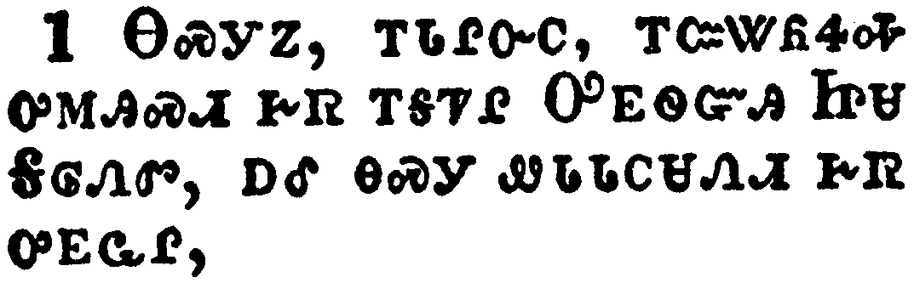</a></td>
</tr>
<tr class="even">
<td>Now we beseech you, brethren, by the coming of our Lord Jesus Christ, and by our gathering together unto him,</td>
</tr>
<tr class="odd">
<td>ᎾᏍᎩᏃ, ᎢᏓᎵᏅᏟ, ᎢᏨᏔᏲᏎᎭ ᎤᎷᎯᏍᏗ ᎨᏒ ᎢᎦᏤᎵ ᎤᎬᏫᏳᎯ ᏥᏌ ᎦᎶᏁᏛ, ᎠᎴ ᎾᏍᎩ ᏪᏓᏓᏟᏌᏁᏗ ᎨᏒ ᎤᎬᏩᎵ,</td>
</tr>
<tr class="even">
<td>Na-s-gi-no, i-da-li-nv-tli, i-tsv-ta-yo-se-ha u-lu-hi-s-di ge-sv i-ga-tse-li U-gv-wi-yu-hi Tsi-sa Ga-lo-ne-dv, a-le na-s-gi we-da-da-tli-sa-ne-di ge-sv u-gv-wa-li,</td>
</tr>
</tbody>
</table>

<table>
<tbody>
<tr class="odd">
<td><a href="140202.png">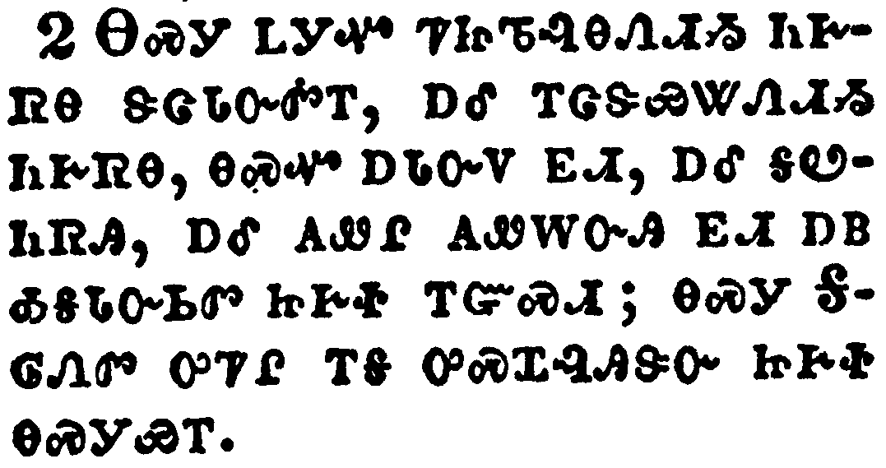</a></td>
</tr>
<tr class="even">
<td>That ye be not soon shaken in mind, or be troubled, neither by spirit, nor by word, nor by letter as from us, as that the day of Christ is at hand.</td>
</tr>
<tr class="odd">
<td>ᎾᏍᎩ ᏞᎩᏉ ᏤᏥᏖᎸᎾᏗᏱ ᏂᎨᏒᎾ ᏕᏣᏓᏅᏛᎢ, ᎠᎴ ᎢᏣᏕᏯᏔᏁᏗᏱ ᏂᎨᏒᎾ, ᎾᏍᏉ ᎠᏓᏅᏙ ᎬᏗ, ᎠᎴ ᎦᏬᏂᏒᎯ, ᎠᎴ ᎪᏪᎵ ᎪᏪᎳᏅᎯ ᎬᏗ ᎠᏴ ᎣᎦᏓᏅᏏᏛ ᏥᎨᏐ ᎢᏳᏍᏗ; ᎾᏍᎩ ᎦᎶᏁᏛ ᎤᏤᎵ ᎢᎦ ᎤᏍᏆᎸᎯᏕᏅ ᏥᎨᏐ ᎾᏍᎩᏯᎢ.</td>
</tr>
<tr class="even">
<td>Na-s-gi tle-gi-quo tse-tsi-te-lv-na-di-yi ni-ge-sv-na de-tsa-da-nv-dv-i, a-le i-tsa-de-ya-ta-ne-di-yi ni-ge-sv-na, na-s-quo a-da-nv-do gv-di, a-le ga-wo-ni-sv-hi, a-le go-we-li go-we-la-nv-hi gv-di a-yv o-ga-da-nv-si-dv tsi-ge-so i-yu-s-di; na-s-gi Ga-lo-ne-dv u-tse-li i-ga u-s-qua-lv-hi-de-nv tsi-ge-so na-s-gi-ya-i.</td>
</tr>
</tbody>
</table>

<table>
<tbody>
<tr class="odd">
<td><a href="140203.png">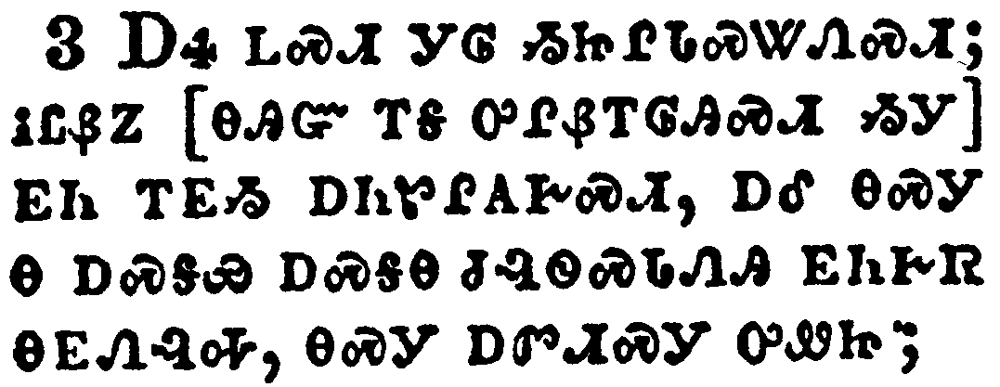</a></td>
</tr>
<tr class="even">
<td>Let no man deceive you by any means: for that day shall not come, except there come a falling away first, and that man of sin be revealed, the son of perdition;</td>
</tr>
<tr class="odd">
<td>ᎠᏎ ᏞᏍᏗ ᎩᎶ ᏱᏥᎵᏓᏍᏔᏁᏍᏗ; ᎥᏝᏰᏃ [ᎾᎯᏳ ᎢᎦ ᎤᎵᏰᎢᎶᎯᏍᏗ ᏱᎩ] ᎬᏂ ᎢᎬᏱ ᎠᏂᏑᎵᎪᎨᏍᏗ, ᎠᎴ ᎾᏍᎩ Ꮎ ᎠᏍᎦᏯ ᎠᏍᎦᎾ ᏧᎸᏫᏍᏓᏁᎯ ᎬᏂᎨᏒ ᎾᎬᏁᎸᎭ, ᎾᏍᎩ ᎠᏛᏗᏍᎩ ᎤᏪᏥ;</td>
</tr>
<tr class="even">
<td>A-se tle-s-di gi-lo yi-tsi-li-da-s-ta-ne-s-di; v-tla-ye-no [na-hi-yu i-ga u-li-ye-i-lo-hi-s-di yi-gi] gv-ni i-gv-yi a-ni-su-li-go-ge-s-di, a-le na-s-gi na a-s-ga-ya a-s-ga-na tsu-lv-wi-s-da-ne-hi gv-ni-ge-sv na-gv-ne-lv-ha, na-s-gi a-dv-di-s-gi u-we-tsi;</td>
</tr>
</tbody>
</table>

<table>
<tbody>
<tr class="odd">
<td><a href="140204.png">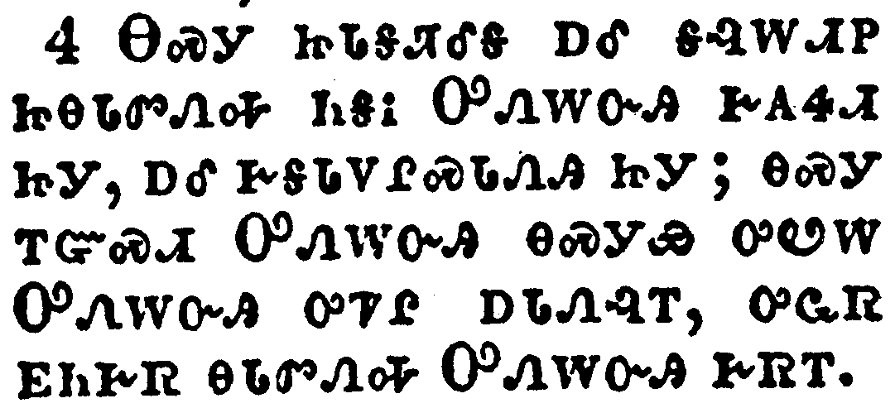</a></td>
</tr>
<tr class="even">
<td>Who opposeth and exalteth himself above all that is called God, or that is worshipped; so that he as God sitteth in the temple of God, shewing himself that he is God.</td>
</tr>
<tr class="odd">
<td>ᎾᏍᎩ ᏥᏓᎦᏘᎴᎦ ᎠᎴ ᎦᎸᎳᏗᏢ ᏥᎾᏓᏛᏁᎭ ᏂᎦᎥ ᎤᏁᎳᏅᎯ ᎨᎪᏎᏗ ᏥᎩ, ᎠᎴ ᎨᎦᏓᏙᎵᏍᏓᏁᎯ ᏥᎩ; ᎾᏍᎩ ᎢᏳᏍᏗ ᎤᏁᎳᏅᎯ ᎾᏍᎩᏯ ᎤᏬᎳ ᎤᏁᎳᏅᎯ ᎤᏤᎵ ᎠᏓᏁᎸᎢ, ᎤᏩᏒ ᎬᏂᎨᏒ ᎾᏓᏛᏁᎭ ᎤᏁᎳᏅᎯ ᎨᏒᎢ.</td>
</tr>
<tr class="even">
<td>Na-s-gi tsi-da-ga-ti-le-ga a-le ga-lv-la-di-tlv tsi-na-da-dv-ne-ha ni-ga-v U-ne-la-nv-hi ge-go-se-di tsi-gi, a-le ge-ga-da-do-li-s-da-ne-hi tsi-gi; na-s-gi i-yu-s-di U-ne-la-nv-hi na-s-gi-ya u-wo-la U-ne-la-nv-hi u-tse-li a-da-ne-lv-i, u-wa-sv gv-ni-ge-sv na-da-dv-ne-ha U-ne-la-nv-hi ge-sv-i.</td>
</tr>
</tbody>
</table>

<table>
<tbody>
<tr class="odd">
<td><a href="140205.png">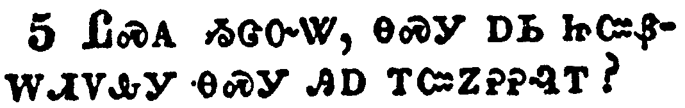</a></td>
</tr>
<tr class="even">
<td>Remember ye not, that, when I was yet with you, I told you these things?</td>
</tr>
<tr class="odd">
<td>ᏝᏍᎪ ᏱᏣᏅᏔ, ᎾᏍᎩ ᎠᏏ ᏥᏨᏰᎳᏗᏙᎲᎩ ᎾᏍᎩ ᎯᎠ ᎢᏨᏃᎮᎮᎸᎢ?</td>
</tr>
<tr class="even">
<td>Tla-s-go yi-tsa-nv-ta, na-s-gi a-si tsi-tsv-ye-la-di-do-hv-gi na-s-gi hi-a i-tsv-no-he-he-lv-i?</td>
</tr>
</tbody>
</table>

<table>
<tbody>
<tr class="odd">
<td><a href="140206.png">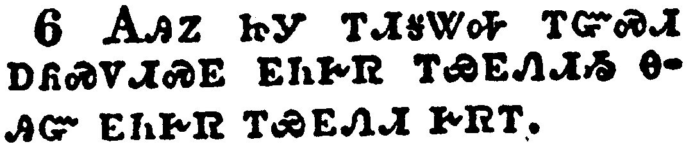</a></td>
</tr>
<tr class="even">
<td>And now ye know what withholdeth that he might be revealed in his time.</td>
</tr>
<tr class="odd">
<td>ᎪᎯᏃ ᏥᎩ ᎢᏗᎦᏔᎭ ᎢᏳᏍᏗ ᎠᏲᏍᏙᏗᏍᎬ ᎬᏂᎨᏒ ᎢᏯᎬᏁᏗᏱ ᎾᎯᏳ ᎬᏂᎨᏒ ᎢᏯᎬᏁᏗ ᎨᏒᎢ.</td>
</tr>
<tr class="even">
<td>Go-hi-no tsi-gi i-di-ga-ta-ha i-yu-s-di a-yo-s-do-di-s-gv gv-ni-ge-sv i-ya-gv-ne-di-yi na-hi-yu gv-ni-ge-sv i-ya-gv-ne-di ge-sv-i.</td>
</tr>
</tbody>
</table>

<table>
<tbody>
<tr class="odd">
<td><a href="140207.png">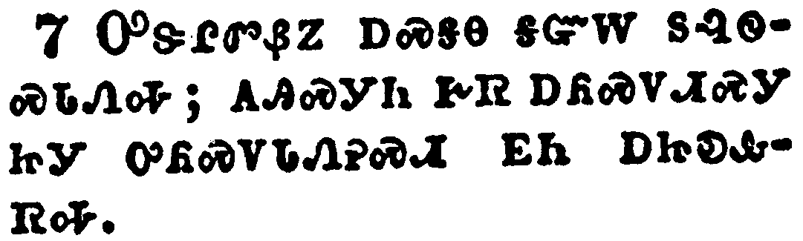</a></td>
</tr>
<tr class="even">
<td>For the mystery of iniquity doth already work: only he who now letteth will let, until he be taken out of the way.</td>
</tr>
<tr class="odd">
<td>ᎤᏕᎵᏛᏰᏃ ᎠᏍᎦᎾ ᎦᏳᎳ ᏚᎸᏫᏍᏓᏁᎭ; ᎪᎯᏍᎩᏂ ᎨᏒ ᎠᏲᏍᏙᏗᏍᎩ ᏥᎩ ᎤᏲᏍᏙᏓᏁᎮᏍᏗ ᎬᏂ ᎠᏥᎧᎲᏒᎭ.</td>
</tr>
<tr class="even">
<td>U-de-li-dv-ye-no a-s-ga-na ga-yu-la du-lv-wi-s-da-ne-ha; go-hi-s-gi-ni ge-sv a-yo-s-do-di-s-gi tsi-gi u-yo-s-do-da-ne-he-s-di gv-ni a-tsi-ka-hv-sv-ha.</td>
</tr>
</tbody>
</table>

<table>
<tbody>
<tr class="odd">
<td><a href="140208.png">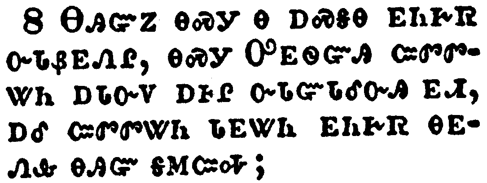</a></td>
</tr>
<tr class="even">
<td>And then shall that Wicked be revealed, whom the Lord shall consume with the spirit of his mouth, and shall destroy with the brightness of his coming:</td>
</tr>
<tr class="odd">
<td>ᎾᎯᏳᏃ ᎾᏍᎩ Ꮎ ᎠᏍᎦᎾ ᎬᏂᎨᏒ ᏅᏓᏰᎬᏁᎵ, ᎾᏍᎩ ᎤᎬᏫᏳᎯ ᏨᏛᏛᏔᏂ ᎠᏓᏅᏙ ᎠᎰᎵ ᏅᏓᏳᏓᎴᏅᎯ ᎬᏗ, ᎠᎴ ᏨᏛᏛᏔᏂ ᏓᎬᏔᏂ ᎬᏂᎨᏒ ᎾᎬᏁᎲ ᎾᎯᏳ ᎦᎷᏨᎭ;</td>
</tr>
<tr class="even">
<td>Na-hi-yu-no na-s-gi na a-s-ga-na gv-ni-ge-sv nv-da-ye-gv-ne-li, na-s-gi U-gv-wi-yu-hi tsv-dv-dv-ta-ni a-da-nv-do a-ho-li nv-da-yu-da-le-nv-hi gv-di, a-le tsv-dv-dv-ta-ni da-gv-ta-ni gv-ni-ge-sv na-gv-ne-hv na-hi-yu ga-lu-tsv-ha;</td>
</tr>
</tbody>
</table>

<table>
<tbody>
<tr class="odd">
<td><a href="140209.png">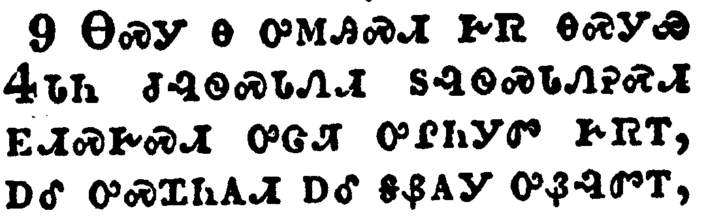</a></td>
</tr>
<tr class="even">
<td>Even him, whose coming is after the working of Satan with all power and signs and lying wonders,</td>
</tr>
<tr class="odd">
<td>ᎾᏍᎩ Ꮎ ᎤᎷᎯᏍᏗ ᎨᏒ ᎾᏍᎩᏯ ᏎᏓᏂ ᏧᎸᏫᏍᏓᏁᏗ ᏚᎸᏫᏍᏓᏁᎮᏍᏗ ᎬᏗᏍᎨᏍᏗ ᎤᏣᏘ ᎤᎵᏂᎩᏛ ᎨᏒᎢ, ᎠᎴ ᎤᏍᏆᏂᎪᏗ ᎠᎴ ᎦᏰᎪᎩ ᎤᏰᎸᏛᎢ,</td>
</tr>
<tr class="even">
<td>Na-s-gi na u-lu-hi-s-di ge-sv na-s-gi-ya Se-da-ni tsu-lv-wi-s-da-ne-di du-lv-wi-s-da-ne-he-s-di gv-di-s-ge-s-di u-tsa-ti u-li-ni-gi-dv ge-sv-i, a-le u-s-qua-ni-go-di a-le ga-ye-go-gi u-ye-lv-dv-i,</td>
</tr>
</tbody>
</table>

<table>
<tbody>
<tr class="odd">
<td><a href="140210.png">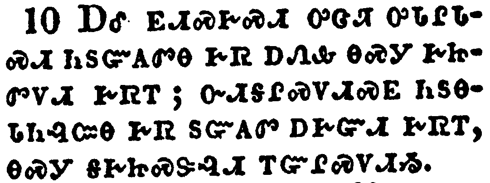</a></td>
</tr>
<tr class="even">
<td>And with all deceivableness of unrighteousness in them that perish; because they received not the love of the truth, that they might be saved.</td>
</tr>
<tr class="odd">
<td>ᎠᎴ ᎬᏗᏍᎨᏍᏗ ᎤᏣᏘ ᎤᏓᎵᏓᏍᏗ ᏂᏚᏳᎪᏛᎾ ᎨᏒ ᎠᏁᎲ ᎾᏍᎩ ᎨᏥᏛᏙᏗ ᎨᏒᎢ; ᏅᏗᎦᎵᏍᏙᏗᏍᎬ ᏂᏚᎾᏓᏂᎸᏨᎾ ᎨᏒ ᏚᏳᎪᏛ ᎠᎨᏳᏗ ᎨᏒᎢ, ᎾᏍᎩ ᎦᎨᏥᏍᏕᎸᏗ ᎢᏳᎵᏍᏙᏗᏱ.</td>
</tr>
<tr class="even">
<td>A-le gv-di-s-ge-s-di u-tsa-ti u-da-li-da-s-di ni-du-yu-go-dv-na ge-sv a-ne-hv na-s-gi ge-tsi-dv-do-di ge-sv-i; nv-di-ga-li-s-do-di-s-gv ni-du-na-da-ni-lv-tsv-na ge-sv du-yu-go-dv a-ge-yu-di ge-sv-i, na-s-gi ga-ge-tsi-s-de-lv-di i-yu-li-s-do-di-yi.</td>
</tr>
</tbody>
</table>

<table>
<tbody>
<tr class="odd">
<td><a href="140211.png">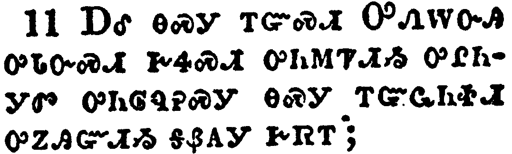</a></td>
</tr>
<tr class="even">
<td>And for this cause God shall send them strong delusion, that they should believe a lie:</td>
</tr>
<tr class="odd">
<td>ᎠᎴ ᎾᏍᎩ ᎢᏳᏍᏗ ᎤᏁᎳᏅᎯ ᎤᏓᏅᏍᏗ ᎨᏎᏍᏗ ᎤᏂᎷᏤᏗᏱ ᎤᎵᏂᎩᏛ ᎤᏂᎶᏄᎮᏍᎩ ᎾᏍᎩ ᎢᏳᏩᏂᏐᏗ ᎤᏃᎯᏳᏗᏱ ᎦᏰᎪᎩ ᎨᏒᎢ;</td>
</tr>
<tr class="even">
<td>A-le na-s-gi i-yu-s-di U-ne-la-nv-hi u-da-nv-s-di ge-se-s-di u-ni-lu-tse-di-yi u-li-ni-gi-dv u-ni-lo-nu-he-s-gi na-s-gi i-yu-wa-ni-so-di u-no-hi-yu-di-yi ga-ye-go-gi ge-sv-i;</td>
</tr>
</tbody>
</table>

<table>
<tbody>
<tr class="odd">
<td><a href="140212.png">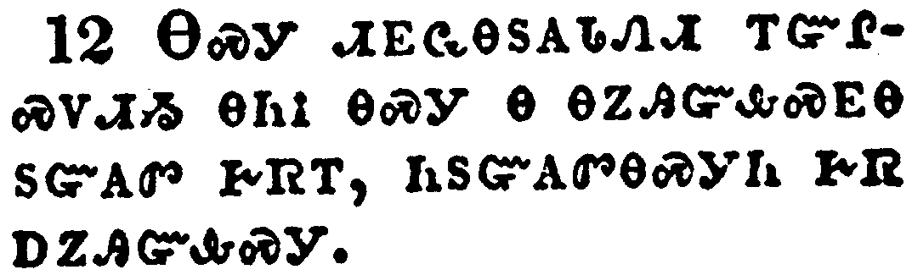</a></td>
</tr>
<tr class="even">
<td>That they all might be damned who believed not the truth, but had pleasure in unrighteousness.</td>
</tr>
<tr class="odd">
<td>ᎾᏍᎩ ᏗᎬᏩᎾᏚᎪᏓᏁᏗ ᎢᏳᎵᏍᏙᏗᏱ ᎾᏂᎥ ᎾᏍᎩ Ꮎ ᎾᏃᎯᏳᎲᏍᎬᎾ ᏚᏳᎪᏛ ᎨᏒᎢ, ᏂᏚᏳᎪᏛᎾᏍᎩᏂ ᎨᏒ ᎠᏃᎯᏳᎲᏍᎩ.</td>
</tr>
<tr class="even">
<td>na-s-gi di-gv-wa-na-du-go-da-ne-di i-yu-li-s-do-di-yi na-ni-v na-s-gi na na-no-hi-yu-hv-s-gv-na du-yu-go-dv ge-sv-i, ni-du-yu-go-dv-na-s-gi-ni ge-sv a-no-hi-yu-hv-s-gi.</td>
</tr>
</tbody>
</table>

<table>
<tbody>
<tr class="odd">
<td><a href="140213.png">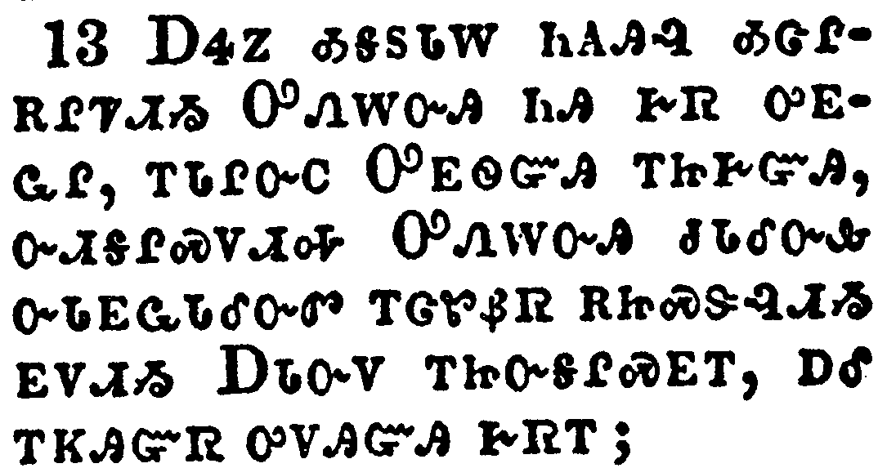</a></td>
</tr>
<tr class="even">
<td>But we are bound to give thanks alway to God for you, brethren beloved of the Lord, because God hath from the beginning chosen you to salvation through sanctification of the Spirit and belief of the truth:</td>
</tr>
<tr class="odd">
<td>ᎠᏎᏃ ᎣᎦᏚᏓᎳ ᏂᎪᎯᎸ ᎣᏣᎵᎡᎵᏤᏗᏱ ᎤᏁᎳᏅᎯ ᏂᎯ ᎨᏒ ᎤᎬᏩᎵ, ᎢᏓᎵᏅᏟ ᎤᎬᏫᏳᎯ ᎢᏥᎨᏳᎯ, ᏅᏗᎦᎵᏍᏙᏗᎭ ᎤᏁᎳᏅᎯ ᏧᏓᎴᏅᎲ ᏅᏓᎬᏩᏓᎴᏅᏛ ᎢᏣᏑᏰᏒ ᎡᏥᏍᏕᎸᏗᏱ ᎬᏙᏗᏱ ᎠᏓᏅᏙ ᎢᏥᏅᎦᎵᏍᎬᎢ, ᎠᎴ ᎢᏦᎯᏳᏒ ᎤᏙᎯᏳᎯ ᎨᏒᎢ;</td>
</tr>
<tr class="even">
<td>A-se-no o-ga-du-da-la ni-go-hi-lv o-tsa-li-e-li-tse-di-yi U-ne-la-nv-hi ni-hi ge-sv u-gv-wa-li, i-da-li-nv-tli U-gv-wi-yu-hi i-tsi-ge-yu-hi, nv-di-ga-li-s-do-di-ha U-ne-la-nv-hi tsu-da-le-nv-hv nv-da-gv-wa-da-le-nv-dv i-tsa-su-ye-sv e-tsi-s-de-lv-di-yi gv-do-di-yi A-da-nv-do i-tsi-nv-ga-li-s-gv-i, a-le i-tso-hi-yu-sv u-do-hi-yu-hi ge-sv-i;</td>
</tr>
</tbody>
</table>

<table>
<tbody>
<tr class="odd">
<td><a href="140214.png">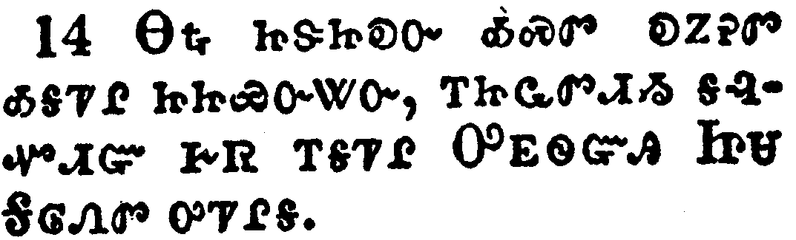</a></td>
</tr>
<tr class="even">
<td>Whereunto he called you by our gospel, to the obtaining of the glory of our Lord Jesus Christ.</td>
</tr>
<tr class="odd">
<td>ᎾᎿᎭᏥᏕᏲᎧᏅ ᎣᏍᏛ ᎧᏃᎮᏛ ᎣᎦᏤᎵ ᏥᏥᏯᏅᏔᏅ, ᎢᏥᏩᏛᏗᏱ ᎦᎸᏉᏗᏳ ᎨᏒ ᎢᎦᏤᎵ ᎤᎬᏫᏳᎯ ᏥᏌ ᎦᎶᏁᏛ ᎤᏤᎵᎦ.</td>
</tr>
<tr class="even">
<td>Na-hna tsi-de-yo-ka-nv o-s-dv ka-no-he-dv o-ga-tse-li tsi-tsi-ya-nv-ta-nv, i-tsi-wa-dv-di-yi ga-lv-quo-di-yu ge-sv i-ga-tse-li U-gv-wi-yu-hi Tsi-sa Ga-lo-ne-dv u-tse-li-ga.</td>
</tr>
</tbody>
</table>

<table>
<tbody>
<tr class="odd">
<td><a href="140215.png">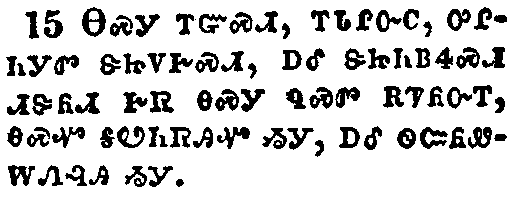</a></td>
</tr>
<tr class="even">
<td>Therefore, brethren, stand fast, and hold the traditions which ye have been taught, whether by word, or our epistle.</td>
</tr>
<tr class="odd">
<td>ᎾᏍᎩ ᎢᏳᏍᏗ, ᎢᏓᎵᏅᏟ, ᎤᎵᏂᎩᏛ ᏕᏥᏙᎨᏍᏗ, ᎠᎴ ᏕᏥᏂᏴᏎᏍᏗ ᏗᏕᏲᏗ ᎨᏒ ᎾᏍᎩ ᏄᏍᏛ ᎡᏤᏲᏅᎢ, ᎾᏍᏉ ᎦᏬᏂᏒᎯᏉ ᏱᎩ, ᎠᎴ ᏫᏨᏲᏪᎳᏁᎸᎯ ᏱᎩ.</td>
</tr>
<tr class="even">
<td>Na-s-gi i-yu-s-di, i-da-li-nv-tli, u-li-ni-gi-dv de-tsi-do-ge-s-di, a-le de-tsi-ni-yv-se-s-di di-de-yo-di ge-sv na-s-gi nu-s-dv e-tse-yo-nv-i, na-s-quo ga-wo-ni-sv-hi-quo yi-gi, a-le wi-tsv-yo-we-la-ne-lv-hi yi-gi.</td>
</tr>
</tbody>
</table>

<table>
<tbody>
<tr class="odd">
<td><a href="140216.png">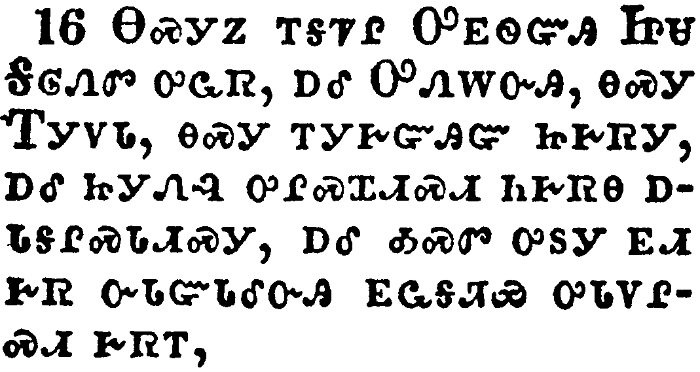</a></td>
</tr>
<tr class="even">
<td>Now our Lord Jesus Christ himself, and God, even our Father, which hath loved us, and hath given us everlasting consolation and good hope through grace,</td>
</tr>
<tr class="odd">
<td>ᎾᏍᎩᏃ ᎢᎦᏤᎵ ᎤᎬᏫᏳᎯ ᏥᏌ ᎦᎶᏁᏛ ᎤᏩᏒ, ᎠᎴ ᎤᏁᎳᏅᎯ, ᎾᏍᎩ ᎢᎩᏙᏓ, ᎾᏍᎩ ᎢᎩᎨᏳᎯᏳ ᏥᎨᏒᎩ, ᎠᎴ ᏥᎩᏁᎸ ᎤᎵᏍᏆᏗᏍᏗ ᏂᎨᏒᎾ ᎠᏓᎦᎵᏍᏓᏗᏍᎩ, ᎠᎴ ᎣᏍᏛ ᎤᏚᎩ ᎬᏗ ᎨᏒ ᏅᏓᏳᏓᎴᏅᎯ ᎬᏩᎦᏘᏯ ᎤᏓᏙᎵᏍᏗ ᎨᏒᎢ,</td>
</tr>
<tr class="even">
<td>Na-s-gi-no i-ga-tse-li U-gv-wi-yu-hi Tsi-sa Ga-lo-ne-dv u-wa-sv, a-le U-ne-la-nv-hi, na-s-gi I-gi-do-da, na-s-gi i-gi-ge-yu-hi-yu tsi-ge-sv-gi, a-le tsi-gi-ne-lv u-li-s-qua-di-s-di ni-ge-sv-na a-da-ga-li-s-da-di-s-gi, a-le o-s-dv u-du-gi gv-di ge-sv nv-da-yu-da-le-nv-hi gv-wa-ga-ti-ya u-da-do-li-s-di ge-sv-i,</td>
</tr>
</tbody>
</table>

<table>
<tbody>
<tr class="odd">
<td><a href="140217.png">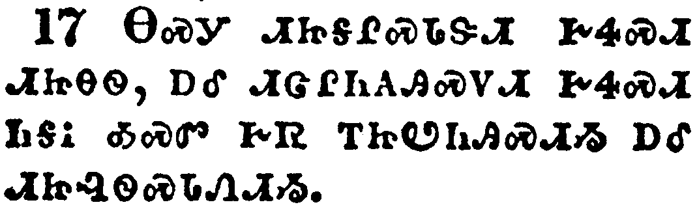</a></td>
</tr>
<tr class="even">
<td>Comfort your hearts, and stablish you in every good word and work.</td>
</tr>
<tr class="odd">
<td>ᎾᏍᎩ ᏗᏥᎦᎵᏍᏓᏕᏗ ᎨᏎᏍᏗ ᏗᏥᎾᏫ, ᎠᎴ ᏗᏣᎵᏂᎪᎯᏍᏙᏗ ᎨᏎᏍᏗ ᏂᎦᎥ ᎣᏍᏛ ᎨᏒ ᎢᏥᏬᏂᎯᏍᏗᏱ ᎠᎴ ᏗᏥᎸᏫᏍᏓᏁᏗᏱ.</td>
</tr>
<tr class="even">
<td>Na-s-gi di-tsi-ga-li-s-da-de-di ge-se-s-di di-tsi-na-wi, a-le di-tsa-li-ni-go-hi-s-do-di ge-se-s-di ni-ga-v o-s-dv ge-sv i-tsi-wo-ni-hi-s-di-yi a-le di-tsi-lv-wi-s-da-ne-di-yi.</td>
</tr>
</tbody>
</table>

