+++
draft=false
date = 2014-12-18T21:11:07Z
title = "2 Timothy - Chapter 4 - Cherokee New Testament"
weight = 1418955067

[taxonomies]

authors = ["Timothy Legg"]
categories = []
tags = []

[extra]
+++

<table>
<tbody>
<tr class="odd">
<td><a href="160401.png">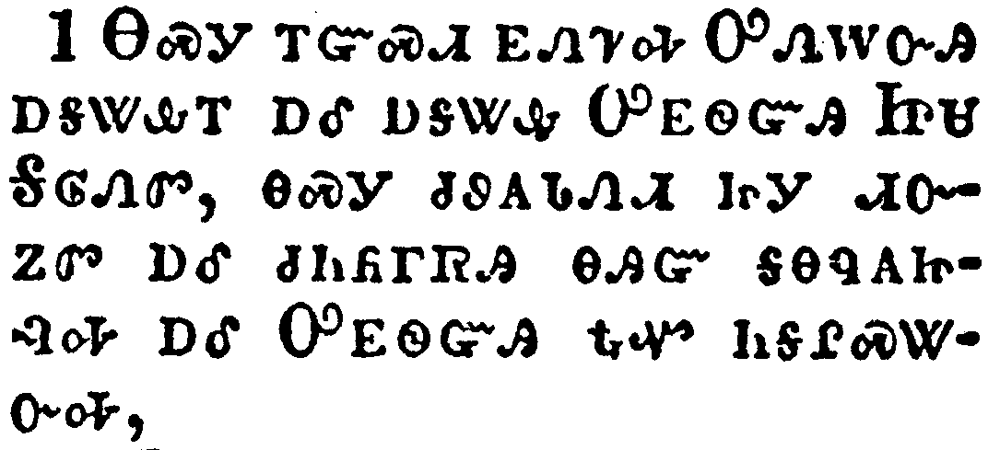</a></td>
</tr>
<tr class="even">
<td>I charge thee therefore before God, and the Lord Jesus Christ, who shall judge the quick and the dead at his appearing and his kingdom;</td>
</tr>
<tr class="odd">
<td>ᎾᏍᎩ ᎢᏳᏍᏗ ᎬᏁᏤᎭ ᎤᏁᎳᏅᎯ ᎠᎦᏔᎲᎢ ᎠᎴ ᎠᎦᏔᎲ ᎤᎬᏫᏳᎯ ᏥᏌ ᎦᎶᏁᏛ, ᎾᏍᎩ ᏧᏭᎪᏓᏁᏗ ᏥᎩ ᏗᏅᏃᏛ ᎠᎴ ᏧᏂᏲᎱᏒᎯ ᎾᎯᏳ ᎦᎾᏄᎪᏥᎸᎭ ᎠᎴ ᎤᎬᏫᏳᎯ ᎿᎭᏉ ᏂᎦᎵᏍᏔᏅᎭ,</td>
</tr>
<tr class="even">
<td>Na-s-gi i-yu-s-di gv-ne-tse-ha U-ne-la-nv-hi a-ga-ta-hv-i a-le a-ga-ta-hv U-gv-wi-yu-hi Tsi-sa Ga-lo-ne-dv, na-s-gi tsu-wu-go-da-ne-di tsi-gi di-nv-no-dv a-le tsu-ni-yo-hu-sv-hi na-hi-yu ga-na-nu-go-tsi-lv-ha a-le U-gv-wi-yu-hi hna-quo ni-ga-li-s-ta-nv-ha,</td>
</tr>
</tbody>
</table>

<table>
<tbody>
<tr class="odd">
<td></td>
</tr>
<tr class="even">
<td>Preach the word; be instant in season, out of season; reprove, rebuke, exhort with all longsuffering and doctrine.</td>
</tr>
<tr class="odd">
<td>ᎭᎵᏥᏙᎲᏍᎨᏍᏗ ᎧᏃᎮᏛ, ᏣᎵᏁᏅᏕᏍᏗᏉ ᏰᎵ ᎨᏎᏍᏗ ᎠᎴ ᏰᎵ ᏂᎨᏒᎾ ᎨᏎᏍᏗ, ᏕᎯᎬᏍᎪᎸᎥᏍᎨᏍᏗ, ᏕᎯᏍᎦᎨᏍᏗ, ᏕᎯᏍᏗᏰᏗᏍᎨᏍᏗ ᎲᏗᏍᎨᏍᏗ ᎤᏣᏘ ᎬᏂᏛ ᎨᏒ ᎠᎴ ᏗᏕᏲᏗ ᎨᏒᎢ.</td>
</tr>
<tr class="even">
<td>Ha-li-tsi-do-hv-s-ge-s-di ka-no-he-dv, tsa-li-ne-nv-de-s-di-quo ye-li ge-se-s-di a-le ye-li ni-ge-sv-na ge-se-s-di, de-hi-gv-s-go-lv-v-s-ge-s-di, de-hi-s-ga-ge-s-di, de-hi-s-di-ye-di-s-ge-s-di hv-di-s-ge-s-di u-tsa-ti gv-ni-dv ge-sv a-le di-de-yo-di ge-sv-i.</td>
</tr>
</tbody>
</table>

<table>
<tbody>
<tr class="odd">
<td><a href="160403.png">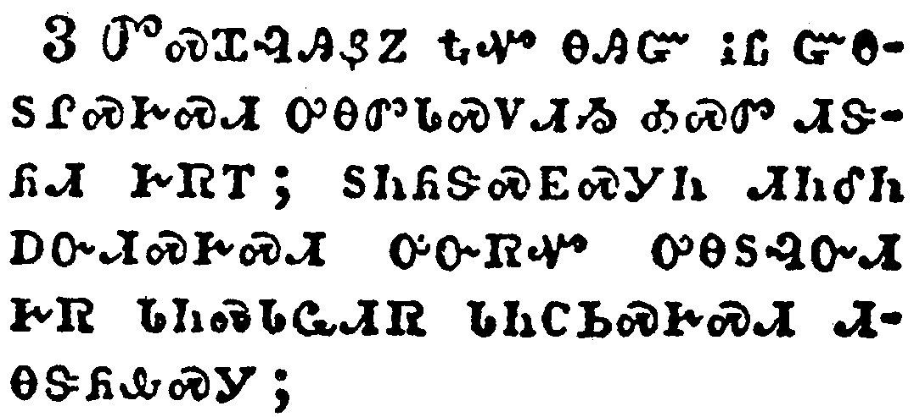</a></td>
</tr>
<tr class="even">
<td>For the time will come when they will not endure sound doctrine; but after their own lusts shall they heap to themselves teachers, having itching ears;</td>
</tr>
<tr class="odd">
<td>ᏛᏍᏆᎸᎯᏰᏃ ᎿᎭᏉ ᎾᎯᏳ ᎥᏝ ᏳᎾᏚᎵᏍᎨᏍᏗ ᎤᎾᏛᏓᏍᏙᏗᏱ ᎣᏍᏛ ᏗᏕᏲᏗ ᎨᏒᎢ; ᏚᏂᏲᏕᏍᎬᏍᎩᏂ ᏗᏂᎴᏂ ᎠᏅᏗᏍᎨᏍᏗ ᎤᏅᏒᏉ ᎤᎾᏚᎸᏅᏗ ᎨᏒ ᏓᏂᏍᏓᏩᏗᏒ ᏓᏂᏟᏏᏍᎨᏍᏗ ᏗᎾᏕᏲᎲᏍᎩ;</td>
</tr>
<tr class="even">
<td>Dv-s-qua-lv-hi-ye-no hna-quo na-hi-yu v-tla yu-na-du-li-s-ge-s-di u-na-dv-da-s-do-di-yi o-s-dv di-de-yo-di ge-sv-i; du-ni-yo-de-s-gv-s-gi-ni di-ni-le-ni a-nv-di-s-ge-s-di u-nv-sv-quo u-na-du-lv-nv-di ge-sv da-ni-s-da-wa-di-sv da-ni-tli-si-s-ge-s-di di-na-de-yo-hv-s-gi;</td>
</tr>
</tbody>
</table>

<table>
<tbody>
<tr class="odd">
<td></td>
</tr>
<tr class="even">
<td>And they shall turn away their ears from the truth, and shall be turned unto fables.</td>
</tr>
<tr class="odd">
<td>ᏗᏂᎴᏂᏃ ᏓᏂᎦᏔᎲᏍᎨᏍᏗ ᎠᎾᏛᎩᏍᎬ ᏚᏳᎪᏛᎢ, ᎠᏎᏉᏃ ᎦᏬᏂᎯᏍᏗ ᎨᏒ ᎢᏗᏢ ᏩᎾᎦᏔᎲᏍᏗᏍᎨᏍᏗ.</td>
</tr>
<tr class="even">
<td>Di-ni-le-ni-no da-ni-ga-ta-hv-s-ge-s-di a-na-dv-gi-s-gv du-yu-go-dv-i, a-se-quo-no ga-wo-ni-hi-s-di ge-sv i-di-tlv wa-na-ga-ta-hv-s-di-s-ge-s-di.</td>
</tr>
</tbody>
</table>

<table>
<tbody>
<tr class="odd">
<td><a href="160405.png">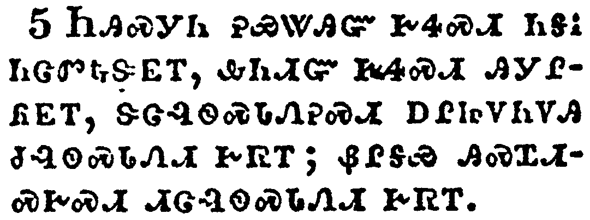</a></td>
</tr>
<tr class="even">
<td>But watch thou in all things, endure afflictions, do the work of an evangelist, make full proof of thy ministry.</td>
</tr>
<tr class="odd">
<td>ᏂᎯᏍᎩᏂ ᎮᏯᏔᎯᏳ ᎨᏎᏍᏗ ᏂᎦᎥ ᏂᏣᏛᎿᎭᏕᎬᎢ, ᎲᏂᏗᏳ ᎨᏎᏍᏗ ᎯᎩᎵᏲᎬᎢ, ᏕᏣᎸᏫᏍᏓᏁᎮᏍᏗ ᎠᎵᏥᏙᏂᏙᎯ ᏧᎸᏫᏍᏓᏁᏗ ᎨᏒᎢ; ᏰᎵᎦᏯ ᎯᏍᏆᏗᏍᎨᏍᏗ ᏗᏣᎸᏫᏍᏓᏁᏗ ᎨᏒᎢ.</td>
</tr>
<tr class="even">
<td>Ni-hi-s-gi-ni he-ya-ta-hi-yu ge-se-s-di ni-ga-v ni-tsa-dv-hna-de-gv-i, hv-ni-di-yu ge-se-s-di hi-gi-li-yo-gv-i, de-tsa-lv-wi-s-da-ne-he-s-di a-li-tsi-do-ni-do-hi tsu-lv-wi-s-da-ne-di ge-sv-i; ye-li-ga-ya hi-s-qua-di-s-ge-s-di di-tsa-lv-wi-s-da-ne-di ge-sv-i.</td>
</tr>
</tbody>
</table>

<table>
<tbody>
<tr class="odd">
<td><a href="160406.png">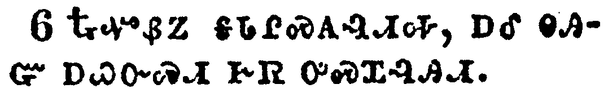</a></td>
</tr>
<tr class="even">
<td>For I am now ready to be offered, and the time of my departure is at hand.</td>
</tr>
<tr class="odd">
<td>ᎿᎭᏉᏰᏃ ᎦᏓᎵᏍᎪᎸᏗᎭ, ᎠᎴ ᎾᎯᏳ ᎠᏇᏅᏍᏗ ᎨᏒ ᎤᏍᏆᎸᎯᏗ.</td>
</tr>
<tr class="even">
<td>Hna-quo-ye-no ga-da-li-s-go-lv-di-ha, a-le na-hi-yu a-que-nv-s-di ge-sv u-s-qua-lv-hi-di.</td>
</tr>
</tbody>
</table>

<table>
<tbody>
<tr class="odd">
<td></td>
</tr>
<tr class="even">
<td>I have fought a good fight, I have finished my course, I have kept the faith:</td>
</tr>
<tr class="odd">
<td>ᎠᏆᎵᎸ ᎣᏍᏛ ᎠᎵᏍᏗ ᎨᏒᎢ, ᎠᎩᏍᏆᏛ ᎦᏙᎩᏯᏍᎬᎢ, ᎠᎩᏍᏆᏂᎪᏔᏅ ᎪᎯᏳᏗ ᎨᏒᎢ,</td>
</tr>
<tr class="even">
<td>A-qua-li-lv o-s-dv a-li-s-di ge-sv-i, a-gi-s-qua-dv ga-do-gi-ya-s-gv-i, a-gi-s-qua-ni-go-ta-nv go-hi-yu-di ge-sv-i,</td>
</tr>
</tbody>
</table>

<table>
<tbody>
<tr class="odd">
<td><a href="160408.png">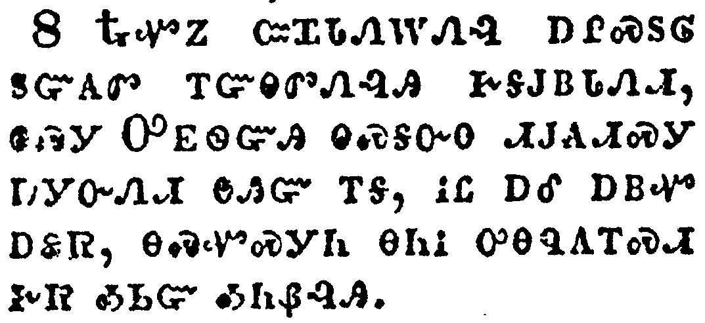</a></td>
</tr>
<tr class="even">
<td>Henceforth there is laid up for me a crown of righteousness, which the Lord, the righteous judge, shall give me at that day: and not to me only, but unto all them also that love his appearing.</td>
</tr>
<tr class="odd">
<td>ᎿᎭᏉᏃ ᏨᏆᏓᏁᎳᏁᎸ ᎠᎵᏍᏚᎶ ᏚᏳᎪᏛ ᎢᏳᎾᏛᏁᎸᎯ ᎨᎦᎫᏴᏓᏁᏗ, ᎾᏍᎩ ᎤᎬᏫᏳᎯ ᎾᏍᎦᏅᎾ ᏗᎫᎪᏗᏍᎩ ᎠᏗᏅᏁᏗ ᎾᎯᏳ ᎢᎦ, ᎥᏝ ᎠᎴ ᎠᏴᏉ ᎠᏋᏒ, ᎾᏍᏉᏍᎩᏂ ᎾᏂᎥ ᎤᎾᏄᎪᎢᏍᏗ ᎨᏒ ᎣᏏᏳ ᎣᏂᏰᎸᎯ.</td>
</tr>
<tr class="even">
<td>Hna-quo-no tsv-qua-da-ne-la-ne-lv a-li-s-du-lo du-yu-go-dv i-yu-na-dv-ne-lv-hi ge-ga-gu-yv-da-ne-di, na-s-gi U-gv-wi-yu-hi na-s-ga-nv-na di-gu-go-di-s-gi a-di-nv-ne-di na-hi-yu i-ga, v-tla a-le a-yv-quo a-quv-sv, na-s-quo-s-gi-ni na-ni-v u-na-nu-go-i-s-di ge-sv o-si-yu o-ni-ye-lv-hi.</td>
</tr>
</tbody>
</table>

<table>
<tbody>
<tr class="odd">
<td><a href="160409.png">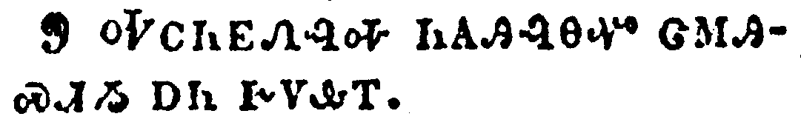</a></td>
</tr>
<tr class="even">
<td>Do thy diligence to come shortly unto me:</td>
</tr>
<tr class="odd">
<td>ᎭᏟᏂᎬᏁᎸᎭ ᏂᎪᎯᎸᎾᏉ ᏣᎷᎯᏍᏗᏱ ᎠᏂ ᎨᏙᎲᎢ.</td>
</tr>
<tr class="even">
<td>Ha-tli-ni-gv-ne-lv-ha ni-go-hi-lv-na-quo tsa-lu-hi-s-di-yi a-ni ge-do-hv-i.</td>
</tr>
</tbody>
</table>

<table>
<tbody>
<tr class="odd">
<td><a href="160410.png">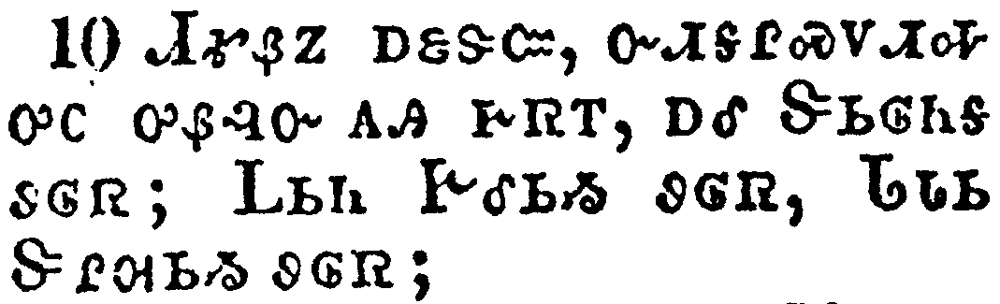</a></td>
</tr>
<tr class="even">
<td>For Demas hath forsaken me, having loved this present world, and is departed unto Thessalonica; Crescens to Galatia, Titus unto Dalmatia.</td>
</tr>
<tr class="odd">
<td>ᏗᎹᏰᏃ ᎠᏋᏕᏨ, ᏅᏗᎦᎵᏍᏙᏗᎭ ᎤᏟ ᎤᏰᎸᏅ ᎪᎯ ᎨᏒᎢ, ᎠᎴ ᏕᏏᎶᏂᎦ ᏭᎶᏒ; ᏞᏏᏂ ᎨᎴᏏᏱ ᏭᎶᏒ, ᏓᏓᏏ ᏕᎵᎺᏏᏱ ᏭᎶᏒ;</td>
</tr>
<tr class="even">
<td>Di-ma-ye-no a-quv-de-tsv, nv-di-ga-li-s-do-di-ha u-tli u-ye-lv-nv go-hi ge-sv-i, a-le De-si-lo-ni-ga wu-lo-sv; Tle-si-ni Ge-le-si-yi wu-lo-sv, Da-da-si De-li-me-si-yi wu-lo-sv;</td>
</tr>
</tbody>
</table>

<table>
<tbody>
<tr class="odd">
<td></td>
</tr>
<tr class="even">
<td>Only Luke is with me. Take Mark, and bring him with thee: for he is profitable to me for the ministry.</td>
</tr>
<tr class="odd">
<td>ᎷᎦ ᎤᏩᏒ ᎣᏍᏕᏙᎭ; ᎹᎦ ᏘᏯᏗᏁᏒᎭ, ᎬᎩᏍᏕᎸᎯᏓᏍᏗᏰᏃ ᏓᎩᎸᏫᏍᏓᏁᎲᎢ.</td>
</tr>
<tr class="even">
<td>Lu-ga u-wa-sv o-s-de-do-ha; Ma-ga ti-ya-di-ne-sv-ha, gv-gi-s-de-lv-hi-da-s-di-ye-no da-gi-lv-wi-s-da-ne-hv-i.</td>
</tr>
</tbody>
</table>

<table>
<tbody>
<tr class="odd">
<td></td>
</tr>
<tr class="even">
<td>And Tychicus have I sent to Ephesus.</td>
</tr>
<tr class="odd">
<td>ᏗᏥᎦᏍᎩᏂ ᎡᏈᏌ ᏥᏅᏒ</td>
</tr>
<tr class="even">
<td>Di-tsi-ga-s-gi-ni E-qui-sa tsi-nv-sv</td>
</tr>
</tbody>
</table>

<table>
<tbody>
<tr class="odd">
<td></td>
</tr>
<tr class="even">
<td>The cloke that I left at Troas with Carpus, when thou comest, bring with thee, and the books, but especially the parchments.</td>
</tr>
<tr class="odd">
<td>ᎦᏌᎴᎾ ᏠᏯ ᏨᏛᎩᏂᏴᎩ ᎦᏆ ᎦᏁᎸᎢ ᏖᏒ ᏘᏁᏒᎭ, ᎠᎴ ᎪᏪᎵ ᏙᏘᏁᏒᎭ ᎾᏍᎩ Ꮀ ᎤᎬᏫᏳᏎᏍᏗ ᎦᏁᎦ ᏗᎪᏪᎶᏗ.</td>
</tr>
<tr class="even">
<td>Ga-sa-le-na Tlo-ya tsv-dv-gi-ni-yv-gi Ga-qua ga-ne-lv-i te-sv ti-ne-sv-ha, a-le go-we-li do-ti-ne-sv-ha na-s-gi ho u-gv-wi-yu-se-s-di ga-ne-ga di-go-we-lo-di.</td>
</tr>
</tbody>
</table>

<table>
<tbody>
<tr class="odd">
<td><a href="160414.png">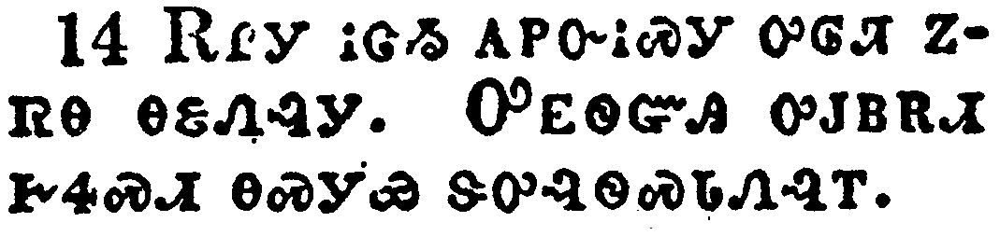</a></td>
</tr>
<tr class="even">
<td>Alexander the coppersmith did me much evil: the Lord reward him according to his works:</td>
</tr>
<tr class="odd">
<td>ᎡᎵᎩ ᎥᏣᏱ ᎪᏢᏅᎥᏍᎩ ᎤᎶᏘ ᏃᏒᎾ ᎾᏋᏁᎸᎩ. ᎤᎬᏫᏳᎯ ᎤᎫᏴᎡᏗ ᎨᏎᏍᏗ ᎾᏍᎩᏯ ᏕᎤᎸᏫᏍᏓᏁᎸᎢ.</td>
</tr>
<tr class="even">
<td>E-li-gi v-tsa-yi go-tlv-nv-v-s-gi u-lo-ti no-sv-na na-quv-ne-lv-gi. U-gv-wi-yu-hi u-gu-yv-e-di ge-se-s-di na-s-gi-ya de-u-lv-wi-s-da-ne-lv-i.</td>
</tr>
</tbody>
</table>

<table>
<tbody>
<tr class="odd">
<td></td>
</tr>
<tr class="even">
<td>Of whom be thou ware also; for he hath greatly withstood our words.</td>
</tr>
<tr class="odd">
<td>ᎾᏍᏉ ᏂᎯ ᎾᏍᎩ ᎯᏰᏯᏙᏤᎮᏍᏗ, ᎤᎵᏂᎩᏗᏳᏰᏃ ᎤᏡᏔᏅ ᎣᏥᏬᏂᏍᎬᎢ.</td>
</tr>
<tr class="even">
<td>Na-s-quo ni-hi na-s-gi hi-ye-ya-do-tse-he-s-di, u-li-ni-gi-di-yu-ye-no u-tlu-ta-nv o-tsi-wo-ni-s-gv-i.</td>
</tr>
</tbody>
</table>

<table>
<tbody>
<tr class="odd">
<td></td>
</tr>
<tr class="even">
<td>At my first answer no man stood with me, but all men forsook me: I pray God that it may not be laid to their charge.</td>
</tr>
<tr class="odd">
<td>ᎢᎬᏱᏱ ᎠᎩᏬᏂᏒ ᎦᎵᏍᏕᎵᏍᎬ ᎥᏝ ᎩᎶ ᎾᎥ ᏱᎦᏙᎨᎢ, ᎾᏂᎥᏉᏍᎩᏂ ᎬᏆᏕᏨᎩ; ᏞᏍᏗ ᎤᏂᏍᎦᏅᏨ ᏱᏚᏚᎪᏔᏁᏍᏗ;</td>
</tr>
<tr class="even">
<td>I-gv-yi-yi a-gi-wo-ni-sv ga-li-s-de-li-s-gv v-tla gi-lo na-v yi-ga-do-ge-i, na-ni-v-quo-s-gi-ni gv-qua-de-tsv-gi; tle-s-di u-ni-s-ga-nv-tsv yi-du-du-go-ta-ne-s-di;</td>
</tr>
</tbody>
</table>

<table>
<tbody>
<tr class="odd">
<td><a href="160417.png">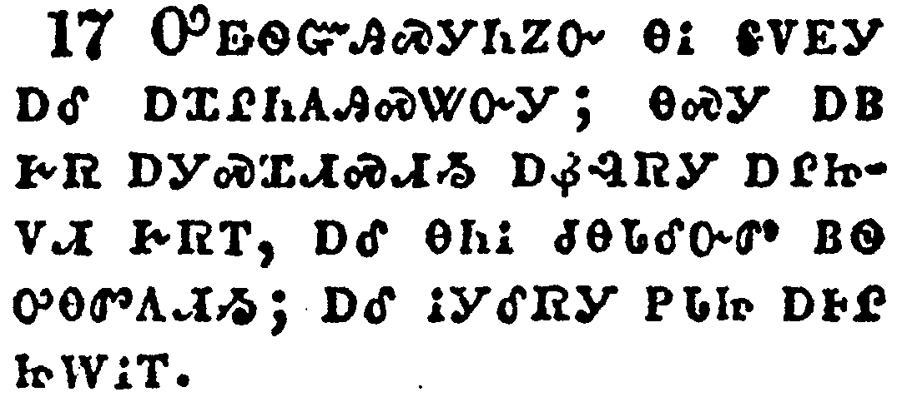</a></td>
</tr>
<tr class="even">
<td>Notwithstanding the Lord stood with me, and strengthened me; that by me the preaching might be fully known, and that all the Gentiles might hear: and I was delivered out of the mouth of the lion.</td>
</tr>
<tr class="odd">
<td>ᎤᎬᏫᏳᎯᏍᎩᏂᏃᏅ ᎾᎥ ᎦᏙᎬᎩ ᎠᎴ ᎠᏆᎵᏂᎪᎯᏍᏔᏅᎩ; ᎾᏍᎩ ᎠᏴ ᎨᏒ ᎠᎩᏍᏆᏗᏍᏗᏱ ᎠᏰᎸᏒᎩ ᎠᎵᏥᏙᏗ ᎨᏒᎢ, ᎠᎴ ᎾᏂᎥ ᏧᎾᏓᎴᏅᏛ ᏴᏫ ᎤᎾᏛᎯᏗᏱ; ᎠᎴ ᎥᎩᎴᏒᎩ ᏢᏓᏥ ᎠᎰᎵ ᏥᎳᎥᎢ.</td>
</tr>
<tr class="even">
<td>U-gv-wi-yu-hi-s-gi-ni-no-nv na-v ga-do-gv-gi a-le a-qua-li-ni-go-hi-s-ta-nv-gi; na-s-gi a-yv ge-sv a-gi-s-qua-di-s-di-yi a-ye-lv-sv-gi a-li-tsi-do-di ge-sv-i, a-le na-ni-v tsu-na-da-le-nv-dv yv-wi u-na-dv-hi-di-yi; a-le v-gi-le-sv-gi tlv-da-tsi a-ho-li tsi-la-v-i.</td>
</tr>
</tbody>
</table>

<table>
<tbody>
<tr class="odd">
<td><a href="160418.png">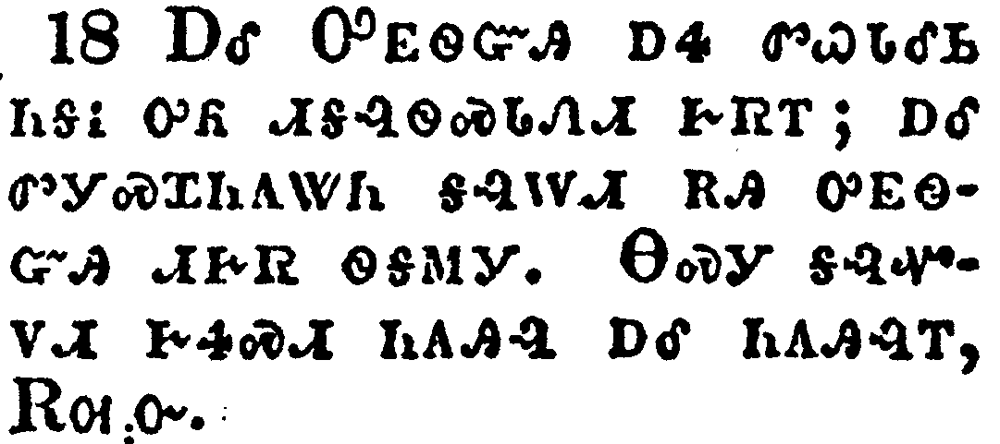</a></td>
</tr>
<tr class="even">
<td>And the Lord shall deliver me from every evil work, and will preserve me unto his heavenly kingdom: to whom be glory for ever and ever. Amen.</td>
</tr>
<tr class="odd">
<td>ᎠᎴ ᎤᎬᏫᏳᎯ ᎠᏎ ᏛᏇᏓᎴᏏ ᏂᎦᎥ ᎤᏲ ᏗᎦᎸᏫᏍᏓᏁᏗ ᎨᏒᎢ; ᎠᎴ ᏛᎩᏍᏆᏂᎪᏔᏂ ᎦᎸᎳᏗ ᎡᎯ ᎤᎬᏫᏳᎯ ᏗᎨᏒ ᏫᎦᎷᎩ. ᎾᏍᎩ ᎦᎸᏉᏙᏗ ᎨᏎᏍᏗ ᏂᎪᎯᎸ ᎠᎴ ᏂᎪᎯᎸᎢ, ᎡᎺᏅ.</td>
</tr>
<tr class="even">
<td>A-le U-gv-wi-yu-hi a-se dv-que-da-le-si ni-ga-v u-yo di-ga-lv-wi-s-da-ne-di ge-sv-i; a-le dv-gi-s-qua-ni-go-ta-ni ga-lv-la-di e-hi u-gv-wi-yu-hi di-ge-sv wi-ga-lu-gi. Na-s-gi ga-lv-quo-do-di ge-se-s-di ni-go-hi-lv a-le ni-go-hi-lv-i, E-me-nv.</td>
</tr>
</tbody>
</table>

<table>
<tbody>
<tr class="odd">
<td></td>
</tr>
<tr class="even">
<td>Salute Prisca and Aquila, and the household of Onesiphorus.</td>
</tr>
<tr class="odd">
<td>ᎩᏲᎵᎸᎭ ᏈᏍᎦ ᎠᎴ ᎡᏈᎳ, ᎠᎴ ᎣᏁᏏᏉᎳ ᏚᏓᏘᎾᎥᎢ.</td>
</tr>
<tr class="even">
<td>Gi-yo-li-lv-ha Qui-s-ga a-le E-qui-la, a-le O-ne-si-quo-la du-da-ti-na-v-i.</td>
</tr>
</tbody>
</table>

<table>
<tbody>
<tr class="odd">
<td><a href="160420.png">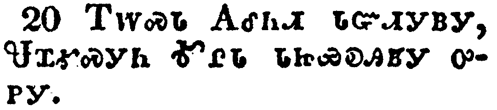</a></td>
</tr>
<tr class="even">
<td>Erastus abode at Corinth: but Trophimus have I left at Miletum sick.</td>
</tr>
<tr class="odd">
<td>ᎢᎳᏍᏓ ᎪᎴᏂᏗ ᏓᏳᏗᎩᏴᎩ, ᏠᏆᎹᏍᎩᏂ ᎹᎵᏓ ᏓᏥᏯᎧᎯᏴᎩ ᎤᏢᎩ.</td>
</tr>
<tr class="even">
<td>I-la-s-da Go-le-ni-di da-yu-di-gi-yv-gi, Tlo-qua-ma-s-gi-ni Ma-li-da da-tsi-ya-ka-hi-yv-gi u-tlv-gi.</td>
</tr>
</tbody>
</table>

<table>
<tbody>
<tr class="odd">
<td></td>
</tr>
<tr class="even">
<td>Do thy diligence to come before winter. Eubulus greeteth thee, and Pudens, and Linus, and Claudia, and all the brethren.</td>
</tr>
<tr class="odd">
<td>ᎭᏟᏂᎬᏁᎸᎭ ᎠᏂ ᏣᎷᎯᏍᏗᏱ ᎠᏏᏉ ᎪᎳ ᏂᎨᏒᎾ. ᏳᏇᎳ ᏫᏣᏲᎵᎦ, ᎠᎴ ᎾᏍᏉ ᏇᏗᏂ, ᎠᎴ ᎳᎾᏏ, ᎠᎴ ᏠᏗᏯ, ᎠᎴ ᎾᏂᎥ ᎠᎾᎵᏅᏟ.</td>
</tr>
<tr class="even">
<td>Ha-tli-ni-gv-ne-lv-ha a-ni tsa-lu-hi-s-di-yi a-si-quo go-la ni-ge-sv-na. Yu-que-la wi-tsa-yo-li-ga, a-le na-s-quo Que-di-ni, a-le la-na-si, a-le Tlo-di-ya, a-le na-ni-v a-na-li-nv-tli.</td>
</tr>
</tbody>
</table>

<table>
<tbody>
<tr class="odd">
<td><a href="160422.png">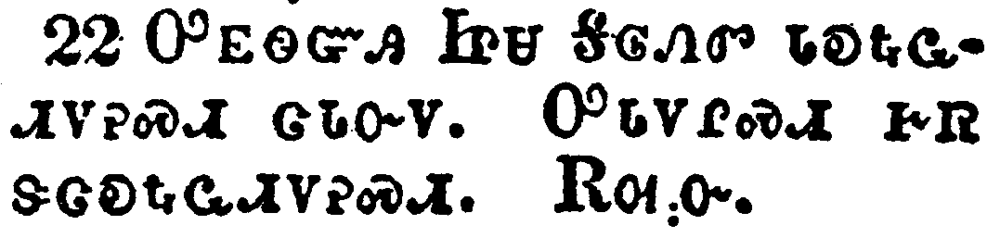</a></td>
</tr>
<tr class="even">
<td>The Lord Jesus Christ be with thy spirit. Grace be with you. Amen.</td>
</tr>
<tr class="odd">
<td>ᎤᎬᏫᏳᎯ ᏥᏌ ᎦᎶᏁᏛ ᏓᎧᎿᎭᏩᏗᏙᎮᏍᏗ ᏩᏓᏅᏙ. ᎤᏓᏙᎵᏍᏗ ᎨᏒ ᏕᏣᎧᎿᎭᏩᏗᏙᎮᏍᏗ. ᎡᎺᏅ.</td>
</tr>
<tr class="even">
<td>U-gv-wi-yu-hi Tsi-sa Ga-lo-ne-dv da-ka-hna-wa-di-do-he-s-di wa-da-nv-do. U-da-do-li-s-di ge-sv de-tsa-ka-hna-wa-di-do-he-s-di. E-me-nv.</td>
</tr>
</tbody>
</table>

