+++
draft=false
date = 2014-12-18T21:11:07Z
title = "Colossians - Chapter 1 - Cherokee New Testament"
weight = 1418955067

[taxonomies]

authors = ["Timothy Legg"]
categories = []
tags = []

[extra]
+++

<table>
<tbody>
<tr class="odd">
<td></td>
</tr>
<tr class="even">
<td>Paul, an apostle of Jesus Christ by the will of God, and Timotheus our brother,</td>
</tr>
<tr class="odd">
<td>ᏉᎳ, ᏥᏌ ᎦᎶᏁᏛ ᎠᎩᏅᏏᏛ ᎾᏍᎩᏯ ᎣᏏᏳ ᎤᏰᎸᏅ ᎤᏁᎳᏅᎯ, ᎠᎴ ᏗᎹᏗ ᎢᎩᏅᏟ,</td>
</tr>
<tr class="even">
<td>Quo-la, Tsi-sa Ga-lo-ne-dv a-gi-nv-si-dv na-s-gi-ya o-si-yu u-ye-lv-nv U-ne-la-nv-hi, a-le Di-ma-di i-gi-nv-tli,</td>
</tr>
</tbody>
</table>

<table>
<tbody>
<tr class="odd">
<td><a href="120102.png">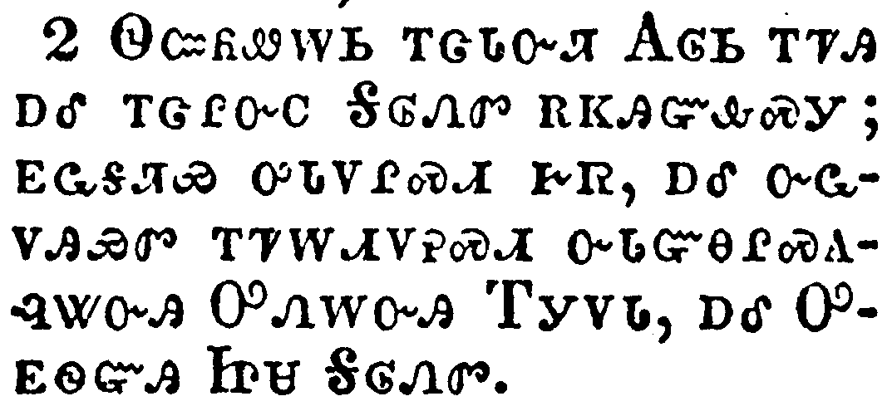</a></td>
</tr>
<tr class="even">
<td>To the saints and faithful brethren in Christ which are at Colosse: Grace be unto you, and peace, from God our Father and the Lord Jesus Christ.</td>
</tr>
<tr class="odd">
<td>ᏫᏨᏲᏪᎳᏏ ᎢᏣᏓᏅᏘ ᎪᎶᏏ ᎢᏤᎯ ᎠᎴ ᎢᏣᎵᏅᏟ ᎦᎶᏁᏛ ᎡᏦᎯᏳᎲᏍᎩ; ᎬᏩᎦᏘᏯ ᎤᏓᏙᎵᏍᏗ ᎨᏒ, ᎠᎴ ᏅᏩᏙᎯᏯᏛ ᎢᏤᎳᏗᏙᎮᏍᏗ ᏅᏓᏳᎾᎵᏍᎪᎸᏔᏅᎯ ᎤᏁᎳᏅᎯ ᎢᎩᏙᏓ, ᎠᎴ ᎤᎬᏫᏳᎯ ᏥᏌ ᎦᎶᏁᏛ.</td>
</tr>
<tr class="even">
<td>Wi-tsv-yo-we-la-si i-tsa-da-nv-ti Go-lo-si i-tse-hi a-le i-tsa-li-nv-tli Ga-lo-ne-dv e-tso-hi-yu-hv-s-gi; gv-wa-ga-ti-ya u-da-do-li-s-di ge-sv, a-le nv-wa-do-hi-ya-dv i-tse-la-di-do-he-s-di nv-da-yu-na-li-s-go-lv-ta-nv-hi U-ne-la-nv-hi I-gi-do-da, a-le U-gv-wi-yu-hi Tsi-sa Ga-lo-ne-dv.</td>
</tr>
</tbody>
</table>

<table>
<tbody>
<tr class="odd">
<td><a href="120103.png">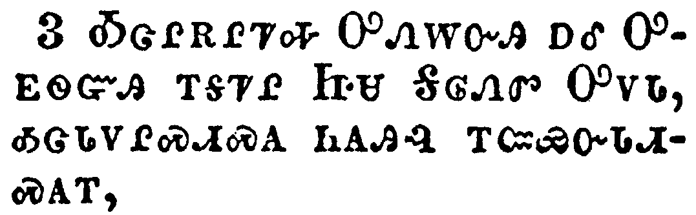</a></td>
</tr>
<tr class="even">
<td>We give thanks to God and the Father of our Lord Jesus Christ, praying always for you,</td>
</tr>
<tr class="odd">
<td>ᎣᏣᎵᎡᎵᏤᎭ ᎤᏁᎳᏅᎯ ᎠᎴ ᎤᎬᏫᏳᎯ ᎢᎦᏤᎵ ᏥᏌ ᎦᎶᏁᏛ ᎤᏙᏓ, ᎣᏣᏓᏙᎵᏍᏗᏍᎪ ᏂᎪᎯᎸ ᎢᏨᏯᏅᏓᏗᏍᎪᎢ,</td>
</tr>
<tr class="even">
<td>O-tsa-li-e-li-tse-ha U-ne-la-nv-hi a-le U-gv-wi-yu-hi i-ga-tse-li Tsi-sa Ga-lo-ne-dv U-do-da, o-tsa-da-do-li-s-di-s-go ni-go-hi-lv i-tsv-ya-nv-da-di-s-go-i,</td>
</tr>
</tbody>
</table>

<table>
<tbody>
<tr class="odd">
<td><a href="120104.png">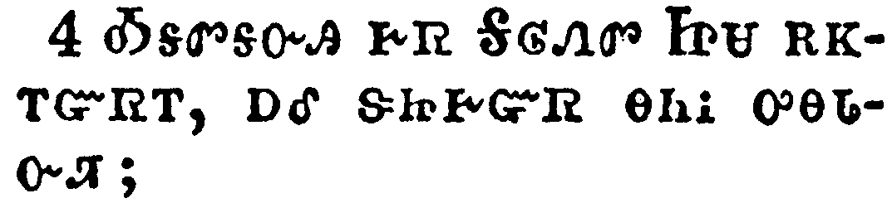</a></td>
</tr>
<tr class="even">
<td>Since we heard of your faith in Christ Jesus, and of the love which ye have to all the saints,</td>
</tr>
<tr class="odd">
<td>ᎣᎦᏛᎦᏅᎯ ᎨᏒ ᎦᎶᏁᏛ ᏥᏌ ᎡᏦᎢᏳᏒᎢ, ᎠᎴ ᏕᏥᎨᏳᏒ ᎾᏂᎥ ᎤᎾᏓᏅᏘ;</td>
</tr>
<tr class="even">
<td>O-ga-dv-ga-nv-hi ge-sv Ga-lo-ne-dv Tsi-sa e-tso-i-yu-sv-i, a-le de-tsi-ge-yu-sv na-ni-v u-na-da-nv-ti;</td>
</tr>
</tbody>
</table>

<table>
<tbody>
<tr class="odd">
<td><a href="120105.png">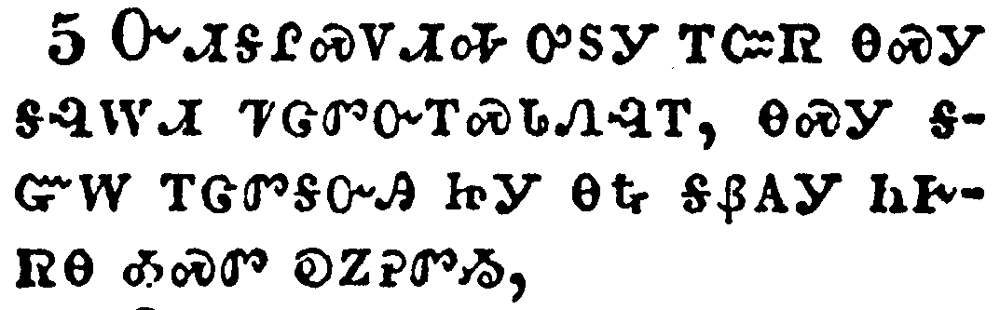</a></td>
</tr>
<tr class="even">
<td>For the hope which is laid up for you in heaven, whereof ye heard before in the word of the truth of the gospel;</td>
</tr>
<tr class="odd">
<td>ᏅᏗᎦᎵᏍᏙᏗᎭ ᎤᏚᎩ ᎢᏨᏒ ᎾᏍᎩ ᎦᎸᎳᏗ ᏤᏣᏛᏅᎢᏍᏓᏁᎸᎢ, ᎾᏍᎩ ᎦᏳᎳ ᎢᏣᏛᎦᏅᎯ ᏥᎩ ᎾᎿᎭᎦᏰᎪᎩ ᏂᎨᏒᎾ ᎣᏍᏛ ᎧᏃᎮᏛᏱ,</td>
</tr>
<tr class="even">
<td>Nv-di-ga-li-s-do-di-ha u-du-gi i-tsv-sv na-s-gi ga-lv-la-di tse-tsa-dv-nv-i-s-da-ne-lv-i, na-s-gi ga-yu-la i-tsa-dv-ga-nv-hi tsi-gi na-hna ga-ye-go-gi ni-ge-sv-na o-s-dv ka-no-he-dv-yi,</td>
</tr>
</tbody>
</table>

<table>
<tbody>
<tr class="odd">
<td><a href="120106.png">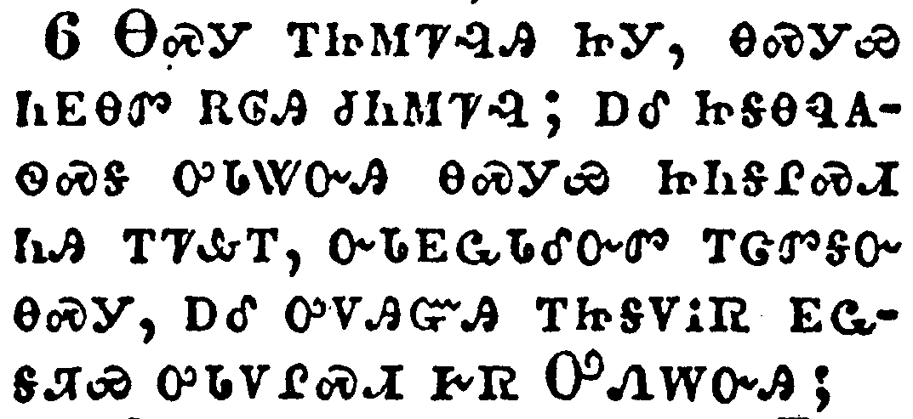</a></td>
</tr>
<tr class="even">
<td>Which is come unto you, as it is in all the world; and bringeth forth fruit, as it doth also in you, since the day ye heard of it, and knew the grace of God in truth:</td>
</tr>
<tr class="odd">
<td>ᎾᏍᎩ ᎢᏥᎷᏤᎸᎯ ᏥᎩ, ᎾᏍᎩᏯ ᏂᎬᎾᏛ ᎡᎶᎯ ᏧᏂᎷᏤᎸ; ᎠᎴ ᏥᎦᎾᏄᎪᏫᏍᎦ ᎤᏓᏔᏅᎯ ᎾᏍᎩᏯ ᏥᏂᎦᎵᏍᏗ ᏂᎯ ᎢᏤᎲᎢ, ᏅᏓᎬᏩᏓᎴᏅᏛ ᎢᏣᏛᎦᏅ ᎾᏍᎩ, ᎠᎴ ᎤᏙᎯᏳᎯ ᎢᏥᎦᏙᎥᏒ ᎬᏩᎦᏘᏯ ᎤᏓᏙᎵᏍᏗ ᎨᏒ ᎤᏁᎳᏅᎯ;</td>
</tr>
<tr class="even">
<td>Na-s-gi i-tsi-lu-tse-lv-hi tsi-gi, na-s-gi-ya ni-gv-na-dv e-lo-hi tsu-ni-lu-tse-lv; a-le tsi-ga-na-nu-go-wi-s-ga u-da-ta-nv-hi na-s-gi-ya tsi-ni-ga-li-s-di ni-hi i-tse-hv-i, nv-da-gv-wa-da-le-nv-dv i-tsa-dv-ga-nv na-s-gi, a-le u-do-hi-yu-hi i-tsi-ga-do-v-sv gv-wa-ga-ti-ya u-da-do-li-s-di ge-sv U-ne-la-nv-hi;</td>
</tr>
</tbody>
</table>

<table>
<tbody>
<tr class="odd">
<td><a href="120107.png">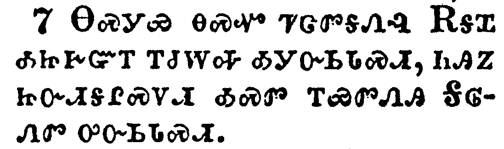</a></td>
</tr>
<tr class="even">
<td>As ye also learned of Epaphras our dear fellowservant, who is for you a faithful minister of Christ;</td>
</tr>
<tr class="odd">
<td>ᎾᏍᎩᏯ ᎾᏍᏉ ᏤᏣᏛᎦᏁᎸ ᎡᎦᏆ ᎣᏥᎨᏳᎢ ᎢᏧᎳᎭ ᎣᎩᏅᏏᏓᏍᏗ, ᏂᎯᏃ ᏥᏅᏗᎦᎵᏍᏙᏗ ᎣᏍᏛ ᎢᏯᏛᏁᎯ ᎦᎶᏁᏛ ᎤᏅᏏᏓᏍᏗ.</td>
</tr>
<tr class="even">
<td>Na-s-gi-ya na-s-quo tse-tsa-dv-ga-ne-lv E-ga-qua o-tsi-ge-yu-i i-tsu-la-ha o-gi-nv-si-da-s-di, ni-hi-no tsi-nv-di-ga-li-s-do-di o-s-dv i-ya-dv-ne-hi Ga-lo-ne-dv u-nv-si-da-s-di.</td>
</tr>
</tbody>
</table>

<table>
<tbody>
<tr class="odd">
<td><a href="120108.png">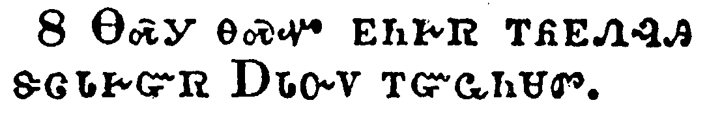</a></td>
</tr>
<tr class="even">
<td>Who also declared unto us your love in the Spirit.</td>
</tr>
<tr class="odd">
<td>ᎾᏍᎩ ᎾᏍᏉ ᎬᏂᎨᏒ ᎢᏲᎲᏁᎸᎯ ᏕᏣᏓᎨᏒ ᎠᏓᏅᏙ ᎢᏳᏩᏂᏌᏛ.</td>
</tr>
<tr class="even">
<td>Na-s-gi na-s-quo gv-ni-ge-sv i-yo-hv-ne-lv-hi de-tsa-da-ge-sv A-da-nv-do i-yu-wa-ni-sa-dv.</td>
</tr>
</tbody>
</table>

<table>
<tbody>
<tr class="odd">
<td><a href="120109.png">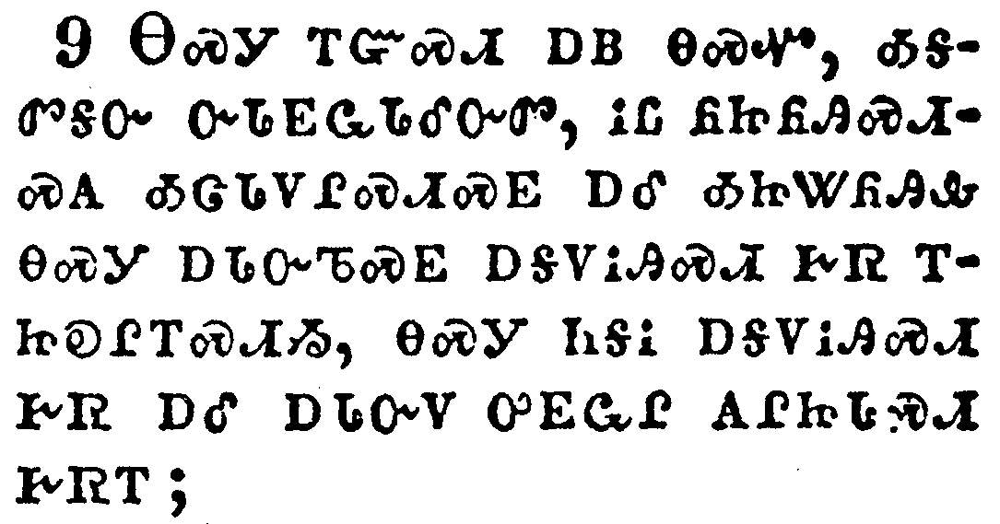</a></td>
</tr>
<tr class="even">
<td>For this cause we also, since the day we heard it, do not cease to pray for you, and to desire that ye might be filled with the knowledge of his will in all wisdom and spiritual understanding;</td>
</tr>
<tr class="odd">
<td>ᎾᏍᎩ ᎢᏳᏍᏗ ᎠᏴ ᎾᏍᏉ, ᎣᎦᏛᎦᏅ ᏅᏓᎬᏩᏓᎴᏅᏛ, ᎥᏝ ᏲᏥᏲᎯᏍᏗᏍᎪ ᎣᏣᏓᏙᎵᏍᏗᏍᎬ ᎠᎴ ᎣᏥᏔᏲᎯᎲ ᎾᏍᎩ ᎠᏓᏅᏖᏍᎬ ᎠᎦᏙᎥᎯᏍᏗ ᎨᏒ ᎢᏥᎧᎵᎢᏍᏗᏱ, ᎾᏍᎩ ᏂᎦᎥ ᎠᎦᏙᎥᎯᏍᏗ ᎨᏒ ᎠᎴ ᎠᏓᏅᏙ ᎤᎬᏩᎵ ᎪᎵᏥᏓᏍᏗ ᎨᏒᎢ;</td>
</tr>
<tr class="even">
<td>Na-s-gi i-yu-s-di a-yv na-s-quo, o-ga-dv-ga-nv nv-da-gv-wa-da-le-nv-dv, v-tla yo-tsi-yo-hi-s-di-s-go o-tsa-da-do-li-s-di-s-gv a-le o-tsi-ta-yo-hi-hv na-s-gi a-da-nv-te-s-gv a-ga-do-v-hi-s-di ge-sv i-tsi-ka-li-i-s-di-yi, na-s-gi ni-ga-v a-ga-do-v-hi-s-di ge-sv a-le a-da-nv-do u-gv-wa-li go-li-tsi-da-s-di ge-sv-i;</td>
</tr>
</tbody>
</table>

<table>
<tbody>
<tr class="odd">
<td><a href="120110.png">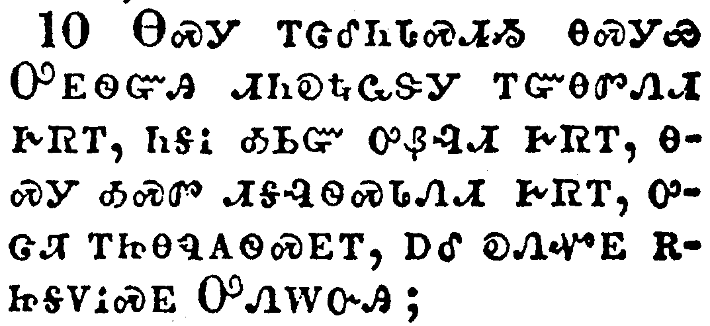</a></td>
</tr>
<tr class="even">
<td>That ye might walk worthy of the Lord unto all pleasing, being fruitful in every good work, and increasing in the knowledge of God;</td>
</tr>
<tr class="odd">
<td>ᎾᏍᎩ ᎢᏣᎴᏂᏓᏍᏗᏱ ᎾᏍᎩᏯ ᎤᎬᏫᏳᎯ ᏗᏂᎧᎿᎭᏩᏕᎩ ᎢᏳᎾᏛᏁᏗ ᎨᏒᎢ, ᏂᎦᎥ ᎣᏏᏳ ᎤᏰᎸᏗ ᎨᏒᎢ, ᎾᏍᎩ ᎣᏍᏛ ᏗᎦᎸᏫᏍᏓᏁᏗ ᎨᏒᎢ, ᎤᏣᏘ ᎢᏥᎾᏄᎪᏫᏍᎬᎢ, ᎠᎴ ᎧᏁᏉᎬ ᎡᏥᎦᏙᎥᏍᎬ ᎤᏁᎳᏅᎯ;</td>
</tr>
<tr class="even">
<td>Na-s-gi i-tsa-le-ni-da-s-di-yi na-s-gi-ya U-gv-wi-yu-hi di-ni-ka-hna-wa-de-gi i-yu-na-dv-ne-di ge-sv-i, ni-ga-v o-si-yu u-ye-lv-di ge-sv-i, na-s-gi o-s-dv di-ga-lv-wi-s-da-ne-di ge-sv-i, u-tsa-ti i-tsi-na-nu-go-wi-s-gv-i, a-le ka-ne-quo-gv e-tsi-ga-do-v-s-gv U-ne-la-nv-hi;</td>
</tr>
</tbody>
</table>

<table>
<tbody>
<tr class="odd">
<td><a href="120111.png">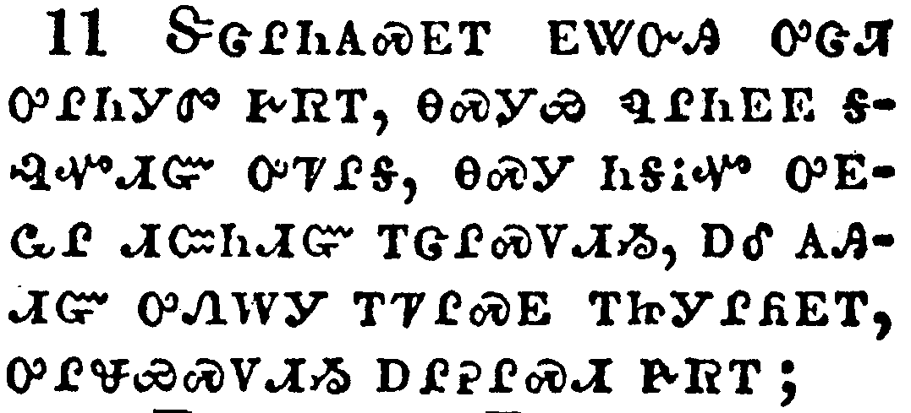</a></td>
</tr>
<tr class="even">
<td>Strengthened with all might, according to his glorious power, unto all patience and longsuffering with joyfulness;</td>
</tr>
<tr class="odd">
<td>ᏕᏣᎵᏂᎪᏍᎬᎢ ᎬᏔᏅᎯ ᎤᏣᏘ ᎤᎵᏂᎩᏛ ᎨᏒᎢ, ᎾᏍᎩᏯ ᏄᎵᏂᎬᎬ ᎦᎸᏉᏗᏳ ᎤᏤᎵᎦ, ᎾᏍᎩ ᏂᎦᎥᏉ ᎤᎬᏩᎵ ᏗᏨᏂᏗᏳ ᎢᏣᎵᏍᏙᏗᏱ, ᎠᎴ ᎪᎯᏗᏳ ᎤᏁᎳᎩ ᎢᏤᎵᏍᎬ ᎢᏥᎩᎵᏲᎬᎢ, ᎤᎵᏠᏯᏍᏙᏗᏱ ᎠᎵᎮᎵᏍᏗ ᎨᏒᎢ;</td>
</tr>
<tr class="even">
<td>De-tsa-li-ni-go-s-gv-i gv-ta-nv-hi u-tsa-ti u-li-ni-gi-dv ge-sv-i, na-s-gi-ya nu-li-ni-gv-gv ga-lv-quo-di-yu u-tse-li-ga, na-s-gi ni-ga-v-quo u-gv-wa-li di-tsv-ni-di-yu i-tsa-li-s-do-di-yi, a-le go-hi-di-yu u-ne-la-gi i-tse-li-s-gv i-tsi-gi-li-yo-gv-i, u-li-tlo-ya-s-do-di-yi a-li-he-li-s-di ge-sv-i;</td>
</tr>
</tbody>
</table>

<table>
<tbody>
<tr class="odd">
<td><a href="120112.png">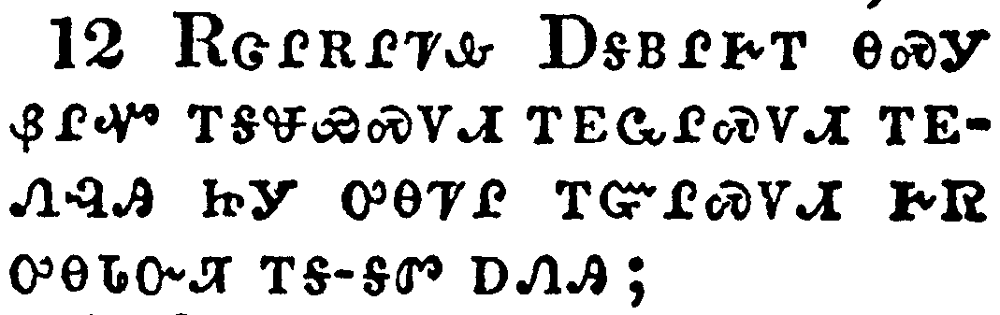</a></td>
</tr>
<tr class="even">
<td>Giving thanks unto the Father, which hath made us meet to be partakers of the inheritance of the saints in light:</td>
</tr>
<tr class="odd">
<td>ᎡᏣᎵᎡᎵᏤᎲ ᎠᎦᏴᎵᎨᎢ ᎾᏍᎩ ᏰᎵᏉ ᎢᎦᏠᏯᏍᏙᏗ ᎢᎬᏩᎵᏍᏙᏗ ᎢᎬᏁᎸᎯ ᏥᎩ ᎤᎾᏤᎵ ᎢᏳᎵᏍᏙᏗ ᎨᏒ ᎤᎾᏓᏅᏘ ᎢᎦ-ᎦᏛ ᎠᏁᎯ;</td>
</tr>
<tr class="even">
<td>E-tsa-li-e-li-tse-hv A-ga-yv-li-ge-i na-s-gi ye-li-quo i-ga-tlo-ya-s-do-di i-gv-wa-li-s-do-di i-gv-ne-lv-hi tsi-gi u-na-tse-li i-yu-li-s-do-di ge-sv u-na-da-nv-ti i-ga--ga-dv a-ne-hi;</td>
</tr>
</tbody>
</table>

<table>
<tbody>
<tr class="odd">
<td><a href="120113.png">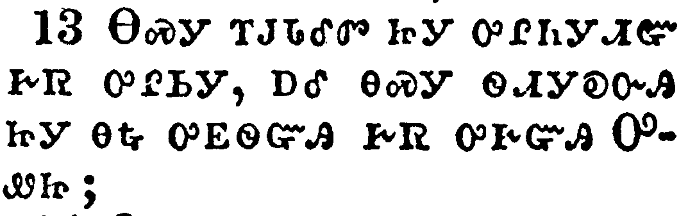</a></td>
</tr>
<tr class="even">
<td>Who hath delivered us from the power of darkness, and hath translated us into the kingdom of his dear Son:</td>
</tr>
<tr class="odd">
<td>ᎾᏍᎩ ᎢᎫᏓᎴᏛ ᏥᎩ ᎤᎵᏂᎩᏗᏳ ᎨᏒ ᎤᎵᏏᎩ, ᎠᎴ ᎾᏍᎩ ᏫᏗᎩᎧᏅᎯ ᏥᎩ ᎾᎿᎭᎤᎬᏫᏳᎯ ᎨᏒ ᎤᎨᏳᎯ ᎤᏪᏥ;</td>
</tr>
<tr class="even">
<td>Na-s-gi i-gu-da-le-dv tsi-gi u-li-ni-gi-di-yu ge-sv u-li-si-gi, a-le na-s-gi wi-di-gi-ka-nv-hi tsi-gi na-hna u-gv-wi-yu-hi ge-sv u-ge-yu-hi U-we-tsi;</td>
</tr>
</tbody>
</table>

<table>
<tbody>
<tr class="odd">
<td><a href="120114.png">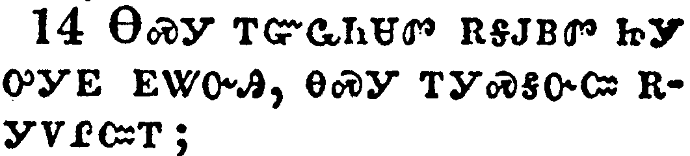</a></td>
</tr>
<tr class="even">
<td>In whom we have redemption through his blood, even the forgiveness of sins:</td>
</tr>
<tr class="odd">
<td>ᎾᏍᎩ ᎢᏳᏩᏂᏌᏛ ᎡᎦᎫᏴᏛ ᏥᎩ ᎤᎩᎬ ᎬᏔᏅᎯ, ᎾᏍᎩ ᎢᎩᏍᎦᏅᏨ ᎡᎩᏙᎵᏨᎢ;</td>
</tr>
<tr class="even">
<td>Na-s-gi i-yu-wa-ni-sa-dv e-ga-gu-yv-dv tsi-gi u-gi-gv gv-ta-nv-hi, na-s-gi i-gi-s-ga-nv-tsv e-gi-do-li-tsv-i;</td>
</tr>
</tbody>
</table>

<table>
<tbody>
<tr class="odd">
<td><a href="120115.png">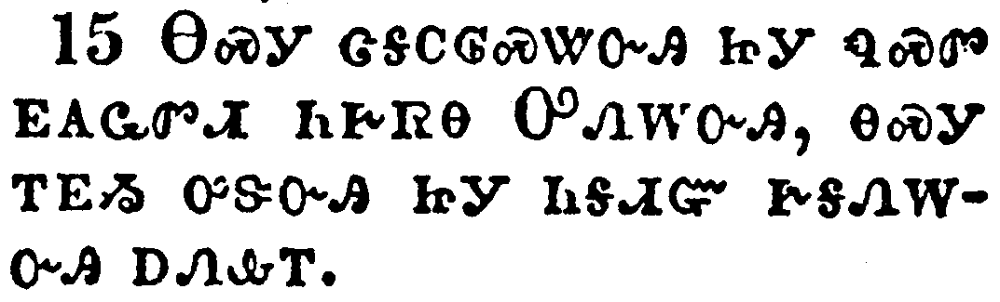</a></td>
</tr>
<tr class="even">
<td>Who is the image of the invisible God, the firstborn of every creature:</td>
</tr>
<tr class="odd">
<td>ᎾᏍᎩ ᏣᎦᏟᎶᏍᏔᏅᎯ ᏥᎩ ᏄᏍᏛ ᎬᎪᏩᏛᏗ ᏂᎨᏒᎾ ᎤᏁᎳᏅᎯ, ᎾᏍᎩ ᎢᎬᏱ ᎤᏕᏅᎯ ᏥᎩ ᏂᎦᏗᏳ ᎨᎦᏁᎳᏅᎯ ᎠᏁᎲᎢ.</td>
</tr>
<tr class="even">
<td>Na-s-gi tsa-ga-tli-lo-s-ta-nv-hi tsi-gi nu-s-dv gv-go-wa-dv-di ni-ge-sv-na U-ne-la-nv-hi, na-s-gi i-gv-yi u-de-nv-hi tsi-gi ni-ga-di-yu ge-ga-ne-la-nv-hi a-ne-hv-i.</td>
</tr>
</tbody>
</table>

<table>
<tbody>
<tr class="odd">
<td><a href="120116.png">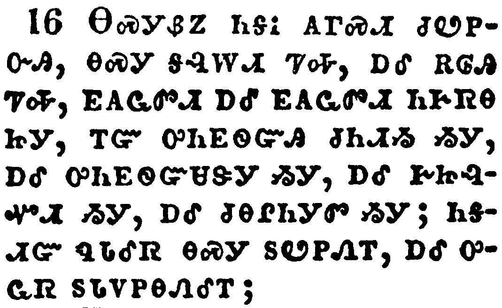</a></td>
</tr>
<tr class="even">
<td>For by him were all things created, that are in heaven, and that are in earth, visible and invisible, whether they be thrones, or dominions, or principalities, or powers: all things were created by him, and for him:</td>
</tr>
<tr class="odd">
<td>ᎾᏍᎩᏰᏃ ᏂᎦᎥ ᎪᎱᏍᏗ ᏧᏬᏢᏅᎯ, ᎾᏍᎩ ᎦᎸᎳᏗ ᏤᎭ, ᎠᎴ ᎡᎶᎯ ᏤᎭ, ᎬᎪᏩᏛᏗ ᎠᎴ ᎬᎪᏩᏛᏗ ᏂᎨᏒᎾ ᏥᎩ, ᎢᏳ ᎤᏂᎬᏫᏳᎯ ᏧᏂᏗᏱ ᏱᎩ, ᎠᎴ ᎤᏂᎬᏫᏳᏌᏕᎩ ᏱᎩ, ᎠᎴ ᎨᏥᎸᏉᏗ ᏱᎩ, ᎠᎴ ᏧᎾᎵᏂᎩᏛ ᏱᎩ; ᏂᎦᏗᏳ ᏄᏓᎴᏒ ᎾᏍᎩ ᏚᏬᏢᏁᎢ, ᎠᎴ ᎤᏩᏒ ᏚᏓᏙᏢᎾᏁᎴᎢ;</td>
</tr>
<tr class="even">
<td>Na-s-gi-ye-no ni-ga-v go-hu-s-di tsu-wo-tlv-nv-hi, na-s-gi ga-lv-la-di tse-ha, a-le e-lo-hi tse-ha, gv-go-wa-dv-di a-le gv-go-wa-dv-di ni-ge-sv-na tsi-gi, i-yu u-ni-gv-wi-yu-hi tsu-ni-di-yi yi-gi, a-le u-ni-gv-wi-yu-sa-de-gi yi-gi, a-le ge-tsi-lv-quo-di yi-gi, a-le tsu-na-li-ni-gi-dv yi-gi; ni-ga-di-yu nu-da-le-sv na-s-gi du-wo-tlv-ne-i, a-le u-wa-sv du-da-do-tlv-na-ne-le-i;</td>
</tr>
</tbody>
</table>

<table>
<tbody>
<tr class="odd">
<td><a href="120117.png">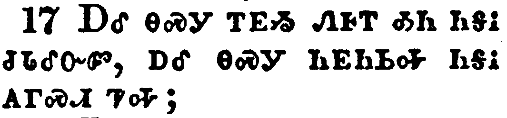</a></td>
</tr>
<tr class="even">
<td>And he is before all things, and by him all things consist.</td>
</tr>
<tr class="odd">
<td>ᎠᎴ ᎾᏍᎩ ᎢᎬᏱ ᏁᎰᎢ ᎣᏂ ᏂᎦᎥ ᏧᏓᎴᏅᏛ, ᎠᎴ ᎾᏍᎩ ᏂᎬᏂᏏᎭ ᏂᎦᎥ ᎪᎱᏍᏗ ᏤᎭ;</td>
</tr>
<tr class="even">
<td>A-le na-s-gi i-gv-yi ne-ho-i o-ni ni-ga-v tsu-da-le-nv-dv, a-le na-s-gi ni-gv-ni-si-ha ni-ga-v go-hu-s-di tse-ha;</td>
</tr>
</tbody>
</table>

<table>
<tbody>
<tr class="odd">
<td><a href="120118.png">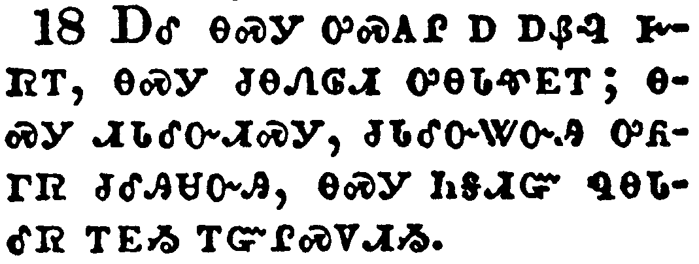</a></td>
</tr>
<tr class="even">
<td>And he is the head of the body, the church: who is the beginning, the firstborn from the dead; that in all things he might have the preeminence.</td>
</tr>
<tr class="odd">
<td>ᎠᎴ ᎾᏍᎩ ᎤᏍᎪᎵ Ꭰ ᎠᏰᎸ ᎨᏒᎢ, ᎾᏍᎩ ᏧᎾᏁᎶᏗ ᎤᎾᏓᏡᎬᎢ; ᎾᏍᎩ ᏗᏓᎴᏅᏗᏍᎩ, ᏧᏓᎴᏅᏔᏅᎯ ᎤᏲᎱᏒ ᏧᎴᎯᏌᏅᎯ, ᎾᏍᎩ ᏂᎦᏗᏳ ᏄᎾᏓᎴᏒ ᎢᎬᏱ ᎢᏳᎵᏍᏙᏗᏱ.</td>
</tr>
<tr class="even">
<td>A-le na-s-gi u-s-go-li a a-ye-lv ge-sv-i, na-s-gi tsu-na-ne-lo-di u-na-da-tlu-gv-i; na-s-gi di-da-le-nv-di-s-gi, tsu-da-le-nv-ta-nv-hi u-yo-hu-sv tsu-le-hi-sa-nv-hi, na-s-gi ni-ga-di-yu nu-na-da-le-sv i-gv-yi i-yu-li-s-do-di-yi.</td>
</tr>
</tbody>
</table>

<table>
<tbody>
<tr class="odd">
<td><a href="120119.png">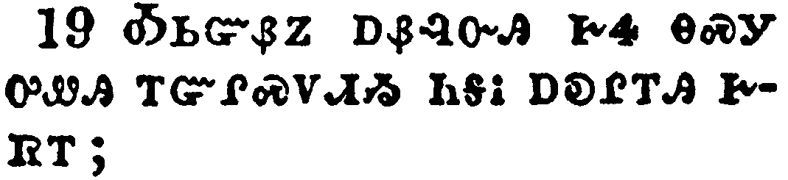</a></td>
</tr>
<tr class="even">
<td>For it pleased the Father that in him should all fullness dwell;</td>
</tr>
<tr class="odd">
<td>ᎣᏏᏳᏰᏃ ᎠᏰᎸᏅᎯ ᎨᏎ ᎾᏍᎩ ᎤᏪᎯ ᎢᏳᎵᏍᏙᏗᏱ ᏂᎦᎥ ᎠᎧᎵᎢᎯ ᎨᏒᎢ;</td>
</tr>
<tr class="even">
<td>O-si-yu-ye-no a-ye-lv-nv-hi ge-se na-s-gi u-we-hi i-yu-li-s-do-di-yi ni-ga-v a-ka-li-i-hi ge-sv-i;</td>
</tr>
</tbody>
</table>

<table>
<tbody>
<tr class="odd">
<td><a href="120120.png">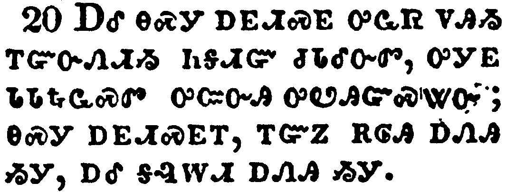</a></td>
</tr>
<tr class="even">
<td>And, having made peace through the blood of his cross, by him to reconcile all things unto himself; by him, I say, whether they be things in earth, or things in heaven.</td>
</tr>
<tr class="odd">
<td>ᎠᎴ ᎾᏍᎩ ᎠᎬᏗᏍᎬ ᎤᏩᏒ ᏙᎯᏱ ᎢᏳᏅᏁᏗᏱ ᏂᎦᏗᏳ ᏧᏓᎴᏅᏛ, ᎤᎩᎬ ᏓᏓᎿᎭᏩᏍᏛ ᎤᏨᏅᎯ ᎤᏬᎯᏳᏍᏔᏅ; ᎾᏍᎩ ᎠᎬᏗᏍᎬᎢ, ᎢᏳᏃ ᎡᎶᎯ ᎠᏁᎯ ᏱᎩ, ᎠᎴ ᎦᎸᎳᏗ ᎠᏁᎯ ᏱᎩ.</td>
</tr>
<tr class="even">
<td>A-le na-s-gi a-gv-di-s-gv u-wa-sv do-hi-yi i-yu-nv-ne-di-yi ni-ga-di-yu tsu-da-le-nv-dv, u-gi-gv da-da-hna-wa-s-dv u-tsv-nv-hi u-wo-hi-yu-s-ta-nv; na-s-gi a-gv-di-s-gv-i, i-yu-no e-lo-hi a-ne-hi yi-gi, a-le ga-lv-la-di a-ne-hi yi-gi.</td>
</tr>
</tbody>
</table>

<table>
<tbody>
<tr class="odd">
<td><a href="120121.png">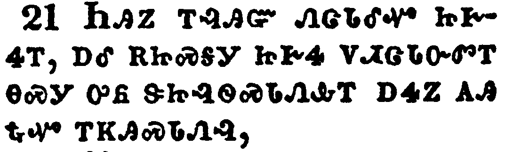</a></td>
</tr>
<tr class="even">
<td>And you, that were sometime alienated and enemies in your mind by wicked works, yet now hath he reconciled</td>
</tr>
<tr class="odd">
<td>ᏂᎯᏃ ᎢᎸᎯᏳ ᏁᏣᏓᎴᏉ ᏥᎨᏎᎢ, ᎠᎴ ᎡᏥᏍᎦᎩ ᏥᎨᏎ ᏙᏗᏣᏓᏅᏛᎢ ᎾᏍᎩ ᎤᏲ ᏕᏥᎸᏫᏍᏓᏁᎲᎢ ᎠᏎᏃ ᎪᎯ ᎿᎭᏉ ᎢᏦᎯᏍᏓᏁᎸ,</td>
</tr>
<tr class="even">
<td>Ni-hi-no i-lv-hi-yu ne-tsa-da-le-quo tsi-ge-se-i, a-le e-tsi-s-ga-gi tsi-ge-se do-di-tsa-da-nv-dv-i na-s-gi u-yo de-tsi-lv-wi-s-da-ne-hv-i a-se-no go-hi hna-quo i-tso-hi-s-da-ne-lv,</td>
</tr>
</tbody>
</table>

<table>
<tbody>
<tr class="odd">
<td><a href="120122.png">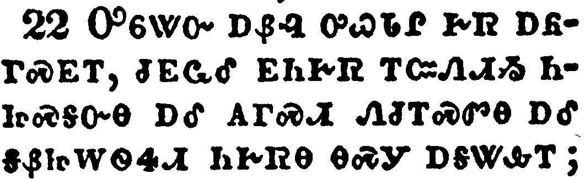</a></td>
</tr>
<tr class="even">
<td>In the body of his flesh through death, to present you holy and unblameable and unreproveable in his sight:</td>
</tr>
<tr class="odd">
<td>ᎤᏮᏔᏅ ᎠᏰᎸ ᎤᏇᏓᎵ ᎨᏒ ᎠᏲᎱᏍᎬᎢ, ᏧᎬᏩᎴ ᎬᏂᎨᏒ ᎢᏨᏁᏗᏱ ᏂᏥᏍᎦᏅᎾ ᎠᎴ ᎪᎱᏍᏗ ᏁᏧᎢᏍᏛᎾ ᎠᎴ ᎦᏰᏥᎳᏫᏎᏗ ᏂᎨᏒᎾ ᎾᏍᎩ ᎠᎦᏔᎲᎢ;</td>
</tr>
<tr class="even">
<td>U-wv-ta-nv a-ye-lv u-que-da-li ge-sv a-yo-hu-s-gv-i, tsu-gv-wa-le gv-ni-ge-sv i-tsv-ne-di-yi ni-tsi-s-ga-nv-na a-le go-hu-s-di ne-tsu-i-s-dv-na a-le ga-ye-tsi-la-wi-se-di ni-ge-sv-na na-s-gi a-ga-ta-hv-i;</td>
</tr>
</tbody>
</table>

<table>
<tbody>
<tr class="odd">
<td><a href="120123.png">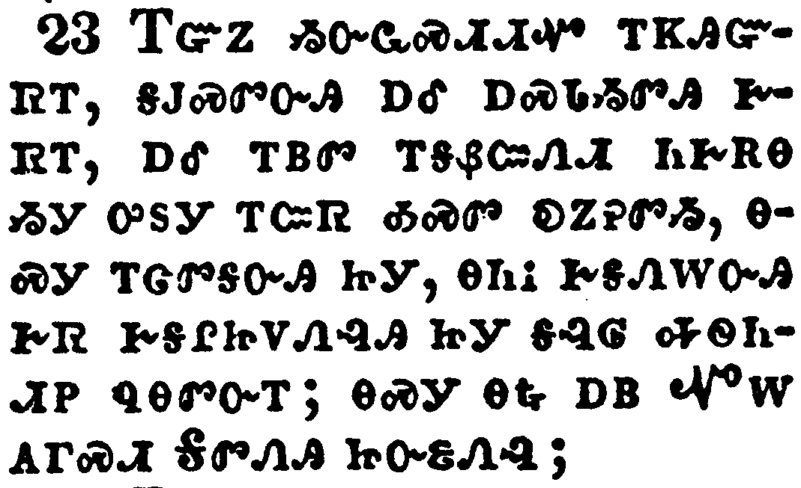</a></td>
</tr>
<tr class="even">
<td>If ye continue in the faith grounded and settled, and be not moved away from the hope of the gospel, which ye have heard, and which was preached to every creature which is under heaven; whereof I Paul am made a minister;</td>
</tr>
<tr class="odd">
<td>ᎢᏳᏃ ᏱᏅᏩᏍᏗᏗᏉ ᎢᏦᎯᏳᏒᎢ, ᎦᎫᏍᏛᏅᎯ ᎠᎴ ᎠᏍᏓᏱᏛᎯ ᎨᏒᎢ, ᎠᎴ ᎢᏴᏛ ᎢᎦᏰᏨᏁᏗ ᏂᎨᏒᎾ ᏱᎩ ᎤᏚᎩ ᎢᏨᏒ ᎣᏍᏛ ᎧᏃᎮᏛᏱ, ᎾᏍᎩ ᎢᏣᏛᎦᏅᎯ ᏥᎩ, ᎾᏂᎥ ᎨᎦᏁᎳᏅᎯ ᎨᏒ ᎨᎦᎵᏥᏙᏁᎸᎯ ᏥᎩ ᎦᎸᎶ ᎭᏫᏂᏗᏢ ᏄᎾᏛᏅᎢ; ᎾᏍᎩ ᎾᎿᎭᎠᏴ ᏉᎳ ᎪᎱᏍᏗ ᎦᏛᏁᎯ ᏥᏅᏋᏁᎸ;</td>
</tr>
<tr class="even">
<td>I-yu-no yi-nv-wa-s-di-di-quo i-tso-hi-yu-sv-i, ga-gu-s-dv-nv-hi a-le a-s-da-yi-dv-hi ge-sv-i, a-le i-yv-dv i-ga-ye-tsv-ne-di ni-ge-sv-na yi-gi u-du-gi i-tsv-sv o-s-dv ka-no-he-dv-yi, na-s-gi i-tsa-dv-ga-nv-hi tsi-gi, na-ni-v ge-ga-ne-la-nv-hi ge-sv ge-ga-li-tsi-do-ne-lv-hi tsi-gi ga-lv-lo ha-wi-ni-di-tlv nu-na-dv-nv-i; na-s-gi na-hna a-yv Quo-la go-hu-s-di Ga-dv-ne-hi tsi-nv-quv-ne-lv;</td>
</tr>
</tbody>
</table>

<table>
<tbody>
<tr class="odd">
<td><a href="120124.png">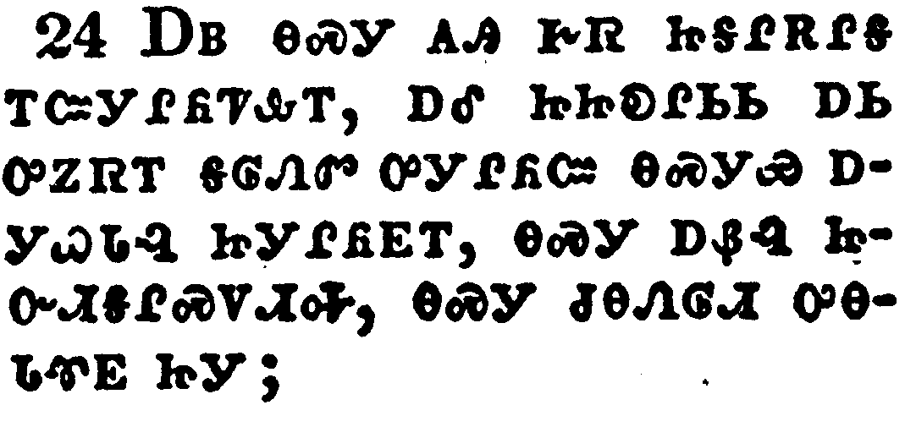</a></td>
</tr>
<tr class="even">
<td>Who now rejoice in my sufferings for you, and fill up that which is behind of the afflictions of Christ in my flesh for his body's sake, which is the church:</td>
</tr>
<tr class="odd">
<td>ᎠᏴ ᎾᏍᎩ ᎪᎯ ᎨᏒ ᏥᎦᎵᎡᎵᎦ ᎢᏨᎩᎵᏲᏤᎲᎢ, ᎠᎴ ᏥᏥᎧᎵᏏᏏ ᎠᏏ ᎤᏃᏒᎢ ᎦᎶᏁᏛ ᎤᎩᎵᏲᏨ ᎾᏍᎩᏯ ᎠᎩᏇᏓᎸ ᏥᎩᎵᏲᎬᎢ, ᎾᏍᎩ ᎠᏰᎸ ᏥᏅᏗᎦᎵᏍᏙᏗᎭ, ᎾᏍᎩ ᏧᎾᏁᎶᏗ ᎤᎾᏓᏡᎬ ᏥᎩ;</td>
</tr>
<tr class="even">
<td>A-yv na-s-gi go-hi ge-sv tsi-ga-li-e-li-ga i-tsv-gi-li-yo-tse-hv-i, a-le tsi-tsi-ka-li-si-si a-si u-no-sv-i ga-lo-ne-dv u-gi-li-yo-tsv na-s-gi-ya a-gi-que-da-lv tsi-gi-li-yo-gv-i, na-s-gi a-ye-lv tsi-nv-di-ga-li-s-do-di-ha, na-s-gi tsu-na-ne-lo-di u-na-da-tlu-gv tsi-gi;</td>
</tr>
</tbody>
</table>

<table>
<tbody>
<tr class="odd">
<td><a href="120125.png">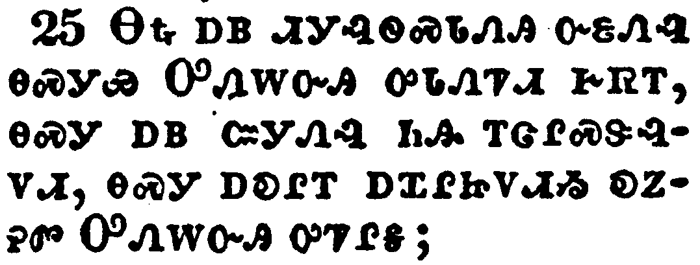</a></td>
</tr>
<tr class="even">
<td>Whereof I am made a minister, according to the dispensation of God which is given to me for you, to fulfill the word of God;</td>
</tr>
<tr class="odd">
<td>ᎾᎿᎭᎠᏴ ᏗᎩᎸᏫᏍᏓᏁᎯ ᏅᏋᏁᎸ ᎾᏍᎩᏯ ᎤᏁᎳᏅᎯ ᎤᏓᏁᏤᏗ ᎨᏒᎢ, ᎾᏍᎩ ᎠᏴ ᏨᎩᏁᎸ ᏂᎯ ᎢᏣᎵᏍᏕᎸᏙᏗ, ᎾᏍᎩ ᎠᎧᎵᎢ ᎠᏆᎵᏥᏙᏗᏱ ᎧᏃᎮᏛ ᎤᏁᎳᏅᎯ ᎤᏤᎵᎦ;</td>
</tr>
<tr class="even">
<td>Na-hna a-yv di-gi-lv-wi-s-da-ne-hi nv-quv-ne-lv na-s-gi-ya U-ne-la-nv-hi u-da-ne-tse-di ge-sv-i, na-s-gi a-yv tsv-gi-ne-lv ni-hi i-tsa-li-s-de-lv-do-di, na-s-gi a-ka-li-i a-qua-li-tsi-do-di-yi ka-no-he-dv U-ne-la-nv-hi u-tse-li-ga;</td>
</tr>
</tbody>
</table>

<table>
<tbody>
<tr class="odd">
<td><a href="120126.png">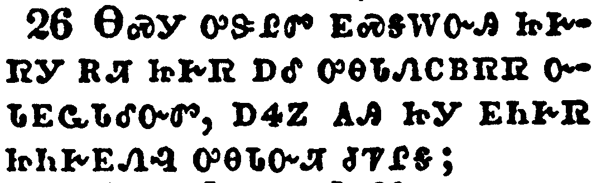</a></td>
</tr>
<tr class="even">
<td>Even the mystery which hath been hid from ages and from generations, but now is made manifest to his saints:</td>
</tr>
<tr class="odd">
<td>ᎾᏍᎩ ᎤᏕᎵᏛ ᎬᏍᎦᎳᏅᎯ ᏥᎨᏒᎩ ᎡᏘ ᏥᎨᏒ ᎠᎴ ᎤᎾᏓᏁᏟᏴᏒᏒ ᏅᏓᎬᏩᏓᎴᏅᏛ, ᎠᏎᏃ ᎪᎯ ᏥᎩ ᎬᏂᎨᏒ ᏥᏂᎨᎬᏁᎸ ᎤᎾᏓᏅᏘ ᏧᏤᎵᎦ;</td>
</tr>
<tr class="even">
<td>Na-s-gi u-de-li-dv gv-s-ga-la-nv-hi tsi-ge-sv-gi e-ti tsi-ge-sv a-le u-na-da-ne-tli-yv-sv-sv nv-da-gv-wa-da-le-nv-dv, a-se-no go-hi tsi-gi gv-ni-ge-sv tsi-ni-ge-gv-ne-lv u-na-da-nv-ti tsu-tse-li-ga;</td>
</tr>
</tbody>
</table>

<table>
<tbody>
<tr class="odd">
<td><a href="120127.png">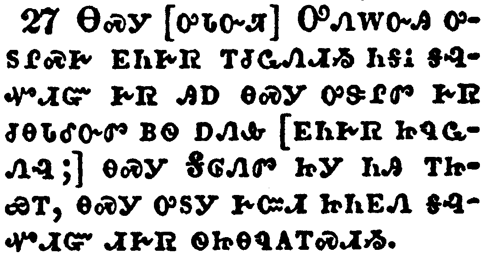</a></td>
</tr>
<tr class="even">
<td>To whom God would make known what is the riches of the glory of this mystery among the Gentiles; which is Christ in you, the hope of glory:</td>
</tr>
<tr class="odd">
<td>ᎾᏍᎩ [ᎤᏓᏅᏘ] ᎤᏁᎳᏅᎯ ᎤᏚᎵᏍᎨ ᎬᏂᎨᏒ ᎢᏧᏩᏁᏗᏱ ᏂᎦᎥ ᎦᎸᏉᏗᏳ ᎨᏒ ᎯᎠ ᎾᏍᎩ ᎤᏕᎵᏛ ᎨᏒ ᏧᎾᏓᎴᏅᏛ ᏴᏫ ᎠᏁᎲ [ᎬᏂᎨᏒ ᏥᏄᏩᏁᎸ;] ᎾᏍᎩ ᎦᎶᏁᏛ ᏥᎩ ᏂᎯ ᎢᏥᏯᎢ, ᎾᏍᎩ ᎤᏚᎩ ᎨᏨᏗ ᏥᏂᎬᏁ ᎦᎸᏉᏗᏳ ᏗᎨᏒ ᏫᏥᎾᏄᎪᎢᏍᏗᏱ.</td>
</tr>
<tr class="even">
<td>Na-s-gi [u-da-nv-ti] U-ne-la-nv-hi u-du-li-s-ge gv-ni-ge-sv i-tsu-wa-ne-di-yi ni-ga-v ga-lv-quo-di-yu ge-sv hi-a na-s-gi u-de-li-dv ge-sv tsu-na-da-le-nv-dv yv-wi a-ne-hv [gv-ni-ge-sv tsi-nu-wa-ne-lv;] na-s-gi Ga-lo-ne-dv tsi-gi ni-hi i-tsi-ya-i, na-s-gi u-du-gi ge-tsv-di tsi-ni-gv-ne ga-lv-quo-di-yu di-ge-sv wi-tsi-na-nu-go-i-s-di-yi.</td>
</tr>
</tbody>
</table>

<table>
<tbody>
<tr class="odd">
<td><a href="120128.png">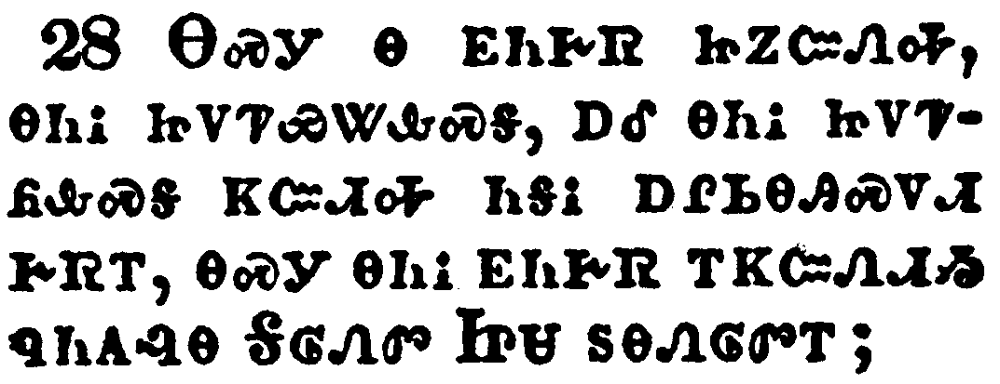</a></td>
</tr>
<tr class="even">
<td>Whom we preach, warning every man, and teaching every man in all wisdom; that we may present every man perfect in Christ Jesus:</td>
</tr>
<tr class="odd">
<td>ᎾᏍᎩ Ꮎ ᎬᏂᎨᏒ ᏥᏃᏨᏁᎭ, ᎾᏂᎥ ᏥᏙᏤᏯᏔᎲᏍᎦ, ᎠᎴ ᎾᏂᎥ ᏥᏙᏤᏲᎲᏍᎦ ᏦᏨᏗᎭ ᏂᎦᎥ ᎠᎵᏏᎾᎯᏍᏙᏗ ᎨᏒᎢ, ᎾᏍᎩ ᎾᏂᎥ ᎬᏂᎨᏒ ᎢᏦᏨᏁᏗᏱ ᏄᏂᎪᎸᎾ ᎦᎶᏁᏛ ᏥᏌ ᏚᎾᏁᎶᏛᎢ;</td>
</tr>
<tr class="even">
<td>Na-s-gi na gv-ni-ge-sv tsi-no-tsv-ne-ha, na-ni-v tsi-do-tse-ya-ta-hv-s-ga, a-le na-ni-v tsi-do-tse-yo-hv-s-ga tso-tsv-di-ha ni-ga-v a-li-si-na-hi-s-do-di ge-sv-i, na-s-gi na-ni-v gv-ni-ge-sv i-tso-tsv-ne-di-yi nu-ni-go-lv-na Ga-lo-ne-dv Tsi-sa du-na-ne-lo-dv-i;</td>
</tr>
</tbody>
</table>

<table>
<tbody>
<tr class="odd">
<td><a href="120129.png">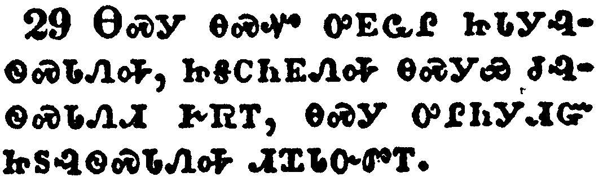</a></td>
</tr>
<tr class="even">
<td>Whereunto I also labour, striving according to his working, which worketh in me mightily.</td>
</tr>
<tr class="odd">
<td>ᎾᏍᎩ ᎾᏍᏉ ᎤᎬᏩᎵ ᏥᏓᎩᎸᏫᏍᏓᏁᎭ, ᏥᎦᏟᏂᎬᏁᎭ ᎾᏍᎩᏯ ᏧᎸᏫᏍᏓᏁᏗ ᎨᏒᎢ, ᎾᏍᎩ ᎤᎵᏂᎩᏗᏳ ᏥᏚᎸᏫᏍᏓᏁᎭ ᏗᏆᏓᏅᏛᎢ.</td>
</tr>
<tr class="even">
<td>Na-s-gi na-s-quo u-gv-wa-li tsi-da-gi-lv-wi-s-da-ne-ha, tsi-ga-tli-ni-gv-ne-ha na-s-gi-ya tsu-lv-wi-s-da-ne-di ge-sv-i, na-s-gi u-li-ni-gi-di-yu tsi-du-lv-wi-s-da-ne-ha di-qua-da-nv-dv-i.</td>
</tr>
</tbody>
</table>

