+++
draft=false
date = 2014-12-18T21:11:07Z
title = "Colossians - Chapter 2 - Cherokee New Testament"
weight = 1418955067

[taxonomies]

authors = ["Timothy Legg"]
categories = []
tags = []

[extra]
+++

<table>
<tbody>
<tr class="odd">
<td><a href="120201.png">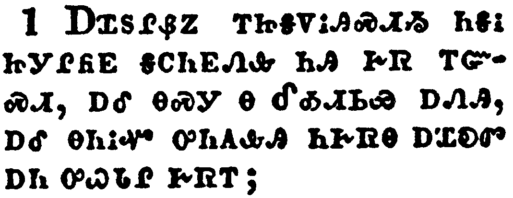</a></td>
</tr>
<tr class="even">
<td>For I would that ye knew what great conflict I have for you, and for them at Laodicea, and for as many as have not seen my face in the flesh;</td>
</tr>
<tr class="odd">
<td>ᎠᏆᏚᎵᏰᏃ ᎢᏥᎦᏙᎥᎯᏍᏗᏱ ᏂᎦᎥ ᏥᎩᎵᏲᎬ ᎦᏟᏂᎬᏁᎲ ᏂᎯ ᎨᏒ ᎢᏳᏍᏗ, ᎠᎴ ᎾᏍᎩ Ꮎ ᎴᎣᏗᏏᏯ ᎠᏁᎯ, ᎠᎴ ᎾᏂᎥᏉ ᎤᏂᎪᎲᎯ ᏂᎨᏒᎾ ᎠᏆᎧᏛ ᎠᏂ ᎤᏇᏓᎵ ᎨᏒᎢ;</td>
</tr>
<tr class="even">
<td>A-qua-du-li-ye-no i-tsi-ga-do-v-hi-s-di-yi ni-ga-v tsi-gi-li-yo-gv ga-tli-ni-gv-ne-hv ni-hi ge-sv i-yu-s-di, a-le na-s-gi na Le-o-di-si-ya a-ne-hi, a-le na-ni-v-quo u-ni-go-hv-hi ni-ge-sv-na a-qua-ka-dv a-ni u-que-da-li ge-sv-i;</td>
</tr>
</tbody>
</table>

<table>
<tbody>
<tr class="odd">
<td><a href="120202.png">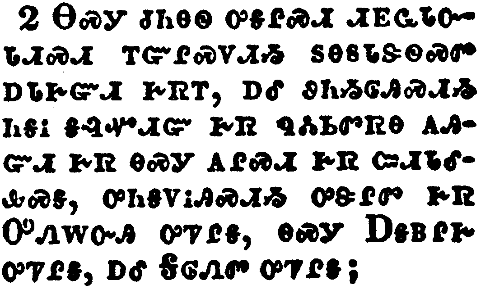</a></td>
</tr>
<tr class="even">
<td>That their hearts might be comforted, being knit together in love, and unto all riches of the full assurance of understanding, to the acknowledgement of the mystery of God, and of the Father, and of Christ;</td>
</tr>
<tr class="odd">
<td>ᎾᏍᎩ ᏧᏂᎾᏫ ᎤᎦᎵᏍᏗ ᏗᎬᏩᏓᏅᏓᏗᏍᏗ ᎢᏳᎵᏍᏙᏗᏱ ᏚᎾᏚᏓᏕᏫᏍᏛ ᎠᏓᎨᏳᏗ ᎨᏒᎢ, ᎠᎴ ᏭᏂᏱᎶᎯᏍᏗᏱ ᏂᎦᎥ ᎦᎸᏉᏗᏳ ᎨᏒ ᏄᏜᏓᏏᏛᏒᎾ ᎪᎯᏳᏗ ᎨᏒ ᎾᏍᎩ ᎪᎵᏍᏗ ᎨᏒ ᏨᏗᏓᎴᎲᏍᎦ, ᎤᏂᎦᏙᎥᎯᏍᏗᏱ ᎤᏕᎵᏛ ᎨᏒ ᎤᏁᎳᏅᎯ ᎤᏤᎵᎦ, ᎾᏍᎩ ᎠᎦᏴᎵᎨ ᎤᏤᎵᎦ, ᎠᎴ ᎦᎶᏁᏛ ᎤᏤᎵᎦ;</td>
</tr>
<tr class="even">
<td>Na-s-gi tsu-ni-na-wi u-ga-li-s-di di-gv-wa-da-nv-da-di-s-di i-yu-li-s-do-di-yi du-na-du-da-de-wi-s-dv a-da-ge-yu-di ge-sv-i, a-le wu-ni-yi-lo-hi-s-di-yi ni-ga-v ga-lv-quo-di-yu ge-sv nu-dla-si-dv-sv-na go-hi-yu-di ge-sv na-s-gi go-li-s-di ge-sv tsv-di-da-le-hv-s-ga, u-ni-ga-do-v-hi-s-di-yi u-de-li-dv ge-sv U-ne-la-nv-hi u-tse-li-ga, na-s-gi A-ga-yv-li-ge u-tse-li-ga, a-le Ga-lo-ne-dv u-tse-li-ga;</td>
</tr>
</tbody>
</table>

<table>
<tbody>
<tr class="odd">
<td><a href="120203.png">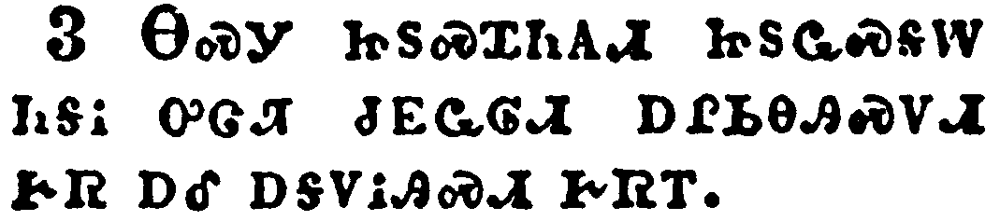</a></td>
</tr>
<tr class="even">
<td>In whom are hid all the treasures of wisdom and knowledge.</td>
</tr>
<tr class="odd">
<td>ᎾᏍᎩ ᏥᏚᏍᏆᏂᎪᏗ ᏥᏚᏩᏍᎦᎳ ᏂᎦᎥ ᎤᏣᏘ ᏧᎬᏩᎶᏗ ᎠᎵᏏᎾᎯᏍᏙᏗ ᎨᏒ ᎠᎴ ᎠᎦᏙᎥᎯᏍᏗ ᎨᏒᎢ.</td>
</tr>
<tr class="even">
<td>Na-s-gi tsi-du-s-qua-ni-go-di tsi-du-wa-s-ga-la ni-ga-v u-tsa-ti tsu-gv-wa-lo-di a-li-si-na-hi-s-do-di ge-sv a-le a-ga-do-v-hi-s-di ge-sv-i.</td>
</tr>
</tbody>
</table>

<table>
<tbody>
<tr class="odd">
<td><a href="120204.png">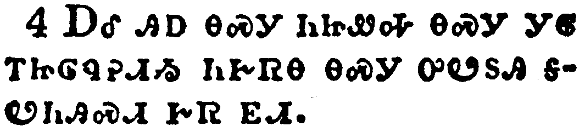</a></td>
</tr>
<tr class="even">
<td>And this I say, lest any man should beguile you with enticing words.</td>
</tr>
<tr class="odd">
<td>ᎠᎴ ᎯᎠ ᎾᏍᎩ ᏂᏥᏪᎭ ᎾᏍᎩ ᎩᎶ ᎢᏥᎶᏄᎮᏗᏱ ᏂᎨᏒᎾ ᎾᏍᎩ ᎤᏬᏚᎯ ᎦᏬᏂᎯᏍᏗ ᎨᏒ ᎬᏗ.</td>
</tr>
<tr class="even">
<td>A-le hi-a na-s-gi ni-tsi-we-ha na-s-gi gi-lo i-tsi-lo-nu-he-di-yi ni-ge-sv-na na-s-gi u-wo-du-hi ga-wo-ni-hi-s-di ge-sv gv-di.</td>
</tr>
</tbody>
</table>

<table>
<tbody>
<tr class="odd">
<td><a href="120205.png">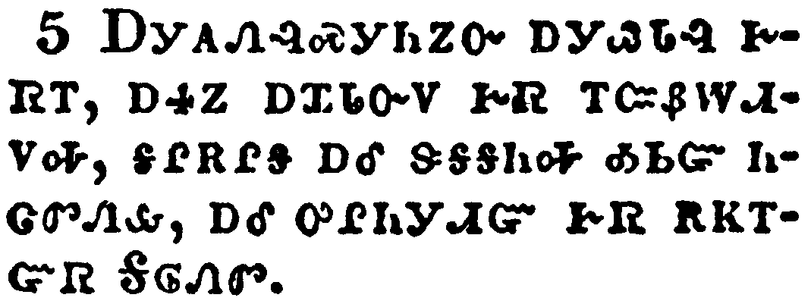</a></td>
</tr>
<tr class="even">
<td>For though I be absent in the flesh, yet am I with you in the spirit, joying and beholding your order, and the stedfastness of your faith in Christ.</td>
</tr>
<tr class="odd">
<td>ᎠᎩᎪᏁᎸᏍᎩᏂᏃᏅ ᎠᎩᏇᏓᎸ ᎨᏒᎢ, ᎠᏎᏃ ᎠᏆᏓᏅᏙ ᎨᏒ ᎢᏨᏰᎳᏗᏙᎭ, ᎦᎵᎡᎵᎦ ᎠᎴ ᏕᎦᎦᏂᎭ ᎣᏏᏳ ᏂᏣᏛᏁᎲ, ᎠᎴ ᎤᎵᏂᎩᏗᏳ ᎨᏒ ᎡᏦᎢᏳᏒ ᎦᎶᏁᏛ.</td>
</tr>
<tr class="even">
<td>A-gi-go-ne-lv-s-gi-ni-no-nv a-gi-que-da-lv ge-sv-i, a-se-no a-qua-da-nv-do ge-sv i-tsv-ye-la-di-do-ha, ga-li-e-li-ga a-le de-ga-ga-ni-ha o-si-yu ni-tsa-dv-ne-hv, a-le u-li-ni-gi-di-yu ge-sv e-tso-i-yu-sv Ga-lo-ne-dv.</td>
</tr>
</tbody>
</table>

<table>
<tbody>
<tr class="odd">
<td><a href="120206.png">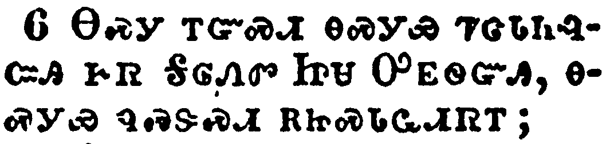</a></td>
</tr>
<tr class="even">
<td>As ye have therefore received Christ Jesus the Lord, so walk ye in him:</td>
</tr>
<tr class="odd">
<td>ᎾᏍᎩ ᎢᏳᏍᏗ ᎾᏍᎩᏯ ᏤᏣᏓᏂᎸᏨᎯ ᎨᏒ ᎦᎶᏁᏛ ᏥᏌ ᎤᎬᏫᏳᎯ, ᎾᏍᎩᏯ ᏄᏍᏕᏍᏗ ᎡᏥᏍᏓᏩᏗᏒᎢ;</td>
</tr>
<tr class="even">
<td>Na-s-gi i-yu-s-di na-s-gi-ya tse-tsa-da-ni-lv-tsv-hi ge-sv Ga-lo-ne-dv Tsi-sa U-gv-wi-yu-hi, na-s-gi-ya nu-s-de-s-di e-tsi-s-da-wa-di-sv-i;</td>
</tr>
</tbody>
</table>

<table>
<tbody>
<tr class="odd">
<td><a href="120207.png">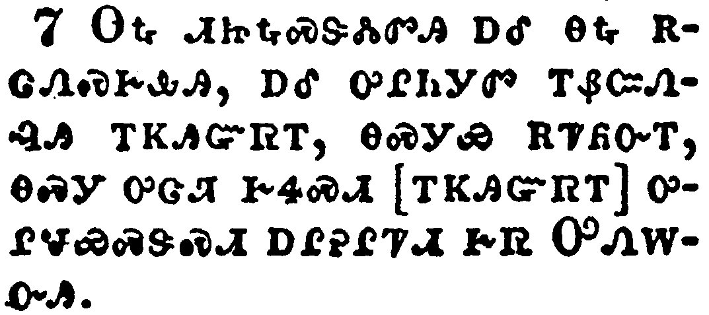</a></td>
</tr>
<tr class="even">
<td>Rooted and built up in him, and stablished in the faith, as ye have been taught, abounding therein with thanksgiving.</td>
</tr>
<tr class="odd">
<td>ᎾᎿᎭᏗᏥᎿᎭᏍᏕᏜᏓᏛᎯ ᎠᎴ ᎾᎿᎭᎡᏣᏁᏍᎨᎲᎯ, ᎠᎴ ᎤᎵᏂᎩᏛ ᎢᏰᏨᏁᎸᎯ ᎢᏦᎯᏳᏒᎢ, ᎾᏍᎩᏯ ᎡᏤᏲᏅᎢ, ᎾᏍᎩ ᎤᏣᏘ ᎨᏎᏍᏗ [ᎢᏦᎯᏳᏒᎢ] ᎤᎵᏠᏯᏍᏕᏍᏗ ᎠᎵᎮᎵᏤᏗ ᎨᏒ ᎤᏁᎳᏅᎯ.</td>
</tr>
<tr class="even">
<td>Na-hna di-tsi-hna-s-de-dla-dv-hi a-le na-hna e-tsa-ne-s-ge-hv-hi, a-le u-li-ni-gi-dv i-ye-tsv-ne-lv-hi i-tso-hi-yu-sv-i, na-s-gi-ya e-tse-yo-nv-i, na-s-gi u-tsa-ti ge-se-s-di [i-tso-hi-yu-sv-i] u-li-tlo-ya-s-de-s-di a-li-he-li-tse-di ge-sv U-ne-la-nv-hi.</td>
</tr>
</tbody>
</table>

<table>
<tbody>
<tr class="odd">
<td><a href="120208.png">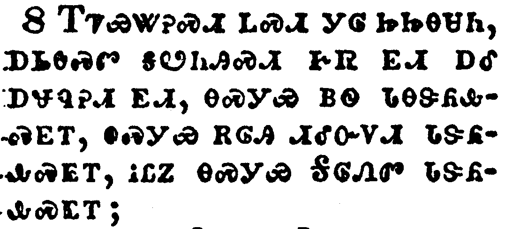</a></td>
</tr>
<tr class="even">
<td>Beware lest any man spoil you through philosophy and vain deceit, after the tradition of men, after the rudiments of the world, and not after Christ.</td>
</tr>
<tr class="odd">
<td>ᎢᏤᏯᏔᎮᏍᏗ ᏞᏍᏗ ᎩᎶ ᏥᏥᎾᏌᏂ, ᎠᏏᎾᏍᏛ ᎦᏬᏂᎯᏍᏗ ᎨᏒ ᎬᏗ ᎠᎴ ᎠᏠᏄᎮᏗ ᎬᏗ, ᎾᏍᎩᏯ ᏴᏫ ᏓᎾᏕᏲᎲᏍᎬᎢ, ᎾᏍᎩᏯ ᎡᎶᎯ ᏗᎴᏅᏙᏗ ᏓᏕᏲᎲᏍᎬᎢ, ᎥᏝᏃ ᎾᏍᎩᏯ ᎦᎶᏁᏛ ᏓᏕᏲᎲᏍᎬᎢ;</td>
</tr>
<tr class="even">
<td>I-tse-ya-ta-he-s-di tle-s-di gi-lo tsi-tsi-na-sa-ni, a-si-na-s-dv ga-wo-ni-hi-s-di ge-sv gv-di a-le a-tlo-nu-he-di gv-di, na-s-gi-ya yv-wi da-na-de-yo-hv-s-gv-i, na-s-gi-ya e-lo-hi di-le-nv-do-di da-de-yo-hv-s-gv-i, v-tla-no na-s-gi-ya Ga-lo-ne-dv da-de-yo-hv-s-gv-i;</td>
</tr>
</tbody>
</table>

<table>
<tbody>
<tr class="odd">
<td><a href="120209.png">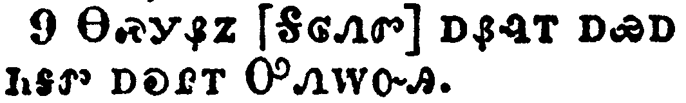</a></td>
</tr>
<tr class="even">
<td>For in him dwelleth all the fullness of the Godhead bodily.</td>
</tr>
<tr class="odd">
<td>ᎾᏍᎩᏰᏃ [ᎦᎶᏁᏛ] ᎠᏰᎸᎢ ᎠᏯᎠ ᏂᎦᏛ ᎠᎧᎵᎢ ᎤᏁᎳᏅᎯ.</td>
</tr>
<tr class="even">
<td>Na-s-gi-ye-no [Ga-lo-ne-dv] a-ye-lv-i a-ya-a ni-ga-dv a-ka-li-i U-ne-la-nv-hi.</td>
</tr>
</tbody>
</table>

<table>
<tbody>
<tr class="odd">
<td><a href="120210.png">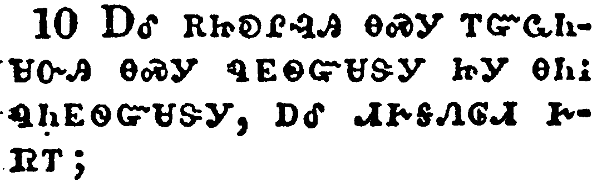</a></td>
</tr>
<tr class="even">
<td>And ye are complete in him, which is the head of all principality and power:</td>
</tr>
<tr class="odd">
<td>ᎠᎴ ᎡᏥᎧᎵᎸᎯ ᎾᏍᎩ ᎢᏳᏩᏂᏌᏅᎯ ᎾᏍᎩ ᏄᎬᏫᏳᏌᏕᎩ ᏥᎩ ᎾᏂᎥ ᏄᏂᎬᏫᏳᏌᏕᎩ, ᎠᎴ ᏗᎨᎦᏁᎶᏗ ᎨᏒᎢ;</td>
</tr>
<tr class="even">
<td>A-le e-tsi-ka-li-lv-hi na-s-gi i-yu-wa-ni-sa-nv-hi na-s-gi nu-gv-wi-yu-sa-de-gi tsi-gi na-ni-v nu-ni-gv-wi-yu-sa-de-gi, a-le di-ge-ga-ne-lo-di ge-sv-i;</td>
</tr>
</tbody>
</table>

<table>
<tbody>
<tr class="odd">
<td><a href="120211.png">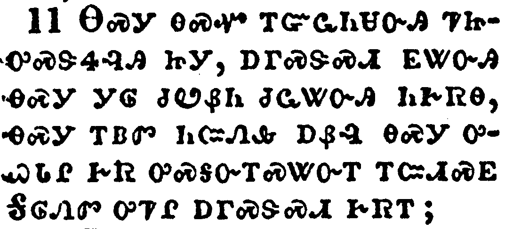</a></td>
</tr>
<tr class="even">
<td>In whom also ye are circumcised with the circumcision made without hands, in putting off the body of the sins of the flesh by the circumcision of Christ:</td>
</tr>
<tr class="odd">
<td>ᎾᏍᎩ ᎾᏍᏉ ᎢᏳᏩᏂᏌᏅᎯ ᏤᏥᎤᏍᏕᏎᎸᎯ ᏥᎩ, ᎠᎱᏍᏕᏍᏗ ᎬᏔᏅᎯ ᎾᏍᎩ ᎩᎶ ᏧᏬᏰᏂ ᏧᏩᏔᏅᎯ ᏂᎨᏒᎾ, ᎾᏍᎩ ᎢᏴᏛ ᏂᏨᏁᎲ ᎠᏰᎵ ᎾᏍᎩ ᎤᏇᏓᎵ ᎨᏒ ᎤᏍᎦᏅᎢᏍᏔᏅᎢ ᎢᏨᏗᏍᎬ ᎦᎶᏁᏛ ᎤᏤᎵ ᎠᎱᏍᏕᏍᏗ ᎨᏒᎢ;</td>
</tr>
<tr class="even">
<td>Na-s-gi na-s-quo i-yu-wa-ni-sa-nv-hi tse-tsi-u-s-de-se-lv-hi tsi-gi, a-hu-s-de-s-di gv-ta-nv-hi na-s-gi gi-lo tsu-wo-ye-ni tsu-wa-ta-nv-hi ni-ge-sv-na, na-s-gi i-yv-dv ni-tsv-ne-hv a-ye-li na-s-gi u-que-da-li ge-sv u-s-ga-nv-i-s-ta-nv-i i-tsv-di-s-gv Ga-lo-ne-dv u-tse-li a-hu-s-de-s-di ge-sv-i;</td>
</tr>
</tbody>
</table>

<table>
<tbody>
<tr class="odd">
<td></td>
</tr>
<tr class="even">
<td>Buried with him in baptism, wherein also ye are risen with him through the faith of the operation of God, who hath raised him from the dead.</td>
</tr>
<tr class="odd">
<td>ᎡᏥᏂᏌᏅ ᎾᏍᎩ ᎠᏥᏂᏌᏅ ᏗᏓᏬᏍᏗ ᎨᏒ ᎬᏔᏅᎯ, ᎾᏍᎩ ᎾᏍᏉ ᎬᏔᏅᎯ ᏕᏣᎴᏔᏅ ᎾᏍᎩ ᏓᎦᎴᏔᏅᎢ ᏅᏧᎵᏍᏙᏔᏅ ᎢᏦᎯᏳᏒ ᎤᏁᎳᏅᎯ ᏚᎸᏫᏍᏓᏁᎸᎢ, ᎾᏍᎩ ᏧᎴᏔᏅᎯ ᏥᎩ ᎤᏲᎱᏒᎢ.</td>
</tr>
<tr class="even">
<td>E-tsi-ni-sa-nv na-s-gi a-tsi-ni-sa-nv di-da-wo-s-di ge-sv gv-ta-nv-hi, na-s-gi na-s-quo gv-ta-nv-hi de-tsa-le-ta-nv na-s-gi da-ga-le-ta-nv-i nv-tsu-li-s-do-ta-nv i-tso-hi-yu-sv U-ne-la-nv-hi du-lv-wi-s-da-ne-lv-i, na-s-gi tsu-le-ta-nv-hi tsi-gi u-yo-hu-sv-i.</td>
</tr>
</tbody>
</table>

<table>
<tbody>
<tr class="odd">
<td><a href="120213.png">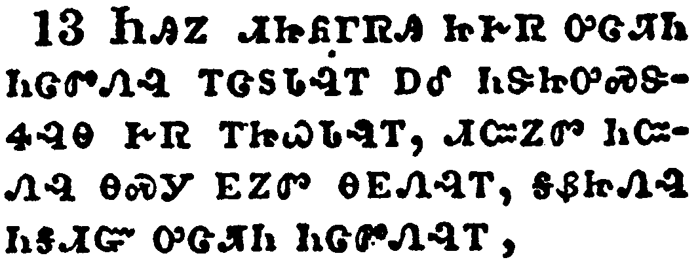</a></td>
</tr>
<tr class="even">
<td>And you, being dead in your sins and the uncircumcision of your flesh, hath he quickened together with him, having forgiven you all trespasses;</td>
</tr>
<tr class="odd">
<td>ᏂᎯᏃ ᏗᏥᏲᎱᏒᎯ ᏂᎨᏒ ᎤᏣᏘᏂ ᏂᏣᏛᏁᎸ ᎢᏣᏚᏓᎸᎢ ᎠᎴ ᏂᏕᏥᎤᏍᏕᏎᎸᎾ ᎨᏒ ᎢᏥᏇᏓᎸᎢ, ᏗᏨᏃᏛ ᏂᏨᏁᎸ ᎾᏍᎩ ᎬᏃᏛ ᎾᎬᏁᎸᎢ, ᎦᏰᏥᏁᎸ ᏂᎦᏗᏳ ᎤᏣᏘᏂ ᏂᏣᏛᏁᎸᎢ,</td>
</tr>
<tr class="even">
<td>Ni-hi-no di-tsi-yo-hu-sv-hi ni-ge-sv u-tsa-ti-ni ni-tsa-dv-ne-lv i-tsa-du-da-lv-i a-le ni-de-tsi-u-s-de-se-lv-na ge-sv i-tsi-que-da-lv-i, di-tsv-no-dv ni-tsv-ne-lv na-s-gi gv-no-dv na-gv-ne-lv-i, ga-ye-tsi-ne-lv ni-ga-di-yu u-tsa-ti-ni ni-tsa-dv-ne-lv-i,</td>
</tr>
</tbody>
</table>

<table>
<tbody>
<tr class="odd">
<td><a href="120214.png">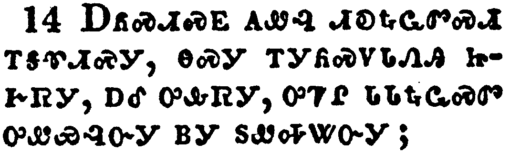</a></td>
</tr>
<tr class="even">
<td>Blotting out the handwriting of ordinances that was against us, which was contrary to us, and took it out of the way, nailing it to his cross;</td>
</tr>
<tr class="odd">
<td>ᎠᏲᏍᏗᏍᎬ ᎪᏪᎸ ᏗᎧᎿᎭᏩᏛᏍᏗ ᎢᎦᏡᏗᏍᎩ, ᎾᏍᎩ ᎢᎩᏲᏍᏙᏓᏁᎯ ᏥᎨᏒᎩ, ᎠᎴ ᎤᎲᏒᎩ, ᎤᏤᎵ ᏓᏓᎿᎭᏩᏍᏛ ᎤᏪᏯᎸᏅᎩ ᏴᏫ ᏚᏪᎭᏔᏅᎩ;</td>
</tr>
<tr class="even">
<td>A-yo-s-di-s-gv go-we-lv di-ka-hna-wa-dv-s-di i-ga-tlu-di-s-gi, na-s-gi i-gi-yo-s-do-da-ne-hi tsi-ge-sv-gi, a-le u-hv-sv-gi, u-tse-li da-da-hna-wa-s-dv u-we-ya-lv-nv-gi yv-wi du-we-ha-ta-nv-gi;</td>
</tr>
</tbody>
</table>

<table>
<tbody>
<tr class="odd">
<td><a href="120215.png">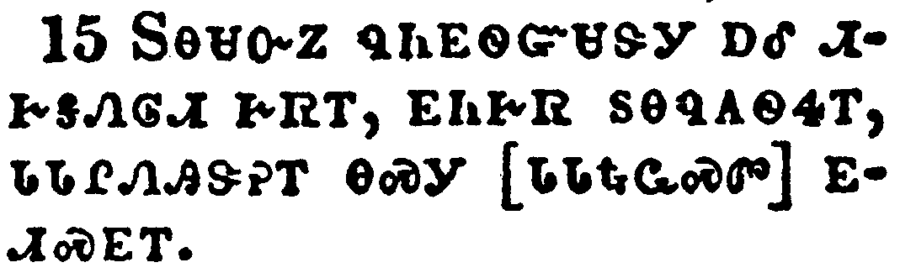</a></td>
</tr>
<tr class="even">
<td>And having spoiled principalities and powers, he made a shew of them openly, triumphing over them in it.</td>
</tr>
<tr class="odd">
<td>ᏚᎾᏌᏅᏃ ᏄᏂᎬᏫᏳᏌᏕᎩ ᎠᎴ ᏗᎨᎦᏁᎶᏗ ᎨᏒᎢ, ᎬᏂᎨᏒ ᏚᎾᏄᎪᏫᏎᎢ, ᏓᏓᎵᏁᎯᏕᎨᎢ ᎾᏍᎩ [ᏓᏓᎿᎭᏩᏍᏛ] ᎬᏗᏍᎬᎢ.</td>
</tr>
<tr class="even">
<td>Du-na-sa-nv-no nu-ni-gv-wi-yu-sa-de-gi a-le di-ge-ga-ne-lo-di ge-sv-i, gv-ni-ge-sv du-na-nu-go-wi-se-i, da-da-li-ne-hi-de-ge-i na-s-gi [da-da-hna-wa-s-dv] gv-di-s-gv-i.</td>
</tr>
</tbody>
</table>

<table>
<tbody>
<tr class="odd">
<td><a href="120216.png">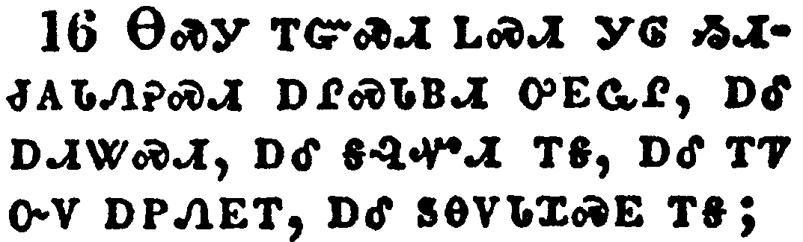</a></td>
</tr>
<tr class="even">
<td>Let no man therefore judge you in meat, or in drink, or in respect of an holyday, or of the new moon, or of the sabbath days:</td>
</tr>
<tr class="odd">
<td>ᎾᏍᎩ ᎢᏳᏍᏗ ᏞᏍᏗ ᎩᎶ ᏱᏗᏧᎪᏓᏁᎮᏍᏗ ᎠᎵᏍᏓᏴᏗ ᎤᎬᏩᎵ, ᎠᎴ ᎠᏗᏔᏍᏗ, ᎠᎴ ᎦᎸᏉᏗ ᎢᎦ, ᎠᎴ ᎢᏤ ᏅᏙ ᎠᏢᏁᎬᎢ, ᎠᎴ ᏚᎾᏙᏓᏆᏍᎬ ᎢᎦ;</td>
</tr>
<tr class="even">
<td>Na-s-gi i-yu-s-di tle-s-di gi-lo yi-di-tsu-go-da-ne-he-s-di a-li-s-da-yv-di u-gv-wa-li, a-le a-di-ta-s-di, a-le ga-lv-quo-di i-ga, a-le i-tse nv-do a-tlv-ne-gv-i, a-le du-na-do-da-qua-s-gv i-ga;</td>
</tr>
</tbody>
</table>

<table>
<tbody>
<tr class="odd">
<td><a href="120217.png">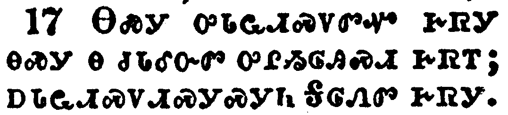</a></td>
</tr>
<tr class="even">
<td>Which are a shadow of things to come; but the body is of Christ.</td>
</tr>
<tr class="odd">
<td>ᎾᏍᎩ ᎤᏓᏩᏗᏍᏙᏛᏉ ᎨᏒᎩ ᎾᏍᎩ Ꮎ ᏧᏓᎴᏅᏛ ᎤᎵᏱᎶᎯᏍᏗ ᎨᏒᎢ; ᎠᏓᏩᏗᏍᏙᏗᏍᎩᏍᎩᏂ ᎦᎶᏁᏛ ᎨᏒᎩ.</td>
</tr>
<tr class="even">
<td>Na-s-gi u-da-wa-di-s-do-dv-quo ge-sv-gi na-s-gi na tsu-da-le-nv-dv u-li-yi-lo-hi-s-di ge-sv-i; a-da-wa-di-s-do-di-s-gi-s-gi-ni Ga-lo-ne-dv ge-sv-gi.</td>
</tr>
</tbody>
</table>

<table>
<tbody>
<tr class="odd">
<td><a href="120218.png">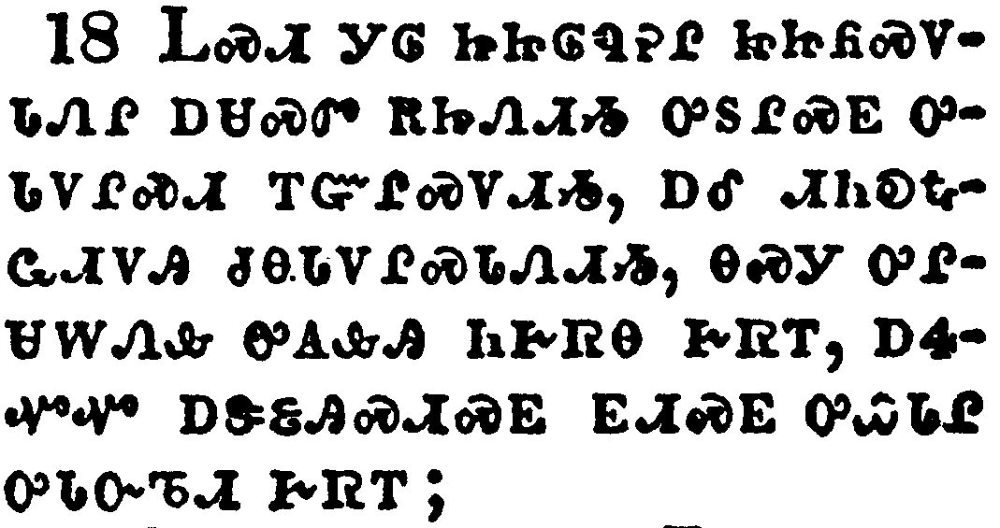</a></td>
</tr>
<tr class="even">
<td>Let no man beguile you of your reward in a voluntary humility and worshipping of angels, intruding into those things which he hath not seen, vainly puffed up by his fleshly mind,</td>
</tr>
<tr class="odd">
<td>ᏞᏍᏗ ᎩᎶ ᏥᏥᎷᏄᎮᎵ ᏥᏥᏲᏍᏙᏓᏁᎵ ᎠᏌᏍᏛ ᎡᏥᏁᏗᏱ ᎤᏚᎵᏍᎬ ᎤᏓᏙᎵᏍᏗ ᎢᏳᎵᏍᏙᏗᏱ, ᎠᎴ ᏗᏂᎧᎿᎭᏩᏗᏙᎯ ᏧᎾᏓᏙᎵᏍᏓᏁᏗᏱ, ᎾᏍᎩ ᎤᎵᏌᎳᏁᎲ ᎤᎪᎲᎯ ᏂᎨᏒᎾ ᎨᏒᎢ, ᎠᏎᏉᏉ ᎠᏕᏋᎯᏍᏗᏍᎬ ᎬᏗᏍᎬ ᎤᏇᏓᎵ ᎤᏓᏅᏖᏗ ᎨᏒᎢ;</td>
</tr>
<tr class="even">
<td>Tle-s-di gi-lo tsi-tsi-lu-nu-he-li tsi-tsi-yo-s-do-da-ne-li a-sa-s-dv e-tsi-ne-di-yi u-du-li-s-gv u-da-do-li-s-di i-yu-li-s-do-di-yi, a-le di-ni-ka-hna-wa-di-do-hi tsu-na-da-do-li-s-da-ne-di-yi, na-s-gi u-li-sa-la-ne-hv u-go-hv-hi ni-ge-sv-na ge-sv-i, a-se-quo-quo a-de-quv-hi-s-di-s-gv gv-di-s-gv u-que-da-li u-da-nv-te-di ge-sv-i;</td>
</tr>
</tbody>
</table>

<table>
<tbody>
<tr class="odd">
<td><a href="120219.png">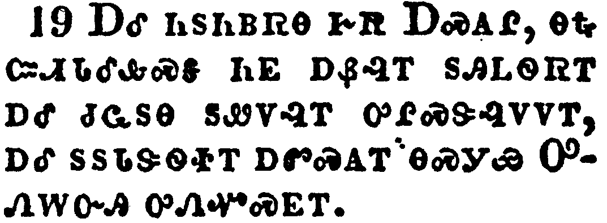</a></td>
</tr>
<tr class="even">
<td>And not holding the Head, from which all the body by joints and bands having nourishment ministered, and knit together, increaseth with the increase of God.</td>
</tr>
<tr class="odd">
<td>ᎠᎴ ᏂᏚᏂᏴᏒᎾ ᎨᏒ ᎠᏍᎪᎵ, ᎾᎿᎭᏨᏗᏓᎴᎲᏍᎦ ᏂᎬ ᎠᏰᎸᎢ ᏚᎯᏞᏫᏒᎢ ᎠᎴ ᏧᏩᏚᎾ ᏚᏪᏙᎸᎢ ᎤᎵᏍᏕᎸᏙᏙᎢ, ᎠᎴ ᏚᏚᏓᏕᏫᏐᎢ ᎠᏛᏍᎪᎢ ᎾᏍᎩᏯ ᎤᏁᎳᏅᎯ ᎤᏁᏉᏍᎬᎢ.</td>
</tr>
<tr class="even">
<td>A-le ni-du-ni-yv-sv-na ge-sv A-s-go-li, na-hna tsv-di-da-le-hv-s-ga ni-gv a-ye-lv-i du-hi-tle-wi-sv-i a-le tsu-wa-du-na du-we-do-lv-i u-li-s-de-lv-do-do-i, a-le du-du-da-de-wi-so-i a-dv-s-go-i na-s-gi-ya U-ne-la-nv-hi u-ne-quo-s-gv-i.</td>
</tr>
</tbody>
</table>

<table>
<tbody>
<tr class="odd">
<td><a href="120220.png">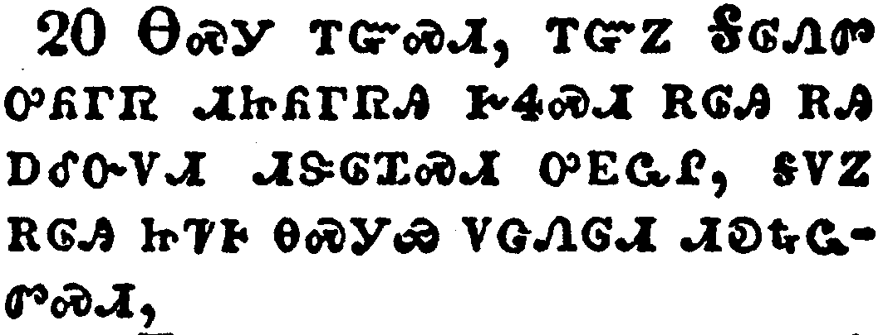</a></td>
</tr>
<tr class="even">
<td>Wherefore if ye be dead with Christ from the rudiments of the world, why, as though living in the world, are ye subject to ordinances,</td>
</tr>
<tr class="odd">
<td>ᎾᏍᎩ ᎢᏳᏍᏗ, ᎢᏳᏃ ᎦᎶᏁᏛ ᎤᏲᎱᏒ ᏗᏥᏲᎱᏒᎯ ᎨᏎᏍᏗ ᎡᎶᎯ ᎡᎯ ᎠᎴᏅᏙᏗ ᏗᏕᎶᏆᏍᏗ ᎤᎬᏩᎵ, ᎦᏙᏃ ᎡᎶᎯ ᏥᏤᎰ ᎾᏍᎩᏯ ᏙᏣᏁᎶᏗ ᏗᎧᎿᎭᏩᏛᏍᏗ,</td>
</tr>
<tr class="even">
<td>Na-s-gi i-yu-s-di, i-yu-no Ga-lo-ne-dv u-yo-hu-sv di-tsi-yo-hu-sv-hi ge-se-s-di e-lo-hi e-hi a-le-nv-do-di di-de-lo-qua-s-di u-gv-wa-li, ga-do-no e-lo-hi tsi-tse-ho na-s-gi-ya do-tsa-ne-lo-di di-ka-hna-wa-dv-s-di,</td>
</tr>
</tbody>
</table>

<table>
<tbody>
<tr class="odd">
<td><a href="120221.png">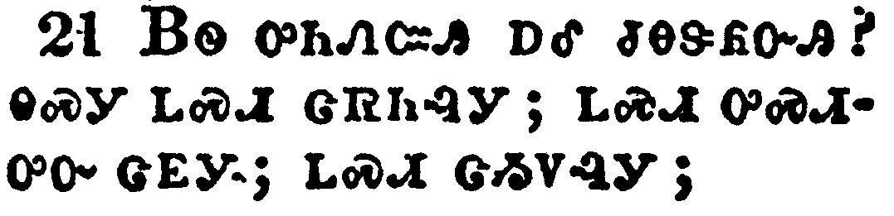</a></td>
</tr>
<tr class="even">
<td>(Touch not; taste not; handle not;</td>
</tr>
<tr class="odd">
<td>ᏴᏫ ᎤᏂᏁᏨᎯ ᎠᎴ ᏧᎾᏕᏲᏅᎯ? ᎾᏍᎩ ᏞᏍᏗ ᏣᏒᏂᎸᎩ; ᏞᏍᏗ ᎤᏍᏗᎤᏅ ᏣᎬᎩ; ᏞᏍᏗ ᏣᏱᏙᎸᎩ;</td>
</tr>
<tr class="even">
<td>Yv-wi u-ni-ne-tsv-hi a-le tsu-na-de-yo-nv-hi? na-s-gi tle-s-di tsa-sv-ni-lv-gi; tle-s-di u-s-di-u-nv tsa-gv-gi; tle-s-di tsa-yi-do-lv-gi;</td>
</tr>
</tbody>
</table>

<table>
<tbody>
<tr class="odd">
<td><a href="120222.png">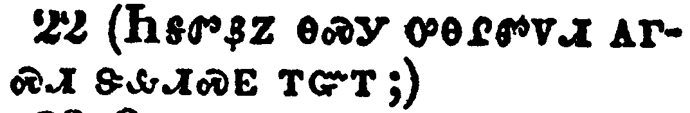</a></td>
</tr>
<tr class="even">
<td>Which all are to perish with the using;) after the commandments and doctrines of men?</td>
</tr>
<tr class="odd">
<td>(ᏂᎦᏛᏰᏃ ᎾᏍᎩ ᎤᎾᎵᏛᏙᏗ ᎪᎱᏍᏗ ᏕᎲᏗᏍᎬ ᎢᏳᎢ;)</td>
</tr>
<tr class="even">
<td>(Ni-ga-dv-ye-no na-s-gi u-na-li-dv-do-di go-hu-s-di de-hv-di-s-gv i-yu-i;)</td>
</tr>
</tbody>
</table>

<table>
<tbody>
<tr class="odd">
<td><a href="120223.png">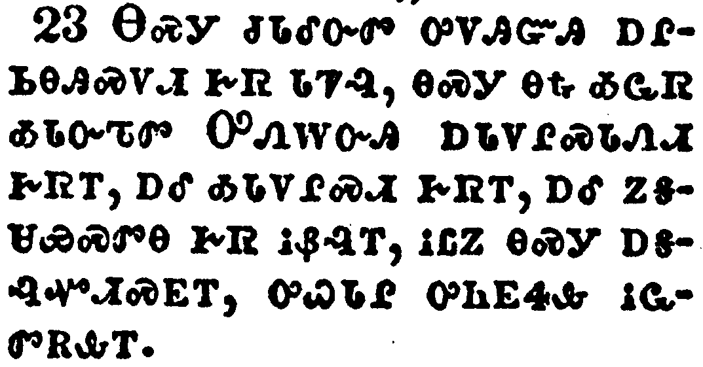</a></td>
</tr>
<tr class="even">
<td>Which things have indeed a shew of wisdom in will worship, and humility, and neglecting of the body; not in any honour to the satisfying of the flesh.</td>
</tr>
<tr class="odd">
<td>ᎾᏍᎩ ᏧᏓᎴᏅᏛ ᎤᏙᎯᏳᎯ ᎠᎵᏏᎾᎯᏍᏙᏗ ᎨᏒ ᏓᏤᎸ, ᎾᏍᎩ ᎾᎿᎭᎣᏩᏒ ᎣᏓᏅᏖᏛ ᎤᏁᎳᏅᎯ ᎠᏓᏙᎵᏍᏓᏁᏗ ᎨᏒᎢ, ᎠᎴ ᎣᏓᏙᎵᏍᏗ ᎨᏒᎢ, ᎠᎴ ᏃᎦᏌᏯᏍᏛᎾ ᎨᏒ ᎥᏰᎸᎢ, ᎥᏝᏃ ᎾᏍᎩ ᎠᎦᎸᏉᏗᏍᎬᎢ, ᎤᏇᏓᎵ ᎤᏂᎬᏎᎲ ᎥᏩᏛᎡᎲᎢ.</td>
</tr>
<tr class="even">
<td>Na-s-gi tsu-da-le-nv-dv u-do-hi-yu-hi a-li-si-na-hi-s-do-di ge-sv da-tse-lv, na-s-gi na-hna o-wa-sv o-da-nv-te-dv U-ne-la-nv-hi a-da-do-li-s-da-ne-di ge-sv-i, a-le o-da-do-li-s-di ge-sv-i, a-le no-ga-sa-ya-s-dv-na ge-sv v-ye-lv-i, v-tla-no na-s-gi a-ga-lv-quo-di-s-gv-i, u-que-da-li u-ni-gv-se-hv v-wa-dv-e-hv-i.</td>
</tr>
</tbody>
</table>

