+++
draft=false
date = 2014-12-18T21:11:07Z
title = "Colossians - Chapter 3 - Cherokee New Testament"
weight = 1418955067

[taxonomies]

authors = ["Timothy Legg"]
categories = []
tags = []

[extra]
+++

<table>
<tbody>
<tr class="odd">
<td><a href="120301.png">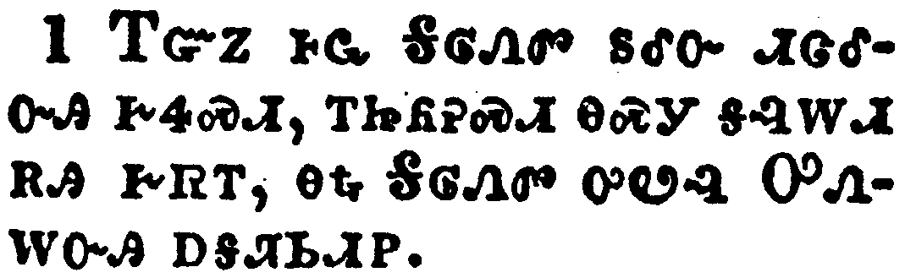</a></td>
</tr>
<tr class="even">
<td>If ye then be risen with Christ, seek those things which are above, where Christ sitteth on the right hand of God.</td>
</tr>
<tr class="odd">
<td>ᎢᏳᏃ ᎰᏩ ᎦᎶᏁᏛ ᏚᎴᏅ ᏗᏣᎴᏅᎯ ᎨᏎᏍᏗ, ᎢᏥᏲᎮᏍᏗ ᎾᏍᎩ ᎦᎸᎳᏗ ᎡᎯ ᎨᏒᎢ, ᎾᎿᎭᎦᎶᏁᏛ ᎤᏬᎸ ᎤᏁᎳᏅᎯ ᎠᎦᏘᏏᏗᏢ.</td>
</tr>
<tr class="even">
<td>I-yu-no ho-wa Ga-lo-ne-dv du-le-nv di-tsa-le-nv-hi ge-se-s-di, i-tsi-yo-he-s-di na-s-gi ga-lv-la-di e-hi ge-sv-i, na-hna Ga-lo-ne-dv u-wo-lv U-ne-la-nv-hi a-ga-ti-si-di-tlv.</td>
</tr>
</tbody>
</table>

<table>
<tbody>
<tr class="odd">
<td><a href="120302.png">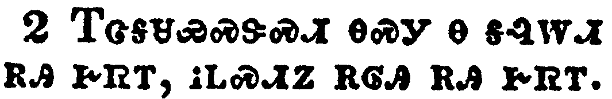</a></td>
</tr>
<tr class="even">
<td>Set your affection on things above, not on things on the earth.</td>
</tr>
<tr class="odd">
<td>ᎢᏣᎦᏌᏯᏍᏕᏍᏗ ᎾᏍᎩ Ꮎ ᎦᎸᎳᏗ ᎡᎯ ᎨᏒᎢ, ᎥᏞᏍᏗᏃ ᎡᎶᎯ ᎡᎯ ᎨᏒᎢ.</td>
</tr>
<tr class="even">
<td>I-tsa-ga-sa-ya-s-de-s-di na-s-gi na ga-lv-la-di e-hi ge-sv-i, v-tle-s-di-no e-lo-hi e-hi ge-sv-i.</td>
</tr>
</tbody>
</table>

<table>
<tbody>
<tr class="odd">
<td><a href="120303.png">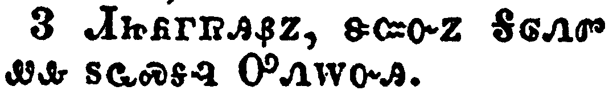</a></td>
</tr>
<tr class="even">
<td>For ye are dead, and your life is hid with Christ in God.</td>
</tr>
<tr class="odd">
<td>ᏗᏥᏲᎱᏒᎯᏰᏃ, ᏕᏨᏅᏃ ᎦᎶᏁᏛ ᏪᎲ ᏚᏩᏍᎦᎸ ᎤᏁᎳᏅᎯ.</td>
</tr>
<tr class="even">
<td>Di-tsi-yo-hu-sv-hi-ye-no, de-tsv-nv-no ga-lo-ne-dv we-hv du-wa-s-ga-lv U-ne-la-nv-hi.</td>
</tr>
</tbody>
</table>

<table>
<tbody>
<tr class="odd">
<td><a href="120304.png">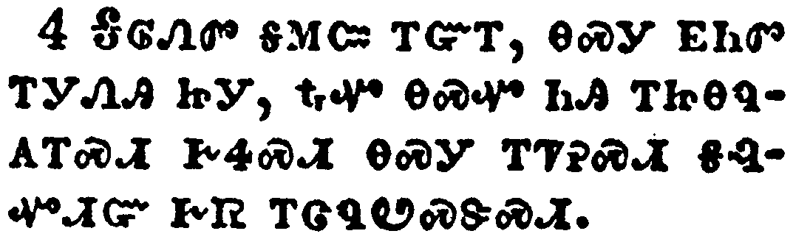</a></td>
</tr>
<tr class="even">
<td>When Christ, who is our life, shall appear, then shall ye also appear with him in glory.</td>
</tr>
<tr class="odd">
<td>ᎦᎶᏁᏛ ᎦᎷᏨ ᎢᏳᎢ, ᎾᏍᎩ ᎬᏂᏛ ᎢᎩᏁᎯ ᏥᎩ, ᎿᎭᏉ ᎾᏍᏉ ᏂᎯ ᎢᏥᎾᏄᎪᎢᏍᏗ ᎨᏎᏍᏗ ᎾᏍᎩ ᎢᏤᎮᏍᏗ ᎦᎸᏉᏗᏳ ᎨᏒ ᎢᏣᏄᏬᏍᏕᏍᏗ.</td>
</tr>
<tr class="even">
<td>Ga-lo-ne-dv ga-lu-tsv i-yu-i, na-s-gi gv-ni-dv i-gi-ne-hi tsi-gi, hna-quo na-s-quo ni-hi i-tsi-na-nu-go-i-s-di ge-se-s-di na-s-gi i-tse-he-s-di ga-lv-quo-di-yu ge-sv i-tsa-nu-wo-s-de-s-di.</td>
</tr>
</tbody>
</table>

<table>
<tbody>
<tr class="odd">
<td><a href="120305.png">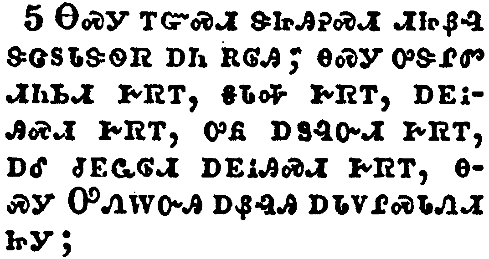</a></td>
</tr>
<tr class="even">
<td>Mortify therefore your members which are upon the earth; fornication, uncleanness, inordinate affection, evil concupiscence, and covetousness, which is idolatry:</td>
</tr>
<tr class="odd">
<td>ᎾᏍᎩ ᎢᏳᏍᏗ ᏕᏥᎯᎮᏍᏗ ᏗᏥᏰᎸ ᏕᏣᏚᏓᏕᏫᏒ ᎠᏂ ᎡᎶᎯ; ᎾᏍᎩ ᎤᏕᎵᏛ ᏗᏂᏏᏗ ᎨᏒᎢ, ᎦᏓᎭ ᎨᏒᎢ, ᎠᎬᎥᎯᏍᏗ ᎨᏒᎢ, ᎤᏲ ᎠᏚᎸᏅᏗ ᎨᏒᎢ, ᎠᎴ ᏧᎬᏩᎶᏗ ᎠᎬᎥᎯᏍᏗ ᎨᏒᎢ, ᎾᏍᎩ ᎤᏁᎳᏅᎯ ᎠᏰᎸᎯ ᎠᏓᏙᎵᏍᏓᏁᏗ ᏥᎩ;</td>
</tr>
<tr class="even">
<td>Na-s-gi i-yu-s-di de-tsi-hi-he-s-di di-tsi-ye-lv de-tsa-du-da-de-wi-sv a-ni e-lo-hi; na-s-gi u-de-li-dv di-ni-si-di ge-sv-i, ga-da-ha ge-sv-i, a-gv-v-hi-s-di ge-sv-i, u-yo a-du-lv-nv-di ge-sv-i, a-le tsu-gv-wa-lo-di a-gv-v-hi-s-di ge-sv-i, na-s-gi U-ne-la-nv-hi a-ye-lv-hi a-da-do-li-s-da-ne-di tsi-gi;</td>
</tr>
</tbody>
</table>

<table>
<tbody>
<tr class="odd">
<td><a href="120306.png">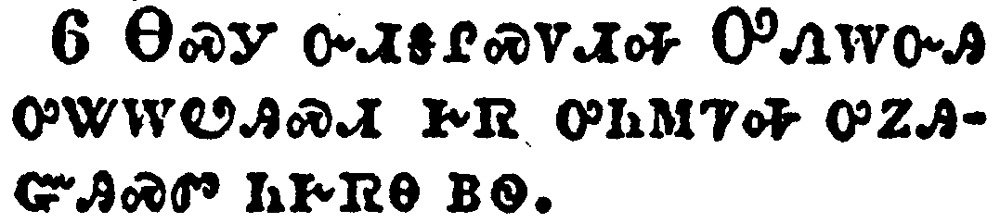</a></td>
</tr>
<tr class="even">
<td>For which things' sake the wrath of God cometh on the children of disobedience:</td>
</tr>
<tr class="odd">
<td>ᎾᏍᎩ ᏅᏗᎦᎵᏍᏙᏗᎭ ᎤᏁᎳᏅᎯ ᎤᏔᎳᏬᎯᏍᏗ ᎨᏒ ᎤᏂᎷᏤᎭ ᎤᏃᎯᏳᎯᏍᏛ ᏂᎨᏒᎾ ᏴᏫ.</td>
</tr>
<tr class="even">
<td>Na-s-gi nv-di-ga-li-s-do-di-ha U-ne-la-nv-hi u-ta-la-wo-hi-s-di ge-sv u-ni-lu-tse-ha u-no-hi-yu-hi-s-dv ni-ge-sv-na yv-wi.</td>
</tr>
</tbody>
</table>

<table>
<tbody>
<tr class="odd">
<td></td>
</tr>
<tr class="even">
<td>In the which ye also walked some time, when ye lived in them.</td>
</tr>
<tr class="odd">
<td>ᎾᎿᎭᎾᏍᏉ ᏂᎯ ᎢᎸᎯᏳ ᏥᏤᏙᎲᎩ, ᎾᎯᏳ ᎾᏍᎩ ᏂᏣᏛᏁᎲ ᏥᏤᎲᎩ.</td>
</tr>
<tr class="even">
<td>Na-hna na-s-quo ni-hi i-lv-hi-yu tsi-tse-do-hv-gi, na-hi-yu na-s-gi ni-tsa-dv-ne-hv tsi-tse-hv-gi.</td>
</tr>
</tbody>
</table>

<table>
<tbody>
<tr class="odd">
<td><a href="120308.png">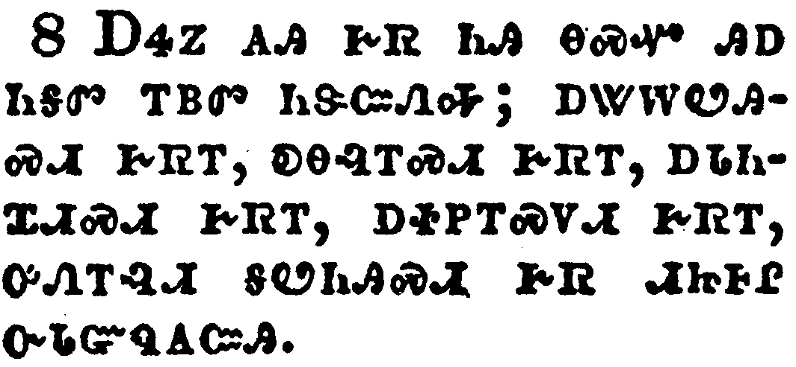</a></td>
</tr>
<tr class="even">
<td>But now ye also put off all these; anger, wrath, malice, blasphemy, filthy communication out of your mouth.</td>
</tr>
<tr class="odd">
<td>ᎠᏎᏃ ᎪᎯ ᎨᏒ ᏂᎯ ᎾᏍᏉ ᎯᎠ ᏂᎦᏛ ᎢᏴᏛ ᏂᏕᏨᏁᎭ; ᎠᏔᎳᏬᎯᏍᏗ ᎨᏒᎢ, ᎧᎾᎸᎢᏍᏗ ᎨᏒᎢ, ᎠᏓᏂᏆᏗᏍᏗ ᎨᏒᎢ, ᎠᏐᏢᎢᏍᏙᏗ ᎨᏒᎢ, ᎤᏁᎢᎸᏗ ᎦᏬᏂᎯᏍᏗ ᎨᏒ ᏗᏥᎰᎵ ᏅᏓᏳᏄᎪᏨᎯ.</td>
</tr>
<tr class="even">
<td>A-se-no go-hi ge-sv ni-hi na-s-quo hi-a ni-ga-dv i-yv-dv ni-de-tsv-ne-ha; a-ta-la-wo-hi-s-di ge-sv-i, ka-na-lv-i-s-di ge-sv-i, a-da-ni-qua-di-s-di ge-sv-i, a-so-tlv-i-s-do-di ge-sv-i, u-ne-i-lv-di ga-wo-ni-hi-s-di ge-sv di-tsi-ho-li nv-da-yu-nu-go-tsv-hi.</td>
</tr>
</tbody>
</table>

<table>
<tbody>
<tr class="odd">
<td><a href="120309.png">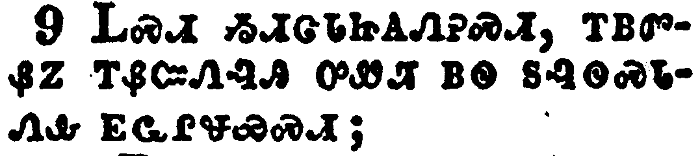</a></td>
</tr>
<tr class="even">
<td>Lie not one to another, seeing that ye have put off the old man with his deeds;</td>
</tr>
<tr class="odd">
<td>ᏞᏍᏗ ᏱᏗᏣᏓᏥᎪᏁᎮᏍᏗ, ᎢᏴᏛᏰᏃ ᎢᏰᏨᏁᎸᎯ ᎤᏪᏘ ᏴᏫ ᏚᎸᏫᏍᏓᏁᎲ ᎬᏩᎵᏠᏯᏍᏗ;</td>
</tr>
<tr class="even">
<td>Tle-s-di yi-di-tsa-da-tsi-go-ne-he-s-di, i-yv-dv-ye-no i-ye-tsv-ne-lv-hi u-we-ti yv-wi du-lv-wi-s-da-ne-hv gv-wa-li-tlo-ya-s-di;</td>
</tr>
</tbody>
</table>

<table>
<tbody>
<tr class="odd">
<td><a href="120310.png">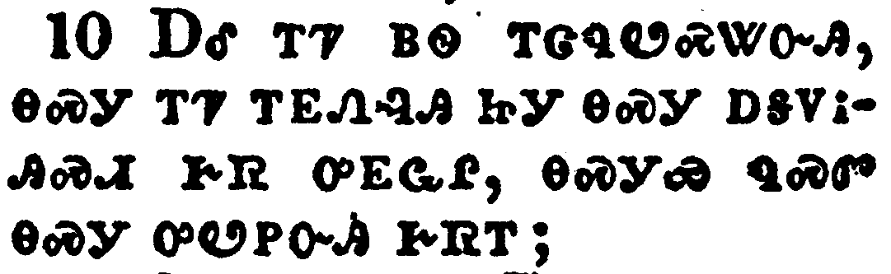</a></td>
</tr>
<tr class="even">
<td>And have put on the new man, which is renewed in knowledge after the image of him that created him:</td>
</tr>
<tr class="odd">
<td>ᎠᎴ ᎢᏤ ᏴᏫ ᎢᏣᏄᏬᏍᏔᏅᎯ, ᎾᏍᎩ ᎢᏤ ᎢᎬᏁᎸᎯ ᏥᎩ ᎾᏍᎩ ᎠᎦᏙᎥᎯᏍᏗ ᎨᏒ ᎤᎬᏩᎵ, ᎾᏍᎩᏯ ᏄᏍᏛ ᎾᏍᎩ ᎤᏬᏢᏅᎯ ᎨᏒᎢ;</td>
</tr>
<tr class="even">
<td>A-le i-tse yv-wi i-tsa-nu-wo-s-ta-nv-hi, na-s-gi i-tse i-gv-ne-lv-hi tsi-gi na-s-gi a-ga-do-v-hi-s-di ge-sv u-gv-wa-li, na-s-gi-ya nu-s-dv na-s-gi u-wo-tlv-nv-hi ge-sv-i;</td>
</tr>
</tbody>
</table>

<table>
<tbody>
<tr class="odd">
<td><a href="120311.png">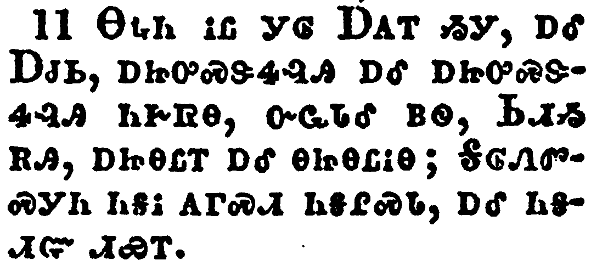</a></td>
</tr>
<tr class="even">
<td>Where there is neither Greek nor Jew, circumcision nor uncircumcision, Barbarian, Scythian, bond nor free: but Christ is all, and in all.</td>
</tr>
<tr class="odd">
<td>ᎾᎿᎭᏂ ᎥᏝ ᎩᎶ ᎠᎪᎢ ᏱᎩ, ᎠᎴ ᎠᏧᏏ, ᎠᏥᎤᏍᏕᏎᎸᎯ ᎠᎴ ᎠᏥᎤᏍᏕᏎᎸᎯ ᏂᎨᏒᎾ, ᏅᏩᏓᎴ ᏴᏫ, ᏏᏗᏱ ᎡᎯ, ᎠᏥᎾᏝᎢ ᎠᎴ ᎾᏥᎾᏝᎥᎾ; ᎦᎶᏁᏛᏍᎩᏂ ᏂᎦᎥ ᎪᎱᏍᏗ ᏂᎦᎵᏍᏓ, ᎠᎴ ᏂᎦᏗᏳ ᏗᏯᎢ.</td>
</tr>
<tr class="even">
<td>Na-hna-ni v-tla gi-lo A-go-i yi-gi, a-le A-tsu-si, a-tsi-u-s-de-se-lv-hi a-le a-tsi-u-s-de-se-lv-hi ni-ge-sv-na, nv-wa-da-le yv-wi, Si-di-yi e-hi, a-tsi-na-tla-i a-le na-tsi-na-tla-v-na; Ga-lo-ne-dv-s-gi-ni ni-ga-v go-hu-s-di ni-ga-li-s-da, a-le ni-ga-di-yu di-ya-i.</td>
</tr>
</tbody>
</table>

<table>
<tbody>
<tr class="odd">
<td><a href="120312.png">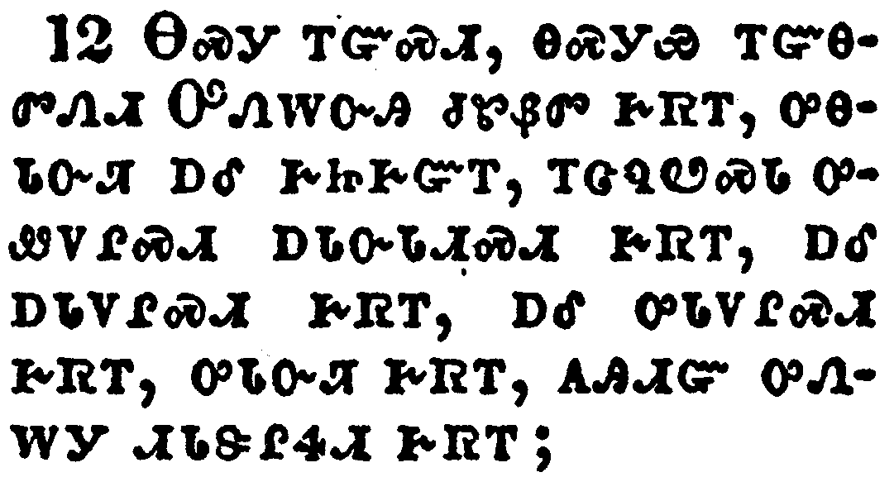</a></td>
</tr>
<tr class="even">
<td>Put on therefore, as the elect of God, holy and beloved, bowels of mercies, kindness, humbleness of mind, meekness, longsuffering;</td>
</tr>
<tr class="odd">
<td>ᎾᏍᎩ ᎢᏳᏍᏗ, ᎾᏍᎩᏯ ᎢᏳᎾᏛᏁᏗ ᎤᏁᎳᏅᎯ ᏧᏑᏰᏛ ᎨᏒᎢ, ᎤᎾᏓᏅᏘ ᎠᎴ ᎨᏥᎨᏳᎢ, ᎢᏣᏄᏬᏍᏓ ᎤᏪᏙᎵᏍᏗ ᎠᏓᏅᏓᏗᏍᏗ ᎨᏒᎢ, ᎠᎴ ᎠᏓᏙᎵᏍᏗ ᎨᏒᎢ, ᎠᎴ ᎤᏓᏙᎵᏍᏗ ᎨᏒᎢ, ᎤᏓᏅᏘ ᎨᏒᎢ, ᎪᎯᏗᏳ ᎤᏁᎳᎩ ᏗᏓᏕᎵᏎᏗ ᎨᏒᎢ;</td>
</tr>
<tr class="even">
<td>Na-s-gi i-yu-s-di, na-s-gi-ya i-yu-na-dv-ne-di U-ne-la-nv-hi tsu-su-ye-dv ge-sv-i, u-na-da-nv-ti a-le ge-tsi-ge-yu-i, i-tsa-nu-wo-s-da u-we-do-li-s-di a-da-nv-da-di-s-di ge-sv-i, a-le a-da-do-li-s-di ge-sv-i, a-le u-da-do-li-s-di ge-sv-i, u-da-nv-ti ge-sv-i, go-hi-di-yu u-ne-la-gi di-da-de-li-se-di ge-sv-i;</td>
</tr>
</tbody>
</table>

<table>
<tbody>
<tr class="odd">
<td><a href="120313.png">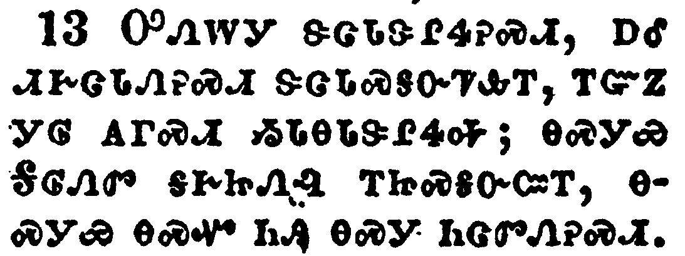</a></td>
</tr>
<tr class="even">
<td>Forbearing one another, and forgiving one another, if any man have a quarrel against any: even as Christ forgave you, so also do ye.</td>
</tr>
<tr class="odd">
<td>ᎤᏁᎳᎩ ᏕᏣᏓᏕᎵᏎᎮᏍᏗ, ᎠᎴ ᏗᎨᏣᏓᏁᎮᏍᏗ ᏕᏣᏓᏍᎦᏅᏤᎲᎢ, ᎢᏳᏃ ᎩᎶ ᎪᎱᏍᏗ ᏱᏓᎾᏓᏕᎵᏎᎭ; ᎾᏍᎩᏯ ᎦᎶᏁᏛ ᎦᎨᏥᏁᎸ ᎢᏥᏍᎦᏅᏨᎢ, ᎾᏍᎩᏯ ᎾᏍᏉ ᏂᎯ ᎾᏍᎩ ᏂᏣᏛᏁᎮᏍᏗ.</td>
</tr>
<tr class="even">
<td>U-ne-la-gi de-tsa-da-de-li-se-he-s-di, a-le di-ge-tsa-da-ne-he-s-di de-tsa-da-s-ga-nv-tse-hv-i, i-yu-no gi-lo go-hu-s-di yi-da-na-da-de-li-se-ha; na-s-gi-ya Ga-lo-ne-dv ga-ge-tsi-ne-lv i-tsi-s-ga-nv-tsv-i, na-s-gi-ya na-s-quo ni-hi na-s-gi ni-tsa-dv-ne-he-s-di.</td>
</tr>
</tbody>
</table>

<table>
<tbody>
<tr class="odd">
<td><a href="120314.png">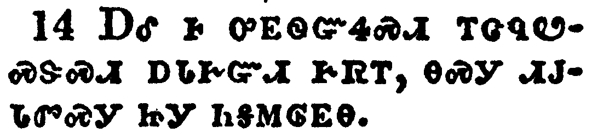</a></td>
</tr>
<tr class="even">
<td>And above all these things put on charity, which is the bond of perfectness.</td>
</tr>
<tr class="odd">
<td>ᎠᎴ Ꮀ ᎤᎬᏫᏳᏎᏍᏗ ᎢᏣᏄᏬᏍᏕᏍᏗ ᎠᏓᎨᏳᏗ ᎨᏒᎢ, ᎾᏍᎩ ᏗᎫᏓᏛᏍᎩ ᏥᎩ ᏂᎦᎷᎶᎬᎾ.</td>
</tr>
<tr class="even">
<td>A-le ho u-gv-wi-yu-se-s-di i-tsa-nu-wo-s-de-s-di a-da-ge-yu-di ge-sv-i, na-s-gi di-gu-da-dv-s-gi tsi-gi ni-ga-lu-lo-gv-na.</td>
</tr>
</tbody>
</table>

<table>
<tbody>
<tr class="odd">
<td><a href="120315.png">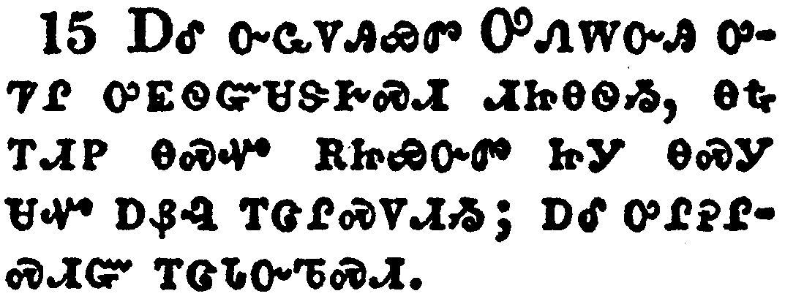</a></td>
</tr>
<tr class="even">
<td>And let the peace of God rule in your hearts, to the which also ye are called in one body; and be ye thankful.</td>
</tr>
<tr class="odd">
<td>ᎠᎴ ᏅᏩᏙᎯᏯᏛ ᎤᏁᎳᏅᎯ ᎤᏤᎵ ᎤᎬᏫᏳᏌᏕᎨᏍᏗ ᏗᏥᎾᏫᏱ, ᎾᎿᎭᎢᏗᏢ ᎾᏍᏉ ᎡᏥᏯᏅᏛ ᏥᎩ ᎾᏍᎩ ᏌᏉ ᎠᏰᎸ ᎢᏣᎵᏍᏙᏗᏱ; ᎠᎴ ᎤᎵᎮᎵᏍᏗᏳ ᎢᏣᏓᏅᏖᏍᏗ.</td>
</tr>
<tr class="even">
<td>A-le nv-wa-do-hi-ya-dv U-ne-la-nv-hi u-tse-li u-gv-wi-yu-sa-de-ge-s-di di-tsi-na-wi-yi, na-hna i-di-tlv na-s-quo e-tsi-ya-nv-dv tsi-gi na-s-gi sa-quo a-ye-lv i-tsa-li-s-do-di-yi; a-le u-li-he-li-s-di-yu i-tsa-da-nv-te-s-di.</td>
</tr>
</tbody>
</table>

<table>
<tbody>
<tr class="odd">
<td><a href="120316.png">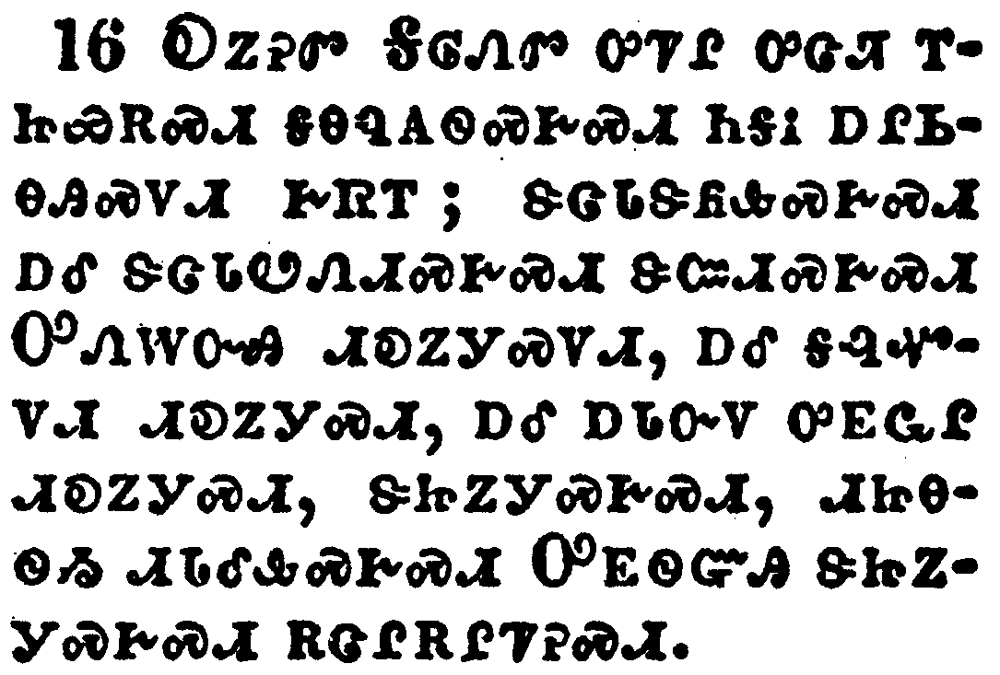</a></td>
</tr>
<tr class="even">
<td>Let the word of Christ dwell in you richly in all wisdom; teaching and admonishing one another in psalms and hymns and spiritual songs, singing with grace in your hearts to the Lord.</td>
</tr>
<tr class="odd">
<td>ᎧᏃᎮᏛ ᎦᎶᏁᏛ ᎤᏤᎵ ᎤᏣᏘ ᎢᏥᏯᎡᏍᏗ ᎦᎾᏄᎪᏫᏍᎨᏍᏗ ᏂᎦᎥ ᎠᎵᏏᎾᎯᏍᏙᏗ ᎨᏒᎢ; ᏕᏣᏓᏕᏲᎲᏍᎨᏍᏗ ᎠᎴ ᏕᏣᏓᏬᏁᏗᏍᎨᏍᏗ ᏕᏨᏗᏍᎨᏍᏗ ᎤᏁᎳᏅᎯ ᏗᎧᏃᎩᏍᏙᏗ, ᎠᎴ ᎦᎸᏉᏙᏗ ᏗᎧᏃᎩᏍᏗ, ᎠᎴ ᎠᏓᏅᏙ ᎤᎬᏩᎵ ᏗᎧᏃᎩᏍᏗ, ᏕᏥᏃᎩᏍᎨᏍᏗ, ᏗᏥᎾᏫᏱ ᏗᏓᎴᎲᏍᎨᏍᏗ ᎤᎬᏫᏳᎯ ᏕᏥᏃᎩᏍᎨᏍᏗ ᎡᏣᎵᎡᎵᏤᎮᏍᏗ.</td>
</tr>
<tr class="even">
<td>Ka-no-he-dv Ga-lo-ne-dv u-tse-li u-tsa-ti i-tsi-ya-e-s-di ga-na-nu-go-wi-s-ge-s-di ni-ga-v a-li-si-na-hi-s-do-di ge-sv-i; de-tsa-da-de-yo-hv-s-ge-s-di a-le de-tsa-da-wo-ne-di-s-ge-s-di de-tsv-di-s-ge-s-di U-ne-la-nv-hi di-ka-no-gi-s-do-di, a-le ga-lv-quo-do-di di-ka-no-gi-s-di, a-le a-da-nv-do u-gv-wa-li di-ka-no-gi-s-di, de-tsi-no-gi-s-ge-s-di, di-tsi-na-wi-yi di-da-le-hv-s-ge-s-di U-gv-wi-yu-hi de-tsi-no-gi-s-ge-s-di e-tsa-li-e-li-tse-he-s-di.</td>
</tr>
</tbody>
</table>

<table>
<tbody>
<tr class="odd">
<td></td>
</tr>
<tr class="even">
<td>And whatsoever ye do in word or deed, do all in the name of the Lord Jesus, giving thanks to God and the Father by him.</td>
</tr>
<tr class="odd">
<td>ᎠᎴ ᏂᎦᎥ ᏂᏣᏛᏁᎵᏙᎲᎢ, ᎢᏥᏬᏂᏍᎬ ᎠᎴ ᏕᏥᎸᏫᏍᏓᏁᎲ ᏱᎩ, ᏂᎦᎥ ᎤᎬᏫᏳᎯ ᏥᏌ ᎦᏙᎥ ᎢᏨᏗᏍᎨᏍᏗ, ᎡᏣᎵᎡᎵᏤᎮᏍᏗ ᎤᏁᎳᏅᎯ ᎾᏍᎩ ᎠᎦᏴᎵᎨᎢ, ᎾᏍᎩ ᏅᏗᎦᎵᏍᏙᏗᏍᎨᏍᏗ.</td>
</tr>
<tr class="even">
<td>A-le ni-ga-v ni-tsa-dv-ne-li-do-hv-i, i-tsi-wo-ni-s-gv a-le de-tsi-lv-wi-s-da-ne-hv yi-gi, ni-ga-v U-gv-wi-yu-hi Tsi-sa ga-do-v i-tsv-di-s-ge-s-di, e-tsa-li-e-li-tse-he-s-di U-ne-la-nv-hi na-s-gi A-ga-yv-li-ge-i, na-s-gi nv-di-ga-li-s-do-di-s-ge-s-di.</td>
</tr>
</tbody>
</table>

<table>
<tbody>
<tr class="odd">
<td><a href="120318.png">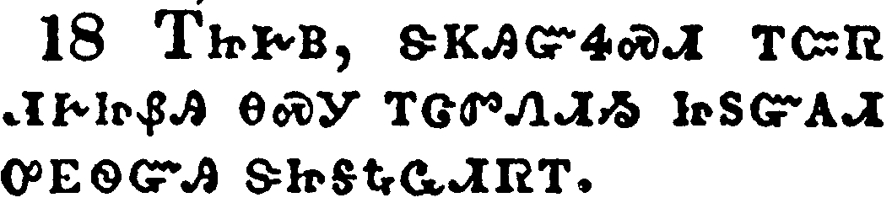</a></td>
</tr>
<tr class="even">
<td>Wives, submit yourselves unto your own husbands, as it is fit in the Lord.</td>
</tr>
<tr class="odd">
<td>ᎢᏥᎨᏴ, ᏕᏦᎯᏳᏎᏍᏗ ᎢᏨᏒ ᏗᎨᏥᏰᎯ ᎾᏍᎩ ᎢᏨᏛᏁᏗᏱ ᏥᏚᏳᎪᏗ ᎤᎬᏫᏳᎯ ᏕᏥᎦᎿᎭᏩᏗᏒᎢ.</td>
</tr>
<tr class="even">
<td>I-tsi-ge-yv, de-tso-hi-yu-se-s-di i-tsv-sv di-ge-tsi-ye-hi na-s-gi i-tsv-dv-ne-di-yi tsi-du-yu-go-di u-gv-wi-yu-hi de-tsi-ga-hna-wa-di-sv-i.</td>
</tr>
</tbody>
</table>

<table>
<tbody>
<tr class="odd">
<td><a href="120319.png">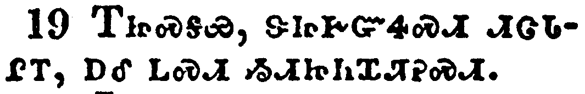</a></td>
</tr>
<tr class="even">
<td>Husbands, love your wives, and be not bitter against them.</td>
</tr>
<tr class="odd">
<td>ᎢᏥᏍᎦᏯ, ᏕᏥᎨᏳᏎᏍᏗ ᏗᏣᏓᎵᎢ, ᎠᎴ ᏞᏍᏗ ᏱᏗᏥᏂᏆᏘᎮᏍᏗ.</td>
</tr>
<tr class="even">
<td>I-tsi-s-ga-ya, de-tsi-ge-yu-se-s-di di-tsa-da-li-i, a-le tle-s-di yi-di-tsi-ni-qua-ti-he-s-di.</td>
</tr>
</tbody>
</table>

<table>
<tbody>
<tr class="odd">
<td><a href="120320.png">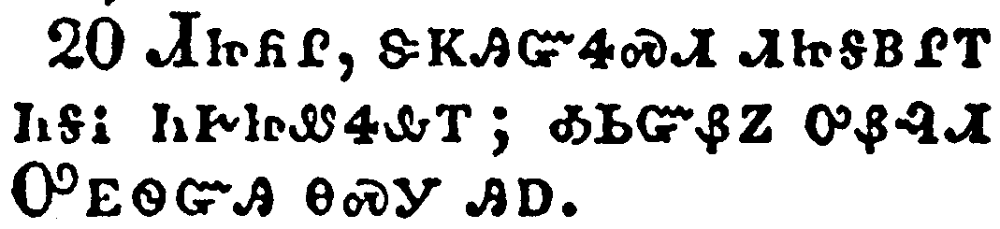</a></td>
</tr>
<tr class="even">
<td>Children, obey your parents in all things: for this is well pleasing unto the Lord.</td>
</tr>
<tr class="odd">
<td>ᏗᏥᏲᎵ, ᏕᏦᎯᏳᏎᏍᏗ ᏗᏥᎦᏴᎵᎢ ᏂᎦᎥ ᏂᎨᏥᏪᏎᎲᎢ; ᎣᏏᏳᏰᏃ ᎤᏰᎸᏗ ᎤᎬᏫᏳᎯ ᎾᏍᎩ ᎯᎠ.</td>
</tr>
<tr class="even">
<td>Di-tsi-yo-li, de-tso-hi-yu-se-s-di di-tsi-ga-yv-li-i ni-ga-v ni-ge-tsi-we-se-hv-i; o-si-yu-ye-no u-ye-lv-di U-gv-wi-yu-hi na-s-gi hi-a.</td>
</tr>
</tbody>
</table>

<table>
<tbody>
<tr class="odd">
<td><a href="120321.png">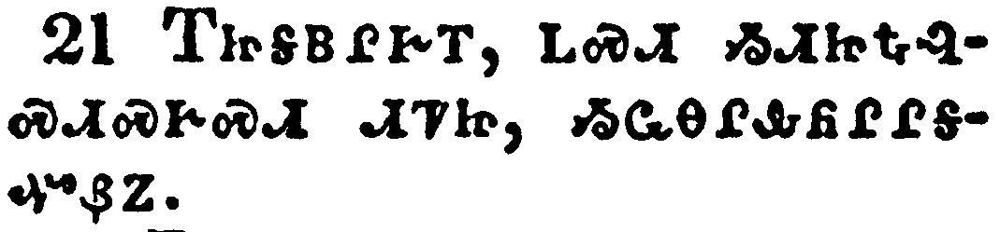</a></td>
</tr>
<tr class="even">
<td>Fathers, provoke not your children to anger, lest they be discouraged.</td>
</tr>
<tr class="odd">
<td>ᎢᏥᎦᏴᎵᎨᎢ, ᏞᏍᏗ ᏱᏗᏥᎿᎭᎸᏍᏗᏍᎨᏍᏗ ᏗᏤᏥ, ᏱᏩᎾᎵᎲᏲᎵᎵᎦᏉᏰᏃ.</td>
</tr>
<tr class="even">
<td>I-tsi-ga-yv-li-ge-i, tle-s-di yi-di-tsi-hna-lv-s-di-s-ge-s-di di-tse-tsi, yi-wa-na-li-hv-yo-li-li-ga-quo-ye-no.</td>
</tr>
</tbody>
</table>

<table>
<tbody>
<tr class="odd">
<td><a href="120322.png">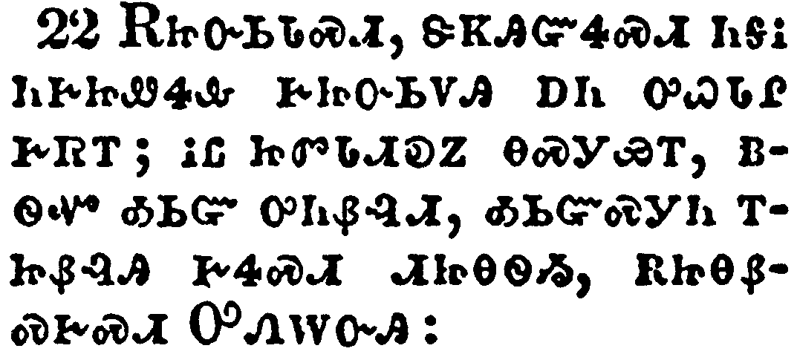</a></td>
</tr>
<tr class="even">
<td>Servants, obey in all things your masters according to the flesh; not with eyeservice, as menpleasers; but in singleness of heart, fearing God:</td>
</tr>
<tr class="odd">
<td>ᎡᏥᏅᏏᏓᏍᏗ, ᏕᏦᎯᏳᏎᏍᏗ ᏂᎦᎥ ᏂᎨᏥᏪᏎᎲ ᎨᏥᏅᏏᏙᎯ ᎠᏂ ᎤᏇᏓᎵ ᎨᏒᎢ; ᎥᏝ ᏥᏛᏓᏗᎧᏃ ᎾᏍᎩᏯᎢ, ᏴᏫᏉ ᎣᏏᏳ ᎤᏂᏰᎸᏗ, ᎣᏏᏳᏍᎩᏂ ᎢᏥᏰᎸᎯ ᎨᏎᏍᏗ ᏗᏥᎾᏫᏱ, ᎡᏥᎾᏰᏍᎨᏍᏗ ᎤᏁᎳᏅᎯ:</td>
</tr>
<tr class="even">
<td>E-tsi-nv-si-da-s-di, de-tso-hi-yu-se-s-di ni-ga-v ni-ge-tsi-we-se-hv ge-tsi-nv-si-do-hi a-ni u-que-da-li ge-sv-i; v-tla tsi-dv-da-di-ka-no na-s-gi-ya-i, yv-wi-quo o-si-yu u-ni-ye-lv-di, o-si-yu-s-gi-ni i-tsi-ye-lv-hi ge-se-s-di di-tsi-na-wi-yi, e-tsi-na-ye-s-ge-s-di U-ne-la-nv-hi:</td>
</tr>
</tbody>
</table>

<table>
<tbody>
<tr class="odd">
<td><a href="120323.png">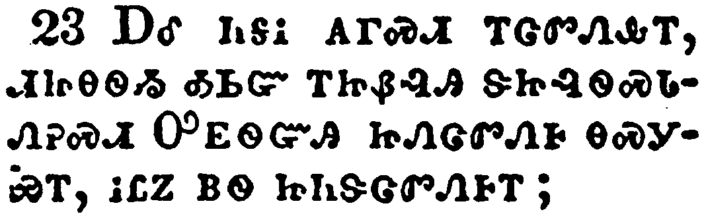</a></td>
</tr>
<tr class="even">
<td>And whatsoever ye do, do it heartily, as to the Lord, and not unto men;</td>
</tr>
<tr class="odd">
<td>ᎠᎴ ᏂᎦᎥ ᎪᎱᏍᏗ ᎢᏣᏛᏁᎲᎢ, ᏗᏥᎾᏫᏱ ᎣᏏᏳ ᎢᏥᏰᎸᎯ ᏕᏥᎸᏫᏍᏓᏁᎮᏍᏗ ᎤᎬᏫᏳᎯ ᏥᏁᏣᏛᏁᎰ ᎾᏍᎩᏯᎢ, ᎥᏝᏃ ᏴᏫ ᏥᏂᏕᏣᏛᏁᎰᎢ;</td>
</tr>
<tr class="even">
<td>A-le ni-ga-v go-hu-s-di i-tsa-dv-ne-hv-i, di-tsi-na-wi-yi o-si-yu i-tsi-ye-lv-hi de-tsi-lv-wi-s-da-ne-he-s-di U-gv-wi-yu-hi tsi-ne-tsa-dv-ne-ho na-s-gi-ya-i, v-tla-no yv-wi tsi-ni-de-tsa-dv-ne-ho-i;</td>
</tr>
</tbody>
</table>

<table>
<tbody>
<tr class="odd">
<td><a href="120324.png">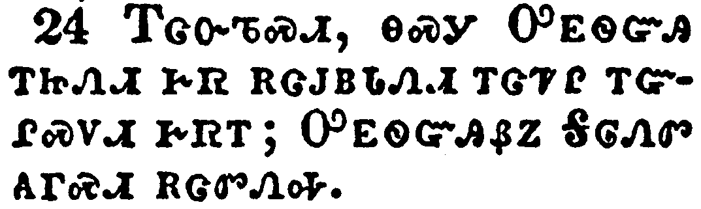</a></td>
</tr>
<tr class="even">
<td>Knowing that of the Lord ye shall receive the reward of the inheritance: for ye serve the Lord Christ.</td>
</tr>
<tr class="odd">
<td>ᎢᏣᏅᏖᏍᏗ, ᎾᏍᎩ ᎤᎬᏫᏳᎯ ᎢᏥᏁᏗ ᎨᏒ ᎡᏣᎫᏴᏓᏁᏗ ᎢᏣᏤᎵ ᎢᏳᎵᏍᏙᏗ ᎨᏒᎢ; ᎤᎬᏫᏳᎯᏰᏃ ᎦᎶᏁᏛ ᎪᎱᏍᏗ ᎡᏣᏛᏁᎭ.</td>
</tr>
<tr class="even">
<td>I-tsa-nv-te-s-di, na-s-gi U-gv-wi-yu-hi i-tsi-ne-di ge-sv e-tsa-gu-yv-da-ne-di i-tsa-tse-li i-yu-li-s-do-di ge-sv-i; U-gv-wi-yu-hi-ye-no ga-lo-ne-dv go-hu-s-di e-tsa-dv-ne-ha.</td>
</tr>
</tbody>
</table>

<table>
<tbody>
<tr class="odd">
<td><a href="120325.png">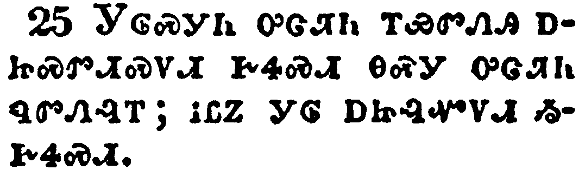</a></td>
</tr>
<tr class="even">
<td>But he that doeth wrong shall receive for the wrong which he hath done: and there is no respect of persons.</td>
</tr>
<tr class="odd">
<td>ᎩᎶᏍᎩᏂ ᎤᏣᏘᏂ ᎢᏯᏛᏁᎯ ᎠᏥᏍᏛᏗᏍᏙᏗ ᎨᏎᏍᏗ ᎾᏍᎩ ᎤᏣᏘᏂ ᏄᏛᏁᎸᎢ; ᎥᏝᏃ ᎩᎶ ᎠᏥᎸᏉᏙᏗ ᏱᎨᏎᏍᏗ.</td>
</tr>
<tr class="even">
<td>Gi-lo-s-gi-ni u-tsa-ti-ni i-ya-dv-ne-hi a-tsi-s-dv-di-s-do-di ge-se-s-di na-s-gi u-tsa-ti-ni nu-dv-ne-lv-i; v-tla-no gi-lo a-tsi-lv-quo-do-di yi-ge-se-s-di.</td>
</tr>
</tbody>
</table>

