+++
draft=false
date = 2014-12-18T21:11:07Z
title = "Galatians - Chapter 3 - Cherokee New Testament"
weight = 1418955067

[taxonomies]

authors = ["Timothy Legg"]
categories = []
tags = []

[extra]
+++

<table>
<tbody>
<tr class="odd">
<td><a href="090301.png">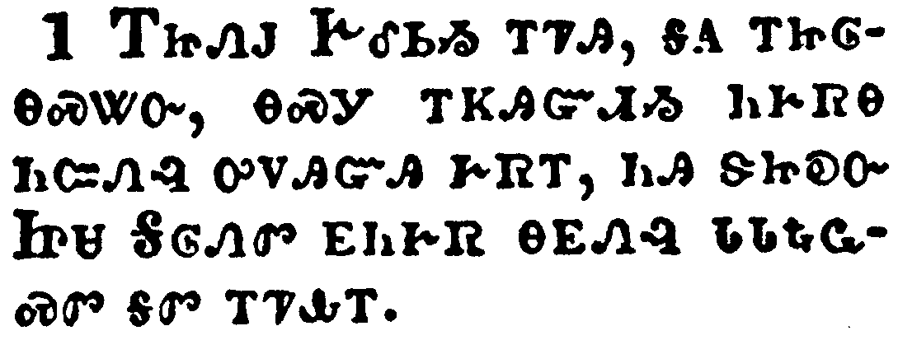</a></td>
</tr>
<tr class="even">
<td>O foolish Galatians, who hath bewitched you, that ye should not obey the truth, before whose eyes Jesus Christ hath been evidently set forth, crucified among you?</td>
</tr>
<tr class="odd">
<td>ᎢᏥᏁᎫ ᎨᎴᏏᏱ ᎢᏤᎯ, ᎦᎪ ᎢᏥᎶᎾᏍᏔᏅ, ᎾᏍᎩ ᎢᏦᎯᏳᏗᏱ ᏂᎨᏒᎾ ᏂᏨᏁᎸ ᎤᏙᎯᏳᎯ ᎨᏒᎢ, ᏂᎯ ᏕᏥᎧᏅ ᏥᏌ ᎦᎶᏁᏛ ᎬᏂᎨᏒ ᎾᎬᏁᎸ ᏓᏓᎿᎭᏩᏍᏛ ᎦᏛ ᎢᏤᎲᎢ.</td>
</tr>
<tr class="even">
<td>I-tsi-ne-gu Ge-le-si-yi i-tse-hi, ga-go i-tsi-lo-na-s-ta-nv, na-s-gi i-tso-hi-yu-di-yi ni-ge-sv-na ni-tsv-ne-lv u-do-hi-yu-hi ge-sv-i, ni-hi de-tsi-ka-nv Tsi-sa Ga-lo-ne-dv gv-ni-ge-sv na-gv-ne-lv da-da-hna-wa-s-dv ga-dv i-tse-hv-i.</td>
</tr>
</tbody>
</table>

<table>
<tbody>
<tr class="odd">
<td><a href="090302.png">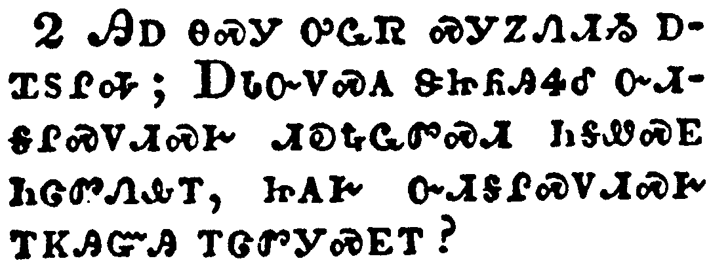</a></td>
</tr>
<tr class="even">
<td>This only would I learn of you, Received ye the Spirit by the works of the law, or by the hearing of faith?</td>
</tr>
<tr class="odd">
<td>ᎯᎠ ᎾᏍᎩ ᎤᏩᏒ ᏍᎩᏃᏁᏗᏱ ᎠᏆᏚᎵᎭ; ᎠᏓᏅᏙᏍᎪ ᏕᏥᏲᎯᏎᎴ ᏅᏗᎦᎵᏍᏙᏗᏍᎨ ᏗᎧᎿᎭᏩᏛᏍᏗ ᏂᎦᏪᏍᎬ ᏂᏣᏛᏁᎲᎢ, ᏥᎪᎨ ᏅᏗᎦᎵᏍᏙᏗᏍᎨ ᎢᏦᎯᏳᎯ ᎢᏣᏛᎩᏍᎬᎢ?</td>
</tr>
<tr class="even">
<td>Hi-a na-s-gi u-wa-sv s-gi-no-ne-di-yi a-qua-du-li-ha; A-da-nv-do-s-go de-tsi-yo-hi-se-le nv-di-ga-li-s-do-di-s-ge di-ka-hna-wa-dv-s-di ni-ga-we-s-gv ni-tsa-dv-ne-hv-i, tsi-go-ge nv-di-ga-li-s-do-di-s-ge i-tso-hi-yu-hi i-tsa-dv-gi-s-gv-i?</td>
</tr>
</tbody>
</table>

<table>
<tbody>
<tr class="odd">
<td><a href="090303.png">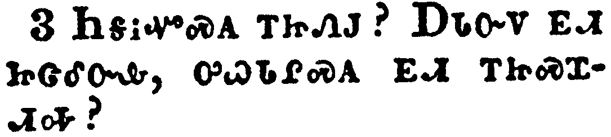</a></td>
</tr>
<tr class="even">
<td>Are ye so foolish? having begun in the Spirit, are ye now made perfect by the flesh?</td>
</tr>
<tr class="odd">
<td>ᏂᎦᎥᏉᏍᎪ ᎢᏥᏁᎫ? ᎠᏓᏅᏙ ᎬᏗ ᏥᏣᎴᏅᎲ, ᎤᏇᏓᎵᏍᎪ ᎬᏗ ᎢᏥᏍᏆᏗᎭ?</td>
</tr>
<tr class="even">
<td>Ni-ga-v-quo-s-go i-tsi-ne-gu? A-da-nv-do gv-di tsi-tsa-le-nv-hv, u-que-da-li-s-go gv-di i-tsi-s-qua-di-ha?</td>
</tr>
</tbody>
</table>

<table>
<tbody>
<tr class="odd">
<td><a href="090304.png">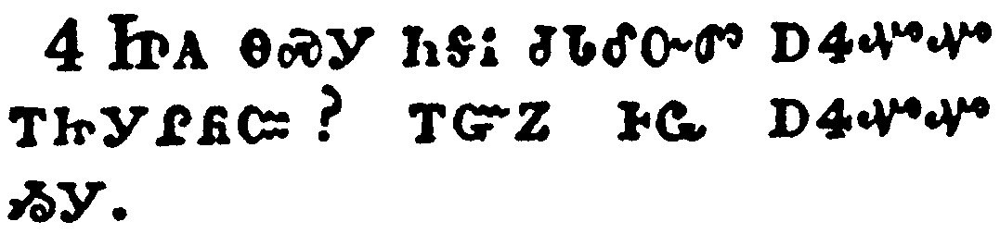</a></td>
</tr>
<tr class="even">
<td>Have ye suffered so many things in vain? if it be yet in vain.</td>
</tr>
<tr class="odd">
<td>ᏥᎪ ᎾᏍᎩ ᏂᎦᎥ ᏧᏓᎴᏅᏛ ᎠᏎᏉᏉ ᎢᏥᎩᎵᏲᏨ? ᎢᏳᏃ ᎰᏩ ᎠᏎᏉᏉ ᏱᎩ.</td>
</tr>
<tr class="even">
<td>Tsi-go na-s-gi ni-ga-v tsu-da-le-nv-dv a-se-quo-quo i-tsi-gi-li-yo-tsv? i-yu-no ho-wa a-se-quo-quo yi-gi.</td>
</tr>
</tbody>
</table>

<table>
<tbody>
<tr class="odd">
<td><a href="090305.png">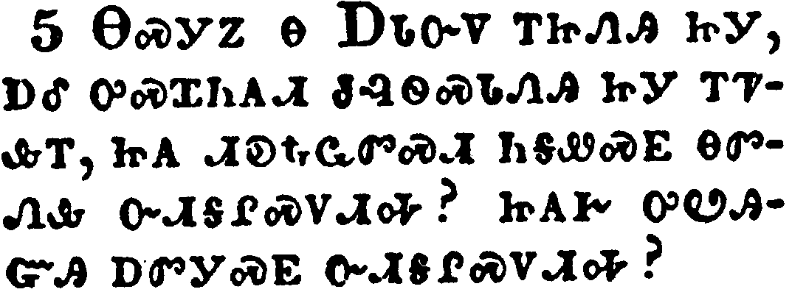</a></td>
</tr>
<tr class="even">
<td>He therefore that ministereth to you the Spirit, and worketh miracles among you, doeth he it by the works of the law, or by the hearing of faith?</td>
</tr>
<tr class="odd">
<td>ᎾᏍᎩᏃ Ꮎ ᎠᏓᏅᏙ ᎢᏥᏁᎯ ᏥᎩ, ᎠᎴ ᎤᏍᏆᏂᎪᏗ ᏧᎸᏫᏍᏓᏁᎯ ᏥᎩ ᎢᏤᎲᎢ, ᏥᎪ ᏗᎧᎿᎭᏩᏛᏍᏗ ᏂᎦᏪᏍᎬ ᎾᏛᏁᎲ ᏅᏗᎦᎵᏍᏙᏗᎭ? ᏥᎪᎨ ᎤᏬᎯᏳᎯ ᎠᏛᎩᏍᎬ ᏅᏗᎦᎵᏍᏙᏗᎭ?</td>
</tr>
<tr class="even">
<td>Na-s-gi-no na A-da-nv-do i-tsi-ne-hi tsi-gi, a-le u-s-qua-ni-go-di tsu-lv-wi-s-da-ne-hi tsi-gi i-tse-hv-i, tsi-go di-ka-hna-wa-dv-s-di ni-ga-we-s-gv na-dv-ne-hv nv-di-ga-li-s-do-di-ha? tsi-go-ge u-wo-hi-yu-hi a-dv-gi-s-gv nv-di-ga-li-s-do-di-ha?</td>
</tr>
</tbody>
</table>

<table>
<tbody>
<tr class="odd">
<td><a href="090306.png">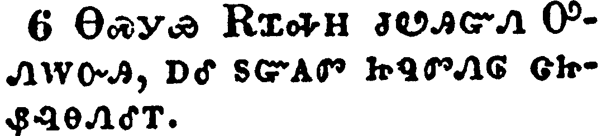</a></td>
</tr>
<tr class="even">
<td>Even as Abraham believed God, and it was accounted to him for righteousness.</td>
</tr>
<tr class="odd">
<td>ᎾᏍᎩᏯ ᎡᏆᎭᎻ ᏧᏬᎯᏳᏁ ᎤᏁᎳᏅᎯ, ᎠᎴ ᏚᏳᎪᏛ ᏥᏄᏛᏁᎶ ᏣᏥᏰᎸᎾᏁᎴᎢ.</td>
</tr>
<tr class="even">
<td>Na-s-gi-ya E-qua-ha-mi tsu-wo-hi-yu-ne U-ne-la-nv-hi, a-le du-yu-go-dv tsi-nu-dv-ne-lo tsa-tsi-ye-lv-na-ne-le-i.</td>
</tr>
</tbody>
</table>

<table>
<tbody>
<tr class="odd">
<td><a href="090307.png">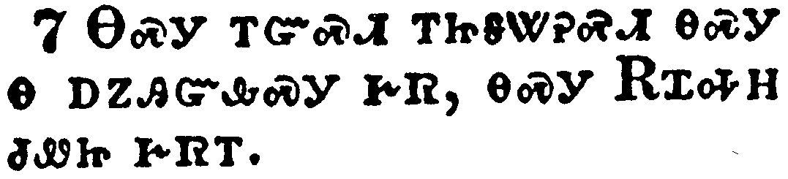</a></td>
</tr>
<tr class="even">
<td>Know ye therefore that they which are of faith, the same are the children of Abraham.</td>
</tr>
<tr class="odd">
<td>ᎾᏍᎩ ᎢᏳᏍᏗ ᎢᏥᎦᏔᎮᏍᏗ ᎾᏍᎩ Ꮎ ᎠᏃᎯᏳᎲᏍᎩ ᎨᏒ, ᎾᏍᎩ ᎡᏆᎭᎻ ᏧᏪᏥ ᎨᏒᎢ.</td>
</tr>
<tr class="even">
<td>Na-s-gi i-yu-s-di i-tsi-ga-ta-he-s-di na-s-gi na a-no-hi-yu-hv-s-gi ge-sv, na-s-gi E-qua-ha-mi tsu-we-tsi ge-sv-i.</td>
</tr>
</tbody>
</table>

<table>
<tbody>
<tr class="odd">
<td><a href="090308.png">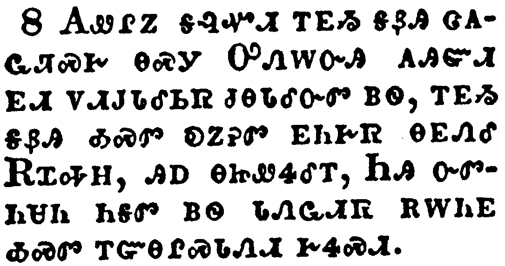</a></td>
</tr>
<tr class="even">
<td>And the scripture, foreseeing that God would justify the heathen through faith, preached before the gospel unto Abraham, saying, In thee shall all nations be blessed.</td>
</tr>
<tr class="odd">
<td>ᎪᏪᎵᏃ ᎦᎸᏉᏗ ᎢᎬᏱ ᎦᏰᎯ ᏣᎪᏩᏘᏍᎨ ᎾᏍᎩ ᎤᏁᎳᏅᎯ ᎪᎯᏳᏗ ᎬᏗ ᏙᏗᎫᏓᎴᏏᏒ ᏧᎾᏓᎴᏅᏛ ᏴᏫ, ᎢᎬᏱ ᎦᏰᎯ ᎣᏍᏛ ᎧᏃᎮᏛ ᎬᏂᎨᏒ ᎾᎬᏁᎴ ᎡᏆᎭᎻ, ᎯᎠ ᎾᏥᏪᏎᎴᎢ, ᏂᎯ ᏅᏛᏂᏌᏂ ᏂᎦᏛ ᏴᏫ ᏓᏁᏩᏗᏒ ᎡᎳᏂᎬ ᎣᏍᏛ ᎢᏳᎾᎵᏍᏓᏁᏗ ᎨᏎᏍᏗ.</td>
</tr>
<tr class="even">
<td>Go-we-li-no ga-lv-quo-di i-gv-yi ga-ye-hi tsa-go-wa-ti-s-ge na-s-gi U-ne-la-nv-hi go-hi-yu-di gv-di do-di-gu-da-le-si-sv tsu-na-da-le-nv-dv yv-wi, i-gv-yi ga-ye-hi o-s-dv ka-no-he-dv gv-ni-ge-sv na-gv-ne-le E-qua-ha-mi, hi-a na-tsi-we-se-le-i, Ni-hi nv-dv-ni-sa-ni ni-ga-dv yv-wi da-ne-wa-di-sv e-la-ni-gv o-s-dv i-yu-na-li-s-da-ne-di ge-se-s-di.</td>
</tr>
</tbody>
</table>

<table>
<tbody>
<tr class="odd">
<td></td>
</tr>
<tr class="even">
<td>So then they which be of faith are blessed with faithful Abraham.</td>
</tr>
<tr class="odd">
<td>ᎰᏩᏃ ᎾᏍᎩ ᎠᏃᎯᏳᎲᏍᎩ ᎨᏒ ᎣᏍᏛ ᏄᎾᎵᏍᏓᏁᎰ ᎨᎦᏠᏯᏍᏗᏍᎪ ᎣᏍᏛ ᏄᎵᏍᏓᏁᎸ ᎤᏬᎯᏳᎯᏍᏗ ᎡᏆᎭᎻ.</td>
</tr>
<tr class="even">
<td>Ho-wa-no na-s-gi a-no-hi-yu-hv-s-gi ge-sv o-s-dv nu-na-li-s-da-ne-ho ge-ga-tlo-ya-s-di-s-go o-s-dv nu-li-s-da-ne-lv u-wo-hi-yu-hi-s-di E-qua-ha-mi.</td>
</tr>
</tbody>
</table>

<table>
<tbody>
<tr class="odd">
<td><a href="090310.png">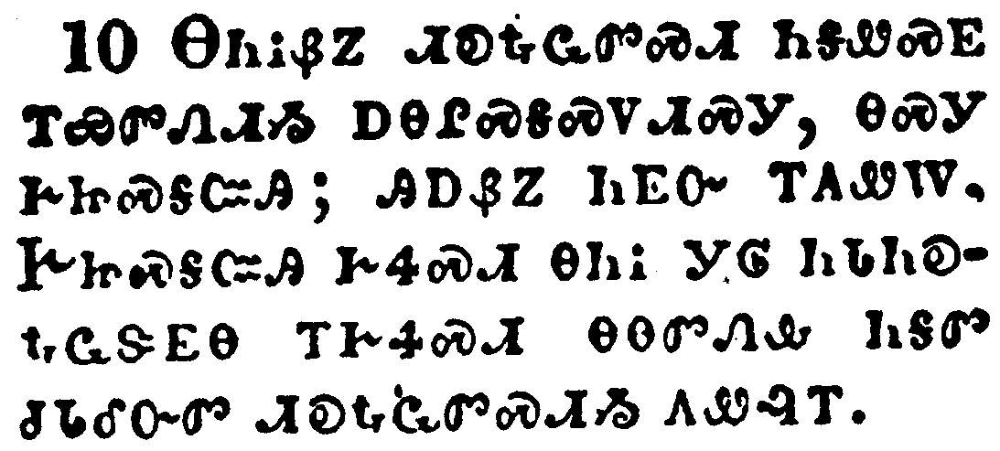</a></td>
</tr>
<tr class="even">
<td>For as many as are of the works of the law are under the curse: for it is written, Cursed is every one that continueth not in all things which are written in the book of the law to do them.</td>
</tr>
<tr class="odd">
<td>ᎾᏂᎥᏰᏃ ᏗᎧᎿᎭᏩᏛᏍᏗ ᏂᎦᏪᏍᎬ ᎢᏯᏛᏁᏗᏱ ᎠᎾᎵᏍᎦᏍᏙᏗᏍᎩ, ᎾᏍᎩ ᎨᏥᏍᎦᏨᎯ; ᎯᎠᏰᏃ ᏂᎬᏅ ᎢᎬᏪᎳ, ᎨᏥᏍᎦᏨᎯ ᎨᏎᏍᏗ ᎾᏂᎥ ᎩᎶ ᏂᏓᏂᎧᎿᎭᏩᏕᎬᎾ ᎢᎨᏎᏍᏗ ᎾᎾᏛᏁᎲ ᏂᎦᏛ ᏧᏓᎴᏅᏛ ᏗᎧᎿᎭᏩᏛᏍᏗᏱ ᎪᏪᎸᎢ.</td>
</tr>
<tr class="even">
<td>Na-ni-v-ye-no di-ka-hna-wa-dv-s-di ni-ga-we-s-gv i-ya-dv-ne-di-yi a-na-li-s-ga-s-do-di-s-gi, na-s-gi ge-tsi-s-ga-tsv-hi; hi-a-ye-no ni-gv-nv i-gv-we-la, Ge-tsi-s-ga-tsv-hi ge-se-s-di na-ni-v gi-lo ni-da-ni-ka-hna-wa-de-gv-na i-ge-se-s-di na-na-dv-ne-hv ni-ga-dv tsu-da-le-nv-dv di-ka-hna-wa-dv-s-di-yi go-we-lv-i.</td>
</tr>
</tbody>
</table>

<table>
<tbody>
<tr class="odd">
<td><a href="090311.png">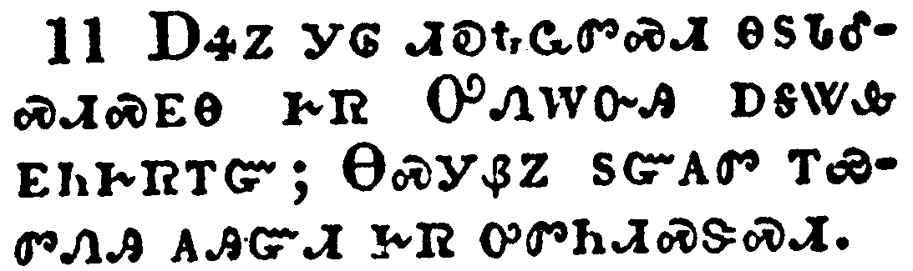</a></td>
</tr>
<tr class="even">
<td>But that no man is justified by the law in the sight of God, it is evident: for, The just shall live by faith.</td>
</tr>
<tr class="odd">
<td>ᎠᏎᏃ ᎩᎶ ᏗᎧᎿᎭᏩᏛᏍᏗ ᎾᏚᏓᎴᏍᏗᏍᎬᎾ ᎨᏒ ᎤᏁᎳᏅᎯ ᎠᎦᏔᎲ ᎬᏂᎨᏒᎢᏳ; ᎾᏍᎩᏰᏃ ᏚᏳᎪᏛ ᎢᏯᏛᏁᎯ ᎪᎯᏳᏗ ᎨᏒ ᎤᏛᏂᏗᏍᏕᏍᏗ.</td>
</tr>
<tr class="even">
<td>A-se-no gi-lo di-ka-hna-wa-dv-s-di na-du-da-le-s-di-s-gv-na ge-sv U-ne-la-nv-hi a-ga-ta-hv gv-ni-ge-sv-i-yu; Na-s-gi-ye-no du-yu-go-dv i-ya-dv-ne-hi go-hi-yu-di ge-sv u-dv-ni-di-s-de-s-di.</td>
</tr>
</tbody>
</table>

<table>
<tbody>
<tr class="odd">
<td></td>
</tr>
<tr class="even">
<td>And the law is not of faith: but, The man that doeth them shall live in them.</td>
</tr>
<tr class="odd">
<td>ᏗᎧᎿᎭᏩᏛᏍᏗᏰᏃ ᎥᏝ ᎪᎯᏳᏗ ᎨᏒ ᎠᎵᏍᏕᎸᏙᏗ ᏱᏂᎬᏁᎭ; ᎯᎠᏍᎩᏂ, ᎩᎶ ᏴᏫ ᎾᏍᎩ ᎾᏛᏁᎮᏍᏗ ᎾᏍᎩ ᎤᏛᏂᏗᏍᏕᏍᏗ.</td>
</tr>
<tr class="even">
<td>Di-ka-hna-wa-dv-s-di-ye-no v-tla go-hi-yu-di ge-sv a-li-s-de-lv-do-di yi-ni-gv-ne-ha; hi-a-s-gi-ni, Gi-lo yv-wi na-s-gi na-dv-ne-he-s-di na-s-gi u-dv-ni-di-s-de-s-di.</td>
</tr>
</tbody>
</table>

<table>
<tbody>
<tr class="odd">
<td></td>
</tr>
<tr class="even">
<td>Christ hath redeemed us from the curse of the law, being made a curse for us: for it is written, Cursed is every one that hangeth on a tree:</td>
</tr>
<tr class="odd">
<td>ᎦᎶᏁᏛ ᎢᎦᎫᏴᎲ ᎢᎫᏓᎴᏒ ᏗᎧᎿᎭᏩᏛᏍᏗ ᎤᏓᏍᎦᎢᏍᏙᏗ ᎨᏒᎢ, ᎠᏥᏍᎦᏨᎯ ᏄᎵᏍᏔᏅ ᎠᏴ ᎢᎩᏍᏕᎵᏍᎬᎢ; ᎯᎠᏰᏃ ᏂᎬᏅ ᎢᎪᏪᎳ, ᎠᏥᏍᎦᏨᎯ ᎩᎶ ᏡᎬ ᎠᎦᏛᏅᎯ.</td>
</tr>
<tr class="even">
<td>Ga-lo-ne-dv i-ga-gu-yv-hv i-gu-da-le-sv di-ka-hna-wa-dv-s-di u-da-s-ga-i-s-do-di ge-sv-i, a-tsi-s-ga-tsv-hi nu-li-s-ta-nv a-yv i-gi-s-de-li-s-gv-i; hi-a-ye-no ni-gv-nv i-go-we-la, A-tsi-s-ga-tsv-hi gi-lo tlu-gv a-ga-dv-nv-hi.</td>
</tr>
</tbody>
</table>

<table>
<tbody>
<tr class="odd">
<td><a href="090314.png">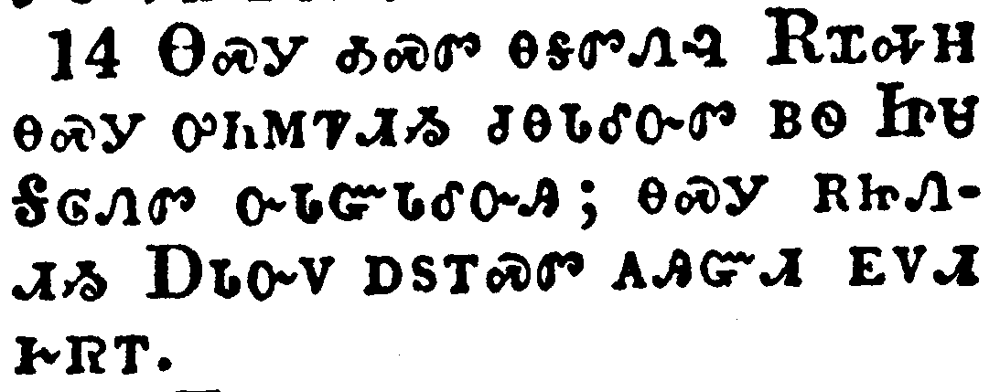</a></td>
</tr>
<tr class="even">
<td>That the blessing of Abraham might come on the Gentiles through Jesus Christ; that we might receive the promise of the Spirit through faith.</td>
</tr>
<tr class="odd">
<td>ᎾᏍᎩ ᎣᏍᏛ ᎾᎦᏛᏁᎸ ᎡᏆᎭᎻ ᎾᏍᎩ ᎤᏂᎷᏤᏗᏱ ᏧᎾᏓᎴᏅᏛ ᏴᏫ ᏥᏌ ᎦᎶᏁᏛ ᏅᏓᏳᏓᎴᏅᎯ; ᎾᏍᎩ ᎡᏥᏁᏗᏱ ᎠᏓᏅᏙ ᎠᏚᎢᏍᏛ ᎪᎯᏳᏗ ᎬᏙᏗ ᎨᏒᎢ.</td>
</tr>
<tr class="even">
<td>Na-s-gi o-s-dv na-ga-dv-ne-lv E-qua-ha-mi na-s-gi u-ni-lu-tse-di-yi tsu-na-da-le-nv-dv yv-wi Tsi-sa Ga-lo-ne-dv nv-da-yu-da-le-nv-hi; na-s-gi e-tsi-ne-di-yi A-da-nv-do a-du-i-s-dv go-hi-yu-di gv-do-di ge-sv-i.</td>
</tr>
</tbody>
</table>

<table>
<tbody>
<tr class="odd">
<td><a href="090315.png">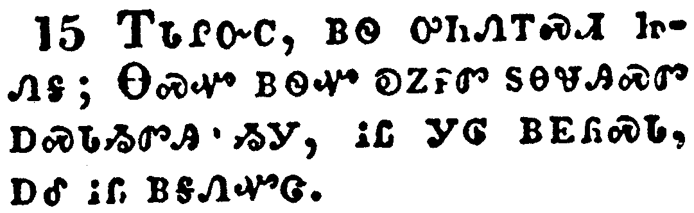</a></td>
</tr>
<tr class="even">
<td>Brethren, I speak after the manner of men; Though it be but a man's covenant, yet if it be confirmed, no man disannulleth, or addeth thereto.</td>
</tr>
<tr class="odd">
<td>ᎢᏓᎵᏅᏟ, ᏴᏫ ᎤᏂᏁᎢᏍᏗ ᏥᏁᎦ; ᎾᏍᏉ ᏴᏫᏉ ᎧᏃᎮᏛ ᏚᎾᏠᎯᏍᏛ ᎠᏍᏓᏱᏛᎯ ᏱᎩ, ᎥᏝ ᎩᎶ ᏴᎬᏲᏍᏓ, ᎠᎴ ᎥᏝ ᎠᎦᏁᏉᏣ.</td>
</tr>
<tr class="even">
<td>I-da-li-nv-tli, yv-wi u-ni-ne-i-s-di tsi-ne-ga; Na-s-quo yv-wi-quo ka-no-he-dv du-na-tlo-hi-s-dv a-s-da-yi-dv-hi yi-gi, v-tla gi-lo yv-gv-yo-s-da, a-le v-tla a-ga-ne-quo-tsa.</td>
</tr>
</tbody>
</table>

<table>
<tbody>
<tr class="odd">
<td><a href="090316.png">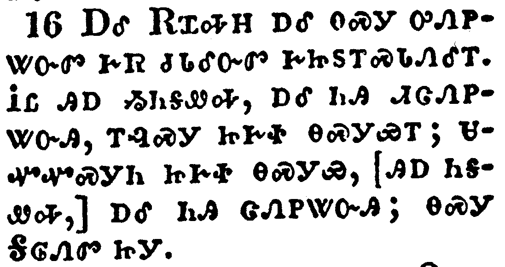</a></td>
</tr>
<tr class="even">
<td>Now to Abraham and his seed were the promises made. He saith not, And to seeds, as of many; but as of one, And to thy seed, which is Christ.</td>
</tr>
<tr class="odd">
<td>ᎠᎴ ᎡᏆᎭᎻ ᎠᎴ ᎾᏍᎩ ᎤᏁᏢᏔᏅᏛ ᎨᏒ ᏧᏓᎴᏅᏛ ᎨᏥᏚᎢᏍᏓᏁᎴᎢ. ᎥᏝ ᎯᎠ ᏱᏂᎦᏪᎭ, ᎠᎴ ᏂᎯ ᏗᏣᏁᏢᏔᏅᎯ, ᎢᎸᏍᎩ ᏥᎨᏐ ᎾᏍᎩᏯᎢ; ᏌᏉᏉᏍᎩᏂ ᏥᎨᏐ ᎾᏍᎩᏯ, [ᎯᎠ ᏂᎦᏪᎭ,] ᎠᎴ ᏂᎯ ᏣᏁᏢᏔᏅᎯ; ᎾᏍᎩ ᎦᎶᏁᏛ ᏥᎩ.</td>
</tr>
<tr class="even">
<td>A-le E-qua-ha-mi a-le na-s-gi u-ne-tlv-ta-nv-dv ge-sv tsu-da-le-nv-dv ge-tsi-du-i-s-da-ne-le-i. V-tla hi-a yi-ni-ga-we-ha, a-le ni-hi di-tsa-ne-tlv-ta-nv-hi, i-lv-s-gi tsi-ge-so na-s-gi-ya-i; sa-quo-quo-s-gi-ni tsi-ge-so na-s-gi-ya, [hi-a ni-ga-we-ha,] a-le ni-hi tsa-ne-tlv-ta-nv-hi; na-s-gi Ga-lo-ne-dv tsi-gi.</td>
</tr>
</tbody>
</table>

<table>
<tbody>
<tr class="odd">
<td><a href="090317.png">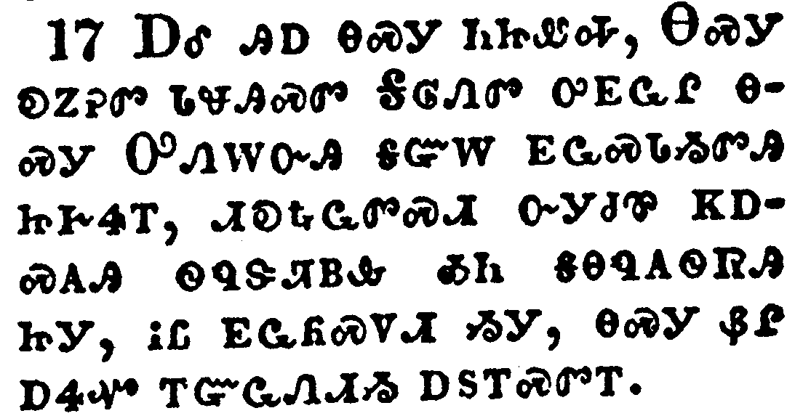</a></td>
</tr>
<tr class="even">
<td>And this I say, that the covenant, that was confirmed before of God in Christ, the law, which was four hundred and thirty years after, cannot disannul, that it should make the promise of none effect.</td>
</tr>
<tr class="odd">
<td>ᎠᎴ ᎯᎠ ᎾᏍᎩ ᏂᏥᏪᎭ, ᎾᏍᎩ ᎧᏃᎮᏛ ᏓᏠᎯᏍᏛ ᎦᎶᏁᏛ ᎤᎬᏩᎵ ᎾᏍᎩ ᎤᏁᎳᏅᎯ ᎦᏳᎳ ᎬᏩᏍᏓᏱᏛᎯ ᏥᎨᏎᎢ, ᏗᎧᎿᎭᏩᏛᏍᏗ ᏅᎩᏧᏈ ᏦᎠᏍᎪᎯ ᏫᏄᏕᏘᏴᎲ ᎣᏂ ᎦᎾᏄᎪᏫᏒᎯ ᏥᎩ, ᎥᏝ ᎬᏩᏲᏍᏙᏗ ᏱᎩ, ᎾᏍᎩ ᏰᎵ ᎠᏎᏉ ᎢᏳᏩᏁᏗᏱ ᎠᏚᎢᏍᏛᎢ.</td>
</tr>
<tr class="even">
<td>A-le hi-a na-s-gi ni-tsi-we-ha, Na-s-gi ka-no-he-dv da-tlo-hi-s-dv Ga-lo-ne-dv u-gv-wa-li na-s-gi U-ne-la-nv-hi ga-yu-la gv-wa-s-da-yi-dv-hi tsi-ge-se-i, di-ka-hna-wa-dv-s-di nv-gi-tsu-qui tso-a-s-go-hi wi-nu-de-ti-yv-hv o-ni ga-na-nu-go-wi-sv-hi tsi-gi, v-tla gv-wa-yo-s-do-di yi-gi, na-s-gi ye-li a-se-quo i-yu-wa-ne-di-yi a-du-i-s-dv-i.</td>
</tr>
</tbody>
</table>

<table>
<tbody>
<tr class="odd">
<td><a href="090318.png">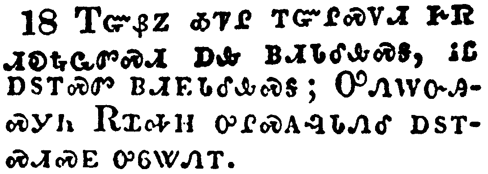</a></td>
</tr>
<tr class="even">
<td>For if the inheritance be of the law, it is no more of promise: but God gave it to Abraham by promise.</td>
</tr>
<tr class="odd">
<td>ᎢᏳᏰᏃ ᎣᏤᎵ ᎢᏳᎵᏍᏙᏗ ᎨᏒ ᏗᎧᎿᎭᏩᏛᏍᏗ ᎠᎲ ᏴᏗᏓᎴᎲᏍᎦ, ᎥᏝ ᎠᏚᎢᏍᏛ ᏴᏗᎬᏓᎴᎲᏍᎦ; ᎤᏁᎳᏅᎯᏍᎩᏂ ᎡᏆᎭᎻ ᎤᎵᏍᎪᎸᏓᏁᎴ ᎠᏚᎢᏍᏗᏍᎬ ᎤᏮᏔᏁᎢ.</td>
</tr>
<tr class="even">
<td>I-yu-ye-no o-tse-li i-yu-li-s-do-di ge-sv di-ka-hna-wa-dv-s-di a-hv yv-di-da-le-hv-s-ga, v-tla a-du-i-s-dv yv-di-gv-da-le-hv-s-ga; U-ne-la-nv-hi-s-gi-ni E-qua-ha-mi u-li-s-go-lv-da-ne-le a-du-i-s-di-s-gv u-wv-ta-ne-i.</td>
</tr>
</tbody>
</table>

<table>
<tbody>
<tr class="odd">
<td><a href="090319.png">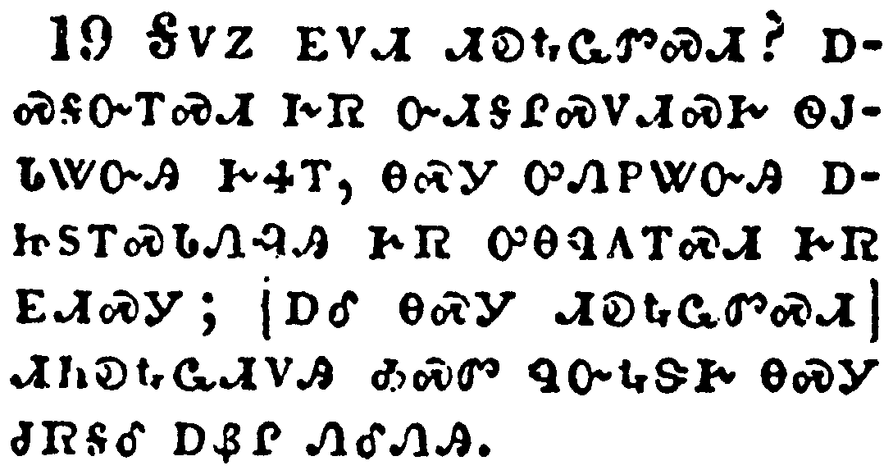</a></td>
</tr>
<tr class="even">
<td>Wherefore then serveth the law? It was added because of transgressions, till the seed should come to whom the promise was made; and it was ordained by angels in the hand of a mediator.</td>
</tr>
<tr class="odd">
<td>ᎦᏙᏃ ᎬᏙᏗ ᏗᎧᎿᎭᏩᏛᏍᏗ? ᎠᏍᎦᏅᎢᏍᏗ ᎨᏒ ᏅᏗᎦᎵᏍᏙᏗᏍᎨ ᏫᎫᏓᏔᏅᎯ ᎨᏎᎢ, ᎾᏍᎩ ᎤᏁᏢᏔᏅᎯ ᎠᏥᏚᎢᏍᏓᏁᎸᎯ ᎨᏒ ᎤᎾᏄᎪᎢᏍᏗ ᎨᏒ ᎬᏗᏍᎩ; [ᎠᎴ ᎾᏍᎩ ᏗᎧᎿᎭᏩᏛᏍᏗ] ᏗᏂᎧᎿᎭᏩᏗᏙᎯ ᎣᏍᏛ ᏄᏅᎿᎭᏕᎨ ᎾᏍᎩ ᏧᏒᎦᎴ ᎠᏰᎵ ᏁᎴᏁᎯ.</td>
</tr>
<tr class="even">
<td>Ga-do-no gv-do-di di-ka-hna-wa-dv-s-di? a-s-ga-nv-i-s-di ge-sv nv-di-ga-li-s-do-di-s-ge wi-gu-da-ta-nv-hi ge-se-i, na-s-gi u-ne-tlv-ta-nv-hi a-tsi-du-i-s-da-ne-lv-hi ge-sv u-na-nu-go-i-s-di ge-sv gv-di-s-gi; [a-le na-s-gi di-ka-hna-wa-dv-s-di] di-ni-ka-hna-wa-di-do-hi o-s-dv nu-nv-hna-de-ge na-s-gi tsu-sv-ga-le a-ye-li ne-le-ne-hi.</td>
</tr>
</tbody>
</table>

<table>
<tbody>
<tr class="odd">
<td></td>
</tr>
<tr class="even">
<td>Now a mediator is not a mediator of one, but God is one.</td>
</tr>
<tr class="odd">
<td>ᎾᏍᎩᏃ ᎠᏰᎵ ᏗᎴᏁᎯ ᏥᎨᏐ ᎥᏝ ᎠᏏᏴᏫᏉ ᎠᏰᎵ ᎠᎴᏁᎯ ᏱᎨᏐᎢ, ᎤᏁᎳᏅᎯᏍᎩᏂ ᎠᏏᏴᏫᏉ.</td>
</tr>
<tr class="even">
<td>Na-s-gi-no a-ye-li di-le-ne-hi tsi-ge-so v-tla a-si-yv-wi-quo a-ye-li a-le-ne-hi yi-ge-so-i, U-ne-la-nv-hi-s-gi-ni a-si-yv-wi-quo.</td>
</tr>
</tbody>
</table>

<table>
<tbody>
<tr class="odd">
<td><a href="090321.png">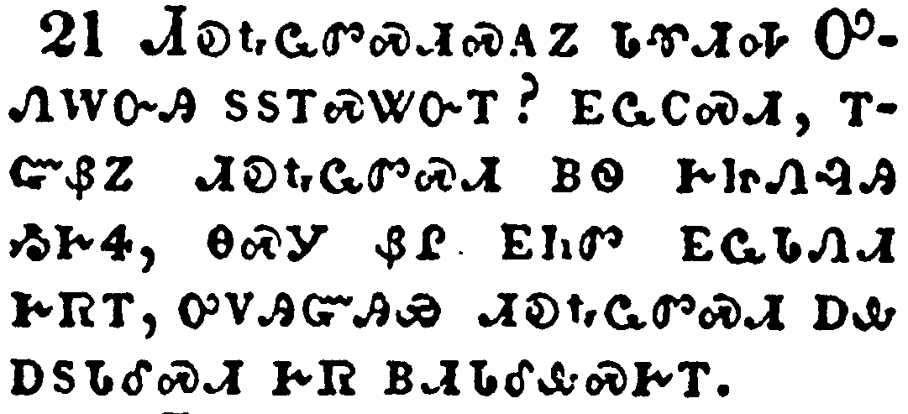</a></td>
</tr>
<tr class="even">
<td>Is the law then against the promises of God? God forbid: for if there had been a law given which could have given life, verily righteousness should have been by the law.</td>
</tr>
<tr class="odd">
<td>ᏗᎧᎿᎭᏩᏛᏍᏗᏍᎪᏃ ᏓᏡᏗᎭ ᎤᏁᎳᏅᎯ ᏚᏚᎢᏍᏔᏅᎢ? ᎬᏩᏟᏍᏗ, ᎢᏳᏰᏃ ᏗᎧᎿᎭᏩᏛᏍᏗ ᏴᏫ ᎨᏥᏁᎸᎯ ᏱᎨᏎ, ᎾᏍᎩ ᏰᎵ ᎬᏂᏛ ᎬᏩᏓᏁᏗ ᎨᏒᎢ, ᎤᏙᎯᏳᎯᏯ ᏗᎧᎿᎭᏩᏛᏍᏗ ᎠᎲ ᎠᏚᏓᎴᏍᏗ ᎨᏒ ᏴᏗᏓᎴᎲᏍᎨᎢ.</td>
</tr>
<tr class="even">
<td>Di-ka-hna-wa-dv-s-di-s-go-no da-tlu-di-ha U-ne-la-nv-hi du-du-i-s-ta-nv-i? gv-wa-tli-s-di, i-yu-ye-no di-ka-hna-wa-dv-s-di yv-wi ge-tsi-ne-lv-hi yi-ge-se, na-s-gi ye-li gv-ni-dv gv-wa-da-ne-di ge-sv-i, u-do-hi-yu-hi-ya di-ka-hna-wa-dv-s-di a-hv a-du-da-le-s-di ge-sv yv-di-da-le-hv-s-ge-i.</td>
</tr>
</tbody>
</table>

<table>
<tbody>
<tr class="odd">
<td><a href="090322.png">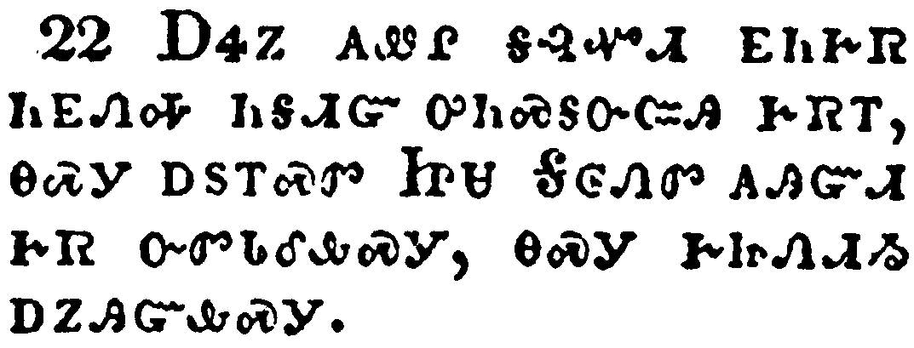</a></td>
</tr>
<tr class="even">
<td>But the scripture hath concluded all under sin, that the promise by faith of Jesus Christ might be given to them that believe.</td>
</tr>
<tr class="odd">
<td>ᎠᏎᏃ ᎪᏪᎵ ᎦᎸᏉᏗ ᎬᏂᎨᏒ ᏂᎬᏁᎭ ᏂᎦᏗᏳ ᎤᏂᏍᎦᏅᏨᎯ ᎨᏒᎢ, ᎾᏍᎩ ᎠᏚᎢᏍᏛ ᏥᏌ ᎦᎶᏁᏛ ᎪᎯᏳᏗ ᎨᏒ ᏅᏛᏓᎴᎲᏍᎩ, ᎾᏍᎩ ᎨᏥᏁᏗᏱ ᎠᏃᎯᏳᎲᏍᎩ.</td>
</tr>
<tr class="even">
<td>A-se-no go-we-li ga-lv-quo-di gv-ni-ge-sv ni-gv-ne-ha ni-ga-di-yu u-ni-s-ga-nv-tsv-hi ge-sv-i, na-s-gi a-du-i-s-dv Tsi-sa Ga-lo-ne-dv go-hi-yu-di ge-sv nv-dv-da-le-hv-s-gi, na-s-gi ge-tsi-ne-di-yi a-no-hi-yu-hv-s-gi.</td>
</tr>
</tbody>
</table>

<table>
<tbody>
<tr class="odd">
<td><a href="090323.png">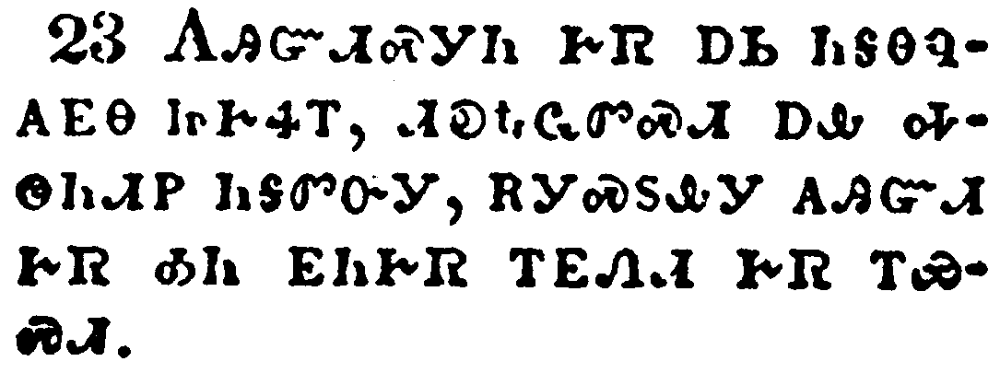</a></td>
</tr>
<tr class="even">
<td>But before faith came, we were kept under the law, shut up unto the faith which should afterwards be revealed.</td>
</tr>
<tr class="odd">
<td>ᎪᎯᏳᏗᏍᎩᏂ ᎨᏒ ᎠᏏ ᏂᎦᎾᏄᎪᎬᎾ ᏥᎨᏎᎢ, ᏗᎧᎿᎭᏩᏛᏍᏗ ᎠᎲ ᎭᏫᏂᏗᏢ ᏂᎦᏛᏅᎩ, ᎡᎩᏍᏚᎲᎩ ᎪᎯᏳᏗ ᎨᏒ ᎣᏂ ᎬᏂᎨᏒ ᎢᎬᏁᏗ ᎨᏒ ᎢᏯᏍᏗ.</td>
</tr>
<tr class="even">
<td>Go-hi-yu-di-s-gi-ni ge-sv a-si ni-ga-na-nu-go-gv-na tsi-ge-se-i, di-ka-hna-wa-dv-s-di a-hv ha-wi-ni-di-tlv ni-ga-dv-nv-gi, e-gi-s-du-hv-gi go-hi-yu-di ge-sv o-ni gv-ni-ge-sv i-gv-ne-di ge-sv i-ya-s-di.</td>
</tr>
</tbody>
</table>

<table>
<tbody>
<tr class="odd">
<td><a href="090324.png">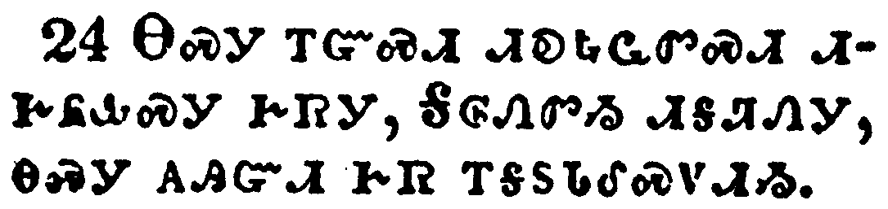</a></td>
</tr>
<tr class="even">
<td>Wherefore the law was our schoolmaster to bring us unto Christ, that we might be justified by faith.</td>
</tr>
<tr class="odd">
<td>ᎾᏍᎩ ᎢᏳᏍᏗ ᏗᎧᎿᎭᏩᏛᏍᏗ ᏗᎨᏲᎲᏍᎩ ᎨᏒᎩ, ᎦᎶᏁᏛᏱ ᏗᎦᏘᏁᎩ, ᎾᏍᎩ ᎪᎯᏳᏗ ᎨᏒ ᎢᎦᏚᏓᎴᏍᏙᏗᏱ.</td>
</tr>
<tr class="even">
<td>Na-s-gi i-yu-s-di di-ka-hna-wa-dv-s-di di-ge-yo-hv-s-gi ge-sv-gi, Ga-lo-ne-dv-yi di-ga-ti-ne-gi, na-s-gi go-hi-yu-di ge-sv i-ga-du-da-le-s-do-di-yi.</td>
</tr>
</tbody>
</table>

<table>
<tbody>
<tr class="odd">
<td><a href="090325.png">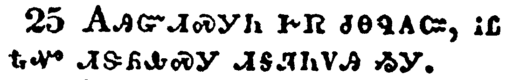</a></td>
</tr>
<tr class="even">
<td>But after that faith is come, we are no longer under a schoolmaster.</td>
</tr>
<tr class="odd">
<td>ᎪᎯᏳᏗᏍᎩᏂ ᎨᏒ ᏧᎾᏄᎪᏨ, ᎥᏝ ᎿᎭᏉ ᏗᏕᏲᎲᏍᎩ ᏗᎦᏘᏂᏙᎯ ᏱᎩ.</td>
</tr>
<tr class="even">
<td>Go-hi-yu-di-s-gi-ni ge-sv tsu-na-nu-go-tsv, v-tla hna-quo di-de-yo-hv-s-gi di-ga-ti-ni-do-hi yi-gi.</td>
</tr>
</tbody>
</table>

<table>
<tbody>
<tr class="odd">
<td><a href="090326.png">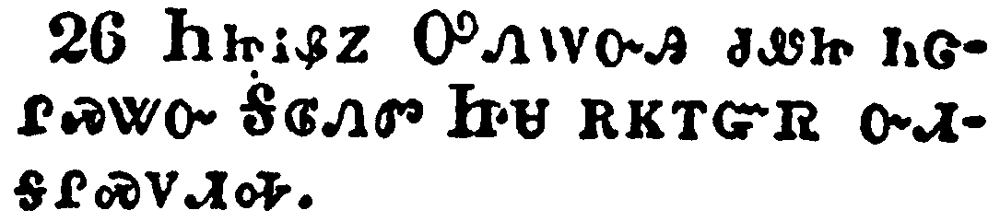</a></td>
</tr>
<tr class="even">
<td>For ye are all the children of God by faith in Christ Jesus.</td>
</tr>
<tr class="odd">
<td>ᏂᏥᎥᏰᏃ ᎤᏁᎳᏅᎯ ᏧᏪᏥ ᏂᏣᎵᏍᏔᏅ ᎦᎶᏁᏛ ᏥᏌ ᎡᏦᎢᏳᏒ ᏅᏗᎦᎵᏍᏙᏗᎭ.</td>
</tr>
<tr class="even">
<td>Ni-tsi-v-ye-no U-ne-la-nv-hi tsu-we-tsi ni-tsa-li-s-ta-nv Ga-lo-ne-dv Tsi-sa e-tso-i-yu-sv nv-di-ga-li-s-do-di-ha.</td>
</tr>
</tbody>
</table>

<table>
<tbody>
<tr class="odd">
<td><a href="090327.png">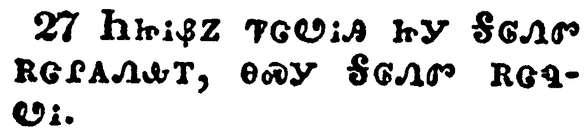</a></td>
</tr>
<tr class="even">
<td>For as many of you as have been baptized into Christ have put on Christ.</td>
</tr>
<tr class="odd">
<td>ᏂᏥᎥᏰᏃ ᏤᏣᏬᎥᎯ ᏥᎩ ᎦᎶᏁᏛ ᎡᏣᎵᎪᏁᎲᎢ, ᎾᏍᎩ ᎦᎶᏁᏛ ᎡᏣᏄᏬᎥ.</td>
</tr>
<tr class="even">
<td>Ni-tsi-v-ye-no tse-tsa-wo-v-hi tsi-gi Ga-lo-ne-dv e-tsa-li-go-ne-hv-i, na-s-gi Ga-lo-ne-dv e-tsa-nu-wo-v.</td>
</tr>
</tbody>
</table>

<table>
<tbody>
<tr class="odd">
<td><a href="090328.png">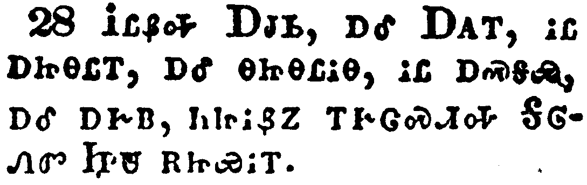</a></td>
</tr>
<tr class="even">
<td>There is neither Jew nor Greek, there is neither bond nor free, there is neither male nor female: for ye are all one in Christ Jesus.</td>
</tr>
<tr class="odd">
<td>ᎥᏝᏰᎭ ᎠᏧᏏ, ᎠᎴ ᎠᎪᎢ, ᎥᏝ ᎠᏥᎾᏝᎢ, ᎠᎴ ᎾᏥᎾᏝᎥᎾ, ᎥᏝ ᎠᏍᎦᏯ, ᎠᎴ ᎠᎨᏴ, ᏂᏥᎥᏰᏃ ᎢᎨᏣᏍᏗᎭ ᎦᎶᏁᏛ ᏥᏌ ᎡᏥᏯᎥᎢ.</td>
</tr>
<tr class="even">
<td>V-tla-ye-ha A-tsu-si, a-le A-go-i, v-tla a-tsi-na-tla-i, a-le na-tsi-na-tla-v-na, v-tla a-s-ga-ya, a-le a-ge-yv, ni-tsi-v-ye-no i-ge-tsa-s-di-ha Ga-lo-ne-dv Tsi-sa e-tsi-ya-v-i.</td>
</tr>
</tbody>
</table>

<table>
<tbody>
<tr class="odd">
<td><a href="090329.png">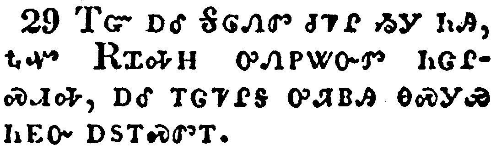</a></td>
</tr>
<tr class="even">
<td>And if ye be Christ's, then are ye Abraham's seed, and heirs according to the promise.</td>
</tr>
<tr class="odd">
<td>ᎢᏳ ᎠᎴ ᎦᎶᏁᏛ ᏧᏤᎵ ᏱᎩ ᏂᎯ, ᎿᎭᏉ ᎡᏆᎭᎻ ᎤᏁᏢᏔᏅᏛ ᏂᏣᎵᏍᏗᎭ, ᎠᎴ ᎢᏣᏤᎵᎦ ᎤᏘᏴᎯ ᎾᏍᎩᏯ ᏂᎬᏅ ᎠᏚᎢᏍᏛᎢ.</td>
</tr>
<tr class="even">
<td>I-yu a-le Ga-lo-ne-dv tsu-tse-li yi-gi ni-hi, hna-quo E-qua-ha-mi u-ne-tlv-ta-nv-dv ni-tsa-li-s-di-ha, a-le i-tsa-tse-li-ga u-ti-yv-hi na-s-gi-ya ni-gv-nv a-du-i-s-dv-i.</td>
</tr>
</tbody>
</table>

