+++
draft=false
date = 2014-12-18T21:11:07Z
title = "Hebrews - Chapter 3 - Cherokee New Testament"
weight = 1418955067

[taxonomies]

authors = ["Timothy Legg"]
categories = []
tags = []

[extra]
+++
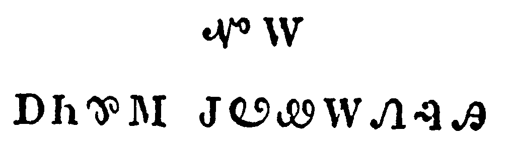

<table>
<tbody>
<tr class="odd">
<td><a href="190301.png">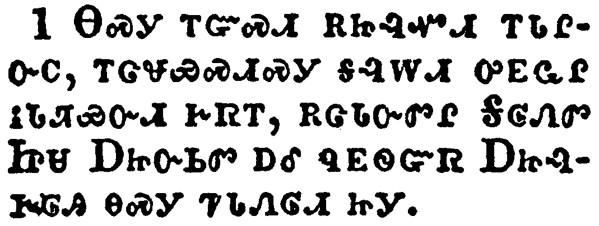</a></td>
</tr>
<tr class="even">
<td>Wherefore, holy brethren, partakers of the heavenly calling, consider the Apostle and High Priest of our profession, Christ Jesus;</td>
</tr>
<tr class="odd">
<td>ᎾᏍᎩ ᎢᏳᏍᏗ ᎡᏥᎸᏉᏗ ᎢᏓᎵᏅᏟ, ᎢᏣᏠᏯᏍᏗᏍᎩ ᎦᎸᎳᏗ ᎤᎬᏩᎵ ᎥᏓᏘᏯᏅᏗ ᎨᏒᎢ, ᎡᏣᏓᏅᏛᎵ ᎦᎶᏁᏛ ᏥᏌ ᎠᏥᏅᏏᏛ ᎠᎴ ᏄᎬᏫᏳᏒ ᎠᏥᎸᎨᎶᎯ ᎾᏍᎩ ᏤᏓᏁᎶᏗ ᏥᎩ.</td>
</tr>
<tr class="even">
<td>Na-s-gi i-yu-s-di e-tsi-lv-quo-di i-da-li-nv-tli, i-tsa-tlo-ya-s-di-s-gi ga-lv-la-di u-gv-wa-li v-da-ti-ya-nv-di ge-sv-i, e-tsa-da-nv-dv-li Ga-lo-ne-dv Tsi-sa A-tsi-nv-si-dv a-le nu-gv-wi-yu-sv A-tsi-lv-ge-lo-hi na-s-gi tse-da-ne-lo-di tsi-gi.</td>
</tr>
</tbody>
</table>

<table>
<tbody>
<tr class="odd">
<td><a href="190302.png">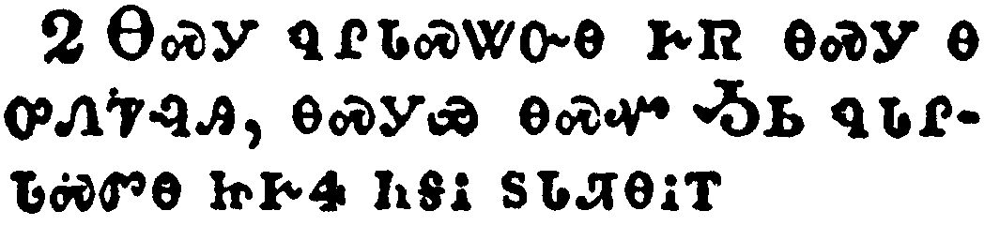</a></td>
</tr>
<tr class="even">
<td>Who was faithful to him that appointed him, as also Moses was faithful in all his house.</td>
</tr>
<tr class="odd">
<td>ᎾᏍᎩ ᏄᎵᏓᏍᏔᏅᎾ ᎨᏒ ᎾᏍᎩ Ꮎ ᎤᏁᏤᎸᎯ, ᎾᏍᎩᏯ ᎾᏍᏉ ᎼᏏ ᏄᏓᎵᏓᏍᏛᎾ ᏥᎨᏎ ᏂᎦᎥ ᏚᏓᏘᎾᎥᎢ.</td>
</tr>
<tr class="even">
<td>Na-s-gi nu-li-da-s-ta-nv-na ge-sv na-s-gi na u-ne-tse-lv-hi, na-s-gi-ya na-s-quo Mo-si nu-da-li-da-s-dv-na tsi-ge-se ni-ga-v du-da-ti-na-v-i.</td>
</tr>
</tbody>
</table>

<table>
<tbody>
<tr class="odd">
<td><a href="190303.png">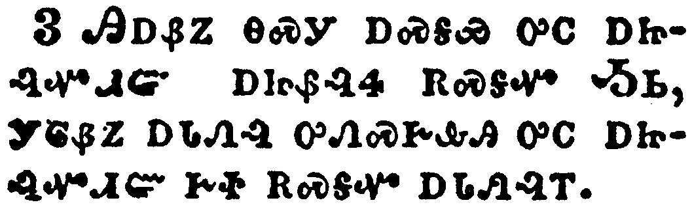</a></td>
</tr>
<tr class="even">
<td>For this man was counted worthy of more glory than Moses, inasmuch as he who hath builded the house hath more honour than the house.</td>
</tr>
<tr class="odd">
<td>ᎯᎠᏰᏃ ᎾᏍᎩ ᎠᏍᎦᏯ ᎤᏟ ᎠᏥᎸᏉᏗᏳ ᎠᏥᏰᎸᏎ ᎡᏍᎦᏉ ᎼᏏ, ᎩᎶᏰᏃ ᎠᏓᏁᎸ ᎤᏁᏍᎨᎲᎯ ᎤᏟ ᎠᏥᎸᏉᏗᏳ ᎨᏐ ᎡᏍᎦᏉ ᎠᏓᏁᎸᎢ.</td>
</tr>
<tr class="even">
<td>Hi-a-ye-no na-s-gi a-s-ga-ya u-tli a-tsi-lv-quo-di-yu a-tsi-ye-lv-se e-s-ga-quo Mo-si, gi-lo-ye-no a-da-ne-lv u-ne-s-ge-hv-hi u-tli a-tsi-lv-quo-di-yu ge-so e-s-ga-quo a-da-ne-lv-i.</td>
</tr>
</tbody>
</table>

<table>
<tbody>
<tr class="odd">
<td><a href="190304.png">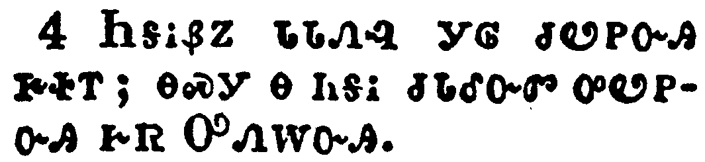</a></td>
</tr>
<tr class="even">
<td>For every house is builded by some man; but he that built all things is God.</td>
</tr>
<tr class="odd">
<td>ᏂᎦᎥᏰᏃ ᏓᏓᏁᎸ ᎩᎶ ᏧᏬᏢᏅᎯ ᎨᏐᎢ; ᎾᏍᎩ Ꮎ ᏂᎦᎥ ᏧᏓᎴᏅᏛ ᎤᏬᏢᏅᎯ ᎨᏒ ᎤᏁᎳᏅᎯ.</td>
</tr>
<tr class="even">
<td>Ni-ga-v-ye-no da-da-ne-lv gi-lo tsu-wo-tlv-nv-hi ge-so-i; na-s-gi na ni-ga-v tsu-da-le-nv-dv u-wo-tlv-nv-hi ge-sv U-ne-la-nv-hi.</td>
</tr>
</tbody>
</table>

<table>
<tbody>
<tr class="odd">
<td><a href="190305.png">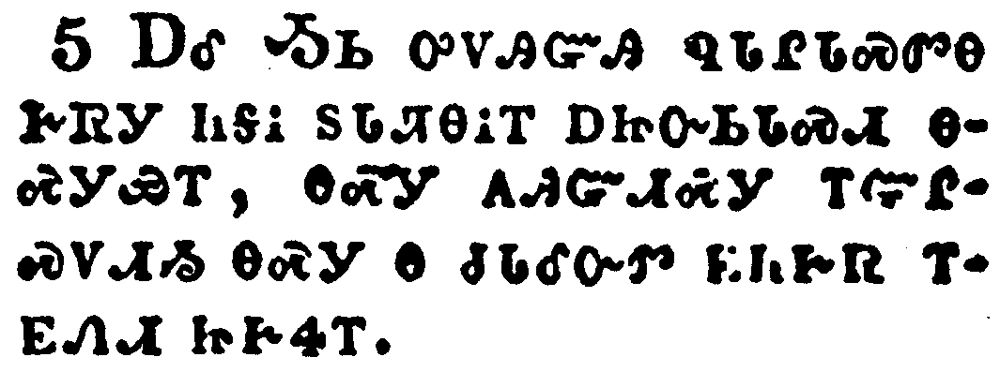</a></td>
</tr>
<tr class="even">
<td>And Moses verily was faithful in all his house, as a servant, for a testimony of those things which were to be spoken after;</td>
</tr>
<tr class="odd">
<td>ᎠᎴ ᎼᏏ ᎤᏙᎯᏳᎯ ᏄᏓᎵᏓᏍᏛᎾ ᎨᏒᎩ ᏂᎦᎥ ᏚᏓᏘᎾᎥᎢ ᎠᏥᏅᏏᏓᏍᏗ ᎾᏍᎩᏯᎢ, ᎾᏍᎩ ᎪᎯᏳᏗᏍᎩ ᎢᏳᎵᏍᏙᏗᏱ ᎾᏍᎩ Ꮎ ᏧᏓᎴᏅᏛ ᎬᏂᎨᏒ ᎢᎬᏁᏗ ᏥᎨᏎᎢ.</td>
</tr>
<tr class="even">
<td>A-le mo-si u-do-hi-yu-hi nu-da-li-da-s-dv-na ge-sv-gi ni-ga-v du-da-ti-na-v-i a-tsi-nv-si-da-s-di na-s-gi-ya-i, na-s-gi go-hi-yu-di-s-gi i-yu-li-s-do-di-yi na-s-gi na tsu-da-le-nv-dv gv-ni-ge-sv i-gv-ne-di tsi-ge-se-i.</td>
</tr>
</tbody>
</table>

<table>
<tbody>
<tr class="odd">
<td><a href="190306.png">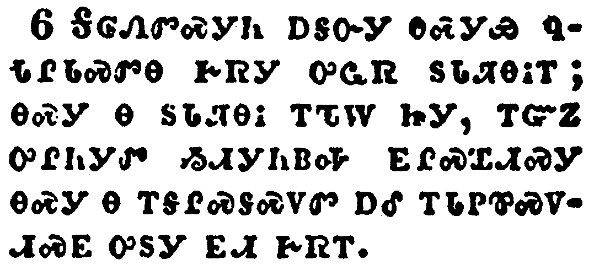</a></td>
</tr>
<tr class="even">
<td>But Christ as a son over his own house; whose house are we, if we hold fast the confidence and the rejoicing of the hope firm unto the end.</td>
</tr>
<tr class="odd">
<td>ᎦᎶᏁᏛᏍᎩᏂ ᎠᎦᏅᎩ ᎾᏍᎩᏯ ᏄᏓᎵᏓᏍᏛᎾ ᎨᏒᎩ ᎤᏩᏒ ᏚᏓᏘᎾᎥᎢ; ᎾᏍᎩ Ꮎ ᏚᏓᏘᎾᎥ ᎢᏖᎳ ᏥᎩ, ᎢᏳᏃ ᎤᎵᏂᎩᏛ ᏱᏗᎩᏂᏴᎭ ᎬᎵᏍᏆᏗᏍᎩ ᎾᏍᎩ Ꮎ ᎢᎦᎵᏍᎦᏍᏙᏛ ᎠᎴ ᎢᏓᏢᏈᏍᏙᏗᏍᎬ ᎤᏚᎩ ᎬᏗ ᎨᏒᎢ.</td>
</tr>
<tr class="even">
<td>Ga-lo-ne-dv-s-gi-ni a-ga-nv-gi na-s-gi-ya nu-da-li-da-s-dv-na ge-sv-gi u-wa-sv du-da-ti-na-v-i; na-s-gi na du-da-ti-na-v i-te-la tsi-gi, i-yu-no u-li-ni-gi-dv yi-di-gi-ni-yv-ha gv-li-s-qua-di-s-gi na-s-gi na i-ga-li-s-ga-s-do-dv a-le i-da-tlv-qui-s-do-di-s-gv u-du-gi gv-di ge-sv-i.</td>
</tr>
</tbody>
</table>

<table>
<tbody>
<tr class="odd">
<td><a href="190307.png">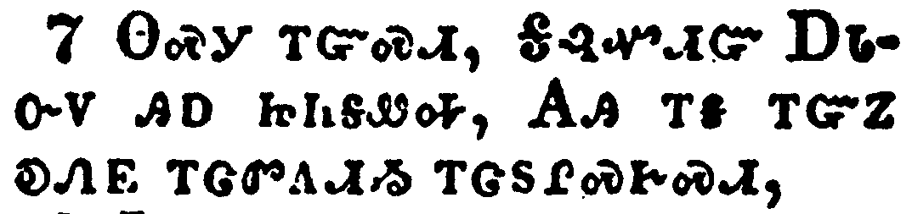</a></td>
</tr>
<tr class="even">
<td>Wherefore (as the Holy Ghost saith, To day if ye will hear his voice,</td>
</tr>
<tr class="odd">
<td>ᎾᏍᎩ ᎢᏳᏍᏗ, ᎦᎸᏉᏗᏳ ᎠᏓᏅᏙ ᎯᎠ ᏥᏂᎦᏪᎭ, ᎪᎯ ᎢᎦ ᎢᏳᏃ ᎧᏁᎬ ᎢᏣᏛᎪᏗᏱ ᎢᏣᏚᎵᏍᎨᏍᏗ,</td>
</tr>
<tr class="even">
<td>Na-s-gi i-yu-s-di, Ga-lv-quo-di-yu A-da-nv-do hi-a tsi-ni-ga-we-ha, Go-hi i-ga i-yu-no ka-ne-gv i-tsa-dv-go-di-yi i-tsa-du-li-s-ge-s-di,</td>
</tr>
</tbody>
</table>

<table>
<tbody>
<tr class="odd">
<td><a href="190308.png">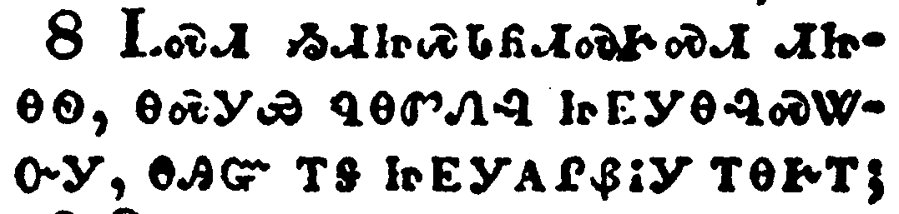</a></td>
</tr>
<tr class="even">
<td>Harden not your hearts, as in the provocation, in the day of temptation in the wilderness:</td>
</tr>
<tr class="odd">
<td>ᏞᏍᏗ ᏱᏗᏥᏍᏓᏲᏗᏍᎨᏍᏗ ᏗᏥᎾᏫ, ᎾᏍᎩᏯ ᏄᎾᏛᏁᎸ ᏥᎬᎩᎾᎸᏍᏔᏅᎩ, ᎾᎯᏳ ᎢᎦ ᏥᎬᎩᎪᎵᏰᎥᎩ ᎢᎾᎨᎢ;</td>
</tr>
<tr class="even">
<td>Tle-s-di yi-di-tsi-s-da-yo-di-s-ge-s-di di-tsi-na-wi, na-s-gi-ya nu-na-dv-ne-lv tsi-gv-gi-na-lv-s-ta-nv-gi, na-hi-yu i-ga tsi-gv-gi-go-li-ye-v-gi i-na-ge-i;</td>
</tr>
</tbody>
</table>

<table>
<tbody>
<tr class="odd">
<td><a href="190309.png">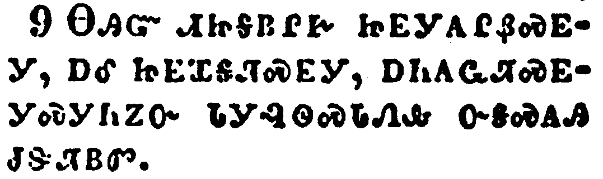</a></td>
</tr>
<tr class="even">
<td>When your fathers tempted me, proved me, and saw my works forty years.</td>
</tr>
<tr class="odd">
<td>ᎾᎯᏳ ᏗᏥᎦᏴᎵᎨ ᏥᎬᎩᎪᎵᏰᏍᎬᎩ, ᎠᎴ ᏥᎬᏆᎦᏘᏍᎬᎩ, ᎠᏂᎪᏩᏘᏍᎬᎩᏍᎩᏂᏃᏅ ᏓᎩᎸᏫᏍᏓᏁᎲ ᏅᎦᏍᎪᎯ ᏧᏕᏘᏴᏛ.</td>
</tr>
<tr class="even">
<td>Na-hi-yu di-tsi-ga-yv-li-ge tsi-gv-gi-go-li-ye-s-gv-gi, a-le tsi-gv-qua-ga-ti-s-gv-gi, a-ni-go-wa-ti-s-gv-gi-s-gi-ni-no-nv da-gi-lv-wi-s-da-ne-hv nv-ga-s-go-hi tsu-de-ti-yv-dv.</td>
</tr>
</tbody>
</table>

<table>
<tbody>
<tr class="odd">
<td><a href="190310.png">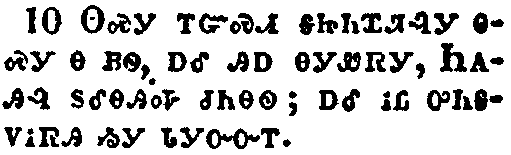</a></td>
</tr>
<tr class="even">
<td>Wherefore I was grieved with that generation, and said, They do always err in their heart; and they have not known my ways.</td>
</tr>
<tr class="odd">
<td>ᎾᏍᎩ ᎢᏳᏍᏗ ᎦᏥᏂᏉᏘᎸᎩ ᎾᏍᎩ Ꮎ ᏴᏫ, ᎠᎴ ᎯᎠ ᎾᎩᏪᏒᎩ, ᏂᎪᎯᎸ ᏚᎴᎾᎯᎭ ᏧᏂᎾᏫ; ᎠᎴ ᎥᏝ ᎤᏂᎦᏙᎥᏒᎯ ᏱᎩ ᏓᎩᏅᏅᎢ.</td>
</tr>
<tr class="even">
<td>Na-s-gi i-yu-s-di ga-tsi-ni-quo-ti-lv-gi na-s-gi na yv-wi, a-le hi-a na-gi-we-sv-gi, Ni-go-hi-lv du-le-na-hi-ha tsu-ni-na-wi; a-le v-tla u-ni-ga-do-v-sv-hi yi-gi da-gi-nv-nv-i.</td>
</tr>
</tbody>
</table>

<table>
<tbody>
<tr class="odd">
<td><a href="190311.png">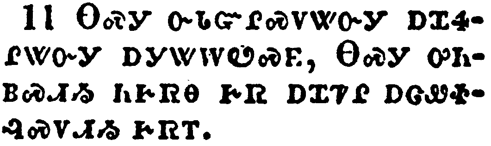</a></td>
</tr>
<tr class="even">
<td>So I sware in my wrath, They shall not enter into my rest.)</td>
</tr>
<tr class="odd">
<td>ᎾᏍᎩ ᏅᏓᏳᎵᏍᏙᏔᏅᎩ ᎠᏆᏎᎵᏔᏅᎩ ᎠᎩᏔᎳᏬᏍᎬ, ᎾᏍᎩ ᎤᏂᏴᏍᏗᏳ ᏂᎨᏒᎾ ᎨᏒ ᎠᏆᏤᎵ ᎠᏣᏪᏐᎸᏍᏙᏗᏱ ᎨᏒᎢ.</td>
</tr>
<tr class="even">
<td>Na-s-gi nv-da-yu-li-s-do-ta-nv-gi a-qua-se-li-ta-nv-gi a-gi-ta-la-wo-s-gv, Na-s-gi u-ni-yv-s-di-yu ni-ge-sv-na ge-sv a-qua-tse-li a-tsa-we-so-lv-s-do-di-yi ge-sv-i.</td>
</tr>
</tbody>
</table>

<table>
<tbody>
<tr class="odd">
<td><a href="190312.png">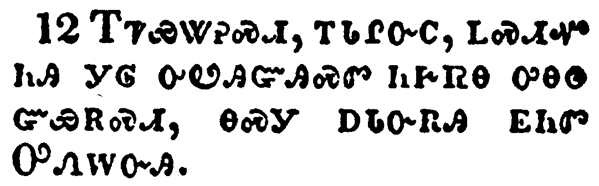</a></td>
</tr>
<tr class="even">
<td>Take heed, brethren, lest there be in any of you an evil heart of unbelief, in departing from the living God.</td>
</tr>
<tr class="odd">
<td>ᎢᏤᏯᏔᎮᏍᏗ, ᎢᏓᎵᏅᏟ, ᏞᏍᏗᏉ ᏂᎯ ᎩᎶ ᎤᏬᎯᏳᎯᏍᏛ ᏂᎨᏒᎾ ᎤᎾᏫ ᏳᏯᎡᏍᏗ, ᎾᏍᎩ ᎠᏓᏅᎡᎯ ᎬᏂᏛ ᎤᏁᎳᏅᎯ.</td>
</tr>
<tr class="even">
<td>I-tse-ya-ta-he-s-di, i-da-li-nv-tli, tle-s-di-quo ni-hi gi-lo u-wo-hi-yu-hi-s-dv ni-ge-sv-na u-na-wi yu-ya-e-s-di, na-s-gi a-da-nv-e-hi gv-ni-dv U-ne-la-nv-hi.</td>
</tr>
</tbody>
</table>

<table>
<tbody>
<tr class="odd">
<td><a href="190313.png">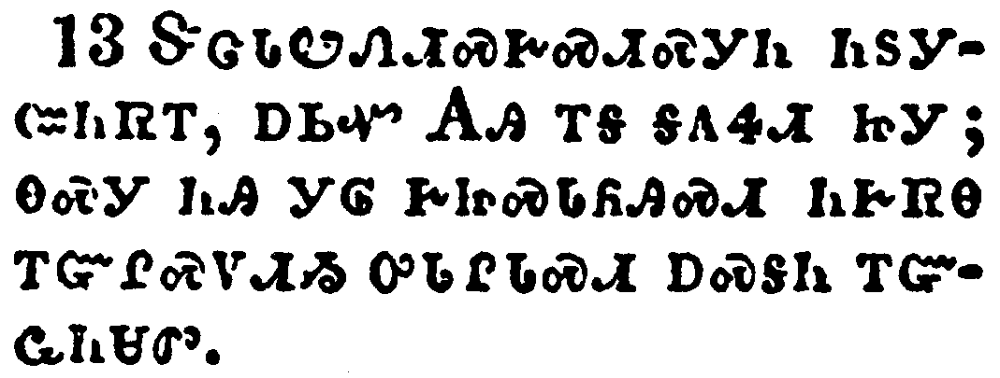</a></td>
</tr>
<tr class="even">
<td>But exhort one another daily, while it is called To day; lest any of you be hardened through the deceitfulness of sin.</td>
</tr>
<tr class="odd">
<td>ᏕᏣᏓᏬᏂᏗᏍᎨᏍᏗᏍᎩᏂ ᏂᏚᎩᏨᏂᏒᎢ, ᎠᏏᏉ ᎪᎯ ᎢᎦ ᎦᎪᏎᏗ ᏥᎩ; ᎾᏍᎩ ᏂᎯ ᎩᎶ ᎨᏥᏍᏓᏲᎯᏍᏗ ᏂᎨᏒᎾ ᎢᏳᎵᏍᏙᏗᏱ ᎤᏓᎵᏓᏍᏗ ᎠᏍᎦᏂ ᎢᏳᏩᏂᏌᏛ.</td>
</tr>
<tr class="even">
<td>De-tsa-da-wo-ni-di-s-ge-s-di-s-gi-ni ni-du-gi-tsv-ni-sv-i, a-si-quo Go-hi i-ga ga-go-se-di tsi-gi; na-s-gi ni-hi gi-lo ge-tsi-s-da-yo-hi-s-di ni-ge-sv-na i-yu-li-s-do-di-yi u-da-li-da-s-di a-s-ga-ni i-yu-wa-ni-sa-dv.</td>
</tr>
</tbody>
</table>

<table>
<tbody>
<tr class="odd">
<td><a href="190314.png">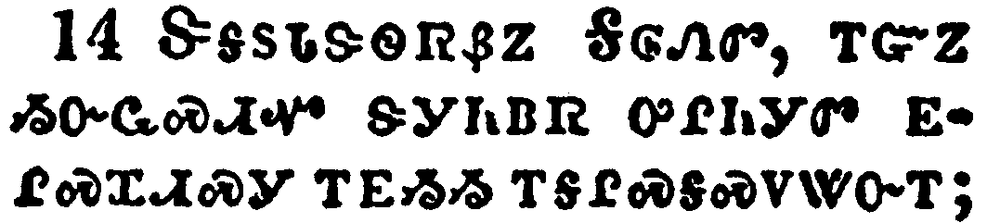</a></td>
</tr>
<tr class="even">
<td>For we are made partakers of Christ, if we hold the beginning of our confidence stedfast unto the end;</td>
</tr>
<tr class="odd">
<td>ᏕᎦᏚᏓᏕᏫᏒᏰᏃ ᎦᎶᏁᏛ, ᎢᏳᏃ ᏱᏅᏩᏍᏗᏉ ᏕᎩᏂᏴᏒ ᎤᎵᏂᎩᏛ ᎬᎵᏍᏆᏗᏍᎩ ᎢᎬᏱᏱ ᎢᎦᎵᏍᎦᏍᏙᏔᏅᎢ;</td>
</tr>
<tr class="even">
<td>De-ga-du-da-de-wi-sv-ye-no Ga-lo-ne-dv, i-yu-no yi-nv-wa-s-di-quo de-gi-ni-yv-sv u-li-ni-gi-dv gv-li-s-qua-di-s-gi i-gv-yi-yi i-ga-li-s-ga-s-do-ta-nv-i;</td>
</tr>
</tbody>
</table>

<table>
<tbody>
<tr class="odd">
<td></td>
</tr>
<tr class="even">
<td>While it is said, To day if ye will hear his voice, harden not your hearts, as in the provocation.</td>
</tr>
<tr class="odd">
<td>ᎯᎠᏰᏃ ᎢᎦᏪᏛ ᎢᎩ, ᎪᎯ ᎢᎦ ᎢᏳᏃ ᎢᏣᏚᎵᏍᎨᏍᏗ ᎧᏁᎬ ᎢᏣᏛᎪᏗᏱ, ᏞᏍᏗ ᏱᏗᏥᏍᏓᏲᏗᏍᎨᏍᏗ ᏗᏥᎾᏫ, ᎾᏍᎩᏯ ᏄᎾᏛᏁᎸ ᎾᎯᏳ ᏥᎬᎩᎾᎸᏍᏔᏅᎩ.</td>
</tr>
<tr class="even">
<td>Hi-a-ye-no i-ga-we-dv i-gi, Go-hi i-ga i-yu-no i-tsa-du-li-s-ge-s-di ka-ne-gv i-tsa-dv-go-di-yi, tle-s-di yi-di-tsi-s-da-yo-di-s-ge-s-di di-tsi-na-wi, na-s-gi-ya nu-na-dv-ne-lv na-hi-yu tsi-gv-gi-na-lv-s-ta-nv-gi.</td>
</tr>
</tbody>
</table>

<table>
<tbody>
<tr class="odd">
<td><a href="190316.png">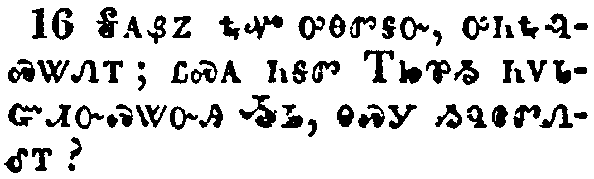</a></td>
</tr>
<tr class="even">
<td>For some, when they had heard, did provoke: howbeit not all that came out of Egypt by Moses.</td>
</tr>
<tr class="odd">
<td>ᎦᎪᏰᏃ ᎿᎭᏉ ᎤᎾᏛᎦᏅ, ᎤᏂᎿᎭᎸᏍᏔᏁᎢ; ᏝᏍᎪ ᏂᎦᏛ ᎢᏥᏈᏱ ᏂᏙᏓᏳᏗᏅᏍᏔᏅᎯ ᏱᏏ, ᎾᏍᎩ ᏱᏄᎾᏛᏁᎴᎢ?</td>
</tr>
<tr class="even">
<td>Ga-go-ye-no hna-quo u-na-dv-ga-nv, u-ni-hna-lv-s-ta-ne-i; tla-s-go ni-ga-dv I-tsi-qui-yi ni-do-da-yu-di-nv-s-ta-nv-hi Yi-si, na-s-gi yi-nu-na-dv-ne-le-i?</td>
</tr>
</tbody>
</table>

<table>
<tbody>
<tr class="odd">
<td><a href="190317.png">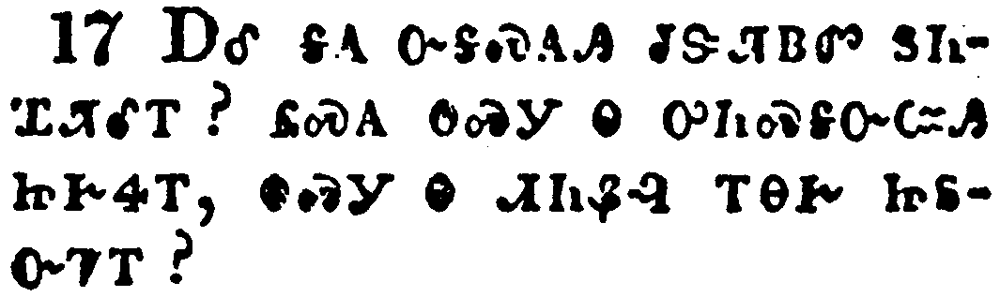</a></td>
</tr>
<tr class="even">
<td>But with whom was he grieved forty years? was it not with them that had sinned, whose carcases fell in the wilderness?</td>
</tr>
<tr class="odd">
<td>ᎠᎴ ᎦᎪ ᏅᎦᏍᎪᎯ ᏧᏕᏘᏴᏛ ᏚᏂᏆᏘᎴᎢ? ᏝᏍᎪ ᎾᏍᎩ Ꮎ ᎤᏂᏍᎦᏅᏨᎯ ᏥᎨᏎᎢ, ᎾᏍᎩ Ꮎ ᏗᏂᏰᎸ ᎢᎾᎨ ᏥᏚᏅᏤᎢ?</td>
</tr>
<tr class="even">
<td>A-le ga-go nv-ga-s-go-hi tsu-de-ti-yv-dv du-ni-qua-ti-le-i? tla-s-go na-s-gi na u-ni-s-ga-nv-tsv-hi tsi-ge-se-i, na-s-gi na di-ni-ye-lv i-na-ge tsi-du-nv-tse-i?</td>
</tr>
</tbody>
</table>

<table>
<tbody>
<tr class="odd">
<td></td>
</tr>
<tr class="even">
<td>And to whom sware he that they should not enter into his rest, but to them that believed not?</td>
</tr>
<tr class="odd">
<td>ᎠᎴ ᎦᎪ ᏚᏁᏤᎴ ᎠᏎᎵᏛᏍᎬ ᎾᏍᎩ ᎤᏂᏴᏍᏗᏱ ᏂᎨᏒᎾ ᎨᏒ ᎤᏤᎵ ᎠᏣᏪᏴᎸᏍᏙᏗᏱ? ᏝᏍᎪ ᎾᏍᎩ ᏱᎨᏎ Ꮎ ᏄᏃᎯᏳᏒᎾ ᏥᎨᏎᎢ?</td>
</tr>
<tr class="even">
<td>A-le ga-go du-ne-tse-le a-se-li-dv-s-gv na-s-gi u-ni-yv-s-di-yi ni-ge-sv-na ge-sv u-tse-li a-tsa-we-yv-lv-s-do-di-yi? tla-s-go na-s-gi yi-ge-se na nu-no-hi-yu-sv-na tsi-ge-se-i?</td>
</tr>
</tbody>
</table>

<table>
<tbody>
<tr class="odd">
<td><a href="190319.png">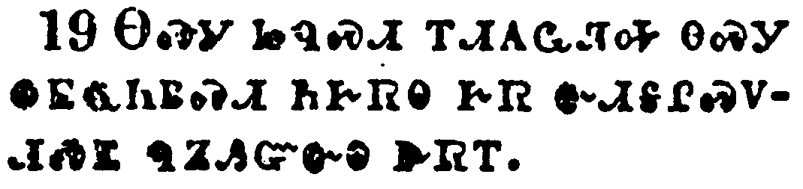</a></td>
</tr>
<tr class="even">
<td>So we see that they could not enter in because of unbelief.</td>
</tr>
<tr class="odd">
<td>ᎾᏍᎩ ᏥᏄᏍᏗ ᎢᏗᎪᏩᏘᎭ ᎾᏍᎩ ᏫᎬᏩᏂᏴᏍᏗ ᏂᎨᏒᎾ ᎨᏒ ᏅᏗᎦᎵᏍᏙᏗᏍᎬ ᏄᏃᎯᏳᏅᎾ ᎨᏒᎢ.</td>
</tr>
<tr class="even">
<td>Na-s-gi tsi-nu-s-di i-di-go-wa-ti-ha na-s-gi wi-gv-wa-ni-yv-s-di ni-ge-sv-na ge-sv nv-di-ga-li-s-do-di-s-gv nu-no-hi-yu-nv-na ge-sv-i.</td>
</tr>
</tbody>
</table>

