+++
draft=false
date = 2014-12-18T21:11:07Z
title = "Hebrews - Chapter 6 - Cherokee New Testament"
weight = 1418955067

[taxonomies]

authors = ["Timothy Legg"]
categories = []
tags = []

[extra]
+++

<table>
<tbody>
<tr class="odd">
<td><a href="190601.png">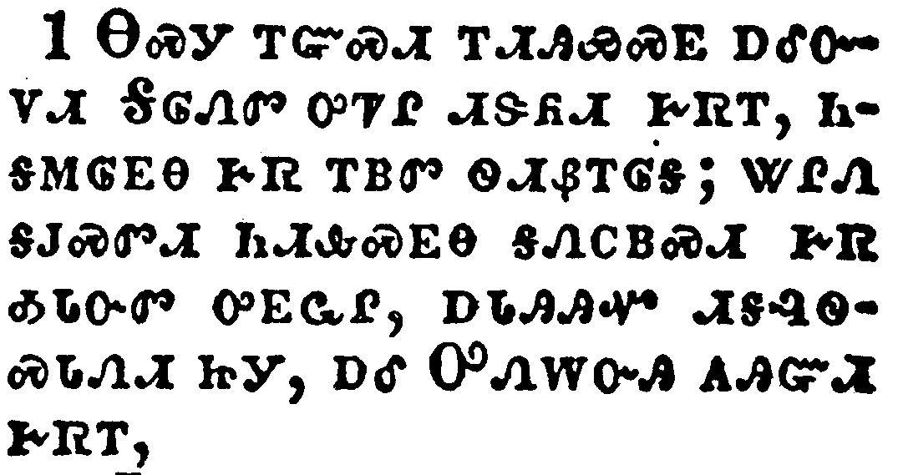</a></td>
</tr>
<tr class="even">
<td>Therefore leaving the principles of the doctrine of Christ, let us go on unto perfection; not laying again the foundation of repentance from dead works, and of faith toward God,</td>
</tr>
<tr class="odd">
<td>ᎾᏍᎩ ᎢᏳᏍᏗ ᎢᏗᎯᏯᏍᎬ ᎠᎴᏅᏙᏗ ᎦᎶᏁᏛ ᎤᏤᎵ ᏗᏕᏲᏗ ᎨᏒᎢ, ᏂᎦᎷᎶᎬᎾ ᎨᏒ ᎢᏴᏛ ᏫᏗᏰᎢᎶᎦ; ᏔᎵᏁ ᎦᎫᏍᏛᏗ ᏂᏗᎲᏍᎬᎾ ᎦᏁᏟᏴᏍᏗ ᎨᏒ ᎣᏓᏅᏛ ᎤᎬᏩᎵ, ᎠᏓᎯᎯᏉ ᏗᎦᎸᏫᏍᏓᏁᏗ ᏥᎩ, ᎠᎴ ᎤᏁᎳᏅᎯ ᎪᎯᏳᏗ ᎨᏒᎢ,</td>
</tr>
<tr class="even">
<td>Na-s-gi i-yu-s-di i-di-hi-ya-s-gv a-le-nv-do-di Ga-lo-ne-dv u-tse-li di-de-yo-di ge-sv-i, ni-ga-lu-lo-gv-na ge-sv i-yv-dv wi-di-ye-i-lo-ga; ta-li-ne ga-gu-s-dv-di ni-di-hv-s-gv-na ga-ne-tli-yv-s-di ge-sv o-da-nv-dv u-gv-wa-li, a-da-hi-hi-quo di-ga-lv-wi-s-da-ne-di tsi-gi, a-le U-ne-la-nv-hi go-hi-yu-di ge-sv-i,</td>
</tr>
</tbody>
</table>

<table>
<tbody>
<tr class="odd">
<td><a href="190602.png">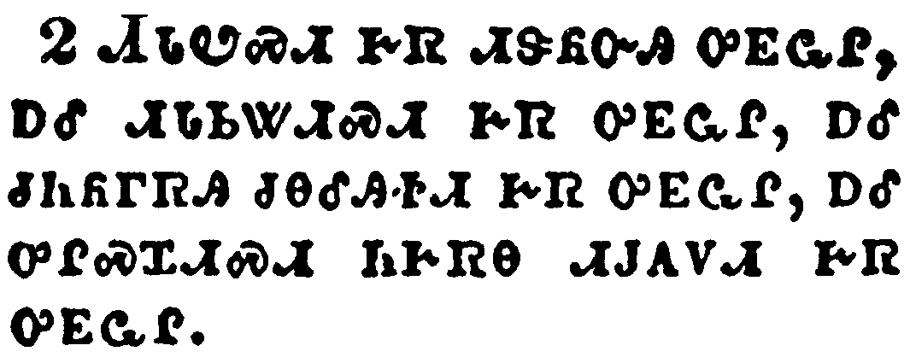</a></td>
</tr>
<tr class="even">
<td>Of the doctrine of baptisms, and of laying on of hands, and of resurrection of the dead, and of eternal judgment.</td>
</tr>
<tr class="odd">
<td>ᏗᏓᏬᏍᏗ ᎨᏒ ᏗᏕᏲᏅᎯ ᎤᎬᏩᎵ, ᎠᎴ ᏗᏓᏏᏔᏗᏍᏗ ᎨᏒ ᎤᎬᏩᎵ, ᎠᎴ ᏧᏂᏲᎱᏒᎯ ᏧᎾᎴᎯᏐᏗ ᎨᏒ ᎤᎬᏩᎵ, ᎠᎴ ᎤᎵᏍᏆᏗᏍᏗ ᏂᎨᏒᎾ ᏗᎫᎪᏙᏗ ᎨᏒ ᎤᎬᏩᎵ.</td>
</tr>
<tr class="even">
<td>Di-da-wo-s-di ge-sv di-de-yo-nv-hi u-gv-wa-li, a-le di-da-si-ta-di-s-di ge-sv u-gv-wa-li, a-le tsu-ni-yo-hu-sv-hi tsu-na-le-hi-so-di ge-sv u-gv-wa-li, a-le u-li-s-qua-di-s-di ni-ge-sv-na di-gu-go-do-di ge-sv u-gv-wa-li.</td>
</tr>
</tbody>
</table>

<table>
<tbody>
<tr class="odd">
<td><a href="190603.png">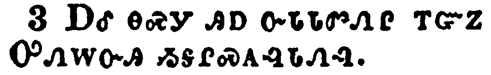</a></td>
</tr>
<tr class="even">
<td>And this will we do, if God permit.</td>
</tr>
<tr class="odd">
<td>ᎠᎴ ᎾᏍᎩ ᎯᎠ ᏅᏓᏓᏛᏁᎵ ᎢᏳᏃ ᎤᏁᎳᏅᎯ ᏱᎦᎵᏍᎪᎸᏓᏁᎸ.</td>
</tr>
<tr class="even">
<td>A-le na-s-gi hi-a nv-da-da-dv-ne-li i-yu-no U-ne-la-nv-hi yi-ga-li-s-go-lv-da-ne-lv.</td>
</tr>
</tbody>
</table>

<table>
<tbody>
<tr class="odd">
<td><a href="190604.png">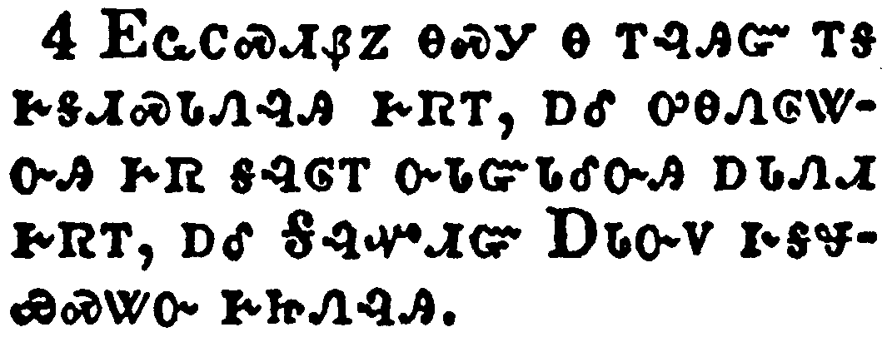</a></td>
</tr>
<tr class="even">
<td>For it is impossible for those who were once enlightened, and have tasted of the heavenly gift, and were made partakers of the Holy Ghost,</td>
</tr>
<tr class="odd">
<td>ᎬᏩᏟᏍᏗᏰᏃ ᎾᏍᎩ Ꮎ ᎢᎸᎯᏳ ᎢᎦ ᎨᎦᏗᏍᏓᏁᎸᎯ ᎨᏒᎢ, ᎠᎴ ᎤᎾᏁᎶᏔᏅᎯ ᎨᏒ ᎦᎸᎶᎢ ᏅᏓᏳᏓᎴᏅᎯ ᎠᏓᏁᏗ ᎨᏒᎢ, ᎠᎴ ᎦᎸᏉᏗᏳ ᎠᏓᏅᏙ ᎨᎦᏠᏯᏍᏔᏅ ᎨᏥᏁᎸᎯ.</td>
</tr>
<tr class="even">
<td>Gv-wa-tli-s-di-ye-no na-s-gi na i-lv-hi-yu i-ga ge-ga-di-s-da-ne-lv-hi ge-sv-i, a-le u-na-ne-lo-ta-nv-hi ge-sv ga-lv-lo-i nv-da-yu-da-le-nv-hi a-da-ne-di ge-sv-i, a-le Ga-lv-quo-di-yu A-da-nv-do ge-ga-tlo-ya-s-ta-nv ge-tsi-ne-lv-hi.</td>
</tr>
</tbody>
</table>

<table>
<tbody>
<tr class="odd">
<td><a href="190605.png">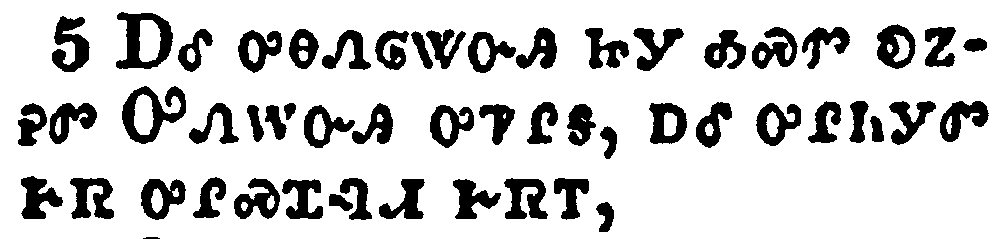</a></td>
</tr>
<tr class="even">
<td>And have tasted the good word of God, and the powers of the world to come,</td>
</tr>
<tr class="odd">
<td>ᎠᎴ ᎤᎾᏁᎶᏔᏅᎯ ᏥᎩ ᎣᏍᏛ ᎧᏃᎮᏛ ᎤᏁᎳᏅᎯ ᎤᏤᎵᎦ, ᎠᎴ ᎤᎵᏂᎩᏛ ᎨᏒ ᎤᎵᏍᏆᎸᏗ ᎨᏒᎢ,</td>
</tr>
<tr class="even">
<td>A-le u-na-ne-lo-ta-nv-hi tsi-gi o-s-dv ka-no-he-dv U-ne-la-nv-hi u-tse-li-ga, a-le u-li-ni-gi-dv ge-sv u-li-s-qua-lv-di ge-sv-i,</td>
</tr>
</tbody>
</table>

<table>
<tbody>
<tr class="odd">
<td><a href="190606.png">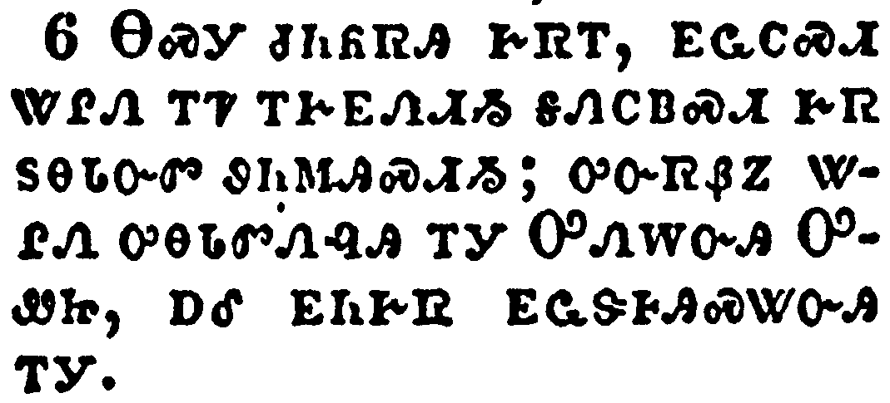</a></td>
</tr>
<tr class="even">
<td>If they shall fall away, to renew them again unto repentance; seeing they crucify to themselves the Son of God afresh, and put him to an open shame.</td>
</tr>
<tr class="odd">
<td>ᎾᏍᎩ ᏧᏂᏲᏒᎯ ᎨᏒᎢ, ᎬᏩᏟᏍᏗ ᏔᎵᏁ ᎢᏤ ᎢᎨᎬᏁᏗᏱ ᎦᏁᏟᏴᏍᏗ ᎨᏒ ᏚᎾᏓᏅᏛ ᏭᏂᎷᎯᏍᏗᏱ; ᎤᏅᏒᏰᏃ ᏔᎵᏁ ᎤᎾᏓᏛᏁᎸᎯ ᎢᎩ ᎤᏁᎳᏅᎯ ᎤᏪᏥ, ᎠᎴ ᎬᏂᎨᏒ ᎬᏩᏕᎰᎯᏍᏔᏅᎯ ᎢᎩ.</td>
</tr>
<tr class="even">
<td>Na-s-gi tsu-ni-yo-sv-hi ge-sv-i, gv-wa-tli-s-di ta-li-ne i-tse i-ge-gv-ne-di-yi ga-ne-tli-yv-s-di ge-sv du-na-da-nv-dv wu-ni-lu-hi-s-di-yi; u-nv-sv-ye-no ta-li-ne u-na-da-dv-ne-lv-hi i-gi U-ne-la-nv-hi U-we-tsi, a-le gv-ni-ge-sv gv-wa-de-ho-hi-s-ta-nv-hi i-gi.</td>
</tr>
</tbody>
</table>

<table>
<tbody>
<tr class="odd">
<td><a href="190607.png">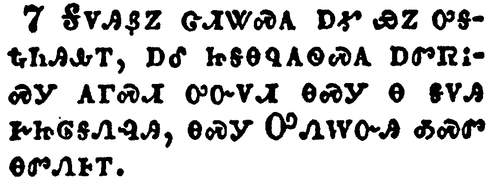</a></td>
</tr>
<tr class="even">
<td>For the earth which drinketh in the rain that cometh oft upon it, and bringeth forth herbs meet for them by whom it is dressed, receiveth blessing from God:</td>
</tr>
<tr class="odd">
<td>ᎦᏙᎯᏰᏃ ᏣᏗᏔᏍᎪ ᎠᎹ ᏯᏃ ᎤᎦᎿᎭᏂᎯᎲᎢ, ᎠᎴ ᏥᎦᎾᏄᎪᏫᏍᎪ ᎠᏛᏒᎥᏍᎩ ᎪᎱᏍᏗ ᎤᏅᏙᏗ ᎾᏍᎩ Ꮎ ᎦᏙᎯ ᎨᏥᎶᎦᏁᎸᎯ, ᎾᏍᎩ ᎤᏁᎳᏅᎯ ᎣᏍᏛ ᎾᏛᏁᎰᎢ.</td>
</tr>
<tr class="even">
<td>Ga-do-hi-ye-no tsa-di-ta-s-go a-ma ya-no u-ga-hna-ni-hi-hv-i, a-le tsi-ga-na-nu-go-wi-s-go a-dv-sv-v-s-gi go-hu-s-di u-nv-do-di na-s-gi na ga-do-hi ge-tsi-lo-ga-ne-lv-hi, na-s-gi U-ne-la-nv-hi o-s-dv na-dv-ne-ho-i.</td>
</tr>
</tbody>
</table>

<table>
<tbody>
<tr class="odd">
<td><a href="190608.png">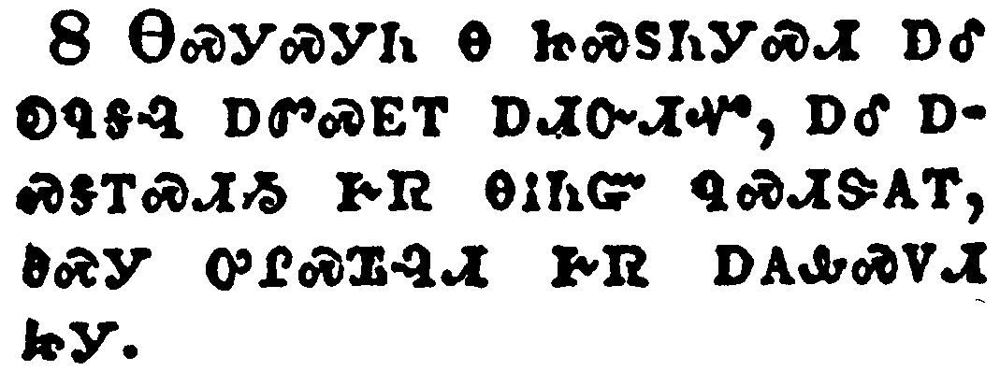</a></td>
</tr>
<tr class="even">
<td>But that which beareth thorns and briers is rejected, and is nigh unto cursing; whose end is to be burned.</td>
</tr>
<tr class="odd">
<td>ᎾᏍᎩᏍᎩᏂ Ꮎ ᏥᏍᏚᏂᎩᏍᏗ ᎠᎴ ᎧᏄᎦᎸ ᎠᏛᏍᎬᎢ ᎠᏗᏅᏗᏉ, ᎠᎴ ᎠᏍᎦᎢᏍᏗᏱ ᎨᏒ ᎾᎥᏂᏳ ᏄᏍᏗᏕᎪᎢ, ᎾᏍᎩ ᎤᎵᏍᏆᎸᏗ ᎨᏒ ᎠᎪᎲᏍᏙᏗ ᏥᎩ.</td>
</tr>
<tr class="even">
<td>Na-s-gi-s-gi-ni na tsi-s-du-ni-gi-s-di a-le ka-nu-ga-lv a-dv-s-gv-i a-di-nv-di-quo, a-le a-s-ga-i-s-di-yi ge-sv na-v-ni-yu nu-s-di-de-go-i, na-s-gi u-li-s-qua-lv-di ge-sv a-go-hv-s-do-di tsi-gi.</td>
</tr>
</tbody>
</table>

<table>
<tbody>
<tr class="odd">
<td><a href="190609.png">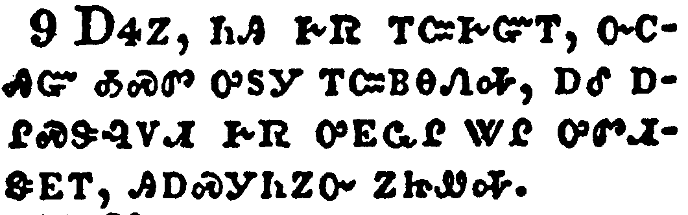</a></td>
</tr>
<tr class="even">
<td>But, beloved, we are persuaded better things of you, and things that accompany salvation, though we thus speak.</td>
</tr>
<tr class="odd">
<td>ᎠᏎᏃ, ᏂᎯ ᎨᏒ ᎢᏨᎨᏳᎢ, ᏅᏟᎯᏳ ᎣᏍᏛ ᎤᏚᎩ ᎢᏨᏴᎾᏁᎭ, ᎠᎴ ᎠᎵᏍᏕᎸᏙᏗ ᎨᏒ ᎤᎬᏩᎵ ᏔᎵ ᎤᏛᏗᏕᎬᎢ, ᎯᎠᏍᎩᏂᏃᏅ ᏃᏥᏪᎭ.</td>
</tr>
<tr class="even">
<td>A-se-no, ni-hi ge-sv i-tsv-ge-yu-i, nv-tli-hi-yu o-s-dv u-du-gi i-tsv-yv-na-ne-ha, a-le a-li-s-de-lv-do-di ge-sv u-gv-wa-li ta-li u-dv-di-de-gv-i, hi-a-s-gi-ni-no-nv no-tsi-we-ha.</td>
</tr>
</tbody>
</table>

<table>
<tbody>
<tr class="odd">
<td><a href="190610.png">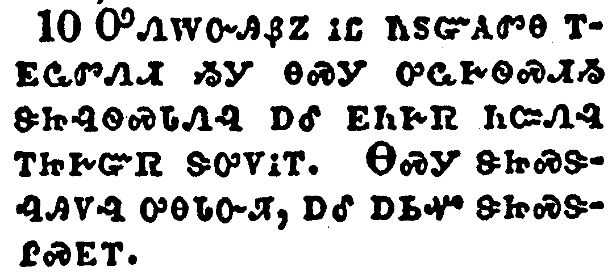</a></td>
</tr>
<tr class="even">
<td>For God is not unrighteous to forget your work and labour of love, which ye have shewed toward his name, in that ye have ministered to the saints, and do minister.</td>
</tr>
<tr class="odd">
<td>ᎤᏁᎳᏅᎯᏰᏃ ᎥᏝ ᏂᏚᏳᎪᏛᎾ ᎢᎬᏩᏛᏁᏗ ᏱᎩ ᎾᏍᎩ ᎤᏩᎨᏫᏍᏗᏱ ᏕᏥᎸᏫᏍᏓᏁᎸ ᎠᎴ ᎬᏂᎨᏒ ᏂᏨᏁᎸ ᎢᏥᎨᏳᏒ ᏕᎤᏙᎥᎢ. ᎾᏍᎩ ᏕᏥᏍᏕᎸᎯᏙᎸ ᎤᎾᏓᏅᏘ, ᎠᎴ ᎠᏏᏉ ᏕᏥᏍᏕᎵᏍᎬᎢ.</td>
</tr>
<tr class="even">
<td>U-ne-la-nv-hi-ye-no v-tla ni-du-yu-go-dv-na i-gv-wa-dv-ne-di yi-gi na-s-gi u-wa-ge-wi-s-di-yi de-tsi-lv-wi-s-da-ne-lv a-le gv-ni-ge-sv ni-tsv-ne-lv i-tsi-ge-yu-sv de-u-do-v-i. Na-s-gi de-tsi-s-de-lv-hi-do-lv u-na-da-nv-ti, a-le a-si-quo de-tsi-s-de-li-s-gv-i.</td>
</tr>
</tbody>
</table>

<table>
<tbody>
<tr class="odd">
<td><a href="190611.png">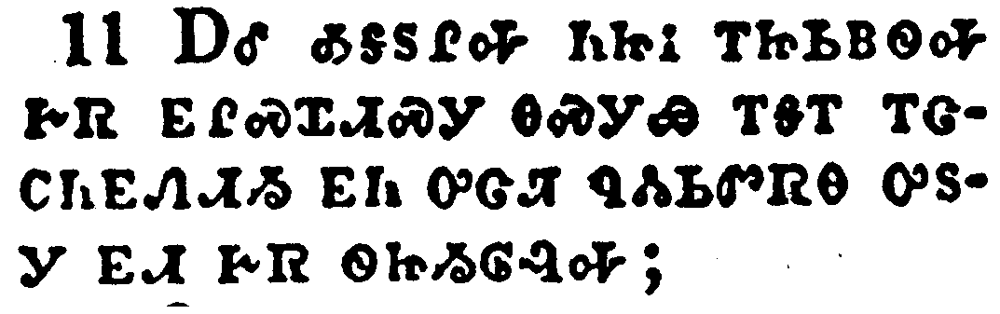</a></td>
</tr>
<tr class="even">
<td>And we desire that every one of you do shew the same diligence to the full assurance of hope unto the end:</td>
</tr>
<tr class="odd">
<td>ᎠᎴ ᎣᎦᏚᎵᎭ ᏂᏥᎥ ᎢᏥᏏᏴᏫᎭ ᎨᏒ ᎬᎵᏍᏆᏗᏍᎩ ᎾᏍᎩᏯ ᎢᎦᎢ ᎢᏣᏟᏂᎬᏁᏗᏱ ᎬᏂ ᎤᏣᏘ ᏄᏜᏓᏏᏛᏒᎾ ᎤᏚᎩ ᎬᏗ ᎨᏒ ᏫᏥᏱᎶᎸᎭ;</td>
</tr>
<tr class="even">
<td>A-le o-ga-du-li-ha ni-tsi-v i-tsi-si-yv-wi-ha ge-sv gv-li-s-qua-di-s-gi na-s-gi-ya i-ga-i i-tsa-tli-ni-gv-ne-di-yi gv-ni u-tsa-ti nu-dla-si-dv-sv-na u-du-gi gv-di ge-sv wi-tsi-yi-lo-lv-ha;</td>
</tr>
</tbody>
</table>

<table>
<tbody>
<tr class="odd">
<td><a href="190612.png">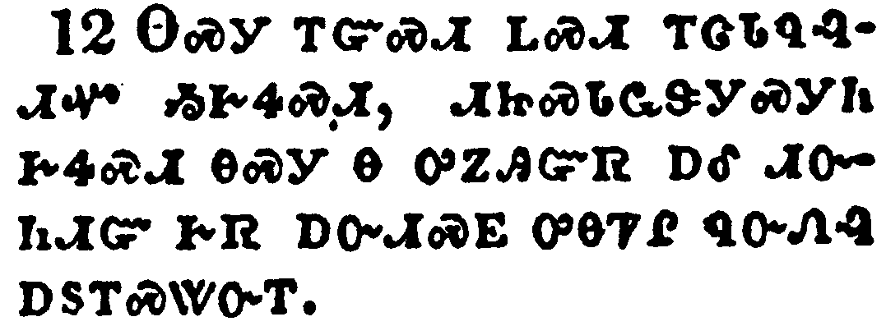</a></td>
</tr>
<tr class="even">
<td>That ye be not slothful, but followers of them who through faith and patience inherit the promises.</td>
</tr>
<tr class="odd">
<td>ᎾᏍᎩ ᎢᏳᏍᏗ ᏞᏍᏗ ᎢᏣᏓᏄᎸᏗᏉ ᏱᎨᏎᏍᏗ, ᏗᏥᏍᏓᏩᏕᎩᏍᎩᏂ ᎨᏎᏍᏗ ᎾᏍᎩ Ꮎ ᎤᏃᎯᏳᏒ ᎠᎴ ᏗᏅᏂᏗᏳ ᎨᏒ ᎠᏅᏗᏍᎬ ᎤᎾᏤᎵ ᏄᏅᏁᎸ ᎠᏚᎢᏍᏔᏅᎢ.</td>
</tr>
<tr class="even">
<td>Na-s-gi i-yu-s-di tle-s-di i-tsa-da-nu-lv-di-quo yi-ge-se-s-di, di-tsi-s-da-wa-de-gi-s-gi-ni ge-se-s-di na-s-gi na u-no-hi-yu-sv a-le di-nv-ni-di-yu ge-sv a-nv-di-s-gv u-na-tse-li nu-nv-ne-lv a-du-i-s-ta-nv-i.</td>
</tr>
</tbody>
</table>

<table>
<tbody>
<tr class="odd">
<td><a href="190613.png">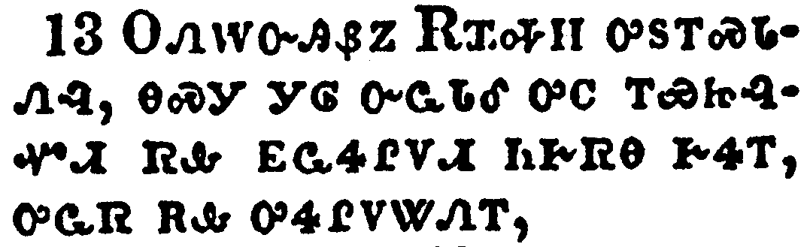</a></td>
</tr>
<tr class="even">
<td>For when God made promise to Abraham, because he could swear by no greater, he sware by himself,</td>
</tr>
<tr class="odd">
<td>ᎤᏁᎳᏅᎯᏰᏃ ᎡᏆᎭᎻ ᎤᏚᎢᏍᏓᏁᎸ, ᎾᏍᎩ ᎩᎶ ᏅᏩᏓᎴ ᎤᏟ ᎢᏯᏥᎸᏉᏗ ᏒᎲ ᎬᏩᏎᎵᏙᏗ ᏂᎨᏒᎾ ᎨᏎᎢ, ᎤᏩᏒ ᎡᎲ ᎤᏎᎵᏙᏔᏁᎢ,</td>
</tr>
<tr class="even">
<td>U-ne-la-nv-hi-ye-no E-qua-ha-mi u-du-i-s-da-ne-lv, na-s-gi gi-lo nv-wa-da-le u-tli i-ya-tsi-lv-quo-di sv-hv gv-wa-se-li-do-di ni-ge-sv-na ge-se-i, u-wa-sv e-hv u-se-li-do-ta-ne-i,</td>
</tr>
</tbody>
</table>

<table>
<tbody>
<tr class="odd">
<td><a href="190614.png">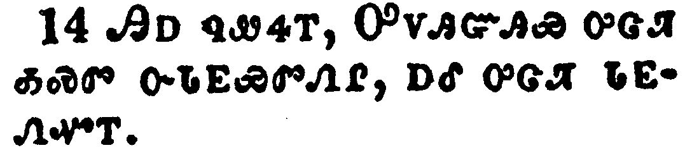</a></td>
</tr>
<tr class="even">
<td>Saying, Surely blessing I will bless thee, and multiplying I will multiply thee.</td>
</tr>
<tr class="odd">
<td>ᎯᎠ ᏄᏪᏎᎢ, ᎤᏙᎯᏳᎯᏯ ᎤᏣᏘ ᎣᏍᏛ ᏅᏓᎬᏯᏛᏁᎵ, ᎠᎴ ᎤᏣᏘ ᏓᎬᏁᏉᎢ.</td>
</tr>
<tr class="even">
<td>Hi-a nu-we-se-i, U-do-hi-yu-hi-ya u-tsa-ti o-s-dv nv-da-gv-ya-dv-ne-li, a-le u-tsa-ti da-gv-ne-quo-i.</td>
</tr>
</tbody>
</table>

<table>
<tbody>
<tr class="odd">
<td></td>
</tr>
<tr class="even">
<td>And so, after he had patiently endured, he obtained the promise.</td>
</tr>
<tr class="odd">
<td>ᎰᏩᏃ ᎪᎯᏗᏳ ᎤᎦᏘᏛ ᎠᏥᏁᎴ ᎠᏚᎢᏍᏔᏅᎯ ᎨᏒᎢ.</td>
</tr>
<tr class="even">
<td>Ho-wa-no go-hi-di-yu u-ga-ti-dv a-tsi-ne-le a-du-i-s-ta-nv-hi ge-sv-i.</td>
</tr>
</tbody>
</table>

<table>
<tbody>
<tr class="odd">
<td><a href="190616.png">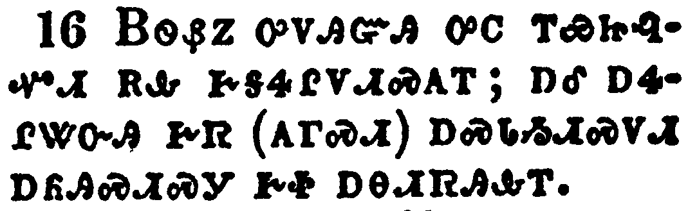</a></td>
</tr>
<tr class="even">
<td>For men verily swear by the greater: and an oath for confirmation is to them an end of all strife.</td>
</tr>
<tr class="odd">
<td>ᏴᏫᏰᏃ ᎤᏙᎯᏳᎯ ᎤᏟ ᎢᏯᏥᎸᏉᏗ ᎡᎲ ᎨᎦᏎᎵᏙᏗᏍᎪᎢ; ᎠᎴ ᎠᏎᎵᏔᏅᎯ ᎨᏒ (ᎪᎱᏍᏗ) ᎠᏍᏓᏱᏗᏍᏙᏗ ᎠᏲᎯᏍᏗᏍᎩ ᎨᏐ ᎠᎾᏗᏒᎯᎲᎢ.</td>
</tr>
<tr class="even">
<td>Yv-wi-ye-no u-do-hi-yu-hi u-tli i-ya-tsi-lv-quo-di e-hv ge-ga-se-li-do-di-s-go-i; a-le a-se-li-ta-nv-hi ge-sv (go-hu-s-di) a-s-da-yi-di-s-do-di a-yo-hi-s-di-s-gi ge-so a-na-di-sv-hi-hv-i.</td>
</tr>
</tbody>
</table>

<table>
<tbody>
<tr class="odd">
<td><a href="190617.png">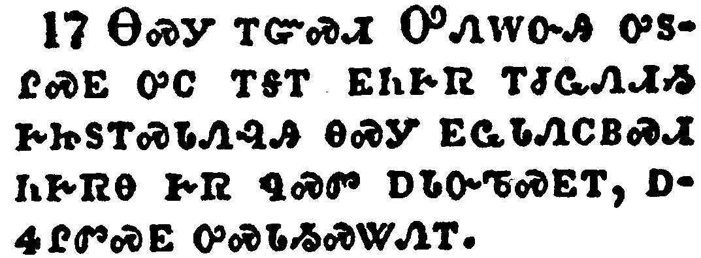</a></td>
</tr>
<tr class="even">
<td>Wherein God, willing more abundantly to shew unto the heirs of promise the immutability of his counsel, confirmed it by an oath:</td>
</tr>
<tr class="odd">
<td>ᎾᏍᎩ ᎢᏳᏍᏗ ᎤᏁᎳᏅᎯ ᎤᏚᎵᏍᎬ ᎤᏟ ᎢᎦᎢ ᎬᏂᎨᏒ ᎢᏧᏩᏁᏗᏱ ᎨᏥᏚᎢᏍᏓᏁᎸᎯ ᎾᏍᎩ ᎬᏩᏓᏁᏟᏴᏍᏗ ᏂᎨᏒᎾ ᎨᏒ ᏄᏍᏛ ᎠᏓᏅᏖᏍᎬᎢ, ᎠᏎᎵᏛᏍᎬ ᎤᏍᏓᏱᏍᏔᏁᎢ.</td>
</tr>
<tr class="even">
<td>Na-s-gi i-yu-s-di U-ne-la-nv-hi u-du-li-s-gv u-tli i-ga-i gv-ni-ge-sv i-tsu-wa-ne-di-yi ge-tsi-du-i-s-da-ne-lv-hi na-s-gi gv-wa-da-ne-tli-yv-s-di ni-ge-sv-na ge-sv nu-s-dv a-da-nv-te-s-gv-i, a-se-li-dv-s-gv u-s-da-yi-s-ta-ne-i.</td>
</tr>
</tbody>
</table>

<table>
<tbody>
<tr class="odd">
<td><a href="190618.png">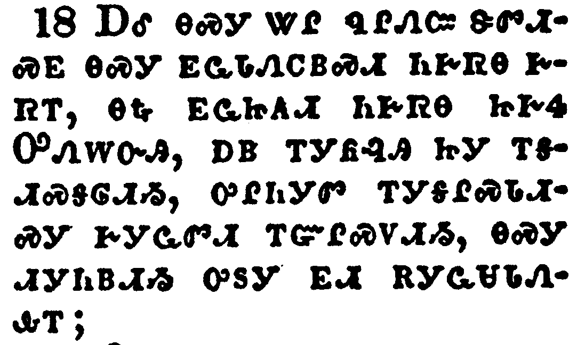</a></td>
</tr>
<tr class="even">
<td>That by two immutable things, in which it was impossible for God to lie, we might have a strong consolation, who have fled for refuge to lay hold upon the hope set before us:</td>
</tr>
<tr class="odd">
<td>ᎠᎴ ᎾᏍᎩ ᏔᎵ ᏄᎵᏁᏨ ᏕᏛᏗᏍᎬ ᎾᏍᎩ ᎬᏩᏓᏁᏟᏴᏍᏗ ᏂᎨᏒᎾ ᎨᏒᎢ, ᎾᎿᎭᎬᏩᏥᎪᏗ ᏂᎨᏒᎾ ᏥᎨᎭ ᎤᏁᎳᏅᎯ, ᎠᏴ ᎢᎩᏲᎸᎯ ᏥᎩ ᎢᎦᏗᏍᎦᎶᏗᏱ, ᎤᎵᏂᎩᏛ ᎢᎩᎦᎵᏍᏓᏗᏍᎩ ᎨᎩᏩᏛᏗ ᎢᏳᎵᏍᏙᏗᏱ, ᎾᏍᎩ ᏗᎩᏂᏴᏗᏱ ᎤᏚᎩ ᎬᏗ ᎡᎩᏩᏌᏓᏁᎲᎢ;</td>
</tr>
<tr class="even">
<td>A-le na-s-gi ta-li nu-li-ne-tsv de-dv-di-s-gv na-s-gi gv-wa-da-ne-tli-yv-s-di ni-ge-sv-na ge-sv-i, na-hna gv-wa-tsi-go-di ni-ge-sv-na tsi-ge-ha U-ne-la-nv-hi, a-yv i-gi-yo-lv-hi tsi-gi i-ga-di-s-ga-lo-di-yi, u-li-ni-gi-dv i-gi-ga-li-s-da-di-s-gi ge-gi-wa-dv-di i-yu-li-s-do-di-yi, na-s-gi di-gi-ni-yv-di-yi u-du-gi gv-di e-gi-wa-sa-da-ne-hv-i;</td>
</tr>
</tbody>
</table>

<table>
<tbody>
<tr class="odd">
<td><a href="190619.png">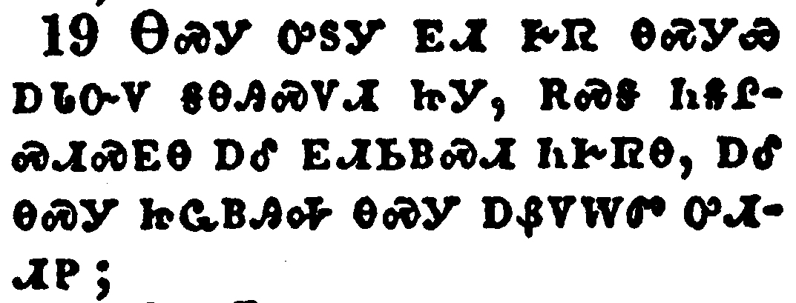</a></td>
</tr>
<tr class="even">
<td>Which hope we have as an anchor of the soul, both sure and stedfast, and which entereth into that within the veil;</td>
</tr>
<tr class="odd">
<td>ᎾᏍᎩ ᎤᏚᎩ ᎬᏗ ᎨᏒ ᎾᏍᎩᏯ ᎠᏓᏅᏙ ᎦᎾᎯᏍᏙᏗ ᏥᎩ, ᎡᏍᎦ ᏂᎦᎵᏍᏗᏍᎬᎾ ᎠᎴ ᎬᏗᏏᏴᏍᏗ ᏂᎨᏒᎾ, ᎠᎴ ᎾᏍᎩ ᏥᏩᏴᎯᎭ ᎾᏍᎩ ᎠᏰᏙᎳᏛ ᎤᏗᏗᏢ;</td>
</tr>
<tr class="even">
<td>Na-s-gi u-du-gi gv-di ge-sv na-s-gi-ya a-da-nv-do ga-na-hi-s-do-di tsi-gi, e-s-ga ni-ga-li-s-di-s-gv-na a-le gv-di-si-yv-s-di ni-ge-sv-na, a-le na-s-gi tsi-wa-yv-hi-ha na-s-gi a-ye-do-la-dv u-di-di-tlv;</td>
</tr>
</tbody>
</table>

<table>
<tbody>
<tr class="odd">
<td><a href="190620.png">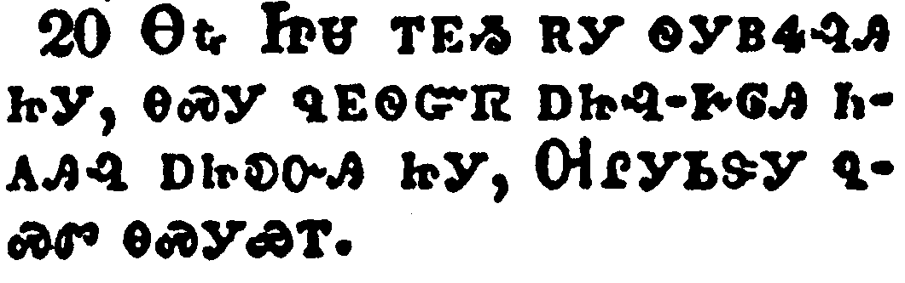</a></td>
</tr>
<tr class="even">
<td>Whither the forerunner is for us entered, even Jesus, made an high priest for ever after the order of Melchisedec.</td>
</tr>
<tr class="odd">
<td>ᎾᎿᎭᏥᏌ ᎢᎬᏱ ᎡᎩ ᏫᎩᏴᏎᎸᎯ ᏥᎩ, ᎾᏍᎩ ᏄᎬᏫᏳᏒ ᎠᏥᎸ-ᎨᎶᎯ ᏂᎪᎯᎸ ᎠᏥᎧᏅᎯ ᏥᎩ, ᎺᎵᎩᏏᏕᎩ ᏄᏍᏛ ᎾᏍᎩᏯᎢ.</td>
</tr>
<tr class="even">
<td>Na-hna Tsi-sa i-gv-yi e-gi wi-gi-yv-se-lv-hi tsi-gi, na-s-gi nu-gv-wi-yu-sv a-tsi-lv--ge-lo-hi ni-go-hi-lv a-tsi-ka-nv-hi tsi-gi, Me-li-gi-si-de-gi nu-s-dv na-s-gi-ya-i.</td>
</tr>
</tbody>
</table>

