+++
draft=false
date = 2014-12-18T21:11:07Z
title = "Hebrews - Chapter 11 - Cherokee New Testament"
weight = 1418955067

[taxonomies]

authors = ["Timothy Legg"]
categories = []
tags = []

[extra]
+++

<table>
<tbody>
<tr class="odd">
<td><a href="191101.png">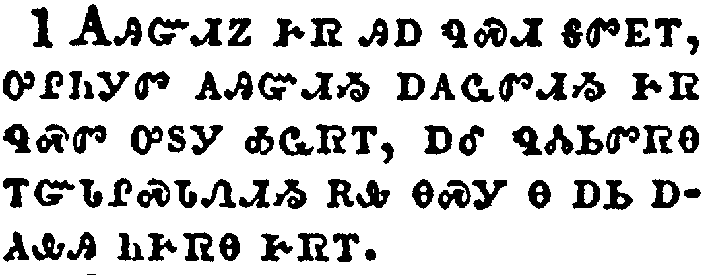</a></td>
</tr>
<tr class="even">
<td>Now faith is the substance of things hoped for, the evidence of things not seen.</td>
</tr>
<tr class="odd">
<td>ᎪᎯᏳᏗᏃ ᎨᏒ ᎯᎠ ᏄᏍᏗ ᎦᏛᎬᎢ, ᎤᎵᏂᎩᏛ ᎪᎯᏳᏗᏱ ᎠᎪᏩᏛᏗᏱ ᎨᏒ ᏄᏍᏛ ᎤᏚᎩ ᎣᏩᏒᎢ, ᎠᎴ ᏄᏜᏓᏏᏛᏒᎾ ᎢᏳᏓᎵᏍᏓᏁᏗᏱ ᎡᎲ ᎾᏍᎩ Ꮎ ᎠᏏ ᎠᎪᎲᎯ ᏂᎨᏒᎾ ᎨᏒᎢ.</td>
</tr>
<tr class="even">
<td>Go-hi-yu-di-no ge-sv hi-a nu-s-di ga-dv-gv-i, u-li-ni-gi-dv go-hi-yu-di-yi a-go-wa-dv-di-yi ge-sv nu-s-dv u-du-gi o-wa-sv-i, a-le nu-dla-si-dv-sv-na i-yu-da-li-s-da-ne-di-yi e-hv na-s-gi na a-si a-go-hv-hi ni-ge-sv-na ge-sv-i.</td>
</tr>
</tbody>
</table>

<table>
<tbody>
<tr class="odd">
<td><a href="191102.png">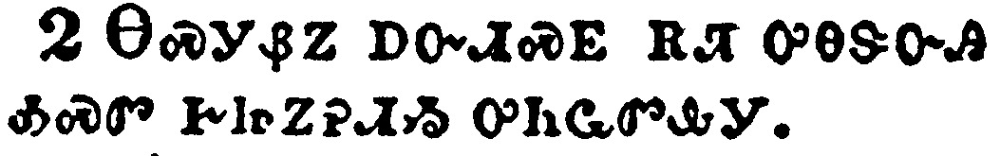</a></td>
</tr>
<tr class="even">
<td>For by it the elders obtained a good report.</td>
</tr>
<tr class="odd">
<td>ᎾᏍᎩᏰᏃ ᎠᏅᏗᏍᎬ ᎡᏘ ᎤᎾᏕᏅᎯ ᎣᏍᏛ ᎨᏥᏃᎮᏗᏱ ᎤᏂᏩᏛᎲᎩ.</td>
</tr>
<tr class="even">
<td>Na-s-gi-ye-no a-nv-di-s-gv e-ti u-na-de-nv-hi o-s-dv ge-tsi-no-he-di-yi u-ni-wa-dv-hv-gi.</td>
</tr>
</tbody>
</table>

<table>
<tbody>
<tr class="odd">
<td><a href="191103.png">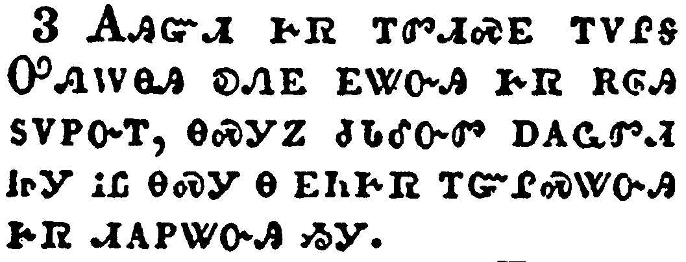</a></td>
</tr>
<tr class="even">
<td>Through faith we understand that the worlds were framed by the word of God, so that things which are seen were not made of things which do appear.</td>
</tr>
<tr class="odd">
<td>ᎪᎯᏳᏗ ᎨᏒ ᎢᏛᏗᏍᎬ ᎢᏙᎵᎦ ᎤᏁᎳᏅᎯ ᎧᏁᎬ ᎬᏔᏅᎯ ᎨᏒ ᎡᎶᎯ ᏚᏙᏢᏅᎢ, ᎾᏍᎩᏃ ᏧᏓᎴᏅᏛ ᎠᎪᏩᏛᏗ ᏥᎩ ᎥᏝ ᎾᏍᎩ Ꮎ ᎬᏂᎨᏒ ᎢᏳᎵᏍᏔᏅᎯ ᎨᏒ ᏗᎪᏢᏔᏅᎯ ᏱᎩ.</td>
</tr>
<tr class="even">
<td>Go-hi-yu-di ge-sv i-dv-di-s-gv i-do-li-ga U-ne-la-nv-hi ka-ne-gv gv-ta-nv-hi ge-sv e-lo-hi du-do-tlv-nv-i, na-s-gi-no tsu-da-le-nv-dv a-go-wa-dv-di tsi-gi v-tla na-s-gi na gv-ni-ge-sv i-yu-li-s-ta-nv-hi ge-sv di-go-tlv-ta-nv-hi yi-gi.</td>
</tr>
</tbody>
</table>

<table>
<tbody>
<tr class="odd">
<td><a href="191104.png">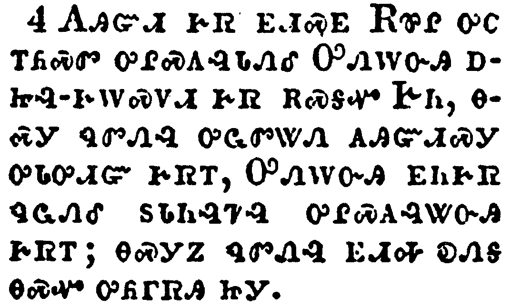</a></td>
</tr>
<tr class="even">
<td>By faith Abel offered unto God a more excellent sacrifice than Cain, by which he obtained witness that he was righteous, God testifying of his gifts: and by it he being dead yet speaketh.</td>
</tr>
<tr class="odd">
<td>ᎪᎯᏳᏗ ᎨᏒ ᎬᏗᏍᎬ ᎡᏈᎵ ᎤᏟ ᎢᏲᏍᏛ ᎤᎵᏍᎪᎸᏓᏁᎴ ᎤᏁᎳᏅᎯ ᎠᏥᎸ-ᎨᎳᏍᏙᏗ ᎨᏒ ᎡᏍᎦᏉ ᎨᏂ, ᎾᏍᎩ ᏄᏛᏁᎸ ᎤᏩᏛᏔᏁ ᎪᎯᏳᏗᏍᎩ ᎤᏓᎤᏗᏳ ᎨᏒᎢ, ᎤᏁᎳᏅᎯ ᎬᏂᎨᏒ ᏄᏩᏁᎴ ᏚᏓᏂᎸᏤᎸ ᎤᎵᏍᎪᎸᏔᏅᎯ ᎨᏒᎢ; ᎾᏍᎩᏃ ᏄᏛᏁᎸ ᎬᏗᎭ ᎧᏁᎦ ᎾᏍᏉ ᎤᏲᎱᏒᎯ ᏥᎩ.</td>
</tr>
<tr class="even">
<td>Go-hi-yu-di ge-sv gv-di-s-gv E-qui-li u-tli i-yo-s-dv u-li-s-go-lv-da-ne-le U-ne-la-nv-hi a-tsi-lv--ge-la-s-do-di ge-sv e-s-ga-quo Ge-ni, na-s-gi nu-dv-ne-lv u-wa-dv-ta-ne go-hi-yu-di-s-gi u-da-u-di-yu ge-sv-i, U-ne-la-nv-hi gv-ni-ge-sv nu-wa-ne-le du-da-ni-lv-tse-lv u-li-s-go-lv-ta-nv-hi ge-sv-i; na-s-gi-no nu-dv-ne-lv gv-di-ha ka-ne-ga na-s-quo u-yo-hu-sv-hi tsi-gi.</td>
</tr>
</tbody>
</table>

<table>
<tbody>
<tr class="odd">
<td><a href="191105.png">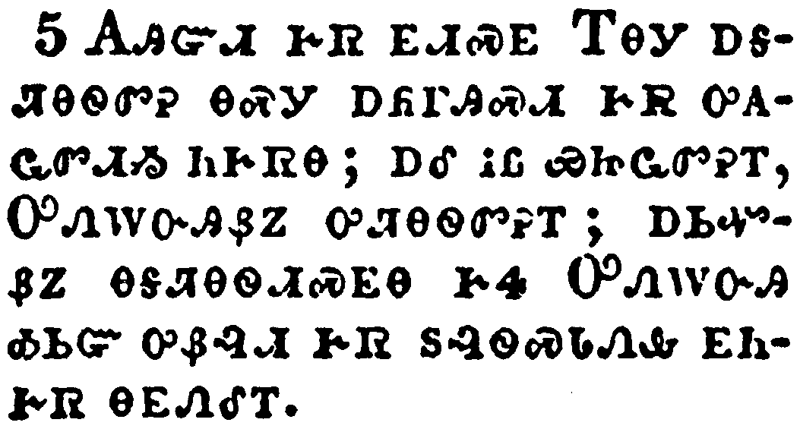</a></td>
</tr>
<tr class="even">
<td>By faith Enoch was translated that he should not see death; and was not found, because God had translated him: for before his translation he had this testimony, that he pleased God.</td>
</tr>
<tr class="odd">
<td>ᎦᎯᏳᏗ ᎨᏒ ᎬᏗᏍᎬ ᎢᎾᎩ ᎠᎦᏘᎾᏫᏛᎮ ᎾᏍᎩ ᎠᏲᎱᎯᏍᏗ ᎨᏒ ᎤᎪᏩᏛᏗᏱ ᏂᎨᏒᎾ; ᎠᎴ ᎥᏝ ᏯᏥᏩᏛᎮᎢ, ᎤᏁᎳᏅᎯᏰᏃ ᎤᏘᎾᏫᏛᎮᎢ; ᎠᏏᏉᏰᏃ ᎾᎦᏘᎾᏫᏗᏍᎬᎾ ᎨᏎ ᎤᏁᎳᏅᎯ ᎣᏏᏳ ᎤᏰᎸᏗ ᎨᏒ ᏚᎸᏫᏍᏓᏁᎲ ᎬᏂᎨᏒ ᎾᎬᏁᎴᎢ.</td>
</tr>
<tr class="even">
<td>Ga-hi-yu-di ge-sv gv-di-s-gv I-na-gi a-ga-ti-na-wi-dv-he na-s-gi a-yo-hu-hi-s-di ge-sv u-go-wa-dv-di-yi ni-ge-sv-na; a-le v-tla ya-tsi-wa-dv-he-i, U-ne-la-nv-hi-ye-no u-ti-na-wi-dv-he-i; a-si-quo-ye-no na-ga-ti-na-wi-di-s-gv-na ge-se U-ne-la-nv-hi o-si-yu u-ye-lv-di ge-sv du-lv-wi-s-da-ne-hv gv-ni-ge-sv na-gv-ne-le-i.</td>
</tr>
</tbody>
</table>

<table>
<tbody>
<tr class="odd">
<td><a href="191106.png">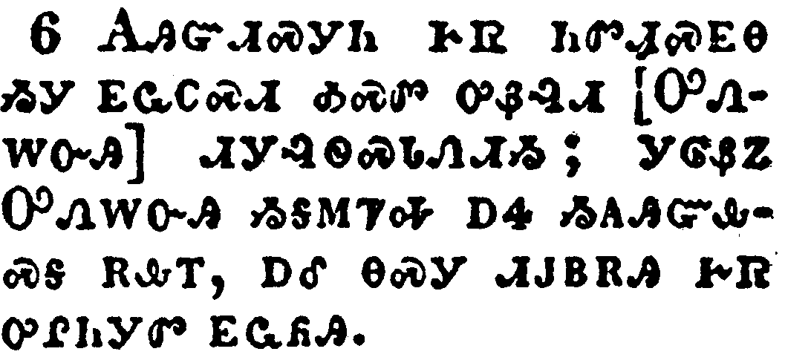</a></td>
</tr>
<tr class="even">
<td>But without faith it is impossible to please him: for he that cometh to God must believe that he is, and that he is a rewarder of them that diligently seek him.</td>
</tr>
<tr class="odd">
<td>ᎪᎯᏳᏗᏍᎩᏂ ᎨᏒ ᏂᏛᏗᏍᎬᎾ ᏱᎩ ᎬᏩᏟᏍᏗ ᎣᏍᏛ ᎤᏰᎸᏗ [ᎤᏁᎳᏅᎯ] ᏗᎩᎸᏫᏍᏓᏁᏗᏱ; ᎩᎶᏰᏃ ᎤᏁᎳᏅᎯ ᏱᎦᎷᏤᎭ ᎠᏎ ᏱᎪᎯᏳᎲᏍᎦ ᎡᎲᎢ, ᎠᎴ ᎾᏍᎩ ᏗᎫᏴᎡᎯ ᎨᏒ ᎤᎵᏂᎩᏛ ᎬᏩᏲᎯ.</td>
</tr>
<tr class="even">
<td>Go-hi-yu-di-s-gi-ni ge-sv ni-dv-di-s-gv-na yi-gi gv-wa-tli-s-di o-s-dv u-ye-lv-di [U-ne-la-nv-hi] di-gi-lv-wi-s-da-ne-di-yi; gi-lo-ye-no U-ne-la-nv-hi yi-ga-lu-tse-ha a-se yi-go-hi-yu-hv-s-ga e-hv-i, a-le na-s-gi di-gu-yv-e-hi ge-sv u-li-ni-gi-dv gv-wa-yo-hi.</td>
</tr>
</tbody>
</table>

<table>
<tbody>
<tr class="odd">
<td><a href="191107.png">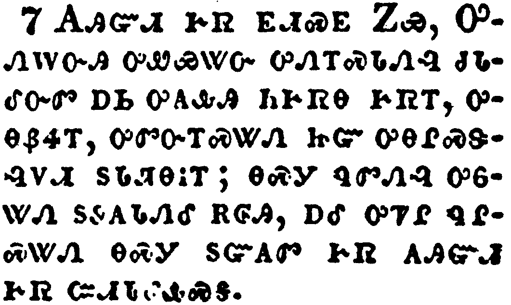</a></td>
</tr>
<tr class="even">
<td>By faith Noah, being warned of God of things not seen as yet, moved with fear, prepared an ark to the saving of his house; by the which he condemned the world, and became heir of the righteousness which is by faith.</td>
</tr>
<tr class="odd">
<td>ᎪᎯᏳᏗ ᎨᏒ ᎬᏗᏍᎬ ᏃᏯ, ᎤᏁᎳᏅᎯ ᎤᏪᏯᏔᏅ ᎤᏁᎢᏍᏓᏁᎸ ᏧᏓᎴᏅᏛ ᎠᏏ ᎤᎪᎲᎯ ᏂᎨᏒᎾ ᎨᏒᎢ, ᎤᎾᏰᏎᎢ, ᎤᏛᏅᎢᏍᏔᏁ ᏥᏳ ᎤᎾᎵᏍᏕᎸᏙᏗ ᏚᏓᏘᎾᎥᎢ; ᎾᏍᎩ ᏄᏛᏁᎸ ᎤᏮᏔᏁ ᏚᏭᎪᏓᏁᎴ ᎡᎶᎯ, ᎠᎴ ᎤᏤᎵ ᏄᎵᏍᏔᏁ ᎾᏍᎩ ᏚᏳᎪᏛ ᎨᏒ ᎪᎯᏳᏗ ᎨᏒ ᏨᏗᏓᎴᎲᏍᎦ.</td>
</tr>
<tr class="even">
<td>Go-hi-yu-di ge-sv gv-di-s-gv No-ya, U-ne-la-nv-hi u-we-ya-ta-nv u-ne-i-s-da-ne-lv tsu-da-le-nv-dv a-si u-go-hv-hi ni-ge-sv-na ge-sv-i, u-na-ye-se-i, u-dv-nv-i-s-ta-ne tsi-yu u-na-li-s-de-lv-do-di du-da-ti-na-v-i; na-s-gi nu-dv-ne-lv u-wv-ta-ne du-wu-go-da-ne-le e-lo-hi, a-le u-tse-li nu-li-s-ta-ne na-s-gi du-yu-go-dv ge-sv go-hi-yu-di ge-sv tsv-di-da-le-hv-s-ga.</td>
</tr>
</tbody>
</table>

<table>
<tbody>
<tr class="odd">
<td><a href="191108.png">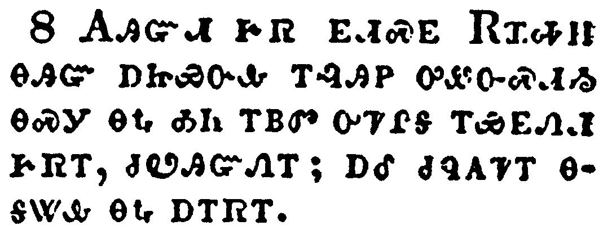</a></td>
</tr>
<tr class="even">
<td>By faith Abraham, when he was called to go out into a place which he should after receive for an inheritance, obeyed; and he went out, not knowing whither he went.</td>
</tr>
<tr class="odd">
<td>ᎪᎯᏳᏗ ᎨᏒ ᎬᏗᏍᎬ ᎡᏆᎭᎻ ᎾᎯᏳ ᎠᏥᏯᏅᎲ ᎢᎸᎯᏢ ᎤᏪᏅᏍᏗᏱ ᎾᏍᎩ ᎾᎿᎭᎣᏂ ᎢᏴᏛ ᎤᏤᎵᎦ ᎢᏯᎬᏁᏗ ᎨᏒᎢ, ᏧᏬᎯᏳᏁᎢ; ᎠᎴ ᏧᏄᎪᏤᎢ ᎾᎦᏔᎲ ᎾᎿᎭᎠᎢᏒᎢ.</td>
</tr>
<tr class="even">
<td>Go-hi-yu-di ge-sv gv-di-s-gv E-qua-ha-mi na-hi-yu a-tsi-ya-nv-hv i-lv-hi-tlv u-we-nv-s-di-yi na-s-gi na-hna o-ni i-yv-dv u-tse-li-ga i-ya-gv-ne-di ge-sv-i, tsu-wo-hi-yu-ne-i; a-le tsu-nu-go-tse-i na-ga-ta-hv na-hna a-i-sv-i.</td>
</tr>
</tbody>
</table>

<table>
<tbody>
<tr class="odd">
<td><a href="191109.png">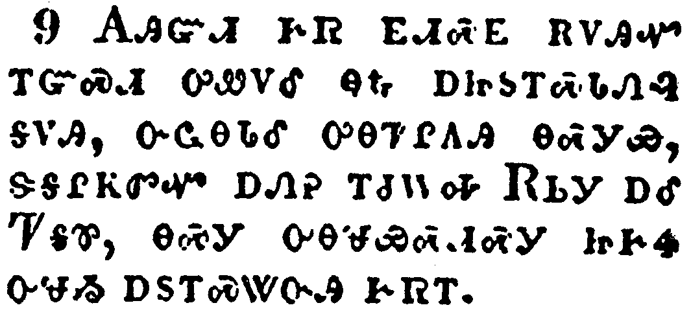</a></td>
</tr>
<tr class="even">
<td>By faith he sojourned in the land of promise, as in a strange country, dwelling in tabernacles with Isaac and Jacob, the heirs with him of the same promise:</td>
</tr>
<tr class="odd">
<td>ᎪᎯᏳᏗ ᎨᏒ ᎬᏗᏍᎬ ᎡᏙᎯᏉ ᎢᏳᏍᏗ ᎤᏪᏙᎴ ᎾᎿᎭᎠᏥᏚᎢᏍᏓᏁᎸ ᎦᏙᎯ, ᏅᏩᎾᏓᎴ ᎤᎾᏤᎵᎪᎯ ᎾᏍᎩᏯ, ᏕᎦᎵᏦᏛᏉ ᎠᏁᎮ ᎢᏧᎳᎭ ᎡᏏᎩ ᎠᎴ ᏤᎦᏈ, ᎾᏍᎩ ᎤᎾᏠᏯᏍᏗᏍᎩ ᏥᎨᏎ ᎤᏠᏱ ᎠᏚᎢᏍᏔᏅᎯ ᎨᏒᎢ.</td>
</tr>
<tr class="even">
<td>Go-hi-yu-di ge-sv gv-di-s-gv e-do-hi-quo i-yu-s-di u-we-do-le na-hna a-tsi-du-i-s-da-ne-lv ga-do-hi, nv-wa-na-da-le u-na-tse-li-go-hi na-s-gi-ya, de-ga-li-tso-dv-quo a-ne-he i-tsu-la-ha E-si-gi a-le Tse-ga-qui, na-s-gi u-na-tlo-ya-s-di-s-gi tsi-ge-se u-tlo-yi a-du-i-s-ta-nv-hi ge-sv-i.</td>
</tr>
</tbody>
</table>

<table>
<tbody>
<tr class="odd">
<td><a href="191110.png">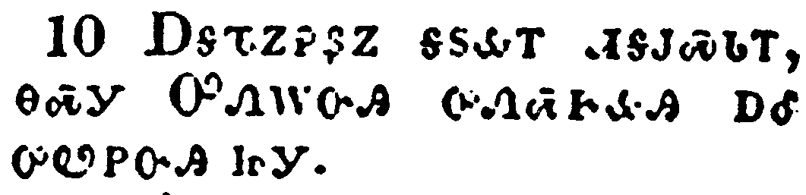</a></td>
</tr>
<tr class="even">
<td>For he looked for a city which hath foundations, whose builder and maker is God.</td>
</tr>
<tr class="odd">
<td>ᎠᎦᏖᏃᎮᏰᏃ ᎦᏚᎲᎢ ᏗᎦᎫᏍᏓᎢ, ᎾᏍᎩ ᎤᏁᎳᏅᎯ ᎤᏁᏍᎨᎲᎢ ᎠᎴ ᎤᏬᏢᏅᎯ ᏥᎩ.</td>
</tr>
<tr class="even">
<td>A-ga-te-no-he-ye-no ga-du-hv-i di-ga-gu-s-da-i, na-s-gi U-ne-la-nv-hi u-ne-s-ge-hv-i a-le u-wo-tlv-nv-hi tsi-gi.</td>
</tr>
</tbody>
</table>

<table>
<tbody>
<tr class="odd">
<td><a href="191111.png">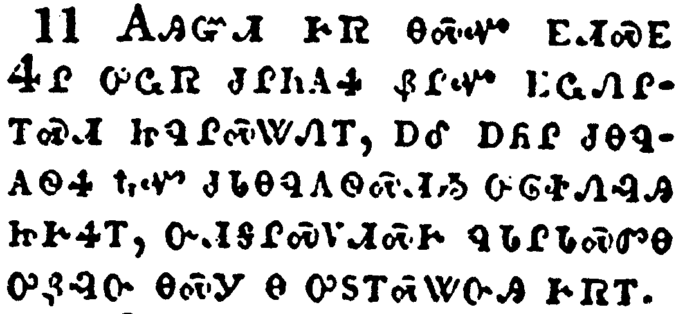</a></td>
</tr>
<tr class="even">
<td>Through faith also Sara herself received strength to conceive seed, and was delivered of a child when she was past age, because she judged him faithful who had promised.</td>
</tr>
<tr class="odd">
<td>ᎪᎯᏳᏗ ᎨᏒ ᎾᏍᏉ ᎬᏗᏍᎬ ᏎᎵ ᎤᏩᏒ ᏧᎵᏂᎪᏎ ᏰᎵᏉ ᎬᏩᏁᎵᎢᏍᏗ ᏥᏄᎵᏍᏔᏁᎢ, ᎠᎴ ᎠᏲᎵ ᏧᎾᏄᎪᏫᏎ ᎿᎭᏉ ᏧᏓᎾᏄᎪᏫᏍᏗᏱ ᎤᎶᏐᏁᎸᎯ ᏥᎨᏎᎢ, ᏅᏗᎦᎵᏍᏙᏗᏍᎨ ᏄᏓᎵᏓᏍᏛᎾ ᎤᏰᎸᏅ ᎾᏍᎩ Ꮎ ᎤᏚᎢᏍᏔᏅᎯ ᎨᏒᎢ.</td>
</tr>
<tr class="even">
<td>Go-hi-yu-di ge-sv na-s-quo gv-di-s-gv Se-li u-wa-sv tsu-li-ni-go-se ye-li-quo gv-wa-ne-li-i-s-di tsi-nu-li-s-ta-ne-i, a-le a-yo-li tsu-na-nu-go-wi-se hna-quo tsu-da-na-nu-go-wi-s-di-yi u-lo-so-ne-lv-hi tsi-ge-se-i, nv-di-ga-li-s-do-di-s-ge nu-da-li-da-s-dv-na u-ye-lv-nv na-s-gi na u-du-i-s-ta-nv-hi ge-sv-i.</td>
</tr>
</tbody>
</table>

<table>
<tbody>
<tr class="odd">
<td><a href="191112.png">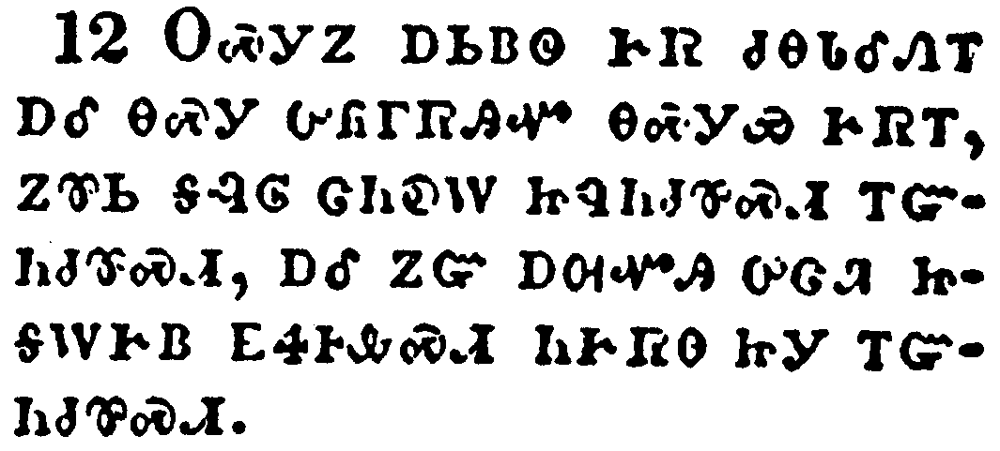</a></td>
</tr>
<tr class="even">
<td>Therefore sprang there even of one, and him as good as dead, so many as the stars of the sky in multitude, and as the sand which is by the sea shore innumerable.</td>
</tr>
<tr class="odd">
<td>ᎾᏍᎩᏃ ᎠᏏᏴᏫ ᎨᏒ ᏧᎾᏓᎴᏁᎢ ᎠᎴ ᎾᏍᎩ ᎤᏲᎱᏒᎯᏉ ᎾᏍᎩᏯ ᎨᏒᎢ, ᏃᏈᏏ ᎦᎸᎶ ᏣᏂᎧᎳ ᏥᏄᏂᏧᏈᏍᏗ ᎢᏳᏂᏧᏈᏍᏗ, ᎠᎴ ᏃᏳ ᎠᎺᏉᎯ ᎤᏣᏘ ᏥᎦᎳᎨᏴ ᎬᏎᎰᎲᏍᏗ ᏂᎨᏒᎾ ᏥᎩ ᎢᏳᏂᏧᏈᏍᏗ.</td>
</tr>
<tr class="even">
<td>Na-s-gi-no a-si-yv-wi ge-sv tsu-na-da-le-ne-i a-le na-s-gi u-yo-hu-sv-hi-quo na-s-gi-ya ge-sv-i, no-qui-si ga-lv-lo tsa-ni-ka-la tsi-nu-ni-tsu-qui-s-di i-yu-ni-tsu-qui-s-di, a-le no-yu a-me-quo-hi u-tsa-ti tsi-ga-la-ge-yv gv-se-ho-hv-s-di ni-ge-sv-na tsi-gi i-yu-ni-tsu-qui-s-di.</td>
</tr>
</tbody>
</table>

<table>
<tbody>
<tr class="odd">
<td><a href="191113.png">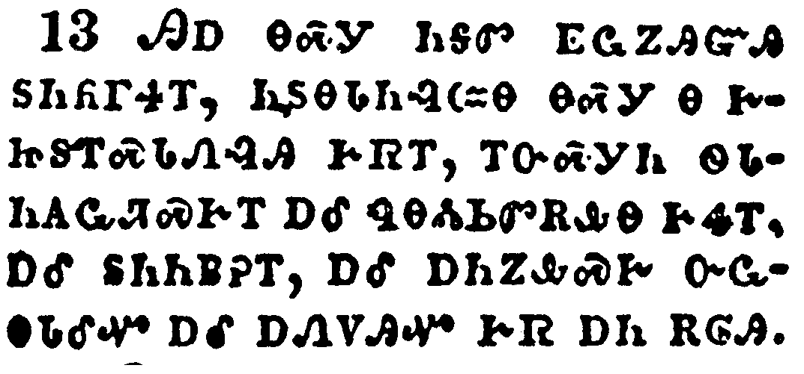</a></td>
</tr>
<tr class="even">
<td>These all died in faith, not having received the promises, but having seen them afar off, and were persuaded of them, and embraced them, and confessed that they were strangers and pilgrims on the earth.</td>
</tr>
<tr class="odd">
<td>ᎯᎠ ᎾᏍᎩ ᏂᎦᏛ ᎬᏩᏃᎯᏳᎯ ᏚᏂᏲᎱᏎᎢ, ᏂᏚᎾᏓᏂᎸᏨᎾ ᎾᏍᎩ Ꮎ ᎨᏥᏚᎢᏍᏓᏁᎸᎯ ᎨᏒᎢ, ᎢᏅᏍᎩᏂ ᏫᏓᏂᎪᏩᏘᏍᎨᎢ ᎠᎴ ᏄᎾᏜᏓᏏᏛᎡᎲᎾ ᎨᏎᎢ, ᎠᎴ ᏚᏂᏂᏴᎮᎢ, ᎠᎴ ᎠᏂᏃᎲᏍᎨ ᏅᏩᎾᏓᎴᏉ ᎠᎴ ᎠᏁᏙᎯᏉ ᎨᏒ ᎠᏂ ᎡᎶᎯ.</td>
</tr>
<tr class="even">
<td>Hi-a na-s-gi ni-ga-dv gv-wa-no-hi-yu-hi du-ni-yo-hu-se-i, ni-du-na-da-ni-lv-tsv-na na-s-gi na ge-tsi-du-i-s-da-ne-lv-hi ge-sv-i, i-nv-s-gi-ni wi-da-ni-go-wa-ti-s-ge-i a-le nu-na-dla-si-dv-e-hv-na ge-se-i, a-le du-ni-ni-yv-he-i, a-le a-ni-no-hv-s-ge nv-wa-na-da-le-quo a-le a-ne-do-hi-quo ge-sv a-ni e-lo-hi.</td>
</tr>
</tbody>
</table>

<table>
<tbody>
<tr class="odd">
<td><a href="191114.png">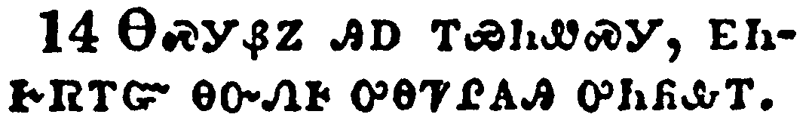</a></td>
</tr>
<tr class="even">
<td>For they that say such things declare plainly that they seek a country.</td>
</tr>
<tr class="odd">
<td>ᎾᏍᎩᏰᏃ ᎯᎠ ᎢᏯᏂᏪᏍᎩ, ᎬᏂᎨᏒᎢᏳ ᎾᏅᏁᎰ ᎤᎾᏤᎵᎪᎯ ᎤᏂᏲᎲᎢ.</td>
</tr>
<tr class="even">
<td>Na-s-gi-ye-no hi-a i-ya-ni-we-s-gi, gv-ni-ge-sv-i-yu na-nv-ne-ho u-na-tse-li-go-hi u-ni-yo-hv-i.</td>
</tr>
</tbody>
</table>

<table>
<tbody>
<tr class="odd">
<td></td>
</tr>
<tr class="even">
<td>And truly, if they had been mindful of that country from whence they came out, they might have had opportunity to have returned.</td>
</tr>
<tr class="odd">
<td>ᎢᏳᏰᏃ ᏳᎾᏅᏖ ᎾᎿᎭᏧᏂᏄᎪᏨᎢ ᏳᏫᏜᏓᏅᏓᏕᎴᏉ ᎥᎤᎾᏨᏍᏗᏱ;</td>
</tr>
<tr class="even">
<td>I-yu-ye-no yu-na-nv-te na-hna tsu-ni-nu-go-tsv-i yu-wi-dla-nv-da-de-le-quo v-u-na-tsv-s-di-yi;</td>
</tr>
</tbody>
</table>

<table>
<tbody>
<tr class="odd">
<td><a href="191116.png">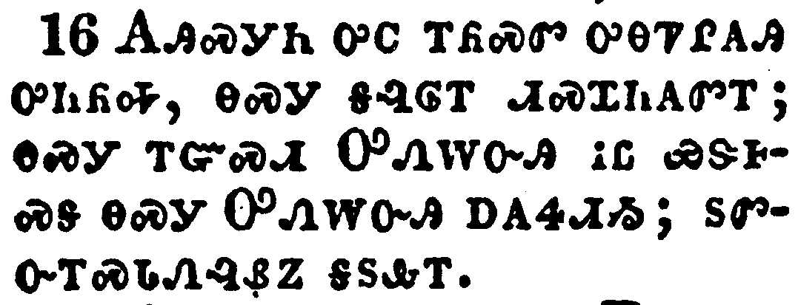</a></td>
</tr>
<tr class="even">
<td>But now they desire a better country, that is, an heavenly: wherefore God is not ashamed to be called their God: for he hath prepared for them a city.</td>
</tr>
<tr class="odd">
<td>ᎪᎯᏍᎩᏂ ᎤᏟ ᎢᏲᏍᏛ ᎤᎾᏤᎵᎪᎯ ᎤᏂᏲᎭ, ᎾᏍᎩ ᎦᎸᎶᎢ ᏗᏍᏆᏂᎪᏛᎢ; ᎾᏍᎩ ᎢᏳᏍᏗ ᎤᏁᎳᏅᎯ ᎥᏝ ᏯᏕᎰᏍᎦ ᎾᏍᎩ ᎤᏁᎳᏅᎯ ᎠᎪᏎᏗᏱ; ᏚᏛᏅᎢᏍᏓᏁᎸᏰᏃ ᎦᏚᎲᎢ.</td>
</tr>
<tr class="even">
<td>Go-hi-s-gi-ni u-tli i-yo-s-dv u-na-tse-li-go-hi u-ni-yo-ha, na-s-gi ga-lv-lo-i di-s-qua-ni-go-dv-i; na-s-gi i-yu-s-di U-ne-la-nv-hi v-tla ya-de-ho-s-ga na-s-gi U-ne-la-nv-hi a-go-se-di-yi; du-dv-nv-i-s-da-ne-lv-ye-no ga-du-hv-i.</td>
</tr>
</tbody>
</table>

<table>
<tbody>
<tr class="odd">
<td></td>
</tr>
<tr class="even">
<td>By faith Abraham, when he was tried, offered up Isaac: and he that had received the promises offered up his only begotten son,</td>
</tr>
<tr class="odd">
<td>ᎪᎯᏳᏗ ᎨᏒ ᎬᏗᏍᎬ ᎡᏆᎭᎻ, ᎾᎯᏳ ᎠᏥᎪᎵᏰᎥ ᎡᏏᎩ ᎤᎵᏍᎪᎸᏔᏁᎢ; ᎠᎴ ᎾᏍᎩ Ꮎ ᎠᏥᏚᎢᏍᏓᏁᎸᎯ ᎨᏒ ᎤᏩᏒᎯᏳ ᎤᏪᏥ ᎤᎵᏍᎪᎸᏔᏁᎢ.</td>
</tr>
<tr class="even">
<td>Go-hi-yu-di ge-sv gv-di-s-gv E-qua-ha-mi, na-hi-yu a-tsi-go-li-ye-v E-si-gi u-li-s-go-lv-ta-ne-i; a-le na-s-gi na a-tsi-du-i-s-da-ne-lv-hi ge-sv u-wa-sv-hi-yu u-we-tsi u-li-s-go-lv-ta-ne-i.</td>
</tr>
</tbody>
</table>

<table>
<tbody>
<tr class="odd">
<td><a href="191118.png">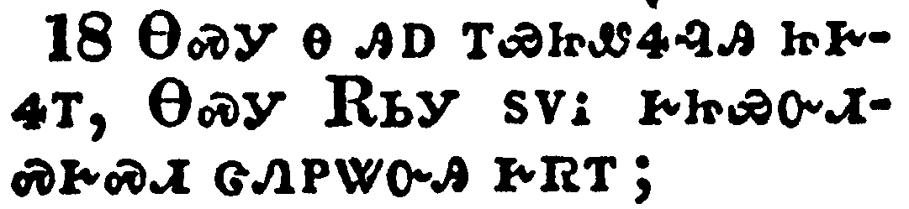</a></td>
</tr>
<tr class="even">
<td>Of whom it was said, That in Isaac shall thy seed be called:</td>
</tr>
<tr class="odd">
<td>ᎾᏍᎩ Ꮎ ᎯᎠ ᎢᏯᏥᏪᏎᎸᎯ ᏥᎨᏎᎢ, ᎾᏍᎩ ᎡᏏᎩ ᏚᏙᎥ ᎨᏥᏯᏅᏗᏍᎨᏍᏗ ᏣᏁᏢᏔᏅᎯ ᎨᏒᎢ;</td>
</tr>
<tr class="even">
<td>Na-s-gi na hi-a i-ya-tsi-we-se-lv-hi tsi-ge-se-i, Na-s-gi E-si-gi du-do-v ge-tsi-ya-nv-di-s-ge-s-di tsa-ne-tlv-ta-nv-hi ge-sv-i;</td>
</tr>
</tbody>
</table>

<table>
<tbody>
<tr class="odd">
<td><a href="191119.png">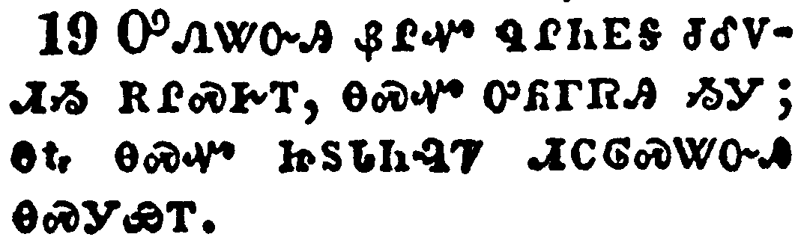</a></td>
</tr>
<tr class="even">
<td>Accounting that God was able to raise him up, even from the dead; from whence also he received him in a figure.</td>
</tr>
<tr class="odd">
<td>ᎤᏁᏔᏅᎯ ᏰᎵᏉ ᏄᎵᏂᎬᎦ ᏧᎴᏙᏗᏱ ᎡᎵᏍᎨᎢ, ᎾᏍᏉ ᎤᏲᎱᏒᎯ ᏱᎩ; ᎾᎿᎭᎾᏍᏉ ᏥᏚᏓᏂᎸᏤ ᏗᏟᎶᏍᏔᏅᎯ ᎾᏍᎩᏯᎢ.</td>
</tr>
<tr class="even">
<td>U-ne-ta-nv-hi ye-li-quo nu-li-ni-gv-ga tsu-le-do-di-yi e-li-s-ge-i, na-s-quo u-yo-hu-sv-hi yi-gi; na-hna na-s-quo tsi-du-da-ni-lv-tse di-tli-lo-s-ta-nv-hi na-s-gi-ya-i.</td>
</tr>
</tbody>
</table>

<table>
<tbody>
<tr class="odd">
<td><a href="191120.png">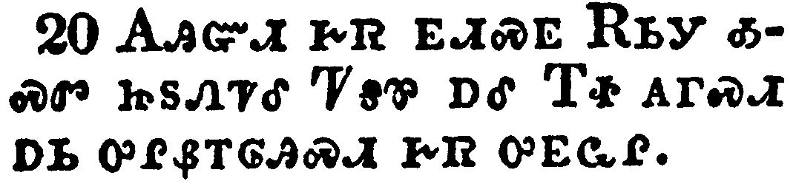</a></td>
</tr>
<tr class="even">
<td>By faith Isaac blessed Jacob and Esau concerning things to come.</td>
</tr>
<tr class="odd">
<td>ᎪᎯᏳᏗ ᎨᏒ ᎬᏗᏍᎬ ᎡᏏᎩ ᎣᏍᏛ ᏥᏚᏁᏤᎴ ᏤᎦᏈ ᎠᎴ ᎢᏐ ᎪᎱᏍᏗ ᎠᏏ ᎤᎵᏰᎢᎶᎯᏍᏗ ᎨᏒ ᎤᎬᏩᎵ.</td>
</tr>
<tr class="even">
<td>Go-hi-yu-di ge-sv gv-di-s-gv E-si-gi o-s-dv tsi-du-ne-tse-le Tse-ga-qui a-le I-so go-hu-s-di a-si u-li-ye-i-lo-hi-s-di ge-sv u-gv-wa-li.</td>
</tr>
</tbody>
</table>

<table>
<tbody>
<tr class="odd">
<td><a href="191121.png">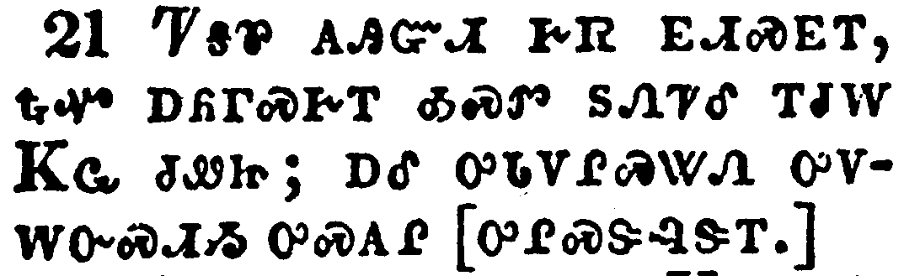</a></td>
</tr>
<tr class="even">
<td>By faith Jacob, when he was a dying, blessed both the sons of Joseph; and worshipped, leaning upon the top of his staff.</td>
</tr>
<tr class="odd">
<td>ᏤᎦᏈ ᎪᎯᏳᏗ ᎨᏒ ᎬᏗᏍᎬᎢ, ᎿᎭᏉ ᎠᏲᎱᏍᎨᎢ ᎣᏍᏛ ᏚᏁᏤᎴ ᎢᏧᎳ ᏦᏩ ᏧᏪᏥ; ᎠᎴ ᎤᏓᏙᎵᏍᏔᏁ ᎤᏙᎳᏅᏍᏗᏱ ᎤᏍᎪᎵ [ᎤᎵᏍᏕᎸᏕᎢ.]</td>
</tr>
<tr class="even">
<td>Tse-ga-qui go-hi-yu-di ge-sv gv-di-s-gv-i, hna-quo a-yo-hu-s-ge-i o-s-dv du-ne-tse-le i-tsu-la Tso-wa tsu-we-tsi; a-le u-da-do-li-s-ta-ne u-do-la-nv-s-di-yi u-s-go-li [u-li-s-de-lv-de-i.]</td>
</tr>
</tbody>
</table>

<table>
<tbody>
<tr class="odd">
<td><a href="191122.png">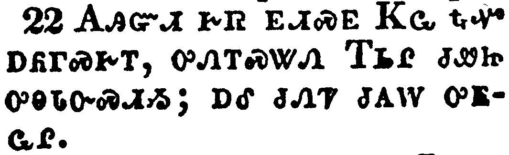</a></td>
</tr>
<tr class="even">
<td>By faith Joseph, when he died, made mention of the departing of the children of Israel; and gave commandment concerning his bones.</td>
</tr>
<tr class="odd">
<td>ᎪᎯᏳᏗ ᎨᏒ ᎬᏗᏍᎬ ᏦᏩ ᎿᎭᏉ ᎠᏲᎱᏍᎨᎢ, ᎤᏁᎢᏍᏔᏁ ᎢᏏᎵ ᏧᏪᏥ ᎤᎾᏓᏅᏍᏗᏱ; ᎠᎴ ᏧᏁᏤ ᏧᎪᎳ ᎤᎬᏩᎵ.</td>
</tr>
<tr class="even">
<td>Go-hi-yu-di ge-sv gv-di-s-gv Tso-wa hna-quo a-yo-hu-s-ge-i, u-ne-i-s-ta-ne I-si-li tsu-we-tsi u-na-da-nv-s-di-yi; a-le tsu-ne-tse tsu-go-la u-gv-wa-li.</td>
</tr>
</tbody>
</table>

<table>
<tbody>
<tr class="odd">
<td><a href="191123.png">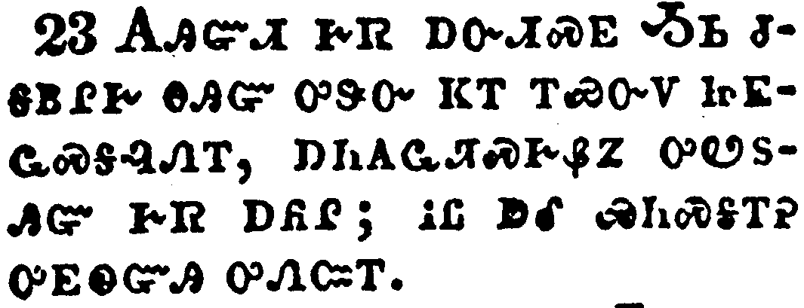</a></td>
</tr>
<tr class="even">
<td>By faith Moses, when he was born, was hid three months of his parents, because they saw he was a proper child; and they were not afraid of the king's commandment.</td>
</tr>
<tr class="odd">
<td>ᎪᎯᏳᏗ ᎨᏒ ᎠᏅᏗᏍᎬ ᎼᏏ ᏧᎦᏴᎵᎨ ᎾᎯᏳ ᎤᏕᏅ ᏦᎢ ᎢᏯᏅᏙ ᏥᎬᏩᏍᎦᎸᏁᎢ, ᎠᏂᎪᏩᏘᏍᎨᏰᏃ ᎤᏬᏚᎯᏳ ᎨᏒ ᎠᏲᎵ; ᎥᏝ ᎠᎴ ᏯᏂᏍᎦᎢᎮ ᎤᎬᏫᏳᎯ ᎤᏁᏨᎢ.</td>
</tr>
<tr class="even">
<td>Go-hi-yu-di ge-sv a-nv-di-s-gv Mo-si tsu-ga-yv-li-ge na-hi-yu u-de-nv tso-i i-ya-nv-do tsi-gv-wa-s-ga-lv-ne-i, a-ni-go-wa-ti-s-ge-ye-no u-wo-du-hi-yu ge-sv a-yo-li; v-tla a-le ya-ni-s-ga-i-he u-gv-wi-yu-hi u-ne-tsv-i.</td>
</tr>
</tbody>
</table>

<table>
<tbody>
<tr class="odd">
<td><a href="191124.png">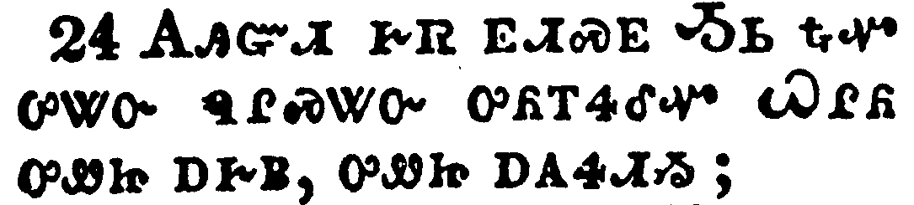</a></td>
</tr>
<tr class="even">
<td>By faith Moses, when he was come to years, refused to be called the son of Pharaoh's daughter;</td>
</tr>
<tr class="odd">
<td>ᎪᎯᏳᏗ ᎨᏒ ᎬᏗᏍᎬ ᎼᏏ ᎿᎭᏉ ᎤᏔᏅ ᏄᎵᏍᏔᏅ ᎤᏲᎢᏎᎴᏉ ᏇᎵᏲ ᎤᏪᏥ ᎠᎨᏴ, ᎤᏪᏥ ᎠᎪᏎᏗᏱ;</td>
</tr>
<tr class="even">
<td>Go-hi-yu-di ge-sv gv-di-s-gv Mo-si hna-quo u-ta-nv nu-li-s-ta-nv u-yo-i-se-le-quo Que-li-yo u-we-tsi a-ge-yv, u-we-tsi a-go-se-di-yi;</td>
</tr>
</tbody>
</table>

<table>
<tbody>
<tr class="odd">
<td><a href="191125.png">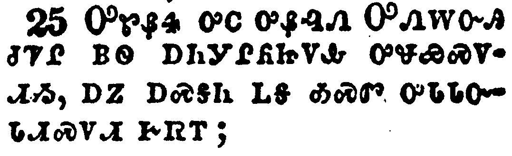</a></td>
</tr>
<tr class="even">
<td>Choosing rather to suffer affliction with the people of God, than to enjoy the pleasures of sin for a season;</td>
</tr>
<tr class="odd">
<td>ᎤᏑᏰᎭ ᎤᏟ ᎤᏰᎸᏁ ᎤᏁᎳᏅᎯ ᏧᏤᎵ ᏴᏫ ᎠᏂᎩᎵᏲᏥᏙᎲ ᎤᏠᏯᏍᏙᏗᏱ, ᎠᏃ ᎠᏍᎦᏂ ᏞᎦ ᎣᏍᏛ ᎤᏓᏓᏅᏓᏗᏍᏙᏗ ᎨᏒᎢ;</td>
</tr>
<tr class="even">
<td>U-su-ye-ha u-tli u-ye-lv-ne U-ne-la-nv-hi tsu-tse-li yv-wi a-ni-gi-li-yo-tsi-do-hv u-tlo-ya-s-do-di-yi, a-no a-s-ga-ni tle-ga o-s-dv u-da-da-nv-da-di-s-do-di ge-sv-i;</td>
</tr>
</tbody>
</table>

<table>
<tbody>
<tr class="odd">
<td><a href="191126.png">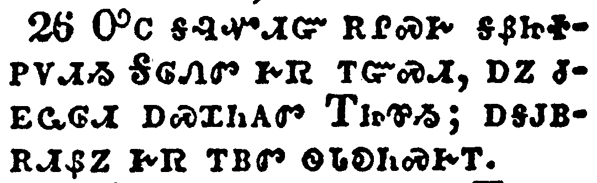</a></td>
</tr>
<tr class="even">
<td>Esteeming the reproach of Christ greater riches than the treasures in Egypt: for he had respect unto the recompence of the reward.</td>
</tr>
<tr class="odd">
<td>ᎤᏟ ᎦᎸᏉᏗᏳ ᎡᎵᏍᎨ ᎦᏰᏥᏐᏢᏙᏗᏱ ᎦᎶᏁᏛ ᎨᏒ ᎢᏳᏍᏗ, ᎠᏃ ᏧᎬᏩᎶᏗ ᎠᏍᏆᏂᎪᏛ ᎢᏥᏈᏱ; ᎠᎦᎫᏴᎡᏗᏰᏃ ᎨᏒ ᎢᏴᏛ ᏫᏓᎧᏂᏍᎨᎢ.</td>
</tr>
<tr class="even">
<td>U-tli ga-lv-quo-di-yu e-li-s-ge ga-ye-tsi-so-tlv-do-di-yi Ga-lo-ne-dv ge-sv i-yu-s-di, a-no tsu-gv-wa-lo-di a-s-qua-ni-go-dv I-tsi-qui-yi; a-ga-gu-yv-e-di-ye-no ge-sv i-yv-dv wi-da-ka-ni-s-ge-i.</td>
</tr>
</tbody>
</table>

<table>
<tbody>
<tr class="odd">
<td></td>
</tr>
<tr class="even">
<td>By faith he forsook Egypt, not fearing the wrath of the king: for he endured, as seeing him who is invisible.</td>
</tr>
<tr class="odd">
<td>ᎪᎯᏳᏗ ᎨᏒ ᎬᏗᏍᎬ ᎢᏥᏈᏱ ᎤᏓᏅᏎᎢ, ᎾᏍᎦᎢᎲᎾ ᎨᏎ ᎤᎬᏫᏳᎯ ᎤᏔᎳᏬᏍᎬᎢ; ᎬᏂᏗᏳᏍᎩᏂ ᎨᏒ ᎾᏍᎩᏯᏉ ᏣᎪᏩᏘᏍᎪ ᎾᏍᎩ Ꮎ ᎦᏰᏥᎪᏩᏛᏗ ᏂᎨᏒᎾ ᎨᏒᎢ.</td>
</tr>
<tr class="even">
<td>Go-hi-yu-di ge-sv gv-di-s-gv I-tsi-qui-yi u-da-nv-se-i, na-s-ga-i-hv-na ge-se u-gv-wi-yu-hi u-ta-la-wo-s-gv-i; gv-ni-di-yu-s-gi-ni ge-sv na-s-gi-ya-quo tsa-go-wa-ti-s-go na-s-gi na ga-ye-tsi-go-wa-dv-di ni-ge-sv-na ge-sv-i.</td>
</tr>
</tbody>
</table>

<table>
<tbody>
<tr class="odd">
<td><a href="191128.png">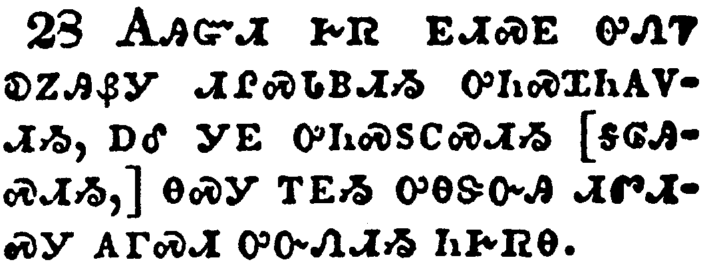</a></td>
</tr>
<tr class="even">
<td>Through faith he kept the passover, and the sprinkling of blood, lest he that destroyed the firstborn should touch them.</td>
</tr>
<tr class="odd">
<td>ᎪᎯᏳᏗ ᎨᏒ ᎬᏗᏍᎬ ᎤᏁᏤ ᎧᏃᎯᏰᎩ ᏗᎵᏍᏓᏴᏗᏱ ᎤᏂᏍᏆᏂᎪᏙᏗᏱ, ᎠᎴ ᎩᎬ ᎤᏂᏍᏚᏟᏍᏗᏱ [ᎦᎶᎯᏍᏗᏱ,] ᎾᏍᎩ ᎢᎬᏱ ᎤᎾᏕᏅᎯ ᏗᏛᏗᏍᎩ ᎪᎱᏍᏗ ᎤᏅᏁᏗᏱ ᏂᎨᏒᎾ.</td>
</tr>
<tr class="even">
<td>Go-hi-yu-di ge-sv gv-di-s-gv u-ne-tse ka-no-hi-ye-gi di-li-s-da-yv-di-yi u-ni-s-qua-ni-go-do-di-yi, a-le gi-gv u-ni-s-du-tli-s-di-yi [ga-lo-hi-s-di-yi,] na-s-gi i-gv-yi u-na-de-nv-hi di-dv-di-s-gi go-hu-s-di u-nv-ne-di-yi ni-ge-sv-na.</td>
</tr>
</tbody>
</table>

<table>
<tbody>
<tr class="odd">
<td><a href="191129.png">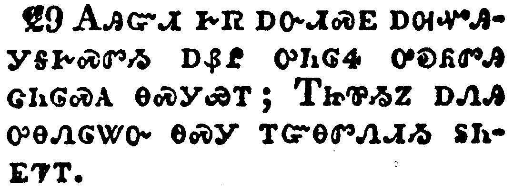</a></td>
</tr>
<tr class="even">
<td>By faith they passed through the Red sea as by dry land: which the Egyptians assaying to do were drowned.</td>
</tr>
<tr class="odd">
<td>ᎪᎯᏳᏗ ᎨᏒ ᎠᏅᏗᏍᎬ ᎠᎺᏉᎯᎩᎦᎨᏍᏛᏱ ᎠᏰᎵ ᎤᏂᎶᏎ ᎤᎧᏲᏛᎯ ᏣᏂᎶᏍᎪ ᎾᏍᎩᏯᎢ; ᎢᏥᏈᏱᏃ ᎠᏁᎯ ᎤᎾᏁᎶᏔᏅ ᎾᏍᎩ ᎢᏳᎾᏛᏁᏗᏱ ᏚᏂᎬᏤᎢ.</td>
</tr>
<tr class="even">
<td>Go-hi-yu-di ge-sv a-nv-di-s-gv a-me-quo-hi-gi-ga-ge-s-dv-yi a-ye-li u-ni-lo-se u-ka-yo-dv-hi tsa-ni-lo-s-go na-s-gi-ya-i; I-tsi-qui-yi-no a-ne-hi u-na-ne-lo-ta-nv na-s-gi i-yu-na-dv-ne-di-yi du-ni-gv-tse-i.</td>
</tr>
</tbody>
</table>

<table>
<tbody>
<tr class="odd">
<td><a href="191130.png">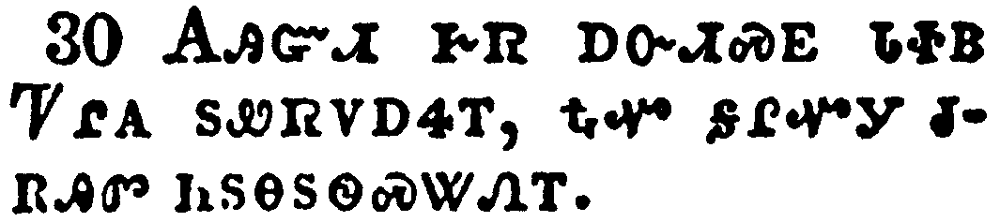</a></td>
</tr>
<tr class="even">
<td>By faith the walls of Jericho fell down, after they were compassed about seven days.</td>
</tr>
<tr class="odd">
<td>ᎪᎯᏳᏗ ᎨᏒ ᎠᏅᏗᏍᎬ ᏓᏐᏴ ᏤᎵᎪ ᏚᏪᏒᏙᎠᏎᎢ, ᎿᎭᏉ ᎦᎵᏉᎩ ᏧᏒᎯᏛ ᏂᏚᎾᏚᏫᏍᏔᏁᎢ.</td>
</tr>
<tr class="even">
<td>Go-hi-yu-di ge-sv a-nv-di-s-gv da-so-yv Tse-li-go du-we-sv-do-a-se-i, hna-quo ga-li-quo-gi tsu-sv-hi-dv ni-du-na-du-wi-s-ta-ne-i.</td>
</tr>
</tbody>
</table>

<table>
<tbody>
<tr class="odd">
<td><a href="191131.png">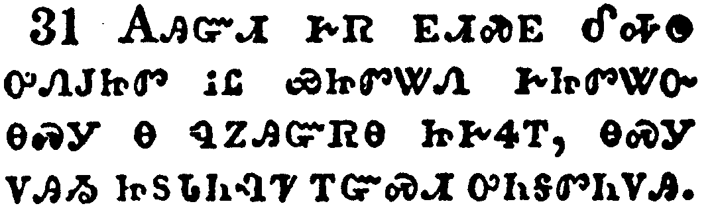</a></td>
</tr>
<tr class="even">
<td>By faith the harlot Rahab perished not with them that believed not, when she had received the spies with peace.</td>
</tr>
<tr class="odd">
<td>ᎪᎯᏳᏗ ᎨᏒ ᎬᏗᏍᎬ ᎴᎭᏫ ᎤᏁᎫᏥᏛ ᎥᏝ ᏯᏥᏛᏔᏁ ᎨᏥᏛᏔᏅ ᎾᏍᎩ Ꮎ ᏄᏃᎯᏳᏒᎾ ᏥᎨᏎᎢ, ᎾᏍᎩ ᏙᎯᏱ ᏥᏚᏓᏂᎸᏤ ᎢᏳᏍᏗ ᎤᏂᎦᏛᏂᏙᎯ.</td>
</tr>
<tr class="even">
<td>Go-hi-yu-di ge-sv gv-di-s-gv Le-ha-wi u-ne-gu-tsi-dv v-tla ya-tsi-dv-ta-ne ge-tsi-dv-ta-nv na-s-gi na nu-no-hi-yu-sv-na tsi-ge-se-i, na-s-gi do-hi-yi tsi-du-da-ni-lv-tse i-yu-s-di u-ni-ga-dv-ni-do-hi.</td>
</tr>
</tbody>
</table>

<table>
<tbody>
<tr class="odd">
<td><a href="191132.png">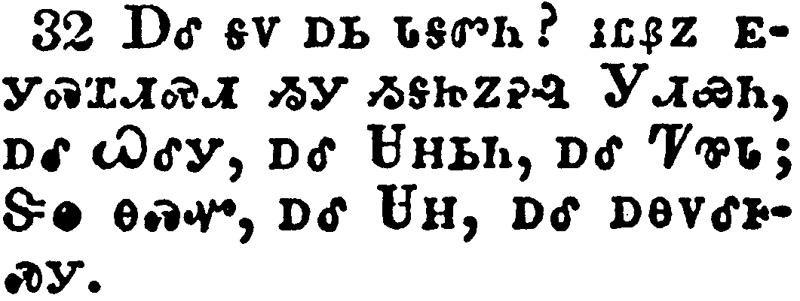</a></td>
</tr>
<tr class="even">
<td>And what shall I more say? for the time would fail me to tell of Gedeon, and of Barak, and of Samson, and of Jephthae; of David also, and Samuel, and of the prophets:</td>
</tr>
<tr class="odd">
<td>ᎠᎴ ᎦᏙ ᎠᏏ ᏓᎦᏛᏂ? ᎥᏝᏰᏃ ᎬᎩᏍᏆᏗᏍᏗ ᏱᎩ ᏱᎦᏥᏃᎮᎸ ᎩᏗᏯᏂ, ᎠᎴ ᏇᎴᎩ, ᎠᎴ ᏌᎻᏏᏂ, ᎠᎴ ᏤᏈᏓ; ᏕᏫ ᎾᏍᏉ, ᎠᎴ ᏌᎻ, ᎠᎴ ᎠᎾᏙᎴᎰᏍᎩ.</td>
</tr>
<tr class="even">
<td>A-le ga-do a-si da-ga-dv-ni? v-tla-ye-no gv-gi-s-qua-di-s-di yi-gi yi-ga-tsi-no-he-lv Gi-di-ya-ni, a-le Que-le-gi, a-le Sa-mi-si-ni, a-le Tse-qui-da; De-wi na-s-quo, a-le Sa-mi, a-le a-na-do-le-ho-s-gi.</td>
</tr>
</tbody>
</table>

<table>
<tbody>
<tr class="odd">
<td><a href="191133.png">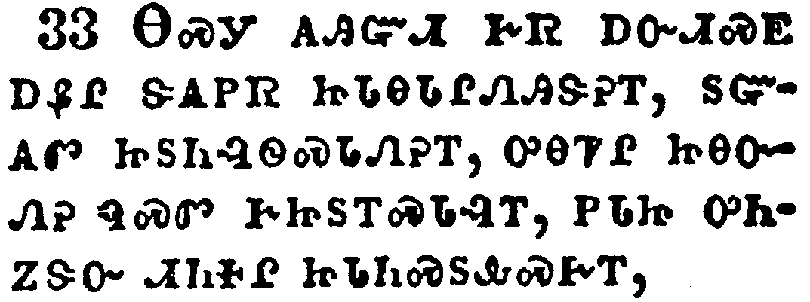</a></td>
</tr>
<tr class="even">
<td>Who through faith subdued kingdoms, wrought righteousness, obtained promises, stopped the mouths of lions,</td>
</tr>
<tr class="odd">
<td>ᎾᏍᎩ ᎪᎯᏳᏗ ᎨᏒ ᎠᏅᏗᏍᎬ ᎠᏰᎵ ᏕᎪᏢᏒ ᏥᏓᎾᏓᎵᏁᎯᏕᎮᎢ, ᏚᏳᎪᏛ ᏥᏚᏂᎸᏫᏍᏓᏁᎮᎢ, ᎤᎾᏤᎵ ᏥᎾᏅᏁᎮ ᏄᏍᏛ ᎨᏥᏚᎢᏍᏓᎸᎢ, ᏢᏓᏥ ᎤᏂᏃᏕᏅ ᏗᏂᎰᎵ ᏥᏓᏂᏍᏚᎲᏍᎨᎢ,</td>
</tr>
<tr class="even">
<td>Na-s-gi go-hi-yu-di ge-sv a-nv-di-s-gv a-ye-li de-go-tlv-sv tsi-da-na-da-li-ne-hi-de-he-i, du-yu-go-dv tsi-du-ni-lv-wi-s-da-ne-he-i, u-na-tse-li tsi-na-nv-ne-he nu-s-dv ge-tsi-du-i-s-da-lv-i, tlv-da-tsi u-ni-no-de-nv di-ni-ho-li tsi-da-ni-s-du-hv-s-ge-i,</td>
</tr>
</tbody>
</table>

<table>
<tbody>
<tr class="odd">
<td><a href="191134.png">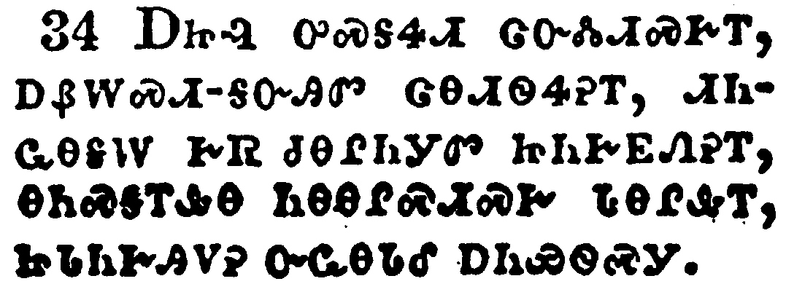</a></td>
</tr>
<tr class="even">
<td>Quenched the violence of fire, escaped the edge of the sword, out of weakness were made strong, waxed valiant in fight, turned to flight the armies of the aliens.</td>
</tr>
<tr class="odd">
<td>ᎠᏥᎸ ᎤᏍᎦᏎᏗ ᏣᏅᏜᏓᏗᏍᎨᎢ, ᎠᏰᎳᏍᏗ-ᎦᏅᎯᏛ ᏣᎾᏗᏫᏎᎮᎢ, ᏗᏂᏩᎾᎦᎳ ᎨᏒ ᏧᎾᎵᏂᎩᏛ ᏥᏂᎨᎬᏁᎮᎢ, ᎾᏂᏍᎦᎢᎲᎾ ᏂᎾᎾᎵᏍᏗᏍᎨ ᏓᎾᎵᎲᎢ, ᏥᏓᏂᎨᎯᏙᎮ ᏅᏩᎾᏓᎴ ᎠᏂᏯᏫᏍᎩ.</td>
</tr>
<tr class="even">
<td>A-tsi-lv u-s-ga-se-di tsa-nv-dla-di-s-ge-i, a-ye-la-s-di--ga-nv-hi-dv tsa-na-di-wi-se-he-i, di-ni-wa-na-ga-la ge-sv tsu-na-li-ni-gi-dv tsi-ni-ge-gv-ne-he-i, na-ni-s-ga-i-hv-na ni-na-na-li-s-di-s-ge da-na-li-hv-i, tsi-da-ni-ge-hi-do-he nv-wa-na-da-le a-ni-ya-wi-s-gi.</td>
</tr>
</tbody>
</table>

<table>
<tbody>
<tr class="odd">
<td><a href="191135.png">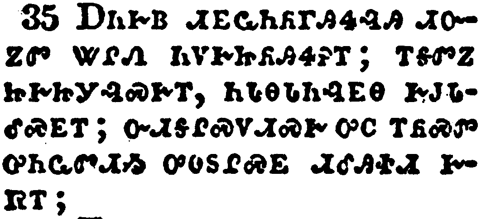</a></td>
</tr>
<tr class="even">
<td>Women received their dead raised to life again: and others were tortured, not accepting deliverance; that they might obtain a better resurrection:</td>
</tr>
<tr class="odd">
<td>ᎠᏂᎨᏴ ᏗᎬᏩᏂᏲᎱᎯᏎᎸᎯ ᏗᏅᏃᏛ ᏔᎵᏁ ᏂᏙᎨᏥᏲᎯᏎᎮᎢ; ᎢᎦᏛᏃ ᏥᎨᏥᎩᎸᏍᎨᎢ, ᏂᏓᎾᏓᏂᎸᎬᎾ ᎨᎫᏓᎴᏍᎬᎢ; ᏅᏗᎦᎵᏍᏙᏗᏍᎨ ᎤᏟ ᎢᏲᏍᏛ ᎤᏂᏩᏛᏗᏱ ᎤᎾᏚᎵᏍᎬ ᏗᎴᎯᏐᏗ ᎨᏒᎢ;</td>
</tr>
<tr class="even">
<td>A-ni-ge-yv di-gv-wa-ni-yo-hu-hi-se-lv-hi di-nv-no-dv ta-li-ne ni-do-ge-tsi-yo-hi-se-he-i; i-ga-dv-no tsi-ge-tsi-gi-lv-s-ge-i, ni-da-na-da-ni-lv-gv-na ge-gu-da-le-s-gv-i; nv-di-ga-li-s-do-di-s-ge u-tli i-yo-s-dv u-ni-wa-dv-di-yi u-na-du-li-s-gv di-le-hi-so-di ge-sv-i;</td>
</tr>
</tbody>
</table>

<table>
<tbody>
<tr class="odd">
<td><a href="191136.png">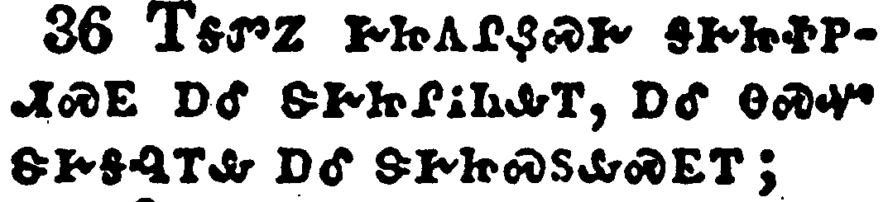</a></td>
</tr>
<tr class="even">
<td>And others had trial of cruel mockings and scourgings, yea, moreover of bonds and imprisonment:</td>
</tr>
<tr class="odd">
<td>ᎢᎦᏛᏃ ᎨᏥᎪᎵᏰᏍᎨ ᎦᎨᏥᏐᏢᏗᏍᎬ ᎠᎴ ᏕᎨᏥᎵᎥᏂᎲᎢ, ᎠᎴ ᎾᏍᏉ ᏕᎨᎦᎸᎢᎲ ᎠᎴ ᏕᎨᏥᏍᏚᎲᏍᎬᎢ;</td>
</tr>
<tr class="even">
<td>I-ga-dv-no ge-tsi-go-li-ye-s-ge ga-ge-tsi-so-tlv-di-s-gv a-le de-ge-tsi-li-v-ni-hv-i, a-le na-s-quo de-ge-ga-lv-i-hv a-le de-ge-tsi-s-du-hv-s-gv-i;</td>
</tr>
</tbody>
</table>

<table>
<tbody>
<tr class="odd">
<td></td>
</tr>
<tr class="even">
<td>They were stoned, they were sawn asunder, were tempted, were slain with the sword: they wandered about in sheepskins and goatskins; being destitute, afflicted, tormented;</td>
</tr>
<tr class="odd">
<td>ᏅᏯ ᏕᎨᎬᏂᏍᏗᏍᎨᎢ, ᏗᎦᏄᏙᎩ ᎬᏗ ᏕᎨᏥᎦᎵᏍᎨᎢ, ᏕᎨᏥᎪᎵᏰᏍᎨᎢ, ᎠᏰᎳᏍᏗ-ᎦᏅᎯᏛ ᏕᎨᏥᎢᏍᏗᏍᎨᎢ; ᎠᏫ ᎤᏂᏃᏕᎾ ᎠᎴ ᎠᏫ ᏗᏂᎭᏄᎸᎯ ᏧᏂᏁᎦᎸᏅᎯ ᏧᎾᏄᏩᎢ ᎠᏁᏙᎮᎢ; ᎤᏂᏂᎬᏎᎯ ᎨᏎᎢ, ᎠᏂᎩᎵᏲᏥᏙᎮᎢ.</td>
</tr>
<tr class="even">
<td>Nv-ya de-ge-gv-ni-s-di-s-ge-i, di-ga-nu-do-gi gv-di de-ge-tsi-ga-li-s-ge-i, de-ge-tsi-go-li-ye-s-ge-i, a-ye-la-s-di--ga-nv-hi-dv de-ge-tsi-i-s-di-s-ge-i; a-wi u-ni-no-de-na a-le a-wi di-ni-ha-nu-lv-hi tsu-ni-ne-ga-lv-nv-hi tsu-na-nu-wa-i a-ne-do-he-i; u-ni-ni-gv-se-hi ge-se-i, a-ni-gi-li-yo-tsi-do-he-i.</td>
</tr>
</tbody>
</table>

<table>
<tbody>
<tr class="odd">
<td></td>
</tr>
<tr class="even">
<td>(Of whom the world was not worthy:) they wandered in deserts, and in mountains, and in dens and caves of the earth.</td>
</tr>
<tr class="odd">
<td>[ᎾᏍᎩ ᎯᎠ ᎥᏝ ᎡᎶᎯ ᎬᏩᎾᏕᏗ ᏱᎨᏎᎢ;] ᎢᎾᎨ ᎠᏁᏙᎮᎢ, ᎠᎴ ᏙᏓᎸᎢ, ᎠᎴ ᏚᏍᏓᎦᎸᎢ, ᎠᎴ ᎦᏙᎯ ᏓᏔᎴᏒᎢ.</td>
</tr>
<tr class="even">
<td>[Na-s-gi hi-a v-tla e-lo-hi gv-wa-na-de-di yi-ge-se-i;] i-na-ge a-ne-do-he-i, a-le do-da-lv-i, a-le du-s-da-ga-lv-i, a-le ga-do-hi da-ta-le-sv-i.</td>
</tr>
</tbody>
</table>

<table>
<tbody>
<tr class="odd">
<td><a href="191139.png">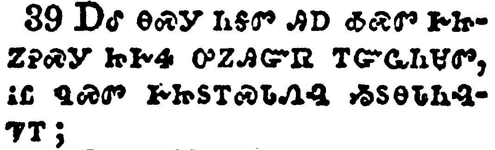</a></td>
</tr>
<tr class="even">
<td>And these all, having obtained a good report through faith, received not the promise:</td>
</tr>
<tr class="odd">
<td>ᎠᎴ ᎾᏍᎩ ᏂᎦᏛ ᎯᎠ ᎣᏍᏛ ᎨᏥᏃᎮᏍᎩ ᏥᎨᏎ ᎤᏃᎯᏳᏒ ᎢᏳᏩᏂᏌᏛ, ᎥᏝ ᏄᏍᏛ ᎨᏥᏚᎢᏍᏓᏁᎸ ᏱᏚᎾᏓᏂᎸᏤᎢ;</td>
</tr>
<tr class="even">
<td>A-le na-s-gi ni-ga-dv hi-a o-s-dv ge-tsi-no-he-s-gi tsi-ge-se u-no-hi-yu-sv i-yu-wa-ni-sa-dv, v-tla nu-s-dv ge-tsi-du-i-s-da-ne-lv yi-du-na-da-ni-lv-tse-i;</td>
</tr>
</tbody>
</table>

<table>
<tbody>
<tr class="odd">
<td><a href="191140.png">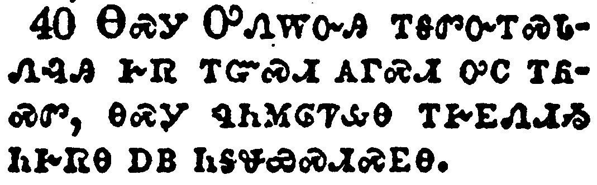</a></td>
</tr>
<tr class="even">
<td>God having provided some better thing for us, that they without us should not be made perfect.</td>
</tr>
<tr class="odd">
<td>ᎾᏍᎩ ᎤᏁᎳᏅᎯ ᎢᎦᏛᏅᎢᏍᏓᏁᎸᎯ ᎨᏒ ᎢᏳᏍᏗ ᎪᎱᏍᏗ ᎤᏟ ᎢᏲᏍᏛ, ᎾᏍᎩ ᏄᏂᎷᎶᏤᎲᎾ ᎢᎨᎬᏁᏗᏱ ᏂᎨᏒᎾ ᎠᏴ ᏂᎦᏠᏯᏍᏗᏍᎬᎾ.</td>
</tr>
<tr class="even">
<td>Na-s-gi U-ne-la-nv-hi i-ga-dv-nv-i-s-da-ne-lv-hi ge-sv i-yu-s-di go-hu-s-di u-tli i-yo-s-dv, na-s-gi nu-ni-lu-lo-tse-hv-na i-ge-gv-ne-di-yi ni-ge-sv-na a-yv ni-ga-tlo-ya-s-di-s-gv-na.</td>
</tr>
</tbody>
</table>

