+++
draft=false
date = 2014-12-18T21:11:07Z
title = "James - Chapter 2 - Cherokee New Testament"
weight = 1418955067

[taxonomies]

authors = ["Timothy Legg"]
categories = []
tags = []

[extra]
+++

<table>
<tbody>
<tr class="odd">
<td><a href="200201.png">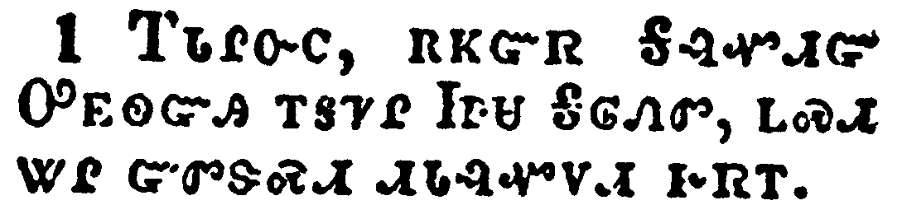</a></td>
</tr>
<tr class="even">
<td>My brethren, have not the faith of our Lord Jesus Christ, the Lord of glory, with respect of persons.</td>
</tr>
<tr class="odd">
<td>ᎢᏓᎵᏅᏟ, ᎡᏦᏳᏒ ᎦᎸᏉᏗᏳ ᎤᎬᏫᏳᎯ ᎢᎦᏤᎵ ᏥᏌ ᎦᎶᏁᏛ, ᏞᏍᏗ ᏔᎵ ᏳᏛᏕᏍᏗ ᏗᏓᎸᏉᏙᏗ ᎨᏒᎢ.</td>
</tr>
<tr class="even">
<td>I-da-li-nv-tli, e-tso-yu-sv Ga-lv-quo-di-yu U-gv-wi-yu-hi i-ga-tse-li Tsi-sa Ga-lo-ne-dv, tle-s-di ta-li yu-dv-de-s-di di-da-lv-quo-do-di ge-sv-i.</td>
</tr>
</tbody>
</table>

<table>
<tbody>
<tr class="odd">
<td><a href="200202.png">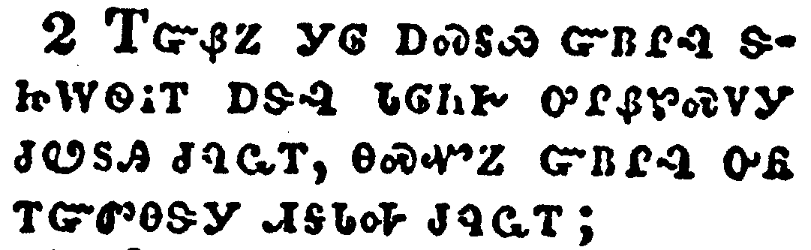</a></td>
</tr>
<tr class="even">
<td>For if there come unto your assembly a man with a gold ring, in goodly apparel, and there come in also a poor man in vile raiment;</td>
</tr>
<tr class="odd">
<td>ᎢᏳᏰᏃ ᎩᎶ ᎠᏍᎦᏯ ᏳᏴᎵᎸ ᏕᏥᎳᏫᎥᎢ ᎠᏕᎸ ᏓᎶᏂᎨ ᎤᎵᏰᏑᏍᏙᎩ ᏧᏬᏚᎯ ᏧᏄᏩᎢ, ᎾᏍᏉᏃ ᏳᏴᎵᎸ ᎤᏲ ᎢᏳᏛᎾᏕᎩ ᏗᎦᏓᎭ ᏧᏄᏩᎢ;</td>
</tr>
<tr class="even">
<td>I-yu-ye-no gi-lo a-s-ga-ya yu-yv-li-lv de-tsi-la-wi-v-i a-de-lv da-lo-ni-ge u-li-ye-su-s-do-gi tsu-wo-du-hi tsu-nu-wa-i, na-s-quo-no yu-yv-li-lv u-yo i-yu-dv-na-de-gi di-ga-da-ha tsu-nu-wa-i;</td>
</tr>
</tbody>
</table>

<table>
<tbody>
<tr class="odd">
<td><a href="200203.png">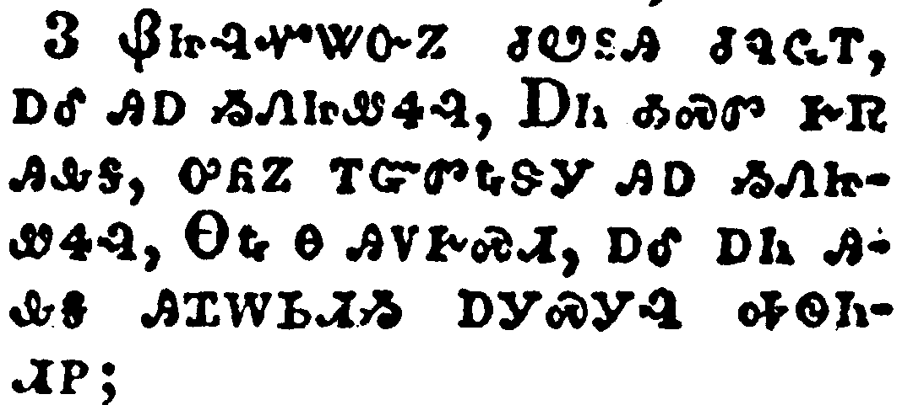</a></td>
</tr>
<tr class="even">
<td>And ye have respect to him that weareth the gay clothing, and say unto him, Sit thou here in a good place; and say to the poor, Stand thou there, or sit here under my footstool:</td>
</tr>
<tr class="odd">
<td>ᏰᏥᎸᏉᏔᏅᏃ ᏧᏬᏚᎯ ᏧᏄᏩᎢ, ᎠᎴ ᎯᎠ ᏱᏁᏥᏪᏎᎸ, ᎠᏂ ᎣᏍᏛ ᎨᏒ ᎯᎲᎦ, ᎤᏲᏃ ᎢᏳᏛᎿᎭᏕᎩ ᎯᎠ ᏱᏁᏥᏪᏎᎸ, ᎾᎿᎭᎾ ᎯᏙᎨᏍᏗ, ᎠᎴ ᎠᏂ ᎯᎲᎦ ᎯᏆᎳᏏᏗᏱ ᎠᎩᏍᎩᎸ ᎭᏫᏂᏗᏢ;</td>
</tr>
<tr class="even">
<td>Ye-tsi-lv-quo-ta-nv-no tsu-wo-du-hi tsu-nu-wa-i, a-le hi-a yi-ne-tsi-we-se-lv, A-ni o-s-dv ge-sv hi-hv-ga, u-yo-no i-yu-dv-hna-de-gi hi-a yi-ne-tsi-we-se-lv, Na-hna na hi-do-ge-s-di, a-le a-ni hi-hv-ga hi-qua-la-si-di-yi a-gi-s-gi-lv ha-wi-ni-di-tlv;</td>
</tr>
</tbody>
</table>

<table>
<tbody>
<tr class="odd">
<td><a href="200204.png">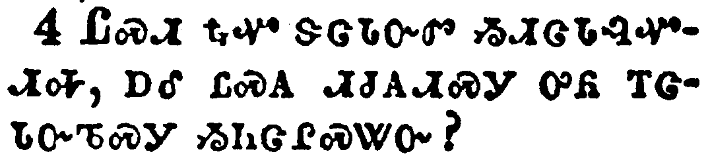</a></td>
</tr>
<tr class="even">
<td>Are ye not then partial in yourselves, and are become judges of evil thoughts?</td>
</tr>
<tr class="odd">
<td>ᏞᏍᏗ ᎿᎭᏉ ᏕᏣᏓᏅᏛ ᏱᏗᏣᏓᎸᏉᏗᎭ, ᎠᎴ ᏝᏍᎪ ᏗᏧᎪᏗᏍᎩ ᎤᏲ ᎢᏣᏓᏅᏖᏍᎩ ᏱᏂᏣᎵᏍᏔᏅ?</td>
</tr>
<tr class="even">
<td>Tle-s-di hna-quo de-tsa-da-nv-dv yi-di-tsa-da-lv-quo-di-ha, a-le tla-s-go di-tsu-go-di-s-gi u-yo i-tsa-da-nv-te-s-gi yi-ni-tsa-li-s-ta-nv?</td>
</tr>
</tbody>
</table>

<table>
<tbody>
<tr class="odd">
<td><a href="200205.png">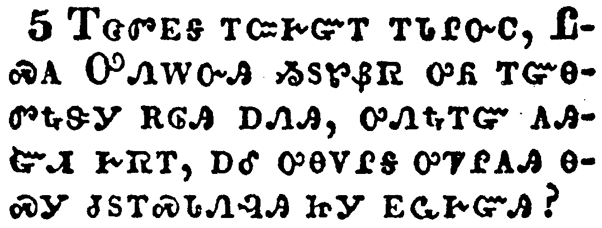</a></td>
</tr>
<tr class="even">
<td>Hearken, my beloved brethren, Hath not God chosen the poor of this world rich in faith, and heirs of the kingdom which he hath promised to them that love him?</td>
</tr>
<tr class="odd">
<td>ᎢᏣᏛᎬᎦ ᎢᏨᎨᏳᎢ ᎢᏓᎵᏅᏟ, ᏝᏍᎪ ᎤᏁᎳᏅᎯ ᏱᏚᏑᏰᏒ ᎤᏲ ᎢᏳᎾᏛᎿᎭᏕᎩ ᎡᎶᎯ ᎠᏁᎯ, ᎤᏁᎿᎭᎢᏳ ᎪᎯᏳᏗ ᎨᏒᎢ, ᎠᎴ ᎤᎾᏙᎵᎦ ᎤᏤᎵᎪᎯ ᎾᏍᎩ ᏧᏚᎢᏍᏓᏁᎸᎯ ᏥᎩ ᎬᏩᎨᏳᎯ?</td>
</tr>
<tr class="even">
<td>I-tsa-dv-gv-ga i-tsv-ge-yu-i i-da-li-nv-tli, Tla-s-go U-ne-la-nv-hi yi-du-su-ye-sv u-yo i-yu-na-dv-hna-de-gi e-lo-hi a-ne-hi, u-ne-hna-i-yu go-hi-yu-di ge-sv-i, a-le u-na-do-li-ga u-tse-li-go-hi na-s-gi tsu-du-i-s-da-ne-lv-hi tsi-gi gv-wa-ge-yu-hi?</td>
</tr>
</tbody>
</table>

<table>
<tbody>
<tr class="odd">
<td><a href="200206.png">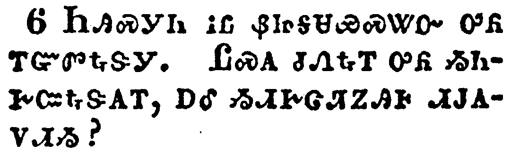</a></td>
</tr>
<tr class="even">
<td>But ye have despised the poor. Do not rich men oppress you, and draw you before the judgment seats?</td>
</tr>
<tr class="odd">
<td>ᏂᎯᏍᎩᏂ ᎥᏝ ᏰᏥᎦᏌᏯᏍᏔᏅ ᎤᏲ ᎢᏳᏛᎿᎭᏕᎩ. ᏝᏍᎪ ᏧᏁᎿᎭᎢ ᎤᏲ ᏱᏂᎨᏨᎿᎭᏕᎪᎢ, ᎠᎴ ᏱᏗᎨᏣᏘᏃᎯᎰ ᏗᎫᎪᏙᏗᏱ?</td>
</tr>
<tr class="even">
<td>Ni-hi-s-gi-ni v-tla ye-tsi-ga-sa-ya-s-ta-nv u-yo i-yu-dv-hna-de-gi. Tla-s-go tsu-ne-hna-i u-yo yi-ni-ge-tsv-hna-de-go-i, a-le yi-di-ge-tsa-ti-no-hi-ho di-gu-go-do-di-yi?</td>
</tr>
</tbody>
</table>

<table>
<tbody>
<tr class="odd">
<td><a href="200207.png">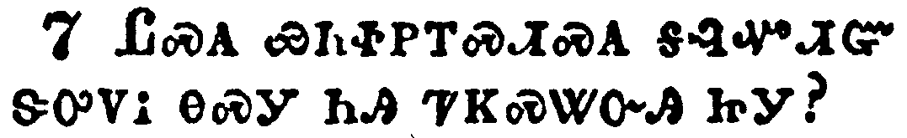</a></td>
</tr>
<tr class="even">
<td>Do not they blaspheme that worthy name by the which ye are called?</td>
</tr>
<tr class="odd">
<td>ᏝᏍᎪ ᏯᏂᏐᏢᎢᏍᏗᏍᎪ ᎦᎸᏉᏗᏳ ᏕᎤᏙᎥ ᎾᏍᎩ ᏂᎯ ᏤᏦᏍᏔᏅᎯ ᏥᎩ?</td>
</tr>
<tr class="even">
<td>Tla-s-go ya-ni-so-tlv-i-s-di-s-go ga-lv-quo-di-yu de-u-do-v na-s-gi ni-hi tse-tso-s-ta-nv-hi tsi-gi?</td>
</tr>
</tbody>
</table>

<table>
<tbody>
<tr class="odd">
<td><a href="200208.png">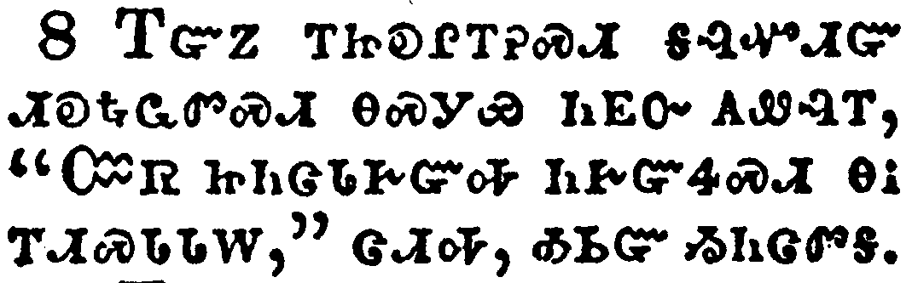</a></td>
</tr>
<tr class="even">
<td>If ye fulfill the royal law according to the scripture, Thou shalt love thy neighbour as thyself, ye do well:</td>
</tr>
<tr class="odd">
<td>ᎢᏳᏃ ᎢᏥᎧᎵᎢᎮᏍᏗ ᎦᎸᏉᏗᏳ ᏗᎧᎿᎭᏩᏛᏍᏗ ᎾᏍᎩᏯ ᏂᎬᏅ ᎪᏪᎸᎢ, "ᏨᏒ ᏥᏂᏣᏓᎨᏳᎭ ᏂᎨᏳᏎᏍᏗ ᎾᎥ ᎢᏗᏍᏓᏓᎳ," ᏣᏗᎭ, ᎣᏏᏳ ᏱᏂᏣᏛᎦ.</td>
</tr>
<tr class="even">
<td>I-yu-no i-tsi-ka-li-i-he-s-di ga-lv-quo-di-yu di-ka-hna-wa-dv-s-di na-s-gi-ya ni-gv-nv go-we-lv-i, "Tsv-sv tsi-ni-tsa-da-ge-yu-ha ni-ge-yu-se-s-di na-v i-di-s-da-da-la," tsa-di-ha, o-si-yu yi-ni-tsa-dv-ga.</td>
</tr>
</tbody>
</table>

<table>
<tbody>
<tr class="odd">
<td><a href="200209.png">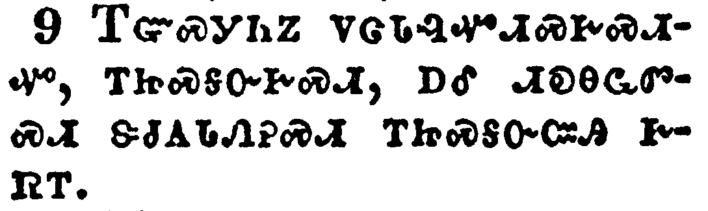</a></td>
</tr>
<tr class="even">
<td>But if ye have respect to persons, ye commit sin, and are convinced of the law as transgressors.</td>
</tr>
<tr class="odd">
<td>ᎢᏳᏍᎩᏂᏃ ᏙᏣᏓᎸᏉᏗᏍᎨᏍᏗᏉ, ᎢᏥᏍᎦᏅᎨᏍᏗ, ᎠᎴ ᏗᎧᎾᏩᏛᏍᏗ ᏕᏧᎪᏓᏁᎮᏍᏗ ᎢᏥᏍᎦᏅᏨᎯ ᎨᏒᎢ.</td>
</tr>
<tr class="even">
<td>I-yu-s-gi-ni-no do-tsa-da-lv-quo-di-s-ge-s-di-quo, i-tsi-s-ga-nv-ge-s-di, a-le di-ka-na-wa-dv-s-di de-tsu-go-da-ne-he-s-di i-tsi-s-ga-nv-tsv-hi ge-sv-i.</td>
</tr>
</tbody>
</table>

<table>
<tbody>
<tr class="odd">
<td><a href="200210.png">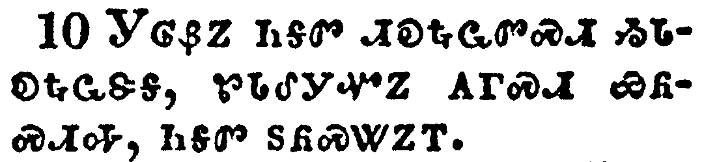</a></td>
</tr>
<tr class="even">
<td>For whosoever shall keep the whole law, and yet offend in one point, he is guilty of all.</td>
</tr>
<tr class="odd">
<td>ᎩᎶᏰᏃ ᏂᎦᏛ ᏗᎧᎿᎭᏩᏛᏍᏗ ᏱᏓᎧᎿᎭᏩᏕᎦ, ᏑᏓᎴᎩᏉᏃ ᎪᎱᏍᏗ ᏯᏲᏍᏗᎭ, ᏂᎦᏛ ᏚᏲᏍᏔᏃᎢ.</td>
</tr>
<tr class="even">
<td>Gi-lo-ye-no ni-ga-dv di-ka-hna-wa-dv-s-di yi-da-ka-hna-wa-de-ga, su-da-le-gi-quo-no go-hu-s-di ya-yo-s-di-ha, ni-ga-dv du-yo-s-ta-no-i.</td>
</tr>
</tbody>
</table>

<table>
<tbody>
<tr class="odd">
<td><a href="200211.png">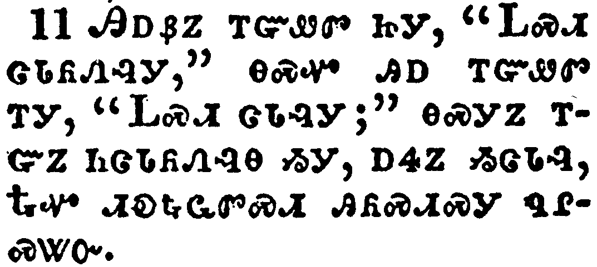</a></td>
</tr>
<tr class="even">
<td>For he that said, Do not commit adultery, said also, Do not kill. Now if thou commit no adultery, yet if thou kill, thou art become a transgressor of the law.</td>
</tr>
<tr class="odd">
<td>ᎯᎠᏰᏃ ᎢᏳᏪᏛ ᏥᎩ, "ᏞᏍᏗ ᏣᏓᏲᏁᎸᎩ," ᎾᏍᏉ ᎯᎠ ᎢᏳᏪᏛ ᎢᎩ, "ᏞᏍᏗ ᏣᏓᎸᎩ;" ᎾᏍᎩᏃ ᎢᏳᏃ ᏂᏣᏓᏲᏁᎸᎾ ᏱᎩ, ᎠᏎᏃ ᏱᏣᏓᎸ, ᎿᎭᏉ ᏗᎧᎿᎭᏩᏛᏍᏗ ᎯᏲᏍᏗᏍᎩ ᏄᎵᏍᏔᏅ.</td>
</tr>
<tr class="even">
<td>Hi-a-ye-no i-yu-we-dv tsi-gi, "Tle-s-di tsa-da-yo-ne-lv-gi," na-s-quo hi-a i-yu-we-dv i-gi, "Tle-s-di tsa-da-lv-gi;" na-s-gi-no i-yu-no ni-tsa-da-yo-ne-lv-na yi-gi, a-se-no yi-tsa-da-lv, Hna-quo di-ka-hna-wa-dv-s-di hi-yo-s-di-s-gi nu-li-s-ta-nv.</td>
</tr>
</tbody>
</table>

<table>
<tbody>
<tr class="odd">
<td><a href="200212.png">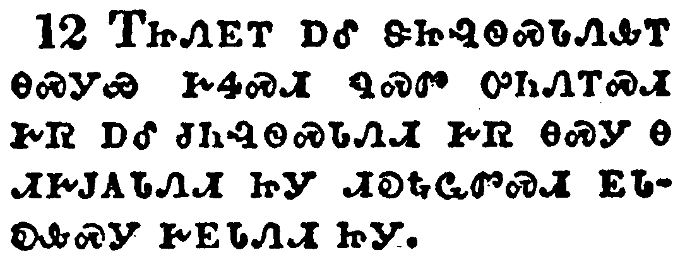</a></td>
</tr>
<tr class="even">
<td>So speak ye, and so do, as they that shall be judged by the law of liberty.</td>
</tr>
<tr class="odd">
<td>ᎢᏥᏁᎬᎢ ᎠᎴ ᏕᏥᎸᏫᏍᏓᏁᎲᎢ ᎾᏍᎩᏯ ᎨᏎᏍᏗ ᏄᏍᏛ ᎤᏂᏁᎢᏍᏗ ᎨᏒ ᎠᎴ ᏧᏂᎸᏫᏍᏓᏁᏗ ᎨᏒ ᎾᏍᎩ Ꮎ ᏗᎨᎫᎪᏓᏁᏗ ᏥᎩ ᏗᎧᎿᎭᏩᏛᏍᏗ ᎬᏓᎧᎲᏍᎩ ᎨᎬᏓᏁᏗ ᏥᎩ.</td>
</tr>
<tr class="even">
<td>I-tsi-ne-gv-i a-le de-tsi-lv-wi-s-da-ne-hv-i na-s-gi-ya ge-se-s-di nu-s-dv u-ni-ne-i-s-di ge-sv a-le tsu-ni-lv-wi-s-da-ne-di ge-sv na-s-gi na di-ge-gu-go-da-ne-di tsi-gi di-ka-hna-wa-dv-s-di gv-da-ka-hv-s-gi ge-gv-da-ne-di tsi-gi.</td>
</tr>
</tbody>
</table>

<table>
<tbody>
<tr class="odd">
<td><a href="200213.png">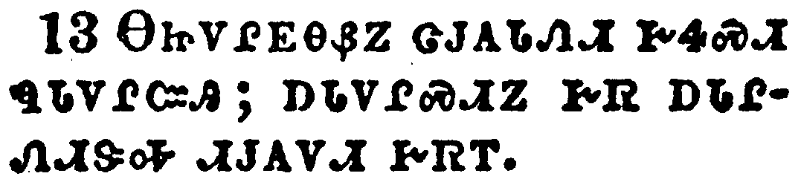</a></td>
</tr>
<tr class="even">
<td>For he shall have judgment without mercy, that hath shewed no mercy; and mercy rejoiceth against judgment.</td>
</tr>
<tr class="odd">
<td>ᎾᏥᏙᎵᎬᎾᏰᏃ ᏣᎫᎪᏓᏁᏗ ᎨᏎᏍᏗ ᏄᏓᏙᎵᏨᎯ; ᎠᏓᏙᎵᏍᏗᏃ ᎨᏒ ᎠᏓᎵᏁᏗᏕᎭ ᏗᎫᎪᏙᏗ ᎨᏒᎢ.</td>
</tr>
<tr class="even">
<td>Na-tsi-do-li-gv-na-ye-no tsa-gu-go-da-ne-di ge-se-s-di nu-da-do-li-tsv-hi; a-da-do-li-s-di-no ge-sv a-da-li-ne-di-de-ha di-gu-go-do-di ge-sv-i.</td>
</tr>
</tbody>
</table>

<table>
<tbody>
<tr class="odd">
<td><a href="200214.png">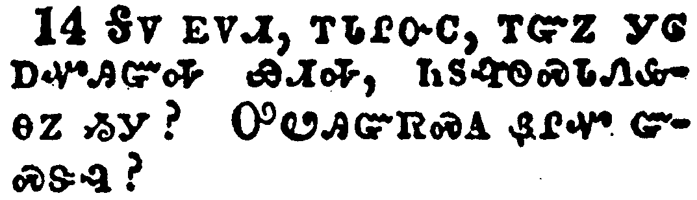</a></td>
</tr>
<tr class="even">
<td>What doth it profit, my brethren, though a man say he hath faith, and have not works? can faith save him?</td>
</tr>
<tr class="odd">
<td>ᎦᏙ ᎬᏙᏗ, ᎢᏓᎵᏅᏟ, ᎢᏳᏃ ᎩᎶ ᎠᏉᎯᏳᎭ ᏯᏗᎭ, ᏂᏚᎸᏫᏍᏓᏁᎲᎾᏃ ᏱᎩ? ᎤᏬᎯᏳᏒᏍᎪ ᏰᎵᏉ ᏳᏍᏕᎸ?</td>
</tr>
<tr class="even">
<td>Ga-do gv-do-di, i-da-li-nv-tli, i-yu-no gi-lo a-quo-hi-yu-ha ya-di-ha, ni-du-lv-wi-s-da-ne-hv-na-no yi-gi? U-wo-hi-yu-sv-s-go ye-li-quo yu-s-de-lv?</td>
</tr>
</tbody>
</table>

<table>
<tbody>
<tr class="odd">
<td><a href="200215.png">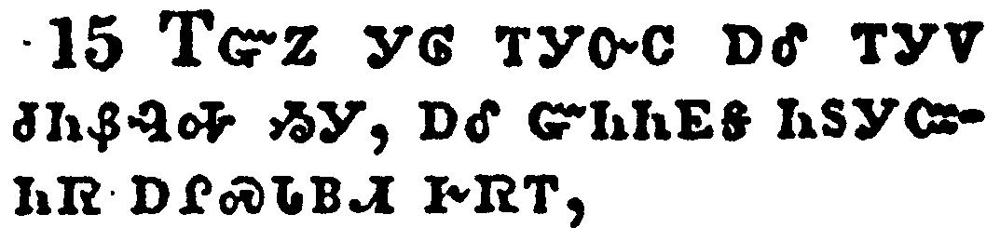</a></td>
</tr>
<tr class="even">
<td>If a brother or sister be naked, and destitute of daily food,</td>
</tr>
<tr class="odd">
<td>ᎢᏳᏃ ᎩᎶ ᎢᎩᏅᏟ ᎠᎴ ᎢᎩᏙ ᏧᏂᏰᎸᎭ ᏱᎩ, ᎠᎴ ᏳᏂᏂᎬᎦ ᏂᏚᎩᏨᏂᏒ ᎠᎵᏍᏓᏴᏗ ᎨᏒᎢ,</td>
</tr>
<tr class="even">
<td>I-yu-no gi-lo i-gi-nv-tli a-le i-gi-do tsu-ni-ye-lv-ha yi-gi, a-le yu-ni-ni-gv-ga ni-du-gi-tsv-ni-sv a-li-s-da-yv-di ge-sv-i,</td>
</tr>
</tbody>
</table>

<table>
<tbody>
<tr class="odd">
<td><a href="200216.png">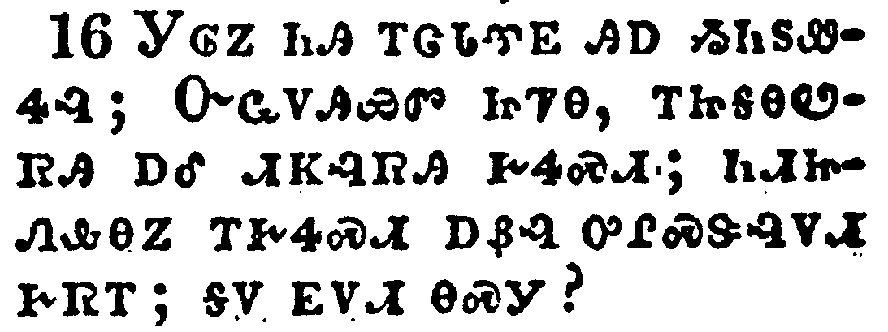</a></td>
</tr>
<tr class="even">
<td>And one of you say unto them, Depart in peace, be ye warmed and filled; notwithstanding ye give them not those things which are needful to the body; what doth it profit?</td>
</tr>
<tr class="odd">
<td>ᎩᎶᏃ ᏂᎯ ᎢᏣᏓᏡᎬ ᎯᎠ ᏱᏂᏚᏪᏎᎸ; ᏅᏩᏙᎯᏯᏛ ᏥᏤᎾ, ᎢᏥᎦᎾᏬᏒᎯ ᎠᎴ ᏗᏦᎸᏒᎯ ᎨᏎᏍᏗ; ᏂᏗᏥᏁᎲᎾᏃ ᎢᎨᏎᏍᏗ ᎠᏰᎸ ᎤᎵᏍᏕᎸᏙᏗ ᎨᏒᎢ; ᎦᏙ ᎬᏙᏗ ᎾᏍᎩ?</td>
</tr>
<tr class="even">
<td>Gi-lo-no ni-hi i-tsa-da-tlu-gv hi-a yi-ni-du-we-se-lv; Nv-wa-do-hi-ya-dv tsi-tse-na, i-tsi-ga-na-wo-sv-hi a-le di-tso-lv-sv-hi ge-se-s-di; ni-di-tsi-ne-hv-na-no i-ge-se-s-di a-ye-lv u-li-s-de-lv-do-di ge-sv-i; ga-do gv-do-di na-s-gi?</td>
</tr>
</tbody>
</table>

<table>
<tbody>
<tr class="odd">
<td><a href="200217.png">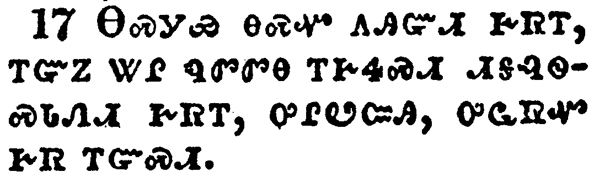</a></td>
</tr>
<tr class="even">
<td>Even so faith, if it hath not works, is dead, being alone.</td>
</tr>
<tr class="odd">
<td>ᎾᏍᎩᏯ ᎾᏍᏉ ᎪᎯᏳᏗ ᎨᏒᎢ, ᎢᏳᏃ ᏔᎵ ᏄᏛᏛᎾ ᎢᎨᏎᏍᏗ ᏗᎦᎸᏫᏍᏓᏁᏗ ᎨᏒᎢ, ᎤᎵᏬᏨᎯ, ᎤᏩᏒᏉ ᎨᏒ ᎢᏳᏍᏗ.</td>
</tr>
<tr class="even">
<td>Na-s-gi-ya na-s-quo go-hi-yu-di ge-sv-i, i-yu-no ta-li nu-dv-dv-na i-ge-se-s-di di-ga-lv-wi-s-da-ne-di ge-sv-i, u-li-wo-tsv-hi, u-wa-sv-quo ge-sv i-yu-s-di.</td>
</tr>
</tbody>
</table>

<table>
<tbody>
<tr class="odd">
<td><a href="200218.png">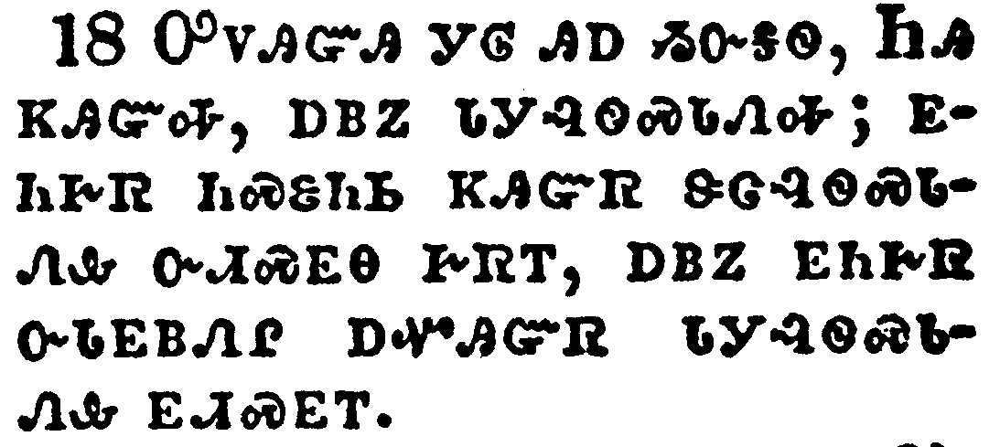</a></td>
</tr>
<tr class="even">
<td>Yea, a man may say, Thou hast faith, and I have works: shew me thy faith without thy works, and I will shew thee my faith by my works.</td>
</tr>
<tr class="odd">
<td>ᎤᏙᎯᏳᎯ ᎩᎶ ᎯᎠ ᏱᏅᎦᏫ, ᏂᎯ ᏦᎯᏳᎭ, ᎠᏴᏃ ᏓᎩᎸᏫᏍᏓᏁᎭ; ᎬᏂᎨᏒ ᏂᏍᏋᏂᏏ ᏦᎯᏳᏒ ᏕᏣᎸᏫᏍᏓᏁᎲ ᏅᏗᏍᎬᎾ ᎨᏒᎢ, ᎠᏴᏃ ᎬᏂᎨᏒ ᏅᏓᎬᏴᏁᎵ ᎠᏉᎯᏳᏒ ᏓᎩᎸᏫᏍᏓᏁᎲ ᎬᏗᏍᎬᎢ.</td>
</tr>
<tr class="even">
<td>U-do-hi-yu-hi gi-lo hi-a yi-nv-ga-wi, Ni-hi tso-hi-yu-ha, a-yv-no da-gi-lv-wi-s-da-ne-ha; gv-ni-ge-sv ni-s-quv-ni-si tso-hi-yu-sv de-tsa-lv-wi-s-da-ne-hv nv-di-s-gv-na ge-sv-i, a-yv-no gv-ni-ge-sv nv-da-gv-yv-ne-li a-quo-hi-yu-sv da-gi-lv-wi-s-da-ne-hv gv-di-s-gv-i.</td>
</tr>
</tbody>
</table>

<table>
<tbody>
<tr class="odd">
<td><a href="200219.png">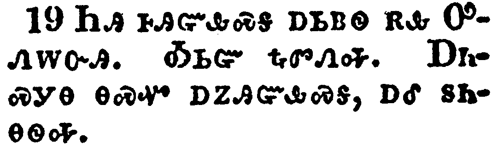</a></td>
</tr>
<tr class="even">
<td>Thou believest that there is one God; thou doest well: the devils also believe, and tremble.</td>
</tr>
<tr class="odd">
<td>ᏂᎯ ᎰᎯᏳᎲᏍᎦ ᎠᏏᏴᏫ ᎡᎲ ᎤᏁᎳᏅᎯ. ᎣᏏᏳ ᎿᎭᏛᏁᎭ. ᎠᏂᏍᎩᎾ ᎾᏍᏉ ᎠᏃᎯᏳᎲᏍᎦ, ᎠᎴ ᏚᏂᎾᏫᎭ.</td>
</tr>
<tr class="even">
<td>Ni-hi ho-hi-yu-hv-s-ga a-si-yv-wi e-hv U-ne-la-nv-hi. O-si-yu hna-dv-ne-ha. A-ni-s-gi-na na-s-quo a-no-hi-yu-hv-s-ga, a-le du-ni-na-wi-ha.</td>
</tr>
</tbody>
</table>

<table>
<tbody>
<tr class="odd">
<td><a href="200220.png">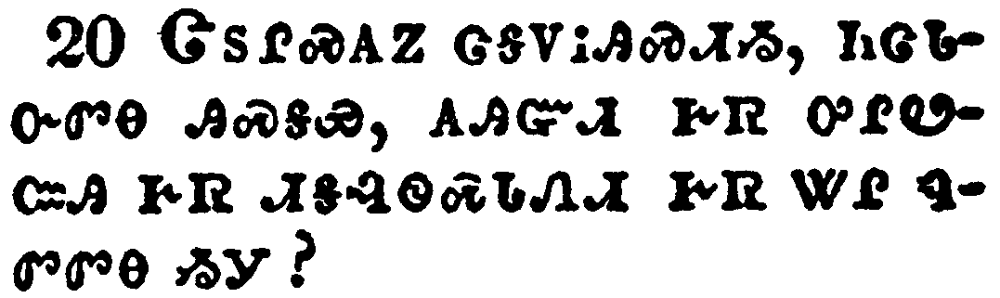</a></td>
</tr>
<tr class="even">
<td>But wilt thou know, O vain man, that faith without works is dead?</td>
</tr>
<tr class="odd">
<td>ᏣᏚᎵᏍᎪᏃ ᏣᎦᏙᎥᎯᏍᏗᏱ, ᏂᏣᏓᏅᏛᎾ ᎯᏍᎦᏯ, ᎪᎯᏳᏗ ᎨᏒ ᎤᎵᏬᏨᎯ ᎨᏒ ᏗᎦᎸᏫᏍᏓᏁᏗ ᎨᏒ ᏔᎵ ᏄᏛᏛᎾ ᏱᎩ?</td>
</tr>
<tr class="even">
<td>Tsa-du-li-s-go-no tsa-ga-do-v-hi-s-di-yi, ni-tsa-da-nv-dv-na hi-s-ga-ya, go-hi-yu-di ge-sv u-li-wo-tsv-hi ge-sv di-ga-lv-wi-s-da-ne-di ge-sv ta-li nu-dv-dv-na yi-gi?</td>
</tr>
</tbody>
</table>

<table>
<tbody>
<tr class="odd">
<td><a href="200221.png">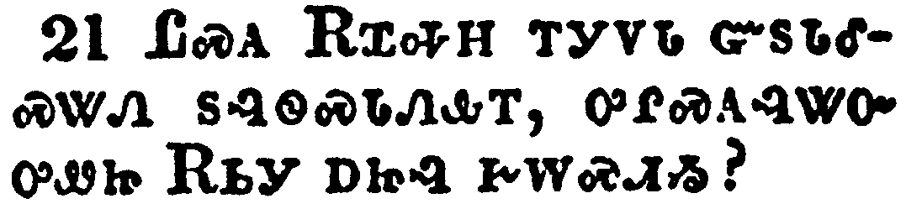</a></td>
</tr>
<tr class="even">
<td>Was not Abraham our father justified by works, when he had offered Isaac his son upon the altar?</td>
</tr>
<tr class="odd">
<td>ᏝᏍᎪ ᎡᏆᎭᎻ ᎢᎩᏙᏓ ᏳᏚᏓᎴᏍᏔᏁ ᏚᎸᏫᏍᏓᏁᎲᎢ, ᎤᎵᏍᎪᎸᏔᏅ ᎤᏪᏥ ᎡᏏᎩ ᎠᏥᎸ ᎨᎳᏍᏗᏱ?</td>
</tr>
<tr class="even">
<td>Tla-s-go E-qua-ha-mi i-gi-do-da yu-du-da-le-s-ta-ne du-lv-wi-s-da-ne-hv-i, u-li-s-go-lv-ta-nv u-we-tsi E-si-gi a-tsi-lv ge-la-s-di-yi?</td>
</tr>
</tbody>
</table>

<table>
<tbody>
<tr class="odd">
<td><a href="200222.png">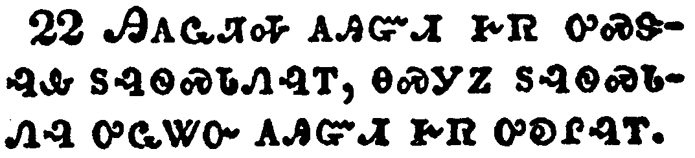</a></td>
</tr>
<tr class="even">
<td>Seest thou how faith wrought with his works, and by works was faith made perfect?</td>
</tr>
<tr class="odd">
<td>ᎯᎪᏩᏘᎭ ᎪᎯᏳᏗ ᎨᏒ ᎤᏍᏕᎸᎲ ᏚᎸᏫᏍᏓᏁᎸᎢ, ᎾᏍᎩᏃ ᏚᎸᏫᏍᏓᏁᎸ ᎤᏩᏔᏅ ᎪᎯᏳᏗ ᎨᏒ ᎤᎧᎵᎸᎢ.</td>
</tr>
<tr class="even">
<td>Hi-go-wa-ti-ha go-hi-yu-di ge-sv u-s-de-lv-hv du-lv-wi-s-da-ne-lv-i, na-s-gi-no du-lv-wi-s-da-ne-lv u-wa-ta-nv go-hi-yu-di ge-sv u-ka-li-lv-i.</td>
</tr>
</tbody>
</table>

<table>
<tbody>
<tr class="odd">
<td><a href="200223.png">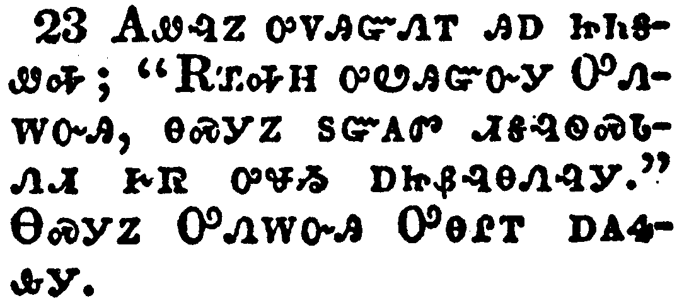</a></td>
</tr>
<tr class="even">
<td>And the scripture was fulfilled which saith, Abraham believed God, and it was imputed unto him for righteousness: and he was called the Friend of God.</td>
</tr>
<tr class="odd">
<td>ᎪᏪᎸᏃ ᎤᏙᎯᏳᏁᎢ ᎯᎠ ᏥᏂᎦᏪᎭ; "ᎡᏆᎭᎻ ᎤᏬᎯᏳᏅᎩ ᎤᏁᎸᏅᎯ, ᎾᏍᎩᏃ ᏚᏳᎪᏛ ᏗᎦᎸᏫᏍᏓᏁᏗ ᎨᏒ ᎤᏠᏱ ᎠᏥᏰᎸᎾᏁᎸᎩ." ᎾᏍᎩᏃ ᎤᏁᎳᏅᎯ ᎤᎾᎵᎢ ᎠᎪᏎᎲᎩ.</td>
</tr>
<tr class="even">
<td>Go-we-lv-no u-do-hi-yu-ne-i hi-a tsi-ni-ga-we-ha; "E-qua-ha-mi u-wo-hi-yu-nv-gi U-ne-lv-nv-hi, na-s-gi-no du-yu-go-dv di-ga-lv-wi-s-da-ne-di ge-sv u-tlo-yi a-tsi-ye-lv-na-ne-lv-gi." Na-s-gi-no U-ne-la-nv-hi U-na-li-i a-go-se-hv-gi.</td>
</tr>
</tbody>
</table>

<table>
<tbody>
<tr class="odd">
<td><a href="200224.png">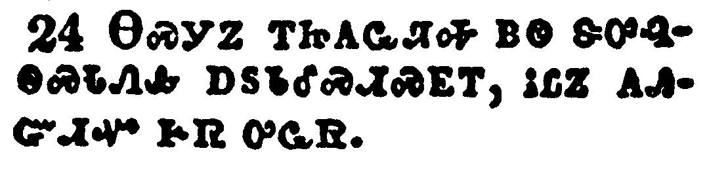</a></td>
</tr>
<tr class="even">
<td>Ye see then how that by works a man is justified, and not by faith only.</td>
</tr>
<tr class="odd">
<td>ᎾᏍᎩᏃ ᎢᏥᎪᏩᏘᎭ ᏴᏫ ᏕᎤᎸᏫᏍᏓᏁᎲ ᎠᏚᏓᎴᏍᏗᏍᎬᎢ, ᎥᏝᏃ ᎪᎯᏳᏗᏉ ᎨᏒ ᎤᏩᏒ.</td>
</tr>
<tr class="even">
<td>Na-s-gi-no i-tsi-go-wa-ti-ha yv-wi de-u-lv-wi-s-da-ne-hv a-du-da-le-s-di-s-gv-i, v-tla-no go-hi-yu-di-quo ge-sv u-wa-sv.</td>
</tr>
</tbody>
</table>

<table>
<tbody>
<tr class="odd">
<td><a href="200225.png">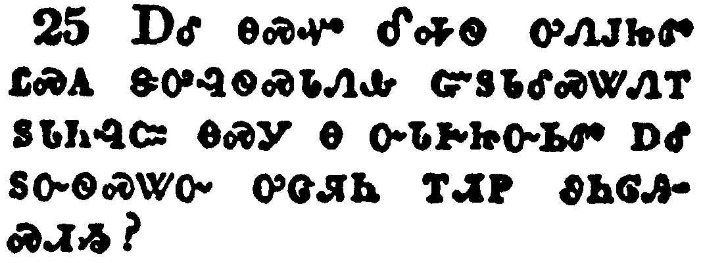</a></td>
</tr>
<tr class="even">
<td>Likewise also was not Rahab the harlot justified by works, when she had received the messengers, and had sent them out another way?</td>
</tr>
<tr class="odd">
<td>ᎠᎴ ᎾᏍᏉ ᎴᎭᏫ ᎤᏁᎫᏥᏛ ᏝᏍᎪ ᏕᎤᎸᏫᏍᏓᏁᎲ ᏳᏚᏓᎴᏍᏔᏁᎢ ᏚᏓᏂᎸᏨ ᎾᏍᎩ Ꮎ ᏅᏓᎨᏥᏅᏏᏛ ᎠᎴ ᏚᏅᏫᏍᏔᏅ ᎤᏣᏘᏂ ᎢᏗᏢ ᏭᏂᎶᎯᏍᏗᏱ?</td>
</tr>
<tr class="even">
<td>A-le na-s-quo Le-ha-wi u-ne-gu-tsi-dv tla-s-go de-u-lv-wi-s-da-ne-hv yu-du-da-le-s-ta-ne-i du-da-ni-lv-tsv na-s-gi na nv-da-ge-tsi-nv-si-dv a-le du-nv-wi-s-ta-nv u-tsa-ti-ni i-di-tlv wu-ni-lo-hi-s-di-yi?</td>
</tr>
</tbody>
</table>

<table>
<tbody>
<tr class="odd">
<td><a href="200226.png">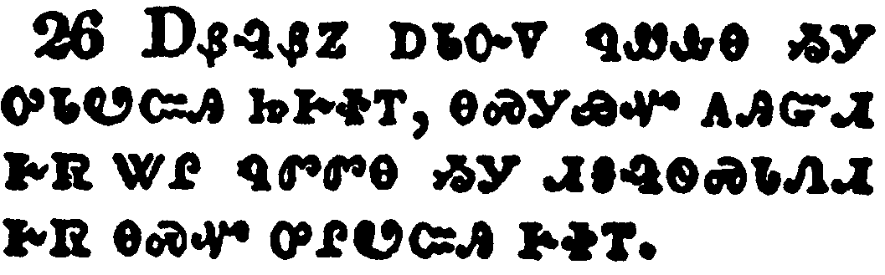</a></td>
</tr>
<tr class="even">
<td>For as the body without the spirit is dead, so faith without works is dead also.</td>
</tr>
<tr class="odd">
<td>ᎠᏰᎸᏰᏃ ᎠᏓᏅᏙ ᏄᏪᎲᎾ ᏱᎩ ᎤᏓᏬᏨᎯ ᏥᎨᏐᎢ, ᎾᏍᎩᏯᏉ ᎪᎯᏳᏗ ᎨᏒ ᏔᎵ ᏄᏛᏛᎾ ᏱᎩ ᏗᎦᎸᏫᏍᏓᏁᏗ ᎨᏒ ᎾᏍᏉ ᎤᎵᏬᏨᎯ ᎨᏐᎢ.</td>
</tr>
<tr class="even">
<td>A-ye-lv-ye-no a-da-nv-do nu-we-hv-na yi-gi u-da-wo-tsv-hi tsi-ge-so-i, na-s-gi-ya-quo go-hi-yu-di ge-sv ta-li nu-dv-dv-na yi-gi di-ga-lv-wi-s-da-ne-di ge-sv na-s-quo u-li-wo-tsv-hi ge-so-i.</td>
</tr>
</tbody>
</table>

