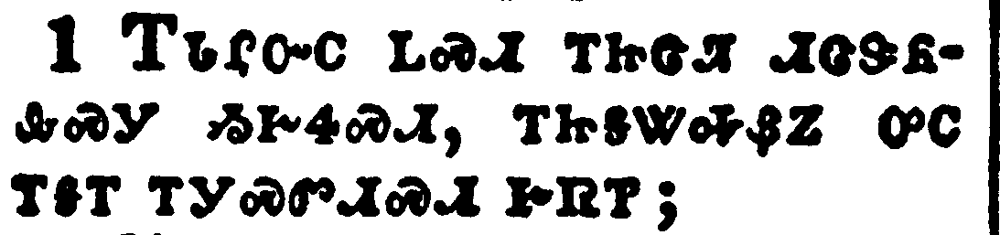
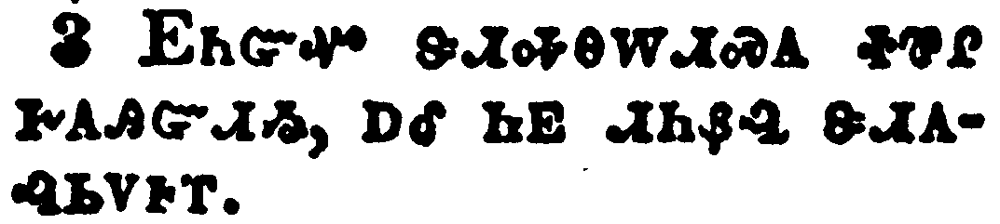
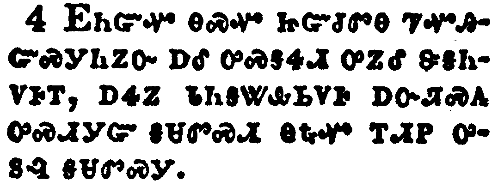
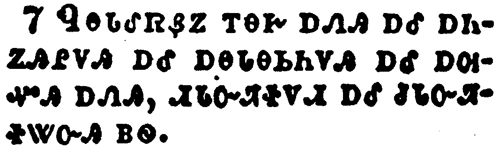
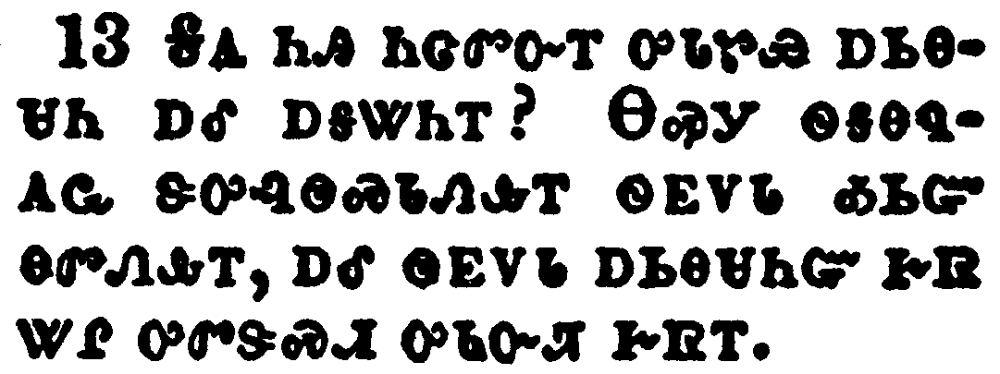
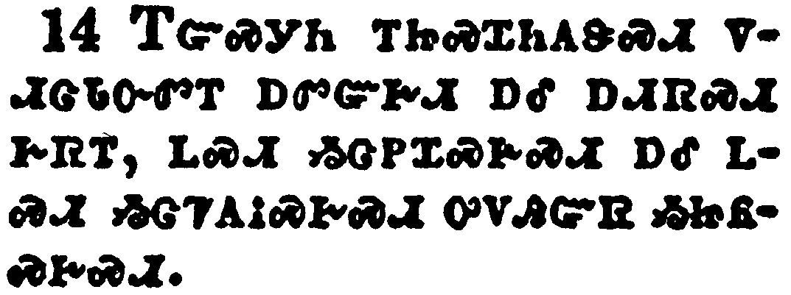
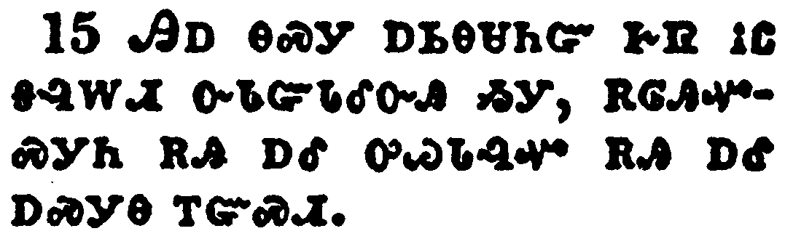

+++
draft=false
date = 2014-12-18T21:11:07Z
title = "James - Chapter 3 - Cherokee New Testament"
weight = 1418955067

[taxonomies]

authors = ["Timothy Legg"]
categories = []
tags = []

[extra]
+++

<table>
<tbody>
<tr class="odd">
<td></td>
</tr>
<tr class="even">
<td>My brethren, be not many masters, knowing that we shall receive the greater condemnation.</td>
</tr>
<tr class="odd">
<td>ᎢᏓᎵᏅᏟ ᏞᏍᏗ ᎢᏥᏣᏘ ᏗᏣᏕᏲᎲᏍᎩ ᏱᎨᏎᏍᏗ, ᎢᏥᎦᏔᎭᏰᏃ ᎤᏟ ᎢᎦᎢ ᎢᎩᏍᏛᏗᏍᏗ ᎨᏒᎢ;</td>
</tr>
<tr class="even">
<td>I-da-li-nv-tli tle-s-di i-tsi-tsa-ti di-tsa-de-yo-hv-s-gi yi-ge-se-s-di, i-tsi-ga-ta-ha-ye-no u-tli i-ga-i i-gi-s-dv-di-s-di ge-sv-i;</td>
</tr>
</tbody>
</table>

<table>
<tbody>
<tr class="odd">
<td></td>
</tr>
<tr class="even">
<td>For in many things we offend all. If any man offend not in word, the same is a perfect man, and able also to bridle the whole body.</td>
</tr>
<tr class="odd">
<td>ᎤᏣᏘᏰᏃ ᎢᏳᏓᎴᎩ ᏂᏗᎥ ᎢᏗᏍᎦᏅᎪᎢ. ᎢᏳᏃ ᎩᎶ ᎦᏬᏂᏍᎬ ᎾᏍᎦᏅᎬᎾ ᏥᎨᏐᎢ, ᎾᏍᎩ ᏄᎪᎸᎾ ᎨᏐ ᎠᏍᎦᏯ, ᏰᎵᏉ ᎾᏍᏉ ᎬᏪᎾᎯᏍᏙᏗ ᏂᎬ ᎠᏰᎸᎢ.</td>
</tr>
<tr class="even">
<td>U-tsa-ti-ye-no i-yu-da-le-gi ni-di-v i-di-s-ga-nv-go-i. I-yu-no gi-lo ga-wo-ni-s-gv na-s-ga-nv-gv-na tsi-ge-so-i, na-s-gi nu-go-lv-na ge-so a-s-ga-ya, ye-li-quo na-s-quo gv-we-na-hi-s-do-di ni-gv a-ye-lv-i.</td>
</tr>
</tbody>
</table>

<table>
<tbody>
<tr class="odd">
<td></td>
</tr>
<tr class="even">
<td>Behold, we put bits in the horses' mouths, that they may obey us; and we turn about their whole body.</td>
</tr>
<tr class="odd">
<td>ᎬᏂᏳᏉ ᏕᏗᎭᎾᎳᏗᏍᎪ ᏐᏈᎵ ᎨᎪᎯᏳᏗᏱ, ᎠᎴ ᏂᎬ ᏗᏂᏰᎸ ᏕᏗᎪᎸᏏᏙᎰᎢ.</td>
</tr>
<tr class="even">
<td>Gv-ni-yu-quo de-di-ha-na-la-di-s-go so-qui-li ge-go-hi-yu-di-yi, a-le ni-gv di-ni-ye-lv de-di-go-lv-si-do-ho-i.</td>
</tr>
</tbody>
</table>

<table>
<tbody>
<tr class="odd">
<td></td>
</tr>
<tr class="even">
<td>Behold also the ships, which though they be so great, and are driven of fierce winds, yet are they turned about with a very small helm, whithersoever the governor listeth.</td>
</tr>
<tr class="odd">
<td>ᎬᏂᏳᏉ ᎾᏍᏉ ᏥᏳᏧᏛᎾ ᏤᏉᎯᏳᏍᎩᏂᏃᏅ ᎠᎴ ᎤᏍᎦᏎᏗ ᎤᏃᎴ ᏕᎦᏂᏙᎰᎢ, ᎠᏎᏃ ᏓᏂᎦᏔᎲᏏᏙᎰ ᎠᏅᏘᏍᎪ ᎤᏍᏗᎩᏳ ᎦᏌᏛᏍᏗ ᎾᎿᎭᏉ ᎢᏗᏢ ᎤᏚᎸ ᎦᏌᏛᏍᎩ.</td>
</tr>
<tr class="even">
<td>Gv-ni-yu-quo na-s-quo tsi-yu-tsu-dv-na tse-quo-hi-yu-s-gi-ni-no-nv a-le u-s-ga-se-di u-no-le de-ga-ni-do-ho-i, a-se-no da-ni-ga-ta-hv-si-do-ho a-nv-ti-s-go u-s-di-gi-yu ga-sa-dv-s-di na-hna-quo i-di-tlv u-du-lv ga-sa-dv-s-gi.</td>
</tr>
</tbody>
</table>

<table>
<tbody>
<tr class="odd">
<td></td>
</tr>
<tr class="even">
<td>Even so the tongue is a little member, and boasteth great things. Behold, how great a matter a little fire kindleth!</td>
</tr>
<tr class="odd">
<td>ᎾᏍᎩᏯ ᎾᏍᏉ ᎦᏃᎦ ᎤᏍᏗᎩᏳ, ᎠᏎᏃ ᎡᏉᎯᏳ ᎦᏬᏂᏍᎪᎢ. ᎬᏂᏳᏉ ᎤᏍᏗ ᎠᏥᎸ ᏄᏣᏔ ᎠᏓ ᏓᏥᏍᏢᏍᎪᎢ.</td>
</tr>
<tr class="even">
<td>Na-s-gi-ya na-s-quo ga-no-ga u-s-di-gi-yu, a-se-no e-quo-hi-yu ga-wo-ni-s-go-i. Gv-ni-yu-quo u-s-di a-tsi-lv nu-tsa-ta a-da da-tsi-s-tlv-s-go-i.</td>
</tr>
</tbody>
</table>

<table>
<tbody>
<tr class="odd">
<td></td>
</tr>
<tr class="even">
<td>And the tongue is a fire, a world of iniquity: so is the tongue among our members, that it defileth the whole body, and setteth on fire the course of nature; and it is set on fire of hell.</td>
</tr>
<tr class="odd">
<td>ᎠᎴ ᎦᏃᎦ ᎠᏥᎸ ᎾᏍᎩᏯᎢ ᎠᎴ ᎡᎶᎯ ᎠᎧᎵᎢ ᏂᏚᏳᎪᏛᎾ ᎨᏒ ᎾᏍᎩᏯ. ᎾᏍᎩᏯ ᏄᏍᏗ ᎦᏃᎦ ᎤᏓᏑᏴ ᎢᎦᏙᏢᏒᎢ, ᎾᏍᎩ ᎦᏓᎭ ᎢᎬᏁᎯ ᏂᎬ ᎠᏰᎸᎢ, ᎠᎴ ᎠᏥᏍᏢᏍᎩ ᎠᎢᏒ ᎠᏁᎳᏅᎯ ᎨᏒᎢ, ᎠᎴ ᏨᏍᎩᏃᎢ ᎤᏓᏳᏓᎴᏅᎯ ᎠᏥᏥᏍᏝᏫᏍᏗᏍᎩ.</td>
</tr>
<tr class="even">
<td>A-le ga-no-ga a-tsi-lv na-s-gi-ya-i a-le e-lo-hi a-ka-li-i ni-du-yu-go-dv-na ge-sv na-s-gi-ya. Na-s-gi-ya nu-s-di ga-no-ga u-da-su-yv i-ga-do-tlv-sv-i, na-s-gi ga-da-ha i-gv-ne-hi ni-gv a-ye-lv-i, a-le a-tsi-s-tlv-s-gi a-i-sv a-ne-la-nv-hi ge-sv-i, a-le tsv-s-gi-no-i u-da-yu-da-le-nv-hi a-tsi-tsi-s-tla-wi-s-di-s-gi.</td>
</tr>
</tbody>
</table>

<table>
<tbody>
<tr class="odd">
<td></td>
</tr>
<tr class="even">
<td>For every kind of beasts, and of birds, and of serpents, and of things in the sea, is tamed, and hath been tamed of mankind:</td>
</tr>
<tr class="odd">
<td>ᏄᎾᏓᎴᏒᏰᏃ ᎢᎾᎨ ᎠᏁᎯ ᎠᎴ ᎠᏂᏃᎯᎵᏙᎯ ᎠᎴ ᎠᎾᏓᎾᏏᏂᏙᎯ ᎠᎴ ᎠᎺᏉᎯ ᎠᏁᎯ, ᏗᏓᏅᏘᏐᏙᏗ ᎠᎴ ᏧᏓᏅᏘᏐᏔᏅᎯ ᏴᏫ.</td>
</tr>
<tr class="even">
<td>Nu-na-da-le-sv-ye-no i-na-ge a-ne-hi a-le a-ni-no-hi-li-do-hi a-le a-na-da-na-si-ni-do-hi a-le a-me-quo-hi a-ne-hi, di-da-nv-ti-so-do-di a-le tsu-da-nv-ti-so-ta-nv-hi yv-wi.</td>
</tr>
</tbody>
</table>

<table>
<tbody>
<tr class="odd">
<td></td>
</tr>
<tr class="even">
<td>But the tongue can no man tame; it is an unruly evil, full of deadly poison.</td>
</tr>
<tr class="odd">
<td>ᎦᏃᎦᏍᎩᏂ ᎥᏝ ᎩᎶ ᏰᎵ ᏴᎬᏓᏅᏘᏐᏓ, ᎾᏍᎩ ᎤᏲᎢ ᎬᏎᎪᎩᏍᏗ ᏂᎨᏒᎾ, ᎠᎧᎵᎢ ᎠᏓᎯᎯ ᏅᏬᏘ.</td>
</tr>
<tr class="even">
<td>Ga-no-ga-s-gi-ni v-tla gi-lo ye-li yv-gv-da-nv-ti-so-da, na-s-gi u-yo-i gv-se-go-gi-s-di ni-ge-sv-na, a-ka-li-i a-da-hi-hi nv-wo-ti.</td>
</tr>
</tbody>
</table>

<table>
<tbody>
<tr class="odd">
<td></td>
</tr>
<tr class="even">
<td>Therewith bless we God, even the Father; and therewith curse we men, which are made after the similitude of God.</td>
</tr>
<tr class="odd">
<td>ᎾᏍᎩ ᎢᏛᏗᏍᎪᎢ ᎡᏗᎸᏉᏗᏍᎪ ᎤᏁᎳᏅᎯ ᎠᎦᏴᎵᎨᎢ, ᎠᎴ ᎾᏍᎩ ᎢᏛᏗᏍᎪᎢ ᏕᏗᏍᎩᏅᏗᏍᎪ ᏴᏫ ᎾᏍᎩ ᎤᏁᎳᏅᎯ ᏄᏍᏛ ᎢᎨᎬᏁᎸᎯ ᎨᎪᏢᏅᎯ</td>
</tr>
<tr class="even">
<td>Na-s-gi i-dv-di-s-go-i e-di-lv-quo-di-s-go U-ne-la-nv-hi A-ga-yv-li-ge-i, a-le na-s-gi i-dv-di-s-go-i de-di-s-gi-nv-di-s-go yv-wi na-s-gi U-ne-la-nv-hi nu-s-dv i-ge-gv-ne-lv-hi ge-go-tlv-nv-hi</td>
</tr>
</tbody>
</table>

<table>
<tbody>
<tr class="odd">
<td></td>
</tr>
<tr class="even">
<td>Out of the same mouth proceedeth blessing and cursing. My brethren, these things ought not so to be.</td>
</tr>
<tr class="odd">
<td>ᎾᏍᎩ ᏌᏉ ᎠᎰᎵ ᏗᎦᏄᎪᎪ ᎦᎸᏉᏙᏗ ᎨᏒ ᎠᎴ ᎠᏍᎩᏅᏗᏍᏗ ᎨᏒᎢ. ᎢᏓᎵᏅᏟ, ᎥᏝ ᎣᏏᏳ ᏱᎩ ᎾᏍᎩ ᏥᏄᏍᏗ.</td>
</tr>
<tr class="even">
<td>Na-s-gi sa-quo a-ho-li di-ga-nu-go-go ga-lv-quo-do-di ge-sv a-le a-s-gi-nv-di-s-di ge-sv-i. I-da-li-nv-tli, v-tla o-si-yu yi-gi na-s-gi tsi-nu-s-di.</td>
</tr>
</tbody>
</table>

<table>
<tbody>
<tr class="odd">
<td></td>
</tr>
<tr class="even">
<td>Doth a fountain send forth at the same place sweet water and bitter?</td>
</tr>
<tr class="odd">
<td>ᏥᎪ ᏌᏉ ᎦᏄᎪᎬ ᏗᎦᏄᎪᎪ ᎤᎦᎾᏍᏛ ᎠᎹ ᎠᎴ ᎤᏴᏍᏗ?</td>
</tr>
<tr class="even">
<td>Tsi-go sa-quo ga-nu-go-gv di-ga-nu-go-go u-ga-na-s-dv a-ma a-le u-yv-s-di?</td>
</tr>
</tbody>
</table>

<table>
<tbody>
<tr class="odd">
<td></td>
</tr>
<tr class="even">
<td>Can the fig tree, my brethren, bear olive berries? either a vine, figs? so can no fountain both yield salt water and fresh.</td>
</tr>
<tr class="odd">
<td>ᎢᏓᎵᏅᏟ, ᏥᎪ ᏒᎦᏔ-ᎢᏳᏍᏗ ᏡᎬ ᏰᎵᏉ ᏯᎾᏓᏛᎦ ᎣᎵᏩ ᏡᎬ ᎠᎾᏓᏛᏍᎩ, ᎠᎴ ᏥᎪ ᏖᎸᎳᏗᎯ ᏒᎦᎳ-ᎢᏳᏍᏗ ᏯᎾᏓᏛᎦ? ᎾᏍᏉᏍᎩᏂ ᎥᏝ ᏰᎵ ᏌᏉ ᎦᏄᎪᎬ ᏴᏛᎦᏄᎪᎢ ~ᎠᎹ ᎤᎶᏥᏛ ᎠᎴ ~ᎠᎹ ᎤᎶᏥᏛ ᏂᎨᏒᎾ.</td>
</tr>
<tr class="even">
<td>I-da-li-nv-tli, tsi-go sv-ga-ta--i-yu-s-di tlu-gv ye-li-quo ya-na-da-dv-ga o-li-wa tlu-gv a-na-da-dv-s-gi, a-le tsi-go te-lv-la-di-hi sv-ga-la--i-yu-s-di ya-na-da-dv-ga? Na-s-quo-s-gi-ni v-tla ye-li sa-quo ga-nu-go-gv yv-dv-ga-nu-go-i ~a-ma u-lo-tsi-dv a-le ~a-ma u-lo-tsi-dv ni-ge-sv-na.</td>
</tr>
</tbody>
</table>

<table>
<tbody>
<tr class="odd">
<td></td>
</tr>
<tr class="even">
<td>Who is a wise man and endued with knowledge among you? let him shew out of a good conversation his works with meekness of wisdom.</td>
</tr>
<tr class="odd">
<td>ᎦᎪ ᏂᎯ ᏂᏣᏛᏅᎢ ᎤᏓᏑᏯ ᎠᏏᎾᏌᏂ ᎠᎴ ᎠᎦᏔᏂᎢ? ᎾᏍᎩ ᏫᎦᎾᏄᎪᏩ ᏕᎤᎸᏫᏍᏓᏁᎲᎢ ᏫᎬᏙᏓ ᎣᏏᏳ ᎾᏛᏁᎲᎢ, ᎠᎴ ᏫᎬᏙᏓ ᎠᏏᎾᏌᏂᏳ ᎨᏒ ᏔᎵ ᎤᏛᏕᏍᏗ ᎤᏓᏅᏘ ᎨᏒᎢ.</td>
</tr>
<tr class="even">
<td>Ga-go ni-hi ni-tsa-dv-nv-i u-da-su-ya a-si-na-sa-ni a-le a-ga-ta-ni-i? Na-s-gi wi-ga-na-nu-go-wa de-u-lv-wi-s-da-ne-hv-i wi-gv-do-da o-si-yu na-dv-ne-hv-i, a-le wi-gv-do-da a-si-na-sa-ni-yu ge-sv ta-li u-dv-de-s-di u-da-nv-ti ge-sv-i.</td>
</tr>
</tbody>
</table>

<table>
<tbody>
<tr class="odd">
<td></td>
</tr>
<tr class="even">
<td>But if ye have bitter envying and strife in your hearts, glory not, and lie not against the truth.</td>
</tr>
<tr class="odd">
<td>ᎢᏳᏍᎩᏂ ᎢᏥᏍᏆᏂᎪᏕᏍᏗ ᏙᏗᏣᏓᏅᏛᎢ ᎠᏛᏳᎨᏗ ᎠᎴ ᎠᏗᏒᏍᏗ ᎨᏒᎢ, ᏞᏍᏗ ᏱᏣᏢᏆᏍᎨᏍᏗ ᎠᎴ ᏞᏍᏗ ᏱᏣᏤᎪᎥᏍᎨᏍᏗ ᎤᏙᎯᏳᏒ ᏱᏥᏲᏍᎨᏍᏗ.</td>
</tr>
<tr class="even">
<td>I-yu-s-gi-ni i-tsi-s-qua-ni-go-de-s-di do-di-tsa-da-nv-dv-i a-dv-yu-ge-di a-le a-di-sv-s-di ge-sv-i, tle-s-di yi-tsa-tlv-qua-s-ge-s-di a-le tle-s-di yi-tsa-tse-go-v-s-ge-s-di u-do-hi-yu-sv yi-tsi-yo-s-ge-s-di.</td>
</tr>
</tbody>
</table>

<table>
<tbody>
<tr class="odd">
<td></td>
</tr>
<tr class="even">
<td>This wisdom descendeth not from above, but is earthly, sensual, devilish.</td>
</tr>
<tr class="odd">
<td>ᎯᎠ ᎾᏍᎩ ᎠᏏᎾᏌᏂᏳ ᎨᏒ ᎥᏝ ᎦᎸᎳᏗ ᏅᏓᏳᏓᎴᏅᎯ ᏱᎩ, ᎡᎶᎯᏉᏍᎩᏂ ᎡᎯ ᎠᎴ ᎤᏊᏓᎸᏉ ᎡᎯ ᎠᎴ ᎠᏍᎩᎾ ᎢᏳᏍᏗ.</td>
</tr>
<tr class="even">
<td>Hi-a na-s-gi a-si-na-sa-ni-yu ge-sv v-tla ga-lv-la-di nv-da-yu-da-le-nv-hi yi-gi, e-lo-hi-quo-s-gi-ni e-hi a-le u-quu-da-lv-quo e-hi a-le a-s-gi-na i-yu-s-di.</td>
</tr>
</tbody>
</table>

<table>
<tbody>
<tr class="odd">
<td></td>
</tr>
<tr class="even">
<td>For where envying and strife is, there is confusion and every evil work.</td>
</tr>
<tr class="odd">
<td>ᎾᎿᎭᏰᏃ ᎠᏛᏳᎨᏗ ᎠᎴ ᎠᏗᏒᏍᏗ ᎠᏁᎲᎢ, ᎾᎿᎭᎡᎰ ᏧᏓᎴᏅᏛ ᎠᎴ ᏂᎦᎥ ᎤᏲ ᏗᎦᎸᏫᏍᏓᏁᏗ ᎨᏒᎢ.</td>
</tr>
<tr class="even">
<td>Na-hna-ye-no a-dv-yu-ge-di a-le a-di-sv-s-di a-ne-hv-i, na-hna e-ho tsu-da-le-nv-dv a-le ni-ga-v u-yo di-ga-lv-wi-s-da-ne-di ge-sv-i.</td>
</tr>
</tbody>
</table>

<table>
<tbody>
<tr class="odd">
<td></td>
</tr>
<tr class="even">
<td>But the wisdom that is from above is first pure, then peaceable, gentle, and easy to be intreated, full of mercy and good fruits, without partiality, and without hypocrisy.</td>
</tr>
<tr class="odd">
<td>ᎦᎸᎳᏗᏍᎩᏂ ᏅᏓᏳᏓᎴᏅᎯ ᏥᎩ ᎠᏏᎾᏌᏂᏳ ᎨᏒ ᎢᎬᏱᏱ ᎦᏓᎭ ᏂᎨᏒᎾ ᎨᏐᎢ, ᎿᎭᏉᏃ ᎪᎯᏍᏗᏍᎩ, ᎠᎴ ᎤᏓᏅᏘ, ᎠᎴ ᎤᏬᎯᏳᎯᏍᏛ, ᎠᎴ ᎠᎧᎵᏬᎯ ᎠᏓᏙᎵᏍᏗ ᎨᏒᎢ ᎠᎴ ᎣᏍᏛ ᏗᎦᎸᏫᏍᏓᏁᏗ ᎨᏒᎢ, ᎠᎴ ᏄᏓᎸᏉᏛᎾ, ᎠᎴ ᎤᏠᎾᏍᏗ ᏂᎨᏒᎾ.</td>
</tr>
<tr class="even">
<td>Ga-lv-la-di-s-gi-ni nv-da-yu-da-le-nv-hi tsi-gi a-si-na-sa-ni-yu ge-sv i-gv-yi-yi ga-da-ha ni-ge-sv-na ge-so-i, hna-quo-no go-hi-s-di-s-gi, a-le u-da-nv-ti, a-le u-wo-hi-yu-hi-s-dv, a-le a-ka-li-wo-hi a-da-do-li-s-di ge-sv-i a-le o-s-dv di-ga-lv-wi-s-da-ne-di ge-sv-i, a-le nu-da-lv-quo-dv-na, a-le u-tlo-na-s-di ni-ge-sv-na.</td>
</tr>
</tbody>
</table>

<table>
<tbody>
<tr class="odd">
<td></td>
</tr>
<tr class="even">
<td>And the fruit of righteousness is sown in peace of them that make peace.</td>
</tr>
<tr class="odd">
<td>ᎠᏃᎯᏍᏗᏍᎩᏂ ᎠᏃᎯᏍᏗᏍᎬᎢ ᎠᏂᏫᏍᎪ ᏚᏳᎪᏛ ᎤᎾᏄᎪᏫᏍᏗ ᎨᏒᎢ.</td>
</tr>
<tr class="even">
<td>A-no-hi-s-di-s-gi-ni a-no-hi-s-di-s-gv-i a-ni-wi-s-go du-yu-go-dv u-na-nu-go-wi-s-di ge-sv-i.</td>
</tr>
</tbody>
</table>

