+++
draft=false
date = 2014-12-18T21:11:07Z
title = "John - Chapter 2 - Cherokee New Testament"
weight = 1418955067

[taxonomies]

authors = ["Timothy Legg"]
categories = []
tags = []

[extra]
+++

<table>
<tbody>
<tr class="odd">
<td><a href="040201.png">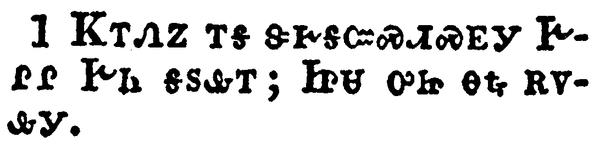</a></td>
</tr>
<tr class="even">
<td>And the third day there was a marriage in Cana of Galilee; and the mother of Jesus was there:</td>
</tr>
<tr class="odd">
<td>ᏦᎢᏁᏃ ᎢᎦ ᏕᎨᎦᏨᏍᏗᏍᎬᎩ ᎨᎵᎵ ᎨᏂ ᎦᏚᎲᎢ; ᏥᏌ ᎤᏥ ᎾᎿᎭᎡᏙᎲᎩ.</td>
</tr>
<tr class="even">
<td>Tso-i-ne-no i-ga de-ge-ga-tsv-s-di-s-gv-gi Ge-li-li Ge-ni ga-du-hv-i; Tsi-sa u-tsi na-hna e-do-hv-gi.</td>
</tr>
</tbody>
</table>

<table>
<tbody>
<tr class="odd">
<td><a href="040202.png">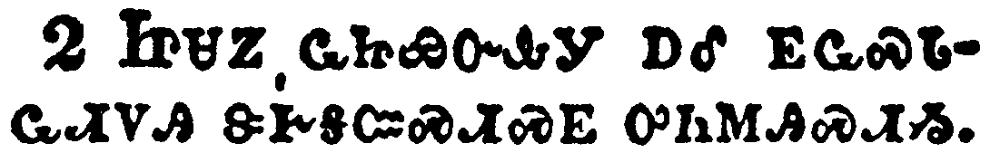</a></td>
</tr>
<tr class="even">
<td>And both Jesus was called, and his disciples, to the marriage.</td>
</tr>
<tr class="odd">
<td>ᏥᏌᏃ ᏩᏥᏯᏅᎲᎩ ᎠᎴ ᎬᏩᏍᏓᏩᏗᏙᎯ ᏕᎨᎦᏨᏍᏗᏍᎬ ᎤᏂᎷᎯᏍᏗᏱ.</td>
</tr>
<tr class="even">
<td>Tsi-sa-no wa-tsi-ya-nv-hv-gi a-le gv-wa-s-da-wa-di-do-hi de-ge-ga-tsv-s-di-s-gv u-ni-lu-hi-s-di-yi.</td>
</tr>
</tbody>
</table>

<table>
<tbody>
<tr class="odd">
<td><a href="040203.png">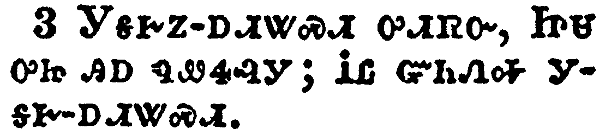</a></td>
</tr>
<tr class="even">
<td>And when they wanted wine, the mother of Jesus saith unto him, They have no wine.</td>
</tr>
<tr class="odd">
<td>ᎩᎦᎨᏃ-ᎠᏗᏔᏍᏗ ᎤᏗᏒᏅ, ᏥᏌ ᎤᏥ ᎯᎠ ᏄᏪᏎᎸᎩ; ᎥᏝ ᏳᏂᏁᎭ ᎩᎦᎨ-ᎠᏗᏔᏍᏗ.</td>
</tr>
<tr class="even">
<td>Gi-ga-ge-no--a-di-ta-s-di u-di-sv-nv, Tsi-sa u-tsi hi-a nu-we-se-lv-gi; V-tla yu-ni-ne-ha gi-ga-ge--a-di-ta-s-di.</td>
</tr>
</tbody>
</table>

<table>
<tbody>
<tr class="odd">
<td><a href="040204.png">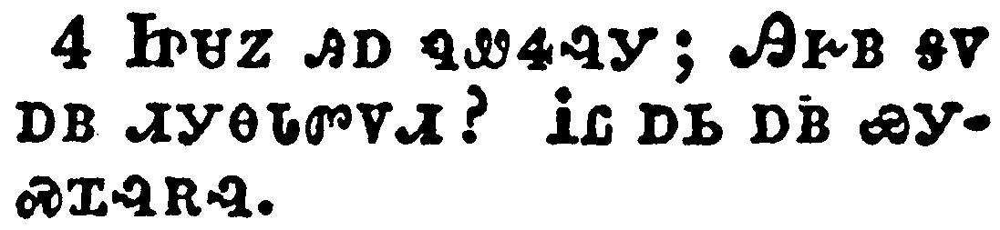</a></td>
</tr>
<tr class="even">
<td>Jesus saith unto her, Woman, what have I to do with thee? mine hour is not yet come.</td>
</tr>
<tr class="odd">
<td>ᏥᏌᏃ ᎯᎠ ᏄᏪᏎᎸᎩ; ᎯᎨᏴ ᎦᏙ ᎠᏴ ᏗᎩᎾᏓᏛᏙᏗ? ᎥᏝ ᎠᏏ ᎠᏴ ᏯᎩᏍᏆᎸᎡᎸ.</td>
</tr>
<tr class="even">
<td>Tsi-sa-no hi-a nu-we-se-lv-gi; Hi-ge-yv ga-do a-yv di-gi-na-da-dv-do-di? V-tla a-si a-yv ya-gi-s-qua-lv-e-lv.</td>
</tr>
</tbody>
</table>

<table>
<tbody>
<tr class="odd">
<td><a href="040205.png">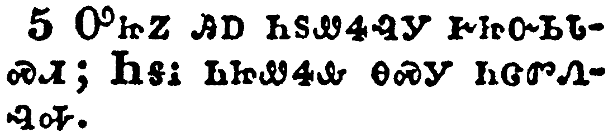</a></td>
</tr>
<tr class="even">
<td>His mother saith unto the servants, Whatsoever he saith unto you, do it.</td>
</tr>
<tr class="odd">
<td>ᎤᏥᏃ ᎯᎠ ᏂᏚᏪᏎᎸᎩ ᎨᏥᏅᏏᏓᏍᏗ; ᏂᎦᎥ ᏂᏥᏪᏎᎲ ᎾᏍᎩ ᏂᏣᏛᏁᎸᎭ.</td>
</tr>
<tr class="even">
<td>U-tsi-no hi-a ni-du-we-se-lv-gi ge-tsi-nv-si-da-s-di; Ni-ga-v ni-tsi-we-se-hv na-s-gi ni-tsa-dv-ne-lv-ha.</td>
</tr>
</tbody>
</table>

<table>
<tbody>
<tr class="odd">
<td><a href="040206.png">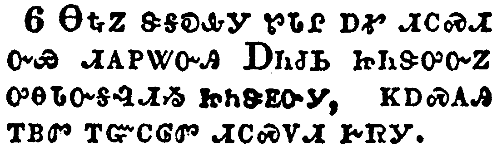</a></td>
</tr>
<tr class="even">
<td>And there were set there six waterpots of stone, after the manner of the purifying of the Jews, containing two or three firkins apiece.</td>
</tr>
<tr class="odd">
<td>ᎾᎿᎭᏃ ᏕᎦᎧᎲᎩ ᏑᏓᎵ ᎠᎹ ᏗᏟᏍᏗ ᏅᏯ ᏗᎪᏢᏔᏅᎯ ᎠᏂᏧᏏ ᏥᏂᏕᎤᏅᏃ ᎤᎾᏓᏅᎦᎸᏗᏱ ᏥᏂᏕᎬᏅᎩ, ᏦᎠᏍᎪᎯ ᎢᏴᏛ ᎢᏳᏟᎶᏛ ᏗᏟᏍᏙᏗ ᎨᏒᎩ</td>
</tr>
<tr class="even">
<td>Na-hna-no de-ga-ka-hv-gi su-da-li a-ma di-tli-s-di nv-ya di-go-tlv-ta-nv-hi A-ni-tsu-si tsi-ni-de-u-nv-no u-na-da-nv-ga-lv-di-yi tsi-ni-de-gv-nv-gi, tso-a-s-go-hi i-yv-dv i-yu-tli-lo-dv di-tli-s-do-di ge-sv-gi</td>
</tr>
</tbody>
</table>

<table>
<tbody>
<tr class="odd">
<td><a href="040207.png">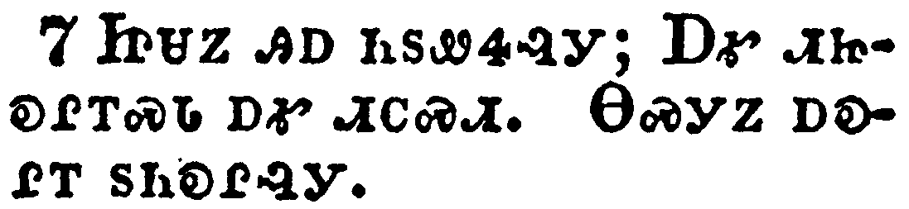</a></td>
</tr>
<tr class="even">
<td>Jesus saith unto them, Fill the waterpots with water. And they filled them up to the brim.</td>
</tr>
<tr class="odd">
<td>ᏥᏌᏃ ᎯᎠ ᏂᏚᏪᏎᎸᎩ; ᎠᎹ ᏗᏥᎧᎵᎢᏍᏓ ᎠᎹ ᏗᏟᏍᏗ. ᎾᏍᎩᏃ ᎠᎧᎵᎢ ᏚᏂᎧᎵᎸᎩ.</td>
</tr>
<tr class="even">
<td>Tsi-sa-no hi-a ni-du-we-se-lv-gi; A-ma di-tsi-ka-li-i-s-da a-ma di-tli-s-di. Na-s-gi-no a-ka-li-i du-ni-ka-li-lv-gi.</td>
</tr>
</tbody>
</table>

<table>
<tbody>
<tr class="odd">
<td><a href="040208.png">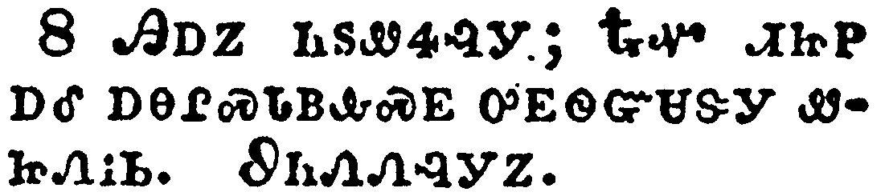</a></td>
</tr>
<tr class="even">
<td>And he saith unto them, Draw out now, and bear unto the governor of the feast. And they bare it.</td>
</tr>
<tr class="odd">
<td>ᎯᎠᏃ ᏂᏚᏪᏎᎸᎩ; ᎿᎭᏉ ᏗᏥᏢ ᎠᎴ ᎠᎾᎵᏍᏓᏴᎲᏍᎬ ᎤᎬᏫᏳᏌᏕᎩ ᏪᏥᏁᎥᏏ. ᏭᏂᏁᏁᎸᎩᏃ.</td>
</tr>
<tr class="even">
<td>Hi-a-no ni-du-we-se-lv-gi; Hna-quo di-tsi-tlv a-le a-na-li-s-da-yv-hv-s-gv u-gv-wi-yu-sa-de-gi we-tsi-ne-v-si. Wu-ni-ne-ne-lv-gi-no.</td>
</tr>
</tbody>
</table>

<table>
<tbody>
<tr class="odd">
<td><a href="040209.png">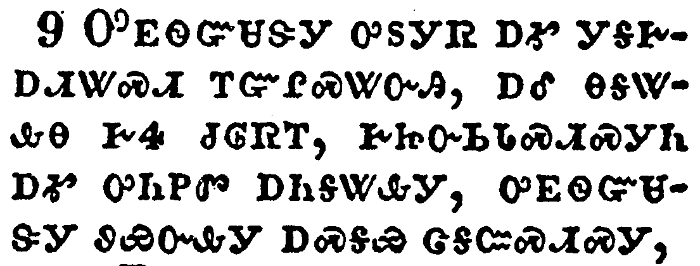</a></td>
</tr>
<tr class="even">
<td>When the ruler of the feast had tasted the water that was made wine, and knew not whence it was: (but the servants which drew the water knew;) the governor of the feast called the bridegroom,</td>
</tr>
<tr class="odd">
<td>ᎤᎬᏫᏳᏌᏕᎩ ᎤᏚᎩᏒ ᎠᎹ ᎩᎦᎨᎠᏗᏔᏍᏗ ᎢᏳᎵᏍᏔᏅᎯ, ᎠᎴ ᎾᎦᏔᎲᎾ ᎨᏎ ᏧᎶᏒᎢ, ᎨᏥᏅᏏᏓᏍᏗᏍᎩᏂ ᎠᎹ ᎤᏂᏢᏛ ᎠᏂᎦᏔᎲᎩ, ᎤᎬᏫᏳᏌᏕᎩ ᏭᏯᏅᎲᎩ ᎠᏍᎦᏯ ᏣᎦᏨᏍᏗᏍᎩ,</td>
</tr>
<tr class="even">
<td>U-gv-wi-yu-sa-de-gi u-du-gi-sv a-ma gi-ga-ge-a-di-ta-s-di i-yu-li-s-ta-nv-hi, a-le na-ga-ta-hv-na ge-se tsu-lo-sv-i, ge-tsi-nv-si-da-s-di-s-gi-ni a-ma u-ni-tlv-dv a-ni-ga-ta-hv-gi, u-gv-wi-yu-sa-de-gi wu-ya-nv-hv-gi a-s-ga-ya tsa-ga-tsv-s-di-s-gi,</td>
</tr>
</tbody>
</table>

<table>
<tbody>
<tr class="odd">
<td></td>
</tr>
<tr class="even">
<td>And saith unto him, Every man at the beginning doth set forth good wine; and when men have well drunk, then that which is worse: but thou hast kept the good wine until now.</td>
</tr>
<tr class="odd">
<td>ᎠᎴ ᎯᎠ ᏄᏪᏎᎸᎩ; ᎾᏂᎥ ᏴᏫ ᎠᎾᎴᏅᏗᏍᎪ ᎠᏂᏝᎲᏍᎪ ᎣᏌᏂ ᎩᎦᎨᎠᏗᏔᏍᏗ, ᎿᎭᏉᏃ ᎤᏣᏘ ᎤᎾᏗᏔᎲᎯ ᏥᎨᏐᎢ ᎩᎳ ᎤᏐᏅ ᎠᏂᏝᎲᏍᎪᎢ; ᏂᎯᏍᎩᏂ ᏣᏍᏆᏂᎪᏕ ᎣᏍᏛ ᎩᎦᎨ-ᎠᏗᏔᏍᏗ ᎪᎯ ᎢᏯᏍᏗ.</td>
</tr>
<tr class="even">
<td>A-le hi-a nu-we-se-lv-gi; Na-ni-v yv-wi a-na-le-nv-di-s-go a-ni-tla-hv-s-go o-sa-ni gi-ga-ge-a-di-ta-s-di, hna-quo-no u-tsa-ti u-na-di-ta-hv-hi tsi-ge-so-i gi-la u-so-nv a-ni-tla-hv-s-go-i; ni-hi-s-gi-ni tsa-s-qua-ni-go-de o-s-dv gi-ga-ge--a-di-ta-s-di go-hi i-ya-s-di.</td>
</tr>
</tbody>
</table>

<table>
<tbody>
<tr class="odd">
<td><a href="040211.png">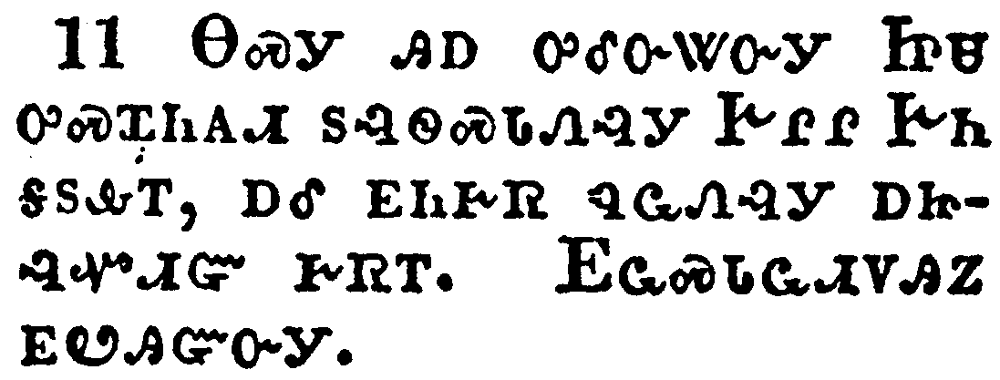</a></td>
</tr>
<tr class="even">
<td>This beginning of miracles did Jesus in Cana of Galilee, and manifested forth his glory; and his disciples believed on him.</td>
</tr>
<tr class="odd">
<td>ᎾᏍᎩ ᎯᎠ ᎤᎴᏅᏔᏅᎩ ᏥᏌ ᎤᏍᏆᏂᎪᏗ ᏚᎸᏫᏍᏓᏁᎸᎩ ᎨᎵᎵ ᎨᏂ ᎦᏚᎲᎢ, ᎠᎴ ᎬᏂᎨᏒ ᏄᏩᏁᎸᎩ ᎠᏥᎸᏉᏗᏳ ᎨᏒᎢ. ᎬᏩᏍᏓᏩᏗᏙᎯᏃ ᎬᏬᎯᏳᏅᎩ.</td>
</tr>
<tr class="even">
<td>Na-s-gi hi-a u-le-nv-ta-nv-gi Tsi-sa u-s-qua-ni-go-di du-lv-wi-s-da-ne-lv-gi Ge-li-li Ge-ni ga-du-hv-i, a-le gv-ni-ge-sv nu-wa-ne-lv-gi a-tsi-lv-quo-di-yu ge-sv-i. Gv-wa-s-da-wa-di-do-hi-no gv-wo-hi-yu-nv-gi.</td>
</tr>
</tbody>
</table>

<table>
<tbody>
<tr class="odd">
<td><a href="040212.png">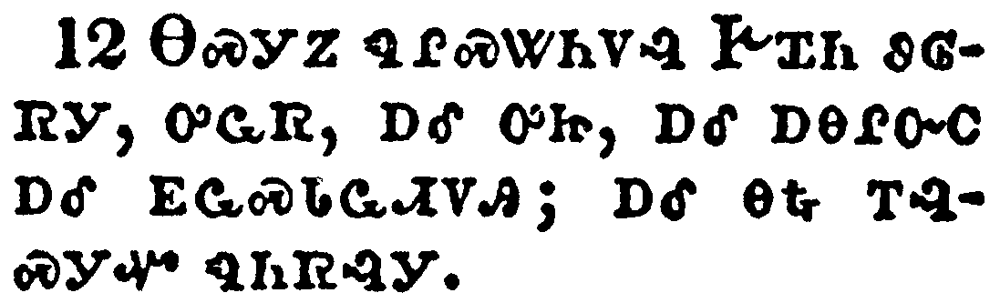</a></td>
</tr>
<tr class="even">
<td>After this he went down to Capernaum, he, and his mother, and his brethren, and his disciples: and they continued there not many days.</td>
</tr>
<tr class="odd">
<td>ᎾᏍᎩᏃ ᏄᎵᏍᏔᏂᏙᎸ ᎨᏆᏂ ᏭᎶᏒᎩ, ᎤᏩᏒ, ᎠᎴ ᎤᏥ, ᎠᎴ ᎠᎾᎵᏅᏟ ᎠᎴ ᎬᏩᏍᏓᏩᏗᏙᎯ; ᎠᎴ ᎾᎿᎭᎢᎸᏍᎩᏉ ᏄᏂᏒᎸᎩ.</td>
</tr>
<tr class="even">
<td>Na-s-gi-no nu-li-s-ta-ni-do-lv Ge-qua-ni wu-lo-sv-gi, u-wa-sv, a-le u-tsi, a-le a-na-li-nv-tli a-le gv-wa-s-da-wa-di-do-hi; a-le na-hna i-lv-s-gi-quo nu-ni-sv-lv-gi.</td>
</tr>
</tbody>
</table>

<table>
<tbody>
<tr class="odd">
<td><a href="040213.png">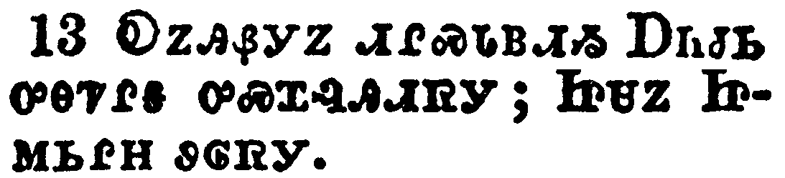</a></td>
</tr>
<tr class="even">
<td>And the Jews' passover was at hand, and Jesus went up to Jerusalem,</td>
</tr>
<tr class="odd">
<td>ᎧᏃᎯᏰᎩᏃ ᏗᎵᏍᏓᏴᏗᏱ ᎠᏂᏧᏏ ᎤᎾᏤᎵᎦ ᎤᏍᏆᎸᎯᏗᏒᎩ; ᏥᏌᏃ ᏥᎷᏏᎵᎻ ᏭᎶᏒᎩ.</td>
</tr>
<tr class="even">
<td>Ka-no-hi-ye-gi-no di-li-s-da-yv-di-yi A-ni-tsu-si u-na-tse-li-ga u-s-qua-lv-hi-di-sv-gi; Tsi-sa-no Tsi-lu-si-li-mi wu-lo-sv-gi.</td>
</tr>
</tbody>
</table>

<table>
<tbody>
<tr class="odd">
<td><a href="040214.png">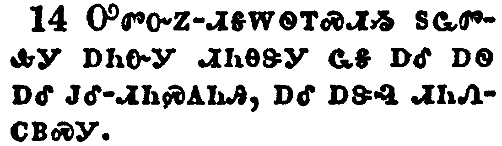</a></td>
</tr>
<tr class="even">
<td>And found in the temple those that sold oxen and sheep and doves, and the changers of money sitting:</td>
</tr>
<tr class="odd">
<td>ᎤᏛᏅᏃ-ᏗᎦᎳᏫᎢᏍᏗᏱ ᏚᏩᏛᎲᎩ ᎠᏂᏅᎩ ᏗᏂᎾᏕᎩ ᏩᎦ ᎠᎴ ᎠᏫ ᎠᎴ ᎫᎴ-ᏗᏂᏍᎪᏂᎯ, ᎠᎴ ᎠᏕᎸ ᏗᏂᏁᏟᏴᏍᎩ.</td>
</tr>
<tr class="even">
<td>U-dv-nv-no--di-ga-la-wi-i-s-di-yi du-wa-dv-hv-gi a-ni-nv-gi di-ni-na-de-gi wa-ga a-le a-wi a-le gu-le--di-ni-s-go-ni-hi, a-le a-de-lv di-ni-ne-tli-yv-s-gi.</td>
</tr>
</tbody>
</table>

<table>
<tbody>
<tr class="odd">
<td><a href="040215.png">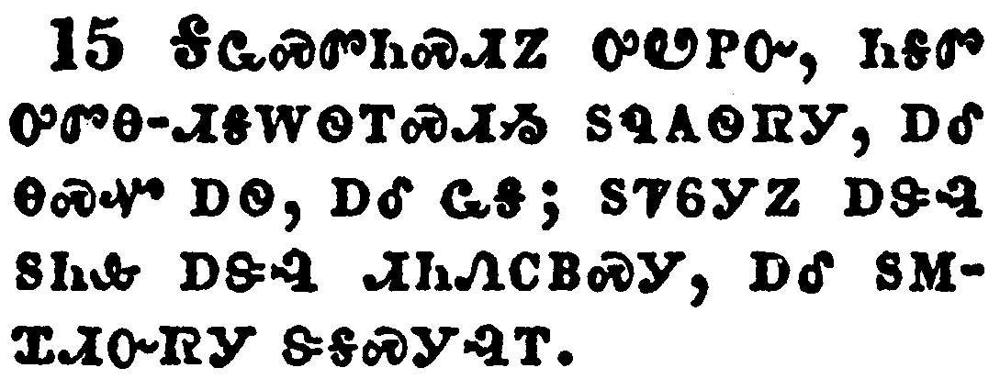</a></td>
</tr>
<tr class="even">
<td>And when he had made a scourge of small cords, he drove them all out of the temple, and the sheep, and the oxen; and poured out the changers' money, and overthrew the tables;</td>
</tr>
<tr class="odd">
<td>ᎦᏩᏍᏛᏂᏍᏗᏃ ᎤᏬᏢᏅ, ᏂᎦᏛ ᎤᏛᎾ-ᏗᎦᎳᏫᎢᏍᏗᏱ ᏚᏄᎪᏫᏒᎩ, ᎠᎴ ᎾᏍᏉ ᎠᏫ, ᎠᎴ ᏩᎦ; ᏚᏤᏮᎩᏃ ᎠᏕᎸ ᏚᏂᎲ ᎠᏕᎸ ᏗᏂᏁᏟᏴᏍᎩ, ᎠᎴ ᏚᎷᏆᏗᏅᏒᎩ ᏕᎦᏍᎩᎸᎢ.</td>
</tr>
<tr class="even">
<td>Ga-wa-s-dv-ni-s-di-no u-wo-tlv-nv, ni-ga-dv u-dv-na--di-ga-la-wi-i-s-di-yi du-nu-go-wi-sv-gi, a-le na-s-quo a-wi, a-le wa-ga; du-tse-wv-gi-no a-de-lv du-ni-hv a-de-lv di-ni-ne-tli-yv-s-gi, a-le du-lu-qua-di-nv-sv-gi de-ga-s-gi-lv-i.</td>
</tr>
</tbody>
</table>

<table>
<tbody>
<tr class="odd">
<td><a href="040216.png">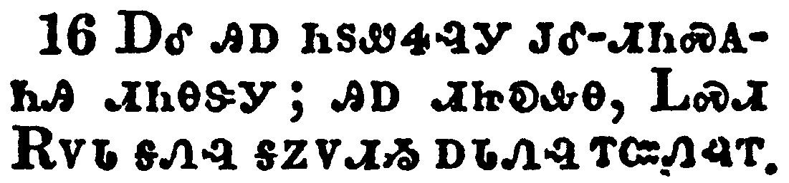</a></td>
</tr>
<tr class="even">
<td>And said unto them that sold doves, Take these things hence; make not my Father's house an house of merchandise.</td>
</tr>
<tr class="odd">
<td>ᎠᎴ ᎯᎠ ᏂᏚᏪᏎᎸᎩ ᎫᎴ-ᏗᏂᏍᎪᏂᎯ ᏗᏂᎾᏕᎩ; ᎯᎠ ᏗᏥᎧᎲᎾ, ᏞᏍᏗ ᎡᏙᏓ ᎦᏁᎸ ᎦᏃᏙᏗᏱ ᎠᏓᏁᎸ ᎢᏨᏁᎸᎢ.</td>
</tr>
<tr class="even">
<td>A-le hi-a ni-du-we-se-lv-gi gu-le--di-ni-s-go-ni-hi di-ni-na-de-gi; hi-a di-tsi-ka-hv-na, Tle-s-di E-do-da ga-ne-lv ga-no-do-di-yi a-da-ne-lv i-tsv-ne-lv-i.</td>
</tr>
</tbody>
</table>

<table>
<tbody>
<tr class="odd">
<td><a href="040217.png">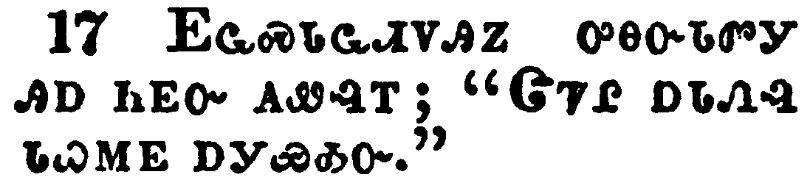</a></td>
</tr>
<tr class="even">
<td>And his disciples remembered that it was written, The zeal of thine house hath eaten me up.</td>
</tr>
<tr class="odd">
<td>ᎬᏩᏍᏓᏩᏗᏙᎯᏃ ᎤᎾᏅᏓᏛᎩ ᎯᎠ ᏂᎬᏅ ᎪᏪᎸᎢ; "ᏣᏤᎵ ᎠᏓᏁᎸ ᏓᏇᎷᎬ ᎠᎩᏯᎣᏅ."</td>
</tr>
<tr class="even">
<td>Gv-wa-s-da-wa-di-do-hi-no u-na-nv-da-dv-gi hi-a ni-gv-nv go-we-lv-i; "Tsa-tse-li a-da-ne-lv da-que-lu-gv a-gi-ya-o-nv."</td>
</tr>
</tbody>
</table>

<table>
<tbody>
<tr class="odd">
<td><a href="040218.png">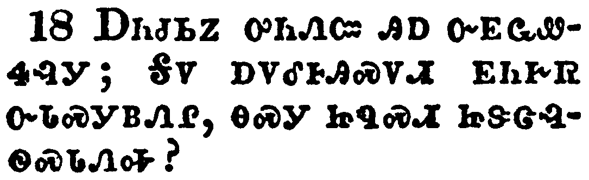</a></td>
</tr>
<tr class="even">
<td>Then answered the Jews and said unto him, What sign shewest thou unto us, seeing that thou doest these things?</td>
</tr>
<tr class="odd">
<td>ᎠᏂᏧᏏᏃ ᎤᏂᏁᏨ ᎯᎠ ᏅᎬᏩᏪᏎᎸᎩ; ᎦᏙ ᎠᏙᎴᎰᎯᏍᏙᏗ ᎬᏂᎨᏒ ᏅᏓᏍᎩᏴᏁᎵ, ᎾᏍᎩ ᏥᏄᏍᏗ ᏥᏕᏣᎸᏫᏍᏓᏁᎭ?</td>
</tr>
<tr class="even">
<td>A-ni-tsu-si-no u-ni-ne-tsv hi-a nv-gv-wa-we-se-lv-gi; Ga-do a-do-le-ho-hi-s-do-di gv-ni-ge-sv nv-da-s-gi-yv-ne-li, na-s-gi tsi-nu-s-di tsi-de-tsa-lv-wi-s-da-ne-ha?</td>
</tr>
</tbody>
</table>

<table>
<tbody>
<tr class="odd">
<td><a href="040219.png">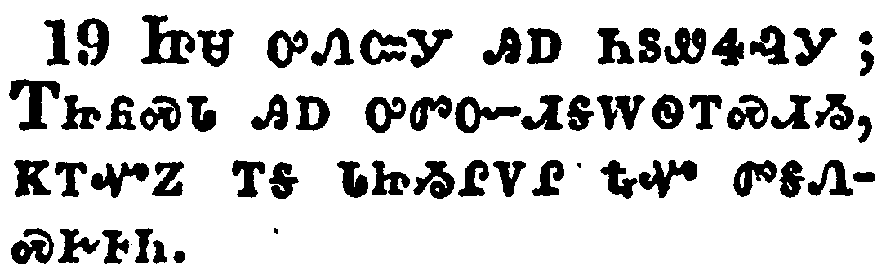</a></td>
</tr>
<tr class="even">
<td>Jesus answered and said unto them, Destroy this temple, and in three days I will raise it up.</td>
</tr>
<tr class="odd">
<td>ᏥᏌ ᎤᏁᏨᎩ ᎯᎠ ᏂᏚᏪᏎᎸᎩ; ᎢᏥᏲᏍᏓ ᎯᎠ ᎤᏛᏅ-ᏗᎦᎳᏫᎢᏍᏗᏱ, ᏦᎢᏉᏃ ᎢᎦ ᏓᏥᏱᎵᏙᎵ ᎿᎭᏉ ᏛᎦᏁᏍᎨᎰᏂ.</td>
</tr>
<tr class="even">
<td>Tsi-sa u-ne-tsv-gi hi-a ni-du-we-se-lv-gi; I-tsi-yo-s-da hi-a u-dv-nv--di-ga-la-wi-i-s-di-yi, tso-i-quo-no i-ga da-tsi-yi-li-do-li hna-quo dv-ga-ne-s-ge-ho-ni.</td>
</tr>
</tbody>
</table>

<table>
<tbody>
<tr class="odd">
<td><a href="040220.png">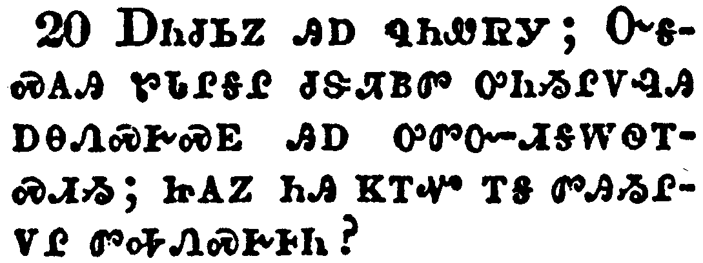</a></td>
</tr>
<tr class="even">
<td>Then said the Jews, Forty and six years was this temple in building, and wilt thou rear it up in three days?</td>
</tr>
<tr class="odd">
<td>ᎠᏂᏧᏏᏃ ᎯᎠ ᏄᏂᏪᏒᎩ; ᏅᎦᏍᎪᎯ ᏑᏓᎵᎦᎵ ᏧᏕᏘᏴᏛ ᎤᏂᏱᎵᏙᎸᎯ ᎠᎾᏁᏍᎨᏍᎬ ᎯᎠ ᎤᏛᏅ-ᏗᎦᎳᏫᎢᏍᏗᏱ; ᏥᎪᏃ ᏂᎯ ᏦᎢᏉ ᎢᎦ ᏛᎯᏱᎵᏙᎵ ᏛᎭᏁᏍᎨᎰᏂ?</td>
</tr>
<tr class="even">
<td>A-ni-tsu-si-no hi-a nu-ni-we-sv-gi; Nv-ga-s-go-hi su-da-li-ga-li tsu-de-ti-yv-dv u-ni-yi-li-do-lv-hi a-na-ne-s-ge-s-gv hi-a u-dv-nv--di-ga-la-wi-i-s-di-yi; tsi-go-no ni-hi tso-i-quo i-ga dv-hi-yi-li-do-li dv-ha-ne-s-ge-ho-ni?</td>
</tr>
</tbody>
</table>

<table>
<tbody>
<tr class="odd">
<td><a href="040221.png">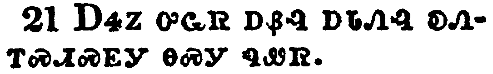</a></td>
</tr>
<tr class="even">
<td>But he spake of the temple of his body.</td>
</tr>
<tr class="odd">
<td>ᎠᏎᏃ ᎤᏩᏒ ᎠᏰᎸ ᎠᏓᏁᎸ ᎧᏁᎢᏍᏗᏍᎬᎩ ᎾᏍᎩ ᏄᏪᏒ.</td>
</tr>
<tr class="even">
<td>A-se-no u-wa-sv a-ye-lv a-da-ne-lv ka-ne-i-s-di-s-gv-gi na-s-gi nu-we-sv.</td>
</tr>
</tbody>
</table>

<table>
<tbody>
<tr class="odd">
<td><a href="040222.png">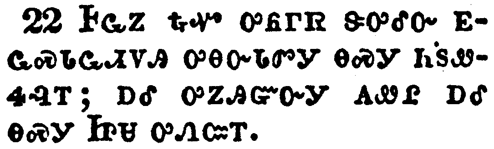</a></td>
</tr>
<tr class="even">
<td>When therefore he was risen from the dead, his disciples remembered that he had said this unto them; and they believed the scripture, and the word which Jesus had said.</td>
</tr>
<tr class="odd">
<td>ᎰᏩᏃ ᎿᎭᏉ ᎤᏲᎱᏒ ᏕᎤᎴᏅ ᎬᏩᏍᏓᏩᏗᏙᎯ ᎤᎾᏅᏓᏛᎩ ᎾᏍᎩ ᏂᏚᏪᏎᎸᎢ; ᎠᎴ ᎤᏃᎯᏳᏅᎩ ᎪᏪᎵ ᎠᎴ ᎾᏍᎩ ᏥᏌ ᎤᏁᏨᎢ.</td>
</tr>
<tr class="even">
<td>Ho-wa-no hna-quo u-yo-hu-sv de-u-le-nv gv-wa-s-da-wa-di-do-hi u-na-nv-da-dv-gi na-s-gi ni-du-we-se-lv-i; a-le u-no-hi-yu-nv-gi go-we-li a-le na-s-gi Tsi-sa u-ne-tsv-i.</td>
</tr>
</tbody>
</table>

<table>
<tbody>
<tr class="odd">
<td><a href="040223.png">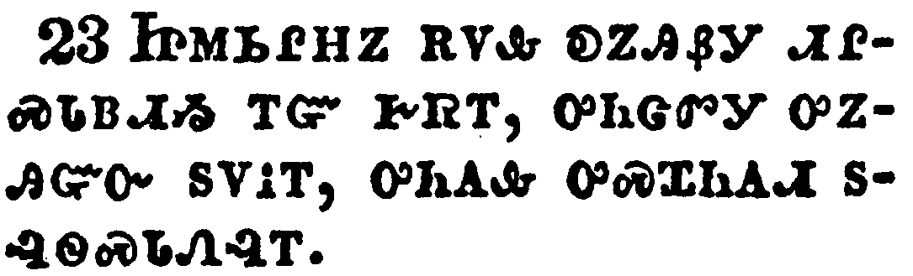</a></td>
</tr>
<tr class="even">
<td>Now when he was in Jerusalem at the passover, in the feast day, many believed in his name, when they saw the miracles which he did.</td>
</tr>
<tr class="odd">
<td>ᏥᎷᏏᎵᎻᏃ ᎡᏙᎲ ᎧᏃᎯᏰᎩ ᏗᎵᏍᏓᏴᏗᏱ ᎢᏳ ᎨᏒᎢ, ᎤᏂᏣᏛᎩ ᎤᏃᎯᏳᏅ ᏚᏙᎥᎢ, ᎤᏂᎪᎲ ᎤᏍᏆᏂᎪᏗ ᏚᎸᏫᏍᏓᏁᎸᎢ.</td>
</tr>
<tr class="even">
<td>Tsi-lu-si-li-mi-no e-do-hv ka-no-hi-ye-gi di-li-s-da-yv-di-yi i-yu ge-sv-i, u-ni-tsa-dv-gi u-no-hi-yu-nv du-do-v-i, u-ni-go-hv u-s-qua-ni-go-di du-lv-wi-s-da-ne-lv-i.</td>
</tr>
</tbody>
</table>

<table>
<tbody>
<tr class="odd">
<td><a href="040224.png">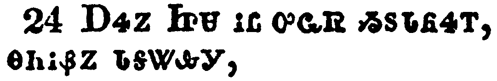</a></td>
</tr>
<tr class="even">
<td>But Jesus did not commit himself unto them, because he knew all men,</td>
</tr>
<tr class="odd">
<td>ᎠᏎᏃ ᏥᏌ ᎥᏝ ᎤᏩᏒ ᏱᏚᏓᏲᏎᎢ, ᎾᏂᎥᏰᏃ ᏓᎦᏔᎲᎩ,</td>
</tr>
<tr class="even">
<td>A-se-no Tsi-sa v-tla u-wa-sv yi-du-da-yo-se-i, na-ni-v-ye-no da-ga-ta-hv-gi,</td>
</tr>
</tbody>
</table>

<table>
<tbody>
<tr class="odd">
<td></td>
</tr>
<tr class="even">
<td>And needed not that any should testify of man: for he knew what was in man.</td>
</tr>
<tr class="odd">
<td>ᎥᏝ ᎠᎴ ᎤᏚᎸᏗ ᏱᏄᎵᏍᏓᏁᎮ ᎩᎶ ᎬᏂᎨᏒ ᎢᏳᏩᏁᏗᏱ ᏄᏍᏛ ᏴᏫ, ᎠᎦᏔᎲᎩᏰᏃ ᏄᏍᏛ ᎭᏫᏂ ᎤᏪᎲ ᏴᏫ.</td>
</tr>
<tr class="even">
<td>V-tla a-le u-du-lv-di yi-nu-li-s-da-ne-he gi-lo gv-ni-ge-sv i-yu-wa-ne-di-yi nu-s-dv yv-wi, a-ga-ta-hv-gi-ye-no nu-s-dv ha-wi-ni u-we-hv yv-wi.</td>
</tr>
</tbody>
</table>

