+++
draft=false
date = 2014-12-18T21:11:07Z
title = "John - Chapter 6 - Cherokee New Testament"
weight = 1418955067

[taxonomies]

authors = ["Timothy Legg"]
categories = []
tags = []

[extra]
+++

<table>
<tbody>
<tr class="odd">
<td><a href="040601.png">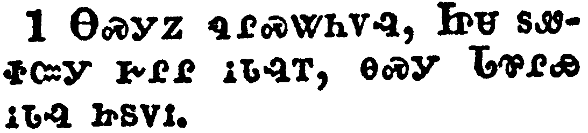</a></td>
</tr>
<tr class="even">
<td>After these things Jesus went over the sea of Galilee, which is the sea of Tiberias.</td>
</tr>
<tr class="odd">
<td>ᎾᏍᎩᏃ ᏄᎵᏍᏔᏂᏙᎸ, ᏥᏌ ᏚᏪᏐᏨᎩ ᎨᎵᎵ ᎥᏓᎸᎢ, ᎾᏍᎩ ᏓᏈᎵᏯ ᎥᏓᎸ ᏥᏚᏙᎥ.</td>
</tr>
<tr class="even">
<td>Na-s-gi-no nu-li-s-ta-ni-do-lv, Tsi-sa du-we-so-tsv-gi ge-li-li v-da-lv-i, na-s-gi Da-qui-li-ya v-da-lv tsi-du-do-v.</td>
</tr>
</tbody>
</table>

<table>
<tbody>
<tr class="odd">
<td><a href="040602.png">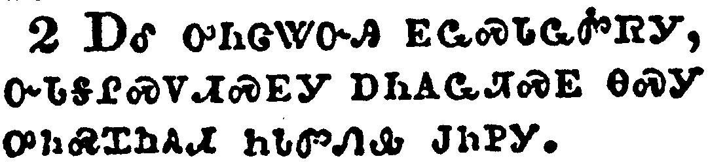</a></td>
</tr>
<tr class="even">
<td>And a great multitude followed him, because they saw his miracles which he did on them that were diseased.</td>
</tr>
<tr class="odd">
<td>ᎠᎴ ᎤᏂᏣᏔᏅᎯ ᎬᏩᏍᏓᏩᏛᏒᎩ, ᏅᏓᎦᎵᏍᏙᏗᏍᎬᎩ ᎠᏂᎪᏩᏘᏍᎬ ᎾᏍᎩ ᎤᏂᏍᏆᏂᎪᏗ ᏂᏓᏛᏁᎲ ᎫᏂᏢᎩ.</td>
</tr>
<tr class="even">
<td>A-le u-ni-tsa-ta-nv-hi gv-wa-s-da-wa-dv-sv-gi, nv-da-ga-li-s-do-di-s-gv-gi a-ni-go-wa-ti-s-gv na-s-gi u-ni-s-qua-ni-go-di ni-da-dv-ne-hv gu-ni-tlv-gi.</td>
</tr>
</tbody>
</table>

<table>
<tbody>
<tr class="odd">
<td><a href="040603.png">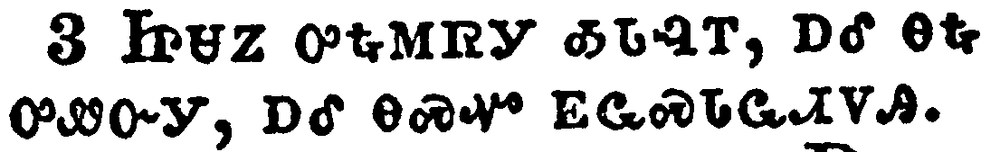</a></td>
</tr>
<tr class="even">
<td>And Jesus went up into a mountain, and there he sat with his disciples.</td>
</tr>
<tr class="odd">
<td>ᏥᏌᏃ ᎤᎿᎭᎷᏒᎩ ᎣᏓᎸᎢ, ᎠᎴ ᎾᎿᎭᎤᏪᏅᎩ, ᎠᎴ ᎾᏍᏉ ᎬᏩᏍᏓᏩᏗᏙᎯ.</td>
</tr>
<tr class="even">
<td>Tsi-sa-no u-hna-lu-sv-gi o-da-lv-i, a-le na-hna u-we-nv-gi, a-le na-s-quo gv-wa-s-da-wa-di-do-hi.</td>
</tr>
</tbody>
</table>

<table>
<tbody>
<tr class="odd">
<td><a href="040604.png">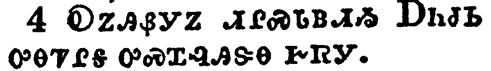</a></td>
</tr>
<tr class="even">
<td>And the passover, a feast of the Jews, was nigh.</td>
</tr>
<tr class="odd">
<td>ᎧᏃᎯᏰᎩᏃ ᏗᎵᏍᏓᏴᏗᏱ ᎠᏂᏧᏏ ᎤᎾᏤᎵᎦ ᎤᏍᏆᎸᎯᏕᎾ ᎨᏒᎩ.</td>
</tr>
<tr class="even">
<td>Ka-no-hi-ye-gi-no di-li-s-da-yv-di-yi A-ni-tsu-si u-na-tse-li-ga u-s-qua-lv-hi-de-na ge-sv-gi.</td>
</tr>
</tbody>
</table>

<table>
<tbody>
<tr class="odd">
<td><a href="040605.png">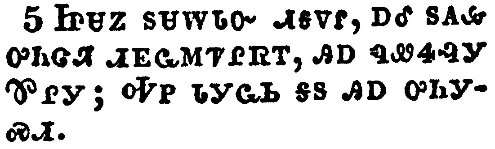</a></td>
</tr>
<tr class="even">
<td>When Jesus then lifted up his eyes, and saw a great company come unto him, he saith unto Philip, Whence shall we buy bread, that these may eat?</td>
</tr>
<tr class="odd">
<td>ᏥᏌᏃ ᏚᏌᎳᏓᏅ ᏗᎦᏙᎵ, ᎠᎴ ᏚᎪᎲ ᎤᏂᏣᏘ ᏗᎬᏩᎷᏤᎵᏒᎢ, ᎯᎠ ᏄᏪᏎᎸᎩ ᏈᎵᎩ; ᎭᏢ ᏓᎩᏩᏏ ᎦᏚ ᎯᎠ ᎤᏂᎩᏍᏗ.</td>
</tr>
<tr class="even">
<td>Tsi-sa-no du-sa-la-da-nv di-ga-do-li, a-le du-go-hv u-ni-tsa-ti di-gv-wa-lu-tse-li-sv-i, hi-a nu-we-se-lv-gi Qui-li-gi; Ha-tlv da-gi-wa-si ga-du hi-a u-ni-gi-s-di.</td>
</tr>
</tbody>
</table>

<table>
<tbody>
<tr class="odd">
<td><a href="040606.png">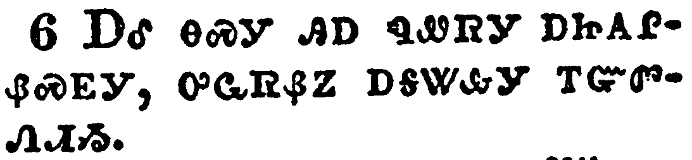</a></td>
</tr>
<tr class="even">
<td>And this he said to prove him: for he himself knew what he would do.</td>
</tr>
<tr class="odd">
<td>ᎠᎴ ᎾᏍᎩ ᎯᎠ ᏄᏪᏒᎩ ᎠᏥᎪᎵᏰᏍᎬᎩ, ᎤᏩᏒᏰᏃ ᎠᎦᏔᎲᎩ ᎢᏳᏛᏁᏗᏱ.</td>
</tr>
<tr class="even">
<td>A-le na-s-gi hi-a nu-we-sv-gi a-tsi-go-li-ye-s-gv-gi, u-wa-sv-ye-no a-ga-ta-hv-gi i-yu-dv-ne-di-yi.</td>
</tr>
</tbody>
</table>

<table>
<tbody>
<tr class="odd">
<td><a href="040607.png">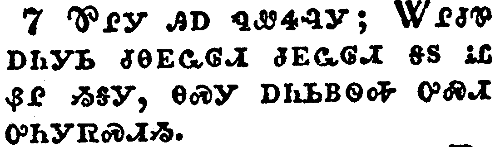</a></td>
</tr>
<tr class="even">
<td>Philip answered him, Two hundred pennyworth of bread is not sufficient for them, that every one of them may take a little.</td>
</tr>
<tr class="odd">
<td>ᏈᎵᎩ ᎯᎠ ᏄᏪᏎᎸᎩ; ᏔᎵᏧᏈ ᎠᏂᎩᏏ ᏧᎾᎬᏩᎶᏗ ᏧᎬᏩᎶᏗ ᎦᏚ ᎥᏝ ᏰᎵ ᏱᎦᎩ, ᎾᏍᎩ ᎠᏂᏏᏴᏫᎭ ᎤᏍᏗ ᎤᏂᎩᏒᏍᏗᏱ.</td>
</tr>
<tr class="even">
<td>Qui-li-gi hi-a nu-we-se-lv-gi; Ta-li-tsu-qui a-ni-gi-si tsu-na-gv-wa-lo-di tsu-gv-wa-lo-di ga-du v-tla ye-li yi-ga-gi, na-s-gi a-ni-si-yv-wi-ha u-s-di u-ni-gi-sv-s-di-yi.</td>
</tr>
</tbody>
</table>

<table>
<tbody>
<tr class="odd">
<td><a href="040608.png">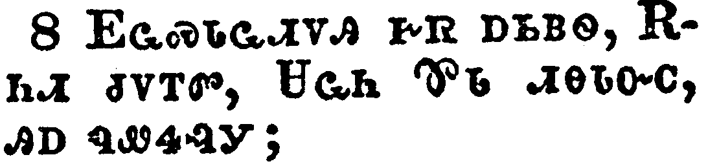</a></td>
</tr>
<tr class="even">
<td>One of his disciples, Andrew, Simon Peter's brother, saith unto him,</td>
</tr>
<tr class="odd">
<td>ᎬᏩᏍᏓᏩᏗᏙᎯ ᎨᏒ ᎠᏏᏴᏫ, ᎡᏂᏗ ᏧᏙᎢᏛ, ᏌᏩᏂ ᏈᏓ ᏗᎾᏓᏅᏟ, ᎯᎠ ᏄᏪᏎᎸᎩ;</td>
</tr>
<tr class="even">
<td>Gv-wa-s-da-wa-di-do-hi ge-sv a-si-yv-wi, E-ni-di tsu-do-i-dv, Sa-wa-ni Qui-da di-na-da-nv-tli, hi-a nu-we-se-lv-gi;</td>
</tr>
</tbody>
</table>

<table>
<tbody>
<tr class="odd">
<td><a href="040609.png">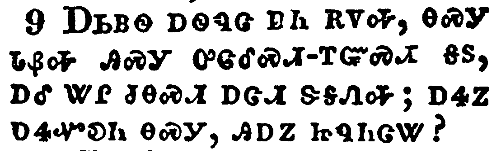</a></td>
</tr>
<tr class="even">
<td>There is a lad here, which hath five barley loaves, and two small fishes: but what are they among so many?</td>
</tr>
<tr class="odd">
<td>ᎠᏏᏴᏫ ᎠᏫᏄᏣ ᎠᏂ ᎡᏙᎭ, ᎾᏍᎩ ᏓᏰᎭ ᎯᏍᎩ ᎤᏣᎴᏍᏗ-ᎢᏳᏍᏗ ᎦᏚ, ᎠᎴ ᏔᎵ ᏧᎾᏍᏗ ᎠᏣᏗ ᏕᎦᏁᎭ; ᎠᏎᏃ ᎠᏎᏉᎧᏂ ᎾᏍᎩ, ᎯᎠᏃ ᏥᏄᏂᏣᏔ?</td>
</tr>
<tr class="even">
<td>A-si-yv-wi a-wi-nu-tsa a-ni e-do-ha, na-s-gi da-ye-ha hi-s-gi u-tsa-le-s-di--i-yu-s-di ga-du, a-le ta-li tsu-na-s-di a-tsa-di de-ga-ne-ha; a-se-no a-se-quo-ka-ni na-s-gi, hi-a-no tsi-nu-ni-tsa-ta?</td>
</tr>
</tbody>
</table>

<table>
<tbody>
<tr class="odd">
<td><a href="040610.png">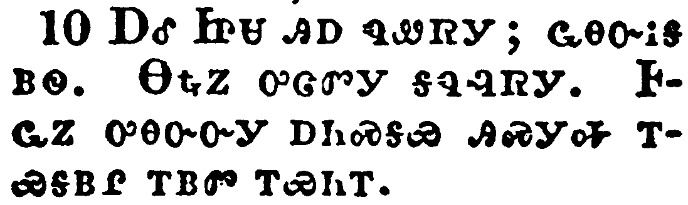</a></td>
</tr>
<tr class="even">
<td>And Jesus said, Make the men sit down. Now there was much grass in the place. So the men sat down, in number about five thousand.</td>
</tr>
<tr class="odd">
<td>ᎠᎴ ᏥᏌ ᎯᎠ ᏄᏪᏒᎩ; ᏩᎾᏅᎥᎦ ᏴᏫ. ᎾᎿᎭᏃ ᎤᏣᏛᎩ ᎦᏄᎸᏒᎩ. ᎰᏩᏃ ᎤᎾᏅᏅᎩ ᎠᏂᏍᎦᏯ ᎯᏍᎩᎭ ᎢᏯᎦᏴᎵ ᎢᏴᏛ ᎢᏯᏂᎢ.</td>
</tr>
<tr class="even">
<td>A-le Tsi-sa hi-a nu-we-sv-gi; wa-na-nv-v-ga yv-wi. Na-hna-no u-tsa-dv-gi ga-nu-lv-sv-gi. Ho-wa-no u-na-nv-nv-gi a-ni-s-ga-ya hi-s-gi-ha i-ya-ga-yv-li i-yv-dv i-ya-ni-i.</td>
</tr>
</tbody>
</table>

<table>
<tbody>
<tr class="odd">
<td><a href="040611.png">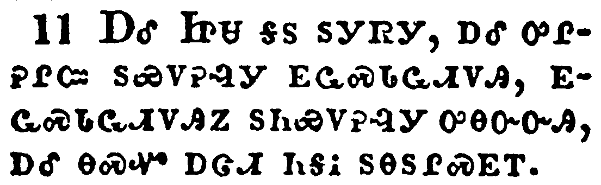</a></td>
</tr>
<tr class="even">
<td>And Jesus took the loaves; and when he had given thanks, he distributed to the disciples, and the disciples to them that were set down; and likewise of the fishes as much as they would.</td>
</tr>
<tr class="odd">
<td>ᎠᎴ ᏥᏌ ᎦᏚ ᏚᎩᏒᎩ, ᎠᎴ ᎤᎵᎮᎵᏨ ᏚᏯᏙᎮᎸᎩ ᎬᏩᏍᏓᏩᏗᏙᎯ, ᎬᏩᏍᏓᏩᏗᏙᎯᏃ ᏚᏂᏯᏙᎮᎸᎩ ᎤᎾᏅᏅᎯ, ᎠᎴ ᎾᏍᏉ ᎠᏣᏗ ᏂᎦᎥ ᏚᎾᏚᎵᏍᎬᎢ.</td>
</tr>
<tr class="even">
<td>A-le Tsi-sa ga-du du-gi-sv-gi, a-le u-li-he-li-tsv du-ya-do-he-lv-gi gv-wa-s-da-wa-di-do-hi, gv-wa-s-da-wa-di-do-hi-no du-ni-ya-do-he-lv-gi u-na-nv-nv-hi, a-le na-s-quo a-tsa-di ni-ga-v du-na-du-li-s-gv-i.</td>
</tr>
</tbody>
</table>

<table>
<tbody>
<tr class="odd">
<td><a href="040612.png">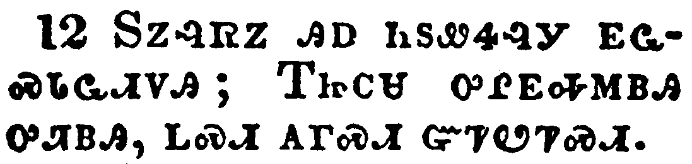</a></td>
</tr>
<tr class="even">
<td>When they were filled, he said unto his disciples, Gather up the fragments that remain, that nothing be lost.</td>
</tr>
<tr class="odd">
<td>ᏚᏃᎸᏒᏃ ᎯᎠ ᏂᏚᏪᏎᎸᎩ ᎬᏩᏍᏓᏩᏗᏙᎯ; ᎢᏥᏟᏌ ᎤᎵᎬᎭᎷᏴᎯ ᎤᏘᏴᎯ, ᏞᏍᏗ ᎪᎱᏍᏗ ᏳᏤᏬᏤᏍᏗ.</td>
</tr>
<tr class="even">
<td>Du-no-lv-sv-no hi-a ni-du-we-se-lv-gi gv-wa-s-da-wa-di-do-hi; I-tsi-tli-sa u-li-gv-ha-lu-yv-hi u-ti-yv-hi, tle-s-di go-hu-s-di yu-tse-wo-tse-s-di.</td>
</tr>
</tbody>
</table>

<table>
<tbody>
<tr class="odd">
<td><a href="040613.png">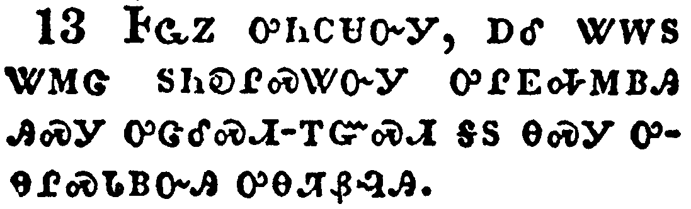</a></td>
</tr>
<tr class="even">
<td>Therefore they gathered them together, and filled twelve baskets with the fragments of the five barley loaves, which remained over and above unto them that had eaten.</td>
</tr>
<tr class="odd">
<td>ᎰᏩᏃ ᎤᏂᏟᏌᏅᎩ, ᎠᎴ ᏔᎳᏚ ᏔᎷᏣ ᏚᏂᎧᎵᏍᏔᏅᎩ ᎤᎵᎬᎭᎷᏴᎯ ᎯᏍᎩ ᎤᏣᎴᏍᏗ-ᎢᏳᏍᏗ ᎦᏚ ᎾᏍᎩ ᎤᎾᎵᏍᏓᏴᏅᎯ ᎤᎾᏘᏰᎸᎯ.</td>
</tr>
<tr class="even">
<td>Ho-wa-no u-ni-tli-sa-nv-gi, a-le ta-la-du ta-lu-tsa du-ni-ka-li-s-ta-nv-gi u-li-gv-ha-lu-yv-hi hi-s-gi u-tsa-le-s-di--i-yu-s-di ga-du na-s-gi u-na-li-s-da-yv-nv-hi u-na-ti-ye-lv-hi.</td>
</tr>
</tbody>
</table>

<table>
<tbody>
<tr class="odd">
<td><a href="040614.png">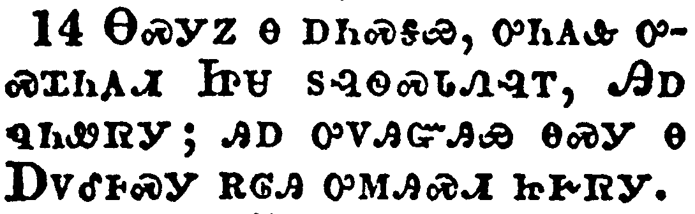</a></td>
</tr>
<tr class="even">
<td>Then those men, when they had seen the miracle that Jesus did, said, This is of a truth that prophet that should come into the world.</td>
</tr>
<tr class="odd">
<td>ᎾᏍᎩᏃ Ꮎ ᎠᏂᏍᎦᏯ, ᎤᏂᎪᎲ ᎤᏍᏆᏂᎪᏗ ᏥᏌ ᏚᎸᏫᏍᏓᏁᎸᎢ, ᎯᎠ ᏄᏂᏪᏒᎩ; ᎯᎠ ᎤᏙᎯᏳᎯᏯ ᎾᏍᎩ Ꮎ ᎠᏙᎴᎰᏍᎩ ᎡᎶᎯ ᎤᎷᎯᏍᏗ ᏥᎨᏒᎩ.</td>
</tr>
<tr class="even">
<td>Na-s-gi-no na a-ni-s-ga-ya, u-ni-go-hv u-s-qua-ni-go-di Tsi-sa du-lv-wi-s-da-ne-lv-i, Hi-a nu-ni-we-sv-gi; hi-a u-do-hi-yu-hi-ya na-s-gi na A-do-le-ho-s-gi e-lo-hi u-lu-hi-s-di tsi-ge-sv-gi.</td>
</tr>
</tbody>
</table>

<table>
<tbody>
<tr class="odd">
<td><a href="040615.png">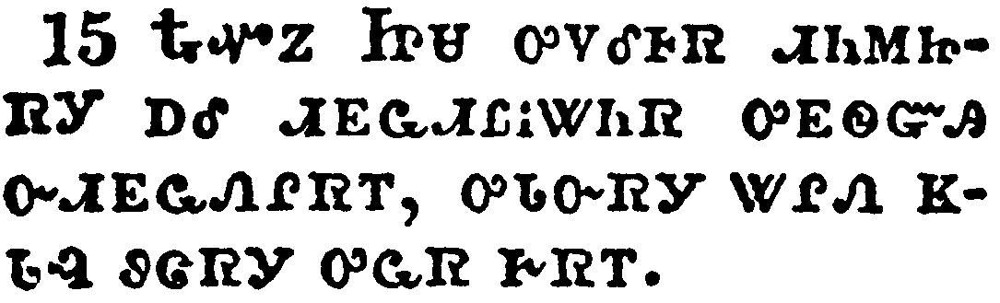</a></td>
</tr>
<tr class="even">
<td>When Jesus therefore perceived that they would come and take him by force, to make him a king, he departed again into a mountain himself alone.</td>
</tr>
<tr class="odd">
<td>ᎿᎭᏉᏃ ᏥᏌ ᎤᏙᎴᎰᏒ ᏗᏂᎷᏥᏒᎩ ᎠᎴ ᏗᎬᏩᏗᏝᎥᏔᏂᏒ ᎤᎬᏫᏳᎯ ᏅᏗᎬᏩᏁᎵᏒᎢ, ᎤᏓᏅᏒᎩ ᏔᎵᏁ ᏦᏓᎸ ᏭᏣᏒᎩ ᎤᏩᏒ ᎨᏒᎢ.</td>
</tr>
<tr class="even">
<td>Hna-quo-no Tsi-sa u-do-le-ho-sv di-ni-lu-tsi-sv-gi a-le di-gv-wa-di-tla-v-ta-ni-sv u-gv-wi-yu-hi nv-di-gv-wa-ne-li-sv-i, u-da-nv-sv-gi ta-li-ne tso-da-lv wu-tsa-sv-gi u-wa-sv ge-sv-i.</td>
</tr>
</tbody>
</table>

<table>
<tbody>
<tr class="odd">
<td><a href="040616.png">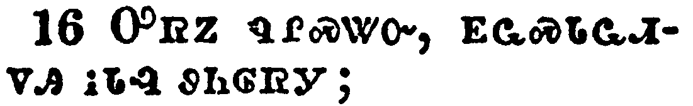</a></td>
</tr>
<tr class="even">
<td>And when even was now come, his disciples went down unto the sea,</td>
</tr>
<tr class="odd">
<td>ᎤᏒᏃ ᏄᎵᏍᏔᏅ, ᎬᏩᏍᏓᏩᏗᏙᎯ ᎥᏓᎸ ᏭᏂᎶᏒᎩ;</td>
</tr>
<tr class="even">
<td>U-sv-no nu-li-s-ta-nv, gv-wa-s-da-wa-di-do-hi v-da-lv wu-ni-lo-sv-gi;</td>
</tr>
</tbody>
</table>

<table>
<tbody>
<tr class="odd">
<td><a href="040617.png">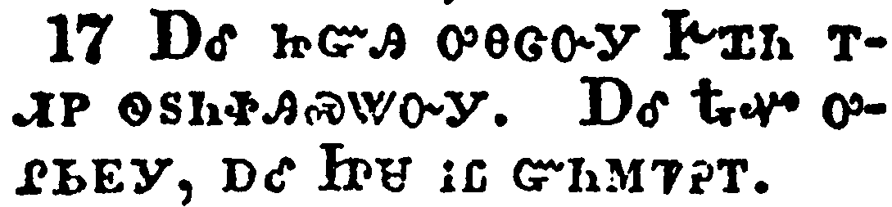</a></td>
</tr>
<tr class="even">
<td>And entered into a ship, and went over the sea toward Capernaum. And it was now dark, and Jesus was not come to them.</td>
</tr>
<tr class="odd">
<td>ᎠᎴ ᏥᏳᎯ ᎤᎾᏣᏅᎩ ᎨᏆᏂ ᎢᏗᏢ ᏫᏚᏂᏐᎯᏍᏔᏅᎩ. ᎠᎴ ᎿᎭᏉ ᎤᎵᏏᎬᎩ, ᎠᎴ ᏥᏌ ᎥᏝ ᏳᏂᎷᏤᎮᎢ.</td>
</tr>
<tr class="even">
<td>A-le tsi-yu-hi u-na-tsa-nv-gi Ge-qua-ni i-di-tlv wi-du-ni-so-hi-s-ta-nv-gi. A-le Hna-quo u-li-si-gv-gi, a-le Tsi-sa v-tla yu-ni-lu-tse-he-i.</td>
</tr>
</tbody>
</table>

<table>
<tbody>
<tr class="odd">
<td><a href="040618.png">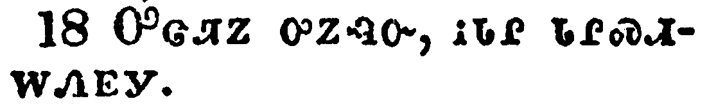</a></td>
</tr>
<tr class="even">
<td>And the sea arose by reason of a great wind that blew.</td>
</tr>
<tr class="odd">
<td>ᎤᏣᏘᏃ ᎤᏃᎸᏅ, ᎥᏓᎵ ᏓᎵᏍᏗᎳᏁᎬᎩ.</td>
</tr>
<tr class="even">
<td>U-tsa-ti-no u-no-lv-nv, v-da-li da-li-s-di-la-ne-gv-gi.</td>
</tr>
</tbody>
</table>

<table>
<tbody>
<tr class="odd">
<td><a href="040619.png">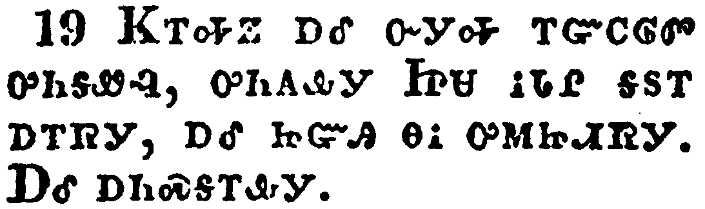</a></td>
</tr>
<tr class="even">
<td>So when they had rowed about five and twenty or thirty furlongs, they see Jesus walking on the sea, and drawing nigh unto the ship: and they were afraid.</td>
</tr>
<tr class="odd">
<td>ᏦᎢᎭᏃ ᎠᎴ ᏅᎩᎭ ᎢᏳᏟᎶᏛ ᎤᏂᎦᏪᎸ, ᎤᏂᎪᎲᎩ ᏥᏌ ᎥᏓᎵ ᎦᏚᎢ ᎠᎢᏒᎩ, ᎠᎴ ᏥᏳᎯ ᎾᎥ ᎤᎷᏥᏗᏒᎩ. ᎠᎴ ᎠᏂᏍᎦᎢᎲᎩ.</td>
</tr>
<tr class="even">
<td>Tso-i-ha-no a-le nv-gi-ha i-yu-tli-lo-dv u-ni-ga-we-lv, u-ni-go-hv-gi Tsi-sa v-da-li ga-du-i a-i-sv-gi, a-le tsi-yu-hi na-v u-lu-tsi-di-sv-gi. A-le a-ni-s-ga-i-hv-gi.</td>
</tr>
</tbody>
</table>

<table>
<tbody>
<tr class="odd">
<td><a href="040620.png">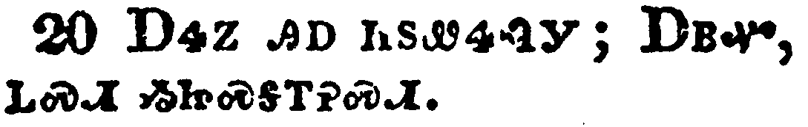</a></td>
</tr>
<tr class="even">
<td>But he saith unto them, It is I; be not afraid.</td>
</tr>
<tr class="odd">
<td>ᎠᏎᏃ ᎯᎠ ᏂᏚᏪᏎᎸᎩ; ᎠᏴᏉ, ᏞᏍᏗ ᏱᏥᏍᎦᎢᎮᏍᏗ.</td>
</tr>
<tr class="even">
<td>A-se-no hi-a ni-du-we-se-lv-gi; A-yv-quo, tle-s-di yi-tsi-s-ga-i-he-s-di.</td>
</tr>
</tbody>
</table>

<table>
<tbody>
<tr class="odd">
<td></td>
</tr>
<tr class="even">
<td>Then they willingly received him into the ship: and immediately the ship was at the land whither they went.</td>
</tr>
<tr class="odd">
<td>ᎿᎭᏉᏃ ᏥᏳᎯ ᏕᎬᏩᏓᏂᎸᏨᎩ; ᎩᎳᏉᏃ ᎢᏴᏛ ᏥᏳ ᏭᏔᎳᏗᏨᎩ ᎾᎿᎭᎤᎾᏅᏔᏩᏗᏒᎢ.</td>
</tr>
<tr class="even">
<td>Hna-quo-no tsi-yu-hi de-gv-wa-da-ni-lv-tsv-gi; gi-la-quo-no i-yv-dv tsi-yu wu-ta-la-di-tsv-gi na-hna u-na-nv-ta-wa-di-sv-i.</td>
</tr>
</tbody>
</table>

<table>
<tbody>
<tr class="odd">
<td><a href="040622.png">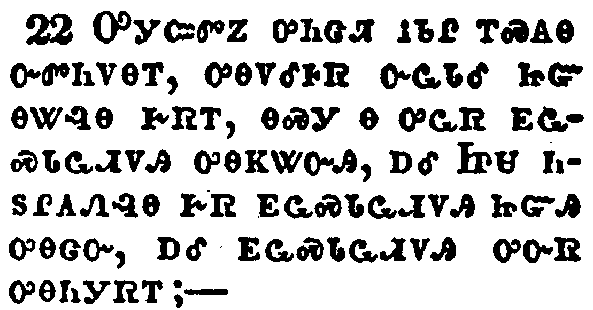</a></td>
</tr>
<tr class="even">
<td>The day following, when the people which stood on the other side of the sea saw that there was none other boat there, save that one whereinto his disciples were entered, and that Jesus went not with his disciples into the boat, but that his disciples were gone away alone;</td>
</tr>
<tr class="odd">
<td>ᎤᎩᏨᏛᏃ ᎤᏂᏣᏘ ᎥᏓᎵ ᎢᏍᎪᎾ ᏅᏛᏂᏙᎾᎢ, ᎤᎾᏙᎴᎰᏒ ᏅᏩᏓᎵ ᏥᏳ ᎾᏔᎸᎾ ᎨᏒᎢ, ᎾᏍᎩ Ꮎ ᎤᏩᏒ ᎬᏩᏍᏓᏩᏗᏙᎯ ᎤᎾᏦᏔᏅᎯ, ᎠᎴ ᏥᏌ ᏂᏚᎵᎪᏁᎸᎾ ᎨᏒ ᎬᏩᏍᏓᏩᏗᏙᎯ ᏥᏳᎯ ᎤᎾᏣᏅ, ᎠᎴ ᎬᏩᏍᏓᏩᏗᏙᎯ ᎤᏅᏒ ᎤᎾᏂᎩᏒᎢ;^</td>
</tr>
<tr class="even">
<td>U-gi-tsv-dv-no u-ni-tsa-ti v-da-li i-s-go-na nv-dv-ni-do-na-i, u-na-do-le-ho-sv nv-wa-da-li tsi-yu na-ta-lv-na ge-sv-i, na-s-gi na u-wa-sv gv-wa-s-da-wa-di-do-hi u-na-tso-ta-nv-hi, a-le Tsi-sa ni-du-li-go-ne-lv-na ge-sv gv-wa-s-da-wa-di-do-hi tsi-yu-hi u-na-tsa-nv, a-le gv-wa-s-da-wa-di-do-hi u-nv-sv u-na-ni-gi-sv-i;^</td>
</tr>
</tbody>
</table>

<table>
<tbody>
<tr class="odd">
<td><a href="040623.png">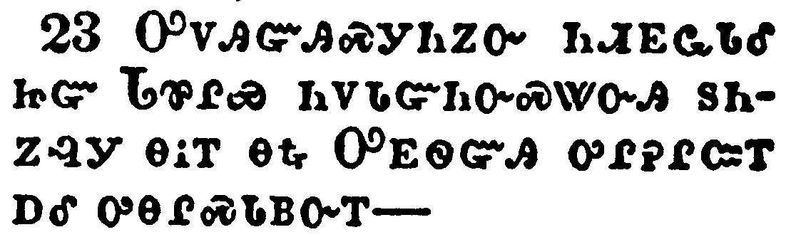</a></td>
</tr>
<tr class="even">
<td>(Howbeit there came other boats from Tiberias nigh unto the place where they did eat bread, after that the Lord had given thanks:)</td>
</tr>
<tr class="odd">
<td>ᎤᏙᎯᏳᎯᏍᎩᏂᏃᏅ ᏂᏗᎬᏩᏓᎴ ᏥᏳ ᏓᏈᎵᏯ ᏂᏙᏓᏳᏂᏅᏍᏔᏅᎯ ᏚᏂᏃᎸᎩ ᎾᎥᎢ ᎾᎿᎭᎤᎬᏫᏳᎯ ᎤᎵᎮᎵᏨᎢ ᎠᎴ ᎤᎾᎵᏍᏓᏴᏅᎢ^</td>
</tr>
<tr class="even">
<td>U-do-hi-yu-hi-s-gi-ni-no-nv ni-di-gv-wa-da-le tsi-yu Da-qui-li-ya ni-do-da-yu-ni-nv-s-ta-nv-hi du-ni-no-lv-gi na-v-i na-hna U-gv-wi-yu-hi u-li-he-li-tsv-i a-le u-na-li-s-da-yv-nv-i^</td>
</tr>
</tbody>
</table>

<table>
<tbody>
<tr class="odd">
<td><a href="040624.png">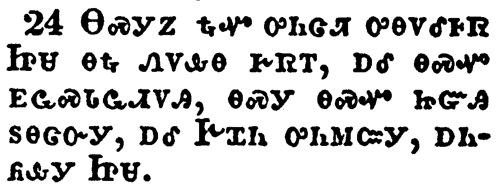</a></td>
</tr>
<tr class="even">
<td>When the people therefore saw that Jesus was not there, neither his disciples, they also took shipping, and came to Capernaum, seeking for Jesus.</td>
</tr>
<tr class="odd">
<td>ᎾᏍᎩᏃ ᎿᎭᏉ ᎤᏂᏣᏘ ᎤᎾᏙᎴᎰᏒ ᏥᏌ ᎾᎿᎭᏁᏙᎲᎾ ᎨᏒᎢ, ᎠᎴ ᎾᏍᏉ ᎬᏩᏍᏓᏩᏗᎰᎯ, ᎾᏍᎩ ᎾᏍᏉ ᏥᏳᎯ ᏚᎾᏣᏅᎩ, ᎠᎴ ᎨᏆᏂ ᎤᏂᎷᏨᎩ, ᎠᏂᏲᎲᎩ ᏥᏌ.</td>
</tr>
<tr class="even">
<td>Na-s-gi-no hna-quo u-ni-tsa-ti u-na-do-le-ho-sv Tsi-sa na-hna ne-do-hv-na ge-sv-i, a-le na-s-quo gv-wa-s-da-wa-di-ho-hi, na-s-gi na-s-quo tsi-yu-hi du-na-tsa-nv-gi, a-le Ge-qua-ni u-ni-lu-tsv-gi, a-ni-yo-hv-gi Tsi-sa.</td>
</tr>
</tbody>
</table>

<table>
<tbody>
<tr class="odd">
<td><a href="040625.png">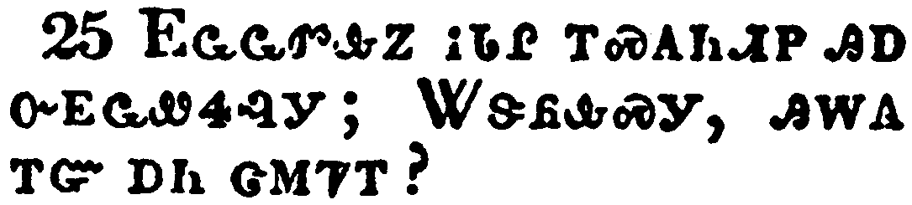</a></td>
</tr>
<tr class="even">
<td>And when they had found him on the other side of the sea, they said unto him, Rabbi, when camest thou hither?</td>
</tr>
<tr class="odd">
<td>ᎬᏩᏩᏛᎲᏃ ᎥᏓᎵ ᎢᏍᎪᏂᏗᏢ ᎯᎠ ᏅᎬᏩᏪᏎᎸᎩ; ᏔᏕᏲᎲᏍᎩ, ᎯᎳᎪ ᎢᏳ ᎠᏂ ᏣᎷᏤᎢ?</td>
</tr>
<tr class="even">
<td>Gv-wa-wa-dv-hv-no v-da-li i-s-go-ni-di-tlv hi-a nv-gv-wa-we-se-lv-gi; Ta-de-yo-hv-s-gi, hi-la-go i-yu a-ni tsa-lu-tse-i?</td>
</tr>
</tbody>
</table>

<table>
<tbody>
<tr class="odd">
<td><a href="040626.png">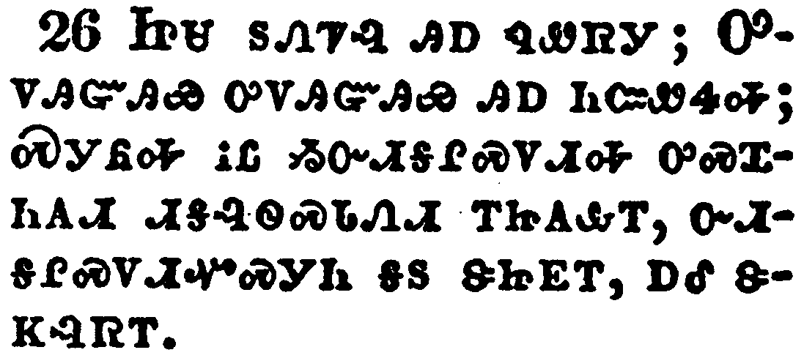</a></td>
</tr>
<tr class="even">
<td>Jesus answered them and said, Verily, verily, I say unto you, Ye seek me, not because ye saw the miracles, but because ye did eat of the loaves, and were filled.</td>
</tr>
<tr class="odd">
<td>ᏥᏌ ᏚᏁᏤᎸ ᎯᎠ ᏄᏪᏒᎩ; ᎤᏙᎯᏳᎯᏯ ᎤᏙᎯᏳᎯᏯ ᎯᎠ ᏂᏨᏪᏎᎭ; ᏍᎩᏲᎭ ᎥᏝ ᏱᏅᏗᎦᎵᏍᏙᏗᎭ ᎤᏍᏆᏂᎪᏗ ᏗᎦᎸᏫᏍᏓᏁᏗ ᎢᏥᎪᎲᎢ, ᏅᏗᎦᎵᏍᏙᏗᏉᏍᎩᏂ ᎦᏚ ᏕᏥᎬᎢ, ᎠᎴ ᏕᏦᎸᏒᎢ.</td>
</tr>
<tr class="even">
<td>Tsi-sa du-ne-tse-lv hi-a nu-we-sv-gi; U-do-hi-yu-hi-ya u-do-hi-yu-hi-ya hi-a ni-tsv-we-se-ha; S-gi-yo-ha v-tla yi-nv-di-ga-li-s-do-di-ha u-s-qua-ni-go-di di-ga-lv-wi-s-da-ne-di i-tsi-go-hv-i, nv-di-ga-li-s-do-di-quo-s-gi-ni ga-du de-tsi-gv-i, a-le de-tso-lv-sv-i.</td>
</tr>
</tbody>
</table>

<table>
<tbody>
<tr class="odd">
<td><a href="040627.png">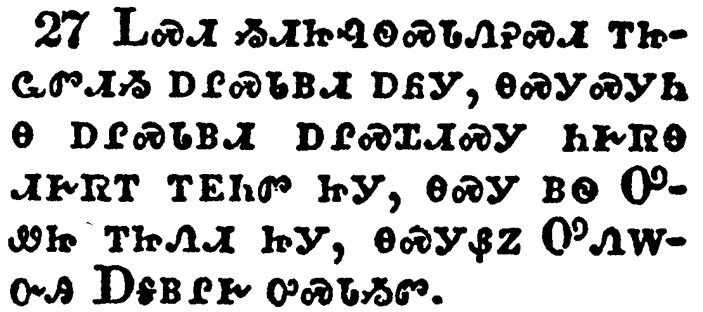</a></td>
</tr>
<tr class="even">
<td>Labour not for the meat which perisheth, but for that meat which endureth unto everlasting life, which the Son of man shall give unto you: for him hath God the Father sealed.</td>
</tr>
<tr class="odd">
<td>ᏞᏍᏗ ᏱᏗᏥᎸᏫᏍᏓᏁᎮᏍᏗ ᎢᏥᏩᏛᏗᏱ ᎠᎵᏍᏓᏴᏗ ᎠᏲᎵ, ᎾᏍᎩᏍᎩᏂ Ꮎ ᎠᎵᏍᏓᏴᏗ ᎠᎵᏍᏆᏗᏍᎩ ᏂᎨᏒᎾ ᏗᎨᏒᎢ ᎢᎬᏂᏛ ᏥᎩ, ᎾᏍᎩ ᏴᏫ ᎤᏪᏥ ᎢᏥᏁᏗ ᏥᎩ, ᎾᏍᎩᏰᏃ ᎤᏁᎳᏅᎯ ᎠᎦᏴᎵᎨ ᎤᏍᏓᏱᏛ.</td>
</tr>
<tr class="even">
<td>Tle-s-di yi-di-tsi-lv-wi-s-da-ne-he-s-di i-tsi-wa-dv-di-yi a-li-s-da-yv-di a-yo-li, na-s-gi-s-gi-ni na a-li-s-da-yv-di a-li-s-qua-di-s-gi ni-ge-sv-na di-ge-sv-i i-gv-ni-dv tsi-gi, na-s-gi yv-wi U-we-tsi i-tsi-ne-di tsi-gi, na-s-gi-ye-no U-ne-la-nv-hi A-ga-yv-li-ge u-s-da-yi-dv.</td>
</tr>
</tbody>
</table>

<table>
<tbody>
<tr class="odd">
<td><a href="040628.png">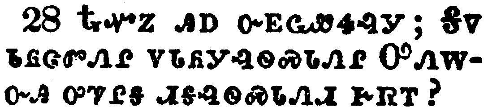</a></td>
</tr>
<tr class="even">
<td>Then said they unto him, What shall we do, that we might work the works of God?</td>
</tr>
<tr class="odd">
<td>ᎿᎭᏉᏃ ᎯᎠ ᏅᎬᏩᏪᏎᎸᎩ; ᎦᏙ ᏓᏲᏣᏛᏁᎵ ᏙᏓᏲᎩᎸᏫᏍᏓᏁᎵ ᎤᏁᎳᏅᎯ ᎤᏤᎵᎦ ᏗᎦᎸᏫᏍᏓᏁᏗ ᎨᏒᎢ?</td>
</tr>
<tr class="even">
<td>Hna-quo-no hi-a nv-gv-wa-we-se-lv-gi; Ga-do da-yo-tsa-dv-ne-li do-da-yo-gi-lv-wi-s-da-ne-li U-ne-la-nv-hi u-tse-li-ga di-ga-lv-wi-s-da-ne-di ge-sv-i?</td>
</tr>
</tbody>
</table>

<table>
<tbody>
<tr class="odd">
<td><a href="040629.png">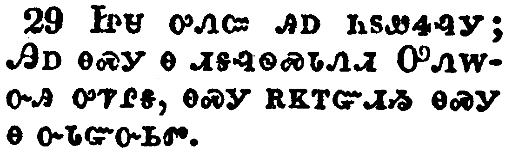</a></td>
</tr>
<tr class="even">
<td>Jesus answered and said unto them, This is the work of God, that ye believe on him whom he hath sent.</td>
</tr>
<tr class="odd">
<td>ᏥᏌ ᎤᏁᏨ ᎯᎠ ᏂᏚᏪᏎᎸᎩ; ᎯᎠ ᎾᏍᎩ Ꮎ ᏗᎦᎸᏫᏍᏓᏁᏗ ᎤᏁᎳᏅᎯ ᎤᏤᎵᎦ, ᎾᏍᎩ ᎡᏦᎢᏳᏗᏱ ᎾᏍᎩ Ꮎ ᏅᏓᏳᏅᏏᏛ.</td>
</tr>
<tr class="even">
<td>Tsi-sa u-ne-tsv hi-a ni-du-we-se-lv-gi; Hi-a na-s-gi na di-ga-lv-wi-s-da-ne-di U-ne-la-nv-hi u-tse-li-ga, na-s-gi e-tso-i-yu-di-yi na-s-gi na nv-da-yu-nv-si-dv.</td>
</tr>
</tbody>
</table>

<table>
<tbody>
<tr class="odd">
<td><a href="040630.png">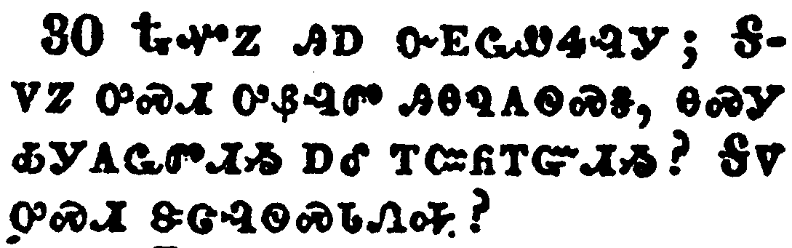</a></td>
</tr>
<tr class="even">
<td>They said therefore unto him, What sign shewest thou then, that we may see, and believe thee? what dost thou work?</td>
</tr>
<tr class="odd">
<td>ᎿᎭᏉᏃ ᎯᎠ ᏅᎬᏩᏪᏎᎸᎩ; ᎦᏙᏃ ᎤᏍᏗ ᎤᏰᎸᏛ ᎯᎾᏄᎪᏫᏍᎦ, ᎾᏍᎩ ᎣᎩᎪᏩᏛᏗᏱ ᎠᎴ ᎢᏨᏲᎢᏳᏗᏱ? ᎦᏙ ᎤᏍᏗ ᏕᏣᎸᏫᏍᏓᏁᎭ?</td>
</tr>
<tr class="even">
<td>Hna-quo-no hi-a nv-gv-wa-we-se-lv-gi; Ga-do-no u-s-di u-ye-lv-dv hi-na-nu-go-wi-s-ga, na-s-gi o-gi-go-wa-dv-di-yi a-le i-tsv-yo-i-yu-di-yi? Ga-do u-s-di de-tsa-lv-wi-s-da-ne-ha?</td>
</tr>
</tbody>
</table>

<table>
<tbody>
<tr class="odd">
<td><a href="040631.png">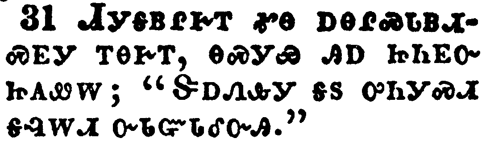</a></td>
</tr>
<tr class="even">
<td>Our fathers did eat manna in the desert; as it is written, He gave them bread from heaven to eat.</td>
</tr>
<tr class="odd">
<td>ᏗᎩᎦᏴᎵᎨᎢ ᎹᎾ ᎠᎾᎵᏍᏓᏴᏗᏍᎬᎩ ᎢᎾᎨᎢ, ᎾᏍᎩᏯ ᎯᎠ ᏥᏂᎬᏅ ᏥᎪᏪᎳ; "ᏕᎠᏁᎲᎩ ᎦᏚ ᎤᏂᎩᏍᏗ ᎦᎸᎳᏗ ᏅᏓᏳᏓᎴᏅᎯ."</td>
</tr>
<tr class="even">
<td>Di-gi-ga-yv-li-ge-i ma-na a-na-li-s-da-yv-di-s-gv-gi i-na-ge-i, na-s-gi-ya hi-a tsi-ni-gv-nv tsi-go-we-la; "De-a-ne-hv-gi ga-du u-ni-gi-s-di ga-lv-la-di nv-da-yu-da-le-nv-hi."</td>
</tr>
</tbody>
</table>

<table>
<tbody>
<tr class="odd">
<td></td>
</tr>
<tr class="even">
<td>Then Jesus said unto them, Verily, verily, I say unto you, Moses gave you not that bread from heaven; but my Father giveth you the true bread from heaven.</td>
</tr>
<tr class="odd">
<td>ᎿᎭᏉᏃ ᏥᏌ ᎯᎠ ᏂᏚᏪᏎᎸᎩ; ᎤᏙᎯᏳᎯᏯ ᎤᏙᎯᏳᎯᏯ ᎯᎠ ᏂᏨᏪᏎᎭ; ᎥᏝ ᎼᏏ ᏱᏥᏁᎴ ᎾᏍᎩ Ꮎ ᎦᏚ ᎦᎸᎳᏗ ᏅᏓᏳᏓᎴᏅᎯ; ᎡᏙᏓᏍᎩᏂ ᎢᏥᏁᎭ ᎦᏚ ᎤᏙᎯᏳᎯᏯ ᎦᎸᎳᏗ ᏅᏓᏳᏓᎴᏅᎯ.</td>
</tr>
<tr class="even">
<td>Hna-quo-no Tsi-sa hi-a ni-du-we-se-lv-gi; U-do-hi-yu-hi-ya u-do-hi-yu-hi-ya hi-a ni-tsv-we-se-ha; V-tla Mo-si yi-tsi-ne-le na-s-gi na ga-du ga-lv-la-di nv-da-yu-da-le-nv-hi; E-do-da-s-gi-ni i-tsi-ne-ha ga-du u-do-hi-yu-hi-ya ga-lv-la-di nv-da-yu-da-le-nv-hi.</td>
</tr>
</tbody>
</table>

<table>
<tbody>
<tr class="odd">
<td><a href="040633.png">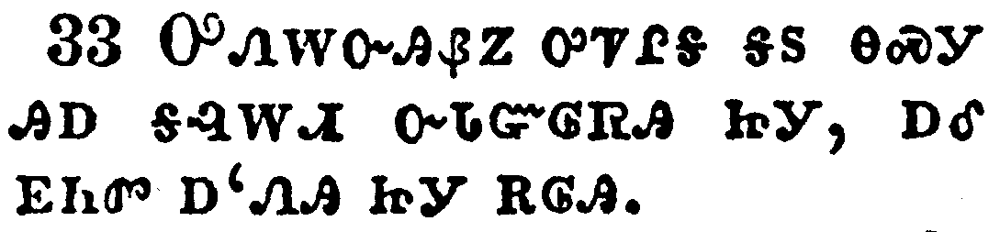</a></td>
</tr>
<tr class="even">
<td>For the bread of God is he which cometh down from heaven, and giveth life unto the world.</td>
</tr>
<tr class="odd">
<td>ᎤᏁᎳᏅᎯᏰᏃ ᎤᏤᎵᎦ ᎦᏚ ᎾᏍᎩ ᎯᎠ ᎦᎸᎳᏗ ᏅᏓᏳᎶᏒᎯ ᏥᎩ, ᎠᎴ ᎬᏂᏛ Ꭰ'ᏁᎯ ᏥᎩ ᎡᎶᎯ.</td>
</tr>
<tr class="even">
<td>U-ne-la-nv-hi-ye-no u-tse-li-ga ga-du na-s-gi hi-a ga-lv-la-di nv-da-yu-lo-sv-hi tsi-gi, a-le gv-ni-dv a'ne-hi tsi-gi e-lo-hi.</td>
</tr>
</tbody>
</table>

<table>
<tbody>
<tr class="odd">
<td><a href="040634.png">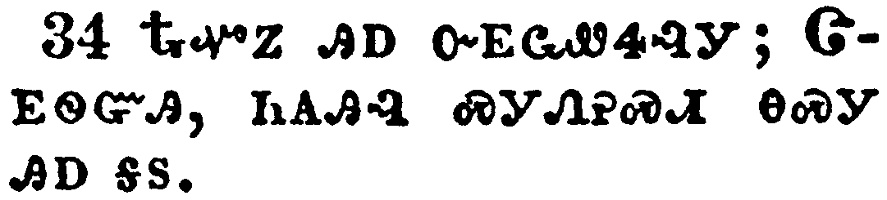</a></td>
</tr>
<tr class="even">
<td>Then said they unto him, Lord, evermore give us this bread.</td>
</tr>
<tr class="odd">
<td>ᎿᎭᏉᏃ ᎯᎠ ᏅᎬᏩᏪᏎᎸᎩ; ᏣᎬᏫᏳᎯ, ᏂᎪᎯᎸ ᏍᎩᏁᎮᏍᏗ ᎾᏍᎩ ᎯᎠ ᎦᏚ.</td>
</tr>
<tr class="even">
<td>Hna-quo-no hi-a nv-gv-wa-we-se-lv-gi; Tsa-gv-wi-yu-hi, ni-go-hi-lv s-gi-ne-he-s-di na-s-gi hi-a ga-du.</td>
</tr>
</tbody>
</table>

<table>
<tbody>
<tr class="odd">
<td><a href="040635.png">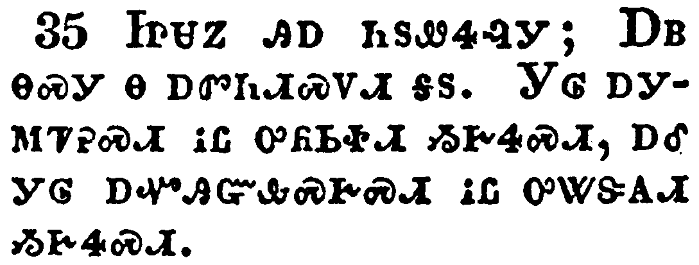</a></td>
</tr>
<tr class="even">
<td>And Jesus said unto them, I am the bread of life: he that cometh to me shall never hunger; and he that believeth on me shall never thirst.</td>
</tr>
<tr class="odd">
<td>ᏥᏌᏃ ᎯᎠ ᏂᏚᏪᏎᎸᎩ; ᎠᏴ ᎾᏍᎩ Ꮎ ᎠᏛᏂᏗᏍᏙᏗ ᎦᏚ. ᎩᎶ ᎠᎩᎷᏤᎮᏍᏗ ᎥᏝ ᎤᏲᏏᏐᏗ ᏱᎨᏎᏍᏗ, ᎠᎴ ᎩᎶ ᎠᏉᎯᏳᎲᏍᎨᏍᏗ ᎥᏝ ᎤᏔᏕᎪᏗ ᏱᎨᏎᏍᏗ.</td>
</tr>
<tr class="even">
<td>Tsi-sa-no hi-a ni-du-we-se-lv-gi; A-yv na-s-gi na a-dv-ni-di-s-do-di ga-du. Gi-lo a-gi-lu-tse-he-s-di v-tla u-yo-si-so-di yi-ge-se-s-di, a-le gi-lo a-quo-hi-yu-hv-s-ge-s-di v-tla u-ta-de-go-di yi-ge-se-s-di.</td>
</tr>
</tbody>
</table>

<table>
<tbody>
<tr class="odd">
<td><a href="040636.png">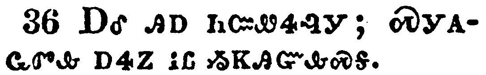</a></td>
</tr>
<tr class="even">
<td>But I said unto you, That ye also have seen me, and believe not.</td>
</tr>
<tr class="odd">
<td>ᎠᎴ ᎯᎠ ᏂᏨᏪᏎᎸᎩ; ᏍᎩᎪᏩᏛᎲ ᎠᏎᏃ ᎥᏝ ᏱᏦᎯᏳᎲᏍᎦ.</td>
</tr>
<tr class="even">
<td>A-le hi-a ni-tsv-we-se-lv-gi; S-gi-go-wa-dv-hv a-se-no v-tla yi-tso-hi-yu-hv-s-ga.</td>
</tr>
</tbody>
</table>

<table>
<tbody>
<tr class="odd">
<td><a href="040637.png">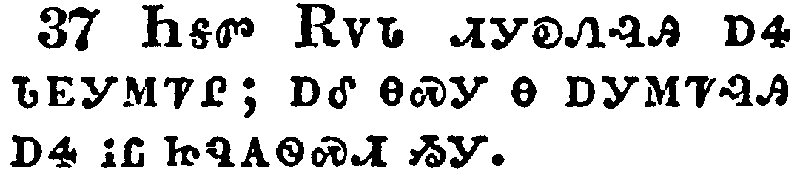</a></td>
</tr>
<tr class="even">
<td>All that the Father giveth me shall come to me; and him that cometh to me I will in no wise cast out.</td>
</tr>
<tr class="odd">
<td>ᏂᎦᏛ ᎡᏙᏓ ᏗᎩᎧᏁᎸᎯ ᎠᏎ ᏓᎬᎩᎷᏤᎵ; ᎠᎴ ᎾᏍᎩ Ꮎ ᎠᎩᎷᏤᎸᎯ ᎠᏎ ᎥᏝ ᏥᏄᎪᏫᏍᏗ ᏱᎩ.</td>
</tr>
<tr class="even">
<td>Ni-ga-dv E-do-da di-gi-ka-ne-lv-hi a-se da-gv-gi-lu-tse-li; a-le na-s-gi na a-gi-lu-tse-lv-hi a-se v-tla tsi-nu-go-wi-s-di yi-gi.</td>
</tr>
</tbody>
</table>

<table>
<tbody>
<tr class="odd">
<td><a href="040638.png">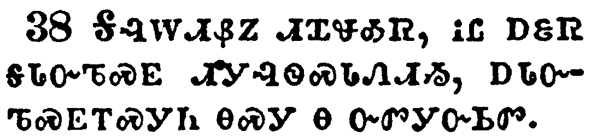</a></td>
</tr>
<tr class="even">
<td>For I came down from heaven, not to do mine own will, but the will of him that sent me.</td>
</tr>
<tr class="odd">
<td>ᎦᎸᎳᏗᏰᏃ ᏗᏆᏠᎣᏒ, ᎥᏝ ᎠᏋᏒ ᎦᏓᏅᏖᏍᎬ ᏗᎩᎸᏫᏍᏓᏁᏗᏱ, ᎠᏓᏅᏖᏍᎬᎢᏍᎩᏂ ᎾᏍᎩ Ꮎ ᏅᏛᎩᏅᏏᏛ.</td>
</tr>
<tr class="even">
<td>Ga-lv-la-di-ye-no di-qua-tlo-o-sv, v-tla a-quv-sv ga-da-nv-te-s-gv di-gi-lv-wi-s-da-ne-di-yi, a-da-nv-te-s-gv-i-s-gi-ni na-s-gi na nv-dv-gi-nv-si-dv.</td>
</tr>
</tbody>
</table>

<table>
<tbody>
<tr class="odd">
<td><a href="040639.png">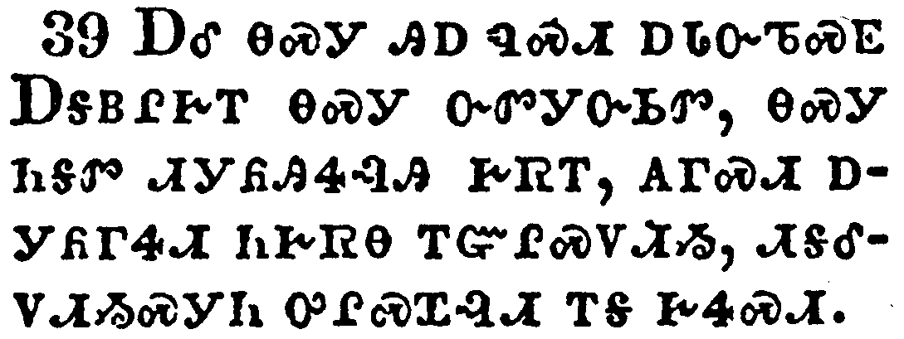</a></td>
</tr>
<tr class="even">
<td>And this is the Father's will which hath sent me, that of all which he hath given me I should lose nothing, but should raise it up again at the last day.</td>
</tr>
<tr class="odd">
<td>ᎠᎴ ᎾᏍᎩ ᎯᎠ ᏄᏍᏗ ᎠᏓᏅᏖᏍᎬ ᎠᎦᏴᎵᎨᎢ ᎾᏍᎩ ᏅᏛᎩᏅᏏᏛ, ᎾᏍᎩ ᏂᎦᏛ ᏗᎩᏲᎯᏎᎸᎯ ᎨᏒᎢ, ᎪᎱᏍᏗ ᎠᎩᏲᎱᏎᏗ ᏂᎨᏒᎾ ᎢᏳᎵᏍᏙᏗᏱ, ᏗᎦᎴᏙᏗᏱᏍᎩᏂ ᎤᎵᏍᏆᎸᏗ ᎢᎦ ᎨᏎᏍᏗ.</td>
</tr>
<tr class="even">
<td>A-le na-s-gi hi-a nu-s-di a-da-nv-te-s-gv A-ga-yv-li-ge-i na-s-gi nv-dv-gi-nv-si-dv, na-s-gi ni-ga-dv di-gi-yo-hi-se-lv-hi ge-sv-i, go-hu-s-di a-gi-yo-hu-se-di ni-ge-sv-na i-yu-li-s-do-di-yi, di-ga-le-do-di-yi-s-gi-ni u-li-s-qua-lv-di i-ga ge-se-s-di.</td>
</tr>
</tbody>
</table>

<table>
<tbody>
<tr class="odd">
<td><a href="040640.png">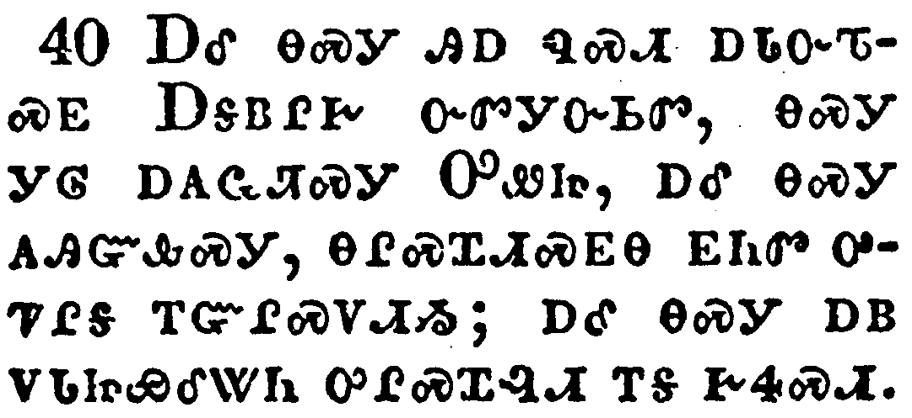</a></td>
</tr>
<tr class="even">
<td>And this is the will of him that sent me, that every one which seeth the Son, and believeth on him, may have everlasting life: and I will raise him up at the last day.</td>
</tr>
<tr class="odd">
<td>ᎠᎴ ᎾᏍᎩ ᎯᎠ ᏄᏍᏗ ᎠᏓᏅᏖᏍᎬ ᎠᎦᏴᎵᎨ ᏅᏛᎩᏅᏏᏛ, ᎾᏍᎩ ᎩᎶ ᎠᎪᏩᏘᏍᎩ ᎤᏪᏥ, ᎠᎴ ᎾᏍᎩ ᎪᎯᏳᎲᏍᎩ, ᎾᎵᏍᏆᏗᏍᎬᎾ ᎬᏂᏛ ᎤᏤᎵᎦ ᎢᏳᎵᏍᏙᏗᏱ; ᎠᎴ ᎾᏍᎩ ᎠᏴ ᏙᏓᏥᏯᎴᏔᏂ ᎤᎵᏍᏆᎸᏗ ᎢᎦ ᎨᏎᏍᏗ.</td>
</tr>
<tr class="even">
<td>A-le na-s-gi hi-a nu-s-di a-da-nv-te-s-gv A-ga-yv-li-ge nv-dv-gi-nv-si-dv, na-s-gi gi-lo a-go-wa-ti-s-gi Uwe-tsi, a-le na-s-gi go-hi-yu-hv-s-gi, na-li-s-qua-di-s-gv-na gv-ni-dv u-tse-li-ga i-yu-li-s-do-di-yi; a-le na-s-gi a-yv do-da-tsi-ya-le-ta-ni u-li-s-qua-lv-di i-ga ge-se-s-di.</td>
</tr>
</tbody>
</table>

<table>
<tbody>
<tr class="odd">
<td><a href="040641.png">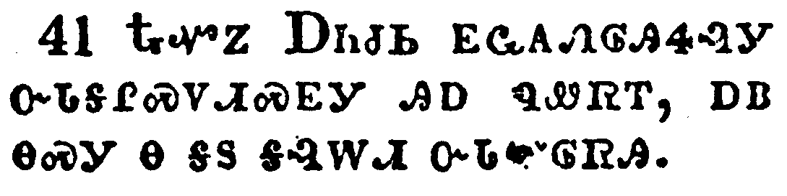</a></td>
</tr>
<tr class="even">
<td>The Jews then murmured at him, because he said, I am the bread which came down from heaven.</td>
</tr>
<tr class="odd">
<td>ᎿᎭᏉᏃ ᎠᏂᏧᏏ ᎬᏩᎪᏁᎶᎯᏎᎸᎩ ᏅᏓᎦᎵᏍᏙᏗᏍᎬᎩ ᎯᎠ ᏄᏪᏒᎢ, ᎠᏴ ᎾᏍᎩ Ꮎ ᎦᏚ ᎦᎸᎳᏗ ᏅᏓᏛᎶᏒᎯ.</td>
</tr>
<tr class="even">
<td>Hna-quo-no A-ni-tsu-si gv-wa-go-ne-lo-hi-se-lv-gi nv-da-ga-li-s-do-di-s-gv-gi hi-a nu-we-sv-i, a-yv na-s-gi na ga-du ga-lv-la-di nv-da-dv-lo-sv-hi.</td>
</tr>
</tbody>
</table>

<table>
<tbody>
<tr class="odd">
<td><a href="040642.png">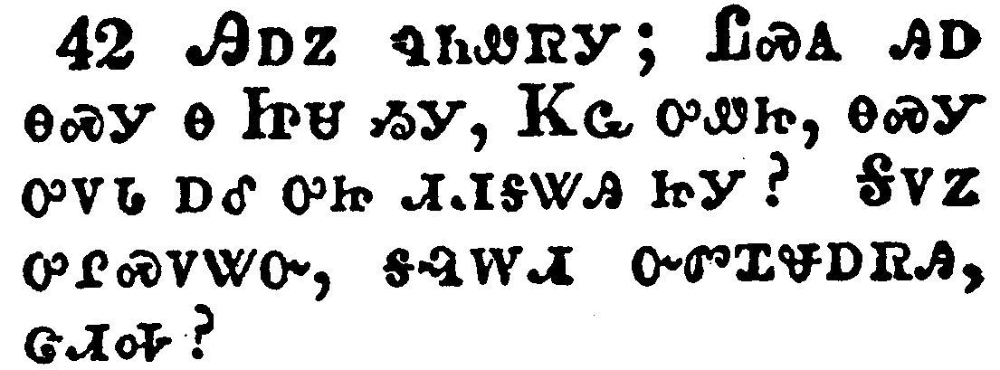</a></td>
</tr>
<tr class="even">
<td>And they said, Is not this Jesus, the son of Joseph, whose father and mother we know? how is it then that he saith, I came down from heaven?</td>
</tr>
<tr class="odd">
<td>ᎯᎠᏃ ᏄᏂᏪᏒᎩ; ᏝᏍᎪ ᎯᎠ ᎾᏍᎩ Ꮎ ᏥᏌ ᏱᎩ, ᏦᏩ ᎤᏪᏥ, ᎾᏍᎩ ᎤᏙᏓ ᎠᎴ ᎤᏥ ᏗᏗᎦᏔᎯ ᏥᎩ? ᎦᏙᏃ ᎤᎵᏍᏙᏔᏅ, ᎦᎸᎳᏗ ᏅᏛᏆᏠᎠᏒᎯ, ᏣᏗᎭ?</td>
</tr>
<tr class="even">
<td>Hi-a-no nu-ni-we-sv-gi; Tla-s-go hi-a na-s-gi na Tsi-sa yi-gi, Tso-wa u-we-tsi, na-s-gi u-do-da a-le u-tsi di-di-ga-ta-hi tsi-gi? Ga-do-no u-li-s-do-ta-nv, ga-lv-la-di nv-dv-qua-tlo-a-sv-hi, tsa-di-ha?</td>
</tr>
</tbody>
</table>

<table>
<tbody>
<tr class="odd">
<td><a href="040643.png">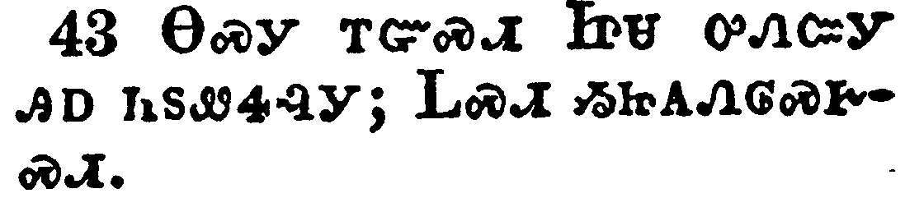</a></td>
</tr>
<tr class="even">
<td>Jesus therefore answered and said unto them, Murmur not among yourselves.</td>
</tr>
<tr class="odd">
<td>ᎾᏍᎩ ᎢᏳᏍᏗ ᏥᏌ ᎤᏁᏨᎩ ᎯᎠ ᏂᏚᏪᏎᎸᎩ; ᏞᏍᏗ ᏱᏥᎪᏁᎶᏍᎨᏍᏗ.</td>
</tr>
<tr class="even">
<td>Na-s-gi i-yu-s-di Tsi-sa u-ne-tsv-gi hi-a ni-du-we-se-lv-gi; Tle-s-di yi-tsi-go-ne-lo-s-ge-s-di.</td>
</tr>
</tbody>
</table>

<table>
<tbody>
<tr class="odd">
<td><a href="040644.png">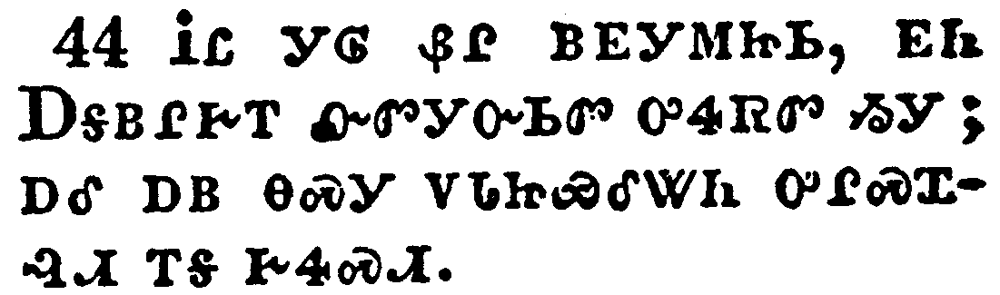</a></td>
</tr>
<tr class="even">
<td>No man can come to me, except the Father which hath sent me draw him: and I will raise him up at the last day.</td>
</tr>
<tr class="odd">
<td>ᎥᏝ ᎩᎶ ᏰᎵ ᏴᎬᎩᎷᏥᏏ, ᎬᏂ ᎠᎦᏴᎵᎨᎢ ᏅᏛᎩᏅᏏᏛ ᎤᏎᏒᏛ ᏱᎩ; ᎠᎴ ᎠᏴ ᎾᏍᎩ ᏙᏓᏥᏯᎴᏔᏂ ᎤᎵᏍᏆᎸᏗ ᎢᎦ ᎨᏎᏍᏗ.</td>
</tr>
<tr class="even">
<td>V-tla gi-lo ye-li yv-gv-gi-lu-tsi-si, gv-ni A-ga-yv-li-ge-i nv-dv-gi-nv-si-dv u-se-sv-dv yi-gi; a-le a-yv na-s-gi do-da-tsi-ya-le-ta-ni u-li-s-qua-lv-di i-ga ge-se-s-di.</td>
</tr>
</tbody>
</table>

<table>
<tbody>
<tr class="odd">
<td><a href="040645.png">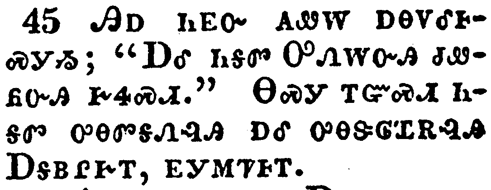</a></td>
</tr>
<tr class="even">
<td>It is written in the prophets, And they shall be all taught of God. Every man therefore that hath heard, and hath learned of the Father, cometh unto me.</td>
</tr>
<tr class="odd">
<td>ᎯᎠ ᏂᎬᏅ ᎪᏪᎳ ᎠᎾᏙᎴᎰᏍᎩᏱ; "ᎠᎴ ᏂᎦᏛ ᎤᏁᎳᏅᎯ ᏧᏪᏲᏅᎯ ᎨᏎᏍᏗ." ᎾᏍᎩ ᎢᏳᏍᏗ ᏂᎦᏛ ᎤᎾᏛᎦᏁᎸᎯ ᎠᎴ ᎤᎾᏕᎶᏆᎡᎸᎯ ᎠᎦᏴᎵᎨᎢ, ᎬᎩᎷᏤᎰᎢ.</td>
</tr>
<tr class="even">
<td>Hi-a ni-gv-nv go-we-la a-na-do-le-ho-s-gi-yi; "A-le ni-ga-dv U-ne-la-nv-hi tsu-we-yo-nv-hi ge-se-s-di." Na-s-gi i-yu-s-di ni-ga-dv u-na-dv-ga-ne-lv-hi a-le u-na-de-lo-qua-e-lv-hi A-ga-yv-li-ge-i, gv-gi-lu-tse-ho-i.</td>
</tr>
</tbody>
</table>

<table>
<tbody>
<tr class="odd">
<td><a href="040646.png">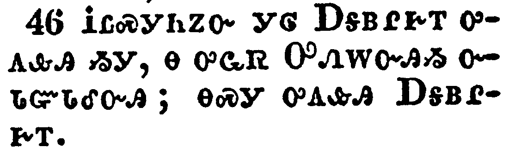</a></td>
</tr>
<tr class="even">
<td>Not that any man hath seen the Father, save he which is of God, he hath seen the Father.</td>
</tr>
<tr class="odd">
<td>ᎥᏝᏍᎩᏂᏃᏅ ᎩᎶ ᎠᎦᏴᎵᎨᎢ ᎤᎪᎲᎯ ᏱᎩ, Ꮎ ᎤᏩᏒ ᎤᏁᎳᏅᎯᏱ ᏅᏓᏳᏓᎴᏅᎯ; ᎾᏍᎩ ᎤᎪᎲᎯ ᎠᎦᏴᎵᎨᎢ.</td>
</tr>
<tr class="even">
<td>V-tla-s-gi-ni-no-nv gi-lo A-ga-yv-li-ge-i u-go-hv-hi yi-gi, na u-wa-sv U-ne-la-nv-hi-yi nv-da-yu-da-le-nv-hi; na-s-gi u-go-hv-hi A-ga-yv-li-ge-i.</td>
</tr>
</tbody>
</table>

<table>
<tbody>
<tr class="odd">
<td><a href="040647.png">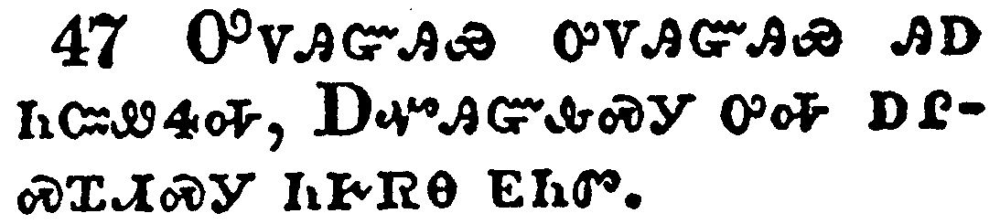</a></td>
</tr>
<tr class="even">
<td>Verily, verily, I say unto you, He that believeth on me hath everlasting life.</td>
</tr>
<tr class="odd">
<td>ᎤᏙᎯᏳᎯᏯ ᎤᏙᎯᏳᎯᏯ ᎯᎠ ᏂᏨᏪᏎᎭ, ᎠᏉᎯᏳᎲᏍᎩ ᎤᎭ ᎠᎵᏍᏆᏗᏍᎩ ᏂᎨᏒᎾ ᎬᏂᏛ.</td>
</tr>
<tr class="even">
<td>U-do-hi-yu-hi-ya u-do-hi-yu-hi-ya hi-a ni-tsv-we-se-ha, A-quo-hi-yu-hv-s-gi u-ha a-li-s-qua-di-s-gi ni-ge-sv-na gv-ni-dv.</td>
</tr>
</tbody>
</table>

<table>
<tbody>
<tr class="odd">
<td><a href="040648.png">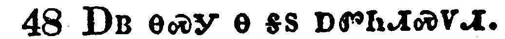</a></td>
</tr>
<tr class="even">
<td>I am that bread of life.</td>
</tr>
<tr class="odd">
<td>ᎠᏴ ᎾᏍᎩ Ꮎ ᎦᏚ ᎠᏛᏂᏗᏍᏙᏗ.</td>
</tr>
<tr class="even">
<td>A-yv na-s-gi na ga-du a-dv-ni-di-s-do-di.</td>
</tr>
</tbody>
</table>

<table>
<tbody>
<tr class="odd">
<td><a href="040649.png">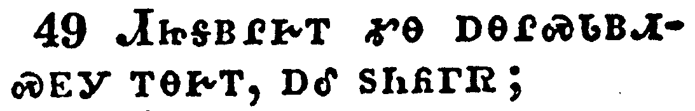</a></td>
</tr>
<tr class="even">
<td>Your fathers did eat manna in the wilderness, and are dead.</td>
</tr>
<tr class="odd">
<td>ᏗᏥᎦᏴᎵᎨᎢ ᎹᎾ ᎠᎾᎵᏍᏓᏴᏗᏍᎬᎩ ᎢᎾᎨᎢ, ᎠᎴ ᏚᏂᏲᎱᏒ;</td>
</tr>
<tr class="even">
<td>Di-tsi-ga-yv-li-ge-i ma-na a-na-li-s-da-yv-di-s-gv-gi i-na-ge-i, a-le du-ni-yo-hu-sv;</td>
</tr>
</tbody>
</table>

<table>
<tbody>
<tr class="odd">
<td><a href="040650.png">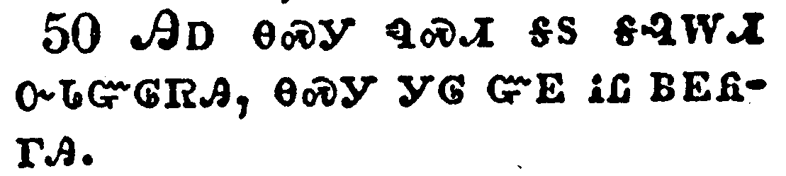</a></td>
</tr>
<tr class="even">
<td>This is the bread which cometh down from heaven, that a man may eat thereof, and not die.</td>
</tr>
<tr class="odd">
<td>ᎯᎠ ᎾᏍᎩ ᏄᏍᏗ ᎦᏚ ᎦᎸᎳᏗ ᏅᏓᏳᎶᏒᎯ, ᎾᏍᎩ ᎩᎶ ᏳᎬ ᎥᏝ ᏴᎬᏲᎱᎯ.</td>
</tr>
<tr class="even">
<td>Hi-a na-s-gi nu-s-di ga-du ga-lv-la-di nv-da-yu-lo-sv-hi, na-s-gi gi-lo yu-gv v-tla yv-gv-yo-hu-hi.</td>
</tr>
</tbody>
</table>

<table>
<tbody>
<tr class="odd">
<td><a href="040651.png">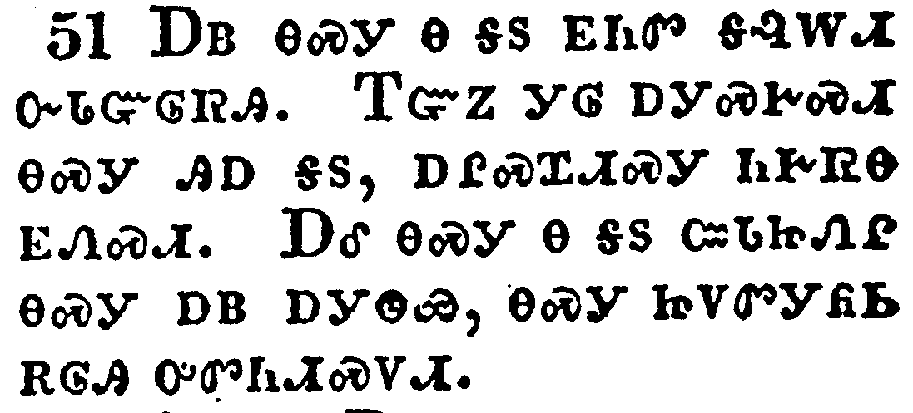</a></td>
</tr>
<tr class="even">
<td>I am the living bread which came down from heaven: if any man eat of this bread, he shall live for ever: and the bread that I will give is my flesh, which I will give for the life of the world.</td>
</tr>
<tr class="odd">
<td>ᎠᏴ ᎾᏍᎩ Ꮎ ᎦᏚ ᎬᏂᏛ ᎦᎸᎳᏗ ᏅᏓᏳᎶᏒᎯ. ᎢᏳᏃ ᎩᎶ ᎠᎩᏍᎨᏍᏗ ᎾᏍᎩ ᎯᎠ ᎦᏚ, ᎠᎵᏍᏆᏗᏍᎩ ᏂᎨᏒᎾ ᎬᏁᏍᏗ. ᎠᎴ ᎾᏍᎩ Ꮎ ᎦᏚ ᏨᏓᏥᏁᎵ ᎾᏍᎩ ᎠᏴ ᎠᎩᏫᏯ, ᎾᏍᎩ ᏥᏙᏛᎩᏲᏏ ᎡᎶᎯ ᎤᏛᏂᏗᏍᏙᏗ.</td>
</tr>
<tr class="even">
<td>A-yv na-s-gi na ga-du gv-ni-dv ga-lv-la-di nv-da-yu-lo-sv-hi. I-yu-no gi-lo a-gi-s-ge-s-di na-s-gi hi-a ga-du, a-li-s-qua-di-s-gi ni-ge-sv-na gv-ne-s-di. A-le na-s-gi na ga-du tsv-da-tsi-ne-li na-s-gi a-yv a-gi-wi-ya, na-s-gi tsi-do-dv-gi-yo-si e-lo-hi u-dv-ni-di-s-do-di.</td>
</tr>
</tbody>
</table>

<table>
<tbody>
<tr class="odd">
<td><a href="040652.png">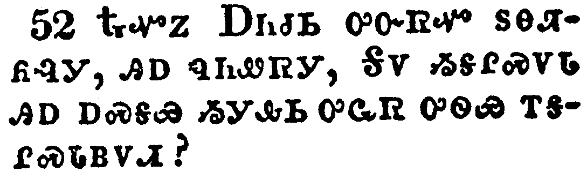</a></td>
</tr>
<tr class="even">
<td>The Jews therefore strove among themselves, saying, How can this man give us his flesh to eat?</td>
</tr>
<tr class="odd">
<td>ᎿᎭᏉᏃ ᎠᏂᏧᏏ ᎤᏅᏒᏉ ᏚᎾᏘᏲᎸᎩ, ᎯᎠ ᏄᏂᏪᏒᎩ, ᎦᏙ ᏱᎦᎵᏍᏙᏓ ᎯᎠ ᎠᏍᎦᏯ ᏱᎩᎲᏏ ᎤᏩᏒ ᎤᏫᏯ ᎢᎦᎵᏍᏓᏴᏙᏗ?</td>
</tr>
<tr class="even">
<td>Hna-quo-no A-ni-tsu-si u-nv-sv-quo du-na-ti-yo-lv-gi, hi-a nu-ni-we-sv-gi, Ga-do yi-ga-li-s-do-da hi-a a-s-ga-ya yi-gi-hv-si u-wa-sv u-wi-ya i-ga-li-s-da-yv-do-di?</td>
</tr>
</tbody>
</table>

<table>
<tbody>
<tr class="odd">
<td><a href="040653.png">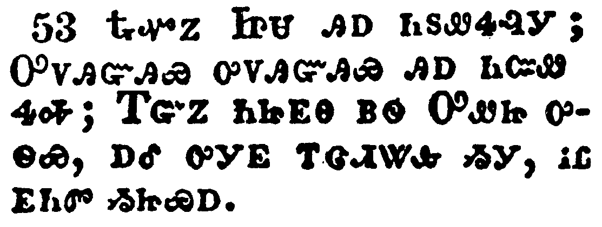</a></td>
</tr>
<tr class="even">
<td>Then Jesus said unto them, Verily, verily, I say unto you, Except ye eat the flesh of the Son of man, and drink his blood, ye have no life in you.</td>
</tr>
<tr class="odd">
<td>ᎿᎭᏉᏃ ᏥᏌ ᎯᎠ ᏂᏚᏪᏎᎸᎩ; ᎤᏙᎯᏳᎯᏯ ᎤᏙᎯᏳᎯᏯ ᎯᎠ ᏂᏨᏪ ᏎᎭ; ᎢᏳᏃ ᏂᏥᎬᎾ ᏴᏫ ᎤᏪᏥ ᎤᏫᏯ, ᎠᎴ ᎤᎩᎬ ᎢᏣᏗᏔᎲ ᏱᎩ, ᎥᏝ ᎬᏂᏛ ᏱᏥᏯᎠ.</td>
</tr>
<tr class="even">
<td>Hna-quo-no Tsi-sa hi-a ni-du-we-se-lv-gi; U-do-hi-yu-hi-ya u-do-hi-yu-hi-ya hi-a ni-tsv-we se-ha; I-yu-no ni-tsi-gv-na yv-wi U-we-tsi u-wi-ya, a-le u-gi-gv i-tsa-di-ta-hv yi-gi, v-tla gv-ni-dv yi-tsi-ya-a.</td>
</tr>
</tbody>
</table>

<table>
<tbody>
<tr class="odd">
<td><a href="040654.png">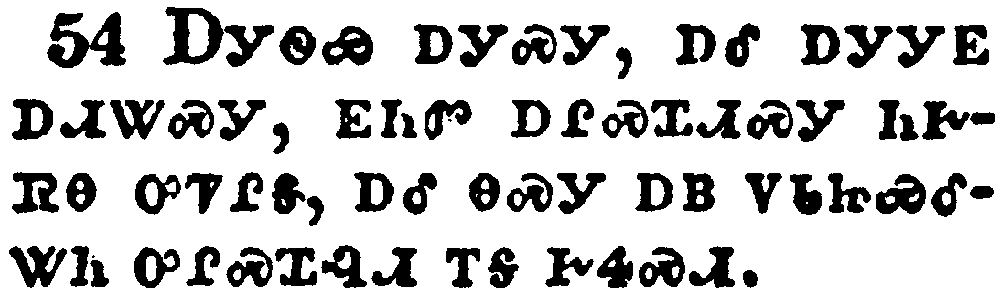</a></td>
</tr>
<tr class="even">
<td>Whoso eateth my flesh, and drinketh my blood, hath eternal life; and I will raise him up at the last day.</td>
</tr>
<tr class="odd">
<td>ᎠᎩᏫᏯ ᎠᎩᏍᎩ, ᎠᎴ ᎠᎩᎩᎬ ᎠᏗᏔᏍᎩ, ᎬᏂᏛ ᎠᎵᏍᏆᏗᏍᎩ ᏂᎨᏒᎾ ᎤᏤᎵᎦ, ᎠᎴ ᎾᏍᎩ ᎠᏴ ᏙᏓᏥᏯᎴᏔᏂ ᎤᎵᏍᏆᎸᏗ ᎢᎦ ᎨᏎᏍᏗ.</td>
</tr>
<tr class="even">
<td>A-gi-wi-ya a-gi-s-gi, a-le a-gi-gi-gv a-di-ta-s-gi, gv-ni-dv a-li-s-qua-di-s-gi ni-ge-sv-na u-tse-li-ga, a-le na-s-gi a-yv do-da-tsi-ya-le-ta-ni u-li-s-qua-lv-di i-ga ge-se-s-di.</td>
</tr>
</tbody>
</table>

<table>
<tbody>
<tr class="odd">
<td></td>
</tr>
<tr class="even">
<td>For my flesh is meat indeed, and my blood is drink indeed.</td>
</tr>
<tr class="odd">
<td>ᎠᎩᏫᏯᏰᏃ ᎤᏙᎯᏳᏒ ᎠᎵᏍᏓᏴᏗ, ᎠᎴ ᎠᎩᎩᎬ ᎤᏙᎯᏳᏒ ᎠᏗᏔᏍᏗ.</td>
</tr>
<tr class="even">
<td>A-gi-wi-ya-ye-no u-do-hi-yu-sv a-li-s-da-yv-di, a-le a-gi-gi-gv u-do-hi-yu-sv a-di-ta-s-di.</td>
</tr>
</tbody>
</table>

<table>
<tbody>
<tr class="odd">
<td><a href="040656.png">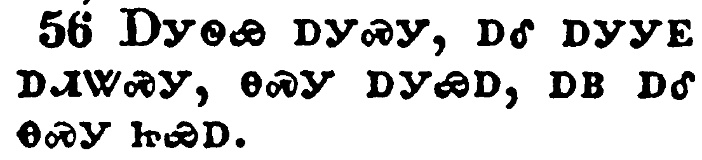</a></td>
</tr>
<tr class="even">
<td>He that eateth my flesh, and drinketh my blood, dwelleth in me, and I in him.</td>
</tr>
<tr class="odd">
<td>ᎠᎩᏫᏯ ᎠᎩᏍᎩ, ᎠᎴ ᎠᎩᎩᎬ ᎠᏗᏔᏍᎩ, ᎾᏍᎩ ᎠᎩᏯᎠ, ᎠᏴ ᎠᎴ ᎾᏍᎩ ᏥᏯᎠ.</td>
</tr>
<tr class="even">
<td>A-gi-wi-ya a-gi-s-gi, a-le a-gi-gi-gv a-di-ta-s-gi, na-s-gi a-gi-ya-a, a-yv a-le na-s-gi tsi-ya-a.</td>
</tr>
</tbody>
</table>

<table>
<tbody>
<tr class="odd">
<td><a href="040657.png">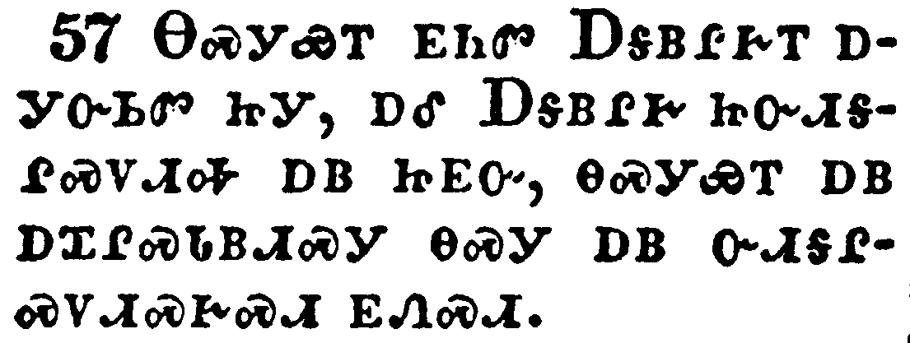</a></td>
</tr>
<tr class="even">
<td>As the living Father hath sent me, and I live by the Father: so he that eateth me, even he shall live by me.</td>
</tr>
<tr class="odd">
<td>ᎾᏍᎩᏯᎢ ᎬᏂᏛ ᎠᎦᏴᎵᎨᎢ ᎠᎩᏅᏏᏛ ᏥᎩ, ᎠᎴ ᎠᎦᏴᎵᎨ ᏥᏅᏗᎦᎵᏍᏙᏗᎭ ᎠᏴ ᏥᎬᏅ, ᎾᏍᎩᏯᎢ ᎠᏴ ᎠᏆᎵᏍᏓᏴᏗᏍᎩ ᎾᏍᎩ ᎠᏴ ᏅᏗᎦᎵᏍᏙᏗᏍᎨᏍᏗ ᎬᏁᏍᏗ.</td>
</tr>
<tr class="even">
<td>Na-s-gi-ya-i gv-ni-dv A-ga-yv-li-ge-i a-gi-nv-si-dv tsi-gi, a-le A-ga-yv-li-ge tsi-nv-di-ga-li-s-do-di-ha a-yv tsi-gv-nv, na-s-gi-ya-i a-yv a-qua-li-s-da-yv-di-s-gi na-s-gi a-yv nv-di-ga-li-s-do-di-s-ge-s-di gv-ne-s-di.</td>
</tr>
</tbody>
</table>

<table>
<tbody>
<tr class="odd">
<td><a href="040658.png">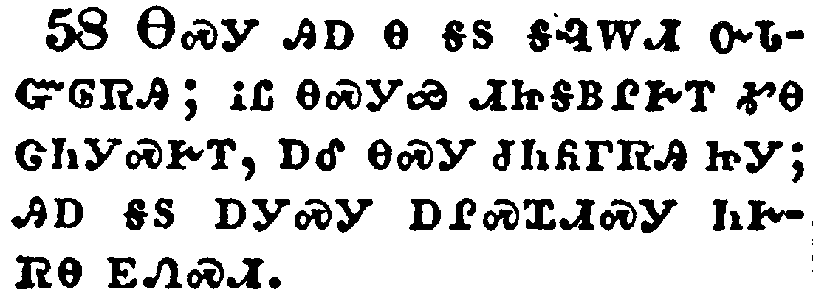</a></td>
</tr>
<tr class="even">
<td>This is that bread which came down from heaven: not as your fathers did eat manna, and are dead: he that eateth of this bread shall live for ever.</td>
</tr>
<tr class="odd">
<td>ᎾᏍᎩ ᎯᎠ Ꮎ ᎦᏚ ᎦᎸᎳᏗ ᏅᏓᏳᎶᏒᎯ; ᎥᏝ ᎾᏍᎩᏯ ᏗᏥᎦᏴᎵᎨᎢ ᎹᎾ ᏣᏂᎩᏍᎨᎢ, ᎠᎴ ᎾᏍᎩ ᏧᏂᏲᎱᏒᎯ ᏥᎩ; ᎯᎠ ᎦᏚ ᎠᎩᏍᎩ ᎠᎵᏍᏆᏗᏍᎩ ᏂᎨᏒᎾ ᎬᏁᏍᏗ.</td>
</tr>
<tr class="even">
<td>Na-s-gi hi-a na ga-du ga-lv-la-di nv-da-yu-lo-sv-hi; v-tla na-s-gi-ya di-tsi-ga-yv-li-ge-i ma-na tsa-ni-gi-s-ge-i, a-le na-s-gi tsu-ni-yo-hu-sv-hi tsi-gi; hi-a ga-du a-gi-s-gi a-li-s-qua-di-s-gi ni-ge-sv-na gv-ne-s-di.</td>
</tr>
</tbody>
</table>

<table>
<tbody>
<tr class="odd">
<td><a href="040659.png">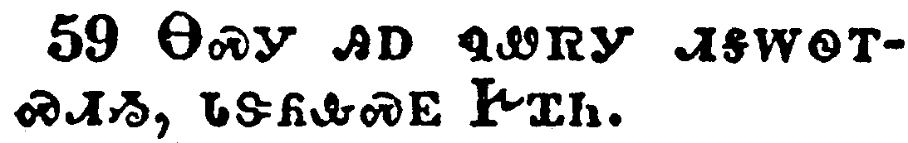</a></td>
</tr>
<tr class="even">
<td>These things said he in the synagogue, as he taught in Capernaum.</td>
</tr>
<tr class="odd">
<td>ᎾᏍᎩ ᎯᎠ ᏄᏪᏒᎩ ᏗᎦᎳᏫᎢᏍᏗᏱ, ᏓᏕᏲᎲᏍᎬ ᎨᏆᏂ.</td>
</tr>
<tr class="even">
<td>Na-s-gi hi-a nu-we-sv-gi di-ga-la-wi-i-s-di-yi, da-de-yo-hv-s-gv Ge-qua-ni.</td>
</tr>
</tbody>
</table>

<table>
<tbody>
<tr class="odd">
<td><a href="040660.png">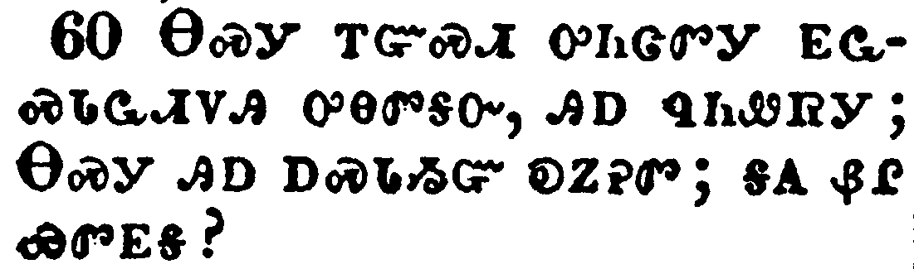</a></td>
</tr>
<tr class="even">
<td>Many therefore of his disciples, when they had heard this, said, This is an hard saying; who can hear it?</td>
</tr>
<tr class="odd">
<td>ᎾᏍᎩ ᎢᏳᏍᏗ ᎤᏂᏣᏛᎩ ᎬᏩᏍᏓᏩᏗᏙᎯ ᎤᎾᏛᎦᏅ, ᎯᎠ ᏄᏂᏪᏒᎩ; ᎾᏍᎩ ᎯᎠ ᎠᏍᏓᏱᏳ ᎧᏃᎮᏛ; ᎦᎪ ᏰᎵ ᏯᏛᎬᎦ?</td>
</tr>
<tr class="even">
<td>Na-s-gi i-yu-s-di u-ni-tsa-dv-gi gv-wa-s-da-wa-di-do-hi u-na-dv-ga-nv, hi-a nu-ni-we-sv-gi; Na-s-gi hi-a a-s-da-yi-yu ka-no-he-dv; ga-go ye-li ya-dv-gv-ga?</td>
</tr>
</tbody>
</table>

<table>
<tbody>
<tr class="odd">
<td><a href="040661.png">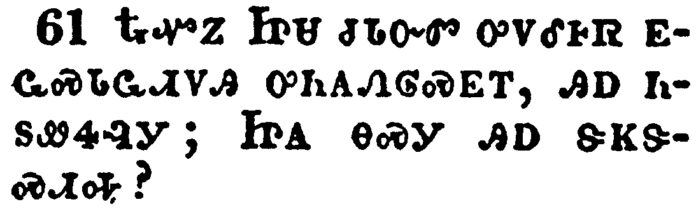</a></td>
</tr>
<tr class="even">
<td>When Jesus knew in himself that his disciples murmured at it, he said unto them, Doth this offend you?</td>
</tr>
<tr class="odd">
<td>ᎿᎭᏉᏃ ᏥᏌ ᏧᏓᏅᏛ ᎤᏙᎴᎰᏒ ᎬᏩᏍᏓᏩᏗᏙᎯ ᎤᏂᎪᏁᎶᏍᎬᎢ, ᎯᎠ ᏂᏚᏪᏎᎸᎩ; ᏥᎪ ᎾᏍᎩ ᎯᎠ ᏕᏦᏕᏍᏗᎭ?</td>
</tr>
<tr class="even">
<td>Hna-quo-no Tsi-sa tsu-da-nv-dv u-do-le-ho-sv gv-wa-s-da-wa-di-do-hi u-ni-go-ne-lo-s-gv-i, hi-a ni-du-we-se-lv-gi; Tsi-go na-s-gi hi-a de-tso-de-s-di-ha?</td>
</tr>
</tbody>
</table>

<table>
<tbody>
<tr class="odd">
<td><a href="040662.png">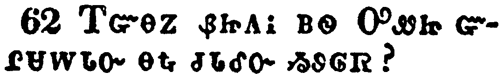</a></td>
</tr>
<tr class="even">
<td>What and if ye shall see the Son of man ascend up where he was before?</td>
</tr>
<tr class="odd">
<td>ᎢᏳᎾᏃ ᏰᏥᎪᎥ ᏴᏫ ᎤᏪᏥ ᏳᎵᏌᎳᏓᏅ ᎾᎿᎭᏧᏓᎴᏅ ᏱᏬᎶᏒ?</td>
</tr>
<tr class="even">
<td>I-yu-na-no ye-tsi-go-v yv-wi U-we-tsi yu-li-sa-la-da-nv na-hna tsu-da-le-nv yi-wo-lo-sv?</td>
</tr>
</tbody>
</table>

<table>
<tbody>
<tr class="odd">
<td><a href="040663.png">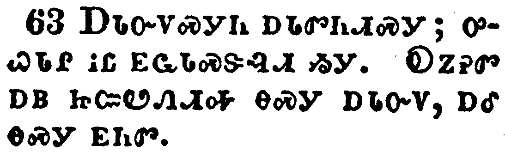</a></td>
</tr>
<tr class="even">
<td>It is the spirit that quickeneth; the flesh profiteth nothing: the words that I speak unto you, they are spirit, and they are life.</td>
</tr>
<tr class="odd">
<td>ᎠᏓᏅᏙᏍᎩᏂ ᎠᏓᏛᏂᏗᏍᎩ; ᎤᏇᏓᎵ ᎥᏝ ᎬᏩᏓᏍᏕᎸᏗ ᏱᎩ. ᎧᏃᎮᏛ ᎠᏴ ᏥᏨᏬᏁᏗᎭ ᎾᏍᎩ ᎠᏓᏅᏙ, ᎠᎴ ᎾᏍᎩ ᎬᏂᏛ.</td>
</tr>
<tr class="even">
<td>A-da-nv-do-s-gi-ni a-da-dv-ni-di-s-gi; u-que-da-li v-tla gv-wa-da-s-de-lv-di yi-gi. Ka-no-he-dv a-yv tsi-tsv-wo-ne-di-ha na-s-gi a-da-nv-do, a-le na-s-gi gv-ni-dv.</td>
</tr>
</tbody>
</table>

<table>
<tbody>
<tr class="odd">
<td></td>
</tr>
<tr class="even">
<td>But there are some of you that believe not. For Jesus knew from the beginning who they were that believed not, and who should betray him.</td>
</tr>
<tr class="odd">
<td>ᎠᏎᏃ ᎢᏣᏓᏑᏯ ᏂᏦᎯᏳᎲᏍᎬᎾ. ᏥᏌᏰᏃ ᏗᏓᎴᏂᏍᎬ ᏂᏓᎦᏔᎰ ᎾᏍᎩ Ꮎ ᎾᏃᎯᏳᎲᏍᎬᎾ, ᎠᎴ ᎾᎦᏔᎰᎢ ᎾᏍᎩ Ꮎ ᎤᏡᏗᏍᎩ ᎢᏳᎵᏍᏙᏗ.</td>
</tr>
<tr class="even">
<td>A-se-no i-tsa-da-su-ya ni-tso-hi-yu-hv-s-gv-na. Tsi-sa-ye-no di-da-le-ni-s-gv ni-da-ga-ta-ho na-s-gi na na-no-hi-yu-hv-s-gv-na, a-le na-ga-ta-ho-i na-s-gi na u-tlu-di-s-gi i-yu-li-s-do-di.</td>
</tr>
</tbody>
</table>

<table>
<tbody>
<tr class="odd">
<td></td>
</tr>
<tr class="even">
<td>And he said, Therefore said I unto you, that no man can come unto me, except it were given unto him of my Father.</td>
</tr>
<tr class="odd">
<td>ᎠᎴ ᎯᎠ ᎾᏍᏉ ᏄᏪᏒᎩ; ᎾᏍᎩ ᎢᏳᏍᏗ ᎯᎠ ᏥᏂᏨᏪᏎᎸᎩ; ᎥᏝ ᎩᎶ ᏴᎬᎩᎷᏥ, ᎬᏂ ᎡᏙᏓ ᎤᏁᎸᎯ ᏱᎩ.</td>
</tr>
<tr class="even">
<td>A-le hi-a na-s-quo nu-we-sv-gi; Na-s-gi i-yu-s-di hi-a tsi-ni-tsv-we-se-lv-gi; v-tla gi-lo yv-gv-gi-lu-tsi, gv-ni E-do-da u-ne-lv-hi yi-gi.</td>
</tr>
</tbody>
</table>

<table>
<tbody>
<tr class="odd">
<td><a href="040666.png">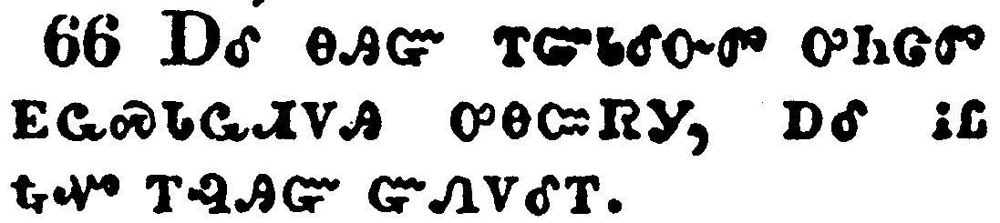</a></td>
</tr>
<tr class="even">
<td>From that time many of his disciples went back, and walked no more with him.</td>
</tr>
<tr class="odd">
<td>ᎠᎴ ᎾᎯᏳ ᎢᏳᏓᎴᏅᏛ ᎤᏂᏣᏛ ᎬᏩᏍᏓᏩᏗᏙᎯ ᎤᎾᏨᏒᎩ, ᎠᎴ ᎥᏝ ᎿᎭᏉ ᎢᎸᎯᏳ ᏳᏁᏙᎴᎢ.</td>
</tr>
<tr class="even">
<td>A-le na-hi-yu i-yu-da-le-nv-dv u-ni-tsa-dv gv-wa-s-da-wa-di-do-hi u-na-tsv-sv-gi, a-le v-tla hna-quo i-lv-hi-yu yu-ne-do-le-i.</td>
</tr>
</tbody>
</table>

<table>
<tbody>
<tr class="odd">
<td><a href="040667.png">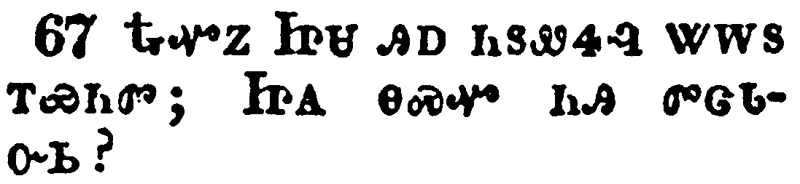</a></td>
</tr>
<tr class="even">
<td>Then said Jesus unto the twelve, Will ye also go away?</td>
</tr>
<tr class="odd">
<td>ᎿᎭᏉᏃ ᏥᏌ ᎯᎠ ᏂᏚᏪᏎᎸ ᏔᎳᏚ ᎢᏯᏂᏛ; ᏥᎪ ᎾᏍᏉ ᏂᎯ ᏛᏣᏓᏅᏏ?</td>
</tr>
<tr class="even">
<td>Hna-quo-no Tsi-sa hi-a ni-du-we-se-lv ta-la-du i-ya-ni-dv; Tsi-go na-s-quo ni-hi dv-tsa-da-nv-si?</td>
</tr>
</tbody>
</table>

<table>
<tbody>
<tr class="odd">
<td><a href="040668.png">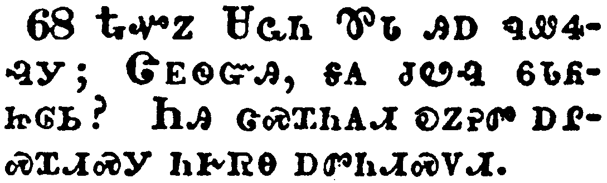</a></td>
</tr>
<tr class="even">
<td>Then Simon Peter answered him, Lord, to whom shall we go? thou hast the words of eternal life.</td>
</tr>
<tr class="odd">
<td>ᎿᎭᏉᏃ ᏌᏩᏂ ᏈᏓ ᎯᎠ ᏄᏪᏎᎸᎩ; ᏣᎬᏫᏳᎯ, ᎦᎪ ᏧᏬᎸ ᏮᏓᏲᏥᎶᏏ? ᏂᎯ ᏣᏍᏆᏂᎪᏗ ᎧᏃᎮᏛ ᎠᎵᏍᏆᏗᏍᎩ ᏂᎨᏒᎾ ᎠᏛᏂᏗᏍᏙᏗ.</td>
</tr>
<tr class="even">
<td>Hna-quo-no Sa-wa-ni Qui-da hi-a nu-we-se-lv-gi; Tsa-gv-wi-yu-hi, ga-go tsu-wo-lv wv-da-yo-tsi-lo-si? Ni-hi tsa-s-qua-ni-go-di ka-no-he-dv a-li-s-qua-di-s-gi ni-ge-sv-na a-dv-ni-di-s-do-di.</td>
</tr>
</tbody>
</table>

<table>
<tbody>
<tr class="odd">
<td><a href="040669.png">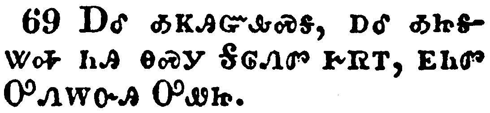</a></td>
</tr>
<tr class="even">
<td>And we believe and are sure that thou art that Christ, the Son of the living God.</td>
</tr>
<tr class="odd">
<td>ᎠᎴ ᎣᏦᎯᏳᎲᏍᎦ, ᎠᎴ ᎣᏥᎦᏔᎭ ᏂᎯ ᎾᏍᎩ ᎦᎶᏁᏛ ᎨᏒᎢ, ᎬᏂᏛ ᎤᏁᎳᏅᎯ ᎤᏪᏥ.</td>
</tr>
<tr class="even">
<td>A-le o-tso-hi-yu-hv-s-ga, a-le o-tsi-ga-ta-ha ni-hi na-s-gi Ga-lo-ne-dv ge-sv-i, gv-ni-dv U-ne-la-nv-hi U-we-tsi.</td>
</tr>
</tbody>
</table>

<table>
<tbody>
<tr class="odd">
<td><a href="040670.png">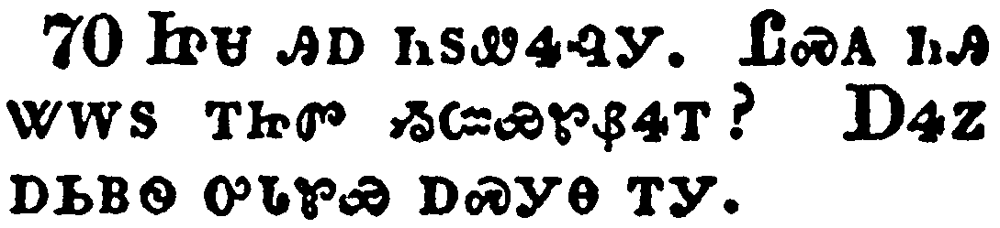</a></td>
</tr>
<tr class="even">
<td>Jesus answered them, Have not I chosen you twelve, and one of you is a devil?</td>
</tr>
<tr class="odd">
<td>ᏥᏌ ᎯᎠ ᏂᏚᏪᏎᎸᎩ. ᏝᏍᎪ ᏂᎯ ᏔᎳᏚ ᎢᏥᏛ ᏱᏨᏯᏑᏰᏎᎢ? ᎠᏎᏃ ᎠᏏᏴᏫ ᎤᏓᏑᏯ ᎠᏍᎩᎾ ᎢᎩ.</td>
</tr>
<tr class="even">
<td>Tsi-sa hi-a ni-du-we-se-lv-gi. Tla-s-go ni-hi ta-la-du i-tsi-dv yi-tsv-ya-su-ye-se-i? A-se-no a-si-yv-wi u-da-su-ya a-s-gi-na i-gi.</td>
</tr>
</tbody>
</table>

<table>
<tbody>
<tr class="odd">
<td><a href="040671.png">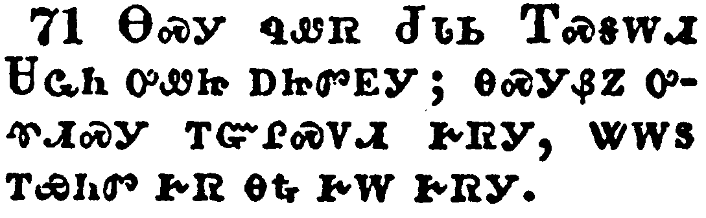</a></td>
</tr>
<tr class="even">
<td>He spake of Judas Iscariot the son of Simon: for he it was that should betray him, being one of the twelve.</td>
</tr>
<tr class="odd">
<td>ᎾᏍᎩ ᏄᏪᏒ ᏧᏓᏏ ᎢᏍᎦᎳᏗ ᏌᏩᏂ ᎤᏪᏥ ᎠᏥᏛᎬᎩ; ᎾᏍᎩᏰᏃ ᎤᏡᏗᏍᎩ ᎢᏳᎵᏍᏙᏗ ᎨᏒᎩ, ᏔᎳᏚ ᎢᏯᏂᏛ ᎨᏒ ᎾᎿᎭᎨᎳ ᎨᏒᎩ.</td>
</tr>
<tr class="even">
<td>Na-s-gi nu-we-sv Tsu-da-si I-s-ga-la-di Sa-wa-ni u-we-tsi a-tsi-dv-gv-gi; na-s-gi-ye-no u-tlu-di-s-gi i-yu-li-s-do-di ge-sv-gi, ta-la-du i-ya-ni-dv ge-sv na-hna ge-la ge-sv-gi.</td>
</tr>
</tbody>
</table>

