+++
draft=false
date = 2014-12-18T21:11:07Z
title = "John - Chapter 7 - Cherokee New Testament"
weight = 1418955067

[taxonomies]

authors = ["Timothy Legg"]
categories = []
tags = []

[extra]
+++

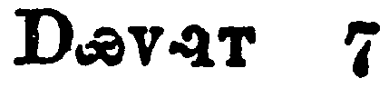

<table>
<tbody>
<tr class="odd">
<td><a href="040701.png">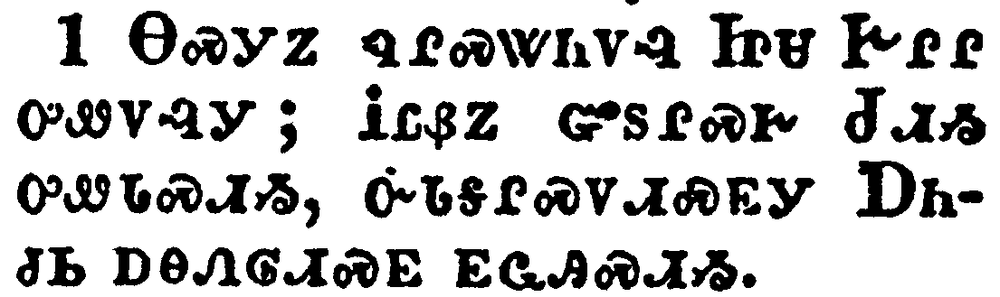</a></td>
</tr>
<tr class="even">
<td>After these things Jesus walked in Galilee: for he would not walk in Jewry, because the Jews sought to kill him.</td>
</tr>
<tr class="odd">
<td>ᎾᏍᎩᏃ ᏄᎵᏍᏔᏂᏙᎸ ᏥᏌ ᎨᎵᎵ ᎤᏪᏙᎸᎩ; ᎥᏝᏰᏃ ᏳᏚᎵᏍᎨ ᏧᏗᏱ ᎤᏪᏓᏍᏗᏱ, ᏅᏓᎦᎵᏍᏙᏗᏍᎬᎩ ᎠᏂᏧᏏ ᎠᎾᏁᎶᏗᏍᎬ ᎬᏩᎯᏍᏗᏱ.</td>
</tr>
<tr class="even">
<td>Na-s-gi-no nu-li-s-ta-ni-do-lv Tsi-sa Ge-li-li u-we-do-lv-gi; V-tla-ye-no yu-du-li-s-ge Tsu-di-yi u-we-da-s-di-yi, nv-da-ga-li-s-do-di-s-gv-gi A-ni-tsu-si a-na-ne-lo-di-s-gv gv-wa-hi-s-di-yi.</td>
</tr>
</tbody>
</table>

<table>
<tbody>
<tr class="odd">
<td><a href="040702.png">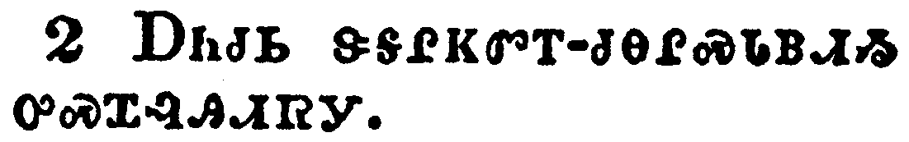</a></td>
</tr>
<tr class="even">
<td>Now the Jews' feast of tabernacles was at hand.</td>
</tr>
<tr class="odd">
<td>ᎠᏂᏧᏏ ᏕᎦᎵᏦᏛᎢ-ᏧᎾᎵᏍᏓᏴᏗᏱ ᎤᏍᏆᎸᎯᏗᏒᎩ.</td>
</tr>
<tr class="even">
<td>A-ni-tsu-si de-ga-li-tso-dv-i--tsu-na-li-s-da-yv-di-yi u-s-qua-lv-hi-di-sv-gi.</td>
</tr>
</tbody>
</table>

<table>
<tbody>
<tr class="odd">
<td><a href="040703.png">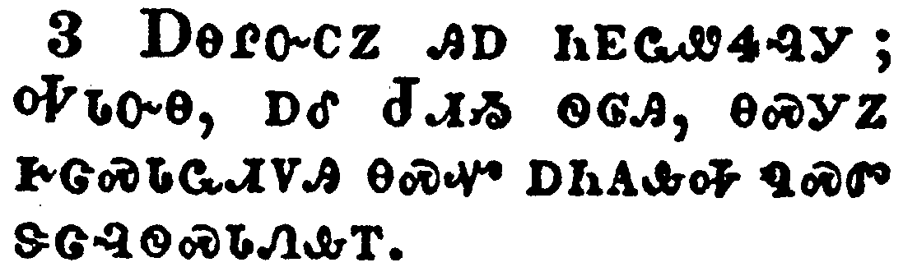</a></td>
</tr>
<tr class="even">
<td>His brethren therefore said unto him, Depart hence, and go into Judaea, that thy disciples also may see the works that thou doest.</td>
</tr>
<tr class="odd">
<td>ᎠᎾᎵᏅᏟᏃ ᎯᎠ ᏂᎬᏩᏪᏎᎸᎩ; ᎭᏓᏅᎾ, ᎠᎴ ᏧᏗᏱ ᏫᎶᎯ, ᎾᏍᎩᏃ ᎨᏣᏍᏓᏩᏗᏙᎯ ᎾᏍᏉ ᎠᏂᎪᎲᎭ ᏄᏍᏛ ᏕᏣᎸᏫᏍᏓᏁᎲᎢ.</td>
</tr>
<tr class="even">
<td>A-na-li-nv-tli-no hi-a ni-gv-wa-we-se-lv-gi; Ha-da-nv-na, a-le Tsu-di-yi wi-lo-hi, na-s-gi-no ge-tsa-s-da-wa-di-do-hi na-s-quo a-ni-go-hv-ha nu-s-dv de-tsa-lv-wi-s-da-ne-hv-i.</td>
</tr>
</tbody>
</table>

<table>
<tbody>
<tr class="odd">
<td><a href="040704.png">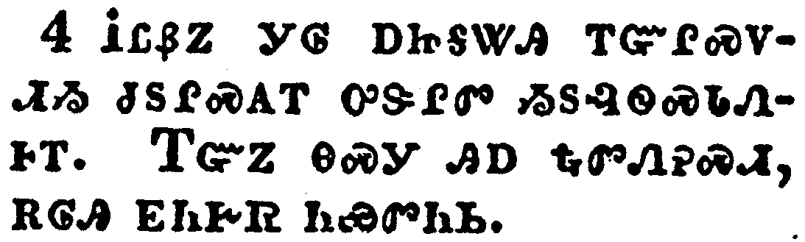</a></td>
</tr>
<tr class="even">
<td>For there is no man that doeth any thing in secret, and he himself seeketh to be known openly. If thou do these things, shew thyself to the world.</td>
</tr>
<tr class="odd">
<td>ᎥᏝᏰᏃ ᎩᎶ ᎠᏥᎦᏔᎯ ᎢᏳᎵᏍᏙᏗᏱ ᏧᏚᎵᏍᎪᎢ ᎤᏕᎵᏛ ᏱᏚᎸᏫᏍᏓᏁᎰᎢ. ᎢᏳᏃ ᎾᏍᎩ ᎯᎠ ᎿᎭᏛᏁᎮᏍᏗ, ᎡᎶᎯ ᎬᏂᎨᏒ ᏂᏯᏛᏂᏏ.</td>
</tr>
<tr class="even">
<td>V-tla-ye-no gi-lo a-tsi-ga-ta-hi i-yu-li-s-do-di-yi tsu-du-li-s-go-i u-de-li-dv yi-du-lv-wi-s-da-ne-ho-i. I-yu-no na-s-gi hi-a hna-dv-ne-he-s-di, e-lo-hi gv-ni-ge-sv ni-ya-dv-ni-si.</td>
</tr>
</tbody>
</table>

<table>
<tbody>
<tr class="odd">
<td><a href="040705.png">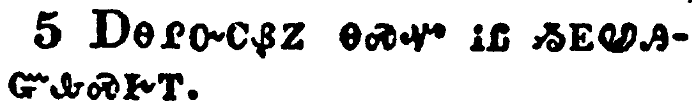</a></td>
</tr>
<tr class="even">
<td>For neither did his brethren believe in him.</td>
</tr>
<tr class="odd">
<td>ᎠᎾᎵᏅᏟᏰᏃ ᎾᏍᏉ ᎥᏝ ᏱᎬᏬᎯᏳᎲᏍᎨᎢ.</td>
</tr>
<tr class="even">
<td>A-na-li-nv-tli-ye-no na-s-quo v-tla yi-gv-wo-hi-yu-hv-s-ge-i.</td>
</tr>
</tbody>
</table>

<table>
<tbody>
<tr class="odd">
<td><a href="040706.png">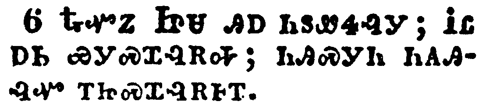</a></td>
</tr>
<tr class="even">
<td>Then Jesus said unto them, My time is not yet come: but your time is always ready.</td>
</tr>
<tr class="odd">
<td>ᎿᎭᏉᏃ ᏥᏌ ᎯᎠ ᏂᏚᏪᏎᎸᎩ; ᎥᏝ ᎠᏏ ᏯᎩᏍᏆᎸᎡᎭ; ᏂᎯᏍᎩᏂ ᏂᎪᎯᎸᏉ ᎢᏥᏍᏆᎸᎡᎰᎢ.</td>
</tr>
<tr class="even">
<td>Hna-quo-no Tsi-sa hi-a ni-du-we-se-lv-gi; V-tla a-si ya-gi-s-qua-lv-e-ha; ni-hi-s-gi-ni ni-go-hi-lv-quo i-tsi-s-qua-lv-e-ho-i.</td>
</tr>
</tbody>
</table>

<table>
<tbody>
<tr class="odd">
<td><a href="040707.png">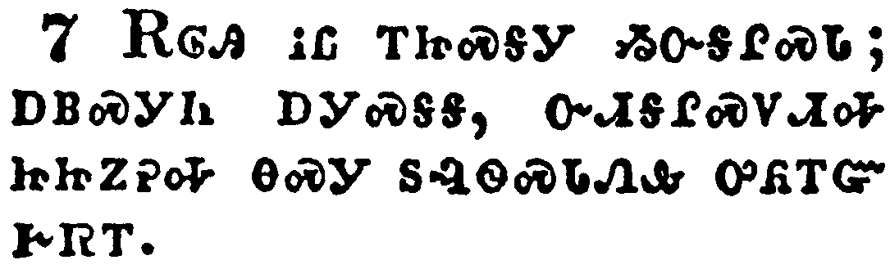</a></td>
</tr>
<tr class="even">
<td>The world cannot hate you; but me it hateth, because I testify of it, that the works thereof are evil.</td>
</tr>
<tr class="odd">
<td>ᎡᎶᎯ ᎥᏝ ᎢᏥᏍᎦᎩ ᏱᏅᎦᎵᏍᏓ; ᎠᏴᏍᎩᏂ ᎠᎩᏍᎦᎦ, ᏅᏗᎦᎵᏍᏙᏗᎭ ᏥᏥᏃᎮᎭ ᎾᏍᎩ ᏚᎸᏫᏍᏓᏁᎲ ᎤᏲᎢᏳ ᎨᏒᎢ.</td>
</tr>
<tr class="even">
<td>E-lo-hi v-tla i-tsi-s-ga-gi yi-nv-ga-li-s-da; a-yv-s-gi-ni a-gi-s-ga-ga, nv-di-ga-li-s-do-di-ha tsi-tsi-no-he-ha na-s-gi du-lv-wi-s-da-ne-hv u-yo-i-yu ge-sv-i.</td>
</tr>
</tbody>
</table>

<table>
<tbody>
<tr class="odd">
<td><a href="040708.png">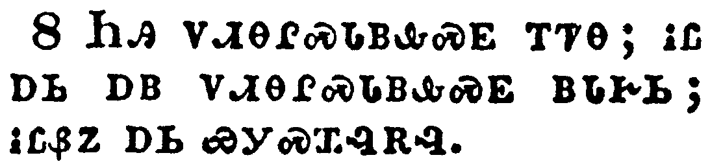</a></td>
</tr>
<tr class="even">
<td>Go ye up unto this feast: I go not up yet unto this feast; for my time is not yet full come.</td>
</tr>
<tr class="odd">
<td>ᏂᎯ ᏙᏗᎾᎵᏍᏓᏴᎲᏍᎬ ᎢᏤᎾ; ᎥᏝ ᎠᏏ ᎠᏴ ᏙᏗᎾᎵᏍᏓᏴᎲᏍᎬ ᏴᏓᎨᏏ; ᎥᏝᏰᏃ ᎠᏏ ᏯᎩᏍᏆᎸᎡᎸ.</td>
</tr>
<tr class="even">
<td>Ni-hi do-di-na-li-s-da-yv-hv-s-gv i-tse-na; v-tla a-si a-yv do-di-na-li-s-da-yv-hv-s-gv yv-da-ge-si; v-tla-ye-no a-si ya-gi-s-qua-lv-e-lv.</td>
</tr>
</tbody>
</table>

<table>
<tbody>
<tr class="odd">
<td><a href="040709.png">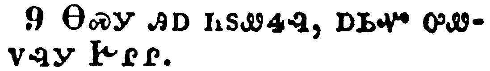</a></td>
</tr>
<tr class="even">
<td>When he had said these words unto them, he abode still in Galilee.</td>
</tr>
<tr class="odd">
<td>ᎾᏍᎩ ᎯᎠ ᏂᏚᏪᏎᎸ, ᎠᏏᏉ ᎤᏪᏙᎸᎩ ᎨᎵᎵ.</td>
</tr>
<tr class="even">
<td>Na-s-gi hi-a ni-du-we-se-lv, a-si-quo u-we-do-lv-gi Ge-li-li.</td>
</tr>
</tbody>
</table>

<table>
<tbody>
<tr class="odd">
<td><a href="040710.png">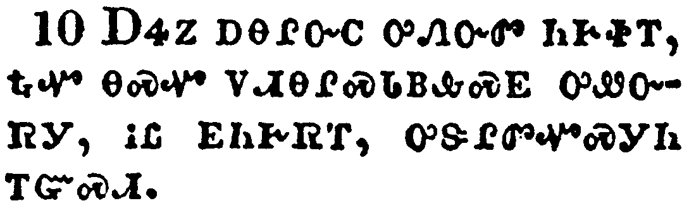</a></td>
</tr>
<tr class="even">
<td>But when his brethren were gone up, then went he also up unto the feast, not openly, but as it were in secret.</td>
</tr>
<tr class="odd">
<td>ᎠᏎᏃ ᎠᎾᎵᏅᏟ ᎤᏁᏅᏛ ᏂᎨᏐᎢ, ᎿᎭᏉ ᎾᏍᏉ ᏙᏗᎾᎵᏍᏓᏴᎲᏍᎬ ᎤᏪᏅᏒᎩ, ᎥᏝ ᎬᏂᎨᏒᎢ, ᎤᏕᎵᏛᏉᏍᎩᏂ ᎢᏳᏍᏗ.</td>
</tr>
<tr class="even">
<td>A-se-no a-na-li-nv-tli u-ne-nv-dv ni-ge-so-i, hna-quo na-s-quo do-di-na-li-s-da-yv-hv-s-gv u-we-nv-sv-gi, v-tla gv-ni-ge-sv-i, u-de-li-dv-quo-s-gi-ni i-yu-s-di.</td>
</tr>
</tbody>
</table>

<table>
<tbody>
<tr class="odd">
<td><a href="040711.png">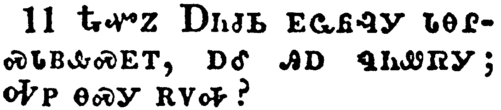</a></td>
</tr>
<tr class="even">
<td>Then the Jews sought him at the feast, and said, Where is he?</td>
</tr>
<tr class="odd">
<td>ᎿᎭᏉᏃ ᎠᏂᏧᏏ ᎬᏩᏲᎸᎩ ᏓᎾᎵᏍᏓᏴᎲᏍᎬᎢ, ᎠᎴ ᎯᎠ ᏄᏂᏪᏒᎩ; ᎭᏢ ᎾᏍᎩ ᎡᏙᎭ?</td>
</tr>
<tr class="even">
<td>Hna-quo-no A-ni-tsu-si gv-wa-yo-lv-gi da-na-li-s-da-yv-hv-s-gv-i, a-le hi-a nu-ni-we-sv-gi; Ha-tlv na-s-gi e-do-ha?</td>
</tr>
</tbody>
</table>

<table>
<tbody>
<tr class="odd">
<td><a href="040712.png">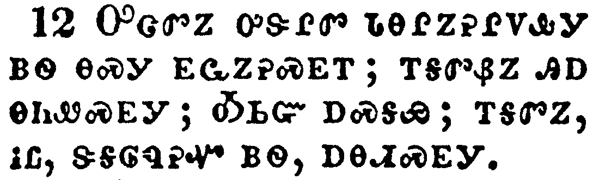</a></td>
</tr>
<tr class="even">
<td>And there was much murmuring among the people concerning him: for some said, He is a good man: others said, Nay; but he deceiveth the people.</td>
</tr>
<tr class="odd">
<td>ᎤᏣᏛᏃ ᎤᏕᎵᏛ ᏓᎾᎵᏃᎮᎵᏙᎲᎩ ᏴᏫ ᎾᏍᎩ ᎬᏩᏃᎮᏍᎬᎢ; ᎢᎦᏛᏰᏃ ᎯᎠ ᎾᏂᏪᏍᎬᎩ; ᎣᏏᏳ ᎠᏍᎦᏯ; ᎢᎦᏛᏃ, ᎥᏝ, ᏕᎦᎶᏄᎮᏉ ᏴᏫ, ᎠᎾᏗᏍᎬᎩ.</td>
</tr>
<tr class="even">
<td>U-tsa-dv-no u-de-li-dv da-na-li-no-he-li-do-hv-gi yv-wi na-s-gi gv-wa-no-he-s-gv-i; i-ga-dv-ye-no hi-a na-ni-we-s-gv-gi; O-si-yu a-s-ga-ya; i-ga-dv-no, v-tla, de-ga-lo-nu-he-quo yv-wi, a-na-di-s-gv-gi.</td>
</tr>
</tbody>
</table>

<table>
<tbody>
<tr class="odd">
<td><a href="040713.png">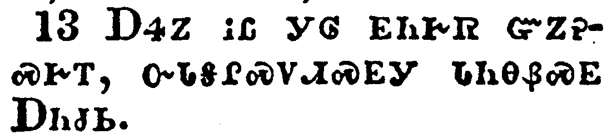</a></td>
</tr>
<tr class="even">
<td>Howbeit no man spake openly of him for fear of the Jews.</td>
</tr>
<tr class="odd">
<td>ᎠᏎᏃ ᎥᏝ ᎩᎶ ᎬᏂᎨᏒ ᏳᏃᎮᏍᎨᎢ, ᎤᏓᎦᎵᏍᏙᏗᏍᎬᎩ ᏓᏂᎾᏰᏍᎬ ᎠᏂᏧᏏ.</td>
</tr>
<tr class="even">
<td>A-se-no v-tla gi-lo gv-ni-ge-sv yu-no-he-s-ge-i, u-da-ga-li-s-do-di-s-gv-gi da-ni-na-ye-s-gv A-ni-tsu-si.</td>
</tr>
</tbody>
</table>

<table>
<tbody>
<tr class="odd">
<td><a href="040714.png">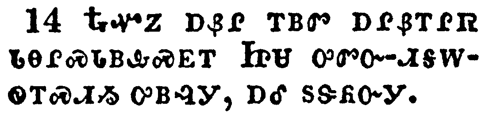</a></td>
</tr>
<tr class="even">
<td>Now about the midst of the feast Jesus went up into the temple, and taught.</td>
</tr>
<tr class="odd">
<td>ᎿᎭᏉᏃ ᎠᏰᎵ ᎢᏴᏛ ᎠᎵᏰᎢᎵᏒ ᏓᎾᎵᏍᏓᏴᎲᏍᎬᎢ ᏥᏌ ᎤᏛᏅ-ᏗᎦᎳᏫᎢᏍᏗᏱ ᎤᏴᎸᎩ, ᎠᎴ ᏚᏕᏲᏅᎩ.</td>
</tr>
<tr class="even">
<td>Hna-quo-no a-ye-li i-yv-dv a-li-ye-i-li-sv da-na-li-s-da-yv-hv-s-gv-i Tsi-sa u-dv-nv--di-ga-la-wi-i-s-di-yi u-yv-lv-gi, a-le du-de-yo-nv-gi.</td>
</tr>
</tbody>
</table>

<table>
<tbody>
<tr class="odd">
<td><a href="040715.png">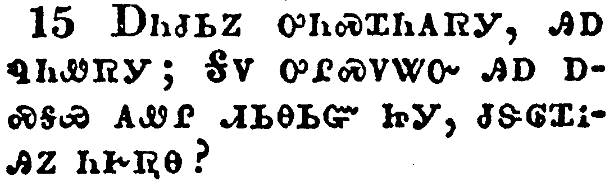</a></td>
</tr>
<tr class="even">
<td>And the Jews marvelled, saying, How knoweth this man letters, having never learned?</td>
</tr>
<tr class="odd">
<td>ᎠᏂᏧᏏᏃ ᎤᏂᏍᏆᏂᎪᏒᎩ, ᎠᎴ ᏄᏂᏪᏒᎩ; ᎦᏙ ᎤᎵᏍᏙᏔᏅ ᎯᎠ ᎠᏍᎦᏯ ᎪᏪᎵ ᏗᏏᎾᏏᏳ ᏥᎩ, ᏧᏕᎶᏆᎥᎯᏃ ᏂᎨᏒᎾ?</td>
</tr>
<tr class="even">
<td>A-ni-tsu-si-no u-ni-s-qua-ni-go-sv-gi, a-le nu-ni-we-sv-gi; Ga-do u-li-s-do-ta-nv hi-a a-s-ga-ya go-we-li di-si-na-si-yu tsi-gi, tsu-de-lo-qua-v-hi-no ni-ge-sv-na?</td>
</tr>
</tbody>
</table>

<table>
<tbody>
<tr class="odd">
<td><a href="040716.png">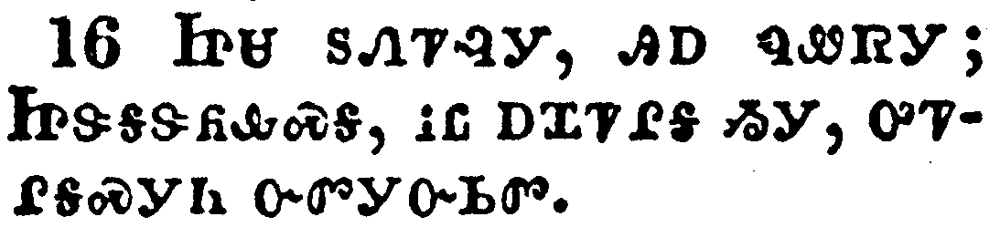</a></td>
</tr>
<tr class="even">
<td>Jesus answered them, and said, My doctrine is not mine, but his that sent me.</td>
</tr>
<tr class="odd">
<td>ᏥᏌ ᏚᏁᏤᎸᎩ, ᎯᎠ ᏄᏪᏒᎩ; ᏥᏕᎦᏕᏲᎲᏍᎦ, ᎥᏝ ᎠᏆᏤᎵᎦ ᏱᎩ, ᎤᏤᎵᎦᏍᎩᏂ ᏅᏛᎩᏅᏏᏛ.</td>
</tr>
<tr class="even">
<td>Tsi-sa du-ne-tse-lv-gi, hi-a nu-we-sv-gi; Tsi-de-ga-de-yo-hv-s-ga, v-tla a-qua-tse-li-ga yi-gi, u-tse-li-ga-s-gi-ni nv-dv-gi-nv-si-dv.</td>
</tr>
</tbody>
</table>

<table>
<tbody>
<tr class="odd">
<td><a href="040717.png">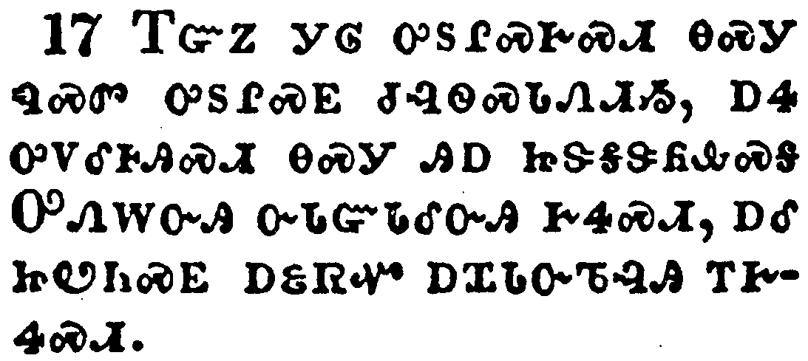</a></td>
</tr>
<tr class="even">
<td>If any man will do his will, he shall know of the doctrine, whether it be of God, or whether I speak of myself.</td>
</tr>
<tr class="odd">
<td>ᎢᏳᏃ ᎩᎶ ᎤᏚᎵᏍᎨᏍᏗ ᎾᏍᎩ ᏄᏍᏛ ᎤᏚᎵᏍᎬ ᏧᎸᏫᏍᏓᏁᏗᏱ, ᎠᏎ ᎤᏙᎴᎰᎯᏍᏗ ᎾᏍᎩ ᎯᎠ ᏥᏕᎦᏕᏲᎲᏍᎦ ᎤᏁᎳᏅᎯ ᏅᏓᏳᏓᎴᏅᎯ ᎨᏎᏍᏗ, ᎠᎴ ᏥᏬᏂᏍᎬ ᎠᏋᏒᏉ ᎠᏆᏓᏅᏖᎸᎯ ᎢᎨᏎᏍᏗ.</td>
</tr>
<tr class="even">
<td>I-yu-no gi-lo u-du-li-s-ge-s-di na-s-gi nu-s-dv u-du-li-s-gv tsu-lv-wi-s-da-ne-di-yi, a-se u-do-le-ho-hi-s-di na-s-gi hi-a tsi-de-ga-de-yo-hv-s-ga U-ne-la-nv-hi nv-da-yu-da-le-nv-hi ge-se-s-di, a-le tsi-wo-ni-s-gv a-quv-sv-quo a-qua-da-nv-te-lv-hi i-ge-se-s-di.</td>
</tr>
</tbody>
</table>

<table>
<tbody>
<tr class="odd">
<td><a href="040718.png">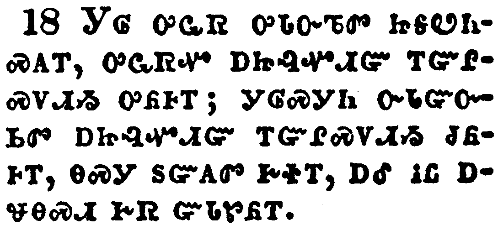</a></td>
</tr>
<tr class="even">
<td>He that speaketh of himself seeketh his own glory: but he that seeketh his glory that sent him, the same is true, and no unrighteousness is in him.</td>
</tr>
<tr class="odd">
<td>ᎩᎶ ᎤᏩᏒ ᎤᏓᏅᏖᏛ ᏥᎦᏬᏂᏍᎪᎢ, ᎤᏩᏒᏉ ᎠᏥᎸᏉᏗᏳ ᎢᏳᎵᏍᏙᏗᏱ ᎤᏲᎰᎢ; ᎩᎶᏍᎩᏂ ᏅᏓᏳᏅᏏᏛ ᎠᏥᎸᏉᏗᏳ ᎢᏳᎵᏍᏙᏗᏱ ᏧᏲᎰᎢ, ᎾᏍᎩ ᏚᏳᎪᏛ ᎨᏐᎢ, ᎠᎴ ᎥᏝ ᎠᏠᎾᏍᏗ ᎨᏒ ᏳᏓᏑᏲᎢ.</td>
</tr>
<tr class="even">
<td>Gi-lo u-wa-sv u-da-nv-te-dv tsi-ga-wo-ni-s-go-i, u-wa-sv-quo a-tsi-lv-quo-di-yu i-yu-li-s-do-di-yi u-yo-ho-i; gi-lo-s-gi-ni nv-da-yu-nv-si-dv a-tsi-lv-quo-di-yu i-yu-li-s-do-di-yi tsu-yo-ho-i, na-s-gi du-yu-go-dv ge-so-i, a-le v-tla a-tlo-na-s-di ge-sv yu-da-su-yo-i.</td>
</tr>
</tbody>
</table>

<table>
<tbody>
<tr class="odd">
<td><a href="040719.png">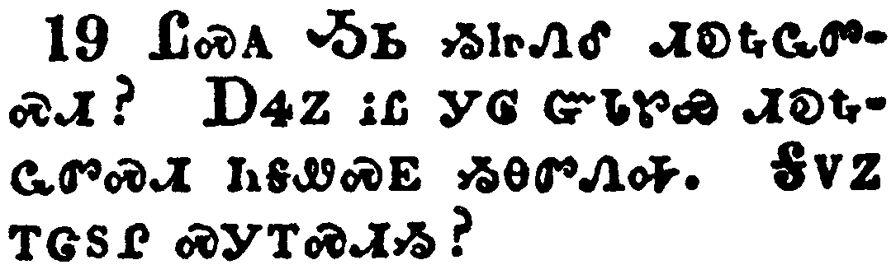</a></td>
</tr>
<tr class="even">
<td>Did not Moses give you the law, and yet none of you keepeth the law? Why go ye about to kill me?</td>
</tr>
<tr class="odd">
<td>ᏝᏍᎪ ᎼᏏ ᏱᏥᏁᎴ ᏗᎧᎿᎭᏩᏛᏍᏗ? ᎠᏎᏃ ᎥᏝ ᎩᎶ ᏳᏓᏑᏯ ᏗᎧᎿᎭᏩᏛᏍᏗ ᏂᎦᏪᏍᎬ ᏱᎾᏛᏁᎭ. ᎦᏙᏃ ᎢᏣᏚᎵ ᏍᎩᎢᏍᏗᏱ?</td>
</tr>
<tr class="even">
<td>Tla-s-go Mo-si yi-tsi-ne-le di-ka-hna-wa-dv-s-di? A-se-no v-tla gi-lo yu-da-su-ya di-ka-hna-wa-dv-s-di ni-ga-we-s-gv yi-na-dv-ne-ha. Ga-do-no i-tsa-du-li s-gi-i-s-di-yi?</td>
</tr>
</tbody>
</table>

<table>
<tbody>
<tr class="odd">
<td><a href="040720.png">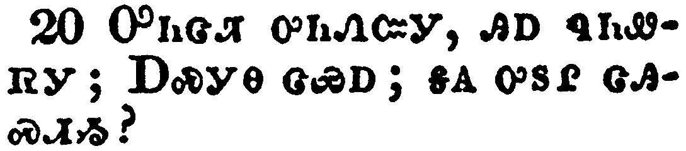</a></td>
</tr>
<tr class="even">
<td>The people answered and said, Thou hast a devil: who goeth about to kill thee?</td>
</tr>
<tr class="odd">
<td>ᎤᏂᏣᏘ ᎤᏂᏁᏨᎩ, ᎯᎠ ᏄᏂᏪᏒᎩ; ᎠᏍᎩᎾ ᏣᏯᎠ; ᎦᎪ ᎤᏚᎵ ᏣᎯᏍᏗᏱ?</td>
</tr>
<tr class="even">
<td>U-ni-tsa-ti u-ni-ne-tsv-gi, hi-a nu-ni-we-sv-gi; A-s-gi-na tsa-ya-a; ga-go u-du-li tsa-hi-s-di-yi?</td>
</tr>
</tbody>
</table>

<table>
<tbody>
<tr class="odd">
<td><a href="040721.png">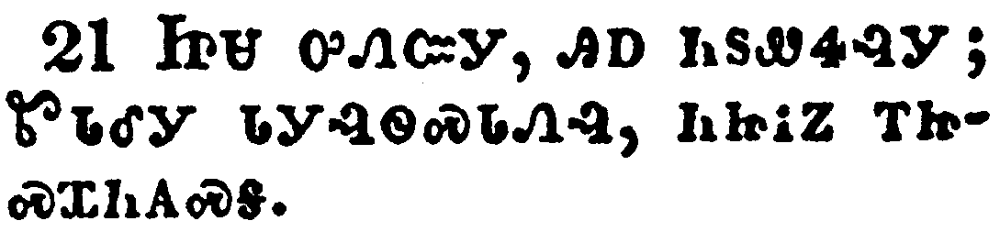</a></td>
</tr>
<tr class="even">
<td>Jesus answered and said unto them, I have done one work, and ye all marvel.</td>
</tr>
<tr class="odd">
<td>ᏥᏌ ᎤᏁᏨᎩ, ᎯᎠ ᏂᏚᏪᏎᎸᎩ; ᏑᏓᎴᎩ ᏓᎩᎸᏫᏍᏓᏁᎸ, ᏂᏥᎥᏃ ᎢᏥᏍᏆᏂᎪᏍᎦ.</td>
</tr>
<tr class="even">
<td>Tsi-sa u-ne-tsv-gi, hi-a ni-du-we-se-lv-gi; Su-da-le-gi da-gi-lv-wi-s-da-ne-lv, ni-tsi-v-no i-tsi-s-qua-ni-go-s-ga.</td>
</tr>
</tbody>
</table>

<table>
<tbody>
<tr class="odd">
<td><a href="040722.png">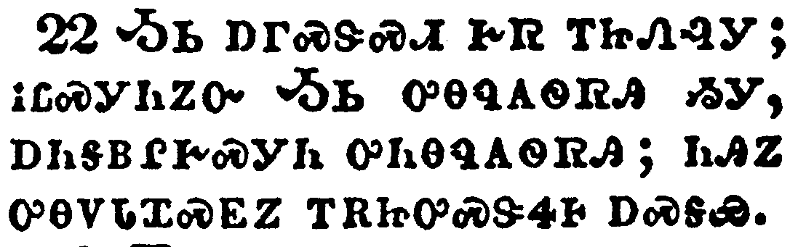</a></td>
</tr>
<tr class="even">
<td>Moses therefore gave unto you circumcision; (not because it is of Moses, but of the fathers;) and ye on the sabbath day circumcise a man.</td>
</tr>
<tr class="odd">
<td>ᎼᏏ ᎠᎱᏍᏕᏍᏗ ᎨᏒ ᎢᏥᏁᎸᎩ; ᎥᏝᏍᎩᏂᏃᏅ ᎼᏏ ᎤᎾᏄᎪᏫᏒᎯ ᏱᎩ, ᎠᏂᎦᏴᎵᎨᏍᎩᏂ ᎤᏂᎾᏄᎪᏫᏒᎯ; ᏂᎯᏃ ᎤᎾᏙᏓᏆᏍᎬᏃ ᎢᎡᏥᎤᏍᏕᏎᎰ ᎠᏍᎦᏯ.</td>
</tr>
<tr class="even">
<td>Mo-si a-hu-s-de-s-di ge-sv i-tsi-ne-lv-gi; v-tla-s-gi-ni-no-nv Mo-si u-na-nu-go-wi-sv-hi yi-gi, a-ni-ga-yv-li-ge-s-gi-ni u-ni-na-nu-go-wi-sv-hi; ni-hi-no u-na-do-da-qua-s-gv-no i-e-tsi-u-s-de-se-ho a-s-ga-ya.</td>
</tr>
</tbody>
</table>

<table>
<tbody>
<tr class="odd">
<td><a href="040723.png">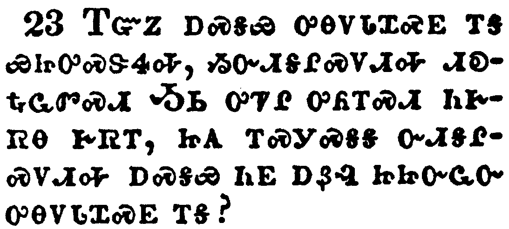</a></td>
</tr>
<tr class="even">
<td>If a man on the sabbath day receive circumcision, that the law of Moses should not be broken; are ye angry at me, because I have made a man every whit whole on the sabbath day?</td>
</tr>
<tr class="odd">
<td>ᎢᏳᏃ ᎠᏍᎦᏯ ᎤᎾᏙᏓᏆᏍᎬ ᎢᎦ ᏯᏥᎤᏍᏕᏎᎭ, ᏱᏅᏗᎦᎵᏍᏙᏗᎭ ᏗᎧᎿᎭᏩᏛᏍᏗ ᎼᏏ ᎤᏤᎵ ᎤᏲᎢᏍᏗ ᏂᎨᏒᎾ ᎨᏒᎢ, ᏥᎪ ᎢᏍᎩᏍᎦᎦ ᏅᏗᎦᎵᏍᏙᏗᎭ ᎠᏍᎦᏯ ᏂᎬ ᎠᏰᎸ ᏥᏥᏅᏩᏅ ᎤᎾᏙᏓᏆᏍᎬ ᎢᎦ?</td>
</tr>
<tr class="even">
<td>I-yu-no a-s-ga-ya u-na-do-da-qua-s-gv i-ga ya-tsi-u-s-de-se-ha, yi-nv-di-ga-li-s-do-di-ha di-ka-hna-wa-dv-s-di Mo-si u-tse-li u-yo-i-s-di ni-ge-sv-na ge-sv-i, tsi-go i-s-gi-s-ga-ga nv-di-ga-li-s-do-di-ha a-s-ga-ya ni-gv a-ye-lv tsi-tsi-nv-wa-nv u-na-do-da-qua-s-gv i-ga?</td>
</tr>
</tbody>
</table>

<table>
<tbody>
<tr class="odd">
<td><a href="040724.png">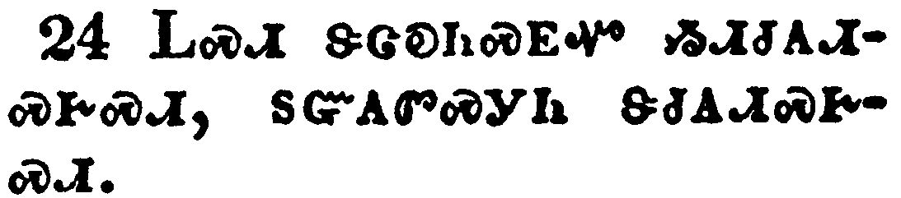</a></td>
</tr>
<tr class="even">
<td>Judge not according to the appearance, but judge righteous judgment.</td>
</tr>
<tr class="odd">
<td>ᏞᏍᏗ ᏕᏣᎧᏂᏍᎬᏉ ᏱᏗᏧᎪᏗᏍᎨᏍᏗ, ᏚᏳᎪᏛᏍᎩᏂ ᏕᏧᎪᏗᏍᎨᏍᏗ.</td>
</tr>
<tr class="even">
<td>Tle-s-di de-tsa-ka-ni-s-gv-quo yi-di-tsu-go-di-s-ge-s-di, du-yu-go-dv-s-gi-ni de-tsu-go-di-s-ge-s-di.</td>
</tr>
</tbody>
</table>

<table>
<tbody>
<tr class="odd">
<td><a href="040725.png">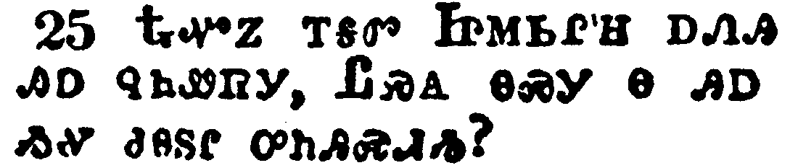</a></td>
</tr>
<tr class="even">
<td>Then said some of them of Jerusalem, Is not this he, whom they seek to kill?</td>
</tr>
<tr class="odd">
<td>ᎿᎭᏉᏃ ᎢᎦᏛ ᏥᎷᏏᎵᎻ ᎠᏁᎯ ᎯᎠ ᏄᏂᏪᏒᎩ, ᏝᏍᎪ ᎾᏍᎩ Ꮎ ᎯᎠ ᏱᎩ ᏧᎾᏚᎵ ᎤᏂᎯᏍᏗᏱ?</td>
</tr>
<tr class="even">
<td>Hna-quo-no i-ga-dv Tsi-lu-si-li-mi a-ne-hi hi-a nu-ni-we-sv-gi, Tla-s-go na-s-gi na hi-a yi-gi tsu-na-du-li u-ni-hi-s-di-yi?</td>
</tr>
</tbody>
</table>

<table>
<tbody>
<tr class="odd">
<td><a href="040726.png">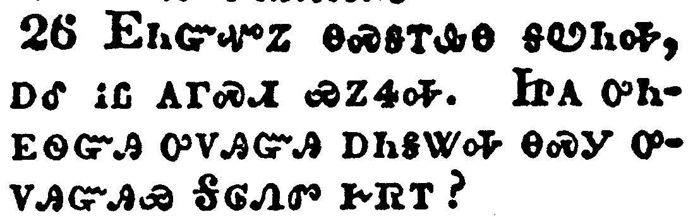</a></td>
</tr>
<tr class="even">
<td>But, lo, he speaketh boldly, and they say nothing unto him. Do the rulers know indeed that this is the very Christ?</td>
</tr>
<tr class="odd">
<td>ᎬᏂᏳᏉᏃ ᎾᏍᎦᎢᎲᎾ ᎦᏬᏂᎭ, ᎠᎴ ᎥᏝ ᎪᎱᏍᏗ ᏯᏃᏎᎭ. ᏥᏌ ᎤᏂᎬᏫᏳᎯ ᎤᏙᎯᏳᎯ ᎠᏂᎦᏔᎭ ᎾᏍᎩ ᎤᏙᎯᏳᎯᏯ ᎦᎶᏁᏛ ᎨᏒᎢ?</td>
</tr>
<tr class="even">
<td>Gv-ni-yu-quo-no na-s-ga-i-hv-na ga-wo-ni-ha, a-le v-tla go-hu-s-di ya-no-se-ha. Tsi-sa u-ni-gv-wi-yu-hi u-do-hi-yu-hi a-ni-ga-ta-ha na-s-gi u-do-hi-yu-hi-ya Ga-lo-ne-dv ge-sv-i?</td>
</tr>
</tbody>
</table>

<table>
<tbody>
<tr class="odd">
<td><a href="040727.png">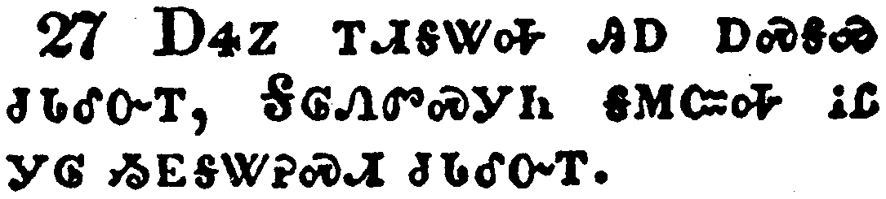</a></td>
</tr>
<tr class="even">
<td>Howbeit we know this man whence he is: but when Christ cometh, no man knoweth whence he is.</td>
</tr>
<tr class="odd">
<td>ᎠᏎᏃ ᎢᏗᎦᏔᎭ ᎯᎠ ᎠᏍᎦᏯ ᏧᏓᎴᏅᎢ, ᎦᎶᏁᏛᏍᎩᏂ ᎦᎷᏨᎭ ᎥᏝ ᎩᎶ ᏱᎬᎦᏔᎮᏍᏗ ᏧᏓᎴᏅᎢ.</td>
</tr>
<tr class="even">
<td>A-se-no i-di-ga-ta-ha hi-a a-s-ga-ya tsu-da-le-nv-i, Ga-lo-ne-dv-s-gi-ni ga-lu-tsv-ha v-tla gi-lo yi-gv-ga-ta-he-s-di tsu-da-le-nv-i.</td>
</tr>
</tbody>
</table>

<table>
<tbody>
<tr class="odd">
<td><a href="040728.png">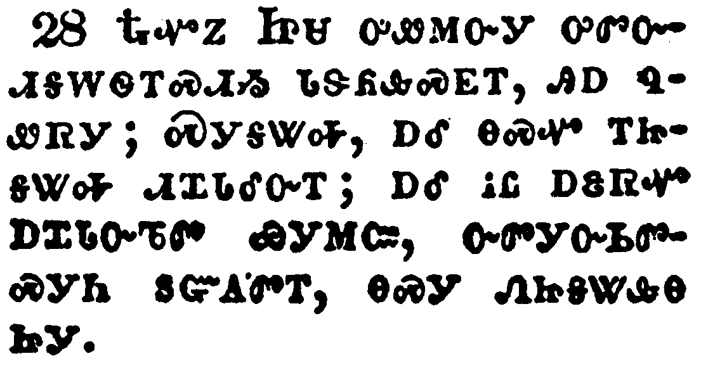</a></td>
</tr>
<tr class="even">
<td>Then cried Jesus in the temple as he taught, saying, Ye both know me, and ye know whence I am: and I am not come of myself, but he that sent me is true, whom ye know not.</td>
</tr>
<tr class="odd">
<td>ᎿᎭᏉᏃ ᏥᏌ ᎤᏪᎷᏅᎩ ᎤᏛᏅᏗᎦᎳᏫᎢᏍᏗᏱ ᏓᏕᏲᎲᏍᎬᎢ, ᎯᎠ ᏄᏪᏒᎩ; ᏍᎩᎦᏔᎭ, ᎠᎴ ᎾᏍᏉ ᎢᏥᎦᏔᎭ ᏗᏆᏓᎴᏅᎢ; ᎠᎴ ᎥᏝ ᎠᏋᏒᏉ ᎠᏆᏓᏅᏖᏛ ᏯᎩᎷᏨ, ᏅᏛᎩᏅᏏᏛᏍᎩᏂ ᏚᏳᎪᏛᎢ, ᎾᏍᎩ ᏁᏥᎦᏔᎲᎾ ᏥᎩ.</td>
</tr>
<tr class="even">
<td>Hna-quo-no Tsi-sa u-we-lu-nv-gi u-dv-nv-di-ga-la-wi-i-s-di-yi da-de-yo-hv-s-gv-i, hi-a nu-we-sv-gi; S-gi-ga-ta-ha, a-le na-s-quo i-tsi-ga-ta-ha di-qua-da-le-nv-i; a-le v-tla a-quv-sv-quo a-qua-da-nv-te-dv ya-gi-lu-tsv, nv-dv-gi-nv-si-dv-s-gi-ni du-yu-go-dv-i, na-s-gi ne-tsi-ga-ta-hv-na tsi-gi.</td>
</tr>
</tbody>
</table>

<table>
<tbody>
<tr class="odd">
<td><a href="040729.png">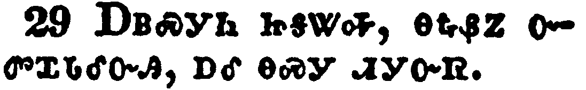</a></td>
</tr>
<tr class="even">
<td>But I know him: for I am from him, and he hath sent me.</td>
</tr>
<tr class="odd">
<td>ᎠᏴᏍᎩᏂ ᏥᎦᏔᎭ, ᎾᎿᎭᏰᏃ ᏅᏛᏆᏓᎴᏅᎯ, ᎠᎴ ᎾᏍᎩ ᏗᎩᏅᏒ.</td>
</tr>
<tr class="even">
<td>A-yv-s-gi-ni tsi-ga-ta-ha, na-hna-ye-no nv-dv-qua-da-le-nv-hi, a-le na-s-gi di-gi-nv-sv.</td>
</tr>
</tbody>
</table>

<table>
<tbody>
<tr class="odd">
<td><a href="040730.png">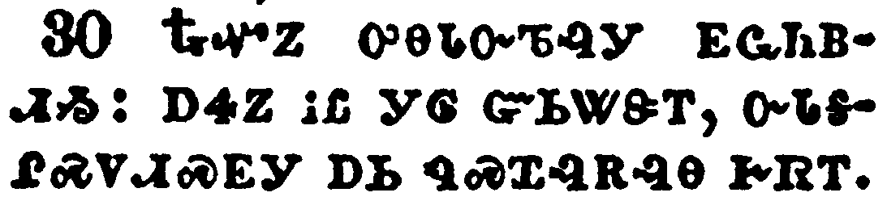</a></td>
</tr>
<tr class="even">
<td>Then they sought to take him: but no man laid hands on him, because his hour was not yet come.</td>
</tr>
<tr class="odd">
<td>ᎿᎭᏉᏃ ᎤᎾᏓᏅᏖᎸᎩ ᎬᏩᏂᏴᏗᏱ: ᎠᏎᏃ ᎥᏝ ᎩᎶ ᏳᏏᏔᏕᎢ, ᏅᏓᎦᎵᏍᏙᏗᏍᎬᎩ ᎠᏏ ᏄᏍᏆᎸᎡᎸᎾ ᎨᏒᎢ.</td>
</tr>
<tr class="even">
<td>Hna-quo-no u-na-da-nv-te-lv-gi gv-wa-ni-yv-di-yi: a-se-no v-tla gi-lo yu-si-ta-de-i, nv-da-ga-li-s-do-di-s-gv-gi a-si nu-s-qua-lv-e-lv-na ge-sv-i.</td>
</tr>
</tbody>
</table>

<table>
<tbody>
<tr class="odd">
<td><a href="040731.png">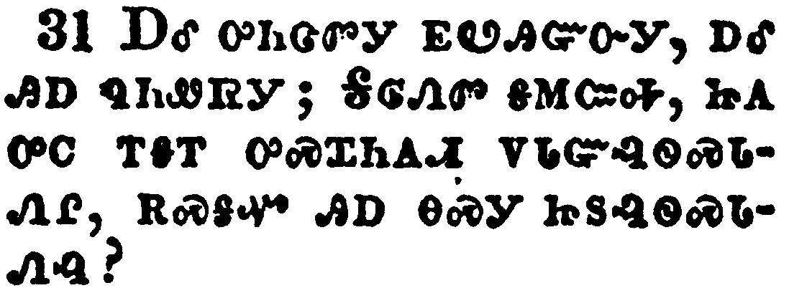</a></td>
</tr>
<tr class="even">
<td>And many of the people believed on him, and said, When Christ cometh, will he do more miracles than these which this man hath done?</td>
</tr>
<tr class="odd">
<td>ᎠᎴ ᎤᏂᏣᏛᎩ ᎬᏬᎯᏳᏅᎩ, ᎠᎴ ᎯᎠ ᏄᏂᏪᏒᎩ; ᎦᎶᏁᏛ ᎦᎷᏨᎭ, ᏥᎪ ᎤᏟ ᎢᎦᎢ ᎤᏍᏆᏂᎪᏗ ᏙᏓᏳᎸᏫᏍᏓᏁᎵ, ᎡᏍᎦᏉ ᎯᎠ ᎾᏍᎩ ᏥᏚᎸᏫᏍᏓᏁᎸ?</td>
</tr>
<tr class="even">
<td>A-le u-ni-tsa-dv-gi gv-wo-hi-yu-nv-gi, a-le hi-a nu-ni-we-sv-gi; Ga-lo-ne-dv ga-lu-tsv-ha, tsi-go u-tli i-ga-i u-s-qua-ni-go-di do-da-yu-lv-wi-s-da-ne-li, e-s-ga-quo hi-a na-s-gi tsi-du-lv-wi-s-da-ne-lv?</td>
</tr>
</tbody>
</table>

<table>
<tbody>
<tr class="odd">
<td><a href="040732.png">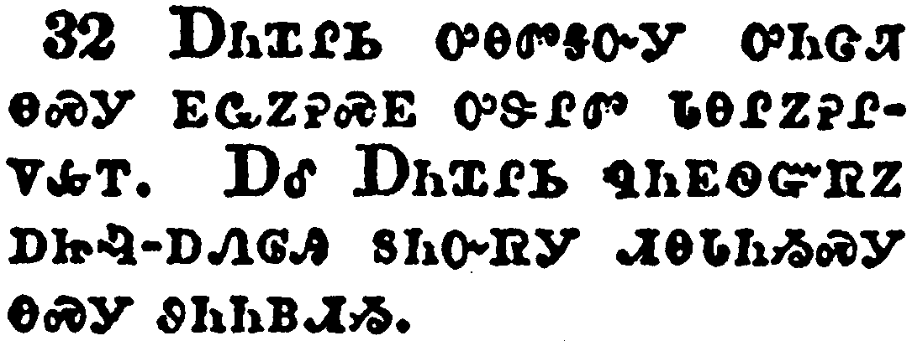</a></td>
</tr>
<tr class="even">
<td>The Pharisees heard that the people murmured such things concerning him; and the Pharisees and the chief priests sent officers to take him.</td>
</tr>
<tr class="odd">
<td>ᎠᏂᏆᎵᏏ ᎤᎾᏛᎦᏅᎩ ᎤᏂᏣᏘ ᎾᏍᎩ ᎬᏩᏃᎮᏍᎬ ᎤᏕᎵᏛ ᏓᎾᎵᏃᎮᎵᏙᎲᎢ. ᎠᎴ ᎠᏂᏆᎵᏏ ᏄᏂᎬᏫᏳᏒᏃ ᎠᏥᎸ-ᎠᏁᎶᎯ ᏚᏂᏅᏒᎩ ᏗᎾᏓᏂᏱᏍᎩ ᎾᏍᎩ ᏭᏂᏂᏴᏗᏱ.</td>
</tr>
<tr class="even">
<td>A-ni-qua-li-si u-na-dv-ga-nv-gi u-ni-tsa-ti na-s-gi gv-wa-no-he-s-gv u-de-li-dv da-na-li-no-he-li-do-hv-i. A-le A-ni-qua-li-si nu-ni-gv-wi-yu-sv-no a-tsi-lv--a-ne-lo-hi du-ni-nv-sv-gi di-na-da-ni-yi-s-gi na-s-gi wu-ni-ni-yv-di-yi.</td>
</tr>
</tbody>
</table>

<table>
<tbody>
<tr class="odd">
<td><a href="040733.png">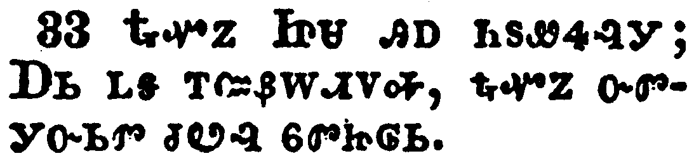</a></td>
</tr>
<tr class="even">
<td>Then said Jesus unto them, Yet a little while am I with you, and then I go unto him that sent me.</td>
</tr>
<tr class="odd">
<td>ᎿᎭᏉᏃ ᏥᏌ ᎯᎠ ᏂᏚᏪᏎᎸᎩ; ᎠᏏ ᏞᎦ ᎢᏨᏰᎳᏗᏙᎭ, ᎿᎭᏉᏃ ᏅᏛᎩᏅᏏᏛ ᏧᏬᎸ ᏮᏛᏥᎶᏏ.</td>
</tr>
<tr class="even">
<td>Hna-quo-no Tsi-sa hi-a ni-du-we-se-lv-gi; A-si tle-ga i-tsv-ye-la-di-do-ha, hna-quo-no nv-dv-gi-nv-si-dv tsu-wo-lv wv-dv-tsi-lo-si.</td>
</tr>
</tbody>
</table>

<table>
<tbody>
<tr class="odd">
<td><a href="040734.png">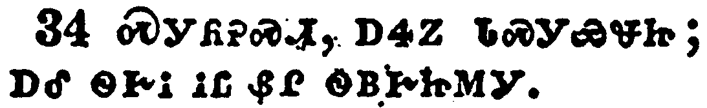</a></td>
</tr>
<tr class="even">
<td>Ye shall seek me, and shall not find me: and where I am, thither ye cannot come.</td>
</tr>
<tr class="odd">
<td>ᏍᎩᏲᎮᏍᏗ, ᎠᏎᏃ ᏓᏍᎩᏯᏠᏥ; ᎠᎴ ᏫᎨᎥ ᎥᏝ ᏰᎵ ᏫᏴᎨᏥᎷᎩ.</td>
</tr>
<tr class="even">
<td>S-gi-yo-he-s-di, a-se-no da-s-gi-ya-tlo-tsi; a-le wi-ge-v v-tla ye-li wi-yv-ge-tsi-lu-gi.</td>
</tr>
</tbody>
</table>

<table>
<tbody>
<tr class="odd">
<td><a href="040735.png">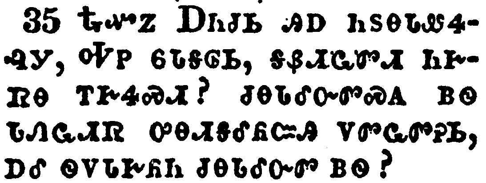</a></td>
</tr>
<tr class="even">
<td>Then said the Jews among themselves, Whither will he go, that we shall not find him? will he go unto the dispersed among the Gentiles, and teach the Gentiles?</td>
</tr>
<tr class="odd">
<td>ᎿᎭᏉᏃ ᎠᏂᏧᏏ ᎯᎠ ᏂᏚᎾᏓᏪᏎᎸᎩ, ᎭᏢ ᏮᏓᎦᎶᏏ, ᎦᏰᏗᏩᏛᏗ ᏂᎨᏒᎾ ᎢᎨᏎᏍᏗ? ᏧᎾᏓᎴᏅᏛᏍᎪ ᏴᏫ ᏓᏁᏩᏗᏒ ᎤᎾᏗᎦᎴᏲᏨᎯ ᏙᏛᏩᏛᎮᏏ, ᎠᎴ ᏫᏙᏓᎨᏲᏂ ᏧᎾᏓᎴᏅᏛ ᏴᏫ?</td>
</tr>
<tr class="even">
<td>Hna-quo-no A-ni-tsu-si hi-a ni-du-na-da-we-se-lv-gi, Ha-tlv wv-da-ga-lo-si, ga-ye-di-wa-dv-di ni-ge-sv-na i-ge-se-s-di? tsu-na-da-le-nv-dv-s-go yv-wi da-ne-wa-di-sv u-na-di-ga-le-yo-tsv-hi do-dv-wa-dv-he-si, a-le wi-do-da-ge-yo-ni tsu-na-da-le-nv-dv yv-wi?</td>
</tr>
</tbody>
</table>

<table>
<tbody>
<tr class="odd">
<td><a href="040736.png">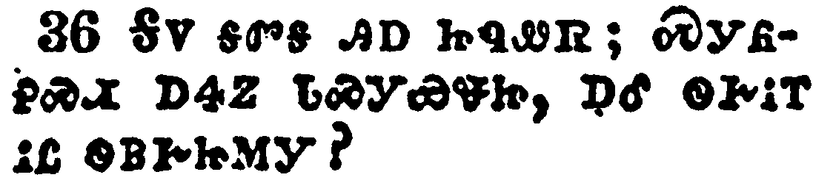</a></td>
</tr>
<tr class="even">
<td>What manner of saying is this that he said, Ye shall seek me, and shall not find me: and where I am, thither ye cannot come?</td>
</tr>
<tr class="odd">
<td>ᎦᏙ ᎦᏛᎦ ᎯᎠ ᏥᏄᏪᏒ; ᏍᎩᏲᎮᏍᏗ ᎠᏎᏃ ᏓᏍᎩᏯᏠᏥ, ᎠᎴ ᏫᎨᎥᎢ ᎥᏝ ᏫᏴᎨᏥᎷᎩ?</td>
</tr>
<tr class="even">
<td>Ga-do ga-dv-ga hi-a tsi-nu-we-sv; S-gi-yo-he-s-di a-se-no da-s-gi-ya-tlo-tsi, a-le wi-ge-v-i v-tla wi-yv-ge-tsi-lu-gi?</td>
</tr>
</tbody>
</table>

<table>
<tbody>
<tr class="odd">
<td><a href="040737.png">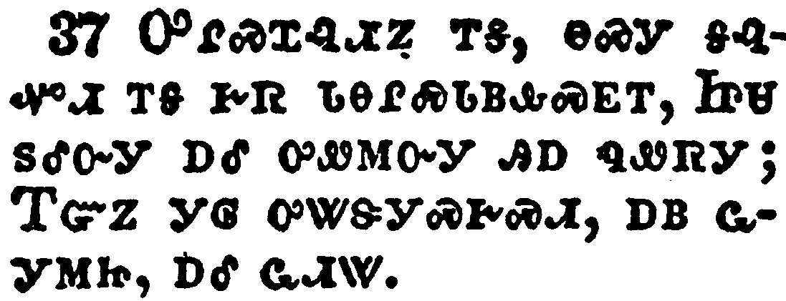</a></td>
</tr>
<tr class="even">
<td>In the last day, that great day of the feast, Jesus stood and cried, saying, If any man thirst, let him come unto me, and drink.</td>
</tr>
<tr class="odd">
<td>ᎤᎵᏍᏆᎸᏗᏃ ᎢᎦ, ᎾᏍᎩ ᎦᎸᏉᏗ ᎢᎦ ᎨᏒ ᏓᎾᎵᏍᏓᏴᎲᏍᎬᎢ, ᏥᏌ ᏚᎴᏅᎩ ᎠᎴ ᎤᏪᎷᏅᎩ ᎯᎠ ᏄᏪᏒᎩ; ᎢᏳᏃ ᎩᎶ ᎤᏔᏕᎩᏍᎨᏍᏗ, ᎠᏴ ᏩᎩᎷᏥ, ᎠᎴ ᏩᏗᏔ.</td>
</tr>
<tr class="even">
<td>U-li-s-qua-lv-di-no i-ga, na-s-gi ga-lv-quo-di i-ga ge-sv da-na-li-s-da-yv-hv-s-gv-i, Tsi-sa du-le-nv-gi a-le u-we-lu-nv-gi hi-a nu-we-sv-gi; I-yu-no gi-lo u-ta-de-gi-s-ge-s-di, a-yv wa-gi-lu-tsi, a-le wa-di-ta.</td>
</tr>
</tbody>
</table>

<table>
<tbody>
<tr class="odd">
<td><a href="040738.png">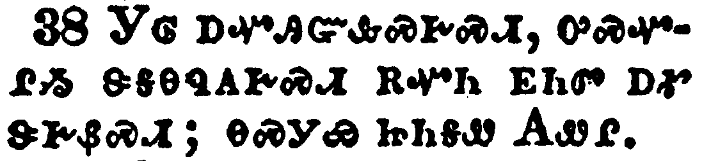</a></td>
</tr>
<tr class="even">
<td>He that believeth on me, as the scripture hath said, out of his belly shall flow rivers of living water.</td>
</tr>
<tr class="odd">
<td>ᎩᎶ ᎠᏉᎯᏳᎲᏍᎨᏍᏗ, ᎤᏍᏉᎵᏱ ᏕᎦᎾᏄᎪᎨᏍᏗ ᎡᏉᏂ ᎬᏂᏛ ᎠᎹ ᏕᎨᏰᏍᏗ; ᎾᏍᎩᏯ ᏥᏂᎦᏪ ᎪᏪᎵ.</td>
</tr>
<tr class="even">
<td>Gi-lo a-quo-hi-yu-hv-s-ge-s-di, u-s-quo-li-yi de-ga-na-nu-go-ge-s-di e-quo-ni gv-ni-dv a-ma de-ge-ye-s-di; na-s-gi-ya tsi-ni-ga-we Go-we-li.</td>
</tr>
</tbody>
</table>

<table>
<tbody>
<tr class="odd">
<td><a href="040739.png">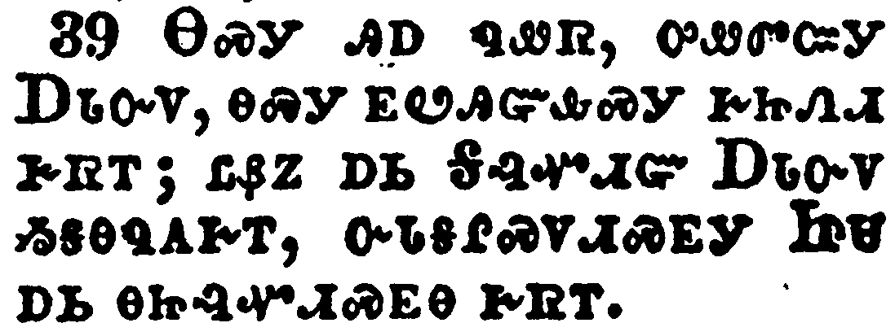</a></td>
</tr>
<tr class="even">
<td>(But this spake he of the Spirit, which they that believe on him should receive: for the Holy Ghost was not yet given; because that Jesus was not yet glorified.)</td>
</tr>
<tr class="odd">
<td>ᎾᏍᎩ ᎯᎠ ᏄᏪᏒ, ᎤᏪᏛᏨᎩ ᎠᏓᏅᏙ, ᎾᏍᎩ ᎬᏬᎯᏳᎲᏍᎩ ᎨᏥᏁᏗ ᎨᏒᎢ; ᏝᏰᏃ ᎠᏏ ᎦᎸᏉᏗᏳ ᎠᏓᏅᏙ ᏱᎦᎾᏄᎪᎨᎢ, ᏅᏓᎦᎵᏍᏙᏗᏍᎬᎩ ᏥᏌ ᎠᏏ ᎾᏥᎸᏉᏗᏍᎬᎾ ᎨᏒᎢ.</td>
</tr>
<tr class="even">
<td>Na-s-gi hi-a nu-we-sv, u-we-dv-tsv-gi A-da-nv-do, na-s-gi gv-wo-hi-yu-hv-s-gi ge-tsi-ne-di ge-sv-i; tla-ye-no a-si Ga-lv-quo-di-yu A-da-nv-do yi-ga-na-nu-go-ge-i, nv-da-ga-li-s-do-di-s-gv-gi Tsi-sa a-si na-tsi-lv-quo-di-s-gv-na ge-sv-i.</td>
</tr>
</tbody>
</table>

<table>
<tbody>
<tr class="odd">
<td><a href="040740.png">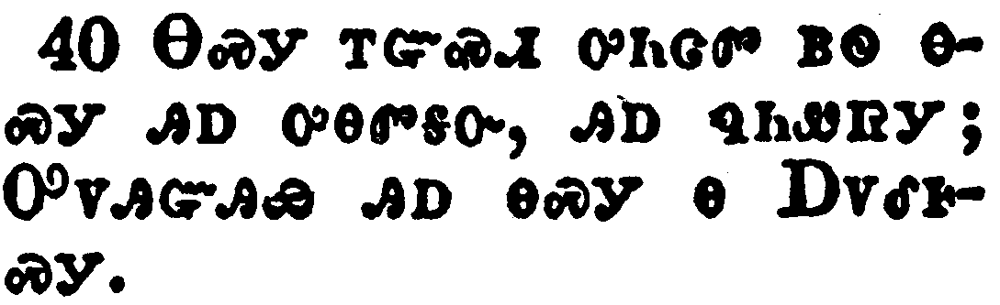</a></td>
</tr>
<tr class="even">
<td>Many of the people therefore, when they heard this saying, said, Of a truth this is the Prophet.</td>
</tr>
<tr class="odd">
<td>ᎾᏍᎩ ᎢᏳᏍᏗ ᎤᏂᏣᏛ ᏴᏫ ᎾᏍᎩ ᎯᎠ ᎤᎾᏛᎦᏅ, ᎯᎠ ᏄᏂᏪᏒᎩ; ᎤᏙᎯᏳᎯᏯ ᎯᎠ ᎾᏍᎩ Ꮎ ᎠᏙᎴᎰᏍᎩ.</td>
</tr>
<tr class="even">
<td>Na-s-gi i-yu-s-di u-ni-tsa-dv yv-wi na-s-gi hi-a u-na-dv-ga-nv, hi-a nu-ni-we-sv-gi; U-do-hi-yu-hi-ya hi-a na-s-gi na A-do-le-ho-s-gi.</td>
</tr>
</tbody>
</table>

<table>
<tbody>
<tr class="odd">
<td><a href="040741.png">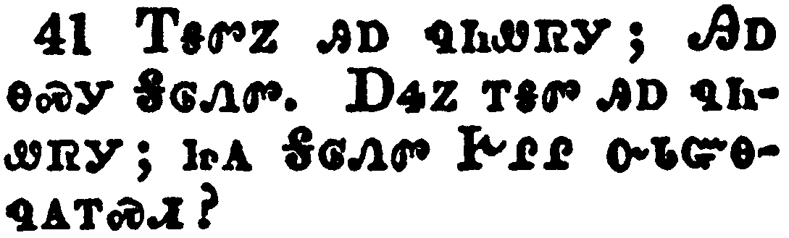</a></td>
</tr>
<tr class="even">
<td>Others said, This is the Christ. But some said, Shall Christ come out of Galilee?</td>
</tr>
<tr class="odd">
<td>ᎢᎦᏛᏃ ᎯᎠ ᏄᏂᏪᏒᎩ; ᎯᎠ ᎾᏍᎩ ᎦᎶᏁᏛ. ᎠᏎᏃ ᎢᎦᏛ ᎯᎠ ᏄᏂᏪᏒᎩ; ᏥᎪ ᎦᎶᏁᏛ ᎨᎵᎵ ᏅᏓᏳᎾᏄᎪᎢᏍᏗ?</td>
</tr>
<tr class="even">
<td>I-ga-dv-no hi-a nu-ni-we-sv-gi; Hi-a na-s-gi Ga-lo-ne-dv. A-se-no i-ga-dv hi-a nu-ni-we-sv-gi; tsi-go Ga-lo-ne-dv Ge-li-li nv-da-yu-na-nu-go-i-s-di?</td>
</tr>
</tbody>
</table>

<table>
<tbody>
<tr class="odd">
<td><a href="040742.png">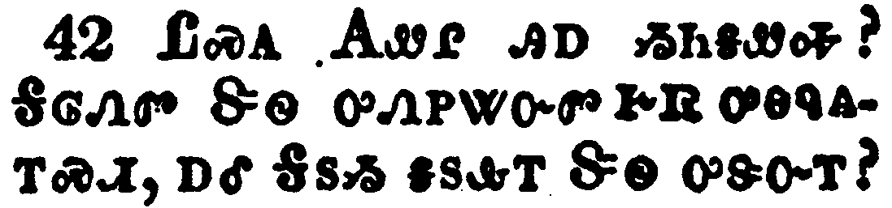</a></td>
</tr>
<tr class="even">
<td>Hath not the scripture said, That Christ cometh of the seed of David, and out of the town of Bethlehem, where David was?</td>
</tr>
<tr class="odd">
<td>ᏝᏍᎪ ᎪᏪᎵ ᎯᎠ ᏱᏂᎦᏪᎭ? ᎦᎶᏁᏛ ᏕᏫ ᎤᏁᏢᏔᏅᏛ ᎨᏒ ᎤᎾᏄᎪᎢᏍᏗ, ᎠᎴ ᎦᏚᏱ ᎦᏚᎲᎢ ᏕᏫ ᎤᏕᏅᎢ?</td>
</tr>
<tr class="even">
<td>Tla-s-go Go-we-li hi-a yi-ni-ga-we-ha? Ga-lo-ne-dv De-wi u-ne-tlv-ta-nv-dv ge-sv u-na-nu-go-i-s-di, a-le Ga-du-yi ga-du-hv-i De-wi u-de-nv-i?</td>
</tr>
</tbody>
</table>

<table>
<tbody>
<tr class="odd">
<td><a href="040743.png">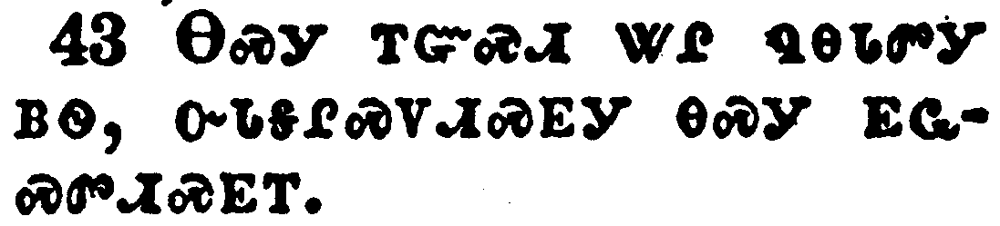</a></td>
</tr>
<tr class="even">
<td>So there was a division among the people because of him.</td>
</tr>
<tr class="odd">
<td>ᎾᏍᎩ ᎢᏳᏍᏗ ᏔᎵ ᏄᎾᏓᏛᎩ ᏴᏫ, ᏅᏓᎦᎵᏍᏙᏗᏍᎬᎩ ᎾᏍᎩ ᎬᏩᏍᏛᏗᏍᎬᎢ.</td>
</tr>
<tr class="even">
<td>Na-s-gi i-yu-s-di ta-li nu-na-da-dv-gi yv-wi, nv-da-ga-li-s-do-di-s-gv-gi na-s-gi gv-wa-s-dv-di-s-gv-i.</td>
</tr>
</tbody>
</table>

<table>
<tbody>
<tr class="odd">
<td><a href="040744.png">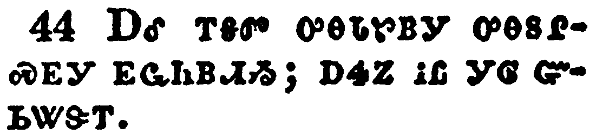</a></td>
</tr>
<tr class="even">
<td>And some of them would have taken him; but no man laid hands on him.</td>
</tr>
<tr class="odd">
<td>ᎠᎴ ᎢᎦᏛ ᎤᎾᏓᏑᏴᎩ ᎤᎾᏚᎵᏍᎬᎩ ᎬᏩᏂᏴᏗᏱ; ᎠᏎᏃ ᎥᏝ ᎩᎶ ᏳᏏᏔᏕᎢ.</td>
</tr>
<tr class="even">
<td>A-le i-ga-dv u-na-da-su-yv-gi u-na-du-li-s-gv-gi gv-wa-ni-yv-di-yi; a-se-no v-tla gi-lo yu-si-ta-de-i.</td>
</tr>
</tbody>
</table>

<table>
<tbody>
<tr class="odd">
<td><a href="040745.png">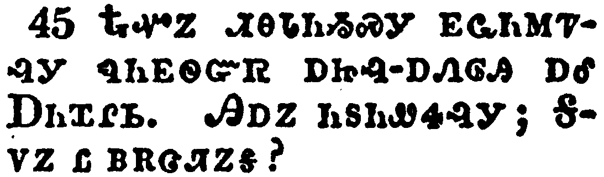</a></td>
</tr>
<tr class="even">
<td>Then came the officers to the chief priests and Pharisees; and they said unto them, Why have ye not brought him?</td>
</tr>
<tr class="odd">
<td>ᎿᎭᏉᏃ ᏗᎾᏓᏂᏱᏍᎩ ᎬᏩᏂᎷᏤᎸᎩ ᏄᏂᎬᏫᏳᏒ ᎠᏥᎸ-ᎠᏁᎶᎯ ᎠᎴ ᎠᏂᏆᎵᏏ. ᎯᎠᏃ ᏂᏚᏂᏪᏎᎸᎩ; ᎦᏙᏃ Ꮭ ᏴᎡᏣᏘᏃᎦ?</td>
</tr>
<tr class="even">
<td>Hna-quo-no di-na-da-ni-yi-s-gi gv-wa-ni-lu-tse-lv-gi nu-ni-gv-wi-yu-sv a-tsi-lv--a-ne-lo-hi a-le A-ni-qua-li-si. Hi-a-no ni-du-ni-we-se-lv-gi; Ga-do-no tla yv-e-tsa-ti-no-ga?</td>
</tr>
</tbody>
</table>

<table>
<tbody>
<tr class="odd">
<td></td>
</tr>
<tr class="even">
<td>The officers answered, Never man spake like this man.</td>
</tr>
<tr class="odd">
<td>ᏗᎾᏓᏂᏱᏍᎩ ᎤᏂᏁᏨ ᎯᎠ ᏄᏂᏪᏒᎩ; ᎥᏝ ᎢᎸᎯᏳ ᎩᎶ ᏱᎬᏩᏬᏂᏐ ᎾᏍᎩᏯ ᎯᎠ ᏂᎦᏪᏍᎬ ᎦᏬᏂᏍᎬᎢ.</td>
</tr>
<tr class="even">
<td>Di-na-da-ni-yi-s-gi u-ni-ne-tsv hi-a nu-ni-we-sv-gi; V-tla i-lv-hi-yu gi-lo yi-gv-wa-wo-ni-so na-s-gi-ya hi-a ni-ga-we-s-gv ga-wo-ni-s-gv-i.</td>
</tr>
</tbody>
</table>

<table>
<tbody>
<tr class="odd">
<td><a href="040747.png">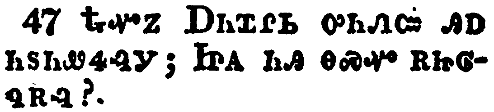</a></td>
</tr>
<tr class="even">
<td>Then answered them the Pharisees, Are ye also deceived?</td>
</tr>
<tr class="odd">
<td>ᎿᎭᏉᏃ ᎠᏂᏆᎵᏏ ᎤᏂᏁᏨ ᎯᎠ ᏂᏚᏂᏪᏎᎸᎩ; ᏥᎪ ᏂᎯ ᎾᏍᏉ ᎡᏥᎶᏄᎡᎸ?</td>
</tr>
<tr class="even">
<td>Hna-quo-no A-ni-qua-li-si u-ni-ne-tsv hi-a ni-du-ni-we-se-lv-gi; Tsi-go ni-hi na-s-quo e-tsi-lo-nu-e-lv?</td>
</tr>
</tbody>
</table>

<table>
<tbody>
<tr class="odd">
<td><a href="040748.png">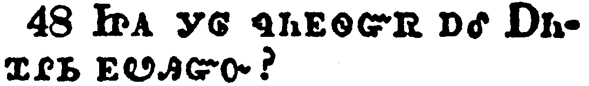</a></td>
</tr>
<tr class="even">
<td>Have any of the rulers or of the Pharisees believed on him?</td>
</tr>
<tr class="odd">
<td>ᏥᎪ ᎩᎶ ᏄᏂᎬᏫᏳᏒ ᎠᎴ ᎠᏂᏆᎵᏏ ᎬᏬᎯᏳᏅ?</td>
</tr>
<tr class="even">
<td>Tsi-go gi-lo nu-ni-gv-wi-yu-sv a-le A-ni-qua-li-si gv-wo-hi-yu-nv?</td>
</tr>
</tbody>
</table>

<table>
<tbody>
<tr class="odd">
<td><a href="040749.png">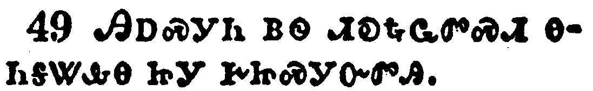</a></td>
</tr>
<tr class="even">
<td>But this people who knoweth not the law are cursed.</td>
</tr>
<tr class="odd">
<td>ᎯᎠᏍᎩᏂ ᏴᏫ ᏗᎧᎿᎭᏩᏛᏍᏗ ᎾᏂᎦᏔᎲᎾ ᏥᎩ ᎨᏥᏍᎩᏅᏛᎯ.</td>
</tr>
<tr class="even">
<td>Hi-a-s-gi-ni yv-wi di-ka-hna-wa-dv-s-di na-ni-ga-ta-hv-na tsi-gi ge-tsi-s-gi-nv-dv-hi.</td>
</tr>
</tbody>
</table>

<table>
<tbody>
<tr class="odd">
<td><a href="040750.png">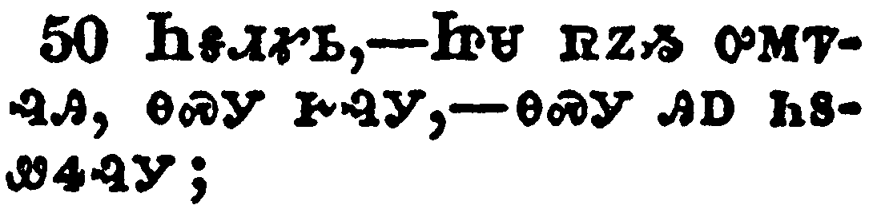</a></td>
</tr>
<tr class="even">
<td>Nicodemus saith unto them, (he that came to Jesus by night, being one of them,)</td>
</tr>
<tr class="odd">
<td>ᏂᎦᏗᎹᏏ,^ᏥᏌ ᏒᏃᏱ ᎤᎷᏤᎸᎯ, ᎾᏍᎩ ᎨᎸᎩ,^ᎾᏍᎩ ᎯᎠ ᏂᏚᏪᏎᎸᎩ;</td>
</tr>
<tr class="even">
<td>Ni-ga-di-ma-si,^Tsi-sa sv-no-yi u-lu-tse-lv-hi, na-s-gi ge-lv-gi,^na-s-gi hi-a ni-du-we-se-lv-gi;</td>
</tr>
</tbody>
</table>

<table>
<tbody>
<tr class="odd">
<td><a href="040751.png">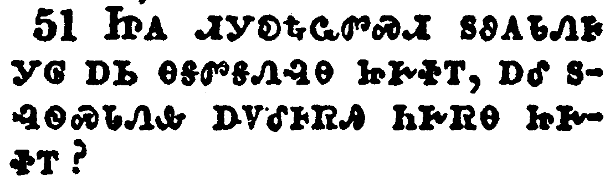</a></td>
</tr>
<tr class="even">
<td>Doth our law judge any man, before it hear him, and know what he doeth?</td>
</tr>
<tr class="odd">
<td>ᏥᎪ ᏗᎩᎧᎿᎭᏩᏛᏍᏗ ᏚᏭᎪᏓᏁᎰ ᎩᎶ ᎠᏏ ᎾᎦᏛᎦᏁᎸᎾ ᏥᎨᏐᎢ, ᎠᎴ ᏚᎸᏫᏍᏓᏁᎲ ᎠᏙᎴᎰᏒᎯ ᏂᎨᏒᎾ ᏥᎨᏐᎢ?</td>
</tr>
<tr class="even">
<td>Tsi-go di-gi-ka-hna-wa-dv-s-di du-wu-go-da-ne-ho gi-lo a-si na-ga-dv-ga-ne-lv-na tsi-ge-so-i, a-le du-lv-wi-s-da-ne-hv a-do-le-ho-sv-hi ni-ge-sv-na tsi-ge-so-i?</td>
</tr>
</tbody>
</table>

<table>
<tbody>
<tr class="odd">
<td><a href="040752.png">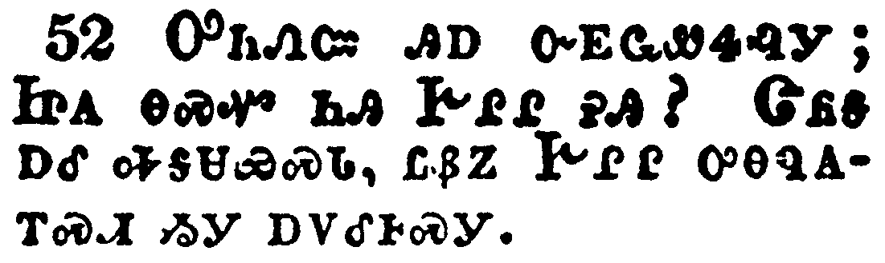</a></td>
</tr>
<tr class="even">
<td>They answered and said unto him, Art thou also of Galilee? Search, and look: for out of Galilee ariseth no prophet.</td>
</tr>
<tr class="odd">
<td>ᎤᏂᏁᏨ ᎯᎠ ᏅᎬᏩᏪᏎᎸᎩ; ᏥᎪ ᎾᏍᏉ ᏂᎯ ᎨᎵᎵ ᎮᎯ? ᏣᏲᎦ ᎠᎴ ᎭᎦᏌᏯᏍᏓ, ᏝᏰᏃ ᎨᎵᎵ ᎤᎾᏄᎪᎢᏍᏗ ᏱᎩ ᎠᏙᎴᎰᏍᎩ.</td>
</tr>
<tr class="even">
<td>U-ni-ne-tsv hi-a nv-gv-wa-we-se-lv-gi; Tsi-go na-s-quo ni-hi Ge-li-li he-hi? Tsa-yo-ga a-le ha-ga-sa-ya-s-da, tla-ye-no Ge-li-li u-na-nu-go-i-s-di yi-gi a-do-le-ho-s-gi.</td>
</tr>
</tbody>
</table>

<table>
<tbody>
<tr class="odd">
<td></td>
</tr>
<tr class="even">
<td>And every man went unto his own house.</td>
</tr>
<tr class="odd">
<td>ᏂᎦᏛᏃ ᏙᏧᏁᏅᏒ ᏫᏙᎤᏂᎶᏒᎩ.</td>
</tr>
<tr class="even">
<td>Ni-ga-dv-no do-tsu-ne-nv-sv wi-do-u-ni-lo-sv-gi.</td>
</tr>
</tbody>
</table>

