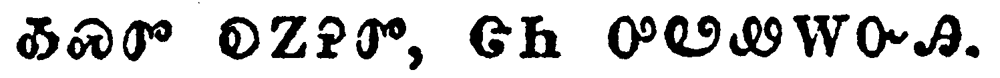

+++
draft=false
date = 2014-12-18T21:11:07Z
title = "John - Chapter 10 - Cherokee New Testament"
weight = 1418955067

[taxonomies]

authors = ["Timothy Legg"]
categories = []
tags = []

[extra]
+++

<table>
<tbody>
<tr class="odd">
<td></td>
</tr>
<tr class="even">
<td>Verily, verily, I say unto you, He that entereth not by the door into the sheepfold, but climbeth up some other way, the same is a thief and a robber.</td>
</tr>
<tr class="odd">
<td>ᎤᏙᎯᏳᎯᏯ, ᎤᏙᎯᏳᎯᏯ ᎯᎠ ᏂᏨᏪᏎᎭ; ᎾᏍᎩ Ꮎ ᎦᎶᎯᏍᏗᏱ ᎠᏴᏍᏗᏍᎩ ᏂᎨᏒᎾ ᎠᏫ ᎤᏂᏃᏕᎾ ᎤᏂᏴᏍᏗᏱ, ᎤᏣᏘᏂᏉᏍᎩᏂ ᎦᎸᏍᏗᏍᎩ, ᎾᏍᎩ ᎦᏃᏍᎩᏍᎩ ᎠᎴ ᎠᏓᎾᏌᎲᏍᎩ.</td>
</tr>
<tr class="even">
<td>U-do-hi-yu-hi-ya, u-do-hi-yu-hi-ya hi-a ni-tsv-we-se-ha; Na-s-gi na ga-lo-hi-s-di-yi a-yv-s-di-s-gi ni-ge-sv-na a-wi u-ni-no-de-na u-ni-yv-s-di-yi, u-tsa-ti-ni-quo-s-gi-ni ga-lv-s-di-s-gi, na-s-gi ga-no-s-gi-s-gi a-le a-da-na-sa-hv-s-gi.</td>
</tr>
</tbody>
</table>

<table>
<tbody>
<tr class="odd">
<td></td>
</tr>
<tr class="even">
<td>But he that entereth in by the door is the shepherd of the sheep.</td>
</tr>
<tr class="odd">
<td>ᎾᏍᎩᏍᎩᏂ Ꮎ ᎦᎶᎯᏍᏗᏱ ᎠᏴᏍᏗᏍᎩ ᎾᏍᎩ ᎠᏫ ᎤᏂᏃᏕᎾ ᏗᎦᏘᏯ.</td>
</tr>
<tr class="even">
<td>Na-s-gi-s-gi-ni na ga-lo-hi-s-di-yi a-yv-s-di-s-gi na-s-gi a-wi u-ni-no-de-na di-ga-ti-ya.</td>
</tr>
</tbody>
</table>

<table>
<tbody>
<tr class="odd">
<td></td>
</tr>
<tr class="even">
<td>To him the porter openeth; and the sheep hear his voice: and he calleth his own sheep by name, and leadeth them out.</td>
</tr>
<tr class="odd">
<td>ᎾᏍᎩ ᎦᎶᎯᏍᏗᏱ ᎠᎦᏘᏯ ᎤᏍᏚᎢᎡᎰᎢ, ᎠᎴ ᎠᏫ ᎠᎾᏛᎩᏍᎪ ᎧᏁᎬᎢ, ᎠᎴ ᏚᎾᏙᎥ ᏓᏯᏂᏍᎪ ᎠᏫ ᏧᏤᎵᎦ, ᎠᎴ ᏓᏘᏂᏒᏍᎩᏂ ᏕᎦᏄᎪᏫᏍᎪᎢ.</td>
</tr>
<tr class="even">
<td>Na-s-gi ga-lo-hi-s-di-yi a-ga-ti-ya u-s-du-i-e-ho-i, a-le a-wi a-na-dv-gi-s-go ka-ne-gv-i, a-le du-na-do-v da-ya-ni-s-go a-wi tsu-tse-li-ga, a-le da-ti-ni-sv-s-gi-ni de-ga-nu-go-wi-s-go-i.</td>
</tr>
</tbody>
</table>

<table>
<tbody>
<tr class="odd">
<td></td>
</tr>
<tr class="even">
<td>And when he putteth forth his own sheep, he goeth before them, and the sheep follow him: for they know his voice.</td>
</tr>
<tr class="odd">
<td>ᏕᎦᏄᎪᏩᏃ ᏧᏤᎵᎦ ᎠᏫ, ᎢᎬᏱ ᏓᎴᏁᎰᎢ, ᎠᎴ ᎠᏫ ᎬᏩᏍᏓᏩᏕᎪᎢ; ᎠᏃᎵᎪᏰᏃ ᎧᏁᎬᎢ;</td>
</tr>
<tr class="even">
<td>De-ga-nu-go-wa-no tsu-tse-li-ga a-wi, i-gv-yi da-le-ne-ho-i, a-le a-wi gv-wa-s-da-wa-de-go-i; a-no-li-go-ye-no ka-ne-gv-i;</td>
</tr>
</tbody>
</table>

<table>
<tbody>
<tr class="odd">
<td></td>
</tr>
<tr class="even">
<td>And a stranger will they not follow, but will flee from him: for they know not the voice of strangers.</td>
</tr>
<tr class="odd">
<td>ᏅᏩᏓᎴᏍᎩᏂ ᎥᏝ ᏴᎬᏂᏍᏓᏩᏚᎦ, ᎠᎾᎵᎡᎰᏉ, ᎥᏝᏰᏃ ᏯᏃᎵᎪ ᏅᏩᎾᏓᎴ ᎠᏂᏁᎬᎢ.</td>
</tr>
<tr class="even">
<td>Nv-wa-da-le-s-gi-ni v-tla yv-gv-ni-s-da-wa-du-ga, a-na-li-e-ho-quo, v-tla-ye-no ya-no-li-go nv-wa-na-da-le a-ni-ne-gv-i.</td>
</tr>
</tbody>
</table>

<table>
<tbody>
<tr class="odd">
<td></td>
</tr>
<tr class="even">
<td>This parable spake Jesus unto them: but they understood not what things they were which he spake unto them.</td>
</tr>
<tr class="odd">
<td>ᎾᏍᎩ ᎯᎠ ᏓᏟᎶᏍᏛ ᏥᏌ ᏚᏬᏁᏔᏅᎩ; ᎠᏎᏃ ᎥᏝ ᏳᏃᎵᏤ ᎾᏍᎩ ᏄᏍᏛ ᏚᏬᏁᏔᏅᎢ.</td>
</tr>
<tr class="even">
<td>Na-s-gi hi-a da-tli-lo-s-dv Tsi-sa du-wo-ne-ta-nv-gi; a-se-no v-tla yu-no-li-tse na-s-gi nu-s-dv du-wo-ne-ta-nv-i.</td>
</tr>
</tbody>
</table>

<table>
<tbody>
<tr class="odd">
<td></td>
</tr>
<tr class="even">
<td>Then said Jesus unto them again, Verily, verily, I say unto you, I am the door of the sheep.</td>
</tr>
<tr class="odd">
<td>ᎿᎭᏉᏃ ᏔᎵᏁ ᏥᏌ ᎯᎠ ᏂᏚᏪᏎᎸᎩ; ᎤᏙᎯᏳᎯᏯ ᎤᏙᎯᏳᎯᏯ ᎯᎠ ᏂᏨᏪᏎᎭ, ᎠᏴ ᎦᎶᎯᏍᏗᏱ ᎠᏫ ᎤᎾᏤᎵᎦ.</td>
</tr>
<tr class="even">
<td>Hna-quo-no ta-li-ne Tsi-sa hi-a ni-du-we-se-lv-gi; U-do-hi-yu-hi-ya u-do-hi-yu-hi-ya hi-a ni-tsv-we-se-ha, A-yv ga-lo-hi-s-di-yi a-wi u-na-tse-li-ga.</td>
</tr>
</tbody>
</table>

<table>
<tbody>
<tr class="odd">
<td></td>
</tr>
<tr class="even">
<td>All that ever came before me are thieves and robbers: but the sheep did not hear them.</td>
</tr>
<tr class="odd">
<td>ᏂᎦᏛ ᎢᎬᏱ ᎤᏂᎷᏨᎯ ᎠᏴ ᎣᏂ, ᎾᏍᎩ ᎠᏂᏃᏍᎩᏍᎩ ᎠᎴ ᎠᎾᏓᎾᏌᎲᏍᎩ. ᎠᏎᏃ ᎠᏫ ᎥᏝ ᏱᎬᏩᎾᏛᎦᏁᎴᎢ.</td>
</tr>
<tr class="even">
<td>Ni-ga-dv i-gv-yi u-ni-lu-tsv-hi a-yv o-ni, na-s-gi a-ni-no-s-gi-s-gi a-le a-na-da-na-sa-hv-s-gi. A-se-no a-wi v-tla yi-gv-wa-na-dv-ga-ne-le-i.</td>
</tr>
</tbody>
</table>

<table>
<tbody>
<tr class="odd">
<td></td>
</tr>
<tr class="even">
<td>I am the door: by me if any man enter in, he shall be saved, and shall go in and out, and find pasture.</td>
</tr>
<tr class="odd">
<td>ᎦᎶᎯᏍᏗᏱ ᎠᏴ; ᎢᏳᏃ ᎩᎶ ᎠᏴ ᎠᎩᏴᏍᏗᏍᎨᏍᏗ, ᎠᏎ ᎠᏥᏍᏕᎸᏗ ᎨᏎᏍᏗ, ᎠᎴ ᎤᏴᏍᏗ ᎠᎴ ᎤᏄᎪᎢᏍᏗ ᎨᏎᏍᏗ, ᎠᎴ ᎤᏩᏛᏗ ᎨᏎᏍᏗ ᎦᏄᎸᏒᎢ.</td>
</tr>
<tr class="even">
<td>Ga-lo-hi-s-di-yi a-yv; I-yu-no gi-lo a-yv a-gi-yv-s-di-s-ge-s-di, a-se a-tsi-s-de-lv-di ge-se-s-di, a-le u-yv-s-di a-le u-nu-go-i-s-di ge-se-s-di, a-le u-wa-dv-di ge-se-s-di ga-nu-lv-sv-i.</td>
</tr>
</tbody>
</table>

<table>
<tbody>
<tr class="odd">
<td></td>
</tr>
<tr class="even">
<td>The thief cometh not, but for to steal, and to kill, and to destroy: I am come that they might have life, and that they might have it more abundantly.</td>
</tr>
<tr class="odd">
<td>ᎦᏃᏍᎩᏍᎩ ᎦᎷᎪᎢ, ᎤᏃᏍᎩᏍᏗᏱᏉ ᎠᎴ ᎤᏓᎯᏍᏗᏱᏉ ᎤᏰᎸᏐᎢ: ᎠᏴ ᎠᎩᎷᏥᎸ, ᎬᏂᏛ ᎤᎾᏤᎵᎦ ᎢᏳᎵᏍᏙᏗᏱ, ᎠᎴ ᎤᏣᏔᏅᎯ ᎤᎾᏤᎵᎦ ᎢᏨᎵᏍᏙᏗᏱ.</td>
</tr>
<tr class="even">
<td>Ga-no-s-gi-s-gi ga-lu-go-i, u-no-s-gi-s-di-yi-quo a-le u-da-hi-s-di-yi-quo u-ye-lv-so-i: A-yv a-gi-lu-tsi-lv, gv-ni-dv u-na-tse-li-ga i-yu-li-s-do-di-yi, a-le u-tsa-ta-nv-hi u-na-tse-li-ga i-tsv-li-s-do-di-yi.</td>
</tr>
</tbody>
</table>

<table>
<tbody>
<tr class="odd">
<td></td>
</tr>
<tr class="even">
<td>I am the good shepherd: the good shepherd giveth his life for the sheep.</td>
</tr>
<tr class="odd">
<td>ᎠᏴ ᎠᏆᏓᏅᏘ ᎠᏫ-ᏗᏥᎦᏘᏯ. ᎤᏓᏅᏘ ᎠᏫ-ᏗᎦᏘᏯ ᎬᏅᎢ ᎡᎳᏗ ᏓᏁᎰ ᎠᏫ.</td>
</tr>
<tr class="even">
<td>A-yv a-qua-da-nv-ti a-wi--di-tsi-ga-ti-ya. U-da-nv-ti a-wi--di-ga-ti-ya gv-nv-i e-la-di da-ne-ho a-wi.</td>
</tr>
</tbody>
</table>

<table>
<tbody>
<tr class="odd">
<td></td>
</tr>
<tr class="even">
<td>But he that is an hireling, and not the shepherd, whose own the sheep are not, seeth the wolf coming, and leaveth the sheep, and fleeth: and the wolf catcheth them, and scattereth the sheep.</td>
</tr>
<tr class="odd">
<td>ᎠᏥᏅᏏᏛᏍᎩᏂ, ᎠᏫ-ᏗᎦᏘᏯ ᏂᎨᏒᎾ, ᎠᎴ ᎠᏫ ᏧᏤᎵᎦ ᏂᎨᏒᎾ, ᏩᏯ ᏣᎢᏒᎢ ᏩᎪᏩᏛ, ᏕᎬᏕᎪ ᎠᏫ ᎠᎴ ᎠᎵᏘᏍᎪᎢ; ᏩᏯᏃ ᏕᎦᏂᏱᏍᎪ ᎠᎴ ᏓᏗᎦᎴᏯᏍᎪ ᎠᏫ.</td>
</tr>
<tr class="even">
<td>A-tsi-nv-si-dv-s-gi-ni, a-wi--di-ga-ti-ya ni-ge-sv-na, a-le a-wi tsu-tse-li-ga ni-ge-sv-na, wa-ya tsa-i-sv-i wa-go-wa-dv, de-gv-de-go a-wi a-le a-li-ti-s-go-i; wa-ya-no de-ga-ni-yi-s-go a-le da-di-ga-le-ya-s-go a-wi.</td>
</tr>
</tbody>
</table>

<table>
<tbody>
<tr class="odd">
<td></td>
</tr>
<tr class="even">
<td>The hireling fleeth, because he is an hireling, and careth not for the sheep.</td>
</tr>
<tr class="odd">
<td>ᎠᏥᏅᏏᏛ ᎠᎵᏘᏍᎪᎢ ᏅᏗᎦᎵᏍᏙᏗᏍᎪ ᎠᏥᏅᏏᏛᏉ ᎨᏒᎢ.</td>
</tr>
<tr class="even">
<td>A-tsi-nv-si-dv a-li-ti-s-go-i nv-di-ga-li-s-do-di-s-go a-tsi-nv-si-dv-quo ge-sv-i.</td>
</tr>
</tbody>
</table>

<table>
<tbody>
<tr class="odd">
<td></td>
</tr>
<tr class="even">
<td>I am the good shepherd, and know my sheep, and am known of mine.</td>
</tr>
<tr class="odd">
<td>ᎠᏴ ᎠᏆᏓᏅᏘ ᎠᏫ-ᏗᏥᎦᏘᏯ; ᎠᎴ ᏕᏥᎦᏔᎭ ᏗᏆᏤᎵᎦ, ᎠᎴ ᏗᏆᏤᎵᎦ ᎬᎩᎦᏔᎭ,</td>
</tr>
<tr class="even">
<td>A-yv a-qua-da-nv-ti a-wi--di-tsi-ga-ti-ya; a-le de-tsi-ga-ta-ha di-qua-tse-li-ga, a-le di-qua-tse-li-ga gv-gi-ga-ta-ha,</td>
</tr>
</tbody>
</table>

<table>
<tbody>
<tr class="odd">
<td></td>
</tr>
<tr class="even">
<td>As the Father knoweth me, even so know I the Father: and I lay down my life for the sheep.</td>
</tr>
<tr class="odd">
<td>ᎾᏍᎩᏯ ᎠᎦᏴᎵᎨ ᏣᎩᎦᏔᎭ, ᎠᎴ ᎠᏴ ᎠᎦᏴᎵᎨ ᏥᏥᎦᏔᎭ. ᎠᎴ ᎬᏅ ᎡᎳᏗ ᏕᏥᏁᎭ ᎠᏫ.</td>
</tr>
<tr class="even">
<td>Na-s-gi-ya A-ga-yv-li-ge tsa-gi-ga-ta-ha, a-le a-yv A-ga-yv-li-ge tsi-tsi-ga-ta-ha. A-le gv-nv e-la-di de-tsi-ne-ha a-wi.</td>
</tr>
</tbody>
</table>

<table>
<tbody>
<tr class="odd">
<td></td>
</tr>
<tr class="even">
<td>And other sheep I have, which are not of this fold: them also I must bring, and they shall hear my voice; and there shall be one fold, and one shepherd.</td>
</tr>
<tr class="odd">
<td>ᎠᎴ ᏄᎾᏓᎴ ᎠᏫ ᏓᎩᎧᎭ, ᎾᏍᎩ ᎥᏝ ᎯᎠ ᎤᏂᏴᏍᏗᏱ ᏯᏂᏯᎠ; ᎾᏍᎩ ᎾᏍᏉ ᎠᏎ ᏙᏓᎦᏘᏃᎵ, ᎠᎴ ᏛᎾᏛᎦᏂ ᏥᏁᎬᎢ; ᎠᎴ ᏑᎾᏓᏡᎩ ᏅᏛᎾᎵᏍᏔᏂ; ᎠᎴ ᏌᏉ ᎨᏎᏍᏗ ᎠᏫ-ᏗᎦᏘᏯ.</td>
</tr>
<tr class="even">
<td>A-le nu-na-da-le a-wi da-gi-ka-ha, na-s-gi v-tla hi-a u-ni-yv-s-di-yi ya-ni-ya-a; na-s-gi na-s-quo a-se do-da-ga-ti-no-li, a-le dv-na-dv-ga-ni tsi-ne-gv-i; a-le su-na-da-tlu-gi nv-dv-na-li-s-ta-ni; a-le sa-quo ge-se-s-di a-wi--di-ga-ti-ya.</td>
</tr>
</tbody>
</table>

<table>
<tbody>
<tr class="odd">
<td></td>
</tr>
<tr class="even">
<td>Therefore doth my Father love me, because I lay down my life, that I might take it again.</td>
</tr>
<tr class="odd">
<td>ᎡᎳᏗ ᏥᏥᎥᏍᎦ ᎬᏅᎢ ᎾᏍᎩ ᏔᎵᏁ ᎠᎩᎩᏏᏐᏗ ᏥᎩ ᎾᏍᎩ ᏅᏗᎦᎵᏍᏙᏗᎭ ᎠᎦᏴᎵᎨ ᎠᎩᎨᏳᎭ.</td>
</tr>
<tr class="even">
<td>E-la-di tsi-tsi-v-s-ga gv-nv-i na-s-gi ta-li-ne a-gi-gi-si-so-di tsi-gi na-s-gi nv-di-ga-li-s-do-di-ha A-ga-yv-li-ge a-gi-ge-yu-ha.</td>
</tr>
</tbody>
</table>

<table>
<tbody>
<tr class="odd">
<td></td>
</tr>
<tr class="even">
<td>No man taketh it from me, but I lay it down of myself. I have power to lay it down, and I have power to take it again. This commandment have I received of my Father.</td>
</tr>
<tr class="odd">
<td>ᎥᏝ ᎩᎶ ᏴᏛᎩᎩᎡᎵ, ᎠᏋᏒᏉᏍᎩᏂ ᎠᏆᏓᏅᏖᏛ ᎡᎳᏗ ᏓᏥᏂ. ᎠᎩᎭ ᏰᎵᏉ ᎡᎳᏗ ᎬᎩᏗ ᎨᏒᎢ, ᎠᎴ ᎠᎩᎭ ᏰᎵᏉ ᎬᎩᎩᏏᏐᏗ ᎨᏒᎢ. ᎾᏍᎩ ᎯᎠ ᏄᏍᏗ ᎡᏙᏓ ᎠᎩᏁᏤᎸ.</td>
</tr>
<tr class="even">
<td>V-tla gi-lo yv-dv-gi-gi-e-li, a-quv-sv-quo-s-gi-ni a-qua-da-nv-te-dv e-la-di da-tsi-ni. A-gi-ha ye-li-quo e-la-di gv-gi-di ge-sv-i, a-le a-gi-ha ye-li-quo gv-gi-gi-si-so-di ge-sv-i. Na-s-gi hi-a nu-s-di E-do-da a-gi-ne-tse-lv.</td>
</tr>
</tbody>
</table>

<table>
<tbody>
<tr class="odd">
<td></td>
</tr>
<tr class="even">
<td>There was a division therefore again among the Jews for these sayings.</td>
</tr>
<tr class="odd">
<td>ᎿᎭᏉᏃ ᏔᎵᏁ ᏔᎵ ᏄᎾᏓᏛᎩ ᎠᏂᏧᏏ ᏅᏓᎦᎵᏍᏙᏗᏍᎬᎩ ᎾᏍᎩ ᏄᏪᏒᎢ.</td>
</tr>
<tr class="even">
<td>Hna-quo-no ta-li-ne ta-li nu-na-da-dv-gi A-ni-tsu-si nv-da-ga-li-s-do-di-s-gv-gi na-s-gi nu-we-sv-i.</td>
</tr>
</tbody>
</table>

<table>
<tbody>
<tr class="odd">
<td></td>
</tr>
<tr class="even">
<td>And many of them said, He hath a devil, and is mad; why hear ye him?</td>
</tr>
<tr class="odd">
<td>ᎤᏂᏣᏛᎩᏃ ᎤᎾᏓᏑᏴᎩ ᎯᎠ ᏄᏂᏪᏒᎩ; ᎠᏍᎩᎾ ᎤᏯᎠ, ᎠᎴ ᎤᎸᏃᏘᎭ; ᎦᏙᏃ ᎢᎡᏣᏛᏓᏍᏓᏁᎭ?</td>
</tr>
<tr class="even">
<td>U-ni-tsa-dv-gi-no u-na-da-su-yv-gi hi-a nu-ni-we-sv-gi; A-s-gi-na u-ya-a, a-le u-lv-no-ti-ha; ga-do-no i-e-tsa-dv-da-s-da-ne-ha?</td>
</tr>
</tbody>
</table>

<table>
<tbody>
<tr class="odd">
<td></td>
</tr>
<tr class="even">
<td>Others said, These are not the words of him that hath a devil. Can a devil open the eyes of the blind?</td>
</tr>
<tr class="odd">
<td>ᎢᎦᏛᏃ ᎯᎠ ᏄᏂᏪᏒᎩ; ᎾᏍᎩ ᎯᎠ ᏥᏂᎦᏪ ᏥᎧᏁᎦ ᎥᏝ ᎠᏍᎩᎾ ᎤᏯᎢ ᎤᏁᎢᏍᏗ ᏱᎩ; ᏥᎪ ᎠᏍᎩᎾ ᏰᎵ ᏱᏓᏍᏚᎢᏏ ᏗᎨᏫ ᏗᎦᏙᎵ.</td>
</tr>
<tr class="even">
<td>I-ga-dv-no hi-a nu-ni-we-sv-gi; Na-s-gi hi-a tsi-ni-ga-we tsi-ka-ne-ga v-tla a-s-gi-na u-ya-i u-ne-i-s-di yi-gi; tsi-go a-s-gi-na ye-li yi-da-s-du-i-si di-ge-wi di-ga-do-li.</td>
</tr>
</tbody>
</table>

<table>
<tbody>
<tr class="odd">
<td></td>
</tr>
<tr class="even">
<td>And it was at Jerusalem the feast of the dedication, and it was winter.</td>
</tr>
<tr class="odd">
<td>ᏗᎦᎳᏫᎢᏍᏗᏱᏃ ᎤᏂᏅᎦᎸᎲ ᏓᎾᎵᏍᏓᏴᎲᏍᎬᎩ ᏥᎷᏏᎵᎻ, ᎠᎴ ᎪᎳ ᎨᏒᎩ.</td>
</tr>
<tr class="even">
<td>Di-ga-la-wi-i-s-di-yi-no u-ni-nv-ga-lv-hv da-na-li-s-da-yv-hv-s-gv-gi Tsi-lu-si-li-mi, a-le go-la ge-sv-gi.</td>
</tr>
</tbody>
</table>

<table>
<tbody>
<tr class="odd">
<td></td>
</tr>
<tr class="even">
<td>And Jesus walked in the temple in Solomon's porch.</td>
</tr>
<tr class="odd">
<td>ᏥᏌᏃ ᎡᏙᎲᎩ ᎤᏛᏅ-ᏗᎦᎳᏫᎢᏍᏗᏱ, ᏐᎵᎹᏅ ᎤᏤᎵᎦ ᎠᏲᏓᏝᎲᎢ.</td>
</tr>
<tr class="even">
<td>Tsi-sa-no e-do-hv-gi u-dv-nv--di-ga-la-wi-i-s-di-yi, So-li-ma-nv u-tse-li-ga a-yo-da-tla-hv-i.</td>
</tr>
</tbody>
</table>

<table>
<tbody>
<tr class="odd">
<td></td>
</tr>
<tr class="even">
<td>Then came the Jews round about him, and said unto him, How long dost thou make us to doubt? If thou be the Christ, tell us plainly.</td>
</tr>
<tr class="odd">
<td>ᎿᎭᏉᏃ ᎠᏂᏧᏏ ᎬᏩᏓᏡᏫᏍᏔᏅᎩ, ᎯᎠ ᏂᎬᏩᏪᏎᎸᎩ; ᎯᎳᎪ ᏅᏓᎪᎯᏥ ᏍᎩᏰᎵᎢᏍᏗᏍᎨᏍᏗ? ᎢᏳᏃ ᏂᎯ ᎦᎶᏁᏛ ᎨᏎᏍᏗ, ᏍᎩᏃᎲᏏ ᏚᏳᎪᏛᎢ.</td>
</tr>
<tr class="even">
<td>Hna-quo-no A-ni-tsu-si gv-wa-da-tlu-wi-s-ta-nv-gi, hi-a ni-gv-wa-we-se-lv-gi; Hi-la-go nv-da-go-hi-tsi s-gi-ye-li-i-s-di-s-ge-s-di? I-yu-no ni-hi ga-lo-ne-dv ge-se-s-di, s-gi-no-hv-si du-yu-go-dv-i.</td>
</tr>
</tbody>
</table>

<table>
<tbody>
<tr class="odd">
<td></td>
</tr>
<tr class="even">
<td>Jesus answered them, I told you, and ye believed not: the works that I do in my Father's name, they bear witness of me.</td>
</tr>
<tr class="odd">
<td>ᏥᏌ ᎤᏁᏨᎩ ᎯᎠ ᏚᏂᏪᏎᎸᎩ; ᎢᏨᏃᏁᎸᎩ, ᎠᏎᏃ ᎥᏝ ᏱᏍᎩᏲᎢᏳᏁᎢ. ᏗᎦᎸᏫᏍᏓᏁᏗ ᏥᏓᎩᎸᏫᏍᏓᏁᎭ ᎡᏙᏓ ᏚᏙᏍᏛᎢ, ᎾᏍᎩ ᎬᏂᎨᏒ ᎾᏋᏁᎭ.</td>
</tr>
<tr class="even">
<td>Tsi-sa u-ne-tsv-gi hi-a du-ni-we-se-lv-gi; I-tsv-no-ne-lv-gi, a-se-no v-tla yi-s-gi-yo-i-yu-ne-i. Di-ga-lv-wi-s-da-ne-di tsi-da-gi-lv-wi-s-da-ne-ha E-do-da du-do-s-dv-i, na-s-gi gv-ni-ge-sv na-quv-ne-ha.</td>
</tr>
</tbody>
</table>

<table>
<tbody>
<tr class="odd">
<td></td>
</tr>
<tr class="even">
<td>But ye believe not, because ye are not of my sheep, as I said unto you.</td>
</tr>
<tr class="odd">
<td>ᏂᎯᏍᎩᏂ ᎥᏝ ᏱᏦᎯᏳᎲᏍᎦ, ᏅᏗᎦᎵᏍᏙᏗᎭ ᏂᎯ ᎠᏫ ᏗᏆᏤᎵᎦ ᏂᎨᏒᎾ ᎨᏒᎢ, ᎾᏍᎩᏯ ᏥᏂᏨᏪᏎᎸᎩ.</td>
</tr>
<tr class="even">
<td>Ni-hi-s-gi-ni v-tla yi-tso-hi-yu-hv-s-ga, nv-di-ga-li-s-do-di-ha ni-hi a-wi di-qua-tse-li-ga ni-ge-sv-na ge-sv-i, na-s-gi-ya tsi-ni-tsv-we-se-lv-gi.</td>
</tr>
</tbody>
</table>

<table>
<tbody>
<tr class="odd">
<td></td>
</tr>
<tr class="even">
<td>My sheep hear my voice, and I know them, and they follow me:</td>
</tr>
<tr class="odd">
<td>ᎠᏫ ᏗᏆᏤᎵᎦ ᎠᎾᏛᎩᏍᎪ ᏥᏁᎬᎢ, ᎠᎴ ᎠᏴ ᎦᏥᎦᏔᎭ, ᎠᎴ ᎬᏂᏍᏓᏩᏕᎪᎢ,</td>
</tr>
<tr class="even">
<td>A-wi di-qua-tse-li-ga a-na-dv-gi-s-go tsi-ne-gv-i, a-le a-yv ga-tsi-ga-ta-ha, a-le gv-ni-s-da-wa-de-go-i,</td>
</tr>
</tbody>
</table>

<table>
<tbody>
<tr class="odd">
<td></td>
</tr>
<tr class="even">
<td>And I give unto them eternal life; and they shall never perish, neither shall any man pluck them out of my hand.</td>
</tr>
<tr class="odd">
<td>ᎠᎴ ᎠᎵᏍᏆᏗᏍᎩ ᏂᎨᏒᎾ ᎬᏂᏛ ᎦᏥᏁᎰᎢ, ᎥᏝᏃ ᎢᎸᎯᏳ ᏧᏂᏲᎱᎯᏍᏗ ᏱᎩ, ᎠᎴ ᎥᏝ ᎩᎶ ᏗᏆᏑᎦᎸᏙᏗ ᏱᎩ.</td>
</tr>
<tr class="even">
<td>A-le a-li-s-qua-di-s-gi ni-ge-sv-na gv-ni-dv ga-tsi-ne-ho-i, v-tla-no i-lv-hi-yu tsu-ni-yo-hu-hi-s-di yi-gi, a-le v-tla gi-lo di-qua-su-ga-lv-do-di yi-gi.</td>
</tr>
</tbody>
</table>

<table>
<tbody>
<tr class="odd">
<td></td>
</tr>
<tr class="even">
<td>My Father, which gave them me, is greater than all; and no man is able to pluck them out of my Father's hand.</td>
</tr>
<tr class="odd">
<td>ᎾᏍᎩ Ꮎ ᎡᏙᏓ ᏗᎩᎧᏁᎸᎯ ᎤᏟ ᎤᎵᏂᎩᏗᏳ ᎡᏍᎦᏉ ᎾᏂᎥᎢ, ᎥᏝᏃ ᏰᎵ ᎩᎶ ᎡᏙᏓ ᏗᎬᏩᏑᎦᎸᏙᏗ ᏱᎩ.</td>
</tr>
<tr class="even">
<td>Na-s-gi na E-do-da di-gi-ka-ne-lv-hi u-tli u-li-ni-gi-di-yu E-s-ga-quo na-ni-v-i, v-tla-no ye-li gi-lo E-do-da di-gv-wa-su-ga-lv-do-di yi-gi.</td>
</tr>
</tbody>
</table>

<table>
<tbody>
<tr class="odd">
<td></td>
</tr>
<tr class="even">
<td>I and my Father are one.</td>
</tr>
<tr class="odd">
<td>ᎠᏴ ᎡᏙᏓᏃ ᏌᏉᏉ.</td>
</tr>
<tr class="even">
<td>A-yv E-do-da-no sa-quo-quo.</td>
</tr>
</tbody>
</table>

<table>
<tbody>
<tr class="odd">
<td></td>
</tr>
<tr class="even">
<td>Then the Jews took up stones again to stone him.</td>
</tr>
<tr class="odd">
<td>ᎿᎭᏉᏃ ᎠᏂᏧᏏ ᏔᎵᏁ ᏅᏯ ᏚᏂᎩᏒᎩ ᏗᎬᏩᏂᏍᏙᏗ.</td>
</tr>
<tr class="even">
<td>Hna-quo-no A-ni-tsu-si ta-li-ne nv-ya du-ni-gi-sv-gi di-gv-wa-ni-s-do-di.</td>
</tr>
</tbody>
</table>

<table>
<tbody>
<tr class="odd">
<td></td>
</tr>
<tr class="even">
<td>Jesus answered them, Many good works have I shewed you from my Father; for which of those works do ye stone me?</td>
</tr>
<tr class="odd">
<td>ᏥᏌ ᎤᏁᏨᎩ ᎯᎠ ᏚᏂᏪᏎᎸᎩ, ᎤᏣᏔ ᎣᏍᏛ ᏗᎦᎸᏫᏍᏓᏁᏗ ᎨᏒ ᎡᏙᏙᏱ ᏅᏓᏳᏓᎴᏅᎯ ᎬᏂᎨᏒ ᏂᏨᏴᏁᎸ; ᎦᏙ ᎤᏍᏗ ᎾᏍᎩ ᏗᎦᎸᏫᏍᏓᏁᏗ ᎠᎩᏍᏛᏗᎠ ᏅᏯ ᏥᏕᏍᎩᏴᏂᏍᏗᎭ?</td>
</tr>
<tr class="even">
<td>Tsi-sa u-ne-tsv-gi hi-a du-ni-we-se-lv-gi, U-tsa-ta o-s-dv di-ga-lv-wi-s-da-ne-di ge-sv e-do-do-yi nv-da-yu-da-le-nv-hi gv-ni-ge-sv ni-tsv-yv-ne-lv; Ga-do u-s-di na-s-gi di-ga-lv-wi-s-da-ne-di a-gi-s-dv-di-a nv-ya tsi-de-s-gi-yv-ni-s-di-ha?</td>
</tr>
</tbody>
</table>

<table>
<tbody>
<tr class="odd">
<td></td>
</tr>
<tr class="even">
<td>The Jews answered him, saying, For a good work we stone thee not; but for blasphemy; and because that thou, being a man, makest thyself God.</td>
</tr>
<tr class="odd">
<td>ᎠᏂᏧᏏ ᎤᏂᏁᏨ ᎯᎠ ᏅᎬᏩᏪᏎᎸᎩ; ᎣᏍᏛ ᏗᎦᎸᏫᏍᏓᏁᏗ ᎨᏒ ᎥᏝ ᏴᎨᏣᏍᏛᏓ ᏅᏯ ᏱᏙᎨᏨᏴᏂᏍᏓ, ᎯᏐᏢᎢᏍᏗᏍᎬᏍᎩᏂ, ᏂᎯ ᏴᏫᏉ ᏥᎩ ᎤᏁᎳᏅᎯ ᏣᏤᎸᏍᎦ.</td>
</tr>
<tr class="even">
<td>A-ni-tsu-si u-ni-ne-tsv hi-a nv-gv-wa-we-se-lv-gi; o-s-dv di-ga-lv-wi-s-da-ne-di ge-sv v-tla yv-ge-tsa-s-dv-da nv-ya yi-do-ge-tsv-yv-ni-s-da, hi-so-tlv-i-s-di-s-gv-s-gi-ni, ni-hi yv-wi-quo tsi-gi U-ne-la-nv-hi tsa-tse-lv-s-ga.</td>
</tr>
</tbody>
</table>

<table>
<tbody>
<tr class="odd">
<td></td>
</tr>
<tr class="even">
<td>Jesus answered them, Is it not written in your law, I said, Ye are gods?</td>
</tr>
<tr class="odd">
<td>ᏥᏌ ᏚᏁᏤᎸᎩ; ᏝᏍᎪ ᎯᎠ ᏱᏂ ᎬᏅ ᏱᎪᏪᎳ ᏗᏥᎧᎿᎭᏩᏛᏍᏗᏱ; ᏂᎯ ᎢᏨᏁᎳᏅᎯ, ᎠᏆᏛᏅᎩ?</td>
</tr>
<tr class="even">
<td>Tsi-sa du-ne-tse-lv-gi; tla-s-go hi-a yi-ni gv-nv yi-go-we-la di-tsi-ka-hna-wa-dv-s-di-yi; ni-hi i-tsv-ne-la-nv-hi, a-qua-dv-nv-gi?</td>
</tr>
</tbody>
</table>

<table>
<tbody>
<tr class="odd">
<td></td>
</tr>
<tr class="even">
<td>If he called them gods, unto whom the word of God came, and the scripture cannot be broken;</td>
</tr>
<tr class="odd">
<td>ᎢᏳᏃ ᎢᏣᏁᎳᏅᎯ ᏧᏬᏎᎸᎯ ᏱᎩ, ᎧᏃᎮᏛ ᎤᏁᎳᏅᎯ ᎤᏤᎵᎦ ᎨᏥᏁᏤᎸᎯ, ᎠᎴ ᎪᏪᎵ ᎤᏲᎢᏍᏗ ᏂᎨᏒᎾ ᏱᎩ,</td>
</tr>
<tr class="even">
<td>I-yu-no i-tsa-ne-la-nv-hi tsu-wo-se-lv-hi yi-gi, ka-no-he-dv U-ne-la-nv-hi u-tse-li-ga ge-tsi-ne-tse-lv-hi, a-le go-we-li u-yo-i-s-di ni-ge-sv-na yi-gi,</td>
</tr>
</tbody>
</table>

<table>
<tbody>
<tr class="odd">
<td></td>
</tr>
<tr class="even">
<td>Say ye of him, whom the Father hath sanctified, and sent into the world, Thou blasphemest; because I said, I am the Son of God?</td>
</tr>
<tr class="odd">
<td>ᏥᎪ ᎯᏐᏢᎢᏍᏗᎭ ᎢᎡᏦᏎᎭ ᎠᎦᏴᎵᎨᎢ ᎤᎸᏉᏔᏅᎯ ᎠᎴ ᎡᎶᎯ ᎤᎷᎯᏍᏗᏱ ᎤᏅᏏᏛ, ᏅᏗᎦᎵᏍᏙᏗᎭ "ᎠᏴ ᎤᏁᎳᏅᎯ ᎤᏪᏥ" ᏥᎦᏛ?</td>
</tr>
<tr class="even">
<td>Tsi-go hi-so-tlv-i-s-di-ha i-e-tso-se-ha A-ga-yv-li-ge-i u-lv-quo-ta-nv-hi a-le e-lo-hi u-lu-hi-s-di-yi u-nv-si-dv, nv-di-ga-li-s-do-di-ha "A-yv U-ne-la-nv-hi U-we-tsi" tsi-ga-dv?</td>
</tr>
</tbody>
</table>

<table>
<tbody>
<tr class="odd">
<td></td>
</tr>
<tr class="even">
<td>If I do not the works of my Father, believe me not.</td>
</tr>
<tr class="odd">
<td>ᎢᏳᏃ ᎡᏙᏓ ᎤᏤᎵ ᏗᎦᎸᏫᏍᏓᏁᏗ ᎨᏒ ᏂᏓᎩᎸᏫᏍᏓᏁᎲᎾ ᎢᎨᏎᏍᏗ, ᏞᏍᏗ ᏍᎩᏲᎢᏳᏅᎩ</td>
</tr>
<tr class="even">
<td>I-yu-no E-do-da u-tse-li di-ga-lv-wi-s-da-ne-di ge-sv ni-da-gi-lv-wi-s-da-ne-hv-na i-ge-se-s-di, tle-s-di s-gi-yo-i-yu-nv-gi</td>
</tr>
</tbody>
</table>

<table>
<tbody>
<tr class="odd">
<td></td>
</tr>
<tr class="even">
<td>But if I do, though ye believe not me, believe the works: that ye may know, and believe, that the Father is in me, and I in him.</td>
</tr>
<tr class="odd">
<td>ᎢᏳᏍᎩᏂ ᎾᏍᎩ ᎤᏤᎵ ᏱᏓᎩᎸᏫᏍᏓᏁᎭ, ᎾᏍᏉ ᎠᏴ ᏂᏍᎩᏲᎢᏳᎲᏍᎬᎾ ᏱᎩ, ᎠᏎ ᎢᏦᎯᏳᎲᏍᎨᏍᏗ ᎾᏍᎩ Ꮎ ᏗᎦᎸᏫᏍᏓᏁᏗ ᎨᏒᎢ; ᎾᏍᎩᏃ ᏰᎵ ᎨᏣᏙᎴᎰᎯᏍᏗ ᎠᎴ ᎨᏦᎯᏳᏗ ᏱᎩ ᎠᎦᏴᎵᎨᎢ, ᎠᎩᏯᎥᎢ ᎠᎴ ᎾᏍᎩ ᎠᏴ ᏥᏯᎥᎢ</td>
</tr>
<tr class="even">
<td>I-yu-s-gi-ni na-s-gi u-tse-li yi-da-gi-lv-wi-s-da-ne-ha, na-s-quo a-yv ni-s-gi-yo-i-yu-hv-s-gv-na yi-gi, a-se i-tso-hi-yu-hv-s-ge-s-di na-s-gi na di-ga-lv-wi-s-da-ne-di ge-sv-i; na-s-gi-no ye-li ge-tsa-do-le-ho-hi-s-di a-le ge-tso-hi-yu-di yi-gi A-ga-yv-li-ge-i, a-gi-ya-v-i a-le na-s-gi a-yv tsi-ya-v-i</td>
</tr>
</tbody>
</table>

<table>
<tbody>
<tr class="odd">
<td></td>
</tr>
<tr class="even">
<td>Therefore they sought again to take him: but he escaped out of their hand,</td>
</tr>
<tr class="odd">
<td>ᎾᏍᎩ ᎢᏳᏍᏗ ᏔᎵᏁ ᎤᎾᏁᎶᏔᏅᎩ ᎬᏩᏂᏴᏗᏱ; ᎠᏎᏃ ᏚᏗᏫᏎᎸᎩ,</td>
</tr>
<tr class="even">
<td>Na-s-gi i-yu-s-di ta-li-ne u-na-ne-lo-ta-nv-gi gv-wa-ni-yv-di-yi; a-se-no du-di-wi-se-lv-gi,</td>
</tr>
</tbody>
</table>

<table>
<tbody>
<tr class="odd">
<td></td>
</tr>
<tr class="even">
<td>And went away again beyond Jordan into the place where John at first baptized; and there he abode.</td>
</tr>
<tr class="odd">
<td>ᎠᎴ ᏦᏓᏂ ᏍᎪᎾ ᏭᎶᏒᎩ, ᎾᎿᎭᏣᏂ ᎢᎬᏱᏱ ᏚᏓᏬᎥᎢ. ᎾᎿᎭᏃ ᎤᏪᏙᎸᎩ.</td>
</tr>
<tr class="even">
<td>A-le Tso-da-ni s-go-na wu-lo-sv-gi, na-hna Tsa-ni i-gv-yi-yi du-da-wo-v-i. Na-hna-no u-we-do-lv-gi.</td>
</tr>
</tbody>
</table>

<table>
<tbody>
<tr class="odd">
<td></td>
</tr>
<tr class="even">
<td>And many resorted unto him, and said, John did no miracle: but all things that John spake of this man were true.</td>
</tr>
<tr class="odd">
<td>ᎤᏂᏣᏛᏃ ᎬᏩᎷᏤᎸᎩ, ᎠᎴ ᎯᎠ ᏄᏂᏪᏒᎩ; ᏣᏂ ᎥᏝ ᎤᏍᏆᏂᎪᏗ ᏱᏚᎸᏫᏍᏓᏁᎮᎢ, ᎠᏎᏃ ᏂᎦᎥ ᏣᏂ ᏄᏪᏒ ᎤᏃᎮᎸ ᎯᎠ ᎾᏍᎩ ᎠᏍᎦᏯ, ᎤᏙᎯᏳᎯᏯ ᎨᏎᎢ.</td>
</tr>
<tr class="even">
<td>U-ni-tsa-dv-no gv-wa-lu-tse-lv-gi, a-le hi-a nu-ni-we-sv-gi; Tsa-ni v-tla u-s-qua-ni-go-di yi-du-lv-wi-s-da-ne-he-i, a-se-no ni-ga-v Tsa-ni nu-we-sv u-no-he-lv hi-a na-s-gi a-s-ga-ya, u-do-hi-yu-hi-ya ge-se-i.</td>
</tr>
</tbody>
</table>

<table>
<tbody>
<tr class="odd">
<td></td>
</tr>
<tr class="even">
<td>And many believed on him there.</td>
</tr>
<tr class="odd">
<td>ᎾᎿᎭᏃ ᎤᏂᏣᏛ ᎬᏬᎯᏳᏅᎩ</td>
</tr>
<tr class="even">
<td>Na-hna-no u-ni-tsa-dv gv-wo-hi-yu-nv-gi</td>
</tr>
</tbody>
</table>

