+++
draft=false
date = 2014-12-18T21:11:07Z
title = "John - Chapter 12 - Cherokee New Testament"
weight = 1418955067

[taxonomies]

authors = ["Timothy Legg"]
categories = []
tags = []

[extra]
+++

<table>
<tbody>
<tr class="odd">
<td></td>
</tr>
<tr class="even">
<td>Then Jesus six days before the passover came to Bethany, where Lazarus was which had been dead, whom he raised from the dead.</td>
</tr>
<tr class="odd">
<td>ᎿᎭᏉᏃ ᏑᏓᎵ ᎢᎦ ᏚᏃᏒᎩ ᎧᏃᎯᏰᎩ ᏗᎵᏍᏓᏴᏗᏱ ᎤᏍᏆᎸᏗᏱ ᏥᏌ ᏇᏗᏂ ᏭᎷᏨᎩ, ᎾᎿᎭᎡᎲ ᎳᏏᎳ, ᎤᏲᎱᏒᎯ ᏥᎨᏒᎩ, ᎾᏍᎩ ᎤᏲᎱᏒ ᏥᏚᎴᏔᏅᎩ.</td>
</tr>
<tr class="even">
<td>Hna-quo-no su-da-li i-ga du-no-sv-gi ka-no-hi-ye-gi di-li-s-da-yv-di-yi u-s-qua-lv-di-yi Tsi-sa Que-di-ni wu-lu-tsv-gi, na-hna e-hv La-si-la, u-yo-hu-sv-hi tsi-ge-sv-gi, na-s-gi u-yo-hu-sv tsi-du-le-ta-nv-gi.</td>
</tr>
</tbody>
</table>

<table>
<tbody>
<tr class="odd">
<td></td>
</tr>
<tr class="even">
<td>There they made him a supper; and Martha served: but Lazarus was one of them that sat at the table with him.</td>
</tr>
<tr class="odd">
<td>ᎾᎿᎭᎬᏩᏍᏓᏴᏅᎩ; ᎠᎴ ᎹᏗ ᏚᏕᎳᏍᏔᏅᎩ; ᎳᏏᎳᏍᎩᏂ ᎨᎸᎩ ᎠᎾᎵᏍᏓᏴᎲᏍᎬᎢ.</td>
</tr>
<tr class="even">
<td>Na-hna gv-wa-s-da-yv-nv-gi; a-le Ma-di du-de-la-s-ta-nv-gi; La-si-la-s-gi-ni ge-lv-gi a-na-li-s-da-yv-hv-s-gv-i.</td>
</tr>
</tbody>
</table>

<table>
<tbody>
<tr class="odd">
<td><a href="041203.png">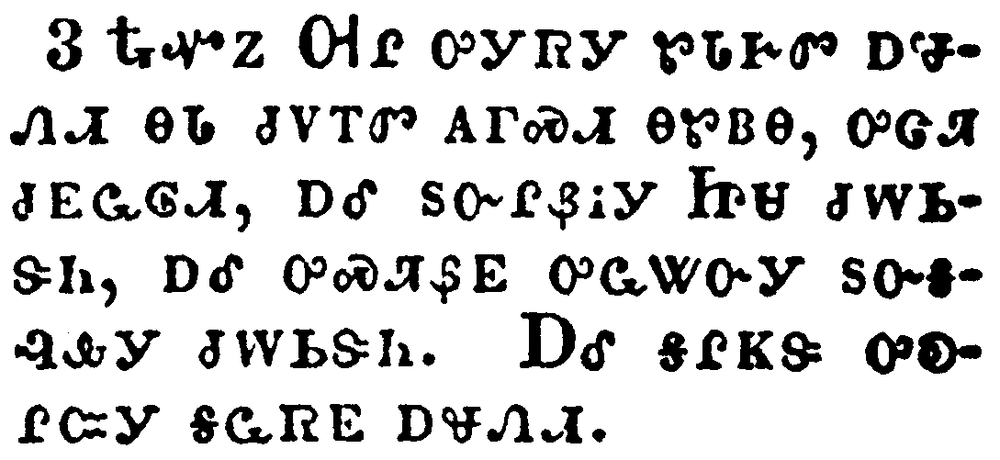</a></td>
</tr>
<tr class="even">
<td>Then took Mary a pound of ointment of spikenard, very costly, and anointed the feet of Jesus, and wiped his feet with her hair: and the house was filled with the odour of the ointment.</td>
</tr>
<tr class="odd">
<td>ᎿᎭᏉᏃ ᎺᎵ ᎤᎩᏒᎩ ᏑᏓᎨᏛ ᎠᏠᏁᏗ ᎾᏓ ᏧᏙᎢᏛ ᎪᎱᏍᏗ ᎾᏑᏴᎾ, ᎤᏣᏘ ᏧᎬᏩᎶᏗ, ᎠᎴ ᏚᏅᎵᏰᎥᎩ ᏥᏌ ᏧᎳᏏᏕᏂ, ᎠᎴ ᎤᏍᏘᏰᎬ ᎤᏩᏔᏅᎩ ᏚᏅᎦᎸᎲᎩ ᏧᎳᏏᏕᏂ. ᎠᎴ ᎦᎵᏦᏕ ᎤᎧᎵᏨᎩ ᎦᏩᏒᎬ ᎠᏠᏁᏗ.</td>
</tr>
<tr class="even">
<td>Hna-quo-no Me-li u-gi-sv-gi su-da-ge-dv a-tlo-ne-di na-da tsu-do-i-dv go-hu-s-di na-su-yv-na, u-tsa-ti tsu-gv-wa-lo-di, a-le du-nv-li-ye-v-gi Tsi-sa tsu-la-si-de-ni, a-le u-s-ti-ye-gv u-wa-ta-nv-gi du-nv-ga-lv-hv-gi tsu-la-si-de-ni. A-le ga-li-tso-de u-ka-li-tsv-gi ga-wa-sv-gv a-tlo-ne-di.</td>
</tr>
</tbody>
</table>

<table>
<tbody>
<tr class="odd">
<td><a href="041204.png">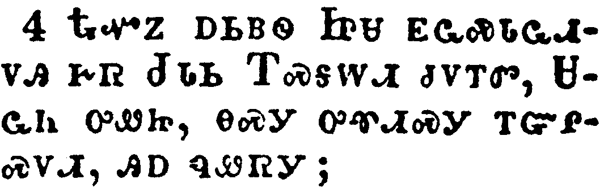</a></td>
</tr>
<tr class="even">
<td>Then saith one of his disciples, Judas Iscariot, Simon's son, which should betray him,</td>
</tr>
<tr class="odd">
<td>ᎿᎭᏉᏃ ᎠᏏᏴᏫ ᏥᏌ ᎬᏩᏍᏓᏩᏗᏙᎯ ᎨᏒ ᏧᏓᏏ ᎢᏍᎦᎳᏗ ᏧᏙᎢᏛ, ᏌᏩᏂ ᎤᏪᏥ, ᎾᏍᎩ ᎤᏡᏗᏍᎩ ᎢᏳᎵᏍᏙᏗ, ᎯᎠ ᏄᏪᏒᎩ;</td>
</tr>
<tr class="even">
<td>Hna-quo-no a-si-yv-wi Tsi-sa gv-wa-s-da-wa-di-do-hi ge-sv Tsu-da-si I-s-ga-la-di tsu-do-i-dv, Sa-wa-ni u-we-tsi, na-s-gi u-tlu-di-s-gi i-yu-li-s-do-di, hi-a nu-we-sv-gi;</td>
</tr>
</tbody>
</table>

<table>
<tbody>
<tr class="odd">
<td><a href="041205.png">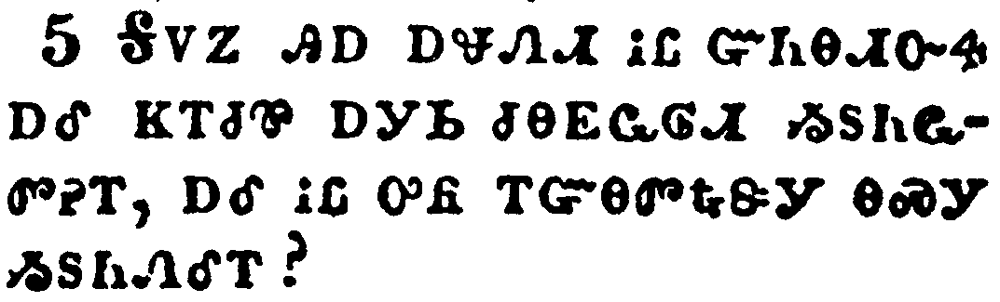</a></td>
</tr>
<tr class="even">
<td>Why was not this ointment sold for three hundred pence, and given to the poor?</td>
</tr>
<tr class="odd">
<td>ᎦᏙᏃ ᎯᎠ ᎠᏠᏁᏗ ᎥᏝ ᏳᏂᎾᏗᏅᏎ ᎠᎴ ᏦᎢᏧᏈ ᎠᎩᏏ ᏧᎾᏩᎶᏗ ᏱᏚᏂᏩᏛᎮᎢ, ᎠᎴ ᎥᏝ ᎤᏲ ᎢᏳᎾᏛᎿᎭᏕᎩ ᎾᏍᎩ ᏱᏚᏂᏁᎴᎢ?</td>
</tr>
<tr class="even">
<td>Ga-do-no hi-a a-tlo-ne-di v-tla yu-ni-na-di-nv-se a-le tso-i-tsu-qui a-gi-si tsu-na-wa-lo-di yi-du-ni-wa-dv-he-i, a-le v-tla u-yo i-yu-na-dv-hna-de-gi na-s-gi yi-du-ni-ne-le-i?</td>
</tr>
</tbody>
</table>

<table>
<tbody>
<tr class="odd">
<td><a href="041206.png">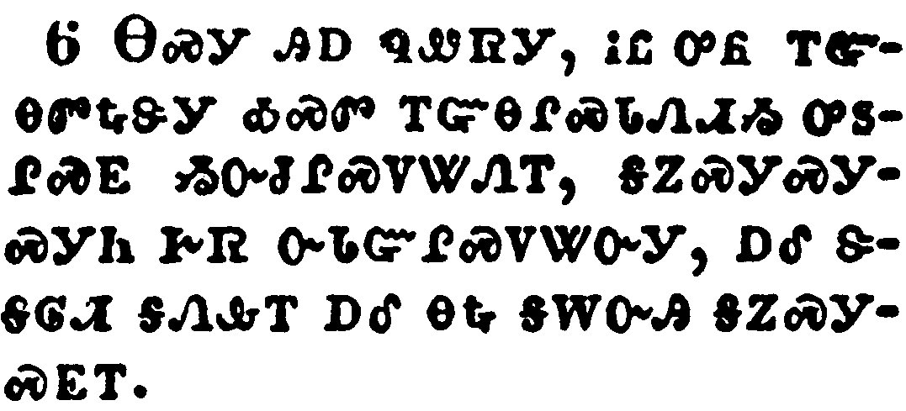</a></td>
</tr>
<tr class="even">
<td>This he said, not that he cared for the poor; but because he was a thief, and had the bag, and bare what was put therein.</td>
</tr>
<tr class="odd">
<td>ᎾᏍᎩ ᎯᎠ ᏄᏪᏒᎩ, ᎥᏝ ᎤᏲ ᎢᏳᎾᏛᎿᎭᏕᎩ ᎣᏍᏛ ᎢᏳᎾᎵᏍᏓᏁᏗᏱ ᎤᏚᎵᏍᎬ ᏱᏅᏧᎵᏍᏙᏔᏁᎢ, ᎦᏃᏍᎩᏍᎩᏍᎩᏂ ᎨᏒ ᏅᏓᏳᎵᏍᏙᏔᏅᎩ, ᎠᎴ ᏕᎦᎶᏗ ᎦᏁᎲᎢ ᎠᎴ ᎾᎿᎭᎦᎳᏅᎯ ᎦᏃᏍᎩᏍᎬᎢ.</td>
</tr>
<tr class="even">
<td>Na-s-gi hi-a nu-we-sv-gi, v-tla u-yo i-yu-na-dv-hna-de-gi o-s-dv i-yu-na-li-s-da-ne-di-yi u-du-li-s-gv yi-nv-tsu-li-s-do-ta-ne-i, ga-no-s-gi-s-gi-s-gi-ni ge-sv nv-da-yu-li-s-do-ta-nv-gi, a-le de-ga-lo-di ga-ne-hv-i a-le na-hna ga-la-nv-hi ga-no-s-gi-s-gv-i.</td>
</tr>
</tbody>
</table>

<table>
<tbody>
<tr class="odd">
<td></td>
</tr>
<tr class="even">
<td>Then said Jesus, Let her alone: against the day of my burying hath she kept this.</td>
</tr>
<tr class="odd">
<td>ᎿᎭᏉᏃ ᏥᏌ ᎯᎠ ᏄᏪᏒᎩ; ᎤᏁᎳᎩ; ᎥᎩᏂᏐᏗᏱ ᎨᏒ ᎢᎦ ᎬᏗᏍᎩ ᎤᏍᏆᏂᎪᏔᏅ ᎾᏍᎩ ᎯᎠ.</td>
</tr>
<tr class="even">
<td>Hna-quo-no Tsi-sa hi-a nu-we-sv-gi; U-ne-la-gi; v-gi-ni-so-di-yi ge-sv i-ga gv-di-s-gi u-s-qua-ni-go-ta-nv na-s-gi hi-a.</td>
</tr>
</tbody>
</table>

<table>
<tbody>
<tr class="odd">
<td></td>
</tr>
<tr class="even">
<td>For the poor always ye have with you; but me ye have not always.</td>
</tr>
<tr class="odd">
<td>ᎤᏲᏰᏃ ᎢᏳᎾᏛᎿᎭᏕᎩ ᏂᎪᎯᎸ ᎨᏤᎳᏗᏙᎭ; ᎠᏴᏍᎩᏂ ᎥᏝ ᏂᎪᎯᎸ ᏱᏨᏰᎳᏗᏙᎭ.</td>
</tr>
<tr class="even">
<td>U-yo-ye-no i-yu-na-dv-hna-de-gi ni-go-hi-lv ge-tse-la-di-do-ha; a-yv-s-gi-ni v-tla ni-go-hi-lv yi-tsv-ye-la-di-do-ha.</td>
</tr>
</tbody>
</table>

<table>
<tbody>
<tr class="odd">
<td><a href="041209.png">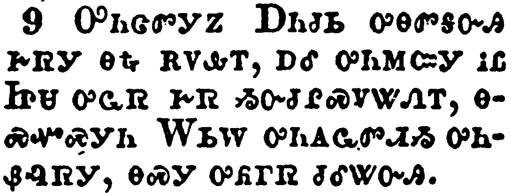</a></td>
</tr>
<tr class="even">
<td>Much people of the Jews therefore knew that he was there: and they came not for Jesus' sake only, but that they might see Lazarus also, whom he had raised from the dead.</td>
</tr>
<tr class="odd">
<td>ᎤᏂᏣᏛᎩᏃ ᎠᏂᏧᏏ ᎤᎾᏛᎦᏅᎯ ᎨᏒᎩ ᎾᎿᎭᎡᏙᎲᎢ, ᎠᎴ ᎤᏂᎷᏨᎩ ᎥᏝ ᏥᏌ ᎤᏩᏒ ᎨᏒ ᏱᏅᏧᎵᏍᏙᏔᏁᎢ, ᎾᏍᏉᏍᎩᏂ ᎳᏏᎳ ᎤᏂᎪᏩᏛᏗᏱ ᎤᏂᏰᎸᏒᎩ, ᎾᏍᎩ ᎤᏲᎱᏒ ᏧᎴᏔᏅᎯ.</td>
</tr>
<tr class="even">
<td>U-ni-tsa-dv-gi-no A-ni-tsu-si u-na-dv-ga-nv-hi ge-sv-gi na-hna e-do-hv-i, a-le u-ni-lu-tsv-gi v-tla Tsi-sa u-wa-sv ge-sv yi-nv-tsu-li-s-do-ta-ne-i, na-s-quo-s-gi-ni La-si-la u-ni-go-wa-dv-di-yi u-ni-ye-lv-sv-gi, na-s-gi u-yo-hu-sv tsu-le-ta-nv-hi.</td>
</tr>
</tbody>
</table>

<table>
<tbody>
<tr class="odd">
<td><a href="041210.png">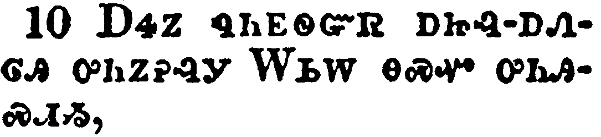</a></td>
</tr>
<tr class="even">
<td>But the chief priests consulted that they might put Lazarus also to death;</td>
</tr>
<tr class="odd">
<td>ᎠᏎᏃ ᏄᏂᎬᏫᏳᏒ ᎠᏥᎸ-ᎠᏁᎶᎯ ᎤᏂᏃᎮᎸᎩ ᎳᏏᎳ ᎾᏍᏉ ᎤᏂᎯᏍᏗᏱ,</td>
</tr>
<tr class="even">
<td>A-se-no nu-ni-gv-wi-yu-sv a-tsi-lv--a-ne-lo-hi u-ni-no-he-lv-gi La-si-la na-s-quo u-ni-hi-s-di-yi,</td>
</tr>
</tbody>
</table>

<table>
<tbody>
<tr class="odd">
<td></td>
</tr>
<tr class="even">
<td>Because that by reason of him many of the Jews went away, and believed on Jesus.</td>
</tr>
<tr class="odd">
<td>ᎾᏍᎩᏰᏃ ᏄᏩᏂᏌᏅᎩ ᎤᏂᏣᏛᎩ ᎠᏂᏧᏏ ᎤᎾᏓᏅᏒᎩ, ᎠᎴ ᏥᏌ ᏫᎬᏬᎯᏳᏅᎩ.</td>
</tr>
<tr class="even">
<td>Na-s-gi-ye-no nu-wa-ni-sa-nv-gi u-ni-tsa-dv-gi A-ni-tsu-si u-na-da-nv-sv-gi, a-le Tsi-sa wi-gv-wo-hi-yu-nv-gi.</td>
</tr>
</tbody>
</table>

<table>
<tbody>
<tr class="odd">
<td></td>
</tr>
<tr class="even">
<td>On the next day much people that were come to the feast, when they heard that Jesus was coming to Jerusalem,</td>
</tr>
<tr class="odd">
<td>ᎤᎩᏨᏛ ᎤᏂᏣᏛᎩ ᏴᏫ ᏗᎵᏍᏓᏴᏗᏱ ᎤᏂᎷᏨᎯ, ᎤᎾᏛᎦᏅ ᏥᎷᏥᎵᎻ ᏗᎦᎷᏥᏒᎢ,</td>
</tr>
<tr class="even">
<td>U-gi-tsv-dv u-ni-tsa-dv-gi yv-wi di-li-s-da-yv-di-yi u-ni-lu-tsv-hi, u-na-dv-ga-nv Tsi-lu-tsi-li-mi di-ga-lu-tsi-sv-i,</td>
</tr>
</tbody>
</table>

<table>
<tbody>
<tr class="odd">
<td></td>
</tr>
<tr class="even">
<td>Took branches of palm trees, and went forth to meet him, and cried, Hosanna: Blessed is the King of Israel that cometh in the name of the Lord.</td>
</tr>
<tr class="odd">
<td>ᏚᏂᏴᎲᎩ ᏧᏪᏲᏔ ᏧᎦᏄᏓᏅᎯᏛ ᎠᎴ ᎤᏂᏄᎪᏨᎩ ᏚᎾᏠᏒᏒᎩ, ᎠᎴ ᎯᎠ ᏄᏂᏪᏒ ᎤᏁᎷᏅᎩ, ᎰᏌᎾ! ᎠᏥᎸᏉᏗᏳ ᏫᏂᎦᎵᏍᏓ ᏱᎰᏩ ᏚᏙᏍᏛ ᏨᏓᏯᎢ, ᎤᎬᏫᏳᎯ ᎢᏏᎵ ᎤᎾᏤᎵᎦ.</td>
</tr>
<tr class="even">
<td>Du-ni-yv-hv-gi tsu-we-yo-ta tsu-ga-nu-da-nv-hi-dv a-le u-ni-nu-go-tsv-gi du-na-tlo-sv-sv-gi, a-le hi-a nu-ni-we-sv u-ne-lu-nv-gi, Ho-sa-na! A-tsi-lv-quo-di-yu wi-ni-ga-li-s-da Yi-ho-wa du-do-s-dv tsv-da-ya-i, U-gv-wi-yu-hi I-si-li u-na-tse-li-ga.</td>
</tr>
</tbody>
</table>

<table>
<tbody>
<tr class="odd">
<td></td>
</tr>
<tr class="even">
<td>And Jesus, when he had found a young ass, sat thereon; as it is written,</td>
</tr>
<tr class="odd">
<td>ᏥᏌᏃ ᎤᏩᏛᎲ ᎠᎩᎾ ᏐᏈᎵ-ᏗᎦᎵᎠᏅᎯᏛ, ᎤᎩᎸᏅᎩ, ᎾᏍᎩᏯ ᎯᎠ ᏥᏂᎬᏅ ᏥᎪᏪᎳ;</td>
</tr>
<tr class="even">
<td>Tsi-sa-no u-wa-dv-hv a-gi-na so-qui-li--di-ga-li-a-nv-hi-dv, u-gi-lv-nv-gi, na-s-gi-ya hi-a tsi-ni-gv-nv tsi-go-we-la;</td>
</tr>
</tbody>
</table>

<table>
<tbody>
<tr class="odd">
<td></td>
</tr>
<tr class="even">
<td>Fear not, daughter of Sion: behold, thy King cometh, sitting on an ass's colt.</td>
</tr>
<tr class="odd">
<td>"ᏞᏍᏗ ᏱᏍᎦᎢᎮᏍᏗ ᏂᎯ ᏌᏯᏂ ᎤᏪᏥ, ᎬᏂᏳᏉ ᎤᎬᏫᏳᎯ ᏣᏤᎵᎦ ᏓᏯᎢ, ᎠᎩᎾ ᏐᏈᎵ-ᏗᎦᎵᎠᏅᎯᏛ ᎤᏪᏥ ᎤᎩᎸᏗ."</td>
</tr>
<tr class="even">
<td>"Tle-s-di yi-s-ga-i-he-s-di ni-hi Sa-ya-ni u-we-tsi, gv-ni-yu-quo U-gv-wi-yu-hi tsa-tse-li-ga da-ya-i, a-gi-na so-qui-li--di-ga-li-a-nv-hi-dv u-we-tsi u-gi-lv-di."</td>
</tr>
</tbody>
</table>

<table>
<tbody>
<tr class="odd">
<td><a href="041216.png">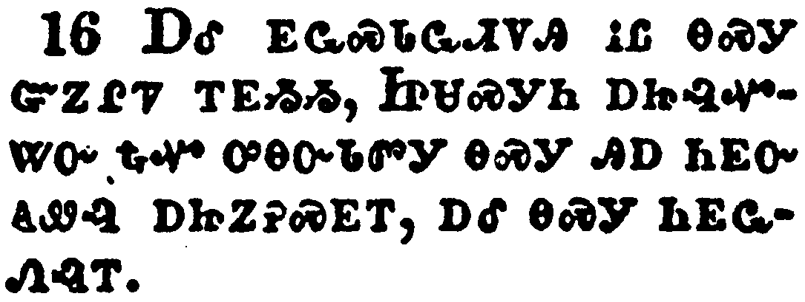</a></td>
</tr>
<tr class="even">
<td>These things understood not his disciples at the first: but when Jesus was glorified, then remembered they that these things were written of him, and that they had done these things unto him.</td>
</tr>
<tr class="odd">
<td>ᎠᎴ ᎬᏩᏍᏓᏩᏗᏙᎯ ᎥᏝ ᎾᏍᎩ ᏣᏃᎵᏤ ᎢᎬᏱᏱ, ᏥᏌᏍᎩᏂ ᎠᏥᎸᏉᏔᏅ ᎿᎭᏉ ᎤᎾᏅᏓᏛᎩ ᎾᏍᎩ ᎯᎠ ᏂᎬᏅ ᎪᏪᎸ ᎠᏥᏃᎮᏍᎬᎢ, ᎠᎴ ᎾᏍᎩ ᏂᎬᏩᏁᎸᎢ.</td>
</tr>
<tr class="even">
<td>A-le gv-wa-s-da-wa-di-do-hi v-tla na-s-gi tsa-no-li-tse i-gv-yi-yi, Tsi-sa-s-gi-ni a-tsi-lv-quo-ta-nv hna-quo u-na-nv-da-dv-gi na-s-gi hi-a ni-gv-nv go-we-lv a-tsi-no-he-s-gv-i, a-le na-s-gi ni-gv-wa-ne-lv-i.</td>
</tr>
</tbody>
</table>

<table>
<tbody>
<tr class="odd">
<td><a href="041217.png">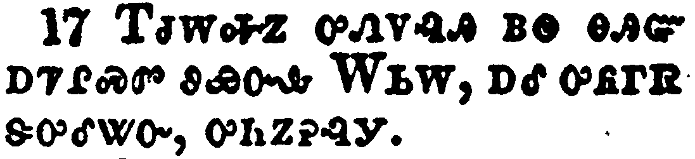</a></td>
</tr>
<tr class="even">
<td>The people therefore that was with him when he called Lazarus out of his grave, and raised him from the dead, bare record.</td>
</tr>
<tr class="odd">
<td>ᎢᏧᎳᎭᏃ ᎤᏁᏙᎸᎯ ᏴᏫ ᎾᎯᏳ ᎠᏤᎵᏍᏛ ᏭᏯᏅᎲ ᎳᏏᎳ, ᎠᎴ ᎤᏲᎱᏒ ᏕᎤᎴᏔᏅ, ᎤᏂᏃᎮᎸᎩ.</td>
</tr>
<tr class="even">
<td>I-tsu-la-ha-no u-ne-do-lv-hi yv-wi na-hi-yu a-tse-li-s-dv wu-ya-nv-hv La-si-la, a-le u-yo-hu-sv de-u-le-ta-nv, u-ni-no-he-lv-gi.</td>
</tr>
</tbody>
</table>

<table>
<tbody>
<tr class="odd">
<td><a href="041218.png">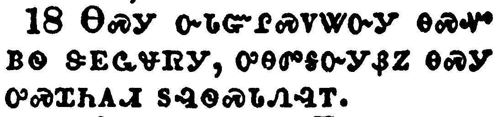</a></td>
</tr>
<tr class="even">
<td>For this cause the people also met him, for that they heard that he had done this miracle.</td>
</tr>
<tr class="odd">
<td>ᎾᏍᎩ ᏅᏓᏳᎵᏍᏙᏔᏅᎩ ᎾᏍᏉ ᏴᏫ ᏕᎬᏩᏠᏒᎩ, ᎤᎾᏛᎦᏅᎩᏰᏃ ᎾᏍᎩ ᎤᏍᏆᏂᎪᏗ ᏚᎸᏫᏍᏓᏁᎸᎢ.</td>
</tr>
<tr class="even">
<td>Na-s-gi nv-da-yu-li-s-do-ta-nv-gi na-s-quo yv-wi de-gv-wa-tlo-sv-gi, u-na-dv-ga-nv-gi-ye-no na-s-gi u-s-qua-ni-go-di du-lv-wi-s-da-ne-lv-i.</td>
</tr>
</tbody>
</table>

<table>
<tbody>
<tr class="odd">
<td><a href="041219.png">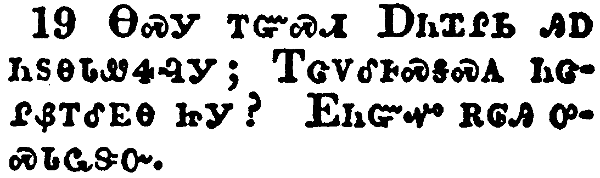</a></td>
</tr>
<tr class="even">
<td>The Pharisees therefore said among themselves, Perceive ye how ye prevail nothing? behold, the world is gone after him.</td>
</tr>
<tr class="odd">
<td>ᎾᏍᎩ ᎢᏳᏍᏗ ᎠᏂᏆᎵᏏ ᎯᎠ ᏂᏚᎾᏓᏪᏎᎸᎩ; ᎢᏣᏙᎴᎰᏍᎦᏍᎪ ᏂᏣᎵᏰᎢᎴᎬᎾ ᏥᎩ? ᎬᏂᏳᏉ ᎡᎶᎯ ᎤᏍᏓᏩᏕᏅ.</td>
</tr>
<tr class="even">
<td>Na-s-gi i-yu-s-di A-ni-qua-li-si hi-a ni-du-na-da-we-se-lv-gi; I-tsa-do-le-ho-s-ga-s-go ni-tsa-li-ye-i-le-gv-na tsi-gi? Gv-ni-yu-quo e-lo-hi u-s-da-wa-de-nv.</td>
</tr>
</tbody>
</table>

<table>
<tbody>
<tr class="odd">
<td><a href="041220.png">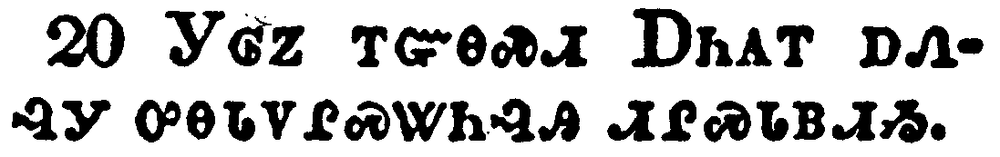</a></td>
</tr>
<tr class="even">
<td>And there were certain Greeks among them that came up to worship at the feast:</td>
</tr>
<tr class="odd">
<td>ᎩᎶᏃ ᎢᏳᎾᏍᏗ ᎠᏂᎪᎢ ᎠᏁᎸᎩ ᎤᎾᎵᏙᎵᏍᏔᏂᎸᎯ ᏗᎵᏍᏓᏴᏗᏱ.</td>
</tr>
<tr class="even">
<td>Gi-lo-no i-yu-na-s-di a-ni-go-i a-ne-lv-gi u-na-li-do-li-s-ta-ni-lv-hi di-li-s-da-yv-di-yi.</td>
</tr>
</tbody>
</table>

<table>
<tbody>
<tr class="odd">
<td></td>
</tr>
<tr class="even">
<td>The same came therefore to Philip, which was of Bethsaida of Galilee, and desired him, saying, Sir, we would see Jesus.</td>
</tr>
<tr class="odd">
<td>ᎠᎴ ᎾᏍᎩ ᎬᏩᎷᏤᎸᎩ ᏈᎵᎩ, ᏇᏣᏱᏗ ᎦᏚᎲ ᎨᎵᎵ ᎡᎯ, ᎠᎴ ᎬᏩᏔᏲᏎᎸᎩ ᎯᎠ ᏄᏂᏪᏒᎩ, ᎣᎦᏚᎵᎭ ᎣᏥᎪᏩᏛᏗᏱ ᏥᏌ.</td>
</tr>
<tr class="even">
<td>A-le na-s-gi gv-wa-lu-tse-lv-gi Qui-li-gi, Que-tsa-yi-di ga-du-hv Ge-li-li e-hi, a-le gv-wa-ta-yo-se-lv-gi hi-a nu-ni-we-sv-gi, o-ga-du-li-ha o-tsi-go-wa-dv-di-yi Tsi-sa.</td>
</tr>
</tbody>
</table>

<table>
<tbody>
<tr class="odd">
<td></td>
</tr>
<tr class="even">
<td>Philip cometh and telleth Andrew: and again Andrew and Philip tell Jesus.</td>
</tr>
<tr class="odd">
<td>ᏈᎵᎩ ᎤᎷᏨᎩ ᎠᎴ ᎡᏂᏗ ᏭᏃᏁᎸᎩ; ᎿᎭᏉᏃ ᎡᏂᏗ ᎠᎴ ᏈᎵᎩ ᏥᏌ ᏭᏂᏃᏁᎸᎩ.</td>
</tr>
<tr class="even">
<td>Qui-li-gi u-lu-tsv-gi a-le E-ni-di wu-no-ne-lv-gi; hna-quo-no E-ni-di a-le Qui-li-gi Tsi-sa wu-ni-no-ne-lv-gi.</td>
</tr>
</tbody>
</table>

<table>
<tbody>
<tr class="odd">
<td><a href="041223.png">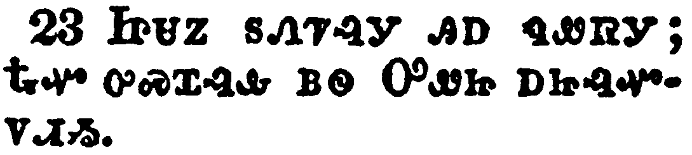</a></td>
</tr>
<tr class="even">
<td>And Jesus answered them, saying, The hour is come, that the Son of man should be glorified.</td>
</tr>
<tr class="odd">
<td>ᏥᏌᏃ ᏚᏁᏤᎸᎩ ᎯᎠ ᏄᏪᏒᎩ; ᎿᎭᏉ ᎤᏍᏆᎸᎲ ᏴᏫ ᎤᏪᏥ ᎠᏥᎸᏉᏙᏗᏱ.</td>
</tr>
<tr class="even">
<td>Tsi-sa-no du-ne-tse-lv-gi hi-a nu-we-sv-gi; Hna-quo u-s-qua-lv-hv yv-wi U-we-tsi a-tsi-lv-quo-do-di-yi.</td>
</tr>
</tbody>
</table>

<table>
<tbody>
<tr class="odd">
<td></td>
</tr>
<tr class="even">
<td>Verily, verily, I say unto you, Except a corn of wheat fall into the ground and die, it abideth alone: but if it die, it bringeth forth much fruit.</td>
</tr>
<tr class="odd">
<td>ᎤᏙᎯᏳᎯᏯ, ᎤᏙᎯᏳᎯᏯ ᎯᎠ ᏂᏨᏪᏎᎭ; ᎢᏳᏃ ᏌᏉ ᎤᏣᎴᏍᏗ ᎤᎦᏔ ᎡᎳᏗ ᏄᏬᏨᎾ ᎠᎴ ᏄᎪᏒᎾ ᏱᎩ, ᎤᏩᏒᏉ ᎨᏐ ᏂᎪᎯᎸᎢ; ᎢᏳᏍᎩᏂ ᎤᎪᎯ ᎤᏣᏙ ᎧᏁᏉᎪᎢ.</td>
</tr>
<tr class="even">
<td>U-do-hi-yu-hi-ya, u-do-hi-yu-hi-ya hi-a ni-tsv-we-se-ha; I-yu-no sa-quo u-tsa-le-s-di u-ga-ta e-la-di nu-wo-tsv-na a-le nu-go-sv-na yi-gi, u-wa-sv-quo ge-so ni-go-hi-lv-i; i-yu-s-gi-ni u-go-hi u-tsa-do ka-ne-quo-go-i.</td>
</tr>
</tbody>
</table>

<table>
<tbody>
<tr class="odd">
<td><a href="041225.png">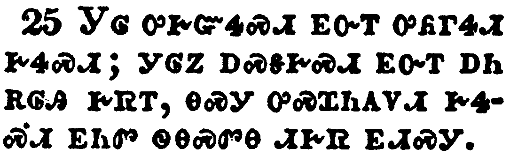</a></td>
</tr>
<tr class="even">
<td>He that loveth his life shall lose it; and he that hateth his life in this world shall keep it unto life eternal.</td>
</tr>
<tr class="odd">
<td>ᎩᎶ ᎤᎨᏳᏎᏍᏗ ᎬᏅᎢ ᎤᏲᎱᏎᏗ ᎨᏎᏍᏗ; ᎩᎶᏃ ᎠᏍᎦᎨᏍᏗ ᎬᏅᎢ ᎠᏂ ᎡᎶᎯ ᎨᏒᎢ, ᎾᏍᎩ ᎤᏍᏆᏂᎪᏙᏗ ᎨᏎᏍᏗ ᎬᏂᏛ ᏫᎾᏍᏛᎾ ᏗᎨᏒ ᎬᏗᏍᎩ.</td>
</tr>
<tr class="even">
<td>Gi-lo u-ge-yu-se-s-di gv-nv-i u-yo-hu-se-di ge-se-s-di; gi-lo-no a-s-ga-ge-s-di gv-nv-i a-ni e-lo-hi ge-sv-i, na-s-gi u-s-qua-ni-go-do-di ge-se-s-di gv-ni-dv wi-na-s-dv-na di-ge-sv gv-di-s-gi.</td>
</tr>
</tbody>
</table>

<table>
<tbody>
<tr class="odd">
<td></td>
</tr>
<tr class="even">
<td>If any man serve me, let him follow me; and where I am, there shall also my servant be: if any man serve me, him will my Father honour.</td>
</tr>
<tr class="odd">
<td>ᎢᏳᏃ ᎩᎶ ᏥᏅᏏᏓᏍᏗ ᏂᎦᎵᏍᏗᏍᎨᏍᏗ, ᎾᏍᎩ ᎠᎩᏍᏓᏩᏕᎨᏍᏗ; ᎨᎥᏃ ᎾᎿᎭᎾᏍᏉ ᏥᏅᏏᏓᏍᏗ ᎡᎮᏍᏗ. ᎢᏳᏃ ᎩᎶ ᏥᏅᏏᏓᏍᏗ ᏂᎦᎵᏍᏗᏍᎨᏍᏗ, ᎾᏍᎩ ᎡᏙᏓ ᎤᎸᏉᏙᏗ ᎨᏎᏍᏗ.</td>
</tr>
<tr class="even">
<td>I-yu-no gi-lo tsi-nv-si-da-s-di ni-ga-li-s-di-s-ge-s-di, na-s-gi a-gi-s-da-wa-de-ge-s-di; ge-v-no na-hna na-s-quo tsi-nv-si-da-s-di e-he-s-di. I-yu-no gi-lo tsi-nv-si-da-s-di ni-ga-li-s-di-s-ge-s-di, na-s-gi E-do-da u-lv-quo-do-di ge-se-s-di.</td>
</tr>
</tbody>
</table>

<table>
<tbody>
<tr class="odd">
<td></td>
</tr>
<tr class="even">
<td>Now is my soul troubled; and what shall I say? Father, save me from this hour: but for this cause came I unto this hour.</td>
</tr>
<tr class="odd">
<td>ᎿᎭᏉ ᎠᏆᏓᏅᏙ ᎤᏕᏯᏔᏁᎭ; ᎦᏙᏃ ᏓᎦᏛᏂ? [ᎯᎠᏍᎪ ᏅᏓᏥᏪᏏ,] ᎡᏙᏓ, ᏍᏊᏓᎳᎩ ᎪᎯ ᎨᏒᎢ? ᎠᏎᏃ ᎾᏍᎩ ᎢᏳᏍᏗ ᏣᎩᏍᏆᎸᎡ ᎪᎯ ᎠᎩᏍᏆᎸᎡᏗᏱ ᎠᎩᎷᏥᎸ.</td>
</tr>
<tr class="even">
<td>Hna-quo a-qua-da-nv-do u-de-ya-ta-ne-ha; ga-do-no da-ga-dv-ni? [Hi-a-s-go nv-da-tsi-we-si,] E-do-da, s-quu-da-la-gi go-hi ge-sv-i? A-se-no na-s-gi i-yu-s-di tsa-gi-s-qua-lv-e go-hi a-gi-s-qua-lv-e-di-yi a-gi-lu-tsi-lv.</td>
</tr>
</tbody>
</table>

<table>
<tbody>
<tr class="odd">
<td></td>
</tr>
<tr class="even">
<td>Father, glorify thy name. Then came there a voice from heaven, saying, I have both glorified it, and will glorify it again.</td>
</tr>
<tr class="odd">
<td>ᎡᏙᏓ, ᎯᎸᏉᏓ ᏕᏣᏙᎥᎢ. ᎿᎭᏉᏃ ᎦᎸᎳᏗ ᏓᏳᏁᏨᎩ, ᎯᎠ ᏅᏓᏳᏪᏒᎩ; ᎦᏳᎳ ᎠᎩᎸᏉᏔᏅ, ᎠᎴ ᏔᎵᏁ ᏛᏥᎸᏉᏔᏂ.</td>
</tr>
<tr class="even">
<td>E-do-da, hi-lv-quo-da de-tsa-do-v-i. Hna-quo-no ga-lv-la-di da-yu-ne-tsv-gi, hi-a nv-da-yu-we-sv-gi; ga-yu-la a-gi-lv-quo-ta-nv, a-le ta-li-ne dv-tsi-lv-quo-ta-ni.</td>
</tr>
</tbody>
</table>

<table>
<tbody>
<tr class="odd">
<td></td>
</tr>
<tr class="even">
<td>The people therefore, that stood by, and heard it, said that it thundered: others said, An angel spake to him.</td>
</tr>
<tr class="odd">
<td>ᏴᏫᏃ ᎾᎥ ᎠᏂᏙᎾᎢ ᎤᎾᏛᎦᏅ, ᎠᏴᏓᏆᎶᏣ, ᎤᎾᏛᏅᎩ. ᎢᎦᏛᏃ ᎯᎠ ᏄᏂᏪᏒᎩ; ᏗᎧᎿᎭᏩᏗᏙᎯ ᏓᏳᏬᏁᏓ.</td>
</tr>
<tr class="even">
<td>Yv-wi-no na-v a-ni-do-na-i u-na-dv-ga-nv, a-yv-da-qua-lo-tsa, u-na-dv-nv-gi. I-ga-dv-no hi-a nu-ni-we-sv-gi; Di-ka-hna-wa-di-do-hi da-yu-wo-ne-da.</td>
</tr>
</tbody>
</table>

<table>
<tbody>
<tr class="odd">
<td><a href="041230.png">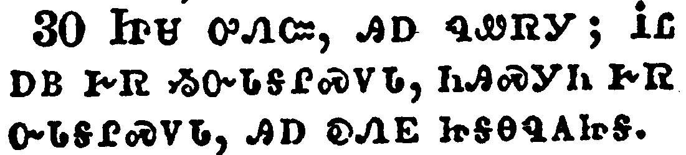</a></td>
</tr>
<tr class="even">
<td>Jesus answered and said, This voice came not because of me, but for your sakes.</td>
</tr>
<tr class="odd">
<td>ᏥᏌ ᎤᏁᏨ, ᎯᎠ ᏄᏪᏒᎩ; ᎥᏝ ᎠᏴ ᎨᏒ ᏱᏅᏓᎦᎵᏍᏙᏓ, ᏂᎯᏍᎩᏂ ᎨᏒ ᏅᏓᎦᎵᏍᏙᏓ, ᎯᎠ ᎧᏁᎬ ᏥᎦᎾᏄᎪᏥᎦ.</td>
</tr>
<tr class="even">
<td>Tsi-sa u-ne-tsv, hi-a nu-we-sv-gi; V-tla a-yv ge-sv yi-nv-da-ga-li-s-do-da, ni-hi-s-gi-ni ge-sv nv-da-ga-li-s-do-da, hi-a ka-ne-gv tsi-ga-na-nu-go-tsi-ga.</td>
</tr>
</tbody>
</table>

<table>
<tbody>
<tr class="odd">
<td><a href="041231.png">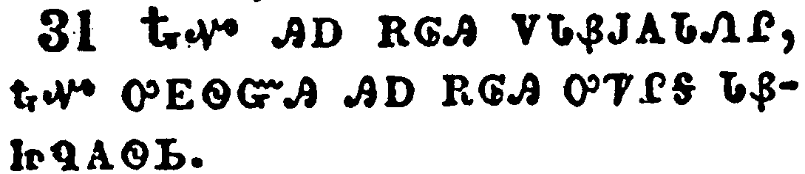</a></td>
</tr>
<tr class="even">
<td>Now is the judgment of this world: now shall the prince of this world be cast out.</td>
</tr>
<tr class="odd">
<td>ᎿᎭᏉ ᎯᎠ ᎡᎶᎯ ᏙᏓᏰᎫᎪᏓᏁᎵ, ᎿᎭᏉ ᎤᎬᏫᏳᎯ ᎯᎠ ᎡᎶᎯ ᎤᏤᎵᎦ ᏓᏰᏥᏄᎪᏫᏏ.</td>
</tr>
<tr class="even">
<td>Hna-quo hi-a e-lo-hi do-da-ye-gu-go-da-ne-li, hna-quo u-gv-wi-yu-hi hi-a e-lo-hi u-tse-li-ga da-ye-tsi-nu-go-wi-si.</td>
</tr>
</tbody>
</table>

<table>
<tbody>
<tr class="odd">
<td><a href="041232.png">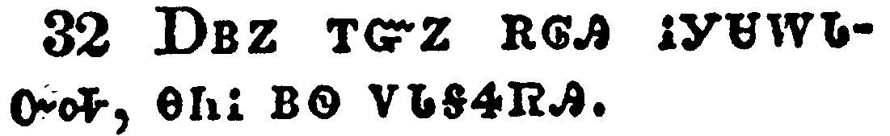</a></td>
</tr>
<tr class="even">
<td>And I, if I be lifted up from the earth, will draw all men unto me.</td>
</tr>
<tr class="odd">
<td>ᎠᏎᏃ ᎢᏳᏃ ᎡᎶᎯ ᎥᎩᏌᎳᏓᏅᎭ, ᎾᏂᎥ ᏴᏫ ᏙᏓᎦᏎᏒᎯ.</td>
</tr>
<tr class="even">
<td>A-se-no i-yu-no e-lo-hi v-gi-sa-la-da-nv-ha, na-ni-v yv-wi do-da-ga-se-sv-hi.</td>
</tr>
</tbody>
</table>

<table>
<tbody>
<tr class="odd">
<td></td>
</tr>
<tr class="even">
<td>This he said, signifying what death he should die.</td>
</tr>
<tr class="odd">
<td>ᎾᏍᎩ ᎯᎠ ᏄᏪᏒᎩ, ᎾᏍᎩ ᎢᏳᎵᏍᏓᏁᏗᏱ ᎤᏲᎱᎯᏍᏗᏱ ᎦᏛᎬᎩ.</td>
</tr>
<tr class="even">
<td>Na-s-gi hi-a nu-we-sv-gi, na-s-gi i-yu-li-s-da-ne-di-yi u-yo-hu-hi-s-di-yi ga-dv-gv-gi.</td>
</tr>
</tbody>
</table>

<table>
<tbody>
<tr class="odd">
<td></td>
</tr>
<tr class="even">
<td>The people answered him, We have heard out of the law that Christ abideth for ever: and how sayest thou, The Son of man must be lifted up? who is this Son of man?</td>
</tr>
<tr class="odd">
<td>ᏴᏫ ᎤᏂᏁᏨ ᎯᎠ ᏂᎬᏩᏪᏎᎸᎩ, ᎠᏴ ᎣᎦᏛᎦᏅ ᏗᎧᎿᎭᏩᏛᏍᏗᏱ ᎾᏍᎩ ᎦᎶᏁᏛ ᎤᎵᏍᏆᏗᏍᏗ ᏂᎨᏒᎾ ᎡᎲᎢ; ᎦᏙᏃ ᏴᏫ ᎤᏪᏥ ᎠᏎ ᏓᏰᏥᏌᎳᏓᏂ ᎢᎭᏗᎭ? ᎦᎪ ᎾᏍᎩ Ꮎ ᏴᏫ ᎤᏪᏥ?</td>
</tr>
<tr class="even">
<td>Yv-wi u-ni-ne-tsv hi-a ni-gv-wa-we-se-lv-gi, A-yv o-ga-dv-ga-nv di-ka-hna-wa-dv-s-di-yi na-s-gi Ga-lo-ne-dv u-li-s-qua-di-s-di ni-ge-sv-na e-hv-i; Ga-do-no yv-wi U-we-tsi a-se da-ye-tsi-sa-la-da-ni i-ha-di-ha? Ga-go na-s-gi na yv-wi U-we-tsi?</td>
</tr>
</tbody>
</table>

<table>
<tbody>
<tr class="odd">
<td><a href="041235.png">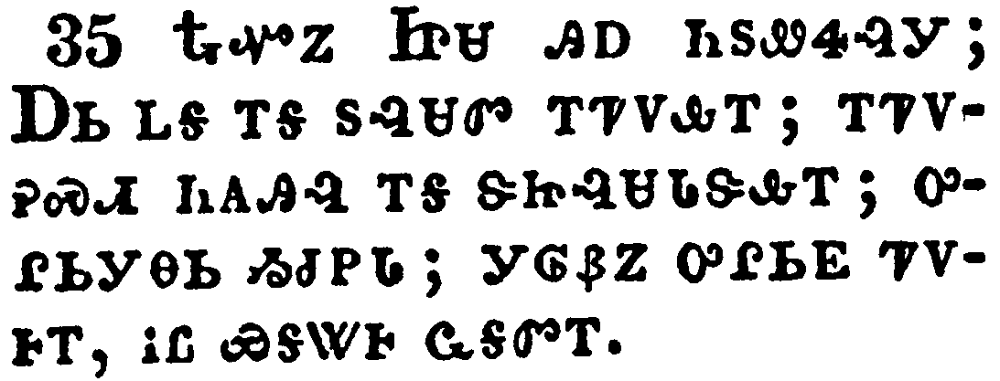</a></td>
</tr>
<tr class="even">
<td>Then Jesus said unto them, Yet a little while is the light with you. Walk while ye have the light, lest darkness come upon you: for he that walketh in darkness knoweth not whither he goeth.</td>
</tr>
<tr class="odd">
<td>ᎿᎭᏉᏃ ᏥᏌ ᎯᎠ ᏂᏚᏪᏎᎸᎩ; ᎠᏏᏞᎦ ᎢᎦ ᏚᎸᏌᏛ ᎢᏤᏙᎲᎢ; ᎢᏤᏙᎮᏍᏗ ᏂᎪᎯᎸ ᎢᎦ ᏕᏥᎸᏌᏓᏕᎲᎢ; ᎤᎵᏏᎩᎾᏏ ᏱᏧᏢᏓ; ᎩᎶᏰᏃ ᎤᎵᏏᎬ ᏤᏙᎰᎢ, ᎥᏝ ᏯᎦᏔᎰ ᏩᎦᏛᎢ.</td>
</tr>
<tr class="even">
<td>Hna-quo-no Tsi-sa hi-a ni-du-we-se-lv-gi; A-si-tle-ga i-ga du-lv-sa-dv i-tse-do-hv-i; i-tse-do-he-s-di ni-go-hi-lv i-ga de-tsi-lv-sa-da-de-hv-i; u-li-si-gi-na-si yi-tsu-tlv-da; gi-lo-ye-no u-li-si-gv tse-do-ho-i, v-tla ya-ga-ta-ho wa-ga-dv-i.</td>
</tr>
</tbody>
</table>

<table>
<tbody>
<tr class="odd">
<td><a href="041236.png">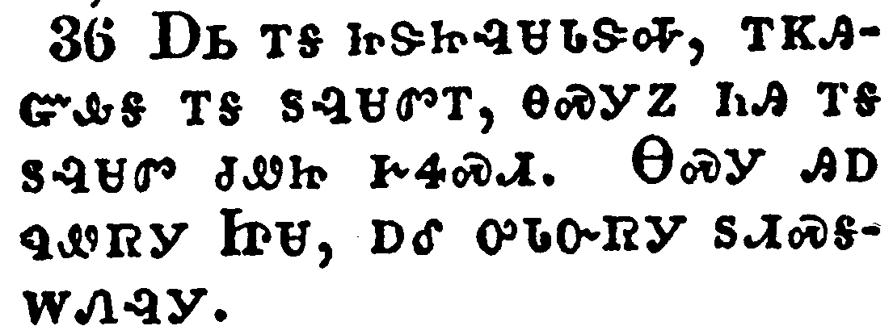</a></td>
</tr>
<tr class="even">
<td>While ye have light, believe in the light, that ye may be the children of light. These things spake Jesus, and departed, and did hide himself from them.</td>
</tr>
<tr class="odd">
<td>ᎠᏏ ᎢᎦ ᏥᏕᏥᎸᏌᏓᏕᎭ, ᎢᏦᎯᏳᎲᎦ ᎢᎦ ᏚᎸᏌᏛᎢ, ᎾᏍᎩᏃ ᏂᎯ ᎢᎦ ᏚᎸᏌᏛ ᏧᏪᏥ ᎨᏎᏍᏗ. ᎾᏍᎩ ᎯᎠ ᏄᏪᏒᎩ ᏥᏌ, ᎠᎴ ᎤᏓᏅᏒᎩ ᏚᏗᏍᎦᎳᏁᎸᎩ.</td>
</tr>
<tr class="even">
<td>A-si i-ga tsi-de-tsi-lv-sa-da-de-ha, i-tso-hi-yu-hv-ga i-ga du-lv-sa-dv-i, na-s-gi-no ni-hi i-ga du-lv-sa-dv tsu-we-tsi ge-se-s-di. Na-s-gi hi-a nu-we-sv-gi Tsi-sa, a-le u-da-nv-sv-gi du-di-s-ga-la-ne-lv-gi.</td>
</tr>
</tbody>
</table>

<table>
<tbody>
<tr class="odd">
<td></td>
</tr>
<tr class="even">
<td>But though he had done so many miracles before them, yet they believed not on him:</td>
</tr>
<tr class="odd">
<td>ᎤᏣᏗᏍᎩᏂᏃᏅ ᎤᏍᏆᏂᎪᏗ ᏧᎸᏫᏍᏓᏁᎸᎯ ᎨᏒᎩ ᎠᏂᎦᏔᎲᎢ, ᎠᏎᏃ ᎥᏝ ᏱᎬᏬᎯᏳᏁᎢ.</td>
</tr>
<tr class="even">
<td>U-tsa-di-s-gi-ni-no-nv u-s-qua-ni-go-di tsu-lv-wi-s-da-ne-lv-hi ge-sv-gi a-ni-ga-ta-hv-i, a-se-no v-tla yi-gv-wo-hi-yu-ne-i.</td>
</tr>
</tbody>
</table>

<table>
<tbody>
<tr class="odd">
<td></td>
</tr>
<tr class="even">
<td>That the saying of Esaias the prophet might be fulfilled, which he spake, Lord, who hath believed our report? and to whom hath the arm of the Lord been revealed?</td>
</tr>
<tr class="odd">
<td>ᎾᏍᎩᏃ ᎤᏙᎯᏳᏅᎩ ᎤᏁᏨ ᎢᏌᏯ ᎠᏙᎴᎰᏍᎩ, ᎯᎠ ᏥᏄᏪᏎᎢ; "ᏣᎬᏫᏳᎯ, ᎦᎪ ᎤᏬᎯᏳᏅ ᎣᎩᏃᎮᎸᎢ? ᎠᎴ ᎦᎪ ᎠᏥᎾᏄᎪᏫᏎᎸ ᎤᎬᏫᏳᎯ ᎧᏃᎨᏂ?"</td>
</tr>
<tr class="even">
<td>Na-s-gi-no u-do-hi-yu-nv-gi u-ne-tsv I-sa-ya a-do-le-ho-s-gi, hi-a tsi-nu-we-se-i; "Tsa-gv-wi-yu-hi, ga-go u-wo-hi-yu-nv o-gi-no-he-lv-i? A-le ga-go a-tsi-na-nu-go-wi-se-lv U-gv-wi-yu-hi ka-no-ge-ni?"</td>
</tr>
</tbody>
</table>

<table>
<tbody>
<tr class="odd">
<td><a href="041239.png">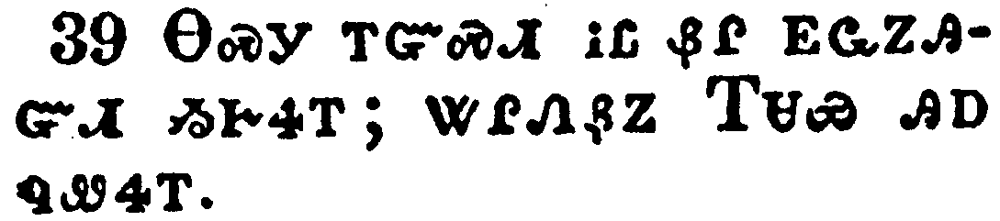</a></td>
</tr>
<tr class="even">
<td>Therefore they could not believe, because that Esaias said again,</td>
</tr>
<tr class="odd">
<td>ᎾᏍᎩ ᎢᏳᏏᏗ ᎥᏝ ᏰᎵ ᎬᏩᏃᎯᏳᏗ ᏱᎨᏎᎢ; ᏔᎵᏁᏰᏃ ᎢᏌᏯ ᎯᎠ ᏄᏪᏎᎢ.</td>
</tr>
<tr class="even">
<td>Na-s-gi i-yu-si-di v-tla ye-li gv-wa-no-hi-yu-di yi-ge-se-i; ta-li-ne-ye-no I-sa-ya hi-a nu-we-se-i.</td>
</tr>
</tbody>
</table>

<table>
<tbody>
<tr class="odd">
<td><a href="041240.png">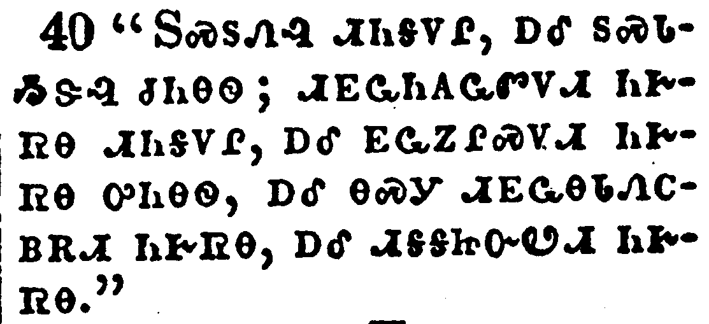</a></td>
</tr>
<tr class="even">
<td>He hath blinded their eyes, and hardened their heart; that they should not see with their eyes, nor understand with their heart, and be converted, and I should heal them.</td>
</tr>
<tr class="odd">
<td>"ᏚᏍᏚᏁᎸ ᏗᏂᎦᏙᎵ, ᎠᎴ ᏚᏍᏓᏱᏕᎸ ᏧᏂᎾᏫ; ᏗᎬᏩᏂᎪᏩᏛᏙᏗ ᏂᎨᏒᎾ ᏗᏂᎦᏙᎵ, ᎠᎴ ᎬᏩᏃᎵᏍᏙᏗ ᏂᎨᏒᎾ ᎤᏂᎾᏫ, ᎠᎴ ᎾᏍᎩ ᏗᎬᏩᎾᏓᏁᏟᏴᎡᏗ ᏂᎨᏒᎾ, ᎠᎴ ᏗᎦᎦᏥᏅᏬᏗ ᏂᎨᏒᎾ."</td>
</tr>
<tr class="even">
<td>"Du-s-du-ne-lv di-ni-ga-do-li, a-le du-s-da-yi-de-lv tsu-ni-na-wi; di-gv-wa-ni-go-wa-dv-do-di ni-ge-sv-na di-ni-ga-do-li, a-le gv-wa-no-li-s-do-di ni-ge-sv-na u-ni-na-wi, a-le na-s-gi di-gv-wa-na-da-ne-tli-yv-e-di ni-ge-sv-na, a-le di-ga-ga-tsi-nv-wo-di ni-ge-sv-na."</td>
</tr>
</tbody>
</table>

<table>
<tbody>
<tr class="odd">
<td><a href="041241.png">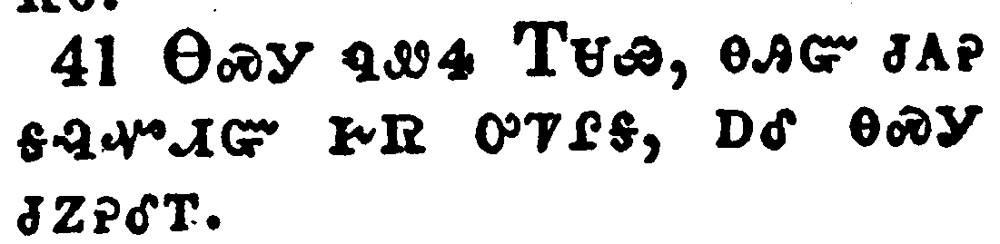</a></td>
</tr>
<tr class="even">
<td>These things said Esaias, when he saw his glory, and spake of him.</td>
</tr>
<tr class="odd">
<td>ᎾᏍᎩ ᏄᏪᏎ ᎢᏌᏯ, ᎾᎯᏳ ᏧᎪᎮ ᎦᎸᏉᏗᏳ ᎨᏒ ᎤᏤᎵᎦ, ᎠᎴ ᎾᏍᎩ ᏧᏃᎮᎴᎢ.</td>
</tr>
<tr class="even">
<td>Na-s-gi nu-we-se I-sa-ya, na-hi-yu tsu-go-he ga-lv-quo-di-yu ge-sv u-tse-li-ga, a-le na-s-gi tsu-no-he-le-i.</td>
</tr>
</tbody>
</table>

<table>
<tbody>
<tr class="odd">
<td></td>
</tr>
<tr class="even">
<td>Nevertheless among the chief rulers also many believed on him; but because of the Pharisees they did not confess him, lest they should be put out of the synagogue:</td>
</tr>
<tr class="odd">
<td>ᎤᏂᏣᏛᎩᏍᎩᏂᏃᏅ ᎾᏍᏉ ᎤᏂᎬᏫᏳᎯ ᎬᏬᎯᏳᏅᎩ; ᎠᏎᏃ ᎠᏂᏆᎵᏏ ᏅᏓᎦᎵᏍᏙᏗᏍᎬᎩ ᎥᏝ ᎬᏂᎨᏒ ᏱᏄᏅᏁᎴᎢ, ᏗᎦᎳᏫᎢᏍᏗᏱ ᏱᏙᎩᏄᎪᏩ ᎠᏁᎵᏍᎬᎩ.</td>
</tr>
<tr class="even">
<td>U-ni-tsa-dv-gi-s-gi-ni-no-nv na-s-quo u-ni-gv-wi-yu-hi gv-wo-hi-yu-nv-gi; a-se-no A-ni-qua-li-si nv-da-ga-li-s-do-di-s-gv-gi v-tla gv-ni-ge-sv yi-nu-nv-ne-le-i, di-ga-la-wi-i-s-di-yi yi-do-gi-nu-go-wa a-ne-li-s-gv-gi.</td>
</tr>
</tbody>
</table>

<table>
<tbody>
<tr class="odd">
<td></td>
</tr>
<tr class="even">
<td>For they loved the praise of men more than the praise of God.</td>
</tr>
<tr class="odd">
<td>ᎤᏟᏰᏃ ᎤᏂᏰᎸᏒᎩ ᏴᏫ ᎤᎾᏓᎸᏉᏙᏗ ᎨᏒ ᎡᏍᎦᏉ ᎤᏁᎳᏅᎯ ᎤᏓᎸᏉᏙᏗ ᎨᏒᎢ.</td>
</tr>
<tr class="even">
<td>U-tli-ye-no u-ni-ye-lv-sv-gi yv-wi u-na-da-lv-quo-do-di ge-sv e-s-ga-quo U-ne-la-nv-hi u-da-lv-quo-do-di ge-sv-i.</td>
</tr>
</tbody>
</table>

<table>
<tbody>
<tr class="odd">
<td></td>
</tr>
<tr class="even">
<td>Jesus cried and said, He that believeth on me, believeth not on me, but on him that sent me.</td>
</tr>
<tr class="odd">
<td>ᏥᏌᏃ ᎤᏪᎷᏅᎩ ᎯᎠ ᏄᏪᏒᎩ, ᎩᎶ ᎠᏉᎯᏳᎲᏍᎩ ᎥᏝ ᎠᏴ ᏯᏉᎯᏳᎲᏍᎦ, ᏅᏛᎩᏅᏏᏛᏍᎩᏂ ᎪᎯᏳᎲᏍᎪᎢ.</td>
</tr>
<tr class="even">
<td>Tsi-sa-no u-we-lu-nv-gi hi-a nu-we-sv-gi, Gi-lo a-quo-hi-yu-hv-s-gi v-tla a-yv ya-quo-hi-yu-hv-s-ga, nv-dv-gi-nv-si-dv-s-gi-ni go-hi-yu-hv-s-go-i.</td>
</tr>
</tbody>
</table>

<table>
<tbody>
<tr class="odd">
<td><a href="041245.png">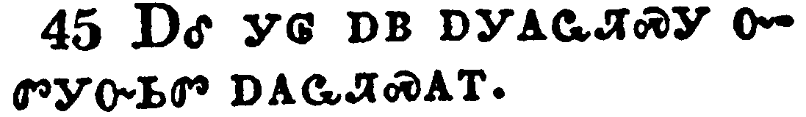</a></td>
</tr>
<tr class="even">
<td>And he that seeth me seeth him that sent me.</td>
</tr>
<tr class="odd">
<td>ᎠᎴ ᎩᎶ ᎠᏴ ᎠᎩᎪᏩᏘᏍᎩ ᏅᏛᎩᏅᏏᏛ ᎠᎪᏩᏘᏍᎪᎢ.</td>
</tr>
<tr class="even">
<td>A-le gi-lo a-yv a-gi-go-wa-ti-s-gi nv-dv-gi-nv-si-dv a-go-wa-ti-s-go-i.</td>
</tr>
</tbody>
</table>

<table>
<tbody>
<tr class="odd">
<td></td>
</tr>
<tr class="even">
<td>I am come a light into the world, that whosoever believeth on me should not abide in darkness.</td>
</tr>
<tr class="odd">
<td>ᎠᏴ ᎢᎦᎦᏘ ᎡᎶᎯ ᎠᎩᎷᏥᎸ, ᎾᏍᎩ ᎩᎶ ᎠᏉᎯᏳᎲᏍᎨᏍᏗ ᎥᏝ ᎿᎭᏉ ᎤᎵᏏᎬ ᎤᏕᏗ ᏱᎨᏎᏍᏗ.</td>
</tr>
<tr class="even">
<td>A-yv i-ga-ga-ti e-lo-hi a-gi-lu-tsi-lv, na-s-gi gi-lo a-quo-hi-yu-hv-s-ge-s-di v-tla hna-quo u-li-si-gv u-de-di yi-ge-se-s-di.</td>
</tr>
</tbody>
</table>

<table>
<tbody>
<tr class="odd">
<td><a href="041247.png">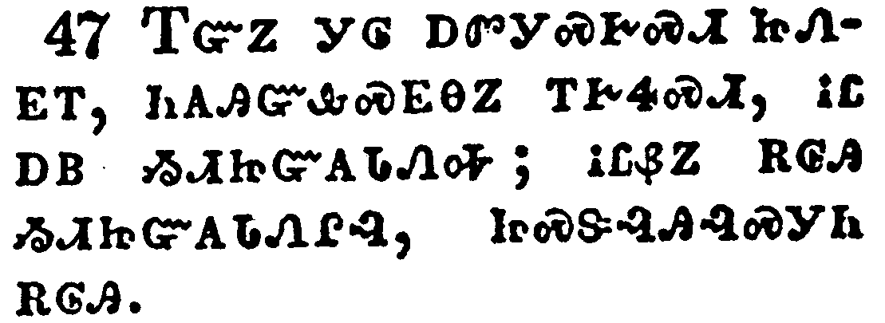</a></td>
</tr>
<tr class="even">
<td>And if any man hear my words, and believe not, I judge him not: for I came not to judge the world, but to save the world.</td>
</tr>
<tr class="odd">
<td>ᎢᏳᏃ ᎩᎶ ᎠᏛᎩᏍᎨᏍᏗ ᏥᏁᎬᎢ, ᏂᎪᎯᏳᎲᏍᎬᎾᏃ ᎢᎨᏎᏍᏗ, ᎥᏝ ᎠᏴ ᏱᏗᏥᏳᎪᏓᏁᎭ; ᎥᏝᏰᏃ ᎡᎶᎯ ᏱᏗᏥᏳᎪᏓᏁᎵᎸ, ᏥᏍᏕᎸᎯᎸᏍᎩᏂ ᎡᎶᎯ.</td>
</tr>
<tr class="even">
<td>I-yu-no gi-lo a-dv-gi-s-ge-s-di tsi-ne-gv-i, ni-go-hi-yu-hv-s-gv-na-no i-ge-se-s-di, v-tla a-yv yi-di-tsi-yu-go-da-ne-ha; v-tla-ye-no e-lo-hi yi-di-tsi-yu-go-da-ne-li-lv, tsi-s-de-lv-hi-lv-s-gi-ni e-lo-hi.</td>
</tr>
</tbody>
</table>

<table>
<tbody>
<tr class="odd">
<td></td>
</tr>
<tr class="even">
<td>He that rejecteth me, and receiveth not my words, hath one that judgeth him: the word that I have spoken, the same shall judge him in the last day.</td>
</tr>
<tr class="odd">
<td>ᎠᎩᏐᏅᎢᏍᏗᏍᎩ ᎠᎴ ᏗᏓᏂᎸᎩ ᏂᎨᏒᎾ ᏥᏁᎬᎢ ᏧᏬᎪᏓᏁᎯ ᎤᏪᎭ. ᎧᏃᎮᏛ ᎠᎩᏁᏨᎯ ᎾᏍᎩ ᏧᏬᎪᏓᏁᏗ ᎨᏎᏍᏗ ᎤᎵᏍᏆᎸᏗ ᎢᎦ ᎨᏎᏍᏗ.</td>
</tr>
<tr class="even">
<td>A-gi-so-nv-i-s-di-s-gi a-le di-da-ni-lv-gi ni-ge-sv-na tsi-ne-gv-i tsu-wo-go-da-ne-hi u-we-ha. Ka-no-he-dv a-gi-ne-tsv-hi na-s-gi tsu-wo-go-da-ne-di ge-se-s-di u-li-s-qua-lv-di i-ga ge-se-s-di.</td>
</tr>
</tbody>
</table>

<table>
<tbody>
<tr class="odd">
<td><a href="041249.png">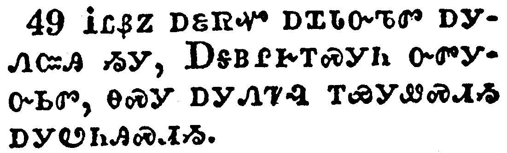</a></td>
</tr>
<tr class="even">
<td>For I have not spoken of myself; but the Father which sent me, he gave me a commandment, what I should say, and what I should speak.</td>
</tr>
<tr class="odd">
<td>ᎥᏝᏰᏃ ᎠᏋᏒᏉ ᎠᏆᏓᏅᏖᏛ ᎠᎩᏁᏨᎯ ᏱᎩ, ᎠᎦᏴᎵᎨᎢᏍᎩᏂ ᏅᏛᎩᏅᏏᏛ, ᎾᏍᎩ ᎠᎩᏁᏤᎸ ᎢᏯᎩᏪᏍᏗᏱ ᎠᎩᏬᏂᎯᏍᏗᏱ.</td>
</tr>
<tr class="even">
<td>V-tla-ye-no a-quv-sv-quo a-qua-da-nv-te-dv a-gi-ne-tsv-hi yi-gi, A-ga-yv-li-ge-i-s-gi-ni nv-dv-gi-nv-si-dv, na-s-gi a-gi-ne-tse-lv i-ya-gi-we-s-di-yi a-gi-wo-ni-hi-s-di-yi.</td>
</tr>
</tbody>
</table>

<table>
<tbody>
<tr class="odd">
<td><a href="041250.png">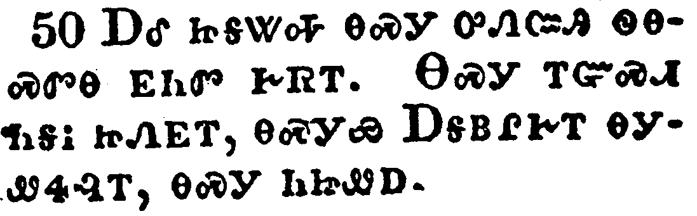</a></td>
</tr>
<tr class="even">
<td>And I know that his commandment is life everlasting: whatsoever I speak therefore, even as the Father said unto me, so I speak.</td>
</tr>
<tr class="odd">
<td>ᎠᎴ ᏥᎦᏔᎭ ᎾᏍᎩ ᎤᏁᏨᎯ ᏫᎾᏍᏛᎾ ᎬᏂᏛ ᎨᏒᎢ. ᎾᏍᎩ ᎢᏳᏍᏗ ᏂᎦᎥ ᏥᏁᎬᎢ, ᎾᏍᎩᏯ ᎠᎦᏴᎵᎨᎢ ᎾᎩᏪᏎᎸᎢ, ᎾᏍᎩ ᏂᏥᏪᎠ.</td>
</tr>
<tr class="even">
<td>A-le tsi-ga-ta-ha na-s-gi u-ne-tsv-hi wi-na-s-dv-na gv-ni-dv ge-sv-i. Na-s-gi i-yu-s-di ni-ga-v tsi-ne-gv-i, na-s-gi-ya A-ga-yv-li-ge-i na-gi-we-se-lv-i, na-s-gi ni-tsi-we-a.</td>
</tr>
</tbody>
</table>

