+++
draft=false
date = 2014-12-18T21:11:07Z
title = "John - Chapter 13 - Cherokee New Testament"
weight = 1418955067

[taxonomies]

authors = ["Timothy Legg"]
categories = []
tags = []

[extra]
+++

<table>
<tbody>
<tr class="odd">
<td></td>
</tr>
<tr class="even">
<td>Now before the feast of the passover, when Jesus knew that his hour was come that he should depart out of this world unto the Father, having loved his own which were in the world, he loved them unto the end.</td>
</tr>
<tr class="odd">
<td>ᎠᏏᏃ ᎤᏃᏒᎩ ᎧᏃᎯᏰᎩ ᏗᎵᏍᏓᏴᏗᏱ, ᏥᏌ ᎠᎦᏔᎯᏳ ᎨᏒᎩ ᎤᏍᏆᎸᎡᎸ ᎠᏂ ᎡᎶᎯ ᎤᏓᏅᏍᏗᏱ, ᎠᎦᏴᎵᎨᏍᏛᏱ ᏭᎶᎯᏍᏗᏱ, ᏧᎨᏳᎯᏳ ᎢᏳᎵᏍᏔᏅᎯ ᎨᏒᎩ ᏧᏤᎵᎦ ᎡᎶᎯ ᎠᏁᎯ, ᎬᎵᏍᏆᏗᏍᎩ ᏧᎨᏳᎯᏳ ᎨᏒᎩ.</td>
</tr>
<tr class="even">
<td>A-si-no u-no-sv-gi ka-no-hi-ye-gi di-li-s-da-yv-di-yi, Tsi-sa a-ga-ta-hi-yu ge-sv-gi u-s-qua-lv-e-lv a-ni e-lo-hi u-da-nv-s-di-yi, A-ga-yv-li-ge-s-dv-yi wu-lo-hi-s-di-yi, tsu-ge-yu-hi-yu i-yu-li-s-ta-nv-hi ge-sv-gi tsu-tse-li-ga e-lo-hi a-ne-hi, gv-li-s-qua-di-s-gi tsu-ge-yu-hi-yu ge-sv-gi.</td>
</tr>
</tbody>
</table>

<table>
<tbody>
<tr class="odd">
<td><a href="041302.png">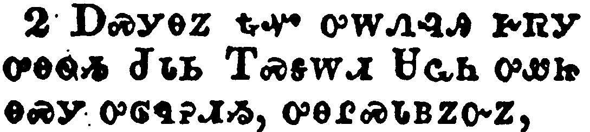</a></td>
</tr>
<tr class="even">
<td>And supper being ended, the devil having now put into the heart of Judas Iscariot, Simon's son, to betray him;</td>
</tr>
<tr class="odd">
<td>ᎠᏍᎩᎾᏃ ᎿᎭᏉ ᎤᎳᏁᎸᎯ ᎨᏒᎩ ᎤᎾᏫᏱ ᏧᏓᏏ ᎢᏍᎦᎳᏗ ᏌᏩᏂ ᎤᏪᏥ ᎾᏍᎩ ᎤᎶᏄᎮᏗᏱ, ᎤᎾᎵᏍᏓᏴᏃᏅᏃ,</td>
</tr>
<tr class="even">
<td>a-s-gi-na-no hna-quo u-la-ne-lv-hi ge-sv-gi u-na-wi-yi Tsu-da-si I-s-ga-la-di Sa-wa-ni u-we-tsi na-s-gi u-lo-nu-he-di-yi, u-na-li-s-da-yv-no-nv-no,</td>
</tr>
</tbody>
</table>

<table>
<tbody>
<tr class="odd">
<td><a href="041303.png">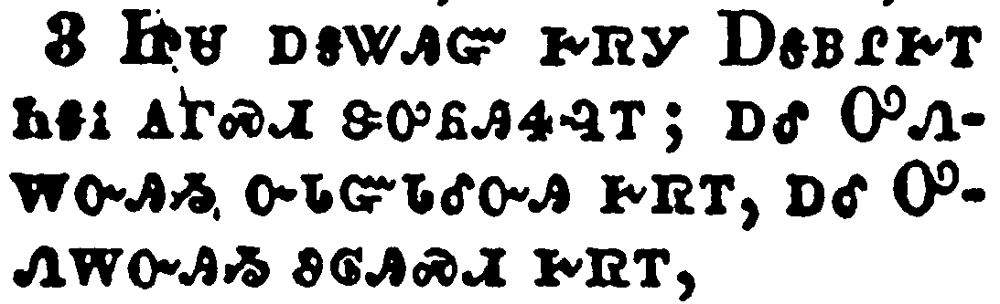</a></td>
</tr>
<tr class="even">
<td>Jesus knowing that the Father had given all things into his hands, and that he was come from God, and went to God;</td>
</tr>
<tr class="odd">
<td>ᏥᏌ ᎠᎦᏔᎯᏳ ᎨᏒᎩ ᎠᎦᏴᎵᎨᎢ ᏂᎦᎥ ᎪᎱᏍᏗ ᏕᎤᏲᎯᏎᎸᎢ; ᎠᎴ ᎤᏁᎳᏅᎯᏱ ᏅᏓᏳᏓᎴᏅᎯ ᎨᏒᎢ, ᎠᎴ ᎤᏁᎳᏅᎯᏱ ᏭᎶᎯᏍᏗ ᎨᏒᎢ,</td>
</tr>
<tr class="even">
<td>Tsi-sa a-ga-ta-hi-yu ge-sv-gi A-ga-yv-li-ge-i ni-ga-v go-hu-s-di de-u-yo-hi-se-lv-i; a-le U-ne-la-nv-hi-yi nv-da-yu-da-le-nv-hi ge-sv-i, a-le U-ne-la-nv-hi-yi wu-lo-hi-s-di ge-sv-i,</td>
</tr>
</tbody>
</table>

<table>
<tbody>
<tr class="odd">
<td><a href="041304.png">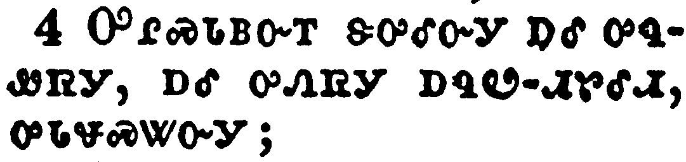</a></td>
</tr>
<tr class="even">
<td>He riseth from supper, and laid aside his garments; and took a towel, and girded himself.</td>
</tr>
<tr class="odd">
<td>ᎤᎵᏍᏓᏴᏅᎢ ᏕᎤᎴᏅᎩ ᎠᎴ ᎤᏄᏪᏒᎩ, ᎠᎴ ᎤᏁᏒᎩ ᎠᏄᏬ-ᏗᏑᎴᏗ, ᎤᏓᏠᏍᏔᏅᎩ;</td>
</tr>
<tr class="even">
<td>U-li-s-da-yv-nv-i de-u-le-nv-gi a-le u-nu-we-sv-gi, a-le u-ne-sv-gi a-nu-wo--di-su-le-di, u-da-tlo-s-ta-nv-gi;</td>
</tr>
</tbody>
</table>

<table>
<tbody>
<tr class="odd">
<td><a href="041305.png">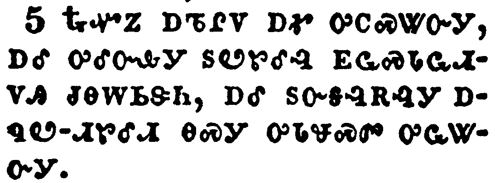</a></td>
</tr>
<tr class="even">
<td>After that he poureth water into a bason, and began to wash the disciples' feet, and to wipe them with the towel wherewith he was girded.</td>
</tr>
<tr class="odd">
<td>ᎿᎭᏉᏃ ᎠᏖᎵᏙ ᎠᎹ ᎤᏟᏍᏔᏅᎩ, ᎠᎴ ᎤᎴᏅᎲᎩ ᏚᏬᏑᎴᎸ ᎬᏩᏍᏓᏩᏗᏙᎯ ᏧᎾᎳᏏᏕᏂ, ᎠᎴ ᏚᏅᎦᎸᎡᎸᎩ ᎠᏄᏬ-ᏗᏑᎴᏗ ᎾᏍᎩ ᎤᏓᏠᏍᏛ ᎤᏩᏔᏅᎩ.</td>
</tr>
<tr class="even">
<td>Hna-quo-no a-te-li-do a-ma u-tli-s-ta-nv-gi, a-le u-le-nv-hv-gi du-wo-su-le-lv gv-wa-s-da-wa-di-do-hi tsu-na-la-si-de-ni, a-le du-nv-ga-lv-e-lv-gi a-nu-wo--di-su-le-di na-s-gi u-da-tlo-s-dv u-wa-ta-nv-gi.</td>
</tr>
</tbody>
</table>

<table>
<tbody>
<tr class="odd">
<td><a href="041306.png">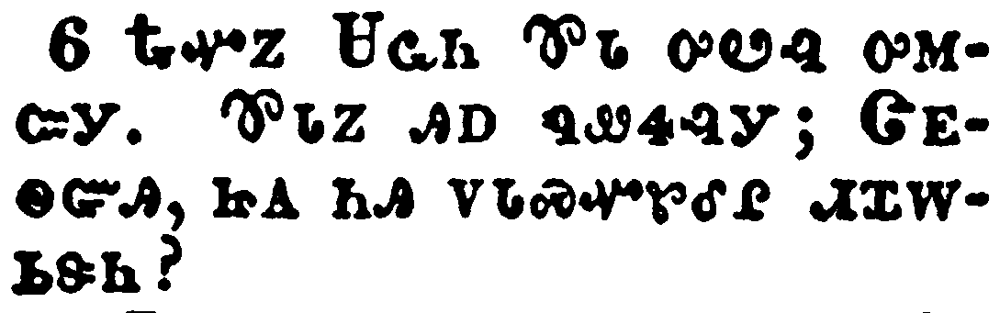</a></td>
</tr>
<tr class="even">
<td>Then cometh he to Simon Peter: and Peter saith unto him, Lord, dost thou wash my feet?</td>
</tr>
<tr class="odd">
<td>ᎿᎭᏉᏃ ᏌᏩᏂ ᏈᏓ ᎤᏬᎸ ᎤᎷᏨᎩ. ᏈᏓᏃ ᎯᎠ ᏄᏪᏎᎸᎩ; ᏣᎬᏫᏳᎯ, ᏥᎪ ᏂᎯ ᏙᏓᏍᏉᏑᎴᎵ ᏗᏆᎳᏏᏕᏂ?</td>
</tr>
<tr class="even">
<td>Hna-quo-no Sa-wa-ni Qui-da u-wo-lv u-lu-tsv-gi. Qui-da-no hi-a nu-we-se-lv-gi; Tsa-gv-wi-yu-hi, tsi-go ni-hi do-da-s-quo-su-le-li di-qua-la-si-de-ni?</td>
</tr>
</tbody>
</table>

<table>
<tbody>
<tr class="odd">
<td></td>
</tr>
<tr class="even">
<td>Jesus answered and said unto him, What I do thou knowest not now; but thou shalt know hereafter.</td>
</tr>
<tr class="odd">
<td>ᏥᏌ ᎤᏁᏨ ᎯᎠ ᏄᏪᏎᎸᎩ; ᎯᎠ ᏥᏂᎦᏛᏁᎭ ᎥᏝ ᎪᎯ ᎨᏒ ᏱᎦᏔᎭ, ᎣᏂᏍᎩᏂ ᏘᎦᏙᎥᏏ.</td>
</tr>
<tr class="even">
<td>Tsi-sa u-ne-tsv hi-a nu-we-se-lv-gi; Hi-a tsi-ni-ga-dv-ne-ha v-tla go-hi ge-sv yi-ga-ta-ha, o-ni-s-gi-ni ti-ga-do-v-si.</td>
</tr>
</tbody>
</table>

<table>
<tbody>
<tr class="odd">
<td><a href="041308.png">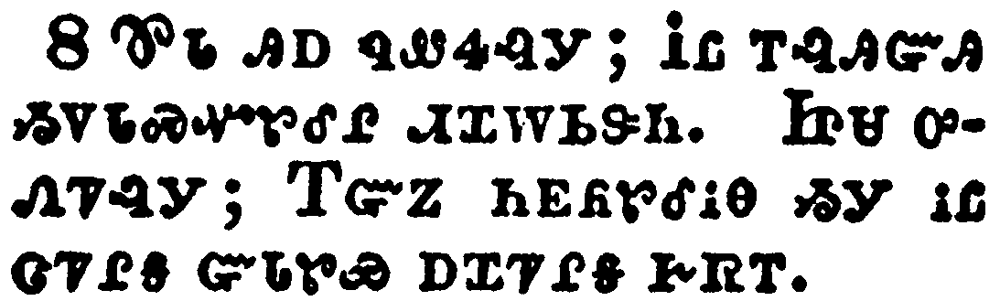</a></td>
</tr>
<tr class="even">
<td>Peter saith unto him, Thou shalt never wash my feet. Jesus answered him, If I wash thee not, thou hast no part with me.</td>
</tr>
<tr class="odd">
<td>ᏈᏓ ᎯᎠ ᏄᏪᏎᎸᎩ; ᎥᏝ ᎢᎸᎯᏳᎯ ᏱᏙᏓᏍᏉᏑᎴᎵ ᏗᏆᎳᏏᏕᏂ. ᏥᏌ ᎤᏁᏤᎸᎩ; ᎢᏳᏃ ᏂᎬᏲᏑᎴᎥᎾ ᏱᎩ ᎥᏝ ᏣᏤᎵᎦ ᏳᏓᏑᏯ ᎠᏆᏤᎵᎦ ᎨᏒᎢ.</td>
</tr>
<tr class="even">
<td>Qui-da hi-a nu-we-se-lv-gi; V-tla i-lv-hi-yu-hi yi-do-da-s-quo-su-le-li di-qua-la-si-de-ni. Tsi-sa u-ne-tse-lv-gi; I-yu-no ni-gv-yo-su-le-v-na yi-gi v-tla tsa-tse-li-ga yu-da-su-ya a-qua-tse-li-ga ge-sv-i.</td>
</tr>
</tbody>
</table>

<table>
<tbody>
<tr class="odd">
<td><a href="041309.png">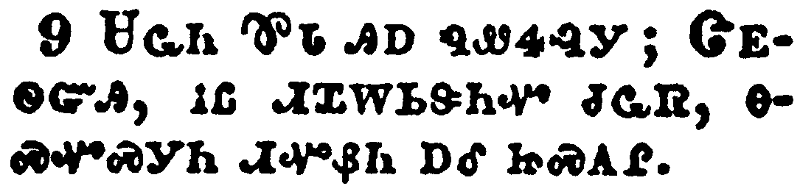</a></td>
</tr>
<tr class="even">
<td>Simon Peter saith unto him, Lord, not my feet only, but also my hands and my head.</td>
</tr>
<tr class="odd">
<td>ᏌᏩᏂ ᏈᏓ ᎯᎠ ᏄᏪᏎᎸᎩ; ᏣᎬᏫᏳᎯ, ᎥᏝ ᏗᏆᎳᏏᏕᏂᏉ ᏧᏩᏒ, ᎾᏍᏉᏍᎩᏂ ᏗᏉᏰᏂ ᎠᎴ ᏥᏍᎪᎵ.</td>
</tr>
<tr class="even">
<td>Sa-wa-ni Qui-da hi-a nu-we-se-lv-gi; Tsa-gv-wi-yu-hi, v-tla di-qua-la-si-de-ni-quo tsu-wa-sv, na-s-quo-s-gi-ni di-quo-ye-ni a-le tsi-s-go-li.</td>
</tr>
</tbody>
</table>

<table>
<tbody>
<tr class="odd">
<td><a href="041310.png">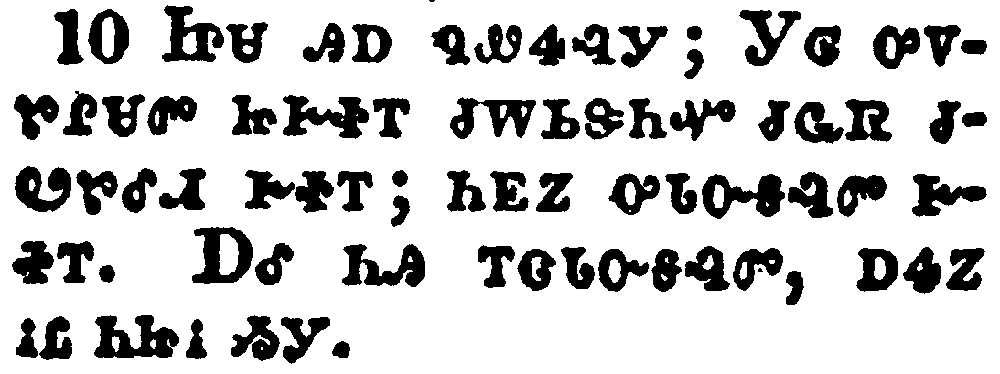</a></td>
</tr>
<tr class="even">
<td>Jesus saith to him, He that is washed needeth not save to wash his feet, but is clean every whit: and ye are clean, but not all.</td>
</tr>
<tr class="odd">
<td>ᏥᏌ ᎯᎠ ᏄᏪᏎᎸᎩ; ᎩᎶ ᎤᏙᏑᎵᏌᏛ ᏥᎨᏐᎢ ᏧᎳᏏᏕᏂᏉ ᏧᏩᏒ ᏧᏬᏑᎴᏗ ᎨᏐᎢ; ᏂᎬᏃ ᎤᏓᏅᎦᎸᏛ ᎨᏐᎢ. ᎠᎴ ᏂᎯ ᎢᏣᏓᏅᎦᎸᏛ, ᎠᏎᏃ ᎥᏝ ᏂᏥᎥ ᏱᎩ.</td>
</tr>
<tr class="even">
<td>Tsi-sa hi-a nu-we-se-lv-gi; Gi-lo u-do-su-li-sa-dv tsi-ge-so-i tsu-la-si-de-ni-quo tsu-wa-sv tsu-wo-su-le-di ge-so-i; ni-gv-no u-da-nv-ga-lv-dv ge-so-i. A-le ni-hi i-tsa-da-nv-ga-lv-dv, a-se-no v-tla ni-tsi-v yi-gi.</td>
</tr>
</tbody>
</table>

<table>
<tbody>
<tr class="odd">
<td><a href="041311.png">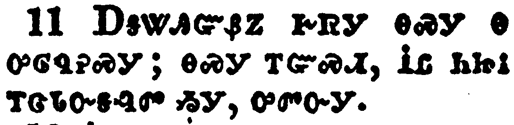</a></td>
</tr>
<tr class="even">
<td>For he knew who should betray him; therefore said he, Ye are not all clean.</td>
</tr>
<tr class="odd">
<td>ᎠᎦᏔᎯᏳᏰᏃ ᎨᏒᎩ ᎾᏍᎩ Ꮎ ᎤᎶᏄᎮᏍᎩ; ᎾᏍᎩ ᎢᏳᏍᏗ, ᎥᏝ ᏂᏥᎥ ᎢᏣᏓᏅᎦᎸᏛ ᏱᎩ, ᎤᏛᏅᎩ.</td>
</tr>
<tr class="even">
<td>A-ga-ta-hi-yu-ye-no ge-sv-gi na-s-gi na u-lo-nu-he-s-gi; na-s-gi i-yu-s-di, V-tla ni-tsi-v i-tsa-da-nv-ga-lv-dv yi-gi, u-dv-nv-gi.</td>
</tr>
</tbody>
</table>

<table>
<tbody>
<tr class="odd">
<td><a href="041312.png">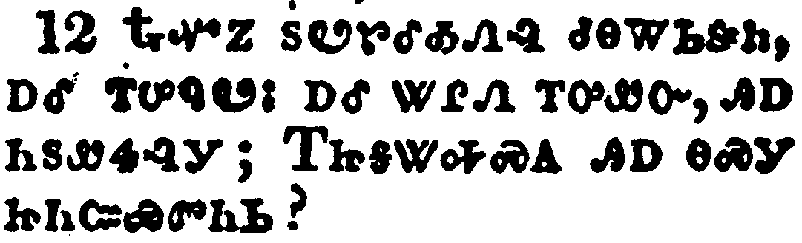</a></td>
</tr>
<tr class="even">
<td>So after he had washed their feet, and had taken his garments, and was set down again, he said unto them, Know ye what I have done to you?</td>
</tr>
<tr class="odd">
<td>ᎿᎭᏉᏃ ᏚᏬᏑᎴᎣᏁᎸ ᏧᎾᎳᏏᏕᏂ, ᎠᎴ ᎢᎤᏄᏬᎥ; ᎠᎴ ᏔᎵᏁ ᎢᎤᏪᏅ, ᎯᎠ ᏂᏚᏪᏎᎸᎩ; ᎢᏥᎦᏔᎭᏍᎪ ᎯᎠ ᎾᏍᎩ ᏥᏂᏨᏯᏛᏂᏏ?</td>
</tr>
<tr class="even">
<td>Hna-quo-no du-wo-su-le-o-ne-lv tsu-na-la-si-de-ni, a-le i-u-nu-wo-v; a-le ta-li-ne i-u-we-nv, hi-a ni-du-we-se-lv-gi; I-tsi-ga-ta-ha-s-go hi-a na-s-gi tsi-ni-tsv-ya-dv-ni-si?</td>
</tr>
</tbody>
</table>

<table>
<tbody>
<tr class="odd">
<td><a href="041313.png">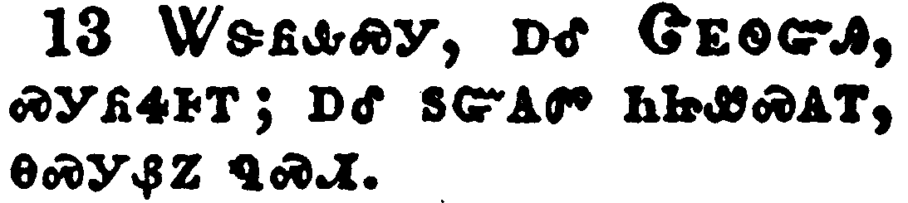</a></td>
</tr>
<tr class="even">
<td>Ye call me Master and Lord: and ye say well; for so I am.</td>
</tr>
<tr class="odd">
<td>ᏔᏕᏲᎲᏍᎩ, ᎠᎴ ᏣᎬᏫᏳᎯ, ᏍᎩᏲᏎᎰᎢ; ᎠᎴ ᏚᏳᎪᏛ ᏂᏥᏪᏍᎪᎢ, ᎾᏍᎩᏰᏃ ᏄᏍᏗ.</td>
</tr>
<tr class="even">
<td>Ta-de-yo-hv-s-gi, a-le Tsa-gv-wi-yu-hi, s-gi-yo-se-ho-i; a-le du-yu-go-dv ni-tsi-we-s-go-i, na-s-gi-ye-no nu-s-di.</td>
</tr>
</tbody>
</table>

<table>
<tbody>
<tr class="odd">
<td><a href="041314.png">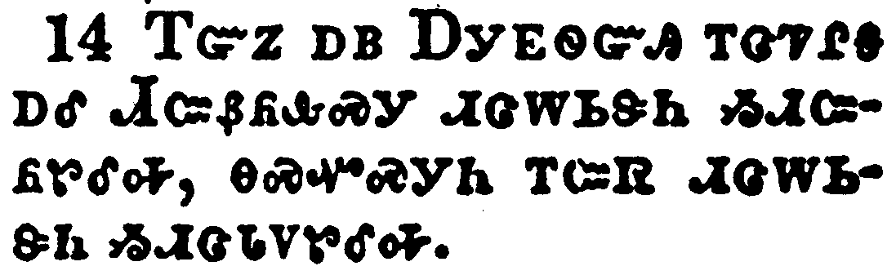</a></td>
</tr>
<tr class="even">
<td>If I then, your Lord and Master, have washed your feet; ye also ought to wash one another's feet.</td>
</tr>
<tr class="odd">
<td>ᎢᏳᏃ ᎠᏴ ᎠᎩᎬᏫᏳᎯ ᎢᏣᏤᎵᎦ ᎠᎴ ᏗᏨᏰᏲᎲᏍᎩ ᏗᏣᎳᏏᏕᏂ ᏱᏗᏨᏲᏑᎴᎭ, ᎾᏍᏉᏍᎩᏂ ᎢᏨᏒ ᎢᏣᎳᏏᏕᏂ ᏱᏗᏣᏓᏙᏑᎴᎭ.</td>
</tr>
<tr class="even">
<td>I-yu-no a-yv A-gi-gv-wi-yu-hi i-tsa-tse-li-ga a-le Di-tsv-ye-yo-hv-s-gi di-tsa-la-si-de-ni yi-di-tsv-yo-su-le-ha, na-s-quo-s-gi-ni i-tsv-sv i-tsa-la-si-de-ni yi-di-tsa-da-do-su-le-ha.</td>
</tr>
</tbody>
</table>

<table>
<tbody>
<tr class="odd">
<td><a href="041315.png">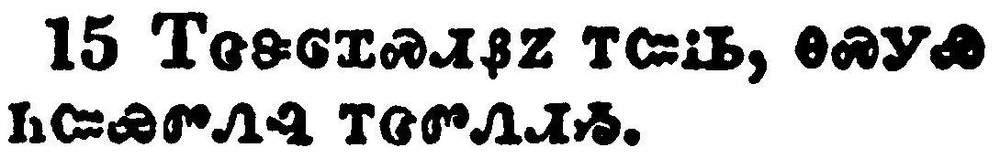</a></td>
</tr>
<tr class="even">
<td>For I have given you an example, that ye should do as I have done to you.</td>
</tr>
<tr class="odd">
<td>ᎢᏣᏕᎶᏆᏍᏗᏰᏃ ᎢᏨᎥᏏ, ᎾᏍᎩᏯ ᏂᏨᏯᏛᏁᎸ ᎢᏣᏛᏁᏗᏱ.</td>
</tr>
<tr class="even">
<td>I-tsa-de-lo-qua-s-di-ye-no i-tsv-v-si, na-s-gi-ya ni-tsv-ya-dv-ne-lv i-tsa-dv-ne-di-yi.</td>
</tr>
</tbody>
</table>

<table>
<tbody>
<tr class="odd">
<td><a href="041316.png">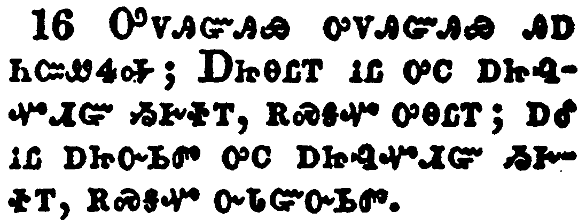</a></td>
</tr>
<tr class="even">
<td>Verily, verily, I say unto you, The servant is not greater than his lord; neither he that is sent greater than he that sent him.</td>
</tr>
<tr class="odd">
<td>ᎤᏙᎯᏳᎯᏯ ᎤᏙᎯᏳᎯᏯ ᎯᎠ ᏂᏨᏪᏎᎭ; ᎠᏥᎾᏝᎢ ᎥᏝ ᎤᏟ ᎠᏥᎸᏉᏗᏳ ᏱᎨᏐᎢ, ᎡᏍᎦᏉ ᎤᎾᏝᎢ; ᎠᎴ ᎥᏝ ᎠᏥᏅᏏᏛ ᎤᏟ ᎠᏥᎸᏉᏗᏳ ᏱᎨᏐᎢ, ᎡᏍᎦᏉ ᏅᏓᏳᏅᏏᏛ.</td>
</tr>
<tr class="even">
<td>U-do-hi-yu-hi-ya u-do-hi-yu-hi-ya hi-a ni-tsv-we-se-ha; A-tsi-na-tla-i v-tla u-tli a-tsi-lv-quo-di-yu yi-ge-so-i, e-s-ga-quo u-na-tla-i; a-le v-tla a-tsi-nv-si-dv u-tli a-tsi-lv-quo-di-yu yi-ge-so-i, e-s-ga-quo nv-da-yu-nv-si-dv.</td>
</tr>
</tbody>
</table>

<table>
<tbody>
<tr class="odd">
<td><a href="041317.png">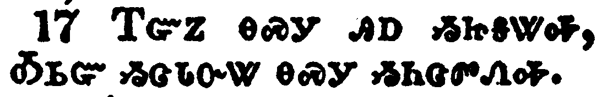</a></td>
</tr>
<tr class="even">
<td>If ye know these things, happy are ye if ye do them.</td>
</tr>
<tr class="odd">
<td>ᎢᏳᏃ ᎾᏍᎩ ᎯᎠ ᏱᏥᎦᏔᎭ, ᎣᏏᏳ ᏱᏣᏓᏅᏔ ᎾᏍᎩ ᏱᏂᏣᏛᏁᎭ.</td>
</tr>
<tr class="even">
<td>I-yu-no na-s-gi hi-a yi-tsi-ga-ta-ha, O-si-yu yi-tsa-da-nv-ta na-s-gi yi-ni-tsa-dv-ne-ha.</td>
</tr>
</tbody>
</table>

<table>
<tbody>
<tr class="odd">
<td><a href="041318.png">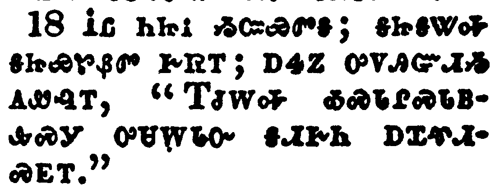</a></td>
</tr>
<tr class="even">
<td>I speak not of you all: I know whom I have chosen: but that the scripture may be fulfilled, He that eateth bread with me hath lifted up his heel against me.</td>
</tr>
<tr class="odd">
<td>ᎥᏝ ᏂᏥᎥ ᏱᏨᏯᏛᎦ; ᎦᏥᎦᏔᎭ ᎦᏥᏯᏑᏰᏛ ᎨᏒᎢ; ᎠᏎᏃ ᎤᏙᎯᏳᏗᏱ ᎪᏪᎸᎢ, "ᎢᏧᎳᎭ ᎣᏍᏓᎵᏍᏓᏴᎲᏍᎩ ᎤᏌᎳᏓᏅ ᎦᏗᎨᏂ ᎠᏆᏡᏗᏍᎬᎢ."</td>
</tr>
<tr class="even">
<td>V-tla ni-tsi-v yi-tsv-ya-dv-ga; ga-tsi-ga-ta-ha ga-tsi-ya-su-ye-dv ge-sv-i; a-se-no u-do-hi-yu-di-yi go-we-lv-i, "I-tsu-la-ha o-s-da-li-s-da-yv-hv-s-gi u-sa-la-da-nv ga-di-ge-ni a-qua-tlu-di-s-gv-i."</td>
</tr>
</tbody>
</table>

<table>
<tbody>
<tr class="odd">
<td><a href="041319.png">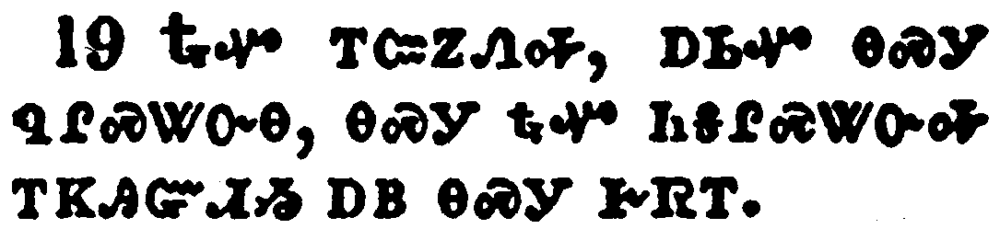</a></td>
</tr>
<tr class="even">
<td>Now I tell you before it come, that, when it is come to pass, ye may believe that I am he.</td>
</tr>
<tr class="odd">
<td>ᎿᎭᏉ ᎢᏨᏃᏁᎭ, ᎠᏏᏉ ᎾᏍᎩ ᏄᎵᏍᏔᏅᎾ, ᎾᏍᎩ ᎿᎭᏉ ᏂᎦᎵᏍᏔᏅᎭ ᎢᏦᎯᏳᏗᏱ ᎠᏴ ᎾᏍᎩ ᎨᏒᎢ.</td>
</tr>
<tr class="even">
<td>Hna-quo i-tsv-no-ne-ha, a-si-quo na-s-gi nu-li-s-ta-nv-na, na-s-gi hna-quo ni-ga-li-s-ta-nv-ha i-tso-hi-yu-di-yi a-yv na-s-gi ge-sv-i.</td>
</tr>
</tbody>
</table>

<table>
<tbody>
<tr class="odd">
<td><a href="041320.png">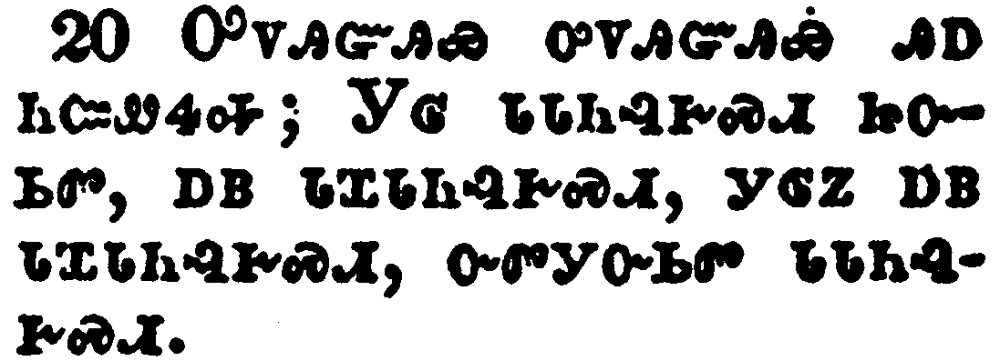</a></td>
</tr>
<tr class="even">
<td>Verily, verily, I say unto you, He that receiveth whomsoever I send receiveth me; and he that receiveth me receiveth him that sent me.</td>
</tr>
<tr class="odd">
<td>ᎤᏙᎯᏳᎯᏯ ᎤᏙᎯᏳᎯᏯ ᎯᎠ ᏂᏨᏪᏎᎭ; ᎩᎶ ᏓᏓᏂᎸᎨᏍᏗ ᏥᏅᏏᏛ, ᎠᏴ ᏓᏆᏓᏂᎸᎨᏍᏗ, ᎩᎶᏃ ᎠᏴ ᏓᏆᏓᏂᎸᎨᏍᏗ, ᏅᏛᎩᏅᏏᏛ ᏓᏓᏂᎸᎨᏍᏗ.</td>
</tr>
<tr class="even">
<td>U-do-hi-yu-hi-ya u-do-hi-yu-hi-ya hi-a ni-tsv-we-se-ha; Gi-lo da-da-ni-lv-ge-s-di tsi-nv-si-dv, a-yv da-qua-da-ni-lv-ge-s-di, gi-lo-no a-yv da-qua-da-ni-lv-ge-s-di, nv-dv-gi-nv-si-dv da-da-ni-lv-ge-s-di.</td>
</tr>
</tbody>
</table>

<table>
<tbody>
<tr class="odd">
<td><a href="041321.png">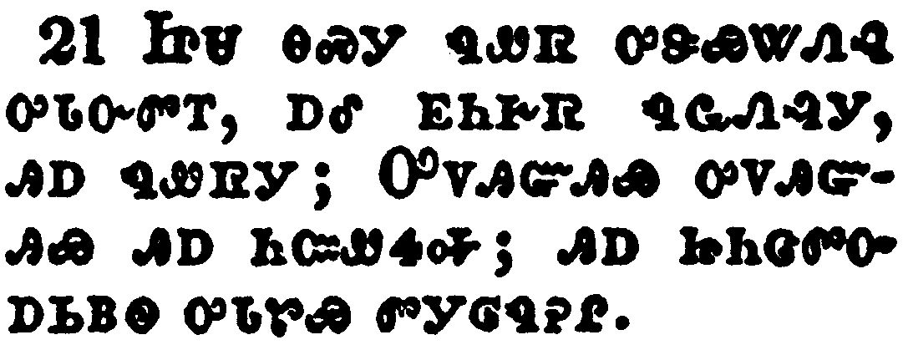</a></td>
</tr>
<tr class="even">
<td>When Jesus had thus said, he was troubled in spirit, and testified, and said, Verily, verily, I say unto you, that one of you shall betray me.</td>
</tr>
<tr class="odd">
<td>ᏥᏌ ᎾᏍᎩ ᏄᏪᏒ ᎤᏕᏯᏔᏁᎸ ᎤᏓᏅᏛᎢ, ᎠᎴ ᎬᏂᎨᏒ ᏄᏩᏁᎸᎩ, ᎯᎠ ᏄᏪᏒᎩ; ᎤᏙᎯᏳᎯᏯ ᎤᏙᎯᏳᎯᎭ ᎯᎠ ᏂᏨᏪᏎᎭ; ᎯᎠ ᏥᏂᏣᏛᏅ ᎠᏏᏴᏫ ᎤᏓᏑᏯ ᏛᎩᎶᏄᎮᎵ.</td>
</tr>
<tr class="even">
<td>Tsi-sa na-s-gi nu-we-sv u-de-ya-ta-ne-lv u-da-nv-dv-i, a-le gv-ni-ge-sv nu-wa-ne-lv-gi, hi-a nu-we-sv-gi; U-do-hi-yu-hi-ya u-do-hi-yu-hi-ha hi-a ni-tsv-we-se-ha; hi-a tsi-ni-tsa-dv-nv a-si-yv-wi u-da-su-ya dv-gi-lo-nu-he-li.</td>
</tr>
</tbody>
</table>

<table>
<tbody>
<tr class="odd">
<td><a href="041322.png">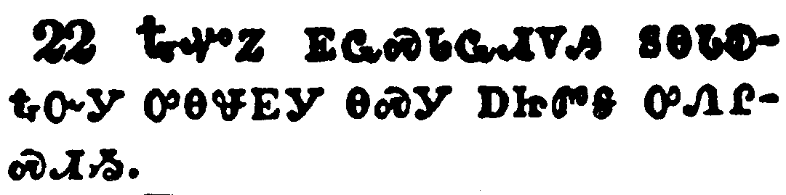</a></td>
</tr>
<tr class="even">
<td>Then the disciples looked one on another, doubting of whom he spake.</td>
</tr>
<tr class="odd">
<td>ᎿᎭᏉᏃ ᎬᏩᏍᏓᏩᏗᏙᎯ ᏚᎾᏓᎧᎿᎭᏅᎩ ᎤᎾᏠᎬᎩ ᎾᏍᎩ ᎠᏥᏛᎦ ᎤᏁᎵᏍᏗᏱ.</td>
</tr>
<tr class="even">
<td>Hna-quo-no gv-wa-s-da-wa-di-do-hi du-na-da-ka-hna-nv-gi u-na-tlo-gv-gi na-s-gi a-tsi-dv-ga u-ne-li-s-di-yi.</td>
</tr>
</tbody>
</table>

<table>
<tbody>
<tr class="odd">
<td><a href="041323.png">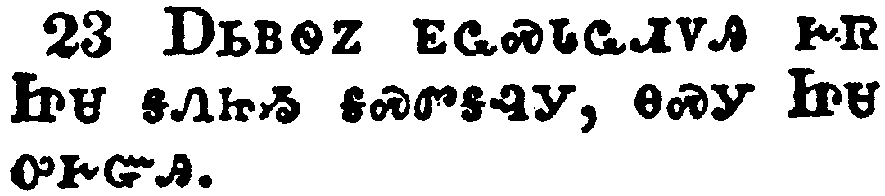</a></td>
</tr>
<tr class="even">
<td>Now there was leaning on Jesus' bosom one of his disciples, whom Jesus loved.</td>
</tr>
<tr class="odd">
<td>ᎠᏏᏴᏫᏃ ᎬᏩᏍᏓᏩᏗᏙᎯ ᎨᏒ ᏥᏌ ᎦᏁᏥᏱ ᎦᏍᏛᎦᎸᎩ, ᎾᏍᎩ ᏥᏌ ᎤᎨᏳᎯ.</td>
</tr>
<tr class="even">
<td>A-si-yv-wi-no gv-wa-s-da-wa-di-do-hi ge-sv Tsi-sa ga-ne-tsi-yi ga-s-dv-ga-lv-gi, na-s-gi Tsi-sa u-ge-yu-hi.</td>
</tr>
</tbody>
</table>

<table>
<tbody>
<tr class="odd">
<td><a href="041324.png">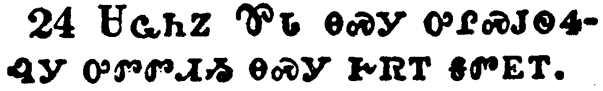</a></td>
</tr>
<tr class="even">
<td>Simon Peter therefore beckoned to him, that he should ask who it should be of whom he spake.</td>
</tr>
<tr class="odd">
<td>ᏌᏩᏂᏃ ᏈᏓ ᎾᏍᎩ ᎤᎵᏍᎫᏫᏎᎸᎩ ᎤᏛᏛᏗᏱ ᎾᏍᎩ ᎨᏒᎢ ᎦᏛᎬᎢ.</td>
</tr>
<tr class="even">
<td>Sa-wa-ni-no Qui-da na-s-gi u-li-s-gu-wi-se-lv-gi u-dv-dv-di-yi na-s-gi ge-sv-i ga-dv-gv-i.</td>
</tr>
</tbody>
</table>

<table>
<tbody>
<tr class="odd">
<td><a href="041325.png">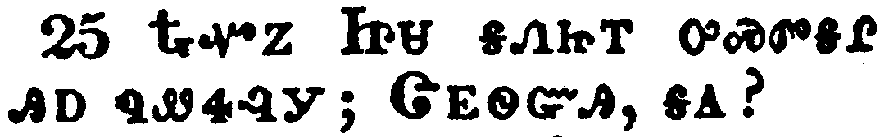</a></td>
</tr>
<tr class="even">
<td>He then lying on Jesus' breast saith unto him, Lord, who is it?</td>
</tr>
<tr class="odd">
<td>ᎿᎭᏉᏃ ᏥᏌ ᎦᏁᏥᎢ ᎤᏍᏛᎦᎵ ᎯᎠ ᏄᏪᏎᎸᎩ; ᏣᎬᏫᏳᎯ, ᎦᎪ?</td>
</tr>
<tr class="even">
<td>Hna-quo-no Tsi-sa ga-ne-tsi-i u-s-dv-ga-li hi-a nu-we-se-lv-gi; Tsa-gv-wi-yu-hi, ga-go?</td>
</tr>
</tbody>
</table>

<table>
<tbody>
<tr class="odd">
<td><a href="041326.png">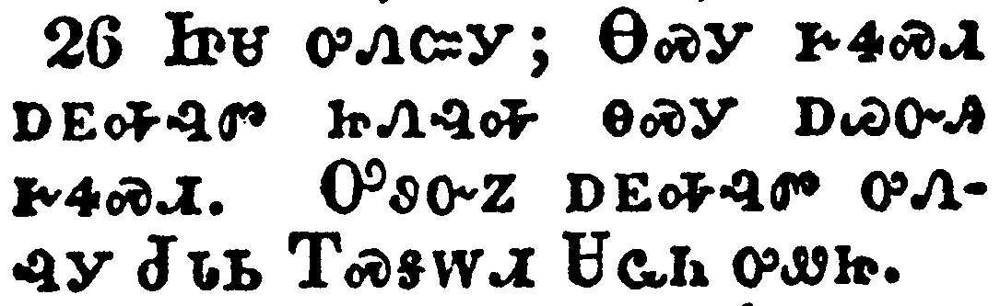</a></td>
</tr>
<tr class="even">
<td>Jesus answered, He it is, to whom I shall give a sop, when I have dipped it. And when he had dipped the sop, he gave it to Judas Iscariot, the son of Simon.</td>
</tr>
<tr class="odd">
<td>ᏥᏌ ᎤᏁᏨᎩ; ᎾᏍᎩ ᎨᏎᏍᏗ ᎠᎬᎭᎸᏛ ᏥᏁᎸᎭ ᎾᏍᎩ ᎠᏊᏅᎯ ᎨᏎᏍᏗ. ᎤᏭᏅᏃ ᎠᎬᎭᎸᏛ ᎤᏁᎸᎩ ᏧᏓᏏ ᎢᏍᎦᎳᏗ ᏌᏩᏂ ᎤᏪᏥ.</td>
</tr>
<tr class="even">
<td>Tsi-sa u-ne-tsv-gi; Na-s-gi ge-se-s-di a-gv-ha-lv-dv tsi-ne-lv-ha na-s-gi a-quu-nv-hi ge-se-s-di. U-wu-nv-no a-gv-ha-lv-dv u-ne-lv-gi Tsu-da-si I-s-ga-la-di Sa-wa-ni u-we-tsi.</td>
</tr>
</tbody>
</table>

<table>
<tbody>
<tr class="odd">
<td><a href="041327.png">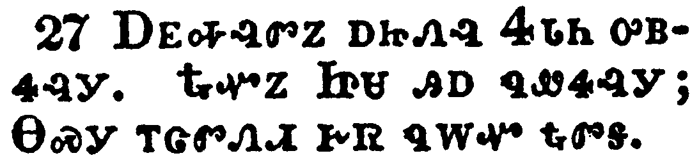</a></td>
</tr>
<tr class="even">
<td>And after the sop Satan entered into him. Then said Jesus unto him, That thou doest, do quickly.</td>
</tr>
<tr class="odd">
<td>ᎠᎬᎭᎸᏛᏃ ᎠᏥᏁᎸ ᏎᏓᏂ ᎤᏴᏎᎸᎩ. ᎿᎭᏉᏃ ᏥᏌ ᎯᎠ ᏄᏪᏎᎸᎩ; ᎾᏍᎩ ᎢᏣᏛᏁᏗ ᎨᏒ ᏄᎳᏉ ᎿᎭᏛᎦ.</td>
</tr>
<tr class="even">
<td>A-gv-ha-lv-dv-no a-tsi-ne-lv Se-da-ni u-yv-se-lv-gi. Hna-quo-no Tsi-sa hi-a nu-we-se-lv-gi; Na-s-gi i-tsa-dv-ne-di ge-sv nu-la-quo hna-dv-ga.</td>
</tr>
</tbody>
</table>

<table>
<tbody>
<tr class="odd">
<td><a href="041328.png">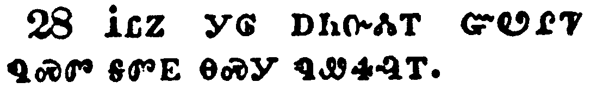</a></td>
</tr>
<tr class="even">
<td>Now no man at the table knew for what intent he spake this unto him.</td>
</tr>
<tr class="odd">
<td>ᎥᏝᏃ ᎩᎶ ᎠᏂᏅᏜᏓᎢ ᏳᏬᎵᏤ ᏄᏍᏛ ᎦᏛᎬ ᎾᏍᎩ ᏄᏪᏎᎸᎢ.</td>
</tr>
<tr class="even">
<td>V-tla-no gi-lo a-ni-nv-dla-i yu-wo-li-tse nu-s-dv ga-dv-gv na-s-gi nu-we-se-lv-i.</td>
</tr>
</tbody>
</table>

<table>
<tbody>
<tr class="odd">
<td><a href="041329.png">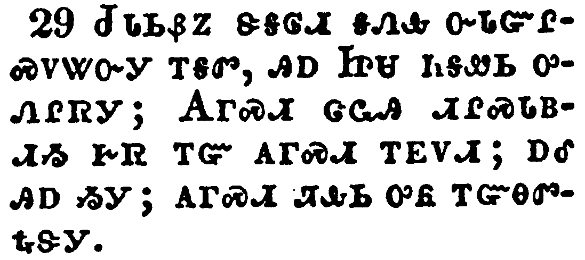</a></td>
</tr>
<tr class="even">
<td>For some of them thought, because Judas had the bag, that Jesus had said unto him, Buy those things that we have need of against the feast; or, that he should give something to the poor.</td>
</tr>
<tr class="odd">
<td>ᏧᏓᏏᏰᏃ ᏕᎦᎶᏗ ᎦᏁᎲ ᏅᏓᏳᎵᏍᏙᏔᏅᎩ ᎢᎦᏛ, ᎯᎠ ᏥᏌ ᏂᎦᏪᏏ ᎤᏁᎵᏒᎩ; ᎪᎱᏍᏗ ᏣᏩᎯ ᏗᎵᏍᏓᏴᏗᏱ ᎨᏒ ᎢᏳ ᎪᎱᏍᏗ ᎢᎬᏙᏗ; ᎠᎴ ᎯᎠ ᏱᎩ; ᎪᎱᏍᏗ ᏘᎲᏏ ᎤᏲ ᎢᏳᎾᏛᎿᎭᏕᎩ.</td>
</tr>
<tr class="even">
<td>Tsu-da-si-ye-no de-ga-lo-di ga-ne-hv nv-da-yu-li-s-do-ta-nv-gi i-ga-dv, hi-a Tsi-sa ni-ga-we-si u-ne-li-sv-gi; Go-hu-s-di tsa-wa-hi di-li-s-da-yv-di-yi ge-sv i-yu go-hu-s-di i-gv-do-di; a-le hi-a yi-gi; go-hu-s-di ti-hv-si u-yo i-yu-na-dv-hna-de-gi.</td>
</tr>
</tbody>
</table>

<table>
<tbody>
<tr class="odd">
<td><a href="041330.png">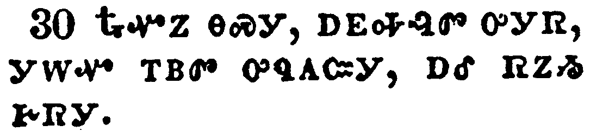</a></td>
</tr>
<tr class="even">
<td>He then having received the sop went immediately out: and it was night.</td>
</tr>
<tr class="odd">
<td>ᎿᎭᏉᏃ ᎾᏍᎩ, ᎠᎬᎭᎸᏛ ᎤᎩᏒ, ᎩᎳᏉ ᎢᏴᏛ ᎤᏄᎪᏨᎩ, ᎠᎴ ᏒᏃᏱ ᎨᏒᎩ.</td>
</tr>
<tr class="even">
<td>Hna-quo-no na-s-gi, a-gv-ha-lv-dv u-gi-sv, gi-la-quo i-yv-dv u-nu-go-tsv-gi, a-le sv-no-yi ge-sv-gi.</td>
</tr>
</tbody>
</table>

<table>
<tbody>
<tr class="odd">
<td><a href="041331.png">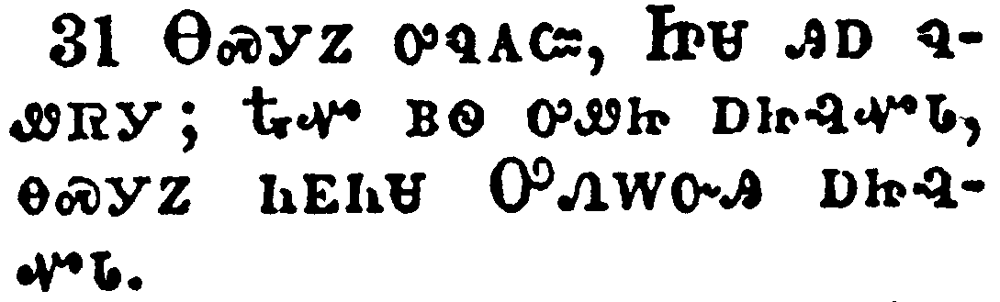</a></td>
</tr>
<tr class="even">
<td>Therefore, when he was gone out, Jesus said, Now is the Son of man glorified, and God is glorified in him.</td>
</tr>
<tr class="odd">
<td>ᎾᏍᎩᏃ ᎤᏄᎪᏨ, ᏥᏌ ᎯᎠ ᏄᏪᏒᎩ; ᎿᎭᏉ ᏴᏫ ᎤᏪᏥ ᎠᏥᎸᏉᏓ, ᎾᏍᎩᏃ ᏂᎬᏂᏌ ᎤᏁᎳᏅᎯ ᎠᏥᎸᏉᏓ.</td>
</tr>
<tr class="even">
<td>Na-s-gi-no u-nu-go-tsv, Tsi-sa hi-a nu-we-sv-gi; Hna-quo yv-wi u-we-tsi a-tsi-lv-quo-da, na-s-gi-no ni-gv-ni-sa U-ne-la-nv-hi a-tsi-lv-quo-da.</td>
</tr>
</tbody>
</table>

<table>
<tbody>
<tr class="odd">
<td></td>
</tr>
<tr class="even">
<td>If God be glorified in him, God shall also glorify him in himself, and shall straightway glorify him.</td>
</tr>
<tr class="odd">
<td>ᎢᏳᏃ ᎾᏍᎩ ᏱᏄᏩᏂᏌᏅ ᎤᏁᎳᏅᎯ ᏯᏥᎸᏉᏔᏅ, ᎤᏁᎳᏅᎯ ᎤᏩᏒ ᏅᏓᎬᏂᏌᏂ ᎾᏍᎩ ᏓᏳᎸᏉᏔᏂ, ᎠᎴ ᎩᎳᏉ ᎢᏴᏛ ᏓᏳᎸᏉᏔᏂ.</td>
</tr>
<tr class="even">
<td>I-yu-no na-s-gi yi-nu-wa-ni-sa-nv U-ne-la-nv-hi ya-tsi-lv-quo-ta-nv, U-ne-la-nv-hi u-wa-sv nv-da-gv-ni-sa-ni na-s-gi da-yu-lv-quo-ta-ni, a-le gi-la-quo i-yv-dv da-yu-lv-quo-ta-ni.</td>
</tr>
</tbody>
</table>

<table>
<tbody>
<tr class="odd">
<td><a href="041333.png">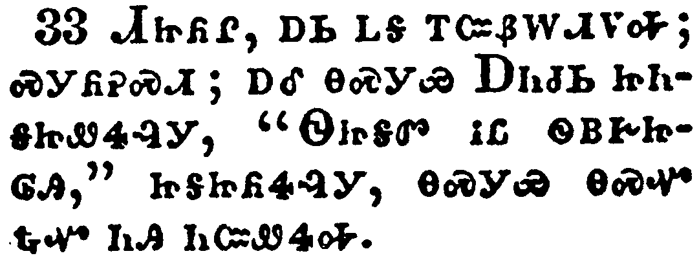</a></td>
</tr>
<tr class="even">
<td>Little children, yet a little while I am with you. Ye shall seek me: and as I said unto the Jews, Whither I go, ye cannot come; so now I say to you.</td>
</tr>
<tr class="odd">
<td>ᏗᏥᏲᎵ, ᎠᏏ ᏞᎦ ᎢᏨᏰᎳᏗᏙᎭ; ᏍᎩᏲᎮᏍᏗ; ᎠᎴ ᎾᏍᎩᏯ ᎠᏂᏧᏏ ᏥᏂᎦᏥᏪᏎᎸᎩ, "ᏫᏥᎦᏛ ᎥᏝ ᏫᏴᎨᏥᎶᎯ," ᏥᎦᏥᏲᏎᎸᎩ, ᎾᏍᎩᏯ ᎾᏍᏉ ᎿᎭᏉ ᏂᎯ ᏂᏨᏪᏎᎭ.</td>
</tr>
<tr class="even">
<td>Di-tsi-yo-li, a-si tle-ga i-tsv-ye-la-di-do-ha; s-gi-yo-he-s-di; a-le na-s-gi-ya A-ni-tsu-si tsi-ni-ga-tsi-we-se-lv-gi, "Wi-tsi-ga-dv v-tla wi-yv-ge-tsi-lo-hi," tsi-ga-tsi-yo-se-lv-gi, na-s-gi-ya na-s-quo hna-quo ni-hi ni-tsv-we-se-ha.</td>
</tr>
</tbody>
</table>

<table>
<tbody>
<tr class="odd">
<td><a href="041334.png">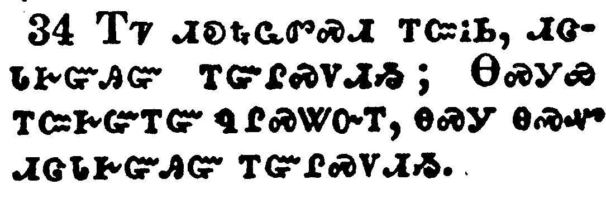</a></td>
</tr>
<tr class="even">
<td>A new commandment I give unto you, That ye love one another; as I have loved you, that ye also love one another.</td>
</tr>
<tr class="odd">
<td>ᎢᏤ ᏗᎧᎿᎭᏩᏛᏍᏗ ᎢᏨᎥᏏ, ᏗᏣᏓᎨᏳᎯᏳ ᎢᏳᎵᏍᏙᏗᏱ; ᎾᏍᎩᏯ ᎢᏨᎨᏳᎢᏳ ᏄᎵᏍᏔᏅᎢ, ᎾᏍᎩ ᎾᏍᏉ ᏗᏣᏓᎨᏳᎯᏳ ᎢᏳᎵᏍᏙᏗᏱ.</td>
</tr>
<tr class="even">
<td>I-tse di-ka-hna-wa-dv-s-di i-tsv-v-si, di-tsa-da-ge-yu-hi-yu i-yu-li-s-do-di-yi; Na-s-gi-ya i-tsv-ge-yu-i-yu nu-li-s-ta-nv-i, na-s-gi na-s-quo di-tsa-da-ge-yu-hi-yu i-yu-li-s-do-di-yi.</td>
</tr>
</tbody>
</table>

<table>
<tbody>
<tr class="odd">
<td><a href="041335.png">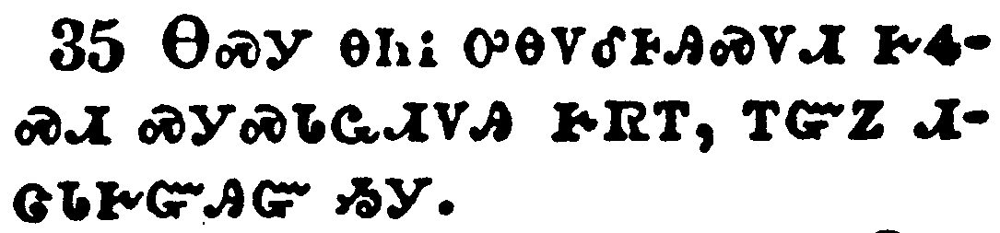</a></td>
</tr>
<tr class="even">
<td>By this shall all men know that ye are my disciples, if ye have love one to another.</td>
</tr>
<tr class="odd">
<td>ᎾᏍᎩ ᎾᏂᎥ ᎤᎾᏙᎴᎰᎯᏍᏙᏗ ᎨᏎᏍᏗ ᏍᎩᏍᏓᏩᏗᏙᎯ ᎨᏒᎢ, ᎢᏳᏃ ᏗᏣᏓᎨᏳᎯᏳ ᏱᎩ.</td>
</tr>
<tr class="even">
<td>Na-s-gi na-ni-v u-na-do-le-ho-hi-s-do-di ge-se-s-di s-gi-s-da-wa-di-do-hi ge-sv-i, i-yu-no di-tsa-da-ge-yu-hi-yu yi-gi.</td>
</tr>
</tbody>
</table>

<table>
<tbody>
<tr class="odd">
<td><a href="041336.png">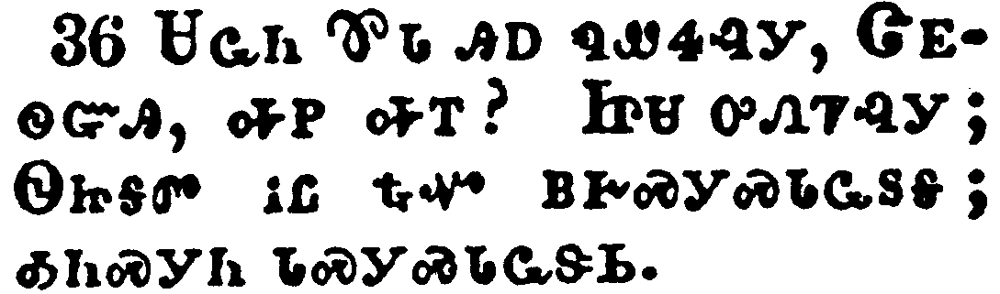</a></td>
</tr>
<tr class="even">
<td>Simon Peter said unto him, Lord, whither goest thou? Jesus answered him, Whither I go, thou canst not follow me now; but thou shalt follow me afterwards.</td>
</tr>
<tr class="odd">
<td>ᏌᏩᏂ ᏈᏓ ᎯᎠ ᏄᏪᏎᎸᎩ, ᏣᎬᏫᏳᎯ, ᎭᏢ ᎭᎢ? ᏥᏌ ᎤᏁᏤᎸᎩ; ᏫᏥᎦᏛ ᎥᏝ ᎿᎭᏉ ᏴᎨᏍᎩᏍᏓᏩᏚᎦ; ᎣᏂᏍᎩᏂ ᏓᏍᎩᏍᏓᏩᏕᏏ.</td>
</tr>
<tr class="even">
<td>Sa-wa-ni Qui-da hi-a nu-we-se-lv-gi, Tsa-gv-wi-yu-hi, ha-tlv ha-i? Tsi-sa u-ne-tse-lv-gi; Wi-tsi-ga-dv v-tla hna-quo yv-ge-s-gi-s-da-wa-du-ga; o-ni-s-gi-ni da-s-gi-s-da-wa-de-si.</td>
</tr>
</tbody>
</table>

<table>
<tbody>
<tr class="odd">
<td><a href="041337.png">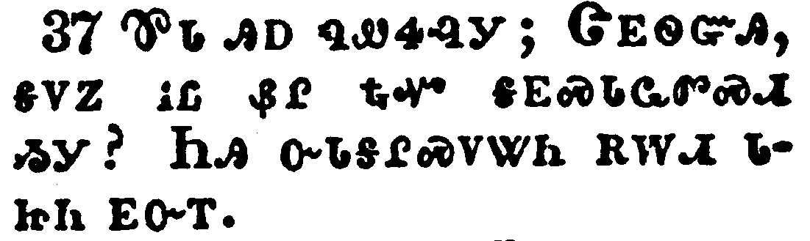</a></td>
</tr>
<tr class="even">
<td>Peter said unto him, Lord, why cannot I follow thee now? I will lay down my life for thy sake.</td>
</tr>
<tr class="odd">
<td>ᏈᏓ ᎯᎠ ᏄᏪᏎᎸᎩ; ᏣᎬᏫᏳᎯ, ᎦᏙᏃ ᎥᏝ ᏰᎵ ᎿᎭᏉ ᎦᎬᏍᏓᏩᏛᏍᏗ ᏱᎩ? ᏂᎯ ᏅᏓᎦᎵᏍᏙᏔᏂ ᎡᎳᏗ ᏓᏥᏂ ᎬᏅᎢ.</td>
</tr>
<tr class="even">
<td>Qui-da hi-a nu-we-se-lv-gi; Tsa-gv-wi-yu-hi, ga-do-no v-tla ye-li hna-quo ga-gv-s-da-wa-dv-s-di yi-gi? Ni-hi nv-da-ga-li-s-do-ta-ni e-la-di da-tsi-ni gv-nv-i.</td>
</tr>
</tbody>
</table>

<table>
<tbody>
<tr class="odd">
<td><a href="041338.png">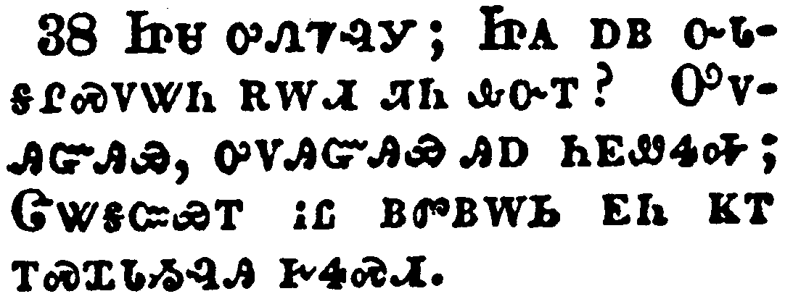</a></td>
</tr>
<tr class="even">
<td>Jesus answered him, Wilt thou lay down thy life for my sake? Verily, verily, I say unto thee, The cock shall not crow, till thou hast denied me thrice.</td>
</tr>
<tr class="odd">
<td>ᏥᏌ ᎤᏁᏤᎸᎩ; ᏥᏌ ᎠᏴ ᏅᏓᎦᎵᏍᏙᏔᏂ ᎡᎳᏗ ᏘᏂ ᎲᏅᎢ? ᎤᏙᎯᏳᎯᏯ, ᎤᏙᎯᏳᎯᏯ ᎯᎠ ᏂᎬᏪᏎᎭ; ᏣᏔᎦᏨᏯᎢ ᎥᏝ ᏴᏛᏴᎳᏏ ᎬᏂ ᏦᎢ ᎢᏍᏆᏓᏱᎸᎯ ᎨᏎᏍᏗ.</td>
</tr>
<tr class="even">
<td>Tsi-sa u-ne-tse-lv-gi; Tsi-sa a-yv nv-da-ga-li-s-do-ta-ni e-la-di ti-ni hv-nv-i? U-do-hi-yu-hi-ya, u-do-hi-yu-hi-ya hi-a ni-gv-we-se-ha; Tsa-ta-ga-tsv-ya-i v-tla yv-dv-yv-la-si gv-ni tso-i i-s-qua-da-yi-lv-hi ge-se-s-di.</td>
</tr>
</tbody>
</table>

