+++
draft=false
date = 2014-12-18T21:11:07Z
title = "Luke - Chapter 18 - Cherokee New Testament"
weight = 1418955067

[taxonomies]

authors = ["Timothy Legg"]
categories = []
tags = []

[extra]
+++

<table>
<tbody>
<tr class="odd">
<td><a href="031801.png">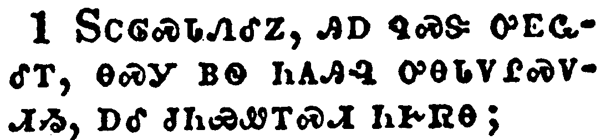</a></td>
</tr>
<tr class="even">
<td>And he spake a parable unto them to this end, that men ought always to pray, and not to faint;</td>
</tr>
<tr class="odd">
<td>ᏚᏟᎶᏍᏓᏁᎴᏃ, ᎯᎠ ᏄᏍᏕ ᎤᎬᏩᎴᎢ, ᎾᏍᎩ ᏴᏫ ᏂᎪᎯᎸ ᎤᎾᏓᏙᎵᏍᏙᏗᏱ, ᎠᎴ ᏧᏂᏯᏪᎢᏍᏗ ᏂᎨᏒᎾ;</td>
</tr>
<tr class="even">
<td>Du-tli-lo-s-da-ne-le-no, hi-a nu-s-de u-gv-wa-le-i, na-s-gi yv-wi ni-go-hi-lv u-na-da-do-li-s-do-di-yi, a-le tsu-ni-ya-we-i-s-di ni-ge-sv-na;</td>
</tr>
</tbody>
</table>

<table>
<tbody>
<tr class="odd">
<td><a href="031802.png">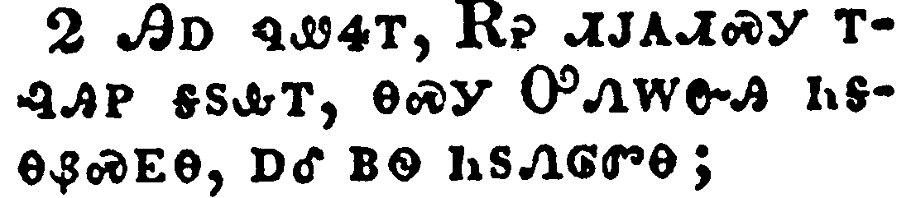</a></td>
</tr>
<tr class="even">
<td>Saying, There was in a city a judge, which feared not God, neither regarded man:</td>
</tr>
<tr class="odd">
<td>ᎯᎠ ᏄᏪᏎᎢ, ᎡᎮ ᏗᎫᎪᏗᏍᎩ ᎢᎸᎯᏢ ᎦᏚᎲᎢ, ᎾᏍᎩ ᎤᏁᎳᏅᎯ ᏂᎦᎾᏰᏍᎬᎾ, ᎠᎴ ᏴᏫ ᏂᏚᏁᎶᏛᎾ;</td>
</tr>
<tr class="even">
<td>Hi-a nu-we-se-i, E-he di-gu-go-di-s-gi i-lv-hi-tlv ga-du-hv-i, na-s-gi U-ne-la-nv-hi ni-ga-na-ye-s-gv-na, a-le yv-wi ni-du-ne-lo-dv-na;</td>
</tr>
</tbody>
</table>

<table>
<tbody>
<tr class="odd">
<td><a href="031803.png">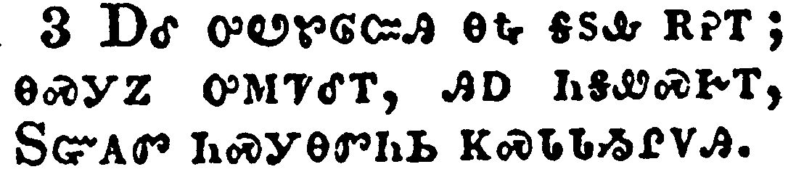</a></td>
</tr>
<tr class="even">
<td>And there was a widow in that city; and she came unto him, saying, Avenge me of mine adversary.</td>
</tr>
<tr class="odd">
<td>ᎠᎴ ᎤᏬᏑᎶᏨᎯ ᎾᎿᎭᎦᏚᎲ ᎡᎮᎢ; ᎾᏍᎩᏃ ᎤᎷᏤᎴᎢ, ᎯᎠ ᏂᎦᏪᏍᎨᎢ, ᏚᏳᎪᏛ ᏂᏍᎩᎾᏛᏂᏏ ᏦᏍᏓᏓᏱᎵᏙᎯ.</td>
</tr>
<tr class="even">
<td>A-le u-wo-su-lo-tsv-hi na-hna ga-du-hv e-he-i; na-s-gi-no u-lu-tse-le-i, hi-a ni-ga-we-s-ge-i, Du-yu-go-dv ni-s-gi-na-dv-ni-si tso-s-da-da-yi-li-do-hi.</td>
</tr>
</tbody>
</table>

<table>
<tbody>
<tr class="odd">
<td><a href="031804.png">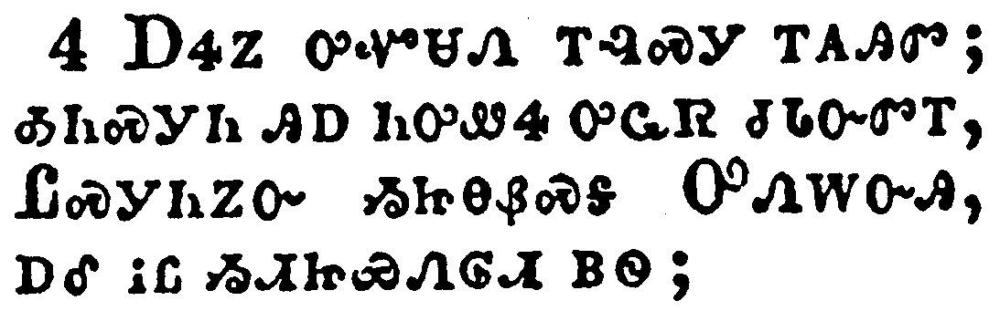</a></td>
</tr>
<tr class="even">
<td>And he would not for a while: but afterward he said within himself, Though I fear not God, nor regard man;</td>
</tr>
<tr class="odd">
<td>ᎠᏎᏃ ᎤᏉᏌᏁ ᎢᎸᏍᎩ ᎢᎪᎯᏛ; ᎣᏂᏍᎩᏂ ᎯᎠ ᏂᎤᏪᏎ ᎤᏩᏒ ᏧᏓᏅᏛᎢ, ᏝᏍᎩᏂᏃᏅ ᏱᏥᎾᏰᏍᎦ ᎤᏁᎳᏅᎯ, ᎠᎴ ᎥᏝ ᏱᏗᏥᏯᏁᎶᏗ ᏴᏫ;</td>
</tr>
<tr class="even">
<td>A-se-no u-quo-sa-ne i-lv-s-gi i-go-hi-dv; o-ni-s-gi-ni hi-a ni-u-we-se u-wa-sv tsu-da-nv-dv-i, Tla-s-gi-ni-no-nv yi-tsi-na-ye-s-ga U-ne-la-nv-hi, a-le v-tla yi-di-tsi-ya-ne-lo-di yv-wi;</td>
</tr>
</tbody>
</table>

<table>
<tbody>
<tr class="odd">
<td><a href="031805.png">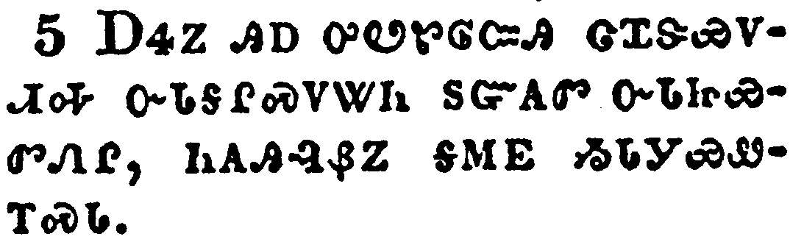</a></td>
</tr>
<tr class="even">
<td>Yet because this widow troubleth me, I will avenge her, lest by her continual coming she weary me.</td>
</tr>
<tr class="odd">
<td>ᎠᏎᏃ ᎯᎠ ᎤᏬᏑᎶᏨᎯ ᏣᏆᏕᏯᏙᏗᎭ ᏅᏓᎦᎵᏍᏙᏔᏂ ᏚᏳᎪᏛ ᏅᏓᏥᏯᏛᏁᎵ, ᏂᎪᎯᎸᏰᏃ ᎦᎷᎬ ᏱᏓᎩᏯᏪᎢᏍᏓ.</td>
</tr>
<tr class="even">
<td>A-se-no hi-a u-wo-su-lo-tsv-hi tsa-qua-de-ya-do-di-ha nv-da-ga-li-s-do-ta-ni du-yu-go-dv nv-da-tsi-ya-dv-ne-li, ni-go-hi-lv-ye-no ga-lu-gv yi-da-gi-ya-we-i-s-da.</td>
</tr>
</tbody>
</table>

<table>
<tbody>
<tr class="odd">
<td><a href="031806.png">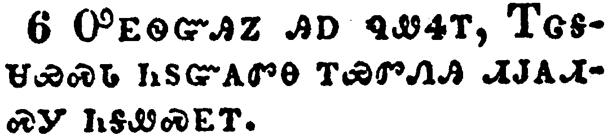</a></td>
</tr>
<tr class="even">
<td>And the Lord said, Hear what the unjust judge saith.</td>
</tr>
<tr class="odd">
<td>ᎤᎬᏫᏳᎯᏃ ᎯᎠ ᏄᏪᏎᎢ, ᎢᏣᎦᏌᏯᏍᏓ ᏂᏚᏳᎪᏛᎾ ᎢᏯᏛᏁᎯ ᏗᎫᎪᏗᏍᎩ ᏂᎦᏪᏍᎬᎢ.</td>
</tr>
<tr class="even">
<td>U-gv-wi-yu-hi-no hi-a nu-we-se-i, I-tsa-ga-sa-ya-s-da ni-du-yu-go-dv-na i-ya-dv-ne-hi di-gu-go-di-s-gi ni-ga-we-s-gv-i.</td>
</tr>
</tbody>
</table>

<table>
<tbody>
<tr class="odd">
<td><a href="031807.png">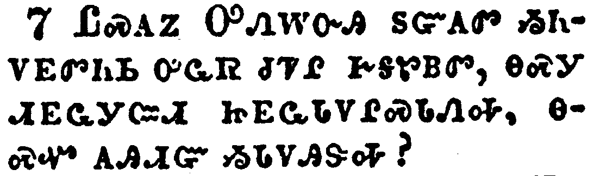</a></td>
</tr>
<tr class="even">
<td>And shall not God avenge his own elect, which cry day and night unto him, though he bear long with them?</td>
</tr>
<tr class="odd">
<td>ᏝᏍᎪᏃ ᎤᏁᎳᏅᎯ ᏚᏳᎪᏛ ᏱᏂᏙᎬᏛᏂᏏ ᎤᏩᏒ ᏧᏤᎵ ᎨᎦᏑᏴᏛ, ᎾᏍᎩ ᏗᎬᏩᎩᏨᏗ ᏥᎬᏩᏓᏙᎵᏍᏓᏁᎭ, ᎾᏍᏉ ᎪᎯᏗᏳ ᏱᏓᏙᎯᏕᎭ?</td>
</tr>
<tr class="even">
<td>Tla-s-go-no U-ne-la-nv-hi du-yu-go-dv yi-ni-do-gv-dv-ni-si u-wa-sv tsu-tse-li ge-ga-su-yv-dv, na-s-gi di-gv-wa-gi-tsv-di tsi-gv-wa-da-do-li-s-da-ne-ha, na-s-quo go-hi-di-yu yi-da-do-hi-de-ha?</td>
</tr>
</tbody>
</table>

<table>
<tbody>
<tr class="odd">
<td><a href="031808.png">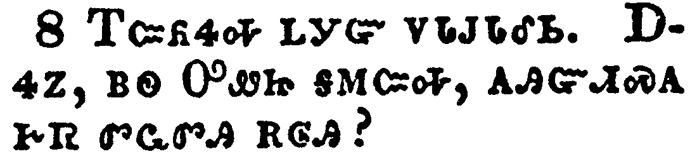</a></td>
</tr>
<tr class="even">
<td>I tell you that he will avenge them speedily. Nevertheless when the Son of man cometh, shall he find faith on the earth?</td>
</tr>
<tr class="odd">
<td>ᎢᏨᏲᏎᎭ ᏞᎩᏳ ᏙᏓᎫᎴᏏ. ᎠᏎᏃ, ᏴᏫ ᎤᏪᏥ ᎦᎷᏨᎭ, ᎪᎯᏳᏗᏍᎪ ᎨᏒ ᏛᏩᏛᎯ ᎡᎶᎯ?</td>
</tr>
<tr class="even">
<td>I-tsv-yo-se-ha tle-gi-yu do-da-gu-le-si. A-se-no, yv-wi U-we-tsi ga-lu-tsv-ha, go-hi-yu-di-s-go ge-sv dv-wa-dv-hi e-lo-hi?</td>
</tr>
</tbody>
</table>

<table>
<tbody>
<tr class="odd">
<td><a href="031809.png">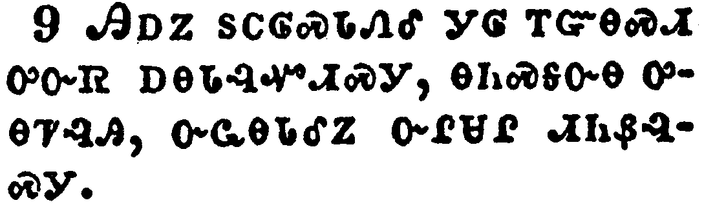</a></td>
</tr>
<tr class="even">
<td>And he spake this parable unto certain which trusted in themselves that they were righteous, and despised others:</td>
</tr>
<tr class="odd">
<td>ᎯᎠᏃ ᏚᏟᎶᏍᏓᏁᎴ ᎩᎶ ᎢᏳᎾᏍᏗ ᎤᏅᏒ ᎠᎾᏓᎸᏉᏗᏍᎩ, ᎾᏂᏍᎦᏅᎾ ᎤᎾᏤᎸᎯ, ᎤᏩᎾᏓᎴᏃ ᏅᎵᏌᎵ ᏗᏂᏰᎸᏍᎩ.</td>
</tr>
<tr class="even">
<td>Hi-a-no du-tli-lo-s-da-ne-le gi-lo i-yu-na-s-di u-nv-sv a-na-da-lv-quo-di-s-gi, na-ni-s-ga-nv-na u-na-tse-lv-hi, u-wa-na-da-le-no nv-li-sa-li di-ni-ye-lv-s-gi.</td>
</tr>
</tbody>
</table>

<table>
<tbody>
<tr class="odd">
<td><a href="031810.png">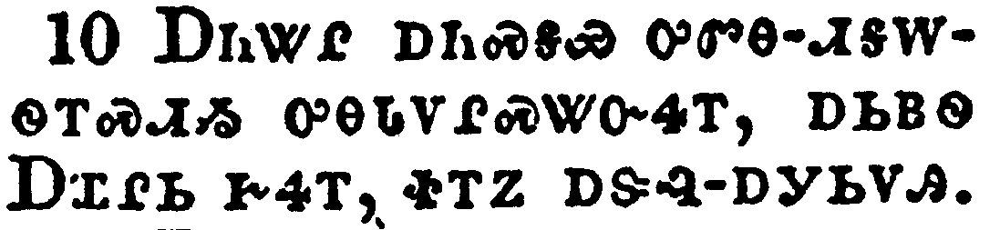</a></td>
</tr>
<tr class="even">
<td>Two men went up into the temple to pray; the one a Pharisee, and the other a publican.</td>
</tr>
<tr class="odd">
<td>ᎠᏂᏔᎵ ᎠᏂᏍᎦᏯ ᎤᏛᎾ-ᏗᎦᎳᏫᎢᏍᏗᏱ ᎤᎾᏓᏙᎵᏍᏔᏅᏎᎢ, ᎠᏏᏴᏫ ᎠᏆᎵᏏ ᎨᏎᎢ, ᏐᎢᏃ ᎠᏕᎸ-ᎠᎩᏏᏙᎯ.</td>
</tr>
<tr class="even">
<td>A-ni-ta-li a-ni-s-ga-ya u-dv-na--di-ga-la-wi-i-s-di-yi u-na-da-do-li-s-ta-nv-se-i, a-si-yv-wi A-qua-li-si ge-se-i, so-i-no a-de-lv--a-gi-si-do-hi.</td>
</tr>
</tbody>
</table>

<table>
<tbody>
<tr class="odd">
<td><a href="031811.png">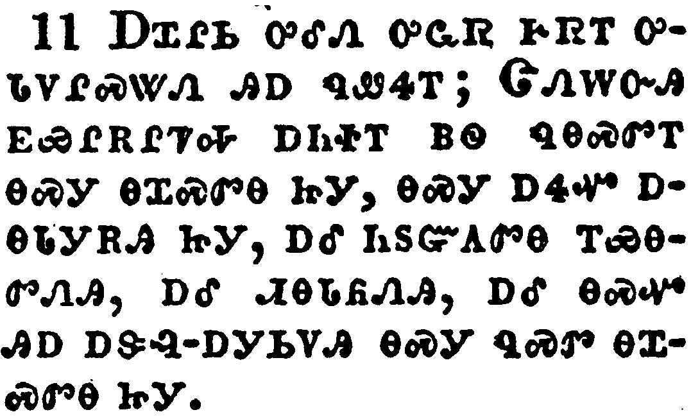</a></td>
</tr>
<tr class="even">
<td>The Pharisee stood and prayed thus with himself, God, I thank thee, that I am not as other men are, extortioners, unjust, adulterers, or even as this publican.</td>
</tr>
<tr class="odd">
<td>ᎠᏆᎵᏏ ᎤᎴᏁ ᎤᏩᏒ ᎨᏒᎢ ᎤᏓᏙᎵᏍᏔᏁ ᎯᎠ ᏄᏪᏎᎢ; ᏣᏁᎳᏅᎯ ᎬᏯᎵᎡᎵᏤᎭ ᎠᏂᏐᎢ ᏴᏫ ᏄᎾᏍᏛᎢ ᎾᏍᎩ ᎾᏆᏍᏛᎾ ᏥᎩ, ᎾᏍᎩ ᎠᏎᏉ ᎠᎾᏓᎩᎡᎯ ᏥᎩ, ᎠᎴ ᏂᏚᏳᎪᏛᎾ ᎢᏯᎾᏛᏁᎯ, ᎠᎴ ᏗᎾᏓᏲᏁᎯ, ᎠᎴ ᎾᏍᏉ ᎯᎠ ᎠᏕᎸ-ᎠᎩᏏᏙᎯ ᎾᏍᎩ ᏄᏍᏛ ᎾᏆᏍᏛᎾ ᏥᎩ.</td>
</tr>
<tr class="even">
<td>A-qua-li-si u-le-ne u-wa-sv ge-sv-i u-da-do-li-s-ta-ne hi-a nu-we-se-i; Tsa-ne-la-nv-hi gv-ya-li-e-li-tse-ha a-ni-so-i yv-wi nu-na-s-dv-i na-s-gi na-qua-s-dv-na tsi-gi, na-s-gi a-se-quo a-na-da-gi-e-hi tsi-gi, a-le ni-du-yu-go-dv-na i-ya-na-dv-ne-hi, a-le di-na-da-yo-ne-hi, a-le na-s-quo hi-a a-de-lv--a-gi-si-do-hi na-s-gi nu-s-dv na-qua-s-dv-na tsi-gi.</td>
</tr>
</tbody>
</table>

<table>
<tbody>
<tr class="odd">
<td><a href="031812.png">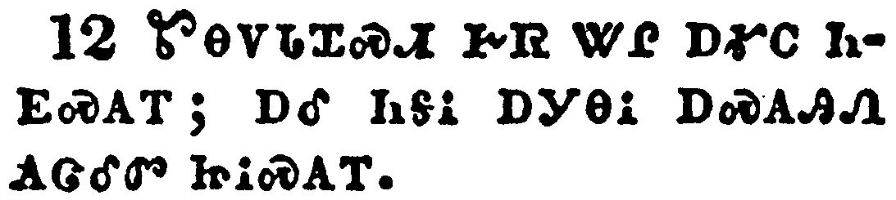</a></td>
</tr>
<tr class="even">
<td>I fast twice in the week, I give tithes of all that I possess.</td>
</tr>
<tr class="odd">
<td>ᏑᎾᏙᏓᏆᏍᏗ ᎨᏒ ᏔᎵ ᎠᎹᏟ ᏂᎬᏍᎪᎢ; ᎠᎴ ᏂᎦᎥ ᎠᎩᎾᎥ ᎠᏍᎪᎯᏁ ᎪᏣᎴᏛ ᏥᎥᏍᎪᎢ.</td>
</tr>
<tr class="even">
<td>Su-na-do-da-qua-s-di ge-sv ta-li a-ma-tli ni-gv-s-go-i; a-le ni-ga-v a-gi-na-v a-s-go-hi-ne go-tsa-le-dv tsi-v-s-go-i.</td>
</tr>
</tbody>
</table>

<table>
<tbody>
<tr class="odd">
<td><a href="031813.png">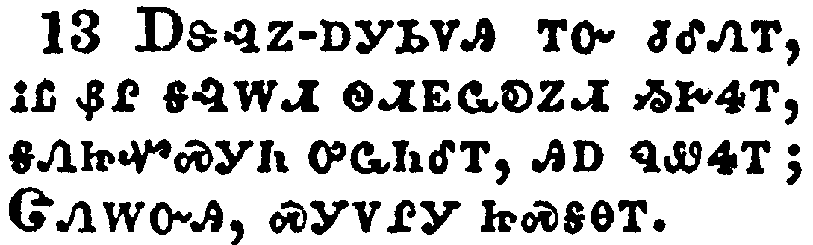</a></td>
</tr>
<tr class="even">
<td>And the publican, standing afar off, would not lift up so much as his eyes unto heaven, but smote upon his breast, saying, God be merciful to me a sinner.</td>
</tr>
<tr class="odd">
<td>ᎠᏕᎸᏃ-ᎠᎩᏏᏙᎯ ᎢᏅ ᏧᎴᏁᎢ, ᎥᏝ ᏰᎵ ᎦᎸᎳᏗ ᏫᏗᎬᏩᎧᏃᏗ ᏱᎨᏎᎢ, ᎦᏁᏥᏉᏍᎩᏂ ᎤᏩᏂᎴᎢ, ᎯᎠ ᏄᏪᏎᎢ; ᏣᏁᎳᏅᎯ, ᏍᎩᏙᎵᎩ ᏥᏍᎦᎾᎢ.</td>
</tr>
<tr class="even">
<td>A-de-lv-no--a-gi-si-do-hi i-nv tsu-le-ne-i, v-tla ye-li ga-lv-la-di wi-di-gv-wa-ka-no-di yi-ge-se-i, ga-ne-tsi-quo-s-gi-ni u-wa-ni-le-i, hi-a nu-we-se-i; Tsa-ne-la-nv-hi, s-gi-do-li-gi tsi-s-ga-na-i.</td>
</tr>
</tbody>
</table>

<table>
<tbody>
<tr class="odd">
<td><a href="031814.png">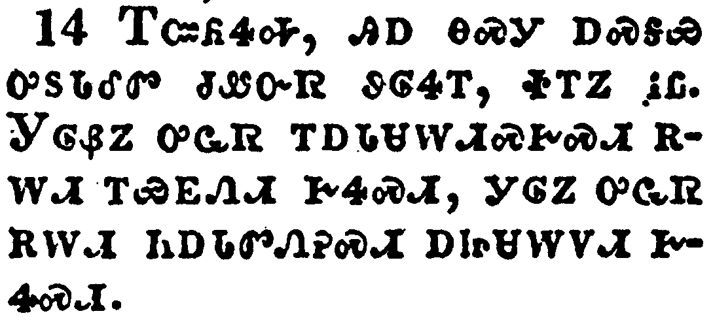</a></td>
</tr>
<tr class="even">
<td>I tell you, this man went down to his house justified rather than the other: for every one that exalteth himself shall be abased; and he that humbleth himself shall be exalted.</td>
</tr>
<tr class="odd">
<td>ᎢᏨᏲᏎᎭ, ᎯᎠ ᎾᏍᎩ ᎠᏍᎦᏯ ᎤᏚᏓᎴᏛ ᏧᏪᏅᏒ ᏭᎶᏎᎢ, ᏐᎢᏃ ᎥᏝ. ᎩᎶᏰᏃ ᎤᏩᏒ ᎢᎠᏓᏌᎳᏗᏍᎨᏍᏗ ᎡᎳᏗ ᎢᏯᎬᏁᏗ ᎨᏎᏍᏗ, ᎩᎶᏃ ᎤᏩᏒ ᎡᎳᏗ ᏂᎠᏓᏛᏁᎮᏍᏗ ᎠᏥᏌᎳᏙᏗ ᎨᏎᏍᏗ.</td>
</tr>
<tr class="even">
<td>I-tsv-yo-se-ha, hi-a na-s-gi a-s-ga-ya u-du-da-le-dv tsu-we-nv-sv wu-lo-se-i, so-i-no v-tla. Gi-lo-ye-no u-wa-sv i-a-da-sa-la-di-s-ge-s-di e-la-di i-ya-gv-ne-di ge-se-s-di, gi-lo-no u-wa-sv e-la-di ni-a-da-dv-ne-he-s-di a-tsi-sa-la-do-di ge-se-s-di.</td>
</tr>
</tbody>
</table>

<table>
<tbody>
<tr class="odd">
<td><a href="031815.png">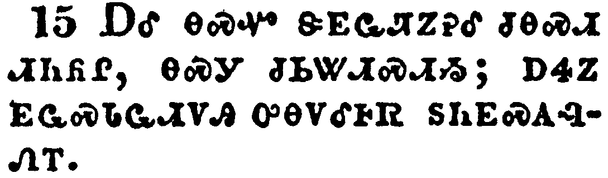</a></td>
</tr>
<tr class="even">
<td>And they brought unto him also infants, that he would touch them: but when his disciples saw it, they rebuked them.</td>
</tr>
<tr class="odd">
<td>ᎠᎴ ᎾᏍᏉ ᏕᎬᏩᏘᏃᎮᎴ ᏧᎾᏍᏗ ᏗᏂᏲᎵ, ᎾᏍᎩ ᏧᏏᏔᏗᏍᏗᏱ; ᎠᏎᏃ ᎬᏩᏍᏓᏩᏗᏙᎯ ᎤᎾᏙᎴᎰᏒ ᏚᏂᎬᏍᎪᎸᏁᎢ.</td>
</tr>
<tr class="even">
<td>A-le na-s-quo de-gv-wa-ti-no-he-le tsu-na-s-di di-ni-yo-li, na-s-gi tsu-si-ta-di-s-di-yi; a-se-no gv-wa-s-da-wa-di-do-hi u-na-do-le-ho-sv du-ni-gv-s-go-lv-ne-i.</td>
</tr>
</tbody>
</table>

<table>
<tbody>
<tr class="odd">
<td></td>
</tr>
<tr class="even">
<td>But Jesus called them unto him, and said, Suffer little children to come unto me, and forbid them not: for of such is the kingdom of God.</td>
</tr>
<tr class="odd">
<td>ᏥᏌᏃ ᏫᏚᏯᏅᎲ ᎯᎠ ᏄᏪᏎᎢ, ᎤᎾᏁᎳᎩ ᏗᏤᎵᏏ ᏗᏂᏲᎵ ᎬᎩᎷᏤᏗᏱ, ᎠᎴ ᏞᏍᏗ ᏗᏥᏅᏍᏓᏕᎸᎩ; ᎾᏍᎩᏰᏃ ᏄᎾᏍᏗ ᎾᎿᎭᎤᏁᎳᏅᎯ ᎤᎬᏫᏳᎯ ᎨᏒᎢ.</td>
</tr>
<tr class="even">
<td>Tsi-sa-no wi-du-ya-nv-hv hi-a nu-we-se-i, U-na-ne-la-gi di-tse-li-si di-ni-yo-li gv-gi-lu-tse-di-yi, a-le tle-s-di di-tsi-nv-s-da-de-lv-gi; na-s-gi-ye-no nu-na-s-di na-hna u-ne-la-nv-hi u-gv-wi-yu-hi ge-sv-i.</td>
</tr>
</tbody>
</table>

<table>
<tbody>
<tr class="odd">
<td></td>
</tr>
<tr class="even">
<td>Verily I say unto you, Whosoever shall not receive the kingdom of God as a little child shall in no wise enter therein.</td>
</tr>
<tr class="odd">
<td>ᎤᏙᎯᏳᎯᏯ ᎯᎠ ᏂᏨᏪᏎᎭ, ᎩᎶ ᎤᏁᎳᏅᎯ ᎤᎬᏫᏳᎯ ᎨᏒ ᏂᏓᏓᏂᎸᎬᎾ ᎢᎨᏎᏍᏗ ᎾᏍᎩᏯ ᎠᏲᎵ ᏥᏓᏓᏂᎸᎪᎢ, ᎥᏝ ᎾᎿᎭᎤᏴᏍᏗ ᏱᎨᏎᏍᏗ.</td>
</tr>
<tr class="even">
<td>U-do-hi-yu-hi-ya hi-a ni-tsv-we-se-ha, Gi-lo U-ne-la-nv-hi u-gv-wi-yu-hi ge-sv ni-da-da-ni-lv-gv-na i-ge-se-s-di na-s-gi-ya a-yo-li tsi-da-da-ni-lv-go-i, v-tla na-hna u-yv-s-di yi-ge-se-s-di.</td>
</tr>
</tbody>
</table>

<table>
<tbody>
<tr class="odd">
<td><a href="031818.png">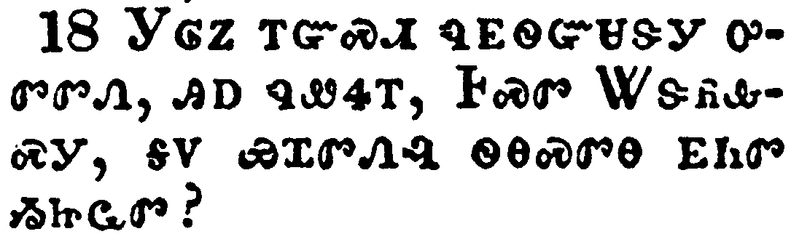</a></td>
</tr>
<tr class="even">
<td>And a certain ruler asked him, saying, Good Master, what shall I do to inherit eternal life?</td>
</tr>
<tr class="odd">
<td>ᎩᎶᏃ ᎢᏳᏍᏗ ᏄᎬᏫᏳᏌᏕᎩ ᎤᏛᏛᏁ, ᎯᎠ ᏄᏪᏎᎢ, ᎰᏍᏛ ᏔᏕᏲᎲᏍᎩ, ᎦᏙ ᏯᏆᏛᏁᎸ ᏫᎾᏍᏛᎾ ᎬᏂᏛ ᏱᏥᏩᏛ?</td>
</tr>
<tr class="even">
<td>Gi-lo-no i-yu-s-di nu-gv-wi-yu-sa-de-gi u-dv-dv-ne, hi-a nu-we-se-i, Ho-s-dv Ta-de-yo-hv-s-gi, ga-do ya-qua-dv-ne-lv wi-na-s-dv-na gv-ni-dv yi-tsi-wa-dv?</td>
</tr>
</tbody>
</table>

<table>
<tbody>
<tr class="odd">
<td><a href="031819.png">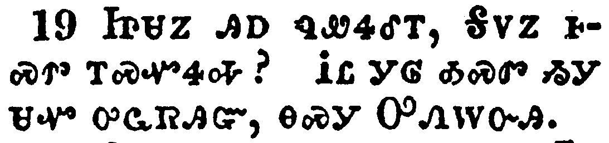</a></td>
</tr>
<tr class="even">
<td>And Jesus said unto him, Why callest thou me good? none is good, save one, that is, God.</td>
</tr>
<tr class="odd">
<td>ᏥᏌᏃ ᎯᎠ ᏄᏪᏎᎴᎢ, ᎦᏙᏃ ᎰᏍᏛ ᎢᏍᏉᏎᎭ? ᎥᏝ ᎩᎶ ᎣᏍᏛ ᏱᎩ ᏌᏉ ᎤᏩᏒᎯᏳ, ᎾᏍᎩ ᎤᏁᎳᏅᎯ.</td>
</tr>
<tr class="even">
<td>Tsi-sa-no hi-a nu-we-se-le-i, Ga-do-no ho-s-dv i-s-quo-se-ha? V-tla gi-lo o-s-dv yi-gi sa-quo u-wa-sv-hi-yu, na-s-gi U-ne-la-nv-hi.</td>
</tr>
</tbody>
</table>

<table>
<tbody>
<tr class="odd">
<td><a href="031820.png">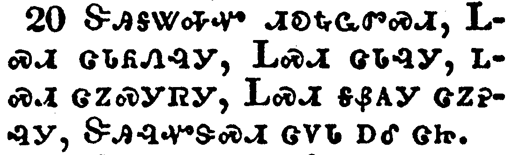</a></td>
</tr>
<tr class="even">
<td>Thou knowest the commandments, Do not commit adultery, Do not kill, Do not steal, Do not bear false witness, Honour thy father and thy mother.</td>
</tr>
<tr class="odd">
<td>ᏕᎯᎦᏔᎭᏉ ᏗᎧᎿᎭᏩᏛᏍᏗ, ᏞᏍᏗ ᏣᏓᏲᏁᎸᎩ, ᏞᏍᏗ ᏣᏓᎸᎩ, ᏞᏍᏗ ᏣᏃᏍᎩᏒᎩ, ᏞᏍᏗ ᎦᏰᎪᎩ ᏣᏃᎮᎸᎩ, ᏕᎩᎸᏉᏕᏍᏗ ᏣᏙᏓ ᎠᎴ ᏣᏥ.</td>
</tr>
<tr class="even">
<td>De-hi-ga-ta-ha-quo di-ka-hna-wa-dv-s-di, Tle-s-di tsa-da-yo-ne-lv-gi, Tle-s-di tsa-da-lv-gi, tle-s-di tsa-no-s-gi-sv-gi, Tle-s-di ga-ye-go-gi tsa-no-he-lv-gi, De-gi-lv-quo-de-s-di tsa-do-da a-le tsa-tsi.</td>
</tr>
</tbody>
</table>

<table>
<tbody>
<tr class="odd">
<td><a href="031821.png">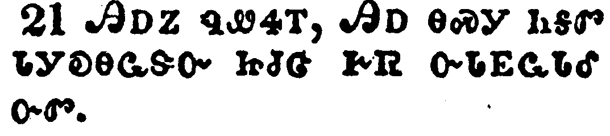</a></td>
</tr>
<tr class="even">
<td>And he said, All these have I kept from my youth up.</td>
</tr>
<tr class="odd">
<td>ᎯᎠᏃ ᏄᏪᏎᎢ, ᎯᎠ ᎾᏍᎩ ᏂᎦᏛ ᏓᎩᎧᎾᏩᏕᏅ ᏥᏧᏣ ᎨᏒ ᏅᏓᎬᏩᏓᎴ ᏅᏛ.</td>
</tr>
<tr class="even">
<td>Hi-a-no nu-we-se-i, Hi-a na-s-gi ni-ga-dv da-gi-ka-na-wa-de-nv tsi-tsu-tsa ge-sv nv-da-gv-wa-da-le nv-dv.</td>
</tr>
</tbody>
</table>

<table>
<tbody>
<tr class="odd">
<td><a href="031822.png">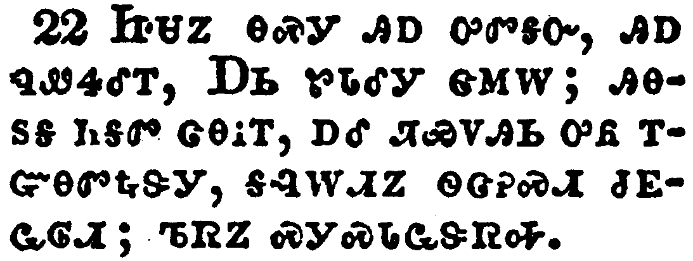</a></td>
</tr>
<tr class="even">
<td>Now when Jesus heard these things, he said unto him, Yet lackest thou one thing: sell all that thou hast, and distribute unto the poor, and thou shalt have treasure in heaven: and come, follow me.</td>
</tr>
<tr class="odd">
<td>ᏥᏌᏃ ᎾᏍᎩ ᎯᎠ ᎤᏛᎦᏅ, ᎯᎠ ᏄᏪᏎᎴᎢ, ᎠᏏ ᏑᏓᎴᎩ ᏣᎷᎳ; ᎯᎾᏚᎦ ᏂᎦᏛ ᏣᎾᎥᎢ, ᎠᎴ ᏘᏯᏙᎯᏏ ᎤᏲ ᎢᏳᎾᏛᎿᎭᏕᎩ, ᎦᎸᎳᏗᏃ ᏫᏣᎮᏍᏗ ᏧᎬᏩᎶᏗ; ᏖᏒᏃ ᏍᎩᏍᏓᏩᏕᏒᎭ.</td>
</tr>
<tr class="even">
<td>Tsi-sa-no na-s-gi hi-a u-dv-ga-nv, hi-a nu-we-se-le-i, A-si su-da-le-gi tsa-lu-la; hi-na-du-ga ni-ga-dv tsa-na-v-i, a-le ti-ya-do-hi-si u-yo i-yu-na-dv-hna-de-gi, ga-lv-la-di-no wi-tsa-he-s-di tsu-gv-wa-lo-di; te-sv-no s-gi-s-da-wa-de-sv-ha.</td>
</tr>
</tbody>
</table>

<table>
<tbody>
<tr class="odd">
<td><a href="031823.png">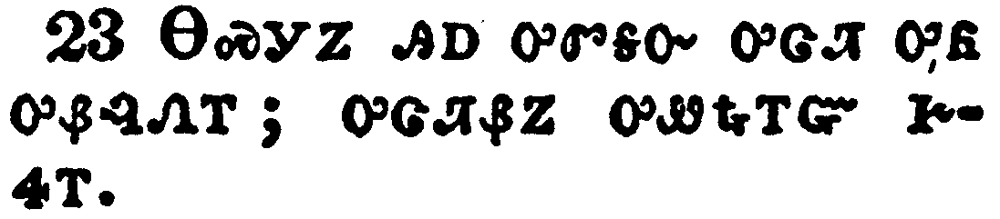</a></td>
</tr>
<tr class="even">
<td>And when he heard this, he was very sorrowful: for he was very rich.</td>
</tr>
<tr class="odd">
<td>ᎾᏍᎩᏃ ᎯᎠ ᎤᏛᎦᏅ ᎤᏣᏘ ᎤᏲ ᎤᏰᎸᏁᎢ; ᎤᏣᏘᏰᏃ ᎤᏪᎿᎭᎢᏳ ᎨᏎᎢ.</td>
</tr>
<tr class="even">
<td>Na-s-gi-no hi-a u-dv-ga-nv u-tsa-ti u-yo u-ye-lv-ne-i; u-tsa-ti-ye-no u-we-hna-i-yu ge-se-i.</td>
</tr>
</tbody>
</table>

<table>
<tbody>
<tr class="odd">
<td><a href="031824.png">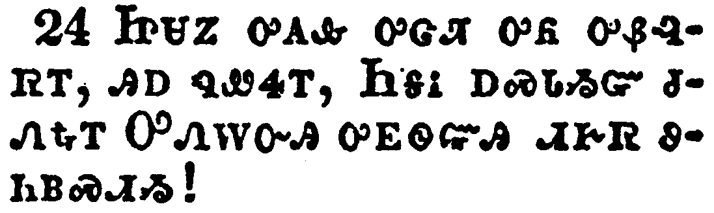</a></td>
</tr>
<tr class="even">
<td>And when Jesus saw that he was very sorrowful, he said, How hardly shall they that have riches enter into the kingdom of God!</td>
</tr>
<tr class="odd">
<td>ᏥᏌᏃ ᎤᎪᎲ ᎤᏣᏘ ᎤᏲ ᎤᏰᎸᏒᎢ, ᎯᎠ ᏄᏪᏎᎢ, ᏂᎦᎥ ᎠᏍᏓᏱᏳ ᏧᏁᎿᎭᎢ ᎤᏁᎳᏅᎯ ᎤᎬᏫᏳᎯ ᏗᎨᏒ ᏭᏂᏴᏍᏗᏱ!</td>
</tr>
<tr class="even">
<td>Tsi-sa-no u-go-hv u-tsa-ti u-yo u-ye-lv-sv-i, hi-a nu-we-se-i, Ni-ga-v a-s-da-yi-yu tsu-ne-hna-i U-ne-la-nv-hi u-gv-wi-yu-hi di-ge-sv wu-ni-yv-s-di-yi!</td>
</tr>
</tbody>
</table>

<table>
<tbody>
<tr class="odd">
<td></td>
</tr>
<tr class="even">
<td>For it is easier for a camel to go through a needle's eye, than for a rich man to enter into the kingdom of God.</td>
</tr>
<tr class="odd">
<td>ᎤᏟᏰᏃ ᎠᎯᏗᏳ ᎨᎻᎵ ᎤᎦᏛᎴᎯᏍᏗᏱ ᏴᎩ ᎦᏌᏁᎾᏛᏗᏱ ᎠᏃ ᎤᏪᎿᎭᎢ ᏴᏫ ᏭᏴᏍᏗᏱ ᎤᏁᎳᏅᎯ ᎤᎬᏫᏳᎯ ᏗᎨᏒᎢ.</td>
</tr>
<tr class="even">
<td>U-tli-ye-no a-hi-di-yu ge-mi-li u-ga-dv-le-hi-s-di-yi yv-gi ga-sa-ne-na-dv-di-yi a-no u-we-hna-i yv-wi wu-yv-s-di-yi U-ne-la-nv-hi u-gv-wi-yu-hi di-ge-sv-i.</td>
</tr>
</tbody>
</table>

<table>
<tbody>
<tr class="odd">
<td><a href="031826.png">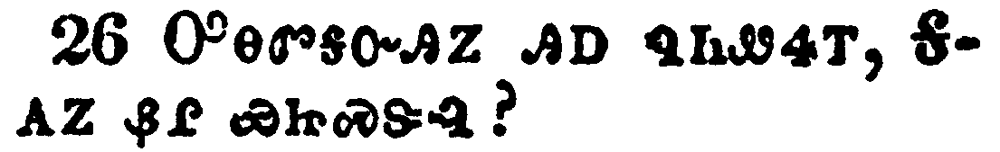</a></td>
</tr>
<tr class="even">
<td>And they that heard it said, Who then can be saved?</td>
</tr>
<tr class="odd">
<td>ᎤᎾᏛᎦᏅᎯᏃ ᎯᎠ ᏄᏂᏪᏎᎢ, ᎦᎪᏃ ᏰᎵ ᏯᏥᏍᏕᎸ?</td>
</tr>
<tr class="even">
<td>U-na-dv-ga-nv-hi-no hi-a nu-ni-we-se-i, Ga-go-no ye-li ya-tsi-s-de-lv?</td>
</tr>
</tbody>
</table>

<table>
<tbody>
<tr class="odd">
<td><a href="031827.png">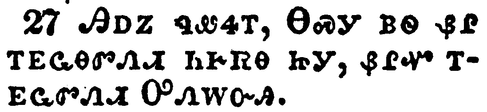</a></td>
</tr>
<tr class="even">
<td>And he said, The things which are impossible with men are possible with God.</td>
</tr>
<tr class="odd">
<td>ᎯᎠᏃ ᏄᏪᏎᎢ, ᎾᏍᎩ ᏴᏫ ᏰᎵ ᎢᎬᏩᎾᏛᏁᏗ ᏂᎨᏒᎾ ᏥᎩ, ᏰᎵᏉ ᎢᎬᏩᏛᏁᏗ ᎤᏁᎳᏅᎯ.</td>
</tr>
<tr class="even">
<td>Hi-a-no nu-we-se-i, Na-s-gi yv-wi ye-li i-gv-wa-na-dv-ne-di ni-ge-sv-na tsi-gi, ye-li-quo i-gv-wa-dv-ne-di U-ne-la-nv-hi.</td>
</tr>
</tbody>
</table>

<table>
<tbody>
<tr class="odd">
<td><a href="031828.png">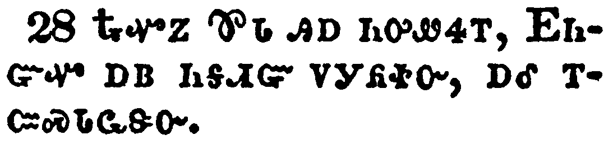</a></td>
</tr>
<tr class="even">
<td>Then Peter said, Lo, we have left all, and followed thee.</td>
</tr>
<tr class="odd">
<td>ᎿᎭᏉᏃ ᏈᏓ ᎯᎠ ᏂᎤᏪᏎᎢ, ᎬᏂᏳᏉ ᎠᏴ ᏂᎦᏗᏳ ᏙᎩᏲᏐᏅ, ᎠᎴ ᎢᏨᏍᏓᏩᏕᏅ.</td>
</tr>
<tr class="even">
<td>Hna-quo-no Qui-da hi-a ni-u-we-se-i, Gv-ni-yu-quo a-yv ni-ga-di-yu do-gi-yo-so-nv, a-le i-tsv-s-da-wa-de-nv.</td>
</tr>
</tbody>
</table>

<table>
<tbody>
<tr class="odd">
<td><a href="031829.png">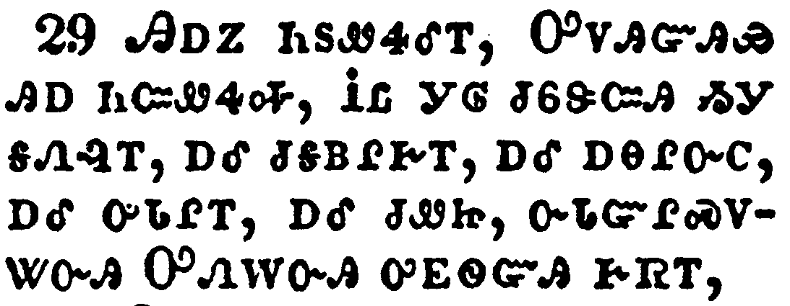</a></td>
</tr>
<tr class="even">
<td>And he said unto them, Verily I say unto you, There is no man that hath left house, or parents, or brethren, or wife, or children, for the kingdom of God's sake,</td>
</tr>
<tr class="odd">
<td>ᎯᎠᏃ ᏂᏚᏪᏎᎴᎢ, ᎤᏙᎯᏳᎯᏯ ᎯᎠ ᏂᏨᏪᏎᎭ, ᎥᏝ ᎩᎶ ᏧᏮᏕᏨᎯ ᏱᎩ ᎦᏁᎸᎢ, ᎠᎴ ᏧᎦᏴᎵᎨᎢ, ᎠᎴ ᎠᎾᎵᏅᏟ, ᎠᎴ ᎤᏓᎵᎢ, ᎠᎴ ᏧᏪᏥ, ᏅᏓᏳᎵᏍᏙᏔᏅᎯ ᎤᏁᎳᏅᎯ ᎤᎬᏫᏳᎯ ᎨᏒᎢ,</td>
</tr>
<tr class="even">
<td>Hi-a-no ni-du-we-se-le-i, U-do-hi-yu-hi-ya hi-a ni-tsv-we-se-ha, V-tla gi-lo tsu-wv-de-tsv-hi yi-gi ga-ne-lv-i, a-le tsu-ga-yv-li-ge-i, a-le a-na-li-nv-tli, a-le u-da-li-i, a-le tsu-we-tsi, nv-da-yu-li-s-do-ta-nv-hi U-ne-la-nv-hi u-gv-wi-yu-hi ge-sv-i,</td>
</tr>
</tbody>
</table>

<table>
<tbody>
<tr class="odd">
<td></td>
</tr>
<tr class="even">
<td>Who shall not receive manifold more in this present time, and in the world to come life everlasting.</td>
</tr>
<tr class="odd">
<td>ᎾᏍᎩ ᎠᏥᏁᏗ ᏂᎨᏒᎾ ᎨᏒ ᎤᏣᏘ ᎢᏳᏩᎫᏗ ᎪᎯ ᎨᏒᎢ, ᏐᎢᏱᏃ ᏗᎨᏒ ᎬᏂᏛ ᏫᎾᏍᏛᎾ.</td>
</tr>
<tr class="even">
<td>Na-s-gi a-tsi-ne-di ni-ge-sv-na ge-sv u-tsa-ti i-yu-wa-gu-di go-hi ge-sv-i, so-i-yi-no di-ge-sv gv-ni-dv wi-na-s-dv-na.</td>
</tr>
</tbody>
</table>

<table>
<tbody>
<tr class="odd">
<td><a href="031831.png">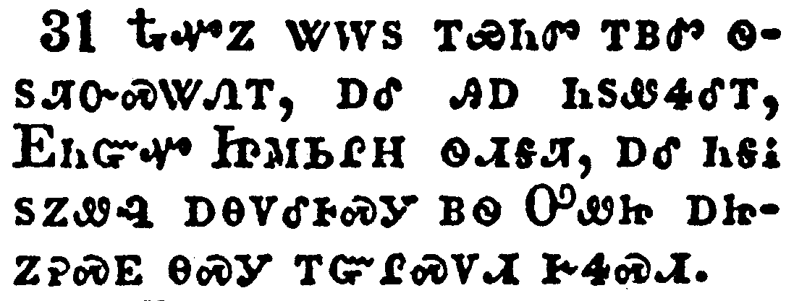</a></td>
</tr>
<tr class="even">
<td>Then he took unto him the twelve, and said unto them, Behold, we go up to Jerusalem, and all things that are written by the prophets concerning the Son of man shall be accomplished.</td>
</tr>
<tr class="odd">
<td>ᎿᎭᏉᏃ ᏔᎳᏚ ᎢᏯᏂᏛ ᎢᏴᏛ ᏫᏚᏘᏅᏍᏔᏁᎢ, ᎠᎴ ᎯᎠ ᏂᏚᏪᏎᎴᎢ, ᎬᏂᏳᏉ ᏥᎷᏏᎵᎻ ᏫᏗᎦᏘ, ᎠᎴ ᏂᎦᎥ ᏚᏃᏪᎸ ᎠᎾᏙᎴᎰᏍᎩ ᏴᏫ ᎤᏪᏥ ᎠᏥᏃᎮᏍᎬ ᎾᏍᎩ ᎢᏳᎵᏍᏙᏗ ᎨᏎᏍᏗ.</td>
</tr>
<tr class="even">
<td>Hna-quo-no ta-la-du i-ya-ni-dv i-yv-dv wi-du-ti-nv-s-ta-ne-i, a-le hi-a ni-du-we-se-le-i, Gv-ni-yu-quo Tsi-lu-si-li-mi wi-di-ga-ti, a-le ni-ga-v du-no-we-lv a-na-do-le-ho-s-gi yv-wi U-we-tsi a-tsi-no-he-s-gv na-s-gi i-yu-li-s-do-di ge-se-s-di.</td>
</tr>
</tbody>
</table>

<table>
<tbody>
<tr class="odd">
<td></td>
</tr>
<tr class="even">
<td>For he shall be delivered unto the Gentiles, and shall be mocked, and spitefully entreated, and spitted on:</td>
</tr>
<tr class="odd">
<td>ᏧᎾᏓᎴᏅᏛᏰᏃ ᏴᏫ ᏙᏓᎨᏥᏲᎯᏎᎵ, ᎠᎴ ᏓᏰᎦᏕᎰᏔᏂ, ᎠᎴ ᏓᎦᏰᏥᏐᏢᏔᏂ, ᎠᎴ ᏙᏓᏰᎦᎵᏥᏍᏈ,</td>
</tr>
<tr class="even">
<td>Tsu-na-da-le-nv-dv-ye-no yv-wi do-da-ge-tsi-yo-hi-se-li, a-le da-ye-ga-de-ho-ta-ni, a-le da-ga-ye-tsi-so-tlv-ta-ni, a-le do-da-ye-ga-li-tsi-s-qui,</td>
</tr>
</tbody>
</table>

<table>
<tbody>
<tr class="odd">
<td><a href="031833.png">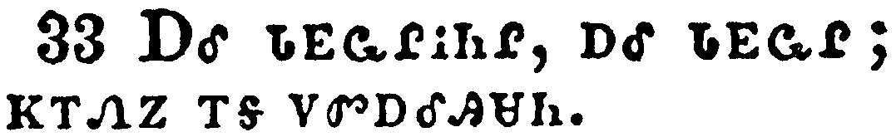</a></td>
</tr>
<tr class="even">
<td>And they shall scourge him, and put him to death: and the third day he shall rise again.</td>
</tr>
<tr class="odd">
<td>ᎠᎴ ᏓᎬᏩᎵᎥᏂᎵ, ᎠᎴ ᏓᎬᏩᎵ; ᏦᎢᏁᏃ ᎢᎦ ᏙᏛᎠᎴᎯᏌᏂ.</td>
</tr>
<tr class="even">
<td>A-le da-gv-wa-li-v-ni-li, a-le da-gv-wa-li; tso-i-ne-no i-ga do-dv-a-le-hi-sa-ni.</td>
</tr>
</tbody>
</table>

<table>
<tbody>
<tr class="odd">
<td><a href="031834.png">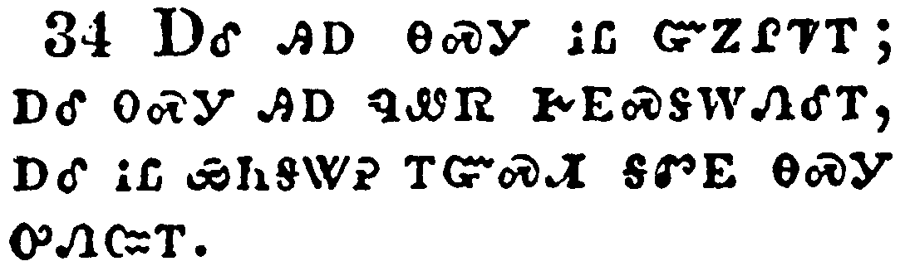</a></td>
</tr>
<tr class="even">
<td>And they understood none of these things: and this saying was hid from them, neither knew they the things which were spoken.</td>
</tr>
<tr class="odd">
<td>ᎠᎴ ᎯᎠ ᎾᏍᎩ ᎥᏝ ᏳᏃᎵᏤᎢ; ᎠᎴ ᎾᏍᎩ ᎯᎠ ᏄᏪᏒ ᎨᎬᏍᎦᎳᏁᎴᎢ, ᎠᎴ ᎥᏝ ᏯᏂᎦᏔᎮ ᎢᏳᏍᏗ ᎦᏛᎬ ᎾᏍᎩ ᎤᏁᏨᎢ.</td>
</tr>
<tr class="even">
<td>A-le hi-a na-s-gi v-tla yu-no-li-tse-i; a-le na-s-gi hi-a nu-we-sv ge-gv-s-ga-la-ne-le-i, a-le v-tla ya-ni-ga-ta-he i-yu-s-di ga-dv-gv na-s-gi u-ne-tsv-i.</td>
</tr>
</tbody>
</table>

<table>
<tbody>
<tr class="odd">
<td><a href="031835.png">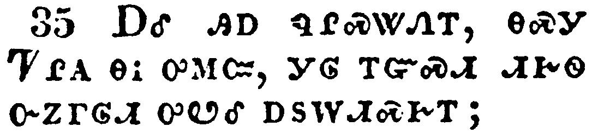</a></td>
</tr>
<tr class="even">
<td>And it came to pass, that as he was come nigh unto Jericho, a certain blind man sat by the way side begging:</td>
</tr>
<tr class="odd">
<td>ᎠᎴ ᎯᎠ ᏄᎵᏍᏔᏁᎢ, ᎾᏍᎩ ᏤᎵᎪ ᎾᎥ ᎤᎷᏨ, ᎩᎶ ᎢᏳᏍᏗ ᏗᎨᏫ ᏅᏃᎱᎶᏗ ᎤᏬᎴ ᎠᏚᎳᏗᏍᎨᎢ;</td>
</tr>
<tr class="even">
<td>A-le hi-a nu-li-s-ta-ne-i, na-s-gi Tse-li-go na-v u-lu-tsv, gi-lo i-yu-s-di di-ge-wi nv-no-hu-lo-di u-wo-le a-du-la-di-s-ge-i;</td>
</tr>
</tbody>
</table>

<table>
<tbody>
<tr class="odd">
<td><a href="031836.png">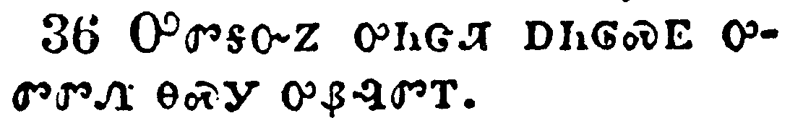</a></td>
</tr>
<tr class="even">
<td>And hearing the multitude pass by, he asked what it meant.</td>
</tr>
<tr class="odd">
<td>ᎤᏛᎦᏅᏃ ᎤᏂᏣᏘ ᎠᏂᎶᏍᎬ ᎤᏛᏛᏁ ᎾᏍᎩ ᎤᏰᎸᏛᎢ.</td>
</tr>
<tr class="even">
<td>U-dv-ga-nv-no u-ni-tsa-ti a-ni-lo-s-gv u-dv-dv-ne na-s-gi u-ye-lv-dv-i.</td>
</tr>
</tbody>
</table>

<table>
<tbody>
<tr class="odd">
<td></td>
</tr>
<tr class="even">
<td>And they told him, that Jesus of Nazareth passeth by.</td>
</tr>
<tr class="odd">
<td>ᎬᏩᏃᏁᎴᏃ ᎾᏍᎩ ᏥᏌ ᎾᏎᎵᏗ ᎡᎯ ᎦᎶᏍᎬᎢ.</td>
</tr>
<tr class="even">
<td>Gv-wa-no-ne-le-no na-s-gi Tsi-sa Na-se-li-di e-hi ga-lo-s-gv-i.</td>
</tr>
</tbody>
</table>

<table>
<tbody>
<tr class="odd">
<td><a href="031838.png">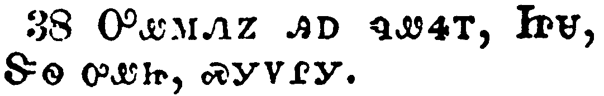</a></td>
</tr>
<tr class="even">
<td>And he cried, saying, Jesus, thou Son of David, have mercy on me.</td>
</tr>
<tr class="odd">
<td>ᎤᏪᎷᏁᏃ ᎯᎠ ᏄᏪᏎᎢ, ᏥᏌ, ᏕᏫ ᎤᏪᏥ, ᏍᎩᏙᎵᎩ.</td>
</tr>
<tr class="even">
<td>U-we-lu-ne-no hi-a nu-we-se-i, Tsi-sa, De-wi u-we-tsi, s-gi-do-li-gi.</td>
</tr>
</tbody>
</table>

<table>
<tbody>
<tr class="odd">
<td><a href="031839.png">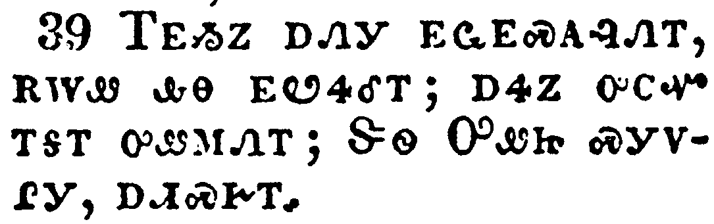</a></td>
</tr>
<tr class="even">
<td>And they which went before rebuked him, that he should hold his peace: but he cried so much the more, Thou Son of David, have mercy on me.</td>
</tr>
<tr class="odd">
<td>ᎢᎬᏱᏃ ᎠᏁᎩ ᎬᏩᎬᏍᎪᎸᏁᎢ, ᎡᎳᏪ ᎲᎾ ᎬᏬᏎᎴᎢ; ᎠᏎᏃ ᎤᏟᏉ ᎢᎦᎢ ᎤᏪᎷᏁᎢ; ᏕᏫ ᎤᏪᏥ ᏍᎩᏙᎵᎩ, ᎠᏗᏍᎨᎢ.</td>
</tr>
<tr class="even">
<td>I-gv-yi-no a-ne-gi gv-wa-gv-s-go-lv-ne-i, e-la-we hv-na gv-wo-se-le-i; a-se-no u-tli-quo i-ga-i u-we-lu-ne-i; De-wi U-we-tsi s-gi-do-li-gi, a-di-s-ge-i.</td>
</tr>
</tbody>
</table>

<table>
<tbody>
<tr class="odd">
<td><a href="031840.png">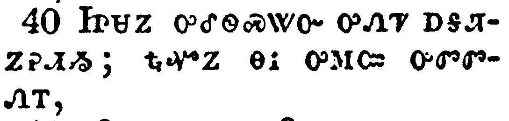</a></td>
</tr>
<tr class="even">
<td>And Jesus stood, and commanded him to be brought unto him: and when he was come near, he asked him,</td>
</tr>
<tr class="odd">
<td>ᏥᏌᏃ ᎤᎴᏫᏍᏔᏅ ᎤᏁᏤ ᎠᎦᏘᏃᎮᏗᏱ; ᎿᎭᏉᏃ ᎾᎥ ᎤᎷᏨ ᎤᏛᏛᏁᎢ,</td>
</tr>
<tr class="even">
<td>Tsi-sa-no u-le-wi-s-ta-nv u-ne-tse a-ga-ti-no-he-di-yi; hna-quo-no na-v u-lu-tsv u-dv-dv-ne-i,</td>
</tr>
</tbody>
</table>

<table>
<tbody>
<tr class="odd">
<td></td>
</tr>
<tr class="even">
<td>Saying, What wilt thou that I shall do unto thee? And he said, Lord, that I may receive my sight.</td>
</tr>
<tr class="odd">
<td>ᎯᎠ ᏄᏪᏎᎢ, ᎦᏙ ᏣᏚᎵ ᎬᏯᏛᏁᏗᏱ? ᎯᎠᏃ ᏄᏪᏎᎢ, ᏣᎬᏫᏳᎯ, ᎥᎠᎩᎪᏩᏛᏗᏱ ᎠᏆᏚᎵᎭ.</td>
</tr>
<tr class="even">
<td>Hi-a nu-we-se-i, Ga-do tsa-du-li gv-ya-dv-ne-di-yi? Hi-a-no nu-we-se-i, Tsa-gv-wi-yu-hi, v-a-gi-go-wa-dv-di-yi a-qua-du-li-ha.</td>
</tr>
</tbody>
</table>

<table>
<tbody>
<tr class="odd">
<td><a href="031842.png">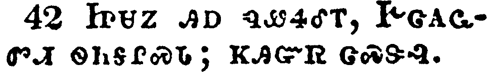</a></td>
</tr>
<tr class="even">
<td>And Jesus said unto him, Receive thy sight: thy faith hath saved thee.</td>
</tr>
<tr class="odd">
<td>ᏥᏌᏃ ᎯᎠ ᏄᏪᏎᎴᎢ, ᎨᏣᎪᏩᏛᏗ ᏫᏂᎦᎵᏍᏓ; ᏦᎯᏳᏒ ᏣᏍᏕᎸ.</td>
</tr>
<tr class="even">
<td>Tsi-sa-no hi-a nu-we-se-le-i, Ge-tsa-go-wa-dv-di wi-ni-ga-li-s-da; tso-hi-yu-sv tsa-s-de-lv.</td>
</tr>
</tbody>
</table>

<table>
<tbody>
<tr class="odd">
<td><a href="031843.png">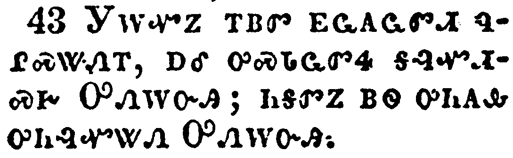</a></td>
</tr>
<tr class="even">
<td>And immediately he received his sight, and followed him, glorifying God: and all the people, when they saw it, gave praise unto God.</td>
</tr>
<tr class="odd">
<td>ᎩᎳᏉᏃ ᎢᏴᏛ ᎬᏩᎪᏩᏛᏗ ᏄᎵᏍᏔᏁᎢ, ᎠᎴ ᎤᏍᏓᏩᏛᏎ ᎦᎸᏉᏗᏍᎨ ᎤᏁᎳᏅᎯ; ᏂᎦᏛᏃ ᏴᏫ ᎤᏂᎪᎲ ᎤᏂᎸᏉᏔᏁ ᎤᏁᎳᏅᎯ.</td>
</tr>
<tr class="even">
<td>Gi-la-quo-no i-yv-dv gv-wa-go-wa-dv-di nu-li-s-ta-ne-i, a-le u-s-da-wa-dv-se ga-lv-quo-di-s-ge U-ne-la-nv-hi; ni-ga-dv-no yv-wi u-ni-go-hv u-ni-lv-quo-ta-ne U-ne-la-nv-hi.</td>
</tr>
</tbody>
</table>

