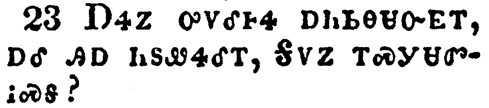
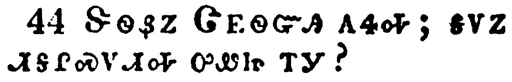

+++
draft=false
date = 2014-12-18T21:11:07Z
title = "Luke - Chapter 20 - Cherokee New Testament"
weight = 1418955067

[taxonomies]

authors = ["Timothy Legg"]
categories = []
tags = []

[extra]
+++

<table>
<tbody>
<tr class="odd">
<td></td>
</tr>
<tr class="even">
<td>And it came to pass, that on one of those days, as he taught the people in the temple, and preached the gospel, the chief priests and the scribes came upon him with the elders,</td>
</tr>
<tr class="odd">
<td>ᎯᎠᏃ ᏄᎵᏍᏔᏁᎢ, ᎾᏍᎩ ᏌᏉ ᎢᎦ ᎾᎯᏳ ᎨᏒ, ᏕᎨᏲᎲᏍᎨ ᏴᏫ ᎤᏛᎾᏗᎦᎳᏫᎢᏍᏗᏱ, ᎣᏍᏛ ᎧᏃᎮᏛ ᎠᎵᏥᏙᎲᏍᎨᎢ, ᎾᏍᎩ ᏄᏂᎬᏫᏳᏒ ᎠᏥᎸᎠᏁᎶᎯ, ᎠᎴ ᏗᏃᏪᎵᏍᎩ ᎬᏩᏃᎴᎢ, ᎤᎾᎵᎪᏎ ᏗᏂᎳᏫᎩ,</td>
</tr>
<tr class="even">
<td>Hi-a-no nu-li-s-ta-ne-i, na-s-gi sa-quo i-ga na-hi-yu ge-sv, de-ge-yo-hv-s-ge yv-wi u-dv-na-di-ga-la-wi-i-s-di-yi, o-s-dv ka-no-he-dv a-li-tsi-do-hv-s-ge-i, na-s-gi nu-ni-gv-wi-yu-sv a-tsi-lv-a-ne-lo-hi, a-le di-no-we-li-s-gi gv-wa-no-le-i, u-na-li-go-se di-ni-la-wi-gi,</td>
</tr>
</tbody>
</table>

<table>
<tbody>
<tr class="odd">
<td></td>
</tr>
<tr class="even">
<td>And spake unto him, saying, Tell us, by what authority doest thou these things? or who is he that gave thee this authority?</td>
</tr>
<tr class="odd">
<td>ᎠᎴ ᎬᏩᎵᏃᎮᏔᏁ, ᎯᎠ ᏄᏂᏪᏎᎢ, ᏍᎩᏃᎲᏏ, ᎦᏙ ᏣᎵᏍᎦᏍᏙᏗ ᎯᎠ ᎾᏍᎩ ᏥᏄᏍᏗ ᏥᏕᏣᎸᏫᏍᏓᏁᎭ? ᎠᎴ ᎦᎪ ᎾᏍᎩ Ꮎ ᏣᏁᎸᎯ ᎾᏍᎩ ᎢᏣᏛᏁᏗᏱ?</td>
</tr>
<tr class="even">
<td>A-le gv-wa-li-no-he-ta-ne, hi-a nu-ni-we-se-i, S-gi-no-hv-si, ga-do tsa-li-s-ga-s-do-di hi-a na-s-gi tsi-nu-s-di tsi-de-tsa-lv-wi-s-da-ne-ha? A-le ga-go na-s-gi na tsa-ne-lv-hi na-s-gi i-tsa-dv-ne-di-yi?</td>
</tr>
</tbody>
</table>

<table>
<tbody>
<tr class="odd">
<td></td>
</tr>
<tr class="even">
<td>And he answered and said unto them, I will also ask you one thing; and answer me:</td>
</tr>
<tr class="odd">
<td>ᎤᏁᏨᏃ ᎯᎠ ᏂᏚᏪᏎᎴᎢ, ᎠᏴ ᎾᏍᏉ ᏑᏓᎴᎩ ᏓᏨᏯᏛᏛᏂ; ᎠᎴ ᏍᎩᏃᎲᏏ;</td>
</tr>
<tr class="even">
<td>U-ne-tsv-no hi-a ni-du-we-se-le-i, A-yv na-s-quo su-da-le-gi da-tsv-ya-dv-dv-ni; a-le s-gi-no-hv-si;</td>
</tr>
</tbody>
</table>

<table>
<tbody>
<tr class="odd">
<td></td>
</tr>
<tr class="even">
<td>The baptism of John, was it from heaven, or of men?</td>
</tr>
<tr class="odd">
<td>ᏣᏂ ᏧᏓᏬᏍᏗ ᎨᏒᎢ, ᎦᎸᎳᏗᏍᎪ ᏧᏓᎴᏁᎢ, ᏴᏫᏉᎨ ᎠᏁᎲᎢ.</td>
</tr>
<tr class="even">
<td>Tsa-ni tsu-da-wo-s-di ge-sv-i, ga-lv-la-di-s-go tsu-da-le-ne-i, yv-wi-quo-ge a-ne-hv-i.</td>
</tr>
</tbody>
</table>

<table>
<tbody>
<tr class="odd">
<td></td>
</tr>
<tr class="even">
<td>And they reasoned with themselves, saying, If we shall say, From heaven; he will say, Why then believed ye him not?</td>
</tr>
<tr class="odd">
<td>ᏙᏧᎾᏓᏅᏛᏃ ᎤᎾᏓᏅᏖᎴ ᎯᎠ ᎾᏂᏪᏍᎨᎢ, ᎢᏳᏃ ᎦᎸᎳᏗ, ᏲᎦᏛᏅ, ᎯᎠ ᏱᏃᎩᏪᏏ, ᎦᏙᏃ Ꮭ ᏱᎡᏦᎢᏳᏁᎢ?</td>
</tr>
<tr class="even">
<td>Do-tsu-na-da-nv-dv-no u-na-da-nv-te-le hi-a na-ni-we-s-ge-i, I-yu-no ga-lv-la-di, yo-ga-dv-nv, hi-a yi-no-gi-we-si, Ga-do-no tla yi-e-tso-i-yu-ne-i?</td>
</tr>
</tbody>
</table>

<table>
<tbody>
<tr class="odd">
<td></td>
</tr>
<tr class="even">
<td>But and if we say, Of men; all the people will stone us: for they be persuaded that John was a prophet.</td>
</tr>
<tr class="odd">
<td>ᎢᏳᏃ ᏴᏫᏉ ᎠᏁᎲᎢ, ᏲᎦᏛᏅ, ᏂᎦᏛᏉ ᏴᏫ ᏅᏯ ᏱᏕᎪᎬᏂᏍᏓ; ᏣᏂᏰᏃ ᎠᏙᎴᎰᏍᎩ ᎨᏒᎩ, ᎠᏁᎵᎭ.</td>
</tr>
<tr class="even">
<td>I-yu-no Yv-wi-quo a-ne-hv-i, yo-ga-dv-nv, ni-ga-dv-quo yv-wi nv-ya yi-de-go-gv-ni-s-da; Tsa-ni-ye-no a-do-le-ho-s-gi ge-sv-gi, a-ne-li-ha.</td>
</tr>
</tbody>
</table>

<table>
<tbody>
<tr class="odd">
<td></td>
</tr>
<tr class="even">
<td>And they answered, that they could not tell whence it was.</td>
</tr>
<tr class="odd">
<td>ᎤᏂᏁᏨᏃ, ᎥᏝ ᏲᏥᎦᏔᎭ ᏧᏓᎴᏅᎢ, ᎤᎾᏛᏁᎢ.</td>
</tr>
<tr class="even">
<td>U-ni-ne-tsv-no, V-tla yo-tsi-ga-ta-ha tsu-da-le-nv-i, u-na-dv-ne-i.</td>
</tr>
</tbody>
</table>

<table>
<tbody>
<tr class="odd">
<td></td>
</tr>
<tr class="even">
<td>And Jesus said unto them, Neither tell I you by what authority I do these things.</td>
</tr>
<tr class="odd">
<td>ᏥᏌᏃ ᎯᎠ ᏂᏚᏪᏎᎴᎢ, ᎥᏝ ᎾᏍᏉ ᎠᏴ ᏴᎨᏨᏃᎲᏏ ᎢᏳᏍᏗ ᎨᏒ ᎠᏆᎵᏍᎦᏍᏙᏛ ᎯᎠ ᎾᏍᎩ ᏥᏓᎩᎸᏫᏍᏓᏁᎭ.</td>
</tr>
<tr class="even">
<td>Tsi-sa-no hi-a ni-du-we-se-le-i, V-tla na-s-quo a-yv yv-ge-tsv-no-hv-si i-yu-s-di ge-sv a-qua-li-s-ga-s-do-dv hi-a na-s-gi tsi-da-gi-lv-wi-s-da-ne-ha.</td>
</tr>
</tbody>
</table>

<table>
<tbody>
<tr class="odd">
<td></td>
</tr>
<tr class="even">
<td>Then began he to speak to the people this parable; A certain man planted a vineyard, and let it forth to husbandmen, and went into a far country for a long time.</td>
</tr>
<tr class="odd">
<td>ᎠᎴ ᎿᎭᏉ ᎤᎴᏅᎮ ᎾᏍᎩ ᎯᎠ ᏚᏟᎶᏍᏓᏁᎴ ᏴᏫ; ᎩᎶ ᎢᏳᏍᏗ ᎠᏍᎦᏯ ᏖᎸᎳᏗ ᏚᏫᏎᎢ, ᎠᎴ ᏚᏙᎳᏍᏔᏁ ᏠᎨᏏ ᏭᏂᎸᏫᏍᏓᏁᎯ, ᎠᎴ ᎢᏅ ᏭᎶᏎ ᎪᎯᏛ ᏭᏪᏙᎴᎢ.</td>
</tr>
<tr class="even">
<td>A-le hna-quo u-le-nv-he na-s-gi hi-a du-tli-lo-s-da-ne-le yv-wi; Gi-lo i-yu-s-di a-s-ga-ya te-lv-la-di du-wi-se-i, a-le du-do-la-s-ta-ne tlo-ge-si wu-ni-lv-wi-s-da-ne-hi, a-le i-nv wu-lo-se go-hi-dv wu-we-do-le-i.</td>
</tr>
</tbody>
</table>

<table>
<tbody>
<tr class="odd">
<td></td>
</tr>
<tr class="even">
<td>And at the season he sent a servant to the husbandmen, that they should give him of the fruit of the vineyard: but the husbandmen beat him, and sent him away empty.</td>
</tr>
<tr class="odd">
<td>ᎾᎯᏳᏃ ᎤᏅᏂᏍᏗᏱ ᎨᏒ ᎤᏅᏏᏓᏍᏗ ᎤᏅᏎ ᏠᎨᏏ ᏧᏂᎸᏫᏍᏓᏁᎯ ᏗᏁᎲᎢ, ᎾᏍᎩ ᏂᏙᏓᎬᏩᏅᏁᏗᏱ ᎤᎾᏓᏛᏅᎯ ᏖᎸᎳᏗ ᏓᏫᏒᎢ; ᎠᏎᏃ ᏠᎨᏏ ᏧᏂᎸᏫᏍᏓᏁᎯ ᎤᏂᎵᎥᏂᎸ ᎠᏒᎭ ᎤᏂᎨᎯᏙᎴᎢ.</td>
</tr>
<tr class="even">
<td>Na-hi-yu-no u-nv-ni-s-di-yi ge-sv u-nv-si-da-s-di u-nv-se tlo-ge-si tsu-ni-lv-wi-s-da-ne-hi di-ne-hv-i, na-s-gi ni-do-da-gv-wa-nv-ne-di-yi u-na-da-dv-nv-hi te-lv-la-di da-wi-sv-i; a-se-no tlo-ge-si tsu-ni-lv-wi-s-da-ne-hi u-ni-li-v-ni-lv a-sv-ha u-ni-ge-hi-do-le-i.</td>
</tr>
</tbody>
</table>

<table>
<tbody>
<tr class="odd">
<td></td>
</tr>
<tr class="even">
<td>And again he sent another servant: and they beat him also, and entreated him shamefully, and sent him away empty.</td>
</tr>
<tr class="odd">
<td>ᎠᎴ ᏔᎵᏁ ᏅᏩᏓᎴ ᎤᏅᏎ ᎤᏅᏏᏓᏍᏗ ᎦᎬᏩᏂᏐᏢᏔᏅ, ᎠᏒᎭ ᎤᏂᎨᎯᏙᎴᎢ.</td>
</tr>
<tr class="even">
<td>A-le ta-li-ne nv-wa-da-le u-nv-se u-nv-si-da-s-di ga-gv-wa-ni-so-tlv-ta-nv, a-sv-ha u-ni-ge-hi-do-le-i.</td>
</tr>
</tbody>
</table>

<table>
<tbody>
<tr class="odd">
<td></td>
</tr>
<tr class="even">
<td>And again he sent a third: and they wounded him also, and cast him out.</td>
</tr>
<tr class="odd">
<td>ᎠᎴᏬ ᏦᎢᏁ ᎤᏅᏎᎢ; ᎾᏍᎩᏃ ᎾᏍᏉ ᎤᏂᏐᏅᏅ ᎤᏂᏄᎪᏫᏎᎢ.</td>
</tr>
<tr class="even">
<td>A-le-wo tso-i-ne u-nv-se-i; na-s-gi-no na-s-quo u-ni-so-nv-nv u-ni-nu-go-wi-se-i.</td>
</tr>
</tbody>
</table>

<table>
<tbody>
<tr class="odd">
<td></td>
</tr>
<tr class="even">
<td>Then said the lord of the vineyard, What shall I do? I will send my beloved son: it may be they will reverence him when they see him.</td>
</tr>
<tr class="odd">
<td>ᎿᎭᏉᏃ ᏖᎸᎳᏗ ᏓᏫᏒ ᎤᏤᎵᎦ, ᎯᎠ ᏄᏪᏎᎢ, ᎦᏙ ᏓᎦᏛᏁᎵ? ᎠᏇᏥ ᏥᎨᏳᎢ ᏓᏥᏅᏏ; ᏯᏂᎸᏉᏓ ᏱᎩ ᎾᏍᎩ ᎠᏂᎪᎲᎭ.</td>
</tr>
<tr class="even">
<td>Hna-quo-no te-lv-la-di da-wi-sv u-tse-li-ga, hi-a nu-we-se-i, Ga-do da-ga-dv-ne-li? A-que-tsi tsi-ge-yu-i da-tsi-nv-si; ya-ni-lv-quo-da yi-gi na-s-gi a-ni-go-hv-ha.</td>
</tr>
</tbody>
</table>

<table>
<tbody>
<tr class="odd">
<td></td>
</tr>
<tr class="even">
<td>But when the husbandmen saw him, they reasoned among themselves, saying, This is the heir: come, let us kill him, that the inheritance may be ours.</td>
</tr>
<tr class="odd">
<td>ᎠᏎᏃ ᏠᎨᏏ ᏧᏂᎸᏫᏍᏓᏁᎯ ᎤᏂᎪᎲ, ᎤᏅᏒ ᎨᏒ ᎤᎾᎵᏃᎮᎴ ᎯᎠ ᏂᏚᎾᏓᏪᏎᎴᎢ, ᎯᎠ ᎾᏍᎩ ᎤᏘᏰᏗ ᏥᎩ ᏧᎬᏩᎶᏗ, Ꭷ, ᎡᏗᎷᎦ, ᎾᏍᎩᏃ ᏧᎬᏩᎶᏗ ᎤᏘᏯᏍᏓᏁᏗ ᎨᏒ ᎢᎦᏤᎵ ᏱᏂᎦᎵᏍᏓ.</td>
</tr>
<tr class="even">
<td>A-se-no tlo-ge-si tsu-ni-lv-wi-s-da-ne-hi u-ni-go-hv, u-nv-sv ge-sv u-na-li-no-he-le hi-a ni-du-na-da-we-se-le-i, Hi-a na-s-gi u-ti-ye-di tsi-gi tsu-gv-wa-lo-di, Ka, e-di-lu-ga, na-s-gi-no tsu-gv-wa-lo-di u-ti-ya-s-da-ne-di ge-sv i-ga-tse-li yi-ni-ga-li-s-da.</td>
</tr>
</tbody>
</table>

<table>
<tbody>
<tr class="odd">
<td></td>
</tr>
<tr class="even">
<td>So they cast him out of the vineyard, and killed him. What therefore shall the lord of the vineyard do unto them?</td>
</tr>
<tr class="odd">
<td>ᎰᏩᏃ ᎤᏂᏄᎪᏫᏒ ᏖᎸᎳᏗ ᏓᏫᏒᎢ, ᎤᏂᎴᎢ. ᎾᏍᎩ ᎢᏳᏍᏗ ᎾᏍᎩ Ꮎ ᏖᎸᎳᏗ ᏓᏫᏒ ᎤᏤᎵᎦ ᎦᏙ ᏙᏓᎬᏁᎵ ᎾᏍᎩ?</td>
</tr>
<tr class="even">
<td>Ho-wa-no u-ni-nu-go-wi-sv te-lv-la-di da-wi-sv-i, u-ni-le-i. Na-s-gi i-yu-s-di na-s-gi na te-lv-la-di da-wi-sv u-tse-li-ga ga-do do-da-gv-ne-li na-s-gi?</td>
</tr>
</tbody>
</table>

<table>
<tbody>
<tr class="odd">
<td></td>
</tr>
<tr class="even">
<td>He shall come and destroy these husbandmen, and shall give the vineyard to others. And when they heard it, they said, God forbid.</td>
</tr>
<tr class="odd">
<td>ᏓᎦᎷᏥ ᎠᎴ ᏙᏛᏛᏔᏂ ᎾᏍᎩ Ꮎ ᏠᎨᏏ ᏧᏂᎸᏫᏍᏓᏁᎯ, ᎠᎴ ᏅᏩᎾᏓᎴ ᏙᏛᏁᎵ ᏖᎸᎳᏗ ᏓᏫᏒᎢ. ᎾᏍᎩᏃ ᎤᎾᏛᎦᏁᎸ, ᎥᏞᏍᏗ, ᎤᎾᏛᏁᎢ.</td>
</tr>
<tr class="even">
<td>Da-ga-lu-tsi a-le do-dv-dv-ta-ni na-s-gi na tlo-ge-si tsu-ni-lv-wi-s-da-ne-hi, a-le nv-wa-na-da-le do-dv-ne-li te-lv-la-di da-wi-sv-i. Na-s-gi-no u-na-dv-ga-ne-lv, V-tle-s-di, u-na-dv-ne-i.</td>
</tr>
</tbody>
</table>

<table>
<tbody>
<tr class="odd">
<td></td>
</tr>
<tr class="even">
<td>And he beheld them, and said, What is this then that is written, The stone which the builders rejected, the same is become the head of the corner?</td>
</tr>
<tr class="odd">
<td>ᏚᎧᎿᎭᏅᏃ, ᎯᎠ ᏄᏪᏎᎢ, ᎦᏙᏃ ᎾᏍᎩ ᎯᎠ ᏥᏂᎬᏅ ᏥᎪᏪᎳ, ᏗᎾᏁᏍᎨᏍᎩ ᎤᏂᏲᎢᏎᎸᎯ ᏅᏯ ᎾᏍᎩ ᏄᎬᏫᏳᏒ ᎤᏅᏏᏴ ᎠᏗ ᏄᎵᏍᏔᏅ?</td>
</tr>
<tr class="even">
<td>Du-ka-hna-nv-no, hi-a nu-we-se-i, Ga-do-no na-s-gi hi-a tsi-ni-gv-nv tsi-go-we-la, Di-na-ne-s-ge-s-gi u-ni-yo-i-se-lv-hi nv-ya na-s-gi nu-gv-wi-yu-sv u-nv-si-yv a-di nu-li-s-ta-nv?</td>
</tr>
</tbody>
</table>

<table>
<tbody>
<tr class="odd">
<td></td>
</tr>
<tr class="even">
<td>Whosoever shall fall upon that stone shall be broken; but on whomsoever it shall fall, it will grind him to powder.</td>
</tr>
<tr class="odd">
<td>ᎩᎶ ᎾᏍᎩ ᎾᎿᎭᏅᏲᎯ ᎠᏢᏨᎭ ᏓᏳᏐᏅᏂ; ᎩᎶᏃ ᎾᏍᎩ ᎤᏐᏅᎭ ᏓᏳᏪᏓᏬᏔᏂ.</td>
</tr>
<tr class="even">
<td>Gi-lo na-s-gi na-hna nv-yo-hi a-tlv-tsv-ha da-yu-so-nv-ni; gi-lo-no na-s-gi u-so-nv-ha da-yu-we-da-wo-ta-ni.</td>
</tr>
</tbody>
</table>

<table>
<tbody>
<tr class="odd">
<td></td>
</tr>
<tr class="even">
<td>And the chief priests and the scribes the same hour sought to lay hands on him; and they feared the people: for they perceived that he had spoken this parable against them.</td>
</tr>
<tr class="odd">
<td>ᏄᏂᎬᏫᏳᏒᏃ ᎠᏥᎸ-ᎠᏁᎶᎯ ᎠᎴ ᏗᏃᏪᎵᏍᎩ ᎾᎯᏳᏉ ᎤᎾᏁᎶᏔᏁ ᎤᏂᏂᏴᏗᏱ, ᎠᏎᏃ ᏚᏂᏍᎦᎴ ᏴᏫ; ᎤᎾᏙᎴᎰᏎᏰᏃ ᎾᏍᎩ ᎯᎠ ᏚᏟᎶᏍᏔᏅ ᎤᏅᏒ ᎨᏥᏛᎬᎢ.</td>
</tr>
<tr class="even">
<td>Nu-ni-gv-wi-yu-sv-no a-tsi-lv--a-ne-lo-hi a-le di-no-we-li-s-gi na-hi-yu-quo u-na-ne-lo-ta-ne u-ni-ni-yv-di-yi, a-se-no du-ni-s-ga-le yv-wi; u-na-do-le-ho-se-ye-no na-s-gi hi-a du-tli-lo-s-ta-nv u-nv-sv ge-tsi-dv-gv-i.</td>
</tr>
</tbody>
</table>

<table>
<tbody>
<tr class="odd">
<td></td>
</tr>
<tr class="even">
<td>And they watched him, and sent forth spies, which should feign themselves just men, that they might take hold of his words, that so they might deliver him unto the power and authority of the governor.</td>
</tr>
<tr class="odd">
<td>ᎬᏩᎦᏌᏯᏍᏕᏃ, ᎠᎴ ᏙᏧᏂᏅᏎ ᎠᎾᏓᎦᏌᏯᏍᏗᏍᎩ, ᎾᏍᎩ ᎤᎾᏓᏅᏘ ᎤᎾᏣᎸᏗᏱ ᎾᏍᎩ ᎬᏩᎪᏁᎶᎯᏎᏗᏱ ᎦᏬᏂᏍᎬᎢ, ᎾᏍᎩᏃ ᏫᏚᏂᏲᎯᏎᏗᏱ ᎤᏰᎢᎵᏓᏍᏗᏱ ᎤᎬᏫᏳᎯ.</td>
</tr>
<tr class="even">
<td>Gv-wa-ga-sa-ya-s-de-no, a-le do-tsu-ni-nv-se a-na-da-ga-sa-ya-s-di-s-gi, na-s-gi u-na-da-nv-ti u-na-tsa-lv-di-yi na-s-gi gv-wa-go-ne-lo-hi-se-di-yi ga-wo-ni-s-gv-i, na-s-gi-no wi-du-ni-yo-hi-se-di-yi u-ye-i-li-da-s-di-yi u-gv-wi-yu-hi.</td>
</tr>
</tbody>
</table>

<table>
<tbody>
<tr class="odd">
<td></td>
</tr>
<tr class="even">
<td>And they asked him, saying, Master, we know that thou sayest and teachest rightly, neither acceptest thou the person of any, but teachest the way of God truly:</td>
</tr>
<tr class="odd">
<td>ᎬᏩᏛᏛᏁᏃ ᎯᎠ ᏄᏂᏪᏎᎢ, ᏔᏕᏲᎲᏍᎩ, ᎣᏥᎦᏔᎭ ᎯᏬᏂᏍᎬ ᎠᎴ ᏕᎭᏕᏲᎲᏍᎬ ᏚᏳᎪᏛ ᎨᏎᎢ, ᎠᎴ ᏂᏘᎸᏉᏙᏛᎾ ᎨᏒ ᏄᎾᏍᏛ ᏴᏫ, ᎤᏁᎳᏅᎯᏍᎩᏂ ᎤᏤᎵ ᎦᏅᏅ ᎤᏙᎯᏳᎯᏯ ᏕᎭᏕᏲᎲᏍᎬᎢ;</td>
</tr>
<tr class="even">
<td>Gv-wa-dv-dv-ne-no hi-a nu-ni-we-se-i, Ta-de-yo-hv-s-gi, o-tsi-ga-ta-ha hi-wo-ni-s-gv a-le de-ha-de-yo-hv-s-gv du-yu-go-dv ge-se-i, a-le ni-ti-lv-quo-do-dv-na ge-sv nu-na-s-dv yv-wi, U-ne-la-nv-hi-s-gi-ni u-tse-li ga-nv-nv u-do-hi-yu-hi-ya de-ha-de-yo-hv-s-gv-i;</td>
</tr>
</tbody>
</table>

<table>
<tbody>
<tr class="odd">
<td></td>
</tr>
<tr class="even">
<td>Is it lawful for us to give tribute unto Caesar, or no?</td>
</tr>
<tr class="odd">
<td>ᏚᏳᎪᏗᏍᎪ ᏏᏌ ᎡᏓᎫᏴᎡᏗᏱ ᎠᏰᎵ ᎠᎫᏴᏗ ᎨᏒᎢ, ᏝᎨ?</td>
</tr>
<tr class="even">
<td>Du-yu-go-di-s-go Si-sa e-da-gu-yv-e-di-yi a-ye-li a-gu-yv-di ge-sv-i, tla-ge?</td>
</tr>
</tbody>
</table>

<table>
<tbody>
<tr class="odd">
<td></td>
</tr>
<tr class="even">
<td>But he perceived their craftiness, and said unto them, Why tempt ye me?</td>
</tr>
<tr class="odd">
<td>ᎠᏎᏃ ᎤᏙᎴᎰᏎ ᎠᏂᏏᎾᏌᏅᎬᎢ, ᎠᎴ ᎯᎠ ᏂᏚᏪᏎᎴᎢ, ᎦᏙᏃ ᎢᏍᎩᏌᏛᎥᏍᎦ?</td>
</tr>
<tr class="even">
<td>A-se-no u-do-le-ho-se a-ni-si-na-sa-nv-gv-i, a-le hi-a ni-du-we-se-le-i, Ga-do-no i-s-gi-sa-dv-v-s-ga?</td>
</tr>
</tbody>
</table>

<table>
<tbody>
<tr class="odd">
<td></td>
</tr>
<tr class="even">
<td>Shew me a penny. Whose image and superscription hath it? They answered and said, Caesar's.</td>
</tr>
<tr class="odd">
<td>ᏥᎪᏩᏛ ᎠᎩᏏ ᏧᎬᏩᎶᏗ. ᎦᎪ ᏓᎦᏟᎶᏍᏗ, ᎠᎴ ᎦᎪ ᎠᏥᏃᎮᎭ ᎯᎠ ᏥᎪᏪᎳ? ᎤᏂᏁᏤᏃ, ᏏᏌ, ᎤᎾᏛᏁᎢ.</td>
</tr>
<tr class="even">
<td>Tsi-go-wa-dv a-gi-si tsu-gv-wa-lo-di. Ga-go da-ga-tli-lo-s-di, a-le ga-go a-tsi-no-he-ha hi-a tsi-go-we-la? U-ni-ne-tse-no, Si-sa, u-na-dv-ne-i.</td>
</tr>
</tbody>
</table>

<table>
<tbody>
<tr class="odd">
<td></td>
</tr>
<tr class="even">
<td>And he said unto them, Render therefore unto Caesar the things which be Caesar's, and unto God the things which be God's.</td>
</tr>
<tr class="odd">
<td>ᎯᎠᏃ ᏂᏚᏪᏎᎵᎢ, ᏏᏌ ᎠᏗᎾ ᎡᏣᎫᏴᏏ ᏏᏌ ᎤᏤᎵᎦ, ᎤᏁᎳᏅᎯᏃ ᎤᏁᎳᏅᎯ ᎤᏤᎵᎦ.</td>
</tr>
<tr class="even">
<td>Hi-a-no ni-du-we-se-li-i, Si-sa a-di-na e-tsa-gu-yv-si Si-sa u-tse-li-ga, U-ne-la-nv-hi-no U-ne-la-nv-hi u-tse-li-ga.</td>
</tr>
</tbody>
</table>

<table>
<tbody>
<tr class="odd">
<td></td>
</tr>
<tr class="even">
<td>And they could not take hold of his words before the people: and they marvelled at his answer, and held their peace.</td>
</tr>
<tr class="odd">
<td>ᎧᏁᎬᏃ ᎥᏝ ᏰᎵ ᎦᎬᏩᏂᎪᏁᎶᎯᏎᏗ ᏱᎨᏎ ᏴᏫ ᎠᏂᎦᏔᎲᎢ; ᎤᏂᏍᏆᏂᎪᏎᏃ ᏄᏪᏒ ᎤᏁᏨᎢ, ᎠᎴ ᎡᎳᏪᏱ ᎤᏅᏁᎢ.</td>
</tr>
<tr class="even">
<td>Ka-ne-gv-no v-tla ye-li ga-gv-wa-ni-go-ne-lo-hi-se-di yi-ge-se yv-wi a-ni-ga-ta-hv-i; u-ni-s-qua-ni-go-se-no nu-we-sv u-ne-tsv-i, a-le e-la-we-yi u-nv-ne-i.</td>
</tr>
</tbody>
</table>

<table>
<tbody>
<tr class="odd">
<td></td>
</tr>
<tr class="even">
<td>Then came to him certain of the Sadducees, which deny that there is any resurrection; and they asked him,</td>
</tr>
<tr class="odd">
<td>ᎿᎭᏉᏃ ᎩᎶ ᎢᏳᎾᏍᏗ ᎠᏂᏌᏚᏏ, ᎾᏍᎩ ᏣᎾᏓᏱᎭ ᎠᏲᎱᏒ ᏗᎴᎯᏐᏗ ᎨᏒᎢ, ᎬᏩᎷᏤᎸ ᎬᏩᏛᏛᏁᎢ,</td>
</tr>
<tr class="even">
<td>Hna-quo-no gi-lo i-yu-na-s-di A-ni-sa-du-si, na-s-gi tsa-na-da-yi-ha a-yo-hu-sv di-le-hi-so-di ge-sv-i, gv-wa-lu-tse-lv gv-wa-dv-dv-ne-i,</td>
</tr>
</tbody>
</table>

<table>
<tbody>
<tr class="odd">
<td></td>
</tr>
<tr class="even">
<td>Saying, Master, Moses wrote unto us, If any man's brother die, having a wife, and he die without children, that his brother should take his wife, and raise up seed unto his brother.</td>
</tr>
<tr class="odd">
<td>ᎯᎠ ᏄᏂᏪᏎᎢ, ᏔᏕᏲᎲᏍᎩ, ᎼᏏ ᎣᎪᏪᏁᎸᎩ ᎯᎠ ᏃᎩᏪᏎᎸᎩ, ᎩᎶ ᏗᎾᏓᏅᏟ ᎠᏲᎱᏍᎨᏍᏗ ᎤᏓᎵᎢ ᎤᏪᎧᎮᏍᏗ, ᎠᎴ ᏧᏪᏥ ᎾᏁᎲᎾ ᎠᏲᎱᏍᎨᏍᏗ, ᎾᏍᎩ ᏗᎾᏓᏅᏟ ᎠᏓᏰᎨᏍᏗ ᎤᏓᏴᏛ, ᎠᎴ ᏓᏛᎯᏍᏓᏁᎮᏍᏗ ᏧᏪᏥ ᏗᎾᏓᏅᏟ.</td>
</tr>
<tr class="even">
<td>Hi-a nu-ni-we-se-i, Ta-de-yo-hv-s-gi, Mo-si o-go-we-ne-lv-gi hi-a no-gi-we-se-lv-gi, Gi-lo di-na-da-nv-tli a-yo-hu-s-ge-s-di u-da-li-i u-we-ka-he-s-di, a-le tsu-we-tsi na-ne-hv-na a-yo-hu-s-ge-s-di, na-s-gi di-na-da-nv-tli a-da-ye-ge-s-di u-da-yv-dv, a-le da-dv-hi-s-da-ne-he-s-di tsu-we-tsi di-na-da-nv-tli.</td>
</tr>
</tbody>
</table>

<table>
<tbody>
<tr class="odd">
<td></td>
</tr>
<tr class="even">
<td>There were therefore seven brethren: and the first took a wife, and died without children.</td>
</tr>
<tr class="odd">
<td>ᎾᏍᎩᏃ ᎠᏁᎲᎩ ᎦᎵᏉᎩ ᎢᏯᏂᏛ ᎠᎾᎵᏅᏟ; ᎤᏓᏂᎵᎨᏃ ᎤᏕᏒᏅᎩ, ᎠᎴ ᎤᏲᎱᏒ ᏧᏪᏥ ᎾᏁᎲᎾ.</td>
</tr>
<tr class="even">
<td>Na-s-gi-no a-ne-hv-gi ga-li-quo-gi i-ya-ni-dv a-na-li-nv-tli; u-da-ni-li-ge-no u-de-sv-nv-gi, a-le u-yo-hu-sv tsu-we-tsi na-ne-hv-na.</td>
</tr>
</tbody>
</table>

<table>
<tbody>
<tr class="odd">
<td></td>
</tr>
<tr class="even">
<td>And the second took her to wife, and he died childless.</td>
</tr>
<tr class="odd">
<td>ᎠᎴ ᏔᎵᏁ ᏪᎯ ᎾᏍᎩ ᎤᏓᏴᏒᎩ, ᎠᎴ ᎤᏲᎱᏒ ᏧᏪᏥ ᎾᏁᎲᎾ.</td>
</tr>
<tr class="even">
<td>A-le ta-li-ne we-hi na-s-gi u-da-yv-sv-gi, a-le u-yo-hu-sv tsu-we-tsi na-ne-hv-na.</td>
</tr>
</tbody>
</table>

<table>
<tbody>
<tr class="odd">
<td></td>
</tr>
<tr class="even">
<td>And the third took her; and in like manner the seven also: and they left no children, and died.</td>
</tr>
<tr class="odd">
<td>ᎠᎴ ᏦᎢᏁ ᏪᎯ ᎤᏓᏴᏒᎩ; ᎠᎴ ᎾᏍᎩᏯ ᎾᏍᏉ ᎦᎵᏉᎩ ᎢᏯᏂᏛ; ᎠᎴ ᏧᏁᏥ ᎾᏁᎲᎾ ᏚᏂᏲᎱᏒᎩ.</td>
</tr>
<tr class="even">
<td>A-le tso-i-ne we-hi u-da-yv-sv-gi; a-le na-s-gi-ya na-s-quo ga-li-quo-gi i-ya-ni-dv; a-le tsu-ne-tsi na-ne-hv-na du-ni-yo-hu-sv-gi.</td>
</tr>
</tbody>
</table>

<table>
<tbody>
<tr class="odd">
<td></td>
</tr>
<tr class="even">
<td>Last of all the woman died also.</td>
</tr>
<tr class="odd">
<td>ᎣᏂᏱᏃ ᎠᎨᏴ ᎾᏍᏉ ᎤᏲᎱᏒᎩ.</td>
</tr>
<tr class="even">
<td>O-ni-yi-no a-ge-yv na-s-quo u-yo-hu-sv-gi.</td>
</tr>
</tbody>
</table>

<table>
<tbody>
<tr class="odd">
<td></td>
</tr>
<tr class="even">
<td>Therefore in the resurrection whose wife of them is she? for seven had her to wife.</td>
</tr>
<tr class="odd">
<td>ᎾᏍᎩᏃ ᎿᎭᏉ ᏗᎴᎯᏐᏗ ᏂᎦᎵᏍᏔᏂᎸᎭ, ᎦᎪ ᎤᏓᎵᎢ ᎨᏎᏍᏗ ᎾᏍᎩ, ᎦᎵᏉᎩᏰᏃ ᎢᏯᏂᏛ ᎤᎾᏓᏴᏛ ᎢᎩ.</td>
</tr>
<tr class="even">
<td>Na-s-gi-no hna-quo di-le-hi-so-di ni-ga-li-s-ta-ni-lv-ha, ga-go u-da-li-i ge-se-s-di na-s-gi, ga-li-quo-gi-ye-no i-ya-ni-dv u-na-da-yv-dv i-gi.</td>
</tr>
</tbody>
</table>

<table>
<tbody>
<tr class="odd">
<td></td>
</tr>
<tr class="even">
<td>And Jesus answering said unto them, The children of this world marry, and are given in marriage:</td>
</tr>
<tr class="odd">
<td>ᏥᏌᏃ ᎤᏁᏨ ᎯᎠ ᏂᏚᏪᏎᎴᎢ, ᎠᏂ ᎡᎶᎯ ᎠᏁᎯ ᏓᎾᏕᏒᎲᏍᎪᎢ ᎠᎴ ᏕᎨᏥᏰᎪᎢ;</td>
</tr>
<tr class="even">
<td>Tsi-sa-no u-ne-tsv hi-a ni-du-we-se-le-i, A-ni e-lo-hi a-ne-hi da-na-de-sv-hv-s-go-i a-le de-ge-tsi-ye-go-i;</td>
</tr>
</tbody>
</table>

<table>
<tbody>
<tr class="odd">
<td></td>
</tr>
<tr class="even">
<td>But they which shall be accounted worthy to obtain that world, and the resurrection from the dead, neither marry, nor are given in marriage:</td>
</tr>
<tr class="odd">
<td>ᎾᏍᎩᏍᎩᏂ ᏐᎢᏱ ᏗᎨᏒ ᎠᎴ ᎠᏲᎱᏒ ᏗᎴᎯᏐᏗ ᎨᏒ ᏰᎵᏉ ᎬᏩᎾᏖᎳᏗᏍᏗ ᎨᏥᏰᎸᎯ, ᎥᏝ ᏱᏓᎾᏕᏒᎲᏍᎪᎢ, ᎥᏝ ᎠᎴ ᏱᏗᎨᏥᏰᎪᎢ.</td>
</tr>
<tr class="even">
<td>Na-s-gi-s-gi-ni so-i-yi di-ge-sv a-le a-yo-hu-sv di-le-hi-so-di ge-sv ye-li-quo gv-wa-na-te-la-di-s-di ge-tsi-ye-lv-hi, v-tla yi-da-na-de-sv-hv-s-go-i, v-tla a-le yi-di-ge-tsi-ye-go-i.</td>
</tr>
</tbody>
</table>

<table>
<tbody>
<tr class="odd">
<td></td>
</tr>
<tr class="even">
<td>Neither can they die any more: for they are equal unto the angels; and are the children of God, being the children of the resurrection.</td>
</tr>
<tr class="odd">
<td>ᎥᏝ ᎠᎴ ᎿᎭᏉ ᏗᎬᏩᏂᏲᎱᎯᏍᏗ ᏱᎨᏎᏍᏗ; ᏗᏂᎧᎿᎭᏩᏗᏙᎯᏍᎩᏂ ᎦᎸᎳᏗ ᎠᏁᎯ ᏄᎾᏍᏛ ᎾᏍᎩᏯ ᏄᎾᏍᏕᏍᏗ; ᎠᎴ ᎤᏁᎳᏅᎯ ᏧᏪᏥ ᎾᏍᎩ, ᎠᏲᎱᏒ ᏗᎴᎯᏐᏗ ᎨᏒ ᏧᏪᏥ ᎨᏒ ᎢᏳᏍᏗ.</td>
</tr>
<tr class="even">
<td>V-tla a-le hna-quo di-gv-wa-ni-yo-hu-hi-s-di yi-ge-se-s-di; di-ni-ka-hna-wa-di-do-hi-s-gi-ni ga-lv-la-di a-ne-hi nu-na-s-dv na-s-gi-ya nu-na-s-de-s-di; a-le U-ne-la-nv-hi tsu-we-tsi na-s-gi, a-yo-hu-sv di-le-hi-so-di ge-sv tsu-we-tsi ge-sv i-yu-s-di.</td>
</tr>
</tbody>
</table>

<table>
<tbody>
<tr class="odd">
<td></td>
</tr>
<tr class="even">
<td>Now that the dead are raised, even Moses shewed at the bush, when he calleth the Lord the God of Abraham, and the God of Isaac, and the God of Jacob.</td>
</tr>
<tr class="odd">
<td>ᎾᏃ ᏧᏂᏲᎱᏒᎯ ᏧᎾᎴᎯᏐᏗ ᎨᏒ, ᏱᏏ ᎬᏂᎨᏒ ᏄᏩᏁᎴ ᎤᏪᏲᏓᏛᎢ, ᎾᎯᏳ ᏱᎰᏩ ᎤᏁᎳᏅᎯ ᎡᏆᎭᎻ ᎤᏤᎵᎦ, ᎠᎴ ᎤᏁᎳᏅᎯ ᎡᏏᎩ ᎤᏤᎵᎦ, ᎠᎴ ᎤᏁᎳᏅᎯ ᏤᎦᏈ ᎤᏤᎵᎦ, ᏧᏬᏎᎴᎢ.</td>
</tr>
<tr class="even">
<td>Na-no tsu-ni-yo-hu-sv-hi tsu-na-le-hi-so-di ge-sv, Yi-si gv-ni-ge-sv nu-wa-ne-le u-we-yo-da-dv-i, na-hi-yu Yi-ho-wa U-ne-la-nv-hi E-qua-ha-mi u-tse-li-ga, a-le U-ne-la-nv-hi E-si-gi u-tse-li-ga, a-le U-ne-la-nv-hi Tse-ga-qui u-tse-li-ga, tsu-wo-se-le-i.</td>
</tr>
</tbody>
</table>

<table>
<tbody>
<tr class="odd">
<td></td>
</tr>
<tr class="even">
<td>For he is not a God of the dead, but of the living: for all live unto him.</td>
</tr>
<tr class="odd">
<td>ᎤᏁᎳᏅᎯᏰᏃ ᎥᏝ ᏧᏂᏲᎱᏒᎯ ᎤᎾᏤᎵᎦ ᏱᎩ, ᏗᏅᏃᏛᏍᎩᏂ; ᎾᏍᎩᏰᏃ ᎠᏓᏅᏖᏍᎬ ᏂᎦᏗᏳ ᏗᏅᏃᏛ.</td>
</tr>
<tr class="even">
<td>U-ne-la-nv-hi-ye-no v-tla tsu-ni-yo-hu-sv-hi u-na-tse-li-ga yi-gi, di-nv-no-dv-s-gi-ni; na-s-gi-ye-no a-da-nv-te-s-gv ni-ga-di-yu di-nv-no-dv.</td>
</tr>
</tbody>
</table>

<table>
<tbody>
<tr class="odd">
<td></td>
</tr>
<tr class="even">
<td>Then certain of the scribes answering said, Master, thou hast well said.</td>
</tr>
<tr class="odd">
<td>ᎿᎭᏉᏃ ᎩᎶ ᎢᏳᎾᏍᏗ ᏗᏃᏪᎵᏍᎩ ᎤᏂᏁᏤ ᎯᎠ ᏄᏂᏪᏎᎢ, ᏔᏕᏲᎲᏍᎩ, ᏰᎵᎦᏯ ᏂᏫ.</td>
</tr>
<tr class="even">
<td>Hna-quo-no gi-lo i-yu-na-s-di di-no-we-li-s-gi u-ni-ne-tse hi-a nu-ni-we-se-i, Ta-de-yo-hv-s-gi, ye-li-ga-ya ni-wi.</td>
</tr>
</tbody>
</table>

<table>
<tbody>
<tr class="odd">
<td></td>
</tr>
<tr class="even">
<td>And after that they durst not ask him any question at all.</td>
</tr>
<tr class="odd">
<td>ᎾᎯᏳᏃ ᎢᏳᏓᎴᏅᏛ ᎠᏂᏍᎦᎢᎮ ᎪᎱᏍᏗ ᎬᏩᏛᏛᏗᏱ.</td>
</tr>
<tr class="even">
<td>Na-hi-yu-no i-yu-da-le-nv-dv a-ni-s-ga-i-he go-hu-s-di gv-wa-dv-dv-di-yi.</td>
</tr>
</tbody>
</table>

<table>
<tbody>
<tr class="odd">
<td></td>
</tr>
<tr class="even">
<td>And he said unto them, How say they that Christ is David's son?</td>
</tr>
<tr class="odd">
<td>ᎯᎠᏃ ᏂᏚᏪᏎᎴᎢ, ᎦᏙ ᏗᎦᎵᏍᏙᏗᎭ ᎦᎶᏁᏛ ᏕᏫ ᎤᏪᏥ ᏣᎾᏗᎭ?</td>
</tr>
<tr class="even">
<td>Hi-a-no ni-du-we-se-le-i, ga-do di-ga-li-s-do-di-ha Ga-lo-ne-dv De-wi u-we-tsi tsa-na-di-ha?</td>
</tr>
</tbody>
</table>

<table>
<tbody>
<tr class="odd">
<td></td>
</tr>
<tr class="even">
<td>And David himself saith in the book of Psalms, The LORD said unto my Lord, Sit thou on my right hand,</td>
</tr>
<tr class="odd">
<td>ᏕᏫᏃ ᎤᏩᏒ ᎯᎠ ᏂᎦᏪᎭ ᏗᎧᏃᎩᏍᏗᏱ ᎪᏪᎵ, ᏱᎰᏩ ᎯᎠ ᏄᏪᏎᎴ ᎤᎬᏫᏳᎯ ᎠᏆᏤᎵᎦ, ᏥᎦᏘᏏ ᎢᏗᏢ ᏦᎴᏍᏗ,</td>
</tr>
<tr class="even">
<td>De-wi-no u-wa-sv hi-a ni-ga-we-ha Di-ka-no-gi-s-di-yi go-we-li, Yi-ho-wa hi-a nu-we-se-le U-gv-wi-yu-hi a-qua-tse-li-ga, Tsi-ga-ti-si i-di-tlv tso-le-s-di,</td>
</tr>
</tbody>
</table>

<table>
<tbody>
<tr class="odd">
<td></td>
</tr>
<tr class="even">
<td>Till I make thine enemies thy footstool.</td>
</tr>
<tr class="odd">
<td>ᎬᏂ ᎨᏣᏍᎦᎩ ᏗᏣᎳᏏᏗᏱ ᎦᏍᎩᎶ ᏂᎦᏥᏴᏁᎸᎭ.</td>
</tr>
<tr class="even">
<td>Gv-ni ge-tsa-s-ga-gi di-tsa-la-si-di-yi ga-s-gi-lo ni-ga-tsi-yv-ne-lv-ha.</td>
</tr>
</tbody>
</table>

<table>
<tbody>
<tr class="odd">
<td></td>
</tr>
<tr class="even">
<td>David therefore calleth him Lord, how is he then his son?</td>
</tr>
<tr class="odd">
<td>ᏕᏫᏰᏃ ᏣᎬᏫᏳᎯ ᎪᏎᎭ; ᎦᏙᏃ ᏗᎦᎵᏍᏙᏗᎭ ᎤᏪᏥ ᎢᎩ?</td>
</tr>
<tr class="even">
<td>De-wi-ye-no Tsa-gv-wi-yu-hi go-se-ha; ga-do-no di-ga-li-s-do-di-ha u-we-tsi i-gi?</td>
</tr>
</tbody>
</table>

<table>
<tbody>
<tr class="odd">
<td></td>
</tr>
<tr class="even">
<td>Then in the audience of all the people he said unto his disciples,</td>
</tr>
<tr class="odd">
<td>ᎿᎭᏉᏃ ᏂᎦᏛ ᏴᏫ ᎤᎾᏛᏓᏍᏛ, ᎯᎠ ᏂᏚᏪᏎᎴ ᎬᏩᏍᏓᏩᏗᏙᎯ,</td>
</tr>
<tr class="even">
<td>Hna-quo-no ni-ga-dv yv-wi u-na-dv-da-s-dv, hi-a ni-du-we-se-le gv-wa-s-da-wa-di-do-hi,</td>
</tr>
</tbody>
</table>

<table>
<tbody>
<tr class="odd">
<td></td>
</tr>
<tr class="even">
<td>Beware of the scribes, which desire to walk in long robes, and love greetings in the markets, and the highest seats in the synagogues, and the chief rooms at feasts;</td>
</tr>
<tr class="odd">
<td>ᏕᏤᏯᏙᏤᎮᏍᏗ ᏗᏃᏪᎵᏍᎩ, ᎾᏍᎩ ᏧᎾᏚᎵᏍᎪ ᏗᎦᏅᎯᏛ ᏧᎾᏄᏩᎢ ᎤᏁᏓᏍᏗᏱ, ᎠᎴ ᎣᏏᏳ ᏧᏂᏰᎸᎭ ᎨᏥᏲᎵᏍᏗᏱ ᏗᎦᏃᏙᏗᏱ, ᎠᎴ ᏄᎬᏫᏳᏒ ᏕᎦᏍᎩᎸ ᏗᎦᎳᏫᎢᏍᏗᏱ, ᎠᎴ ᏄᎬᏫᏳᏒ ᏗᎾᏢᏗᏱ ᏓᎾᎵᏍᏓᏴᎲᏍᎬᎢ;</td>
</tr>
<tr class="even">
<td>De-tse-ya-do-tse-he-s-di di-no-we-li-s-gi, na-s-gi tsu-na-du-li-s-go di-ga-nv-hi-dv tsu-na-nu-wa-i u-ne-da-s-di-yi, a-le o-si-yu tsu-ni-ye-lv-ha ge-tsi-yo-li-s-di-yi di-ga-no-do-di-yi, a-le nu-gv-wi-yu-sv de-ga-s-gi-lv di-ga-la-wi-i-s-di-yi, a-le nu-gv-wi-yu-sv di-na-tlv-di-yi da-na-li-s-da-yv-hv-s-gv-i;</td>
</tr>
</tbody>
</table>

<table>
<tbody>
<tr class="odd">
<td></td>
</tr>
<tr class="even">
<td>Which devour widows' houses, and for a shew make long prayers: the same shall receive greater damnation.</td>
</tr>
<tr class="odd">
<td>ᎾᏍᎩ ᏥᏓᏂᏒᏁᎰ ᏧᏃᏑᎶᏨᎯ ᏓᏂᏁᎸᎢ, ᎠᎴ ᎤᎾᏠᎾᏍᏛ ᎪᎯᏗᏳ ᏣᎾᏓᏙᎵᏍᏗᏍᎪᎢ; ᎾᏍᎩ ᎤᏟᎯᏳ ᎢᎦᎢ ᎤᏂᎩᎵᏲᎢᏍᏗ ᎨᏎᏍᏗ.</td>
</tr>
<tr class="even">
<td>Na-s-gi tsi-da-ni-sv-ne-ho tsu-no-su-lo-tsv-hi da-ni-ne-lv-i, a-le u-na-tlo-na-s-dv go-hi-di-yu tsa-na-da-do-li-s-di-s-go-i; na-s-gi u-tli-hi-yu i-ga-i u-ni-gi-li-yo-i-s-di ge-se-s-di.</td>
</tr>
</tbody>
</table>

