+++
draft=false
date = 2014-12-18T21:11:07Z
title = "Luke - Chapter 21 - Cherokee New Testament"
weight = 1418955067

[taxonomies]

authors = ["Timothy Legg"]
categories = []
tags = []

[extra]
+++

<table>
<tbody>
<tr class="odd">
<td><a href="032101.png">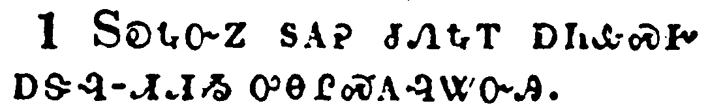</a></td>
</tr>
<tr class="even">
<td>And he looked up, and saw the rich men casting their gifts into the treasury.</td>
</tr>
<tr class="odd">
<td>ᏚᎧᎿᎭᏅᏃ ᏚᎪᎮ ᏧᏁᎿᎭᎢ ᎠᏂᎲᏍᎨ ᎠᏕᎸ-ᏗᏗᏱ ᎤᎾᎵᏍᎪᎸᏔᏅᎯ.</td>
</tr>
<tr class="even">
<td>Du-ka-hna-nv-no du-go-he tsu-ne-hna-i a-ni-hv-s-ge a-de-lv--di-di-yi u-na-li-s-go-lv-ta-nv-hi.</td>
</tr>
</tbody>
</table>

<table>
<tbody>
<tr class="odd">
<td><a href="032102.png">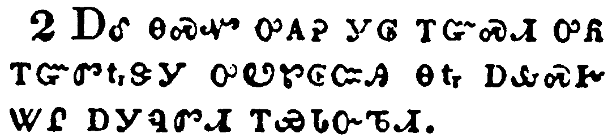</a></td>
</tr>
<tr class="even">
<td>And he saw also a certain poor widow casting in thither two mites.</td>
</tr>
<tr class="odd">
<td>ᎠᎴ ᎾᏍᏉ ᎤᎪᎮ ᎩᎶ ᎢᏳᏍᏗ ᎤᏲ ᎢᏳᏛᎿᎭᏕᎩ ᎤᏬᏑᎶᏨᎯ ᎾᎿᎭᎠᎲᏍᎨ ᏔᎵ ᎠᎩᏄᏛᏗ ᎢᏯᏓᏅᏖᏗ.</td>
</tr>
<tr class="even">
<td>A-le na-s-quo u-go-he gi-lo i-yu-s-di u-yo i-yu-dv-hna-de-gi u-wo-su-lo-tsv-hi na-hna a-hv-s-ge ta-li a-gi-nu-dv-di i-ya-da-nv-te-di.</td>
</tr>
</tbody>
</table>

<table>
<tbody>
<tr class="odd">
<td><a href="032103.png">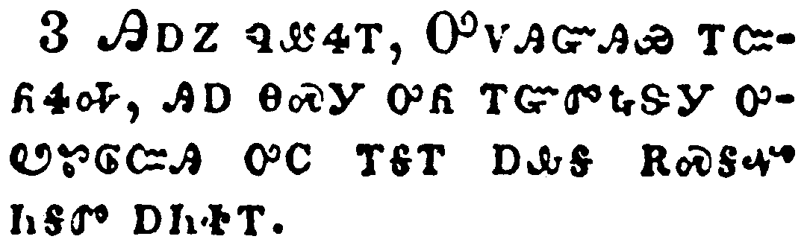</a></td>
</tr>
<tr class="even">
<td>And he said, Of a truth I say unto you, that this poor widow hath cast in more than they all:</td>
</tr>
<tr class="odd">
<td>ᎯᎠᏃ ᏄᏪᏎᎢ, ᎤᏙᎯᏳᎯᏯ ᎢᏨᏲᏎᎭ, ᎯᎠ ᎾᏍᎩ ᎤᏲ ᎢᏳᏛᎿᎭᏕᎩ ᎤᏬᏑᎶᏨᎯ ᎤᏟ ᎢᎦᎢ ᎠᎲᎦ ᎡᏍᎦᏉ ᏂᎦᏛ ᎠᏂᏐᎢ.</td>
</tr>
<tr class="even">
<td>Hi-a-no nu-we-se-i, U-do-hi-yu-hi-ya i-tsv-yo-se-ha, hi-a na-s-gi u-yo i-yu-dv-hna-de-gi u-wo-su-lo-tsv-hi u-tli i-ga-i a-hv-ga e-s-ga-quo ni-ga-dv a-ni-so-i.</td>
</tr>
</tbody>
</table>

<table>
<tbody>
<tr class="odd">
<td><a href="032104.png">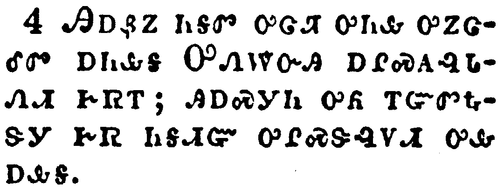</a></td>
</tr>
<tr class="even">
<td>For all these have of their abundance cast in unto the offerings of God: but she of her penury hath cast in all the living that she had.</td>
</tr>
<tr class="odd">
<td>ᎯᎠᏰᏃ ᏂᎦᏛ ᎤᏣᏘ ᎤᏂᎲ ᎤᏃᏣᎴᏛ ᎠᏂᎲᎦ ᎤᏁᎳᏅᎯ ᎠᎵᏍᎪᎸᏓᏁᏗ ᎨᏒᎢ; ᎯᎠᏍᎩᏂ ᎤᏲ ᎢᏳᏛᎿᎭᏕᎩ ᎨᏒ ᏂᎦᏗᏳ ᎤᎵᏍᏕᎸᏙᏗ ᎤᎲᎠᎲᎦ.</td>
</tr>
<tr class="even">
<td>Hi-a-ye-no ni-ga-dv u-tsa-ti u-ni-hv u-no-tsa-le-dv a-ni-hv-ga U-ne-la-nv-hi a-li-s-go-lv-da-ne-di ge-sv-i; hi-a-s-gi-ni u-yo i-yu-dv-hna-de-gi ge-sv ni-ga-di-yu u-li-s-de-lv-do-di u-hv-a-hv-ga.</td>
</tr>
</tbody>
</table>

<table>
<tbody>
<tr class="odd">
<td><a href="032105.png">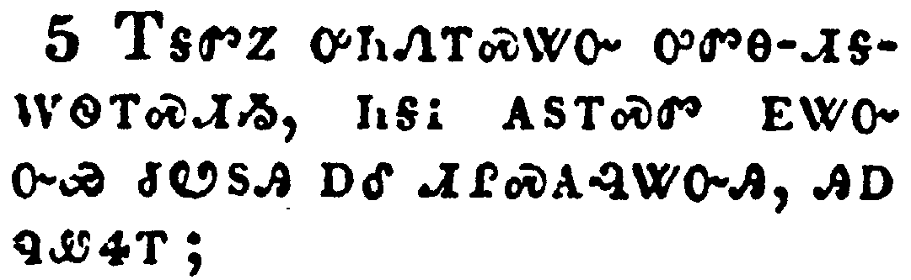</a></td>
</tr>
<tr class="even">
<td>And as some spake of the temple, how it was adorned with goodly stones and gifts, he said,</td>
</tr>
<tr class="odd">
<td>ᎢᎦᏛᏃ ᎤᏂᏁᎢᏍᏔᏅ ᎤᏛᎾ-ᏗᎦᎳᏫᎢᏍᏗᏱ, ᏂᎦᎥ ᎪᏚᎢᏍᏛ ᎬᏔᏅᏅᏯ ᏧᏬᏚᎯ ᎠᎴ ᏗᎵᏍᎪᎸᏔᏅᎯ, ᎯᎠ ᏄᏪᏎᎢ;</td>
</tr>
<tr class="even">
<td>I-ga-dv-no u-ni-ne-i-s-ta-nv u-dv-na--di-ga-la-wi-i-s-di-yi, ni-ga-v go-du-i-s-dv gv-ta-nv-nv-ya tsu-wo-du-hi a-le di-li-s-go-lv-ta-nv-hi, hi-a nu-we-se-i;</td>
</tr>
</tbody>
</table>

<table>
<tbody>
<tr class="odd">
<td><a href="032106.png">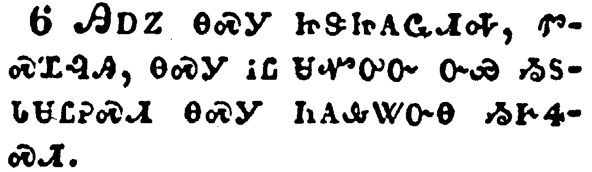</a></td>
</tr>
<tr class="even">
<td>As for these things which ye behold, the days will come, in the which there shall not be left one stone upon another, that shall not be thrown down.</td>
</tr>
<tr class="odd">
<td>ᎯᎠᏃ ᎾᏍᎩ ᏥᏕᏥᎪᏩᏗᎭ, ᏛᏍᏆᎸᎯ, ᎾᏍᎩ ᎥᏝ ᏌᏉᎤᏅ ᏅᏯ ᏱᏚᏓᏌᏝᎮᏍᏗ ᎾᏍᎩ ᏂᎪᎲᏔᏅᎾ ᏱᎨᏎᏍᏗ.</td>
</tr>
<tr class="even">
<td>Hi-a-no na-s-gi tsi-de-tsi-go-wa-di-ha, dv-s-qua-lv-hi, na-s-gi v-tla sa-quo-u-nv nv-ya yi-du-da-sa-tla-he-s-di na-s-gi ni-go-hv-ta-nv-na yi-ge-se-s-di.</td>
</tr>
</tbody>
</table>

<table>
<tbody>
<tr class="odd">
<td><a href="032107.png">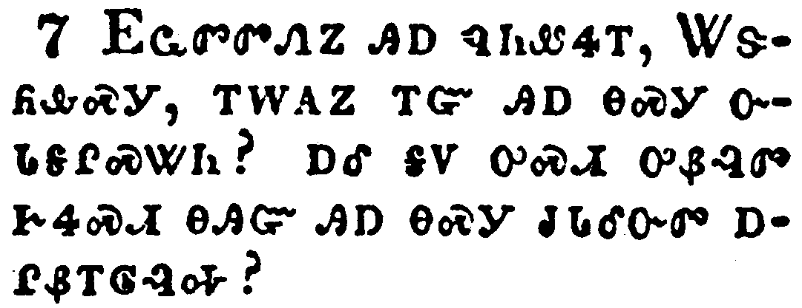</a></td>
</tr>
<tr class="even">
<td>And they asked him, saying, Master, but when shall these things be? and what sign will there be when these things shall come to pass?</td>
</tr>
<tr class="odd">
<td>ᎬᏩᏛᏛᏁᏃ ᎯᎠ ᏄᏂᏪᏎᎢ, ᏔᏕᏲᎲᏍᎩ, ᎢᎳᎪᏃ ᎢᏳ ᎯᎠ ᎾᏍᎩ ᏅᏓᎦᎵᏍᏔᏂ? ᎠᎴ ᎦᏙ ᎤᏍᏗ ᎤᏰᎸᏛ ᎨᏎᏍᏗ ᎾᎯᏳ ᎯᎠ ᎾᏍᎩ ᏧᏓᎴᏅᏛ ᎠᎵᏰᎢᎶᎸᎭ?</td>
</tr>
<tr class="even">
<td>Gv-wa-dv-dv-ne-no hi-a nu-ni-we-se-i, Ta-de-yo-hv-s-gi, i-la-go-no i-yu hi-a na-s-gi nv-da-ga-li-s-ta-ni? A-le ga-do u-s-di u-ye-lv-dv ge-se-s-di na-hi-yu hi-a na-s-gi tsu-da-le-nv-dv a-li-ye-i-lo-lv-ha?</td>
</tr>
</tbody>
</table>

<table>
<tbody>
<tr class="odd">
<td><a href="032108.png">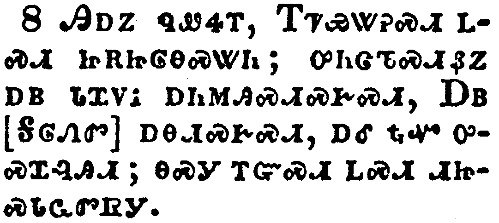</a></td>
</tr>
<tr class="even">
<td>And he said, Take heed that ye be not deceived: for many shall come in my name, saying, I am Christ; and the time draweth near: go ye not therefore after them.</td>
</tr>
<tr class="odd">
<td>ᎯᎠᏃ ᏄᏪᏎᎢ, ᎢᏤᏯᏔᎮᏍᏗ ᏞᏍᏗ ᏥᎡᏥᎶᎾᏍᏔᏂ; ᎤᏂᏣᏖᏍᏗᏰᏃ ᎠᏴ ᏓᏆᏙᎥ ᎠᏂᎷᎯᏍᏗᏍᎨᏍᏗ, ᎠᏴ [ᎦᎶᏁᏛ] ᎠᎾᏗᏍᎨᏍᏗ, ᎠᎴ ᎿᎭᏉ ᎤᏍᏆᎸᎯᏗ; ᎾᏍᎩ ᎢᏳᏍᏗ ᏞᏍᏗ ᏗᏥᏍᏓᏩᏛᏒᎩ.</td>
</tr>
<tr class="even">
<td>Hi-a-no nu-we-se-i, I-tse-ya-ta-he-s-di tle-s-di tsi-e-tsi-lo-na-s-ta-ni; u-ni-tsa-te-s-di-ye-no a-yv da-qua-do-v a-ni-lu-hi-s-di-s-ge-s-di, A-yv [Ga-lo-ne-dv] a-na-di-s-ge-s-di, a-le hna-quo u-s-qua-lv-hi-di; na-s-gi i-yu-s-di tle-s-di di-tsi-s-da-wa-dv-sv-gi.</td>
</tr>
</tbody>
</table>

<table>
<tbody>
<tr class="odd">
<td><a href="032109.png">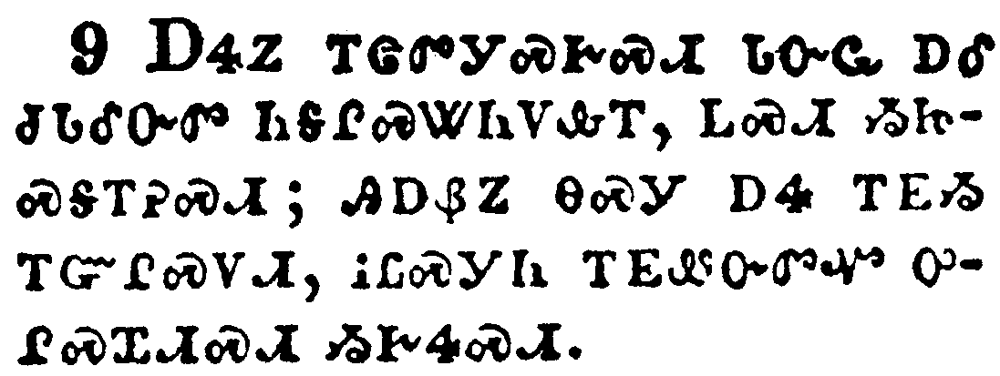</a></td>
</tr>
<tr class="even">
<td>But when ye shall hear of wars and commotions, be not terrified: for these things must first come to pass; but the end is not by and by.</td>
</tr>
<tr class="odd">
<td>ᎠᏎᏃ ᎢᏣᏛᎩᏍᎨᏍᏗ ᏓᏅᏩ ᎠᎴ ᏧᏓᎴᏅᏛ ᏂᎦᎵᏍᏔᏂᏙᎲᎢ, ᏞᏍᏗ ᏱᏥᏍᎦ-ᎢᎮᏍᏗ; ᎯᎠᏰᏃ ᎾᏍᎩ ᎠᏎ ᎢᎬᏱ ᎢᏳᎵᏍᏙᏗ, ᎥᏝᏍᎩᏂ ᎢᎬᏪᏅᏛᏉ ᎤᎵᏍᏆᏗᏍᏗ ᏱᎨᏎᏍᏗ.</td>
</tr>
<tr class="even">
<td>A-se-no i-tsa-dv-gi-s-ge-s-di da-nv-wa a-le tsu-da-le-nv-dv ni-ga-li-s-ta-ni-do-hv-i, tle-s-di yi-tsi-s-ga--i-he-s-di; hi-a-ye-no na-s-gi a-se i-gv-yi i-yu-li-s-do-di, v-tla-s-gi-ni i-gv-we-nv-dv-quo u-li-s-qua-di-s-di yi-ge-se-s-di.</td>
</tr>
</tbody>
</table>

<table>
<tbody>
<tr class="odd">
<td><a href="032110.png">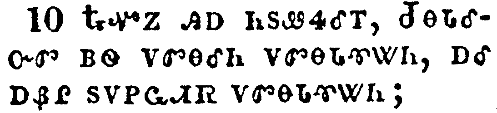</a></td>
</tr>
<tr class="even">
<td>Then said he unto them, Nation shall rise against nation, and kingdom against kingdom:</td>
</tr>
<tr class="odd">
<td>ᎿᎭᏉᏃ ᎯᎠ ᏂᏚᏪᏎᎴᎢ, ᏧᎾᏓᎴᏅᏛ ᏴᏫ ᏙᏛᎾᎴᏂ ᏙᏛᎾᏓᏡᏔᏂ, ᎠᎴ ᎠᏰᎵ ᏚᏙᏢᏩᏗᏒ ᏙᏛᎾᏓᏡᏔᏂ;</td>
</tr>
<tr class="even">
<td>Hna-quo-no hi-a ni-du-we-se-le-i, Tsu-na-da-le-nv-dv yv-wi do-dv-na-le-ni do-dv-na-da-tlu-ta-ni, a-le a-ye-li du-do-tlv-wa-di-sv do-dv-na-da-tlu-ta-ni;</td>
</tr>
</tbody>
</table>

<table>
<tbody>
<tr class="odd">
<td><a href="032111.png">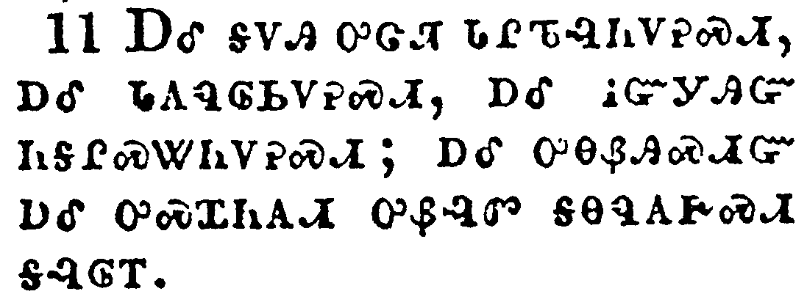</a></td>
</tr>
<tr class="even">
<td>And great earthquakes shall be in divers places, and famines, and pestilences; and fearful sights and great signs shall there be from heaven.</td>
</tr>
<tr class="odd">
<td>ᎠᎴ ᎦᏙᎯ ᎤᏣᏘ ᏓᎵᏖᎸᏂᏙᎮᏍᏗ, ᎠᎴ ᏓᎪᏄᎶᏏᏙᎮᏍᏗ; ᎠᎴ ᎥᏳᎩᎯᏳ ᏂᎦᎵᏍᏔᏂᏙᎮᏍᏗ; ᎠᎴ ᎤᎾᏰᎯᏍᏗᏳ ᎠᎴ ᎤᏍᏆᏂᎪᏗ ᎤᏰᎸᏛ ᎦᎾᏄᎪᎨᏍᏗ ᎦᎸᎶᎢ.</td>
</tr>
<tr class="even">
<td>A-le ga-do-hi u-tsa-ti da-li-te-lv-ni-do-he-s-di, a-le da-go-nu-lo-si-do-he-s-di; a-le v-yu-gi-hi-yu ni-ga-li-s-ta-ni-do-he-s-di; a-le u-na-ye-hi-s-di-yu a-le u-s-qua-ni-go-di u-ye-lv-dv ga-na-nu-go-ge-s-di ga-lv-lo-i.</td>
</tr>
</tbody>
</table>

<table>
<tbody>
<tr class="odd">
<td></td>
</tr>
<tr class="even">
<td>But before all these, they shall lay their hands on you, and persecute you, delivering you up to the synagogues, and into prisons, being brought before kings and rulers for my name's sake.</td>
</tr>
<tr class="odd">
<td>ᎠᏎᏃ ᎠᏏ ᎾᏍᎩ ᎯᎠ ᏂᎦᏛ ᏄᎵᏍᏔᏅᎾ ᎨᏎᏍᏗ ᏙᏓᎨᏥᏂᏴᎯ ᎠᎴ ᎤᏲ ᏅᏓᎨᏨᏁᎵ, ᏕᎨᏥᏲᏍᎨᏍᏗ ᏧᏂᎳᏫᎢᏍᏗᏱ, ᎠᎴ ᏗᏓᏍᏚᏗᏱ, ᎠᎴ ᏕᏣᏗᏃᎯᎮᏍᏗ ᎤᏂᎬᏫᏳᎯ ᎠᎴ ᏄᏂᎬᏫᏳᏌᏕᎩ ᏚᏃᎸ ᎢᎬᏱᏗᏢ ᎠᏴ ᏓᏆᏙᎥ ᏅᏗᎦᎵᏍᏙᏗᏍᎨᏍᏗ.</td>
</tr>
<tr class="even">
<td>A-se-no a-si na-s-gi hi-a ni-ga-dv nu-li-s-ta-nv-na ge-se-s-di do-da-ge-tsi-ni-yv-hi a-le u-yo nv-da-ge-tsv-ne-li, de-ge-tsi-yo-s-ge-s-di tsu-ni-la-wi-i-s-di-yi, a-le di-da-s-du-di-yi, a-le de-tsa-di-no-hi-he-s-di u-ni-gv-wi-yu-hi a-le nu-ni-gv-wi-yu-sa-de-gi du-no-lv i-gv-yi-di-tlv a-yv da-qua-do-v nv-di-ga-li-s-do-di-s-ge-s-di.</td>
</tr>
</tbody>
</table>

<table>
<tbody>
<tr class="odd">
<td><a href="032113.png">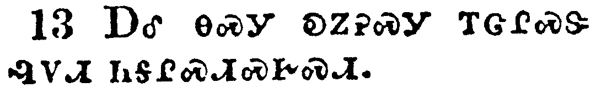</a></td>
</tr>
<tr class="even">
<td>And it shall turn to you for a testimony.</td>
</tr>
<tr class="odd">
<td>ᎠᎴ ᎾᏍᎩ ᎧᏃᎮᏍᎩ ᎢᏣᎵᏍᏕ ᎸᏙᏗ ᏂᎦᎵᏍᏗᏍᎨᏍᏗ.</td>
</tr>
<tr class="even">
<td>A-le na-s-gi ka-no-he-s-gi i-tsa-li-s-de lv-do-di ni-ga-li-s-di-s-ge-s-di.</td>
</tr>
</tbody>
</table>

<table>
<tbody>
<tr class="odd">
<td><a href="032114.png">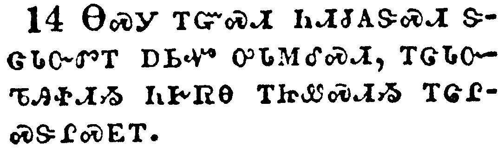</a></td>
</tr>
<tr class="even">
<td>Settle it therefore in your hearts, not to meditate before what ye shall answer:</td>
</tr>
<tr class="odd">
<td>ᎾᏍᎩ ᎢᏳᏍᏗ ᏂᏗᏧᎪᏕᏍᏗ ᏕᏣᏓᏅᏛᎢ ᎠᏏᏉ ᎤᏓᎷᎴᏍᏗ, ᎢᏣᏓᏅᏖᎯᏐᏗᏱ ᏂᎨᏒᎾ ᎢᏥᏪᏍᏗᏱ ᎢᏣᎵᏍᏕᎵᏍᎬᎢ.</td>
</tr>
<tr class="even">
<td>Na-s-gi i-yu-s-di ni-di-tsu-go-de-s-di de-tsa-da-nv-dv-i a-si-quo u-da-lu-le-s-di, i-tsa-da-nv-te-hi-so-di-yi ni-ge-sv-na i-tsi-we-s-di-yi i-tsa-li-s-de-li-s-gv-i.</td>
</tr>
</tbody>
</table>

<table>
<tbody>
<tr class="odd">
<td><a href="032115.png">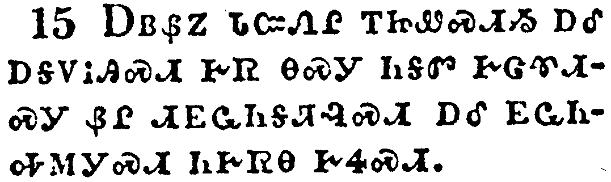</a></td>
</tr>
<tr class="even">
<td>For I will give you a mouth and wisdom, which all your adversaries shall not be able to gainsay nor resist.</td>
</tr>
<tr class="odd">
<td>ᎠᏴᏰᏃ ᏓᏨᏁᎵ ᎢᏥᏪᏍᏗᏱ ᎠᎴ ᎠᎦᏙᎥᎯᏍᏗ ᎨᏒ ᎾᏍᎩ ᏂᎦᏛ ᎨᏣᏈᏗᏍᎩ ᏰᎵ ᏗᎬᏩᏂᎦᏘᎸᏍᏗ ᎠᎴ ᎬᏩᏂᏎᎷᎩᏍᏗ ᏂᎨᏒᎾ ᎨᏎᏍᏗ.</td>
</tr>
<tr class="even">
<td>A-yv-ye-no da-tsv-ne-li i-tsi-we-s-di-yi a-le a-ga-do-v-hi-s-di ge-sv na-s-gi ni-ga-dv ge-tsa-qui-di-s-gi ye-li di-gv-wa-ni-ga-ti-lv-s-di a-le gv-wa-ni-se-lu-gi-s-di ni-ge-sv-na ge-se-s-di.</td>
</tr>
</tbody>
</table>

<table>
<tbody>
<tr class="odd">
<td><a href="032116.png">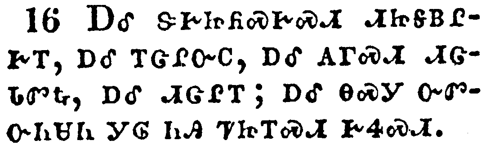</a></td>
</tr>
<tr class="even">
<td>And ye shall be betrayed both by parents, and brethren, and kinsfolks, and friends; and some of you shall they cause to be put to death.</td>
</tr>
<tr class="odd">
<td>ᎠᎴ ᏕᎨᏥᏲᏍᎨᏍᏗ ᏗᏥᎦᏴᎵᎨᎢ, ᎠᎴ ᎢᏣᎵᏅᏟ, ᎠᎴ ᎪᎱᏍᏗ ᏗᏣᏓᏛᎿᎭ ᎠᎴ ᏗᏣᎵᎢ; ᎠᎴ ᎾᏍᎩ ᏅᏛᏅᏂᏌᏂ ᎩᎶ ᏂᎯ ᏤᏥᎢᏍᏗ ᎨᏎᏍᏗ.</td>
</tr>
<tr class="even">
<td>A-le de-ge-tsi-yo-s-ge-s-di di-tsi-ga-yv-li-ge-i, a-le i-tsa-li-nv-tli, a-le go-hu-s-di di-tsa-da-dv-hna, a-le di-tsa-li-i; a-le na-s-gi nv-dv-nv-ni-sa-ni gi-lo ni-hi tse-tsi-i-s-di ge-se-s-di.</td>
</tr>
</tbody>
</table>

<table>
<tbody>
<tr class="odd">
<td><a href="032117.png">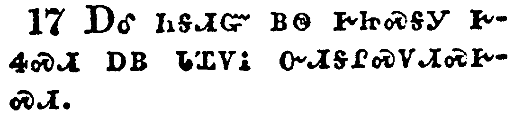</a></td>
</tr>
<tr class="even">
<td>And ye shall be hated of all men for my name's sake.</td>
</tr>
<tr class="odd">
<td>ᎠᎴ ᏂᎦᏗᏳ ᏴᏫ ᎨᏥᏍᎦᎩ ᎨᏎᏍᏗ ᏴᏫ ᏓᏆᏙᎥ ᏅᏗᎦᎵᏍᏙᏗᏍᎨᏍᏗ.</td>
</tr>
<tr class="even">
<td>A-le ni-ga-di-yu yv-wi ge-tsi-s-ga-gi ge-se-s-di yv-wi da-qua-do-v nv-di-ga-li-s-do-di-s-ge-s-di.</td>
</tr>
</tbody>
</table>

<table>
<tbody>
<tr class="odd">
<td><a href="032118.png">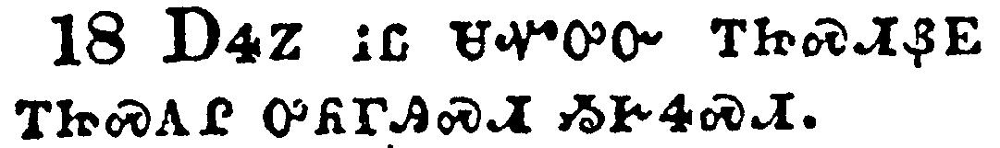</a></td>
</tr>
<tr class="even">
<td>But there shall not an hair of your head perish.</td>
</tr>
<tr class="odd">
<td>ᎠᏎᏃ ᎥᏝ ᏌᏉᎤᏅ ᎢᏥᏍᏗᏰᎬ ᎢᏥᏍᎪᎵ ᎤᏲᎱᎯᏍᏗ ᏱᎨᏎᏍᏗ.</td>
</tr>
<tr class="even">
<td>A-se-no v-tla sa-quo-u-nv i-tsi-s-di-ye-gv i-tsi-s-go-li u-yo-hu-hi-s-di yi-ge-se-s-di.</td>
</tr>
</tbody>
</table>

<table>
<tbody>
<tr class="odd">
<td><a href="032119.png">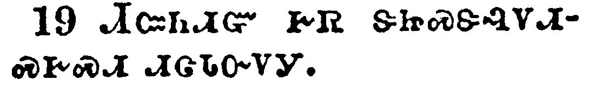</a></td>
</tr>
<tr class="even">
<td>In your patience possess ye your souls.</td>
</tr>
<tr class="odd">
<td>ᏗᏨᏂᏗᏳ ᎨᏒ ᏕᏥᏍᏕᎸᏙᏗᏍᎨᏍᏗ ᏗᏣᏓᏅᏙᎩ.</td>
</tr>
<tr class="even">
<td>Di-tsv-ni-di-yu ge-sv de-tsi-s-de-lv-do-di-s-ge-s-di di-tsa-da-nv-do-gi.</td>
</tr>
</tbody>
</table>

<table>
<tbody>
<tr class="odd">
<td><a href="032120.png">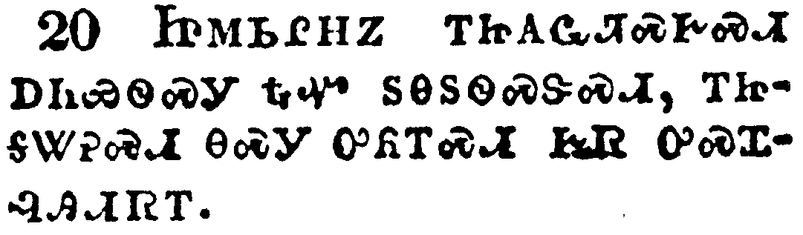</a></td>
</tr>
<tr class="even">
<td>And when ye shall see Jerusalem compassed with armies, then know that the desolation thereof is nigh.</td>
</tr>
<tr class="odd">
<td>ᏥᎷᏏᎵᎻᏃ ᎢᏥᎪᏩᏘᏍᎨᏍᏗ ᎠᏂᏯᏫᏍᎩ ᎿᎭᏉ ᏚᎾᏚᏫᏍᏕᏍᏗ, ᎢᏥᎦᏔᎮᏍᏗ ᎾᏍᎩ ᎤᏲᎢᏍᏗ ᎨᏒ ᎤᏍᏆᎸᎯᏗᏒᎢ.</td>
</tr>
<tr class="even">
<td>Tsi-lu-si-li-mi-no i-tsi-go-wa-ti-s-ge-s-di a-ni-ya-wi-s-gi hna-quo du-na-du-wi-s-de-s-di, i-tsi-ga-ta-he-s-di na-s-gi u-yo-i-s-di ge-sv u-s-qua-lv-hi-di-sv-i.</td>
</tr>
</tbody>
</table>

<table>
<tbody>
<tr class="odd">
<td><a href="032121.png">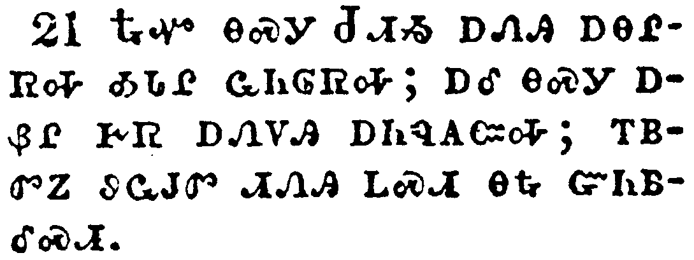</a></td>
</tr>
<tr class="even">
<td>Then let them which are in Judaea flee to the mountains; and let them which are in the midst of it depart out; and let not them that are in the countries enter thereinto.</td>
</tr>
<tr class="odd">
<td>ᎿᎭᏉ ᎾᏍᎩ ᏧᏗᏱ ᎠᏁᎯ ᎠᎾᎵᏒᎭ ᎣᏓᎵ ᏩᏂᎶᏒᎭ; ᎠᎴ ᎾᏍᎩ ᎠᏰᎵ ᎨᏒ ᎠᏁᏙᎯ ᎠᏂᏄᎪᏨᎭ; ᎢᏴᏛᏃ ᏭᏩᎫᏛ ᏗᏁᎯ ᏞᏍᏗ ᎾᎿᎭᏳᏂᏴᎴᏍᏗ.</td>
</tr>
<tr class="even">
<td>Hna-quo na-s-gi Tsu-di-yi a-ne-hi a-na-li-sv-ha o-da-li wa-ni-lo-sv-ha; a-le na-s-gi a-ye-li ge-sv a-ne-do-hi a-ni-nu-go-tsv-ha; i-yv-dv-no wu-wa-gu-dv di-ne-hi tle-s-di na-hna yu-ni-yv-le-s-di.</td>
</tr>
</tbody>
</table>

<table>
<tbody>
<tr class="odd">
<td></td>
</tr>
<tr class="even">
<td>For these be the days of vengeance, that all things which are written may be fulfilled.</td>
</tr>
<tr class="odd">
<td>ᎤᏞᎩᏰᏃ ᎾᎯᏳ ᎨᏒ ᎤᎵᏱᎶᎯᏍᏗ ᎨᏎᏍᏗ, ᎾᏍᎩ ᏂᎦᏗᏳ ᎪᏪᎳᏅᎯ ᎨᏒ ᎾᏍᎩ ᎢᏳᎵᏍᏙᏗᏱ.</td>
</tr>
<tr class="even">
<td>U-tle-gi-ye-no na-hi-yu ge-sv u-li-yi-lo-hi-s-di ge-se-s-di, na-s-gi ni-ga-di-yu go-we-la-nv-hi ge-sv na-s-gi i-yu-li-s-do-di-yi.</td>
</tr>
</tbody>
</table>

<table>
<tbody>
<tr class="odd">
<td><a href="032123.png">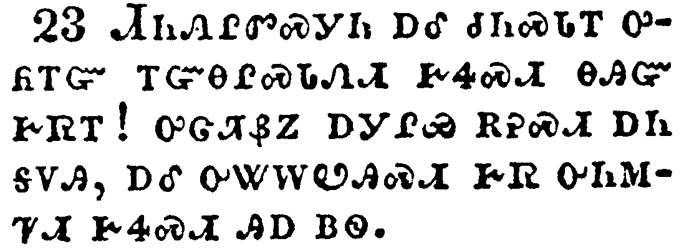</a></td>
</tr>
<tr class="even">
<td>But woe unto them that are with child, and to them that give suck, in those days! for there shall be great distress in the land, and wrath upon this people.</td>
</tr>
<tr class="odd">
<td>ᏗᏂᏁᎵᏛᏍᎩᏂ ᎠᎴ ᏧᏂᏍᏓᎢ ᎤᏲᎢᏳ ᎢᏳᎾᎵᏍᏓᏁᏗ ᎨᏎᏍᏗ ᎾᎯᏳ ᎨᏒᎢ! ᎤᏣᏘᏰᏃ ᎠᎩᎵᏯ ᎡᎮᏍᏗ ᎠᏂ ᎦᏙᎯ, ᎠᎴ ᎤᏔᎳᏬᎯᏍᏗ ᎨᏒ ᎤᏂᎷᏤᏗ ᎨᏎᏍᏗ ᎯᎠ ᏴᏫ.</td>
</tr>
<tr class="even">
<td>Di-ni-ne-li-dv-s-gi-ni a-le tsu-ni-s-da-i u-yo-i-yu i-yu-na-li-s-da-ne-di ge-se-s-di na-hi-yu ge-sv-i! u-tsa-ti-ye-no a-gi-li-ya e-he-s-di a-ni ga-do-hi, a-le u-ta-la-wo-hi-s-di ge-sv u-ni-lu-tse-di ge-se-s-di hi-a yv-wi.</td>
</tr>
</tbody>
</table>

<table>
<tbody>
<tr class="odd">
<td><a href="032124.png">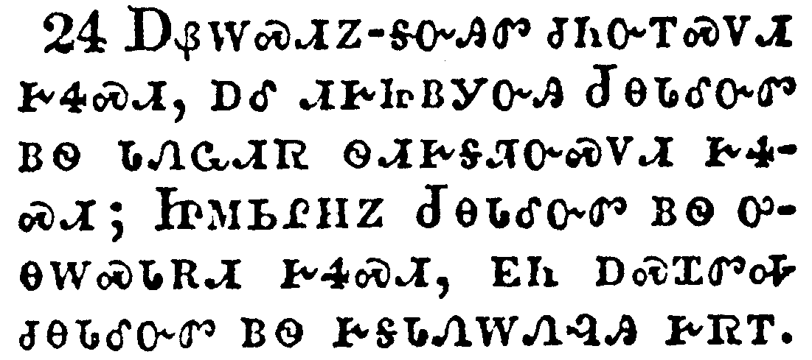</a></td>
</tr>
<tr class="even">
<td>And they shall fall by the edge of the sword, and shall be led away captive into all nations: and Jerusalem shall be trodden down of the Gentiles, until the times of the Gentiles be fulfilled.</td>
</tr>
<tr class="odd">
<td>ᎠᏰᎳᏍᏗᏃ-ᎦᏅᎯᏛ ᏧᏂᏅᎢᏍᏙᏗ ᎨᏎᏍᏗ, ᎠᎴ ᏗᎨᏥᏴᎩᏅᎯ ᏧᎾᏓᎴᏅᏛ ᏴᏫ ᏓᏁᏩᏗᏒ ᏫᏗᎨᎦᏘᏅᏍᏛᏗ ᎨᏎᏍᏗ; ᏥᎷᏏᎵᎻᏃ ᏧᎾᏓᎴᏅᏛ ᏴᏫ ᎤᎾᎳᏍᏓᎡᏗ ᎨᏎᏍᏗ, ᎬᏂ ᎠᏍᏆᏛᎭ ᏧᎾᏓᎴᏅᏛ ᏴᏫ ᎨᎦᏓᏁᎳᏁᎸᎯ ᎨᏒᎢ.</td>
</tr>
<tr class="even">
<td>A-ye-la-s-di-no--ga-nv-hi-dv tsu-ni-nv-i-s-do-di ge-se-s-di, a-le di-ge-tsi-yv-gi-nv-hi Tsu-na-da-le-nv-dv yv-wi da-ne-wa-di-sv wi-di-ge-ga-ti-nv-s-dv-di ge-se-s-di; Tsi-lu-si-li-mi-no Tsu-na-da-le-nv-dv yv-wi u-na-la-s-da-e-di ge-se-s-di, gv-ni a-s-qua-dv-ha tsu-na-da-le-nv-dv yv-wi ge-ga-da-ne-la-ne-lv-hi ge-sv-i.</td>
</tr>
</tbody>
</table>

<table>
<tbody>
<tr class="odd">
<td><a href="032125.png">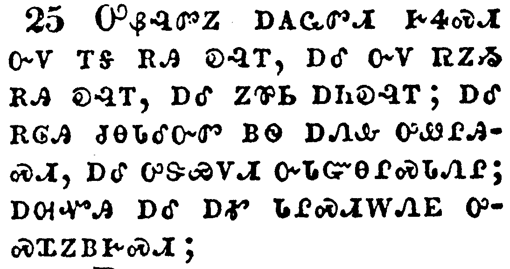</a></td>
</tr>
<tr class="even">
<td>And there shall be signs in the sun, and in the moon, and in the stars; and upon the earth distress of nations, with perplexity; the sea and the waves roaring;</td>
</tr>
<tr class="odd">
<td>ᎤᏰᎸᏛᏃ ᎠᎪᏩᏛᏗ ᎨᏎᏍᏗ ᏅᏙ ᎢᎦ ᎡᎯ ᎧᎸᎢ, ᎠᎴ ᏅᏙ ᏒᏃᏱ ᎡᎯ ᎧᎸᎢ, ᎠᎴ ᏃᏈᏏ ᎠᏂᎧᎸᎢ; ᎠᎴ ᎡᎶᎯ ᏧᎾᏓᎴᏅᏛ ᏴᏫ ᎠᏁᎲ ᎤᏪᎵᎯᏍᏗ, ᎠᎴ ᎤᏕᏯᏙᏗ ᏅᏓᏳᎾᎵᏍᏓᏁᎵ; ᎠᎺᏉᎯ ᎠᎴ ᎠᎹ ᏓᎵᏍᏗᎳᏁᎬ ᎤᏍᏆᏃᏴᎨᏍᏗ;</td>
</tr>
<tr class="even">
<td>U-ye-lv-dv-no a-go-wa-dv-di ge-se-s-di nv-do i-ga e-hi ka-lv-i, a-le nv-do sv-no-yi e-hi ka-lv-i, a-le no-qui-si a-ni-ka-lv-i; a-le e-lo-hi tsu-na-da-le-nv-dv yv-wi a-ne-hv u-we-li-hi-s-di, a-le u-de-ya-do-di nv-da-yu-na-li-s-da-ne-li; a-me-quo-hi a-le a-ma da-li-s-di-la-ne-gv u-s-qua-no-yv-ge-s-di;</td>
</tr>
</tbody>
</table>

<table>
<tbody>
<tr class="odd">
<td><a href="032126.png">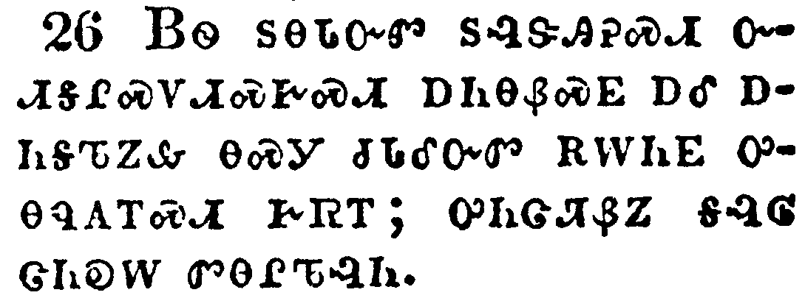</a></td>
</tr>
<tr class="even">
<td>Men's hearts failing them for fear, and for looking after those things which are coming on the earth: for the powers of heaven shall be shaken.</td>
</tr>
<tr class="odd">
<td>ᏴᏫ ᏚᎾᏓᏅᏛ ᏚᎸᏕᎯᎮᏍᏗ ᏅᏗᎦᎵᏍᏙᏗᏍᎨᏍᏗ ᎠᏂᎾᏰᏍᎬ ᎠᎴ ᎠᏂᎦᏖᏃᎲ ᎾᏍᎩ ᏧᏓᎴᏅᏛ ᎡᎳᏂᎬ ᎤᎾᏄᎪᎢᏍᏗ ᎨᏒᎢ; ᎤᏂᏣᏘᏰᏃ ᎦᎸᎶ ᏣᏂᎧᎳ ᏛᎾᎵᏖᎸᏂ.</td>
</tr>
<tr class="even">
<td>Yv-wi du-na-da-nv-dv du-lv-de-hi-he-s-di nv-di-ga-li-s-do-di-s-ge-s-di a-ni-na-ye-s-gv a-le a-ni-ga-te-no-hv na-s-gi tsu-da-le-nv-dv e-la-ni-gv u-na-nu-go-i-s-di ge-sv-i; u-ni-tsa-ti-ye-no ga-lv-lo tsa-ni-ka-la dv-na-li-te-lv-ni.</td>
</tr>
</tbody>
</table>

<table>
<tbody>
<tr class="odd">
<td></td>
</tr>
<tr class="even">
<td>And then shall they see the Son of man coming in a cloud with power and great glory.</td>
</tr>
<tr class="odd">
<td>ᎿᎭᏉᏃ ᏛᏂᎪᎯ ᏴᏫ ᎤᏪᏥ ᏣᎢᏎᏍᏗ ᎤᎶᎩᎸᎢ ᎤᎵᏂᎩᏛ ᎠᎴ ᎤᏣᏘ ᎦᎸᏉᏗ ᏅᏧᏛᎿᎭᏗᏎᏍᏗ.</td>
</tr>
<tr class="even">
<td>Hna-quo-no dv-ni-go-hi yv-wi U-we-tsi tsa-i-se-s-di u-lo-gi-lv-i u-li-ni-gi-dv a-le u-tsa-ti ga-lv-quo-di nv-tsu-dv-hna-di-se-s-di.</td>
</tr>
</tbody>
</table>

<table>
<tbody>
<tr class="odd">
<td></td>
</tr>
<tr class="even">
<td>And when these things begin to come to pass, then look up, and lift up your heads; for your redemption draweth nigh.</td>
</tr>
<tr class="odd">
<td>ᎾᏍᎩᏃ ᎯᎠ ᏧᏓᎴᏅᏛ ᎠᎴᏅᎲᎭ ᎾᏍᎩ ᏂᎦᎵᏍᏗᏍᎨᏍᏗ, ᎿᎭᏉ ᎦᎸᎳᏗ ᏫᏗᏣᎧᎾᏅᎭ, ᎠᎴ ᏕᏥᏌᎳᏓᏅᎭ ᏗᏥᏍᎪᎵ; ᎡᏧᏓᎴᏍᏗᏰᏃ ᎨᏒ ᎾᎥᏂᏳ ᏣᎢᏎᏍᏗ.</td>
</tr>
<tr class="even">
<td>Na-s-gi-no hi-a tsu-da-le-nv-dv a-le-nv-hv-ha na-s-gi ni-ga-li-s-di-s-ge-s-di, hna-quo ga-lv-la-di wi-di-tsa-ka-na-nv-ha, a-le de-tsi-sa-la-da-nv-ha di-tsi-s-go-li; e-tsu-da-le-s-di-ye-no ge-sv na-v-ni-yu tsa-i-se-s-di.</td>
</tr>
</tbody>
</table>

<table>
<tbody>
<tr class="odd">
<td></td>
</tr>
<tr class="even">
<td>And he spake to them a parable; Behold the fig tree, and all the trees;</td>
</tr>
<tr class="odd">
<td>ᎤᏁᏤᏃ ᏚᏟᎶᏍᏓᏁᎴᎢ; ᏗᏣᎧᏅᎦ ᎡᎦᏔ-ᎢᏳᏍᏗ ᏡᎬᎢ, ᎠᎴ ᏂᎦᎥ ᏕᏡᎬᎢ;</td>
</tr>
<tr class="even">
<td>U-ne-tse-no du-tli-lo-s-da-ne-le-i; Di-tsa-ka-nv-ga e-ga-ta--i-yu-s-di tlu-gv-i, a-le ni-ga-v de-tlu-gv-i;</td>
</tr>
</tbody>
</table>

<table>
<tbody>
<tr class="odd">
<td><a href="032130.png">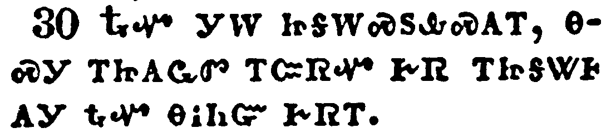</a></td>
</tr>
<tr class="even">
<td>When they now shoot forth, ye see and know of your own selves that summer is now nigh at hand.</td>
</tr>
<tr class="odd">
<td>ᎿᎭᏉ ᎩᎳ ᏥᎦᎳᏍᏚᎲᏍᎪᎢ, ᎾᏍᎩ ᎢᏥᎪᏩᏛ ᎢᏨᏒᏉ ᎨᏒ ᎢᏥᎦᏔᎰᎪᎩ ᎿᎭᏉ ᎾᎥᏂᏳ ᎨᏒᎢ.</td>
</tr>
<tr class="even">
<td>Hna-quo gi-la tsi-ga-la-s-du-hv-s-go-i, na-s-gi i-tsi-go-wa-dv i-tsv-sv-quo ge-sv i-tsi-ga-ta-ho-go-gi hna-quo na-v-ni-yu ge-sv-i.</td>
</tr>
</tbody>
</table>

<table>
<tbody>
<tr class="odd">
<td><a href="032131.png">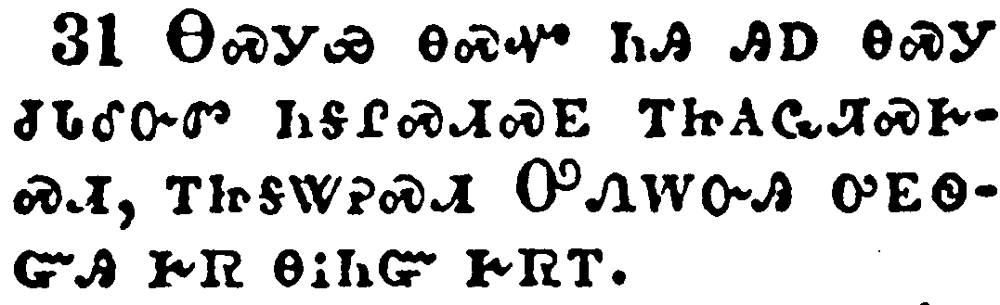</a></td>
</tr>
<tr class="even">
<td>So likewise ye, when ye see these things come to pass, know ye that the kingdom of God is nigh at hand.</td>
</tr>
<tr class="odd">
<td>ᎾᏍᎩᏯ ᎾᏍᏉ ᏂᎯ ᎯᎠ ᎾᏍᎩ ᏧᏓᎴᏅᏛ ᏂᎦᎵᏍᏗᏍᎬ ᎢᏥᎪᏩᏘᏍᎨᏍᏗ, ᎢᏥᎦᏔᎮᏍᏗ ᎤᏁᎳᏅᎯ ᎤᎬᏫᏳᎯ ᎨᏒ ᎾᎥᏂᏳ ᎨᏒᎢ.</td>
</tr>
<tr class="even">
<td>Na-s-gi-ya na-s-quo ni-hi hi-a na-s-gi tsu-da-le-nv-dv ni-ga-li-s-di-s-gv i-tsi-go-wa-ti-s-ge-s-di, i-tsi-ga-ta-he-s-di U-ne-la-nv-hi u-gv-wi-yu-hi ge-sv na-v-ni-yu ge-sv-i.</td>
</tr>
</tbody>
</table>

<table>
<tbody>
<tr class="odd">
<td><a href="032132.png">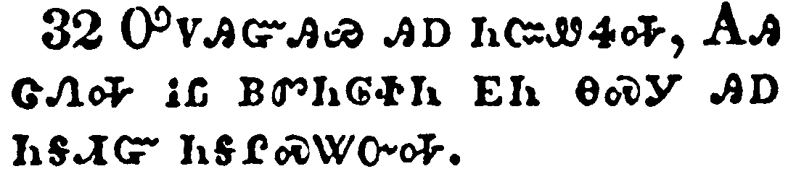</a></td>
</tr>
<tr class="even">
<td>Verily I say unto you, This generation shall not pass away, till all be fulfilled.</td>
</tr>
<tr class="odd">
<td>ᎤᏙᎯᏳᎯᏯ ᎯᎠ ᏂᏨᏪᏎᎭ, ᎪᎯ ᏣᏁᎭ ᎥᏝ ᏴᏛᏂᎶᏐᏂ ᎬᏂ ᎾᏍᎩ ᎯᎠ ᏂᎦᏗᏳ ᏂᎦᎵᏍᏔᏅᎭ.</td>
</tr>
<tr class="even">
<td>U-do-hi-yu-hi-ya hi-a ni-tsv-we-se-ha, Go-hi tsa-ne-ha v-tla yv-dv-ni-lo-so-ni gv-ni na-s-gi hi-a ni-ga-di-yu ni-ga-li-s-ta-nv-ha.</td>
</tr>
</tbody>
</table>

<table>
<tbody>
<tr class="odd">
<td><a href="032133.png">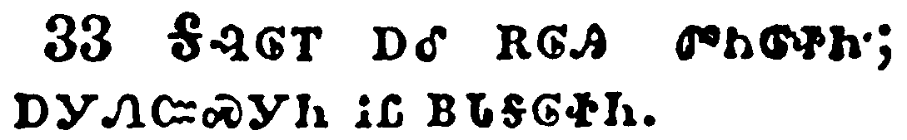</a></td>
</tr>
<tr class="even">
<td>Heaven and earth shall pass away: but my words shall not pass away.</td>
</tr>
<tr class="odd">
<td>ᎦᎸᎶᎢ ᎠᎴ ᎡᎶᎯ ᏛᏂᎶᏐᏂ; ᎠᎩᏁᏨᏍᎩᏂ ᎥᏝ ᏴᏓᎦᎶᏐᏂ.</td>
</tr>
<tr class="even">
<td>Ga-lv-lo-i a-le e-lo-hi dv-ni-lo-so-ni; a-gi-ne-tsv-s-gi-ni v-tla yv-da-ga-lo-so-ni.</td>
</tr>
</tbody>
</table>

<table>
<tbody>
<tr class="odd">
<td><a href="032134.png">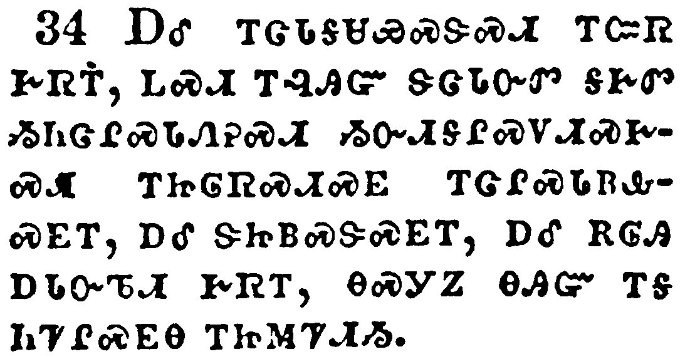</a></td>
</tr>
<tr class="even">
<td>And take heed to yourselves, lest at any time your hearts be overcharged with surfeiting, and drunkenness, and cares of this life, and so that day come upon you unawares.</td>
</tr>
<tr class="odd">
<td>ᎠᎴ ᎢᏣᏓᎦᏌᏯᏍᏕᏍᏗ ᎢᏨᏒ ᎨᏒᎢ, ᏞᏍᏗ ᎢᎸᎯᏳ ᏕᏣᏓᏅᏛ ᎦᎨᏛ ᏱᏂᏣᎵᏍᏓᏁᎮᏍᏗ ᏱᏅᏗᎦᎵᏍᏙᏗᏍᎨᏍᏗ ᎢᏥᎶᏒᏍᏗᏍᎬ ᎢᏣᎵᏍᏓᏴᎲᏍᎬᎢ, ᎠᎴ ᏕᏥᏴᏍᏕᏍᎬᎢ, ᎠᎴ ᎡᎶᎯ ᎠᏓᏅᏖᏗ ᎨᏒᎢ, ᎾᏍᎩᏃ ᎾᎯᏳ ᎢᎦ ᏂᏤᎵᏍᎬᎾ ᎢᏥᎷᏤᏗᏱ.</td>
</tr>
<tr class="even">
<td>A-le i-tsa-da-ga-sa-ya-s-de-s-di i-tsv-sv ge-sv-i, tle-s-di i-lv-hi-yu de-tsa-da-nv-dv ga-ge-dv yi-ni-tsa-li-s-da-ne-he-s-di yi-nv-di-ga-li-s-do-di-s-ge-s-di i-tsi-lo-sv-s-di-s-gv i-tsa-li-s-da-yv-hv-s-gv-i, a-le de-tsi-yv-s-de-s-gv-i, a-le e-lo-hi a-da-nv-te-di ge-sv-i, na-s-gi-no na-hi-yu i-ga ni-tse-li-s-gv-na i-tsi-lu-tse-di-yi.</td>
</tr>
</tbody>
</table>

<table>
<tbody>
<tr class="odd">
<td><a href="032135.png">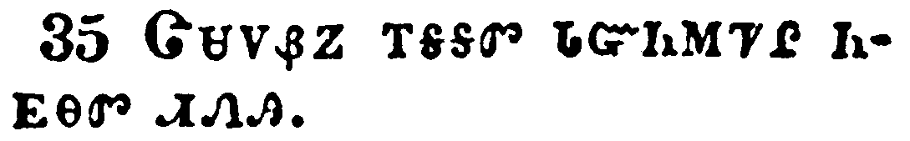</a></td>
</tr>
<tr class="even">
<td>For as a snare shall it come on all them that dwell on the face of the whole earth.</td>
</tr>
<tr class="odd">
<td>ᏣᏌᏙᏰᏃ ᎢᎦᎦᏛ ᏓᏳᏂᎷᏤᎵ ᏂᎬᎾᏛ ᏗᏁᎯ.</td>
</tr>
<tr class="even">
<td>Tsa-sa-do-ye-no i-ga-ga-dv da-yu-ni-lu-tse-li ni-gv-na-dv di-ne-hi.</td>
</tr>
</tbody>
</table>

<table>
<tbody>
<tr class="odd">
<td><a href="032136.png">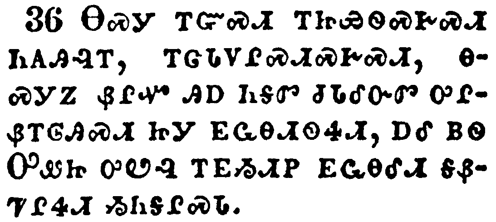</a></td>
</tr>
<tr class="even">
<td>Watch ye therefore, and pray always, that ye may be accounted worthy to escape all these things that shall come to pass, and to stand before the Son of man.</td>
</tr>
<tr class="odd">
<td>ᎾᏍᎩ ᎢᏳᏍᏗ ᎢᏥᏯᏫᏍᎨᏍᏗ ᏂᎪᎯᎸᎢ, ᎢᏣᏓᏙᎵᏍᏗᏍᎨᏍᏗ, ᎾᏍᎩᏃ ᏰᎵᏉ ᎯᎠ ᏂᎦᏛ ᏧᏓᎴᏅᏛ ᎤᎵᏰᎢᎶᎯᏍᏗ ᏥᎩ ᎬᏩᎾᏗᏫᏎᏗ, ᎠᎴ ᏴᏫ ᎤᏪᏤ ᎤᏬᎸ ᎢᎬᏱᏗᏢ ᎬᏩᎾᎴᏗ ᎦᏰᏤᎵᏎᏗ ᏱᏂᎦᎵᏍᏓ.</td>
</tr>
<tr class="even">
<td>Na-s-gi i-yu-s-di i-tsi-ya-wi-s-ge-s-di ni-go-hi-lv-i, i-tsa-da-do-li-s-di-s-ge-s-di, na-s-gi-no ye-li-quo hi-a ni-ga-dv tsu-da-le-nv-dv u-li-ye-i-lo-hi-s-di tsi-gi gv-wa-na-di-wi-se-di, a-le yv-wi U-we-tse u-wo-lv i-gv-yi-di-tlv gv-wa-na-le-di ga-ye-tse-li-se-di yi-ni-ga-li-s-da.</td>
</tr>
</tbody>
</table>

<table>
<tbody>
<tr class="odd">
<td><a href="032137.png">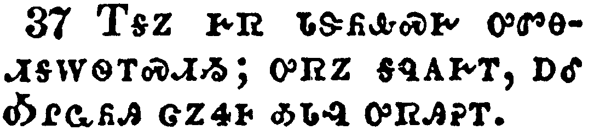</a></td>
</tr>
<tr class="even">
<td>And in the day time he was teaching in the temple; and at night he went out, and abode in the mount that is called the mount of Olives.</td>
</tr>
<tr class="odd">
<td>ᎢᎦᏃ ᎨᏒ ᏓᏕᏲᎲᏍᎨ ᎤᏛᎾᏗᎦᎳᏫᎢᏍᏗᏱ; ᎤᏒᏃ ᎦᏄᎪᎨᎢ, ᎠᎴ ᎣᎵᏩᏲᎯ ᏣᏃᏎᎰ ᎣᏓᎸ ᎤᏒᎯᎮᎢ.</td>
</tr>
<tr class="even">
<td>I-ga-no ge-sv da-de-yo-hv-s-ge u-dv-na-di-ga-la-wi-i-s-di-yi; u-sv-no ga-nu-go-ge-i, a-le O-li-wa-yo-hi tsa-no-se-ho o-da-lv u-sv-hi-he-i.</td>
</tr>
</tbody>
</table>

<table>
<tbody>
<tr class="odd">
<td><a href="032138.png">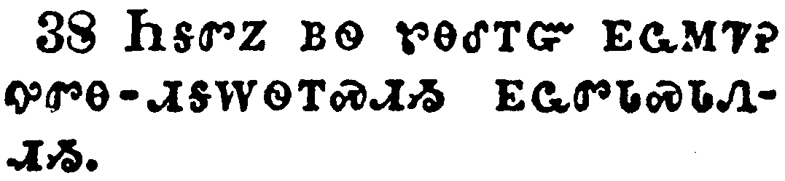</a></td>
</tr>
<tr class="even">
<td>And all the people came early in the morning to him in the temple, for to hear him.</td>
</tr>
<tr class="odd">
<td>ᏂᎦᏛᏃ ᏴᏫ ᏑᎾᎴᎢᏳ ᎬᏩᎷᏤᎮ ᎤᏛᎾ-ᏗᎦᎳᏫᎢᏍᏗᏱ ᎬᏩᏛᏓᏍᏓᏁᏗᏱ.</td>
</tr>
<tr class="even">
<td>Ni-ga-dv-no yv-wi su-na-le-i-yu gv-wa-lu-tse-he u-dv-na--di-ga-la-wi-i-s-di-yi gv-wa-dv-da-s-da-ne-di-yi.</td>
</tr>
</tbody>
</table>

