+++
draft=false
date = 2014-12-18T21:11:07Z
title = "Luke - Chapter 24 - Cherokee New Testament"
weight = 1418955067

[taxonomies]

authors = ["Timothy Legg"]
categories = []
tags = []

[extra]
+++

<table>
<tbody>
<tr class="odd">
<td></td>
</tr>
<tr class="even">
<td>Now upon the first day of the week, very early in the morning, they came unto the sepulchre, bringing the spices which they had prepared, and certain others with them.</td>
</tr>
<tr class="odd">
<td>ᎢᎬᏱᏱᏃ ᎢᎦ ᏑᎾᏙᏓᏆᏍᏗ ᎨᏒ ᎩᎳ ᎢᎦ ᏥᏂᎦᎵᏍᏗᏍᎪᎢ, ᎤᏂᎷᏤ ᎠᏤᎵᏍᏛᎢ, ᏚᏂᏲᎴ ᏗᎦᏩᏒᎩ ᎾᏍᎩ ᏧᎾᏓᏁᎳᏅᎯ, ᎠᎴ ᎩᎶ ᎢᏳᎾᏍᏗ ᎠᏁᎮᎢ.</td>
</tr>
<tr class="even">
<td>I-gv-yi-yi-no i-ga su-na-do-da-qua-s-di ge-sv gi-la i-ga tsi-ni-ga-li-s-di-s-go-i, u-ni-lu-tse a-tse-li-s-dv-i, du-ni-yo-le di-ga-wa-sv-gi na-s-gi tsu-na-da-ne-la-nv-hi, a-le gi-lo i-yu-na-s-di a-ne-he-i.</td>
</tr>
</tbody>
</table>

<table>
<tbody>
<tr class="odd">
<td><a href="032402.png">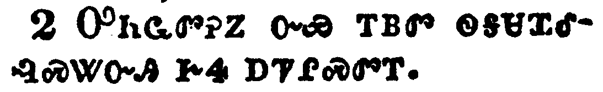</a></td>
</tr>
<tr class="even">
<td>And they found the stone rolled away from the sepulchre.</td>
</tr>
<tr class="odd">
<td>ᎤᏂᏩᏛᎮᏃ ᏅᏯ ᎢᏴᏛ ᏫᎦᏌᏆᎴᎸᏍᏔᏅᎯ ᎨᏎ ᎠᏤᎵᏍᏛᎢ.</td>
</tr>
<tr class="even">
<td>U-ni-wa-dv-he-no nv-ya i-yv-dv wi-ga-sa-qua-le-lv-s-ta-nv-hi ge-se a-tse-li-s-dv-i.</td>
</tr>
</tbody>
</table>

<table>
<tbody>
<tr class="odd">
<td></td>
</tr>
<tr class="even">
<td>And they entered in, and found not the body of the Lord Jesus.</td>
</tr>
<tr class="odd">
<td>ᎤᏂᏴᎸᏃ ᎥᏝ ᏳᏂᎾᏩᏛᎮ ᎠᏰᎸ ᎤᎬᏫᏳᎯ ᏥᏌ.</td>
</tr>
<tr class="even">
<td>U-ni-yv-lv-no v-tla yu-ni-na-wa-dv-he a-ye-lv U-gv-wi-yu-hi Tsi-sa.</td>
</tr>
</tbody>
</table>

<table>
<tbody>
<tr class="odd">
<td></td>
</tr>
<tr class="even">
<td>And it came to pass, as they were much perplexed thereabout, behold, two men stood by them in shining garments:</td>
</tr>
<tr class="odd">
<td>ᎯᎠᏃ ᏄᎵᏍᏔᏁᎢ ᎾᏍᎩ ᎤᏣᏘ ᎤᎾᏕᏯᏔᏁᎮ ᎾᏍᎩ ᏅᏗᎦᎵᏍᏙᏗᏍᎨᎢ, ᎡᏂᏳᏉ ᎠᏂᏔᎵ ᎠᏂᏍᎦᏯ ᎾᎥ ᏚᎾᎴᏂᎴ ᏗᎬᏩᏔᎷᎩᏍᎩ ᏧᎾᏄᏩᎢ;</td>
</tr>
<tr class="even">
<td>Hi-a-no nu-li-s-ta-ne-i na-s-gi u-tsa-ti u-na-de-ya-ta-ne-he na-s-gi nv-di-ga-li-s-do-di-s-ge-i, e-ni-yu-quo a-ni-ta-li a-ni-s-ga-ya na-v du-na-le-ni-le di-gv-wa-ta-lu-gi-s-gi tsu-na-nu-wa-i;</td>
</tr>
</tbody>
</table>

<table>
<tbody>
<tr class="odd">
<td></td>
</tr>
<tr class="even">
<td>And as they were afraid, and bowed down their faces to the earth, they said unto them, Why seek ye the living among the dead?</td>
</tr>
<tr class="odd">
<td>ᎠᏂᏍᎦᎢᎮᏃ ᎠᎴ ᎡᎳᏗ ᏂᏚᏅᏁ ᏚᎾᎧᏛᎢ, ᎾᏍᎩ ᎯᎠ ᏂᎬᏩᏂᏪᏎᎴᎢ, ᎦᏙᏃ ᎬᏃᏛ ᎢᎡᏥᏲᎭ ᏧᏂᏲᎱᏒᎯ ᏄᎾᏛᏅᎢ?</td>
</tr>
<tr class="even">
<td>A-ni-s-ga-i-he-no a-le e-la-di ni-du-nv-ne du-na-ka-dv-i, na-s-gi hi-a ni-gv-wa-ni-we-se-le-i, Ga-do-no gv-no-dv i-e-tsi-yo-ha tsu-ni-yo-hu-sv-hi nu-na-dv-nv-i?</td>
</tr>
</tbody>
</table>

<table>
<tbody>
<tr class="odd">
<td></td>
</tr>
<tr class="even">
<td>He is not here, but is risen: remember how he spake unto you when he was yet in Galilee,</td>
</tr>
<tr class="odd">
<td>ᎥᏝ ᎠᏂ ᏱᎦᎾ, ᏚᎴᏅᏰᏃ; ᎢᏣᏅᏓᏓ ᏂᏥᏪᏎᎸᎢ ᎠᏏᏉ ᎨᎵᎵ ᏤᏙᎲᎩ,</td>
</tr>
<tr class="even">
<td>V-tla a-ni yi-ga-na, du-le-nv-ye-no; I-tsa-nv-da-da ni-tsi-we-se-lv-i a-si-quo Ge-li-li tse-do-hv-gi,</td>
</tr>
</tbody>
</table>

<table>
<tbody>
<tr class="odd">
<td><a href="032407.png">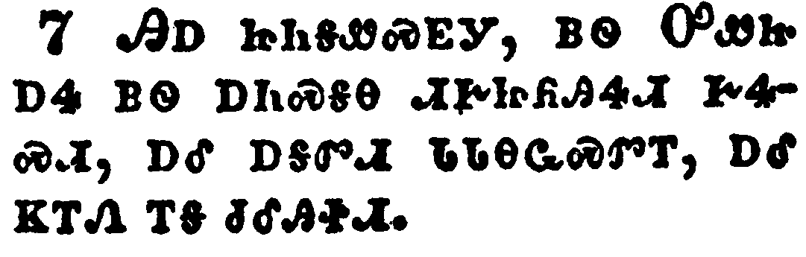</a></td>
</tr>
<tr class="even">
<td>Saying, The Son of man must be delivered into the hands of sinful men, and be crucified, and the third day rise again.</td>
</tr>
<tr class="odd">
<td>ᎯᎠ ᏥᏂᎦᏪᏍᎬᎩ, ᏴᏫ ᎤᏪᏥ ᎠᏎ ᏴᏫ ᎠᏂᏍᎦᎾ ᏗᎨᏥᏲᎯᏎᏗ ᎨᏎᏍᏗ, ᎠᎴ ᎠᎦᏛᏗ ᏓᏓᎾᏩᏍᏛᎢ, ᎠᎴ ᏦᎢᏁ ᎢᎦ ᏧᎴᎯᏐᏗ.</td>
</tr>
<tr class="even">
<td>Hi-a tsi-ni-ga-we-s-gv-gi, yv-wi U-we-tsi a-se yv-wi a-ni-s-ga-na di-ge-tsi-yo-hi-se-di ge-se-s-di, a-le a-ga-dv-di da-da-na-wa-s-dv-i, a-le tso-i-ne i-ga tsu-le-hi-so-di.</td>
</tr>
</tbody>
</table>

<table>
<tbody>
<tr class="odd">
<td></td>
</tr>
<tr class="even">
<td>And they remembered his words,</td>
</tr>
<tr class="odd">
<td>ᎤᎾᏅᏓᏕᏃ ᎤᏁᏨᎢ,</td>
</tr>
<tr class="even">
<td>U-na-nv-da-de-no u-ne-tsv-i,</td>
</tr>
</tbody>
</table>

<table>
<tbody>
<tr class="odd">
<td><a href="032409.png">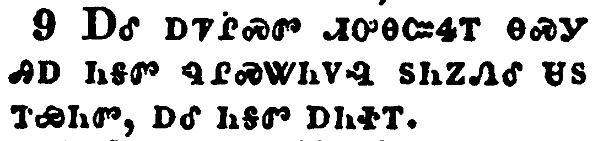</a></td>
</tr>
<tr class="even">
<td>And returned from the sepulchre, and told all these things unto the eleven, and to all the rest.</td>
</tr>
<tr class="odd">
<td>ᎠᎴ ᎠᏤᎵᏍᏛ ᏗᎤᎾᏨᏎᎢ ᎾᏍᎩ ᎯᎠ ᏂᎦᏛ ᏄᎵᏍᏔᏂᏙᎸ ᏚᏂᏃᏁᎴ ᏌᏚ ᎢᏯᏂᏛ, ᎠᎴ ᏂᎦᏛ ᎠᏂᏐᎢ.</td>
</tr>
<tr class="even">
<td>A-le a-tse-li-s-dv di-u-na-tsv-se-i na-s-gi hi-a ni-ga-dv nu-li-s-ta-ni-do-lv du-ni-no-ne-le sa-du i-ya-ni-dv, a-le ni-ga-dv a-ni-so-i.</td>
</tr>
</tbody>
</table>

<table>
<tbody>
<tr class="odd">
<td><a href="032410.png">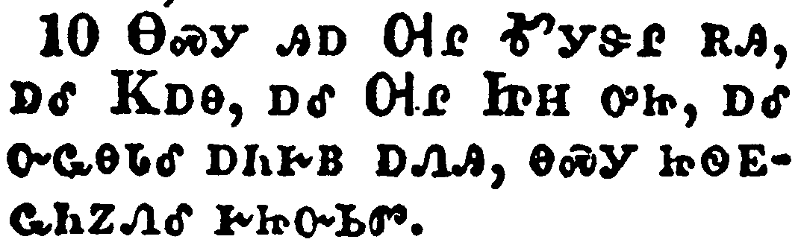</a></td>
</tr>
<tr class="even">
<td>It was Mary Magdalene, and Joanna, and Mary the mother of James, and other women that were with them, which told these things unto the apostles.</td>
</tr>
<tr class="odd">
<td>ᎾᏍᎩ ᎯᎠ ᎺᎵ ᎹᎩᏕᎵ ᎡᎯ, ᎠᎴ ᏦᎠᎾ, ᎠᎴ ᎺᎵ ᏥᎻ ᎤᏥ, ᎠᎴ ᏅᏩᎾᏓᎴ ᎠᏂᎨᏴ ᎠᏁᎯ, ᎾᏍᎩ ᏥᏫᎬᏩᏂᏃᏁᎴ ᎨᏥᏅᏏᏛ.</td>
</tr>
<tr class="even">
<td>Na-s-gi hi-a Me-li Ma-gi-de-li e-hi, a-le Tso-a-na, a-le Me-li Tsi-mi u-tsi, a-le nv-wa-na-da-le a-ni-ge-yv a-ne-hi, na-s-gi tsi-wi-gv-wa-ni-no-ne-le ge-tsi-nv-si-dv.</td>
</tr>
</tbody>
</table>

<table>
<tbody>
<tr class="odd">
<td><a href="032411.png">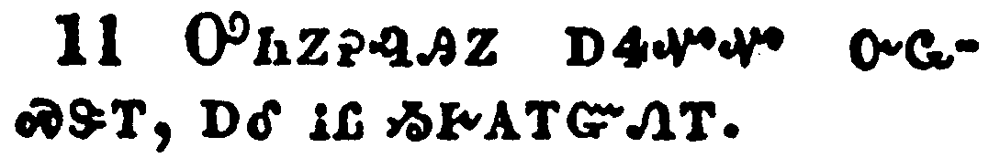</a></td>
</tr>
<tr class="even">
<td>And their words seemed to them as idle tales, and they believed them not.</td>
</tr>
<tr class="odd">
<td>ᎤᏂᏃᎮᎸᎯᏃ ᎠᏎᏉᏉ ᏅᏩᏍᏕᎢ, ᎠᎴ ᎥᏝ ᏱᎨᎪᎢᏳᏁᎢ.</td>
</tr>
<tr class="even">
<td>U-ni-no-he-lv-hi-no a-se-quo-quo nv-wa-s-de-i, a-le v-tla yi-ge-go-i-yu-ne-i.</td>
</tr>
</tbody>
</table>

<table>
<tbody>
<tr class="odd">
<td></td>
</tr>
<tr class="even">
<td>Then arose Peter, and ran unto the sepulchre; and stooping down, he beheld the linen clothes laid by themselves, and departed, wondering in himself at that which was come to pass.</td>
</tr>
<tr class="odd">
<td>ᏈᏓᏃ ᏚᎴᏅ, ᏚᏍᏆᎸᏔᏁ ᎠᏤᎵᏍᏛ ᏭᎶᏎᎢ; ᎤᏗᏍᏚᏅᏃ ᏚᎪᎮ ᏙᎴᏛ ᏗᏄᏬ ᎤᏁᎳᎩ ᎢᏴᏛ ᏙᎦᏁᎢ, ᎤᏓᏅᏎᏃ ᎠᏍᏆᏂᎪᏍᎨ ᎾᏍᎩ ᏄᎵᏍᏔᏂᏙᎸᎢ.</td>
</tr>
<tr class="even">
<td>Qui-da-no du-le-nv, du-s-qua-lv-ta-ne a-tse-li-s-dv wu-lo-se-i; u-di-s-du-nv-no du-go-he do-le-dv di-nu-wo u-ne-la-gi i-yv-dv do-ga-ne-i, u-da-nv-se-no a-s-qua-ni-go-s-ge na-s-gi nu-li-s-ta-ni-do-lv-i.</td>
</tr>
</tbody>
</table>

<table>
<tbody>
<tr class="odd">
<td><a href="032413.png">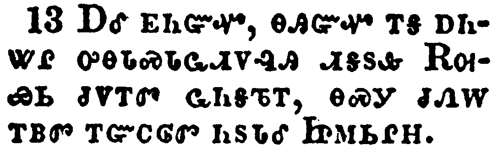</a></td>
</tr>
<tr class="even">
<td>And, behold, two of them went that same day to a village called Emmaus, which was from Jerusalem about threescore furlongs.</td>
</tr>
<tr class="odd">
<td>ᎠᎴ ᎬᏂᏳᏉ, ᎾᎯᏳᏉ ᎢᎦ ᎠᏂᏔᎵ ᎤᎾᏓᏍᏓᏩᏗᏙᎸᎯ ᏗᎦᏚᎲ ᎡᎺᏯᏏ ᏧᏙᎢᏛ ᏩᏂᎦᏖᎢ, ᎾᏍᎩ ᏧᏁᎳ ᎢᏴᏛ ᎢᏳᏟᎶᏛ ᏂᏚᏓᎴ ᏥᎷᏏᎵᎻ.</td>
</tr>
<tr class="even">
<td>A-le gv-ni-yu-quo, na-hi-yu-quo i-ga a-ni-ta-li u-na-da-s-da-wa-di-do-lv-hi di-ga-du-hv E-me-ya-si tsu-do-i-dv wa-ni-ga-te-i, na-s-gi tsu-ne-la i-yv-dv i-yu-tli-lo-dv ni-du-da-le Tsi-lu-si-li-mi.</td>
</tr>
</tbody>
</table>

<table>
<tbody>
<tr class="odd">
<td></td>
</tr>
<tr class="even">
<td>And they talked together of all these things which had happened.</td>
</tr>
<tr class="odd">
<td>ᎠᎾᎵᏃᎮᏍᎬᏃ ᎠᏂᏃᎮᏍᎨ ᏂᎦᏛ ᎾᏍᎩ ᏄᎵᏍᏔᏂᏙᎸᎢ.</td>
</tr>
<tr class="even">
<td>A-na-li-no-he-s-gv-no a-ni-no-he-s-ge ni-ga-dv na-s-gi nu-li-s-ta-ni-do-lv-i.</td>
</tr>
</tbody>
</table>

<table>
<tbody>
<tr class="odd">
<td><a href="032415.png">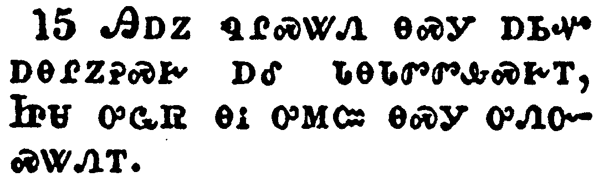</a></td>
</tr>
<tr class="even">
<td>And it came to pass, that, while they communed together and reasoned, Jesus himself drew near, and went with them.</td>
</tr>
<tr class="odd">
<td>ᎯᎠᏃ ᏄᎵᏍᏔᏁ ᎾᏍᎩ ᎠᏏᏉ ᎠᎾᎵᏃᎮᏍᎨ ᎠᎴ ᏓᎾᏓᏛᏛᎲᏍᎨᎢ, ᏥᏌ ᎤᏩᏒ ᎾᎥ ᎤᎷᏨ ᎾᏍᎩ ᎤᏁᏅᏍᏔᏁᎢ.</td>
</tr>
<tr class="even">
<td>Hi-a-no nu-li-s-ta-ne na-s-gi a-si-quo a-na-li-no-he-s-ge a-le da-na-da-dv-dv-hv-s-ge-i, Tsi-sa u-wa-sv na-v u-lu-tsv na-s-gi u-ne-nv-s-ta-ne-i.</td>
</tr>
</tbody>
</table>

<table>
<tbody>
<tr class="odd">
<td><a href="032416.png">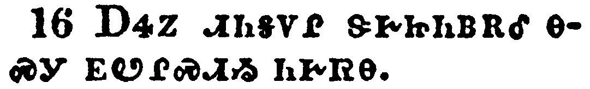</a></td>
</tr>
<tr class="even">
<td>But their eyes were holden that they should not know him.</td>
</tr>
<tr class="odd">
<td>ᎠᏎᏃ ᏗᏂᎦᏙᎵ ᏕᎨᏥᏂᏴᎡᎴ ᎾᏍᎩ ᎬᏬᎵᏍᏗᏱ ᏂᎨᏒᎾ.</td>
</tr>
<tr class="even">
<td>A-se-no di-ni-ga-do-li de-ge-tsi-ni-yv-e-le na-s-gi gv-wo-li-s-di-yi ni-ge-sv-na.</td>
</tr>
</tbody>
</table>

<table>
<tbody>
<tr class="odd">
<td><a href="032417.png">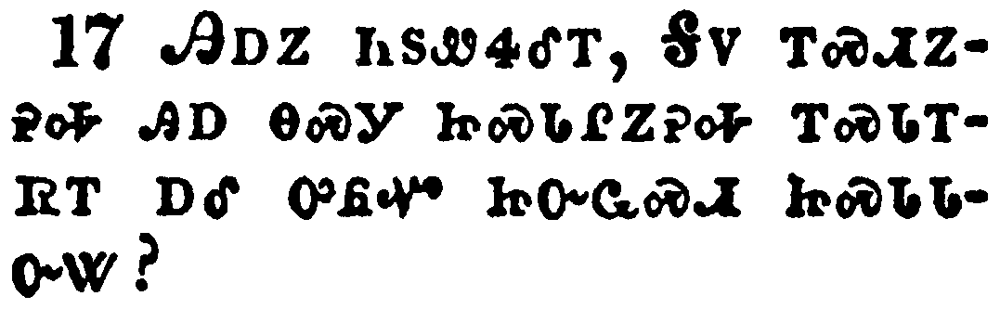</a></td>
</tr>
<tr class="even">
<td>And he said unto them, What manner of communications are these that ye have one to another, as ye walk, and are sad?</td>
</tr>
<tr class="odd">
<td>ᎯᎠᏃ ᏂᏑᏪᏎᎴᎢ, ᎦᏙ ᎢᏍᏗᏃᎮᎭ ᎯᎠ ᎾᏍᎩ ᏥᏍᏓᎵᏃᎮᎭ ᎢᏍᏓᎢᏒᎢ ᎠᎴ ᎤᏲᏉ ᏥᏅᏩᏍᏗ ᏥᏍᏓᏓᏅᏔ?</td>
</tr>
<tr class="even">
<td>Hi-a-no ni-su-we-se-le-i, Ga-do i-s-di-no-he-ha hi-a na-s-gi tsi-s-da-li-no-he-ha i-s-da-i-sv-i a-le u-yo-quo tsi-nv-wa-s-di tsi-s-da-da-nv-ta?</td>
</tr>
</tbody>
</table>

<table>
<tbody>
<tr class="odd">
<td><a href="032418.png">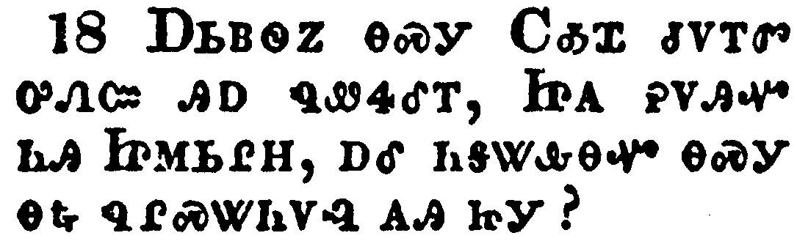</a></td>
</tr>
<tr class="even">
<td>And the one of them, whose name was Cleopas, answering said unto him, Art thou only a stranger in Jerusalem, and hast not known the things which are come to pass therein these days?</td>
</tr>
<tr class="odd">
<td>ᎠᏏᏴᏫᏃ ᎾᏍᎩ ᏟᎣᏆ ᏧᏙᎢᏛ ᎤᏁᏨ ᎯᎠ ᏄᏪᏎᎴᎢ, ᏥᎪ ᎮᏙᎯᏉ ᏂᎯ ᏥᎷᏏᎵᎻ, ᎠᎴ ᏂᎦᏔᎲᎾᏉ ᎾᏍᎩ ᎾᎿᎭᏄᎵᏍᏔᏂᏙᎸ ᎪᎯ ᏥᎩ?</td>
</tr>
<tr class="even">
<td>A-si-yv-wi-no na-s-gi Tli-o-qua tsu-do-i-dv u-ne-tsv hi-a nu-we-se-le-i, Tsi-go he-do-hi-quo ni-hi Tsi-lu-si-li-mi, a-le ni-ga-ta-hv-na-quo na-s-gi na-hna nu-li-s-ta-ni-do-lv go-hi tsi-gi?</td>
</tr>
</tbody>
</table>

<table>
<tbody>
<tr class="odd">
<td><a href="032419.png">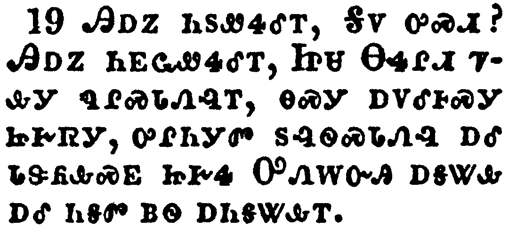</a></td>
</tr>
<tr class="even">
<td>And he said unto them, What things? And they said unto him, Concerning Jesus of Nazareth, which was a prophet mighty in deed and word before God and all the people:</td>
</tr>
<tr class="odd">
<td>ᎯᎠᏃ ᏂᏚᏪᏎᎴᎢ, ᎦᏙ ᎤᏍᏗ? ᎯᎠᏃ ᏂᎬᏩᏪᏎᎴᎢ, ᏥᏌ ᎾᏎᎵᏗ ᏤᎲᎩ ᏄᎵᏍᏓᏁᎸᎢ, ᎾᏍᎩ ᎠᏙᎴᎰᏍᎩ ᏥᎨᏒᎩ, ᎤᎵᏂᎩᏛ ᏚᎸᏫᏍᏓᏁᎸ ᎠᎴ ᏓᏕᏲᎲᏍᎬ ᏥᎨᏎ ᎤᏁᎳᏅᎯ ᎠᎦᏔᎲ ᎠᎴ ᏂᎦᏛ ᏴᏫ ᎠᏂᎦᏔᎲᎢ.</td>
</tr>
<tr class="even">
<td>Hi-a-no ni-du-we-se-le-i, Ga-do u-s-di? Hi-a-no ni-gv-wa-we-se-le-i, Tsi-sa Na-se-li-di tse-hv-gi nu-li-s-da-ne-lv-i, na-s-gi a-do-le-ho-s-gi tsi-ge-sv-gi, u-li-ni-gi-dv du-lv-wi-s-da-ne-lv a-le da-de-yo-hv-s-gv tsi-ge-se U-ne-la-nv-hi a-ga-ta-hv a-le ni-ga-dv yv-wi a-ni-ga-ta-hv-i.</td>
</tr>
</tbody>
</table>

<table>
<tbody>
<tr class="odd">
<td><a href="032420.png">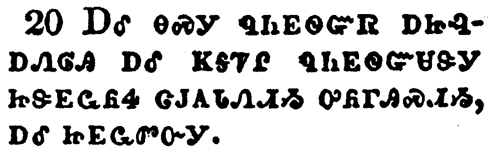</a></td>
</tr>
<tr class="even">
<td>And how the chief priests and our rulers delivered him to be condemned to death, and have crucified him.</td>
</tr>
<tr class="odd">
<td>ᎠᎴ ᎾᏍᎩ ᏄᏂᎬᏫᏳᏒ ᎠᏥᎸᎠᏁᎶᎯ ᎠᎴ ᏦᎦᏤᎵ ᏄᏂᎬᏫᏳᏌᏕᎩ ᏥᏕᎬᏩᏲᏎ ᏣᎫᎪᏓᏁᏗᏱ ᎤᏲᎱᎯᏍᏗᏱ, ᎠᎴ ᏥᎬᏩᏛᏅᎩ.</td>
</tr>
<tr class="even">
<td>A-le na-s-gi nu-ni-gv-wi-yu-sv a-tsi-lv-a-ne-lo-hi a-le tso-ga-tse-li nu-ni-gv-wi-yu-sa-de-gi tsi-de-gv-wa-yo-se tsa-gu-go-da-ne-di-yi u-yo-hu-hi-s-di-yi, a-le tsi-gv-wa-dv-nv-gi.</td>
</tr>
</tbody>
</table>

<table>
<tbody>
<tr class="odd">
<td><a href="032421.png">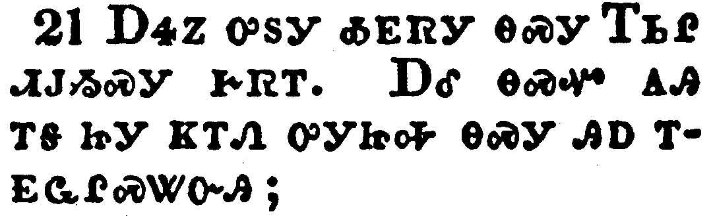</a></td>
</tr>
<tr class="even">
<td>But we trusted that it had been he which should have redeemed Israel: and beside all this, to day is the third day since these things were done.</td>
</tr>
<tr class="odd">
<td>ᎠᏎᏃ ᎤᏚᎩ ᎣᎬᏒᎩ ᎾᏍᎩ ᎢᏏᎵ ᏗᏓᏱᏍᎩ ᎨᏒᎢ. ᎠᎴ ᎾᏍᏉ ᎪᎯ ᎢᎦ ᏥᎩ ᏦᎢᏁ ᎤᎩᏥᎭ ᎾᏍᎩ ᎯᎠ ᎢᎬᏩᎵᏍᏔᏅᎯ;</td>
</tr>
<tr class="even">
<td>A-se-no u-du-gi o-gv-sv-gi na-s-gi I-si-li di-da-yi-s-gi ge-sv-i. A-le na-s-quo go-hi i-ga tsi-gi tso-i-ne u-gi-tsi-ha na-s-gi hi-a i-gv-wa-li-s-ta-nv-hi;</td>
</tr>
</tbody>
</table>

<table>
<tbody>
<tr class="odd">
<td><a href="032422.png">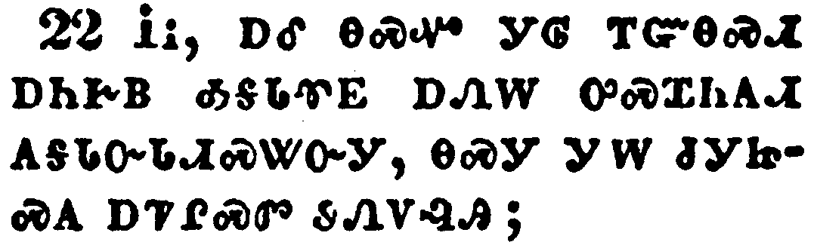</a></td>
</tr>
<tr class="even">
<td>Yea, and certain women also of our company made us astonished, which were early at the sepulchre;</td>
</tr>
<tr class="odd">
<td>ᎥᎥ, ᎠᎴ ᎾᏍᏉ ᎩᎶ ᎢᏳᎾᏍᏗ ᎠᏂᎨᏴ ᎣᎦᏓᏡᎬ ᎠᏁᎳ ᎤᏍᏆᏂᎪᏗ ᎪᎦᏓᏅᏓᏗᏍᏔᏅᎩ, ᎾᏍᎩ ᎩᎳ ᏧᎩᏥᏍᎪ ᎠᏤᎵᏍᏛ ᏭᏁᏙᎸᎯ;</td>
</tr>
<tr class="even">
<td>V-v, a-le na-s-quo gi-lo i-yu-na-s-di a-ni-ge-yv o-ga-da-tlu-gv a-ne-la u-s-qua-ni-go-di go-ga-da-nv-da-di-s-ta-nv-gi, na-s-gi gi-la tsu-gi-tsi-s-go a-tse-li-s-dv wu-ne-do-lv-hi;</td>
</tr>
</tbody>
</table>

<table>
<tbody>
<tr class="odd">
<td><a href="032423.png">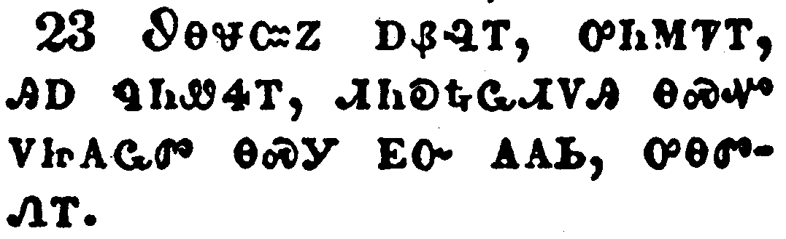</a></td>
</tr>
<tr class="even">
<td>And when they found not his body, they came, saying, that they had also seen a vision of angels, which said that he was alive.</td>
</tr>
<tr class="odd">
<td>ᏭᎾᏠᏨᏃ ᎠᏰᎸᎢ, ᎤᏂᎷᏤᎢ, ᎯᎠ ᏄᏂᏪᏎᎢ, ᏗᏂᎧᎿᎭᏩᏗᏙᎯ ᎾᏍᏉ ᏙᏥᎪᏩᏛ ᎾᏍᎩ ᎬᏅ ᎪᎪᏏ, ᎤᎾᏛᏁᎢ.</td>
</tr>
<tr class="even">
<td>Wu-na-tlo-tsv-no a-ye-lv-i, u-ni-lu-tse-i, hi-a nu-ni-we-se-i, di-ni-ka-hna-wa-di-do-hi na-s-quo do-tsi-go-wa-dv na-s-gi gv-nv go-go-si, u-na-dv-ne-i.</td>
</tr>
</tbody>
</table>

<table>
<tbody>
<tr class="odd">
<td><a href="032424.png">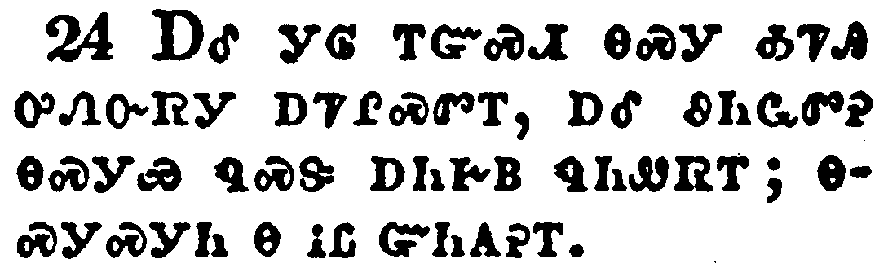</a></td>
</tr>
<tr class="even">
<td>And certain of them which were with us went to the sepulchre, and found it even so as the women had said: but him they saw not.</td>
</tr>
<tr class="odd">
<td>ᎠᎴ ᎩᎶ ᎢᏳᏍᏗ ᎾᏍᎩ ᎣᏤᎯ ᎤᏁᏅᏒᎩ ᎠᏤᎵᏍᏛᎢ, ᎠᎴ ᏭᏂᏩᏛᎮ ᎾᏍᎩᏯ ᏄᏍᏕ ᎠᏂᎨᏴ ᏄᏂᏪᏒᎢ; ᎾᏍᎩᏍᎩᏂ Ꮎ ᎥᏝ ᏳᏂᎪᎮᎢ.</td>
</tr>
<tr class="even">
<td>A-le gi-lo i-yu-s-di na-s-gi o-tse-hi u-ne-nv-sv-gi a-tse-li-s-dv-i, a-le wu-ni-wa-dv-he na-s-gi-ya nu-s-de a-ni-ge-yv nu-ni-we-sv-i; na-s-gi-s-gi-ni na v-tla yu-ni-go-he-i.</td>
</tr>
</tbody>
</table>

<table>
<tbody>
<tr class="odd">
<td><a href="032425.png">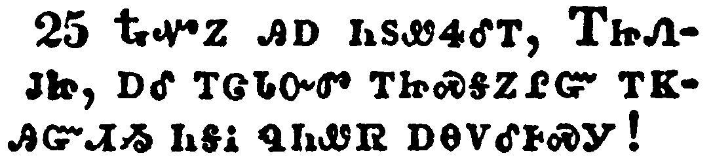</a></td>
</tr>
<tr class="even">
<td>Then he said unto them, O fools, and slow of heart to believe all that the prophets have spoken:</td>
</tr>
<tr class="odd">
<td>ᎿᎭᏉᏃ ᎯᎠ ᏂᏚᏪᏎᎴᎢ, ᎢᏥᏁᎫᏥ, ᎠᎴ ᎢᏣᏓᏅᏛ ᎢᏥᏍᎦᏃᎵᏳ ᎢᏦᎯᏳᏗᏱ ᏂᎦᎥ ᏄᏂᏪᏒ ᎠᎾᏙᎴᎰᏍᎩ!</td>
</tr>
<tr class="even">
<td>Hna-quo-no hi-a ni-du-we-se-le-i, I-tsi-ne-gu-tsi, a-le i-tsa-da-nv-dv i-tsi-s-ga-no-li-yu i-tso-hi-yu-di-yi ni-ga-v nu-ni-we-sv a-na-do-le-ho-s-gi!</td>
</tr>
</tbody>
</table>

<table>
<tbody>
<tr class="odd">
<td><a href="032426.png">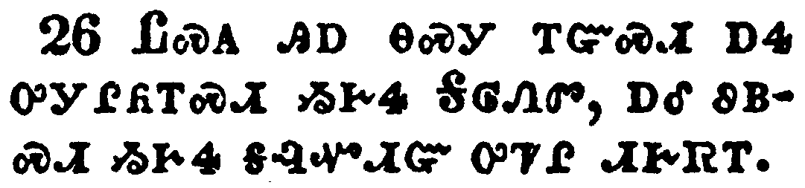</a></td>
</tr>
<tr class="even">
<td>Ought not Christ to have suffered these things, and to enter into his glory?</td>
</tr>
<tr class="odd">
<td>ᏝᏍᎪ ᎯᎠ ᎾᏍᎩ ᎢᏳᏍᏗ ᎠᏎ ᎤᎩᎵᏲᎢᏍᏗ ᏱᎨᏎ ᎦᎶᏁᏛ, ᎠᎴ ᏭᏴᏍᏗ ᏱᎨᏎ ᎦᎸᏉᏗᏳ ᎤᏤᎵ ᏗᎨᏒᎢ.</td>
</tr>
<tr class="even">
<td>Tla-s-go hi-a na-s-gi i-yu-s-di a-se u-gi-li-yo-i-s-di yi-ge-se Ga-lo-ne-dv, a-le wu-yv-s-di yi-ge-se ga-lv-quo-di-yu u-tse-li di-ge-sv-i.</td>
</tr>
</tbody>
</table>

<table>
<tbody>
<tr class="odd">
<td><a href="032427.png">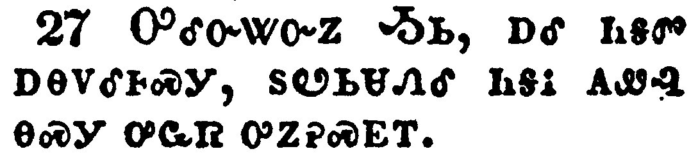</a></td>
</tr>
<tr class="even">
<td>And beginning at Moses and all the prophets, he expounded unto them in all the scriptures the things concerning himself.</td>
</tr>
<tr class="odd">
<td>ᎤᎴᏅᏔᏅᏃ ᎼᏏ, ᎠᎴ ᏂᎦᏛ ᎠᎾᏙᎴᎰᏍᎩ, ᏚᏬᏏᏌᏁᎴ ᎾᎦᎥ ᎪᏪᎸ ᎾᏍᎩ ᎤᏩᏒ ᎤᏃᎮᏍᎬᎢ.</td>
</tr>
<tr class="even">
<td>U-le-nv-ta-nv-no Mo-si, a-le ni-ga-dv a-na-do-le-ho-s-gi, du-wo-si-sa-ne-le na-ga-v go-we-lv na-s-gi u-wa-sv u-no-he-s-gv-i.</td>
</tr>
</tbody>
</table>

<table>
<tbody>
<tr class="odd">
<td><a href="032428.png">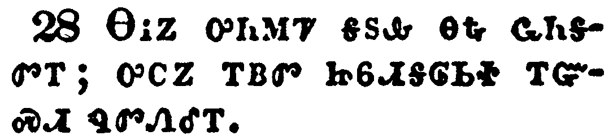</a></td>
</tr>
<tr class="even">
<td>And they drew nigh unto the village, whither they went: and he made as though he would have gone further.</td>
</tr>
<tr class="odd">
<td>ᎾᎥᏃ ᎤᏂᎷᏤ ᎦᏚᎲ ᎾᎿᎭᏩᏂᎦᏛᎢ; ᎤᏟᏃ ᎢᏴᏛ ᏥᏮᏗᎦᎶᏏᏐ ᎢᏳᏍᏗ ᏄᏛᏁᎴᎢ.</td>
</tr>
<tr class="even">
<td>Na-v-no u-ni-lu-tse ga-du-hv na-hna wa-ni-ga-dv-i; u-tli-no i-yv-dv tsi-wv-di-ga-lo-si-so i-yu-s-di nu-dv-ne-le-i.</td>
</tr>
</tbody>
</table>

<table>
<tbody>
<tr class="odd">
<td></td>
</tr>
<tr class="even">
<td>But they constrained him, saying, Abide with us: for it is toward evening, and the day is far spent. And he went in to tarry with them.</td>
</tr>
<tr class="odd">
<td>ᎠᏎᏃ ᎢᎬᏩᏍᏗᏰᏔᏁᎢ, ᎯᎠ ᏄᏂᏪᏎᎢ, ᎠᏴ ᏍᎩᏂᏒᏏ, ᎿᎭᏉᏰᏃ ᎤᏒᎯᏰᎯᏳ, ᎠᎴ ᎡᎳᏗᏳ ᏫᎧᎳ. ᎤᏴᎴᏃ ᏙᏗᏒᏎᎵᏎᎢ.</td>
</tr>
<tr class="even">
<td>A-se-no i-gv-wa-s-di-ye-ta-ne-i, hi-a nu-ni-we-se-i, A-yv s-gi-ni-sv-si, hna-quo-ye-no u-sv-hi-ye-hi-yu, a-le e-la-di-yu wi-ka-la. U-yv-le-no do-di-sv-se-li-se-i.</td>
</tr>
</tbody>
</table>

<table>
<tbody>
<tr class="odd">
<td></td>
</tr>
<tr class="even">
<td>And it came to pass, as he sat at meat with them, he took bread, and blessed it, and brake, and gave to them.</td>
</tr>
<tr class="odd">
<td>ᎯᎠᏃ ᏄᎵᏍᏔᏁ ᎾᏍᎩ ᎦᏅᎨᎢ ᏗᎾᎵᏍᏓᏴᏂᏎᎢ, ᎦᏚ ᎤᎩᏒ ᎤᎵᎮᎵᏤᎢ, ᎠᎴ ᎤᎬᎭᎷᏴ ᏚᏁᎴᎢ.</td>
</tr>
<tr class="even">
<td>Hi-a-no nu-li-s-ta-ne na-s-gi ga-nv-ge-i di-na-li-s-da-yv-ni-se-i, ga-du u-gi-sv u-li-he-li-tse-i, a-le u-gv-ha-lu-yv du-ne-le-i.</td>
</tr>
</tbody>
</table>

<table>
<tbody>
<tr class="odd">
<td></td>
</tr>
<tr class="even">
<td>And their eyes were opened, and they knew him; and he vanished out of their sight.</td>
</tr>
<tr class="odd">
<td>ᏗᏂᎦᏙᎵᏃ ᏚᎵᏍᏚᎢᏎᎢ, ᎠᎴ ᎢᎬᏬᎵᏤᎢ, ᎠᎴ ᎤᎵᏛᏔᏁ ᏓᏂᎧᏅᎢ.</td>
</tr>
<tr class="even">
<td>Di-ni-ga-do-li-no du-li-s-du-i-se-i, a-le i-gv-wo-li-tse-i, a-le u-li-dv-ta-ne da-ni-ka-nv-i.</td>
</tr>
</tbody>
</table>

<table>
<tbody>
<tr class="odd">
<td></td>
</tr>
<tr class="even">
<td>And they said one to another, Did not our heart burn within us, while he talked with us by the way, and while he opened to us the scriptures?</td>
</tr>
<tr class="odd">
<td>ᎯᎠᏃ ᏂᏚᎾᏓᏪᏎᎴᎢ, ᏝᏍᎪ ᏗᎩᏂᎾᏫ ᏧᏗᎴᎩᏳ ᏱᎨᏎ ᎭᏫᏂ ᏥᎩᎾᎵᏃᎮᏗᏍᎬ ᏗᏓᎢᏒᎢ, ᎠᎴ ᏥᏕᎩᏃᏏᏌᏁᎲ ᎪᏪᎵ?</td>
</tr>
<tr class="even">
<td>Hi-a-no ni-du-na-da-we-se-le-i, Tla-s-go di-gi-ni-na-wi tsu-di-le-gi-yu yi-ge-se ha-wi-ni tsi-gi-na-li-no-he-di-s-gv di-da-i-sv-i, a-le tsi-de-gi-no-si-sa-ne-hv go-we-li?</td>
</tr>
</tbody>
</table>

<table>
<tbody>
<tr class="odd">
<td></td>
</tr>
<tr class="even">
<td>And they rose up the same hour, and returned to Jerusalem, and found the eleven gathered together, and them that were with them,</td>
</tr>
<tr class="odd">
<td>ᎾᎯᏳᏉᏃ ᎠᎵᏰᎢᎵᏒ ᏚᎾᎴᏁᎢ, ᎠᎴ ᏥᎷᏏᎵᎻ ᏔᎵᏁ ᏫᎤᏂᎶᏎᎢ, ᎠᎴ ᏚᏂᏩᏛᎮ ᏓᏂᎳᏫᎡ ᏌᏚ ᎢᏯᏂᏛ, ᎠᎴ ᎾᏍᎩ ᎬᏩᎾᏓᏡᏩᏍᏗᏕᎩ,</td>
</tr>
<tr class="even">
<td>Na-hi-yu-quo-no a-li-ye-i-li-sv du-na-le-ne-i, a-le Tsi-lu-si-li-mi ta-li-ne wi-u-ni-lo-se-i, a-le du-ni-wa-dv-he da-ni-la-wi-e sa-du i-ya-ni-dv, a-le na-s-gi gv-wa-na-da-tlu-wa-s-di-de-gi,</td>
</tr>
</tbody>
</table>

<table>
<tbody>
<tr class="odd">
<td><a href="032434.png">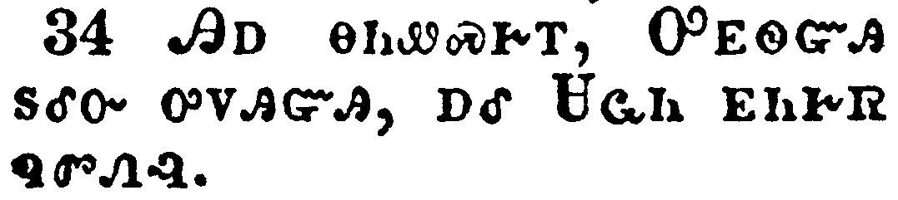</a></td>
</tr>
<tr class="even">
<td>Saying, The Lord is risen indeed, and hath appeared to Simon.</td>
</tr>
<tr class="odd">
<td>ᎯᎠ ᎾᏂᏪᏍᎨᎢ, ᎤᎬᏫᏳᎯ ᏚᎴᏅ ᎤᏙᎯᏳᎯ, ᎠᎴ ᏌᏩᏂ ᎬᏂᎨᏒ ᏄᏛᏁᎸ.</td>
</tr>
<tr class="even">
<td>Hi-a na-ni-we-s-ge-i, U-gv-wi-yu-hi du-le-nv u-do-hi-yu-hi, a-le Sa-wa-ni gv-ni-ge-sv nu-dv-ne-lv.</td>
</tr>
</tbody>
</table>

<table>
<tbody>
<tr class="odd">
<td><a href="032435.png">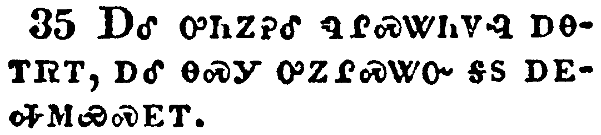</a></td>
</tr>
<tr class="even">
<td>And they told what things were done in the way, and how he was known of them in breaking of bread.</td>
</tr>
<tr class="odd">
<td>ᎠᎴ ᎤᏂᏃᎮᎴ ᏄᎵᏍᏔᏂᏙᎸ ᎠᎾᎢᏒᎢ, ᎠᎴ ᎾᏍᎩ ᎤᏃᎵᏍᏔᏅ ᎦᏚ ᎠᎬᎭᎷᏯᏍᎬᎢ.</td>
</tr>
<tr class="even">
<td>A-le u-ni-no-he-le nu-li-s-ta-ni-do-lv a-na-i-sv-i, a-le na-s-gi u-no-li-s-ta-nv ga-du a-gv-ha-lu-ya-s-gv-i.</td>
</tr>
</tbody>
</table>

<table>
<tbody>
<tr class="odd">
<td></td>
</tr>
<tr class="even">
<td>And as they thus spake, Jesus himself stood in the midst of them, and saith unto them, Peace be unto you.</td>
</tr>
<tr class="odd">
<td>ᎠᏏᏉᏃ ᎾᏍᎩ ᎾᏂᏪᏍᎨᎢ, ᏥᏌ ᎤᏩᏒ ᎤᎴᏂᎴ ᎠᏰᎵ ᎠᏂᏅᎢ, ᎠᎴ ᎯᎠ ᏂᏚᏪᏎᎴᎢ, ᏅᏩᏙᎯᏯᏛ ᎢᏣᏤᎵᎦ ᎨᏎᏍᏗ.</td>
</tr>
<tr class="even">
<td>A-si-quo-no na-s-gi na-ni-we-s-ge-i, Tsi-sa u-wa-sv u-le-ni-le a-ye-li a-ni-nv-i, a-le hi-a ni-du-we-se-le-i, Nv-wa-do-hi-ya-dv i-tsa-tse-li-ga ge-se-s-di.</td>
</tr>
</tbody>
</table>

<table>
<tbody>
<tr class="odd">
<td></td>
</tr>
<tr class="even">
<td>But they were terrified and affrighted, and supposed that they had seen a spirit.</td>
</tr>
<tr class="odd">
<td>ᎠᏎᏃ ᎤᏂᎾᏰᏎᎢ, ᎠᎴ ᎤᏂᏍᎦᎴᎢ, ᎠᏓᏅᏙ ᎣᏥᎪᏩᏛ ᎠᏁᎵᏍᎨᎢ.</td>
</tr>
<tr class="even">
<td>A-se-no u-ni-na-ye-se-i, a-le u-ni-s-ga-le-i, a-da-nv-do o-tsi-go-wa-dv a-ne-li-s-ge-i.</td>
</tr>
</tbody>
</table>

<table>
<tbody>
<tr class="odd">
<td></td>
</tr>
<tr class="even">
<td>And he said unto them, Why are ye troubled? and why do thoughts arise in your hearts?</td>
</tr>
<tr class="odd">
<td>ᎯᎠᏃ ᏂᏚᏪᏎᎴᎢ, ᎦᏙᏃ ᎢᏣᏕᏯᏔᏁᎭ? ᎠᎴ ᎦᏙᏃ ᏧᏢᏫᏛ ᏂᏣᎵᏍᏓᏁ ᏙᏗᏣᏓᏅᏛᎢ?</td>
</tr>
<tr class="even">
<td>Hi-a-no ni-du-we-se-le-i, ga-do-no i-tsa-de-ya-ta-ne-ha? A-le ga-do-no tsu-tlv-wi-dv ni-tsa-li-s-da-ne do-di-tsa-da-nv-dv-i?</td>
</tr>
</tbody>
</table>

<table>
<tbody>
<tr class="odd">
<td></td>
</tr>
<tr class="even">
<td>Behold my hands and my feet, that it is I myself: handle me, and see; for a spirit hath not flesh and bones, as ye see me have.</td>
</tr>
<tr class="odd">
<td>ᏗᏣᎧᏅᎦ ᏗᏉᏰᏂ ᎠᎴ ᏗᏆᎳᏏᏕᏂ, ᎠᏋᏒᏉ ᎯᎠ ᏥᎾᏆᏛᏅ; ᏍᎩᏯᏒᏂᎦ ᎠᎴ ᎢᏣᏙᎴᎰᎯ; ᎠᏓᏅᏙᏰᏃ ᎥᏝ ᏳᏇᏓᎳ, ᎠᎴ ᎥᏝ ᏧᎪᎳ ᏱᏚᎸ ᎾᏍᎩᏯ ᏥᏥᎪᏩᏘᎭ ᎠᏴ ᏂᏓᏋᏅᎢ.</td>
</tr>
<tr class="even">
<td>Di-tsa-ka-nv-ga di-quo-ye-ni a-le di-qua-la-si-de-ni, a-quv-sv-quo hi-a tsi-na-qua-dv-nv; s-gi-ya-sv-ni-ga a-le i-tsa-do-le-ho-hi; a-da-nv-do-ye-no v-tla yu-que-da-la, a-le v-tla tsu-go-la yi-du-lv na-s-gi-ya tsi-tsi-go-wa-ti-ha a-yv ni-da-quv-nv-i.</td>
</tr>
</tbody>
</table>

<table>
<tbody>
<tr class="odd">
<td><a href="032440.png">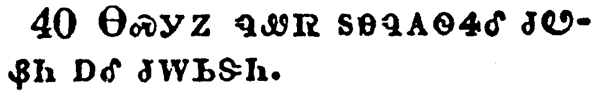</a></td>
</tr>
<tr class="even">
<td>And when he had thus spoken, he shewed them his hands and his feet.</td>
</tr>
<tr class="odd">
<td>ᎾᏍᎩᏃ ᏄᏪᏒ ᏚᎾᏄᎪᏫᏎᎴ ᏧᏬᏰᏂ ᎠᎴ ᏧᎳᏏᏕᏂ.</td>
</tr>
<tr class="even">
<td>Na-s-gi-no nu-we-sv du-na-nu-go-wi-se-le tsu-wo-ye-ni a-le tsu-la-si-de-ni.</td>
</tr>
</tbody>
</table>

<table>
<tbody>
<tr class="odd">
<td><a href="032441.png">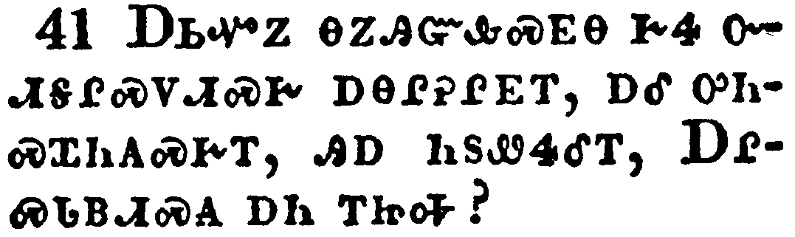</a></td>
</tr>
<tr class="even">
<td>And while they yet believed not for joy, and wondered, he said unto them, Have ye here any meat?</td>
</tr>
<tr class="odd">
<td>ᎠᏏᏉᏃ ᎾᏃᎯᏳᎲᏍᎬᎾ ᎨᏎ ᏅᏗᎦᎵᏍᏙᏗᏍᎨ ᎠᎾᎵᎮᎵᎬᎢ, ᎠᎴ ᎤᏂᏍᏆᏂᎪᏍᎨᎢ, ᎯᎠ ᏂᏚᏪᏎᎴᎢ, ᎠᎵᏍᏓᏴᏗᏍᎪ ᎠᏂ ᎢᏥᎭ?</td>
</tr>
<tr class="even">
<td>A-si-quo-no na-no-hi-yu-hv-s-gv-na ge-se nv-di-ga-li-s-do-di-s-ge a-na-li-he-li-gv-i, a-le u-ni-s-qua-ni-go-s-ge-i, hi-a ni-du-we-se-le-i, A-li-s-da-yv-di-s-go a-ni i-tsi-ha?</td>
</tr>
</tbody>
</table>

<table>
<tbody>
<tr class="odd">
<td><a href="032442.png">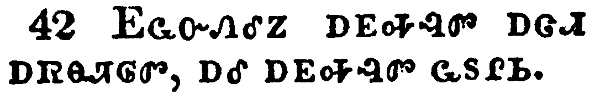</a></td>
</tr>
<tr class="even">
<td>And they gave him a piece of a broiled fish, and of an honeycomb.</td>
</tr>
<tr class="odd">
<td>ᎬᏩᏅᏁᎴᏃ ᎠᎬᎭᎸᏛ ᎠᏣᏗ ᎠᏒᎾᏘᎶᏛ, ᎠᎴ ᎠᎬᎭᎸᏛ ᏩᏚᎵᏏ.</td>
</tr>
<tr class="even">
<td>Gv-wa-nv-ne-le-no a-gv-ha-lv-dv a-tsa-di a-sv-na-ti-lo-dv, a-le a-gv-ha-lv-dv wa-du-li-si.</td>
</tr>
</tbody>
</table>

<table>
<tbody>
<tr class="odd">
<td></td>
</tr>
<tr class="even">
<td>And he took it, and did eat before them.</td>
</tr>
<tr class="odd">
<td>ᏑᏁᏎᏃ, ᎠᎴ ᎤᎵᏍᏓᏴᏁ ᎠᏂᎦᏔᎲᎢ.</td>
</tr>
<tr class="even">
<td>Su-ne-se-no, a-le u-li-s-da-yv-ne a-ni-ga-ta-hv-i.</td>
</tr>
</tbody>
</table>

<table>
<tbody>
<tr class="odd">
<td></td>
</tr>
<tr class="even">
<td>And he said unto them, These are the words which I spake unto you, while I was yet with you, that all things must be fulfilled, which were written in the law of Moses, and in the prophets, and in the psalms, concerning me.</td>
</tr>
<tr class="odd">
<td>ᎯᎠᏃ ᏂᏚᏪᏎᎴᎢ, ᎯᎠ ᎾᏍᎩ ᏥᏂᏨᏪᏎᎸᎩ, ᎠᏏᏉ ᏥᏨᏰᎳᏗᏙᎲᎩ, ᎾᏍᎩ ᏂᎦᎥ ᎾᏍᎩ ᎠᏎ ᎢᏳᎵᏍᏙᏗ ᎨᏒᎢ ᎪᏪᎳᏅᎯ ᎨᏒ ᏗᎧᎿᎭᏩᏛᏍᏗᏱ ᎼᏏ ᎤᏤᎵᎦ, ᎠᎴ ᎠᎾᏙᎴᎰᏍᎩ ᏚᏃᏪᎸᎢ, ᎠᎴ ᏗᎧᏃᎩᏍᏗᏱ, ᎠᏴ ᎬᎩᏃᎮᏍᎬᎢ.</td>
</tr>
<tr class="even">
<td>Hi-a-no ni-du-we-se-le-i, Hi-a na-s-gi tsi-ni-tsv-we-se-lv-gi, a-si-quo tsi-tsv-ye-la-di-do-hv-gi, na-s-gi ni-ga-v na-s-gi a-se i-yu-li-s-do-di ge-sv-i go-we-la-nv-hi ge-sv di-ka-hna-wa-dv-s-di-yi Mo-si u-tse-li-ga, a-le a-na-do-le-ho-s-gi du-no-we-lv-i, a-le di-ka-no-gi-s-di-yi, a-yv gv-gi-no-he-s-gv-i.</td>
</tr>
</tbody>
</table>

<table>
<tbody>
<tr class="odd">
<td><a href="032445.png">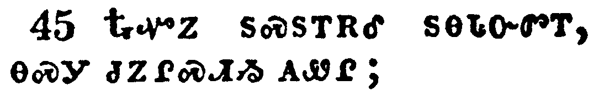</a></td>
</tr>
<tr class="even">
<td>Then opened he their understanding, that they might understand the scriptures,</td>
</tr>
<tr class="odd">
<td>ᎿᎭᏉᏃ ᏚᏍᏚᎢᎡᎴ ᏚᎾᏓᏅᏛᎢ, ᎾᏍᎩ ᏧᏃᎵᏍᏗᏱ ᎪᏪᎵ;</td>
</tr>
<tr class="even">
<td>Hna-quo-no du-s-du-i-e-le du-na-da-nv-dv-i, na-s-gi tsu-no-li-s-di-yi go-we-li;</td>
</tr>
</tbody>
</table>

<table>
<tbody>
<tr class="odd">
<td></td>
</tr>
<tr class="even">
<td>And said unto them, Thus it is written, and thus it behoved Christ to suffer, and to rise from the dead the third day:</td>
</tr>
<tr class="odd">
<td>ᎯᎠᏃ ᏂᏚᏪᏎᎴᎢ, ᎾᏍᎩ ᎯᎠ ᏂᎬᏅ ᎪᏪᎳ, ᎠᎴ ᎾᏍᎩ ᎠᏎ ᎤᎩᎵᏲᎢᏍᏗ ᎨᏒᎩ ᎦᎶᏁᏛ, ᎠᎴ ᏧᎴᎯᏐᏗ ᎨᏒ ᎤᏲᎱᏒ ᏦᎢᏁ ᎢᎦ;</td>
</tr>
<tr class="even">
<td>Hi-a-no ni-du-we-se-le-i, na-s-gi hi-a ni-gv-nv go-we-la, a-le na-s-gi a-se u-gi-li-yo-i-s-di ge-sv-gi Ga-lo-ne-dv, a-le tsu-le-hi-so-di ge-sv u-yo-hu-sv tso-i-ne i-ga;</td>
</tr>
</tbody>
</table>

<table>
<tbody>
<tr class="odd">
<td></td>
</tr>
<tr class="even">
<td>And that repentance and remission of sins should be preached in his name among all nations, beginning at Jerusalem.</td>
</tr>
<tr class="odd">
<td>ᎾᏍᎩᏃ ᏚᏙᎥ ᎤᏅᏙᏗᏱ ᎦᏁᏟᏴᏍᏗ ᎨᏒ ᎣᏓᏅᏛ ᎠᎴ ᎠᏍᎦᏅᏨ ᎥᏓᏗᏙᎵᏍᏗ ᎨᏒ ᎨᎦᎵᏥᏙᏁᏗᏱ ᏂᎦᏛ ᏧᎾᏓᎴᏅᏛ ᏓᏁᏩᏗᏒᎢ, ᏥᎷᏏᎵᎻ ᎤᎾᎴᏅᏗᏱ.</td>
</tr>
<tr class="even">
<td>Na-s-gi-no du-do-v u-nv-do-di-yi ga-ne-tli-yv-s-di ge-sv o-da-nv-dv a-le a-s-ga-nv-tsv v-da-di-do-li-s-di ge-sv ge-ga-li-tsi-do-ne-di-yi ni-ga-dv tsu-na-da-le-nv-dv da-ne-wa-di-sv-i, Tsi-lu-si-li-mi u-na-le-nv-di-yi.</td>
</tr>
</tbody>
</table>

<table>
<tbody>
<tr class="odd">
<td></td>
</tr>
<tr class="even">
<td>And ye are witnesses of these things.</td>
</tr>
<tr class="odd">
<td>ᎯᎯᏃ ᎢᏥᏃᎮᏍᎩ ᎯᎠ ᎾᏍᎩ ᏧᏓᎴᏅᏛ.</td>
</tr>
<tr class="even">
<td>Hi-hi-no i-tsi-no-he-s-gi hi-a na-s-gi tsu-da-le-nv-dv.</td>
</tr>
</tbody>
</table>

<table>
<tbody>
<tr class="odd">
<td></td>
</tr>
<tr class="even">
<td>And, behold, I send the promise of my Father upon you: but tarry ye in the city of Jerusalem, until ye be endued with power from on high.</td>
</tr>
<tr class="odd">
<td>ᎠᎴ ᎬᏂᏳᏉ, ᎦᏓᏅᎵ ᎢᏥᎷᏤᏗᏱ ᎡᏙᏓ ᎤᏚᎢᏍᏔᏅᎯ ᎨᏒᎢ; ᎠᏎᏃ ᏥᎷᏏᎵᎻ ᎦᏚᎲ ᎢᏥᏁᏍᏗ ᎬᏂ ᎢᏣᏄᏬᏍᏕᏍᏗ ᎤᎵᏂᎩᏛ ᎨᏒ ᎦᎸᎳᏗ ᏅᏓᏳᏓᎴᏅᎯ.</td>
</tr>
<tr class="even">
<td>A-le gv-ni-yu-quo, ga-da-nv-li i-tsi-lu-tse-di-yi E-do-da u-du-i-s-ta-nv-hi ge-sv-i; a-se-no Tsi-lu-si-li-mi ga-du-hv i-tsi-ne-s-di gv-ni i-tsa-nu-wo-s-de-s-di u-li-ni-gi-dv ge-sv ga-lv-la-di nv-da-yu-da-le-nv-hi.</td>
</tr>
</tbody>
</table>

<table>
<tbody>
<tr class="odd">
<td></td>
</tr>
<tr class="even">
<td>And he led them out as far as to Bethany, and he lifted up his hands, and blessed them.</td>
</tr>
<tr class="odd">
<td>ᏚᏘᏅᏎᏃ ᏇᏗᏂᏱ ᎢᏴᏛ; ᏧᏬᏰᏂᏃ ᏚᏌᎳᏓᏅ ᎣᏍᏛ ᏚᏁᏤᎴᎢ.</td>
</tr>
<tr class="even">
<td>Du-ti-nv-se-no Que-di-ni-yi i-yv-dv; tsu-wo-ye-ni-no du-sa-la-da-nv o-s-dv du-ne-tse-le-i.</td>
</tr>
</tbody>
</table>

<table>
<tbody>
<tr class="odd">
<td><a href="032451.png">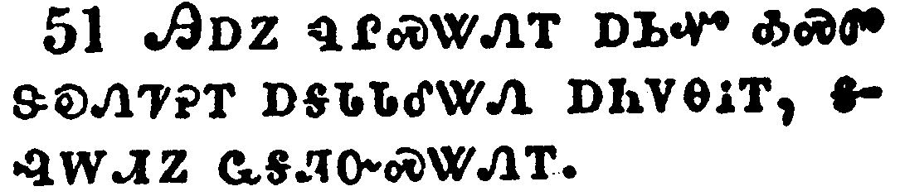</a></td>
</tr>
<tr class="even">
<td>And it came to pass, while he blessed them, he was parted from them, and carried up into heaven.</td>
</tr>
<tr class="odd">
<td>ᎯᎠᏃ ᏄᎵᏍᏔᏁᎢ ᎠᏏᏉ ᎣᏍᏛ ᏕᎧᏁᏤᎮᎢ ᎠᎦᏓᏓᎴᏔᏁ ᎠᏂᏙᎾᎥᎢ, ᎦᎸᎳᏗᏃ ᏩᎦᏘᏅᏍᏔᏁᎢ.</td>
</tr>
<tr class="even">
<td>Hi-a-no nu-li-s-ta-ne-i a-si-quo o-s-dv de-ka-ne-tse-he-i a-ga-da-da-le-ta-ne a-ni-do-na-v-i, ga-lv-la-di-no wa-ga-ti-nv-s-ta-ne-i.</td>
</tr>
</tbody>
</table>

<table>
<tbody>
<tr class="odd">
<td><a href="032452.png">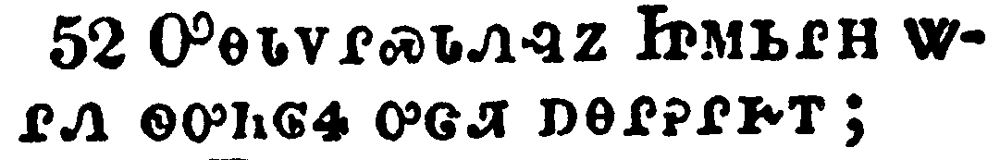</a></td>
</tr>
<tr class="even">
<td>And they worshipped him, and returned to Jerusalem with great joy:</td>
</tr>
<tr class="odd">
<td>ᎤᎾᏓᏙᎵᏍᏓᏁᎸᏃ ᏥᎷᏏᎵᎻ ᏔᎵᏁ ᏫᎤᏂᎶᏎ ᎤᏣᏘ ᎠᎾᎵᎮᎵᎨᎢ;</td>
</tr>
<tr class="even">
<td>U-na-da-do-li-s-da-ne-lv-no Tsi-lu-si-li-mi ta-li-ne wi-u-ni-lo-se u-tsa-ti a-na-li-he-li-ge-i;</td>
</tr>
</tbody>
</table>

<table>
<tbody>
<tr class="odd">
<td><a href="032453.png">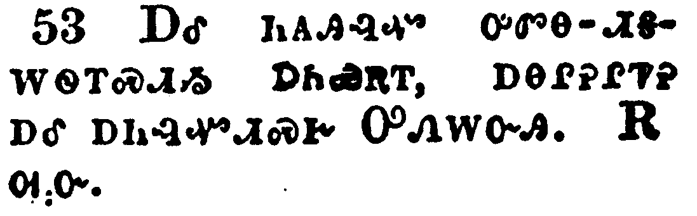</a></td>
</tr>
<tr class="even">
<td>And were continually in the temple, praising and blessing God. Amen.</td>
</tr>
<tr class="odd">
<td>ᎠᎴ ᏂᎪᎯᎸᏉ ᎤᏛᎾ-ᏗᎦᎳᏫᎢᏍᏗᏱ ᎠᏂᏯᎡᎢ, ᎠᎾᎵᎮᎵᏤᎮ ᎠᎴ ᎠᏂᎸᏉᏗᏍᎨ ᎤᏁᎳᏅᎯ. ᎡᎺᏅ.</td>
</tr>
<tr class="even">
<td>A-le ni-go-hi-lv-quo u-dv-na--di-ga-la-wi-i-s-di-yi a-ni-ya-e-i, a-na-li-he-li-tse-he a-le a-ni-lv-quo-di-s-ge U-ne-la-nv-hi. E-me-nv.</td>
</tr>
</tbody>
</table>

