+++
draft=false
date = 2014-12-18T21:11:07Z
title = "Mark - Chapter 5 - Cherokee New Testament"
weight = 1418955067

[taxonomies]

authors = ["Timothy Legg"]
categories = []
tags = []

[extra]
+++

<table>
<tbody>
<tr class="odd">
<td></td>
</tr>
<tr class="even">
<td>And they came over unto the other side of the sea, into the country of the Gadarenes.</td>
</tr>
<tr class="odd">
<td>ᎢᏍᎪᏂᏗᏢᏃ ᎥᏓᎵ ᏭᏂᎷᏤ ᎠᏂᎨᏕᎵ ᎤᎾᏤᎵᎪᎯ.</td>
</tr>
<tr class="even">
<td>I-s-go-ni-di-tlv-no v-da-li wu-ni-lu-tse A-ni-ge-de-li u-na-tse-li-go-hi.</td>
</tr>
</tbody>
</table>

<table>
<tbody>
<tr class="odd">
<td><a href="020502.png">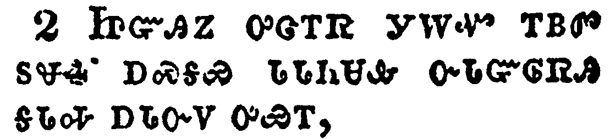</a></td>
</tr>
<tr class="even">
<td>And when he was come out of the ship, immediately there met him out of the tombs a man with an unclean spirit,</td>
</tr>
<tr class="odd">
<td>ᏥᏳᎯᏃ ᎤᏣᎢᏒ ᎩᎳᏉ ᎢᏴᏛ ᏚᏠᏎ ᎠᏍᎦᏯ ᏓᏓᏂᏌᎲ ᏅᏓᏳᎶᏒᎯ ᎦᏓᎭ ᎠᏓᏅᏙ ᎤᏯᎢ,</td>
</tr>
<tr class="even">
<td>Tsi-yu-hi-no u-tsa-i-sv gi-la-quo i-yv-dv du-tlo-se a-s-ga-ya da-da-ni-sa-hv nv-da-yu-lo-sv-hi ga-da-ha a-da-nv-do u-ya-i,</td>
</tr>
</tbody>
</table>

<table>
<tbody>
<tr class="odd">
<td><a href="020503.png">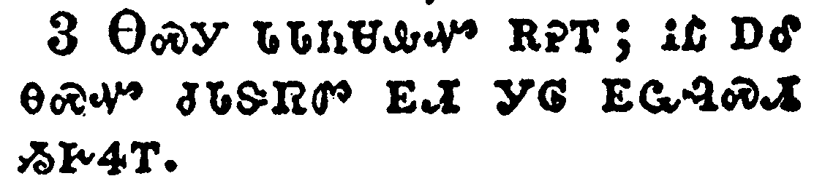</a></td>
</tr>
<tr class="even">
<td>Who had his dwelling among the tombs; and no man could bind him, no, not with chains:</td>
</tr>
<tr class="odd">
<td>ᎾᏍᎩ ᏓᏓᏂᏌᎲᏉ ᎡᎮᎢ; ᎥᏝ ᎠᎴ ᎾᏍᏉ ᏧᏓᏕᏒᏛ ᎬᏗ ᎩᎶ ᎬᏩᎸᏍᏗ ᏱᎨᏎᎢ.</td>
</tr>
<tr class="even">
<td>Na-s-gi da-da-ni-sa-hv-quo e-he-i; v-tla a-le na-s-quo tsu-da-de-sv-dv gv-di gi-lo gv-wa-lv-s-di yi-ge-se-i.</td>
</tr>
</tbody>
</table>

<table>
<tbody>
<tr class="odd">
<td><a href="020504.png">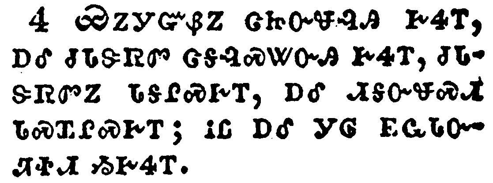</a></td>
</tr>
<tr class="even">
<td>Because that he had been often bound with fetters and chains, and the chains had been plucked asunder by him, and the fetters broken in pieces: neither could any man tame him.</td>
</tr>
<tr class="odd">
<td>ᏯᏃᎩᏳᏰᏃ ᏣᏥᏅᏠᎸᎯ ᎨᏎᎢ, ᎠᎴ ᏧᏓᏕᏒᏛ ᏣᎦᎸᏍᏔᏅᎯ ᎨᏎᎢ, ᏧᏓᏕᏒᏛᏃ ᏓᎦᎵᏍᎨᎢ, ᎠᎴ ᏗᎦᏅᏠᏍᏗ ᏓᏍᏆᎵᏍᎨᎢ; ᎥᏝ ᎠᎴ ᎩᎶ ᎬᏩᏓᏅᏘᏐᏗ ᏱᎨᏎᎢ.</td>
</tr>
<tr class="even">
<td>Ya-no-gi-yu-ye-no tsa-tsi-nv-tlo-lv-hi ge-se-i, a-le tsu-da-de-sv-dv tsa-ga-lv-s-ta-nv-hi ge-se-i, tsu-da-de-sv-dv-no da-ga-li-s-ge-i, a-le di-ga-nv-tlo-s-di da-s-qua-li-s-ge-i; v-tla a-le gi-lo gv-wa-da-nv-ti-so-di yi-ge-se-i.</td>
</tr>
</tbody>
</table>

<table>
<tbody>
<tr class="odd">
<td><a href="020505.png">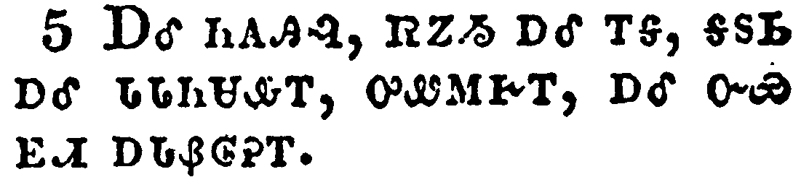</a></td>
</tr>
<tr class="even">
<td>And always, night and day, he was in the mountains, and in the tombs, crying, and cutting himself with stones.</td>
</tr>
<tr class="odd">
<td>ᎠᎴ ᏂᎪᎯᎸ, ᏒᏃᏱ ᎠᎴ ᎢᎦ, ᎦᏚᏏ ᎠᎴ ᏓᏓᏂᏌᎲᎢ, ᎤᏪᎷᎨᎢ, ᎠᎴ ᏅᏯ ᎬᏗ ᎠᏓᏰᎶᎮᎢ.</td>
</tr>
<tr class="even">
<td>A-le ni-go-hi-lv, sv-no-yi a-le i-ga, ga-du-si a-le da-da-ni-sa-hv-i, u-we-lu-ge-i, a-le nv-ya gv-di a-da-ye-lo-he-i.</td>
</tr>
</tbody>
</table>

<table>
<tbody>
<tr class="odd">
<td><a href="020506.png">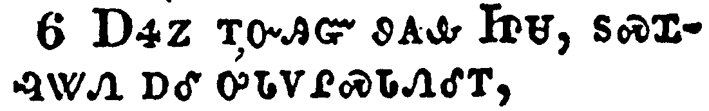</a></td>
</tr>
<tr class="even">
<td>But when he saw Jesus afar off, he ran and worshipped him,</td>
</tr>
<tr class="odd">
<td>ᎠᏎᏃ ᎢᏅᎯᏳ ᏭᎪᎲ ᏥᏌ, ᏚᏍᏆᎸᏔᏁ ᎠᎴ ᎤᏓᏙᎵᏍᏓᏁᎴᎢ,</td>
</tr>
<tr class="even">
<td>A-se-no i-nv-hi-yu wu-go-hv Tsi-sa, du-s-qua-lv-ta-ne a-le u-da-do-li-s-da-ne-le-i,</td>
</tr>
</tbody>
</table>

<table>
<tbody>
<tr class="odd">
<td><a href="020507.png">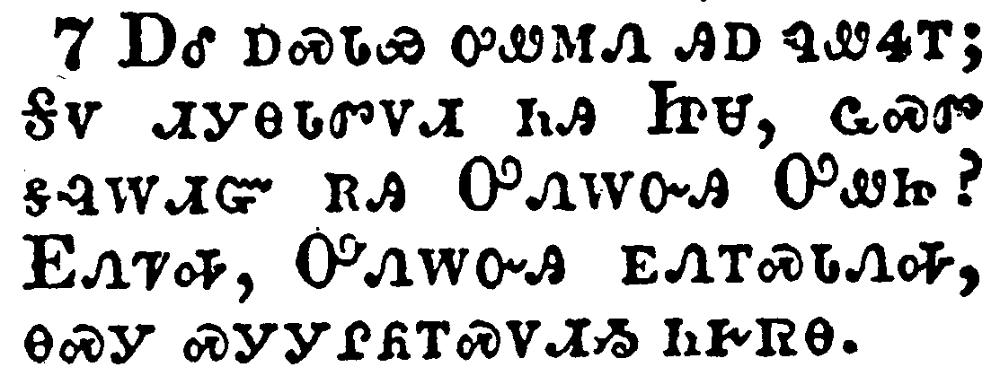</a></td>
</tr>
<tr class="even">
<td>And cried with a loud voice, and said, What have I to do with thee, Jesus, thou Son of the most high God? I adjure thee by God, that thou torment me not.</td>
</tr>
<tr class="odd">
<td>ᎠᎴ ᎠᏍᏓᏯ ᎤᏪᎷᏁ ᎯᎠ ᏄᏪᏎᎢ; ᎦᏙ ᏗᎩᎾᏓᏛᏙᏗ ᏂᎯ ᏥᏌ, ᏩᏍᏛ ᎦᎸᎳᏗᏳ ᎡᎯ ᎤᏁᎳᏅᎯ ᎤᏪᏥ? ᎬᏁᏤᎭ, ᎤᏁᎳᏅᎯ ᎬᏁᎢᏍᏓᏁᎭ, ᎾᏍᎩ ᏍᎩᎩᎵᏲᎢᏍᏙᏗᏱ ᏂᎨᏒᎾ.</td>
</tr>
<tr class="even">
<td>A-le a-s-da-ya u-we-lu-ne hi-a nu-we-se-i; Ga-do di-gi-na-da-dv-do-di ni-hi Tsi-sa, wa-s-dv ga-lv-la-di-yu e-hi U-ne-la-nv-hi U-we-tsi? Gv-ne-tse-ha, U-ne-la-nv-hi gv-ne-i-s-da-ne-ha, na-s-gi s-gi-gi-li-yo-i-s-do-di-yi ni-ge-sv-na.</td>
</tr>
</tbody>
</table>

<table>
<tbody>
<tr class="odd">
<td><a href="020508.png">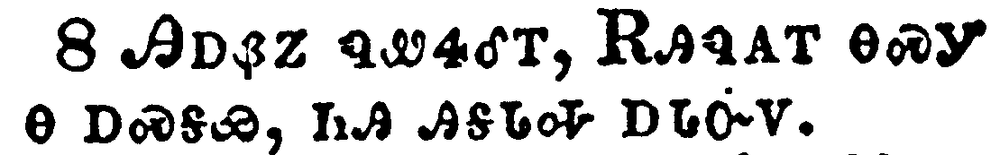</a></td>
</tr>
<tr class="even">
<td>For he said unto him, Come out of the man, thou unclean spirit.</td>
</tr>
<tr class="odd">
<td>ᎯᎠᏰᏃ ᏄᏪᏎᎴᎢ, ᎡᎯᏄᎪᎢ ᎾᏍᎩ Ꮎ ᎠᏍᎦᏯ, ᏂᎯ ᎯᎦᏓᎭ ᎠᏓᏅᏙ.</td>
</tr>
<tr class="even">
<td>Hi-a-ye-no nu-we-se-le-i, E-hi-nu-go-i na-s-gi na a-s-ga-ya, ni-hi hi-ga-da-ha a-da-nv-do.</td>
</tr>
</tbody>
</table>

<table>
<tbody>
<tr class="odd">
<td><a href="020509.png">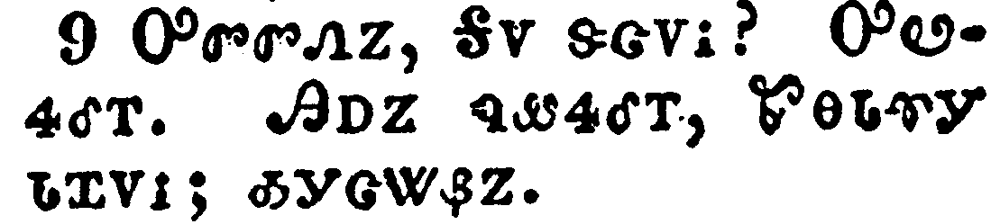</a></td>
</tr>
<tr class="even">
<td>And he asked him, What is thy name? And he answered, saying, My name is Legion: for we are many.</td>
</tr>
<tr class="odd">
<td>ᎤᏛᏛᏁᏃ, ᎦᏙ ᏕᏣᏙᎥ? ᎤᏬᏎᎴᎢ. ᎯᎠᏃ ᏄᏪᏎᎴᎢ, ᏑᎾᏓᏡᎩ ᏓᏆᏙᎥ; ᎣᎩᏣᏔᏰᏃ.</td>
</tr>
<tr class="even">
<td>U-dv-dv-ne-no, Ga-do de-tsa-do-v? U-wo-se-le-i. Hi-a-no nu-we-se-le-i, Su-na-da-tlu-gi da-qua-do-v; o-gi-tsa-ta-ye-no.</td>
</tr>
</tbody>
</table>

<table>
<tbody>
<tr class="odd">
<td></td>
</tr>
<tr class="even">
<td>And he besought him much that he would not send them away out of the country.</td>
</tr>
<tr class="odd">
<td>ᎠᎴ ᎤᏣᏘ ᎤᏍᏗᏰᏔᏁ ᎾᎿᎭᎨᏒ ᏧᏄᎪᏫᏍᏗᏱ ᏂᎨᏒᎾ ᎨᏒᎢ.</td>
</tr>
<tr class="even">
<td>A-le u-tsa-ti u-s-di-ye-ta-ne na-hna ge-sv tsu-nu-go-wi-s-di-yi ni-ge-sv-na ge-sv-i.</td>
</tr>
</tbody>
</table>

<table>
<tbody>
<tr class="odd">
<td><a href="020511.png">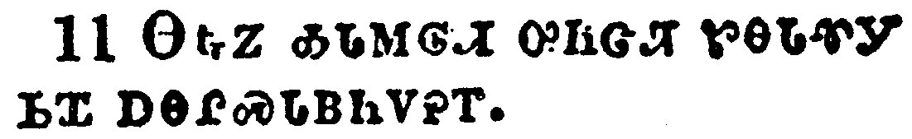</a></td>
</tr>
<tr class="even">
<td>Now there was there nigh unto the mountains a great herd of swine feeding.</td>
</tr>
<tr class="odd">
<td>ᎾᎿᎭᏃ ᎣᏓᎷᎶᏗ ᎤᏂᏣᏘ ᏑᎾᏓᏡᎩ ᏏᏆ ᎠᎾᎵᏍᏓᏴᏂᏙᎮᎢ.</td>
</tr>
<tr class="even">
<td>Na-hna-no o-da-lu-lo-di u-ni-tsa-ti su-na-da-tlu-gi si-qua a-na-li-s-da-yv-ni-do-he-i.</td>
</tr>
</tbody>
</table>

<table>
<tbody>
<tr class="odd">
<td><a href="020512.png">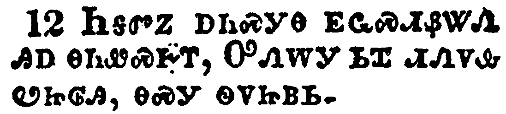</a></td>
</tr>
<tr class="even">
<td>And all the devils besought him, saying, Send us into the swine, that we may enter into them.</td>
</tr>
<tr class="odd">
<td>ᏂᎦᏛᏃ ᎠᏂᏍᎩᎾ ᎬᏩᏍᏗᏰᏔᏁ ᎯᎠ ᎾᏂᏪᏍᎨᎢ, ᎤᏁᎳᎩ ᏏᏆ ᏗᏁᏙᎲ ᏬᏥᎶᎯ, ᎾᏍᎩ ᏫᏙᏥᏴᏏ.</td>
</tr>
<tr class="even">
<td>Ni-ga-dv-no a-ni-s-gi-na gv-wa-s-di-ye-ta-ne hi-a na-ni-we-s-ge-i, U-ne-la-gi si-qua di-ne-do-hv wo-tsi-lo-hi, na-s-gi wi-do-tsi-yv-si.</td>
</tr>
</tbody>
</table>

<table>
<tbody>
<tr class="odd">
<td><a href="020513.png">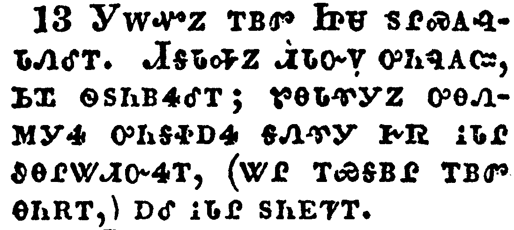</a></td>
</tr>
<tr class="even">
<td>And forthwith Jesus gave them leave. And the unclean spirits went out, and entered into the swine: and the herd ran violently down a steep place into the sea, (they were about two thousand;) and were choked in the sea.</td>
</tr>
<tr class="odd">
<td>ᎩᎳᏉᏃ ᎢᏴᏛ ᏥᏌ ᏚᎵᏍᎪᎸᏓᏁᎴᎢ. ᏗᎦᏓᎭᏃ ᏗᏓᏅᏙ ᎤᏂᏄᎪᏨ, ᏏᏆ ᏫᏚᏂᏴᏎᎴᎢ; ᏑᎾᏓᏡᎩᏃ ᎤᎾᏁᎷᎩᏎ ᎤᏂᎦᏐᎠᏎ ᎦᏁᏡᎩ ᎨᏒ ᎥᏓᎵ ᏭᎾᎵᏔᏗᏅᏎᎢ, (ᏔᎵ ᎢᏯᎦᏴᎵ ᎢᏴᏛ ᎾᏂᎡᎢ,) ᎠᎴ ᎥᏓᎵ ᏚᏂᎬᏤᎢ.</td>
</tr>
<tr class="even">
<td>Gi-la-quo-no i-yv-dv Tsi-sa du-li-s-go-lv-da-ne-le-i. Di-ga-da-ha-no di-da-nv-do u-ni-nu-go-tsv, si-qua wi-du-ni-yv-se-le-i; su-na-da-tlu-gi-no u-na-ne-lu-gi-se u-ni-ga-so-a-se ga-ne-tlu-gi ge-sv v-da-li wu-na-li-ta-di-nv-se-i, (ta-li i-ya-ga-yv-li i-yv-dv na-ni-e-i,) a-le v-da-li du-ni-gv-tse-i.</td>
</tr>
</tbody>
</table>

<table>
<tbody>
<tr class="odd">
<td><a href="020514.png">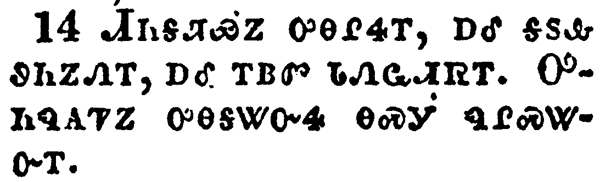</a></td>
</tr>
<tr class="even">
<td>And they that fed the swine fled, and told it in the city, and in the country. And they went out to see what it was that was done.</td>
</tr>
<tr class="odd">
<td>ᏗᏂᎦᏘᏯᏃ ᎤᎾᎵᏎᎢ, ᎠᎴ ᎦᏚᎲ ᏭᏂᏃᏁᎢ, ᎠᎴ ᎢᏴᏛ ᏓᏁᏩᏗᏒᎢ. ᎤᏂᏄᎪᏤᏃ ᎤᎾᎦᏔᏅᏎ ᎾᏍᎩ ᏄᎵᏍᏔᏅᎢ.</td>
</tr>
<tr class="even">
<td>Di-ni-ga-ti-ya-no u-na-li-se-i, a-le ga-du-hv wu-ni-no-ne-i, a-le i-yv-dv da-ne-wa-di-sv-i. U-ni-nu-go-tse-no u-na-ga-ta-nv-se na-s-gi nu-li-s-ta-nv-i.</td>
</tr>
</tbody>
</table>

<table>
<tbody>
<tr class="odd">
<td><a href="020515.png">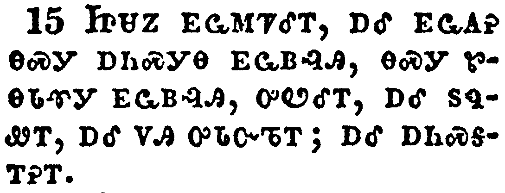</a></td>
</tr>
<tr class="even">
<td>And they come to Jesus, and see him that was possessed with the devil, and had the legion, sitting, and clothed, and in his right mind: and they were afraid.</td>
</tr>
<tr class="odd">
<td>ᏥᏌᏃ ᎬᏩᎷᏤᎴᎢ, ᎠᎴ ᎬᏩᎪᎮ ᎾᏍᎩ ᎠᏂᏍᎩᎾ ᎬᏩᏴᎸᎯ, ᎾᏍᎩ ᏑᎾᏓᏡᎩ ᎬᏩᏴᎸᎯ, ᎤᏬᎴᎢ, ᎠᎴ ᏚᏄᏪᎢ, ᎠᎴ ᏙᎯ ᎤᏓᏅᏖᎢ; ᎠᎴ ᎠᏂᏍᎦᎢᎮᎢ.</td>
</tr>
<tr class="even">
<td>Tsi-sa-no gv-wa-lu-tse-le-i, a-le gv-wa-go-he na-s-gi a-ni-s-gi-na gv-wa-yv-lv-hi, na-s-gi su-na-da-tlu-gi gv-wa-yv-lv-hi, u-wo-le-i, a-le du-nu-we-i, a-le do-hi u-da-nv-te-i; a-le a-ni-s-ga-i-he-i.</td>
</tr>
</tbody>
</table>

<table>
<tbody>
<tr class="odd">
<td><a href="020516.png">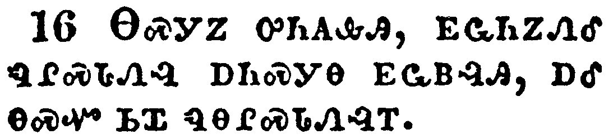</a></td>
</tr>
<tr class="even">
<td>And they that saw it told them how it befell to him that was possessed with the devil, and also concerning the swine.</td>
</tr>
<tr class="odd">
<td>ᎾᏍᎩᏃ ᎤᏂᎪᎲᎯ, ᎬᏩᏂᏃᏁᎴ ᏄᎵᏍᏓᏁᎸ ᎠᏂᏍᎩᎾ ᎬᏩᏴᎸᎯ, ᎠᎴ ᎾᏍᏉ ᏏᏆ ᏄᎾᎵᏍᏓᏁᎸᎢ.</td>
</tr>
<tr class="even">
<td>Na-s-gi-no u-ni-go-hv-hi, gv-wa-ni-no-ne-le nu-li-s-da-ne-lv a-ni-s-gi-na gv-wa-yv-lv-hi, a-le na-s-quo si-qua nu-na-li-s-da-ne-lv-i.</td>
</tr>
</tbody>
</table>

<table>
<tbody>
<tr class="odd">
<td><a href="020517.png">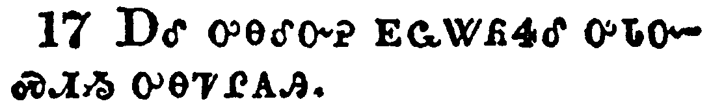</a></td>
</tr>
<tr class="even">
<td>And they began to pray him to depart out of their coasts.</td>
</tr>
<tr class="odd">
<td>ᎠᎴ ᎤᎾᎴᏅᎮ ᎬᏩᏔᏲᏎᎴ ᎤᏓᏅᏍᏗᏱ ᎤᎾᏤᎵᎪᎯ.</td>
</tr>
<tr class="even">
<td>A-le u-na-le-nv-he gv-wa-ta-yo-se-le u-da-nv-s-di-yi u-na-tse-li-go-hi.</td>
</tr>
</tbody>
</table>

<table>
<tbody>
<tr class="odd">
<td><a href="020518.png">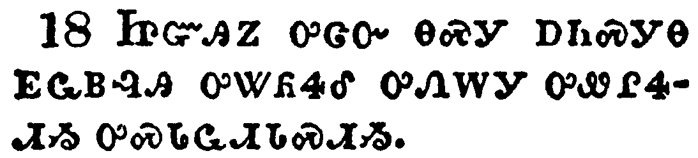</a></td>
</tr>
<tr class="even">
<td>And when he was come into the ship, he that had been possessed with the devil prayed him that he might be with him.</td>
</tr>
<tr class="odd">
<td>ᏥᏳᎯᏃ ᎤᏣᏅ ᎾᏍᎩ ᎠᏂᏍᎩᎾ ᎬᏩᏴᎸᎯ ᎤᏔᏲᏎᎴ ᎤᏁᎳᎩ ᎤᏪᎵᏎᏗᏱ ᎤᏍᏓᏩᏗᏓᏍᏗᏱ.</td>
</tr>
<tr class="even">
<td>Tsi-yu-hi-no u-tsa-nv na-s-gi a-ni-s-gi-na gv-wa-yv-lv-hi u-ta-yo-se-le u-ne-la-gi u-we-li-se-di-yi u-s-da-wa-di-da-s-di-yi.</td>
</tr>
</tbody>
</table>

<table>
<tbody>
<tr class="odd">
<td><a href="020519.png">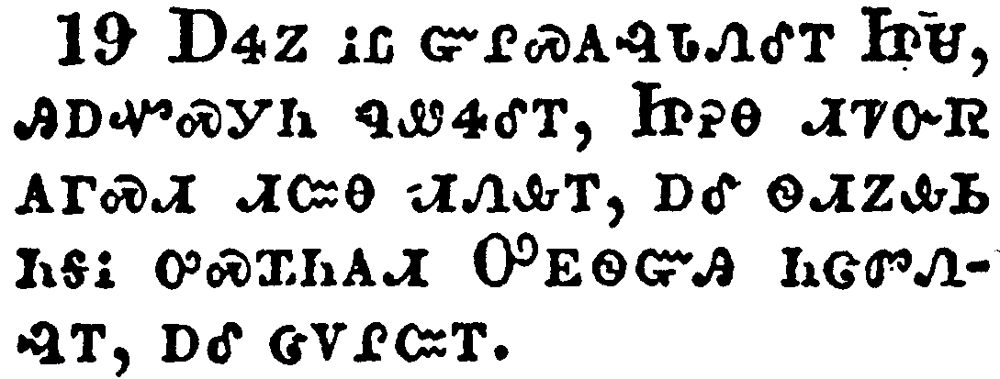</a></td>
</tr>
<tr class="even">
<td>Howbeit Jesus suffered him not, but saith unto him, Go home to thy friends, and tell them how great things the Lord hath done for thee, and hath had compassion on thee.</td>
</tr>
<tr class="odd">
<td>ᎠᏎᏃ ᎥᏝ ᏳᎵᏍᎪᎸᏓᏁᎴᎢ ᏥᏌ, ᎯᎠᏉᏍᎩᏂ ᏄᏪᏎᎴᎢ, ᏥᎮᎾ ᏗᏤᏅᏒ ᎪᎱᏍᏗ ᏗᏨᎾ ᏗᏁᎲᎢ, ᎠᎴ ᏫᏗᏃᎲᏏ ᏂᎦᎥ ᎤᏍᏆᏂᎪᏗ ᎤᎬᏫᏳᎯ ᏂᏣᏛᏁᎸᎢ, ᎠᎴ ᏣᏙᎵᏨᎢ.</td>
</tr>
<tr class="even">
<td>A-se-no v-tla yu-li-s-go-lv-da-ne-le-i Tsi-sa, hi-a-quo-s-gi-ni nu-we-se-le-i, Tsi-he-na di-tse-nv-sv go-hu-s-di di-tsv-na di-ne-hv-i, a-le wi-di-no-hv-si ni-ga-v u-s-qua-ni-go-di U-gv-wi-yu-hi ni-tsa-dv-ne-lv-i, a-le tsa-do-li-tsv-i.</td>
</tr>
</tbody>
</table>

<table>
<tbody>
<tr class="odd">
<td><a href="020520.png">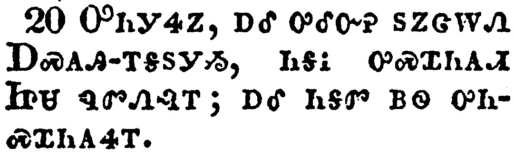</a></td>
</tr>
<tr class="even">
<td>And he departed, and began to publish in Decapolis how great things Jesus had done for him: and all men did marvel.</td>
</tr>
<tr class="odd">
<td>ᎤᏂᎩᏎᏃ, ᎠᎴ ᎤᎴᏅᎮ ᏚᏃᏣᎳᏁ ᎠᏍᎪᎯ-ᎢᎦᏚᎩᏱ, ᏂᎦᎥ ᎤᏍᏆᏂᎪᏗ ᏥᏌ ᏄᏛᏁᎸᎢ; ᎠᎴ ᏂᎦᏛ ᏴᏫ ᎤᏂᏍᏆᏂᎪᏎᎢ.</td>
</tr>
<tr class="even">
<td>U-ni-gi-se-no, a-le u-le-nv-he du-no-tsa-la-ne A-s-go-hi--i-ga-du-gi-yi, ni-ga-v u-s-qua-ni-go-di Tsi-sa nu-dv-ne-lv-i; a-le ni-ga-dv yv-wi u-ni-s-qua-ni-go-se-i.</td>
</tr>
</tbody>
</table>

<table>
<tbody>
<tr class="odd">
<td><a href="020521.png">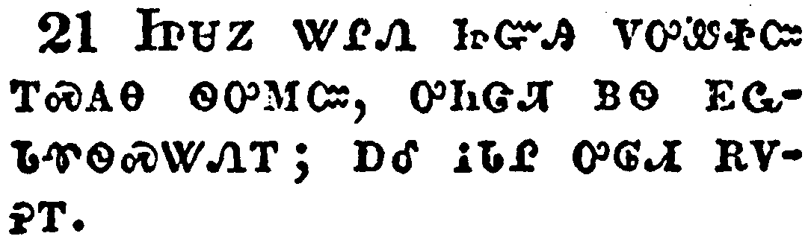</a></td>
</tr>
<tr class="even">
<td>And when Jesus was passed over again by ship unto the other side, much people gathered unto him: and he was nigh unto the sea.</td>
</tr>
<tr class="odd">
<td>ᏥᏌᏃ ᏔᎵᏁ ᏥᏳᎯ ᏙᎤᏪᏐᏨ ᎢᏍᎪᎾ ᏫᎤᎷᏨ, ᎤᏂᏣᏘ ᏴᏫ ᎬᏩᏓᏡᏫᏍᏔᏁᎢ; ᎠᎴ ᎥᏓᎵ ᎤᎶᏗ ᎡᏙᎮᎢ.</td>
</tr>
<tr class="even">
<td>Tsi-sa-no ta-li-ne tsi-yu-hi do-u-we-so-tsv i-s-go-na wi-u-lu-tsv, u-ni-tsa-ti yv-wi gv-wa-da-tlu-wi-s-ta-ne-i; a-le v-da-li u-lo-di e-do-he-i.</td>
</tr>
</tbody>
</table>

<table>
<tbody>
<tr class="odd">
<td><a href="020522.png">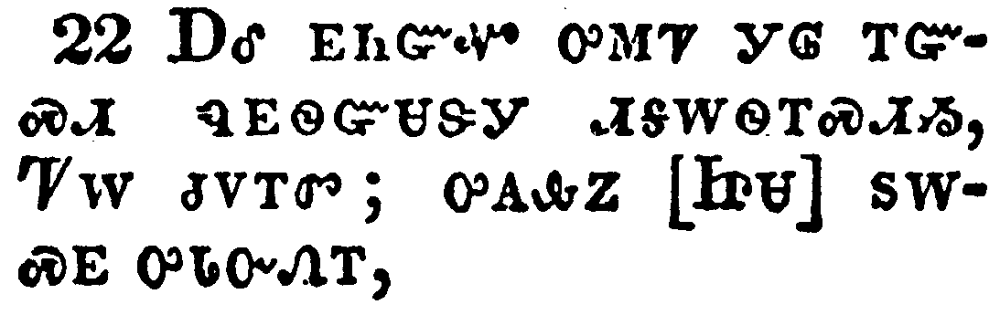</a></td>
</tr>
<tr class="even">
<td>And, behold, there cometh one of the rulers of the synagogue, Jairus by name; and when he saw him, he fell at his feet,</td>
</tr>
<tr class="odd">
<td>ᎠᎴ ᎬᏂᏳᏉ ᎤᎷᏤ ᎩᎶ ᎢᏳᏍᏗ ᏄᎬᏫᏳᏌᏕᎩ ᏗᎦᎳᏫᎢᏍᏗᏱ, ᏤᎳ ᏧᏙᎢᏛ; ᎤᎪᎲᏃ [ᏥᏌ] ᏚᎳᏍᎬ ᎤᏓᏅᏁᎢ,</td>
</tr>
<tr class="even">
<td>A-le gv-ni-yu-quo u-lu-tse gi-lo i-yu-s-di nu-gv-wi-yu-sa-de-gi di-ga-la-wi-i-s-di-yi, Tse-la tsu-do-i-dv; u-go-hv-no [Tsi-sa] du-la-s-gv u-da-nv-ne-i,</td>
</tr>
</tbody>
</table>

<table>
<tbody>
<tr class="odd">
<td><a href="020523.png">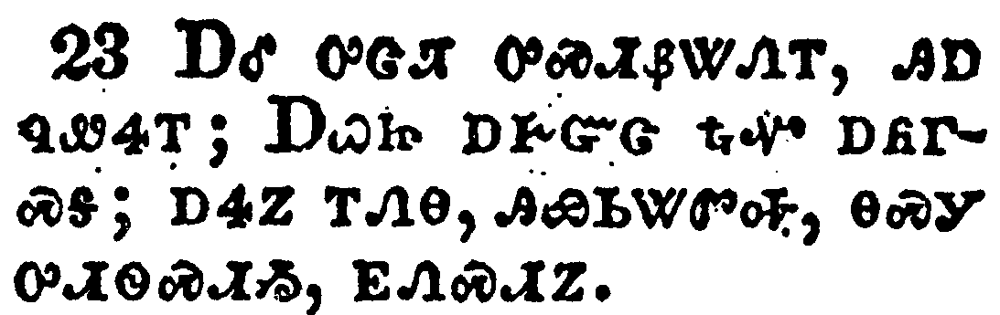</a></td>
</tr>
<tr class="even">
<td>And besought him greatly, saying, My little daughter lieth at the point of death: I pray thee, come and lay thy hands on her, that she may be healed; and she shall live.</td>
</tr>
<tr class="odd">
<td>ᎠᎴ ᎤᏣᏘ ᎤᏍᏗᏰᏔᏁᎢ, ᎯᎠ ᏄᏪᏎᎢ; ᎠᏇᏥ ᎠᎨᏳᏣ ᎿᎭᏉ ᎠᏲᎱᏍᎦ; ᎠᏎᏃ ᎢᏁᎾ, ᎯᏯᏏᏔᏛᎭ, ᎾᏍᎩ ᎤᏗᏫᏍᏗᏱ, ᎬᏁᏍᏗᏃ.</td>
</tr>
<tr class="even">
<td>A-le u-tsa-ti u-s-di-ye-ta-ne-i, hi-a nu-we-se-i; A-que-tsi a-ge-yu-tsa hna-quo a-yo-hu-s-ga; a-se-no i-ne-na, hi-ya-si-ta-dv-ha, na-s-gi u-di-wi-s-di-yi, gv-ne-s-di-no.</td>
</tr>
</tbody>
</table>

<table>
<tbody>
<tr class="odd">
<td><a href="020524.png">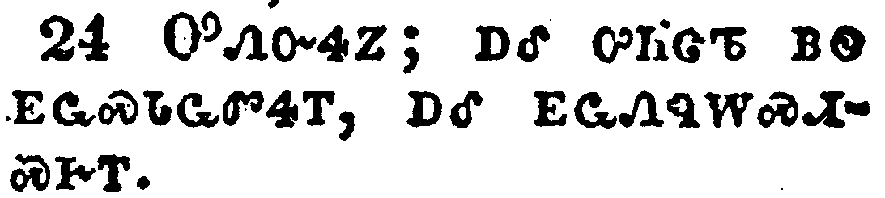</a></td>
</tr>
<tr class="even">
<td>And Jesus went with him; and much people followed him, and thronged him.</td>
</tr>
<tr class="odd">
<td>ᎤᏁᏅᏎᏃ; ᎠᎴ ᎤᏂᏣᏖ ᏴᏫ ᎬᏩᏍᏓᏩᏛᏎᎢ, ᎠᎴ ᎬᏩᏁᏄᎳᏍᏗᏍᎨᎢ.</td>
</tr>
<tr class="even">
<td>U-ne-nv-se-no; a-le u-ni-tsa-te yv-wi gv-wa-s-da-wa-dv-se-i, a-le gv-wa-ne-nu-la-s-di-s-ge-i.</td>
</tr>
</tbody>
</table>

<table>
<tbody>
<tr class="odd">
<td><a href="020525.png">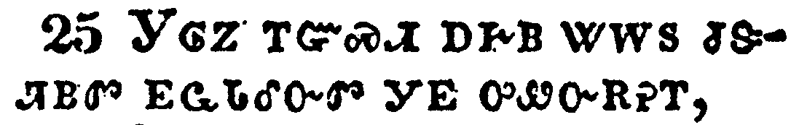</a></td>
</tr>
<tr class="even">
<td>And a certain woman, which had an issue of blood twelve years,</td>
</tr>
<tr class="odd">
<td>ᎩᎶᏃ ᎢᏳᏍᏗ ᎠᎨᏴ ᏔᎳᏚ ᏧᏕᏘᏴᏛ ᎬᏩᏓᎴᏅᏛ ᎩᎬ ᎤᏪᏅᎡᎮᎢ,</td>
</tr>
<tr class="even">
<td>Gi-lo-no i-yu-s-di a-ge-yv ta-la-du tsu-de-ti-yv-dv gv-wa-da-le-nv-dv gi-gv u-we-nv-e-he-i,</td>
</tr>
</tbody>
</table>

<table>
<tbody>
<tr class="odd">
<td><a href="020526.png">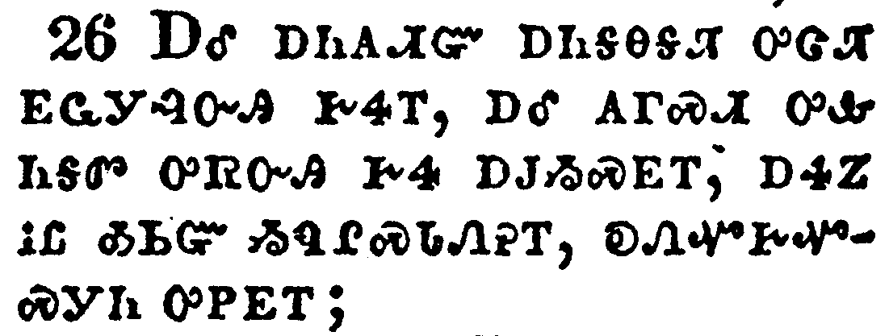</a></td>
</tr>
<tr class="even">
<td>And had suffered many things of many physicians, and had spent all that she had, and was nothing bettered, but rather grew worse,</td>
</tr>
<tr class="odd">
<td>ᎠᎴ ᎠᏂᎪᏗᏳ ᎠᏂᎦᎾᎦᏘ ᎤᏣᏘ ᎬᏩᎩᎸᏅᎯ ᎨᏎᎢ, ᎠᎴ ᎪᎱᏍᏗ ᎤᎲ ᏂᎦᏛ ᎤᏒᏅᎯ ᎨᏎ ᎠᎫᏱᏍᎬᎢ, ᎠᏎᏃ ᎥᏝ ᎣᏏᏳ ᏱᏄᎵᏍᏓᏁᎮᎢ, ᎧᏁᏉᎨᏉᏍᎩᏂ ᎤᏢᎬᎢ;</td>
</tr>
<tr class="even">
<td>A-le a-ni-go-di-yu a-ni-ga-na-ga-ti u-tsa-ti gv-wa-gi-lv-nv-hi ge-se-i, a-le go-hu-s-di u-hv ni-ga-dv u-sv-nv-hi ge-se a-gu-yi-s-gv-i, a-se-no v-tla o-si-yu yi-nu-li-s-da-ne-he-i, ka-ne-quo-ge-quo-s-gi-ni u-tlv-gv-i;</td>
</tr>
</tbody>
</table>

<table>
<tbody>
<tr class="odd">
<td><a href="020527.png">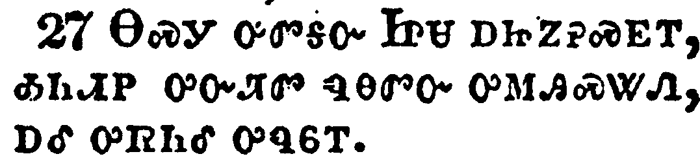</a></td>
</tr>
<tr class="even">
<td>When she had heard of Jesus, came in the press behind, and touched his garment.</td>
</tr>
<tr class="odd">
<td>ᎾᏍᎩ ᎤᏛᎦᏅ ᏥᏌ ᎠᏥᏃᎮᏍᎬᎢ, ᎣᏂᏗᏢ ᎤᏅᏘᏛ ᏄᎾᏛᏅ ᎤᎷᎯᏍᏔᏁ, ᎠᎴ ᎤᏒᏂᎴ ᎤᏄᏮᎢ.</td>
</tr>
<tr class="even">
<td>Na-s-gi u-dv-ga-nv Tsi-sa a-tsi-no-he-s-gv-i, o-ni-di-tlv u-nv-ti-dv nu-na-dv-nv u-lu-hi-s-ta-ne, a-le u-sv-ni-le u-nu-wv-i.</td>
</tr>
</tbody>
</table>

<table>
<tbody>
<tr class="odd">
<td><a href="020528.png">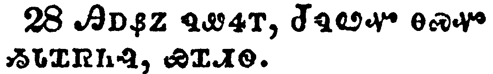</a></td>
</tr>
<tr class="even">
<td>For she said, If I may touch but his clothes, I shall be whole.</td>
</tr>
<tr class="odd">
<td>ᎯᎠᏰᏃ ᏄᏪᏎᎢ, ᏧᏄᏬᏉ ᎾᏍᏉ ᏱᏓᏆᏒᏂᎸ, ᏯᏆᏗᏫ.</td>
</tr>
<tr class="even">
<td>Hi-a-ye-no nu-we-se-i, Tsu-nu-wo-quo na-s-quo yi-da-qua-sv-ni-lv, ya-qua-di-wi.</td>
</tr>
</tbody>
</table>

<table>
<tbody>
<tr class="odd">
<td><a href="020529.png">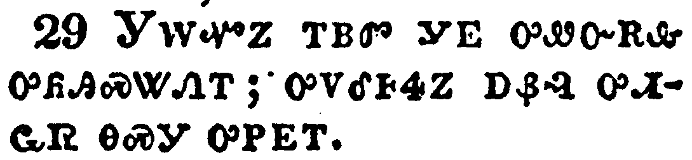</a></td>
</tr>
<tr class="even">
<td>And straightway the fountain of her blood was dried up; and she felt in her body that she was healed of that plague.</td>
</tr>
<tr class="odd">
<td>ᎩᎳᏉᏃ ᎢᏴᏛ ᎩᎬ ᎤᏪᏅᎡᎲ ᎤᏲᎯᏍᏔᏁᎢ; ᎤᏙᎴᎰᏎᏃ ᎠᏰᎸ ᎤᏗᏩᏒ ᎾᏍᎩ ᎤᏢᎬᎢ.</td>
</tr>
<tr class="even">
<td>Gi-la-quo-no i-yv-dv gi-gv u-we-nv-e-hv u-yo-hi-s-ta-ne-i; u-do-le-ho-se-no a-ye-lv u-di-wa-sv na-s-gi u-tlv-gv-i.</td>
</tr>
</tbody>
</table>

<table>
<tbody>
<tr class="odd">
<td><a href="020530.png">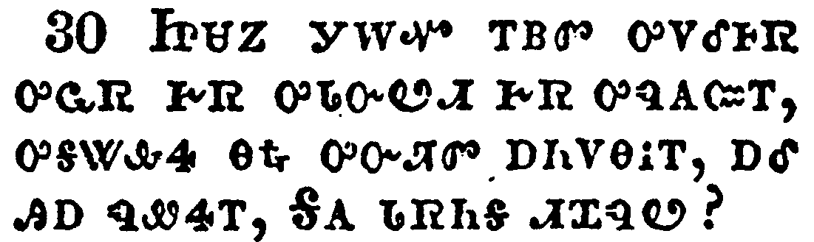</a></td>
</tr>
<tr class="even">
<td>And Jesus, immediately knowing in himself that virtue had gone out of him, turned him about in the press, and said, Who touched my clothes?</td>
</tr>
<tr class="odd">
<td>ᏥᏌᏃ ᎩᎳᏉ ᎢᏴᏛ ᎤᏙᎴᎰᏒ ᎤᏩᏒ ᎨᏒ ᎤᏓᏅᏬᏗ ᎨᏒ ᎤᏄᎪᏨᎢ, ᎤᎦᏔᎲᏎ ᎾᎿᎭᎤᏅᏘᏛ ᎠᏂᏙᎾᎥᎢ, ᎠᎴ ᎯᎠ ᏄᏪᏎᎢ, ᎦᎪ ᏓᏒᏂᎦ ᏗᏆᏄᏬ?</td>
</tr>
<tr class="even">
<td>Tsi-sa-no gi-la-quo i-yv-dv u-do-le-ho-sv u-wa-sv ge-sv u-da-nv-wo-di ge-sv u-nu-go-tsv-i, u-ga-ta-hv-se na-hna u-nv-ti-dv a-ni-do-na-v-i, a-le hi-a nu-we-se-i, Ga-go da-sv-ni-ga di-qua-nu-wo?</td>
</tr>
</tbody>
</table>

<table>
<tbody>
<tr class="odd">
<td><a href="020531.png">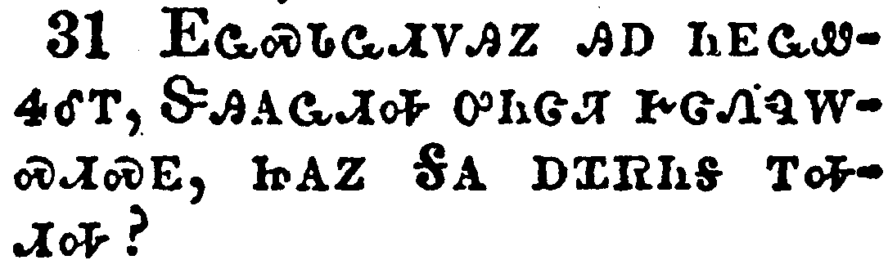</a></td>
</tr>
<tr class="even">
<td>And his disciples said unto him, Thou seest the multitude thronging thee, and sayest thou, Who touched me?</td>
</tr>
<tr class="odd">
<td>ᎬᏩᏍᏓᏩᏗᏙᎯᏃ ᎯᎠ ᏂᎬᏩᏪᏎᎴᎢ, ᏕᎩᎪᏩᏗᎭ ᎤᏂᏣᏘ ᎨᏣᏁᏄᎳᏍᏗᏍᎬ, ᏥᎪᏃ ᎦᎪ ᎠᏆᏒᏂᎦ ᎢᎭᏗᎭ?</td>
</tr>
<tr class="even">
<td>Gv-wa-s-da-wa-di-do-hi-no hi-a ni-gv-wa-we-se-le-i, De-gi-go-wa-di-ha u-ni-tsa-ti ge-tsa-ne-nu-la-s-di-s-gv, tsi-go-no Ga-go a-qua-sv-ni-ga i-ha-di-ha?</td>
</tr>
</tbody>
</table>

<table>
<tbody>
<tr class="odd">
<td><a href="020532.png">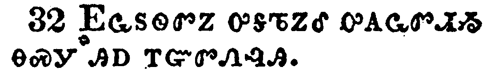</a></td>
</tr>
<tr class="even">
<td>And he looked round about to see her that had done this thing.</td>
</tr>
<tr class="odd">
<td>ᎬᏩᏚᏫᏛᏃ ᎤᎦᏖᏃᎴ ᎤᎪᏩᏛᏗᏱ ᎾᏍᎩ ᎯᎠ ᎢᏳᏛᏁᎸᎯ.</td>
</tr>
<tr class="even">
<td>Gv-wa-du-wi-dv-no u-ga-te-no-le u-go-wa-dv-di-yi na-s-gi hi-a i-yu-dv-ne-lv-hi.</td>
</tr>
</tbody>
</table>

<table>
<tbody>
<tr class="odd">
<td><a href="020533.png">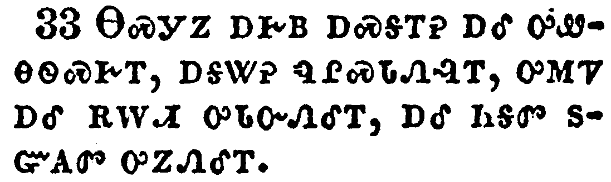</a></td>
</tr>
<tr class="even">
<td>But the woman fearing and trembling, knowing what was done in her, came and fell down before him, and told him all the truth.</td>
</tr>
<tr class="odd">
<td>ᎾᏍᎩᏃ ᎠᎨᏴ ᎠᏍᎦᎢᎮ ᎠᎴ ᎤᏪᎾᏫᏍᎨᎢ, ᎠᎦᏔᎮ ᏄᎵᏍᏓᏁᎸᎢ, ᎤᎷᏤ ᎠᎴ ᎡᎳᏗ ᎤᏓᏅᏁᎴᎢ, ᎠᎴ ᏂᎦᏛ ᏚᏳᎪᏛ ᎤᏃᏁᎴᎢ.</td>
</tr>
<tr class="even">
<td>Na-s-gi-no a-ge-yv a-s-ga-i-he a-le u-we-na-wi-s-ge-i, a-ga-ta-he nu-li-s-da-ne-lv-i, u-lu-tse a-le e-la-di u-da-nv-ne-le-i, a-le ni-ga-dv du-yu-go-dv u-no-ne-le-i.</td>
</tr>
</tbody>
</table>

<table>
<tbody>
<tr class="odd">
<td><a href="020534.png">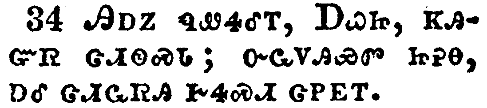</a></td>
</tr>
<tr class="even">
<td>And he said unto her, Daughter, thy faith hath made thee whole; go in peace, and be whole of thy plague.</td>
</tr>
<tr class="odd">
<td>ᎯᎠᏃ ᏄᏪᏎᎴᎢ, ᎠᏇᏥ, ᏦᎯᏳᏒ ᏣᏗᏫᏍᏓ; ᏅᏩᏙᎯᏯᏛ ᏥᎮᎾ, ᎠᎴ ᏣᏗᏩᏒᎯ ᎨᏎᏍᏗ ᏣᏢᎬᎢ.</td>
</tr>
<tr class="even">
<td>Hi-a-no nu-we-se-le-i, A-que-tsi, tso-hi-yu-sv tsa-di-wi-s-da; nv-wa-do-hi-ya-dv tsi-he-na, a-le tsa-di-wa-sv-hi ge-se-s-di tsa-tlv-gv-i.</td>
</tr>
</tbody>
</table>

<table>
<tbody>
<tr class="odd">
<td><a href="020535.png">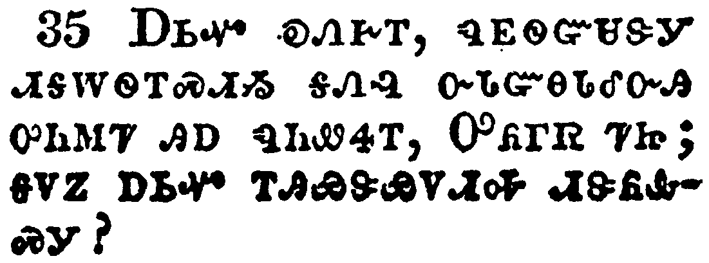</a></td>
</tr>
<tr class="even">
<td>While he yet spake, there came from the ruler of the synagogue's house certain which said, Thy daughter is dead: why troublest thou the Master any further?</td>
</tr>
<tr class="odd">
<td>ᎠᏏᏉ ᎧᏁᎨᎢ, ᏄᎬᏫᏳᏌᏕᎩ ᏗᎦᎳᏫᎢᏍᏗᏱ ᎦᏁᎸ ᏅᏓᏳᎾᏓᎴᏅᎯ ᎤᏂᎷᏤ ᎯᎠ ᏄᏂᏪᏎᎢ, ᎤᏲᎱᏒ ᏤᏥ; ᎦᏙᏃ ᎠᏏᏉ ᎢᎯᏯᏕᏯᏙᏗᎭ ᏗᏕᏲᎲᏍᎩ?</td>
</tr>
<tr class="even">
<td>A-si-quo ka-ne-ge-i, nu-gv-wi-yu-sa-de-gi di-ga-la-wi-i-s-di-yi ga-ne-lv nv-da-yu-na-da-le-nv-hi u-ni-lu-tse hi-a nu-ni-we-se-i, U-yo-hu-sv tse-tsi; ga-do-no a-si-quo i-hi-ya-de-ya-do-di-ha di-de-yo-hv-s-gi?</td>
</tr>
</tbody>
</table>

<table>
<tbody>
<tr class="odd">
<td><a href="020536.png">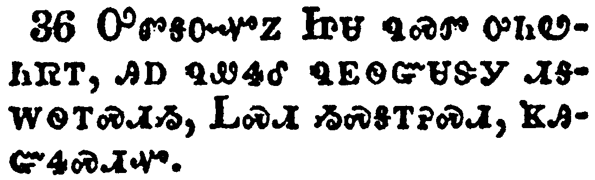</a></td>
</tr>
<tr class="even">
<td>As soon as Jesus heard the word that was spoken, he saith unto the ruler of the synagogue, Be not afraid, only believe.</td>
</tr>
<tr class="odd">
<td>ᎤᏛᎦᏅᏉᏃ ᏥᏌ ᏄᏍᏛ ᎤᏂᏬᏂᏒᎢ, ᎯᎠ ᏄᏪᏎᎴ ᏄᎬᏫᏳᏌᏕᎩ ᏗᎦᎳᏫᎢᏍᏗᏱ, ᏞᏍᏗ ᏱᏍᎦᎢᎮᏍᏗ, ᏦᎯᏳᏎᏍᏗᏉ.</td>
</tr>
<tr class="even">
<td>U-dv-ga-nv-quo-no Tsi-sa nu-s-dv u-ni-wo-ni-sv-i, hi-a nu-we-se-le nu-gv-wi-yu-sa-de-gi di-ga-la-wi-i-s-di-yi, Tle-s-di yi-s-ga-i-he-s-di, tso-hi-yu-se-s-di-quo.</td>
</tr>
</tbody>
</table>

<table>
<tbody>
<tr class="odd">
<td><a href="020537.png">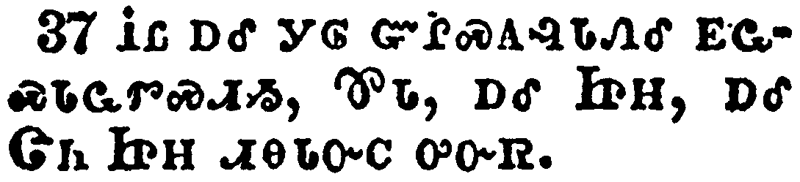</a></td>
</tr>
<tr class="even">
<td>And he suffered no man to follow him, save Peter, and James, and John the brother of James.</td>
</tr>
<tr class="odd">
<td>ᎥᏝ ᎠᎴ ᎩᎶ ᏳᎵᏍᎪᎸᏓᏁᎴ ᎬᏩᏍᏓᏩᏛᏍᏗᏱ, ᏈᏓ, ᎠᎴ ᏥᎻ, ᎠᎴ ᏣᏂ ᏥᎻ ᏗᎾᏓᏅᏟ ᎤᏅᏒ.</td>
</tr>
<tr class="even">
<td>V-tla a-le gi-lo yu-li-s-go-lv-da-ne-le gv-wa-s-da-wa-dv-s-di-yi, Qui-da, a-le Tsi-mi, a-le Tsa-ni Tsi-mi di-na-da-nv-tli u-nv-sv.</td>
</tr>
</tbody>
</table>

<table>
<tbody>
<tr class="odd">
<td><a href="020538.png">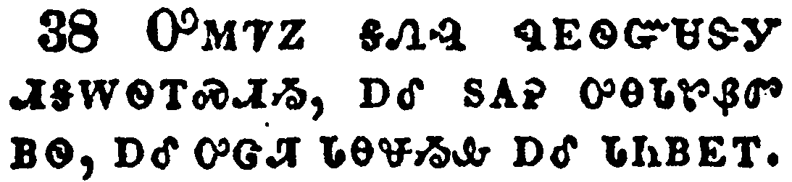</a></td>
</tr>
<tr class="even">
<td>And he cometh to the house of the ruler of the synagogue, and seeth the tumult, and them that wept and wailed greatly.</td>
</tr>
<tr class="odd">
<td>ᎤᎷᏤᏃ ᎦᏁᎸ ᏄᎬᏫᏳᏌᏕᎩ ᏗᎦᎳᏫᎢᏍᏗᏱ, ᎠᎴ ᏚᎦᎮ ᎤᎾᏓᏑᏰᏛ ᏴᏫ, ᎠᎴ ᎤᏣᏘ ᏓᎾᏠᏱᎲ ᎠᎴ ᏓᏂᏴᎬᎢ.</td>
</tr>
<tr class="even">
<td>U-lu-tse-no ga-ne-lv nu-gv-wi-yu-sa-de-gi di-ga-la-wi-i-s-di-yi, a-le du-ga-he u-na-da-su-ye-dv yv-wi, a-le u-tsa-ti da-na-tlo-yi-hv a-le da-ni-yv-gv-i.</td>
</tr>
</tbody>
</table>

<table>
<tbody>
<tr class="odd">
<td><a href="020539.png">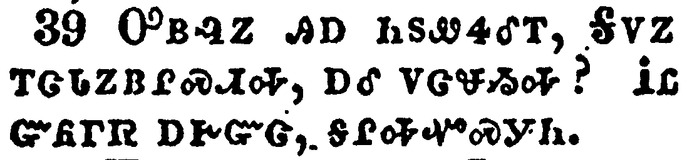</a></td>
</tr>
<tr class="even">
<td>And when he was come in, he saith unto them, Why make ye this ado, and weep? the damsel is not dead, but sleepeth.</td>
</tr>
<tr class="odd">
<td>ᎤᏰᎸᏃ ᎯᎠ ᏂᏚᏪᏎᎴᎢ, ᎦᏙᏃ ᎢᏣᏓᏃᏴᎵᏍᏗᎭ, ᎠᎴ ᏙᏣᏠᏱᎭ? ᎥᏝ ᏳᏲᎱᏒ ᎠᎨᏳᏣ, ᎦᎵᎭᏉᏍᎩᏂ.</td>
</tr>
<tr class="even">
<td>U-ye-lv-no hi-a ni-du-we-se-le-i, Ga-do-no i-tsa-da-no-yv-li-s-di-ha, a-le do-tsa-tlo-yi-ha? V-tla yu-yo-hu-sv a-ge-yu-tsa, ga-li-ha-quo-s-gi-ni.</td>
</tr>
</tbody>
</table>

<table>
<tbody>
<tr class="odd">
<td><a href="020540.png">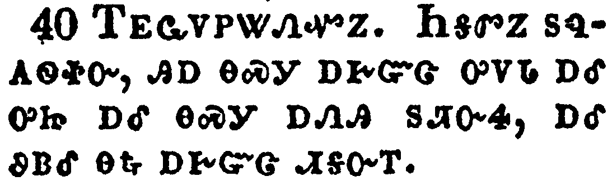</a></td>
</tr>
<tr class="even">
<td>And they laughed him to scorn. But when he had put them all out, he taketh the father and the mother of the damsel, and them that were with him, and entereth in where the damsel was lying.</td>
</tr>
<tr class="odd">
<td>ᎢᎬᏩᏙᏢᏔᏁᏉᏃ. ᏂᎦᏛᏃ ᏚᏄᎪᏫᏐᏅ, ᎯᎠ ᎾᏍᎩ ᎠᎨᏳᏣ ᎤᏙᏓ ᎠᎴ ᎤᏥ ᎠᎴ ᎾᏍᎩ ᎠᏁᎯ ᏚᏘᏅᏎ, ᎠᎴ ᏭᏴᎴ ᎾᎿᎭᎠᎨᏳᏣ ᏗᏐᏅᎢ.</td>
</tr>
<tr class="even">
<td>I-gv-wa-do-tlv-ta-ne-quo-no. Ni-ga-dv-no du-nu-go-wi-so-nv, hi-a na-s-gi a-ge-yu-tsa u-do-da a-le u-tsi a-le na-s-gi a-ne-hi du-ti-nv-se, a-le wu-yv-le na-hna a-ge-yu-tsa di-so-nv-i.</td>
</tr>
</tbody>
</table>

<table>
<tbody>
<tr class="odd">
<td><a href="020541.png">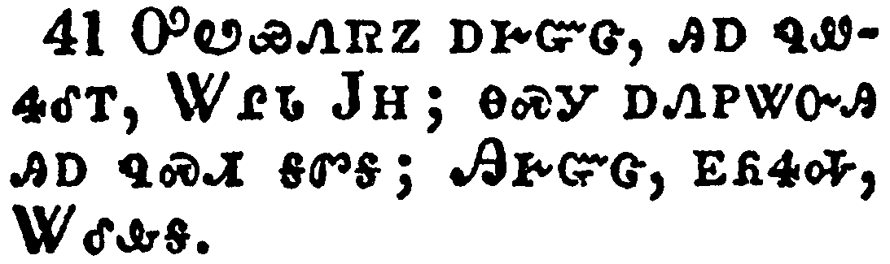</a></td>
</tr>
<tr class="even">
<td>And he took the damsel by the hand, and said unto her, Talitha cumi; which is, being interpreted, Damsel, I say unto thee, arise.</td>
</tr>
<tr class="odd">
<td>ᎤᏬᏯᏁᏒᏃ ᎠᎨᏳᏣ, ᎯᎠ ᏄᏪᏎᎴᎢ, ᏔᎵᏓ ᎫᎻ; ᎾᏍᎩ ᎠᏁᏢᏔᏅᎯ ᎯᎠ ᏄᏍᏗ ᎦᏛᎦ; ᎯᎨᏳᏣ, ᎬᏲᏎᎭ, ᏔᎴᎲᎦ.</td>
</tr>
<tr class="even">
<td>U-wo-ya-ne-sv-no a-ge-yu-tsa, hi-a nu-we-se-le-i, Ta-li-da Gu-mi; na-s-gi a-ne-tlv-ta-nv-hi hi-a nu-s-di ga-dv-ga; Hi-ge-yu-tsa, gv-yo-se-ha, Ta-le-hv-ga.</td>
</tr>
</tbody>
</table>

<table>
<tbody>
<tr class="odd">
<td><a href="020542.png">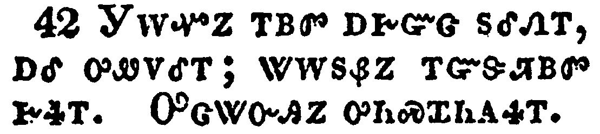</a></td>
</tr>
<tr class="even">
<td>And straightway the damsel arose, and walked; for she was of the age of twelve years. And they were astonished with a great astonishment.</td>
</tr>
<tr class="odd">
<td>ᎩᎳᏉᏃ ᎢᏴᏛ ᎠᎨᏳᏣ ᏚᎴᏁᎢ, ᎠᎴ ᎤᏪᏙᎴᎢ; ᏔᎳᏚᏰᏃ ᎢᏳᏕᏘᏴᏛ ᎨᏎᎢ. ᎤᏣᏔᏅᎯᏃ ᎤᏂᏍᏆᏂᎪᏎᎢ.</td>
</tr>
<tr class="even">
<td>Gi-la-quo-no i-yv-dv a-ge-yu-tsa du-le-ne-i, a-le u-we-do-le-i; ta-la-du-ye-no i-yu-de-ti-yv-dv ge-se-i. U-tsa-ta-nv-hi-no u-ni-s-qua-ni-go-se-i.</td>
</tr>
</tbody>
</table>

<table>
<tbody>
<tr class="odd">
<td><a href="020543.png">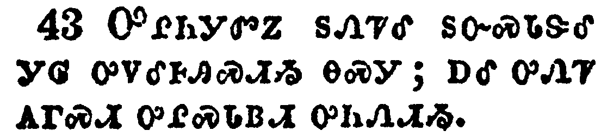</a></td>
</tr>
<tr class="even">
<td>And he charged them straitly that no man should know it; and commanded that something should be given her to eat.</td>
</tr>
<tr class="odd">
<td>ᎤᎵᏂᎩᏛᏃ ᏚᏁᏤᎴ ᏚᏅᏍᏓᏕᎴ ᎩᎶ ᎤᏙᎴᎰᎯᏍᏗᏱ ᎾᏍᎩ; ᎠᎴ ᎤᏁᏤᎪᎱᏍᏗ ᎤᎵᏍᏓᏴᏗ ᎤᏂᏁᏗᏱ.</td>
</tr>
<tr class="even">
<td>U-li-ni-gi-dv-no du-ne-tse-le du-nv-s-da-de-le gi-lo u-do-le-ho-hi-s-di-yi na-s-gi; a-le u-ne-tse-go-hu-s-di u-li-s-da-yv-di u-ni-ne-di-yi.</td>
</tr>
</tbody>
</table>

