+++
draft=false
date = 2014-12-18T21:11:07Z
title = "Mark - Chapter 15 - Cherokee New Testament"
weight = 1418955067

[taxonomies]

authors = ["Timothy Legg"]
categories = []
tags = []

[extra]
+++

<table>
<tbody>
<tr class="odd">
<td><a href="021501.png">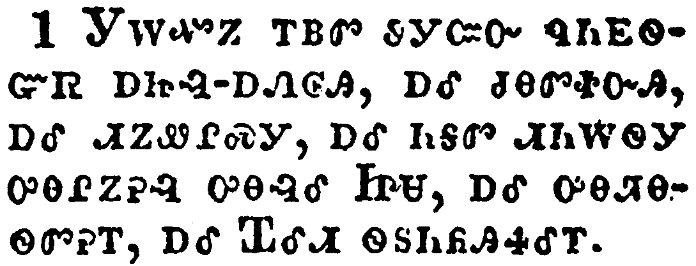</a></td>
</tr>
<tr class="even">
<td>And straightway in the morning the chief priests held a consultation with the elders and scribes and the whole council, and bound Jesus, and carried him away, and delivered him to Pilate.</td>
</tr>
<tr class="odd">
<td>ᎩᎳᏉᏃ ᎢᏴᏛ ᏭᎩᏨᏅ ᏄᏂᎬᏫᏳᏒ ᎠᏥᎸ-ᎠᏁᎶᎯ, ᎠᎴ ᏧᎾᏛᏐᏅᎯ, ᎠᎴ ᏗᏃᏪᎵᏍᎩ, ᎠᎴ ᏂᎦᏛ ᏗᏂᎳᏫᎩ ᎤᎾᎵᏃᎮᎸ ᎤᎾᎸᎴ ᏥᏌ, ᎠᎴ ᎤᎾᏘᎾᏫᏛᎮᎢ, ᎠᎴ ᏆᎴᏗ ᏫᏚᏂᏲᎯᏎᎴᎢ.</td>
</tr>
<tr class="even">
<td>Gi-la-quo-no i-yv-dv wu-gi-tsv-nv nu-ni-gv-wi-yu-sv a-tsi-lv--a-ne-lo-hi, a-le tsu-na-dv-so-nv-hi, a-le di-no-we-li-s-gi, a-le ni-ga-dv di-ni-la-wi-gi u-na-li-no-he-lv u-na-lv-le Tsi-sa, a-le u-na-ti-na-wi-dv-he-i, a-le Qua-le-di wi-du-ni-yo-hi-se-le-i.</td>
</tr>
</tbody>
</table>

<table>
<tbody>
<tr class="odd">
<td><a href="021502.png">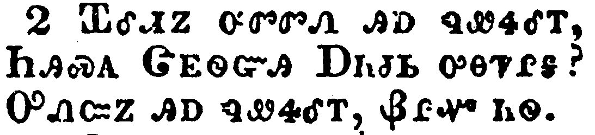</a></td>
</tr>
<tr class="even">
<td>And Pilate asked him, Art thou the King of the Jews? And he answering said unto him, Thou sayest it.</td>
</tr>
<tr class="odd">
<td>ᏆᎴᏗᏃ ᎤᏛᏛᏁ ᎯᎠ ᏄᏪᏎᎴᎢ, ᏂᎯᏍᎪ ᏣᎬᏫᏳᎯ ᎠᏂᏧᏏ ᎤᎾᏤᎵᎦ? ᎤᏁᏨᏃ ᎯᎠ ᏄᏪᏎᎴᎢ, ᏰᎵᏉ ᏂᏫ.</td>
</tr>
<tr class="even">
<td>Qua-le-di-no u-dv-dv-ne hi-a nu-we-se-le-i, Ni-hi-s-go Tsa-gv-wi-yu-hi A-ni-tsu-si u-na-tse-li-ga? U-ne-tsv-no hi-a nu-we-se-le-i, Ye-li-quo ni-wi.</td>
</tr>
</tbody>
</table>

<table>
<tbody>
<tr class="odd">
<td><a href="021503.png">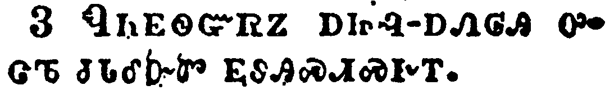</a></td>
</tr>
<tr class="even">
<td>And the chief priests accused him of many things: but he answered nothing.</td>
</tr>
<tr class="odd">
<td>ᏄᏂᎬᏫᏳᏒᏃ ᎠᏥᎸ-ᎠᏁᎶᎯ ᎤᏣᏖ ᏧᏓᎴᏅᏛ ᎬᏭᎯᏍᏗᏍᎨᎢ.</td>
</tr>
<tr class="even">
<td>Nu-ni-gv-wi-yu-sv-no a-tsi-lv--a-ne-lo-hi u-tsa-te tsu-da-le-nv-dv gv-wu-hi-s-di-s-ge-i.</td>
</tr>
</tbody>
</table>

<table>
<tbody>
<tr class="odd">
<td><a href="021504.png">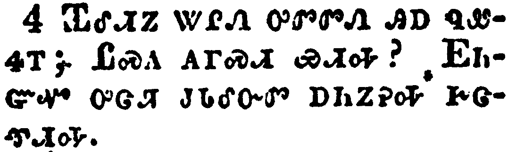</a></td>
</tr>
<tr class="even">
<td>And Pilate asked him again, saying, Answerest thou nothing? behold how many things they witness against thee.</td>
</tr>
<tr class="odd">
<td>ᏆᎴᏗᏃ ᏔᎵᏁ ᎤᏛᏛᏁ ᎯᎠ ᏄᏪᏎᎢ; ᏝᏍᎪ ᎪᎱᏍᏗ ᏯᏗᎭ? ᎬᏂᏳᏉ ᎤᏣᏘ ᏧᏓᎴᏅᏛ ᎠᏂᏃᎮᎭ ᎨᏣᏡᏗᎭ.</td>
</tr>
<tr class="even">
<td>Qua-le-di-no ta-li-ne u-dv-dv-ne hi-a nu-we-se-i; Tla-s-go go-hu-s-di ya-di-ha? Gv-ni-yu-quo u-tsa-ti tsu-da-le-nv-dv a-ni-no-he-ha ge-tsa-tlu-di-ha.</td>
</tr>
</tbody>
</table>

<table>
<tbody>
<tr class="odd">
<td><a href="021505.png">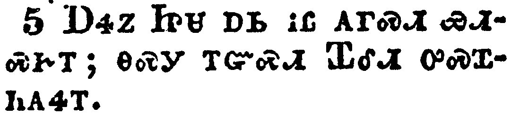</a></td>
</tr>
<tr class="even">
<td>But Jesus yet answered nothing; so that Pilate marvelled.</td>
</tr>
<tr class="odd">
<td>ᎠᏎᏃ ᏥᏌ ᎠᏏ ᎥᏝ ᎪᎱᏍᏗ ᏯᏗᏍᎨᎢ; ᎾᏍᎩ ᎢᏳᏍᏗ ᏆᎴᏗ ᎤᏍᏆᏂᎪᏎᎢ.</td>
</tr>
<tr class="even">
<td>A-se-no Tsi-sa a-si v-tla go-hu-s-di ya-di-s-ge-i; na-s-gi i-yu-s-di Qua-le-di u-s-qua-ni-go-se-i.</td>
</tr>
</tbody>
</table>

<table>
<tbody>
<tr class="odd">
<td><a href="021506.png">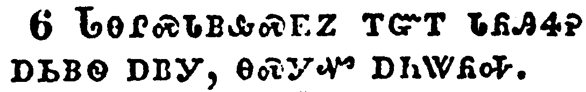</a></td>
</tr>
<tr class="even">
<td>Now at that feast he released unto them one prisoner, whomsoever they desired.</td>
</tr>
<tr class="odd">
<td>ᏓᎾᎵᏍᏓᏴᎲᏍᎬᏃ ᎢᏳᎢ ᏓᏲᎯᏎᎮ ᎠᏏᏴᏫ ᎠᏴᎩ, ᎾᏍᎩᏉ ᎠᏂᏔᏲᎭ.</td>
</tr>
<tr class="even">
<td>Da-na-li-s-da-yv-hv-s-gv-no i-yu-i da-yo-hi-se-he a-si-yv-wi a-yv-gi, na-s-gi-quo a-ni-ta-yo-ha.</td>
</tr>
</tbody>
</table>

<table>
<tbody>
<tr class="odd">
<td><a href="021507.png">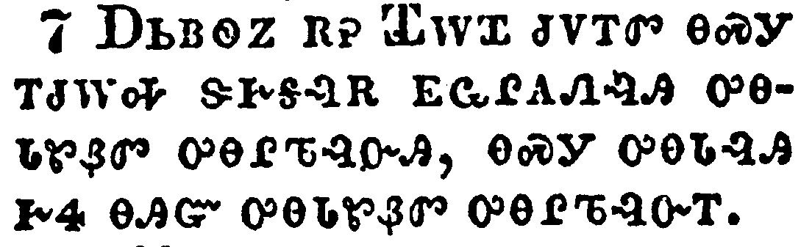</a></td>
</tr>
<tr class="even">
<td>And there was one named Barabbas, which lay bound with them that had made insurrection with him, who had committed murder in the insurrection.</td>
</tr>
<tr class="odd">
<td>ᎠᏏᏴᏫᏃ ᎡᎮ ᏆᎳᏆ ᏧᏙᎢᏛ ᎾᏍᎩ ᎢᏧᎳᎭ ᏕᎨᎦᎸᎡ ᎬᏩᎵᎪᏁᎸᎯ ᎤᎾᏓᏑᏰᏛ ᎤᎾᎵᏖᎸᏅᎯ, ᎾᏍᎩ ᎤᎾᏓᎸᎯ ᎨᏎ ᎾᎯᏳ ᎤᎾᏓᏑᏰᏛ ᎤᎾᎵᏖᎸᏅᎢ.</td>
</tr>
<tr class="even">
<td>A-si-yv-wi-no e-he Qua-la-qua tsu-do-i-dv na-s-gi i-tsu-la-ha de-ge-ga-lv-e gv-wa-li-go-ne-lv-hi u-na-da-su-ye-dv u-na-li-te-lv-nv-hi, na-s-gi u-na-da-lv-hi ge-se na-hi-yu u-na-da-su-ye-dv u-na-li-te-lv-nv-i.</td>
</tr>
</tbody>
</table>

<table>
<tbody>
<tr class="odd">
<td><a href="021508.png">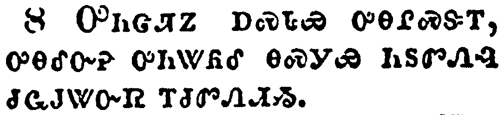</a></td>
</tr>
<tr class="even">
<td>And the multitude crying aloud began to desire him to do as he had ever done unto them.</td>
</tr>
<tr class="odd">
<td>ᎤᏂᏣᏘᏃ ᎠᏍᏓᏯ ᎤᎾᎵᏍᏕᎢ, ᎤᎾᎴᏅᎮ ᎤᏂᏔᏲᎴ ᎾᏍᎩᏯ ᏂᏚᏛᏁᎸ ᏧᏩᎫᏔᏅᏒ ᎢᏧᏛᏁᏗᏱ.</td>
</tr>
<tr class="even">
<td>U-ni-tsa-ti-no a-s-da-ya u-na-li-s-de-i, u-na-le-nv-he u-ni-ta-yo-le na-s-gi-ya ni-du-dv-ne-lv tsu-wa-gu-ta-nv-sv i-tsu-dv-ne-di-yi.</td>
</tr>
</tbody>
</table>

<table>
<tbody>
<tr class="odd">
<td><a href="021509.png">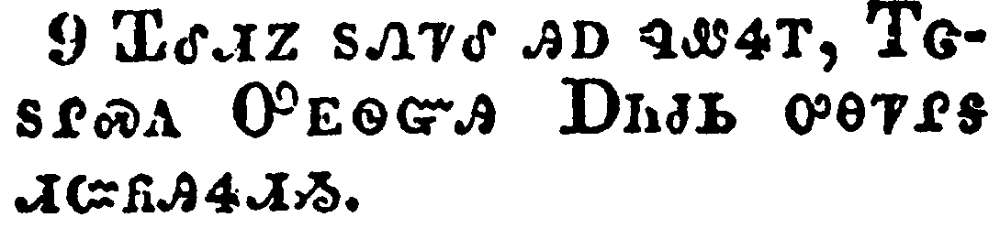</a></td>
</tr>
<tr class="even">
<td>But Pilate answered them, saying, Will ye that I release unto you the King of the Jews?</td>
</tr>
<tr class="odd">
<td>ᏆᎴᏗᏃ ᏚᏁᏤᎴ ᎯᎠ ᏄᏪᏎᎢ, ᎢᏣᏚᎵᏍᎪ ᎤᎬᏫᏳᎯ ᎠᏂᏧᏏ ᎤᎾᏤᎵᎦ ᏗᏳᏲᎯᏎᏗᏱ.</td>
</tr>
<tr class="even">
<td>Qua-le-di-no du-ne-tse-le hi-a nu-we-se-i, I-tsa-du-li-s-go U-gv-wi-yu-hi A-ni-tsu-si u-na-tse-li-ga di-yu-yo-hi-se-di-yi.</td>
</tr>
</tbody>
</table>

<table>
<tbody>
<tr class="odd">
<td><a href="021510.png">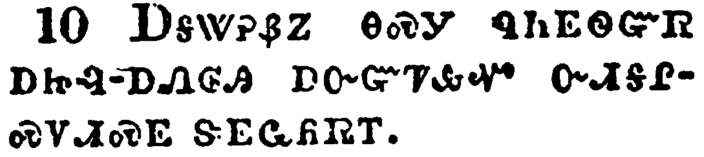</a></td>
</tr>
<tr class="even">
<td>For he knew that the chief priests had delivered him for envy.</td>
</tr>
<tr class="odd">
<td>ᎠᎦᏔᎮᏰᏃ ᎾᏍᎩ ᏄᏂᎬᏫᏳᏒ ᎠᏥᎸ-ᎠᏁᎶᎯ ᎠᏅᏳᏤᎲᏉ ᏅᏗᎦᎵᏍᏙᏗᏍᎬ ᏕᎬᏩᏲᏒᎢ.</td>
</tr>
<tr class="even">
<td>A-ga-ta-he-ye-no na-s-gi nu-ni-gv-wi-yu-sv a-tsi-lv--a-ne-lo-hi a-nv-yu-tse-hv-quo nv-di-ga-li-s-do-di-s-gv de-gv-wa-yo-sv-i.</td>
</tr>
</tbody>
</table>

<table>
<tbody>
<tr class="odd">
<td><a href="021511.png">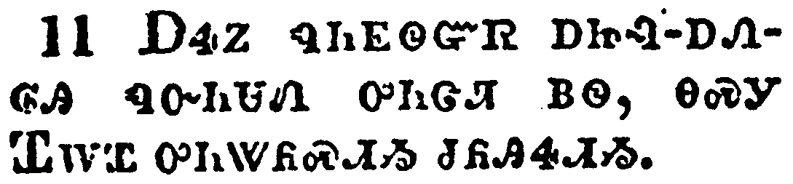</a></td>
</tr>
<tr class="even">
<td>But the chief priests moved the people, that he should rather release Barabbas unto them.</td>
</tr>
<tr class="odd">
<td>ᎠᏎᏃ ᏄᏂᎬᏳᏒ ᎠᏥᎸ-ᎠᏁᎶᎯ ᏄᏅᏂᏌᏁ ᎤᏂᏣᏘ ᏴᏫ, ᎾᏍᎩ ᏆᎳᏆ ᎤᏂᏔᏲᏍᏗᏱ ᏧᏲᎯᏎᏗᏱ.</td>
</tr>
<tr class="even">
<td>A-se-no nu-ni-gv-yu-sv a-tsi-lv--a-ne-lo-hi nu-nv-ni-sa-ne u-ni-tsa-ti yv-wi, na-s-gi Qua-la-qua u-ni-ta-yo-s-di-yi tsu-yo-hi-se-di-yi.</td>
</tr>
</tbody>
</table>

<table>
<tbody>
<tr class="odd">
<td><a href="021512.png">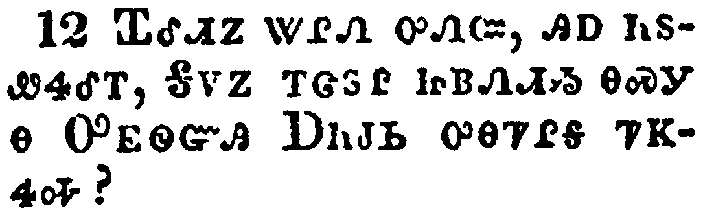</a></td>
</tr>
<tr class="even">
<td>And Pilate answered and said again unto them, What will ye then that I shall do unto him whom ye call the King of the Jews?</td>
</tr>
<tr class="odd">
<td>ᏆᎴᏗᏃ ᏔᎵᏁ ᎤᏁᏨ, ᎯᎠ ᏂᏚᏪᏎᎴᎢ, ᎦᏙᏃ ᎢᏣᏚᎵ ᏥᏴᏁᏗᏱ ᎾᏍᎩ Ꮎ ᎤᎬᏫᏳᎯ ᎠᏂᏧᏏ ᎤᎾᏤᎵᎦ ᏤᏦᏎᎭ?</td>
</tr>
<tr class="even">
<td>Qua-le-di-no ta-li-ne u-ne-tsv, hi-a ni-du-we-se-le-i, Ga-do-no i-tsa-du-li tsi-yv-ne-di-yi na-s-gi na U-gv-wi-yu-hi A-ni-tsu-si u-na-tse-li-ga tse-tso-se-ha?</td>
</tr>
</tbody>
</table>

<table>
<tbody>
<tr class="odd">
<td><a href="021513.png">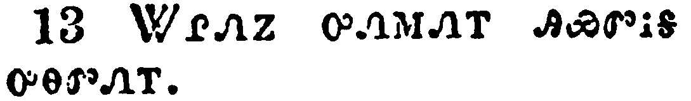</a></td>
</tr>
<tr class="even">
<td>And they cried out again, Crucify him.</td>
</tr>
<tr class="odd">
<td>ᏔᎵᏁᏃ ᎤᏁᎷᏁᎢ ᎯᏯᏛᎥᎦ ᎤᎾᏛᏁᎢ.</td>
</tr>
<tr class="even">
<td>Ta-li-ne-no u-ne-lu-ne-i hi-ya-dv-v-ga u-na-dv-ne-i.</td>
</tr>
</tbody>
</table>

<table>
<tbody>
<tr class="odd">
<td><a href="021514.png">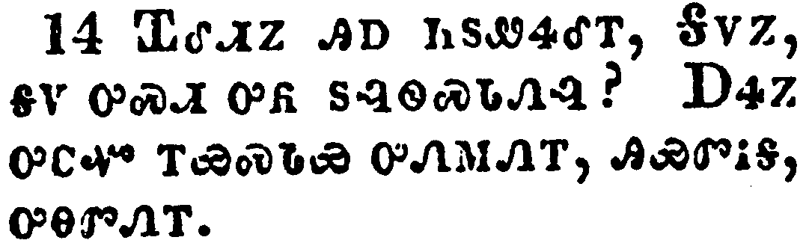</a></td>
</tr>
<tr class="even">
<td>Then Pilate said unto them, Why, what evil hath he done? And they cried out the more exceedingly, Crucify him.</td>
</tr>
<tr class="odd">
<td>ᏆᎴᏗᏃ ᎯᎠ ᏂᏚᏪᏎᎴᎢ, ᎦᏙᏃ, ᎦᏙ ᎤᏍᏗ ᎤᏲ ᏚᎸᏫᏍᏓᏁᎸ? ᎠᏎᏃ ᎤᏟᏉ ᎢᏯᏍᏓᏯ ᎤᏁᎷᏁᎢ, ᎯᏯᏛᎥᎦ, ᎤᎾᏛᏁᎢ.</td>
</tr>
<tr class="even">
<td>Qua-le-di-no hi-a ni-du-we-se-le-i, Ga-do-no, ga-do u-s-di u-yo du-lv-wi-s-da-ne-lv? A-se-no u-tli-quo i-ya-s-da-ya u-ne-lu-ne-i, hi-ya-dv-v-ga, u-na-dv-ne-i.</td>
</tr>
</tbody>
</table>

<table>
<tbody>
<tr class="odd">
<td><a href="021515.png">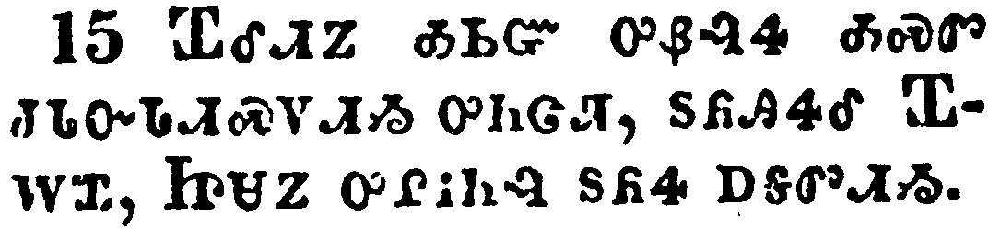</a></td>
</tr>
<tr class="even">
<td>And so Pilate, willing to content the people, released Barabbas unto them, and delivered Jesus, when he had scourged him, to be crucified.</td>
</tr>
<tr class="odd">
<td>ᏆᎴᏗᏃ ᎣᏏᏳ ᎤᏰᎸᏎ ᎣᏍᏛ ᏧᏓᏅᏓᏗᏍᏙᏗᏱ ᎤᏂᏣᏘ, ᏚᏲᎯᏎᎴ ᏆᎳᏆ, ᏥᏌᏃ ᎤᎵᎥᏂᎸ ᏚᏲᏎ ᎠᎦᏛᏗᏱ.</td>
</tr>
<tr class="even">
<td>Qua-le-di-no o-si-yu u-ye-lv-se o-s-dv tsu-da-nv-da-di-s-do-di-yi u-ni-tsa-ti, du-yo-hi-se-le Qua-la-qua, Tsi-sa-no u-li-v-ni-lv du-yo-se a-ga-dv-di-yi.</td>
</tr>
</tbody>
</table>

<table>
<tbody>
<tr class="odd">
<td><a href="021516.png">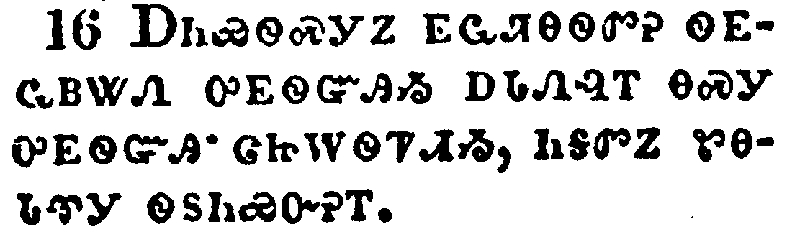</a></td>
</tr>
<tr class="even">
<td>And the soldiers led him away into the hall, called Praetorium; and they call together the whole band.</td>
</tr>
<tr class="odd">
<td>ᎠᏂᏯᏫᏍᎩᏃ ᎬᏩᏘᎾᏫᏛᎮ ᏫᎬᏩᏴᏔᏁ ᎤᎬᏫᏳᎯᏱ ᎠᏓᏁᎸᎢ ᎾᏍᎩ ᎤᎬᏫᏳᎯ ᏣᏥᎳᏫᏤᏗᏱ, ᏂᎦᏛᏃ ᏑᎾᏓᏡᎩ ᏫᏚᏂᏯᏅᎮᎢ.</td>
</tr>
<tr class="even">
<td>A-ni-ya-wi-s-gi-no gv-wa-ti-na-wi-dv-he wi-gv-wa-yv-ta-ne u-gv-wi-yu-hi-yi a-da-ne-lv-i na-s-gi u-gv-wi-yu-hi tsa-tsi-la-wi-tse-di-yi, ni-ga-dv-no su-na-da-tlu-gi wi-du-ni-ya-nv-he-i.</td>
</tr>
</tbody>
</table>

<table>
<tbody>
<tr class="odd">
<td><a href="021517.png">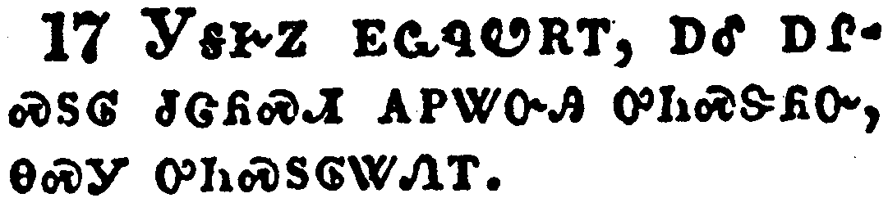</a></td>
</tr>
<tr class="even">
<td>And they clothed him with purple, and platted a crown of thorns, and put it about his head,</td>
</tr>
<tr class="odd">
<td>ᎩᎦᎨᏃ ᎬᏩᏄᏪᎡᎢ, ᎠᎴ ᎠᎵᏍᏚᎶ ᏧᏣᏲᏍᏗ ᎪᏢᏔᏅᎯ ᎤᏂᏍᏕᏲᏅ, ᎾᏍᎩ ᎤᏂᏍᏚᎶᏔᏁᎢ.</td>
</tr>
<tr class="even">
<td>Gi-ga-ge-no gv-wa-nu-we-e-i, a-le a-li-s-du-lo tsu-tsa-yo-s-di go-tlv-ta-nv-hi u-ni-s-de-yo-nv, na-s-gi u-ni-s-du-lo-ta-ne-i.</td>
</tr>
</tbody>
</table>

<table>
<tbody>
<tr class="odd">
<td><a href="021518.png">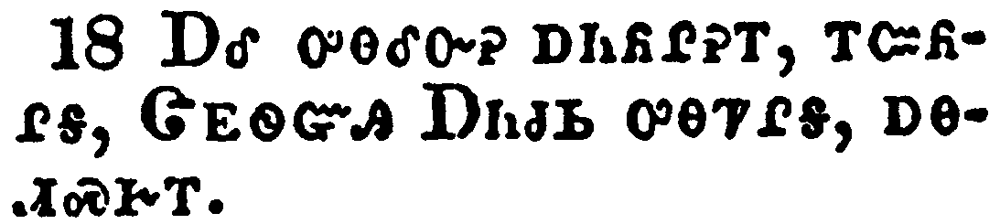</a></td>
</tr>
<tr class="even">
<td>And began to salute him, Hail, King of the Jews!</td>
</tr>
<tr class="odd">
<td>ᎠᎴ ᎤᎾᎴᏅᎮ ᎠᏂᏲᎵᎮᎢ, ᎢᏨᏲᎵᎦ, ᏣᎬᏫᏳᎯ ᎠᏂᏧᏏ ᎤᎾᏤᎵᎦ, ᎠᎾᏗᏍᎨᎢ.</td>
</tr>
<tr class="even">
<td>A-le u-na-le-nv-he a-ni-yo-li-he-i, i-tsv-yo-li-ga, Tsa-gv-wi-yu-hi A-ni-tsu-si u-na-tse-li-ga, a-na-di-s-ge-i.</td>
</tr>
</tbody>
</table>

<table>
<tbody>
<tr class="odd">
<td><a href="021519.png">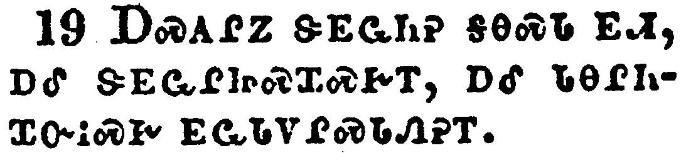</a></td>
</tr>
<tr class="even">
<td>And they smote him on the head with a reed, and did spit upon him, and bowing their knees worshipped him.</td>
</tr>
<tr class="odd">
<td>ᎠᏍᎪᎵᏃ ᏕᎬᏩᏂᎮ ᎦᎾᏍᏓ ᎬᏗ, ᎠᎴ ᏕᎬᏩᎵᏥᏍᏆᏍᎨᎢ, ᎠᎴ ᏓᎾᎵᏂᏆᏅᎥᏍᎨ ᎬᏩᏓᏙᎵᏍᏓᏁᎮᎢ.</td>
</tr>
<tr class="even">
<td>A-s-go-li-no de-gv-wa-ni-he ga-na-s-da gv-di, a-le de-gv-wa-li-tsi-s-qua-s-ge-i, a-le da-na-li-ni-qua-nv-v-s-ge gv-wa-da-do-li-s-da-ne-he-i.</td>
</tr>
</tbody>
</table>

<table>
<tbody>
<tr class="odd">
<td><a href="021520.png">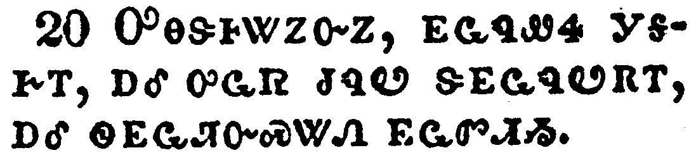</a></td>
</tr>
<tr class="even">
<td>And when they had mocked him, they took off the purple from him, and put his own clothes on him, and led him out to crucify him.</td>
</tr>
<tr class="odd">
<td>ᎤᎾᏕᎰᏔᏃᏅᏃ, ᎬᏩᏄᏪᏎ ᎩᎦᎨᎢ, ᎠᎴ ᎤᏩᏒ ᏧᏄᏬ ᏕᎬᏩᏄᏬᎡᎢ, ᎠᎴ ᏫᎬᏩᏘᏅᏍᏔᏁ ᎬᏩᏛᏗᏱ.</td>
</tr>
<tr class="even">
<td>U-na-de-ho-ta-no-nv-no, gv-wa-nu-we-se gi-ga-ge-i, a-le u-wa-sv tsu-nu-wo de-gv-wa-nu-wo-e-i, a-le wi-gv-wa-ti-nv-s-ta-ne gv-wa-dv-di-yi.</td>
</tr>
</tbody>
</table>

<table>
<tbody>
<tr class="odd">
<td><a href="021521.png">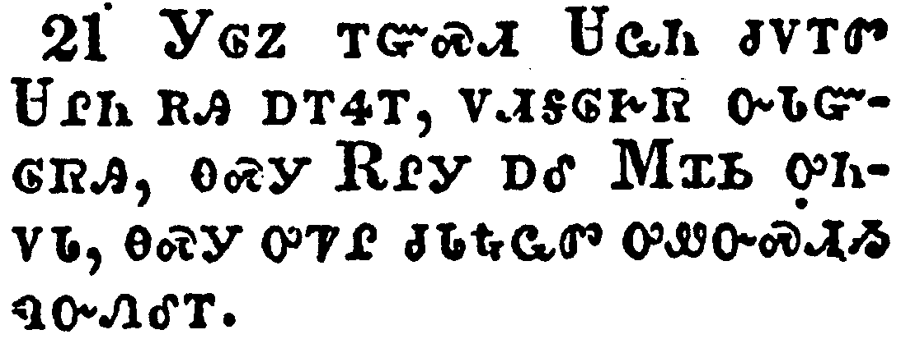</a></td>
</tr>
<tr class="even">
<td>And they compel one Simon a Cyrenian, who passed by, coming out of the country, the father of Alexander and Rufus, to bear his cross.</td>
</tr>
<tr class="odd">
<td>ᎩᎶᏃ ᎢᏳᏍᏗ ᏌᏩᏂ ᏧᏙᎢᏛ ᏌᎵᏂ ᎡᎯ ᎠᎢᏎᎢ, ᏙᏗᎦᎶᎨᏒ ᏅᏓᏳᎶᏒᎯ, ᎾᏍᎩ ᎡᎵᎩ ᎠᎴ ᎷᏆᏏ ᎤᏂᏙᏓ, ᎾᏍᎩ ᎤᏤᎵ ᏧᏓᎿᎭᏩᏛ ᎤᏪᏅᏍᏗᏱ ᏄᏅᏁᎴᎢ.</td>
</tr>
<tr class="even">
<td>Gi-lo-no i-yu-s-di Sa-wa-ni tsu-do-i-dv Sa-li-ni e-hi a-i-se-i, do-di-ga-lo-ge-sv nv-da-yu-lo-sv-hi, na-s-gi E-li-gi a-le Lu-qua-si u-ni-do-da, na-s-gi u-tse-li tsu-da-hna-wa-dv u-we-nv-s-di-yi nu-nv-ne-le-i.</td>
</tr>
</tbody>
</table>

<table>
<tbody>
<tr class="odd">
<td><a href="021522.png">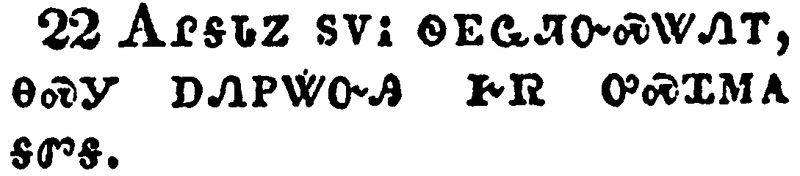</a></td>
</tr>
<tr class="even">
<td>And they bring him unto the place Golgotha, which is, being interpreted, The place of a skull.</td>
</tr>
<tr class="odd">
<td>ᎪᎵᎦᏓᏃ ᏚᏙᎥ ᏫᎬᏩᏘᏅᏔᏁᎢ, ᎾᏍᎩ ᎠᏁᏢᏔᏅᎯ ᎨᏒ ᎤᏍᏆᎷᎪ ᎦᏛᎦ.</td>
</tr>
<tr class="even">
<td>Go-li-ga-da-no du-do-v wi-gv-wa-ti-nv-ta-ne-i, na-s-gi a-ne-tlv-ta-nv-hi ge-sv u-s-qua-lu-go ga-dv-ga.</td>
</tr>
</tbody>
</table>

<table>
<tbody>
<tr class="odd">
<td><a href="021523.png">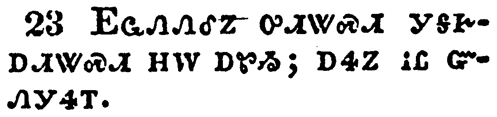</a></td>
</tr>
<tr class="even">
<td>And they gave him to drink wine mingled with myrrh: but he received it not.</td>
</tr>
<tr class="odd">
<td>ᎬᏩᏁᏁᎴᏃ ᎤᏗᏔᏍᏗ ᎩᎦᎨᎠᏗᏔᏍᏗ ᎻᎳ ᎠᏑᎵ; ᎠᏎᏃ ᎥᏝ ᏳᏁᎩᏎᎢ.</td>
</tr>
<tr class="even">
<td>Gv-wa-ne-ne-le-no u-di-ta-s-di gi-ga-ge-a-di-ta-s-di mi-la a-su-li; a-se-no v-tla yu-ne-gi-se-i.</td>
</tr>
</tbody>
</table>

<table>
<tbody>
<tr class="odd">
<td><a href="021524.png">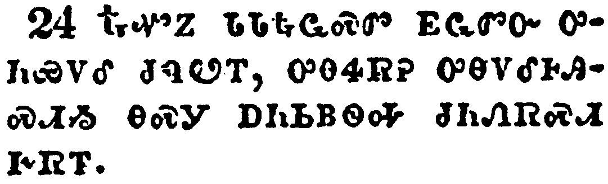</a></td>
</tr>
<tr class="even">
<td>And when they had crucified him, they parted his garments, casting lots upon them, what every man should take.</td>
</tr>
<tr class="odd">
<td>ᎿᎭᏉᏃ ᏓᏓᎿᎭᏩᏍᏛ ᎬᏩᏛᏅ ᎤᏂᏯᏙᎴ ᏧᏄᏬᎢ, ᎤᎾᏎᏒᎮ ᎤᎾᏙᎴᎰᎯᏍᏗᏱ ᎾᏍᎩ ᎠᏂᏏᏴᏫᎭ ᏧᏂᏁᏒᏍᏗ ᎨᏒᎢ.</td>
</tr>
<tr class="even">
<td>Hna-quo-no da-da-hna-wa-s-dv gv-wa-dv-nv u-ni-ya-do-le tsu-nu-wo-i, u-na-se-sv-he u-na-do-le-ho-hi-s-di-yi na-s-gi a-ni-si-yv-wi-ha tsu-ni-ne-sv-s-di ge-sv-i.</td>
</tr>
</tbody>
</table>

<table>
<tbody>
<tr class="odd">
<td><a href="021525.png">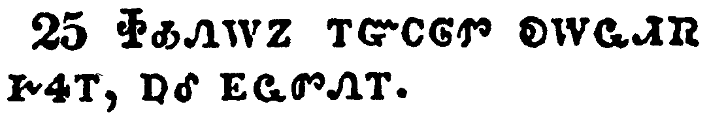</a></td>
</tr>
<tr class="even">
<td>And it was the third hour, and they crucified him.</td>
</tr>
<tr class="odd">
<td>ᏐᎣᏁᎳᏃ ᎢᏳᏟᎶᏛ ᎧᎳᏩᏗᏒ ᎨᏎᎢ, ᎠᎴ ᎬᏩᏛᏁᎢ.</td>
</tr>
<tr class="even">
<td>So-o-ne-la-no i-yu-tli-lo-dv ka-la-wa-di-sv ge-se-i, a-le gv-wa-dv-ne-i.</td>
</tr>
</tbody>
</table>

<table>
<tbody>
<tr class="odd">
<td><a href="021526.png">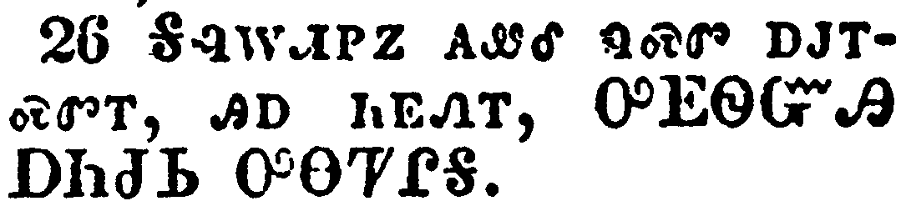</a></td>
</tr>
<tr class="even">
<td>And the superscription of his accusation was written over, THE KING OF THE JEWS.</td>
</tr>
<tr class="odd">
<td>ᎦᎸᎳᏗᏢᏃ ᎪᏪᎴ ᏄᏍᏛ ᎠᎫᎢᏍᏛᎢ, ᎯᎠ ᏂᎬᏁᎢ, ᎤᎬᏫᏳᎯ ᎠᏂᏧᏏ ᎤᎾᏤᎵᎦ.</td>
</tr>
<tr class="even">
<td>Ga-lv-la-di-tlv-no go-we-le nu-s-dv a-gu-i-s-dv-i, hi-a ni-gv-ne-i, U-Gv-Wi-Yu-Hi A-Ni-Tsu-Si U-Na-Tse-Li-Ga.</td>
</tr>
</tbody>
</table>

<table>
<tbody>
<tr class="odd">
<td></td>
</tr>
<tr class="even">
<td>And with him they crucify two thieves; the one on his right hand, and the other on his left.</td>
</tr>
<tr class="odd">
<td>ᎢᏧᎳᎭᏃ ᏕᎨᎦᏛᏁ ᎠᏂᏔᎵ ᏗᎾᏓᎾᏌᎲᏍᎩ; ᎠᏏᏴᏫ ᎠᎦᏘᏏᏗᏢ, ᏐᎢᏃ ᎠᎦᏍᎦᏂ ᎢᏗᏢ.</td>
</tr>
<tr class="even">
<td>I-tsu-la-ha-no de-ge-ga-dv-ne a-ni-ta-li di-na-da-na-sa-hv-s-gi; a-si-yv-wi a-ga-ti-si-di-tlv, so-i-no a-ga-s-ga-ni i-di-tlv.</td>
</tr>
</tbody>
</table>

<table>
<tbody>
<tr class="odd">
<td><a href="021528.png">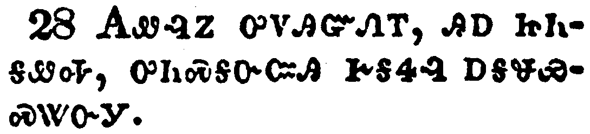</a></td>
</tr>
<tr class="even">
<td>And the scripture was fulfilled, which saith, And he was numbered with the transgressors.</td>
</tr>
<tr class="odd">
<td>ᎪᏪᎸᏃ ᎤᏙᎯᏳᏁᎢ, ᎯᎠ ᏥᏂᎦᏪᎭ, ᎤᏂᏍᎦᏅᏨᎯ ᎨᎦᏎᎸ ᎠᎦᏠᏯᏍᏔᏅᎩ.</td>
</tr>
<tr class="even">
<td>Go-we-lv-no u-do-hi-yu-ne-i, hi-a tsi-ni-ga-we-ha, u-ni-s-ga-nv-tsv-hi ge-ga-se-lv a-ga-tlo-ya-s-ta-nv-gi.</td>
</tr>
</tbody>
</table>

<table>
<tbody>
<tr class="odd">
<td><a href="021529.png">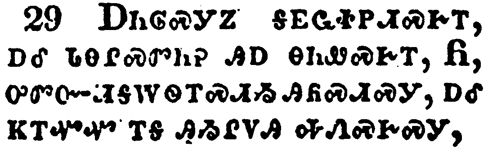</a></td>
</tr>
<tr class="even">
<td>And they that passed by railed on him, wagging their heads, and saying, Ah, thou that destroyest the temple, and buildest it in three days,</td>
</tr>
<tr class="odd">
<td>ᎠᏂᎶᏍᎩᏃ ᎦᎬᏩᏐᏢᏗᏍᎨᎢ, ᎠᎴ ᏓᎾᎵᏍᏛᏂᎮ ᎯᎠ ᎾᏂᏪᏍᎨᎢ, Ᏺ, ᎤᏛᏅ-ᏗᎦᎳᏫᎢᏍᏗᏱ ᎯᏲᏍᏗᏍᎩ, ᎠᎴ ᏦᎢᏉᏉ ᎢᎦ ᎯᏱᎵᏙᎯ ᎭᏁᏍᎨᏍᎩ,</td>
</tr>
<tr class="even">
<td>A-ni-lo-s-gi-no ga-gv-wa-so-tlv-di-s-ge-i, a-le da-na-li-s-dv-ni-he hi-a na-ni-we-s-ge-i, Yo, u-dv-nv--di-ga-la-wi-i-s-di-yi hi-yo-s-di-s-gi, a-le tso-i-quo-quo i-ga hi-yi-li-do-hi ha-ne-s-ge-s-gi,</td>
</tr>
</tbody>
</table>

<table>
<tbody>
<tr class="odd">
<td><a href="021530.png">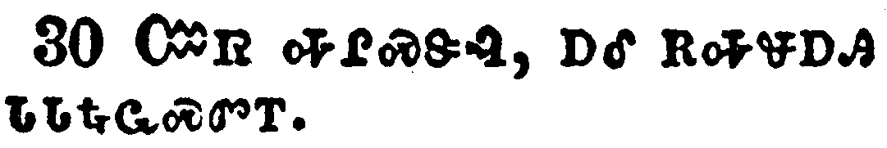</a></td>
</tr>
<tr class="even">
<td>Save thyself, and come down from the cross.</td>
</tr>
<tr class="odd">
<td>ᏨᏒ ᎭᎵᏍᏕᎸ, ᎠᎴ ᎡᎭᏠᎠᎯ ᏓᏓᎿᎭᏩᏍᏛᎢ.</td>
</tr>
<tr class="even">
<td>Tsv-sv ha-li-s-de-lv, a-le e-ha-tlo-a-hi da-da-hna-wa-s-dv-i.</td>
</tr>
</tbody>
</table>

<table>
<tbody>
<tr class="odd">
<td><a href="021531.png">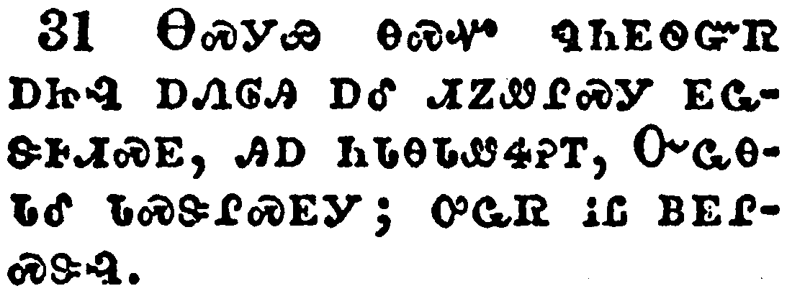</a></td>
</tr>
<tr class="even">
<td>Likewise also the chief priests mocking said among themselves with the scribes, He saved others; himself he cannot save.</td>
</tr>
<tr class="odd">
<td>ᎾᏍᎩᏯ ᎾᏍᏉ ᏄᏂᎬᏫᏳᏒ ᎠᏥᎸ ᎠᏁᎶᎯ ᎠᎴ ᏗᏃᏪᎵᏍᎩ ᎬᏩᏕᎰᏗᏍᎬ, ᎯᎠ ᏂᏓᎾᏓᏪᏎᎮᎢ, ᏅᏩᎾᏓᎴ ᏓᏍᏕᎵᏍᎬᎩ; ᎤᏩᏒ ᎥᏝ ᏴᎬᎵᏍᏕᎸ.</td>
</tr>
<tr class="even">
<td>Na-s-gi-ya na-s-quo nu-ni-gv-wi-yu-sv a-tsi-lv a-ne-lo-hi a-le di-no-we-li-s-gi gv-wa-de-ho-di-s-gv, hi-a ni-da-na-da-we-se-he-i, Nv-wa-na-da-le da-s-de-li-s-gv-gi; u-wa-sv v-tla yv-gv-li-s-de-lv.</td>
</tr>
</tbody>
</table>

<table>
<tbody>
<tr class="odd">
<td><a href="021532.png">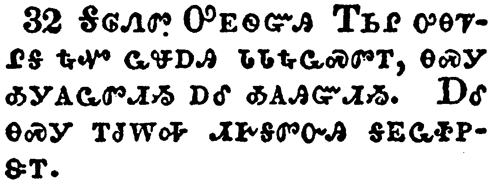</a></td>
</tr>
<tr class="even">
<td>Let Christ the King of Israel descend now from the cross, that we may see and believe. And they that were crucified with him reviled him.</td>
</tr>
<tr class="odd">
<td>ᎦᎶᏁᏛ ᎤᎬᏫᏳᎯ ᎢᏏᎵ ᎤᎾᏤᎵᎦ ᎿᎭᏉ ᏩᏠᎠᎯ ᏓᏓᎿᎭᏩᏍᏛᎢ, ᎾᏍᎩ ᎣᎩᎪᏩᏛᏗᏱ ᎠᎴ ᎣᎪᎯᏳᏗᏱ. ᎠᎴ ᎾᏍᎩ ᎢᏧᎳᎭ ᏗᎨᎦᏛᏅᎯ ᎦᎬᏩᏐᏢᏕᎢ.</td>
</tr>
<tr class="even">
<td>Ga-lo-ne-dv U-gv-wi-yu-hi I-si-li u-na-tse-li-ga hna-quo wa-tlo-a-hi da-da-hna-wa-s-dv-i, na-s-gi o-gi-go-wa-dv-di-yi a-le o-go-hi-yu-di-yi. A-le na-s-gi i-tsu-la-ha di-ge-ga-dv-nv-hi ga-gv-wa-so-tlv-de-i.</td>
</tr>
</tbody>
</table>

<table>
<tbody>
<tr class="odd">
<td><a href="021533.png">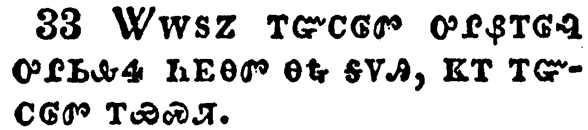</a></td>
</tr>
<tr class="even">
<td>And when the sixth hour was come, there was darkness over the whole land until the ninth hour.</td>
</tr>
<tr class="odd">
<td>ᏔᎳᏚᏃ ᎢᏳᏟᎶᏛ ᎤᎵᏰᎢᎶᎸ ᎤᎵᏏᎲᏎ ᏂᎬᎾᏛ ᎾᎿᎭᎦᏙᎯ, ᏦᎢ ᎢᏳᏟᎶᏛ ᎢᏯᏍᏘ.</td>
</tr>
<tr class="even">
<td>Ta-la-du-no i-yu-tli-lo-dv u-li-ye-i-lo-lv u-li-si-hv-se ni-gv-na-dv na-hna ga-do-hi, tso-i i-yu-tli-lo-dv i-ya-s-ti.</td>
</tr>
</tbody>
</table>

<table>
<tbody>
<tr class="odd">
<td><a href="021534.png">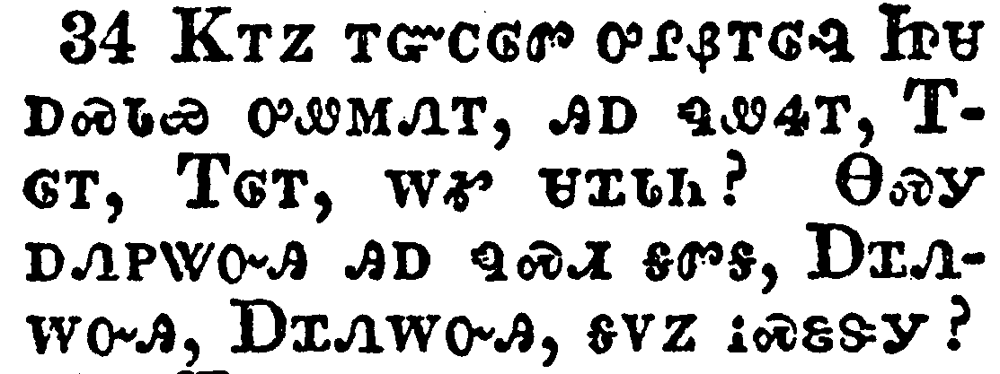</a></td>
</tr>
<tr class="even">
<td>And at the ninth hour Jesus cried with a loud voice, saying, Eloi, Eloi, lama sabachthani? which is, being interpreted, My God, my God, why hast thou forsaken me?</td>
</tr>
<tr class="odd">
<td>ᏦᎢᏁ ᎢᏳᏟᎶᏛ ᎤᎵᏰᎢᎶᎸ ᏥᏌ ᎠᏍᏓᏯ ᎤᏪᎷᏁᎢ, ᎯᎠ ᏄᏪᏎᎢ, ᎢᎶᎢ, ᎢᎶᎢ, ᎳᎹ ᏌᏆᏓᏂ? ᎾᏍᎩ ᎠᏁᏢᏔᏅᎯ ᎯᎠ ᏄᏍᏗ ᎦᏛᎦ, ᎠᏆᏁᎳᏅᎯ, ᎠᏆᏁᎳᏅᎯ, ᎦᏙᏃ ᎥᏍᏋᏕᎩ?</td>
</tr>
<tr class="even">
<td>Tso-i-ne i-yu-tli-lo-dv u-li-ye-i-lo-lv Tsi-sa a-s-da-ya u-we-lu-ne-i, hi-a nu-we-se-i, I-lo-i, I-lo-i, la-ma sa-qua-da-ni? Na-s-gi a-ne-tlv-ta-nv-hi hi-a nu-s-di ga-dv-ga, A-qua-ne-la-nv-hi, A-qua-ne-la-nv-hi, ga-do-no v-s-quv-de-gi?</td>
</tr>
</tbody>
</table>

<table>
<tbody>
<tr class="odd">
<td><a href="021535.png">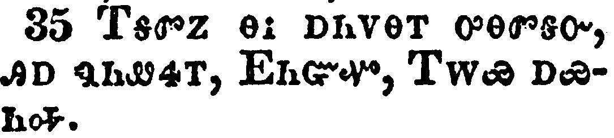</a></td>
</tr>
<tr class="even">
<td>And some of them that stood by, when they heard it, said, Behold, he calleth Elias.</td>
</tr>
<tr class="odd">
<td>ᎢᎦᏛᏃ ᎾᎥ ᎠᏂᏙᎾᎢ ᎤᎾᏛᎦᏅ, ᎯᎠ ᏄᏂᏪᏎᎢ, ᎬᏂᏳᏉ, ᎢᎳᏯ ᎠᏯᏂᎭ.</td>
</tr>
<tr class="even">
<td>I-ga-dv-no na-v a-ni-do-na-i u-na-dv-ga-nv, hi-a nu-ni-we-se-i, Gv-ni-yu-quo, I-la-ya a-ya-ni-ha.</td>
</tr>
</tbody>
</table>

<table>
<tbody>
<tr class="odd">
<td><a href="021536.png">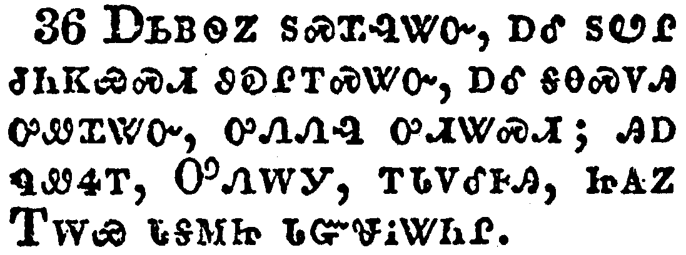</a></td>
</tr>
<tr class="even">
<td>And one ran and filled a spunge full of vinegar, and put it on a reed, and gave him to drink, saying, Let alone; let us see whether Elias will come to take him down.</td>
</tr>
<tr class="odd">
<td>ᎠᏎᏴᏫᏃ ᏚᏍᏆᎸᏔᏅ, ᎠᎴ ᏚᏬᎵ ᏧᏂᏦᏯᏍᏗ ᏭᎧᎵᎢᏍᏔᏅ, ᎠᎴ ᎦᎾᏍᏙᎯ ᎤᏪᏆᏔᏅ, ᎤᏁᏁᎸ ᎤᏗᏔᏍᏗ; ᎯᎠ ᏄᏪᏎᎢ, ᎤᏁᎳᎩ, ᎢᏓᏙᎴᎰᎯ, ᏥᎪᏃ ᎢᎳᏯ ᏓᎦᎷᏥ ᏓᏳᏠᎥᏔᏂᎵ.</td>
</tr>
<tr class="even">
<td>A-se-yv-wi-no du-s-qua-lv-ta-nv, a-le du-wo-li tsu-ni-tso-ya-s-di wu-ka-li-i-s-ta-nv, a-le ga-na-s-do-hi u-we-qua-ta-nv, u-ne-ne-lv u-di-ta-s-di; hi-a nu-we-se-i, U-ne-la-gi, i-da-do-le-ho-hi, tsi-go-no I-la-ya da-ga-lu-tsi da-yu-tlo-v-ta-ni-li.</td>
</tr>
</tbody>
</table>

<table>
<tbody>
<tr class="odd">
<td></td>
</tr>
<tr class="even">
<td>And Jesus cried with a loud voice, and gave up the ghost.</td>
</tr>
<tr class="odd">
<td>ᏥᏌᏃ ᎠᏍᏓᏯ ᎤᏪᎷᏅ, ᎤᎵᏍᏆᏕᎴᎢ.</td>
</tr>
<tr class="even">
<td>Tsi-sa-no a-s-da-ya u-we-lu-nv, u-li-s-qua-de-le-i.</td>
</tr>
</tbody>
</table>

<table>
<tbody>
<tr class="odd">
<td><a href="021538.png">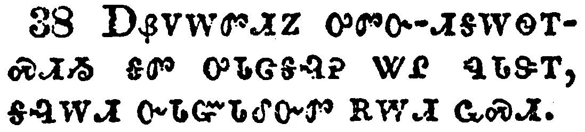</a></td>
</tr>
<tr class="even">
<td>And the veil of the temple was rent in twain from the top to the bottom.</td>
</tr>
<tr class="odd">
<td>ᎠᏰᏙᎳᏛᏗᏃ ᎤᏛᏅ-ᏗᎦᎳᏫᎢᏍᏗᏱ ᎦᏛ ᎤᏓᏣᎦᎸᎮ ᏔᎵ ᏄᏓᏕᎢ, ᎦᎸᎳᏗ ᏅᏓᏳᏓᎴᏅᏛ ᎡᎳᏗ ᏩᏍᏗ.</td>
</tr>
<tr class="even">
<td>A-ye-do-la-dv-di-no u-dv-nv--di-ga-la-wi-i-s-di-yi ga-dv u-da-tsa-ga-lv-he ta-li nu-da-de-i, ga-lv-la-di nv-da-yu-da-le-nv-dv e-la-di wa-s-di.</td>
</tr>
</tbody>
</table>

<table>
<tbody>
<tr class="odd">
<td><a href="021539.png">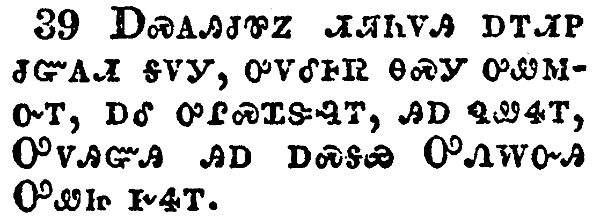</a></td>
</tr>
<tr class="even">
<td>And when the centurion, which stood over against him, saw that he so cried out, and gave up the ghost, he said, Truly this man was the Son of God.</td>
</tr>
<tr class="odd">
<td>ᎠᏍᎪᎯᏧᏈᏃ ᏗᏘᏂᏙᎯ ᎠᎢᏗᏢ ᏧᏳᎪᏗ ᎦᏙᎩ, ᎤᏙᎴᎰᏒ ᎾᏍᎩ ᎤᏪᎷᏅᎢ, ᎠᎴ ᎤᎵᏍᏆᏕᎸᎢ, ᎯᎠ ᏄᏪᏎᎢ, ᎤᏙᎯᏳᎯ ᎯᎠ ᎠᏍᎦᏯ ᎤᏁᎳᏅᎯ ᎤᏪᏥ ᎨᏎᎢ.</td>
</tr>
<tr class="even">
<td>A-s-go-hi-tsu-qui-no di-ti-ni-do-hi a-i-di-tlv tsu-yu-go-di ga-do-gi, u-do-le-ho-sv na-s-gi u-we-lu-nv-i, a-le u-li-s-qua-de-lv-i, hi-a nu-we-se-i, U-do-hi-yu-hi hi-a a-s-ga-ya U-ne-la-nv-hi U-we-tsi ge-se-i.</td>
</tr>
</tbody>
</table>

<table>
<tbody>
<tr class="odd">
<td><a href="021540.png">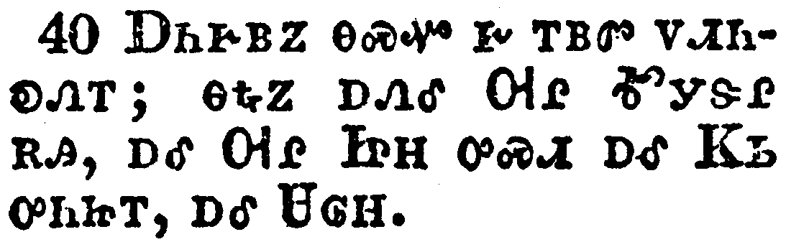</a></td>
</tr>
<tr class="even">
<td>There were also women looking on afar off: among whom was Mary Magdalene, and Mary the mother of James the less and of Joses, and Salome;</td>
</tr>
<tr class="odd">
<td>ᎠᏂᎨᏴᏃ ᎾᏍᏉ Ꭸ ᎢᏴᏛ ᏙᏗᏂᎧᏁᎢ; ᎾᎿᎭᏃ ᎠᏁᎴ ᎺᎵ ᏑᎩᏕᎵ ᎡᎯ, ᎠᎴ ᎺᎵ ᏥᎻ ᎤᏍᏗ ᎠᎴ ᏦᏏ ᎤᏂᏥᎢ, ᎠᎴ ᏌᎶᎻ.</td>
</tr>
<tr class="even">
<td>A-ni-ge-yv-no na-s-quo ge i-yv-dv do-di-ni-ka-ne-i; na-hna-no a-ne-le Me-li Su-gi-de-li e-hi, a-le Me-li Tsi-mi u-s-di a-le Tso-si u-ni-tsi-i, a-le Sa-lo-mi.</td>
</tr>
</tbody>
</table>

<table>
<tbody>
<tr class="odd">
<td><a href="021541.png">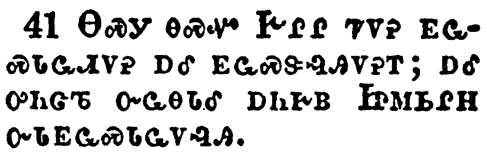</a></td>
</tr>
<tr class="even">
<td>(Who also, when he was in Galilee, followed him, and ministered unto him;) and many other women which came up with him unto Jerusalem.</td>
</tr>
<tr class="odd">
<td>ᎾᏍᎩ ᎾᏍᏉ ᎨᎵᎵ ᏤᏙᎮ ᎬᏩᏍᏓᏩᏗᏙᎮ ᎠᎴ ᎬᏩᏍᏕᎸᎯᏙᎮᎢ; ᎠᎴ ᎤᏂᏣᏖ ᏅᏩᎾᏓᎴ ᎠᏂᎨᏴ ᏥᎷᏏᎵᎻ ᏅᏓᎬᏩᏍᏓᏩᏙᎸᎯ.</td>
</tr>
<tr class="even">
<td>Na-s-gi na-s-quo Ge-li-li tse-do-he gv-wa-s-da-wa-di-do-he a-le gv-wa-s-de-lv-hi-do-he-i; a-le u-ni-tsa-te nv-wa-na-da-le a-ni-ge-yv Tsi-lu-si-li-mi nv-da-gv-wa-s-da-wa-do-lv-hi.</td>
</tr>
</tbody>
</table>

<table>
<tbody>
<tr class="odd">
<td><a href="021542.png">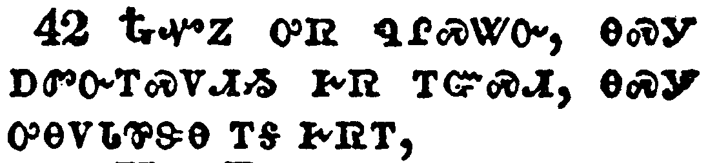</a></td>
</tr>
<tr class="even">
<td>And now when the even was come, because it was the preparation, that is, the day before the sabbath,</td>
</tr>
<tr class="odd">
<td>ᎿᎭᏉᏃ ᎤᏒ ᏄᎵᏍᏔᏅ, ᎾᏍᎩ ᎠᏛᏅᎢᏍᏙᏗᏱ ᎨᏒ ᎢᏳᏍᏗ, ᎾᏍᎩ ᎤᎾᏙᏓᏈᏕᎾ ᎢᎦ ᎨᏒᎢ.</td>
</tr>
<tr class="even">
<td>Hna-quo-no u-sv nu-li-s-ta-nv, na-s-gi a-dv-nv-i-s-do-di-yi ge-sv i-yu-s-di, na-s-gi u-na-do-da-qui-de-na i-ga ge-sv-i.</td>
</tr>
</tbody>
</table>

<table>
<tbody>
<tr class="odd">
<td><a href="021543.png">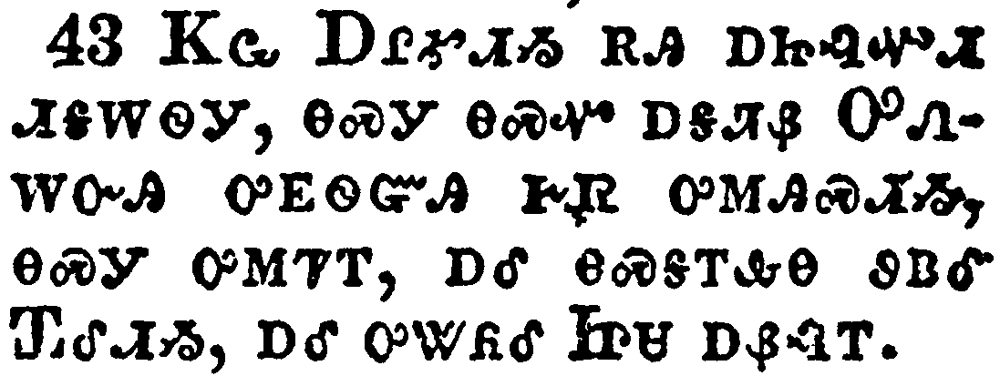</a></td>
</tr>
<tr class="even">
<td>Joseph of Arimathaea, and honourable counseller, which also waited for the kingdom of God, came, and went in boldly unto Pilate, and craved the body of Jesus.</td>
</tr>
<tr class="odd">
<td>ᏦᏩ ᎠᎵᎹᏗᏱ ᎡᎯ ᎠᏥᎸᏉᏗ ᏗᎦᎳᏫᎩ, ᎾᏍᎩ ᎾᏍᏉ ᎠᎦᏘᏰ ᎤᏁᎳᏅᎯ ᎤᎬᏫᏳᎯ ᎨᏒ ᎤᎷᎯᏍᏗᏱ, ᎾᏍᎩ ᎤᎷᏤᎢ, ᎠᎴ ᎾᏍᎦᎢᎲᎾ ᏭᏴᎴ ᏆᎴᏗᏱ, ᎠᎴ ᎤᏔᏲᎴ ᏥᏌ ᎠᏰᎸᎢ.</td>
</tr>
<tr class="even">
<td>Tso-wa A-li-ma-di-yi e-hi a-tsi-lv-quo-di di-ga-la-wi-gi, na-s-gi na-s-quo a-ga-ti-ye U-ne-la-nv-hi u-gv-wi-yu-hi ge-sv u-lu-hi-s-di-yi, na-s-gi u-lu-tse-i, a-le na-s-ga-i-hv-na wu-yv-le Qua-le-di-yi, a-le u-ta-yo-le Tsi-sa a-ye-lv-i.</td>
</tr>
</tbody>
</table>

<table>
<tbody>
<tr class="odd">
<td><a href="021544.png">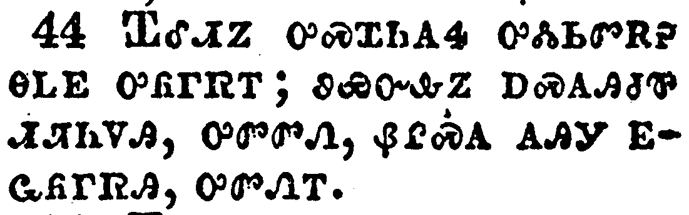</a></td>
</tr>
<tr class="even">
<td>And Pilate marvelled if he were already dead: and calling unto him the centurion, he asked him whether he had been any while dead.</td>
</tr>
<tr class="odd">
<td>ᏆᎴᏗᏃ ᎤᏍᏆᏏᎪᏎ ᎤᏜᏓᏏᏛᎡᎮ ᎾᏞᎬ ᎤᏲᎱᏒᎢ; ᏭᏯᏅᎲᏃ ᎠᏍᎪᎯᏧᏈ ᏗᏘᏂᏙᎯ, ᎤᏛᏛᏁ, ᏰᎵᏍᎪ ᎪᎯᎩ ᎬᏩᏲᎱᏒᎯ, ᎤᏛᏁᎢ.</td>
</tr>
<tr class="even">
<td>Qua-le-di-no u-s-qua-si-go-se u-dla-si-dv-e-he na-tle-gv u-yo-hu-sv-i; wu-ya-nv-hv-no a-s-go-hi-tsu-qui di-ti-ni-do-hi, u-dv-dv-ne, ye-li-s-go go-hi-gi gv-wa-yo-hu-sv-hi, u-dv-ne-i.</td>
</tr>
</tbody>
</table>

<table>
<tbody>
<tr class="odd">
<td><a href="021545.png">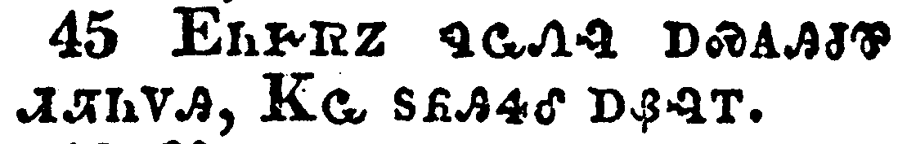</a></td>
</tr>
<tr class="even">
<td>And when he knew it of the centurion, he gave the body to Joseph.</td>
</tr>
<tr class="odd">
<td>ᎬᏂᎨᏒᏃ ᏄᏩᏁᎸ ᎠᏍᎪᎯᏧᏈ ᏗᏘᏂᏙᎯ, ᏦᏩ ᏚᏲᎯᏎᎴ ᎠᏰᎸᎢ.</td>
</tr>
<tr class="even">
<td>Gv-ni-ge-sv-no nu-wa-ne-lv a-s-go-hi-tsu-qui di-ti-ni-do-hi, Tso-wa du-yo-hi-se-le a-ye-lv-i.</td>
</tr>
</tbody>
</table>

<table>
<tbody>
<tr class="odd">
<td><a href="021546.png">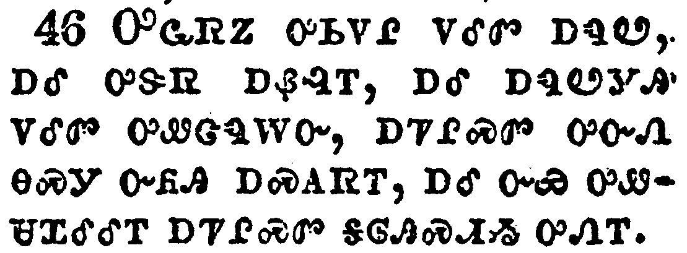</a></td>
</tr>
<tr class="even">
<td>And he bought fine linen, and took him down, and wrapped him in the linen, and laid him in a sepulchre which was hewn out of a rock, and rolled a stone unto the door of the sepulchre.</td>
</tr>
<tr class="odd">
<td>ᎤᏩᏒᏃ ᎤᏏᏙᎵ ᏙᎴᏛ ᎠᏄᏬ, ᎠᎴ ᎤᏕᏒ ᎠᏰᎸᎢ, ᎠᎴ ᎠᏄᏬᎩᎯ ᏙᎴᏛ ᎤᏪᏣᏄᎳᏅ, ᎠᏤᎵᏍᏛ ᎤᏅᏁ ᎾᏍᎩ ᏅᏲᎯ ᎠᏍᎪᏒᎢ, ᎠᎴ ᏅᏯ ᎤᏪᏌᏆᎴᎴᎢ ᎠᏤᎵᏍᏛ ᎦᎶᎯᏍᏗᏱ ᎤᏁᎢ.</td>
</tr>
<tr class="even">
<td>U-wa-sv-no u-si-do-li do-le-dv a-nu-wo, a-le u-de-sv a-ye-lv-i, a-le a-nu-wo-gi-hi do-le-dv u-we-tsa-nu-la-nv, a-tse-li-s-dv u-nv-ne na-s-gi nv-yo-hi a-s-go-sv-i, a-le nv-ya u-we-sa-qua-le-le-i a-tse-li-s-dv ga-lo-hi-s-di-yi u-ne-i.</td>
</tr>
</tbody>
</table>

<table>
<tbody>
<tr class="odd">
<td><a href="021547.png">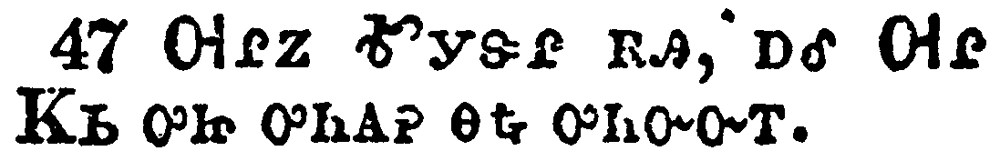</a></td>
</tr>
<tr class="even">
<td>And Mary Magdalene and Mary the mother of Joses beheld where he was laid.</td>
</tr>
<tr class="odd">
<td>ᎺᎵᏃ ᎹᎩᏕᎵ ᎡᎯ, ᎠᎴ ᎺᎵ ᏦᏏ ᎤᏥ ᎤᏂᎪᎮ ᎾᎿᎭᎤᏂᏅᏅᎢ.</td>
</tr>
<tr class="even">
<td>Me-li-no Ma-gi-de-li e-hi, a-le Me-li Tso-si u-tsi u-ni-go-he na-hna u-ni-nv-nv-i.</td>
</tr>
</tbody>
</table>

