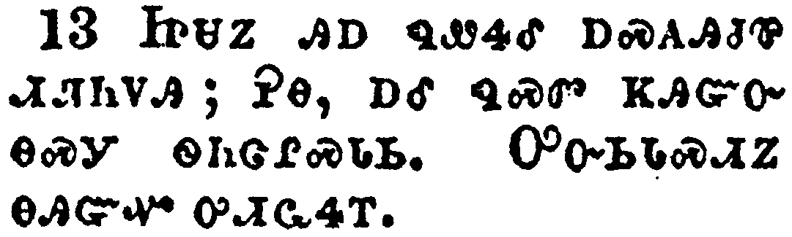

+++
draft=false
date = 2014-12-18T21:11:07Z
title = "Matthew - Chapter 8 - Cherokee New Testament"
weight = 1418955067

[taxonomies]

authors = ["Timothy Legg"]
categories = []
tags = []

[extra]
+++

<table>
<tbody>
<tr class="odd">
<td></td>
</tr>
<tr class="even">
<td>When he was come down from the mountain, great multitudes followed him.</td>
</tr>
<tr class="odd">
<td>ᎿᎭᏉᏃ ᏧᎦᏐᎠᏒ ᎤᏌᎯᎸᎢ, ᎤᏂᏣᏘ ᎬᏩᏍᏓᏩᏛᏎᎢ.</td>
</tr>
<tr class="even">
<td>Hna-quo-no tsu-ga-so-a-sv u-sa-hi-lv-i, u-ni-tsa-ti gv-wa-s-da-wa-dv-se-i.</td>
</tr>
</tbody>
</table>

<table>
<tbody>
<tr class="odd">
<td></td>
</tr>
<tr class="even">
<td>And, behold, there came a leper and worshipped him, saying, Lord, if thou wilt, thou canst make me clean.</td>
</tr>
<tr class="odd">
<td>ᎠᎴ ᎬᏂᏳᏉ ᎠᏓᏰᏍᎩ ᎤᏢᎩ ᎤᎷᏤ ᎤᏓᏙᎵᏍᏓᏁᎴᎢ, ᎯᎠ ᏄᏪᏎᎢ; ᏣᎬᏫᏳᎯ, ᎢᏳᏃ ᏱᏣᏓᏅᏖᎸ ᏰᎵᏉ ᏱᏍᎩᏅᎦᎸ.</td>
</tr>
<tr class="even">
<td>A-le gv-ni-yu-quo a-da-ye-s-gi u-tlv-gi u-lu-tse u-da-do-li-s-da-ne-le-i, hi-a nu-we-se-i; Tsa-gv-wi-yu-hi, i-yu-no yi-tsa-da-nv-te-lv ye-li-quo yi-s-gi-nv-ga-lv.</td>
</tr>
</tbody>
</table>

<table>
<tbody>
<tr class="odd">
<td></td>
</tr>
<tr class="even">
<td>And Jesus put forth his hand, and touched him, saying, I will; be thou clean. And immediately his leprosy was cleansed.</td>
</tr>
<tr class="odd">
<td>ᏥᏌᏃ ᎤᏙᏯᏅᎯᏛ ᎤᏒᏂᎴᎢ, ᎦᏓᏅᏛᎵ, ᏣᏓᏅᎦᎸᏛ ᎨᏎᏍᏗ, ᎤᏬᏎᎴᎢ; ᎩᎳᏉᏃ ᎢᏴᏛ ᎠᏓᏰᏍᎩ ᎤᏢᎬ ᎤᏓᏅᎦᎸᎮᎢ.</td>
</tr>
<tr class="even">
<td>Tsi-sa-no u-do-ya-nv-hi-dv u-sv-ni-le-i, ga-da-nv-dv-li, tsa-da-nv-ga-lv-dv ge-se-s-di, u-wo-se-le-i; gi-la-quo-no i-yv-dv a-da-ye-s-gi u-tlv-gv u-da-nv-ga-lv-he-i.</td>
</tr>
</tbody>
</table>

<table>
<tbody>
<tr class="odd">
<td></td>
</tr>
<tr class="even">
<td>And Jesus saith unto him, See thou tell no man; but go thy way, shew thyself to the priest, and offer the gift that Moses commanded, for a testimony unto them.</td>
</tr>
<tr class="odd">
<td>ᎯᎠᏃ ᏥᏌ ᏄᏪᏎᎴᎢ; Ꭷ ᏞᏍᏗ ᎩᎶ ᏥᎯᏃᏁᎵ, ᎮᎾᏉᏍᎩᏂ, ᏫᏣᎪᏩᏛ ᎠᏥᎸ-ᎨᎶᎯ, ᎠᎴ ᎠᎵᏍᎪᎸᏙᏗ ᏫᎲᎦ ᎼᏏ ᎤᏁᏨ ᎠᎵᏍᎪᎸᏙᏗ ᎾᏍᎩ ᎤᎾᏙᎴᎰᎯᏍᏙᏗ.</td>
</tr>
<tr class="even">
<td>Hi-a-no Tsi-sa nu-we-se-le-i; Ka tle-s-di gi-lo tsi-hi-no-ne-li, he-na-quo-s-gi-ni, wi-tsa-go-wa-dv a-tsi-lv--ge-lo-hi, a-le a-li-s-go-lv-do-di wi-hv-ga Mo-si u-ne-tsv a-li-s-go-lv-do-di na-s-gi u-na-do-le-ho-hi-s-do-di.</td>
</tr>
</tbody>
</table>

<table>
<tbody>
<tr class="odd">
<td></td>
</tr>
<tr class="even">
<td>And when Jesus was entered into Capernaum, there came unto him a centurion, beseeching him,</td>
</tr>
<tr class="odd">
<td>ᎿᎭᏉᏃ ᏥᏌ ᎨᏆᏂ ᏫᎤᎷᏨ, ᎤᎷᏤᎴ ᎠᏍᎪᎯᎫᏈ ᎠᏂᏯᏫᏍᎩ ᏗᏘᏂᏙᎯ, ᎤᏍᏗᏰᏔᏁᎢ,</td>
</tr>
<tr class="even">
<td>Hna-quo-no Tsi-sa Ge-qua-ni wi-u-lu-tsv, u-lu-tse-le a-s-go-hi-gu-qui a-ni-ya-wi-s-gi di-ti-ni-do-hi, u-s-di-ye-ta-ne-i,</td>
</tr>
</tbody>
</table>

<table>
<tbody>
<tr class="odd">
<td></td>
</tr>
<tr class="even">
<td>And saying, Lord, my servant lieth at home sick of the palsy, grievously tormented.</td>
</tr>
<tr class="odd">
<td>ᎯᎠ ᏄᏪᏎᎴᎢ; ᏣᎬᏫᏳᎯ, ᏥᏅᏏᏓᏍᏗ ᎦᏅᎦ ᏗᏇᏅᏒ ᎤᏢᎦ ᎤᎸᏓᎸᎥᏍᎦ ᎤᏣᏔᏅᎯ ᎠᎩᎵᏲᎦ.</td>
</tr>
<tr class="even">
<td>Hi-a nu-we-se-le-i; Tsa-gv-wi-yu-hi, tsi-nv-si-da-s-di ga-nv-ga di-que-nv-sv u-tlv-ga u-lv-da-lv-v-s-ga u-tsa-ta-nv-hi a-gi-li-yo-ga.</td>
</tr>
</tbody>
</table>

<table>
<tbody>
<tr class="odd">
<td></td>
</tr>
<tr class="even">
<td>And Jesus saith unto him, I will come and heal him.</td>
</tr>
<tr class="odd">
<td>ᏥᏌᏃ ᎯᎠ ᏄᏪᏎᎴᎢ; ᏓᎨᏏ ᏓᏥᏅᏩᏁᏏ.</td>
</tr>
<tr class="even">
<td>Tsi-sa-no hi-a nu-we-se-le-i; Da-ge-si da-tsi-nv-wa-ne-si.</td>
</tr>
</tbody>
</table>

<table>
<tbody>
<tr class="odd">
<td></td>
</tr>
<tr class="even">
<td>The centurion answered and said, Lord, I am not worthy that thou shouldest come under my roof: but speak the word only, and my servant shall be healed.</td>
</tr>
<tr class="odd">
<td>ᎠᏍᎪᎯᏧᏈᏃ ᏗᏘᏂᏙᎯ ᏗᎤᏁᏨ ᎯᎠ ᏄᏪᏎᎢ; ᏣᎬᏫᏳᎯ, ᏝᏰᎵ ᏱᏂᎪᎢ ᏥᏁᎸ ᏣᏴᏍᏗᏱ; ᎯᏁᎩᏉᏍᎩᏂ ᎤᏩᏒ, ᏥᏅᏏᏓᏍᏗᏃ ᏓᏳᏗᏩᏏ.</td>
</tr>
<tr class="even">
<td>A-s-go-hi-tsu-qui-no di-ti-ni-do-hi di-u-ne-tsv hi-a nu-we-se-i; Tsa-gv-wi-yu-hi, tla-ye-li yi-ni-go-i tsi-ne-lv tsa-yv-s-di-yi; hi-ne-gi-quo-s-gi-ni u-wa-sv, tsi-nv-si-da-s-di-no da-yu-di-wa-si.</td>
</tr>
</tbody>
</table>

<table>
<tbody>
<tr class="odd">
<td></td>
</tr>
<tr class="even">
<td>For I am a man under authority, having soldiers under me: and I say to this man, Go, and he goeth; and to another, Come, and he cometh; and to my servant, Do this, and he doeth it.</td>
</tr>
<tr class="odd">
<td>ᎠᏴᏰᏃ ᏗᏆᏓᏁᎶᏗᏉ, ᎠᎴ ᏓᎩᎧᎭ ᎠᏂᏯᏫᏍᎩ ᎾᏍᎩ ᏕᎬᏆᏁᎶᏙᎢ, ᎩᎶᏃ ᎮᎾ ᏥᏲᏏ, ᎡᎪᎢ; ᏅᏩᏓᎴᏃ ᎡᎮᎾ ᏥᏲᏏ, ᏗᎡᎪᎢ; ᏥᏅᏏᏓᏍᏗᏃ, ᎯᎠ ᎿᎭᏛᎦ ᏥᏲᏏ, ᎾᏍᎩ ᎾᏛᏁᎰᎢ.</td>
</tr>
<tr class="even">
<td>A-yv-ye-no di-qua-da-ne-lo-di-quo, a-le da-gi-ka-ha a-ni-ya-wi-s-gi na-s-gi de-gv-qua-ne-lo-do-i, gi-lo-no He-na tsi-yo-si, e-go-i; nv-wa-da-le-no E-he-na tsi-yo-si, di-e-go-i; tsi-nv-si-da-s-di-no, hi-a hna-dv-ga tsi-yo-si, na-s-gi na-dv-ne-ho-i.</td>
</tr>
</tbody>
</table>

<table>
<tbody>
<tr class="odd">
<td></td>
</tr>
<tr class="even">
<td>When Jesus heard it, he marvelled, and said to them that followed, Verily I say unto you, I have not found so great faith, no, not in Israel.</td>
</tr>
<tr class="odd">
<td>ᏥᏌᏃ ᎤᏛᎦᏅ ᎤᏍᏆᏂᎪᏎᎢ, ᎠᎴ ᎯᎠ ᏂᏚᏪᏎᎴ ᏅᏓᎬᏩᏍᏓᏩᏛᏛ, ᎤᏙᎯᏳᎯᏯ ᎯᎠ ᏂᏨᏪᏎᎭ, ᎥᏝ ᎾᏍᏉ ᎢᏏᎵ ᏚᏙᎥ ᎾᏍᎩ ᎢᎦᎢ ᎪᎯᏳᏗ ᎨᏒ ᏯᎩᏩᏛᎲ.</td>
</tr>
<tr class="even">
<td>Tsi-sa-no u-dv-ga-nv u-s-qua-ni-go-se-i, a-le hi-a ni-du-we-se-le Nv-da-gv-wa-s-da-wa-dv-dv, u-do-hi-yu-hi-ya hi-a ni-tsv-we-se-ha, v-tla na-s-quo I-si-li du-do-v na-s-gi i-ga-i go-hi-yu-di ge-sv ya-gi-wa-dv-hv.</td>
</tr>
</tbody>
</table>

<table>
<tbody>
<tr class="odd">
<td></td>
</tr>
<tr class="even">
<td>And I say unto you, That many shall come from the east and west, and shall sit down with Abraham, and Isaac, and Jacob, in the kingdom of heaven.</td>
</tr>
<tr class="odd">
<td>ᎠᎴ ᎯᎠ ᏂᏨᏪᏎᎭ; ᎤᏂᏣᏘ ᏗᎧᎸᎬ ᎠᎴ ᏭᏕᎵᎬ ᎢᏗᏢ ᏗᏂᎶᏍᎨᏍᏗ, ᎠᎴ ᎢᏧᎳᎭ ᎠᎾᏅᎥᏍᎨᏍᏗ ᎡᏆᎭᎻ, ᎠᎴ ᎡᏏᎩ, ᎠᎴ ᏤᎦᏈ, ᎦᎸᎳᏗ ᎡᎯ ᎾᎿᎭᎤᎬᏫᏳᎯ ᎨᏒᎢ,</td>
</tr>
<tr class="even">
<td>A-le hi-a ni-tsv-we-se-ha; U-ni-tsa-ti di-ka-lv-gv a-le wu-de-li-gv i-di-tlv di-ni-lo-s-ge-s-di, a-le i-tsu-la-ha a-na-nv-v-s-ge-s-di E-qua-ha-mi, a-le E-si-gi, a-le Tse-ga-qui, ga-lv-la-di e-hi na-hna u-gv-wi-yu-hi ge-sv-i,</td>
</tr>
</tbody>
</table>

<table>
<tbody>
<tr class="odd">
<td></td>
</tr>
<tr class="even">
<td>But the children of the kingdom shall be cast out into outer darkness: there shall be weeping and gnashing of teeth.</td>
</tr>
<tr class="odd">
<td>ᎦᎸᎳᏗᏍᎩᏂ ᎡᎯ ᎾᎿᎭᎤᎬᏫᏳᎯ ᎨᎡ ᎠᏁᎯ ᏓᎨᏥᏄᎪᏫᏏ ᏫᏙᏓᎨᎦᏓᎡᏏ ᏧᎵᏏᎬ ᏙᏱᏗᏢ, ᎾᎿᎭᏓᏂᏴᎨᏍᏗ, ᎠᎴ ᏓᏂᎸᏓᎩᏍᎨᏍᏗ ᏓᏂᏄᏙᎬᎢ.</td>
</tr>
<tr class="even">
<td>Ga-lv-la-di-s-gi-ni e-hi na-hna u-gv-wi-yu-hi ge-e a-ne-hi da-ge-tsi-nu-go-wi-si wi-do-da-ge-ga-da-e-si tsu-li-si-gv do-yi-di-tlv, na-hna da-ni-yv-ge-s-di, a-le da-ni-lv-da-gi-s-ge-s-di da-ni-nu-do-gv-i.</td>
</tr>
</tbody>
</table>

<table>
<tbody>
<tr class="odd">
<td></td>
</tr>
<tr class="even">
<td>And Jesus said unto the centurion, Go thy way; and as thou hast believed, so be it done unto thee. And his servant was healed in the selfsame hour.</td>
</tr>
<tr class="odd">
<td>ᏥᏌᏃ ᎯᎠ ᏄᏪᏎᎴ ᎠᏍᎪᎯᏧᏈ ᏗᏘᏂᏙᎯ; ᎮᎾ, ᎠᎴ ᏄᏍᏛ ᏦᎯᏳᏅ ᎾᏍᎩ ᏫᏂᏣᎵᏍᏓᏏ. ᎤᏅᏏᏓᏍᏗᏃ ᎾᎯᏳᏉ ᎤᏗᏩᏎᎢ.</td>
</tr>
<tr class="even">
<td>Tsi-sa-no hi-a nu-we-se-le a-s-go-hi-tsu-qui di-ti-ni-do-hi; He-na, a-le nu-s-dv tso-hi-yu-nv na-s-gi wi-ni-tsa-li-s-da-si. U-nv-si-da-s-di-no na-hi-yu-quo u-di-wa-se-i.</td>
</tr>
</tbody>
</table>

<table>
<tbody>
<tr class="odd">
<td></td>
</tr>
<tr class="even">
<td>And when Jesus was come into Peter's house, he saw his wife's mother laid, and sick of a fever.</td>
</tr>
<tr class="odd">
<td>ᏥᏌᏃ ᏈᏓ ᎦᏁᎸ ᎤᎷᏨ, ᎤᎪᎮ ᏈᏓ ᎤᏓᎵᎢ ᎤᏥ ᎦᏅᎨ ᎤᏗᎴᎲᏍᎨᎢ.</td>
</tr>
<tr class="even">
<td>Tsi-sa-no Qui-da ga-ne-lv u-lu-tsv, u-go-he Qui-da u-da-li-i u-tsi ga-nv-ge u-di-le-hv-s-ge-i.</td>
</tr>
</tbody>
</table>

<table>
<tbody>
<tr class="odd">
<td></td>
</tr>
<tr class="even">
<td>And he touched her hand, and the fever left her: and she arose, and ministered unto them.</td>
</tr>
<tr class="odd">
<td>ᎤᏒᏂᎴᏃ ᎤᏬᏰᏂ, ᎤᏗᎴᎲᏍᎬᏃ ᎤᏗᏩᎭᎢ. ᏚᎴᏁᏃ ᎠᎴ ᏚᏍᏕᎸᎯᏙᎴᎢ.</td>
</tr>
<tr class="even">
<td>U-sv-ni-le-no u-wo-ye-ni, u-di-le-hv-s-gv-no u-di-wa-ha-i. Du-le-ne-no a-le du-s-de-lv-hi-do-le-i.</td>
</tr>
</tbody>
</table>

<table>
<tbody>
<tr class="odd">
<td></td>
</tr>
<tr class="even">
<td>When the even was come, they brought unto him many that were possessed with devils: and he cast out the spirits with his word, and healed all that were sick:</td>
</tr>
<tr class="odd">
<td>ᎤᏒᏃ ᏄᎵᏍᏔᏅ, ᎤᏂᏣᏖ ᎠᏂᏍᎩᎾ ᏗᎬᏩᏂᏯᎢ ᏕᎬᏩᏘᏃᎮᎴᎢ; ᏚᏄᎪᏫᏎᏃ ᎠᏂᏍᎩᎾ ᎧᏁᎬᏉ ᎬᏗᏍᎨᎢ, ᎠᎴ ᏂᎦᏛ ᏧᏂᏢᎩ ᏚᏅᏩᏁᎢ.</td>
</tr>
<tr class="even">
<td>U-sv-no nu-li-s-ta-nv, u-ni-tsa-te a-ni-s-gi-na di-gv-wa-ni-ya-i de-gv-wa-ti-no-he-le-i; du-nu-go-wi-se-no a-ni-s-gi-na ka-ne-gv-quo gv-di-s-ge-i, a-le ni-ga-dv tsu-ni-tlv-gi du-nv-wa-ne-i.</td>
</tr>
</tbody>
</table>

<table>
<tbody>
<tr class="odd">
<td></td>
</tr>
<tr class="even">
<td>That it might be fulfilled which was spoken by Esaias the prophet, saying, Himself took our infirmities, and bare our sicknesses.</td>
</tr>
<tr class="odd">
<td>ᎤᏙᎯᏳᏗᏱ ᎠᏰᎸᏒᎩ ᎢᏌᏯ ᎠᏙᎴᎰᏍᎩ ᏧᏁᏤᎢ, ᎯᎠ ᏥᏄᏪᏎᎢ; ᎤᏩᏒ ᎢᎩᎩᏍᏓᏁᎸᎩ ᏗᏗᏩᎾᎦᎳᎯᏳ ᎨᏒᎢ, ᏕᎩᏢᎬᏃ ᏧᏤᎵ ᏂᏚᏩᏁᎸᎩ.</td>
</tr>
<tr class="even">
<td>U-do-hi-yu-di-yi a-ye-lv-sv-gi I-sa-ya a-do-le-ho-s-gi tsu-ne-tse-i, hi-a tsi-nu-we-se-i; U-wa-sv i-gi-gi-s-da-ne-lv-gi di-di-wa-na-ga-la-hi-yu ge-sv-i, de-gi-tlv-gv-no tsu-tse-li ni-du-wa-ne-lv-gi.</td>
</tr>
</tbody>
</table>

<table>
<tbody>
<tr class="odd">
<td></td>
</tr>
<tr class="even">
<td>Now when Jesus saw great multitudes about him, he gave commandment to depart unto the other side.</td>
</tr>
<tr class="odd">
<td>ᏥᏌᏃ ᏚᎪᎲ ᎤᏂᏣᏘ ᏴᏫ ᎬᏩᏜᏓᏫᏍᏗᏍᎬᎢ, ᎤᏁᏤ ᎢᏍᎪᏅ ᏭᏂᎶᎯᏍᏗᏱ.</td>
</tr>
<tr class="even">
<td>Tsi-sa-no du-go-hv u-ni-tsa-ti yv-wi gv-wa-dla-wi-s-di-s-gv-i, u-ne-tse i-s-go-nv wu-ni-lo-hi-s-di-yi.</td>
</tr>
</tbody>
</table>

<table>
<tbody>
<tr class="odd">
<td></td>
</tr>
<tr class="even">
<td>And a certain scribe came, and said unto him, Master, I will follow thee whithersoever thou goest.</td>
</tr>
<tr class="odd">
<td>ᎩᎶᏃ ᎢᏳᏍᏗ ᏗᎪᏪᎵᏍᎩ ᎤᎷᏤᎢ, ᎯᎠ ᏄᏪᏎᎴᎢ; ᏔᏕᏲᎲᏍᎩ ᏓᎬᏍᏓᏩᏗᏙᎵ ᏂᎦᎥ ᎮᏙᎲᎢ.</td>
</tr>
<tr class="even">
<td>Gi-lo-no i-yu-s-di di-go-we-li-s-gi u-lu-tse-i, hi-a nu-we-se-le-i; Ta-de-yo-hv-s-gi da-gv-s-da-wa-di-do-li ni-ga-v he-do-hv-i.</td>
</tr>
</tbody>
</table>

<table>
<tbody>
<tr class="odd">
<td></td>
</tr>
<tr class="even">
<td>And Jesus saith unto him, The foxes have holes, and the birds of the air have nests; but the Son of man hath not where to lay his head.</td>
</tr>
<tr class="odd">
<td>ᏥᏌᏃ ᎯᎠ ᏄᏪᏎᎴᎢ; ᏧᎳ ᏚᏂᏔᎴᏐᎢ, ᏥᏍᏆᏃ ᎦᎸᎶ ᎠᏁᎯ ᏚᎾᏁᏍᏓᏝᎰᎢ, ᏴᏫᏍᎩᏂ ᎤᏪᏥ ᎥᏝ ᎢᎸᎯᏢ ᎠᏍᎪᎵ ᎤᏗᏱ ᏱᎩ.</td>
</tr>
<tr class="even">
<td>Tsi-sa-no hi-a nu-we-se-le-i; Tsu-la du-ni-ta-le-so-i, tsi-s-qua-no ga-lv-lo a-ne-hi du-na-ne-s-da-tla-ho-i, yv-wi-s-gi-ni U-we-tsi v-tla i-lv-hi-tlv a-s-go-li u-di-yi yi-gi.</td>
</tr>
</tbody>
</table>

<table>
<tbody>
<tr class="odd">
<td></td>
</tr>
<tr class="even">
<td>And another of his disciples said unto him, Lord, suffer me first to go and bury my father.</td>
</tr>
<tr class="odd">
<td>ᏅᏩᏓᎴᏃ ᎤᏍᏓᏩᏗᏙᎯ ᎯᎠ ᏄᏪᏎᎴᎢ; ᏣᎬᏫᏳᎯ, ᎢᎬᏱ ᎨᎾ ᏥᏂᏌᏄᎦ ᎡᏙᏓ.</td>
</tr>
<tr class="even">
<td>Nv-wa-da-le-no u-s-da-wa-di-do-hi hi-a nu-we-se-le-i; Tsa-gv-wi-yu-hi, i-gv-yi ge-na tsi-ni-sa-nu-ga e-do-da.</td>
</tr>
</tbody>
</table>

<table>
<tbody>
<tr class="odd">
<td></td>
</tr>
<tr class="even">
<td>But Jesus said unto him, Follow me; and let the dead bury their dead.</td>
</tr>
<tr class="odd">
<td>ᏥᏌᏃ ᎯᎠ ᏄᏪᎭᎴᎢ; ᏍᎩᏍᏓᏩᏚᎦ, ᎤᎾᏁᎳᎩᏃ ᏧᏂᏲᎱᏒᎯ ᏓᏂᏂᏏᏍᎨᏍᏗ ᏧᎾᏤᎵ ᏧᏂᏲᎱᏒᎯ.</td>
</tr>
<tr class="even">
<td>Tsi-sa-no hi-a nu-we-ha-le-i; S-gi-s-da-wa-du-ga, u-na-ne-la-gi-no tsu-ni-yo-hu-sv-hi da-ni-ni-si-s-ge-s-di tsu-na-tse-li tsu-ni-yo-hu-sv-hi.</td>
</tr>
</tbody>
</table>

<table>
<tbody>
<tr class="odd">
<td></td>
</tr>
<tr class="even">
<td>And when he was entered into a ship, his disciples followed him.</td>
</tr>
<tr class="odd">
<td>ᎿᎭᏉᏃ ᏥᏳᎯ ᏭᏣᏅ ᎬᏩᏍᏓᏩᏗᏙᎯ ᎬᏩᏍᏓᏩᏛᏎᎢ.</td>
</tr>
<tr class="even">
<td>Hna-quo-no tsi-yu-hi wu-tsa-nv gv-wa-s-da-wa-di-do-hi gv-wa-s-da-wa-dv-se-i.</td>
</tr>
</tbody>
</table>

<table>
<tbody>
<tr class="odd">
<td></td>
</tr>
<tr class="even">
<td>And, behold, there arose a great tempest in the sea, insomuch that the ship was covered with the waves: but he was asleep.</td>
</tr>
<tr class="odd">
<td>ᎬᏂᏳᏉᏃ ᎤᏣᏘ ᎤᏱᎶᎴ ᎤᏃᎴ ᎢᏓᎵ; ᏥᏳᏰᏃ ᎠᎹ ᏓᎵᏍᏗᎳᏁᎬ ᎤᏭᏢᎥᏍᎨᎢ; ᎠᏎᏃ ᎢᎦᎵᎮᏉ.</td>
</tr>
<tr class="even">
<td>Gv-ni-yu-quo-no u-tsa-ti u-yi-lo-le u-no-le i-da-li; tsi-yu-ye-no a-ma da-li-s-di-la-ne-gv u-wu-tlv-v-s-ge-i; a-se-no i-ga-li-he-quo.</td>
</tr>
</tbody>
</table>

<table>
<tbody>
<tr class="odd">
<td></td>
</tr>
<tr class="even">
<td>And his disciples came to him, and awoke him, saying, Lord, save us: we perish.</td>
</tr>
<tr class="odd">
<td>ᎬᏩᏍᏓᏩᏗᏙᎯᏃ ᎬᏩᎷᏤᎴ ᎬᏩᏰᏍᏔᏁᎢ, ᎯᎠ ᏂᎬᏩᏪᏎᎴᎢ; ᏣᎬᏫᏳᎯ, ᏍᎩᏍᏕᎸ, ᏓᏲᏣᏗᏒᏂᏉ.</td>
</tr>
<tr class="even">
<td>Gv-wa-s-da-wa-di-do-hi-no gv-wa-lu-tse-le gv-wa-ye-s-ta-ne-i, hi-a ni-gv-wa-we-se-le-i; Tsa-gv-wi-yu-hi, s-gi-s-de-lv, da-yo-tsa-di-sv-ni-quo.</td>
</tr>
</tbody>
</table>

<table>
<tbody>
<tr class="odd">
<td></td>
</tr>
<tr class="even">
<td>And he saith unto them, Why are ye fearful, O ye of little faith? Then he arose, and rebuked the winds and the sea; and there was a great calm.</td>
</tr>
<tr class="odd">
<td>ᎯᎠᏃ ᏂᏚᏪᏎᎴᎢ, ᎦᏙᏃ ᎢᏥᏍᎦᎢᎭ? ᎤᏍᏗ ᎢᏦᎯᏳᎯ! ᎿᎭᏉᏃ ᏚᎴᏅ ᏚᏍᎦᏤ ᎤᏃᎴ ᎠᎴ ᎥᏓᎵ, ᎤᏣᏘᏃ ᎤᏓᏥᎾᏍᏛᎯ ᏄᎵᏍᏔᏁᎢ.</td>
</tr>
<tr class="even">
<td>Hi-a-no ni-du-we-se-le-i, Ga-do-no i-tsi-s-ga-i-ha? U-s-di i-tso-hi-yu-hi! Hna-quo-no du-le-nv du-s-ga-tse u-no-le a-le v-da-li, u-tsa-ti-no u-da-tsi-na-s-dv-hi nu-li-s-ta-ne-i.</td>
</tr>
</tbody>
</table>

<table>
<tbody>
<tr class="odd">
<td></td>
</tr>
<tr class="even">
<td>But the men marvelled, saying, What manner of man is this, that even the winds and the sea obey him!</td>
</tr>
<tr class="odd">
<td>ᎠᏂᏍᎦᏯᏃ ᎤᏂᏍᏆᏂᎪᏎᎢ, ᎯᎠ ᏄᏂᏪᏎᎢ; ᎦᏙ ᎤᏍᏗ ᎯᎠ ᎠᏍᎦᏯ, ᎾᏍᏉᏰᏃ ᎤᏃᎴ ᎠᎴ ᎥᏓᎵ ᎢᎬᏬᎯᏳᎲᏍᎦ.</td>
</tr>
<tr class="even">
<td>A-ni-s-ga-ya-no u-ni-s-qua-ni-go-se-i, hi-a nu-ni-we-se-i; Ga-do u-s-di hi-a a-s-ga-ya, na-s-quo-ye-no u-no-le a-le v-da-li i-gv-wo-hi-yu-hv-s-ga.</td>
</tr>
</tbody>
</table>

<table>
<tbody>
<tr class="odd">
<td></td>
</tr>
<tr class="even">
<td>And when he was come to the other side into the country of the Gergesenes, there met him two possessed with devils, coming out of the tombs, exceeding fierce, so that no man might pass by that way.</td>
</tr>
<tr class="odd">
<td>ᎢᏍᎪᏂᏗᏢᏃ ᏭᎷᏨ ᎦᎩᏏᏂ ᎤᎾᏤᎵᎪᎯ, ᎠᏂᏔᎵ ᎠᏂᏍᎩᎾ ᏗᎬᏩᏂᏯᎢ ᏕᎬᏩᏠᏎᎢ, ᏓᏓᏂᏌᎲ ᏧᏂᏄᎪᏤᎢ, ᎤᏣᏔᏅᎯ ᎤᏂᎿᎭᎸᎯᏳ ᎨᏎᎢ, ᎾᏍᎩ ᎥᏝ ᎩᎶ ᎾᎿᎭᎬᏩᎶᎯᏍᏗ ᏱᎨᏎᎢ.</td>
</tr>
<tr class="even">
<td>I-s-go-ni-di-tlv-no wu-lu-tsv Ga-gi-si-ni u-na-tse-li-go-hi, a-ni-ta-li a-ni-s-gi-na di-gv-wa-ni-ya-i de-gv-wa-tlo-se-i, da-da-ni-sa-hv tsu-ni-nu-go-tse-i, u-tsa-ta-nv-hi u-ni-hna-lv-hi-yu ge-se-i, na-s-gi v-tla gi-lo na-hna gv-wa-lo-hi-s-di yi-ge-se-i.</td>
</tr>
</tbody>
</table>

<table>
<tbody>
<tr class="odd">
<td></td>
</tr>
<tr class="even">
<td>And, behold, they cried out, saying, What have we to do with thee, Jesus, thou Son of God? art thou come hither to torment us before the time?</td>
</tr>
<tr class="odd">
<td>ᎠᎴ ᎬᏂᏳᏉ ᎤᏁᎷᏁᎢ, ᎯᎠ ᏄᏂᏪᏎᎢ; ᎥᏝ ᎪᎱᏍᏗ ᏗᎦᏓᏛᏙᏗ ᏱᎩ ᏂᎯ, ᏥᏌ ᎤᏁᎳᏅᎯ ᎤᏪᏥ, ᏥᎪ ᎠᏂ ᏣᎷᏥᎸ ᏍᎩᏂᎩᎵᏲᎢᏍᏙᏗᏱᏉ ᎠᏏᏉ ᎾᏍᏆᎵᏍᎬᎾ?</td>
</tr>
<tr class="even">
<td>A-le gv-ni-yu-quo u-ne-lu-ne-i, hi-a nu-ni-we-se-i; v-tla go-hu-s-di di-ga-da-dv-do-di yi-gi ni-hi, Tsi-sa U-ne-la-nv-hi U-we-tsi, tsi-go a-ni tsa-lu-tsi-lv s-gi-ni-gi-li-yo-i-s-do-di-yi-quo a-si-quo na-s-qua-li-s-gv-na?</td>
</tr>
</tbody>
</table>

<table>
<tbody>
<tr class="odd">
<td></td>
</tr>
<tr class="even">
<td>And there was a good way off from them an herd of many swine feeding.</td>
</tr>
<tr class="odd">
<td>ᎨᎯᏃ ᎢᏴᏛ ᏗᏁᏙᎮ ᎤᏂᏣᏘ ᏑᎾᏓᏡᎩ ᏏᏆ ᎠᎾᎵᏍᏓᏴᏂᏙᎮᎢ.</td>
</tr>
<tr class="even">
<td>Ge-hi-no i-yv-dv di-ne-do-he u-ni-tsa-ti su-na-da-tlu-gi si-qua a-na-li-s-da-yv-ni-do-he-i.</td>
</tr>
</tbody>
</table>

<table>
<tbody>
<tr class="odd">
<td></td>
</tr>
<tr class="even">
<td>So the devils besought him, saying, If thou cast us out, suffer us to go away into the herd of swine.</td>
</tr>
<tr class="odd">
<td>ᎠᏂᏍᎩᎾᏃ ᎬᏩᏔᏲᏎᎴᎢ, ᎯᎠ ᏂᎬᏩᏪᏎᎴᎢ; ᎢᏳᏃ ᏍᎩᏂᏄᎪᏫᏒᎭ, ᎤᎾᏁᎳᎩ ᏍᎩᏁᎵᏎᎸᎭ ᏏᏆ ᏑᎾᏓᏡᎩ ᏫᎪᏍᏗᏴᏍᏗᏱ.</td>
</tr>
<tr class="even">
<td>A-ni-s-gi-na-no gv-wa-ta-yo-se-le-i, hi-a ni-gv-wa-we-se-le-i; i-yu-no s-gi-ni-nu-go-wi-sv-ha, u-na-ne-la-gi s-gi-ne-li-se-lv-ha si-qua su-na-da-tlu-gi wi-go-s-di-yv-s-di-yi.</td>
</tr>
</tbody>
</table>

<table>
<tbody>
<tr class="odd">
<td></td>
</tr>
<tr class="even">
<td>And he said unto them, Go. And when they were come out, they went into the herd of swine: and, behold, the whole herd of swine ran violently down a steep place into the sea, and perished in the waters.</td>
</tr>
<tr class="odd">
<td>ᎯᎠᏃ ᏂᏚᏪᏎᎴᎢ; ᏍᏕᎾ. ᎤᏂᏄᎪᏨᏃ, ᏏᏆ ᏑᎾᏓᏡᎩ ᏫᏚᏂᏴᎴᎢ. ᎠᎴ ᎬᏂᏳᏉ ᏂᎦᏛ ᏑᎾᏓᏡᎩ ᏏᏆ ᎠᏯᏄᎵᏳ ᎤᎾᎵᏎᎢ, ᏭᏂᎦᏐᎠᏎ ᎦᏁᏡᎩ ᎬᏒᎢ, ᎥᏓᎵ ᏭᎾᎵᏔᏗᏅᏎᎢ, ᎠᎴ ᎠᎹᏱ ᏚᏂᎵᏬᏤᎢ.</td>
</tr>
<tr class="even">
<td>Hi-a-no ni-du-we-se-le-i; S-de-na. U-ni-nu-go-tsv-no, si-qua su-na-da-tlu-gi wi-du-ni-yv-le-i. A-le gv-ni-yu-quo ni-ga-dv su-na-da-tlu-gi si-qua a-ya-nu-li-yu u-na-li-se-i, wu-ni-ga-so-a-se ga-ne-tlu-gi gv-sv-i, v-da-li wu-na-li-ta-di-nv-se-i, a-le a-ma-yi du-ni-li-wo-tse-i.</td>
</tr>
</tbody>
</table>

<table>
<tbody>
<tr class="odd">
<td></td>
</tr>
<tr class="even">
<td>And they that kept them fled, and went their ways into the city, and told every thing, and what was befallen to the possessed of the devils.</td>
</tr>
<tr class="odd">
<td>ᏗᏂᎦᏘᏯᏃ ᎤᎾᎵᏎᎢ, ᏗᎦᏚᎲ ᏭᏂᎶᏎᎢ, ᏂᎦᏛ ᏭᏂᏃᎮᎴᎢ, ᎠᎴ ᎠᏂᏍᎩᎾ ᎬᏩᏂᏯᎢ ᏄᎾᎵᏍᏓᏁᎸᎢ.</td>
</tr>
<tr class="even">
<td>Di-ni-ga-ti-ya-no u-na-li-se-i, di-ga-du-hv wu-ni-lo-se-i, ni-ga-dv wu-ni-no-he-le-i, a-le a-ni-s-gi-na gv-wa-ni-ya-i nu-na-li-s-da-ne-lv-i.</td>
</tr>
</tbody>
</table>

<table>
<tbody>
<tr class="odd">
<td></td>
</tr>
<tr class="even">
<td>And, behold, the whole city came out to meet Jesus: and when they saw him, they besought him that he would depart out of their coasts.</td>
</tr>
<tr class="odd">
<td>ᎬᏂᏳᏉᏃ ᏂᎦᏗᏳ ᏍᎦᏚᎩ ᏧᏂᏄᎪᏤᎢ, ᏥᏌ ᏕᎬᏩᏠᏏᎴᎢ; ᎬᏩᎪᎲᏃ ᎬᏩᏔᏲᏎᎴ ᎤᏓᏅᏍᏗᏱᏉ ᎤᎾᏤᎵᎪᎯ ᎨᏒᎢ.</td>
</tr>
<tr class="even">
<td>Gv-ni-yu-quo-no ni-ga-di-yu s-ga-du-gi tsu-ni-nu-go-tse-i, tsi-sa de-gv-wa-tlo-si-le-i; gv-wa-go-hv-no gv-wa-ta-yo-se-le u-da-nv-s-di-yi-quo u-na-tse-li-go-hi ge-sv-i.</td>
</tr>
</tbody>
</table>

