+++
draft=false
date = 2014-12-18T21:11:07Z
title = "Matthew - Chapter 17 - Cherokee New Testament"
weight = 1418955067

[taxonomies]

authors = ["Timothy Legg"]
categories = []
tags = []

[extra]
+++

<table>
<tbody>
<tr class="odd">
<td><a href="011701.png">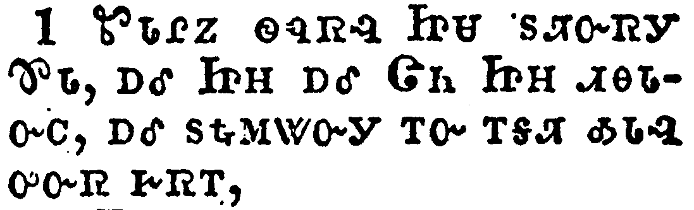</a></td>
</tr>
<tr class="even">
<td>And after six days Jesus taketh Peter, James, and John his brother, and bringeth them up into an high mountain apart,</td>
</tr>
<tr class="odd">
<td>ᏑᏓᎵᏃ ᏫᏄᏒᎸ ᏥᏌ ᏚᏘᏅᏒᎩ ᏈᏓ, ᎠᎴ ᏥᎻ ᎠᎴ ᏣᏂ ᏥᎻ ᏗᎾᏓᏅᏟ, ᎠᎴ ᏚᎿᎭᎷᏔᏅᎩ ᎢᏅ ᎢᎦᏘ ᎣᏓᎸ ᎤᏅᏒ ᎨᏒᎢ,</td>
</tr>
<tr class="even">
<td>Su-da-li-no wi-nu-sv-lv Tsi-sa du-ti-nv-sv-gi Qui-da, a-le Tsi-mi a-le Tsa-ni Tsi-mi di-na-da-nv-tli, a-le du-hna-lu-ta-nv-gi i-nv i-ga-ti o-da-lv u-nv-sv ge-sv-i,</td>
</tr>
</tbody>
</table>

<table>
<tbody>
<tr class="odd">
<td><a href="011702.png">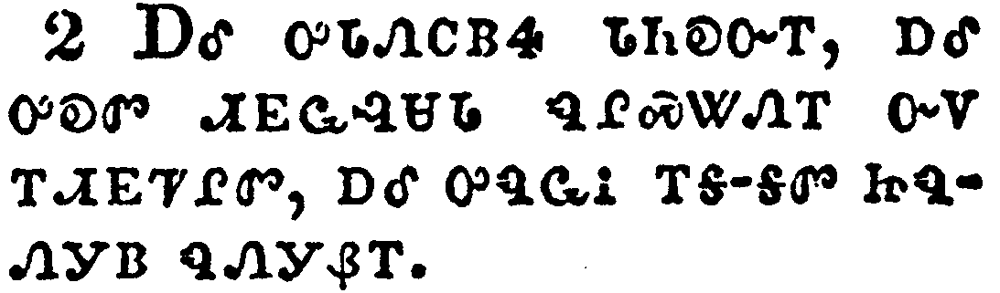</a></td>
</tr>
<tr class="even">
<td>And was transfigured before them: and his face did shine as the sun, and his raiment was white as the light.</td>
</tr>
<tr class="odd">
<td>ᎠᎴ ᎤᏓᏁᏟᏴᏎ ᏓᏂᎧᏅᎢ, ᎠᎴ ᎤᎧᏛ ᏗᎬᏩᎸᏌᏓ ᏄᎵᏍᏔᏁᎢ ᏅᏙ ᎢᏗᎬᏤᎵᏛ, ᎠᎴ ᎤᏄᏩᎥ ᎢᎦ-ᎦᏛ ᏥᏄᏁᎩᏴ ᏄᏁᎩᏰᎢ.</td>
</tr>
<tr class="even">
<td>A-le u-da-ne-tli-yv-se da-ni-ka-nv-i, a-le u-ka-dv di-gv-wa-lv-sa-da nu-li-s-ta-ne-i nv-do i-digv-tse-li-dv, a-le u-nu-wa-v i-ga--ga-dv tsi-nu-ne-gi-yv nu-ne-gi-ye-i.</td>
</tr>
</tbody>
</table>

<table>
<tbody>
<tr class="odd">
<td><a href="011703.png">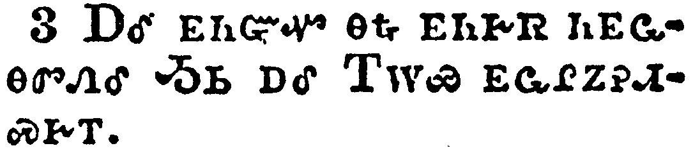</a></td>
</tr>
<tr class="even">
<td>And, behold, there appeared unto them Moses and Elias talking with him.</td>
</tr>
<tr class="odd">
<td>ᎠᎴ ᎬᏂᏳᏉ ᎾᎿᎭᎬᏂᎨᏒ ᏂᎬᏩᎾᏛᏁᎴ ᎼᏏ ᎠᎴ ᎢᎳᏯ ᎬᏩᎵᏃᎮᏗᏍᎨᎢ.</td>
</tr>
<tr class="even">
<td>A-le gv-ni-yu-quo na-hna gv-ni-ge-sv ni-gv-wa-na-dv-ne-le Mo-si a-le I-la-ya gv-wa-li-no-he-di-s-ge-i.</td>
</tr>
</tbody>
</table>

<table>
<tbody>
<tr class="odd">
<td><a href="011704.png">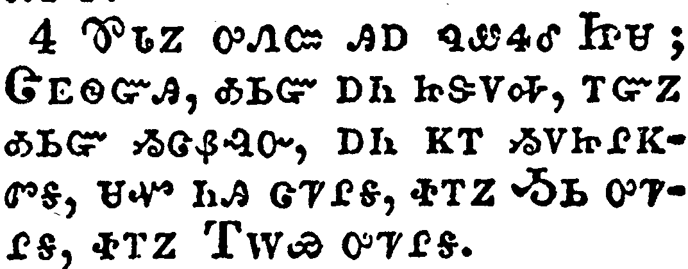</a></td>
</tr>
<tr class="even">
<td>Then answered Peter, and said unto Jesus, Lord, it is good for us to be here: if thou wilt, let us make here three tabernacles; one for thee, and one for Moses, and one for Elias.</td>
</tr>
<tr class="odd">
<td>ᏈᏓᏃ ᎤᏁᏨ ᎯᎠ ᏄᏪᏎᎴ ᏥᏌ; ᏣᎬᏫᏳᎯ, ᎣᏏᏳ ᎠᏂ ᏥᏕᏙᎭ, ᎢᏳᏃ ᎣᏏᏳ ᏱᏣᏰᎸᏅ, ᎠᏂ ᏦᎢ ᏱᏙᏥᎵᏦᏛᎦ, ᏌᏉ ᏂᎯ ᏣᏤᎵᎦ, ᏐᎢᏃ ᎼᏏ ᎤᏤᎵᎦ, ᏐᎢᏃ ᎢᎳᏯ ᎤᏤᎵᎦ.</td>
</tr>
<tr class="even">
<td>Qui-da-no u-ne-tsv hi-a nu-we-se-le Tsi-sa; Tsa-gv-wi-yu-hi, o-si-yu a-ni tsi-de-do-ha, i-yu-no o-si-yu yi-tsa-ye-lv-nv, a-ni tso-i yi-do-tsi-li-tso-dv-ga, sa-quo ni-hi tsa-tse-li-ga, so-i-no Mo-si u-tse-li-ga, so-i-no I-la-ya u-tse-li-ga.</td>
</tr>
</tbody>
</table>

<table>
<tbody>
<tr class="odd">
<td><a href="011705.png">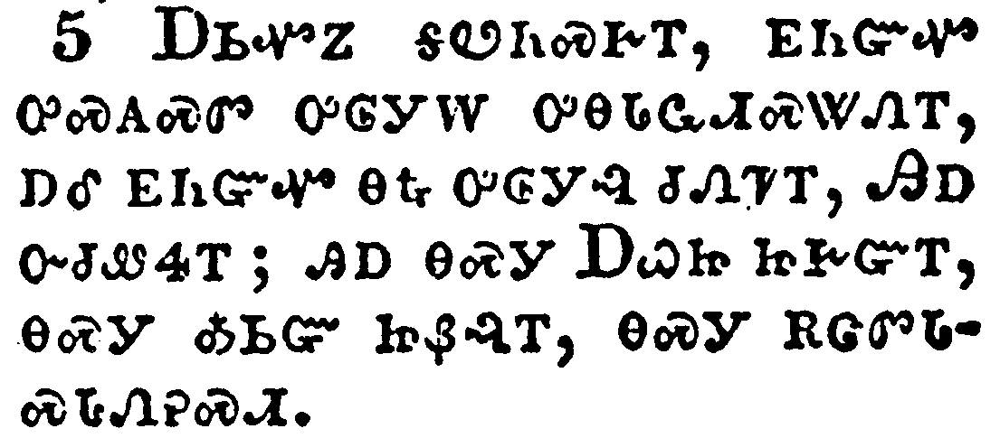</a></td>
</tr>
<tr class="even">
<td>While he yet spake, behold, a bright cloud overshadowed them: and behold a voice out of the cloud, which said, This is my beloved Son, in whom I am well pleased; hear ye him.</td>
</tr>
<tr class="odd">
<td>ᎠᏏᏉᏃ ᎦᏬᏂᏍᎨᎢ, ᎬᏂᏳᏉ ᎤᏍᎪᏍᏛ ᎤᎶᎩᎳ ᎤᎾᏓᏩᏗᏍᏔᏁᎢ, ᎠᎴ ᎬᏂᏳᏉ ᎾᎿᎭᎤᎶᎩᎸ ᏧᏁᏤᎢ, ᎯᎠ ᏅᏧᏪᏎᎢ; ᎯᎠ ᎾᏍᎩ ᎠᏇᏥ ᏥᎨᏳᎢ, ᎾᏍᎩ ᎣᏏᏳ ᏥᏰᎸᎢ, ᎾᏍᎩ ᎡᏣᏛᏓᏍᏓᏁᎮᏍᏗ.</td>
</tr>
<tr class="even">
<td>A-si-quo-no ga-wo-ni-s-ge-i, gv-ni-yu-quo u-s-go-s-dv u-lo-gi-la u-na-da-wa-di-s-ta-ne-i, a-le gv-ni-yu-quo na-hna u-lo-gi-lv tsu-ne-tse-i, Hi-a nv-tsu-we-se-i; hi-a na-s-gi A-que-tsi tsi-ge-yu-i, na-s-gi o-si-yu tsi-ye-lv-i, na-s-gi e-tsa-dv-da-s-da-ne-he-s-di.</td>
</tr>
</tbody>
</table>

<table>
<tbody>
<tr class="odd">
<td><a href="011706.png">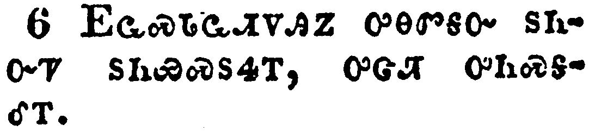</a></td>
</tr>
<tr class="even">
<td>And when the disciples heard it, they fell on their face, and were sore afraid.</td>
</tr>
<tr class="odd">
<td>ᎬᏩᏍᏓᏩᏗᏙᎯᏃ ᎤᎾᏛᎦᏅ ᏚᏂᏅᏤ ᏚᏂᏯᏍᏚᏎᎢ, ᎤᏣᏘ ᎤᏂᏍᎦᎴᎢ.</td>
</tr>
<tr class="even">
<td>Gv-wa-s-da-wa-di-do-hi-no u-na-dv-ga-nv du-ni-nv-tse du-ni-ya-s-du-se-i, u-tsa-ti u-ni-s-ga-le-i.</td>
</tr>
</tbody>
</table>

<table>
<tbody>
<tr class="odd">
<td><a href="011707.png">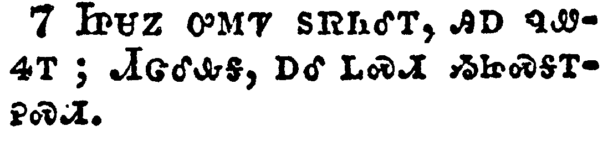</a></td>
</tr>
<tr class="even">
<td>And Jesus came and touched them, and said, Arise, and be not afraid.</td>
</tr>
<tr class="odd">
<td>ᏥᏌᏃ ᎤᎷᏤ ᏚᏒᏂᎴᎢ, ᎯᎠ ᏄᏪᏎᎢ; ᏗᏣᎴᎲᎦ, ᎠᎴ ᏞᏍᏗ ᏱᏥᏍᎦᎢᎮᏍᏗ.</td>
</tr>
<tr class="even">
<td>Tsi-sa-no u-lu-tse du-sv-ni-le-i, hi-a nu-we-se-i; Di-tsa-le-hv-ga, a-le tle-s-di yi-tsi-s-ga-i-he-s-di.</td>
</tr>
</tbody>
</table>

<table>
<tbody>
<tr class="odd">
<td><a href="011708.png">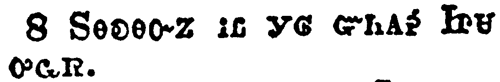</a></td>
</tr>
<tr class="even">
<td>And when they had lifted up their eyes, they saw no man, save Jesus only.</td>
</tr>
<tr class="odd">
<td>ᏚᎾᎧᎾᏅᏃ ᎥᏝ ᎩᎶ ᏳᏂᎪᎮ ᏥᏌ ᎤᏩᏒ.</td>
</tr>
<tr class="even">
<td>Du-na-ka-na-nv-no v-tla gi-lo yu-ni-go-he Tsi-sa u-wa-sv.</td>
</tr>
</tbody>
</table>

<table>
<tbody>
<tr class="odd">
<td><a href="011709.png">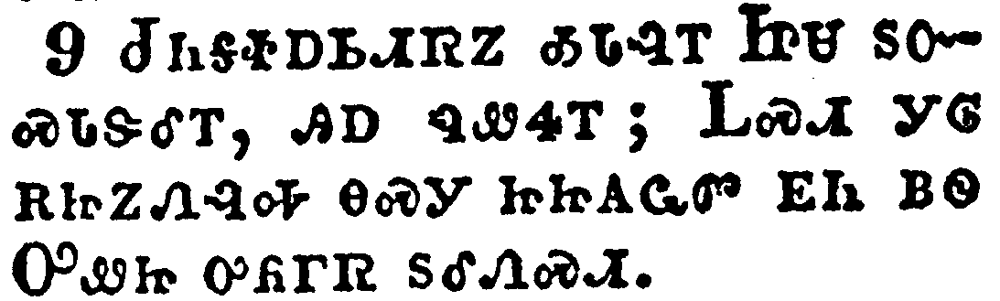</a></td>
</tr>
<tr class="even">
<td>And as they came down from the mountain, Jesus charged them, saying, Tell the vision to no man, until the Son of man be risen again from the dead.</td>
</tr>
<tr class="odd">
<td>ᏧᏂᎦᏐᎠᏏᏗᏒᏃ ᎣᏓᎸᎢ ᏥᏌ ᏚᏅᏍᏓᏕᎴᎢ, ᎯᎠ ᏄᏪᏎᎢ; ᏞᏍᏗ ᎩᎶ ᎡᏥᏃᏁᎸᎭ ᎾᏍᎩ ᏥᏥᎪᏩᏛ ᎬᏂ ᏴᏫ ᎤᏪᏥ ᎤᏲᎱᏒ ᏚᎴᏁᏍᏗ.</td>
</tr>
<tr class="even">
<td>Tsu-ni-ga-so-a-si-di-sv-no o-da-lv-i tsi-sa du-nv-s-da-de-le-i, hi-a nu-we-se-i; Tle-s-di gi-lo e-tsi-no-ne-lv-ha na-s-gi tsi-tsi-go-wa-dv gv-ni yv-wi U-we-tsi u-yo-hu-sv du-le-ne-s-di.</td>
</tr>
</tbody>
</table>

<table>
<tbody>
<tr class="odd">
<td><a href="011710.png">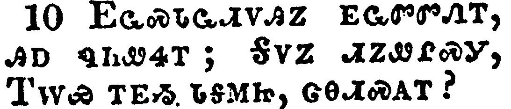</a></td>
</tr>
<tr class="even">
<td>And his disciples asked him, saying, Why then say the scribes that Elias must first come?</td>
</tr>
<tr class="odd">
<td>ᎬᏩᏍᏓᏩᏗᏙᎯᏃ ᎬᏩᏛᏛᏁᎢ, ᎯᎠ ᏄᏂᏪᏎᎢ; ᎦᏙᏃ ᏗᏃᏪᎵᏍᎩ, ᎢᎳᏯ ᎢᎬᏱ ᏓᎦᎷᏥ, ᏣᎾᏗᏍᎪᎢ?</td>
</tr>
<tr class="even">
<td>Gv-wa-s-da-wa-di-do-hi-no gv-wa-dv-dv-ne-i, hi-a nu-ni-we-se-i; Ga-do-no di-no-we-li-s-gi, I-la-ya i-gv-yi da-ga-lu-tsi, tsa-na-di-s-go-i?</td>
</tr>
</tbody>
</table>

<table>
<tbody>
<tr class="odd">
<td><a href="011711.png">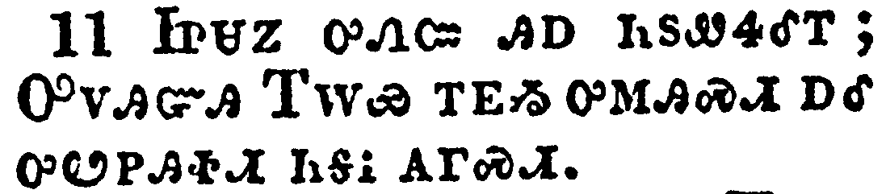</a></td>
</tr>
<tr class="even">
<td>And Jesus answered and said unto them, Elias truly shall first come, and restore all things.</td>
</tr>
<tr class="odd">
<td>ᏥᏌᏃ ᎤᏁᏨ ᎯᎠ ᏂᏚᏪᏎᎴᎢ; ᎤᏙᎯᏳᎯ ᎢᎳᏯ ᎢᎬᏱ ᎤᎷᎯᏍᏗ ᎠᎴ ᎤᏬᏢᎯᏐᏗ ᏂᎦᎥ ᎪᎱᏍᏗ.</td>
</tr>
<tr class="even">
<td>Tsi-sa-no u-ne-tsv hi-a ni-du-we-se-le-i; U-do-hi-yu-hi I-la-ya i-gv-yi u-lu-hi-s-di a-le u-wo-tlv-hi-so-di ni-ga-v go-hu-s-di.</td>
</tr>
</tbody>
</table>

<table>
<tbody>
<tr class="odd">
<td><a href="011712.png">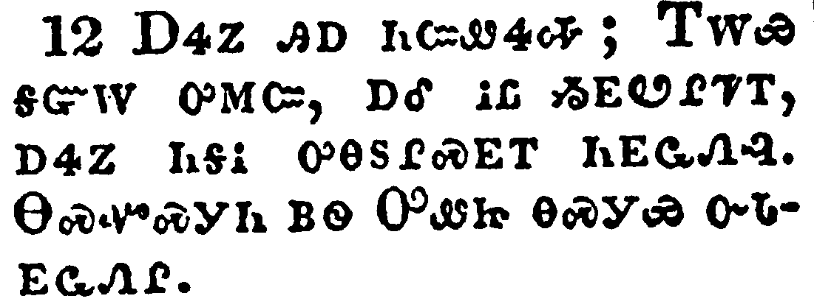</a></td>
</tr>
<tr class="even">
<td>But I say unto you, That Elias is come already, and they knew him not, but have done unto him whatsoever they listed. Likewise shall also the Son of man suffer of them.</td>
</tr>
<tr class="odd">
<td>ᎠᏎᏃ ᎯᎠ ᏂᏨᏪᏎᎭ; ᎢᎳᏯ ᎦᏳᎳ ᎤᎷᏨ, ᎠᎴ ᎥᏝ ᏱᎬᏬᎵᏦᎢ, ᎠᏎᏃ ᏂᎦᎥ ᎤᎾᏚᎵᏍᎬᎢ ᏂᎬᏩᏁᎸ. ᎾᏍᏉᏍᎩᏂ ᏴᏫ ᎤᏪᏥ ᎾᏍᎩᏯ ᏅᏓᎬᏩᏁᎵ.</td>
</tr>
<tr class="even">
<td>A-se-no hi-a ni-tsv-we-se-ha; I-la-ya ga-yu-la u-lu-tsv, a-le v-tla yi-gv-wo-li-tso-i, a-se-no ni-ga-v u-na-du-li-s-gv-i ni-gv-wa-ne-lv. Na-s-quo-s-gi-ni yv-wi U-we-tsi na-s-gi-ya nv-da-gv-wa-ne-li.</td>
</tr>
</tbody>
</table>

<table>
<tbody>
<tr class="odd">
<td><a href="011713.png">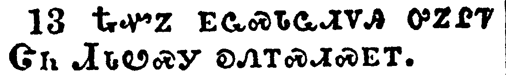</a></td>
</tr>
<tr class="even">
<td>Then the disciples understood that he spake unto them of John the Baptist.</td>
</tr>
<tr class="odd">
<td>ᎿᎭᏉᏃ ᎬᏩᏍᏓᏩᏗᏙᎯ ᎤᏃᎵᏤ ᏣᏂ ᏗᏓᏬᏍᎩ ᎧᏁᎢᏍᏗᏍᎬᎢ.</td>
</tr>
<tr class="even">
<td>Hna-quo-no gv-wa-s-da-wa-di-do-hi u-no-li-tse Tsa-ni Di-da-wo-s-gi ka-ne-i-s-di-s-gv-i.</td>
</tr>
</tbody>
</table>

<table>
<tbody>
<tr class="odd">
<td><a href="011714.png">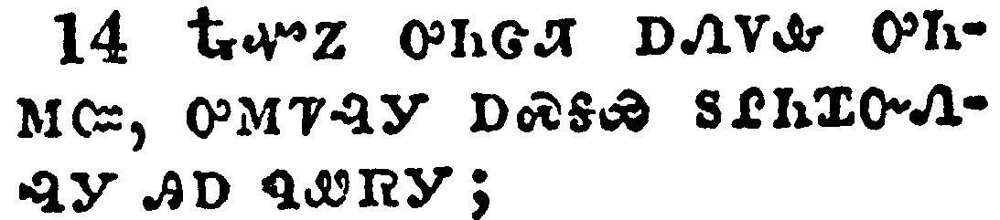</a></td>
</tr>
<tr class="even">
<td>And when they were come to the multitude, there came to him a certain man, kneeling down to him, and saying,</td>
</tr>
<tr class="odd">
<td>ᎿᎭᏉᏃ ᎤᏂᏣᏘ ᎠᏁᏙᎲ ᎤᏂᎷᏨ, ᎤᎷᏤᎸᎩ ᎠᏍᎦᏯ ᏚᎵᏂᏆᏅᏁᎸᎩ ᎯᎠ ᏄᏪᏒᎩ;</td>
</tr>
<tr class="even">
<td>Hna-quo-no u-ni-tsa-ti a-ne-do-hv u-ni-lu-tsv, u-lu-tse-lv-gi a-s-ga-ya du-li-ni-qua-nv-ne-lv-gi hi-a nu-we-sv-gi;</td>
</tr>
</tbody>
</table>

<table>
<tbody>
<tr class="odd">
<td><a href="011715.png">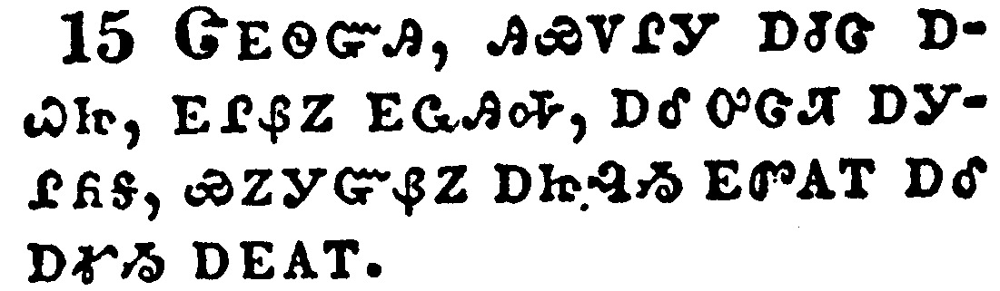</a></td>
</tr>
<tr class="even">
<td>Lord, have mercy on my son: for he is lunatick, and sore vexed: for ofttimes he falleth into the fire, and oft into the water.</td>
</tr>
<tr class="odd">
<td>ᏣᎬᏫᏳᎯ, ᎯᏯᏙᎵᎩ ᎠᏧᏣ ᎠᏇᏥ, ᎬᎵᏰᏃ ᎬᏩᎯᎭ, ᎠᎴ ᎤᏣᏘ ᎠᎩᎵᏲᎦ, ᏯᏃᎩᏳᏰᏃ ᎠᏥᎸᏱ ᎬᏛᎪᎢ ᎠᎴ ᎠᎹᏱ ᎠᎬᎪᎢ.</td>
</tr>
<tr class="even">
<td>Tsa-gv-wi-yu-hi, hi-ya-do-li-gi a-tsu-tsa a-que-tsi, gv-li-ye-no gv-wa-hi-ha, a-le u-tsa-ti a-gi-li-yo-ga, ya-no-gi-yu-ye-no a-tsi-lv-yi gv-dv-go-i a-le a-ma-yi a-gv-go-i.</td>
</tr>
</tbody>
</table>

<table>
<tbody>
<tr class="odd">
<td><a href="011716.png">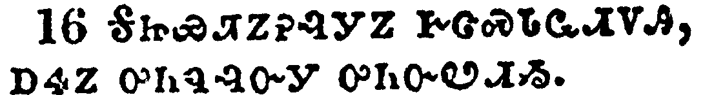</a></td>
</tr>
<tr class="even">
<td>And I brought him to thy disciples, and they could not cure him.</td>
</tr>
<tr class="odd">
<td>ᎦᏥᏯᏘᏃᎮᎸᎩᏃ ᎨᏣᏍᏓᏩᏗᏙᎯ, ᎠᏎᏃ ᎤᏂᏄᎸᏅᎩ ᎤᏂᏅᏬᏗᏱ.</td>
</tr>
<tr class="even">
<td>Ga-tsi-ya-ti-no-he-lv-gi-no ge-tsa-s-da-wa-di-do-hi, a-se-no u-ni-nu-lv-nv-gi u-ni-nv-wo-di-yi.</td>
</tr>
</tbody>
</table>

<table>
<tbody>
<tr class="odd">
<td><a href="011717.png">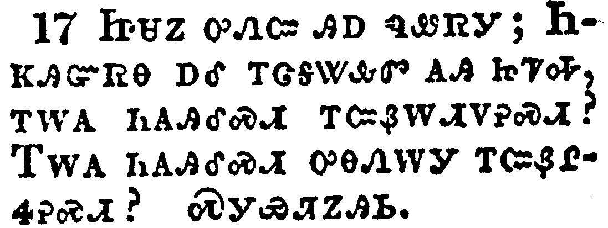</a></td>
</tr>
<tr class="even">
<td>Then Jesus answered and said, O faithless and perverse generation, how long shall I be with you? how long shall I suffer you? bring him hither to me.</td>
</tr>
<tr class="odd">
<td>ᏥᏌᏃ ᎤᏁᏨ ᎯᎠ ᏄᏪᏒᎩ; ᏂᏦᎯᏳᏒᎾ ᎠᎴ ᎢᏣᎦᏔᎲᏛ ᎪᎯ ᏥᏤᎭ, ᎢᎳᎪ ᏂᎪᎯᎴᏍᏗ ᎢᏨᏰᎳᏗᏙᎮᏍᏗ? ᎢᎳᎪ ᏂᎪᎯᎴᏍᏗ ᎤᎾᏁᎳᎩ ᎢᏨᏰᎵᏎᎮᏍᏗ? ᏍᎩᏯᏘᏃᎯᏏ.</td>
</tr>
<tr class="even">
<td>Tsi-sa-no u-ne-tsv hi-a nu-we-sv-gi; Ni-tso-hi-yu-sv-na a-le i-tsa-ga-ta-hv-dv go-hi tsi-tse-ha, i-la-go ni-go-hi-le-s-di i-tsv-ye-la-di-do-he-s-di? I-la-go ni-go-hi-le-s-di u-na-ne-la-gi i-tsv-ye-li-se-he-s-di? S-gi-ya-ti-no-hi-si.</td>
</tr>
</tbody>
</table>

<table>
<tbody>
<tr class="odd">
<td><a href="011718.png">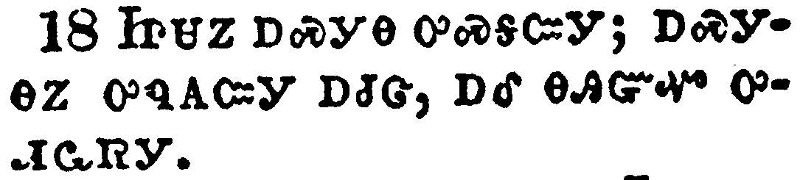</a></td>
</tr>
<tr class="even">
<td>And Jesus rebuked the devil; and he departed out of him: and the child was cured from that very hour.</td>
</tr>
<tr class="odd">
<td>ᏥᏌᏃ ᎠᏍᎩᎾ ᎤᏍᎦᏨᎩ; ᎠᏍᎩᎾᏃ ᎤᏄᎪᏨᎩ ᎠᏧᏣ, ᎠᎴ ᎾᎯᏳᏉ ᎤᏗᏩᏒᎩ.</td>
</tr>
<tr class="even">
<td>Tsi-sa-no a-s-gi-na u-s-ga-tsv-gi; a-s-gi-na-no u-nu-go-tsv-gi a-tsu-tsa, a-le na-hi-yu-quo u-di-wa-sv-gi.</td>
</tr>
</tbody>
</table>

<table>
<tbody>
<tr class="odd">
<td><a href="011719.png">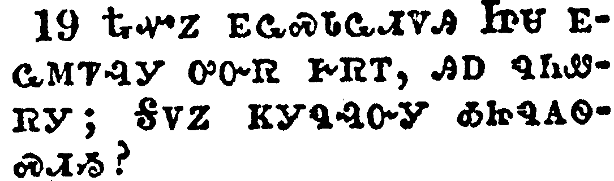</a></td>
</tr>
<tr class="even">
<td>Then came the disciples to Jesus apart, and said, Why could not we cast him out?</td>
</tr>
<tr class="odd">
<td>ᎿᎭᏉᏃ ᎬᏩᏍᏓᏩᏗᏙᎯ ᏥᏌ ᎬᏩᎷᏤᎸᎩ ᎤᏅᏒ ᎨᏒᎢ, ᎯᎠ ᏄᏂᏪᏒᎩ; ᎦᏙᏃ ᏦᎩᏄᎸᏅᎩ ᎣᏥᏄᎪᏫᏍᏗᏱ?</td>
</tr>
<tr class="even">
<td>Hna-quo-no gv-wa-s-da-wa-di-do-hi Tsi-sa gv-wa-lu-tse-lv-gi u-nv-sv ge-sv-i, hi-a nu-ni-we-sv-gi; Ga-do-no tso-gi-nu-lv-nv-gi o-tsi-nu-go-wi-s-di-yi?</td>
</tr>
</tbody>
</table>

<table>
<tbody>
<tr class="odd">
<td><a href="011720.png">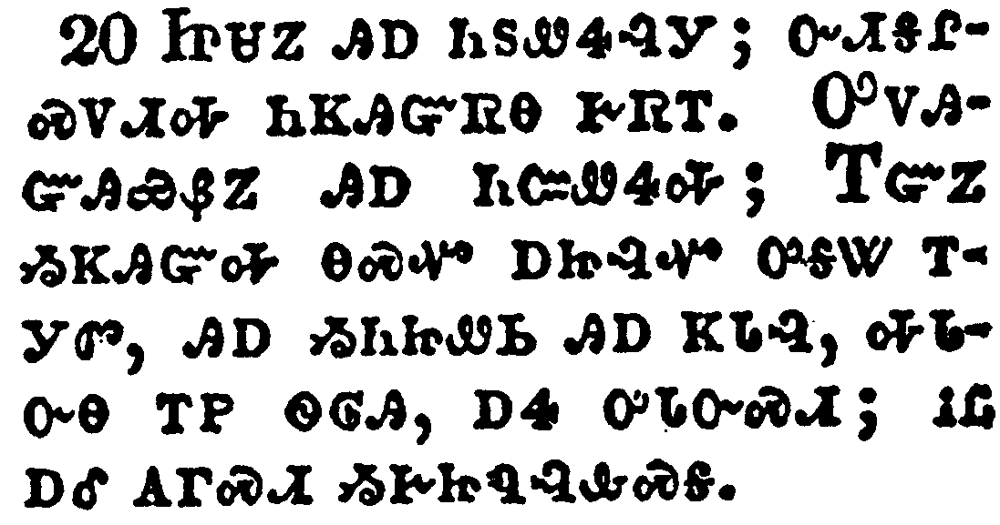</a></td>
</tr>
<tr class="even">
<td>And Jesus said unto them, Because of your unbelief: for verily I say unto you, If ye have faith as a grain of mustard seed, ye shall say unto this mountain, Remove hence to yonder place; and it shall remove; and nothing shall be impossible unto you.</td>
</tr>
<tr class="odd">
<td>ᏥᏌᏃ ᎯᎠ ᏂᏚᏪᏎᎸᎩ; ᏅᏗᎦᎵᏍᏙᏗᎭ ᏂᏦᎯᏳᏒᎾ ᎨᏒᎢ. ᎤᏙᎯᏳᎯᏯᏰᏃ ᎯᎠ ᏂᏨᏪᏎᎭ; ᎢᏳᏃ ᏱᏦᎯᏳᎭ ᎾᏍᏉ ᎠᏥᎸᏉ ᎤᎦᏔ ᎢᎩᏛ, ᎯᎠ ᏱᏂᏥᏪᏏ ᎯᎠ ᏦᏓᎸ, ᎭᏓᏅᎾ ᎢᏢ ᏫᎶᎯ, ᎠᎭ ᎤᏓᏅᏍᏗ; ᎥᏝ ᎠᎴ ᎪᎱᏍᏗ ᏱᎨᏥᏄᎸᎲᏍᎦ.</td>
</tr>
<tr class="even">
<td>Tsi-sa-no hi-a ni-du-we-se-lv-gi; nv-di-ga-li-s-do-di-ha ni-tso-hi-yu-sv-na ge-sv-i. U-do-hi-yu-hi-ya-ye-no hi-a ni-tsv-we-se-ha; I-yu-no yi-tso-hi-yu-ha na-s-quo a-tsi-lv-quo u-ga-ta i-gi-dv, hi-a yi-ni-tsi-we-si hi-a tso-da-lv, ha-da-nv-na i-tlv wi-lo-hi, a-ha u-da-nv-s-di; v-tla a-le go-hu-s-di yi-ge-tsi-nu-lv-hv-s-ga.</td>
</tr>
</tbody>
</table>

<table>
<tbody>
<tr class="odd">
<td><a href="011721.png">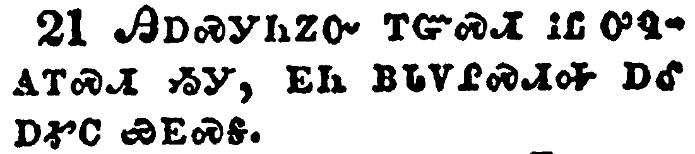</a></td>
</tr>
<tr class="even">
<td>Howbeit this kind goeth not out but by prayer and fasting.</td>
</tr>
<tr class="odd">
<td>ᎯᎠᏍᎩᏂᏃᏅ ᎢᏳᏍᏗ ᎥᏝ ᎤᏄᎪᎢᏍᏗ ᏱᎩ, ᎬᏂ ᏴᏓᏙᎵᏍᏗᎭ ᎠᎴ ᎠᎹᏟ ᏯᎬᏍᎦ.</td>
</tr>
<tr class="even">
<td>Hi-a-s-gi-ni-no-nv i-yu-s-di v-tla u-nu-go-i-s-di yi-gi, gv-ni yv-da-do-li-s-di-ha a-le a-ma-tli ya-gv-s-ga.</td>
</tr>
</tbody>
</table>

<table>
<tbody>
<tr class="odd">
<td><a href="011722.png">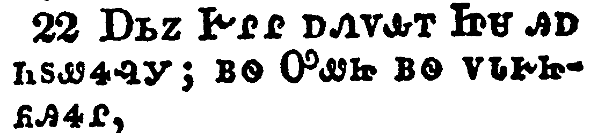</a></td>
</tr>
<tr class="even">
<td>And while they abode in Galilee, Jesus said unto them, The Son of man shall be betrayed into the hands of men:</td>
</tr>
<tr class="odd">
<td>ᎠᏏᏃ ᎨᎵᎵ ᎠᏁᏙᎲᎢ ᏥᏌ ᎯᎠ ᏂᏚᏪᏎᎸᎩ; ᏴᏫ ᎤᏪᏥ ᏴᏫ ᏙᏓᎨᏥᏲᎯᏎᎵ,</td>
</tr>
<tr class="even">
<td>A-si-no Ge-li-li a-ne-do-hv-i Tsi-sa hi-a ni-du-we-se-lv-gi; yv-wi U-we-tsi yv-wi do-da-ge-tsi-yo-hi-se-li,</td>
</tr>
</tbody>
</table>

<table>
<tbody>
<tr class="odd">
<td><a href="011723.png">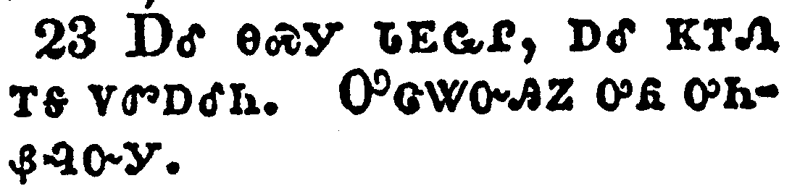</a></td>
</tr>
<tr class="even">
<td>And they shall kill him, and the third day he shall be raised again. And they were exceeding sorry.</td>
</tr>
<tr class="odd">
<td>ᎠᎴ ᎾᏍᎩ ᏓᎬᏩᎵ, ᎠᎴ ᏦᎢᏁ ᎢᎦ ᏙᏛᎠᎴᏂ. ᎤᏣᏔᏅᎯᏃ ᎤᏲ ᎤᏂᏰᎸᏅᎩ.</td>
</tr>
<tr class="even">
<td>A-le na-s-gi da-gv-wa-li, a-le tso-i-ne i-ga do-dv-a-le-ni. U-tsa-ta-nv-hi-no u-yo u-ni-ye-lv-nv-gi.</td>
</tr>
</tbody>
</table>

<table>
<tbody>
<tr class="odd">
<td><a href="011724.png">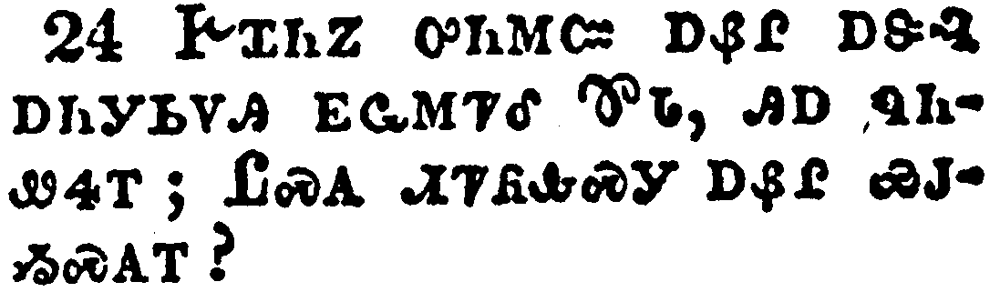</a></td>
</tr>
<tr class="even">
<td>And when they were come to Capernaum, they that received tribute money came to Peter, and said, Doth not your master pay tribute?</td>
</tr>
<tr class="odd">
<td>ᎨᏆᏂᏃ ᎤᏂᎷᏨ ᎠᏰᎵ ᎠᏕᎸ ᎠᏂᎩᏏᏙᎯ ᎬᏩᎷᏤᎴ ᏈᏓ, ᎯᎠ ᏄᏂᏪᏎᎢ; ᏝᏍᎪ ᏗᏤᏲᎲᏍᎩ ᎠᏰᎵ ᏯᎫᏱᏍᎪᎢ?</td>
</tr>
<tr class="even">
<td>Ge-qua-ni-no u-ni-lu-tsv a-ye-li a-de-lv a-ni-gi-si-do-hi gv-wa-lu-tse-le Qui-da, hi-a nu-ni-we-se-i; Tla-s-go di-tse-yo-hv-s-gi a-ye-li ya-gu-yi-s-go-i?</td>
</tr>
</tbody>
</table>

<table>
<tbody>
<tr class="odd">
<td><a href="011725.png">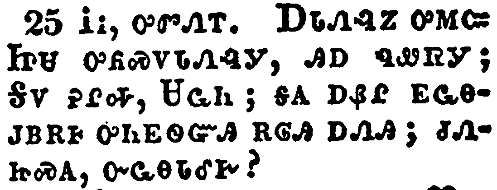</a></td>
</tr>
<tr class="even">
<td>He saith, Yes. And when he was come into the house, Jesus prevented him, saying, What thinkest thou, Simon? of whom do the kings of the earth take custom or tribute? of their own children, or of strangers?</td>
</tr>
<tr class="odd">
<td>ᎥᎥ, ᎤᏛᏁᎢ. ᎠᏓᏁᎸᏃ ᎤᎷᏨ ᏥᏌ ᎤᏲᏍᏙᏓᏁᎸᎩ, ᎯᎠ ᏄᏪᏒᎩ; ᎦᏙ ᎮᎵᎭ, ᏌᏩᏂ; ᎦᎪ ᎠᏰᎵ ᎬᏩᎾᎫᏴᎡᎰ ᎤᏂᎬᏫᏳᎯ ᎡᎶᎯ ᎠᏁᎯ; ᏧᏁᏥᏍᎪ, ᏅᏩᎾᏓᎴᎨ?</td>
</tr>
<tr class="even">
<td>V-v, u-dv-ne-i. A-da-ne-lv-no u-lu-tsv Tsi-sa u-yo-s-do-da-ne-lv-gi, hi-a nu-we-sv-gi; Ga-do he-li-ha, Sa-wa-ni; ga-go a-ye-li gv-wa-na-gu-yv-e-ho u-ni-gv-wi-yu-hi e-lo-hi a-ne-hi; tsu-ne-tsi-s-go, nv-wa-na-da-le-ge?</td>
</tr>
</tbody>
</table>

<table>
<tbody>
<tr class="odd">
<td><a href="011726.png">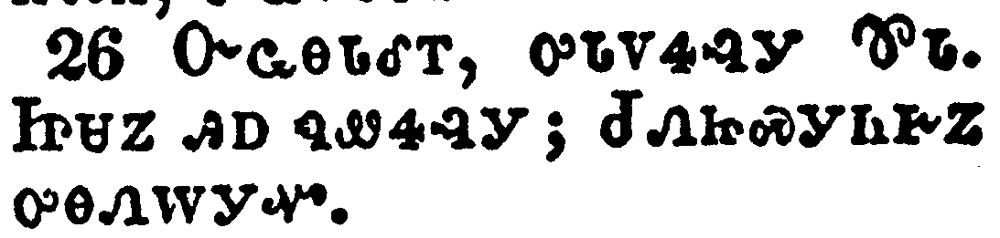</a></td>
</tr>
<tr class="even">
<td>Peter saith unto him, Of strangers. Jesus saith unto him, Then are the children free.</td>
</tr>
<tr class="odd">
<td>ᏅᏩᎾᏓᎴᎢ, ᎤᏓᏙᏎᎸᎩ ᏈᏓ. ᏥᏌᏃ ᎯᎠ ᏄᏪᏎᎸᎩ; ᏧᏁᏥᏍᎩᏂᎨᏃ ᎤᎾᏁᎳᎩᏉ.</td>
</tr>
<tr class="even">
<td>Nv-wa-na-da-le-i, u-da-do-se-lv-gi Qui-da. Tsi-sa-no hi-a nu-we-se-lv-gi; Tsu-ne-tsi-s-gi-ni-ge-no u-na-ne-la-gi-quo.</td>
</tr>
</tbody>
</table>

<table>
<tbody>
<tr class="odd">
<td><a href="011727.png">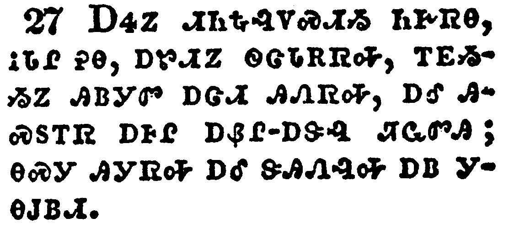</a></td>
</tr>
<tr class="even">
<td>Notwithstanding, lest we should offend them, go thou to the sea, and cast an hook, and take up the fish that first cometh up; and when thou hast opened his mouth, thou shalt find a piece of money: that take, and give unto them for me and thee.</td>
</tr>
<tr class="odd">
<td>ᎠᏎᏃ ᏗᏂᎿᎭᎸᏙᏍᏗᏱ ᏂᎨᏒᎾ, ᎥᏓᎵ ᎮᎾ, ᎠᏑᏗᏃ ᏫᏣᏓᎡᏒᎭ, ᎢᎬᏱᏱᏃ ᎯᏴᎩᏛ ᎠᏣᏗ ᎯᏁᏒᎭ, ᎠᎴ ᎯᏍᏚᎢᏒ ᎠᎰᎵ ᎠᏰᎵ-ᎠᏕᎸ ᏘᏩᏛᎯ; ᎾᏍᎩ ᎯᎩᏒᎭ ᎠᎴ ᏕᎯᏁᎸᎭ ᎠᏴ ᎩᎾᎫᏴᏗ.</td>
</tr>
<tr class="even">
<td>A-se-no di-ni-hna-lv-do-s-di-yi ni-ge-sv-na, v-da-li he-na, a-su-di-no wi-tsa-da-e-sv-ha, i-gv-yi-yi-no hi-yv-gi-dv a-tsa-di hi-ne-sv-ha, a-le hi-s-du-i-sv a-ho-li a-ye-li--a-de-lv ti-wa-dv-hi; na-s-gi hi-gi-sv-ha a-le de-hi-ne-lv-ha a-yv gi-na-gu-yv-di.</td>
</tr>
</tbody>
</table>

