+++
draft=false
date = 2014-12-18T21:11:07Z
title = "Matthew - Chapter 18 - Cherokee New Testament"
weight = 1418955067

[taxonomies]

authors = ["Timothy Legg"]
categories = []
tags = []

[extra]
+++

<table>
<tbody>
<tr class="odd">
<td><a href="011801.png">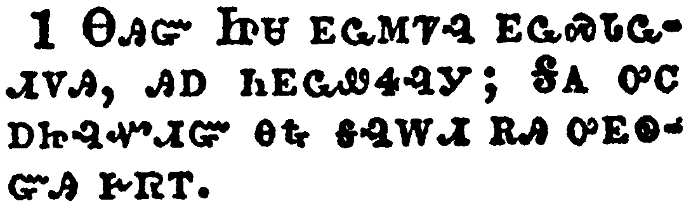</a></td>
</tr>
<tr class="even">
<td>At the same time came the disciples unto Jesus, saying, Who is the greatest in the kingdom of heaven?</td>
</tr>
<tr class="odd">
<td>ᎾᎯᏳ ᏥᏌ ᎬᏩᎷᏤᎸ ᎬᏩᏍᏓᏩᏗᏙᎯ, ᎯᎠ ᏂᎬᏩᏪᏎᎸᎩ; ᎦᎪ ᎤᏟᎠ ᏥᎸᏉᏗᏳ ᎾᎿᎭᎦᎸᎳᏗ ᎡᎯ ᎤᎬᏫᏳᎯ ᎨᏒᎢ.</td>
</tr>
<tr class="even">
<td>Na-hi-yu Tsi-sa gv-wa-lu-tse-lv gv-wa-s-da-wa-di-do-hi, hi-a ni-gv-wa-we-se-lv-gi; Ga-go u-tli-a tsi-lv-quo-di-yu na-hna ga-lv-la-di e-hi u-gv-wi-yu-hi ge-sv-i.</td>
</tr>
</tbody>
</table>

<table>
<tbody>
<tr class="odd">
<td><a href="011802.png">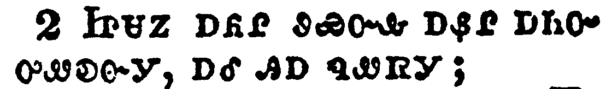</a></td>
</tr>
<tr class="even">
<td>And Jesus called a little child unto him, and set him in the midst of them,</td>
</tr>
<tr class="odd">
<td>ᏥᏌᏃ ᎠᏲᎵ ᏭᏯᏅᎲ ᎠᏰᎵ ᎠᏂᏅ ᎤᏪᎧᏅᎩ, ᎠᎴ ᎯᎠ ᏄᏪᏒᎩ;</td>
</tr>
<tr class="even">
<td>Tsi-sa-no a-yo-li wu-ya-nv-hv a-ye-li a-ni-nv u-we-ka-nv-gi, a-le hi-a nu-we-sv-gi;</td>
</tr>
</tbody>
</table>

<table>
<tbody>
<tr class="odd">
<td><a href="011803.png">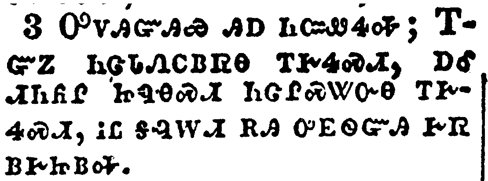</a></td>
</tr>
<tr class="even">
<td>And said, Verily I say unto you, Except ye be converted, and become as little children, ye shall not enter into the kingdom of heaven.</td>
</tr>
<tr class="odd">
<td>ᎤᏙᎯᏳᎯᏯ ᎯᎠ ᏂᏨᏪᏎᎭ; ᎢᏳᏃ ᏂᏣᏓᏁᏟᏴᏒᎾ ᎢᎨᏎᏍᏗ, ᎠᎴ ᏗᏂᏲᎵ ᏥᏄᎾᏍᏗ ᏂᏣᎵᏍᏔᏅᎾ ᎢᎨᏎᏍᏗ, ᎥᏝ ᎦᎸᎳᏗ ᎡᎯ ᎤᎬᏫᏳᎯ ᎨᏒ ᏴᎨᏥᏴᎭ.</td>
</tr>
<tr class="even">
<td>U-do-hi-yu-hi-ya hi-a ni-tsv-we-se-ha; I-yu-no ni-tsa-da-ne-tli-yv-sv-na i-ge-se-s-di, a-le di-ni-yo-li tsi-nu-na-s-di ni-tsa-li-s-ta-nv-na i-ge-se-s-di, v-tla ga-lv-la-di e-hi u-gv-wi-yu-hi ge-sv yv-ge-tsi-yv-ha.</td>
</tr>
</tbody>
</table>

<table>
<tbody>
<tr class="odd">
<td><a href="011804.png">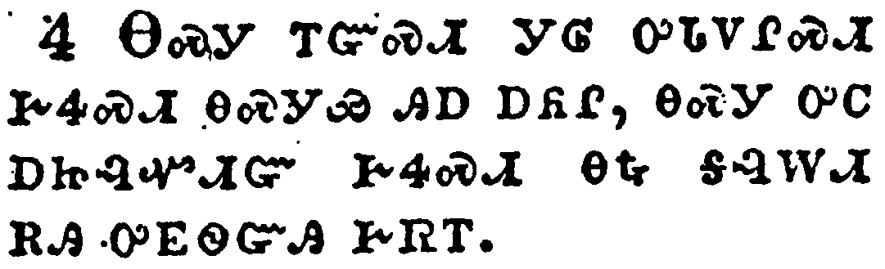</a></td>
</tr>
<tr class="even">
<td>Whosoever therefore shall humble himself as this little child, the same is greatest in the kingdom of heaven.</td>
</tr>
<tr class="odd">
<td>ᎾᏍᎩ ᎢᏳᏍᏗ ᎩᎶ ᎤᏓᏙᎵᏍᏗ ᎨᏎᏍᏗ ᎾᏍᎩᏯ ᎯᎠ ᎠᏲᎵ, ᎾᏍᎩ ᎤᏟ ᎠᏥᎸᏉᏗᏳ ᎨᏎᏍᏗ ᎾᎿᎭᎦᎸᎳᏗ ᎡᎯ ᎤᎬᏫᏳᎯ ᎨᏒᎢ.</td>
</tr>
<tr class="even">
<td>Na-s-gi i-yu-s-di gi-lo u-da-do-li-s-di ge-se-s-di na-s-gi-ya hi-a a-yo-li, na-s-gi u-tli a-tsi-lv-quo-di-yu ge-se-s-di na-hna ga-lv-la-di e-hi u-gv-wi-yu-hi ge-sv-i.</td>
</tr>
</tbody>
</table>

<table>
<tbody>
<tr class="odd">
<td><a href="011805.png">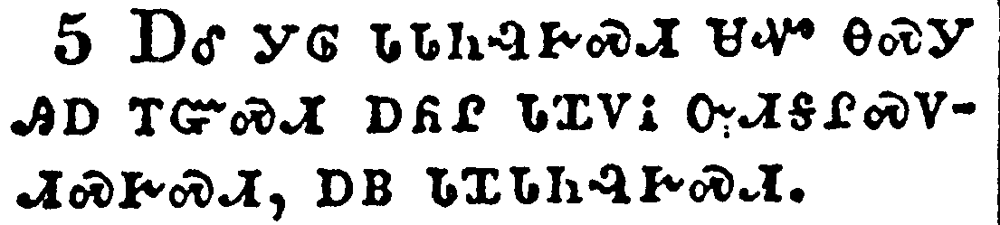</a></td>
</tr>
<tr class="even">
<td>And whoso shall receive one such little child in my name receiveth me.</td>
</tr>
<tr class="odd">
<td>ᎠᎴ ᎩᎶ ᏓᏓᏂᎸᎨᏍᏗ ᏌᏉ ᎾᏍᎩ ᎯᎠ ᎢᏳᏍᏗ ᎠᏲᎵ ᏓᏆᏙᎥ ᏅᏗᎦᎵᏍᏙᏗᏍᎨᏍᏗ, ᎠᏴ ᏓᏆᏓᏂᎸᎨᏍᏗ.</td>
</tr>
<tr class="even">
<td>A-le gi-lo da-da-ni-lv-ge-s-di sa-quo na-s-gi hi-a i-yu-s-di a-yo-li da-qua-do-v nv-di-ga-li-s-do-di-s-ge-s-di, a-yv da-qua-da-ni-lv-ge-s-di.</td>
</tr>
</tbody>
</table>

<table>
<tbody>
<tr class="odd">
<td><a href="011806.png">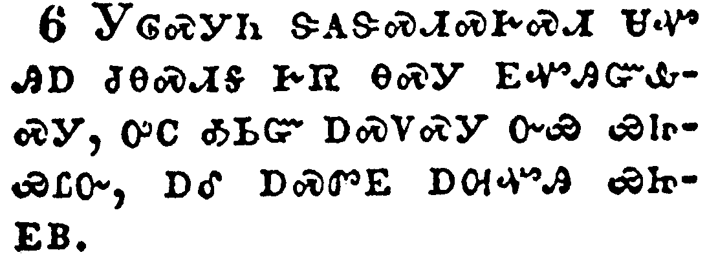</a></td>
</tr>
<tr class="even">
<td>But whoso shall offend one of these little ones which believe in me, it were better for him that a millstone were hanged about his neck, and that he were drowned in the depth of the sea.</td>
</tr>
<tr class="odd">
<td>ᎩᎶᏍᎩᏂ ᏕᎪᏕᏍᏗᏍᎨᏍᏗ ᏌᏉ ᎯᎠ ᏧᎾᏍᏗᎦ ᎨᏒ ᎾᏍᎩ ᎬᏉᎯᏳᎲᏍᎩ, ᎤᏟ ᎣᏏᏳ ᎠᏍᏙᏍᎩ ᏅᏯ ᏯᏥᏯᏝᏅ, ᎠᎴ ᎠᏍᏛᎬ ᎠᎺᏉᎯ ᏯᏥᎬᏴ.</td>
</tr>
<tr class="even">
<td>Gi-lo-s-gi-ni de-go-de-s-di-s-ge-s-di sa-quo hi-a tsu-na-s-di-ga ge-sv na-s-gi gv-quo-hi-yu-hv-s-gi, u-tli o-si-yu a-s-do-s-gi nv-ya ya-tsi-ya-tla-nv, a-le a-s-dv-gv a-me-quo-hi ya-tsi-gv-yv.</td>
</tr>
</tbody>
</table>

<table>
<tbody>
<tr class="odd">
<td><a href="011807.png">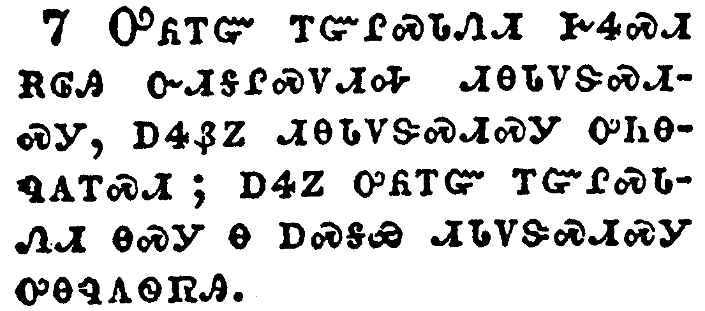</a></td>
</tr>
<tr class="even">
<td>Woe unto the world because of offences! for it must needs be that offences come; but woe to that man by whom the offence cometh!</td>
</tr>
<tr class="odd">
<td>ᎤᏂᎢᏳ ᎢᏳᎵᏍᏓᏁᏗ ᎨᏎᏍᏗ ᎡᎶᎯ ᏅᏗᎦᎵᏍᏙᏗᎭ ᏗᎾᏓᏙᏕᏍᏗᏍᎩ, ᎠᏎᏰᏃ ᏗᎾᏓᏙᏕᏍᏗᏍᎩ ᎤᏂᎾᏄᎪᎢᏍᏗ; ᎠᏎᏃ ᎤᏲᎢᏳ ᎢᏳᎵᏍᏓᏁᏗ ᎾᏍᎩ Ꮎ ᎠᏍᎦᏯ ᏗᏓᏙᏕᏍᏗᏍᎩ ᎤᎾᏄᎪᏫᏒᎯ.</td>
</tr>
<tr class="even">
<td>U-ni-i-yu i-yu-li-s-da-ne-di ge-se-s-di e-lo-hi nv-di-ga-li-s-do-di-ha di-na-da-do-de-s-di-s-gi, a-se-ye-no di-na-da-do-de-s-di-s-gi u-ni-na-nu-go-i-s-di; a-se-no u-yo-i-yu i-yu-li-s-da-ne-di na-s-gi na a-s-ga-ya di-da-do-de-s-di-s-gi u-na-nu-go-wi-sv-hi.</td>
</tr>
</tbody>
</table>

<table>
<tbody>
<tr class="odd">
<td><a href="011808.png">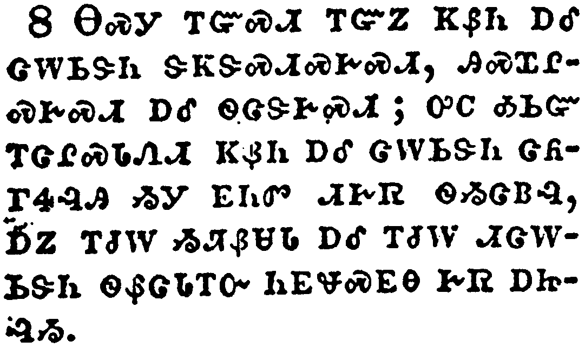</a></td>
</tr>
<tr class="even">
<td>Wherefore if thy hand or thy foot offend thee, cut them off, and cast them from thee: it is better for thee to enter into life halt or maimed, rather than having two hands or two feet to be cast into everlasting fire.</td>
</tr>
<tr class="odd">
<td>ᎾᏍᎩ ᎢᏳᏍᏗ ᎢᏳᏃ ᏦᏰᏂ ᎠᎴ ᏣᎳᏏᏕᏂ ᏕᏦᏕᏍᏗᏍᎨᏍᏗ, ᎯᏍᏆᎵᏍᎨᏍᏗ ᎠᎴ ᏫᏣᏕᎨᏍᏗ; ᎤᏟ ᎣᏏᏳ ᎢᏣᎵᏍᏓᏁᏗ ᏦᏰᏂ ᎠᎴ ᏣᎳᏏᏕᏂ ᏣᏲᎱᏎᎸᎯ ᏱᎩ ᎬᏂᏛ ᏗᎨᏒ ᏫᏱᏣᏴᎸ, ᎠᏃ ᎢᏧᎳ ᏱᏘᏰᏌᏓ ᎠᎴ ᎢᏧᎳ ᏗᏣᎳᏏᏕᏂ ᏫᏰᏣᏓᎢᏅ ᏂᎬᏠᏍᎬᎾ ᎨᏒ ᎠᏥᎸᏱ.</td>
</tr>
<tr class="even">
<td>Na-s-gi i-yu-s-di i-yu-no tso-ye-ni a-le tsa-la-si-de-ni de-tso-de-s-di-s-ge-s-di, hi-s-qua-li-s-ge-s-di a-le wi-tsa-de-ge-s-di; u-tli o-si-yu i-tsa-li-s-da-ne-di tso-ye-ni a-le tsa-la-si-de-ni tsa-yo-hu-se-lv-hi yi-gi gv-ni-dv di-ge-sv wi-yi-tsa-yv-lv, a-no i-tsu-la yi-ti-ye-sa-da a-le i-tsu-la di-tsa-la-si-de-ni wi-ye-tsa-da-i-nv ni-gv-tlo-s-gv-na ge-sv a-tsi-lv-yi.</td>
</tr>
</tbody>
</table>

<table>
<tbody>
<tr class="odd">
<td><a href="011809.png">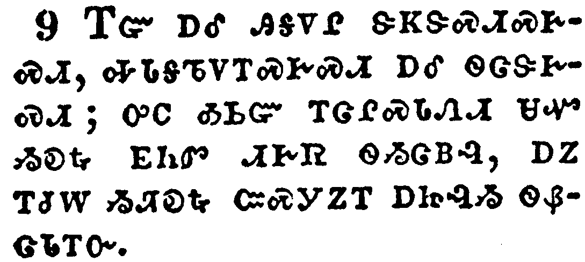</a></td>
</tr>
<tr class="even">
<td>And if thine eye offend thee, pluck it out, and cast it from thee: it is better for thee to enter into life with one eye, rather than having two eyes to be cast into hell fire.</td>
</tr>
<tr class="odd">
<td>ᎢᏳ ᎠᎴ ᎯᎦᏙᎵ ᏕᏦᏕᏍᏗᏍᎨᏍᏗ, ᎭᏓᎦᏖᏙᎢᏍᎨᏍᏗ ᎠᎴ ᏫᏣᏕᎨᏍᏗ; ᎤᏟ ᎣᏏᏳ ᎢᏣᎵᏍᏓᏁᏗ ᏌᏉ ᏱᎧᎿᎭᎬᏂᏛ ᏗᎨᏒ ᏫᏱᏣᏴᎸ, ᎠᏃ ᎢᏧᎳ ᏱᏘᎧᎿᎭᏨᏍᎩᏃᎢ ᎠᏥᎸᏱ ᏫᏰᏣᏓᎢᏅ.</td>
</tr>
<tr class="even">
<td>I-yu a-le hi-ga-do-li de-tso-de-s-di-s-ge-s-di, ha-da-ga-te-do-i-s-ge-s-di a-le wi-tsa-de-ge-s-di; u-tli o-si-yu i-tsa-li-s-da-ne-di sa-quo yi-ka-hna gv-ni-dv di-ge-sv wi-yi-tsa-yv-lv, a-no i-tsu-la yi-ti-ka-hna tsv-s-gi-no-i a-tsi-lv-yi wi-ye-tsa-da-i-nv.</td>
</tr>
</tbody>
</table>

<table>
<tbody>
<tr class="odd">
<td><a href="011810.png">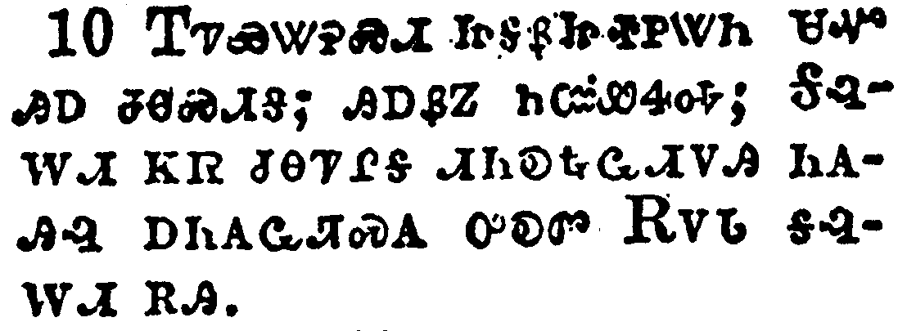</a></td>
</tr>
<tr class="even">
<td>Take heed that ye despise not one of these little ones; for I say unto you, That in heaven their angels do always behold the face of my Father which is in heaven.</td>
</tr>
<tr class="odd">
<td>ᎢᏤᏯᏔᎮᏍᏗ ᏥᎦᏰᏥᏐᏢᏔᏂ ᏌᏉ ᎯᎠ ᏧᎾᏍᏗᎦ; ᎯᎠᏰᏃ ᏂᏨᏪᏎᎭ; ᎦᎸᎳᏗ ᏦᏒ ᏧᎾᏤᎵᎦ ᏗᏂᎧᎿᎭᏩᏗᏙᎯ ᏂᎪᎯᎸ ᎠᏂᎪᏩᏘᏍᎪ ᎤᎧᏛ ᎡᏙᏓ ᎦᎸᎳᏗ ᎡᎯ.</td>
</tr>
<tr class="even">
<td>I-tse-ya-ta-he-s-di tsi-ga-ye-tsi-so-tlv-ta-ni sa-quo hi-a tsu-na-s-di-ga; hi-a-ye-no ni-tsv-we-se-ha; Ga-lv-la-di tso-sv tsu-na-tse-li-ga di-ni-ka-hna-wa-di-do-hi ni-go-hi-lv a-ni-go-wa-ti-s-go u-ka-dv E-do-da ga-lv-la-di e-hi.</td>
</tr>
</tbody>
</table>

<table>
<tbody>
<tr class="odd">
<td><a href="011811.png">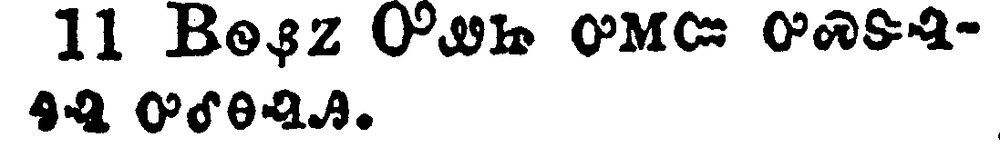</a></td>
</tr>
<tr class="even">
<td>For the Son of man is come to save that which was lost.</td>
</tr>
<tr class="odd">
<td>ᏴᏫᏰᏃ ᎤᏪᏥ ᎤᎷᏨ ᎤᏍᏕᎸᎯᎸ ᎤᎴᎾᎸᎯ.</td>
</tr>
<tr class="even">
<td>Yv-wi-ye-no U-we-tsi u-lu-tsv u-s-de-lv-hi-lv u-le-na-lv-hi.</td>
</tr>
</tbody>
</table>

<table>
<tbody>
<tr class="odd">
<td><a href="011812.png">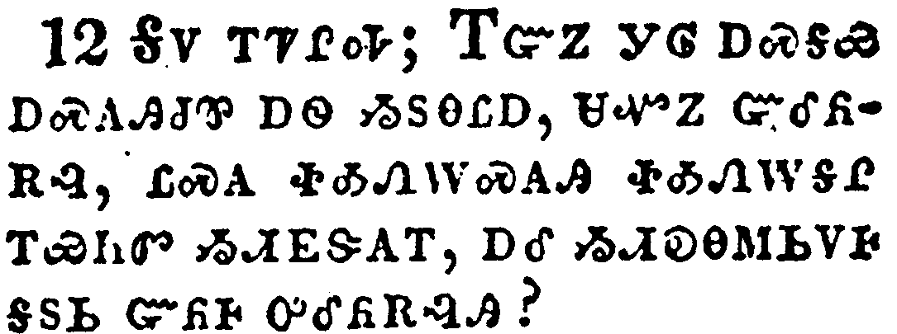</a></td>
</tr>
<tr class="even">
<td>How think ye? if a man have an hundred sheep, and one of them be gone astray, doth he not leave the ninety and nine, and goeth into the mountains, and seeketh that which is gone astray?</td>
</tr>
<tr class="odd">
<td>ᎦᏙ ᎢᏤᎵᎭ; ᎢᏳᏃ ᎩᎶ ᎠᏍᎦᏯ ᎠᏍᎪᎯᏧᏈ ᎠᏫ ᏱᏚᎾᏝᎠ, ᏌᏉᏃ ᏳᎴᏲᎡᎸ, ᏝᏍᎪ ᏐᎣᏁᎳᏍᎪᎯ ᏐᎣᏁᎳᎦᎵ ᎢᏯᏂᏛ ᏱᏗᎬᏕᎪᎢ, ᎠᎴ ᏱᏗᎧᎾᎷᏏᏙᎰ ᎦᏚᏏ ᏳᏲᎰ ᎤᎴᏲᎡᎸᎯ?</td>
</tr>
<tr class="even">
<td>Ga-do i-tse-li-ha; I-yu-no gi-lo a-s-ga-ya a-s-go-hi-tsu-qui a-wi yi-du-na-tla-a, sa-quo-no yu-le-yo-e-lv, tla-s-go so-o-ne-la-s-go-hi so-o-ne-la-ga-li i-ya-ni-dv yi-di-gv-de-go-i, a-le yi-di-ka-na-lu-si-do-ho ga-du-si yu-yo-ho u-le-yo-e-lv-hi?</td>
</tr>
</tbody>
</table>

<table>
<tbody>
<tr class="odd">
<td><a href="011813.png">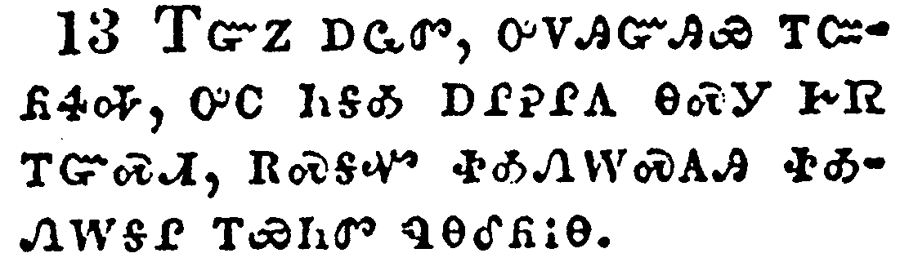</a></td>
</tr>
<tr class="even">
<td>And if so be that he find it, verily I say unto you, he rejoiceth more of that sheep, than of the ninety and nine which went not astray.</td>
</tr>
<tr class="odd">
<td>ᎢᏳᏃ ᎠᏩᏛ, ᎤᏙᎯᏳᎯᏯ ᎢᏨᏲᏎᎭ, ᎤᏟ ᏂᎦᎣ ᎠᎵᎮᎵᎪ ᎾᏍᎩ ᎨᏒ ᎢᏳᏍᏗ, ᎡᏍᎦᏉ ᏐᎣᏁᎳᏍᎪᎯ ᏐᎣᏁᎳᎦᎵ ᎢᏯᏂᏛ ᏄᎾᎴᏲᎥᎾ.</td>
</tr>
<tr class="even">
<td>I-yu-no a-wa-dv, u-do-hi-yu-hi-ya i-tsv-yo-se-ha, u-tli ni-ga-o a-li-he-li-go na-s-gi ge-sv i-yu-s-di, e-s-ga-quo so-o-ne-la-s-go-hi so-o-ne-la-ga-li i-ya-ni-dv nu-na-le-yo-v-na.</td>
</tr>
</tbody>
</table>

<table>
<tbody>
<tr class="odd">
<td><a href="011814.png">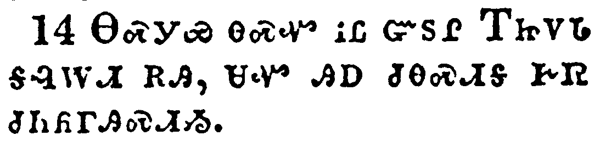</a></td>
</tr>
<tr class="even">
<td>Even so it is not the will of your Father which is in heaven, that one of these little ones should perish.</td>
</tr>
<tr class="odd">
<td>ᎾᏍᎩᏯ ᎾᏍᏉ ᎥᏝ ᏳᏚᎵ ᎢᏥᏙᏓ ᎦᎸᎳᏗ ᎡᎯ, ᏌᏉ ᎯᎠ ᏧᎾᏍᏗᎦ ᎨᏒ ᏧᏂᏲᎱᎯᏍᏗᏱ.</td>
</tr>
<tr class="even">
<td>Na-s-gi-ya na-s-quo v-tla yu-du-li I-tsi-do-da ga-lv-la-di e-hi, sa-quo hi-a tsu-na-s-di-ga ge-sv tsu-ni-yo-hu-hi-s-di-yi.</td>
</tr>
</tbody>
</table>

<table>
<tbody>
<tr class="odd">
<td><a href="011815.png">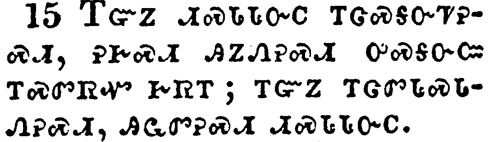</a></td>
</tr>
<tr class="even">
<td>Moreover if thy brother shall trespass against thee, go and tell him his fault between thee and him alone: if he shall hear thee, thou hast gained thy brother.</td>
</tr>
<tr class="odd">
<td>ᎢᏳᏃ ᏗᏍᏓᏓᏅᏟ ᎢᏣᏍᎦᏅᏤᎮᏍᏗ, ᎮᎨᏍᏗ ᎯᏃᏁᎮᏍᏗ ᎤᏍᎦᏅᏨ ᎢᏍᏛᏒᏉ ᎨᏒᎢ; ᎢᏳᏃ ᎢᏣᏛᏓᏍᏓᏁᎮᏍᏗ, ᎯᏩᏛᎮᏍᏗ ᏗᏍᏓᏓᏅᏟ.</td>
</tr>
<tr class="even">
<td>I-yu-no di-s-da-da-nv-tli i-tsa-s-ga-nv-tse-he-s-di, he-ge-s-di hi-no-ne-he-s-di u-s-ga-nv-tsv i-s-dv-sv-quo ge-sv-i; i-yu-no i-tsa-dv-da-s-da-ne-he-s-di, hi-wa-dv-he-s-di di-s-da-da-nv-tli.</td>
</tr>
</tbody>
</table>

<table>
<tbody>
<tr class="odd">
<td><a href="011816.png">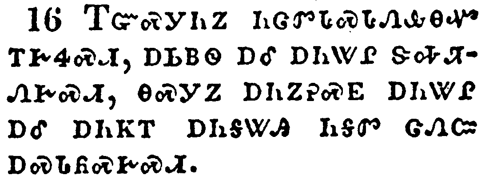</a></td>
</tr>
<tr class="even">
<td>But if he will not hear thee, then take with thee one or two more, that in the mouth of two or three witnesses every word may be established.</td>
</tr>
<tr class="odd">
<td>ᎢᏳᏍᎩᏂᏃ ᏂᏣᏛᏓᏍᏓᏁᎲᎾᏉ ᎢᎨᏎᏍᏗ, ᎠᏏᏴᏫ ᎠᎴ ᎠᏂᏔᎵ ᏕᎭᏘᏁᎨᏍᏗ, ᎾᏍᎩᏃ ᎠᏂᏃᎮᏍᎬ ᎠᏂᏔᎵ ᎠᎴ ᎠᏂᏦᎢ ᎠᏂᎦᏔᎯ ᏂᎦᏛ ᏣᏁᏨ ᎠᏍᏓᏲᏍᎨᏍᏗ.</td>
</tr>
<tr class="even">
<td>I-yu-s-gi-ni-no ni-tsa-dv-da-s-da-ne-hv-na-quo i-ge-se-s-di, a-si-yv-wi a-le a-ni-ta-li de-ha-ti-ne-ge-s-di, na-s-gi-no a-ni-no-he-s-gv a-ni-ta-li a-le a-ni-tso-i a-ni-ga-ta-hi ni-ga-dv tsa-ne-tsv a-s-da-yo-s-ge-s-di.</td>
</tr>
</tbody>
</table>

<table>
<tbody>
<tr class="odd">
<td><a href="011817.png">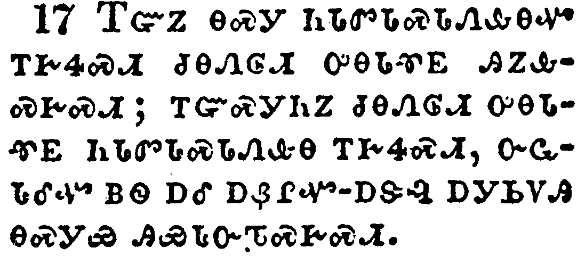</a></td>
</tr>
<tr class="even">
<td>And if he shall neglect to hear them, tell it unto the church: but if he neglect to hear the church, let him be unto thee as an heathen man and a publican.</td>
</tr>
<tr class="odd">
<td>ᎢᏳᏃ ᎾᏍᎩ ᏂᏓᏛᏓᏍᏓᏁᎲᎾᏉ ᎢᎨᏎᏍᏗ ᏧᎾᏁᎶᏗ ᎤᎾᏓᏡᎬ ᎯᏃᎲᏍᎨᏍᏗ; ᎢᏳᏍᎩᏂᏃ ᏧᎾᏁᎶᏗ ᎤᎾᏓᏡᎬ ᏂᏓᏛᏓᏍᏓᏁᎲᎾ ᎢᎨᏎᏍᏗ, ᏅᏩᏓᎴᏉ ᏴᏫ ᎠᎴ ᎠᏰᎵᏉ-ᎠᏕᎸ ᎠᎩᏏᏙᎯ ᎾᏍᎩᏯ ᎯᏯᏓᏅᏖᏍᎨᏍᏗ.</td>
</tr>
<tr class="even">
<td>I-yu-no na-s-gi ni-da-dv-da-s-da-ne-hv-na-quo i-ge-se-s-di tsu-na-ne-lo-di u-na-da-tlu-gv hi-no-hv-s-ge-s-di; i-yu-s-gi-ni-no tsu-na-ne-lo-di u-na-da-tlu-gv ni-da-dv-da-s-da-ne-hv-na i-ge-se-s-di, nv-wa-da-le-quo yv-wi a-le a-ye-li-quo--a-de-lv a-gi-si-do-hi na-s-gi-ya hi-ya-da-nv-te-s-ge-s-di.</td>
</tr>
</tbody>
</table>

<table>
<tbody>
<tr class="odd">
<td><a href="011818.png">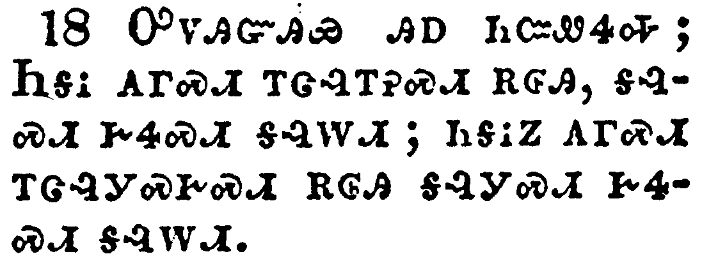</a></td>
</tr>
<tr class="even">
<td>Verily I say unto you, Whatsoever ye shall bind on earth shall be bound in heaven: and whatsoever ye shall loose on earth shall be loosed in heaven.</td>
</tr>
<tr class="odd">
<td>ᎤᏙᎯᏳᎯᏯ ᎯᎠ ᏂᏨᏪᏎᎭ; ᏂᎦᎥ ᎪᎱᏍᏗ ᎢᏣᎸᎢᎮᏍᏗ ᎡᎶᎯ, ᎦᎸᏍᏗ ᎨᏎᏍᏗ ᎦᎸᎳᏗ; ᏂᎦᎥᏃ ᎪᎱᏍᏗ ᎢᏣᎸᎩᏍᎨᏍᏗ ᎡᎶᎯ ᎦᎸᎩᏍᏗ ᎨᏎᏍᏗ ᎦᎸᎳᏗ.</td>
</tr>
<tr class="even">
<td>U-do-hi-yu-hi-ya hi-a ni-tsv-we-se-ha; Ni-ga-v go-hu-s-di i-tsa-lv-i-he-s-di e-lo-hi, ga-lv-s-di ge-se-s-di ga-lv-la-di; ni-ga-v-no go-hu-s-di i-tsa-lv-gi-s-ge-s-di e-lo-hi ga-lv-gi-s-di ge-se-s-di ga-lv-la-di.</td>
</tr>
</tbody>
</table>

<table>
<tbody>
<tr class="odd">
<td><a href="011819.png">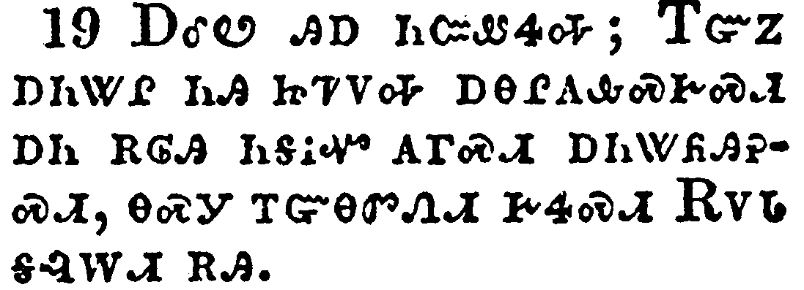</a></td>
</tr>
<tr class="even">
<td>Again I say unto you, That if two of you shall agree on earth as touching any thing that they shall ask, it shall be done for them of my Father which is in heaven.</td>
</tr>
<tr class="odd">
<td>ᎠᎴᏬ ᎯᎠ ᏂᏨᏪᏎᎭ; ᎢᏳᏃ ᎠᏂᏔᎵ ᏂᎯ ᏥᏤᏙᎭ ᎠᎾᎵᎪᎲᏍᎨᏍᏗ ᎠᏂ ᎡᎶᎯ ᏂᎦᎥᏉ ᎪᎱᏍᏗ ᎠᏂᏔᏲᎯᎮᏍᏗ, ᎾᏍᎩ ᎢᏳᎾᏛᏁᏗ ᎨᏎᏍᏗ ᎡᏙᏓ ᎦᎸᎳᏗ ᎡᎯ.</td>
</tr>
<tr class="even">
<td>A-le-wo hi-a ni-tsv-we-se-ha; i-yu-no a-ni-ta-li ni-hi tsi-tse-do-ha a-na-li-go-hv-s-ge-s-di a-ni e-lo-hi ni-ga-v-quo go-hu-s-di a-ni-ta-yo-hi-he-s-di, na-s-gi i-yu-na-dv-ne-di ge-se-s-di E-do-da ga-lv-la-di e-hi.</td>
</tr>
</tbody>
</table>

<table>
<tbody>
<tr class="odd">
<td><a href="011820.png">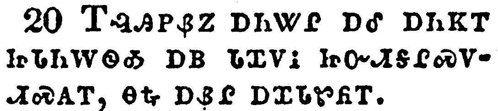</a></td>
</tr>
<tr class="even">
<td>For where two or three are gathered together in my name, there am I in the midst of them.</td>
</tr>
<tr class="odd">
<td>ᎢᎸᎯᏢᏰᏃ ᎠᏂᏔᎵ ᎠᎴ ᎠᏂᏦᎢ ᏥᏓᏂᎳᏫᎣ ᎠᏴ ᏓᏆᏙᎥ ᏥᏅᏗᎦᎵᏍᏙᏗᏍᎪᎢ, ᎾᎿᎭᎠᏰᎵ ᎠᏆᏓᏑᏲᎢ.</td>
</tr>
<tr class="even">
<td>I-lv-hi-tlv-ye-no a-ni-ta-li a-le a-ni-tso-i tsi-da-ni-la-wi-o a-yv da-qua-do-v tsi-nv-di-ga-li-s-do-di-s-go-i, na-hna a-ye-li a-qua-da-su-yo-i.</td>
</tr>
</tbody>
</table>

<table>
<tbody>
<tr class="odd">
<td><a href="011821.png">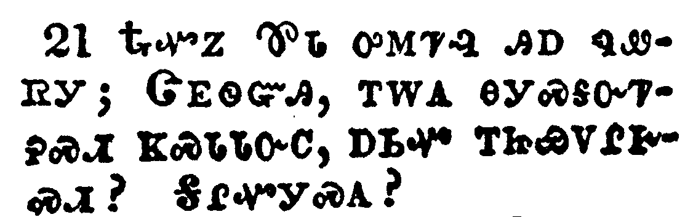</a></td>
</tr>
<tr class="even">
<td>Then came Peter to him, and said, Lord, how oft shall my brother sin against me, and I forgive him? till seven times?</td>
</tr>
<tr class="odd">
<td>ᎿᎭᏉᏃ ᏈᏓ ᎤᎷᏤᎸ ᎯᎠ ᏄᏪᏒᎩ; ᏣᎬᏫᏳᎯ, ᎢᎳᎪ ᎾᎩᏍᎦᏅᏤᎮᏍᏗ ᏦᏍᏓᏓᏅᏟ, ᎠᏏᏉ ᎢᏥᏯᏙᎵᎨᏍᏗ? ᎦᎵᏉᎩᏍᎪ?</td>
</tr>
<tr class="even">
<td>Hna-quo-no Qui-da u-lu-tse-lv hi-a nu-we-sv-gi; Tsa-gv-wi-yu-hi, i-la-go na-gi-s-ga-nv-tse-he-s-di tso-s-da-da-nv-tli, a-si-quo i-tsi-ya-do-li-ge-s-di? Ga-li-quo-gi-s-go?</td>
</tr>
</tbody>
</table>

<table>
<tbody>
<tr class="odd">
<td><a href="011822.png">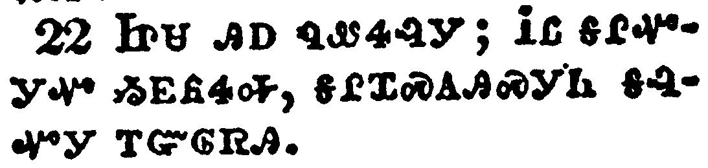</a></td>
</tr>
<tr class="even">
<td>Jesus saith unto him, I say not unto thee, Until seven times: but, Until seventy times seven.</td>
</tr>
<tr class="odd">
<td>ᏥᏌ ᎯᎠ ᏄᏪᏎᎸᎩ; ᎥᏝ ᎦᎵᏉᎩᏉ ᏱᎬᏲᏎᎭ, ᎦᎵᏆᏍᎪᎯᏍᎩᏂ ᎦᎸᏉᎩ ᎢᏳᎶᏒᎯ.</td>
</tr>
<tr class="even">
<td>Tsi-sa hi-a nu-we-se-lv-gi; V-tla ga-li-quo-gi-quo yi-gv-yo-se-ha, ga-li-qua-s-go-hi-s-gi-ni ga-lv-quo-gi i-yu-lo-sv-hi.</td>
</tr>
</tbody>
</table>

<table>
<tbody>
<tr class="odd">
<td><a href="011823.png">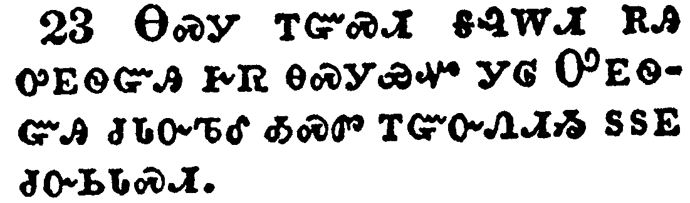</a></td>
</tr>
<tr class="even">
<td>Therefore is the kingdom of heaven likened unto a certain king, which would take account of his servants.</td>
</tr>
<tr class="odd">
<td>ᎾᏍᎩ ᎢᏳᏍᏗ ᎦᎸᎳᏗ ᎡᎯ ᎤᎬᏫᏳᎯ ᎨᏒ ᎾᏍᎩᏯᏉ ᎩᎶ ᎤᎬᏫᏳᎯ ᏧᏓᏅᏖᎴ ᎣᏍᏛ ᎢᏳᏅᏁᏗᏱ ᏚᏚᎬ ᏧᏅᏏᏓᏍᏗ.</td>
</tr>
<tr class="even">
<td>Na-s-gi i-yu-s-di ga-lv-la-di e-hi u-gv-wi-yu-hi ge-sv na-s-gi-ya-quo gi-lo U-gv-wi-yu-hi tsu-da-nv-te-le o-s-dv i-yu-nv-ne-di-yi du-du-gv tsu-nv-si-da-s-di.</td>
</tr>
</tbody>
</table>

<table>
<tbody>
<tr class="odd">
<td><a href="011824.png">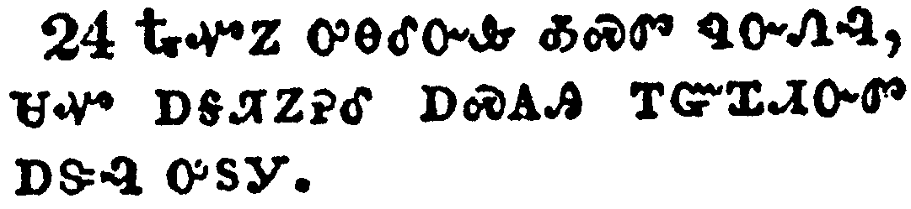</a></td>
</tr>
<tr class="even">
<td>And when he had begun to reckon, one was brought unto him, which owed him ten thousand talents.</td>
</tr>
<tr class="odd">
<td>ᎿᎭᏉᏃ ᎤᎾᎴᏅᎲ ᎣᏍᏛ ᏄᏅᏁᎸ, ᏌᏉ ᎠᎦᏘᏃᎮᎴ ᎠᏍᎪᎯ ᎢᏳᏆᏗᏅᏛ ᎠᏕᎸ ᎤᏚᎩ.</td>
</tr>
<tr class="even">
<td>Hna-quo-no u-na-le-nv-hv o-s-dv nu-nv-ne-lv, sa-quo a-ga-ti-no-he-le a-s-go-hi i-yu-qua-di-nv-dv a-de-lv u-du-gi.</td>
</tr>
</tbody>
</table>

<table>
<tbody>
<tr class="odd">
<td><a href="011825.png">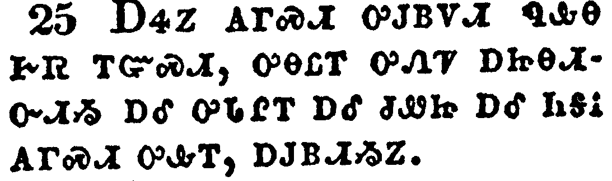</a></td>
</tr>
<tr class="even">
<td>But forasmuch as he had not to pay, his lord commanded him to be sold, and his wife, and children, and all that he had, and payment to be made.</td>
</tr>
<tr class="odd">
<td>ᎠᏎᏃ ᎪᎱᏍᏗ ᎤᏓᏴᏙᏗ ᏄᎲᎾ ᎨᏒ ᎢᏳᏍᏗ, ᎤᎾᏝᎢ ᎤᏁᏤ ᎠᏥᎾᏗᏅᏗᏱ ᎠᎴ ᎤᏓᎵᎢ ᎠᎴ ᏧᏪᏥ ᎠᎴ ᏂᎦᎥ ᎪᎱᏍᏗ ᎤᎲᎢ, ᎠᏓᏴᏗᏱᏃ.</td>
</tr>
<tr class="even">
<td>A-se-no go-hu-s-di u-da-yv-do-di nu-hv-na ge-sv i-yu-s-di, u-na-tla-i u-ne-tse a-tsi-na-di-nv-di-yi a-le u-da-li-i a-le tsu-we-tsi a-le ni-ga-v go-hu-s-di u-hv-i, a-da-yv-di-yi-no.</td>
</tr>
</tbody>
</table>

<table>
<tbody>
<tr class="odd">
<td><a href="011826.png">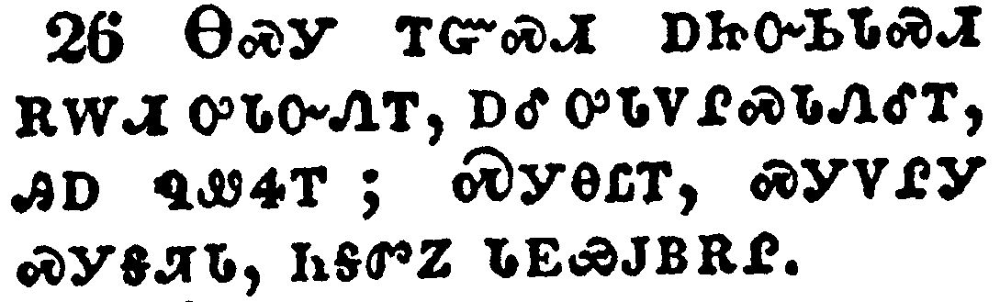</a></td>
</tr>
<tr class="even">
<td>The servant therefore fell down, and worshipped him, saying, Lord, have patience with me, and I will pay thee all.</td>
</tr>
<tr class="odd">
<td>ᎾᏍᎩ ᎢᏳᏍᏗ ᎠᏥᏅᏏᏓᏍᏗ ᎡᎳᏗ ᎤᏓᏅᏁᎢ, ᎠᎴ ᎤᏓᏙᎵᏍᏓᏁᎴᎢ, ᎯᎠ ᏄᏪᏎᎢ; ᏍᎩᎾᏝᎢ, ᏍᎩᏙᎵᎩ ᏍᎩᎦᏘᏓ, ᏂᎦᏛᏃ ᏓᎬᏯᎫᏴᎡᎵ.</td>
</tr>
<tr class="even">
<td>Na-s-gi i-yu-s-di a-tsi-nv-si-da-s-di e-la-di u-da-nv-ne-i, a-le u-da-do-li-s-da-ne-le-i, hi-a nu-we-se-i; S-gi-na-tla-i, s-gi-do-li-gi s-gi-ga-ti-da, ni-ga-dv-no da-gv-ya-gu-yv-e-li.</td>
</tr>
</tbody>
</table>

<table>
<tbody>
<tr class="odd">
<td><a href="011827.png">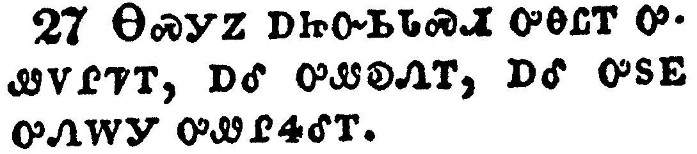</a></td>
</tr>
<tr class="even">
<td>Then the lord of that servant was moved with compassion, and loosed him, and forgave him the debt.</td>
</tr>
<tr class="odd">
<td>ᎾᏍᎩᏃ ᎠᏥᏅᏏᏓᏍᏗ ᎤᎾᏝᎢ ᎤᏪᏙᎵᏤᎢ, ᎠᎴ ᎤᏪᎧᏁᎢ, ᎠᎴ ᎤᏚᎬ ᎤᏁᎳᎩ ᎤᏪᎵᏎᎴᎢ.</td>
</tr>
<tr class="even">
<td>Na-s-gi-no a-tsi-nv-si-da-s-di u-na-tla-i u-we-do-li-tse-i, a-le u-we-ka-ne-i, a-le u-du-gv u-ne-la-gi u-we-li-se-le-i.</td>
</tr>
</tbody>
</table>

<table>
<tbody>
<tr class="odd">
<td><a href="011828.png">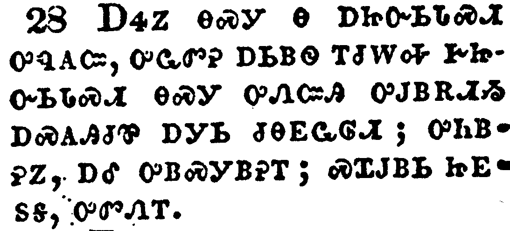</a></td>
</tr>
<tr class="even">
<td>But the same servant went out, and found one of his fellowservants, which owed him an hundred pence: and he laid hands on him, and took him by the throat, saying, Pay me that thou owest.</td>
</tr>
<tr class="odd">
<td>ᎠᏎᏃ ᎾᏍᎩ Ꮎ ᎠᏥᏅᏏᏓᏍᏗ ᎤᏄᎪᏨ, ᎤᏩᏛᎮ ᎠᏏᏴᏫ ᎢᏧᎳᎭ ᎨᏥᏅᏏᏓᏍᏗ ᎾᏍᎩ ᎤᏁᏨᎯ ᎤᎫᏴᎡᏗᏱ ᎠᏍᎪᎯᏧᏈ ᎠᎩᏏ ᏧᎾᎬᏩᎶᏗ; ᎤᏂᏴᎮᏃ, ᎠᎴ ᎤᏴᏍᎩᏴᎮᎢ; ᏍᏆᎫᏴᏏ ᏥᎬᏚᎦ, ᎤᏛᏁᎢ.</td>
</tr>
<tr class="even">
<td>A-se-no na-s-gi na a-tsi-nv-si-da-s-di u-nu-go-tsv, u-wa-dv-he a-si-yv-wi i-tsu-la-ha ge-tsi-nv-si-da-s-di na-s-gi u-ne-tsv-hi u-gu-yv-e-di-yi a-s-go-hi-tsu-qui a-gi-si tsu-na-gv-wa-lo-di; u-ni-yv-he-no, a-le u-yv-s-gi-yv-he-i; s-qua-gu-yv-si tsi-gv-du-ga, u-dv-ne-i.</td>
</tr>
</tbody>
</table>

<table>
<tbody>
<tr class="odd">
<td><a href="011829.png">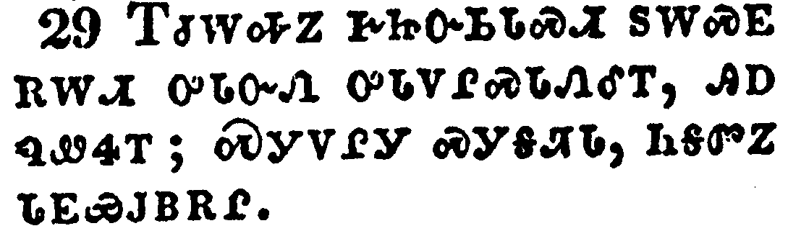</a></td>
</tr>
<tr class="even">
<td>And his fellowservant fell down at his feet, and besought him, saying, Have patience with me, and I will pay thee all.</td>
</tr>
<tr class="odd">
<td>ᎢᏧᎳᎭᏃ ᎨᏥᏅᏏᏓᏍᏗ ᏚᎳᏍᎬ ᎡᎳᏗ ᎤᏓᏅᏁ ᎤᏓᏙᎵᏍᏓᏁᎴᎢ, ᎯᎠ ᏄᏪᏎᎢ; ᏍᎩᏙᎵᎩ ᏍᎩᎦᏘᏓ, ᏂᎦᏛᏃ ᏓᎬᏯᎫᏴᎡᎵ.</td>
</tr>
<tr class="even">
<td>I-tsu-la-ha-no ge-tsi-nv-si-da-s-di du-la-s-gv e-la-di u-da-nv-ne u-da-do-li-s-da-ne-le-i, hi-a nu-we-se-i; S-gi-do-li-gi s-gi-ga-ti-da, ni-ga-dv-no da-gv-ya-gu-yv-e-li.</td>
</tr>
</tbody>
</table>

<table>
<tbody>
<tr class="odd">
<td><a href="011830.png">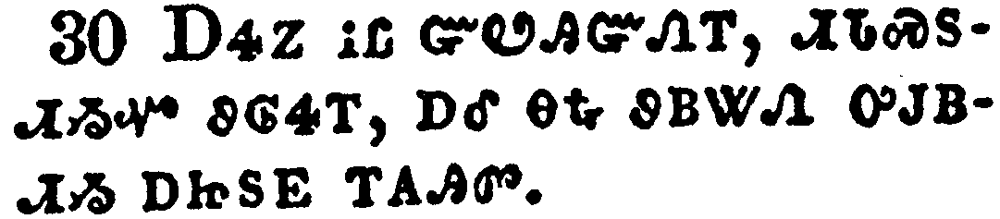</a></td>
</tr>
<tr class="even">
<td>And he would not: but went and cast him into prison, till he should pay the debt.</td>
</tr>
<tr class="odd">
<td>ᎠᏎᏃ ᎥᏝ ᏳᏬᎯᏳᏁᎢ, ᏗᏓᏍᏚᏗᏱᏉ ᏭᎶᏎᎢ, ᎠᎴ ᎾᎿᎭᏭᏴᏔᏁ ᎤᎫᏴᏗᏱ ᎠᏥᏚᎬ ᎢᎪᎯᏛ.</td>
</tr>
<tr class="even">
<td>A-se-no v-tla yu-wo-hi-yu-ne-i, di-da-s-du-di-yi-quo wu-lo-se-i, a-le na-hna wu-yv-ta-ne u-gu-yv-di-yi a-tsi-du-gv i-go-hi-dv.</td>
</tr>
</tbody>
</table>

<table>
<tbody>
<tr class="odd">
<td></td>
</tr>
<tr class="even">
<td>So when his fellowservants saw what was done, they were very sorry, and came and told unto their lord all that was done.</td>
</tr>
<tr class="odd">
<td>ᎾᏉᏃ ᎾᏍᎩ ᎢᏧᎳᎭ ᎨᏥᏅᏏᏓᏍᏗ ᎤᎾᏙᎴᎰᏒ ᏄᎵᏍᏔᏅᎢ ᎤᏣᏘ ᎤᏲ ᎤᏂᏰᎸᏁᎢ, ᎠᎴ ᎤᏂᎷᏤ ᎤᏂᏃᏁᎴ ᏧᏂᎾᏝᎢ ᏂᎦᏛ ᏄᎵᏍᏔᏂᏙᎸᎢ.</td>
</tr>
<tr class="even">
<td>Na-quo-no na-s-gi i-tsu-la-ha ge-tsi-nv-si-da-s-di u-na-do-le-ho-sv nu-li-s-ta-nv-i u-tsa-ti u-yo u-ni-ye-lv-ne-i, a-le u-ni-lu-tse u-ni-no-ne-le tsu-ni-na-tla-i ni-ga-dv nu-li-s-ta-ni-do-lv-i.</td>
</tr>
</tbody>
</table>

<table>
<tbody>
<tr class="odd">
<td><a href="011832.png">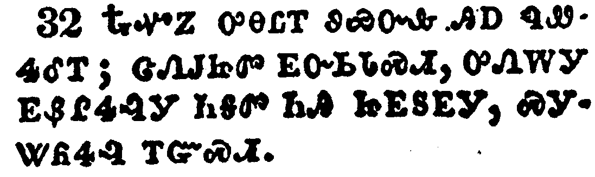</a></td>
</tr>
<tr class="even">
<td>Then his lord, after that he had called him, said unto him, O thou wicked servant, I forgave thee all that debt, because thou desiredst me:</td>
</tr>
<tr class="odd">
<td>ᎿᎭᏉᏃ ᎤᎾᏝᎢ ᏭᏯᏅᎲ ᎯᎠ ᏄᏪᏎᎴᎢ; ᏣᏁᎫᏥᏛ ᎬᏅᏏᏓᏍᏗ, ᎤᏁᎳᎩ ᎬᏰᎵᏎᎸᎩ ᏂᎦᏛ ᏂᎯ ᏥᎬᏚᎬᎩ, ᏍᎩᏔᏲᏎᎸ ᎢᏳᏍᏗ.</td>
</tr>
<tr class="even">
<td>Hna-quo-no u-na-tla-i wu-ya-nv-hv hi-a nu-we-se-le-i; tsa-ne-gu-tsi-dv gv-nv-si-da-s-di, u-ne-la-gi gv-ye-li-se-lv-gi ni-ga-dv ni-hi tsi-gv-du-gv-gi, s-gi-ta-yo-se-lv i-yu-s-di.</td>
</tr>
</tbody>
</table>

<table>
<tbody>
<tr class="odd">
<td><a href="011833.png">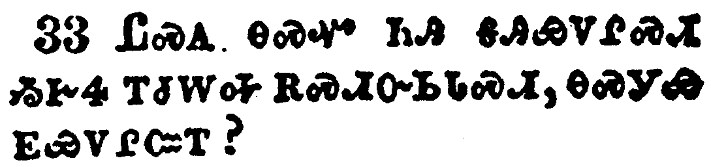</a></td>
</tr>
<tr class="even">
<td>Shouldest not thou also have had compassion on thy fellowservant, even as I had pity on thee?</td>
</tr>
<tr class="odd">
<td>ᏝᏍᎪ ᎾᏍᏉ ᏂᎯ ᎦᎯᏯᏙᎵᏍᏗ ᏱᎨᏎ ᎢᏧᎳᎭ ᎡᏍᏗᏅᏏᏓᏍᏗ, ᎾᏍᎩᏯ ᎬᏯᏙᎵᏨᎢ?</td>
</tr>
<tr class="even">
<td>Tla-s-go na-s-quo ni-hi ga-hi-ya-do-li-s-di yi-ge-se i-tsu-la-ha e-s-di-nv-si-da-s-di, na-s-gi-ya gv-ya-do-li-tsv-i?</td>
</tr>
</tbody>
</table>

<table>
<tbody>
<tr class="odd">
<td><a href="011834.png">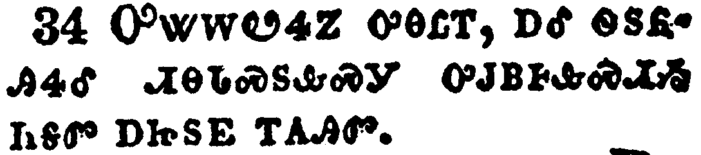</a></td>
</tr>
<tr class="even">
<td>And his lord was wroth, and delivered him to the tormentors, till he should pay all that was due unto him.</td>
</tr>
<tr class="odd">
<td>ᎤᏔᎳᏭᏎᏃ ᎤᎾᏝᎢ, ᎠᎴ ᏫᏚᏲᎯᏎᎴ ᏗᎾᏓᏍᏚᎲᏍᎩ ᎤᎫᏴᎰᎲᏍᏗᏱ ᏂᎦᏛ ᎠᏥᏚᎬ ᎢᎪᎯᏛ.</td>
</tr>
<tr class="even">
<td>U-ta-la-wu-se-no u-na-tla-i, a-le wi-du-yo-hi-se-le di-na-da-s-du-hv-s-gi u-gu-yv-ho-hv-s-di-yi ni-ga-dv a-tsi-du-gv i-go-hi-dv.</td>
</tr>
</tbody>
</table>

<table>
<tbody>
<tr class="odd">
<td><a href="011835.png">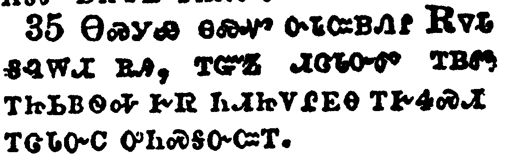</a></td>
</tr>
<tr class="even">
<td>So likewise shall my heavenly Father do also unto you, if ye from your hearts forgive not every one his brother their trespasses.</td>
</tr>
<tr class="odd">
<td>ᎾᏍᎩᏯ ᎾᏍᏉ ᏅᏓᏨᏴᏁᎵ ᎡᏙᏓ ᎦᎸᎳᏗ ᎡᎯ, ᎢᏳᏃ ᏗᏣᏓᏅᏛ ᎢᏴᏛ ᎢᏥᏏᏴᏫᎭ ᎨᏒ ᏂᏗᏥᏙᎵᎬᎾ ᎢᎨᏎᏍᏗ ᎢᏣᏓᏅᏟ ᎤᏂᏍᎦᏅᏨᎢ.</td>
</tr>
<tr class="even">
<td>Na-s-gi-ya na-s-quo nv-da-tsv-yv-ne-li e-do-da ga-lv-la-di e-hi, i-yu-no di-tsa-da-nv-dv i-yv-dv i-tsi-si-yv-wi-ha ge-sv ni-di-tsi-do-li-gv-na i-ge-se-s-di i-tsa-da-nv-tli u-ni-s-ga-nv-tsv-i.</td>
</tr>
</tbody>
</table>

