+++
draft=false
date = 2014-12-18T21:11:07Z
title = "Matthew - Chapter 21 - Cherokee New Testament"
weight = 1418955067

[taxonomies]

authors = ["Timothy Legg"]
categories = []
tags = []

[extra]
+++

<table>
<tbody>
<tr class="odd">
<td><a href="012101.png">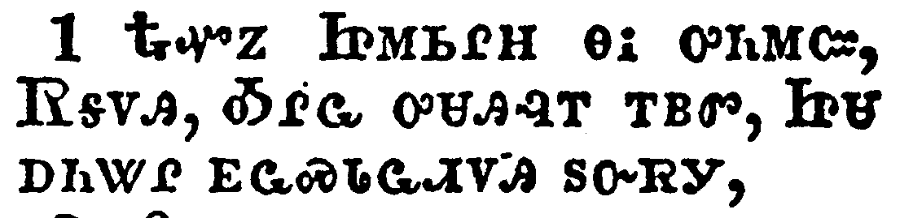</a></td>
</tr>
<tr class="even">
<td>And when they drew nigh unto Jerusalem, and were come to Bethphage, unto the mount of Olives, then sent Jesus two disciples,</td>
</tr>
<tr class="odd">
<td>ᎿᎭᏉᏃ ᏥᎷᏏᎵᎻ ᎾᎥ ᎤᏂᎷᏨ, ᏒᎦᏙᎯ, ᎣᎵᏩ ᎤᏌᎯᎸᎢ ᎢᏴᏛ, ᏥᏌ ᎠᏂᏔᎵ ᎬᏩᏍᏓᏩᏗᏙᎯ ᏚᏅᏒᎩ,</td>
</tr>
<tr class="even">
<td>Hna-quo-no Tsi-lu-si-li-mi na-v u-ni-lu-tsv, Sv-ga-do-hi, O-li-wa u-sa-hi-lv-i i-yv-dv, Tsi-sa a-ni-ta-li gv-wa-s-da-wa-di-do-hi du-nv-sv-gi,</td>
</tr>
</tbody>
</table>

<table>
<tbody>
<tr class="odd">
<td></td>
</tr>
<tr class="even">
<td>Saying unto them, Go into the village over against you, and straightway ye shall find an ass tied, and a colt with her: loose them, and bring them unto me.</td>
</tr>
<tr class="odd">
<td>ᎯᎠ ᏂᏚᏪᏎᎸᎩ; ᎢᏍᏕᎾ ᎢᏢ Ꮎ ᏨᏗᎦᏚᎭ, ᎩᎳᏉᏃ ᎢᏴᏛ ᏓᏰᏍᏗᏩᏛᎯ ᏐᏈᎵ-ᏗᎦᎵᎠᏅᎯᏛ ᎨᎵᏌᏕᏍᏗ, ᎠᎴ ᎠᎩᎾ ᎠᏘᏁᎮᏍᏗ, ᏕᏍᏕᎵᏌᏕᏒᎭ, ᎠᎴ ᏕᏍᎩᎾᏘᏃᎮᎸᎭ.</td>
</tr>
<tr class="even">
<td>Hi-a ni-du-we-se-lv-gi; i-s-de-na i-tlv na tsv-di-ga-du-ha, gi-la-quo-no i-yv-dv da-ye-s-di-wa-dv-hi so-qui-li--di-ga-li-a-nv-hi-dv ge-li-sa-de-s-di, a-le a-gi-na a-ti-ne-he-s-di, de-s-de-li-sa-de-sv-ha, a-le de-s-gi-na-ti-no-he-lv-ha.</td>
</tr>
</tbody>
</table>

<table>
<tbody>
<tr class="odd">
<td><a href="012103.png">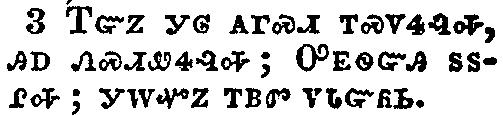</a></td>
</tr>
<tr class="even">
<td>And if any man say ought unto you, ye shall say, The Lord hath need of them; and straightway he will send them.</td>
</tr>
<tr class="odd">
<td>ᎢᏳᏃ ᎩᎶ ᎪᎱᏍᏗ ᎢᏍᏙᏎᎸᎭ, ᎯᎠ ᏁᏍᏗᏪᏎᎸᎭ; ᎤᎬᏫᏳᎯ ᏚᏚᎵᎭ; ᎩᎳᏉᏃ ᎢᏴᏛ ᏙᏓᏳᏲᏏ.</td>
</tr>
<tr class="even">
<td>I-yu-no gi-lo go-hu-s-di i-s-do-se-lv-ha, hi-a ne-s-di-we-se-lv-ha; U-gv-wi-yu-hi du-du-li-ha; gi-la-quo-no i-yv-dv do-da-yu-yo-si.</td>
</tr>
</tbody>
</table>

<table>
<tbody>
<tr class="odd">
<td><a href="012104.png">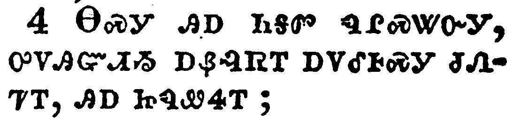</a></td>
</tr>
<tr class="even">
<td>All this was done, that it might be fulfilled which was spoken by the prophet, saying,</td>
</tr>
<tr class="odd">
<td>ᎾᏍᎩ ᎯᎠ ᏂᎦᏛ ᏄᎵᏍᏔᏅᎩ, ᎤᏙᎯᏳᏗᏱ ᎠᏰᎸᏒᎢ ᎠᏙᎴᎰᏍᎩ ᏧᏁᏤᎢ, ᎯᎠ ᏥᏄᏪᏎᎢ;</td>
</tr>
<tr class="even">
<td>Na-s-gi hi-a ni-ga-dv nu-li-s-ta-nv-gi, u-do-hi-yu-di-yi a-ye-lv-sv-i a-do-le-ho-s-gi tsu-ne-tse-i, hi-a tsi-nu-we-se-i;</td>
</tr>
</tbody>
</table>

<table>
<tbody>
<tr class="odd">
<td><a href="012105.png">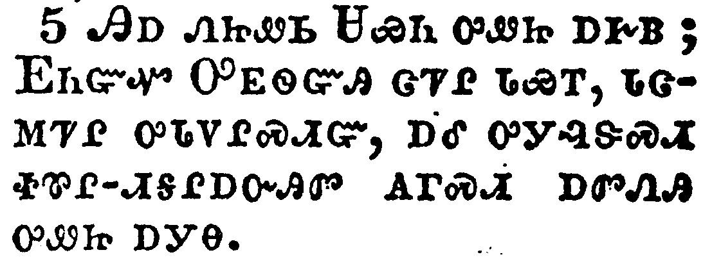</a></td>
</tr>
<tr class="even">
<td>Tell ye the daughter of Sion, Behold, thy King cometh unto thee, meek, and sitting upon an ass, and a colt the foal of an ass.</td>
</tr>
<tr class="odd">
<td>ᎯᎠ ᏁᏥᏪᏏ ᏌᏯᏂ ᎤᏪᏥ ᎠᎨᏴ; ᎬᏂᏳᏉ ᎤᎬᏫᏳᎯ ᏣᏤᎵ ᏓᏯᎢ, ᏓᏣᎷᏤᎵ ᎤᏓᏙᎵᏍᏗᏳ, ᎠᎴ ᎤᎩᎸᏕᏍᏗ ᏐᏈᎵ-ᏗᎦᎵᎠᏅᎯᏛ ᎪᎱᏍᏗ ᎠᏛᏁᎯ ᎤᏪᏥ ᎠᎩᎾ.</td>
</tr>
<tr class="even">
<td>Hi-a ne-tsi-we-si Sa-ya-ni u-we-tsi a-ge-yv; Gv-ni-yu-quo U-gv-wi-yu-hi tsa-tse-li da-ya-i, da-tsa-lu-tse-li u-da-do-li-s-di-yu, a-le u-gi-lv-de-s-di so-qui-li--di-ga-li-a-nv-hi-dv go-hu-s-di a-dv-ne-hi u-we-tsi a-gi-na.</td>
</tr>
</tbody>
</table>

<table>
<tbody>
<tr class="odd">
<td><a href="012106.png">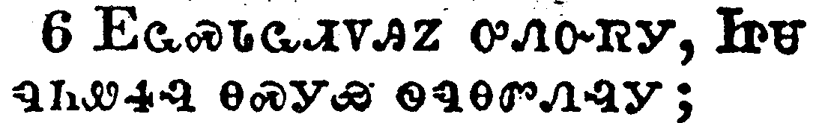</a></td>
</tr>
<tr class="even">
<td>And the disciples went, and did as Jesus commanded them,</td>
</tr>
<tr class="odd">
<td>ᎬᏩᏍᏓᏩᏗᏙᎯᏃ ᎤᏁᏅᏒᎩ, ᏥᏌ ᏄᏂᏪᏎᎸ ᎾᏍᎩᏯ ᏫᏄᎾᏛᏁᎸᎩ;</td>
</tr>
<tr class="even">
<td>Gv-wa-s-da-wa-di-do-hi-no u-ne-nv-sv-gi, Tsi-sa nu-ni-we-se-lv na-s-gi-ya wi-nu-na-dv-ne-lv-gi;</td>
</tr>
</tbody>
</table>

<table>
<tbody>
<tr class="odd">
<td><a href="012107.png">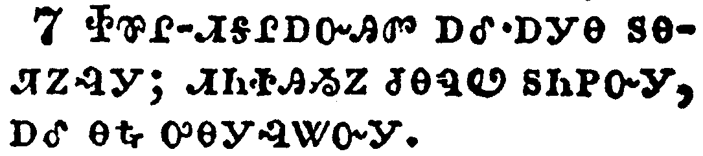</a></td>
</tr>
<tr class="even">
<td>And brought the ass, and the colt, and put on them their clothes, and they set him thereon.</td>
</tr>
<tr class="odd">
<td>ᏐᏈᎵ-ᏗᎦᎵᎠᏅᎯᏛ ᎠᎴ ᎠᎩᎾ ᏚᎾᏘᏃᎸᎩ; ᏗᏂᏐᎯᏱᏃ ᏧᎾᏄᏬ ᏚᏂᏢᏅᎩ, ᎠᎴ ᎾᎿᎭᎤᎾᎩᎸᏔᏅᎩ.</td>
</tr>
<tr class="even">
<td>So-qui-li--di-ga-li-a-nv-hi-dv a-le a-gi-na du-na-ti-no-lv-gi; di-ni-so-hi-yi-no tsu-na-nu-wo du-ni-tlv-nv-gi, a-le na-hna u-na-gi-lv-ta-nv-gi.</td>
</tr>
</tbody>
</table>

<table>
<tbody>
<tr class="odd">
<td><a href="012108.png">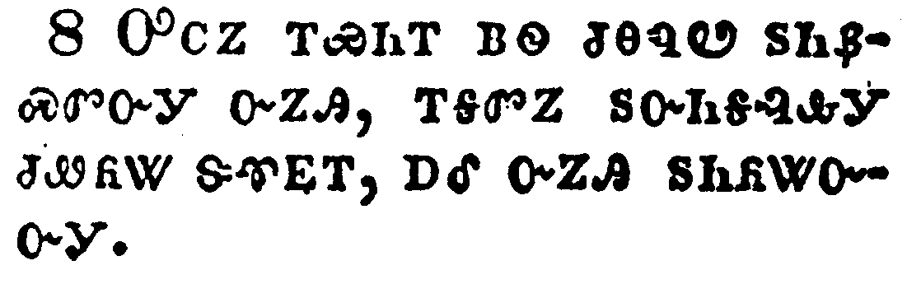</a></td>
</tr>
<tr class="even">
<td>And a very great multitude spread their garments in the way; others cut down branches from the trees, and strawed them in the way.</td>
</tr>
<tr class="odd">
<td>ᎤᏟᏃ ᎢᏯᏂᎢ ᏴᏫ ᏧᎾᏄᏬ ᏚᏂᏰᏍᏛᏅᎩ ᏅᏃᎯ, ᎢᎦᏛᏃ ᏚᏅᏂᎦᎸᎲᎩ ᏧᏪᏲᏔ ᏕᏡᎬᎢ, ᎠᎴ ᏅᏃᎯ ᏚᏂᏲᏔᏅᏅᎩ.</td>
</tr>
<tr class="even">
<td>U-tli-no i-ya-ni-i yv-wi tsu-na-nu-wo du-ni-ye-s-dv-nv-gi nv-no-hi, i-ga-dv-no du-nv-ni-ga-lv-hv-gi tsu-we-yo-ta de-tlu-gv-i, a-le nv-no-hi du-ni-yo-ta-nv-nv-gi.</td>
</tr>
</tbody>
</table>

<table>
<tbody>
<tr class="odd">
<td><a href="012109.png">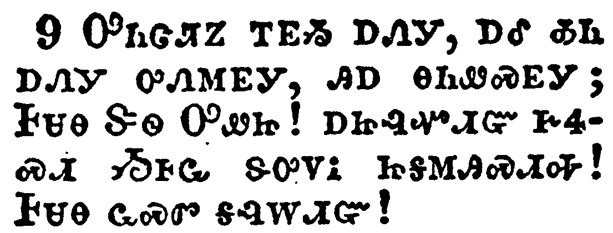</a></td>
</tr>
<tr class="even">
<td>And the multitudes that went before, and that followed, cried, saying, Hosanna to the Son of David: Blessed is he that cometh in the name of the Lord; Hosanna in the highest.</td>
</tr>
<tr class="odd">
<td>ᎤᏂᏣᏘᏃ ᎢᎬᏱ ᎠᏁᎩ, ᎠᎴ ᎣᏂ ᎠᏁᎩ ᎤᏁᎷᎬᎩ, ᎯᎠ ᎾᏂᏪᏍᎬᎩ; ᎰᏌᎾ ᏕᏫ ᎤᏪᏥ! ᎠᏥᎸᏉᏗᏳ ᎨᏎᏍᏗ ᏱᎰᏩ ᏕᎤᏙᎥ ᏥᎦᎷᎯᏍᏗᎭ! ᎰᏌᎾ ᏩᏍᏛ ᎦᎸᎳᏗᏳ!</td>
</tr>
<tr class="even">
<td>U-ni-tsa-ti-no i-gv-yi a-ne-gi, a-le o-ni a-ne-gi u-ne-lu-gv-gi, hi-a na-ni-we-s-gv-gi; Ho-sa-na De-wi U-we-tsi! a-tsi-lv-quo-di-yu ge-se-s-di Yi-ho-wa de-u-do-v tsi-ga-lu-hi-s-di-ha! Ho-sa-na wa-s-dv ga-lv-la-di-yu!</td>
</tr>
</tbody>
</table>

<table>
<tbody>
<tr class="odd">
<td><a href="012110.png">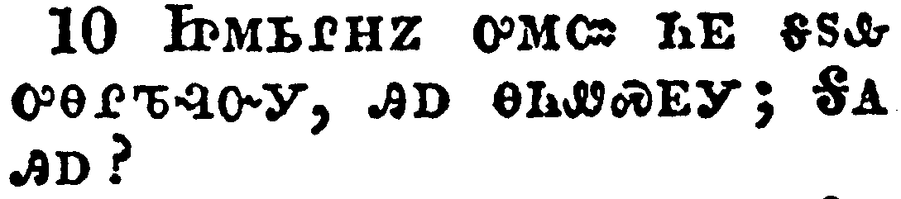</a></td>
</tr>
<tr class="even">
<td>And when he was come into Jerusalem, all the city was moved, saying, Who is this?</td>
</tr>
<tr class="odd">
<td>ᏥᎷᏏᎵᎻᏃ ᎤᎷᏨ ᏂᎬ ᎦᏚᎲ ᎤᎾᎵᏖᎸᏅᎩ, ᎯᎠ ᎾᏂᏪᏍᎬᎩ; ᎦᎪ ᎯᎠ?</td>
</tr>
<tr class="even">
<td>Tsi-lu-si-li-mi-no u-lu-tsv ni-gv ga-du-hv u-na-li-te-lv-nv-gi, hi-a na-ni-we-s-gv-gi; Ga-go hi-a?</td>
</tr>
</tbody>
</table>

<table>
<tbody>
<tr class="odd">
<td><a href="012111.png">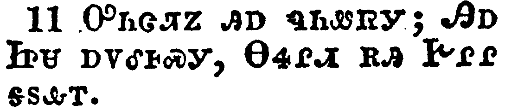</a></td>
</tr>
<tr class="even">
<td>And the multitude said, This is Jesus the prophet of Nazareth of Galilee.</td>
</tr>
<tr class="odd">
<td>ᎤᏂᏣᏘᏃ ᎯᎠ ᏄᏂᏪᏒᎩ; ᎯᎠ ᏥᏌ ᎠᏙᎴᎰᏍᎩ, ᎾᏎᎵᏗ ᎡᎯ ᎨᎵᎵ ᎦᏚᎲᎢ.</td>
</tr>
<tr class="even">
<td>U-ni-tsa-ti-no hi-a nu-ni-we-sv-gi; Hi-a Tsi-sa a-do-le-ho-s-gi, Na-se-li-di e-hi Ge-li-li ga-du-hv-i.</td>
</tr>
</tbody>
</table>

<table>
<tbody>
<tr class="odd">
<td><a href="012112.png">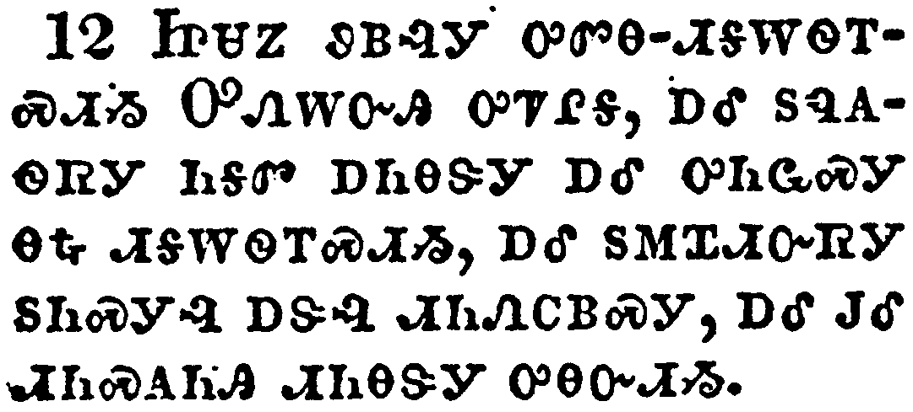</a></td>
</tr>
<tr class="even">
<td>And Jesus went into the temple of God, and cast out all them that sold and bought in the temple, and overthrew the tables of the moneychangers, and the seats of them that sold doves,</td>
</tr>
<tr class="odd">
<td>ᏥᏌᏃ ᏭᏴᎸᎩ ᎤᏛᎾ-ᏗᎦᎳᏫᎢᏍᏗᏱ ᎤᏁᎳᏅᎯ ᎤᏤᎵᎦ, ᎠᎴ ᏚᏄᎪᏫᏒᎩ ᏂᎦᏛ ᎠᏂᎾᏕᎩ ᎠᎴ ᎤᏂᏩᏍᎩ ᎾᎿᎭᏗᎦᎳᏫᎢᏍᏗᏱ, ᎠᎴ ᏚᎷᏆᏗᏅᏒᎩ ᏚᏂᏍᎩᎸ ᎠᏕᎸ ᏗᏂᏁᏟᏴᏍᎩ, ᎠᎴ ᎫᎴ ᏗᏂᏍᎪᏂᎯ ᏗᏂᎾᏕᎩ ᎤᎾᏅᏗᏱ.</td>
</tr>
<tr class="even">
<td>Tsi-sa-no wu-yv-lv-gi u-dv-na--di-ga-la-wi-i-s-di-yi U-ne-la-nv-hi u-tse-li-ga, a-le du-nu-go-wi-sv-gi ni-ga-dv a-ni-na-de-gi a-le u-ni-wa-s-gi na-hna di-ga-la-wi-i-s-di-yi, a-le du-lu-qua-di-nv-sv-gi du-ni-s-gi-lv a-de-lv di-ni-ne-tli-yv-s-gi, a-le gu-le di-ni-s-go-ni-hi di-ni-na-de-gi u-na-nv-di-yi.</td>
</tr>
</tbody>
</table>

<table>
<tbody>
<tr class="odd">
<td><a href="012113.png">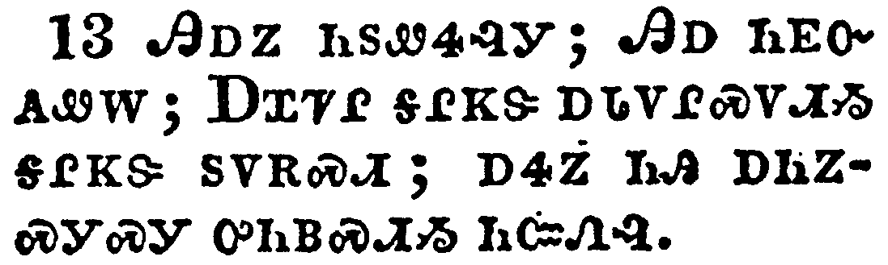</a></td>
</tr>
<tr class="even">
<td>And said unto them, It is written, My house shall be called the house of prayer; but ye have made it a den of thieves.</td>
</tr>
<tr class="odd">
<td>ᎯᎠᏃ ᏂᏚᏪᏎᎸᎩ; ᎯᎠ ᏂᎬᏅᎪᏪᎳ; ᎠᏆᏤᎵ ᎦᎵᏦᏕ ᎠᏓᏙᎵᏍᏙᏗᏱ ᎦᎵᏦᏕ ᏚᏙᎡᏍᏗ; ᎠᏎᏃ ᎯᎠ ᎠᏂᏃᏍᎩᏍᎩ ᎤᏂᏴᏍᏗᏱ ᏂᏨᏁᎸ.</td>
</tr>
<tr class="even">
<td>Hi-a-no ni-du-we-se-lv-gi; Hi-a ni-gv-nv-go-we-la; A-qua-tse-li ga-li-tso-de a-da-do-li-s-do-di-yi ga-li-tso-de du-do-e-s-di; a-se-no hi-a a-ni-no-s-gi-s-gi u-ni-yv-s-di-yi ni-tsv-ne-lv.</td>
</tr>
</tbody>
</table>

<table>
<tbody>
<tr class="odd">
<td><a href="012114.png">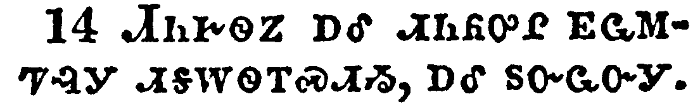</a></td>
</tr>
<tr class="even">
<td>And the blind and the lame came to him in the temple; and he healed them.</td>
</tr>
<tr class="odd">
<td>ᏗᏂᎨᏫᏃ ᎠᎴ ᏗᏂᏲᎤᎵ ᎬᏩᎷᏤᎸᎩ ᏗᎦᎳᏫᎢᏍᏗᏱ, ᎠᎴ ᏚᏅᏩᏅᎩ.</td>
</tr>
<tr class="even">
<td>Di-ni-ge-wi-no a-le di-ni-yo-u-li gv-wa-lu-tse-lv-gi di-ga-la-wi-i-s-di-yi, a-le du-nv-wa-nv-gi.</td>
</tr>
</tbody>
</table>

<table>
<tbody>
<tr class="odd">
<td><a href="012115.png">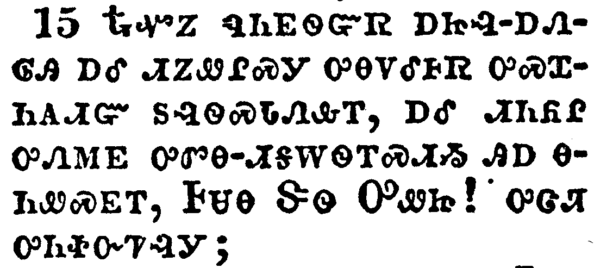</a></td>
</tr>
<tr class="even">
<td>And when the chief priests and scribes saw the wonderful things that he did, and the children crying in the temple, and saying, Hosanna to the Son of David; they were sore displeased,</td>
</tr>
<tr class="odd">
<td>ᎿᎭᏉᏃ ᏄᏂᎬᏫᏳᏒ ᎠᏥᎸ-ᎠᏁᎶᎯ ᎠᎴ ᏗᏃᏪᎵᏍᎩ ᎤᎾᏙᎴᎰᏒ ᎤᏍᏆᏂᎪᏗᏳ ᏚᎸᏫᏍᏓᏁᎲᎢ, ᎠᎴ ᏗᏂᏲᎵ ᎤᏁᎷᎬ ᎤᏛᎾ-ᏗᎦᎳᏫᎢᏍᏗᏱ ᎯᎠ ᎾᏂᏪᏍᎬᎢ, ᎰᏌᎾ ᏕᏫ ᎤᏪᏥ! ᎤᏣᏘ ᎤᏂᏐᏅᏤᎸᎩ;</td>
</tr>
<tr class="even">
<td>Hna-quo-no nu-ni-gv-wi-yu-sv a-tsi-lv--a-ne-lo-hi a-le di-no-we-li-s-gi u-na-do-le-ho-sv u-s-qua-ni-go-di-yu du-lv-wi-s-da-ne-hv-i, a-le di-ni-yo-li u-ne-lu-gv u-dv-na--di-ga-la-wi-i-s-di-yi hi-a na-ni-we-s-gv-i, Ho-sa-na De-wi U-we-tsi! u-tsa-ti u-ni-so-nv-tse-lv-gi;</td>
</tr>
</tbody>
</table>

<table>
<tbody>
<tr class="odd">
<td><a href="012116.png">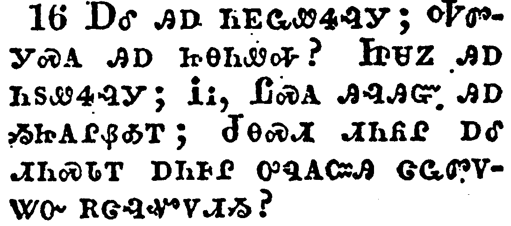</a></td>
</tr>
<tr class="even">
<td>And said unto him, Hearest thou what these say? And Jesus saith unto them, Yea; have ye never read, Out of the mouth of babes and sucklings thou hast perfected praise?</td>
</tr>
<tr class="odd">
<td>ᎠᎴ ᎯᎠ ᏂᎬᏩᏪᏎᎸᎩ; ᎭᏛᎩᏍᎪ ᎯᎠ ᏥᎾᏂᏪᎭ? ᏥᏌᏃ ᎯᎠ ᏂᏚᏪᏎᎸᎩ; ᎥᎥ, ᏝᏍᎪ ᎯᎸᎯᏳ ᎯᎠ ᏱᏥᎪᎵᏰᎣᎢ; ᏧᎾᏍᏗ ᏗᏂᏲᎵ ᎠᎴ ᏗᏂᏍᏓᎢ ᎠᏂᎰᎵ ᎤᏄᎪᏨᎯ ᏣᏩᏛᏙᏔᏅ ᎡᏣᎸᏉᏙᏗᏱ?</td>
</tr>
<tr class="even">
<td>A-le hi-a ni-gv-wa-we-se-lv-gi; Ha-dv-gi-s-go hi-a tsi-na-ni-we-ha? Tsi-sa-no hi-a ni-du-we-se-lv-gi; V-v, Tla-s-go hi-lv-hi-yu hi-a yi-tsi-go-li-ye-o-i; Tsu-na-s-di di-ni-yo-li a-le di-ni-s-da-i a-ni-ho-li u-nu-go-tsv-hi tsa-wa-dv-do-ta-nv e-tsa-lv-quo-do-di-yi?</td>
</tr>
</tbody>
</table>

<table>
<tbody>
<tr class="odd">
<td><a href="012117.png">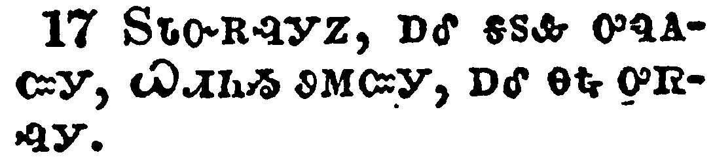</a></td>
</tr>
<tr class="even">
<td>And he left them, and went out of the city into Bethany; and he lodged there.</td>
</tr>
<tr class="odd">
<td>ᏚᏓᏅᎡᎸᎩᏃ, ᎠᎴ ᎦᏚᎲ ᎤᏄᎪᏨᎩ, ᏇᏗᏂᏱ ᏭᎷᏨᎩ, ᎠᎴ ᎾᎿᎭᎤᏒᎸᎩ.</td>
</tr>
<tr class="even">
<td>Du-da-nv-e-lv-gi-no, a-le ga-du-hv u-nu-go-tsv-gi, Que-di-ni-yi wu-lu-tsv-gi, a-le na-hna u-sv-lv-gi.</td>
</tr>
</tbody>
</table>

<table>
<tbody>
<tr class="odd">
<td><a href="012118.png">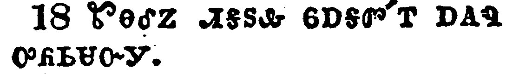</a></td>
</tr>
<tr class="even">
<td>Now in the morning as he returned into the city, he hungered.</td>
</tr>
<tr class="odd">
<td>ᏑᎾᎴᏃ ᏗᎦᏚᎲ ᏮᎠᎦᏛᎢ ᎠᎪᏄ ᎤᏲᏏᏌᏅᎩ.</td>
</tr>
<tr class="even">
<td>Su-na-le-no di-ga-du-hv wv-a-ga-dv-i a-go-nu u-yo-si-sa-nv-gi.</td>
</tr>
</tbody>
</table>

<table>
<tbody>
<tr class="odd">
<td><a href="012119.png">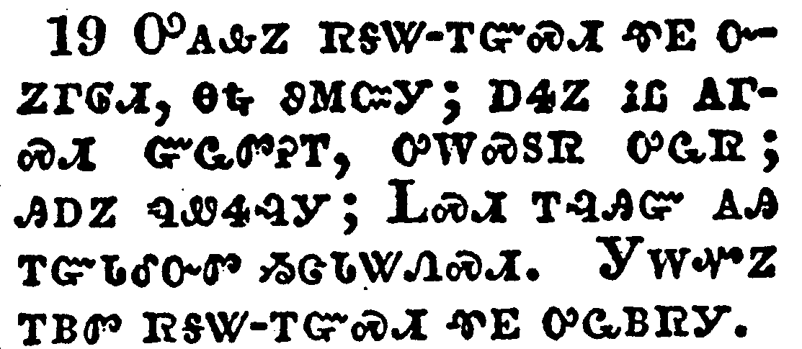</a></td>
</tr>
<tr class="even">
<td>And when he saw a fig tree in the way, he came to it, and found nothing thereon, but leaves only, and said unto it, Let no fruit grow on thee henceforward for ever. And presently the fig tree withered away.</td>
</tr>
<tr class="odd">
<td>ᎤᎪᎲᏃ ᏒᎦᏔ-ᎢᏳᏍᏗ ᏡᎬ ᏅᏃᎱᎶᏗ, ᎾᎿᎭᏭᎷᏨᎩ; ᎠᏎᏃ ᎥᏝ ᎪᎱᏍᏗ ᏳᏩᏛᎮᎢ, ᎤᎳᏍᏚᏒ ᎤᏩᏒ; ᎯᎠᏃ ᏄᏪᏎᎸᎩ; ᏞᏍᏗ ᎢᎸᎯᏳ ᎪᎯ ᎢᏳᏓᎴᏅᏛ ᏱᏣᏓᏔᏁᏍᏗ. ᎩᎳᏉᏃ ᎢᏴᏛ ᏒᎦᏔ-ᎢᏳᏍᏗ ᏡᎬ ᎤᏩᏴᏒᎩ.</td>
</tr>
<tr class="even">
<td>U-go-hv-no sv-ga-ta--i-yu-s-di tlu-gv nv-no-hu-lo-di, na-hna wu-lu-tsv-gi; a-se-no v-tla go-hu-s-di yu-wa-dv-he-i, u-la-s-du-sv u-wa-sv; hi-a-no nu-we-se-lv-gi; Tle-s-di i-lv-hi-yu go-hi i-yu-da-le-nv-dv yi-tsa-da-ta-ne-s-di. Gi-la-quo-no i-yv-dv sv-ga-ta--i-yu-s-di tlu-gv u-wa-yv-sv-gi.</td>
</tr>
</tbody>
</table>

<table>
<tbody>
<tr class="odd">
<td><a href="012120.png">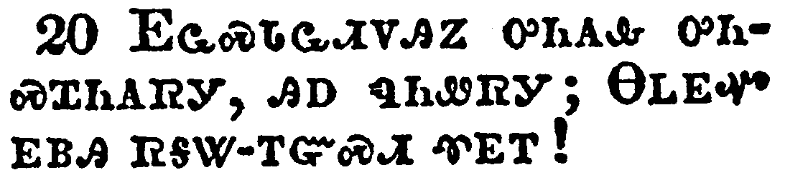</a></td>
</tr>
<tr class="even">
<td>And when the disciples saw it, they marvelled, saying, How soon is the fig tree withered away!</td>
</tr>
<tr class="odd">
<td>ᎬᏩᏍᏓᏩᏗᏙᎯᏃ ᎤᏂᎪᎲ ᎤᏂᏍᏆᏂᎪᏒᎩ, ᎯᎠ ᏄᏂᏪᏒᎩ; ᎾᏞᎬᏉ ᎬᏴᎯ ᏒᎦᏔ-ᎢᏳᏍᏗ ᏡᎬᎢ!</td>
</tr>
<tr class="even">
<td>Gv-wa-s-da-wa-di-do-hi-no u-ni-go-hv u-ni-s-qua-ni-go-sv-gi, hi-a nu-ni-we-sv-gi; Na-tle-gv-quo gv-yv-hi sv-ga-ta--i-yu-s-di tlu-gv-i!</td>
</tr>
</tbody>
</table>

<table>
<tbody>
<tr class="odd">
<td><a href="012121.png">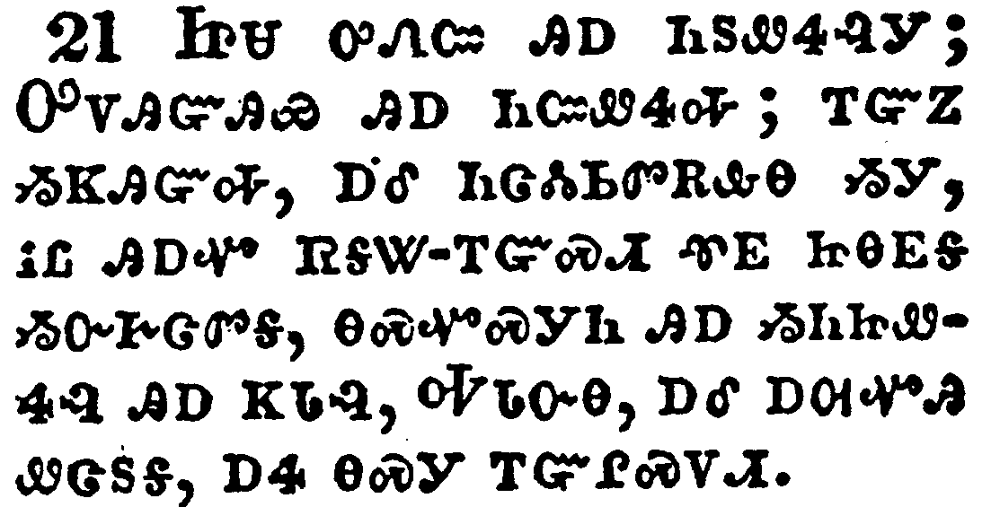</a></td>
</tr>
<tr class="even">
<td>Jesus answered and said unto them, Verily I say unto you, If ye have faith, and doubt not, ye shall not only do this which is done to the fig tree, but also if ye shall say unto this mountain, Be thou removed, and be thou cast into the sea; it shall be done.</td>
</tr>
<tr class="odd">
<td>ᏥᏌ ᎤᏁᏨ ᎯᎠ ᏂᏚᏪᏎᎸᎩ; ᎤᏙᎯᏳᎯᏯ ᎯᎠ ᏂᏨᏪᏎᎭ; ᎢᏳᏃ ᏱᏦᎯᏳᎭ, ᎠᎴ ᏂᏣᏜᏓᏏᏛᎡᎲᎾ ᏱᎩ, ᎥᏝ ᎯᎠᏉ ᏒᎦᏔ-ᎢᏳᏍᏗ ᏡᎬ ᏥᎾᎬᎦ ᏱᏅᎨᏣᏛᎦ, ᎾᏍᏉᏍᎩᏂ ᎯᎠ ᏱᏂᏥᏪᏎᎸ ᎯᎠ ᏦᏓᎸ, ᎭᏓᏅᎾ, ᎠᎴ ᎠᎺᏉᎯ ᏪᏣᏚᎦ, ᎠᏎ ᎾᏍᎩ ᎢᏳᎵᏍᏙᏗ.</td>
</tr>
<tr class="even">
<td>Tsi-sa u-ne-tsv hi-a ni-du-we-se-lv-gi; U-do-hi-yu-hi-ya hi-a ni-tsv-we-se-ha; i-yu-no yi-tso-hi-yu-ha, a-le ni-tsa-dla-si-dv-e-hv-na yi-gi, v-tla hi-a-quo sv-ga-ta--i-yu-s-di tlu-gv tsi-na-gv-ga yi-nv-ge-tsa-dv-ga, na-s-quo-s-gi-ni hi-a yi-ni-tsi-we-se-lv hi-a tso-da-lv, Ha-da-nv-na, a-le a-me-quo-hi we-tsa-du-ga, a-se na-s-gi i-yu-li-s-do-di.</td>
</tr>
</tbody>
</table>

<table>
<tbody>
<tr class="odd">
<td><a href="012122.png">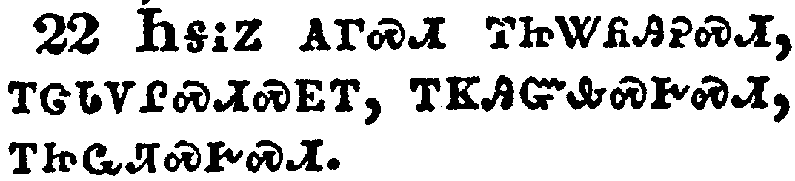</a></td>
</tr>
<tr class="even">
<td>And all things, whatsoever ye shall ask in prayer, believing, ye shall receive.</td>
</tr>
<tr class="odd">
<td>ᏂᎦᎥᏃ ᎪᎱᏍᏗ ᎢᏥᏔᏲᎯᎮᏍᏗ, ᎢᏣᏓᏙᎵᏍᏗᏍᎬᎢ, ᎢᏦᎯᏳᎲᏍᎨᏍᏗ, ᎢᏥᏩᏘᏍᎨᏍᏗ.</td>
</tr>
<tr class="even">
<td>Ni-ga-v-no go-hu-s-di i-tsi-ta-yo-hi-he-s-di, i-tsa-da-do-li-s-di-s-gv-i, i-tso-hi-yu-hv-s-ge-s-di, i-tsi-wa-ti-s-ge-s-di.</td>
</tr>
</tbody>
</table>

<table>
<tbody>
<tr class="odd">
<td><a href="012123.png">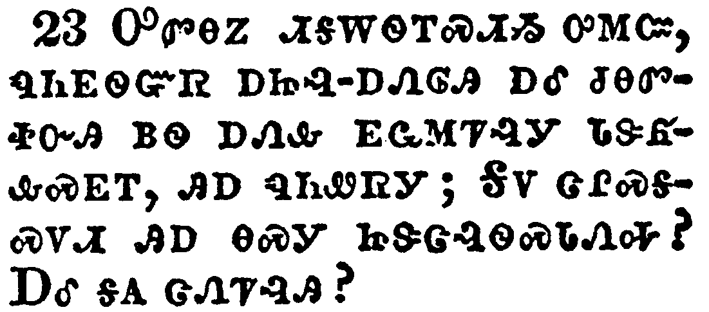</a></td>
</tr>
<tr class="even">
<td>And when he was come into the temple, the chief priests and the elders of the people came unto him as he was teaching, and said, By what authority doest thou these things? and who gave thee this authority?</td>
</tr>
<tr class="odd">
<td>ᎤᏛᎾᏃ ᏗᎦᎳᏫᎢᏍᏗᏱ ᎤᎷᏨ, ᏄᏂᎬᏫᏳᏒ ᎠᏥᎸ-ᎠᏁᎶᎯ ᎠᎴ ᏧᎾᏛᏐᏅᎯ ᏴᏫ ᎠᏁᎲ ᎬᏩᎷᏤᎸᎩ ᏓᏕᏲᎲᏍᎬᎢ, ᎯᎠ ᏄᏂᏪᏒᎩ; ᎦᏙ ᏣᎵᏍᎦᏍᏙᏗ ᎯᎠ ᎾᏍᎩ ᏥᏕᏣᎸᏫᏍᏓᏁᎭ? ᎠᎴ ᎦᎪ ᏣᏁᏤᎸᎯ?</td>
</tr>
<tr class="even">
<td>U-dv-na-no di-ga-la-wi-i-s-di-yi u-lu-tsv, nu-ni-gv-wi-yu-sv a-tsi-lv--a-ne-lo-hi a-le tsu-na-dv-so-nv-hi yv-wi a-ne-hv gv-wa-lu-tse-lv-gi da-de-yo-hv-s-gv-i, hi-a nu-ni-we-sv-gi; Ga-do tsa-li-s-ga-s-do-di hi-a na-s-gi tsi-de-tsa-lv-wi-s-da-ne-ha? A-le ga-go tsa-ne-tse-lv-hi?</td>
</tr>
</tbody>
</table>

<table>
<tbody>
<tr class="odd">
<td><a href="012124.png">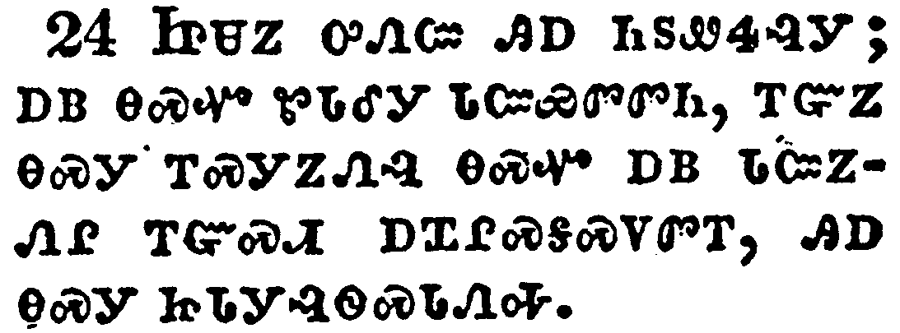</a></td>
</tr>
<tr class="even">
<td>And Jesus answered and said unto them, I also will ask you one thing, which if ye tell me, I in like wise will tell you by what authority I do these things.</td>
</tr>
<tr class="odd">
<td>ᏥᏌᏃ ᎤᏁᏨ ᎯᎠ ᏂᏚᏪᏎᎸᎩ; ᎠᏴ ᎾᏍᎩ ᏑᏓᎴᎩ ᏓᏨᏯᏛᏛᏂ, ᎢᏳᏃ ᎾᏍᎩ ᎢᏍᎩᏃᏁᎸ ᎾᏍᎩ ᎠᏴ ᏓᏨᏃᏁᎵ ᎢᏳᏍᏗ ᎠᏆᎵᏍᎦᏍᏙᏛᎢ, ᎯᎠ ᎾᏍᎩ ᏥᏓᎩᎸᏫᏍᏓᏁᎭ.</td>
</tr>
<tr class="even">
<td>Tsi-sa-no u-ne-tsv hi-a ni-du-we-se-lv-gi; a-yv na-s-gi su-da-le-gi da-tsv-ya-dv-dv-ni, i-yu-no na-s-gi i-s-gi-no-ne-lv na-s-gi a-yv da-tsv-no-ne-li i-yu-s-di a-qua-li-s-ga-s-do-dv-i, hi-a na-s-gi tsi-da-gi-lv-wi-s-da-ne-ha.</td>
</tr>
</tbody>
</table>

<table>
<tbody>
<tr class="odd">
<td><a href="012125.png">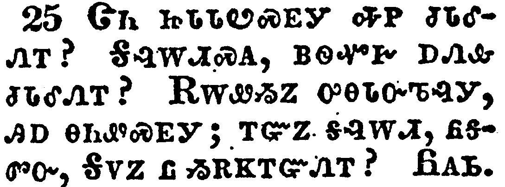</a></td>
</tr>
<tr class="even">
<td>The baptism of John, whence was it? from heaven, or of men? And they reasoned with themselves, saying, If we shall say, From heaven; he will say unto us, Why did ye not then believe him?</td>
</tr>
<tr class="odd">
<td>ᏣᏂ ᏥᏓᏓᏬᏍᎬᎩ ᎭᏢ ᏧᏓᎴᏁᎢ? ᎦᎸᎳᏗᏍᎪ, ᏴᏫᏉᎨ ᎠᏁᎲ ᏧᏓᎴᏁᎢ? ᎡᎳᏪᏱᏃ ᎤᎾᏓᏅᏖᎸᎩ, ᎯᎠ ᎾᏂᏪᏍᎬᎩ; ᎢᏳᏃ ᎦᎸᎳᏗ, ᏲᎦᏛᏅ, ᎦᏙᏃ Ꮭ ᏱᎡᏦᎢᏳᏁᎢ? ᏲᎪᏏ.</td>
</tr>
<tr class="even">
<td>Tsa-ni tsi-da-da-wo-s-gv-gi ha-tlv tsu-da-le-ne-i? Ga-lv-la-di-s-go, yv-wi-quo-ge a-ne-hv tsu-da-le-ne-i? E-la-we-yi-no u-na-da-nv-te-lv-gi, hi-a na-ni-we-s-gv-gi; i-yu-no ga-lv-la-di, yo-ga-dv-nv, Ga-do-no tla yi-e-tso-i-yu-ne-i? Yo-go-si.</td>
</tr>
</tbody>
</table>

<table>
<tbody>
<tr class="odd">
<td><a href="012126.png">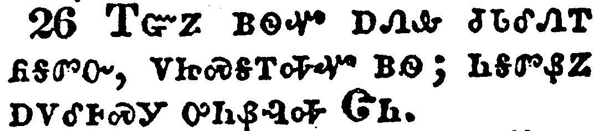</a></td>
</tr>
<tr class="even">
<td>But if we shall say, Of men; we fear the people; for all hold John as a prophet.</td>
</tr>
<tr class="odd">
<td>ᎢᏳᏃ ᏴᏫᏉ ᎠᏁᎲ ᏧᏓᎴᏁᎢ ᏲᎦᏛᏅ, ᏙᏥᏍᎦᎢᎭᏉ ᏴᏫ; ᏂᎦᏛᏰᏃ ᎠᏙᎴᎰᏍᎩ ᎤᏂᏰᎸᎭ ᏣᏂ.</td>
</tr>
<tr class="even">
<td>I-yu-no yv-wi-quo a-ne-hv tsu-da-le-ne-i yo-ga-dv-nv, do-tsi-s-ga-i-ha-quo yv-wi; ni-ga-dv-ye-no a-do-le-ho-s-gi u-ni-ye-lv-ha Tsa-ni.</td>
</tr>
</tbody>
</table>

<table>
<tbody>
<tr class="odd">
<td><a href="012127.png">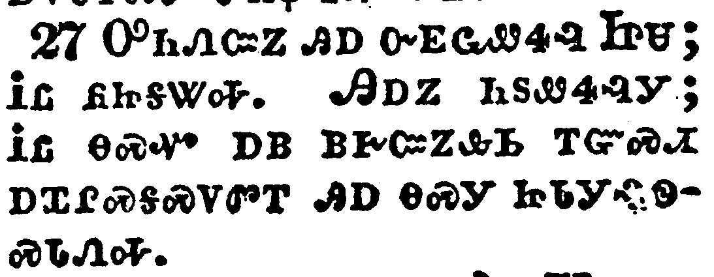</a></td>
</tr>
<tr class="even">
<td>And they answered Jesus, and said, We cannot tell. And he said unto them, Neither tell I you by what authority I do these things.</td>
</tr>
<tr class="odd">
<td>ᎤᏂᏁᏨᏃ ᎯᎠ ᏅᎬᏩᏪᏎᎸ ᏥᏌ; ᎥᏝ ᏲᏥᎦᏔᎭ. ᎯᎠᏃ ᏂᏚᏪᏎᎸᎩ; ᎥᏝ ᎾᏍᏉ ᎠᏴ ᏴᎨᏨᏃᎲᏏ ᎢᏳᏍᏗ ᎠᏆᎵᏍᎦᏍᏙᏛᎢ ᎯᎠ ᎾᏍᎩ ᏥᏓᎩᎸᏫᏍᏓᏁᎭ.</td>
</tr>
<tr class="even">
<td>U-ni-ne-tsv-no hi-a nv-gv-wa-we-se-lv Tsi-sa; V-tla yo-tsi-ga-ta-ha. Hi-a-no ni-du-we-se-lv-gi; V-tla na-s-quo a-yv yv-ge-tsv-no-hv-si i-yu-s-di a-qua-li-s-ga-s-do-dv-i hi-a na-s-gi tsi-da-gi-lv-wi-s-da-ne-ha.</td>
</tr>
</tbody>
</table>

<table>
<tbody>
<tr class="odd">
<td><a href="012128.png">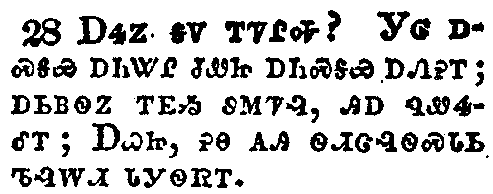</a></td>
</tr>
<tr class="even">
<td>But what think ye? A certain man had two sons; and he came to the first, and said, Son, go work to day in my vineyard.</td>
</tr>
<tr class="odd">
<td>ᎠᏎᏃ ᎦᏙ ᎢᏤᎵᎭ? ᎩᎶ ᎠᏍᎦᏯ ᎠᏂᏔᎵ ᏧᏪᏥ ᎠᏂᏍᎦᏯ ᎠᏁᎮᎢ; ᎠᏏᏴᏫᏃ ᎢᎬᏱ ᏭᎷᏤᎸ, ᎯᎠ ᏄᏪᏎᎴᎢ; ᎠᏇᏥ, ᎮᎾ ᎪᎯ ᏫᏗᏣᎸᏫᏍᏓᏏ ᏖᎸᎳᏗ ᏓᎩᏫᏒᎢ.</td>
</tr>
<tr class="even">
<td>A-se-no ga-do i-tse-li-ha? Gi-lo a-s-ga-ya a-ni-ta-li tsu-we-tsi a-ni-s-ga-ya a-ne-he-i; a-si-yv-wi-no i-gv-yi wu-lu-tse-lv, hi-a nu-we-se-le-i; A-que-tsi, he-na go-hi wi-di-tsa-lv-wi-s-da-si te-lv-la-di da-gi-wi-sv-i.</td>
</tr>
</tbody>
</table>

<table>
<tbody>
<tr class="odd">
<td><a href="012129.png">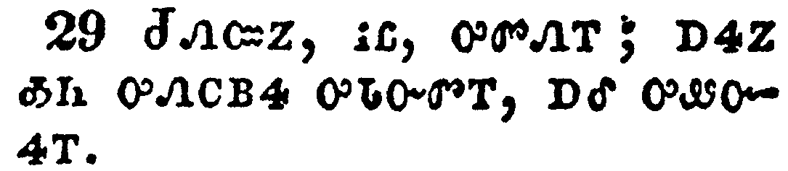</a></td>
</tr>
<tr class="even">
<td>He answered and said, I will not: but afterward he repented, and went.</td>
</tr>
<tr class="odd">
<td>ᏧᏁᏨᏃ, ᎥᏝ, ᎤᏛᏁᎢ; ᎠᏎᏃ ᎣᏂ ᎤᏁᏟᏴᏎ ᎤᏓᏅᏛᎢ, ᎠᎴ ᎤᏪᏅᏎᎢ.</td>
</tr>
<tr class="even">
<td>Tsu-ne-tsv-no, v-tla, u-dv-ne-i; a-se-no o-ni u-ne-tli-yv-se u-da-nv-dv-i, a-le u-we-nv-se-i.</td>
</tr>
</tbody>
</table>

<table>
<tbody>
<tr class="odd">
<td><a href="012130.png">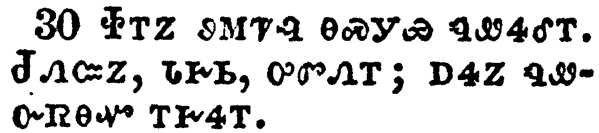</a></td>
</tr>
<tr class="even">
<td>And he came to the second, and said likewise. And he answered and said, I go, sir: and went not.</td>
</tr>
<tr class="odd">
<td>ᏐᎢᏃ ᏭᎷᏤᎸ ᎾᏍᎩᏯ ᏄᏪᏎᎴᎢ. ᏧᏁᏨᏃ, ᏓᎨᏏ, ᎤᏛᏁᎢ; ᎠᏎᏃ ᏄᏪᏅᏒᎾᏉ ᎢᎨᏎᎢ.</td>
</tr>
<tr class="even">
<td>So-i-no wu-lu-tse-lv na-s-gi-ya nu-we-se-le-i. Tsu-ne-tsv-no, da-ge-si, u-dv-ne-i; a-se-no nu-we-nv-sv-na-quo i-ge-se-i.</td>
</tr>
</tbody>
</table>

<table>
<tbody>
<tr class="odd">
<td><a href="012131.png">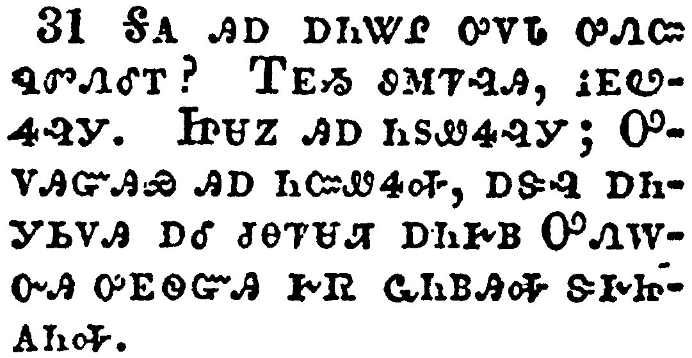</a></td>
</tr>
<tr class="even">
<td>Whether of them twain did the will of his father? They say unto him, The first. Jesus saith unto them, Verily I say unto you, That the publicans and the harlots go into the kingdom of God before you.</td>
</tr>
<tr class="odd">
<td>ᎦᎪ ᎯᎠ ᎠᏂᏔᎵ ᎤᏙᏓ ᎤᏁᏨ ᏄᏛᏁᎴᎢ? ᎢᎬᏱ ᏭᎷᏤᎸᎯ, ᎥᎬᏬᏎᎸᎩ. ᏥᏌᏃ ᎯᎠ ᏂᏚᏪᏎᎸᎩ; ᎤᏙᎯᏳᎯᏯ ᎯᎠ ᏂᏨᏪᏎᎭ, ᎠᏕᎸ ᎠᏂᎩᏏᏙᎯ ᎠᎴ ᏧᎾᏤᏌᏘ ᎠᏂᎨᏴ ᎤᏁᎳᏅᎯ ᎤᎬᏫᏳᎯ ᎨᏒ ᏩᏂᏴᎯᎭ ᏕᎨᏥᎪᏂᎭ.</td>
</tr>
<tr class="even">
<td>Ga-go hi-a a-ni-ta-li u-do-da u-ne-tsv nu-dv-ne-le-i? I-gv-yi wu-lu-tse-lv-hi, v-gv-wo-se-lv-gi. Tsi-sa-no hi-a ni-du-we-se-lv-gi; U-do-hi-yu-hi-ya hi-a ni-tsv-we-se-ha, a-de-lv a-ni-gi-si-do-hi a-le tsu-na-tse-sa-ti a-ni-ge-yv U-ne-la-nv-hi u-gv-wi-yu-hi ge-sv wa-ni-yv-hi-ha de-ge-tsi-go-ni-ha.</td>
</tr>
</tbody>
</table>

<table>
<tbody>
<tr class="odd">
<td><a href="012132.png">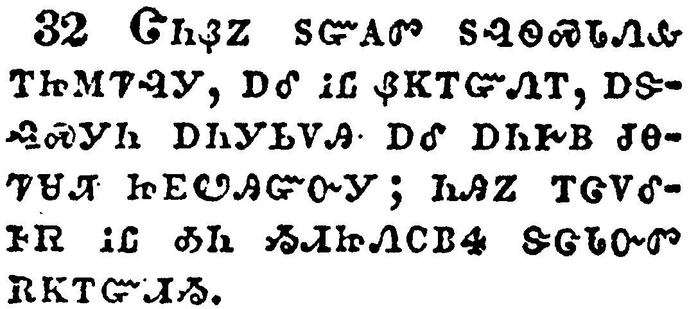</a></td>
</tr>
<tr class="even">
<td>For John came unto you in the way of righteousness, and ye believed him not: but the publicans and the harlots believed him: and ye, when ye had seen it, repented not afterward, that ye might believe him.</td>
</tr>
<tr class="odd">
<td>ᏣᏂᏰᏃ ᏚᏳᎪᏛ ᏚᎸᏫᏍᏓᏁᎲ ᎢᏥᎷᏤᎸᎩ, ᎠᎴ ᎥᏝ ᏰᏦᎢᏳᏁᎢ, ᎠᏕᎸᏍᎩᏂ ᎠᏂᎩᏏᏙᎯ ᎠᎴ ᎠᏂᎨᏴ ᏧᎾᏤᏌᏘ ᏥᎬᏬᎯᏳᏅᎩ; ᏂᎯᏃ ᎢᏣᏙᎴᎰᏒ ᎥᏝ ᎣᏂ ᏱᏗᏥᏁᏟᏴᏎ ᏕᏣᏓᏅᏛ ᎡᏦᎢᏳᏗᏱ.</td>
</tr>
<tr class="even">
<td>Tsa-ni-ye-no du-yu-go-dv du-lv-wi-s-da-ne-hv i-tsi-lu-tse-lv-gi, a-le v-tla ye-tso-i-yu-ne-i, a-de-lv-s-gi-ni a-ni-gi-si-do-hi a-le a-ni-ge-yv tsu-na-tse-sa-ti tsi-gv-wo-hi-yu-nv-gi; ni-hi-no i-tsa-do-le-ho-sv v-tla o-ni yi-di-tsi-ne-tli-yv-se de-tsa-da-nv-dv e-tso-i-yu-di-yi.</td>
</tr>
</tbody>
</table>

<table>
<tbody>
<tr class="odd">
<td><a href="012133.png">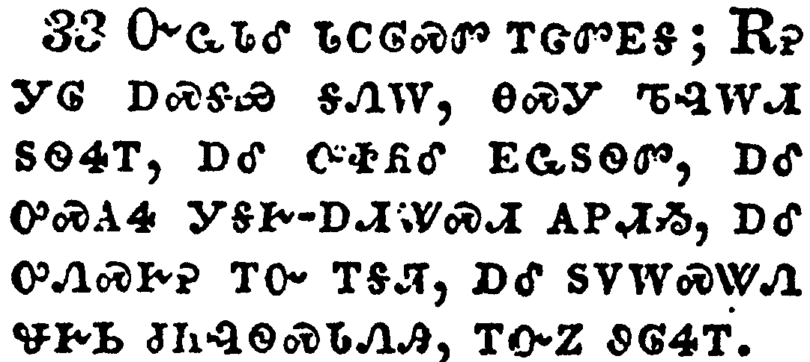</a></td>
</tr>
<tr class="even">
<td>Hear another parable: There was a certain householder, which planted a vineyard, and hedged it round about, and digged a winepress in it, and built a tower, and let it out to husbandmen, and went into a far country:</td>
</tr>
<tr class="odd">
<td>ᏅᏩᏓᎴ ᏓᏟᎶᏍᏛ ᎢᏣᏛᎬᎦ; ᎡᎮ ᎩᎶ ᎠᏍᎦᏯ ᎦᏁᎳ, ᎾᏍᎩ ᏖᎸᎳᏗ ᏚᏫᏎᎢ, ᎠᎴ ᎤᏐᏲᎴ ᎬᏩᏚᏫᏛ, ᎠᎴ ᎤᏍᎪᏎ ᎩᎦᎨ-ᎠᏗᏔᏍᏗ ᎪᏢᏗᏱ, ᎠᎴ ᎤᏁᏍᎨᎮ ᎢᏅ ᎢᎦᏘ, ᎠᎴ ᏚᏙᎳᏍᏔᏁ ᏠᎨᏏ ᏧᏂᎸᏫᏍᏓᏁᎯ, ᎢᏅᏃ ᏭᎶᏎᎢ.</td>
</tr>
<tr class="even">
<td>Nv-wa-da-le da-tli-lo-s-dv i-tsa-dv-gv-ga; E-he gi-lo a-s-ga-ya ga-ne-la, na-s-gi te-lv-la-di du-wi-se-i, a-le u-so-yo-le gv-wa-du-wi-dv, a-le u-s-go-se gi-ga-ge--a-di-ta-s-di go-tlv-di-yi, a-le u-ne-s-ge-he i-nv i-ga-ti, a-le du-do-la-s-ta-ne tlo-ge-si tsu-ni-lv-wi-s-da-ne-hi, i-nv-no wu-lo-se-i.</td>
</tr>
</tbody>
</table>

<table>
<tbody>
<tr class="odd">
<td><a href="012134.png">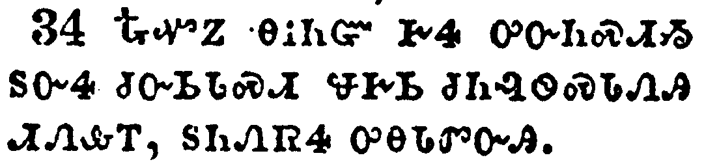</a></td>
</tr>
<tr class="even">
<td>And when the time of the fruit drew near, he sent his servants to the husbandmen, that they might receive the fruits of it.</td>
</tr>
<tr class="odd">
<td>ᎿᎭᏉᏃ ᎾᎥᏂᏳ ᎨᏎ ᎤᏅᏂᏍᏗᏱ ᏚᏅᏎ ᏧᏅᏏᏓᏍᏗ ᏠᎨᏏ ᏧᏂᎸᏫᏍᏓᏁᎯ ᏗᏁᎲᎢ, ᏚᏂᏁᏒᏎ ᎤᎾᏓᏛᏅᎯ.</td>
</tr>
<tr class="even">
<td>Hna-quo-no na-v-ni-yu ge-se u-nv-ni-s-di-yi du-nv-se tsu-nv-si-da-s-di tlo-ge-si tsu-ni-lv-wi-s-da-ne-hi di-ne-hv-i, du-ni-ne-sv-se u-na-da-dv-nv-hi.</td>
</tr>
</tbody>
</table>

<table>
<tbody>
<tr class="odd">
<td><a href="012135.png">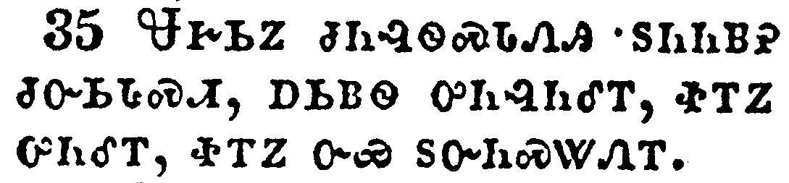</a></td>
</tr>
<tr class="even">
<td>And the husbandmen took his servants, and beat one, and killed another, and stoned another.</td>
</tr>
<tr class="odd">
<td>ᏠᎨᏏᏃ ᏧᏂᎸᏫᏍᏓᏁᎯ ᏚᏂᏂᏴᎮ ᏧᏅᏏᏓᏍᏗ, ᎠᏏᏴᏫ ᎤᏂᎸᏂᎴᎢ, ᏐᎢᏃ ᎤᏂᎴᎢ, ᏐᎢᏃ ᏅᏯ ᏚᏅᏂᏍᏔᏁᎢ.</td>
</tr>
<tr class="even">
<td>Tlo-ge-si-no tsu-ni-lv-wi-s-da-ne-hi du-ni-ni-yv-he tsu-nv-si-da-s-di, a-si-yv-wi u-ni-lv-ni-le-i, so-i-no u-ni-le-i, so-i-no nv-ya du-nv-ni-s-ta-ne-i.</td>
</tr>
</tbody>
</table>

<table>
<tbody>
<tr class="odd">
<td><a href="012136.png">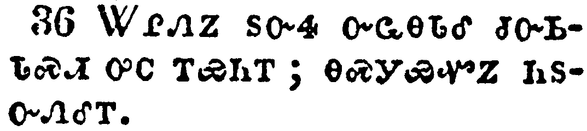</a></td>
</tr>
<tr class="even">
<td>Again, he sent other servants more than the first: and they did unto them likewise.</td>
</tr>
<tr class="odd">
<td>ᏔᎵᏁᏃ ᏚᏅᏎ ᏅᏩᎾᏓᎴ ᏧᏅᏏᏓᏍᏗ ᎤᏟ ᎢᏯᏂᎢ; ᎾᏍᎩᏯᏉᏃ ᏂᏚᏅᏁᎴᎢ.</td>
</tr>
<tr class="even">
<td>Ta-li-ne-no du-nv-se nv-wa-na-da-le tsu-nv-si-da-s-di u-tli i-ya-ni-i; na-s-gi-ya-quo-no ni-du-nv-ne-le-i.</td>
</tr>
</tbody>
</table>

<table>
<tbody>
<tr class="odd">
<td><a href="012137.png">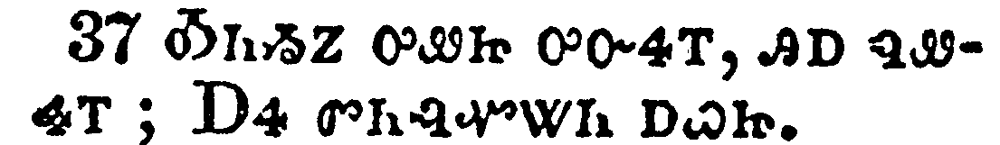</a></td>
</tr>
<tr class="even">
<td>But last of all he sent unto them his son, saying, They will reverence my son.</td>
</tr>
<tr class="odd">
<td>ᎣᏂᏱᏃ ᎤᏪᏥ ᎤᏅᏎᎢ, ᎯᎠ ᏄᏪᏎᎢ; ᎠᏎ ᏛᏂᎸᏉᏔᏂ ᎠᏇᏥ.</td>
</tr>
<tr class="even">
<td>O-ni-yi-no u-we-tsi u-nv-se-i, hi-a nu-we-se-i; A-se dv-ni-lv-quo-ta-ni a-que-tsi.</td>
</tr>
</tbody>
</table>

<table>
<tbody>
<tr class="odd">
<td><a href="012138.png">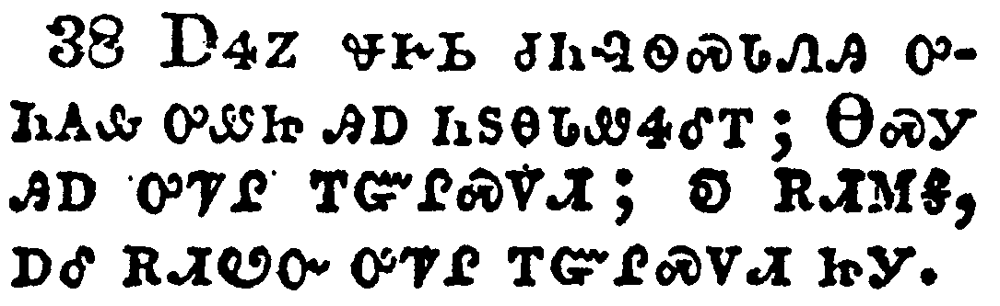</a></td>
</tr>
<tr class="even">
<td>But when the husbandmen saw the son, they said among themselves, This is the heir; come, let us kill him, and let us seize on his inheritance.</td>
</tr>
<tr class="odd">
<td>ᎠᏎᏃ ᏠᎨᏏ ᏧᏂᎸᏫᏍᏓᏁᎯ ᎤᏂᎪᎲ ᎤᏪᏥ ᎯᎠ ᏂᏚᎾᏓᏪᏎᎴᎢ; ᎾᏍᎩ ᎯᎠ ᎤᏤᎵ ᎢᏳᎵᏍᏙᏗ; Ꭷ ᎡᏗᎷᎦ, ᎠᎴ ᎡᏗᏬᏅ ᎤᏤᎵ ᎢᏳᎵᏍᏙᏗ ᏥᎩ.</td>
</tr>
<tr class="even">
<td>A-se-no tlo-ge-si tsu-ni-lv-wi-s-da-ne-hi u-ni-go-hv u-we-tsi hi-a ni-du-na-da-we-se-le-i; Na-s-gi hi-a u-tse-li i-yu-li-s-do-di; ka e-di-lu-ga, a-le e-di-wo-nv u-tse-li i-yu-li-s-do-di tsi-gi.</td>
</tr>
</tbody>
</table>

<table>
<tbody>
<tr class="odd">
<td><a href="012139.png">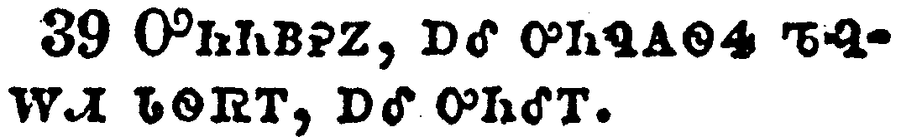</a></td>
</tr>
<tr class="even">
<td>And they caught him, and cast him out of the vineyard, and slew him.</td>
</tr>
<tr class="odd">
<td>ᎤᏂᏂᏴᎮᏃ, ᎠᎴ ᎤᏂᏄᎪᏫᏎ ᏖᎸᎳᏗ ᏓᏫᏒᎢ, ᎠᎴ ᎤᏂᎴᎢ.</td>
</tr>
<tr class="even">
<td>U-ni-ni-yv-he-no, a-le u-ni-nu-go-wi-se te-lv-la-di da-wi-sv-i, a-le u-ni-le-i.</td>
</tr>
</tbody>
</table>

<table>
<tbody>
<tr class="odd">
<td><a href="012140.png">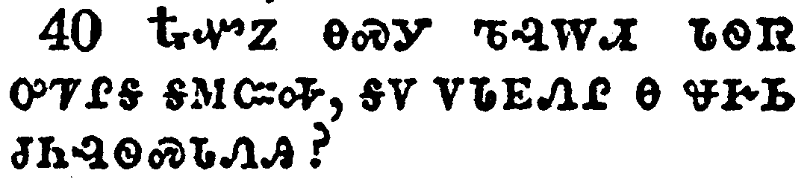</a></td>
</tr>
<tr class="even">
<td>When the lord therefore of the vineyard cometh, what will he do unto those husbandmen?</td>
</tr>
<tr class="odd">
<td>ᎿᎭᏉᏃ ᎾᏍᎩ ᏖᎸᎳᏗ ᏓᏫᏒ ᎤᏤᎵᎦ ᎦᎷᏨᎭ, ᎦᏙ ᏙᏓᎬᏁᎵ Ꮎ ᏠᎨᏏ ᏧᏂᎸᏫᏍᏓᏁᎯ?</td>
</tr>
<tr class="even">
<td>Hna-quo-no na-s-gi te-lv-la-di da-wi-sv u-tse-li-ga ga-lu-tsv-ha, ga-do do-da-gv-ne-li na tlo-ge-si tsu-ni-lv-wi-s-da-ne-hi?</td>
</tr>
</tbody>
</table>

<table>
<tbody>
<tr class="odd">
<td><a href="012141.png">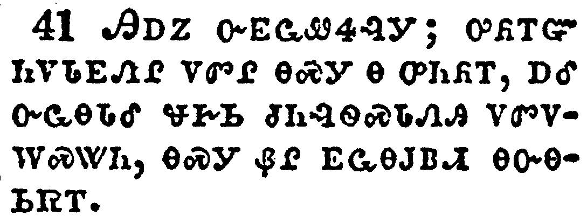</a></td>
</tr>
<tr class="even">
<td>They say unto him, He will miserably destroy those wicked men, and will let out his vineyard unto other husbandmen, which shall render him the fruits in their seasons.</td>
</tr>
<tr class="odd">
<td>ᎯᎠᏃ ᏅᎬᏩᏪᏎᎸᎩ; ᎤᏲᎢᏳ ᏂᏙᏓᎬᏁᎵ ᏙᏛᎵ ᎾᏍᎩ Ꮎ ᎤᏂᏲᎢ, ᎠᎴ ᏅᏩᎾᏓᎴ ᏠᎨᏏ ᏧᏂᎸᏫᏍᏓᏁᎯ ᏙᏛᏙᎳᏍᏔᏂ, ᎾᏍᎩ ᏰᎵ ᎬᏩᎾᎫᏴᏗ ᎾᏅᎾᏏᏒᎢ.</td>
</tr>
<tr class="even">
<td>Hi-a-no nv-gv-wa-we-se-lv-gi; u-yo-i-yu ni-do-da-gv-ne-li do-dv-li na-s-gi na u-ni-yo-i, a-le nv-wa-na-da-le tlo-ge-si tsu-ni-lv-wi-s-da-ne-hi do-dv-do-la-s-ta-ni, na-s-gi ye-li gv-wa-na-gu-yv-di na-nv-na-si-sv-i.</td>
</tr>
</tbody>
</table>

<table>
<tbody>
<tr class="odd">
<td><a href="012142.png">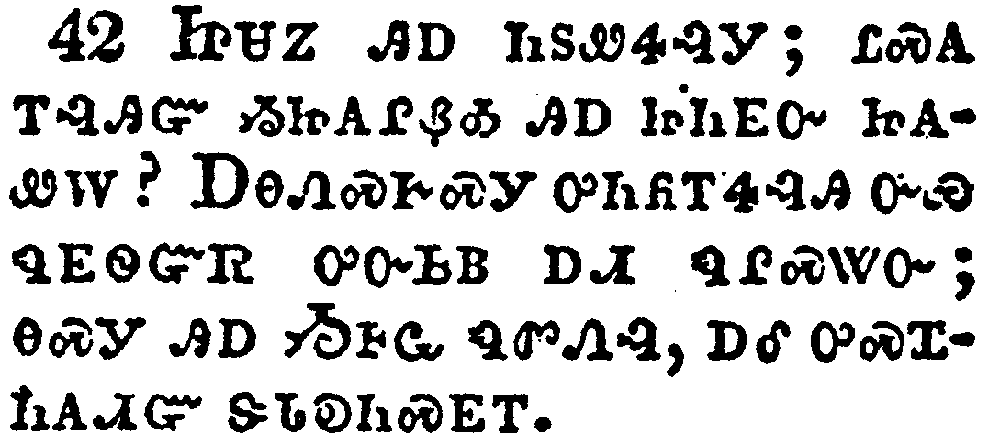</a></td>
</tr>
<tr class="even">
<td>Jesus saith unto them, Did ye never read in the scriptures, The stone which the builders rejected, the same is become the head of the corner: this is the Lord's doing, and it is marvellous in our eyes?</td>
</tr>
<tr class="odd">
<td>ᏥᏌᏃ ᎯᎠ ᏂᏚᏪᏎᎸᎩ; ᏝᏍᎪ ᎢᎸᎯᏳ ᏱᏥᎪᎵᏰᎣ ᎯᎠ ᏥᏂᎬᏅ ᏥᎪᏪᎳ? ᎠᎾᏁᏍᎨᏍᎩ ᎤᏂᏲᎢᏎᎸᎯ ᏅᏯ ᏄᎬᏫᏳᏒ ᎤᏅᏏᏴ ᎠᏗ ᏄᎵᏍᏔᏅ; ᎾᏍᎩ ᎯᎠ ᏱᎰᏩ ᏄᏛᏁᎸ, ᎠᎴ ᎤᏍᏆᏂᎪᏗᏳ ᏕᏓᎧᏂᏍᎬᎢ.</td>
</tr>
<tr class="even">
<td>Tsi-sa-no hi-a ni-du-we-se-lv-gi; tla-s-go i-lv-hi-yu yi-tsi-go-li-ye-o hi-a tsi-ni-gv-nv tsi-go-we-la? A-na-ne-s-ge-s-gi u-ni-yo-i-se-lv-hi nv-ya nu-gv-wi-yu-sv u-nv-si-yv a-di nu-li-s-ta-nv; na-s-gi hi-a Yi-ho-wa nu-dv-ne-lv, a-le u-s-qua-ni-go-di-yu de-da-ka-ni-s-gv-i.</td>
</tr>
</tbody>
</table>

<table>
<tbody>
<tr class="odd">
<td><a href="012143.png">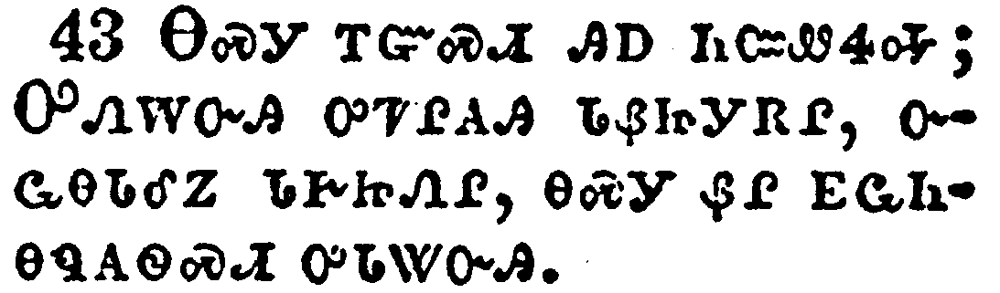</a></td>
</tr>
<tr class="even">
<td>Therefore say I unto you, The kingdom of God shall be taken from you, and given to a nation bringing forth the fruits thereof.</td>
</tr>
<tr class="odd">
<td>ᎾᏍᎩ ᎢᏳᏍᏗ ᎯᎠ ᏂᏨᏪᏎᎭ; ᎤᏁᎳᏅᎯ ᎤᏤᎵᎪᎯ ᏓᏰᏥᎩᏒᎵ, ᏅᏩᎾᏓᎴᏃ ᏓᎨᏥᏁᎵ, ᎾᏍᎩ ᏰᎵ ᎬᏩᏂᎾᏄᎪᏫᏍᏗ ᎤᏓᏔᏅᎯ.</td>
</tr>
<tr class="even">
<td>Na-s-gi i-yu-s-di hi-a ni-tsv-we-se-ha; U-ne-la-nv-hi u-tse-li-go-hi da-ye-tsi-gi-sv-li, nv-wa-na-da-le-no da-ge-tsi-ne-li, na-s-gi ye-li gv-wa-ni-na-nu-go-wi-s-di u-da-ta-nv-hi.</td>
</tr>
</tbody>
</table>

<table>
<tbody>
<tr class="odd">
<td><a href="012144.png">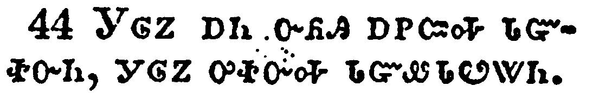</a></td>
</tr>
<tr class="even">
<td>And whosoever shall fall on this stone shall be broken: but on whomsoever it shall fall, it will grind him to powder.</td>
</tr>
<tr class="odd">
<td>ᎩᎶᏃ ᎠᏂ ᏅᏲᎯ ᎠᏢᏨᎭ ᏓᏳᏐᏅᏂ, ᎩᎶᏃ ᎤᏐᏅᎭ ᏓᏳᏪᏓᏬᏔᏂ.</td>
</tr>
<tr class="even">
<td>Gi-lo-no a-ni nv-yo-hi a-tlv-tsv-ha da-yu-so-nv-ni, gi-lo-no u-so-nv-ha da-yu-we-da-wo-ta-ni.</td>
</tr>
</tbody>
</table>

<table>
<tbody>
<tr class="odd">
<td><a href="012145.png">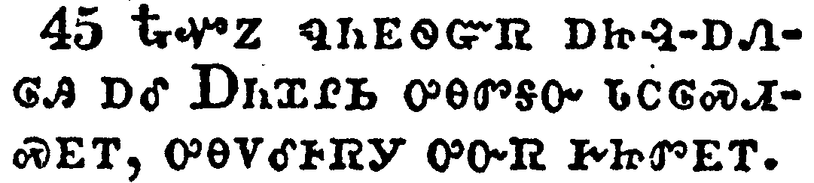</a></td>
</tr>
<tr class="even">
<td>And when the chief priests and Pharisees had heard his parables, they perceived that he spake of them.</td>
</tr>
<tr class="odd">
<td>ᎿᎭᏉᏃ ᏄᏂᎬᏫᏳᏒ ᎠᏥᎸ-ᎠᏁᎶᎯ ᎠᎴ ᎠᏂᏆᎵᏏ ᎤᎾᏛᎦᏅ ᏓᏟᎶᏍᏗᏍᎬᎢ, ᎤᎾᏙᎴᎰᏒᎩ ᎤᏅᏒ ᎨᏥᏛᎬᎢ.</td>
</tr>
<tr class="even">
<td>Hna-quo-no nu-ni-gv-wi-yu-sv a-tsi-lv--a-ne-lo-hi a-le A-ni-qua-li-si u-na-dv-ga-nv da-tli-lo-s-di-s-gv-i, u-na-do-le-ho-sv-gi u-nv-sv ge-tsi-dv-gv-i.</td>
</tr>
</tbody>
</table>

<table>
<tbody>
<tr class="odd">
<td><a href="012146.png">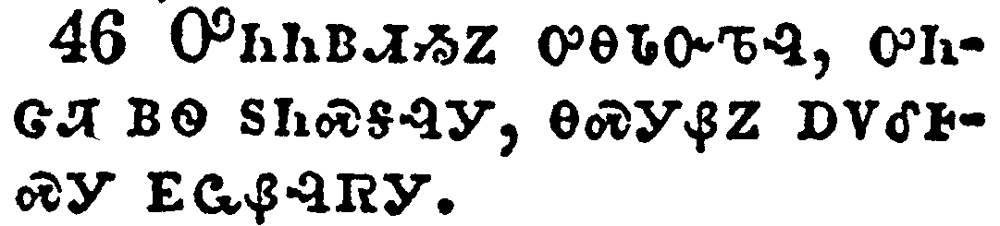</a></td>
</tr>
<tr class="even">
<td>But when they sought to lay hands on him, they feared the multitude, because they took him for a prophet.</td>
</tr>
<tr class="odd">
<td>ᎤᏂᏂᏴᏗᏱᏃ ᎤᎾᏓᏅᏖᎸ, ᎤᏂᏣᏘ ᏴᏫ ᏚᏂᏍᎦᎸᎩ, ᎾᏍᎩᏰᏃ ᎠᏙᎴᎰᏍᎩ ᎬᏩᏰᎸᏒᎩ.</td>
</tr>
<tr class="even">
<td>U-ni-ni-yv-di-yi-no u-na-da-nv-te-lv, u-ni-tsa-ti yv-wi du-ni-s-ga-lv-gi, na-s-gi-ye-no a-do-le-ho-s-gi gv-wa-ye-lv-sv-gi.</td>
</tr>
</tbody>
</table>

