+++
draft=false
date = 2014-12-18T21:11:07Z
title = "Revelation - Chapter 1 - Cherokee New Testament"
weight = 1418955067

[taxonomies]

authors = ["Timothy Legg"]
categories = []
tags = []

[extra]
+++

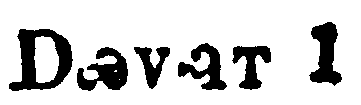

<table>
<tbody>
<tr class="odd">
<td><a href="270101.png">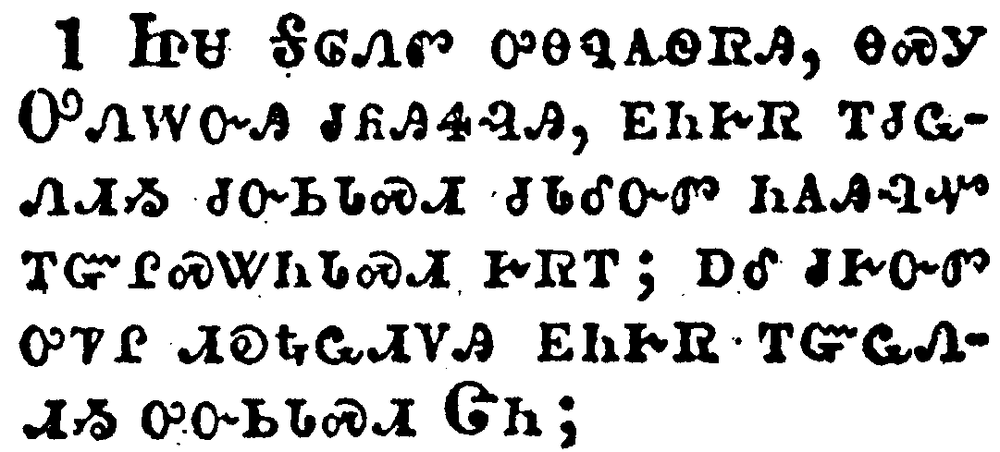</a></td>
</tr>
<tr class="even">
<td>The Revelation of Jesus Christ, which God gave unto him, to shew unto his servants things which must shortly come to pass; and he sent and signified it by his angel unto his servant John:</td>
</tr>
<tr class="odd">
<td>ᏥᏌ ᎦᎶᏁᏛ ᎤᎾᏄᎪᏫᏒᎯ, ᎾᏍᎩ ᎤᏁᎳᏅᎯ ᏧᏲᎯᏎᎸᎯ, ᎬᏂᎨᏒ ᎢᏧᏩᏁᏗᏱ ᏧᏅᏏᏓᏍᏗ ᏧᏓᎴᏅᏛ ᏂᎪᎯᎸᏉ ᎢᏳᎵᏍᏔᏂᏓᏍᏗ ᎨᏒᎢ; ᎠᎴ ᏧᎨᏅᏛ ᎤᏤᎵ ᏗᎧᎿᎭᏩᏗᏙᎯ ᎬᏂᎨᏒ ᎢᏳᏩᏁᏗᏱ ᎤᏅᏏᏓᏍᏗ ᏣᏂ;</td>
</tr>
<tr class="even">
<td>Tsi-sa Ga-lo-ne-dv u-na-nu-go-wi-sv-hi, na-s-gi U-ne-la-nv-hi tsu-yo-hi-se-lv-hi, gv-ni-ge-sv i-tsu-wa-ne-di-yi tsu-nv-si-da-s-di tsu-da-le-nv-dv ni-go-hi-lv-quo i-yu-li-s-ta-ni-da-s-di ge-sv-i; a-le tsu-ge-nv-dv u-tse-li di-ka-hna-wa-di-do-hi gv-ni-ge-sv i-yu-wa-ne-di-yi u-nv-si-da-s-di Tsa-ni;</td>
</tr>
</tbody>
</table>

<table>
<tbody>
<tr class="odd">
<td><a href="270102.png">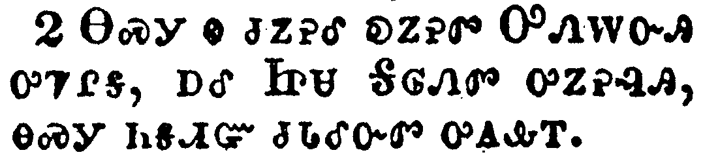</a></td>
</tr>
<tr class="even">
<td>Who bare record of the word of God, and of the testimony of Jesus Christ, and of all things that he saw.</td>
</tr>
<tr class="odd">
<td>ᎾᏍᎩ Ꮎ ᏧᏃᎮᎴ ᎧᏃᎮᏛ ᎤᏁᎳᏅᎯ ᎤᏤᎵᎦ, ᎠᎴ ᏥᏌ ᎦᎶᏁᏛ ᎤᏃᎮᎸᎯ, ᎾᏍᎩ ᏂᎦᏗᏳ ᏧᏓᎴᏅᏛ ᎤᎪᎲᎢ.</td>
</tr>
<tr class="even">
<td>Na-s-gi na tsu-no-he-le ka-no-he-dv U-ne-la-nv-hi u-tse-li-ga, a-le Tsi-sa Ga-lo-ne-dv u-no-he-lv-hi, na-s-gi ni-ga-di-yu tsu-da-le-nv-dv u-go-hv-i.</td>
</tr>
</tbody>
</table>

<table>
<tbody>
<tr class="odd">
<td><a href="270103.png">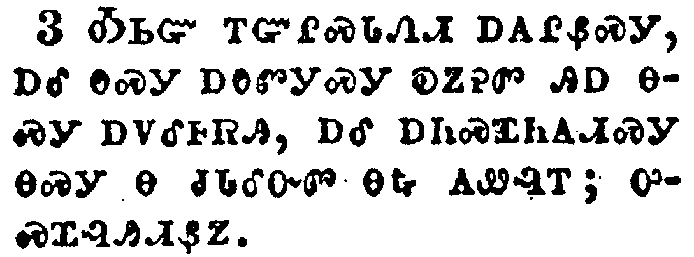</a></td>
</tr>
<tr class="even">
<td>Blessed is he that readeth, and they that hear the words of this prophecy, and keep those things which are written therein: for the time is at hand.</td>
</tr>
<tr class="odd">
<td>ᎣᏏᏳ ᎢᏳᎵᏍᏓᏁᏗ ᎠᎪᎵᏰᏍᎩ, ᎠᎴ ᎾᏍᎩ ᎠᎾᏛᎩᏍᎩ ᎧᏃᎮᏛ ᎯᎠ ᎾᏍᎩ ᎠᏙᎴᎰᏒᎯ, ᎠᎴ ᎠᏂᏍᏆᏂᎪᏗᏍᎩ ᎾᏍᎩ Ꮎ ᏧᏓᎴᏅᏛ ᎾᎿᎭᎪᏪᎸᎢ; ᎤᏍᏆᎸᎯᏗᏰᏃ.</td>
</tr>
<tr class="even">
<td>O-si-yu i-yu-li-s-da-ne-di a-go-li-ye-s-gi, a-le na-s-gi a-na-dv-gi-s-gi ka-no-he-dv hi-a na-s-gi a-do-le-ho-sv-hi, a-le a-ni-s-qua-ni-go-di-s-gi na-s-gi na tsu-da-le-nv-dv na-hna go-we-lv-i; u-s-qua-lv-hi-di-ye-no.</td>
</tr>
</tbody>
</table>

<table>
<tbody>
<tr class="odd">
<td><a href="270104.png">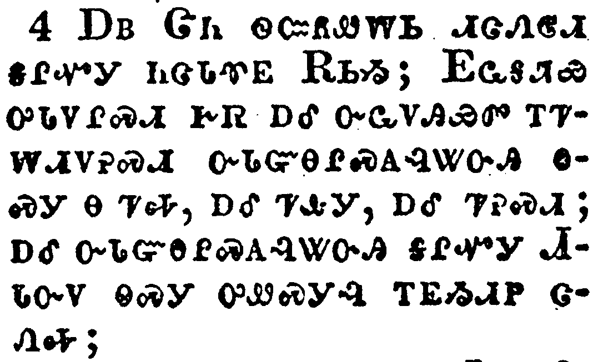</a></td>
</tr>
<tr class="even">
<td>John to the seven churches which are in Asia: Grace be unto you, and peace, from him which is, and which was, and which is to come; and from the seven Spirits which are before his throne;</td>
</tr>
<tr class="odd">
<td>ᎠᏴ ᏣᏂ ᏫᏨᏲᏪᎳᏏ ᏗᏣᏁᎶᏗ ᎦᎵᏉᎩ ᏂᏣᏓᏡᎬ ᎡᏏᏱ; ᎬᏩᎦᏘᏯ ᎤᏓᏙᎵᏍᏗ ᎨᏒ ᎠᎴ ᏅᏩᏙᎯᏯᏛ ᎢᏤᎳᏗᏙᎮᏍᏗ ᏅᏓᏳᎾᎵᏍᎪᎸᏔᏅᎯ ᎾᏍᎩ Ꮎ ᏤᎭ, ᎠᎴ ᏤᎲᎩ, ᎠᎴ ᏤᎮᏍᏗ; ᎠᎴ ᏅᏓᏳᎾᎵᏍᎪᎸᏔᏅᎯ ᎦᎵᏉᎩ ᏗᏓᏅᏙ ᎾᏍᎩ ᎤᏪᏍᎩᎸ ᎢᎬᏱᏗᏢ ᏣᏁᎭ;</td>
</tr>
<tr class="even">
<td>A-yv Tsa-ni wi-tsv-yo-we-la-si di-tsa-ne-lo-di ga-li-quo-gi ni-tsa-da-tlu-gv E-si-yi; gv-wa-ga-ti-ya u-da-do-li-s-di ge-sv a-le nv-wa-do-hi-ya-dv i-tse-la-di-do-he-s-di nv-da-yu-na-li-s-go-lv-ta-nv-hi na-s-gi na tse-ha, a-le tse-hv-gi, a-le tse-he-s-di; a-le nv-da-yu-na-li-s-go-lv-ta-nv-hi ga-li-quo-gi Di-da-nv-do na-s-gi u-we-s-gi-lv i-gv-yi-di-tlv tsa-ne-ha;</td>
</tr>
</tbody>
</table>

<table>
<tbody>
<tr class="odd">
<td><a href="270105.png">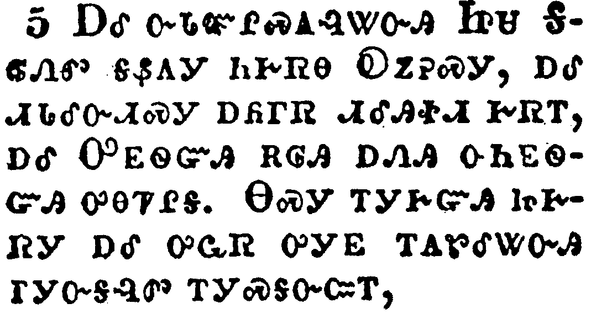</a></td>
</tr>
<tr class="even">
<td>And from Jesus Christ, who is the faithful witness, and the first begotten of the dead, and the prince of the kings of the earth. Unto him that loved us, and washed us from our sins in his own blood,</td>
</tr>
<tr class="odd">
<td>ᎠᎴ ᏅᏓᏳᎵᏍᎪᎸᏔᏅᎯ ᏥᏌ ᎦᎶᏁᏛ ᎦᏰᎪᎩ ᏂᎨᏒᎾ ᎧᏃᎮᏍᎩ, ᎠᎴ ᏗᏓᎴᏅᏗᏍᎩ ᎠᏲᎱᏒ ᏗᎴᎯᏐᏗ ᎨᏒᎢ, ᎠᎴ ᎤᎬᏫᏳᎯ ᎡᎶᎯ ᎠᏁᎯ ᎤᏂᎬᏫᏳᎯ ᎤᎾᏤᎵᎦ. ᎾᏍᎩ ᎢᎩᎨᏳᎯ ᏥᎨᏒᎩ ᎠᎴ ᎤᏩᏒ ᎤᎩᎬ ᎢᎪᏑᎴᏔᏅᎯ ᎢᎩᏅᎦᎸᏛ ᎢᎩᏍᎦᏅᏨᎢ,</td>
</tr>
<tr class="even">
<td>A-le nv-da-yu-li-s-go-lv-ta-nv-hi Tsi-sa Ga-lo-ne-dv ga-ye-go-gi ni-ge-sv-na Ka-no-he-s-gi, a-le di-da-le-nv-di-s-gi a-yo-hu-sv di-le-hi-so-di ge-sv-i, a-le U-gv-wi-yu-hi e-lo-hi a-ne-hi u-ni-gv-wi-yu-hi u-na-tse-li-ga. Na-s-gi i-gi-ge-yu-hi tsi-ge-sv-gi a-le u-wa-sv u-gi-gv i-go-su-le-ta-nv-hi i-gi-nv-ga-lv-dv i-gi-s-ga-nv-tsv-i,</td>
</tr>
</tbody>
</table>

<table>
<tbody>
<tr class="odd">
<td><a href="270106.png">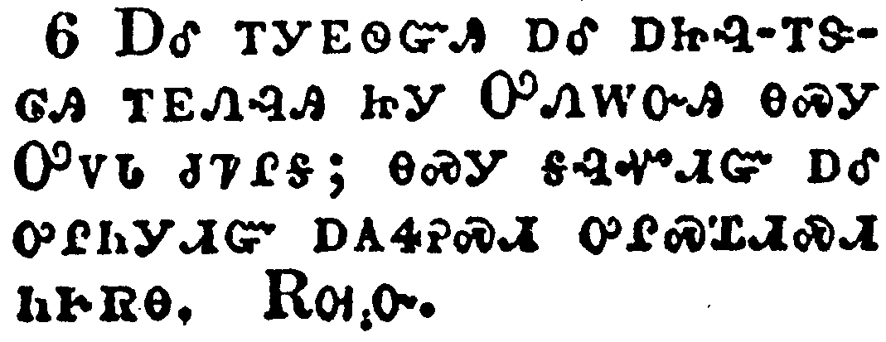</a></td>
</tr>
<tr class="even">
<td>And hath made us kings and priests unto God and his Father; to him be glory and dominion for ever and ever. Amen.</td>
</tr>
<tr class="odd">
<td>ᎠᎴ ᎢᎩᎬᏫᏳᎯ ᎠᎴ ᎠᏥᎸ-ᎢᏕᎶᎯ ᎢᎬᏁᎸᎯ ᏥᎩ ᎤᏁᎳᏅᎯ ᎾᏍᎩ ᎤᏙᏓ ᏧᏤᎵᎦ; ᎾᏍᎩ ᎦᎸᏉᏗᏳ ᎠᎴ ᎤᎵᏂᎩᏗᏳ ᎠᎪᏎᎮᏍᏗ ᎤᎵᏍᏆᏗᏍᏗ ᏂᎨᏒᎾ. ᎡᎺᏅ.</td>
</tr>
<tr class="even">
<td>A-le i-gi-gv-wi-yu-hi a-le a-tsi-lv--i-de-lo-hi i-gv-ne-lv-hi tsi-gi U-ne-la-nv-hi na-s-gi U-do-da tsu-tse-li-ga; na-s-gi ga-lv-quo-di-yu a-le u-li-ni-gi-di-yu a-go-se-he-s-di u-li-s-qua-di-s-di ni-ge-sv-na. E-me-nv.</td>
</tr>
</tbody>
</table>

<table>
<tbody>
<tr class="odd">
<td><a href="270107.png">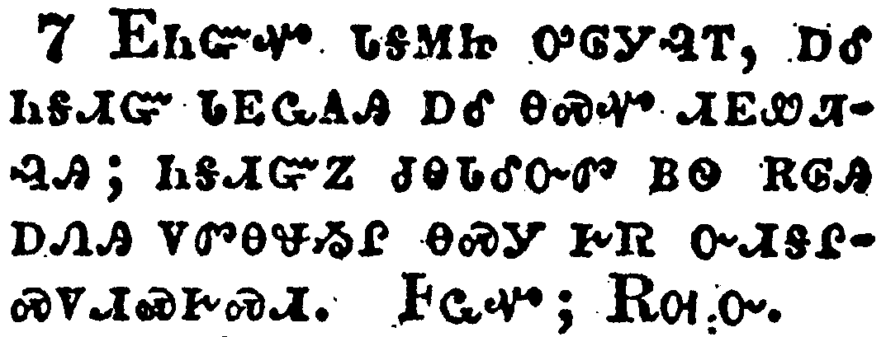</a></td>
</tr>
<tr class="even">
<td>Behold, he cometh with clouds; and every eye shall see him, and they also which pierced him: and all kindreds of the earth shall wail because of him. Even so, Amen.</td>
</tr>
<tr class="odd">
<td>ᎬᏂᏳᏉ ᏓᎦᎷᏥ ᎤᎶᎩᎸᎢ, ᎠᎴ ᏂᎦᏗᏳ ᏓᎬᏩᎪᎯ ᎠᎴ ᎾᏍᏉ ᏗᎬᏪᏘᎸᎯ; ᏂᎦᏗᏳᏃ ᏧᎾᏓᎴᏅᏛ ᏴᏫ ᎡᎶᎯ ᎠᏁᎯ ᏙᏛᎾᏠᏱᎵ ᎾᏍᎩ ᎨᏒ ᏅᏗᎦᎵᏍᏙᏗᏍᎨᏍᏗ. ᎰᏩᏉ. ᎡᎺᏅ.</td>
</tr>
<tr class="even">
<td>Gv-ni-yu-quo da-ga-lu-tsi u-lo-gi-lv-i, a-le ni-ga-di-yu da-gv-wa-go-hi a-le na-s-quo di-gv-we-ti-lv-hi; ni-ga-di-yu-no tsu-na-da-le-nv-dv yv-wi e-lo-hi a-ne-hi do-dv-na-tlo-yi-li na-s-gi ge-sv nv-di-ga-li-s-do-di-s-ge-s-di. Ho-wa-quo. E-me-nv.</td>
</tr>
</tbody>
</table>

<table>
<tbody>
<tr class="odd">
<td></td>
</tr>
<tr class="even">
<td>I am Alpha and Omega, the beginning and the ending, saith the Lord, which is, and which was, and which is to come, the Almighty.</td>
</tr>
<tr class="odd">
<td>ᎠᏴ ᎡᎵᏆ ᎠᎴ ᎣᎻᎦ, ᏗᏓᎴᏅᏗᏍᎩ ᎠᎴ ᎠᏍᏆᏗᏍᏗᏍᎩ, ᎠᏗᎭ ᎤᎬᏫᏳᎯ ᎾᏍᎩ ᏤᎭ, ᎠᎴ ᏤᎲᎩ, ᎠᎴ ᏤᎮᏍᏗ, ᏫᎾᏍᏛᎾ ᎤᎵᏂᎩᏛ ᏥᎩ.</td>
</tr>
<tr class="even">
<td>A-yv E-li-qua a-le O-mi-ga, di-da-le-nv-di-s-gi a-le a-s-qua-di-s-di-s-gi, a-di-ha U-gv-wi-yu-hi na-s-gi tse-ha, a-le tse-hv-gi, a-le tse-he-s-di, wi-na-s-dv-na u-li-ni-gi-dv tsi-gi.</td>
</tr>
</tbody>
</table>

<table>
<tbody>
<tr class="odd">
<td><a href="270109.png">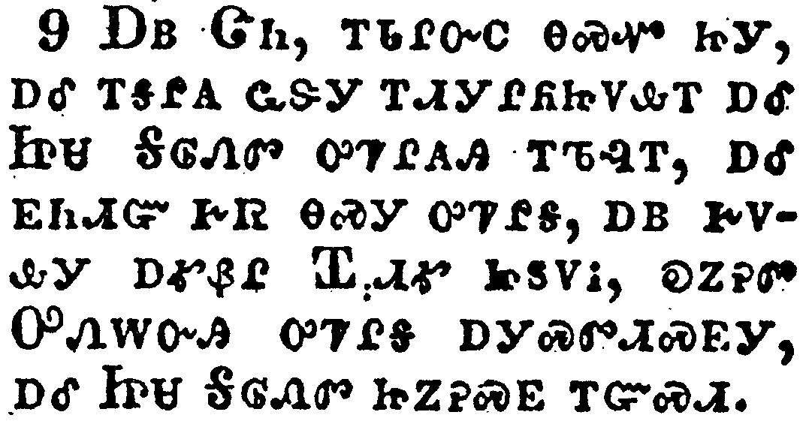</a></td>
</tr>
<tr class="even">
<td>I John, who also am your brother, and companion in tribulation, and in the kingdom and patience of Jesus Christ, was in the isle that is called Patmos, for the word of God, and for the testimony of Jesus Christ.</td>
</tr>
<tr class="odd">
<td>ᎠᏴ ᏣᏂ, ᎢᏓᎵᏅᏟ ᎾᏍᏉ ᏥᎩ, ᎠᎴ ᎢᎦᎵᎪ ᏩᏕᎩ ᎢᏗᎩᎵᏲᏥᏙᎲᎢ, ᎠᎴ ᏥᏌ ᎦᎶᏁᏛ ᎤᏤᎵᎪᎯ ᎢᏖᎸᎢ, ᎠᎴ ᎬᏂᏗᏳ ᎨᏒ ᎾᏍᎩ ᎤᏤᎵᎦ, ᎠᏴ ᎨᏙᎲᎩ ᎠᎹᏰᎵ ᏆᏗᎹ ᏥᏚᏙᎥ, ᎧᏃᎮᏛ ᎤᏁᎳᏅᎯ ᎤᏤᎵᎦ ᎠᎩᏍᏛᏗᏍᎬᎩ, ᎠᎴ ᏥᏌ ᎦᎶᏁᏛ ᏥᏃᎮᏍᎬ ᎢᏳᏍᏗ.</td>
</tr>
<tr class="even">
<td>A-yv Tsa-ni, i-da-li-nv-tli na-s-quo tsi-gi, a-le i-ga-li-go wa-de-gi i-di-gi-li-yo-tsi-do-hv-i, a-le Tsi-sa Ga-lo-ne-dv u-tse-li-go-hi i-te-lv-i, a-le gv-ni-di-yu ge-sv na-s-gi u-tse-li-ga, a-yv ge-do-hv-gi a-ma-ye-li Qua-di-ma tsi-du-do-v, ka-no-he-dv U-ne-la-nv-hi u-tse-li-ga a-gi-s-dv-di-s-gv-gi, a-le Tsi-sa Ga-lo-ne-dv tsi-no-he-s-gv i-yu-s-di.</td>
</tr>
</tbody>
</table>

<table>
<tbody>
<tr class="odd">
<td><a href="270110.png">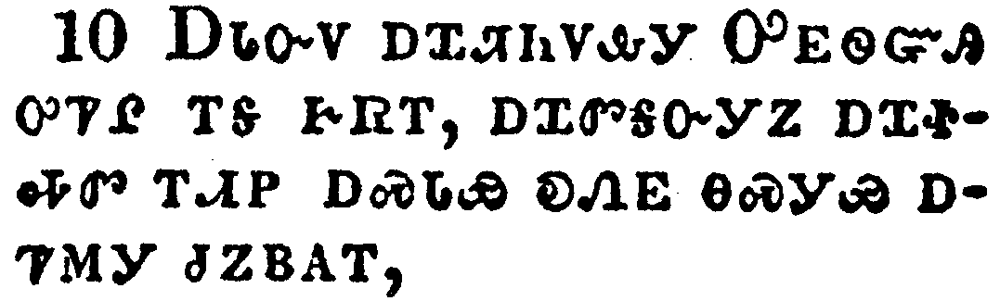</a></td>
</tr>
<tr class="even">
<td>I was in the Spirit on the Lord's day, and heard behind me a great voice, as of a trumpet,</td>
</tr>
<tr class="odd">
<td>ᎠᏓᏅᏙ ᎠᏆᏘᏂᏙᎲᎩ ᎤᎬᏫᏳᎯ ᎤᏤᎵ ᎢᎦ ᎨᏒᎢ, ᎠᏆᏛᎦᏅᎩᏃ ᎠᏆᏐᎭᏛ ᎢᏗᏢ ᎠᏍᏓᏯ ᎧᏁᎬ ᎾᏍᎩᏯ ᎠᏤᎷᎩ ᏧᏃᏴᎪᎢ,</td>
</tr>
<tr class="even">
<td>A-da-nv-do a-qua-ti-ni-do-hv-gi U-gv-wi-yu-hi u-tse-li i-ga ge-sv-i, a-qua-dv-ga-nv-gi-no a-qua-so-ha-dv i-di-tlv a-s-da-ya ka-ne-gv na-s-gi-ya a-tse-lu-gi tsu-no-yv-go-i,</td>
</tr>
</tbody>
</table>

<table>
<tbody>
<tr class="odd">
<td><a href="270111.png">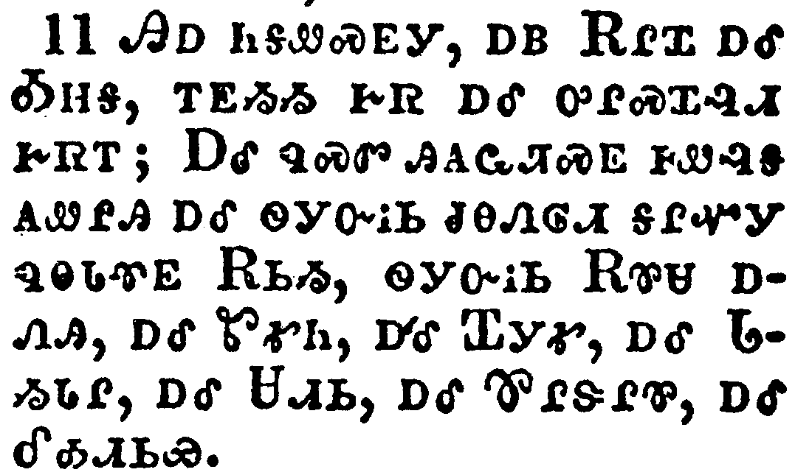</a></td>
</tr>
<tr class="even">
<td>Saying, I am Alpha and Omega, the first and the last: and, What thou seest, write in a book, and send it unto the seven churches which are in Asia; unto Ephesus, and unto Smyrna, and unto Pergamos, and unto Thyatira, and unto Sardis, and unto Philadelphia, and unto Laodicea.</td>
</tr>
<tr class="odd">
<td>ᎯᎠ ᏂᎦᏪᏍᎬᎩ, ᎠᏴ ᎡᎵᏆ ᎠᎴ ᎣᎻᎦ, ᎢᎬᏱᏱ ᎨᏒ ᎠᎴ ᎤᎵᏍᏆᎸᏗ ᎨᏒᎢ; ᎠᎴ ᏄᏍᏛ ᎯᎪᏩᏘᏍᎬ ᎰᏪᎸᎦ ᎪᏪᎵᎯ ᎠᎴ ᏫᎩᏅᎥᏏ ᏧᎾᏁᎶᏗ ᎦᎵᏉᎩ ᏄᎾᏓᏡᎬ ᎡᏏᏱ, ᏫᎩᏅᎥᏏ ᎡᏈᏌ ᎠᏁᎯ, ᎠᎴ ᏑᎹᏂ, ᎠᎴ ᏆᎩᎹ, ᎠᎴ ᏓᏱᏓᎵ, ᎠᎴ ᏌᏗᏏ, ᎠᎴ ᏈᎵᏕᎵᏈ, ᎠᎴ ᎴᎣᏗᏏᏯ.</td>
</tr>
<tr class="even">
<td>Hi-a ni-ga-we-s-gv-gi, a-yv E-li-qua a-le O-mi-ga, i-gv-yi-yi ge-sv a-le u-li-s-qua-lv-di ge-sv-i; A-le nu-s-dv hi-go-wa-ti-s-gv ho-we-lv-ga go-we-li-hi a-le wi-gi-nv-v-si tsu-na-ne-lo-di ga-li-quo-gi nu-na-da-tlu-gv E-si-yi, wi-gi-nv-v-si E-qui-sa a-ne-hi, a-le Su-ma-ni, a-le Qua-gi-ma, a-le Da-yi-da-li, a-le Sa-di-si, a-le Qui-li-de-li-qui, a-le Le-o-di-si-ya.</td>
</tr>
</tbody>
</table>

<table>
<tbody>
<tr class="odd">
<td><a href="270112.png">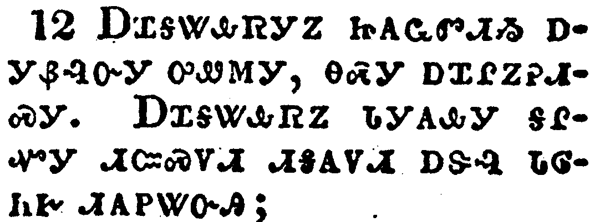</a></td>
</tr>
<tr class="even">
<td>And I turned to see the voice that spake with me. And being turned, I saw seven golden candlesticks;</td>
</tr>
<tr class="odd">
<td>ᎠᏆᎦᏔᎲᏒᎩᏃ ᏥᎪᏩᏛᏗᏱ ᎠᎩᏰᎸᏅᎩ ᎤᏪᎷᎩ, ᎾᏍᎩ ᎠᏆᎵᏃᎮᏗᏍᎩ. ᎠᏆᎦᏔᎲᏒᏃ ᏓᎩᎪᎲᎩ ᎦᎵᏉᎩ ᏗᏨᏍᏙᏗ ᏗᎦᎪᏙᏗ ᎠᏕᎸ ᏓᎶᏂᎨ ᏗᎪᏢᏔᏅᎯ;</td>
</tr>
<tr class="even">
<td>A-qua-ga-ta-hv-sv-gi-no tsi-go-wa-dv-di-yi a-gi-ye-lv-nv-gi u-we-lu-gi, na-s-gi a-qua-li-no-he-di-s-gi. A-qua-ga-ta-hv-sv-no da-gi-go-hv-gi ga-li-quo-gi di-tsv-s-do-di di-ga-go-do-di a-de-lv da-lo-ni-ge di-go-tlv-ta-nv-hi;</td>
</tr>
</tbody>
</table>

<table>
<tbody>
<tr class="odd">
<td><a href="270113.png">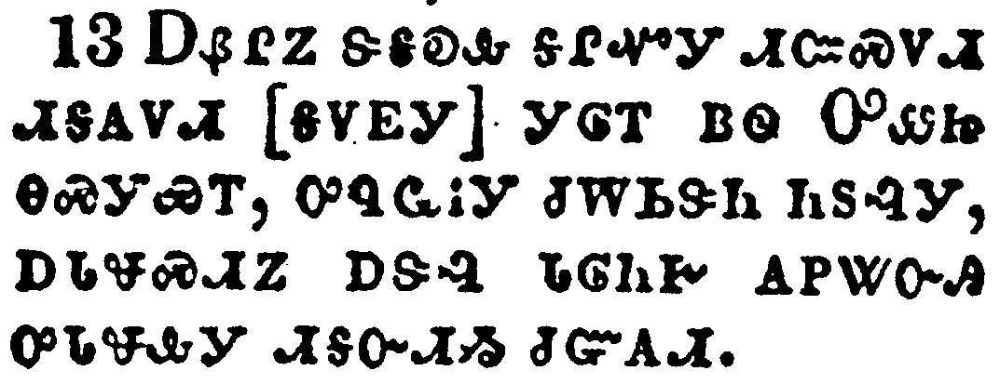</a></td>
</tr>
<tr class="even">
<td>And in the midst of the seven candlesticks one like unto the Son of man, clothed with a garment down to the foot, and girt about the paps with a golden girdle.</td>
</tr>
<tr class="odd">
<td>ᎠᏰᎵᏃ ᏕᎦᎧᎲ ᎦᎵᏉᎩ ᏗᏨᏍᏙᏗ ᏗᎦᎪᏙᏗ [ᎦᏙᎬᎩ] ᎩᎶᎢ ᏴᏫ ᎤᏪᏥ ᎾᏍᎩᏯᎢ, ᎤᏄᏩᎥᎩ ᏧᎳᏏᏕᏂ ᏂᏚᎸᎩ, ᎠᏓᏠᏍᏗᏃ ᎠᏕᎸ ᏓᎶᏂᎨ ᎪᏢᏔᏅᎯ ᎤᏓᏠᎲᎩ ᏗᎦᏅᏗᏱ ᏧᏳᎪᏗ.</td>
</tr>
<tr class="even">
<td>A-ye-li-no de-ga-ka-hv ga-li-quo-gi di-tsv-s-do-di di-ga-go-do-di [ga-do-gv-gi] gi-lo-i yv-wi U-we-tsi na-s-gi-ya-i, u-nu-wa-v-gi tsu-la-si-de-ni ni-du-lv-gi, a-da-tlo-s-di-no a-de-lv da-lo-ni-ge go-tlv-ta-nv-hi u-da-tlo-hv-gi di-ga-nv-di-yi tsu-yu-go-di.</td>
</tr>
</tbody>
</table>

<table>
<tbody>
<tr class="odd">
<td><a href="270114.png">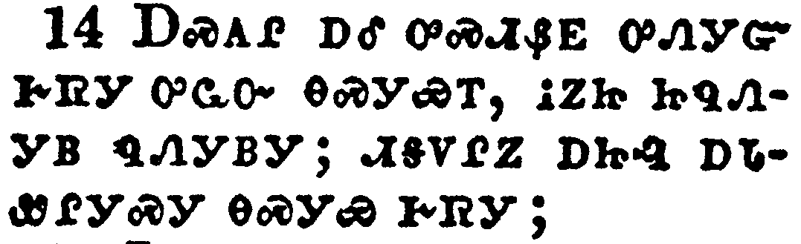</a></td>
</tr>
<tr class="even">
<td>His head and his hairs were white like wool, as white as snow; and his eyes were as a flame of fire;</td>
</tr>
<tr class="odd">
<td>ᎠᏍᎪᎵ ᎠᎴ ᎤᏍᏗᏰᎬ ᎤᏁᎩᏳ ᎨᏒᎩ ᎤᏩᏅ ᎾᏍᎩᏯᎢ, ᎥᏃᏥ ᏥᏄᏁᎩᏴ ᏄᏁᎩᏴᎩ; ᏗᎦᏙᎵᏃ ᎠᏥᎸ ᎠᏓᏪᎵᎩᏍᎩ ᎾᏍᎩᏯ ᎨᏒᎩ;</td>
</tr>
<tr class="even">
<td>A-s-go-li a-le u-s-di-ye-gv u-ne-gi-yu ge-sv-gi u-wa-nv na-s-gi-ya-i, v-no-tsi tsi-nu-ne-gi-yv nu-ne-gi-yv-gi; di-ga-do-li-no a-tsi-lv a-da-we-li-gi-s-gi na-s-gi-ya ge-sv-gi;</td>
</tr>
</tbody>
</table>

<table>
<tbody>
<tr class="odd">
<td><a href="270115.png">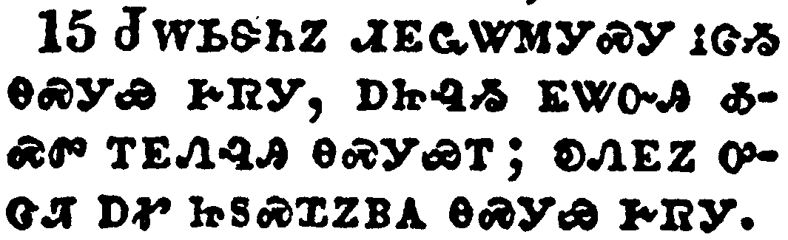</a></td>
</tr>
<tr class="even">
<td>And his feet like unto fine brass, as if they burned in a furnace; and his voice as the sound of many waters.</td>
</tr>
<tr class="odd">
<td>ᏧᎳᏏᏕᏂᏃ ᏗᎬᏩᏔᎷᎩᏍᎩ ᎥᏣᏱ ᎾᏍᎩᏯ ᎨᏒᎩ, ᎠᏥᎸᏱ ᎬᏔᏅᎯ ᎣᏍᏛ ᎢᎬᏁᎸᎯ ᎾᏍᎩᏯᎢ; ᎧᏁᎬᏃ ᎤᏣᏘ ᎠᎹ ᏥᏚᏍᏆᏃᏴᎪ ᎾᏍᎩᏯ ᎨᏒᎩ.</td>
</tr>
<tr class="even">
<td>Tsu-la-si-de-ni-no di-gv-wa-ta-lu-gi-s-gi v-tsa-yi na-s-gi-ya ge-sv-gi, a-tsi-lv-yi gv-ta-nv-hi o-s-dv i-gv-ne-lv-hi na-s-gi-ya-i; ka-ne-gv-no u-tsa-ti a-ma tsi-du-s-qua-no-yv-go na-s-gi-ya ge-sv-gi.</td>
</tr>
</tbody>
</table>

<table>
<tbody>
<tr class="odd">
<td><a href="270116.png">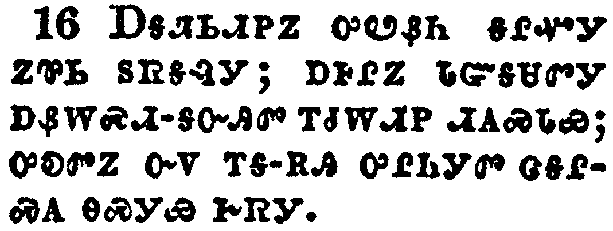</a></td>
</tr>
<tr class="even">
<td>And he had in his right hand seven stars: and out of his mouth went a sharp twoedged sword: and his countenance was as the sun shineth in his strength.</td>
</tr>
<tr class="odd">
<td>ᎠᎦᏘᏏᏗᏢᏃ ᎤᏬᏰᏂ ᎦᎵᏉᎩ ᏃᏈᏏ ᏚᏒᎦᎸᎩ; ᎠᎰᎵᏃ ᏓᏳᎦᏌᏛᎩ ᎠᏰᎳᏍᏗ-ᎦᏅᎯᏛ ᎢᏧᎳᏗᏢ ᏗᎪᏍᏓᏯ; ᎤᎧᏛᏃ ᏅᏙ ᎢᎦ-ᎡᎯ ᎤᎵᏂᎩᏛ ᏣᎦᎵᏍᎪ ᎾᏍᎩᏯ ᎨᏒᎩ.</td>
</tr>
<tr class="even">
<td>A-ga-ti-si-di-tlv-no u-wo-ye-ni ga-li-quo-gi no-qui-si du-sv-ga-lv-gi; a-ho-li-no da-yu-ga-sa-dv-gi a-ye-la-s-di--ga-nv-hi-dv i-tsu-la-di-tlv di-go-s-da-ya; u-ka-dv-no nv-do i-ga--e-hi u-li-ni-gi-dv tsa-ga-li-s-go na-s-gi-ya ge-sv-gi.</td>
</tr>
</tbody>
</table>

<table>
<tbody>
<tr class="odd">
<td><a href="270117.png">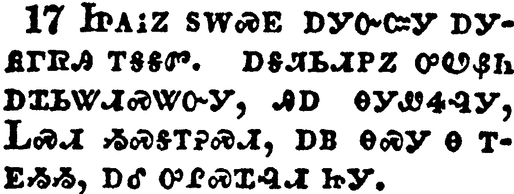</a></td>
</tr>
<tr class="even">
<td>And when I saw him, I fell at his feet as dead. And he laid his right hand upon me, saying unto me, Fear not; I am the first and the last:</td>
</tr>
<tr class="odd">
<td>ᏥᎪᎥᏃ ᏚᎳᏍᎬ ᎠᎩᏅᏨᎩ ᎠᎩᏲᎱᏒᎯ ᎢᎦᎦᏛ. ᎠᎦᏘᏏᏗᏢᏃ ᎤᏬᏰᏂ ᎠᏆᏏᏔᏗᏍᏔᏅᎩ, ᎯᎠ ᎾᎩᏪᏎᎸᎩ, ᏞᏍᏗ ᏱᏍᎦᎢᎮᏍᏗ, ᎠᏴ ᎾᏍᎩ Ꮎ ᎢᎬᏱᏱ, ᎠᎴ ᎤᎵᏍᏆᎸᏗ ᏥᎩ.</td>
</tr>
<tr class="even">
<td>Tsi-go-v-no du-la-s-gv a-gi-nv-tsv-gi a-gi-yo-hu-sv-hi i-ga-ga-dv. A-ga-ti-si-di-tlv-no u-wo-ye-ni a-qua-si-ta-di-s-ta-nv-gi, hi-a na-gi-we-se-lv-gi, Tle-s-di yi-s-ga-i-he-s-di, a-yv na-s-gi na i-gv-yi-yi, a-le u-li-s-qua-lv-di tsi-gi.</td>
</tr>
</tbody>
</table>

<table>
<tbody>
<tr class="odd">
<td><a href="270118.png">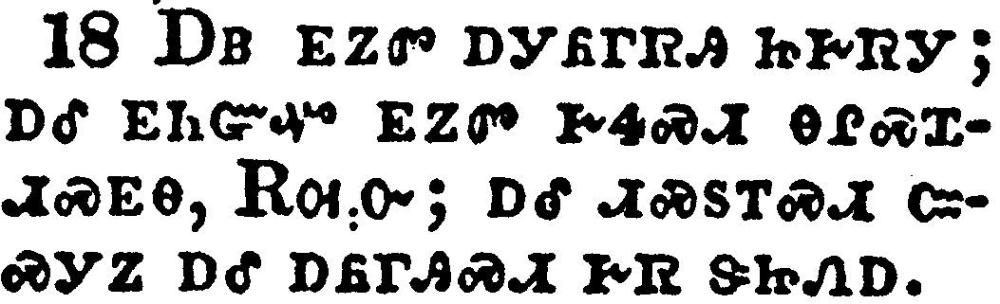</a></td>
</tr>
<tr class="even">
<td>I am he that liveth, and was dead; and, behold, I am alive for evermore, Amen; and have the keys of hell and of death.</td>
</tr>
<tr class="odd">
<td>ᎠᏴ ᎬᏃᏛ ᎠᎩᏲᎱᏒᎯ ᏥᎨᏒᎩ; ᎠᎴ ᎬᏂᏳᏉ ᎬᏃᏛ ᎨᏎᏍᏗ ᎾᎵᏍᏆᏗᏍᎬᎾ, ᎡᎺᏅ; ᎠᎴ ᏗᏍᏚᎢᏍᏗ ᏨᏍᎩᏃ ᎠᎴ ᎠᏲᎱᎯᏍᏗ ᎨᏒ ᏕᏥᏁᎠ.</td>
</tr>
<tr class="even">
<td>A-yv gv-no-dv a-gi-yo-hu-sv-hi tsi-ge-sv-gi; a-le gv-ni-yu-quo gv-no-dv ge-se-s-di na-li-s-qua-di-s-gv-na, E-me-nv; a-le di-s-du-i-s-di tsv-s-gi-no a-le a-yo-hu-hi-s-di ge-sv de-tsi-ne-a.</td>
</tr>
</tbody>
</table>

<table>
<tbody>
<tr class="odd">
<td><a href="270119.png">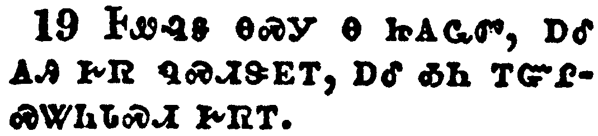</a></td>
</tr>
<tr class="even">
<td>Write the things which thou hast seen, and the things which are, and the things which shall be hereafter;</td>
</tr>
<tr class="odd">
<td>ᎰᏪᎸᎦ ᎾᏍᎩ Ꮎ ᏥᎪᏩᏛ, ᎠᎴ ᎪᎯ ᎨᏒ ᏄᏍᏗᏕᎬᎢ, ᎠᎴ ᎣᏂ ᎢᏳᎵᏍᏔᏂᏓᏍᏗ ᎨᏒᎢ.</td>
</tr>
<tr class="even">
<td>Ho-we-lv-ga na-s-gi na tsi-go-wa-dv, a-le go-hi ge-sv nu-s-di-de-gv-i, a-le o-ni i-yu-li-s-ta-ni-da-s-di ge-sv-i.</td>
</tr>
</tbody>
</table>

<table>
<tbody>
<tr class="odd">
<td><a href="270120.png">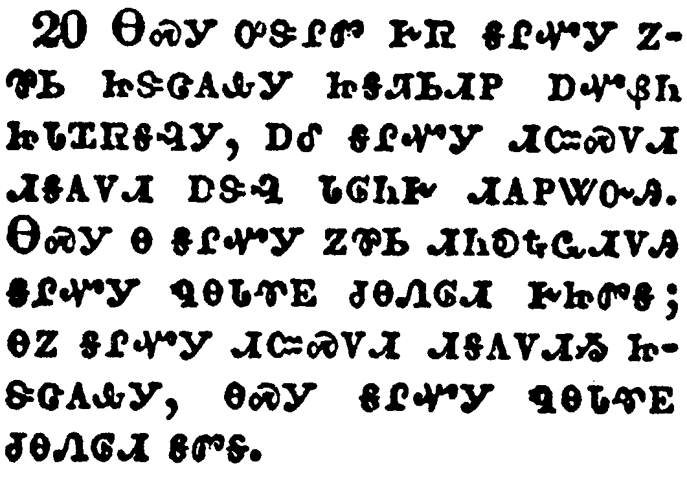</a></td>
</tr>
<tr class="even">
<td>The mystery of the seven stars which thou sawest in my right hand, and the seven golden candlesticks. The seven stars are the angels of the seven churches: and the seven candlesticks which thou sawest are the seven churches.</td>
</tr>
<tr class="odd">
<td>ᎾᏍᎩ ᎤᏕᎵᏛ ᎨᏒ ᎦᎵᏉᎩ ᏃᏈᏏ ᏥᏕᏣᎪᎲᎩ ᏥᎦᏘᏏᏗᏢ ᎠᏉᏰᏂ ᏥᏓᏆᏒᎦᎸᎩ, ᎠᎴ ᎦᎵᏉᎩ ᏗᏨᏍᏙᏗ ᏗᎦᎪᏙᏗ ᎠᏕᎸ ᏓᎶᏂᎨ ᏗᎪᏢᏔᏅᎯ. ᎾᏍᎩ Ꮎ ᎦᎵᏉᎩ ᏃᏈᏏ ᏗᏂᎧᎿᎭᏩᏗᏙᎯ ᎦᎵᏉᎩ ᏄᎾᏓᏡᎬ ᏧᎾᏁᎶᏗ ᎨᏥᏛᎦ; ᎾᏃ ᎦᎵᏉᎩ ᏗᏨᏍᏙᏗ ᏗᎦᎪᏙᏗᏱ ᏥᏕᏣᎪᎲᎩ, ᎾᏍᎩ ᎦᎵᏉᎩ ᏄᎾᏓᏡᎬ ᏧᎾᏁᎶᏗ ᎦᏛᎦ.</td>
</tr>
<tr class="even">
<td>Na-s-gi u-de-li-dv ge-sv ga-li-quo-gi no-qui-si tsi-de-tsa-go-hv-gi tsi-ga-ti-si-di-tlv a-quo-ye-ni tsi-da-qua-sv-ga-lv-gi, a-le ga-li-quo-gi di-tsv-s-do-di di-ga-go-do-di a-de-lv da-lo-ni-ge di-go-tlv-ta-nv-hi. Na-s-gi na ga-li-quo-gi no-qui-si di-ni-ka-hna-wa-di-do-hi ga-li-quo-gi nu-na-da-tlu-gv tsu-na-ne-lo-di ge-tsi-dv-ga; na-no ga-li-quo-gi di-tsv-s-do-di di-ga-go-do-di-yi tsi-de-tsa-go-hv-gi, na-s-gi ga-li-quo-gi nu-na-da-tlu-gv tsu-na-ne-lo-di ga-dv-ga.</td>
</tr>
</tbody>
</table>

