+++
draft=false
date = 2014-12-18T21:11:07Z
title = "Revelation - Chapter 4 - Cherokee New Testament"
weight = 1418955067

[taxonomies]

authors = ["Timothy Legg"]
categories = []
tags = []

[extra]
+++

<table>
<tbody>
<tr class="odd">
<td><a href="270401.png">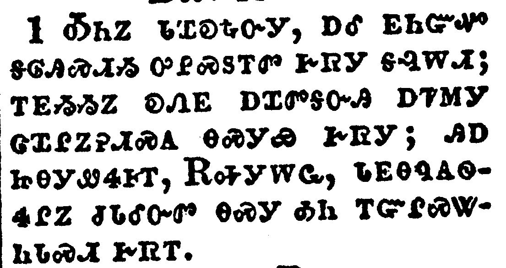</a></td>
</tr>
<tr class="even">
<td>After this I looked, and, behold, a door was opened in heaven: and the first voice which I heard was as it were of a trumpet talking with me; which said, Come up hither, and I will shew thee things which must be hereafter.</td>
</tr>
<tr class="odd">
<td>ᎣᏂᏃ ᏓᏆᎧᎿᎭᏅᎩ, ᎠᎴ ᎬᏂᏳᏉ ᎦᎶᎯᏍᏗᏱ ᎤᎵᏍᏚᎢᏛ ᎨᏒᎩ ᎦᎸᎳᏗ; ᎢᎬᏱᏱᏃ ᎧᏁᎬ ᎠᏆᏛᎦᏅᎯ ᎠᏤᎷᎩ ᏣᏆᎵᏃᎮᏗᏍᎪ ᎾᏍᎩᏯ ᎨᏒᎩ; ᎯᎠ ᏥᎾᎩᏪᏎᎰᎢ, ᎡᎭᎩᎳᏩ, ᏓᎬᎾᏄᎪᏫᏎᎵᏃ ᏧᏓᎴᏅᏛ ᎾᏍᎩ ᎣᏂ ᎢᏳᎵᏍᏔᏂᏓᏍᏗ ᎨᏒᎢ.</td>
</tr>
<tr class="even">
<td>O-ni-no da-qua-ka-hna-nv-gi, a-le gv-ni-yu-quo ga-lo-hi-s-di-yi u-li-s-du-i-dv ge-sv-gi ga-lv-la-di; i-gv-yi-yi-no ka-ne-gv a-qua-dv-ga-nv-hi a-tse-lu-gi tsa-qua-li-no-he-di-s-go na-s-gi-ya ge-sv-gi; hi-a tsi-na-gi-we-se-ho-i, E-ha-gi-la-wa, da-gv-na-nu-go-wi-se-li-no tsu-da-le-nv-dv na-s-gi o-ni i-yu-li-s-ta-ni-da-s-di ge-sv-i.</td>
</tr>
</tbody>
</table>

<table>
<tbody>
<tr class="odd">
<td><a href="270402.png">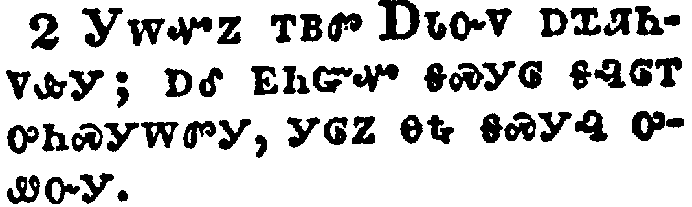</a></td>
</tr>
<tr class="even">
<td>And immediately I was in the spirit: and, behold, a throne was set in heaven, and one sat on the throne.</td>
</tr>
<tr class="odd">
<td>ᎩᎳᏉᏃ ᎢᏴᏛ ᎠᏓᏅᏙ ᎠᏆᏘᏂᏙᎲᎩ; ᎠᎴ ᎬᏂᏳᏉ ᎦᏍᎩᎶ ᎦᎸᎶᎢ ᎤᏂᏍᎩᎳᏛᎩ, ᎩᎶᏃ ᎾᎿᎭᎦᏍᎩᎸ ᎤᏪᏅᎩ.</td>
</tr>
<tr class="even">
<td>Gi-la-quo-no i-yv-dv A-da-nv-do a-qua-ti-ni-do-hv-gi; a-le gv-ni-yu-quo ga-s-gi-lo ga-lv-lo-i u-ni-s-gi-la-dv-gi, gi-lo-no na-hna ga-s-gi-lv u-we-nv-gi.</td>
</tr>
</tbody>
</table>

<table>
<tbody>
<tr class="odd">
<td><a href="270403.png">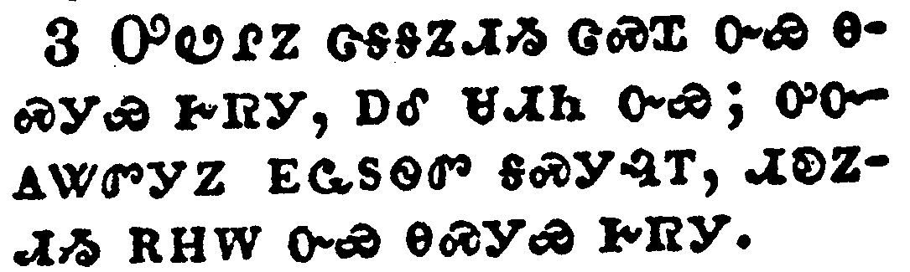</a></td>
</tr>
<tr class="even">
<td>And he that sat was to look upon like a jasper and a sardine stone: and there was a rainbow round about the throne, in sight like unto an emerald.</td>
</tr>
<tr class="odd">
<td>ᎤᏬᎵᏃ ᏣᎦᎦᏃᏗᏱ ᏣᏍᏆ ᏅᏯ ᎾᏍᎩᏯ ᎨᏒᎩ, ᎠᎴ ᏌᏗᏂ ᏅᏯ; ᎤᏅᎪᏔᏛᎩᏃ ᎬᏩᏚᏫᏛ ᎦᏍᎩᎸᎢ, ᏗᎧᏃᏗᏱ ᎡᎻᎳ ᏅᏯ ᎾᏍᎩᏯ ᎨᏒᎩ.</td>
</tr>
<tr class="even">
<td>U-wo-li-no tsa-ga-ga-no-di-yi tsa-s-qua nv-ya na-s-gi-ya ge-sv-gi, a-le sa-di-ni nv-ya; u-nv-go-ta-dv-gi-no gv-wa-du-wi-dv ga-s-gi-lv-i, di-ka-no-di-yi e-mi-la nv-ya na-s-gi-ya ge-sv-gi.</td>
</tr>
</tbody>
</table>

<table>
<tbody>
<tr class="odd">
<td><a href="270404.png">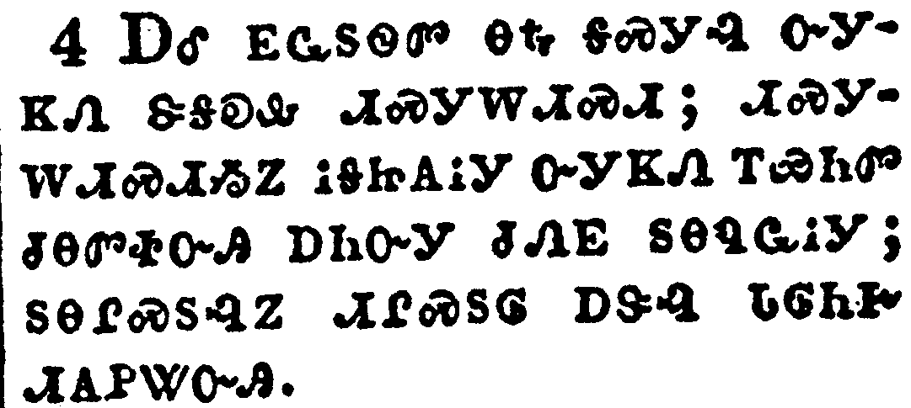</a></td>
</tr>
<tr class="even">
<td>And round about the throne were four and twenty seats: and upon the seats I saw four and twenty elders sitting, clothed in white raiment; and they had on their heads crowns of gold.</td>
</tr>
<tr class="odd">
<td>ᎠᎴ ᎬᏩᏚᏫᏛ ᎾᎿᎭᎦᏍᎩᎸ ᏅᎩᏦᏁ ᏕᎦᎧᎲ ᏗᏍᎩᎳᏗᏍᏗ; ᏗᏍᎩᎳᏗᏍᏗᏱᏃ ᎥᎦᏥᎪᎥᎩ ᏅᎩᏦᏁ ᎢᏯᏂᏛ ᏧᎾᏛᏐᏅᎯ ᎠᏂᏅᎩ ᏧᏁᎬ ᏚᎾᏄᏩᎥᎩ; ᏚᎾᎵᏍᏚᎸᏃ ᏗᎵᏍᏚᎶ ᎠᏕᎸ ᏓᎶᏂᎨ ᏗᎪᏢᏔᏅᎯ.</td>
</tr>
<tr class="even">
<td>A-le gv-wa-du-wi-dv na-hna ga-s-gi-lv nv-gi-tso-ne de-ga-ka-hv di-s-gi-la-di-s-di; di-s-gi-la-di-s-di-yi-no v-ga-tsi-go-v-gi nv-gi-tso-ne i-ya-ni-dv tsu-na-dv-so-nv-hi a-ni-nv-gi tsu-ne-gv du-na-nu-wa-v-gi; du-na-li-s-du-lv-no di-li-s-du-lo a-de-lv da-lo-ni-ge di-go-tlv-ta-nv-hi.</td>
</tr>
</tbody>
</table>

<table>
<tbody>
<tr class="odd">
<td><a href="270405.png">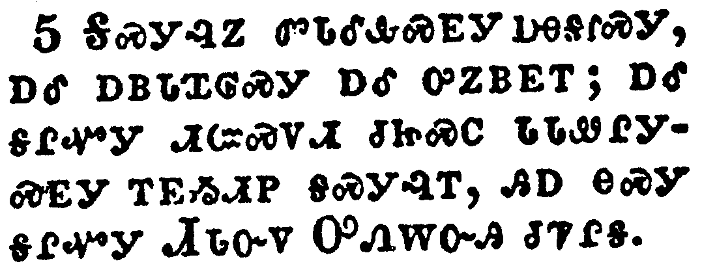</a></td>
</tr>
<tr class="even">
<td>And out of the throne proceeded lightnings and thunderings and voices: and there were seven lamps of fire burning before the throne, which are the seven Spirits of God.</td>
</tr>
<tr class="odd">
<td>ᎦᏍᎩᎸᏃ ᏓᏓᎴᎲᏍᎬᎩ ᎠᎾᎦᎵᏍᎩ, ᎠᎴ ᎠᏴᏓᏆᎶᏍᎩ ᎠᎴ ᎤᏃᏴᎬᎢ; ᎠᎴ ᎦᎵᏉᎩ ᏗᏨᏍᏙᏗ ᏧᏥᏍᏟ ᏓᏓᏪᎵᎩᏍᎬᎩ ᎢᎬᏱᏗᏢ ᎦᏍᎩᎸᎢ, ᎯᎠ ᎾᏍᎩ ᎦᎵᏉᎩ ᏗᏓᏅᏙ ᎤᏁᎳᏅᎯ ᏧᏤᎵᎦ.</td>
</tr>
<tr class="even">
<td>Ga-s-gi-lv-no da-da-le-hv-s-gv-gi a-na-ga-li-s-gi, a-le a-yv-da-qua-lo-s-gi a-le u-no-yv-gv-i; a-le ga-li-quo-gi di-tsv-s-do-di tsu-tsi-s-tli da-da-we-li-gi-s-gv-gi i-gv-yi-di-tlv ga-s-gi-lv-i, hi-a na-s-gi ga-li-quo-gi Di-da-nv-do U-ne-la-nv-hi tsu-tse-li-ga.</td>
</tr>
</tbody>
</table>

<table>
<tbody>
<tr class="odd">
<td><a href="270406.png">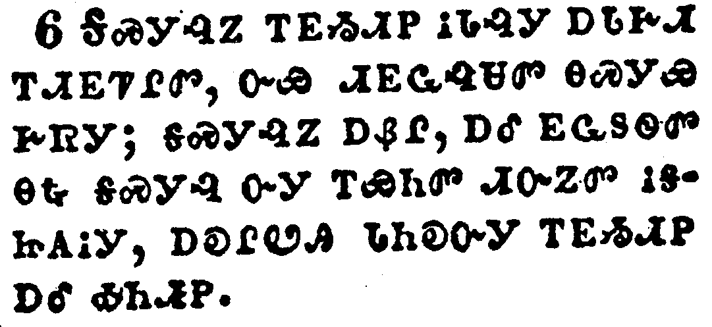</a></td>
</tr>
<tr class="even">
<td>And before the throne there was a sea of glass like unto crystal: and in the midst of the throne, and round about the throne, were four beasts full of eyes before and behind.</td>
</tr>
<tr class="odd">
<td>ᎦᏍᎩᎸᏃ ᎢᎬᏱᏗᏢ ᎥᏓᎸᎩ ᎠᏓᎰᏗ ᎢᏗᎬᏤᎵᏛ, ᏅᏯ ᏗᎬᏩᎸᏌᏛ ᎾᏍᎩᏯ ᎨᏒᎩ; ᎦᏍᎩᎸᏃ ᎠᏰᎵ, ᎠᎴ ᎬᏩᏚᏫᏛ ᎾᎿᎭᎦᏍᎩᎸ ᏅᎩ ᎢᏯᏂᏛ ᏗᏅᏃᏛ ᎥᎦᏥᎪᎥᎩ, ᎠᎧᎵᏬᎯ ᏓᏂᎧᏅᎩ ᎢᎬᏱᏗᏢ ᎠᎴ ᎣᏂᏗᏢ.</td>
</tr>
<tr class="even">
<td>Ga-s-gi-lv-no i-gv-yi-di-tlv v-da-lv-gi a-da-ho-di i-di-gv-tse-li-dv, nv-ya di-gv-wa-lv-sa-dv na-s-gi-ya ge-sv-gi; ga-s-gi-lv-no a-ye-li, a-le gv-wa-du-wi-dv na-hna ga-s-gi-lv nv-gi i-ya-ni-dv di-nv-no-dv v-ga-tsi-go-v-gi, a-ka-li-wo-hi da-ni-ka-nv-gi i-gv-yi-di-tlv a-le o-ni-di-tlv.</td>
</tr>
</tbody>
</table>

<table>
<tbody>
<tr class="odd">
<td><a href="270407.png">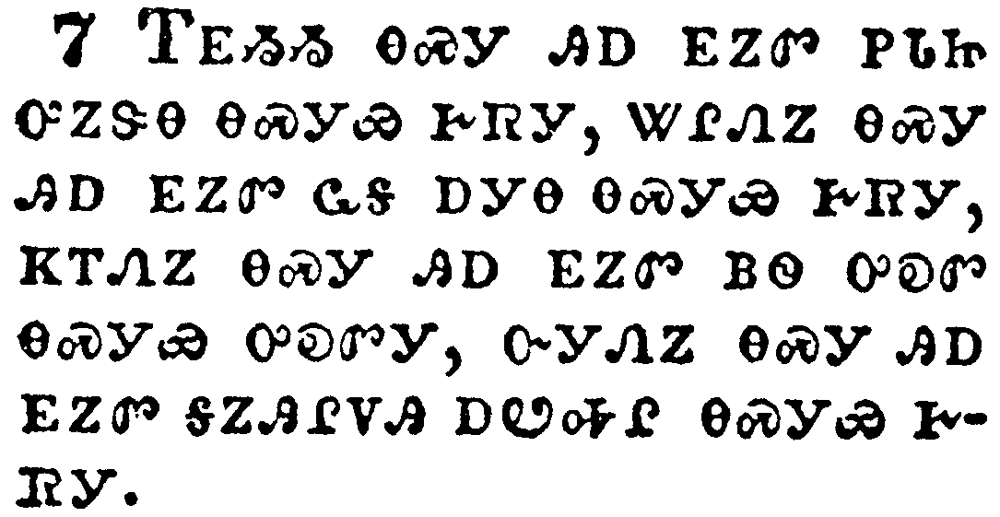</a></td>
</tr>
<tr class="even">
<td>And the first beast was like a lion, and the second beast like a calf, and the third beast had a face as a man, and the fourth beast was like a flying eagle.</td>
</tr>
<tr class="odd">
<td>ᎢᎬᏱᏱ ᎾᏍᎩ ᎯᎠ ᎬᏃᏛ ᏢᏓᏥ ᎤᏃᏕᎾ ᎾᏍᎩᏯ ᎨᏒᎩ, ᏔᎵᏁᏃ ᎾᏍᎩ ᎯᎠ ᎬᏃᏛ ᏩᎦ ᎠᎩᎾ ᎾᏍᎩᏯ ᎨᏒᎩ, ᏦᎢᏁᏃ ᎾᏍᎩ ᎯᎠ ᎬᏃᏛ ᏴᏫ ᎤᎧᏛ ᎾᏍᎩᏯ ᎤᎧᏛᎩ, ᎤᎩᏁᏃ ᎾᏍᎩ ᎯᎠ ᎬᏃᏛ ᎦᏃᎯᎵᏙᎯ ᎠᏬᎭᎵ ᎾᏍᎩᏯ ᎨᏒᎩ.</td>
</tr>
<tr class="even">
<td>I-gv-yi-yi na-s-gi hi-a gv-no-dv tlv-da-tsi u-no-de-na na-s-gi-ya ge-sv-gi, ta-li-ne-no na-s-gi hi-a gv-no-dv wa-ga a-gi-na na-s-gi-ya ge-sv-gi, tso-i-ne-no na-s-gi hi-a gv-no-dv yv-wi u-ka-dv na-s-gi-ya u-ka-dv-gi, u-gi-ne-no na-s-gi hi-a gv-no-dv ga-no-hi-li-do-hi a-wo-ha-li na-s-gi-ya ge-sv-gi.</td>
</tr>
</tbody>
</table>

<table>
<tbody>
<tr class="odd">
<td><a href="270408.png">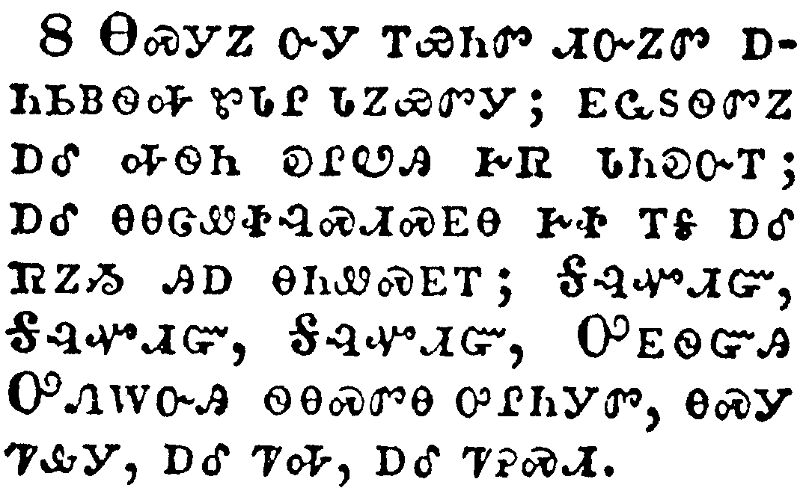</a></td>
</tr>
<tr class="even">
<td>And the four beasts had each of them six wings about him; and they were full of eyes within: and they rest not day and night, saying, Holy, holy, holy, Lord God Almighty, which was, and is, and is to come.</td>
</tr>
<tr class="odd">
<td>ᎾᏍᎩᏃ ᏅᎩ ᎢᏯᏂᏛ ᏗᏅᏃᏛ ᎠᏂᏏᏴᏫᎭ ᏑᏓᎵ ᏓᏃᏯᏛᎩ; ᎬᏩᏚᏫᏛᏃ ᎠᎴ ᎭᏫᏂ ᎧᎵᏬᎯ ᎨᏒ ᏗᏂᎧᏅᎢ; ᎠᎴ ᎾᎾᏣᏪᏐᎸᏍᏗᏍᎬᎾ ᎨᏐ ᎢᎦ ᎠᎴ ᏒᏃᏱ ᎯᎠ ᎾᏂᏪᏍᎬᎢ; ᎦᎸᏉᏗᏳ, ᎦᎸᏉᏗᏳ, ᎦᎸᏉᏗᏳ, ᎤᎬᏫᏳᎯ ᎤᏁᎳᏅᎯ ᏫᎾᏍᏛᎾ ᎤᎵᏂᎩᏛ, ᎾᏍᎩ ᏤᎲᎩ, ᎠᎴ ᏤᎭ, ᎠᎴ ᏤᎮᏍᏗ.</td>
</tr>
<tr class="even">
<td>Na-s-gi-no nv-gi i-ya-ni-dv di-nv-no-dv a-ni-si-yv-wi-ha su-da-li da-no-ya-dv-gi; gv-wa-du-wi-dv-no a-le ha-wi-ni ka-li-wo-hi ge-sv di-ni-ka-nv-i; a-le na-na-tsa-we-so-lv-s-di-s-gv-na ge-so i-ga a-le sv-no-yi hi-a na-ni-we-s-gv-i; Ga-lv-quo-di-yu, Ga-lv-quo-di-yu, Ga-lv-quo-di-yu, U-gv-wi-yu-hi U-ne-la-nv-hi wi-na-s-dv-na u-li-ni-gi-dv, na-s-gi tse-hv-gi, a-le tse-ha, a-le tse-he-s-di.</td>
</tr>
</tbody>
</table>

<table>
<tbody>
<tr class="odd">
<td><a href="270409.png">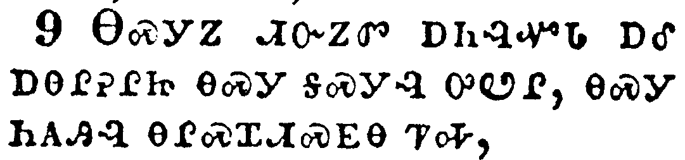</a></td>
</tr>
<tr class="even">
<td>And when those beasts give glory and honour and thanks to him that sat on the throne, who liveth for ever and ever,</td>
</tr>
<tr class="odd">
<td>ᎾᏍᎩᏃ ᏗᏅᏃᏛ ᎠᏂᎸᏉᏓ ᎠᎴ ᎠᎾᎵᎮᎵᏥ ᎾᏍᎩ ᎦᏍᎩᎸ ᎤᏬᎵ, ᎾᏍᎩ ᏂᎪᎯᎸ ᎾᎵᏍᏆᏗᏍᎬᎾ ᏤᎭ,</td>
</tr>
<tr class="even">
<td>Na-s-gi-no di-nv-no-dv a-ni-lv-quo-da a-le a-na-li-he-li-tsi na-s-gi ga-s-gi-lv u-wo-li, na-s-gi ni-go-hi-lv na-li-s-qua-di-s-gv-na tse-ha,</td>
</tr>
</tbody>
</table>

<table>
<tbody>
<tr class="odd">
<td><a href="270410.png">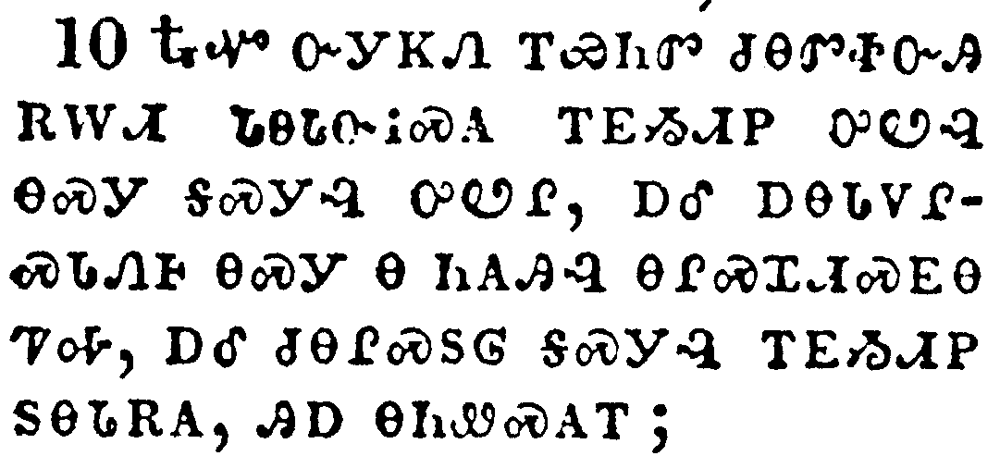</a></td>
</tr>
<tr class="even">
<td>The four and twenty elders fall down before him that sat on the throne, and worship him that liveth for ever and ever, and cast their crowns before the throne, saying,</td>
</tr>
<tr class="odd">
<td>ᎿᎭᏉ ᏅᎩᏦᏁ ᎢᏯᏂᏛ ᏧᎾᏛᏐᏅᎯ ᎡᎳᏗ ᏓᎾᏓᏅᎥᏍᎪ ᎢᎬᏱᏗᏢ ᎤᏬᎸ ᎾᏍᎩ ᎦᏍᎩᎸ ᎤᏬᎵ, ᎠᎴ ᎠᎾᏓᏙᎵᏍᏓᏁᎰ ᎾᏍᎩ Ꮎ ᏂᎪᎯᎸ ᎾᎵᏍᏆᏗᏍᎬᎾ ᏤᎭ, ᎠᎴ ᏧᎾᎵᏍᏚᎶ ᎦᏍᎩᎸ ᎢᎬᏱᏗᏢ ᏚᎾᏓᎡᎯ, ᎯᎠ ᎾᏂᏪᏍᎪᎢ;</td>
</tr>
<tr class="even">
<td>Hna-quo nv-gi-tso-ne i-ya-ni-dv tsu-na-dv-so-nv-hi e-la-di da-na-da-nv-v-s-go i-gv-yi-di-tlv u-wo-lv na-s-gi ga-s-gi-lv u-wo-li, a-le a-na-da-do-li-s-da-ne-ho na-s-gi na ni-go-hi-lv na-li-s-qua-di-s-gv-na tse-ha, a-le tsu-na-li-s-du-lo ga-s-gi-lv i-gv-yi-di-tlv du-na-da-e-hi, hi-a na-ni-we-s-go-i;</td>
</tr>
</tbody>
</table>

<table>
<tbody>
<tr class="odd">
<td><a href="270411.png">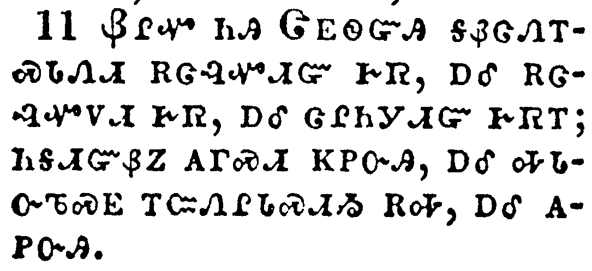</a></td>
</tr>
<tr class="even">
<td>Thou art worthy, O Lord, to receive glory and honour and power: for thou hast created all things, and for thy pleasure they are and were created.</td>
</tr>
<tr class="odd">
<td>ᏰᎵᏉ ᏂᎯ ᏣᎬᏫᏳᎯ ᎦᏰᏣᏁᎢᏍᏓᏁᏗ ᎡᏣᎸᏉᏗᏳ ᎨᏒ, ᎠᎴ ᎡᏣᎸᏉᏙᏗ ᎨᏒ, ᎠᎴ ᏣᎵᏂᎩᏗᏳ ᎨᏒᎢ; ᏂᎦᏗᏳᏰᏃ ᎪᎱᏍᏗ ᏦᏢᏅᎯ, ᎠᎴ ᎭᏓᏅᏖᏍᎬ ᎢᏨᏁᎵᏓᏍᏗᏱ ᎡᎭ, ᎠᎴ ᎪᏢᏅᎯ.</td>
</tr>
<tr class="even">
<td>Ye-li-quo ni-hi Tsa-gv-wi-yu-hi ga-ye-tsa-ne-i-s-da-ne-di e-tsa-lv-quo-di-yu ge-sv, a-le e-tsa-lv-quo-do-di ge-sv, a-le tsa-li-ni-gi-di-yu ge-sv-i; ni-ga-di-yu-ye-no go-hu-s-di tso-tlv-nv-hi, a-le ha-da-nv-te-s-gv i-tsv-ne-li-da-s-di-yi e-ha, a-le go-tlv-nv-hi.</td>
</tr>
</tbody>
</table>

