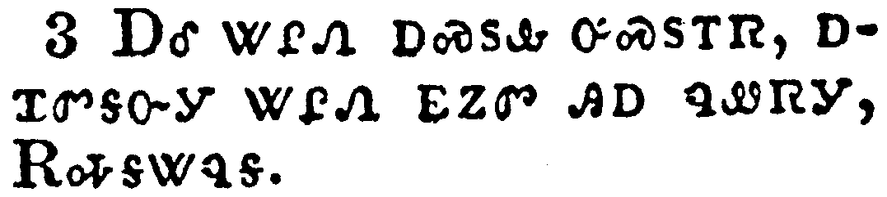

+++
draft=false
date = 2014-12-18T21:11:07Z
title = "Revelation - Chapter 6 - Cherokee New Testament"
weight = 1418955067

[taxonomies]

authors = ["Timothy Legg"]
categories = []
tags = []

[extra]
+++

<table>
<tbody>
<tr class="odd">
<td></td>
</tr>
<tr class="even">
<td>And I saw when the Lamb opened one of the seals, and I heard, as it were the noise of thunder, one of the four beasts saying, Come and see.</td>
</tr>
<tr class="odd">
<td>ᎠᎴ ᏕᏥᎦᏅᎩ ᎤᏃᏕᎾ ᎠᎩᎾ ᎤᏲᏍᏔᏅ ᏌᏉ ᎠᏍᏚᏛ ᎪᏪᎵ; ᎠᎴ ᎠᏆᏛᎦᏅᎩ ᎠᏴᏓᏆᎶᏍᎩ ᏧᏃᏴᎪ ᎾᏍᎩᏯᎢ, ᎾᏍᎩ Ꮎ ᎠᏏᏴᏫ ᏅᎩ ᎢᏯᏂᏛ ᎨᏒ ᏗᏅᏃᏛ, ᎯᎠ ᏂᎦᏪᏍᎬᎩ, ᎡᎭᎦᏔᏄᎦ.</td>
</tr>
<tr class="even">
<td>A-le de-tsi-ga-nv-gi U-no-de-na a-gi-na u-yo-s-ta-nv sa-quo a-s-du-dv go-we-li; a-le a-qua-dv-ga-nv-gi a-yv-da-qua-lo-s-gi tsu-no-yv-go na-s-gi-ya-i, na-s-gi na a-si-yv-wi nv-gi i-ya-ni-dv ge-sv di-nv-no-dv, hi-a ni-ga-we-s-gv-gi, E-ha-ga-ta-nu-ga.</td>
</tr>
</tbody>
</table>

<table>
<tbody>
<tr class="odd">
<td></td>
</tr>
<tr class="even">
<td>And I saw, and behold a white horse: and he that sat on him had a bow; and a crown was given unto him: and he went forth conquering, and to conquer.</td>
</tr>
<tr class="odd">
<td>ᎠᎴ ᏫᏓᏆᎧᎾᏅᎩ, ᎠᎴ ᎬᏂᏳᏉ ᎤᏁᎬ ᏐᏈᎵ [ᏫᏥᎪᎥᎩ] ᎠᎴ ᎾᎿᎭᎤᎩᎵ ᎦᎶᏣᏗ ᎦᏁᎲᎩ; ᎠᎴ ᎠᎵᏍᏚᎶ ᎠᏥᏅᏁᎸᎩ; ᎠᎴ ᎤᏪᏅᏒᎩ ᏫᏓᏎᎪᎩᏍᎬᎩ, ᎠᎴ ᏫᎬᏓᏎᎪᎩᏏᏒᎩ.</td>
</tr>
<tr class="even">
<td>A-le wi-da-qua-ka-na-nv-gi, a-le gv-ni-yu-quo u-ne-gv so-qui-li [wi-tsi-go-v-gi] a-le na-hna u-gi-li ga-lo-tsa-di ga-ne-hv-gi; a-le a-li-s-du-lo a-tsi-nv-ne-lv-gi; a-le u-we-nv-sv-gi wi-da-se-go-gi-s-gv-gi, a-le wi-gv-da-se-go-gi-si-sv-gi.</td>
</tr>
</tbody>
</table>

<table>
<tbody>
<tr class="odd">
<td></td>
</tr>
<tr class="even">
<td>And when he had opened the second seal, I heard the second beast say, Come and see.</td>
</tr>
<tr class="odd">
<td>ᎠᎴ ᏔᎵᏁ ᎠᏍᏚᎲ ᎤᏍᏚᎢᏒ, ᎠᏆᏛᎦᏅᎩ ᏔᎵᏁ ᎬᏃᏛ ᎯᎠ ᏄᏪᏒᎩ, ᎡᎭᎦᏔᏄᎦ.</td>
</tr>
<tr class="even">
<td>A-le ta-li-ne a-s-du-hv u-s-du-i-sv, a-qua-dv-ga-nv-gi ta-li-ne gv-no-dv hi-a nu-we-sv-gi, E-ha-ga-ta-nu-ga.</td>
</tr>
</tbody>
</table>

<table>
<tbody>
<tr class="odd">
<td></td>
</tr>
<tr class="even">
<td>And there went out another horse that was red: and power was given to him that sat thereon to take peace from the earth, and that they should kill one another: and there was given unto him a great sword.</td>
</tr>
<tr class="odd">
<td>ᎠᎴ ᏅᏩᏓᎴ ᏐᏈᎵ ᎤᏄᎪᏨᎩ, ᎠᎩᎦᎨᎢ; ᎠᎴ ᎠᎦᎵᏍᎪᎸᏓᏁᎸᎩ ᎾᎿᎭᎤᎩᎵ ᏅᏩᏙᎯᏯᏛ ᎨᏒ ᎤᏄᎪᏫᏍᏗᏱ ᎡᎶᎯ, ᎠᎴ ᎾᏍᎩ ᎢᏳᏩᏂᏐᏗᏱ ᎤᏅᏒᏉ ᏧᎾᏓᎯᏍᏗᏱ; ᎠᎴ ᎡᏆ ᎠᏰᎳᏍᏗᎦᏅᎯᏛ ᎠᏥᏕᎸᎩ.</td>
</tr>
<tr class="even">
<td>A-le nv-wa-da-le so-qui-li u-nu-go-tsv-gi, a-gi-ga-ge-i; a-le a-ga-li-s-go-lv-da-ne-lv-gi na-hna u-gi-li nv-wa-do-hi-ya-dv ge-sv u-nu-go-wi-s-di-yi e-lo-hi, a-le na-s-gi i-yu-wa-ni-so-di-yi u-nv-sv-quo tsu-na-da-hi-s-di-yi; a-le e-qua a-ye-la-s-di-ga-nv-hi-dv a-tsi-de-lv-gi.</td>
</tr>
</tbody>
</table>

<table>
<tbody>
<tr class="odd">
<td></td>
</tr>
<tr class="even">
<td>And when he had opened the third seal, I heard the third beast say, Come and see. And I beheld, and lo a black horse; and he that sat on him had a pair of balances in his hand.</td>
</tr>
<tr class="odd">
<td>ᎠᎴ ᏦᎢᏁ ᎠᏍᏚᎲ ᎤᏍᏚᎢᏒ, ᎠᏆᏛᎦᏅᎩ ᏦᎢᏁ ᎾᏍᎩ Ꮎ ᎬᏃᏛ ᎯᎠ ᏄᏪᏒᎩ, ᎡᎭᎦᏔᏄᎦ. ᎠᎴ ᏓᏆᎧᎾᏅᎩ, ᎠᎴ ᎬᏂᏳᏉ ᎬᎿᎭᎨ ᏐᏈᎵ; ᎠᎴ ᎾᎿᎭᎤᎩᎵ ᏗᎦᏛᏗ ᏕᎦᏁᎲᎩ.</td>
</tr>
<tr class="even">
<td>A-le tso-i-ne a-s-du-hv u-s-du-i-sv, a-qua-dv-ga-nv-gi tso-i-ne na-s-gi na gv-no-dv hi-a nu-we-sv-gi, E-ha-ga-ta-nu-ga. A-le da-qua-ka-na-nv-gi, a-le gv-ni-yu-quo gv-hna-ge so-qui-li; a-le na-hna u-gi-li di-ga-dv-di de-ga-ne-hv-gi.</td>
</tr>
</tbody>
</table>

<table>
<tbody>
<tr class="odd">
<td></td>
</tr>
<tr class="even">
<td>And I heard a voice in the midst of the four beasts say, A measure of wheat for a penny, and three measures of barley for a penny; and see thou hurt not the oil and the wine.</td>
</tr>
<tr class="odd">
<td>ᎠᎴ ᎧᏁᎬ ᎠᏆᏛᎦᏅᎩ [ᏛᏓᎴᎲᏍᎬᎩ] ᎠᏰᎵ ᏅᎩ ᎢᏯᏂᏛ ᏗᏅᏃᏛ ᏄᎾᏛᏅᎢ, ᎯᎠ ᏅᏓᎦᏪᏍᎬᎩ, ᏥᏂᎩ ᎠᏟᎶᏍᏗ ᎠᎧᎵᎢ ᎤᏣᎴᏍᏗ ᎠᎩᏏᏧᎬᏩᎶᏗ ᎠᎫᏴᏗ, ᎠᎴ ᏥᏂᎩ ᎠᏟᎶᏍᏗ ᏦᎢ ᎢᏯᎧᎵᎢ ᎤᏣᎴᏍᏗ ᎢᏳᏍᏗ ᎠᎩᏏ-ᏧᎬᏩᎶᏗ ᎠᎫᏴᏗ; ᎠᎴ ᏞᏍᏗ ᎪᎱᏍᏗ ᏗᏨᏁᎸᎩ ᎪᎢ ᎠᎴ ᎩᎦᎨ-ᎠᏗᏔᏍᏗ.</td>
</tr>
<tr class="even">
<td>A-le ka-ne-gv a-qua-dv-ga-nv-gi [dv-da-le-hv-s-gv-gi] a-ye-li nv-gi i-ya-ni-dv di-nv-no-dv nu-na-dv-nv-i, hi-a nv-da-ga-we-s-gv-gi, Tsi-ni-gi a-tli-lo-s-di a-ka-li-i u-tsa-le-s-di a-gi-si-tsu-gv-wa-lo-di a-gu-yv-di, a-le tsi-ni-gi a-tli-lo-s-di tso-i i-ya-ka-li-i u-tsa-le-s-di i-yu-s-di a-gi-si--tsu-gv-wa-lo-di a-gu-yv-di; a-le tle-s-di go-hu-s-di di-tsv-ne-lv-gi go-i a-le gi-ga-ge--a-di-ta-s-di.</td>
</tr>
</tbody>
</table>

<table>
<tbody>
<tr class="odd">
<td></td>
</tr>
<tr class="even">
<td>And when he had opened the fourth seal, I heard the voice of the fourth beast say, Come and see.</td>
</tr>
<tr class="odd">
<td>ᎠᎴ ᏅᎩᏁ ᎠᏍᏚᎲ ᎤᏍᏚᎢᏒ, ᎠᏆᏛᎦᏅᎩ ᎧᏁᎬ ᏅᎩᏁ ᎾᏍᎩ Ꮎ ᎬᏃᏛ ᎯᎠ ᏂᎦᏪᏍᎬᎢ, ᎡᎭᎦᏔᏄᎦ.</td>
</tr>
<tr class="even">
<td>A-le nv-gi-ne a-s-du-hv u-s-du-i-sv, a-qua-dv-ga-nv-gi ka-ne-gv nv-gi-ne na-s-gi na gv-no-dv hi-a ni-ga-we-s-gv-i, E-ha-ga-ta-nu-ga.</td>
</tr>
</tbody>
</table>

<table>
<tbody>
<tr class="odd">
<td></td>
</tr>
<tr class="even">
<td>And I looked, and behold a pale horse: and his name that sat on him was Death, and Hell followed with him. And power was given unto them over the fourth part of the earth, to kill with sword, and with hunger, and with death, and with the beasts of the earth.</td>
</tr>
<tr class="odd">
<td>ᎠᎴ ᏫᏓᏆᎧᎾᏅᎩ, ᎠᎴ ᎬᏂᏳᏉ ᎤᏬᏓᎸ [ᏗᎧᏃᏗᏱ] ᏐᏈᎵ [ᏫᏥᎪᎥᎩ]; ᎠᎴ ᎾᎿᎭᎤᎩᎵ ᎠᏲᎱᎯᏍᏗ ᏚᏙᎥᎩ, ᎠᎴ ᏨᏍᎩᏃ ᎤᏍᏓᏩᏗᏒᎩ; ᎠᎴ ᎨᎦᎵᏍᎪᎸᏓᏁᎸᎩ ᎾᏍᎩ ᏅᎩ ᎢᎦᏛᎯ ᎨᏒ ᎡᎶᎯ ᎾᏍᎩ ᏌᏉ ᏄᏓᎥ ᎾᎿᎭᏧᏂᎯᏍᏗᏱ ᎠᏰᎳᏍᏗᎦᏅᎯᏛ ᎬᏗ, ᎠᎴ ᎠᎪᏄ ᎬᏗ, ᎠᎴ ᎥᏳᎩ ᎬᏗ, ᎠᎴ ᎢᎾᎨ ᎠᏁᎯ ᎤᏂᏍᎦᏎᏗ ᏗᎬᏗ.</td>
</tr>
<tr class="even">
<td>A-le wi-da-qua-ka-na-nv-gi, a-le gv-ni-yu-quo u-wo-da-lv [di-ka-no-di-yi] so-qui-li [wi-tsi-go-v-gi]; a-le na-hna u-gi-li A-yo-hu-hi-s-di du-do-v-gi, a-le tsv-s-gi-no u-s-da-wa-di-sv-gi; a-le ge-ga-li-s-go-lv-da-ne-lv-gi na-s-gi nv-gi i-ga-dv-hi ge-sv e-lo-hi na-s-gi sa-quo nu-da-v na-hna tsu-ni-hi-s-di-yi a-ye-la-s-di-ga-nv-hi-dv gv-di, a-le a-go-nu gv-di, a-le v-yu-gi gv-di, a-le i-na-ge a-ne-hi u-ni-s-ga-se-di di-gv-di.</td>
</tr>
</tbody>
</table>

<table>
<tbody>
<tr class="odd">
<td></td>
</tr>
<tr class="even">
<td>And when he had opened the fifth seal, I saw under the altar the souls of them that were slain for the word of God, and for the testimony which they held:</td>
</tr>
<tr class="odd">
<td>ᎠᎴ ᎯᏍᎩᏁ ᎠᏍᏚᎲ ᎤᏍᏚᎢᏒ, ᎠᏥᎸᎨᎳᏍᏗᏱ ᎭᏫᏂᏢ ᏓᎩᎪᎲᎩ ᏧᎾᏓᏅᏙ ᎾᏍᎩ Ꮎ ᏗᎨᏥᎸᎯ ᎤᏁᎳᏅᎯ ᎤᏤᎵ ᎧᏃᎮᏛ ᎤᏂᏍᏛᏛᎯ, ᎠᎴ ᏄᏍᏛ ᎤᏃᎯᏳᏔᏅ ᎤᏂᏍᏛᏛᎯ;</td>
</tr>
<tr class="even">
<td>A-le hi-s-gi-ne a-s-du-hv u-s-du-i-sv, a-tsi-lv-ge-la-s-di-yi ha-wi-ni-tlv da-gi-go-hv-gi tsu-na-da-nv-do na-s-gi na di-ge-tsi-lv-hi U-ne-la-nv-hi u-tse-li ka-no-he-dv u-ni-s-dv-dv-hi, a-le nu-s-dv u-no-hi-yu-ta-nv u-ni-s-dv-dv-hi;</td>
</tr>
</tbody>
</table>

<table>
<tbody>
<tr class="odd">
<td></td>
</tr>
<tr class="even">
<td>And they cried with a loud voice, saying, How long, O Lord, holy and true, dost thou not judge and avenge our blood on them that dwell on the earth?</td>
</tr>
<tr class="odd">
<td>ᎠᎴ ᎠᏍᏓᏯ ᎤᏁᎷᏅᎩ ᎯᎠ ᏄᏂᏪᏒᎩ, ᎢᎳᎪ ᏅᏓᎪᎯᏥ ᏣᎬᏫᏳᎯ, ᏂᎯ ᏂᏍᎦᏅᎾ ᎠᎴ ᏚᏳᎪᏛ ᎢᎭᏛᏁᎯ, ᎩᎳ ᏙᏓᎩᏳᎪᏓᏁᎸ ᏓᎩᏍᏛᏗᏍᏔᏂ ᎠᎴ ᏓᎩᏯᏞᏤᎢ ᎣᎩᎩᎬ [ᎤᏂᏨᏅ] ᎾᏍᎩ Ꮎ ᎡᎶᎯ ᏣᏁᎭ.</td>
</tr>
<tr class="even">
<td>A-le a-s-da-ya u-ne-lu-nv-gi hi-a nu-ni-we-sv-gi, I-la-go nv-da-go-hi-tsi Tsa-gv-wi-yu-hi, ni-hi ni-s-ga-nv-na a-le du-yu-go-dv i-ha-dv-ne-hi, gi-la do-da-gi-yu-go-da-ne-lv da-gi-s-dv-di-s-ta-ni a-le da-gi-ya-tle-tse-i o-gi-gi-gv [u-ni-tsv-nv] na-s-gi na e-lo-hi tsa-ne-ha.</td>
</tr>
</tbody>
</table>

<table>
<tbody>
<tr class="odd">
<td></td>
</tr>
<tr class="even">
<td>And white robes were given unto every one of them; and it was said unto them, that they should rest yet for a little season, until their fellowservants also and their brethren, that should be killed as they were, should be fulfilled.</td>
</tr>
<tr class="odd">
<td>ᎠᎴ ᎠᏂᏏᏴᏫᎭ ᎨᏒ ᏧᏁᎬ ᏕᎨᏥᏅᏁᎸᎩ ᏗᏄᏬ; ᎠᎴ ᎨᏥᏃᏁᎸᎩ ᎠᏏ ᏞᎦ ᎤᎾᏣᏪᏐᎸᏍᏙᏗᏱ ᎨᏒ ᎬᏂ ᎢᏧᎳᎭ ᎨᏥᏅᏏᏙᎸᎯ ᎠᎴ ᎾᏍᏉ ᎠᎾᎵᏅᏟ ᏄᏂᎪᎸᎾ ᏂᎨᎬᏁᎸ, ᎾᏍᎩ ᏕᎨᏥᎸ ᎾᏍᎩᏯ ᎤᏅᏒ ᏂᎨᎬᏁᎸᎢ.</td>
</tr>
<tr class="even">
<td>A-le a-ni-si-yv-wi-ha ge-sv tsu-ne-gv de-ge-tsi-nv-ne-lv-gi di-nu-wo; a-le ge-tsi-no-ne-lv-gi a-si tle-ga u-na-tsa-we-so-lv-s-do-di-yi ge-sv gv-ni i-tsu-la-ha ge-tsi-nv-si-do-lv-hi a-le na-s-quo a-na-li-nv-tli nu-ni-go-lv-na ni-ge-gv-ne-lv, na-s-gi de-ge-tsi-lv na-s-gi-ya u-nv-sv ni-ge-gv-ne-lv-i.</td>
</tr>
</tbody>
</table>

<table>
<tbody>
<tr class="odd">
<td></td>
</tr>
<tr class="even">
<td>And I beheld when he had opened the sixth seal, and, lo, there was a great earthquake; and the sun became black as sackcloth of hair, and the moon became as blood;</td>
</tr>
<tr class="odd">
<td>ᎠᎴ ᏑᏓᎵᏁ ᎠᏍᏚᎲ ᎤᏍᏚᎢᏒ ᏕᏥᎦᏅᎩ, ᎠᎴ ᎬᏂᏳᏉ ᎦᏙᎯ ᎤᏣᏘ ᎤᎵᏖᎸᏅᎩ; ᎠᎴ ᏅᏙ ᎢᎦ-ᎡᎯ ᎬᎿᎭᎨ ᏄᎵᏍᏔᏅᎩ ᎾᏍᎩᏯ ᎤᏏᏕᏅ ᎠᏄᏬ ᎪᏢᏔᏅᎯ, ᏅᏙᏃ ᏒᏃᏱ ᎡᎯ ᎩᎬ ᎾᏍᎩᏯ ᏄᎵᏍᏔᏅᎩ.</td>
</tr>
<tr class="even">
<td>A-le su-da-li-ne a-s-du-hv u-s-du-i-sv de-tsi-ga-nv-gi, a-le gv-ni-yu-quo ga-do-hi u-tsa-ti u-li-te-lv-nv-gi; a-le nv-do i-ga--e-hi gv-hna-ge nu-li-s-ta-nv-gi na-s-gi-ya u-si-de-nv a-nu-wo go-tlv-ta-nv-hi, nv-do-no sv-no-yi e-hi gi-gv na-s-gi-ya nu-li-s-ta-nv-gi.</td>
</tr>
</tbody>
</table>

<table>
<tbody>
<tr class="odd">
<td></td>
</tr>
<tr class="even">
<td>And the stars of heaven fell unto the earth, even as a fig tree casteth her untimely figs, when she is shaken of a mighty wind.</td>
</tr>
<tr class="odd">
<td>ᏃᏈᏏᏃ ᎦᎸᎶᎢ ᎠᏂᎧᎸ ᎤᏂᏅᎪᎣᏒᎩ ᎠᎴ ᎡᎶᎯ ᎤᏂᎳᎨᏯᏛᏨᎩ, ᎾᏍᎩᏯ ᏒᎦᏔ-ᎢᏳᏍᏗ ᏡᎬ ᏣᏂᏅᎪᎠᏍᎪ ᎤᎾᏓᏙᏗᏱ ᏂᎨᏒᎾ ᎨᏒ ᎤᎾᏓᏔᏅᎯ, ᎾᎯᏳ ᎤᏣᏘ ᎦᏃᎸᎥᏍᎬ ᏧᏖᎸᎲᏍᎪᎢ;</td>
</tr>
<tr class="even">
<td>No-qui-si-no ga-lv-lo-i a-ni-ka-lv u-ni-nv-go-o-sv-gi a-le e-lo-hi u-ni-la-ge-ya-dv-tsv-gi, na-s-gi-ya sv-ga-ta--i-yu-s-di tlu-gv tsa-ni-nv-go-a-s-go u-na-da-do-di-yi ni-ge-sv-na ge-sv u-na-da-ta-nv-hi, na-hi-yu u-tsa-ti ga-no-lv-v-s-gv tsu-te-lv-hv-s-go-i;</td>
</tr>
</tbody>
</table>

<table>
<tbody>
<tr class="odd">
<td></td>
</tr>
<tr class="even">
<td>And the heaven departed as a scroll when it is rolled together; and every mountain and island were moved out of their places.</td>
</tr>
<tr class="odd">
<td>ᎠᎴ ᎦᎸᎶᎢ ᎤᏓᏅᏒᎩ ᎾᏍᎩᏯ ᎪᏪᎵ ᏣᎦᏇᏅᏍᎪᎢ; ᎠᎴ ᏂᎦᏛ ᏕᎣᏓᎸ ᎠᎴ ᎠᎹᏰᎵ ᏚᏪᎧᎲᎢ ᏚᏓᏅᏒᎩ ᎾᎿᎭᏄᎾᏛᏅᎢ.</td>
</tr>
<tr class="even">
<td>A-le ga-lv-lo-i u-da-nv-sv-gi na-s-gi-ya go-we-li tsa-ga-que-nv-s-go-i; a-le ni-ga-dv de-o-da-lv a-le a-ma-ye-li du-we-ka-hv-i du-da-nv-sv-gi na-hna nu-na-dv-nv-i.</td>
</tr>
</tbody>
</table>

<table>
<tbody>
<tr class="odd">
<td></td>
</tr>
<tr class="even">
<td>And the kings of the earth, and the great men, and the rich men, and the chief captains, and the mighty men, and every bondman, and every free man, hid themselves in the dens and in the rocks of the mountains;</td>
</tr>
<tr class="odd">
<td>ᎠᎴ ᎤᏂᎬᏫᏳᎯ ᎡᎶᎯ ᎠᏁᎯ, ᎠᎴ ᎨᏥᎸᏉᏗ ᎠᏂᏍᎦᏯ, ᎠᎴ ᏧᏁᎿᎭᎢ ᎠᏂᏍᎦᏯ, ᎠᎴ ᏄᏂᎬᏫᏳᏒ ᏗᎾᏓᏘᏂᏙᎯ, ᎠᎴ ᏧᎾᎵᏂᎩᏛ ᎠᏂᏍᎦᏯ, ᎠᎴ ᎾᏂᎥ ᏗᎨᏥᎾᏝᎢ, ᎠᎴ ᎾᏂᎥ ᏂᏗᎨᏥᎾᏝᎥᎾ, ᎤᎾᏗᏍᎦᎳᏅᎩ ᏚᏍᏓᎦᎸᎢ, ᎠᎴ ᏅᏲᎯ ᏕᎨᏒ ᏙᏓᎸᎢ;</td>
</tr>
<tr class="even">
<td>A-le u-ni-gv-wi-yu-hi e-lo-hi a-ne-hi, a-le ge-tsi-lv-quo-di a-ni-s-ga-ya, a-le tsu-ne-hna-i a-ni-s-ga-ya, a-le nu-ni-gv-wi-yu-sv di-na-da-ti-ni-do-hi, a-le tsu-na-li-ni-gi-dv a-ni-s-ga-ya, a-le na-ni-v di-ge-tsi-na-tla-i, a-le na-ni-v ni-di-ge-tsi-na-tla-v-na, u-na-di-s-ga-la-nv-gi du-s-da-ga-lv-i, a-le nv-yo-hi de-ge-sv do-da-lv-i;</td>
</tr>
</tbody>
</table>

<table>
<tbody>
<tr class="odd">
<td></td>
</tr>
<tr class="even">
<td>And said to the mountains and rocks, Fall on us, and hide us from the face of him that sitteth on the throne, and from the wrath of the Lamb:</td>
</tr>
<tr class="odd">
<td>ᎠᎴ ᏙᏓᎸ ᎠᎴ ᏅᏯ ᎯᎠ ᏂᏚᏂᏪᏎᎸᎩ, ᏍᎩᏯᏐᎥᎦ, ᎠᎴ ᏍᎩᏴᏍᎦᎸᎥᎦ ᎾᏍᎩ ᎣᎩᎪᏩᏛᏗᏱ ᏂᎨᏒᎾ ᎾᏍᎩ Ꮎ ᎦᏍᎩᎸ ᎤᏬᎵ, ᎠᎴ ᎤᏃᏕᎾ ᎠᎩᎾ ᎤᏔᎳᏬᎯᏍᏗ ᎨᏒ ᎣᎦᏢᏔᏍᏗᏱ ᏂᎨᏒᎾ;</td>
</tr>
<tr class="even">
<td>A-le do-da-lv a-le nv-ya hi-a ni-du-ni-we-se-lv-gi, S-gi-ya-so-v-ga, a-le s-gi-yv-s-ga-lv-v-ga na-s-gi o-gi-go-wa-dv-di-yi ni-ge-sv-na na-s-gi na ga-s-gi-lv u-wo-li, a-le u-no-de-na a-gi-na u-ta-la-wo-hi-s-di ge-sv o-ga-tlv-ta-s-di-yi ni-ge-sv-na;</td>
</tr>
</tbody>
</table>

<table>
<tbody>
<tr class="odd">
<td></td>
</tr>
<tr class="even">
<td>For the great day of his wrath is come; and who shall be able to stand?</td>
</tr>
<tr class="odd">
<td>ᎦᎸᏉᏗᏳᏰᏃ ᎢᎦ ᎾᎯᏳ ᎤᏔᎳᏬᎯᏍᏗ ᎨᏒ ᎤᏍᏆᎸᎲ; ᎦᎪᏃ ᏰᎵ ᎬᏩᎴᏗ ᎨᏎᏍᏗ?</td>
</tr>
<tr class="even">
<td>Ga-lv-quo-di-yu-ye-no i-ga na-hi-yu u-ta-la-wo-hi-s-di ge-sv u-s-qua-lv-hv; ga-go-no ye-li gv-wa-le-di ge-se-s-di?</td>
</tr>
</tbody>
</table>

