+++
draft=false
date = 2014-12-18T21:11:07Z
title = "Revelation - Chapter 9 - Cherokee New Testament"
weight = 1418955067

[taxonomies]

authors = ["Timothy Legg"]
categories = []
tags = []

[extra]
+++

<table>
<tbody>
<tr class="odd">
<td><a href="270901.png">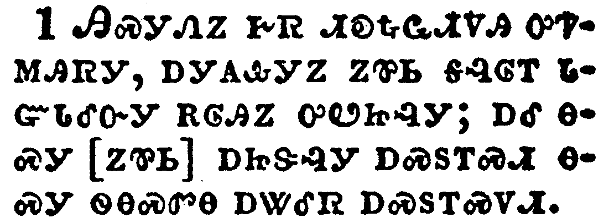</a></td>
</tr>
<tr class="even">
<td>And the fifth angel sounded, and I saw a star fall from heaven unto the earth: and to him was given the key of the bottomless pit.</td>
</tr>
<tr class="odd">
<td>ᎯᏍᎩᏁᏃ ᎨᏒ ᏗᎧᎿᎭᏩᏗᏙᎯ ᎤᏤᎷᎯᏒᎩ, ᎠᎩᎪᎲᎩᏃ ᏃᏈᏏ ᎦᎸᎶᎢ ᏓᏳᏓᎴᏅᎩ ᎡᎶᎯᏃ ᎤᏬᏥᎸᎩ; ᎠᎴ ᎾᏍᎩ [ᏃᏈᏏ] ᎠᏥᏕᎸᎩ ᎠᏍᏚᎢᏍᏗ ᎾᏍᎩ ᏫᎾᏍᏛᎾ ᎠᏔᎴᏒ ᎠᏍᏚᎢᏍᏙᏗ.</td>
</tr>
<tr class="even">
<td>Hi-s-gi-ne-no ge-sv di-ka-hna-wa-di-do-hi u-tse-lu-hi-sv-gi, a-gi-go-hv-gi-no no-qui-si ga-lv-lo-i da-yu-da-le-nv-gi e-lo-hi-no u-wo-tsi-lv-gi; a-le na-s-gi [no-qui-si] a-tsi-de-lv-gi a-s-du-i-s-di na-s-gi wi-na-s-dv-na a-ta-le-sv a-s-du-i-s-do-di.</td>
</tr>
</tbody>
</table>

<table>
<tbody>
<tr class="odd">
<td><a href="270902.png">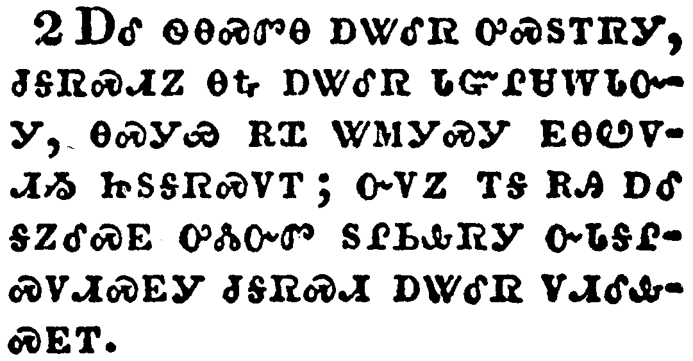</a></td>
</tr>
<tr class="even">
<td>And he opened the bottomless pit; and there arose a smoke out of the pit, as the smoke of a great furnace; and the sun and the air were darkened by reason of the smoke of the pit.</td>
</tr>
<tr class="odd">
<td>ᎠᎴ ᏫᎾᏍᏛᎾ ᎠᏔᎴᏒ ᎤᏍᏚᎢᏒᎩ, ᏧᎦᏒᏍᏗᏃ ᎾᎿᎭᎠᏔᎴᏒ ᏓᏳᎵᏌᎳᏓᏅᎩ, ᎾᏍᎩᏯ ᎡᏆ ᏔᎷᎩᏍᎩ ᎬᎾᏬᏙᏗᏱ ᏥᏚᎦᏒᏍᏙᎢ; ᏅᏙᏃ ᎢᎦ ᎡᎯ ᎠᎴ ᎦᏃᎴᏍᎬ ᎤᏜᏓᏅᏛ ᏚᎵᏏᎲᏒᎩ ᏅᏓᎦᎵᏍᏙᏗᏍᎬᎩ ᏧᎦᏒᏍᏗ ᎠᏔᎴᏒ ᏙᏗᎴᎲᏍᎬᎢ.</td>
</tr>
<tr class="even">
<td>A-le wi-na-s-dv-na a-ta-le-sv u-s-du-i-sv-gi, tsu-ga-sv-s-di-no na-hna a-ta-le-sv da-yu-li-sa-la-da-nv-gi, na-s-gi-ya e-qua ta-lu-gi-s-gi gv-na-wo-do-di-yi tsi-du-ga-sv-s-do-i; nv-do-no i-ga e-hi a-le ga-no-le-s-gv u-dla-nv-dv du-li-si-hv-sv-gi nv-da-ga-li-s-do-di-s-gv-gi tsu-ga-sv-s-di a-ta-le-sv do-di-le-hv-s-gv-i.</td>
</tr>
</tbody>
</table>

<table>
<tbody>
<tr class="odd">
<td><a href="270903.png">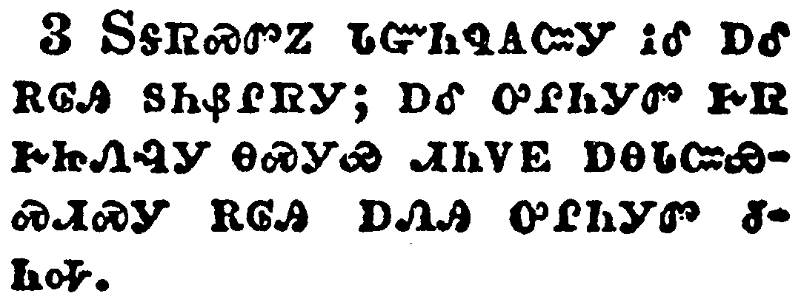</a></td>
</tr>
<tr class="even">
<td>And there came out of the smoke locusts upon the earth: and unto them was given power, as the scorpions of the earth have power.</td>
</tr>
<tr class="odd">
<td>ᏚᎦᏒᏍᏛᏃ ᏓᏳᏂᏄᎪᏨᎩ ᎥᎴ ᎠᎴ ᎡᎶᎯ ᏚᏂᏰᎵᏒᎩ; ᎠᎴ ᎤᎵᏂᎩᏛ ᎨᏒ ᎨᏥᏁᎸᎩ ᎾᏍᎩᏯ ᏗᏂᏙᎬ ᎠᎾᏓᏨᏯᏍᏗᏍᎩ ᎡᎶᎯ ᎠᏁᎯ ᎤᎵᏂᎩᏛ ᏧᏂᎭ.</td>
</tr>
<tr class="even">
<td>Du-ga-sv-s-dv-no da-yu-ni-nu-go-tsv-gi v-le a-le e-lo-hi du-ni-ye-li-sv-gi; a-le u-li-ni-gi-dv ge-sv ge-tsi-ne-lv-gi na-s-gi-ya di-ni-do-gv a-na-da-tsv-ya-s-di-s-gi e-lo-hi a-ne-hi u-li-ni-gi-dv tsu-ni-ha.</td>
</tr>
</tbody>
</table>

<table>
<tbody>
<tr class="odd">
<td><a href="270904.png">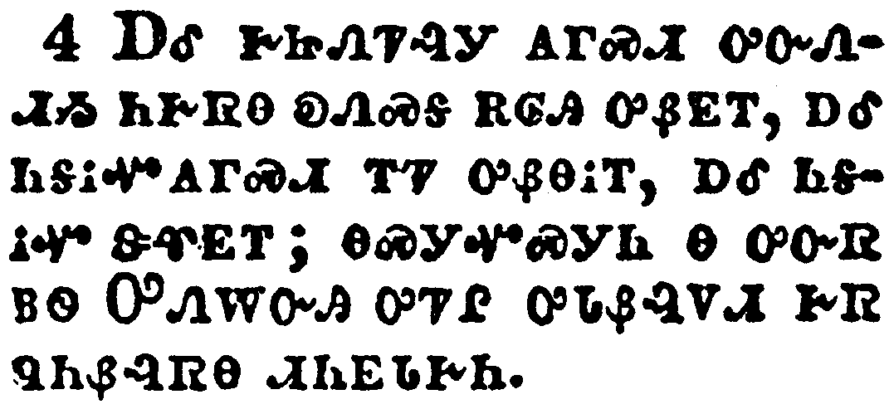</a></td>
</tr>
<tr class="even">
<td>And it was commanded them that they should not hurt the grass of the earth, neither any green thing, neither any tree; but only those men which have not the seal of God in their foreheads.</td>
</tr>
<tr class="odd">
<td>ᎠᎴ ᎨᏥᏁᏤᎸᎩ ᎪᎱᏍᏗ ᎤᏅᏁᏗᏱ ᏂᎨᏒᎾ ᎧᏁᏍᎦ ᎡᎶᎯ ᎤᏰᎬᎢ, ᎠᎴ ᏂᎦᎥᏉᎪᎱᏍᏗ ᎢᏤ ᎤᏰᎾᎥᎢ, ᎠᎴ ᏂᎦᎥᏉ ᏕᏡᎬᎢ; ᎾᏍᎩᏉᏍᎩᏂ Ꮎ ᎤᏅᏒ ᏴᏫ ᎤᏁᎳᏅᎯ ᎤᏤᎵ ᎤᏓᏰᎸᏙᏗ ᎨᏒ ᏄᏂᏰᎸᏒᎾ ᏗᏂᎬᏓᎨᏂ.</td>
</tr>
<tr class="even">
<td>A-le ge-tsi-ne-tse-lv-gi go-hu-s-di u-nv-ne-di-yi ni-ge-sv-na ka-ne-s-ga e-lo-hi u-ye-gv-i, a-le ni-ga-v-quo-go-hu-s-di i-tse u-ye-na-v-i, a-le ni-ga-v-quo de-tlu-gv-i; na-s-gi-quo-s-gi-ni na u-nv-sv yv-wi U-ne-la-nv-hi u-tse-li u-da-ye-lv-do-di ge-sv nu-ni-ye-lv-sv-na di-ni-gv-da-ge-ni.</td>
</tr>
</tbody>
</table>

<table>
<tbody>
<tr class="odd">
<td><a href="270905.png">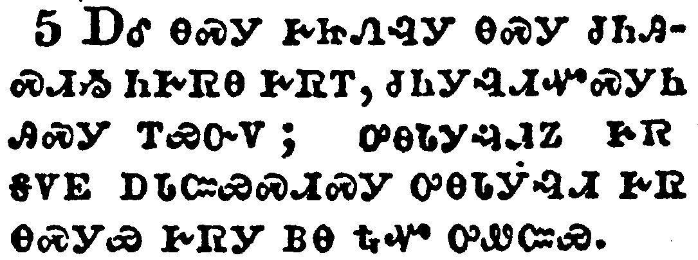</a></td>
</tr>
<tr class="even">
<td>And to them it was given that they should not kill them, but that they should be tormented five months: and their torment was as the torment of a scorpion, when he striketh a man.</td>
</tr>
<tr class="odd">
<td>ᎠᎴ ᎾᏍᎩ ᎨᏥᏁᎸᎩ ᎾᏍᎩ ᏧᏂᎯᏍᏗᏱ ᏂᎨᏒᎾ ᎨᏒᎢ, ᏧᏂᎩᎸᏗᏉᏍᎩᏂ ᎯᏍᎩ ᎢᏯᏅᏙ; ᎤᎾᏓᎩᎸᏗᏃ ᎨᏒ ᎦᏙᎬ ᎠᏓᏨᏯᏍᏗᏍᎩ ᎤᎾᏓᎩᎸᏗ ᎨᏒ ᎾᏍᎩᏯ ᎨᏒᎩ ᏴᎾ ᎿᎭᏉ ᎤᏪᏨᏯ.</td>
</tr>
<tr class="even">
<td>A-le na-s-gi ge-tsi-ne-lv-gi na-s-gi tsu-ni-hi-s-di-yi ni-ge-sv-na ge-sv-i, tsu-ni-gi-lv-di-quo-s-gi-ni hi-s-gi i-ya-nv-do; u-na-da-gi-lv-di-no ge-sv ga-do-gv a-da-tsv-ya-s-di-s-gi u-na-da-gi-lv-di ge-sv na-s-gi-ya ge-sv-gi yv-na hna-quo u-we-tsv-ya.</td>
</tr>
</tbody>
</table>

<table>
<tbody>
<tr class="odd">
<td><a href="270906.png">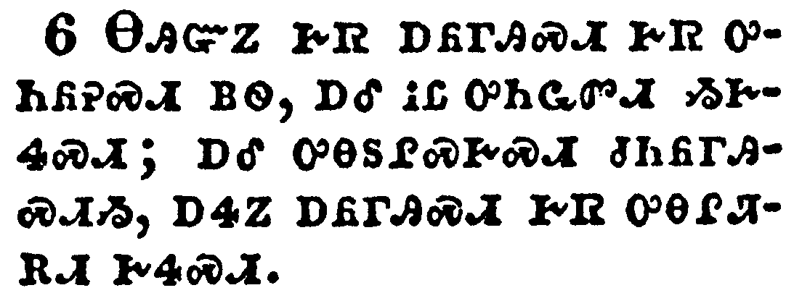</a></td>
</tr>
<tr class="even">
<td>And in those days shall men seek death, and shall not find it; and shall desire to die, and death shall flee from them.</td>
</tr>
<tr class="odd">
<td>ᎾᎯᏳᏃ ᎨᏒ ᎠᏲᎱᎯᏍᏗ ᎨᏒ ᎤᏂᏲᎮᏍᏗ ᏴᏫ, ᎠᎴ ᎥᏝ ᎤᏂᏩᏛᏗ ᏱᎨᏎᏍᏗ; ᎠᎴ ᎤᎾᏚᎵᏍᎨᏍᏗ ᏧᏂᏲᎱᎯᏍᏗᏱ, ᎠᏎᏃ ᎠᏲᎱᎯᏍᏗ ᎨᏒ ᎤᎾᎵᏘᎡᏗ ᎨᏎᏍᏗ.</td>
</tr>
<tr class="even">
<td>Na-hi-yu-no ge-sv a-yo-hu-hi-s-di ge-sv u-ni-yo-he-s-di yv-wi, a-le v-tla u-ni-wa-dv-di yi-ge-se-s-di; a-le u-na-du-li-s-ge-s-di tsu-ni-yo-hu-hi-s-di-yi, a-se-no a-yo-hu-hi-s-di ge-sv u-na-li-ti-e-di ge-se-s-di.</td>
</tr>
</tbody>
</table>

<table>
<tbody>
<tr class="odd">
<td></td>
</tr>
<tr class="even">
<td>And the shapes of the locusts were like unto horses prepared unto battle; and on their heads were as it were crowns like gold, and their faces were as the faces of men.</td>
</tr>
<tr class="odd">
<td>ᎥᎴᏃ ᎤᎾᏙᏢᏒ ᎾᏍᎩᏯ ᎨᏒᎩ, ᏐᏈᎵ ᏓᏅᏩ ᎤᏁᏅᏍᏗᏱ ᏥᎨᎦᏛᏅᎢᏍᏙᎢ; ᏚᏄᎵᏍᏚᎸᎩᏃ ᏗᎵᏍᏚᎶ ᎠᏕᎸᏓᎶᏁᎨ ᏗᎪᏢᏔᏅᎯ ᎾᏍᎩᏯᎢ, ᏚᎾᎧᏛᏃ ᏴᏫ ᏚᎾᎧᏛ ᎾᏍᎩᏯ ᎨᏒᎩ.</td>
</tr>
<tr class="even">
<td>V-le-no u-na-do-tlv-sv na-s-gi-ya ge-sv-gi, so-qui-li da-nv-wa u-ne-nv-s-di-yi tsi-ge-ga-dv-nv-i-s-do-i; du-nu-li-s-du-lv-gi-no di-li-s-du-lo a-de-lv-da-lo-ne-ge di-go-tlv-ta-nv-hi na-s-gi-ya-i, du-na-ka-dv-no yv-wi du-na-ka-dv na-s-gi-ya ge-sv-gi.</td>
</tr>
</tbody>
</table>

<table>
<tbody>
<tr class="odd">
<td><a href="270908.png">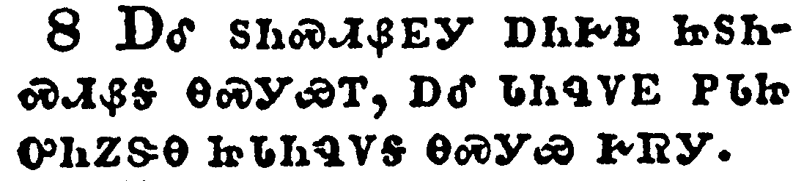</a></td>
</tr>
<tr class="even">
<td>And they had hair as the hair of women, and their teeth were as the teeth of lions.</td>
</tr>
<tr class="odd">
<td>ᎠᎴ ᏚᏂᏍᏗᏰᎬᎩ ᎠᏂᎨᏴ ᏥᏚᏂᏍᏗᏰᎦ ᎾᏍᎩᏯᎢ, ᎠᎴ ᏓᏂᏄᏙᎬ ᏢᏓᏥ ᎤᏂᏃᏕᎾ ᏥᏓᏂᏄᏙᎦ ᎾᏍᎩᏯ ᎨᏒᎩ.</td>
</tr>
<tr class="even">
<td>A-le du-ni-s-di-ye-gv-gi a-ni-ge-yv tsi-du-ni-s-di-ye-ga na-s-gi-ya-i, a-le da-ni-nu-do-gv tlv-da-tsi u-ni-no-de-na tsi-da-ni-nu-do-ga na-s-gi-ya ge-sv-gi.</td>
</tr>
</tbody>
</table>

<table>
<tbody>
<tr class="odd">
<td><a href="270909.png">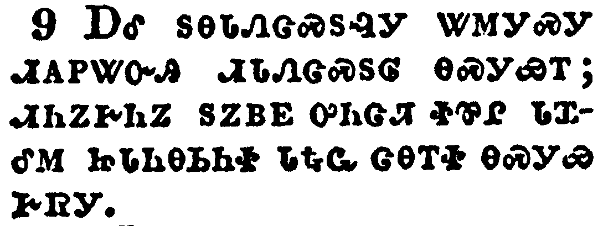</a></td>
</tr>
<tr class="even">
<td>And they had breastplates, as it were breastplates of iron; and the sound of their wings was as the sound of chariots of many horses running to battle.</td>
</tr>
<tr class="odd">
<td>ᎠᎴ ᏚᎾᏓᏁᏣᏍᏚᎸᎩ ᏔᎷᎩᏍᎩ ᏗᎪᏢᏔᏅᎯ ᏗᏓᏁᏣᏍᏚᎶ ᎾᏍᎩᏯᎢ; ᏗᏂᏃᎨᏂᏃ ᏚᏃᏴᎬ ᎤᏂᏣᏘ ᏐᏈᎵ ᏓᏆᎴᎷ ᏥᏓᏂᎾᏏᏂᏐ ᏓᎿᎭᏩ ᏣᎾᎢᏐ ᎾᏍᎩᏯ ᎨᏒᎩ.</td>
</tr>
<tr class="even">
<td>A-le du-na-da-ne-tsa-s-du-lv-gi ta-lu-gi-s-gi di-go-tlv-ta-nv-hi di-da-ne-tsa-s-du-lo na-s-gi-ya-i; di-ni-no-ge-ni-no du-no-yv-gv u-ni-tsa-ti so-qui-li da-qua-le-lu tsi-da-ni-na-si-ni-so da-hna-wa tsa-na-i-so na-s-gi-ya ge-sv-gi.</td>
</tr>
</tbody>
</table>

<table>
<tbody>
<tr class="odd">
<td></td>
</tr>
<tr class="even">
<td>And they had tails like unto scorpions, and there were stings in their tails: and their power was to hurt men five months.</td>
</tr>
<tr class="odd">
<td>ᏗᏂᏙᎬᏃ ᏗᎾᏓᏨᏯᏍᎩ ᏥᎩ ᎾᏍᎩᏯ ᏓᏂᏂᏓᏛᎩ, ᎠᎴ ᏧᎾᏓᏨᏯᏍᏙᏗ ᏗᏂᏙᎬ ᏚᏙᏢᏒᎩ; ᎠᎴ ᎤᏂᎲᎩ ᎪᎱᏍᏗ ᏧᏅᏁᏗᏱ ᏴᏫ ᎯᏍᎩ ᎢᏯᏅᏙ.</td>
</tr>
<tr class="even">
<td>Di-ni-do-gv-no di-na-da-tsv-ya-s-gi tsi-gi na-s-gi-ya da-ni-ni-da-dv-gi, a-le tsu-na-da-tsv-ya-s-do-di di-ni-do-gv du-do-tlv-sv-gi; a-le u-ni-hv-gi go-hu-s-di tsu-nv-ne-di-yi yv-wi hi-s-gi i-ya-nv-do.</td>
</tr>
</tbody>
</table>

<table>
<tbody>
<tr class="odd">
<td><a href="270911.png">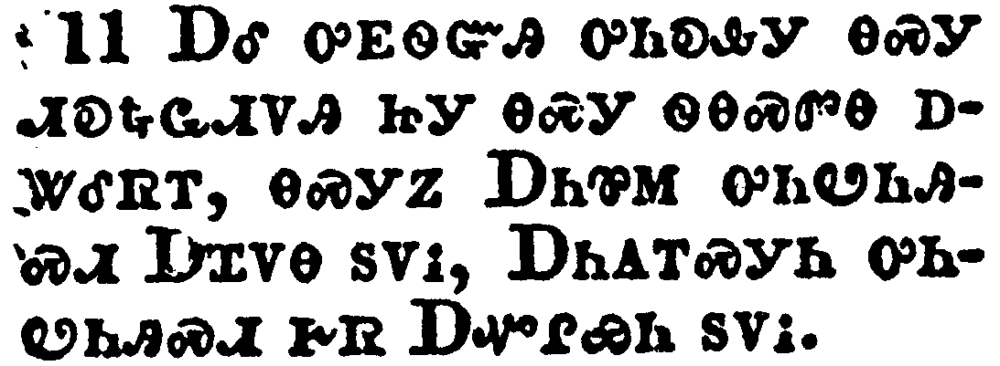</a></td>
</tr>
<tr class="even">
<td>And they had a king over them, which is the angel of the bottomless pit, whose name in the Hebrew tongue is Abaddon, but in the Greek tongue hath his name Apollyon.</td>
</tr>
<tr class="odd">
<td>ᎠᎴ ᎤᎬᏫᏳᎯ ᎤᏂᎧᎲᎩ ᎾᏍᎩ ᏗᎧᎿᎭᏩᏗᏙᎯ ᏥᎩ ᎾᏍᎩ ᏫᎾᏍᏛᎾ ᎠᏔᎴᏒᎢ, ᎾᏍᎩᏃ ᎠᏂᏈᎷ ᎤᏂᏬᏂᎯᏍᏗ ᎠᏆᏙᎾ ᏚᏙᎥ, ᎠᏂᎪᎢᏍᎩᏂ ᎤᏂᏬᏂᎯᏍᏗ ᎨᏒ ᎠᏉᎵᏯᏂ ᏚᏙᎥ.</td>
</tr>
<tr class="even">
<td>A-le u-gv-wi-yu-hi u-ni-ka-hv-gi na-s-gi di-ka-hna-wa-di-do-hi tsi-gi na-s-gi wi-na-s-dv-na a-ta-le-sv-i, na-s-gi-no A-ni-qui-lu u-ni-wo-ni-hi-s-di A-qua-do-na du-do-v, A-ni-go-i-s-gi-ni u-ni-wo-ni-hi-s-di ge-sv A-quo-li-ya-ni du-do-v.</td>
</tr>
</tbody>
</table>

<table>
<tbody>
<tr class="odd">
<td><a href="270912.png">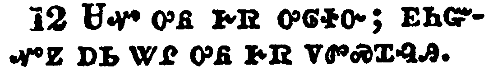</a></td>
</tr>
<tr class="even">
<td>One woe is past; and, behold, there come two woes more hereafter.</td>
</tr>
<tr class="odd">
<td>ᏌᏉ ᎤᏲ ᎨᏒ ᎤᎶᏐᏅ; ᎬᏂᏳᏉᏃ ᎠᏏ ᏔᎵ ᎤᏲ ᎨᏒ ᏙᏛᏍᏆᎸᎯ.</td>
</tr>
<tr class="even">
<td>Sa-quo u-yo ge-sv u-lo-so-nv; gv-ni-yu-quo-no a-si ta-li u-yo ge-sv do-dv-s-qua-lv-hi.</td>
</tr>
</tbody>
</table>

<table>
<tbody>
<tr class="odd">
<td></td>
</tr>
<tr class="even">
<td>And the sixth angel sounded, and I heard a voice from the four horns of the golden altar which is before God,</td>
</tr>
<tr class="odd">
<td>ᏑᏓᎵᏁᏃ ᎨᏒ ᏗᎧᎿᎭᏩᏗᏙᎯ ᎤᏤᎷᎯᏒᎩ, ᎩᎶᏃ ᎧᏁᎬ ᎠᏆᏛᎦᏅᎩ ᏛᏓᎴᎲᏍᎬᎩ ᏅᎩ ᏂᏕᎤᎷᎬ ᎠᏕᎸᏓᎶᏂᎨ ᎪᏢᏔᏅᎯ ᎠᏥᎸ-ᎨᎳᏍᏗᏱ ᎾᏍᎩ ᎤᏁᎳᏅᎯ ᏄᏛᏅ ᎢᎬᏱᏗᏢ ᏥᎦᎧᎭ,</td>
</tr>
<tr class="even">
<td>Su-da-li-ne-no ge-sv di-ka-hna-wa-di-do-hi u-tse-lu-hi-sv-gi, gi-lo-no ka-ne-gv a-qua-dv-ga-nv-gi dv-da-le-hv-s-gv-gi nv-gi ni-de-u-lu-gv a-de-lv-da-lo-ni-ge go-tlv-ta-nv-hi a-tsi-lv--ge-la-s-di-yi na-s-gi U-ne-la-nv-hi nu-dv-nv i-gv-yi-di-tlv tsi-ga-ka-ha,</td>
</tr>
</tbody>
</table>

<table>
<tbody>
<tr class="odd">
<td><a href="270914.png">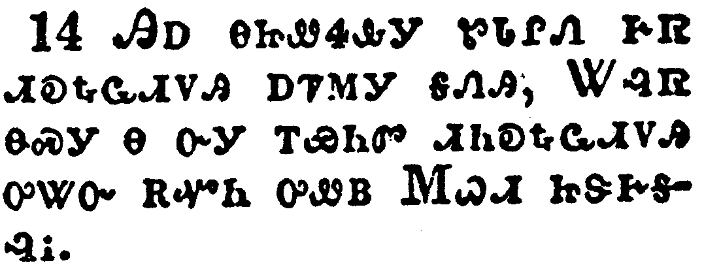</a></td>
</tr>
<tr class="even">
<td>Saying to the sixth angel which had the trumpet, Loose the four angels which are bound in the great river Euphrates.</td>
</tr>
<tr class="odd">
<td>ᎯᎠ ᎾᏥᏪᏎᎲᎩ ᏑᏓᎵᏁ ᎨᏒ ᏗᎧᎿᎭᏩᏗᏙᎯ ᎠᏤᎷᎩ ᎦᏁᎯ, ᏔᎸᏒ ᎾᏍᎩ Ꮎ ᏅᎩ ᎢᏯᏂᏛ ᏗᏂᎧᎿᎭᏩᏗᏙᎯ ᎤᏔᏅ ᎡᏉᏂ ᎤᏪᏴ ᎷᏇᏗ ᏥᏕᎨᎦᎸᎥ.</td>
</tr>
<tr class="even">
<td>Hi-a na-tsi-we-se-hv-gi su-da-li-ne ge-sv di-ka-hna-wa-di-do-hi a-tse-lu-gi ga-ne-hi, Ta-lv-sv na-s-gi na nv-gi i-ya-ni-dv di-ni-ka-hna-wa-di-do-hi u-ta-nv e-quo-ni u-we-yv Lu-que-di tsi-de-ge-ga-lv-v.</td>
</tr>
</tbody>
</table>

<table>
<tbody>
<tr class="odd">
<td><a href="270915.png">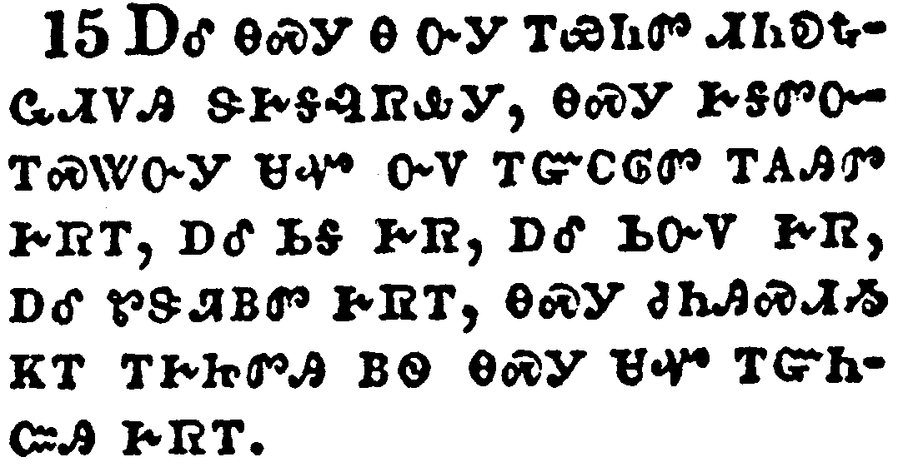</a></td>
</tr>
<tr class="even">
<td>And the four angels were loosed, which were prepared for an hour, and a day, and a month, and a year, for to slay the third part of men.</td>
</tr>
<tr class="odd">
<td>ᎠᎴ ᎾᏍᎩ Ꮎ ᏅᎩ ᎢᏯᏂᏛ ᏗᎾᎧᎿᎭᏩᏗᏙᎯ ᏕᎨᎦᎸᏒᎲᎩ, ᎾᏍᎩ ᎨᎦᏛᏅᎢᏍᏔᏅᎩ ᏌᏉ ᏅᏙ ᎢᏳᏟᎶᏛ ᎢᎪᎯᏛ ᎨᏒᎢ, ᎠᎴ ᏏᎦ ᎨᏒ, ᎠᎴ ᏏᏅᏙ ᎨᏒ, ᎠᎴ ᏑᏕᏘᏴᏛ ᎨᏒᎢ, ᎾᏍᎩ ᏧᏂᎯᏍᏗᏱ ᏦᎢ ᎢᎨᏥᏛᎯ ᏴᏫ ᎾᏍᎩ ᏌᏉ ᎢᏳᏂᏨᎯ ᎨᏒᎢ.</td>
</tr>
<tr class="even">
<td>A-le na-s-gi na nv-gi i-ya-ni-dv di-na-ka-hna-wa-di-do-hi de-ge-ga-lv-sv-hv-gi, na-s-gi ge-ga-dv-nv-i-s-ta-nv-gi sa-quo nv-do i-yu-tli-lo-dv i-go-hi-dv ge-sv-i, a-le si-ga ge-sv, a-le si-nv-do ge-sv, a-le su-de-ti-yv-dv ge-sv-i, na-s-gi tsu-ni-hi-s-di-yi tso-i i-ge-tsi-dv-hi yv-wi na-s-gi sa-quo i-yu-ni-tsv-hi ge-sv-i.</td>
</tr>
</tbody>
</table>

<table>
<tbody>
<tr class="odd">
<td><a href="270916.png">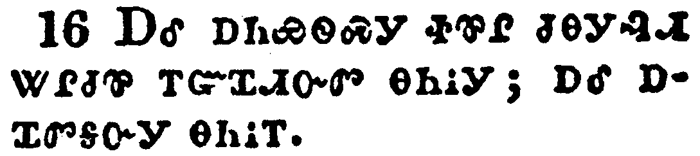</a></td>
</tr>
<tr class="even">
<td>And the number of the army of the horsemen were two hundred thousand thousand: and I heard the number of them.</td>
</tr>
<tr class="odd">
<td>ᎠᎴ ᎠᏂᏯᏫᏍᎩ ᏐᏈᎵ ᏧᎾᎩᎸᏗ ᏔᎵᏧᏈ ᎢᏳᏆᏗᏅᏛ ᎾᏂᎥᎩ; ᎠᎴ ᎠᏆᏛᎦᏅᎩ ᎾᏂᎥᎢ.</td>
</tr>
<tr class="even">
<td>A-le a-ni-ya-wi-s-gi so-qui-li tsu-na-gi-lv-di ta-li-tsu-qui i-yu-qua-di-nv-dv na-ni-v-gi; a-le a-qua-dv-ga-nv-gi na-ni-v-i.</td>
</tr>
</tbody>
</table>

<table>
<tbody>
<tr class="odd">
<td><a href="270917.png">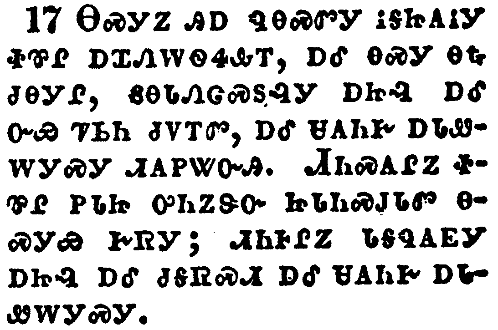</a></td>
</tr>
<tr class="even">
<td>And thus I saw the horses in the vision, and them that sat on them, having breastplates of fire, and of jacinth, and brimstone: and the heads of the horses were as the heads of lions; and out of their mouths issued fire and smoke and brimstone.</td>
</tr>
<tr class="odd">
<td>ᎾᏍᎩᏃ ᎯᎠ ᏄᎾᏍᏛᎩ ᎥᎦᏥᎪᎥᎩ ᏐᏈᎵ ᎠᏆᏁᎳᏫᏎᎲᎢ, ᎠᎴ ᎾᏍᎩ ᎾᎿᎭᏧᎾᎩᎵ, ᏮᎾᏓᏁᏣᏍᏚᎸᎩ ᎠᏥᎸ ᎠᎴ ᏅᏯ ᏤᏏᏂ ᏧᏙᎢᏛ, ᎠᎴ ᏌᎪᏂᎨ ᎠᏓᏪᎳᎩᏍᎩ ᏗᎪᏢᏔᏅᎯ. ᏗᏂᏍᎪᎵᏃ ᏐᏈᎵ ᎠᏓᏥ ᎤᏂᏃᏕᏅ ᏥᏓᏂᏍᎫᏓᏛ ᎾᏍᎩᏯ ᎨᏒᎩ; ᏗᏂᎰᎵᏃ ᏓᎦᏄᎪᎬᎩ ᎠᏥᎸ ᎠᎴ ᏧᎦᏒᏍᏗ ᎠᎴ ᏌᎪᏂᎨ ᎠᏓᏪᎳᎩᏍᎩ.</td>
</tr>
<tr class="even">
<td>Na-s-gi-no hi-a nu-na-s-dv-gi v-ga-tsi-go-v-gi so-qui-li a-qua-ne-la-wi-se-hv-i, a-le na-s-gi na-hna tsu-na-gi-li, wv-na-da-ne-tsa-s-du-lv-gi a-tsi-lv a-le nv-ya tse-si-ni tsu-do-i-dv, a-le sa-go-ni-ge a-da-we-la-gi-s-gi di-go-tlv-ta-nv-hi. Di-ni-s-go-li-no so-qui-li a-da-tsi u-ni-no-de-nv tsi-da-ni-s-gu-da-dv na-s-gi-ya ge-sv-gi; di-ni-ho-li-no da-ga-nu-go-gv-gi a-tsi-lv a-le tsu-ga-sv-s-di a-le sa-go-ni-ge a-da-we-la-gi-s-gi.</td>
</tr>
</tbody>
</table>

<table>
<tbody>
<tr class="odd">
<td><a href="270918.png">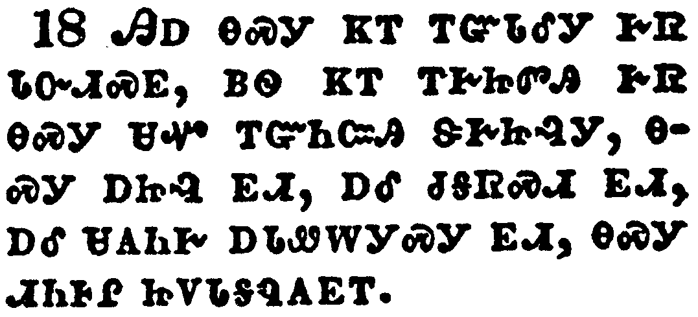</a></td>
</tr>
<tr class="even">
<td>By these three was the third part of men killed, by the fire, and by the smoke, and by the brimstone, which issued out of their mouths.</td>
</tr>
<tr class="odd">
<td>ᎯᎠ ᎾᏍᎩ ᏦᎢ ᎢᏳᏓᎴᎩ ᎨᏒ ᏓᏅᏗᏍᎬ, ᏴᏫ ᏦᎢ ᎢᎨᏥᏛᎯ ᎨᏒ ᎾᏍᎩ ᏌᏉ ᎢᏳᏂᏨᎯ ᏕᎨᏥᎸᎩ, ᎾᏍᎩ ᎠᏥᎸ ᎬᏗ, ᎠᎴ ᏧᎦᏒᏍᏗ ᎬᏗ, ᎠᎴ ᏌᎪᏂᎨ ᎠᏓᏪᎳᎩᏍᎩ ᎬᏗ, ᎾᏍᎩ ᏗᏂᎰᎵ ᏥᏙᏓᎦᏄᎪᎬᎢ.</td>
</tr>
<tr class="even">
<td>Hi-a na-s-gi tso-i i-yu-da-le-gi ge-sv da-nv-di-s-gv, yv-wi tso-i i-ge-tsi-dv-hi ge-sv na-s-gi sa-quo i-yu-ni-tsv-hi de-ge-tsi-lv-gi, na-s-gi a-tsi-lv gv-di, a-le tsu-ga-sv-s-di gv-di, a-le sa-go-ni-ge a-da-we-la-gi-s-gi gv-di, na-s-gi di-ni-ho-li tsi-do-da-ga-nu-go-gv-i.</td>
</tr>
</tbody>
</table>

<table>
<tbody>
<tr class="odd">
<td><a href="270919.png">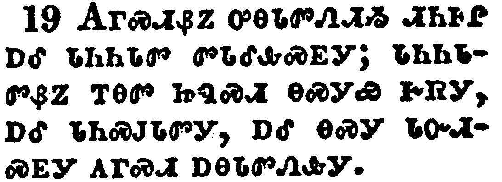</a></td>
</tr>
<tr class="even">
<td>For their power is in their mouth, and in their tails: for their tails were like unto serpents, and had heads, and with them they do hurt.</td>
</tr>
<tr class="odd">
<td>ᎪᎱᏍᏗᏰᏃ ᎤᎾᏓᏛᏁᏗᏱ ᏗᏂᎰᎵ ᎠᎴ ᏓᏂᏂᏓᏛ ᏛᏓᎴᎲᏍᎬᎩ; ᏓᏂᏂᏓᏛᏰᏃ ᎢᎾᏛ ᏥᏄᏍᏗ ᎾᏍᎩᏯ ᎨᏒᎩ, ᎠᎴ ᏓᏂᏍᎫᏓᏛᎩ, ᎠᎴ ᎾᏍᎩ ᏓᏅᏗᏍᎬᎩ ᎪᎱᏍᏗ ᎠᎾᏓᏛᏁᎲᎩ.</td>
</tr>
<tr class="even">
<td>Go-hu-s-di-ye-no u-na-da-dv-ne-di-yi di-ni-ho-li a-le da-ni-ni-da-dv dv-da-le-hv-s-gv-gi; da-ni-ni-da-dv-ye-no i-na-dv tsi-nu-s-di na-s-gi-ya ge-sv-gi, a-le da-ni-s-gu-da-dv-gi, a-le na-s-gi da-nv-di-s-gv-gi go-hu-s-di a-na-da-dv-ne-hv-gi.</td>
</tr>
</tbody>
</table>

<table>
<tbody>
<tr class="odd">
<td><a href="270920.png">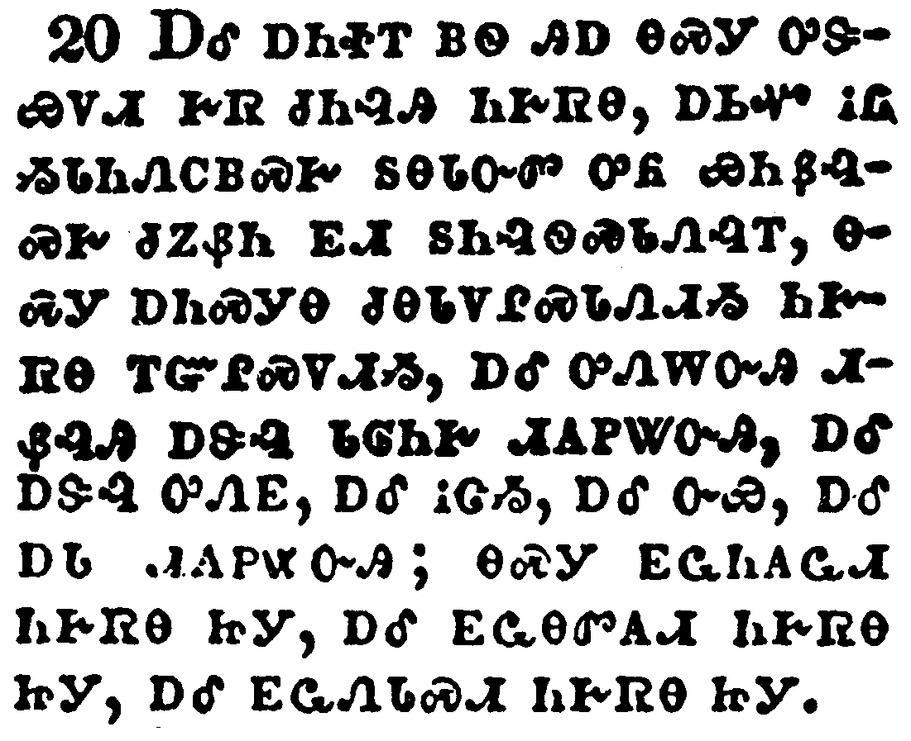</a></td>
</tr>
<tr class="even">
<td>And the rest of the men which were not killed by these plagues yet repented not of the works of their hands, that they should not worship devils, and idols of gold, and silver, and brass, and stone, and of wood: which neither can see, nor hear, nor walk:</td>
</tr>
<tr class="odd">
<td>ᎠᎴ ᎠᏂᏐᎢ ᏴᏫ ᎯᎠ ᎾᏍᎩ ᎤᏕᏯᏙᏗ ᎨᏒ ᏧᏂᎸᎯ ᏂᎨᏒᎾ, ᎠᏏᏉ ᎥᏝ ᏱᏓᏂᏁᏟᏴᏍᎨ ᏚᎾᏓᏅᏛ ᎤᏲ ᏯᏂᏰᎸᏍᎨ ᏧᏃᏰᏂ ᎬᏗ ᏚᏂᎸᏫᏍᏓᏁᎸᎢ, ᎾᏍᎩ ᎠᏂᏍᎩᎾ ᏧᎾᏓᏙᎵᏍᏓᏁᏗᏱ ᏂᎨᏒᎾ ᎢᏳᎵᏍᏙᏗᏱ, ᎠᎴ ᎤᏁᎳᏅᎯ ᏗᏰᎸᎯ ᎠᏕᎸ ᏓᎶᏂᎨ ᏗᎪᏢᏔᏅᎯ, ᎠᎴ ᎠᏕᎸ ᎤᏁᎬ, ᎠᎴ ᎥᏣᏱ, ᎠᎴ ᏅᏯ, ᎠᎴ ᎠᏓ ᏗᎪᏢᏔᏅᎯ; ᎾᏍᎩ ᎬᏩᏂᎪᏩᏗ ᏂᎨᏒᎾ ᏥᎩ, ᎠᎴ ᎬᏩᎾᏛᎪᏗ ᏂᎨᏒᎾ ᏥᎩ, ᎠᎴ ᎬᏩᏁᏓᏍᏗ ᏂᎨᏒᎾ ᏥᎩ.</td>
</tr>
<tr class="even">
<td>A-le a-ni-so-i yv-wi hi-a na-s-gi u-de-ya-do-di ge-sv tsu-ni-lv-hi ni-ge-sv-na, a-si-quo v-tla yi-da-ni-ne-tli-yv-s-ge du-na-da-nv-dv u-yo ya-ni-ye-lv-s-ge tsu-no-ye-ni gv-di du-ni-lv-wi-s-da-ne-lv-i, na-s-gi a-ni-s-gi-na tsu-na-da-do-li-s-da-ne-di-yi ni-ge-sv-na i-yu-li-s-do-di-yi, a-le u-ne-la-nv-hi di-ye-lv-hi a-de-lv da-lo-ni-ge di-go-tlv-ta-nv-hi, a-le a-de-lv u-ne-gv, a-le v-tsa-yi, a-le nv-ya, a-le a-da di-go-tlv-ta-nv-hi; na-s-gi gv-wa-ni-go-wa-di ni-ge-sv-na tsi-gi, a-le gv-wa-na-dv-go-di ni-ge-sv-na tsi-gi, a-le gv-wa-ne-da-s-di ni-ge-sv-na tsi-gi.</td>
</tr>
</tbody>
</table>

<table>
<tbody>
<tr class="odd">
<td><a href="270921.png">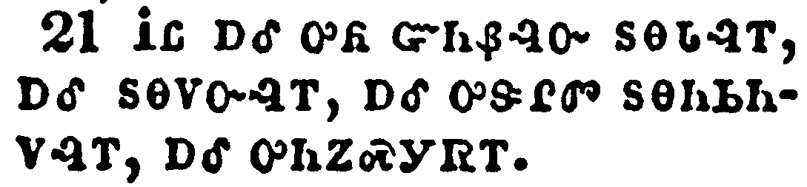</a></td>
</tr>
<tr class="even">
<td>Neither repented they of their murders, nor of their sorceries, nor of their fornication, nor of their thefts.</td>
</tr>
<tr class="odd">
<td>ᎥᏝ ᎠᎴ ᎤᏲ ᏳᏂᏰᎸᏅ ᏚᎾᏓᎸᎢ, ᎠᎴ ᏚᎾᏙᏅᎸᎢ, ᎠᎴ ᎤᏕᎵᏛ ᏚᎾᏂᏏᏂᏙᎸᎢ, ᎠᎴ ᎤᏂᏃᏍᎩᏒᎢ.</td>
</tr>
<tr class="even">
<td>V-tla a-le u-yo yu-ni-ye-lv-nv du-na-da-lv-i, a-le du-na-do-nv-lv-i, a-le u-de-li-dv du-na-ni-si-ni-do-lv-i, a-le u-ni-no-s-gi-sv-i.</td>
</tr>
</tbody>
</table>

