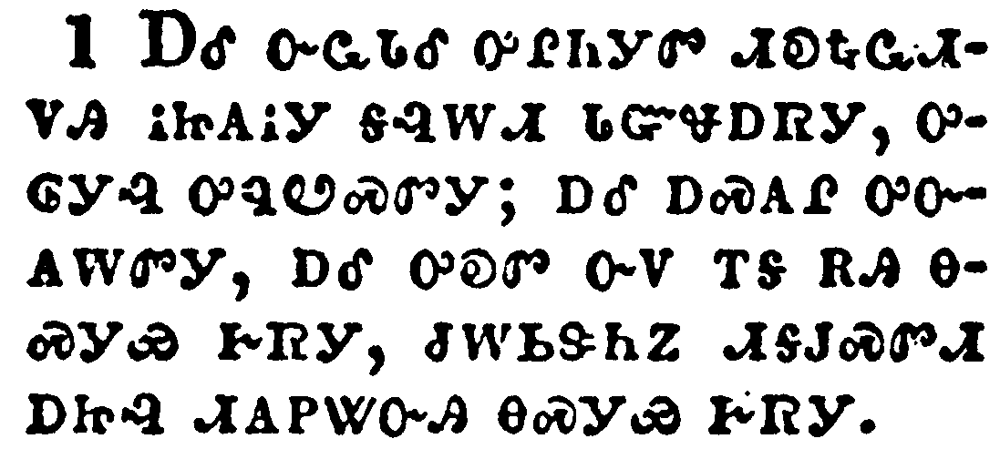
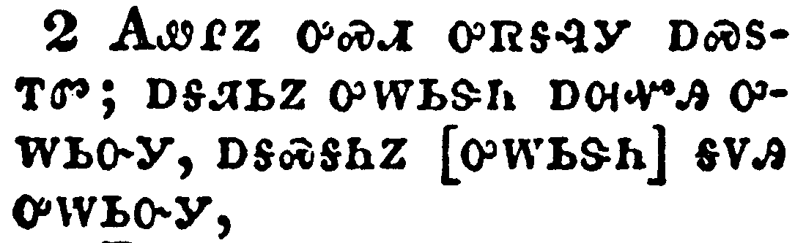
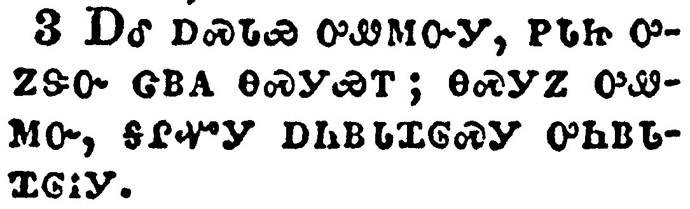
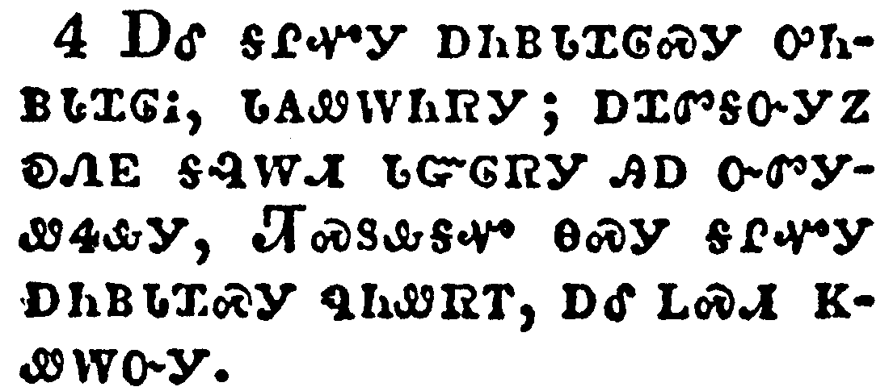
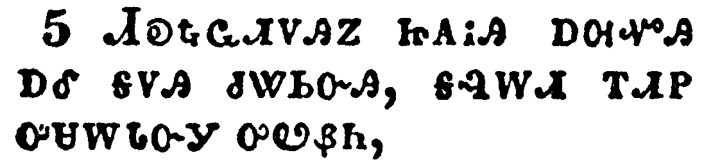
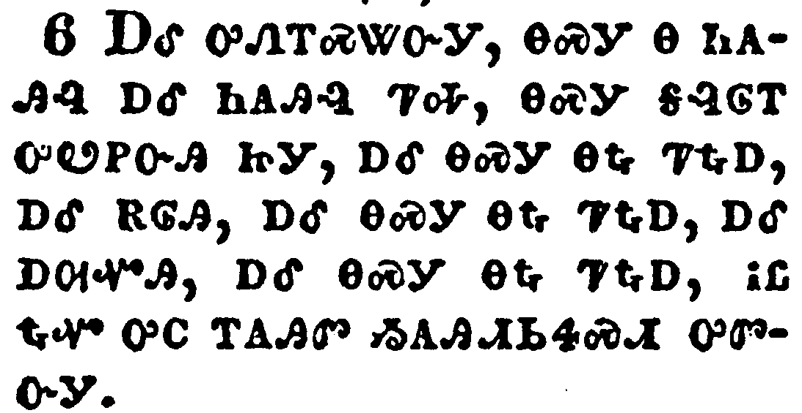
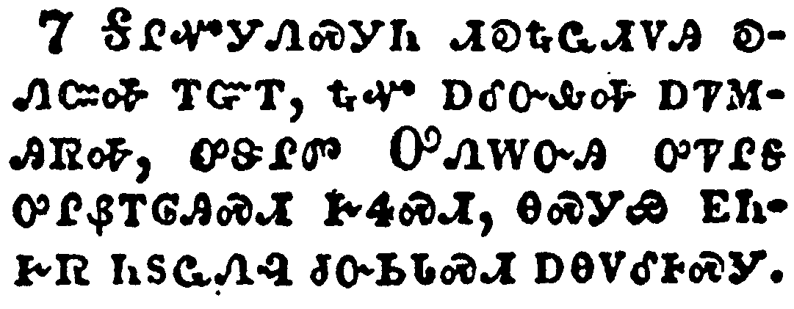
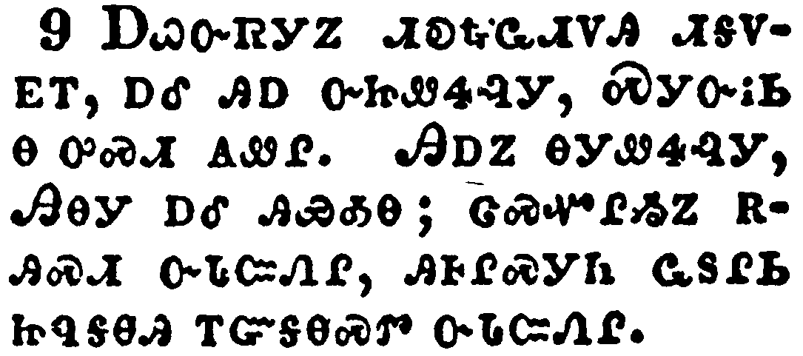
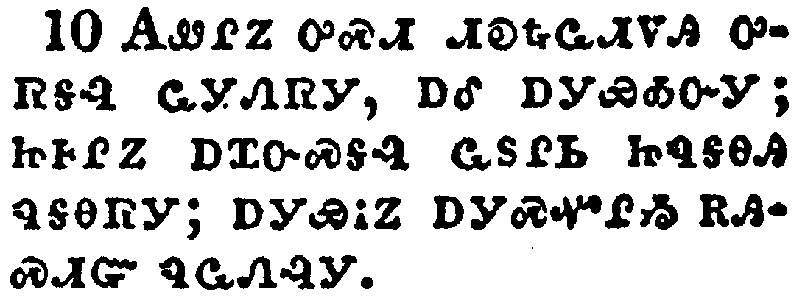
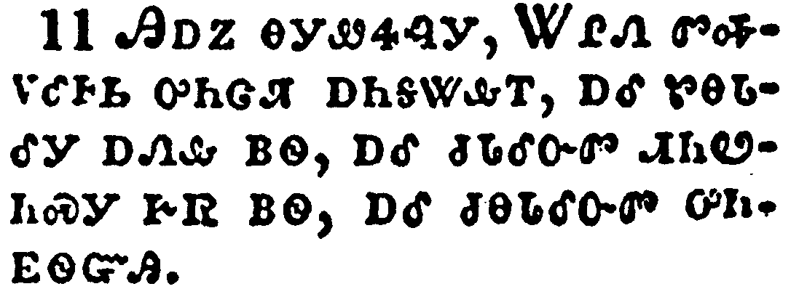

+++
draft=false
date = 2014-12-18T21:11:07Z
title = "Revelation - Chapter 10 - Cherokee New Testament"
weight = 1418955067

[taxonomies]

authors = ["Timothy Legg"]
categories = []
tags = []

[extra]
+++

<table>
<tbody>
<tr class="odd">
<td></td>
</tr>
<tr class="even">
<td>And I saw another mighty angel come down from heaven, clothed with a cloud: and a rainbow was upon his head, and his face was as it were the sun, and his feet as pillars of fire:</td>
</tr>
<tr class="odd">
<td>ᎠᎴ ᏅᏩᏓᎴ ᎤᎵᏂᎩᏛ ᏗᎧᎿᎭᏩᏗᏙᎯ ᎥᏥᎪᎥᎩ ᎦᎸᎳᏗ ᏓᏳᏠᎠᏒᎩ, ᎤᎶᎩᎸ ᎤᏄᏬᏍᏛᎩ; ᎠᎴ ᎠᏍᎪᎵ ᎤᏅᎪᎳᏛᎩ, ᎠᎴ ᎤᎧᏛ ᏅᏙ ᎢᎦ ᎡᎯ ᎾᏍᎩᏯ ᎨᏒᎩ, ᏧᎳᏏᏕᏂᏃ ᏗᎦᎫᏍᏛᏗ ᎠᏥᎸ ᏗᎪᏢᏔᏅᎯ ᎾᏍᎩᏯ ᎨᏒᎩ.</td>
</tr>
<tr class="even">
<td>A-le nv-wa-da-le u-li-ni-gi-dv di-ka-hna-wa-di-do-hi v-tsi-go-v-gi ga-lv-la-di da-yu-tlo-a-sv-gi, u-lo-gi-lv u-nu-wo-s-dv-gi; a-le a-s-go-li u-nv-go-la-dv-gi, a-le u-ka-dv nv-do i-ga e-hi na-s-gi-ya ge-sv-gi, tsu-la-si-de-ni-no di-ga-gu-s-dv-di a-tsi-lv di-go-tlv-ta-nv-hi na-s-gi-ya ge-sv-gi.</td>
</tr>
</tbody>
</table>

<table>
<tbody>
<tr class="odd">
<td></td>
</tr>
<tr class="even">
<td>And he had in his hand a little book open: and he set his right foot upon the sea, and his left foot on the earth,</td>
</tr>
<tr class="odd">
<td>ᎪᏪᎵᏃ ᎤᏍᏗ ᎤᏒᎦᎸᎩ ᎠᏍᏚᎢᏛ; ᎠᎦᏘᏏᏃ ᎤᎳᏏᏕᏂ ᎠᎺᏉᎯ ᎤᎳᏏᏅᎩ, ᎠᎦᏍᎦᏂᏃ [ᎤᎳᏏᏕᏂ] ᎦᏙᎯ ᎤᎳᏏᏅᎩ,</td>
</tr>
<tr class="even">
<td>Go-we-li-no u-s-di u-sv-ga-lv-gi a-s-du-i-dv; a-ga-ti-si-no u-la-si-de-ni a-me-quo-hi u-la-si-nv-gi, a-ga-s-ga-ni-no [u-la-si-de-ni] ga-do-hi u-la-si-nv-gi,</td>
</tr>
</tbody>
</table>

<table>
<tbody>
<tr class="odd">
<td></td>
</tr>
<tr class="even">
<td>And cried with a loud voice, as when a lion roareth: and when he had cried, seven thunders uttered their voices.</td>
</tr>
<tr class="odd">
<td>ᎠᎴ ᎠᏍᏓᏯ ᎤᏪᎷᏅᎩ, ᏢᏓᏥ ᎤᏃᏕᏅ ᏣᏴᎪ ᎾᏍᎩᏯᎢ; ᎾᏍᎩᏃ ᎤᏪᎷᏅ, ᎦᎵᏉᎩ ᎠᏂᏴᏓᏆᎶᏍᎩ ᎤᏂᏴᏓᏆᎶᎥᎩ.</td>
</tr>
<tr class="even">
<td>A-le a-s-da-ya u-we-lu-nv-gi, tlv-da-tsi u-no-de-nv tsa-yv-go na-s-gi-ya-i; na-s-gi-no u-we-lu-nv, ga-li-quo-gi a-ni-yv-da-qua-lo-s-gi u-ni-yv-da-qua-lo-v-gi.</td>
</tr>
</tbody>
</table>

<table>
<tbody>
<tr class="odd">
<td></td>
</tr>
<tr class="even">
<td>And when the seven thunders had uttered their voices, I was about to write: and I heard a voice from heaven saying unto me, Seal up those things which the seven thunders uttered, and write them not.</td>
</tr>
<tr class="odd">
<td>ᎠᎴ ᎦᎵᏉᎩ ᎠᏂᏴᏓᏆᎶᏍᎩ ᎤᏂᏴᏓᏆᎶᎥ, ᏓᎪᏪᎳᏂᏒᎩ; ᎠᏆᏛᎦᏅᎩᏃ ᎧᏁᎬ ᎦᎸᎳᏗ ᏓᏳᎶᏒᎩ ᎯᎠ ᏅᏛᎩᏪᏎᎲᎩ, ᏘᏍᏚᎲᎦᏉ ᎾᏍᎩ ᎦᎵᏉᎩ ᎠᏂᏴᏓᏆᏍᎩ ᏄᏂᏪᏒᎢ, ᎠᎴ ᏞᏍᏗ ᏦᏪᎳᏅᎩ.</td>
</tr>
<tr class="even">
<td>A-le ga-li-quo-gi a-ni-yv-da-qua-lo-s-gi u-ni-yv-da-qua-lo-v, da-go-we-la-ni-sv-gi; a-qua-dv-ga-nv-gi-no ka-ne-gv ga-lv-la-di da-yu-lo-sv-gi hi-a nv-dv-gi-we-se-hv-gi, Ti-s-du-hv-ga-quo na-s-gi ga-li-quo-gi a-ni-yv-da-qua-s-gi nu-ni-we-sv-i, a-le tle-s-di tso-we-la-nv-gi.</td>
</tr>
</tbody>
</table>

<table>
<tbody>
<tr class="odd">
<td></td>
</tr>
<tr class="even">
<td>And the angel which I saw stand upon the sea and upon the earth lifted up his hand to heaven,</td>
</tr>
<tr class="odd">
<td>ᏗᎧᎿᎭᏩᏗᏙᎯᏃ ᏥᎪᎥᎯ ᎠᎺᏉᎯ ᎠᎴ ᎦᏙᎯ ᏧᏔᏏᏅᎯ, ᎦᎸᎳᏗ ᎢᏗᏢ ᎤᏌᎳᏓᏅᎩ ᎤᏬᏰᏂ,</td>
</tr>
<tr class="even">
<td>Di-ka-hna-wa-di-do-hi-no tsi-go-v-hi a-me-quo-hi a-le ga-do-hi tsu-ta-si-nv-hi, ga-lv-la-di i-di-tlv u-sa-la-da-nv-gi u-wo-ye-ni,</td>
</tr>
</tbody>
</table>

<table>
<tbody>
<tr class="odd">
<td></td>
</tr>
<tr class="even">
<td>And sware by him that liveth for ever and ever, who created heaven, and the things that therein are, and the earth, and the things that therein are, and the sea, and the things which are therein, that there should be time no longer:</td>
</tr>
<tr class="odd">
<td>ᎠᎴ ᎤᏁᎢᏍᏔᏅᎩ, ᎾᏍᎩ Ꮎ ᏂᎪᎯᎸ ᎠᎴ ᏂᎪᎯᎸ ᏤᎭ, ᎾᏍᎩ ᎦᎸᎶᎢ ᎤᏬᏢᏅᎯ ᏥᎩ, ᎠᎴ ᎾᏍᎩ ᎾᎿᎭᏤᎿᎭᎠ, ᎠᎴ ᎡᎶᎯ, ᎠᎴ ᎾᏍᎩ ᎾᎿᎭᏤᎿᎭᎠ, ᎠᎴ ᎠᎺᏉᎯ, ᎠᎴ ᎾᏍᎩ ᎾᎿᎭᏤᎿᎭᎠ, ᎥᏝ ᎿᎭᏉ ᎤᏟ ᎢᎪᎯᏛ ᏱᎪᎯᏗᏏᏎᏍᏗ ᎤᏛᏅᎩ.</td>
</tr>
<tr class="even">
<td>A-le u-ne-i-s-ta-nv-gi, na-s-gi na ni-go-hi-lv a-le ni-go-hi-lv tse-ha, na-s-gi ga-lv-lo-i u-wo-tlv-nv-hi tsi-gi, a-le na-s-gi na-hna tse-hna-a, a-le e-lo-hi, a-le na-s-gi na-hna tse-hna-a, a-le a-me-quo-hi, a-le na-s-gi na-hna tse-hna-a, v-tla hna-quo u-tli i-go-hi-dv yi-go-hi-di-si-se-s-di u-dv-nv-gi.</td>
</tr>
</tbody>
</table>

<table>
<tbody>
<tr class="odd">
<td></td>
</tr>
<tr class="even">
<td>But in the days of the voice of the seventh angel, when he shall begin to sound, the mystery of God should be finished, as he hath declared to his servants the prophets.</td>
</tr>
<tr class="odd">
<td>ᎦᎵᏉᎩᏁᏍᎩᏂ ᏗᎧᎿᎭᏩᏗᏙᎯ ᎧᏁᏨᎭ ᎢᏳᎢ, ᎿᎭᏉ ᎠᎴᏅᎲᎭ ᎠᏤᎷᎯᏒᎭ, ᎤᏕᎵᏛ ᎤᏁᎳᏅᎯ ᎤᏤᎵᎦ ᎤᎵᏰᎢᎶᎯᏍᏗ ᎨᏎᏍᏗ, ᎾᏍᎩᏯ ᎬᏂᎨᏒ ᏂᏚᏩᏁᎸ ᏧᏅᏏᏓᏍᏗ ᎠᎾᏙᎴᎰᏍᎩ.</td>
</tr>
<tr class="even">
<td>Ga-li-quo-gi-ne-s-gi-ni di-ka-hna-wa-di-do-hi ka-ne-tsv-ha i-yu-i, hna-quo a-le-nv-hv-ha a-tse-lu-hi-sv-ha, u-de-li-dv U-ne-la-nv-hi u-tse-li-ga u-li-ye-i-lo-hi-s-di ge-se-s-di, na-s-gi-ya gv-ni-ge-sv ni-du-wa-ne-lv tsu-nv-si-da-s-di a-na-do-le-ho-s-gi.</td>
</tr>
</tbody>
</table>

<table>
<tbody>
<tr class="odd">
<td></td>
</tr>
<tr class="even">
<td>And the voice which I heard from heaven spake unto me again, and said, Go and take the little book which is open in the hand of the angel which standeth upon the sea and upon the earth.</td>
</tr>
<tr class="odd">
<td>ᎧᏁᎬᏃ ᎠᏆᏛᎦᏅᎯ ᎦᎸᎳᏗ ᏅᏓᏳᏓᎴᏅᎯ ᏔᎵᏁ ᎠᎩᏁᏤᎸᎩ, ᎠᎴ ᎯᎠ ᏄᏪᏒᎩ, ᎮᎾ, ᎠᎴ ᏫᎾᎩ ᎤᏍᏗ ᎪᏪᎵ ᎠᏍᏚᎢᏛ ᏧᏒᎦᎸ ᏗᎧᎿᎭᏩᏗᏙᎯ ᏥᎦᏙᎦ ᏥᏚᎳᏍᎦ ᎠᎺᏉᎯ ᎠᎴ ᎦᏙᎯ.</td>
</tr>
<tr class="even">
<td>Ka-ne-gv-no a-qua-dv-ga-nv-hi ga-lv-la-di nv-da-yu-da-le-nv-hi ta-li-ne a-gi-ne-tse-lv-gi, a-le hi-a nu-we-sv-gi, He-na, a-le wi-na-gi u-s-di go-we-li a-s-du-i-dv tsu-sv-ga-lv di-ka-hna-wa-di-do-hi tsi-ga-do-ga tsi-du-la-s-ga a-me-quo-hi a-le ga-do-hi.</td>
</tr>
</tbody>
</table>

<table>
<tbody>
<tr class="odd">
<td></td>
</tr>
<tr class="even">
<td>And I went unto the angel, and said unto him, Give me the little book. And he said unto me, Take it, and eat it up; and it shall make thy belly bitter, but it shall be in thy mouth sweet as honey.</td>
</tr>
<tr class="odd">
<td>ᎠᏇᏅᏒᎩᏃ ᏗᎧᎿᎭᏩᏗᏙᎯ ᏗᎦᏙᎬᎢ, ᎠᎴ ᎯᎠ ᏅᏥᏪᏎᎸᎩ, ᏍᎩᏅᎥᏏ Ꮎ ᎤᏍᏗ ᎪᏪᎵ. ᎯᎠᏃ ᎾᎩᏪᏎᎸᎩ, ᎯᎾᎩ ᎠᎴ ᎯᏯᎣᎾ; ᏣᏍᏉᎵᏱᏃ ᏩᏚᎵᏏ ᏥᏄᎦᎾᎯ ᎢᏳᎦᎾᏍᏛ ᏅᏓᏨᏁᎵ.</td>
</tr>
<tr class="even">
<td>A-que-nv-sv-gi-no di-ka-hna-wa-di-do-hi di-ga-do-gv-i, a-le hi-a nv-tsi-we-se-lv-gi, S-gi-nv-v-si na u-s-di go-we-li. Hi-a-no na-gi-we-se-lv-gi, Hi-na-gi a-le hi-ya-o-na; tsa-s-quo-li-yi-no wa-du-li-si tsi-nu-ga-na-hi i-yu-ga-na-s-dv nv-da-tsv-ne-li.</td>
</tr>
</tbody>
</table>

<table>
<tbody>
<tr class="odd">
<td></td>
</tr>
<tr class="even">
<td>And I took the little book out of the angel's hand, and ate it up; and it was in my mouth sweet as honey: and as soon as I had eaten it, my belly was bitter.</td>
</tr>
<tr class="odd">
<td>ᎪᏪᎵᏃ ᎤᏍᏗ ᏗᎧᎿᎭᏩᏗᏙᎯ ᎤᏒᎦᎸ ᏩᎩᏁᏒᎩ, ᎠᎴ ᎠᎩᏯᎣᏅᎩ; ᏥᎰᎵᏃ ᎠᏆᏅᏍᎦᎸ ᏩᏚᎵᏏ ᏥᏄᎦᎾᎯ ᏄᎦᎾᏒᎩ; ᎠᎩᏯᎥᏃ ᎠᎩᏍᏉᎵᏱ ᎡᎯᏍᏗᏳ ᏄᏩᏁᎸᎩ.</td>
</tr>
<tr class="even">
<td>Go-we-li-no u-s-di di-ka-hna-wa-di-do-hi u-sv-ga-lv wa-gi-ne-sv-gi, a-le a-gi-ya-o-nv-gi; tsi-ho-li-no a-qua-nv-s-ga-lv wa-du-li-si tsi-nu-ga-na-hi nu-ga-na-sv-gi; a-gi-ya-v-no a-gi-s-quo-li-yi e-hi-s-di-yu nu-wa-ne-lv-gi.</td>
</tr>
</tbody>
</table>

<table>
<tbody>
<tr class="odd">
<td></td>
</tr>
<tr class="even">
<td>And he said unto me, Thou must prophesy again before many peoples, and nations, and tongues, and kings.</td>
</tr>
<tr class="odd">
<td>ᎯᎠᏃ ᎾᎩᏪᏎᎸᎩ, ᏔᎵᏁ ᏛᎭᏙᎴᎰᏏ ᎤᏂᏣᏘ ᎠᏂᎦᏔᎲᎢ, ᎠᎴ ᏑᎾᏓᎴᎩ ᎠᏁᎲ ᏴᏫ, ᎠᎴ ᏧᏓᎴᏅᏛ ᏗᏂᏬᏂᏍᎩ ᎨᏒ ᏴᏫ, ᎠᎴ ᏧᎾᏓᎴᏅᏛ ᎤᏂᎬᏫᏳᎯ.</td>
</tr>
<tr class="even">
<td>Hi-a-no na-gi-we-se-lv-gi, Ta-li-ne dv-ha-do-le-ho-si u-ni-tsa-ti a-ni-ga-ta-hv-i, a-le su-na-da-le-gi a-ne-hv yv-wi, a-le tsu-da-le-nv-dv di-ni-wo-ni-s-gi ge-sv yv-wi, a-le tsu-na-da-le-nv-dv u-ni-gv-wi-yu-hi.</td>
</tr>
</tbody>
</table>

