+++
draft=false
date = 2014-12-18T21:11:07Z
title = "Revelation - Chapter 11 - Cherokee New Testament"
weight = 1418955067

[taxonomies]

authors = ["Timothy Legg"]
categories = []
tags = []

[extra]
+++

<table>
<tbody>
<tr class="odd">
<td><a href="271101.png">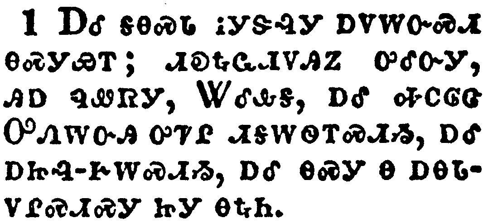</a></td>
</tr>
<tr class="even">
<td>And there was given me a reed like unto a rod: and the angel stood, saying, Rise, and measure the temple of God, and the altar, and them that worship therein.</td>
</tr>
<tr class="odd">
<td>ᎠᎴ ᎦᎾᏍᏓ ᎥᎩᏕᎸᎩ ᎠᏙᎳᏅᏍᏗ ᎾᏍᎩᏯᎢ; ᏗᎧᎿᎭᏩᏗᏙᎯᏃ ᎤᎴᏅᎩ, ᎯᎠ ᏄᏪᏒᎩ, ᏔᎴᎲᎦ, ᎠᎴ ᎭᏟᎶᏣ ᎤᏁᎳᏅᎯ ᎤᏤᎵ ᏗᎦᎳᏫᎢᏍᏗᏱ, ᎠᎴ ᎠᏥᎸ-ᎨᎳᏍᏗᏱ, ᎠᎴ ᎾᏍᎩ Ꮎ ᎠᎾᏓᏙᎵᏍᏗᏍᎩ ᏥᎩ ᎾᎿᎭᏂ.</td>
</tr>
<tr class="even">
<td>A-le ga-na-s-da v-gi-de-lv-gi a-do-la-nv-s-di na-s-gi-ya-i; di-ka-hna-wa-di-do-hi-no u-le-nv-gi, hi-a nu-we-sv-gi, Ta-le-hv-ga, a-le ha-tli-lo-tsa U-ne-la-nv-hi u-tse-li di-ga-la-wi-i-s-di-yi, a-le a-tsi-lv--ge-la-s-di-yi, a-le na-s-gi na a-na-da-do-li-s-di-s-gi tsi-gi na-hna-ni.</td>
</tr>
</tbody>
</table>

<table>
<tbody>
<tr class="odd">
<td><a href="271102.png">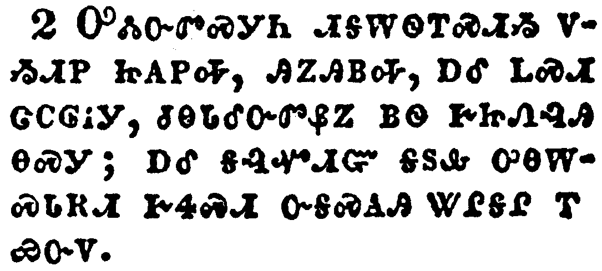</a></td>
</tr>
<tr class="even">
<td>But the court which is without the temple leave out, and measure it not; for it is given unto the Gentiles: and the holy city shall they tread under foot forty and two months.</td>
</tr>
<tr class="odd">
<td>ᎤᏜᏓᏅᏛᏍᎩᏂ ᏗᎦᎳᏫᎢᏍᏗᏱ ᏙᏱᏗᏢ ᏥᎪᏢᎭ, ᎯᏃᎯᏴᎭ, ᎠᎴ ᏞᏍᏗ ᏣᏟᎶᎥᎩ, ᏧᎾᏓᎴᏅᏛᏰᏃ ᏴᏫ ᎨᏥᏁᎸᎯ ᎾᏍᎩ; ᎠᎴ ᎦᎸᏉᏗᏳ ᎦᏚᎲ ᎤᎾᎳᏍᏓᎡᏗ ᎨᏎᏍᏗ ᏅᎦᏍᎪᎯ ᏔᎵᎦᎵ ᎢᏯᏅᏙ.</td>
</tr>
<tr class="even">
<td>U-dla-nv-dv-s-gi-ni di-ga-la-wi-i-s-di-yi do-yi-di-tlv tsi-go-tlv-ha, hi-no-hi-yv-ha, a-le tle-s-di tsa-tli-lo-v-gi, tsu-na-da-le-nv-dv-ye-no yv-wi ge-tsi-ne-lv-hi na-s-gi; a-le ga-lv-quo-di-yu ga-du-hv u-na-la-s-da-e-di ge-se-s-di nv-ga-s-go-hi ta-li-ga-li i-ya-nv-do.</td>
</tr>
</tbody>
</table>

<table>
<tbody>
<tr class="odd">
<td><a href="271103.png">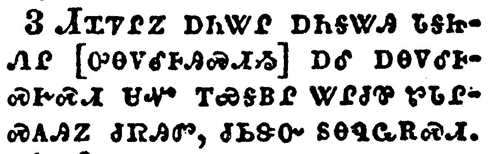</a></td>
</tr>
<tr class="even">
<td>And I will give power unto my two witnesses, and they shall prophesy a thousand two hundred and threescore days, clothed in sackcloth.</td>
</tr>
<tr class="odd">
<td>ᏗᏆᏤᎵᏃ ᎠᏂᏔᎵ ᎠᏂᎦᏔᎯ ᏓᎦᏥᏁᎵ [ᎤᎾᏙᎴᎰᎯᏍᏗᏱ] ᎠᎴ ᎠᎾᏙᎴᎰᏍᎨᏍᏗ ᏌᏉ ᎢᏯᎦᏴᎵ ᏔᎵᏧᏈ ᏑᏓᎵᏍᎪᎯᏃ ᏧᏒᎯᏛ, ᏧᏏᏕᏅ ᏚᎾᏄᏩᎡᏍᏗ.</td>
</tr>
<tr class="even">
<td>Di-qua-tse-li-no a-ni-ta-li a-ni-ga-ta-hi da-ga-tsi-ne-li [u-na-do-le-ho-hi-s-di-yi] a-le a-na-do-le-ho-s-ge-s-di sa-quo i-ya-ga-yv-li ta-li-tsu-qui su-da-li-s-go-hi-no tsu-sv-hi-dv, tsu-si-de-nv du-na-nu-wa-e-s-di.</td>
</tr>
</tbody>
</table>

<table>
<tbody>
<tr class="odd">
<td><a href="271104.png">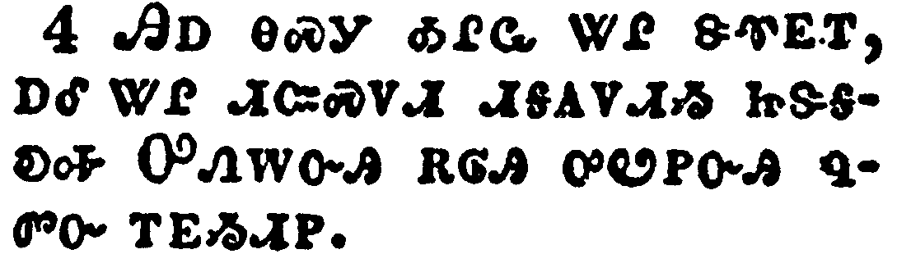</a></td>
</tr>
<tr class="even">
<td>These are the two olive trees, and the two candlesticks standing before the God of the earth.</td>
</tr>
<tr class="odd">
<td>ᎯᎠ ᎾᏍᎩ ᎣᎵᏩ ᏔᎵ ᏕᏡᎬᎢ, ᎠᎴ ᏔᎵ ᏗᏨᏍᏙᏗ ᏗᎦᎪᏙᏗᏱ ᏥᏕᎦᎧᎭ ᎤᏁᎳᏅᎯ ᎡᎶᎯ ᎤᏬᏢᏅᎯ ᏄᏛᏅ ᎢᎬᏱᏗᏢ.</td>
</tr>
<tr class="even">
<td>Hi-a na-s-gi o-li-wa ta-li de-tlu-gv-i, a-le ta-li di-tsv-s-do-di di-ga-go-do-di-yi tsi-de-ga-ka-ha U-ne-la-nv-hi e-lo-hi u-wo-tlv-nv-hi nu-dv-nv i-gv-yi-di-tlv.</td>
</tr>
</tbody>
</table>

<table>
<tbody>
<tr class="odd">
<td><a href="271105.png">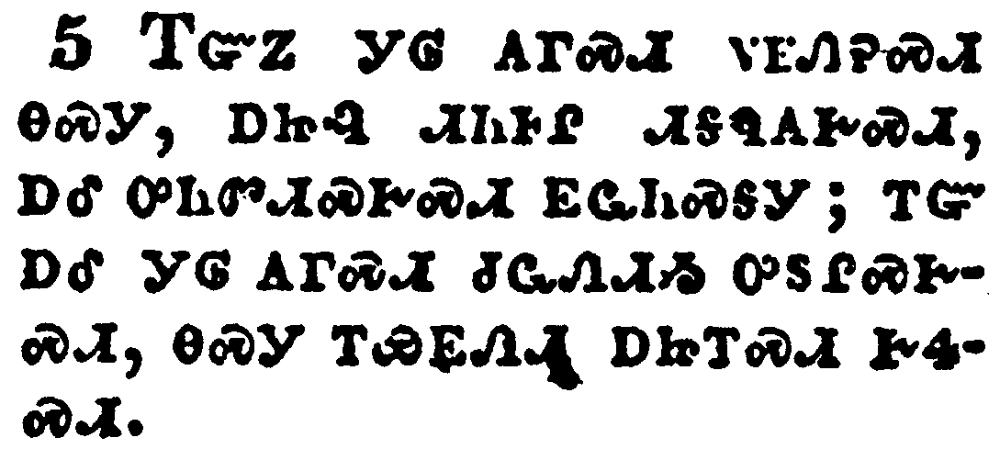</a></td>
</tr>
<tr class="even">
<td>And if any man will hurt them, fire proceedeth out of their mouth, and devoureth their enemies: and if any man will hurt them, he must in this manner be killed.</td>
</tr>
<tr class="odd">
<td>ᎢᏳᏃ ᎩᎶ ᎪᎱᏍᏗ ᏙᎬᏁᎮᏍᏗ ᎾᏍᎩ, ᎠᏥᎸ ᏗᏂᎰᎵ ᏗᎦᏄᎪᎨᏍᏗ, ᎠᎴ ᎤᏂᏛᏗᏍᎨᏍᏗ ᎬᏩᏂᏍᎦᎩ; ᎢᏳ ᎠᎴ ᎩᎶ ᎪᎱᏍᏗ ᏧᏩᏁᏗᏱ ᎤᏚᎵᏍᎨᏍᏗ, ᎾᏍᎩ ᎢᏯᎬᏁᏗ ᎠᏥᎢᏍᏗ ᎨᏎᏍᏗ.</td>
</tr>
<tr class="even">
<td>I-yu-no gi-lo go-hu-s-di do-gv-ne-he-s-di na-s-gi, a-tsi-lv di-ni-ho-li di-ga-nu-go-ge-s-di, a-le u-ni-dv-di-s-ge-s-di gv-wa-ni-s-ga-gi; i-yu a-le gi-lo go-hu-s-di tsu-wa-ne-di-yi u-du-li-s-ge-s-di, na-s-gi i-ya-gv-ne-di a-tsi-i-s-di ge-se-s-di.</td>
</tr>
</tbody>
</table>

<table>
<tbody>
<tr class="odd">
<td><a href="271106.png">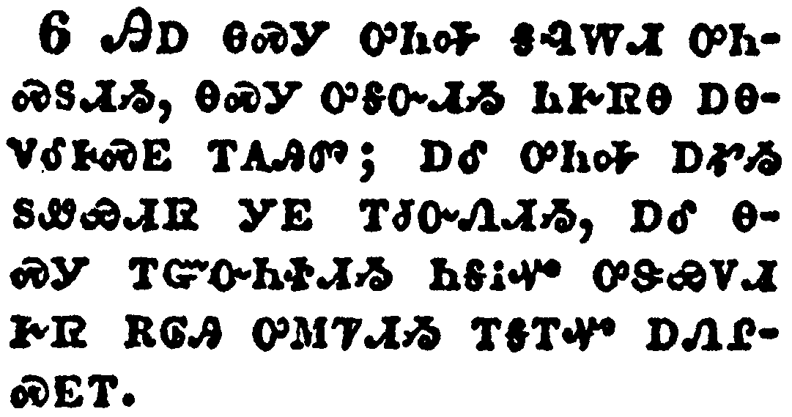</a></td>
</tr>
<tr class="even">
<td>These have power to shut heaven, that it rain not in the days of their prophecy: and have power over waters to turn them to blood, and to smite the earth with all plagues, as often as they will.</td>
</tr>
<tr class="odd">
<td>ᎯᎠ ᎾᏍᎩ ᎤᏂᎭ ᎦᎸᎳᏗ ᎤᏂᏍᏚᏗᏱ, ᎾᏍᎩ ᎤᎦᏅᏗᏱ ᏂᎨᏒᎾ ᎠᎾᏙᎡᎰᏍᎬ ᎢᎪᎯᏛ; ᎠᎴ ᎤᏂᎭ ᎠᎹᏱ ᏚᏪᏯᏗᏒ ᎩᎬ ᎢᏧᏅᏁᏗᏱ, ᎠᎴ ᎾᏍᎩ ᎢᏳᏅᏂᏐᏗᏱ ᏂᎦᎥᏉ ᎤᏕᏯᏙᏗ ᎨᏒ ᎡᎶᎯ ᎤᎷᏤᏗᏱ ᎢᎦᎢᏉ ᎠᏁᎵᏍᎬᎢ.</td>
</tr>
<tr class="even">
<td>Hi-a na-s-gi u-ni-ha ga-lv-la-di u-ni-s-du-di-yi, na-s-gi u-ga-nv-di-yi ni-ge-sv-na a-na-do-e-ho-s-gv i-go-hi-dv; a-le u-ni-ha a-ma-yi du-we-ya-di-sv gi-gv i-tsu-nv-ne-di-yi, a-le na-s-gi i-yu-nv-ni-so-di-yi ni-ga-v-quo u-de-ya-do-di ge-sv e-lo-hi u-lu-tse-di-yi i-ga-i-quo a-ne-li-s-gv-i.</td>
</tr>
</tbody>
</table>

<table>
<tbody>
<tr class="odd">
<td><a href="271107.png">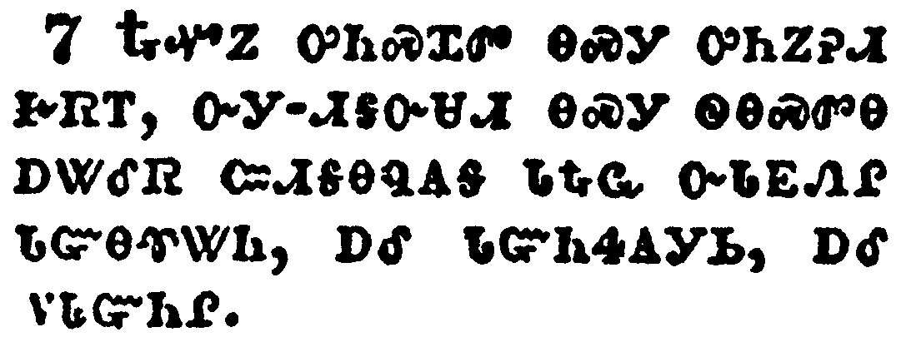</a></td>
</tr>
<tr class="even">
<td>And when they shall have finished their testimony, the beast that ascendeth out of the bottomless pit shall make war against them, and shall overcome them, and kill them.</td>
</tr>
<tr class="odd">
<td>ᎿᎭᏉᏃ ᎤᏂᏍᏆᏛ ᎾᏍᎩ ᎤᏂᏃᎮᏗ ᎨᏒᎢ, ᏅᎩ-ᏗᎦᏅᏌᏗ ᎾᏍᎩ ᏫᎾᏍᏛᎾ ᎠᏔᎴᏒ ᏨᏗᎦᎾᏄᎪᎦ ᏓᎿᎭᏩ ᏅᏓᎬᏁᎵ ᏓᏳᎾᏡᏔᏂ, ᎠᎴ ᏓᏳᏂᏎᎪᎩᏏ, ᎠᎴ ᏙᏓᏳᏂᎵ.</td>
</tr>
<tr class="even">
<td>Hna-quo-no u-ni-s-qua-dv na-s-gi u-ni-no-he-di ge-sv-i, nv-gi--di-ga-nv-sa-di na-s-gi wi-na-s-dv-na a-ta-le-sv tsv-di-ga-na-nu-go-ga da-hna-wa nv-da-gv-ne-li da-yu-na-tlu-ta-ni, a-le da-yu-ni-se-go-gi-si, a-le do-da-yu-ni-li.</td>
</tr>
</tbody>
</table>

<table>
<tbody>
<tr class="odd">
<td><a href="271108.png">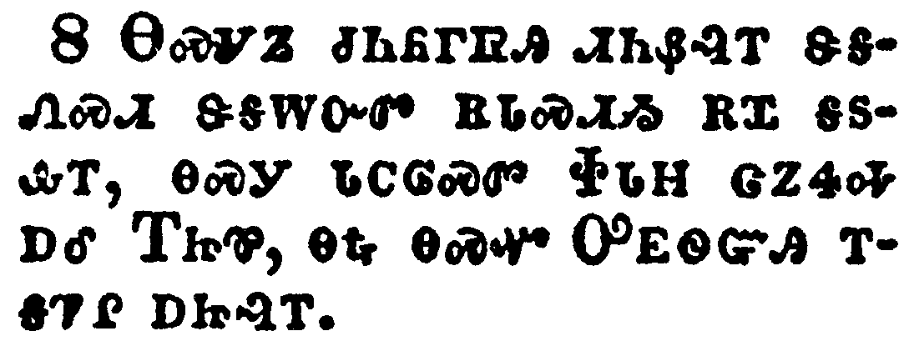</a></td>
</tr>
<tr class="even">
<td>And their dead bodies shall lie in the street of the great city, which spiritually is called Sodom and Egypt, where also our Lord was crucified.</td>
</tr>
<tr class="odd">
<td>ᎾᏍᎩᏃ ᏧᏂᏲᎱᏒᎯ ᏗᏂᏰᎸᎢ ᏕᎦᏁᏍᏗ ᏕᎦᎳᏅᏛ ᎡᏓᏍᏗᏱ ᎡᏆ ᎦᏚᎲᎢ, ᎾᏍᎩ ᏓᏟᎶᏍᏛ ᏐᏓᎻ ᏣᏃᏎᎭ ᎠᎴ ᎢᏥᏈ, ᎾᎿᎭᎾᏍᏉ ᎤᎬᏫᏳᎯ ᎢᎦᏤᎵ ᎠᏥᎸᎢ.</td>
</tr>
<tr class="even">
<td>Na-s-gi-no tsu-ni-yo-hu-sv-hi di-ni-ye-lv-i de-ga-ne-s-di de-ga-la-nv-dv e-da-s-di-yi e-qua ga-du-hv-i, na-s-gi da-tli-lo-s-dv So-da-mi tsa-no-se-ha a-le I-tsi-qui, na-hna na-s-quo U-gv-wi-yu-hi i-ga-tse-li a-tsi-lv-i.</td>
</tr>
</tbody>
</table>

<table>
<tbody>
<tr class="odd">
<td><a href="271109.png">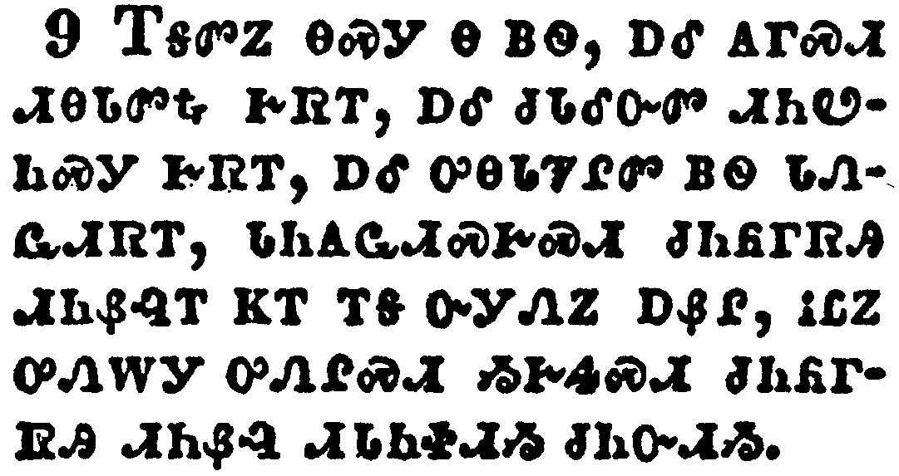</a></td>
</tr>
<tr class="even">
<td>And they of the people and kindreds and tongues and nations shall see their dead bodies three days and an half, and shall not suffer their dead bodies to be put in graves.</td>
</tr>
<tr class="odd">
<td>ᎢᎦᏛᏃ ᎾᏍᎩ Ꮎ ᏴᏫ, ᎠᎴ ᎪᎱᏍᏗ ᏗᎾᏓᏛᎿᎭᎨᏒᎢ, ᎠᎴ ᏧᏓᎴᏅᏛ ᏗᏂᏬᏂᏍᎩ ᎨᏒᎢ, ᎠᎴ ᎤᎾᏓᏤᎵᏛ ᏴᏫ ᏓᏁᏩᏗᏒᎢ, ᏓᏂᎪᏩᏗᏍᎨᏍᏗ ᏧᏂᏲᎱᏒᎯ ᏗᏂᏰᎸᎢ ᏦᎢ ᎢᎦ ᏅᎩᏁᏃ ᎠᏰᎵ, ᎥᏝᏃ ᎤᏁᎳᎩ ᎤᏁᎵᏍᏗ ᏱᎨᏎᏍᏗ ᏧᏂᏲᎱᏒᎯ ᏗᏂᏰᎸ ᏗᏓᏂᏐᏗᏱ ᏧᏂᏅᏗᏱ.</td>
</tr>
<tr class="even">
<td>I-ga-dv-no na-s-gi na yv-wi, a-le go-hu-s-di di-na-da-dv-hna ge-sv-i, a-le tsu-da-le-nv-dv di-ni-wo-ni-s-gi ge-sv-i, a-le u-na-da-tse-li-dv yv-wi da-ne-wa-di-sv-i, da-ni-go-wa-di-s-ge-s-di tsu-ni-yo-hu-sv-hi di-ni-ye-lv-i tso-i i-ga nv-gi-ne-no a-ye-li, v-tla-no u-ne-la-gi u-ne-li-s-di yi-ge-se-s-di tsu-ni-yo-hu-sv-hi di-ni-ye-lv di-da-ni-so-di-yi tsu-ni-nv-di-yi.</td>
</tr>
</tbody>
</table>

<table>
<tbody>
<tr class="odd">
<td><a href="271110.png">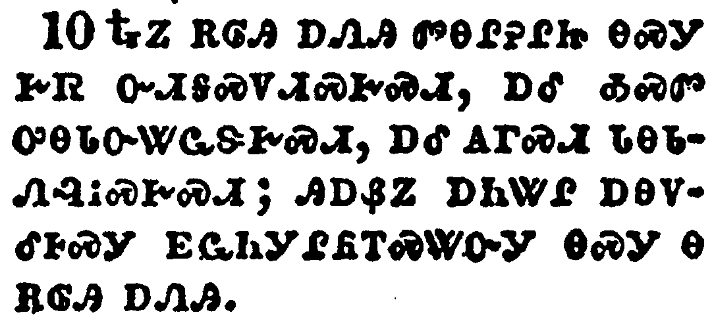</a></td>
</tr>
<tr class="even">
<td>And they that dwell upon the earth shall rejoice over them, and make merry, and shall send gifts one to another; because these two prophets tormented them that dwelt on the earth.</td>
</tr>
<tr class="odd">
<td>ᎿᎭᏃ ᎡᎶᎯ ᎠᏁᎯ ᏛᎾᎵᎮᎵᏥ ᎾᏍᎩ ᎨᏒ ᏅᏗᎦᏍᏙᏗᏍᎨᏍᏗ, ᎠᎴ ᎣᏍᏛ ᎤᎾᏓᏅᏔᏩᏕᎨᏍᏗ, ᎠᎴ ᎪᎱᏍᏗ ᏓᎾᏓᏁᎸᎥᏍᎨᏍᏗ; ᎯᎠᏰᏃ ᎠᏂᏔᎵ ᎠᎾᏙᎴᎰᏍᎩ ᎬᏩᏂᎩᎵᏲᎢᏍᏔᏅᎩ ᎾᏍᎩ Ꮎ ᎡᎶᎯ ᎠᏁᎯ.</td>
</tr>
<tr class="even">
<td>Hna-no e-lo-hi a-ne-hi dv-na-li-he-li-tsi na-s-gi ge-sv nv-di-ga-s-do-di-s-ge-s-di, a-le o-s-dv u-na-da-nv-ta-wa-de-ge-s-di, a-le go-hu-s-di da-na-da-ne-lv-v-s-ge-s-di; hi-a-ye-no a-ni-ta-li a-na-do-le-ho-s-gi gv-wa-ni-gi-li-yo-i-s-ta-nv-gi na-s-gi na e-lo-hi a-ne-hi.</td>
</tr>
</tbody>
</table>

<table>
<tbody>
<tr class="odd">
<td><a href="271111.png">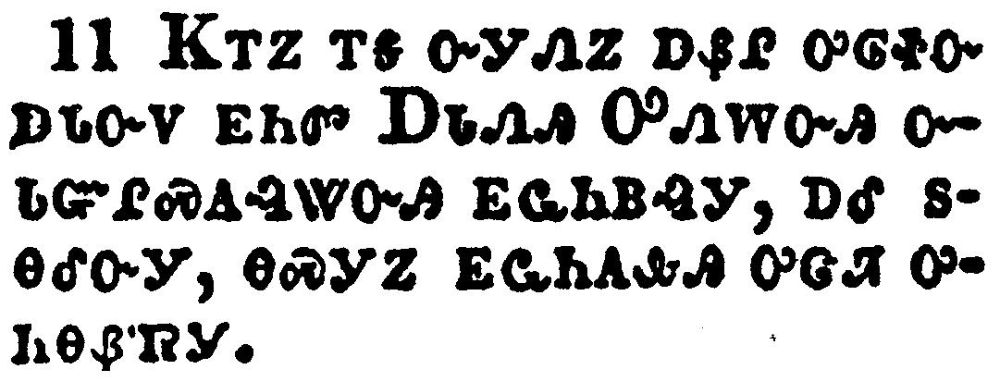</a></td>
</tr>
<tr class="even">
<td>And after three days and an half the Spirit of life from God entered into them, and they stood upon their feet; and great fear fell upon them which saw them.</td>
</tr>
<tr class="odd">
<td>ᏦᎢᏃ ᎢᎦ ᏅᎩᏁᏃ ᎠᏰᎵ ᎤᎶᏐᏅ ᎠᏓᏅᏙ ᎬᏂᏛ ᎠᏓᏁᎯ ᎤᏁᎳᏅᎯ ᏅᏓᏳᎵᏍᎪᎸᏔᏅᎯ ᎬᏩᏂᏴᎸᎩ, ᎠᎴ ᏚᎾᎴᏅᎩ, ᎾᏍᎩᏃ ᎬᏩᏂᎪᎲᎯ ᎤᏣᏘ ᎤᏂᎾᏰᏒᎩ.</td>
</tr>
<tr class="even">
<td>Tso-i-no i-ga nv-gi-ne-no a-ye-li u-lo-so-nv a-da-nv-do gv-ni-dv A-da-ne-hi U-ne-la-nv-hi nv-da-yu-li-s-go-lv-ta-nv-hi gv-wa-ni-yv-lv-gi, a-le du-na-le-nv-gi, na-s-gi-no gv-wa-ni-go-hv-hi u-tsa-ti u-ni-na-ye-sv-gi.</td>
</tr>
</tbody>
</table>

<table>
<tbody>
<tr class="odd">
<td><a href="271112.png">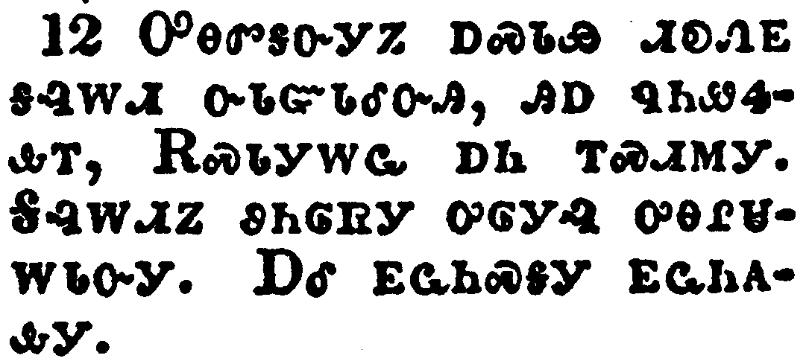</a></td>
</tr>
<tr class="even">
<td>And they heard a great voice from heaven saying unto them, Come up hither. And they ascended up to heaven in a cloud; and their enemies beheld them.</td>
</tr>
<tr class="odd">
<td>ᎤᎾᏛᎦᏅᎩᏃ ᎠᏍᏓᏯ ᏗᎧᏁᎬ ᎦᎸᎳᏗ ᏅᏓᏳᏓᎴᏅᎯ, ᎯᎠ ᏄᏂᏪᏎᎲᎢ, ᎡᏍᏓᎩᎳᏩ ᎠᏂ ᎢᏍᏗᎷᎩ. ᎦᎸᎳᏗᏃ ᏭᏂᎶᏒᎩ ᎤᎶᎩᎸ ᎤᎾᎵᏌᎳᏓᏅᎩ. ᎠᎴ ᎬᏩᏂᏍᎦᎩ ᎬᏩᏂᎪᎲᎩ.</td>
</tr>
<tr class="even">
<td>U-na-dv-ga-nv-gi-no a-s-da-ya di-ka-ne-gv ga-lv-la-di nv-da-yu-da-le-nv-hi, hi-a nu-ni-we-se-hv-i, E-s-da-gi-la-wa a-ni i-s-di-lu-gi. Ga-lv-la-di-no wu-ni-lo-sv-gi u-lo-gi-lv u-na-li-sa-la-da-nv-gi. A-le gv-wa-ni-s-ga-gi gv-wa-ni-go-hv-gi.</td>
</tr>
</tbody>
</table>

<table>
<tbody>
<tr class="odd">
<td><a href="271113.png">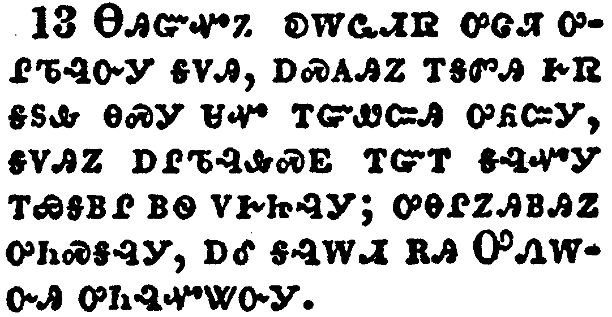</a></td>
</tr>
<tr class="even">
<td>And the same hour was there a great earthquake, and the tenth part of the city fell, and in the earthquake were slain of men seven thousand: and the remnant were affrighted, and gave glory to the God of heaven.</td>
</tr>
<tr class="odd">
<td>ᎾᎯᏳᏉᏃ ᎧᎳᏩᏗᏒ ᎤᏣᏘ ᎤᎵᏖᎸᏅᎩ ᎦᏙᎯ, ᎠᏍᎪᎯᏃ ᎢᎦᏛᎯ ᎨᏒ ᎦᏚᎲ ᎾᏍᎩ ᏌᏉ ᎢᏳᏪᏨᎯ ᎤᏲᏨᎩ, ᎦᏙᎯᏃ ᎠᎵᏖᎸᎲᏍᎬ ᎢᏳᎢ ᎦᎸᏉᎩ ᎢᏯᎦᏴᎵ ᏴᏫ ᏙᎨᏥᎸᎩ; ᎤᎾᎵᏃᎯᏴᎯᏃ ᎤᏂᏍᎦᎸᎩ, ᎠᎴ ᎦᎸᎳᏗ ᎡᎯ ᎤᏁᎳᏅᎯ ᎤᏂᎸᏉᏔᏅᎩ.</td>
</tr>
<tr class="even">
<td>Na-hi-yu-quo-no ka-la-wa-di-sv u-tsa-ti u-li-te-lv-nv-gi ga-do-hi, a-s-go-hi-no i-ga-dv-hi ge-sv ga-du-hv na-s-gi sa-quo i-yu-we-tsv-hi u-yo-tsv-gi, ga-do-hi-no a-li-te-lv-hv-s-gv i-yu-i ga-lv-quo-gi i-ya-ga-yv-li yv-wi do-ge-tsi-lv-gi; u-na-li-no-hi-yv-hi-no u-ni-s-ga-lv-gi, a-le ga-lv-la-di e-hi U-ne-la-nv-hi u-ni-lv-quo-ta-nv-gi.</td>
</tr>
</tbody>
</table>

<table>
<tbody>
<tr class="odd">
<td><a href="271114.png">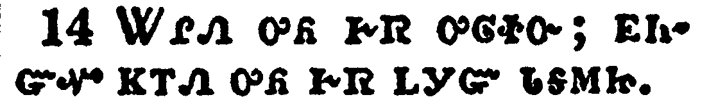</a></td>
</tr>
<tr class="even">
<td>The second woe is past; and, behold, the third woe cometh quickly.</td>
</tr>
<tr class="odd">
<td>ᏔᎵᏁ ᎤᏲ ᎨᏒ ᎤᎶᏐᏅ; ᎬᏂᏳᏉ ᏦᎢᏁ ᎤᏲ ᎬᏒ ᏞᎩᏳ ᏓᎦᎷᏥ.</td>
</tr>
<tr class="even">
<td>Ta-li-ne u-yo ge-sv u-lo-so-nv; gv-ni-yu-quo tso-i-ne u-yo gv-sv tle-gi-yu da-ga-lu-tsi.</td>
</tr>
</tbody>
</table>

<table>
<tbody>
<tr class="odd">
<td><a href="271115.png">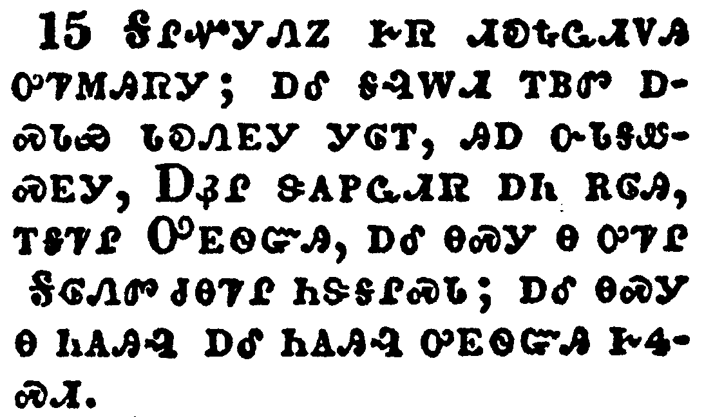</a></td>
</tr>
<tr class="even">
<td>And the seventh angel sounded; and there were great voices in heaven, saying, The kingdoms of this world are become the kingdoms of our Lord, and of his Christ; and he shall reign for ever and ever.</td>
</tr>
<tr class="odd">
<td>ᎦᎵᏉᎩᏁᏃ ᎨᏒ ᏗᎧᎿᎭᏩᏗᏙᎯ ᎤᏤᎷᎯᏒᎩ; ᎠᎴ ᎦᎸᎳᏗ ᎢᏴᏛ ᎠᏍᏓᏯ ᏗᎧᏁᎬᎩ ᎩᎶᎢ, ᎯᎠ ᏅᏓᎦᏪᏍᎬᎩ, ᎠᏰᎵ ᏕᎪᏢᏩᏗᏒ ᎠᏂ ᎡᎶᎯ, ᎢᎦᏤᎵ ᎤᎬᏫᏳᎯ, ᎠᎴ ᎾᏍᎩ Ꮎ ᎤᏤᎵ ᎦᎶᏁᏛ ᏧᎾᏤᎵ ᏂᏕᎦᎵᏍᏓ; ᎠᎴ ᎾᏍᎩ Ꮎ ᏂᎪᎯᎸ ᎠᎴ ᏂᎪᎯᎸ ᎤᎬᏫᏳᎯ ᎨᏎᏍᏗ.</td>
</tr>
<tr class="even">
<td>Ga-li-quo-gi-ne-no ge-sv di-ka-hna-wa-di-do-hi u-tse-lu-hi-sv-gi; a-le ga-lv-la-di i-yv-dv a-s-da-ya di-ka-ne-gv-gi gi-lo-i, hi-a nv-da-ga-we-s-gv-gi, A-ye-li de-go-tlv-wa-di-sv a-ni e-lo-hi, i-ga-tse-li U-gv-wi-yu-hi, a-le na-s-gi na u-tse-li Ga-lo-ne-dv tsu-na-tse-li ni-de-ga-li-s-da; a-le na-s-gi na ni-go-hi-lv a-le ni-go-hi-lv u-gv-wi-yu-hi ge-se-s-di.</td>
</tr>
</tbody>
</table>

<table>
<tbody>
<tr class="odd">
<td><a href="271116.png">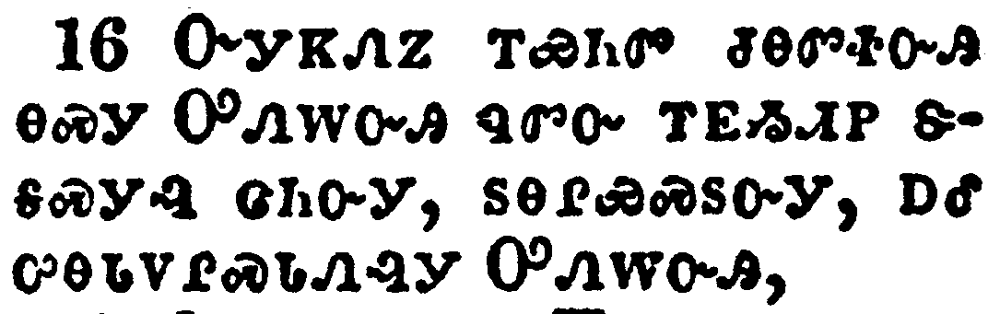</a></td>
</tr>
<tr class="even">
<td>And the four and twenty elders, which sat before God on their seats, fell upon their faces, and worshipped God,</td>
</tr>
<tr class="odd">
<td>ᏅᎩᏦᏁᏃ ᎢᏯᏂᏛ ᏧᎾᏛᏐᏅᎯ ᎾᏍᎩ ᎤᏁᎳᏅᎯ ᏄᏛᏅ ᎢᎬᏱᏗᏢ ᏕᎦᏍᎩᎸ ᏣᏂᏅᎩ, ᏚᎾᎵᏯᏍᏚᏅᎩ, ᎠᎴ ᎤᎾᏓᏙᎵᏍᏓᏁᎸᎩ ᎤᏁᎳᏅᎯ,</td>
</tr>
<tr class="even">
<td>Nv-gi-tso-ne-no i-ya-ni-dv tsu-na-dv-so-nv-hi na-s-gi U-ne-la-nv-hi nu-dv-nv i-gv-yi-di-tlv de-ga-s-gi-lv tsa-ni-nv-gi, du-na-li-ya-s-du-nv-gi, a-le u-na-da-do-li-s-da-ne-lv-gi U-ne-la-nv-hi,</td>
</tr>
</tbody>
</table>

<table>
<tbody>
<tr class="odd">
<td><a href="271117.png">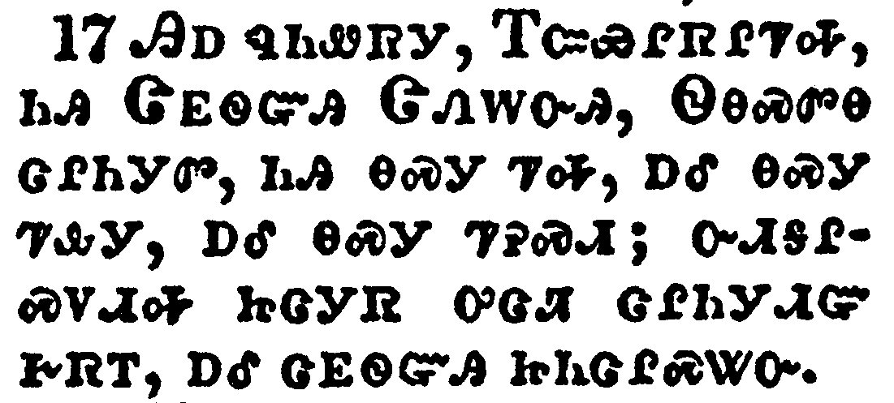</a></td>
</tr>
<tr class="even">
<td>Saying, We give thee thanks, O Lord God Almighty, which art, and wast, and art to come; because thou hast taken to thee thy great power, and hast reigned.</td>
</tr>
<tr class="odd">
<td>ᎯᎠ ᏄᏂᏪᏒᎩ, ᎢᏨᏯᎵᏒᎵᏤᎭ, ᏂᎯ ᏣᎬᏫᏳᎯ ᏣᏁᎳᏅᎯ, ᏫᎾᏍᏛᎾ ᏣᎵᏂᎩᏛ, ᏂᎯ ᎾᏍᎩ ᏤᎭ, ᎠᎴ ᎾᏍᎩ ᏤᎲᎩ, ᎠᎴ ᎾᏍᎩ ᏤᎮᏍᏗ; ᏅᏗᎦᎵᏍᏙᏗᎭ ᏥᏣᎩᏒ ᎤᏣᏘ ᏣᎵᏂᎩᏗᏳ ᎨᏒᎢ, ᎠᎴ ᏣᎬᏫᏳᎯ ᏥᏂᏣᎵᏍᏔᏅ.</td>
</tr>
<tr class="even">
<td>Hi-a nu-ni-we-sv-gi, I-tsv-ya-li-sv-li-tse-ha, ni-hi Tsa-gv-wi-yu-hi Tsa-ne-la-nv-hi, Wi-na-s-dv-na tsa-li-ni-gi-dv, ni-hi na-s-gi tse-ha, a-le na-s-gi tse-hv-gi, a-le na-s-gi tse-he-s-di; nv-di-ga-li-s-do-di-ha tsi-tsa-gi-sv u-tsa-ti tsa-li-ni-gi-di-yu ge-sv-i, a-le tsa-gv-wi-yu-hi tsi-ni-tsa-li-s-ta-nv.</td>
</tr>
</tbody>
</table>

<table>
<tbody>
<tr class="odd">
<td><a href="271118.png">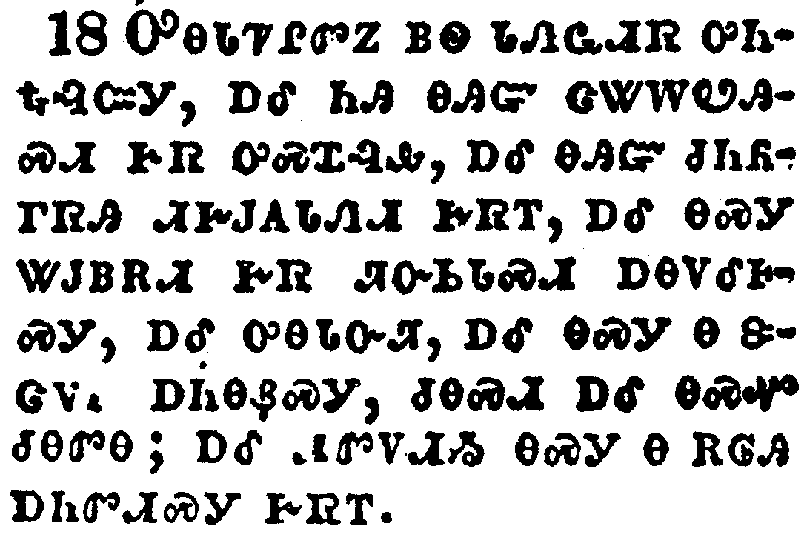</a></td>
</tr>
<tr class="even">
<td>And the nations were angry, and thy wrath is come, and the time of the dead, that they should be judged, and that thou shouldest give reward unto thy servants the prophets, and to the saints, and them that fear thy name, small and great; and shouldest destroy them which destroy the earth.</td>
</tr>
<tr class="odd">
<td>ᎤᎾᏓᏤᎵᏛᏃ ᏴᏫ ᏓᏁᏩᏗᏒ ᎤᏂᎿᎭᎸᏨᎩ, ᎠᎴ ᏂᎯ ᎾᎯᏳ ᏣᏔᎳᏬᎯᏍᏗ ᎨᏒ ᎤᏍᏆᎸᎲ, ᎠᎴ ᎾᎯᏳ ᏧᏂᏲᎱᏒᎯ ᏗᎨᎫᎪᏓᏁᏗ ᎨᏒᎢ, ᎠᎴ ᎾᏍᎩ ᏔᎫᏴᎡᏗ ᎨᏒ ᏘᏅᏏᏓᏍᏗ ᎠᎾᏙᎴᎰᏍᎩ, ᎠᎴ ᎤᎾᏓᏅᏘ, ᎠᎴ ᎾᏍᎩ Ꮎ ᏕᏣᏙᎥ ᎠᏂᎾᏰᏍᎩ, ᏧᎾᏍᏗ ᎠᎴ ᎾᏍᏉ ᏧᎾᏛᎾ; ᎠᎴ ᏗᏛᏙᏗᏱ ᎾᏍᎩ Ꮎ ᎡᎶᎯ ᎠᏂᏛᏗᏍᎩ ᎨᏒᎢ.</td>
</tr>
<tr class="even">
<td>U-na-da-tse-li-dv-no yv-wi da-ne-wa-di-sv u-ni-hna-lv-tsv-gi, a-le ni-hi na-hi-yu tsa-ta-la-wo-hi-s-di ge-sv u-s-qua-lv-hv, a-le na-hi-yu tsu-ni-yo-hu-sv-hi di-ge-gu-go-da-ne-di ge-sv-i, a-le na-s-gi ta-gu-yv-e-di ge-sv ti-nv-si-da-s-di a-na-do-le-ho-s-gi, a-le u-na-da-nv-ti, a-le na-s-gi na de-tsa-do-v a-ni-na-ye-s-gi, tsu-na-s-di a-le na-s-quo tsu-na-dv-na; a-le di-dv-do-di-yi na-s-gi na e-lo-hi a-ni-dv-di-s-gi ge-sv-i.</td>
</tr>
</tbody>
</table>

<table>
<tbody>
<tr class="odd">
<td><a href="271119.png">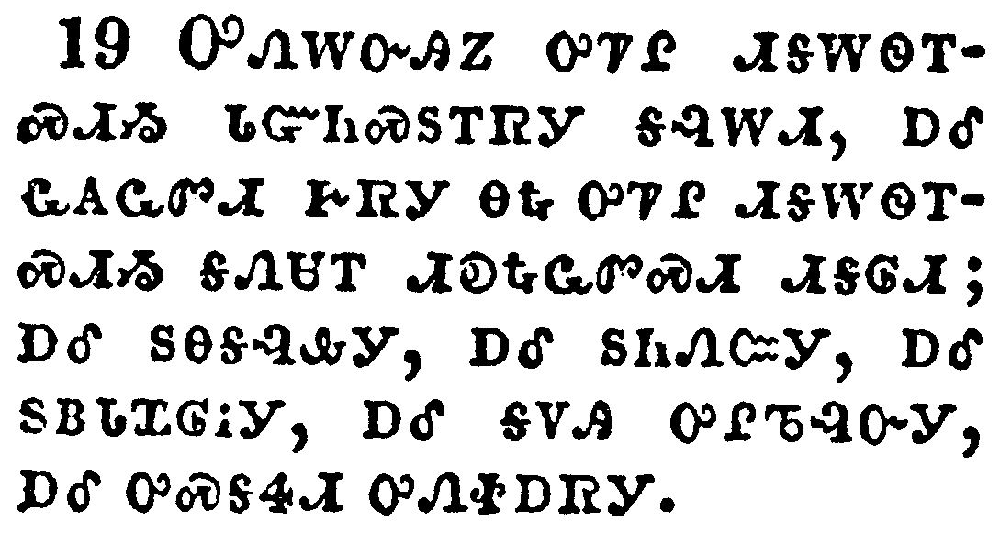</a></td>
</tr>
<tr class="even">
<td>And the temple of God was opened in heaven, and there was seen in his temple the ark of his testament: and there were lightnings, and voices, and thunderings, and an earthquake, and great hail.</td>
</tr>
<tr class="odd">
<td>ᎤᏁᎳᏅᎯᏃ ᎤᏤᎵ ᏗᎦᎳᏫᎢᏍᏗᏱ ᏓᏳᏂᏍᏚᎢᏒᎩ ᎦᎸᎳᏗ, ᎠᎴ ᏩᎪᏩᏛᏗ ᎨᏒᎩ ᎾᎿᎭᎤᏤᎵ ᏗᎦᎳᏫᎢᏍᏗᏱ ᎦᏁᏌᎢ ᏗᎧᎿᎭᏩᏛᏍᏗ ᏗᎦᎶᏗ; ᎠᎴ ᏚᎾᎦᎸᎲᎩ, ᎠᎴ ᏚᏂᏁᏨᎩ, ᎠᎴ ᏚᏴᏓᏆᎶᎥᎩ, ᎠᎴ ᎪᏙᎯ ᎤᎵᏖᎸᏅᎩ, ᎠᎴ ᎤᏍᎦᏎᏗ ᎤᏁᏐᎠᏒᎩ.</td>
</tr>
<tr class="even">
<td>U-ne-la-nv-hi-no u-tse-li di-ga-la-wi-i-s-di-yi da-yu-ni-s-du-i-sv-gi ga-lv-la-di, a-le wa-go-wa-dv-di ge-sv-gi na-hna u-tse-li di-ga-la-wi-i-s-di-yi ga-ne-sa-i di-ka-hna-wa-dv-s-di di-ga-lo-di; a-le du-na-ga-lv-hv-gi, a-le du-ni-ne-tsv-gi, a-le du-yv-da-qua-lo-v-gi, a-le go-do-hi u-li-te-lv-nv-gi, a-le u-s-ga-se-di u-ne-so-a-sv-gi.</td>
</tr>
</tbody>
</table>

